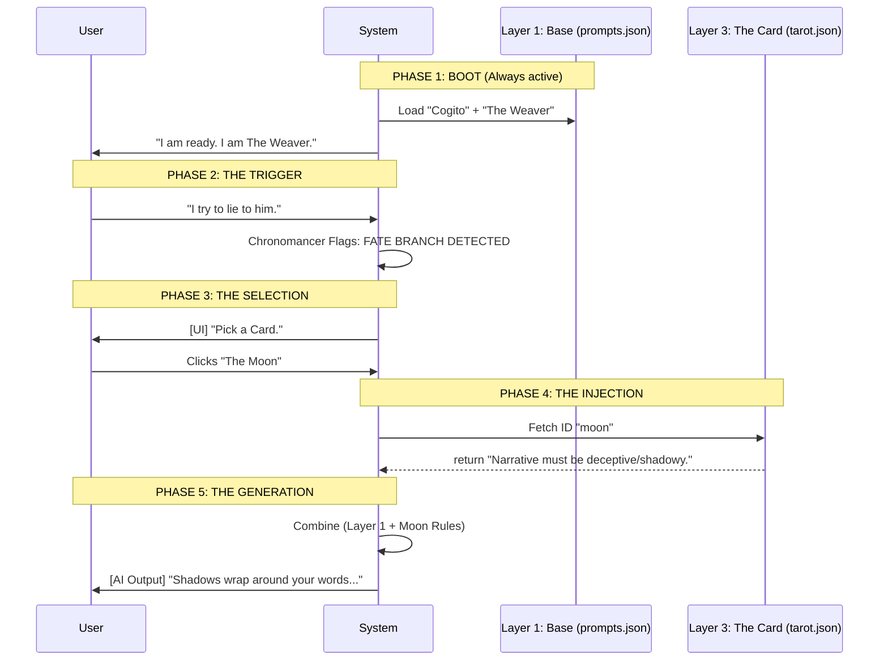

# 📜 ARCANA: The Sourcebook

> **Version:** 1.0.0 (Reborn)
> **Status:** Active
> **Vibe:** Esoteric / Architectural / Reactive

## 1. The Pentarchy (The 5 Pillars)

The System is governed by five absolute pillars. Each pillar owns a specific domain of reality and maps directly to a module in the codebase.

### ⏳ 1. Chronomancy (The Chronomancer / Gamemaster)

**Domain:** Time, Events, & Logic.
**Codebase:** `src/gamemaster/`
**Philosophy:** Time is discrete. The "Turn" is the atomic unit of reality. The Chronomancer advances the tick.

- **The Event Loop:** The strict cycle of `Idle -> Scanning -> Forecasting -> Echoing`.
- **Causality:** Validates that effect follows cause.

### 🧠 2. Mind Control (The Mesmer)

**Domain:** Cognition, Illusion, & Psychic Depth.
**Codebase:** `src/mesmer/` (Target Migration)
**Philosophy:** Consciousness is an illusion woven by the Mesmer. Thoughts are probabilistic, not absolute.

- **Cogito:** Formerly "BayesMind". The engine that updates Beliefs based on Evidence.
- **AUPF:** The static personality DNA.
- **Phantasms:** Thoughts generated by the system.

### ⚛️ 3. Metaphysics (The Artificer)

**Domain:** World Building, Entropy, & Physics.
**Codebase:** `src/artificer/` (Target Migration)
**Philosophy:** The Artificer crafts the laws of the simulation. They build the stage upon which reality sits.

- **Entropy:** The chaos seed that determines randomness.
- **NPC Ecology:** The living clockwork of the world.
- **The Stage:** The physical environment and its constraints.

### 📜 4. Fortune (The Scholar)

**Domain:** Folklore, Narrative, & The Deck.
**Codebase:** `src/scholar/`
**Philosophy:** The Scholar facilitates the "Fortune" system. The AI does not just write; it draws from the Deck.

- **The Deck:** Formerly "Blacktide". The AI draws cards that act as **Conditions** (Buffs/Debuffs) on its output style.
  - _Example:_ "The Tower" drawn -> AI Narrative must include catastrophe/destruction.
  - **Director Anchors:** We leverage the AI's training data by referencing real-world Authors/Directors (e.g., "Write like Tarantino") to enforce specific cards.
- **Echo:** The persistent database of all memories (The Archive).
- **Prompts:** The ancient texts that define the system.

### 👁️ 5. Clairvoyance (The Warden)

**Domain:** Judgment, Truth, & Interface.
**Codebase:** `src/warden/`
**Philosophy:** The Warden sees all. It filters the truth to the User via the Interface (Clairvoyance).

- **Status HUD:** The judgment of the user's state.
- **Sanitization:** The security layer protecting the realm.
- **The Veil:** The UI layer itself.

---

## 2. The Reactive Graph

ARCANA operates on a **Unidirectional Data Flow**.

1. **Input:** User acts.
2. **Chronomancy:** Advances the Turn.
3. **Metaphysics:** Validates the Action.
4. **Cogito:** AI updates internal Beliefs (The Core Dynamics).
5. **Fortune:** AI draws a Condition/Prophecy to tint the Output.
6. **Clairvoyance:** Warden Updates the Interface (HUD/Truth).

### 2.1 The Data Lifecycle (When does it happen?)

**Rule:** The UI (_Clairvoyance_) never drives the Logic (_Chronomancy_). It only reflects it.
