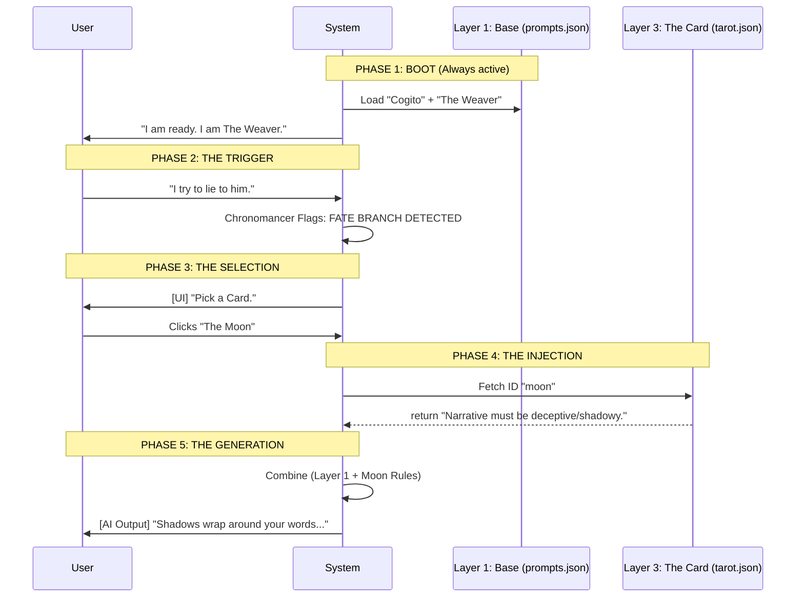

# 📚 Inspiration: ANEX & ARCANA

> **Status:** Reference Material / Inactive Modules.
> **Directive:** Use these concepts for inspiration but DO NOT implement as active code unless explicitly instructed.

## 1. ANEX Reactive Engine (Competing Standard)

ANEX is a high-fidelity narrative engine concept that we reference for specific modules.

### Key Concepts We MIGHT Steal

- **BayesMind:** Probabilistic belief updates (`P(H|E)`).
- **The Triptych:** (See `ideas/triptych-portraits.md`).
- **Sino-Logic:** Using condensed logic tokens in `<think>` blocks.
- **Somatic Dictionary:** Mapping emotions to physical sensations.

---

## 2. 📜 ARCANA: The Legacy Sourcebook

ARCANA was the early architectural blueprint for the system's "Pillars." While the specific file is retired, the terminology and unidirectional flow remain the foundation of the current implementation.

### The Pentarchy (The 5 Pillars)

The System is governed by five absolute pillars, each owning a specific domain of reality and mapping to a module in `src/`.

1. **Chronomancy (The Gamemaster)**
    - **Domain:** Time, Events, & Logic.
    - **Codebase:** `src/gamemaster/`
    - **Philosophy:** Time is discrete. The "Turn" is the atomic unit of reality.

2. **Mind Control (The Mesmer)**
    - **Domain:** Cognition, Illusion, & Psychic Depth.
    - **Codebase:** `src/mesmer/`
    - **Philosophy:** Consciousness is an illusion; thoughts are probabilistic.

3. **Metaphysics (The Artificer)**
    - **Domain:** World Building, Entropy, & Physics.
    - **Codebase:** `src/artificer/`
    - **Philosophy:** The Artificer crafts the laws and the stage upon which reality sits.

4. **Fortune (The Scholar)**
    - **Domain:** Folklore, Narrative, & The Deck.
    - **Codebase:** `src/scholar/`
    - **Philosophy:** Draws from the "Deck" (formerly Blacktide) to tint output style.

5. **Clairvoyance (The Warden)**
    - **Domain:** Judgment, Truth, & Interface.
    - **Codebase:** `src/warden/`
    - **Philosophy:** The Warden sees all, filtering truth via the UI (Status HUD).

### The Reactive Graph (Unidirectional Data Flow)

The system operates on a strict cycle:

1. **Input:** User acts.
2. **Chronomancy:** Advances the Turn.
3. **Metaphysics:** Validates the Action.
4. **Cogito:** AI updates internal Beliefs.
5. **Fortune:** AI draws a Condition/Prophecy to tint the Output.
6. **Clairvoyance:** Warden Updates the Interface.

