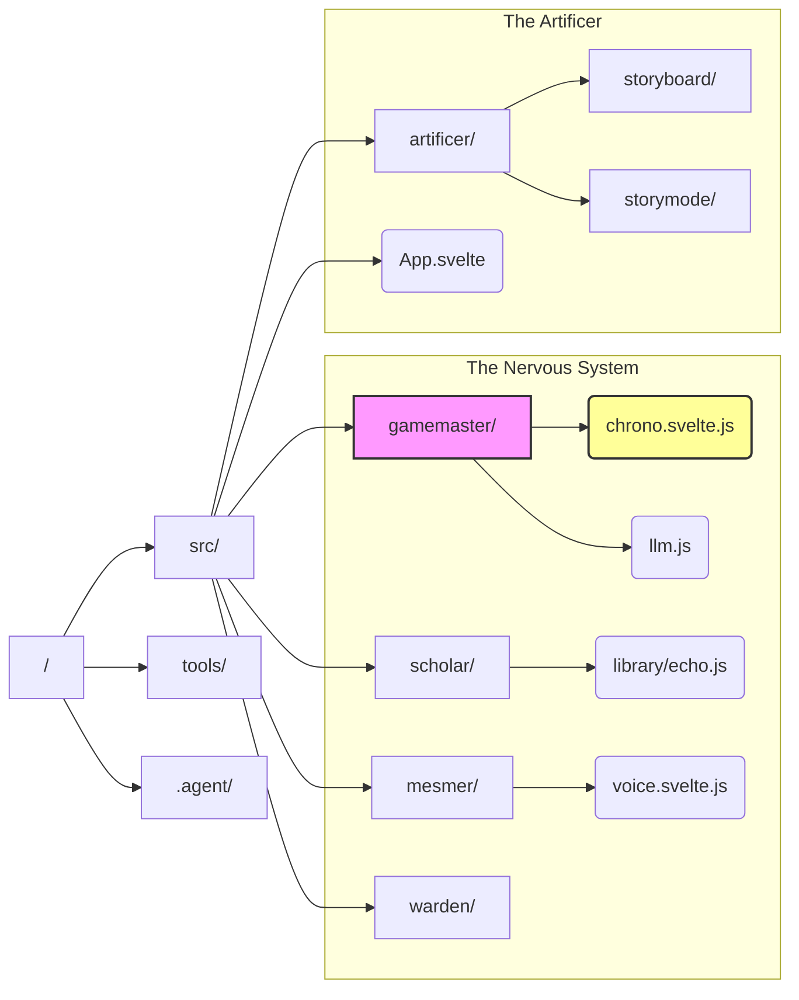

# 🏛️ The Monolith Structure (Reactive Edition)

## 1. Visual Topology

## 2. Key Files (The Nervous System)

- **Time:** `src/gamemaster/chrono.svelte.js`
- **Memory:** `src/scholar/library/echo.js`
- **Voice:** `src/mesmer/audio/voice.svelte.js`
- **Theme:** `src/mesmer/logic/theme.svelte.js`
- **Global State:** `src/artificer/state.svelte.js`

## 3. The Bridge (Perchance vs Local)

- **Perchance Panel:** Holds `window.ai` and `rpgLists` (The Platform).
- **Svelte Application:** Consumes `window.ai` via `src/gamemaster/llm.js`.
