# 📐 Visualization (Mermaid.js)

> **Context**: Diagramming standards and visual reasoning for the RPGlitch engine.
> **Tooling**: `waldzell-visual-reasoning`

## 1. 🎯 Approach

1. **Select Type**: Choose the right diagram for the data (Flow vs. State vs. Relationship).
2. **Simplify**: Avoid overcrowding nodes; use subgraphs for complex logic.
3. **Label**: Add meaningful descriptions to arrows and nodes.
4. **Test**: Verify rendering logic in a previewer before final delivery.

## 2. 📊 Diagram Expertise

| Syntax            | Use Case                                  |
| :---------------- | :---------------------------------------- |
| `graph TD`        | Flowcharts, Decision Trees, UI Routing.   |
| `sequenceDiagram` | API interactions, Actor-to-System flow.   |
| `classDiagram`    | Data models, Svelte 5 Rune relationships. |
| stateDiagram-v2   | User sessions, UI State machines.         |
| `erDiagram`       | Database schemas (Dexie.js).              |
| `gantt`           | Project timelines.                        |

## 3. 🎨 Styling Standards (Chalk Regime)

Use high-contrast lines and Chalk Regime tokens where possible (conceptually).

```mermaid
graph TD
 A[Start] -->|Action| B(Process)
 B -->|Result| C{Decision}
 C -->|Yes| D[Success]
 style A fill:#222,stroke:#fff,stroke-width:2px
 style D fill:#0f0,stroke:#333,stroke-width:2px
```

