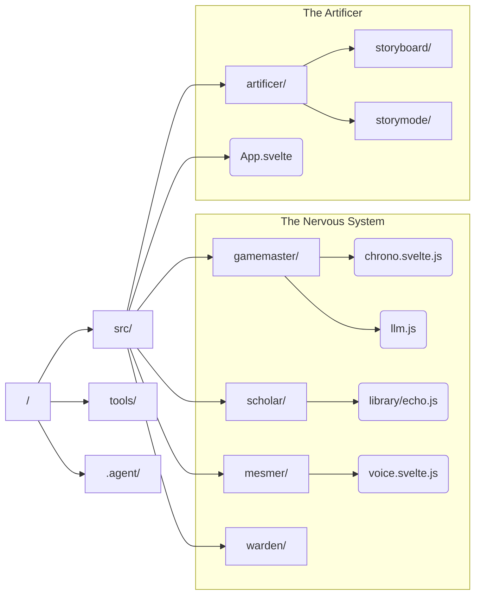

# Artificer: UI & Layout Skill

## When to use this skill

- Creating or modifying Svelte 5 components in `src/artificer/`.
- Implementing visual layouts, storyboard features, or storymode UI.
- Applying SCSS styling according to project standards.

## Workflow

1.  **Scope Assessment**: Determine if the component is atomic (Button) or composite (Panel).
2.  **Logic Definition**: Define reactive state using Svelte 5 Runes (`$state`, `$props`).
3.  **Styling Implementation**: Apply encapsulated SCSS following the 7-1 pattern.
4.  **Verification**: Validate responsiveness and touch targets (min 44x44px).

## Instructions

- **Naming**: Use `PascalCase` for all `.svelte` filenames.
- **Props**: Destructure `$props()` immediately for clarity and reactivity tracking.
- **Reactivity**: Prefer `src/artificer/state.svelte.js` for cross-component state.
- **Styles**: Use standard mixins (e.g., `%material-glass`) and avoid Tailwind or IDs for styling.

## Resources

### Visual Topology

### Key Nervous System Files

- **Time Engine**: `src/gamemaster/chrono.svelte.js`
- **Memory/Persistence**: `src/scholar/library/echo.js`
- **Voice/Audio**: `src/mesmer/audio/voice.svelte.js`
- **Visual Theme**: `src/mesmer/logic/theme.svelte.js`
- **Global State**: `src/artificer/state.svelte.js`