# 📐 Artificer Skill: Visualization

> **Context**: Diagramming standards and visual reasoning.
> **Tooling**: `mcp:waldzell-visual-reasoning`

## 1. 🎯 Approach

1.  **Select Type**: Choose the right diagram for the data.
2.  **Simplify**: Avoid overcrowding.
3.  **Label**: Add meaningful descriptions to arrows/nodes.
4.  **Test**: Verify rendering logic before delivery.

## 2. 📊 Diagram Expertise

| Syntax            | Use Case                                |
| :---------------- | :-------------------------------------- |
| `graph TD`        | Flowcharts, Decision Trees.             |
| `sequenceDiagram` | API interactions, Actor-to-System flow. |
| `classDiagram`    | Data models, Type relationships.        |
| `stateDiagram-v2` | User sessions, UI State machines.       |
| `erDiagram`       | Database schemas.                       |
| `gantt`           | Project timelines.                      |

## 3. 🎨 Styling Standards (Blueprint)

Use high-contrast lines for readability.

```mermaid
graph TD
    A[Start] -->|Action| B(Process)
    B -->|Result| C{Decision}
    C -->|Yes| D[Success]
    style A fill:#222,stroke:#fff,stroke-width:2px
    style D fill:#0f0,stroke:#333,stroke-width:2px
```

