# Mermaid.js Visual Standards

To ensure diagrams are high-density and readable across different agent context windows, follow these standards:

## 1. Diagram Types

| Syntax            | Use Case                                        |
| :---------------- | :---------------------------------------------- |
| `graph TD`        | Decision trees, skill flows, logic branching.   |
| `sequenceDiagram` | Actor-to-system or Agent-to-Agent interactions. |
| `erDiagram`       | Data relationships and Canon schemas.           |
| `stateDiagram-v2` | Session management and agent states.            |

## 2. Styling Blueprint (High Contrast)

- **Flowcharts**: Use `graph TD`. Nodes should be 1-3 words max.
- **Contrast**: Use dark backgrounds with bright stroke colors.
- **Complexity**: Maximum 10 nodes per diagram; use sub-graphs for more.
- **Styling**: Use strict styling to ensure readability in terminal-based previews.

```mermaid
graph TD
    A[Start] -->|Action| B(Process)
    B -->|Result| C{Decision}
    C -->|Yes| D[Success]

    style A fill:#222,stroke:#fff,stroke-width:2px
    style D fill:#0f0,stroke:#333,stroke-width:2px

```

## 3. Anti-Patterns

- **Overcrowding**: Do not put more than 10 nodes in a single diagram. Split into sub-graphs.
- **Prose in Nodes**: Keep node text to 1-3 words (e.g., "Validate Input" not "The agent validates the user input").
