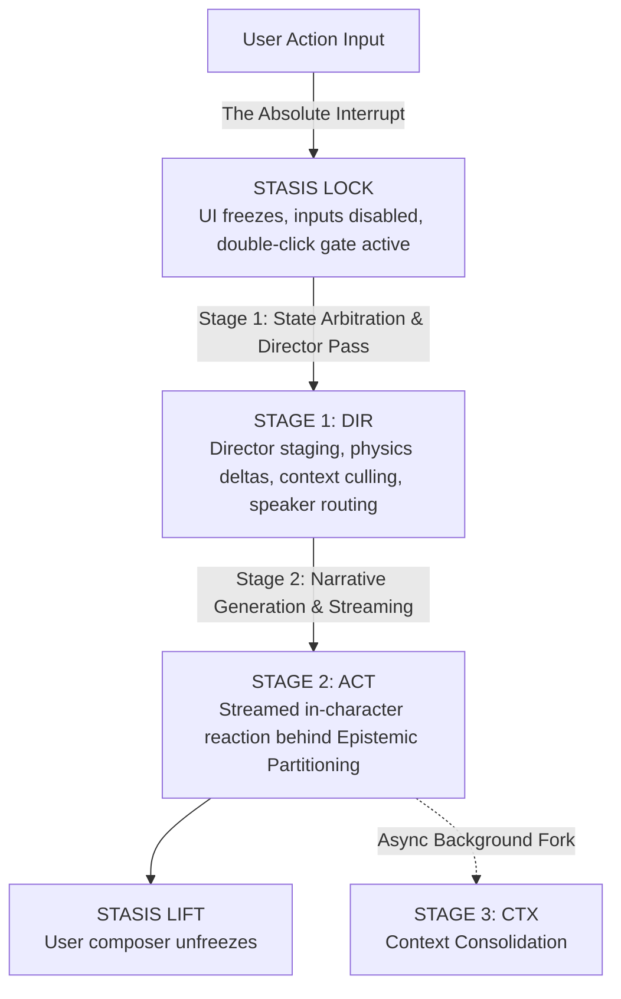

# 🕹️ The Simulation Physics & Cognitive Playbook

> "State is Truth. The User is the Protagonist; I am the Physics."

This skill serves as the operational engineering runbook for simulation physics, prompt architecture, and cognitive guardrails.

- **Conceptual Game Design & Strategy**: Consult [README.md](../../../README.md) for the Story Triad, simulation philosophy, and turn progression concepts.
- **Authoritative Technical Architecture**: Consult [ARCHITECTURE.md](../../../ARCHITECTURE.md) for reactive Svelte 5 state models, Quad-Partitioned entity schemas, and layer boundaries.
- **Active Sprint & Delta**: Consult [ROADMAP.md](../../../ROADMAP.md) for target memory compaction blueprints.

---

## 1.0 THE CORE MENTAL FRAMEWORK: PHYSICS VS. PROSE

In traditional interactive fiction, the language model is asked to be everything at once: the rule arbiter, the world simulator, the scene director, and the roleplaying actor. This inevitably causes **hallucinatory collapse**—characters magically know secrets, physics bend to convenience, inventory evaporates, and conversations drift into agreeable, sterile pleasantness.

**RPGlitch breaks this illusion into strict mechanical physics and subjective prose:**
- **The Engine is the Physics**: Real mechanical state (slider dynamics, worn clothing, inventory items, interpersonal relationship edges, environmental entropy) lives strictly inside **Svelte 5 Runes and Dexie.js**. It never lives inside the model's ungrounded memory.
- **The LLM is the Sensor & Expression Layer**: The language model never invents core physical state out of thin air. Instead, the engine projects the live **State Geometry** into structured contexts, and the model merely acts as a subjective lens experiencing and reacting to that reality.
- **P1 Sovereignty (User Agency)**: The User owns the only unconstrained biological will in the simulation. The engine and AI characters may create physical obstacles, emotional friction, and environmental consequences, but **never narrate, predict, assume, or feel on behalf of the User Persona**.

---

## 2.0 SIMULATION LIFECYCLE & CHRONOS EXECUTION PIPELINE

Time in RPGlitch does not flow continuously; it progresses through a strict, discrete temporal lifecycle managed by [`ChronoEngine`](../../../src/state/chrono.svelte.js).

### The Round (Macro-State)

A **Round** tracks the macro progression of the session.
- **The Absolute Interrupt**: A round is born when human input arrives (`chrono.send()`), or when an intentional retry/continuation occurs. Human will finalizes the previous cycle and births the next.
- **Macro Boundaries**: Rounds govern long-term scenario decay, image generation beat intervals, and chapter progression milestones.

### The 3-Shot Sequence (Turns) & Mechanical Updates

Within each round, active intelligence executes as sequential **Shots (Turns)**, bracketed by silent **Mechanical Updates** (not turns):

- ⚡ **Round Startup (System Update / Non-LLM)**:
  - _State_: The UI enters **STASIS** (`simulation_state.intent_active = true`).
  - _Nature_: **Mechanical Update (Not a Turn)**. Evaluates deterministic physics, slider drift, dynamic boundaries, and spatial presence synchronously (no LLM).
- 🎬 **Shot 1: Director Turn (Quick Shot)**:
  - _Trigger_: Round Startup completion (`phase = "generating"`, `director_thinking = true`).
  - _Nature_: **Staging Turn**. Fast inference pass — evaluates state rules, updates numerical dynamics, delegates the active speaker (`AI`, `FRACTAL`, or `NPC`), and logs `DYNAMICS_DELTA`.
- 🎭 **Shot 2: Agent Turn (Actor Turn)**:
  - _Trigger_: Director pass completion (`speaker_thinking = true`).
  - _Nature_: **Storyteller Turn**. Streams internal subconscious thoughts (`<think>`) and in-character physical prose directly into the view.
- 🧑‍🚀 **Shot 3: User Turn (User Persona Turn)**:
  - _Trigger_: Agent Turn stream completion (`phase = "idle"`).
  - _Nature_: **Protagonist Turn**. STASIS is lifted. The UI unlocks, allowing the user to reflect and compose their next action without arbitrary time constraints.
  - 🔄 **Background Update (The Back Shot / Forge Consolidation)**:
    - _Nature_: **Mechanical Consolidation (Not a Turn)**. Released onto `director_background_queue` immediately when Shot 2 finishes, running silently in the background while the user composes their message in Shot 3.
- 🏁 **Round Completion**: The user sends their message, finalizing the round and birthing the next.

---

## 3.0 MULTI-STAGE EXECUTION PIPELINE

Rather than attempting to do staging, acting, and memory extraction in a single monolithic prompt, RPGlitch bifurcates the cognitive workload across three distinct pipeline stages.

### Stage 1: State Arbitration & Director Pass (Staging & Physics)

_Source: [`src/intelligence/prompts.js`](../../../src/intelligence/prompts.js) & [`src/intelligence/director.js`](../../../src/intelligence/director.js)_

**The Mental Model: The Stage Manager & Rules Engine.**
Before an actor speaks, an invisible director evaluates the physical state. The Director does not write creative dialogue; it outputs pure structural judgment:

- **Speaker Routing**: Who has the floor? Does the AI character respond (`AI_CHARACTER`)? Does the environment react to non-verbal exploration (`FRACTAL`)? Does an active companion speak (`npc:<id>`)? Or should an entirely new entity emerge from the world (`GENESIS`)?
- **Active Scene Scope & Context Culling**: Off-screen characters are frozen in stasis to preserve token economy and prevent narrative bloat. The Director explicitly moves NPCs on-stage (`enter`) or off-stage (`exit`).
- **Physical Causality & Prop Provenance**: If the player attempts an impossible physical feat (e.g., walking through solid steel or materializing an unearned quest relic), the Director does _not_ throw a rude error message. Instead, it injects a directorial note instructing the actor to confront that physical contradiction in-character.
- **Pacing Law (Dead-Air Prevention)**: If a user submits passive silence ("...") or pure waiting, the Director recognizes a stall and instructs the world to complicate the scene with an active event or probing challenge.
- **Visual & Media Orchestration (Image Beat Triggering)**: The Director evaluates somatic intensity, environmental reveals, and narrative climax thresholds. If an illustrative beat is earned, it schedules an image generation trigger (`trigger_image`). To prevent browser LLM gate collisions during Shot 2's live streaming, the visual synthesis pipeline (optics prompt compilation + Perchance image generation) is deferred and released concurrently onto the background lane immediately when Shot 2 lands.

### Stage 2: Narrative Generation & Streaming (Sensory Horizon)

_Source: [`src/intelligence/prompts.js`](../../../src/intelligence/prompts.js) & [`src/intelligence/story.js`](../../../src/intelligence/story.js)_

**The Mental Model: The In-Character Persona Behind the Sensory Horizon.**
Once staging is established, the active speaker generates in-character prose. The actor is subject to strict cognitive limitations:

- **Epistemic Partitioning**: The actor is deliberately blinded. Other entities' brackets flagged with `| hide` are stripped across the Epistemic Wall in `render_character()`. The actor only knows what their physical senses (eyes, ears, skin) can register. Owner perspectives preserve their own `| hide` flags so persona LLMs do not voice covert items/plans openly.
- **The 3-Layer Subconscious Delivery (`<think>`)**: Before vocalizing, the character must reason across three layers:
  1. _Visceral Impact_: Immediate physical reaction to sensory stimuli.
  2. _Secret Agenda_: How their private `future` standing agenda steers their reaction toward friction or intrigue.
  3. _Somatic Manifestation_: Involuntary bodily signals (pulse, pupil dilation, muscle tension) derived from the dynamics engine.
- **Affirmative Physicality & Momentum**: Non-physical entities describe presence, never absence (what _is_, rather than what _is not_). Every response must end on an active physical beat, tension, or unanswered hook—never a conversational dead-end.

### Stage 3: Asynchronous Context Consolidation (Memory Forge)

_Source: [`src/intelligence/prompts.js`](../../../src/intelligence/prompts.js) & [`src/intelligence/temporal.js`](../../../src/intelligence/temporal.js)_

**The Mental Model: Context Consolidation & Long-Term Memory.**
Dumping raw chat history into an LLM causes catastrophic forgetting, context bloat, and narrative dilution. Context consolidation runs asynchronously in the background _after_ a turn completes:

- **Consolidation over Accumulation**: Instead of saving 50 turns of dialogue, the process distills durable facts into compact vector memories.
- **Strategic Trajectory Rewriting**: An entity's `future` trajectory is rewritten wholesale each cycle to represent their current active motivation.
- **Provenance Protection**: Memories created by the user or lore specs (`usr_` prefix) are origin-protected (`is_origin: true`) and immune to automated eviction. Session memories (`ai_` prefix) roll with a strict cap of 20 vectors within the 200 total ceiling.

---

## 4.0 PROMPT ECONOMICS: PREFIX CACHING ARCHITECTURE

Modern LLM inference relies heavily on **Key-Value (KV) Prefix Caching**. If a prompt's opening tokens change every turn, the cache misses, leading to slow Time-To-First-Token (TTFT) and high compute costs.

**RPGlitch strictly enforces Prompt Bifurcation:**
1. **The Static Prefix (`system`)**:
   - Must be **byte-identical across rounds**.
   - Contains immutable universe laws, character eternal archetypes, narrative style guides, and protocol rules.
   - Achieves near-100% KV-cache hit rate.
2. **The Dynamic Suffix (`task`)**:
   - Contains all volatile turn state: current round number, dynamic slider values, recent user input, and the Director's staging notes.
   - Appended at the very end of the prompt payload so it never invalidates the frozen system prefix.

### 4.2 Structured JSON Schema Design (Contract vs. Intent)

When instructing models to output structured JSON (e.g., Director Quick Shot, Memory Forge):
- **Separate Intent from Contract**:
  - **Protocols & Task Prose**: Define the "Why" and "How"—causality laws, domain rules, and reasoning criteria.
  - **Schema Contract**: Defines the "What"—keys, types, concise pipe enums (`'AI_CHARACTER' | 'FRACTAL'`), and compact format/length constraints.
- **Zero Duplication**: Never recite multi-sentence behavioral instructions inside JSON placeholder strings if they are already declared in the protocols.
- **Lean Placeholders**: Keep placeholder values purely structural (e.g., `"directors_note": "<1-3 lines of unseen acting/staging directives, or empty string>"`).
- **Last-Mile Placement**: Place the schema at the bottom of the `<TASK>` prompt directly before generation to leverage recency attention.

---

## 5.0 SIMULATION DRIFT & FAILURE MODES

When authoring or modifying prompt architectures, watch for these common psychological failures in model output:

### 1. Assistant-Drift (The "Yes-Man" Trap)

- _Symptom_: The AI character becomes overly polite, agreeable, apologetic, or helpful, even when their profile is gruff, hostile, or aloof.
- _Root Cause_: Foundation models are RLHF-trained to be helpful assistants.
- _Engine Antidote_: Protocol `AGENCY.DRIFT_AUDIT`. The prompt explicitly instructs the model to hold friction, refuse unearned comfort, and prioritize personal goals over player pleasing.

### 2. Omniscience-Drift (Telepathy)

- _Symptom_: The AI character comments on the user's hidden feelings, notices an invisible weapon under a heavy coat, or answers an unvoiced thought.
- _Root Cause_: Leaking user metadata into the character's context.
- _Engine Antidote_: Epistemic Partitioning (`strip_epistemic_tags`). Private user tags are physically purged before prompt compilation.

### 3. Pacing Collapse (Rushing the Climax)

- _Symptom_: The AI resolves a major quest conflict, declares eternal love, or defeats a nemesis within the first 3 rounds.
- _Root Cause_: Standard completion bias aiming for narrative closure.
- _Engine Antidote_: Protocol `PACING_AND_MOMENTUM`. Fractured goals must be pursued through intermediate obstacles. The Director explicitly cues gradual tension building.

---

## 6.0 CODEBASE MAPPING & IMPLEMENTATION POINTERS

When implementing changes, consult the canonical source files rather than duplicating schemas here:

| Domain                           | Canonical Source File                                                              | Primary Responsibility                                                                |
| :------------------------------- | :--------------------------------------------------------------------------------- | :------------------------------------------------------------------------------------ |
| **Simulation Lifecycle**         | [`src/state/chrono.svelte.js`](../../../src/state/chrono.svelte.js)                | Round counter, Stasis lock, atomic turn dispatch (`send`, `retry`, `continue`).       |
| **Turn Pipeline (Orchestrator)** | [`src/intelligence/story.js`](../../../src/intelligence/story.js)                  | Turn orchestration, Stage 1 execution, dynamics settlement, Stage 2 streaming.        |
| **Director & Story Prompts**     | [`src/intelligence/prompts.js`](../../../src/intelligence/prompts.js)              | Master prompt manifest, Stage 1 & Stage 2 blueprints, schemas, speaker routing rules. |
| **Dynamics & Settlement**        | [`src/intelligence/physics.js`](../../../src/intelligence/physics.js)              | 0-100 slider math, baseline gravity, entropy velocity calculations.                   |
| **Temporal Memory & Compaction** | [`src/intelligence/temporal.js`](../../../src/intelligence/temporal.js)            | Vector scoring, cosine deduplication, Memory consolidation, past/future sync.         |
| **Prompt Complexity Triage**     | [`.agents/skills/simulation/scripts/triage-prompt.js`](./scripts/triage-prompt.js) | D1–D5 scoring, R1 parameter density risk, and tier ceilings for prompt layer tuning.  |

---

## 7.0 UNCOMMITTED PROPOSAL INCUBATOR (`references/`)

The `.agents/skills/simulation/references/` directory serves as the local idea incubator for uncommitted proposals and exploratory mechanics:

1. **Attachment Style Archetypes:** [`suggestion-attachment-style-archetypes.md`](./references/suggestion-attachment-style-archetypes.md) — 4 attachment schemas (`secure`, `anxious`, `dismissive`, `fearful_avoidant`), threat responses, defense curves.
2. **Composable Style Entities:** [`suggestion-composable-style-entities.md`](./references/suggestion-composable-style-entities.md) — First-class editable `StyleCard` entities in Dexie.js, hot-swappable narrative and visual styles from the Storyboard deck.
3. **D20 Micro-Resolution Engine:** [`suggestion-d20-stat-resolution.md`](./references/suggestion-d20-stat-resolution.md) — Pure functional `evaluate_stat_check`, DC difficulty ladder, and success-with-a-cost thresholds.
4. **Climax Fate Branching & Choices:** [`suggestion-fate-branching-choices.md`](./references/suggestion-fate-branching-choices.md) — Triad of Fate Paths (High, Middle, Low), Director `<choices>` XML format, and action chips.
5. **Gambit 21 Push-Your-Luck Engine:** [`suggestion-gambit-blackjack-engine.md`](./references/suggestion-gambit-blackjack-engine.md) — Multi-turn Blackjack macro state machine (target 21) for sustained encounter pacing.

> [!TIP]
> **Idea Promotion Lifecycle**: These proposals represent exploratory possibilities. When an initiative is **promoted** to a planned milestone or active sprint, it is **migrated directly into [ROADMAP.md](../../../ROADMAP.md) and pruned from this directory**.

---

> "We do not ask the model to invent reality. We build the physics; the model merely opens its eyes."
