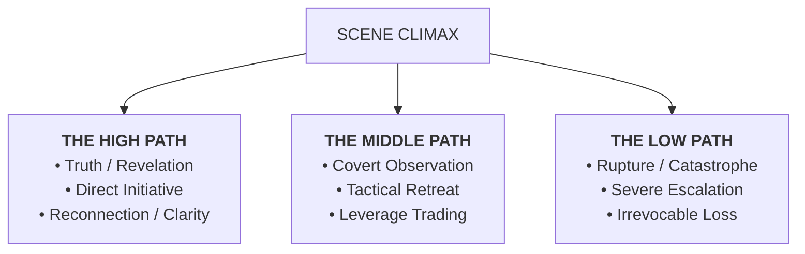

# Suggestion: Climax Fate Branching & Choice Chip Payloads (`<choices>`)

> **Status:** Backlog Proposal  
> **Domain:** Narrative Direction, Climax Branching & Interactive UI  
> **Scope:** Triad of Fate Paths (High / Middle / Low), Director `<choices>` XML Payload, Action Chip UI  

---

## 1. Core Thesis

At major scene climaxes, narrative pacing benefits from offering the player meaningful, divergent tactical choices rather than a single open prompt.

This specification formalizes **Climax Fate Branching** and the **`<choices>` XML format** emitted by the Director to populate interactive choice chips in the player UI.

---

## 2. The Triad of Fate Paths

At narrative climax turns, the Director structures 3 archetypal paths with distinct consequences:



---

## 3. Director `<choices>` XML Payload Format

When the Director detects a climax or turning point, it appends a `<choices>` block to its JSON output:

```xml
<choices>
  <opt1>The Direct Assault | Step from the shadows and demand answers openly. | high</opt1>
  <opt2>The Subterfuge | Slip through the drainage conduit while the sentry looks away. | middle</opt2>
  <opt3>The Ambush | Prepare a heavy ambush behind the blast door. | low</opt3>
</choices>
```

### Format Rules
- **Structure:** `<opt1>`, `<opt2>`, `<opt3>` nodes.
- **Pipe-Delimited Fields:** `Title | Short Description | Path Tier (high|middle|low)`.
- **Character Budget:** Max 120 characters per option to fit cleanly on mobile action chips.

---

## 4. UI Rendering & Interaction Flow

1. **Parser Extraction (`parser.js`)**:
   - `extract_choices_block(text)` extracts options into an array `[{ id: 'opt1', title, desc, tier }]`.
2. **Storymode Action Chips (`Console.svelte` / `Body.svelte`)**:
   - Renders interactive chips above the input textarea.
   - Clicking a choice chip prefills the player input or auto-submits the chosen action payload.
