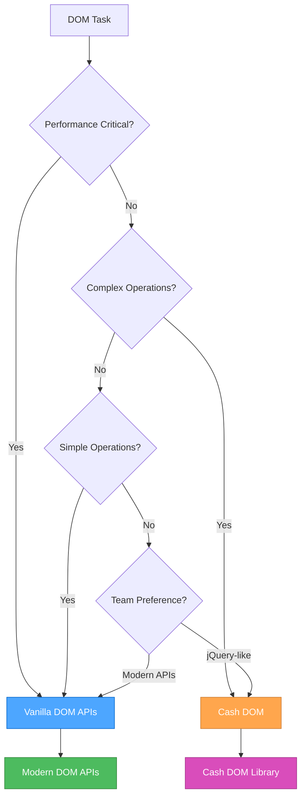
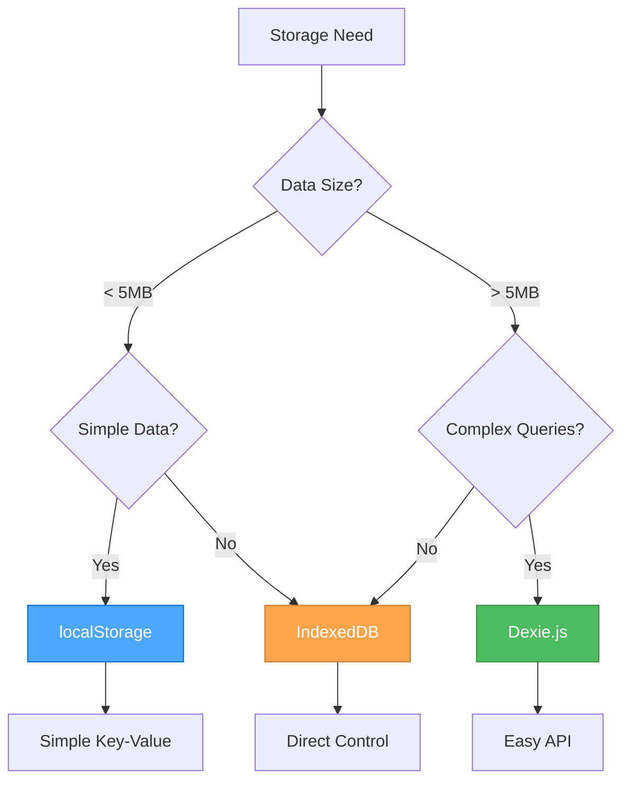

# JavaScript Ecosystem Overview

## 🎯 **Unified Decision Framework**

This overview provides clear guidance on when to use each JavaScript approach in your projects.

## 📊 **Approach Selection Matrix**

| Task Type | Primary Approach | Secondary Approach | Key Considerations |
|-----------|------------------|-------------------|-------------------|
| **Simple DOM Operations** | Vanilla DOM | Cash DOM | Performance vs convenience |
| **Complex DOM Manipulation** | Cash DOM | Vanilla DOM | Chaining vs control |
| **Modern Features** | ES2023+ | Polyfills | Browser support |
| **Client Storage (Simple)** | localStorage | Session Storage | Data persistence needs |
| **Client Storage (Complex)** | IndexedDB + Dexie.js | localStorage | Data complexity & size |
| **HTTP Requests** | Fetch API | XMLHttpRequest | Modern vs legacy support |
| **Performance Critical** | Vanilla JS | Optimized libraries | Bundle size & speed |
| **Rapid Development** | Libraries | Vanilla JS | Development speed vs control |

## 🧠 **Thinking Framework**

### **Ask These Questions:**

1. **Performance Requirements**
   - Is this performance-critical code?
   - Do we need minimal bundle size?
   - Are we targeting modern browsers?

2. **Development Speed**
   - Do we need rapid prototyping?
   - Is this a one-off project or long-term maintenance?
   - What's the team's expertise level?

3. **Browser Support**
   - What browsers do we need to support?
   - Can we use modern APIs?
   - Do we need polyfills?

4. **Project Context**
   - Is this a Perchance project?
   - Are we building a library or application?
   - What's the project's complexity level?

## 🎨 **DOM Manipulation Decision Tree**



## 💾 **Storage Decision Tree**



## 🚀 **Modern JavaScript Features Decision**

### **When to Use ES2023+ Features:**

**✅ Use Modern Features When:**

- Targeting modern browsers (Chrome 90+, Firefox 88+, Safari 14+)
- Building new applications
- Performance is important
- Bundle size matters
- Team is comfortable with modern syntax

**⚠️ Consider Polyfills When:**

- Supporting older browsers
- Using cutting-edge features
- Need to maintain compatibility

**❌ Avoid When:**

- Supporting very old browsers (IE11 and below)
- Team lacks modern JavaScript experience
- Project requires maximum compatibility

## 📋 **Implementation Guidelines**

### **For New Projects:**

1. **Start with Modern JavaScript**
   - Use ES2023+ features
   - Leverage modern DOM APIs
   - Implement proper error handling

2. **Choose Storage Based on Data**
   - Simple data → localStorage
   - Complex data → IndexedDB + Dexie.js

3. **Select DOM Approach**
   - Simple operations → Vanilla DOM
   - Complex operations → Cash DOM

### **For Existing Projects:**

1. **Assess Current State**
   - Review existing patterns
   - Identify performance bottlenecks
   - Understand team preferences

2. **Gradual Migration**
   - Start with new features
   - Refactor critical paths
   - Maintain backward compatibility

3. **Document Decisions**
   - Record approach choices
   - Explain rationale
   - Update team guidelines

## 🔧 **Tool Integration**

### **Perchance-Specific Considerations:**

```javascript
// Perchance projects often benefit from:
// 1. Cash DOM for quick DOM manipulation
// 2. localStorage for simple settings
// 3. IndexedDB + Dexie.js for character data
// 4. Modern JavaScript features for better code

// Example: Perchance character storage
const characterStorage = {
  // Simple settings in localStorage
  saveSettings(settings) {
    localStorage.setItem('perchance-settings', JSON.stringify(settings));
  },
  
  // Complex character data in IndexedDB
  async saveCharacter(character) {
    return await db.characters.add(character);
  },
  
  // Quick DOM updates with Cash DOM
  updateUI(character) {
    $('#character-name').text(character.name);
    $('#character-level').text(character.level);
  }
};
```

### **Modern Web App Considerations:**

```javascript
// Modern web apps often benefit from:
// 1. Vanilla DOM for performance
// 2. Modern JavaScript features
// 3. IndexedDB for complex data
// 4. Service Workers for offline support

// Example: Modern web app patterns
class ModernApp {
  constructor() {
    this.useModernAPIs = this.checkModernSupport();
    this.storage = this.useModernAPIs ? new IndexedDBStorage() : new LocalStorage();
  }
  
  checkModernSupport() {
    return 'indexedDB' in window && 'fetch' in window;
  }
  
  async initialize() {
    if (this.useModernAPIs) {
      await this.setupServiceWorker();
      await this.setupIndexedDB();
    }
  }
}
```

## 📊 **Performance Comparison**

### **Bundle Size Impact:**

| Approach | Bundle Size | Performance | Developer Experience |
|----------|-------------|-------------|---------------------|
| **Vanilla JS** | Minimal | Excellent | Good (with experience) |
| **Cash DOM** | ~3KB | Good | Excellent |
| **Dexie.js** | ~15KB | Good | Excellent |
| **Full jQuery** | ~30KB | Fair | Excellent |

### **Performance Benchmarks:**

```javascript
// DOM manipulation performance (operations/second)
// Vanilla DOM: ~10,000 ops/sec
// Cash DOM: ~8,000 ops/sec
// jQuery: ~6,000 ops/sec

// Storage performance (read operations/second)
// localStorage: ~100,000 ops/sec
// IndexedDB: ~50,000 ops/sec
// Dexie.js: ~45,000 ops/sec
```

## 🎯 **Best Practices Summary**

### **DO:**

- Choose the right tool for the job
- Consider performance requirements
- Factor in team expertise
- Plan for future maintenance
- Document your decisions
- Test across target browsers

### **DON'T:**

- Use libraries just because they're popular
- Ignore bundle size impact
- Over-engineer simple solutions
- Mix approaches inconsistently
- Forget about browser support
- Skip performance testing

## 🔄 **Migration Strategies**

### **From jQuery to Modern:**

1. **Replace selectors**: `$('#id')` → `document.querySelector('#id')`
2. **Replace methods**: `.addClass()` → `.classList.add()`
3. **Replace events**: `.on('click')` → `.addEventListener('click')`
4. **Replace AJAX**: `.ajax()` → `fetch()`

### **From localStorage to IndexedDB:**

1. **Create migration utility**
2. **Transfer data gradually**
3. **Maintain backward compatibility**
4. **Update storage interfaces**

---

## References

- [Modern JavaScript Features](./js-modern-features.mdc) - ES2023+ features
- [DOM Manipulation](./js-dom-manipulation.mdc) - Vanilla DOM APIs
- [Cash DOM Usage](./js-cash-dom-usage.mdc) - jQuery-like DOM manipulation
- [Storage Strategy](./js-storage-strategy.mdc) - Client-side storage approaches
- [Dexie.js Usage](./js-dexie-usage.mdc) - IndexedDB with Dexie.js
- [IndexedDB Principles](./js-indexeddb-principles.mdc) - IndexedDB best practices
- [Modern APIs](./js-modern-apis.mdc) - Modern browser APIs
- [Patterns & Practices](./js-patterns-practices.mdc) - JavaScript best practices
