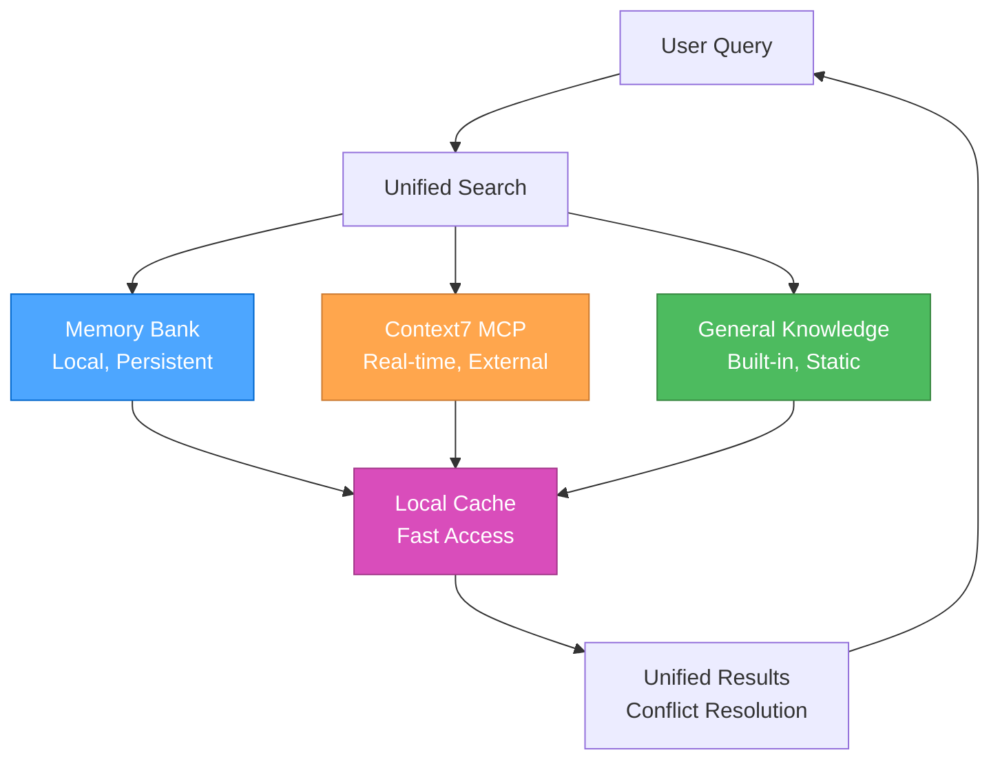

# Unified Documentation System

## Overview

This system provides seamless access to documentation across multiple sources with intelligent conflict resolution and performance optimization. It combines local Memory Bank storage with real-time Context7 access for comprehensive documentation coverage.

## 🎯 **SYSTEM ARCHITECTURE**

### **Documentation Sources**



### **Source Hierarchy**

1. **Memory Bank** (Local, Persistent)
   - Project-specific knowledge
   - Historical decisions and patterns
   - User preferences and learnings
   - Fast access, always available

2. **Context7 MCP** (Real-time, External)
   - Current library documentation
   - API references and examples
   - Best practices and guides
   - Up-to-date information

3. **General Knowledge** (Built-in, Static)
   - System documentation
   - Core concepts and principles
   - Troubleshooting guides
   - Fallback information

## 🔄 **INTELLIGENT CONFLICT RESOLUTION**

### **Conflict Detection**

```javascript
const conflictResolver = {
  detectConflicts(memoryData, context7Data, generalData) {
    const conflicts = [];
    
    // Check for contradictory information
    if (memoryData && context7Data && memoryData.version !== context7Data.version) {
      conflicts.push({
        type: 'version_mismatch',
        memory: memoryData,
        context7: context7Data,
        priority: 'high'
      });
    }
    
    // Check for outdated information
    if (memoryData && this.isOutdated(memoryData.timestamp)) {
      conflicts.push({
        type: 'outdated',
        source: 'memory',
        data: memoryData,
        priority: 'medium'
      });
    }
    
    return conflicts;
  },
  
  resolveConflicts(conflicts) {
    return conflicts.map(conflict => {
      switch (conflict.type) {
        case 'version_mismatch':
          return this.resolveVersionMismatch(conflict);
        case 'outdated':
          return this.resolveOutdated(conflict);
        default:
          return this.resolveGeneric(conflict);
      }
    });
  }
};
```

### **Resolution Strategies**

#### **Version Mismatch Resolution**

- **Priority**: Context7 > Memory Bank > General Knowledge
- **Action**: Update Memory Bank with current Context7 data
- **Notification**: Alert user of the update

#### **Outdated Information Resolution**

- **Priority**: Fetch fresh data from Context7
- **Action**: Replace outdated information
- **Notification**: Mark as updated

#### **Generic Conflict Resolution**

- **Priority**: Source hierarchy (Context7 > Memory > General)
- **Action**: Use highest priority source
- **Notification**: Log conflict for review

## 📊 **PERFORMANCE OPTIMIZATION**

### **Caching Strategy**

```javascript
const documentationCache = {
  memory: new Map(),
  external: new Map(),
  general: new Map(),
  
  async get(key, source) {
    const cache = this[source];
    
    if (cache.has(key)) {
      const entry = cache.get(key);
      if (this.isValid(entry)) {
        return entry.data;
      }
    }
    
    const data = await this.fetch(key, source);
    cache.set(key, {
      data: data,
      timestamp: Date.now(),
      ttl: this.getTTL(source)
    });
    
    return data;
  },
  
  getTTL(source) {
    const ttlMap = {
      memory: 24 * 60 * 60 * 1000, // 24 hours
      external: 60 * 60 * 1000,    // 1 hour
      general: 7 * 24 * 60 * 60 * 1000 // 1 week
    };
    return ttlMap[source] || 60 * 60 * 1000;
  }
};
```

### **Performance Metrics**

#### **Key Performance Indicators**

- **Search Speed**: Time to retrieve information from all sources
- **Cache Hit Rate**: Percentage of cached information usage
- **Conflict Resolution Time**: Time to resolve information conflicts
- **User Satisfaction**: Feedback on information quality and relevance

#### **Optimization Opportunities**

- **Intelligent Caching**: Cache frequently accessed information
- **Predictive Loading**: Pre-load likely needed information
- **Source Prioritization**: Optimize source selection based on usage patterns
- **Conflict Prevention**: Reduce conflicts through better information management

## 🔄 **INTEGRATION WITH 3-MODE SYSTEM**

### **Mode-Specific Documentation**

#### **Strategic Mode**

- **Primary**: Memory Bank (historical decisions, patterns)
- **Secondary**: General Knowledge (strategic insights)
- **Tertiary**: Context7 (current best practices)

#### **Tactical Mode**

- **Primary**: Context7 (current documentation, APIs)
- **Secondary**: Memory Bank (project patterns)
- **Tertiary**: General Knowledge (design patterns)

#### **Operational Mode**

- **Primary**: Context7 (implementation details)
- **Secondary**: Memory Bank (project-specific context)
- **Tertiary**: General Knowledge (troubleshooting)

## 📚 **REFERENCES**

- [MCP Ecosystem Overview](mcp-ecosystem.mdc) - MCP server overview
- [Memory Bank Overview](memory-bank-overview.mdc) - Memory bank system overview
- [Context7 MCP Guide](mcp-context7.mdc) - Context7 integration
- [Basic Memory MCP Guide](mcp-basic-memory.mdc) - Basic Memory integration
- [System Architecture](technical-architecture.mdc) - System architecture and relationships

## 🎯 **NEXT STEPS**

1. **Configure MCP servers** for enhanced documentation access
2. **Set up memory bank structure** for local knowledge management
3. **Implement unified search** for seamless information access
4. **Optimize performance** using caching and conflict resolution
5. **Integrate with 3-mode system** for mode-specific documentation

---

**Last Updated**: 2025-07-23  
**Version**: 1.0  
**Status**: Complete unified documentation system
