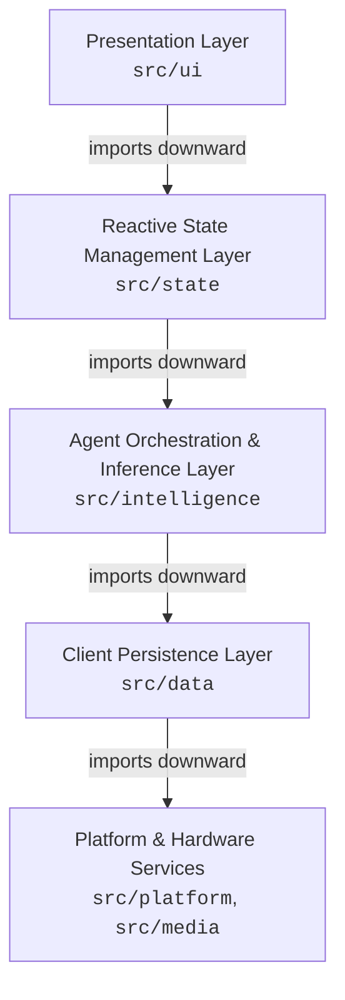
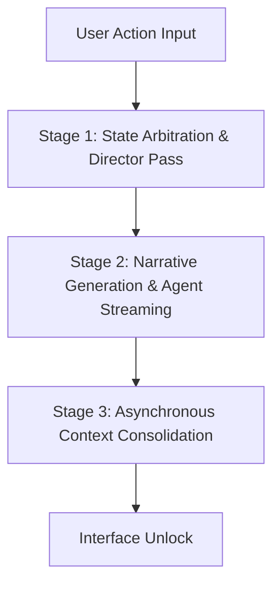
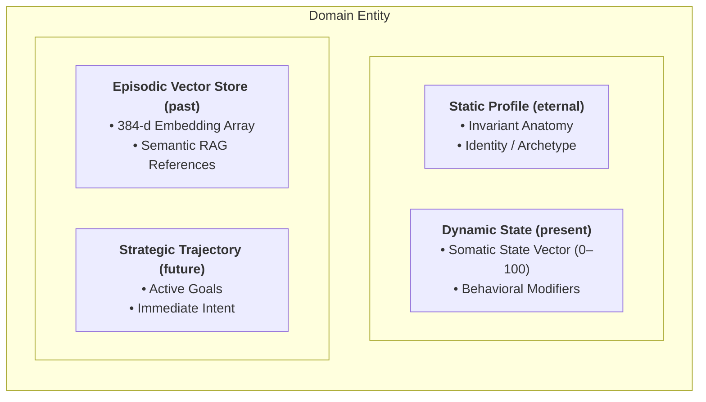

# RPGlitch System Architecture Specification

This specification documents the technical architecture, domain models, execution lifecycles, and layer boundaries of **RPGlitch**. It provides the structural blueprint for client-side execution, AI orchestration, and deterministic state management.

---

## 1. System Topology & Technology Stack

RPGlitch is architected as an offline-capable, **Local-First Single-Page Application (SPA)** packaged as a single-file portable bundle.

### Core Technologies

- **UI & Reactivity**: **Svelte 5 Runes**. State synchronization is governed exclusively by **$state()**, **$derived()**, and **$effect()**. Legacy store contracts (`writable`) and Svelte 4 reactivity (`$:`) are disallowed.
- **Build Tooling**: **Vite 8** with **vite-plugin-singlefile**. The build compiles all markup, scripts, stylesheets, and embedded assets into an isolated `index.html` artifact designed for iframe sandboxing.
- **Persistence Engine**: **Dexie.js 4 (IndexedDB)**. Handles structured client-side storage for sessions, entities, environmental models, and vector embeddings. Web Storage (`localStorage`) is restricted due to origin sandboxing and synchronous I/O overhead.
- **Styling System**: **Tailwind CSS v4** configured with CSS custom properties specified in `DESIGN.md`.
- **Client-Side Neural Engines**:
- **Kokoro-82M**: Embedded ONNX text-to-speech runtime (`src/media/speech.js`) for synthesized voice streaming.
- **Transformers.js**: Embedded ONNX vector embedding pipeline (`src/platform/embeddings.svelte.js`) running a 384-dimensional model for semantic retrieval-augmented generation (RAG).

### Bootstrap Sequence (`src/main.js`)

1. **Environment Verification**: Verifies browser capability flags (**IndexedDB**, **Web Audio API**, **WebAssembly**).
2. **Database Connection**: Opens Dexie database instances and migrates schemas.
3. **Application Mount**: Mounts the root Svelte 5 component to the DOM.
4. **Bridge Registration**: Mounts isolated debug hooks to `window.exposed` during development.

---

## 2. Layer Boundaries & Dependency Rules

The codebase enforces strict unidirectional dependency flow. High-level layers depend on low-level abstractions; low-level services never reference consumers.

- **Presentation Layer (`src/ui`)**: Atomic UI components, layouts, and rendering views. Components subscribe to reactive state controllers but declare no global domain state.
- **Reactive State Management Layer (`src/state`)**: Domain controllers (`runtime.svelte.js`, `chrono.svelte.js`, `status.svelte.js`, `interface.svelte.js`). Coordinates data between user events, persistence, and inference.
- **Agent Orchestration & Inference Layer (`src/intelligence`)**: System prompt compilation, context window pruning, multi-stage LLM calling, and narrative filtering.
- **Client Persistence Layer (`src/data`)**: Repositories, table schemas, transactional data mutations, and Dexie bindings.
- **Platform & Hardware Services (`src/platform`, `src/media`)**: Hardware bridges including Web Audio, Kokoro TTS, ONNX runtime workers, and vector calculation utilities.

### Architectural Invariants

- **Downstream-Only Imports**: Modules may only import from sibling directories or layers located directly below them.
- **State Decoupling**: Pure business logic within `src/intelligence` or `src/data` must remain decoupled from Svelte runes and UI listeners.

---

## 3. Simulation Lifecycle & Execution Pipeline

The simulation runs a deterministic turn-based cycle triggered by user interactions.

### Lifecycle Units: Rounds vs. Turns

- **Round (`runtime.round`)**: The macro-level simulation cycle. A round begins when a user action is dispatched via **chrono.send()** and terminates after Stage 3 operations complete.
- **Turn**: An atomic execution slice allocated to a single participant within a round:

1. **Director Turn**: Evaluates physics, updates state vectors, resolves active speakers, and sets UI state to locked (`simulation_state.phase === "locked"`).
2. **Agent Turn**: Streams narrative prose from the designated active speaker.
3. **User Turn**: Releases interface locks, rendering input controls for the player.

### Multi-Stage Execution Pipeline

- **Stage 1 (State Arbitration & Director Pass)**: Fast-path deterministic inference. Validates participant intent, applies somatic dynamic deltas, evaluates spatial presence, and outputs a structured delta (`DYNAMICS_DELTA`).
- **Stage 2 (Narrative Generation & Streaming)**: In-character prose generation from the perspective of the delegated speaker, streamed incrementally to the Presentation Layer.
- **Stage 3 (Asynchronous Context Consolidation)**: Background worker process executed every 4 rounds. Computes semantic embeddings for recent turns, stores episodic vectors, and updates short-term tactical agendas without blocking the interface.

---

## 4. Domain Entities & State Models

### Entity Classification

- **Entity**: Base class for all interactive components within the simulation.
- **User Persona Entity (`runtime.active_user`)**: The human participant's avatar. Protected by the **Agency Invariant**: the engine and autonomous agents are strictly forbidden from authoring thoughts, dialogue, or motor actions for the user.
- **AI Entity (`runtime.active_ai`)**: The active autonomous persona operating within the scene.
- **Fractal Entity (`runtime.active_fractal`)**: The world model governing environmental hazards, structural decay, atmospheric descriptors, and scene-level objectives.

### Quad-Partitioned Entity Schema

Entity states are split into four discrete operational segments:

- **Static Profile (`eternal`)**: Immutable attributes, baseline physiology, background lore, and foundational constraints.
- **Dynamic State (`present`)**: Ephemeral properties, current physiological markers, and numerical state vectors.
- **Episodic Vector Store (`past`)**: Searchable memory index containing past dialogue turns and scene events indexed by Transformers.js embeddings.
- **Strategic Trajectory (`future`)**: Short-term tactical agenda, immediate conversational intent, and open goals.

### Directed Relational Graph

Entity interconnections are tracked using a directed relational graph (`[Source] -> [Target]: [Relation Description]`):

- **Entity -> Environment**: `"Dr. Elias -> Tartarus: Chief Medical Officer at Sector 4"`
- **Entity -> Entity**: `"Elias -> Benedict: Distrusts due to classified cybernetic augments"`
- **Environment -> Entity**: `"Tartarus -> Julien: Active warrant issued for treason"`

### Numerical State Vectors (0–100)

- **Psychological & Somatic Attributes (AI Character Scope)**:
- **chaos**: Behavioral stability vs. volatility.
- **intensity**: Autonomic nervous activation and adrenaline response.
- **openness**: Receptivity vs. defensive suspicion.
- **affinity**: Interpersonal trust vs. hostility.

- **Environmental Attributes (Fractal Scope)**:
- **velocity**: Kinetic pacing and environmental movement rate.
- **entropy**: Structural degradation, environmental noise, and physical breakdown.

---

## 5. Context Isolation & Agent Orchestration

### Context Culling (`runtime.in_scene_npc_ids`)

The orchestrator dynamically scopes the system context window. Only entities flagged as present in the active scene receive state vector processing and prompt token allocation. Inactive entities remain serialized in IndexedDB with zero token consumption.

### Epistemic Partitioning

To avoid unintended agent omniscience, private user directives (`[SECRET: ...]` and `[PLAN: ...]`) are filtered out prior to compiling agent inference prompts. The omniscient Director layer retains full access to evaluate outcomes, but downstream agent prompts receive only sensory information available within the scene.

### Subtext & Psychosomatic Tell Generation

The inference engine models conversational subtext by decoupling internal agent state from spoken dialogue. When high discrepancy exists between internal dynamic state (e.g., elevated `intensity`) and overt dialogue, the system forces non-verbal somatic indicators into generated prose.

### Narrative Post-Processing Pipeline (`src/utils/styles.js`)

Streamed agent responses are routed through a deterministic cleaning pipeline before being written to IndexedDB. The pipeline strips repetitive tropes, normalizes whitespace, strips structural prompt bleed, and standardizes punctuation.
