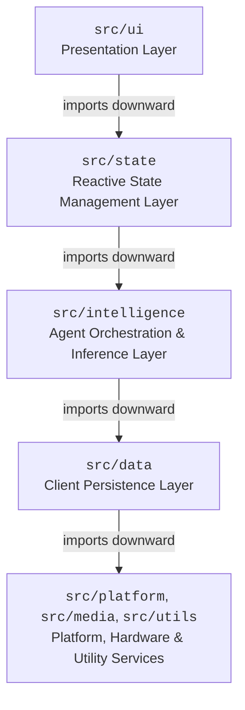
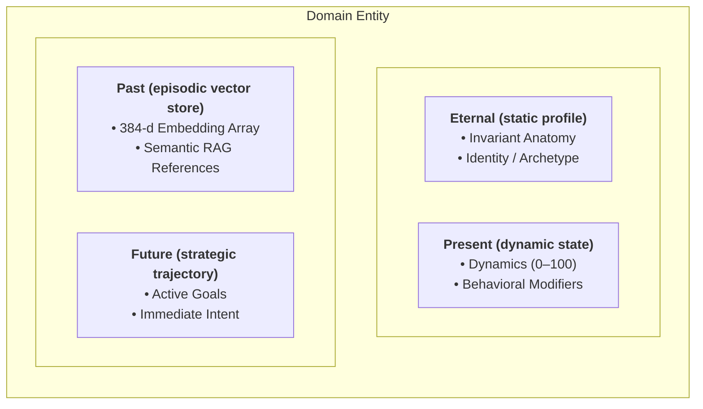

# RPGlitch System Architecture Specification

This specification documents the authoritative technical architecture, domain models, execution lifecycles, and layer boundaries of **RPGlitch**. It provides the structural blueprint for client-side execution, AI orchestration, and deterministic state management.

- **Strategic Vision & Game Design**: Consult [README.md](README.md) for product design, narrative concepts, and simulation philosophy.
- **Visual & Sensory Tokens**: Consult [DESIGN.md](DESIGN.md) for the Nordic design system, color tokens, typography, and motion rules.
- **Security & Threat Defense**: Consult [SECURITY.md](SECURITY.md) for the defense-in-depth pipeline, DOMPurify sink rules, and boundary validation.
- **Future Engineering & Sprints**: Consult [ROADMAP.md](ROADMAP.md) for target architecture blueprints and the active development delta.

---

## 1. System Topology & Technology Stack

RPGlitch is architected as an offline-capable, **Local-First Single-Page Application (SPA)** packaged as a single-file portable bundle.

### Core Technologies

- **UI & Reactivity**: **Svelte 5 Runes**. State synchronization is governed exclusively by **$state()**, **$derived()**, and **$effect()**. Legacy store contracts (`writable`) and Svelte 4 reactivity (`$:`) are disallowed.
- **Build Tooling**: **Vite 8** with **vite-plugin-singlefile**. The build compiles all markup, scripts, stylesheets, and embedded assets into an isolated `index.html` artifact designed for iframe sandboxing.
- **Persistence Engine**: **Dexie.js 4 (IndexedDB)**. Handles structured client-side storage for sessions, entities, environmental models, vector embeddings, and the **Mutation Ledger** (`db.mutation_ledger`). Web Storage (`localStorage`) is restricted due to origin sandboxing and synchronous I/O overhead.
- **Event-Sourced Mutation Ledger (`src/data/ledger.js`)**: An append-only event stream recording discrete, change-only field mutations (`round`, `seq`, `writer`, `decider`, `old_value`, `new_value`, `visibility`, `weight`). Provides deterministic state reconstruction at any `(round, seq)` snapshot via `replay_entity_field()` and full entity state at round $X$ via `replay_full_entity_at_round()`, powering both the in-studio **Field History Inspector** (`FieldHistoryModal.svelte`) and the **Timeline Scrubber / Branching Engine** (`TimelineModal.svelte`). Materialized entity records provide zero-latency live prompt compilation.
- **Unified Entity Birth Core (`birth_entity_core` in `src/intelligence/profile.js`)**: Single pipeline for character spawning and entity imports (Character Card V2/V3, native JSON, LLM prose), writing Round 0 Genesis ledger records across all populated quadrants (`eternal`, `present`, `past`, `future`).
- **Styling System**: **Tailwind CSS v4** configured with CSS custom properties specified in `DESIGN.md`.
- **Client-Side Neural Engines**:
  - **Kokoro-82M**: Embedded ONNX text-to-speech runtime (`src/media/audio.svelte.js` & `src/media/speech.js`) for synthesized voice streaming.
  - **Transformers.js & 8-Bit Vector Quantization Engine**: Embedded ONNX vector embedding pipeline (`src/platform/embeddings.svelte.js`) running a 384-dimensional model with `quantize_vector_q8()` and `dequantize_vector_q8()` codecs, compressing 32-bit float vector stores to uint8 base64 strings with 75% storage savings and $> 0.99$ cosine similarity preservation.

### Bootstrap Sequence (`src/main.js`)

1. **Environment Verification**: Verifies browser capability flags (**IndexedDB**, **Web Audio API**, **WebAssembly**) and installs runtime error hardening.
2. **Database Connection**: Opens Dexie database instances and migrates schemas.
3. **Application Mount**: Mounts the root Svelte 5 component to the DOM.
4. **Global & State Bridge Registration**: Exposes required platform libraries (`Dexie`, `DOMPurify`) to `window` and registers downward state/stream accessors into `@utils` bridges (`state_bridge`, `stream_bridge`) to decouple non-reactive layers.

---

## 2. Layer Boundaries & Dependency Rules

The codebase enforces strict unidirectional dependency flow. High-level layers depend on low-level abstractions; low-level services never reference consumers.

- **`src/ui`** (Presentation Layer): Atomic UI components, layouts, and rendering views. Components subscribe to reactive state controllers but declare no global domain state.
- **`src/state`** (Reactive State Management Layer): Domain controllers (`runtime.svelte.js`, `chrono.svelte.js`, `status.svelte.js`, `interface.svelte.js`). Coordinates data between user events, persistence, and inference.
- **`src/intelligence`** (Agent Orchestration & Inference Layer): System prompt compilation, context window pruning, multi-stage LLM calling, and narrative filtering.
- **`src/data`** (Client Persistence Layer): Repositories, table schemas, transactional data mutations, and Dexie bindings.
- **`src/platform` & `src/media`** (Platform & Hardware Services): Hardware bridges including Web Audio, Kokoro TTS, ONNX runtime workers, and vector calculation utilities.
- **`src/utils`** (Cross-Cutting Utilities): Deterministic algorithms, string helpers, formatting, and validation utilities.

### Architectural Invariants

- **Downstream-Only Imports**: Modules may only import from sibling directories or layers located directly below them.
- **State Decoupling**: Pure business logic within `src/intelligence` or `src/data` must remain decoupled from Svelte runes and UI listeners. This guarantees full unit test portability across headless runtimes (such as Vitest and Node.js) where browser reactivity loops and Svelte compiler contexts do not exist.

---

## 3. Simulation Lifecycle & Execution Pipeline

The simulation cycle processes player messages through a unified single-round execution pipeline organized into the **3-Turn Sequence (Shot & Sub-Process)**.

```mermaid
sequenceDiagram
    autonumber
    actor User as 🧑‍🚀 Biological Protagonist
    participant Chrono as ⚡ Chrono & System Engine
    participant Director as 🎬 Director (Quick Shot)
    participant Persona as 🎭 Chosen Actor (Narrative Shot)
    participant Queue as 🔄 Background Queue

    loop The Round Lifecycle (Macro-State)
        User->>Chrono: Submits Message (chrono.send)
        Note over Chrono: UI enters STASIS (locked)

        rect rgb(20, 25, 35)
            Note over Chrono,Director: Turn 1: Director Turn (Quick Shot)
            Chrono->>Chrono: Physics Pre-Pass (slider bounds, dynamic gravity)
            Chrono->>Director: Evaluates state kernel (response to previous round)
            Director-->>Chrono: Emits DYNAMICS_DELTA, delegates speaker, sets Director's Note
        end

        rect rgb(25, 30, 45)
            Note over Chrono,Persona: Turn 2: Actor Turn (Narrative Shot)
            Chrono->>Persona: Dispatches staging & Director's Note
            Persona-->>User: Streams in-character dialogue, <think> cognition & prose

            opt If Scheduled by Director in Turn 1
                Chrono-)Queue: Dispatches Visual Beat (optics prompt + Perchance diffusion)
            end
        end

        rect rgb(20, 35, 30)
            Note over User,Queue: Turn 3: User Turn (Head Shot)
            Chrono->>User: STASIS lifted (phase = "idle", input enabled)

            par User Deliberation
                User->>User: Deliberates, reads & authors next message (no time limit)
            and Background Full-State Consolidation
                Chrono-)Queue: Consolidates 1 entity across past rounds (quadrants, embeddings, ledger)
                Queue-->>Chrono: Emits MEMORY_FORMATION & VECTOR_RESOLUTION cards
            end
        end

        User->>Chrono: Sends next message (completes round & births next)
    end
```

### Lifecycle Units: Rounds & The 3-Turn Sequence (Shot & Sub-Process)

- **Round (`runtime.round`)**: The macro-level simulation heartbeat tracking linear session progression. A round increments strictly when a player message is submitted via **`chrono.send()`**, processes the three sequential turns, and concludes only when the biological protagonist submits their next message payload during **Turn 3 (Head Shot)**.
- **Turn 1: Director Turn (Quick Shot)**:
  - **Shot**: Fast staging and turn orchestration inference (`phase = "generating"`, `director_thinking = true`). Evaluates the state kernel in response to the **previous round**, arbitrates player intent against spatial rules, delegates the chosen actor (`AI`, `FRACTAL`, or `NPC`), conditionally schedules image beats (`trigger_image`), and delivers the Director's Note. Emits `DYNAMICS_DELTA` telemetry cards.
  - **Sub-Process (Deterministic Physics Pre-Pass)**: Evaluates somatic dynamics drift, slider boundaries, and spatial presence synchronously before LLM invocation (no LLM).
- **Turn 2: Actor Turn (Narrative Shot)**:
  - **Shot**: In-character storyteller pass in response to the **Director Turn**. The chosen speaker transitions to `speaker_thinking = true` then streams in-character dialogue, internal `<think>` cognition, and sensory prose directly into the view, detoxed via deterministic filters.
  - **Sub-Process (Optional Visual Generation)**: If scheduled by the Director in Turn 1, the visual synthesis pipeline compiles prompt optics and dispatches image diffusion via the Perchance Image Plugin immediately upon narrative stream completion.
- **Turn 3: User Turn (Head Shot)**:
  - **Shot**: The biological protagonist responds to the **Actor Turn**. Once the narrative stream finishes, generation completes (`phase = "idle"`), interface locks release, and user input is enabled. The player reflects and composes their next message without any arbitrary time limit.
  - **Sub-Process (Full-State Consolidation & Ledger Housekeeping)**: Executes asynchronously in the background via `director_background_queue`. Sweeps one entity per round (round-robin), distilling facts into bracket memories over multiple historical rounds, calculating 384-d semantic embeddings, reconciling vector caps (`PAST_VECTOR_CAP = 20`), rewriting the `future` standing agenda, recording diffs to `mutation_ledger`, and emitting `MEMORY_FORMATION` / `VECTOR_RESOLUTION` telemetry cards without blocking user authoring.
- **Round Completion**: The user submits their next message, which finalizes the active round and immediately births the next.

---

## 4. Domain Entities & State Models

### Entity Classification

All domain entities share an identical **Quad-Partitioned Entity Schema** and are instantiated with the same structure. Crucially, a **Story** in RPGlitch requires the convergence of three foundational entities: the **User Persona**, the **AI Character**, and the **Fractal**. Together, these three entities form the minimal triadic reality required to instantiate and execute a narrative session:

- **User Persona Entity (`runtime.active_user`)**: The human participant's avatar drawn from the character pool. Protected by the **Agency Invariant**: the engine and autonomous agents are strictly forbidden from authoring thoughts, dialogue, or motor actions for the user.
- **AI Character Entity (`runtime.active_ai`)**: The active autonomous agent-controlled co-star drawn from the character pool. Operates within the scene and is fully controlled by the AI inference pipeline.
- **Fractal Entity (`runtime.active_fractal`)**: The environment entity. Governs atmospheric hazards, structural decay, sensory descriptors, and scene-level objectives. Uses the same quad-partitioned schema as characters — it is not an ad-hoc separate structure.
- **Secondary Characters / Supporting NPCs (`runtime.active_npcs`) & Stage Spotlight (`runtime.in_scene_npc_ids`)**: Beyond the core triad, stories support secondary non-player characters stored in the shared character pool. Secondary characters serve as narrative instruments for the Director to tell an engaging story. NPCs present in the active scene spotlight can be assigned speaking turns directly by the Director (`npc:id`), while off-stage cast members remain serialized in IndexedDB with zero token consumption.

> [!NOTE]
> **Shared Character Pool**: The repository holds characters ranging from fully developed primary personas to lesser secondary supporting characters. Any character in the repository can seamlessly serve as the active player avatar, the primary autonomous co-star, or an in-scene secondary NPC. Entities differ only in their assigned runtime role and the rules governing agency and authorship.

### Quad-Partitioned Entity Schema

Every entity is split into four discrete operational segments. **Eternal, Present, Past, and Future are the canonical terms**; the secondary descriptors in parentheses are provided for structural clarity only. All four quadrants operate as symmetrical strings across entities:

- **Eternal (static profile)**: Immutable attributes, baseline physiology, background lore, and foundational constraints.
- **Present (dynamic state)**: Ephemeral properties, current physiological markers, and dynamics, structured via Universal Bracket Predicates (`[KEY: value | flags]`).
- **Past (episodic vector store)**: Multiline bracket strings (`[KEY: settled fact]`) indexed by Transformers.js embeddings for semantic retrieval.
- **Future (strategic trajectory)**: Short-term tactical agenda, immediate conversational intent, and open goals.

### Directed Relational Graph & Veil Engine

Entity interconnections are tracked using a directed relational graph (`[Source] -> [Target]: [Relation Description]`) and projected into universal bracket predicates on entity non-physical fields (`[@TARGET: dynamic | flags]`):

- **Target Addressing & Prefix Mandate**: All relational brackets pointing to other entities or active roles **MUST begin with `@`** (e.g., `[@BEAST: ...]`, `[@NOVA CITY: ...]`, `[@USER: ...]`). This prevents collision with common nouns or standard trait keys (`[BEAST: ...]`). The target can be the entity's exact ID, full name, or dynamic role macro (`@USER`, `@CHAR`, `@FRACTAL`).
- **Natural Space Support**: Bracket keys natively support spaces (e.g., `[@LORD BENEDICT SILVERS: ...]`, `[MEASURING TAPE: ...]`).
- **Directed Edges**:
  - **Character -> Fractal**: `"Dr. Elias -> Tartarus: Chief Medical Officer at Sector 4"`
  - **Character -> Character**: `"Elias -> Benedict: Distrusts due to classified cybernetic augments"`
  - **Fractal -> Character**: `"Tartarus -> Julien: Active warrant issued for treason"`

### Dynamics (0–100) & Baselines

Dynamics are numerical state scalars stored inside an entity's **Present** segment. They encode psychological, somatic, and environmental pressure that the inference engine translates into prose subtext and behavioral modifiers. Each dynamic metric has a corresponding **`dynamics_baseline`** representing its gravitational home state:

- **Character Dynamics**:
  Included on all character entities in the database. However, in storymode, **only the active AI character's dynamics actively drive narrative generation and behavioral mutations**. The user persona's dynamics remain essentially dormant until that character is swapped into the AI co-star role.

  - **chaos**: Behavioral stability vs. volatility.
  - **intensity**: Autonomic nervous activation and adrenaline response.
  - **openness**: Receptivity vs. defensive suspicion.
  - **affinity**: Interpersonal trust vs. hostility.

- **Fractal Dynamics**:

  - **velocity**: Kinetic pacing and environmental movement rate.
  - **entropy**: Structural degradation, environmental noise, and physical breakdown.

---

## 5. Context Isolation & Agent Orchestration

### Context Culling (`runtime.in_scene_npc_ids`)

The orchestrator dynamically scopes the system context window. Only entities flagged as present in the active scene receive state vector processing and prompt token allocation. Inactive entities remain serialized in IndexedDB with zero token consumption.

### Epistemic Partitioning & Secrecy Signaling

To prevent unintended agent omniscience, the system enforces a strict epistemic boundary between the omniscient director evaluation and entity-level generation:

- **Epistemic Wall**: In `render_character()`, hidden state brackets (`| hide`), covert inventory/stashes (`[INVENTORY: ... | hide]`, `[STASH: ... | hide]`), and hidden relational edges (`| hide`) belonging to non-owner entities are stripped across the Epistemic Wall before compiling AI character inference payloads (`filter_epistemic_brackets`). The AI cannot read what it has no perceptual means of observing.
- **Secrecy Signaling (`| hide` / `| show`)**: Owner perspectives preserve their own `| hide` flags directly (e.g. `[DAGGER: stiletto | hide]`, `[OBJECTIVE: assassinate target | hide]`). This informs the persona LLM of an item, plan, or disposition in their possession while signaling that it must not be openly voiced or exposed to other scene participants.
- **Omniscient Director Access**: `render_director()` preserves unstripped access to all state brackets and flags across both participants and fractals to accurately arbitrate somatic outcomes, dynamic shifts, and spatial physics.
- **Vector Retrieval Sanitization**: Semantic vector indexing strips engine metadata flags (`| hide`, `| show`, `| w: N`) via `strip_bracket_engine_flags` before generating embeddings, preventing keyword noise from contaminating semantic similarity scoring.
- **Integrity Auditing**: `verify_epistemic_integrity` actively audits prompt outputs to guarantee zero leaking of hidden tags or unauthorized `| hide` flags across entity boundaries.

### Subtext & Psychosomatic Tell Generation

The inference engine models conversational subtext by decoupling internal agent state from spoken dialogue. When high discrepancy exists between internal dynamic state (e.g., elevated `intensity`) and overt dialogue, the system forces non-verbal somatic indicators into generated prose.

### Narrative Post-Processing Pipeline (`src/utils/styles.js`)

Streamed agent responses are routed through a deterministic cleaning pipeline before being written to IndexedDB. The pipeline strips repetitive tropes, normalizes whitespace, strips structural prompt bleed, and standardizes punctuation.
