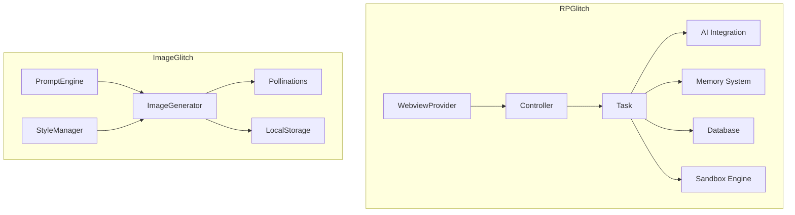
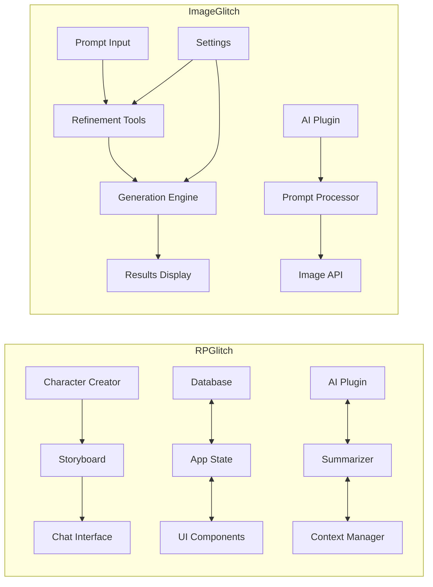
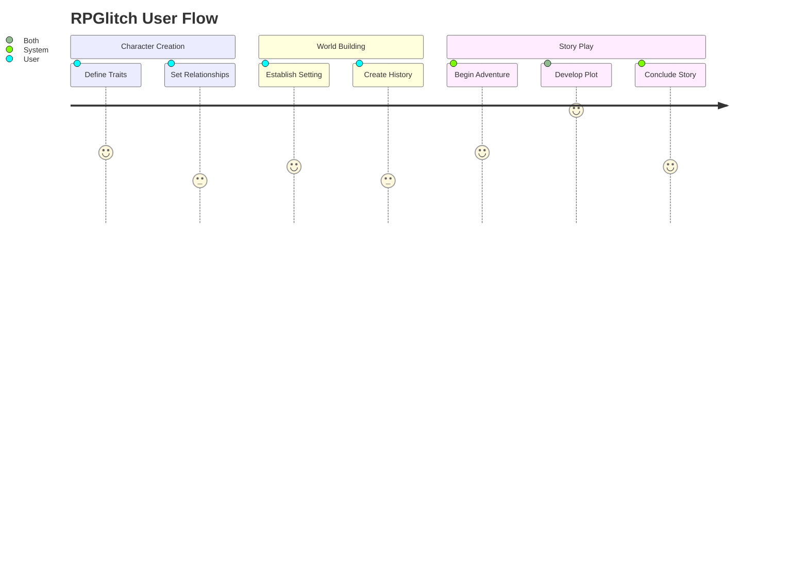

# Consolidated Project Context

## == DEVELOPER'S NOTE: APPLICATION ENTRY POINT ==

This file is intentionally not used as the application's entry point, which is a departure from standard React/Vite/CRA projects. The Perchance platform has a unique architecture.

**The *actual* application entry point is constructed as follows:**

The project contains multiple distinct applications (e.g., RPGlitch, ImageGlitch), each housed in its own directory (e.g., `Z. RPGlitch/`, `Y. ImageGlitch/`). For any given application, its core files follow this pattern:

1.  **HTML Structure:** The base HTML is defined in `[AppName]/[AppName].html`. This file contains all the necessary `div` containers and screen templates.
2.  **Core Logic:** The main application logic, state management, and UI rendering functions are located in the `<script type="module">` block within `[AppName]/[AppName]-script-block.html`.
3.  **Styling:** All CSS is located in the `<style>` block within `[AppName]/[AppName]-style-block.html`.
4.  **Plugin Initialization:** Any necessary Perchance plugins are initialized in `[AppName]/[AppName]-left-panel.html`.
5.  **Bootstrapping:** The application is booted by a function call (e.g., `App.initializeWhenReady()`) at the end of the script block. The project does not use `ReactDOM.render()`.

This note is placed here in `coreContext.md` because it is a foundational piece of architectural information.

---
---
---

## 🎉 CRITICAL UPDATE: Major Code Cleanup Completed

### Issue Resolved: Duplicate Code Blocking Development
**Problem**: The `RPGlitch.js` file contained a complete duplicate of the entire App object (lines 752-3836 were identical to lines 1-751), causing:
- Confusion about which version to edit
- Changes appearing to "disappear" 
- Unnecessarily large file size
- Development paralysis

**Solution**: Removed duplicate code, reducing file from 3836 lines to 712 lines (81% reduction)

**Impact**: 
- Build size reduced from 295.9 KB to 118.4 KB (60% reduction)
- Clear codebase with single source of truth
- Development can now proceed effectively

---

## 1. Project Overview

### Rules System Integration
This project uses a comprehensive rules system for consistent development and context management:
- **Mode Control**: Plan Mode vs Act Mode for different task types
- **Context Management**: 60% threshold monitoring with memory bank persistence
- **Error Handling**: Proactive error detection and learning capture
- **Code Quality**: Complete implementation standards with no TODOs
- **Security**: Input sanitization and validation practices
- **Platform-Specific**: Perchance integration patterns and best practices

### Core Value Propositions
1. **RPGlitch**:
   - Immersive AI storytelling with persistent context
   - Structured character/world development using EPPF model
   - Hierarchical memory system for long conversations
   - Custom interactive elements via sandboxed JS

2. **ImageGlitch**:
   - Three-stage AI-assisted prompt refinement
   - Creative chaos injection for unexpected results
   - Direct AI instruction for precise control
   - Quad-image comparison for style exploration

### Target User Personas
1. **Storytellers**:
   - Want rich narrative experiences
   - Need tools for character/world consistency
   - Value long-term story development

2. **Creatives**:
   - Seek inspiration through AI collaboration
   - Want to refine ideas iteratively
   - Enjoy exploring visual possibilities

## 2. Technical Architecture

### Core Technologies
- **Frontend**: HTML5, CSS3, JavaScript ES6+
- **Storage**: IndexedDB (via Dexie.js), localStorage
- **AI Services**: Perchance AI plugins (ai-text-plugin, text-to-image-plugin)
- **Image Generation**: Pollinations.ai API and text-to-image plugin (via Perchance)
- **Security**: DOMPurify, sandboxed iframes
- **Platform**: Perchance (perchance.org)

### Key Technical Decisions
1. **Perchance Integration Pattern**:
   - Left panel handles plugin initialization
   - Right panel combines HTML/CSS/JS into single block (manually combined by user)
   - Custom sandbox for JS execution
   - Cache bust reload handling

2. **Memory Management**:
   - 3-tier hierarchical summarization (not fully implemented yet)
   - Background processing via setTimeout
   - IndexedDB for persistent storage
   - Automatic context window management

3. **Error Handling**:
   - Graceful degradation for AI failures  
   - Automatic retry with exponential backoff
   - User-friendly error messages
   - **User-Driven Cancellation**: Implemented an `AbortController`-based pattern to allow users to safely cancel long-running AI operations.
   - State recovery mechanisms

## 3. Implementation Details

### Database Schema
- **Version 10**: Added summariesEndingHere and memoriesEndingHere fields
- **Version 9**: Initial story/message structure
- **Indexes**: Optimized for character/world queries

### Development Environment
1. **Perchance Platform**:
   - Left panel for plugin initialization
   - Right panel for combined HTML/CSS/JS
   - No external file linking in right panel

2. **Key Plugins**:
   - `ai-character-chat-dependencies-v1` (Dexie, DOMPurify)
   - `super-fetch-plugin` for CORS handling
   - `remember-plugin` for persistence
   - `text-to-image-plugin` for image generation
   - `ai-text-plugin` for AI chat

### Critical Implementation Paths
1. `injectHierarchicalSummariesAndComputeNextSummariesInBackgroundIfNeeded`
   - Manages AI context window
   - Runs in background via setTimeout
   - Stores results in IndexedDB

2. `evaluatePerchanceTextInSandbox`
   - Secure JS execution
   - Timeout protection
   - Limited API exposure

## 4. Patterns & Best Practices

### Design Patterns in Use
- **Module Pattern**: For UI components
- **Observer Pattern**: For state changes
- **Factory Pattern**: For character/world creation
- **Strategy Pattern**: For AI prompt variations
- **Singleton Pattern**: For core services
- **Decorator Pattern**: For UI enhancements
- **Command Pattern**: AI operations are encapsulated as commands within `_manageAiButtonState`. This allows for a unified interface to execute, manage state (e.g., UI disabling), and, critically, cancel operations via an `AbortController`.

### Component Relationships

### Workflow Considerations
1. **Debugging Tips**:
   - Plugin initialization timing checks
   - Cache bust reload handling
   - Global library polling
   - Strategic logging

2. **Development Setup**:
   - Separate files during development
   - Combined build for production
   - Testing procedures
   - Version requirements

## 5. User Experience

### User Journey Highlights

### Core Problems Solved
1. **RPGlitch**:
   - Disjointed AI roleplaying experiences
   - Lack of persistent story context
   - Difficulty maintaining character consistency

2. **ImageGlitch**:
   - Blank canvas problem with AI image generation
   - Difficulty translating ideas to effective prompts
   - Limited creative variations

## References
- [Perchance Welcome Page](https://perchance.org/welcome)
- [Perchance Advanced Tutorial](https://perchance.org/advanced-tutorial)
- [AI Text Plugin Docs](https://perchance.org/ai-text-plugin)
- [Text-to-Image Plugin Docs](https://perchance.org/text-to-image-plugin)

## System Settings
- **Context handoff**: 60%
- **Active rules**: 
  - cursor-context-management.md (60% threshold)
  - cursor-startup-automation.md (agnostic)
- **Disabled rules**:
  - cline-sequential-thinking.md
  - cline-self-improvement.md

## Current Development Status
- **Phase 1 Complete**: Duplicate code removal ✅
- **Phase 2 Active**: Code quality improvements (error handling, logging, state management)
- **Phase 3 Planned**: Feature development and performance optimization
