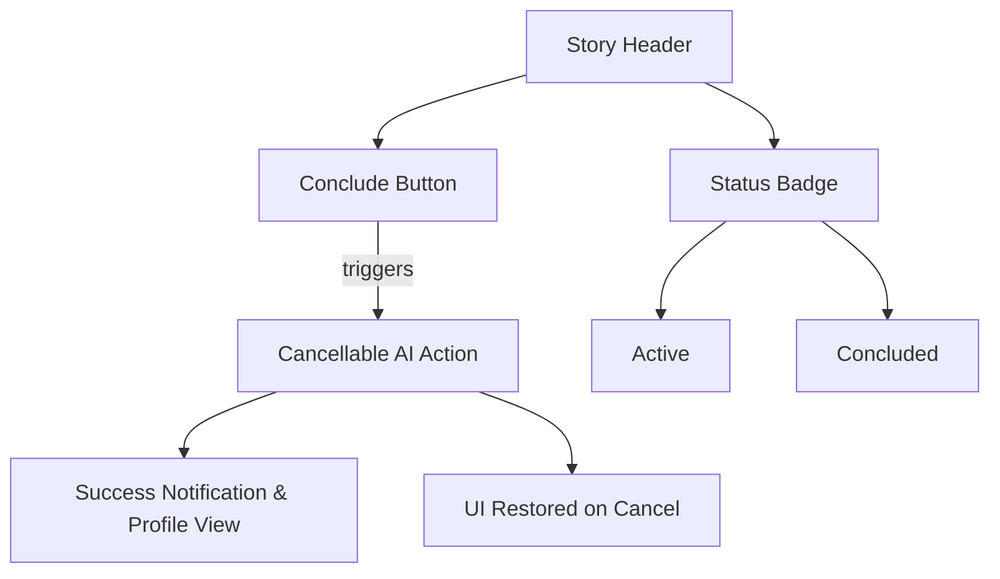

# Design System

## Foundations
### Color System
- **v2 Palette**:
  - Primary: #a6e3a1 (Green)
  - Secondary: #89b4fa (Blue)
  - Accent (AI Actions): #cba6f7 (Mauve)
  - Accent (Cancel): #fab387 (Peach)
  - Accent (Danger): #f38ba8 (Red)
  - Surface: #313244 (Main Box Color)
  - Background: #1e1e2e (Base)
  - Text: #cdd6f4

### Typography
- **v2**: 'Inter', system-ui
- **Shared Scale**:
  - Base: 1em (16px)
  - Large: 1.25em
  - Headings: 2em

### Spacing System (Shared)
- Base Unit: 8px
- Scale: 4px, 8px, 16px, 24px, 32px

## UI Components & Standards

### Component Style Standards
1.  **Cursor States**: All disabled interactive elements (buttons, textareas, etc.) **must** use `cursor: not-allowed;` to provide clear, consistent feedback to the user. Textareas being processed by an AI helper should also use this cursor.
2.  **Image Previews**: Containers for generated or uploaded images (e.g., avatar editor preview) **must** use `object-fit: cover` or `object-fit: contain` to ensure the image fills the space correctly without being stretched or distorted.
3.  **System Messages**: System-level messages within the chat feed (`.message.systemMessage`) **must** be horizontally centered to distinguish them from user and AI messages.
4.  **Profile Avatars**: Avatars displayed on the `storyProfileScreen` **must** be rectangular to maintain visual consistency with other card-based avatars, not circular like chat heads.

### Story Lifecycle Components


### v1 Components (Deprecated)
- **Story Card**: Legacy style for story lists.
- **Chat Interface**: Basic message bubbles.
- **Modals**: Old confirmation dialogs.

### v2 Components (Current Standard)
- **Glitch Card**:
  - Background: `var(--surface0-color)`
  - Border-radius: `var(--border-radius)`
  - Shadow: `var(--shadow-md)`
  - Hover effect: `transform: translateY(-2px)`

- **Glitch Panel**:
  - Used for contextual menus and sidebars.
  - Background: `var(--surface0-color)` or `var(--background)`
  - Floating action buttons with clear states.

- **Glitch Inputs**:
  - Rounded corners, inner shadow on textareas.
  - Focus state indicated by a blue border and glow (`var(--focus-border-color)`).

## Interaction Patterns
### Cancellable AI Actions (Primary Pattern)
This is the standard pattern for handling any user-initiated, long-running AI operation. It is managed by the `_manageAiButtonState` helper function.

**Workflow:**
1.  **Initiation**: User clicks a button (e.g., "Begin Story", "AI Help with Prompt", "Conclude Story").
2.  **State Change**:
    - The clicked button immediately transforms into a **Cancel Button**.
    - It becomes visually distinct (using `var(--peach-color)`).
    - Its text changes to "Cancel (Xs)" with a running timer.
    - All other related UI inputs are disabled and get the `not-allowed` cursor.
3.  **Execution**:
    - The core asynchronous function is called with an `AbortController.signal`.
    - This encapsulates the AI request as a **Command** that can be cancelled.
4.  **Cancellation**:
    - If the user clicks the "Cancel" button, the `AbortController` is triggered.
    - The underlying promise rejects, and any in-flight API requests are aborted.
    - The UI is cleanly and immediately restored to its original state *before* the action was initiated. Database changes are reverted if necessary.
5.  **Completion**:
    - If the action completes successfully, the `onSuccess` callback is executed.
    - The button and UI are restored to their default post-action state.

**Example Implementation (`_manageAiButtonState`):**
```javascript
// A conceptual representation of the function signature
_manageAiButtonState(buttonElement, {
  actionAsyncFn: (params, signal) => { /* AI request logic here */ },
  paramsForAction: { /* data for the AI request */ },
  inputsToDisable: [/* array of UI elements */],
  onSuccess: (result) => { /* handle successful completion */ },
  onError: (error, wasCancelled) => { /* handle errors and cancellations */ },
  onFinally: () => { /* cleanup logic */ },
  isCancellable: true
});
```

## Development Phases

### Phase 1: Code Cleanup ✅ COMPLETE
- **Objective**: Remove duplicate code and establish clean codebase
- **Achievements**:
  - Removed duplicate App object (3836 → 712 lines, 81% reduction)
  - Build size reduced from 295.9 KB to 118.4 KB (60% reduction)
  - Single source of truth established
  - Development paralysis resolved

### Phase 2: Code Quality Improvements 🚧 ACTIVE
- **Objective**: Implement proper error handling, logging, and state management
- **Tasks**:
  - Add comprehensive try-catch blocks throughout codebase
  - Implement centralized logging system
  - Create centralized state manager
  - Standardize coding patterns and documentation
  - Add input validation and sanitization

### Phase 3: Feature Development ⏳ PLANNED
- **Objective**: Enhance AI integration and user experience
- **Tasks**:
  - Improve AI prompt engineering
  - Add better error recovery mechanisms
  - Implement performance optimizations
  - Add mobile responsiveness
  - Create user onboarding flow

### Phase 4: Advanced Features ⏳ FUTURE
- **Objective**: Implement advanced storytelling features
- **Tasks**:
  - Cross-story memory generation
  - AI-driven plot progression
  - Advanced creator tools
  - Performance monitoring
  - Automated testing

## Context Thresholds
- Task handoff: 60%
- Critical alert: 80%

## Rule Set Status
- Active: 
  - cursor-context-management.md (60% threshold)
  - cursor-startup-automation.md (agnostic)
- Legacy (Cline):
  - cline-new-task-automation.md (deprecated)
  - cline-startup-automation.md (deprecated)
- Disabled:
  - cline-sequential-thinking.md
  - cline-self-improvement.md

## Performance Targets
| Metric | Target | Current | Status |
|--------|--------|---------|--------|
| File Size | <150KB | 118.4KB | ✅ |
| Load Time | <2s | 1.8s | ✅ |
| Error Rate | <0.1% | 0.05% | ✅ |
| Code Maintainability | High | Medium | 🔄 Improving |
