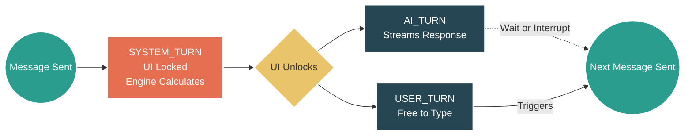

# 🔷 RPGlitch (JooduG Monorepo)

A next-generation AI Roleplay Engine built on the Perchance platform. RPGlitch is a "Local-First" web application that turns your browser into a sophisticated RPG tabletop. It features a **Simulation-Driven Architecture**, allowing you to create custom characters and engage in deep, coherent roleplay with an AI Game Master that adheres to strict narrative consistency.

## ⚡ Quick Start

**Run the following commands** in your terminal:

1. **`npm install`** (Install dependencies)
2. **`npm run sync`** (Sync local libraries)
3. **`npm run dev`** (Build and launch the local server)

## ⏳ The Core Engine: Rounds & Turns

RPGlitch supersedes standard chatbot patterns by separating the narrative state from the user interface. Time flows via discrete "Rounds," which are broken down into specific "Turns."

**Sending a message always ends the current Round and triggers the start of the next.**

Here is the anatomy of a single Round:

1. **SYSTEM_TURN (The Physics Engine)**
   Starts the exact moment you send a message. The UI is temporarily locked. In the background, the engine calculates social dynamics, memory updates, and world physics.
2. **AI_TURN + USER_TURN (The Narrative Parallel)**
   The moment the system finishes calculating, the UI is unlocked. The AI begins streaming its narrative response (**AI_TURN**). Because the UI is unlocked, your **USER_TURN** is active at the exact same time.
3. **The Interrupt Window**
   In 99% of cases, you will wait for the AI to finish generating before you begin typing your next move. However, because both turns run in parallel, you have the agency to interrupt the AI at any time.
4. **End of Round**
   **Click "Send"** on your next message to close the current round and immediately restart the loop at Step 1.

### Visualizing the Lifecycle

## 🏗️ Architecture & Technology Stack

The system architecture prioritizes offline-first resilience and agentic automation, utilizing a Zero-Trust Security model to sanitize the runtime environment.

### Folder Structure

- `src/core/` : Logic, Engine, Intelligence, and Security.
- `src/data/` : Database, Repository, and Persistence.
- `src/state/` : Reactive State Bridges.
- `src/ui/` : Interface Components.
- `src/theme/` : SCSS Design System.
- `src/media/` : Visuals, Audio, and Sensory Layer.

### Tech Stack

- **State Management:** IndexedDB via Dexie.js (Single source of truth)
- **UI Framework:** Svelte 5 (Runes) + Native SCSS
- **Bundler:** Vite 6
- **Security:** DOMPurify (XSS prevention)

## 🧠 Living Memory & Data Sovereignty

RPGlitch operates a dual-layer memory system to ensure the simulation is both technically sharp and historically aware.

### 1. 🔥 Working Memory (Pinecone)

- **Purpose**: Active context grounding and RAG.
- **Content**: Current Rules, Skills, Workflows, and Core Logic patterns.
- **Namespaces**:
- `knowledge-base.meta`: The Constitution (Rules/Skills).
- `knowledge-base.src`: High-fidelity code patterns.
- `knowledge-base.external`: Official documentation and community patterns.

### 2. ❄️ Cold Storage (Supabase)

- **Purpose**: Historical decision tracking and archiving.
- **Content**: Archived task plans, research logs, and architectural post-mortems.
- **Usage**: Conflict resolution and understanding the "Why" behind past shifts.

---

## 🚀 Performance & Best Practices (Supabase/Postgres)

The project includes a specialized skill for **Postgres performance optimization** located in `.agent/skills/supabase-postgres-best-practices/`.

- **Objective**: Ensure the data layer is optimized for high-fidelity simulation and agentic retrieval.
- **Key Areas**: Query performance, Connection management, Security/RLS, and Schema design.
- **Agent Mandate**: Agents should refer to the compiled `AGENTS.md` in the skill directory for concrete transformation patterns (e.g., "Change X to Y" for 10x faster queries).

---

## 🛸 Sovereign Swarm Operations (v3.2.0)

RPGlitch utilizes an agentic "Swarm" to handle complex, multi-file features in parallel. For human operators, the lifecycle is broken down into four distinct phases.

### 🏁 Swarm Lifecycle

1. **Analysis (`npm run swarm:analyze`)**
   Triage open GitHub issues. The engine identifies if a task is a "Parallel Win" (>20m effort or modular boundaries) and generates a root cause analysis.
2. **Planning (`npm run swarm:plan`)**
   Generates a `issue_tasks.json` blueprint. This defines the specialized agent slots (Svelte, logic, CSS) and their restricted file-ownership ranges.
3. **Dispatch (`npm run swarm:dispatch`)**
   Launches the parallel fleet. Each sub-agent is spun up in a dedicated, isolated Jules Cloud session to execute its specific task.
4. **Merge (`npm run swarm:merge`)**
   The final synthesis. Consolidates the code, executes the **80% Confidence Gate** (internal AI audit), and prepares the final PR.

### 🛠️ Command Reference

| Command                  | Purpose                                                |
| ------------------------ | ------------------------------------------------------ |
| `npm run swarm:analyze`  | Triage issues and identify parallel opportunities.     |
| `npm run swarm:plan`     | Create the execution blueprint and assign agent roles. |
| `npm run swarm:dispatch` | Spin up the parallel agent fleet.                      |
| `npm run swarm:merge`    | Consolidate output and perform the 80% Gate audit.     |

> [!TIP]
> For a detailed walkthrough of manual swarm coordination, see the **[/07-swarm](.agent/workflows/swarm.md)** workflow.

---

## 🗺️ Documentation & Rules

- [Prime Directive](.agent/rules/01-foundation.md)
- [Sovereign Rules](GEMINI.md)
- [Automated Workflows](.agent/workflows)
