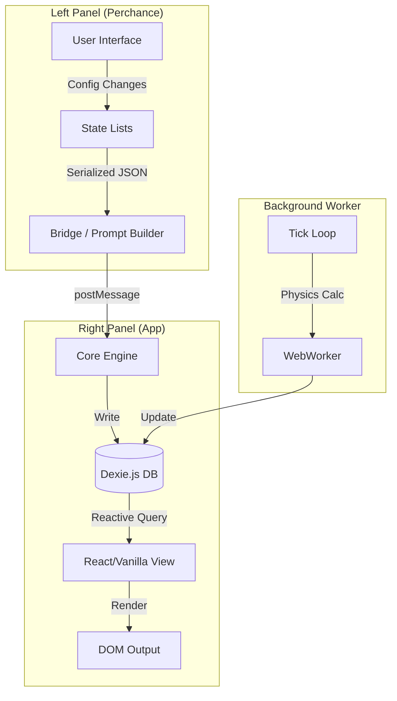
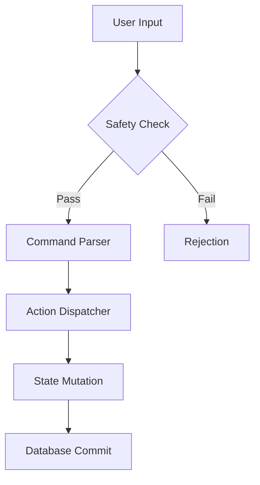

# System Context: JooduG Monorepo

## Root Constraints

- **Target Platform:** Perchance
- **Environment:** Client-Side Browser (No backend)
- **Database:** Dexie.js (IndexedDB)
- **Module System:** ESM (Native Modules)

## Context Map

- **Rules:** [AGENTS.md](AGENTS.md) (The governing laws)
- **Tech Stack:** [.agent/rules/tech-stack.md](.agent/rules/tech-stack.md) (Strict technical constraints)
- **Architecture:** [.agent/rules/architecture.md](.agent/rules/architecture.md) (System design & data flow)
- **Roadmap:** [.agent/planning/plan.md](.agent/planning/plan.md) (Current objectives)

## 🏗️ System Architecture

### Data Flow (The "Hybrid" Loop)



### Protocol Stack



## Directory Structure

```text
/
├── src/                   # Flat Source Code (RPGlitch)
├── libs/                  # Vendored Dependencies (No CDN)
├── tools/                 # Build & Maintenance Scripts
└── .agent/                # AI Context & Planning
```

## Critical Workflows

- **Dev:** `npm run dev` (Watch + Server)
- **Build:** `npm run build` (Single File Bundle)
- **Validate:** `npm run validate` (Lint + Test + Hygiene)
- **Deploy:** `npm run deploy` (Validate + Build)
- **Sync:** `npm run sync` (Local Context Refresh)

## 📌 State of the Union (Jan 2026)

### **Milestone: The Heartbeat & The Ghost**

The system has achieved **Narrative Autonomy**. The "Simulation Pulse" now beats in the background, grounding the chaotic AI imagination with a Physics-based gravity model. The "Ghostwriter" has evolved from a simple auto-complete into a sophisticated partner that respects user intent.

**Ready for Phase 2.5:** With the engine now generating rich memory logs (`log_entry`), the next logical step is **The Archivist**—a system to compress these raw memories into a cohesive history, ensuring the story can go on forever.

## Changelog

### v4.3.0 - Native Audio Protocol

- Replaced cloud voice API with optimized Native Browser Stack.
- Implemented "Call Mode" (Hands-free conversational loop).
- Hardened UI State Machine (Prevents interaction conflicts during generation).
- Enhanced Privacy (Local audio processing only).
