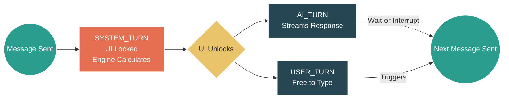

# 🔷 RPGlitch (JooduG Monorepo)

A next-generation AI Roleplay Engine built on the Perchance platform. RPGlitch is a "Local-First" web application that turns your browser into a sophisticated RPG tabletop. It features a **Simulation-Driven Architecture**, allowing you to create custom characters and engage in deep, coherent roleplay with an AI Game Master that adheres to strict narrative consistency.

## ⚡ Quick Start

**Run the following commands** in your terminal to get the engine running locally:

1.  **`npm install`** (Install dependencies)
2.  **`npm run sync`** (Sync vendor libraries)
3.  **`npm run dev`** (Build and launch the local server)

## ⏳ The Core Engine: Rounds & Turns

RPGlitch supersedes standard chatbot patterns by separating the narrative state from the user interface. Time flows via discrete "Rounds," which are broken down into specific "Turns."

**Sending a message always ends the current Round and triggers the start of the next.**

Here is the exact lifecycle of a single Round:

1.  **SYSTEM\_TURN (The Physics Engine)**
    Starts the exact moment you send a message. The UI is temporarily locked. In the background, the engine calculates social dynamics, memory consolidation, and world physics.
2.  **AI\_TURN + USER\_TURN (The Narrative Parallel)**
    The moment the system finishes calculating, the UI is unlocked. The AI begins streaming its narrative response (**AI\_TURN**). Because the UI is unlocked, your **USER\_TURN** begins at the exact same time.
3.  **The Interrupt Window**
    In 99% of cases, you will wait for the AI to finish generating before you begin typing your next move. However, because both turns run in parallel, you have the freedom to interrupt the AI at any time.
4.  **End of Round**
    **Click "Send"** on your next message to close the current round and immediately restart the loop at Step 1.

### Visualizing the Lifecycle

## 🏗️ Architecture & Technology Stack

The system architecture prioritizes offline-first resilience and agentic automation, utilizing a Zero-Trust Security model to sanitize the runtime environment.

### Folder Structure

* `src/core/` : Logic, Engine, Intelligence, and Security.
* `src/data/` : Database, Repository, and Persistence.
* `src/state/` : Reactive State Bridges.
* `src/ui/` : Interface Components.
* `src/theme/` : SCSS Design System.
* `src/media/` : Visuals, Audio, and Sensory Layer.

### Tech Stack

* **State Management:** IndexedDB via Dexie.js (Single source of truth)
* **UI Framework:** Svelte 5 (Runes) + Native SCSS
* **Bundler:** Vite 6
* **Security:** DOMPurify (XSS prevention)

## 🗺️ Documentation & Rules

* [Prime Directive](https://www.google.com/search?q=.agent/rules/01-foundation.md)
* [Agent Rules](https://www.google.com/search?q=GEMINI.md)
* [Automated Workflows](https://www.google.com/search?q=.agent/workflows/)
* [Architecture Atlas](https://www.google.com/search?q=.agent/knowledge/atlas/02-architecture.md)
* [Tech Stack Vision](https://www.google.com/search?q=.agent/knowledge/atlas/01-vision.md)
