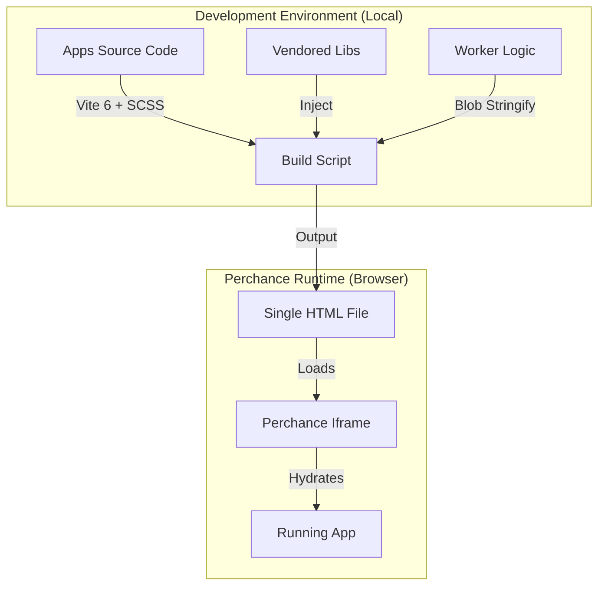

# 🔷 RPGlitch (JooduG Monorepo)

> **Standards:** [03-technetium](.agent/rules/03-technetium.md) (Technical Pillar)  
> **Platform:** [Perchance](https://perchance.org)

A next-generation AI Roleplay Engine built on Perchance, featuring a **Simulation-Driven Architecture** for immersive, consistent, and unrestricted storytelling. RPGlitch is a "Local-First" web application that turns your browser into a sophisticated RPG tabletop. It allows you to create custom Fractals and Characters, then engage in deep, coherent roleplay with an AI Game Master that adheres to strict narrative consistency rules.

## ⚡ Quick Start

```bash
# 1. Install & Sync
npm install
npm run sync

# 2. Build & Launch
npm run dev
```

## 🏗️ Architecture & The System

The system architecture prioritizes offline-first resilience and agentic automation.

- **Agentic Integration:** The Antigravity OS (`.agent/`) governs system rules and automated workflows.
- **Zero-Trust Security:** Strict sanitization and the "Freedom Protocol" safeguard the runtime environment.

### The Build Pipeline (Constraint-Based Engineering)

This explains how we turn a Monorepo into a Single File for the Perchance platform.



### ⏳ The Chrono Heartbeat (The Round Loop)

This outlines the strict, linear execution flow managed by **Chrono**. The engine distinguishes between **Rounds** (cumulative session progression) and **Turns** (discrete lifecycle phases within a round).

Specifically, **`1 Round = 1 Full Exchange`**, incremented only after completing the triad of internal turns:

- 🟢 **`USER_TURN`**: The triggering narrative input or physical action from the interface.
- 🔵 **`SYSTEM_TURN`**: The hidden physics loop—validating security, checking dynamic reflex triggers, and tracking internal state changes.
- 🟣 **`AI_TURN`**: The cognitive resolution—synthesizing data, calling the LLM Service, and streaming the atmospheric generation.

```mermaid
sequenceDiagram
    participant User
    participant UI as 🖥️ UI
    participant Chrono as ⏳ Chrono
    participant Security as 🛡️ Security
    participant Engine as 🎬 Engine
    participant AI as 🧠 LLM Service
    participant DB as 💾 Dexie

    Note over User, UI: 🟢 USER_TURN
    User->>UI: Story Action
    UI->>Chrono: advanceRound(input)

    rect rgb(30, 30, 35)
        Note over Chrono, DB: UI LOCKED (app.simulation.loading = true)

        Note over Chrono, Security: 🔵 SYSTEM_TURN
        Chrono->>Security: process(input)
        Security-->>Chrono: securityContext (Physics Result)

        Note over Engine, DB: 🟣 AI_TURN
        Chrono->>Engine: generateAiResponse(options)
        Engine->>AI: LlmService.generate(payload)
        loop Token Streaming
            AI-->>UI: app.updateStream(token)
            UI-->>User: Visual Feedback (Incremental)
        end
        AI-->>Engine: Full Response String
        Engine->>DB: Save Final Message

        Note over Chrono, DB: ⚓ ANCHOR ROUND
        Chrono->>DB: runtime.save(runtime.round)
        Note over Chrono, DB: UI UNLOCKED (app.simulation.loading = false)
    end
    UI-->>User: Interaction Ready
```



### The Simulation Engine

RPGlitch supersedes standard chatbot patterns by implementing a **Simulation Engine**. Instead of just generating text, the system calculates the "logic" of the narrative state in the background.

```text
src/
├── core/   # 🕰️ Logic, Engine, Intelligence, Security
├── data/   # 📚 Database, Repository, Persistence (Dexie)
├── state/  # ⚡ Reactive State Bridges (Svelte 5 Runes)
├── ui/     # 🛠️ UI Components (Atoms, Molecules, Organisms)
├── theme/  # 🎭 SCSS Design System (7-1 Architecture)
└── media/  # 🎨 Visuals, Audio, Sensory Layer
```

## 🛠️ Technology Stack

- **State Management:** IndexedDB via Dexie.js (single source of truth)
- **UI Framework:** Svelte 5 (Runes) + Native SCSS
- **Bundler:** Vite 6
- **Security:** DOMPurify for XSS prevention

## 🗺️ Related Documentation

- [Prime Directive](.agent/rules/01-foundation.md)
- [Agent Rules](GEMINI.md)
- [Automated Workflows](.agent/workflows/)
- [Architecture Atlas](.agent/knowledge/atlas/02-architecture.md)
- [Tech Stack Vision](.agent/knowledge/atlas/01-vision.md)
