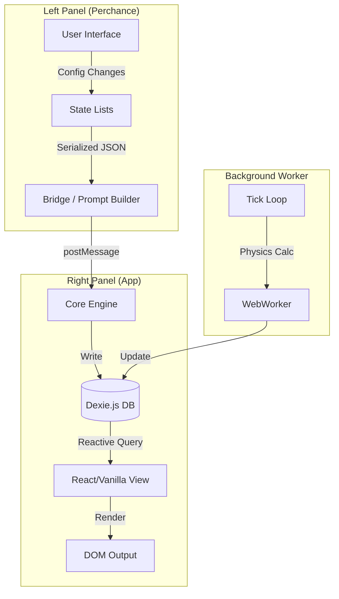
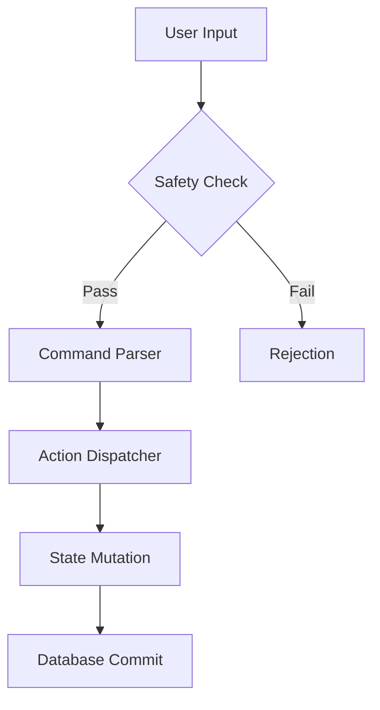

# System Context: JooduG Monorepo

## Root Constraints

- **Target Platform:** Perchance
- **Environment:** Client-Side Browser (No backend)
- **Database:** Dexie.js (IndexedDB)
- **Module System:** ESM (Native Modules)

## Context Map

- **Rules:** [AGENTS.md](AGENTS.md) (The governing laws)
- **Tech Stack:** [.agent/rules/tech-stack.md](.agent/rules/tech-stack.md) (Strict technical constraints)
- **Architecture:** [.agent/rules/architecture.md](.agent/rules/architecture.md) (System design & data flow)
- **Roadmap:** [.agent/planning/plan.md](.agent/planning/plan.md) (Current objectives)

## 🏗️ System Architecture

### Data Flow (The "Hybrid" Loop)



### Protocol Stack



## Directory Structure

```text
/
├── apps/                  # Application Source Code
│   ├── rpglitch/          # Main RPG App
│   └── imageglitch/       # Image Gen Helper
├── libs/                  # Vendored Dependencies (No CDN)
├── tools/                 # Build & Maintenance Scripts
└── .agent/                # AI Context & Planning
```

## Critical Workflows

- **Build:** `npm run build:apps`
- **Validate:** `npm run validate` (Runs Lint + Test)
- **Deploy:** `npm run deploy` (Full Pipeline)
