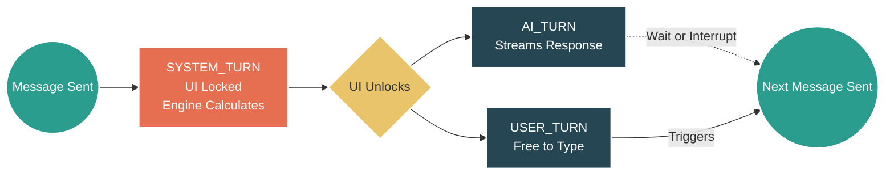

# 🔷 RPGlitch (JooduG Monorepo)

A next-generation AI Roleplay Engine built on the Perchance platform. RPGlitch is a "Local-First" web application that turns your browser into a sophisticated RPG tabletop. It features a **Simulation-Driven Architecture**, allowing you to create custom characters and engage in deep, coherent roleplay with an AI Game Master that adheres to strict narrative consistency.

## ⚡ Quick Start

**Run the following commands** in your terminal:

1. **`npm install`** (Install dependencies)
2. **`npm run sync`** (Sync local libraries)
3. **`npm run dev`** (Build and launch the local server)

## ⏳ The Core Engine: Rounds & Turns

RPGlitch supersedes standard chatbot patterns by separating the narrative state from the user interface. Time flows via discrete "Rounds," which are broken down into specific "Turns."

**Sending a message always ends the current Round and triggers the start of the next.**

Here is the anatomy of a single Round:

1. **SYSTEM_TURN (The Physics Engine)**
   Starts the exact moment you send a message. The UI is temporarily locked. In the background, the engine calculates social dynamics, memory updates, and world physics.
2. **AI_TURN + USER_TURN (The Narrative Parallel)**
   The moment the system finishes calculating, the UI is unlocked. The AI begins streaming its narrative response (**AI_TURN**). Because the UI is unlocked, your **USER_TURN** is active at the exact same time.
3. **The Interrupt Window**
   In 99% of cases, you will wait for the AI to finish generating before you begin typing your next move. However, because both turns run in parallel, you have the agency to interrupt the AI at any time.
4. **End of Round**
   **Click "Send"** on your next message to close the current round and immediately restart the loop at Step 1.

### Visualizing the Lifecycle

## 🏗️ Architecture & Technology Stack

The system architecture prioritizes offline-first resilience and agentic automation, utilizing a Zero-Trust Security model to sanitize the runtime environment.

### Folder Structure

- `src/engine/` : Logic and Round Orchestration.
- `src/intelligence/` : AI Kernel and Narrative Processing.
- `src/platform/` : Environment integrations.
- `src/data/` : Database, Repository, and Persistence.
- `src/state/` : Reactive State Bridges.
- `src/ui/` : Atomic Interface Components (actions, atoms, molecules, organisms, motion).
- `src/media/` : Visuals, Audio, CSS Design System, and Sensory Layer.

### Tech Stack

- **State Management:** IndexedDB via Dexie.js (Single source of truth)
- **UI Framework:** Svelte 5 (Runes) + Tailwind CSS v4
- **Bundler:** Vite 8
- **Security:** DOMPurify (XSS prevention)

## 🧠 Living Memory & Data Sovereignty

RPGlitch distinguishes **application memory** (what ships in the app) from **development memory** (agent-side infrastructure used while building it).

### 🧊 Application Memory (ships in the app)

- **Purpose**: In-simulation state, entity history, and narrative continuity.
- **Tech**: Dexie.js over IndexedDB (local-first, browser-resident).
- **Scope**: Lives in `src/data/`. See the `simulation` skill for the four-quadrant Entity Fragment architecture (Eternal / Present / Past / Future).
- **Persistence**: Survives reloads; the user's machine is the absolute host of their reality.

### 🔥 Development Memory (agent infrastructure, not shipped)

- **Working Memory (Pinecone)**: Active context grounding and RAG for the coding agent. Namespaces: `knowledge-base.meta` (constitution), `knowledge-base.src` (code patterns), `knowledge-base.external` (third-party docs).
- **Cold Storage (Supabase)**: Historical decision tracking — archived task plans, research logs, architectural post-mortems — for conflict resolution and understanding the "Why" behind past shifts.

> See `GEMINI.md` → Memory Protocol for the authoritative distinction.

---

## 🛸 Sovereign Swarm Operations (Globalized via MCP)

RPGlitch utilizes an agentic "Swarm" to handle complex, multi-file features in parallel. Swarm operations have been globalized and are now handled via MCP tools (`mcp_swarm_swarm_plan`, `mcp_swarm_swarm_dispatch`, `mcp_swarm_swarm_merge`).

If you are a human operator triggering a swarm sequence, consult the `/swarm` global workflow.

---

## 🗺️ Documentation & Rules

- [Sovereign Rules & Foundations](GEMINI.md)
- [Design System](DESIGN.md)
