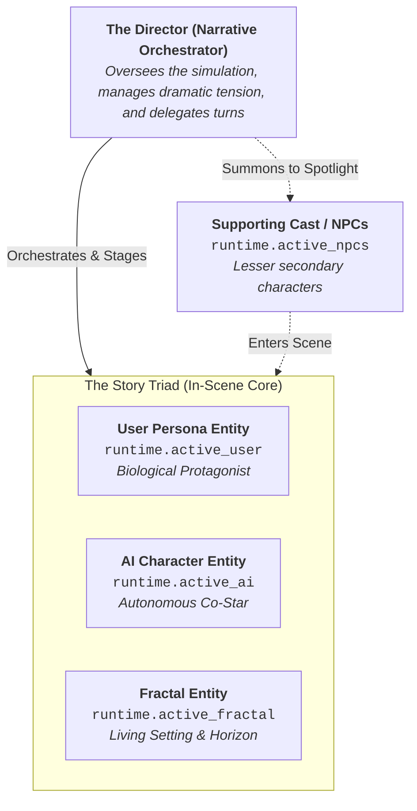
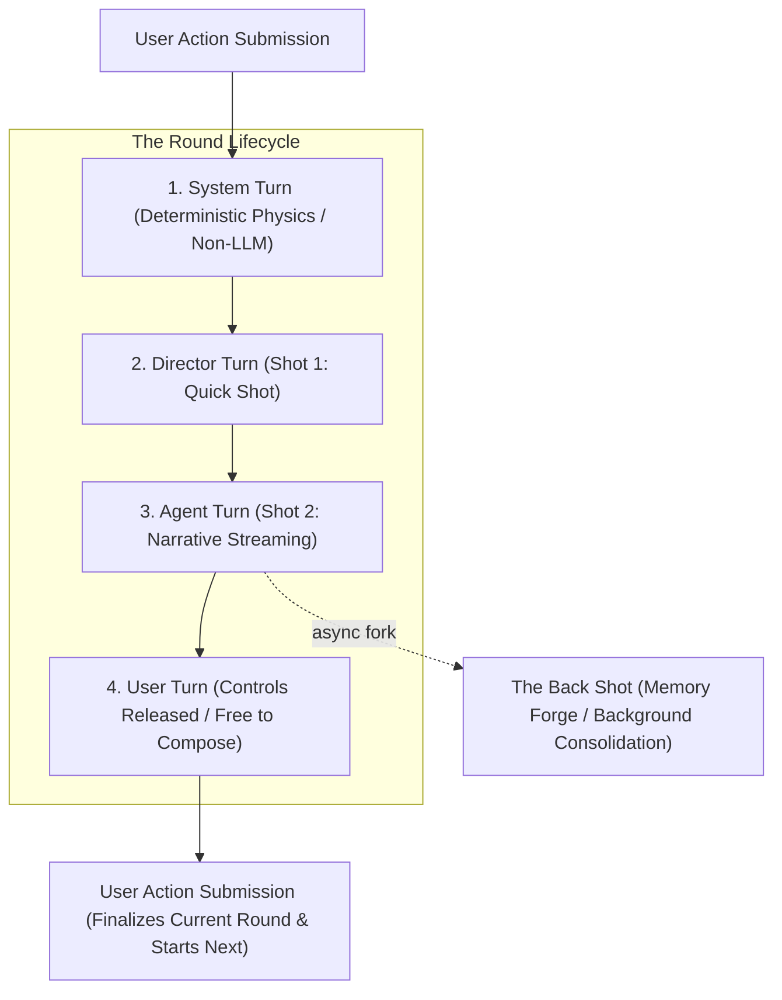

# 🔷 RPGlitch

> **A Simulation-Driven AI Roleplay Engine**  
> _State is Truth. The User is the Protagonist; the Engine is the Physics._

RPGlitch is a local-first web application designed for deep, stateful AI roleplay simulation. Superseding conventional, sterile chatbot patterns, RPGlitch separates physical and psychological truth from narrative prose. Characters possess biological limits, somatic signals, and secret trajectories, while living environmental fractals decay, shift, and react under player pressure.

---

## 1. The Simulation Philosophy

Traditional AI roleplay collapses because the language model is asked to be everything at once: the rule arbiter, the world simulator, the scene director, and the roleplaying actor. This inevitably causes **hallucinatory collapse**—characters magically read minds, physics bend to convenience, inventory evaporates, and conversations drift into agreeable, sterile pleasantness.

RPGlitch solves this through mechanical separation of concerns:

- **The Engine is the Physics**: Real mechanical truth (somatic dynamics, clothing, inventory, interpersonal relationship edges, environmental entropy) lives strictly inside structured state stores. It never lives inside ungrounded LLM memory.
- **The LLM is the Sensory & Expression Layer**: The language model never invents core physical state out of thin air. Instead, the engine projects state geometry into prompt envelopes, and the model acts as a subjective lens experiencing and vocalizing that reality.
- **User Agency Invariant (P1)**: The human participant owns the only unconstrained will in the simulation. The engine and autonomous agents may establish physical boundaries, emotional friction, and environmental consequences, but **never speak, act, predict, or think on behalf of the User Persona**.

---

## 2. The Story Triad, The Director & Supporting Cast

Every simulation session in RPGlitch is anchored by a core in-scene triad, overseen from above by the Director, with secondary characters summoned as narrative instruments:


```mermaid
flowchart TD
    Director["<b>The Director (Narrative Orchestrator)</b><br><i>Oversees the simulation, manages dramatic tension, and delegates turns</i>"]

    subgraph StoryTriad ["The Story Triad (In-Scene Core)"]
        direction LR
        User["<b>User Persona Entity</b><br><code>runtime.active_user</code><br><i>Biological Protagonist</i>"]
        AI["<b>AI Character Entity</b><br><code>runtime.active_ai</code><br><i>Autonomous Co-Star</i>"]
        Fractal["<b>Fractal Entity</b><br><code>runtime.active_fractal</code><br><i>Living Setting & Horizon</i>"]
    end

    Director -->|Orchestrates & Stages| StoryTriad
    Director -.->|Summons to Spotlight| Secondary["<b>Supporting Cast / NPCs</b><br><code>runtime.active_npcs</code><br><i>Lesser secondary characters</i>"]
    Secondary -.->|Enters Scene| StoryTriad
```

### The In-Scene Story Triad

The core dramatic relationship in every story revolves around three foundational anchors:

1. **User Persona Entity (`runtime.active_user`)**: The player's avatar. Protected by the Agency Invariant; autonomous agents are strictly forbidden from scripting the user's motor actions, speech, or thoughts.
2. **AI Character Entity (`runtime.active_ai`)**: The active autonomous co-star and primary counterpart in the scene. Governed by somatic dynamics, subtext, and private trajectories.
3. **Fractal Entity (`runtime.active_fractal`)**: The living environment entity. Governs atmospheric hazards, sensory descriptors, acoustic profile, structural decay, and overarching scene objectives.

### The Director (The Narrative Orchestrator)

Sitting above the in-scene triad is the **Director** (executing via Shot 1 / Quick Shot). The Director is the unseen orchestrator behind the simulation—evaluating state deltas against physical rules, regulating dramatic tension, managing scene pacing, and deciding whether the next beat belongs to the AI Co-Star, the Fractal, or a supporting character.

### Secondary Characters & Supporting Cast (`runtime.active_npcs`)

Secondary characters are **narrative tools for the Director to tell an engaging story**. Rather than cluttering the primary dynamic between the User and AI Co-Star, the Director can pull lesser secondary characters into the **Stage Spotlight** (`runtime.in_scene_npc_ids`)—or mint them on the fly—to serve as shopkeepers, guards, rivals, witnesses, or specialists.

- **Stage Spotlight**: NPCs in the spotlight can be delegated speaking turns (`npc:<id>`), engage in dialogue, and carry relational vectors.
- **Zero-Token Storage**: Off-stage cast members remain serialized in IndexedDB with zero token consumption until summoned.

> [!NOTE]
> **Shared Character Pool**: The repository holds characters ranging from fully fleshed-out primary personas to lesser secondary supporting characters. Any character can seamlessly be assigned as the active player avatar, the primary co-star, or an in-scene supporting NPC.

---

## 3. Simulation Dynamics (0–100)

Dynamics are numerical state scalars representing somatic, emotional, and environmental pressure. The inference engine translates these metrics into prose subtext, body language, and behavioral modifiers:

### Character Dynamics

Present on all character entities. In active storymode, the primary AI Character's dynamics drive behavioral mutations and somatic tells:

- **`chaos`**: Behavioral stability vs. erratic volatility.
- **`intensity`**: Autonomic nervous activation, adrenaline response, and heartbeat cadence.
- **`openness`**: Receptivity and vulnerability vs. defensive suspicion.
- **`affinity`**: Interpersonal trust, warmth, and attraction vs. hostility.

### Fractal Dynamics

- **`velocity`**: Kinetic pacing and environmental movement rate.
- **`entropy`**: Structural degradation, environmental noise, and physical breakdown.

---

## 4. The Simulation Heartbeat: Rounds & Turns

Time in RPGlitch progresses through a strict, discrete temporal heartbeat orchestrated across rounds and micro-turns:


```mermaid
flowchart TD
    UserAction["User Action Submission"] --> SystemTurn["1. System Turn (Deterministic Physics / Non-LLM)"]
    subgraph RoundCycle ["The Round Lifecycle"]
        direction TB
        SystemTurn --> Shot1["2. Director Turn (Shot 1: Quick Shot)"]
        Shot1 --> Shot2["3. Agent Turn (Shot 2: Narrative Streaming)"]
        Shot2 --> UserTurn["4. User Turn (Controls Released / Free to Compose)"]
    end
    Shot2 -. async fork .-> BackShot["The Back Shot (Memory Forge / Background Consolidation)"]
    UserTurn --> NextAction["User Action Submission (Finalizes Current Round & Starts Next)"]
```

### The Turn Sequence

1. **System Turn (Metaphysical Chronos)**: The instant an action is submitted, the engine evaluates deterministic state rules, somatic deltas, and spatial presence without calling an LLM.
2. **Director Turn (Shot 1 / Quick Shot)**: Fast staging inference. Evaluates the state kernel, validates participant intent against physics, updates dynamics, delegates the active speaker, and stages narrative beats.
3. **Agent Turn (Shot 2 / Narrative Turn)**: Asynchronous storyteller pass. Streams in-character prose from the delegated speaker's perspective, cleaned through deterministic prose detox filters.
4. **User Turn (Biological Protagonist)**: Conceptually the **final turn of the round**. The interface releases, allowing the user to reflect and compose their next action. Submitting that action simultaneously **completes the active round** and triggers the next cycle.
5. **The Back Shot (Background Narrative Support)**: An asynchronous process running in the background every round via a dedicated queue. Runs the **Memory Forge**, computing semantic embeddings, consolidating episodic vectors, and updating standing agendas without blocking the player.

---

## 5. System Specification Hierarchy

RPGlitch organizes technical and operational governance across a structured documentation hierarchy:

```
┌──────────────────────────────────────────────────────────────────────────┐
│ STRATEGIC: README.md (Product Vision, Game Design, Simulation Concepts)  │
└────────────────────────────────────┬─────────────────────────────────────┘
                                     ▼
┌──────────────────────────────────────────────────────────────────────────┐
│ TACTICAL SPECIFICATIONS: The Technical Contracts                         │
│ • ARCHITECTURE.md (Software topology, Svelte 5 runes, layer boundaries)  │
│ • DESIGN.md       (Visual tokens, typography, glassmorphism, motion)     │
│ • SECURITY.md     (Threat model, XSS mitigation, input sanitization)     │
│ • ROADMAP.md      (FUTURE: Target architectural specs & active backlog)  │
└────────────────────────────────────┬─────────────────────────────────────┘
                                     ▼
┌──────────────────────────────────────────────────────────────────────────┐
│ OPERATIONAL EXECUTION: Actionable Deliverables & History                 │
│ • Native Plans    (<brain>/plan.md: Immediate implementation bridges)    │
│ • CHANGELOG.md    (PAST: Historical release pulse & completed milestones)│
└──────────────────────────────────────────────────────────────────────────┘
```

- **[ARCHITECTURE.md](ARCHITECTURE.md)**: Authoritative technical specification for layer boundaries, Svelte 5 reactive stores, Dexie.js persistence, and the Two-Shot execution pipeline.
- **[DESIGN.md](DESIGN.md)**: Single source of truth for the Nordic design system, color tokens, typography, radii, and View Transition animations (adhering to the [design.md specification](https://github.com/google-labs-code/design.md)).
- **[SECURITY.md](SECURITY.md)**: Client-side defense-in-depth model, input sanitization boundaries, DOMPurify sink controls, and epistemic leak verification.
- **[ROADMAP.md](ROADMAP.md)**: Active engineering sprints, architectural blueprints for unbuilt features, and technical backlog.
- **[CHANGELOG.md](CHANGELOG.md)**: Chronological record of completed releases and architectural refactors.
- **[GEMINI.md](GEMINI.md)**: Sovereign engineering rules, coding standards, and agent operational behaviors.

---

## ⚡ Quick Start

```bash
npm install    # Install dependencies
npm run sync   # Sync design tokens and ignore layers
npm run dev    # Launch the local Vite development server
```
