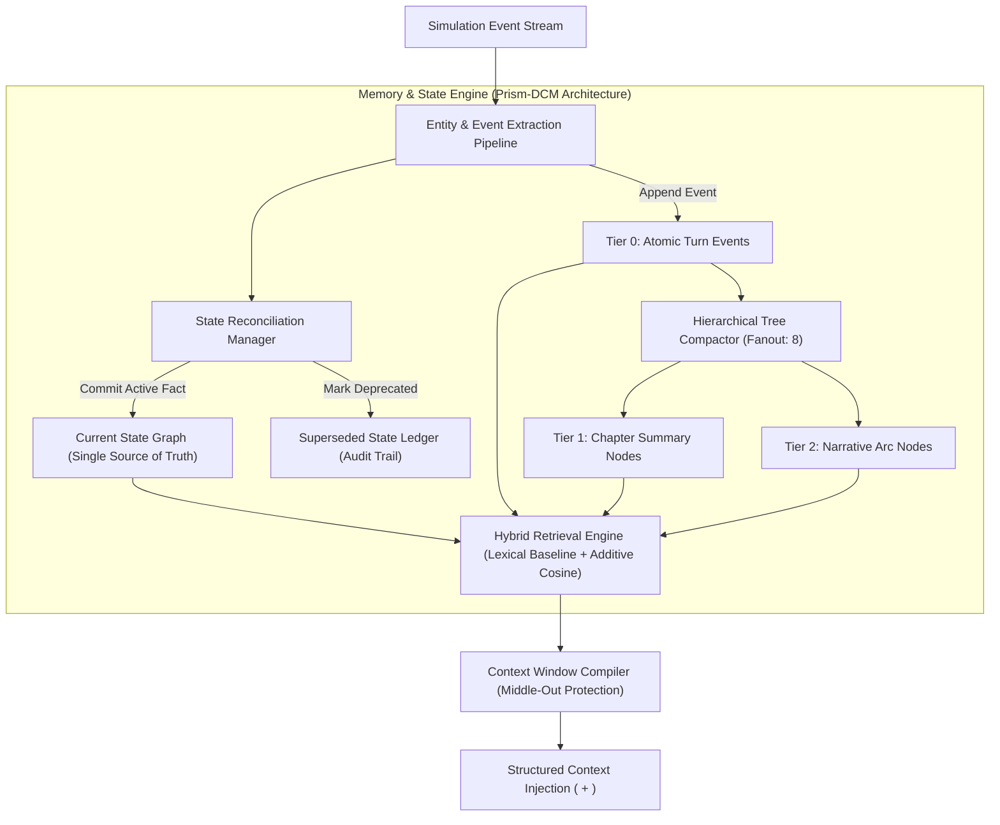

# RPGlitch Technical Roadmap

This roadmap defines the architectural blueprints, active engineering sprints, queued strategic initiatives, and technical backlog for RPGlitch.

---

## Active Sprint: Hierarchical Memory Compaction & Entity State Graph

- **Reference Identifier**: `memory-compaction-and-state-transitions`
- **Origin & Heritage**: Derived from MoeChat's proven **Project Prism-DCM** architecture (`SPEC-prism.md`, `SPEC-context-limit.md`), adapted for RPGlitch's multi-entity Svelte 5 simulation runtime.
- **Current Status**: Phase A of the Universal Bracket Predicates & Synaptic Engine (`src/intelligence/synaptic.js`) is implemented and verified 100% green with brace-depth alternation support, targeted slice splicing, 3-way epistemic filtering, and lockstep relationship synchronization. Generation stage tracking in `status.svelte.js`/`chrono.svelte.js`, speaker loading states in `Feed.svelte`, and storyboard confirmation modals in `StoryboardBar.svelte` are staged for verification.
- **Sprint Scope**: Hierarchical memory tree compaction, entity fact supersession, deterministic hybrid lexical retrieval, write-time rot prevention, and 8-bit vector quantization.

---

## Architecture Blueprint: Hierarchical Memory & State Reconciliation

### Technical Rationale

1. **Mutable State Invalidation Failure (Memory Collision)**
   In `src/intelligence/temporal.js`, historical turns are stored as a flat array capped at `PAST_VECTOR_CAP = 20`. When state changes over time (for example, Turn 3 records an acquired weapon and Turn 12 records its destruction), both entries remain active in the vector index. Similarity search retrieves both contradictory states, leading to context window hallucination.
2. **Hard Window Eviction & Early Loss**
   When history exceeds 20 items, a basic FIFO eviction strategy (`evict_oldest_evictable`) permanently discards early events, truncating initial setup and core character arcs.
3. **Inference Latency & Mutex Contention**
   Semantic search via Transformers.js ONNX embeddings blocks on the main thread and contends for resources with Kokoro TTS audio synthesis. Cold-starts or thread locks degrade retrieval responsiveness.
4. **Middle-Out Truncation Boundary (The 6,000-Token Cliff)**
   As proven in MoeChat's empirical testing (`SPEC-context-limit.md`), exceeding the model server's recommended context window (~6,000 tokens) causes silent, unannounced middle-out prompt truncation: the server keeps ~3,000 tokens of the head and ~3,000 tokens of the tail while discarding the middle without error. RPGlitch's context compiler must proactively fit prompts within this boundary.
5. **IndexedDB Storage Bloat**
   Storing uncompressed 384-dimension Float32 arrays directly inside Dexie.js causes rapid storage growth.

### Systems Design & Data Flow

### Technical Specifications

#### Entity State Machine & Fact Graphs (Layer 1)

- Maintain entity attributes as atomic subject-predicate-object triples: `(subject, predicate, object)` with importance `imp` (1–5) and confidence `conf` (0–1).
- **State transitions, not accumulation**: When updating an existing `subject + predicate` pair, flag the prior entry as `superseded`, append a `superseded_by` pointer, and record the turn timestamp.
- **Bare Slugs & Normalization**: Strip possessives and punctuation from entity slugs (`bare()`) to prevent entity duplication drift.
- Active prompts receive only current verified facts. Superseded entries remain persisted in Dexie.js for temporal queries and rollback capabilities.

#### Multi-Tier Compaction & Ghost Tokens (Layer 2)

- **Tier 0**: Direct extraction of key turning-point events (`addEvent`).
- **Tier 1 (Chapters)**: When a Tier 0 cluster reaches the fanout threshold (`prismFanout = 8` events), roll the window into a consolidated summary anchor node flagged with `ghost: true`.
- **Tier 2 (Arcs)**: Condense sets of Tier 1 summaries into high-level campaign milestones. Height capped at level 5 (`prismMaxLevel = 5`).
- **Selective Leaf Expansion**: Top-level summary anchors persist in baseline context; matching real-time input keywords dynamically expands only the relevant child events (`expandLeaf`, oldest-first) into working context while suppressing the parent summary line.
- **Offline Summary Default**: Node compaction computes deterministically offline without blocking on LLM calls; optional background AI passes upgrade summaries asynchronously.

#### Deterministic Hybrid Retrieval & Semantic Gravity

- Base ranking computes instantaneously without waiting for embedding generation:

$$\text{Score} = (\text{Entity Overlap} \times 3.0) + (\text{Lexical Frequency} \times 1.0) + (\text{Emotional Salience} \times 0.4) + (\text{Recency} \times 1.2)$$

- Semantic cosine similarity is integrated as an additive multiplier ($\times 1.5$) whenever embedding threads are idle, avoiding hard dependencies on model execution.

#### Write-Time Rot Prevention & Extraction Advisory

- **Extraction Advisory (`# ALREADY REMEMBERED`)**: Before extracting from new turns, supply the extraction prompt with the top 12 known facts/events to prevent re-extracting existing information under different wording.
- **Event Deduplication**: Hash normalized event strings (`eventKey`) to fold duplicate extractions into existing node provenance instead of appending redundant records.

#### Vector Quantization (int8)

- Downscale 384-dimensional vector arrays from 32-bit floats to 8-bit integers (`Uint8Array`) serialized as base64 strings.
- Reduces Dexie.js vector storage overhead by 75% while maintaining cosine similarity preservation $> 0.99$.

### Implementation Touchpoints

- `src/intelligence/synaptic.js` & `src/intelligence/synaptic.test.js`: Universal bracket predicate domain engine, brace-depth tokenization, targeted slice splicing, 3-way epistemic filtering, and cross-tempus relationship harvesting.
- `src/intelligence/index.js`: Barrel exports for universal bracket predicate domain functions (`parse_bracket_entries`, `filter_bracket_entries`, `apply_bracket_mutation`, `extract_entity_relationships`).
- `src/intelligence/modules/entities/epistemic.js`: Route privacy sanitization through `filter_epistemic_brackets` with owner secrecy signals.
- `src/intelligence/modules/entities/presence.js`: Unified relational dispositions harvesting universal bracket predicates with legacy fallback.
- `src/intelligence/director.js`: Relational actuator synchronizing incoming dynamics onto `present.non_physical` via `apply_bracket_mutation`.
- `src/intelligence/temporal.js` & `src/intelligence/temporal.test.js`: Implement `add_entity_fact()`, `compact_fractal_nodes()`, flat bracket parsing in `resolve_vector_pool()`, and update `compute_relevance()` with the hybrid retrieval formula.
- `src/ui/profile/RelationalGraph.svelte` & `src/ui/profile/RelationalGraph.test.js`: Multi-tempus relationship constellation graph harvesting cross-tempus bracket relationships with tempus badges.
- `src/platform/embeddings.svelte.js`: Add `quantize_vector_q8()` and `dequantize_vector_q8()` serialization codecs.
- `src/intelligence/modules/format.js` & `src/intelligence/modules/entities/sheets.js`: Format context injection into isolated `<CURRENT_STATE>` and `<HISTORICAL_CONTEXT>` blocks.
- `src/state/chrono.svelte.js`: Attach tree compaction triggers to turn finalization on a configured interval (e.g., every 4 turns).

---

## Queued Strategic Initiatives

### 1. Runtime Lifecycle Orchestration & Storyboard Guardrails

- **Scope**: State machine lifecycle management, speaker generation indicators, storyboard navigation guards, and UI transition timings.
- **Status**: Staged for final verification.
- **Origin**: User interaction flow specifications and storyboard lifecycle audits.
- **Target Deliverables**:
  - **Deterministic Generation Flow**: Enforce the 7-step turn progression:
    1. User submits action.
    2. Shimmer sweep indicates Director evaluating physics and speaker delegation.
    3. Designated speaker avatar/halo spawns in the feed column with an active thinking state.
    4. Speech bubble mounts and typewriter streaming commences.
    5. Shimmer pulse harmonizes with typewriter output tempo.
    6. Speaker thinking state completes synchronously with typewriter stream conclusion.
    7. Audio chime / SFX triggers cleanly on stream completion.
  - **Active Session Navigation Guard**: Modal dialog in `src/ui/console/StoryboardBar.svelte` guarding story transitions:
    - _Resume Active Story_: Return to current narrative session.
    - _Conclude & Archive_: Finalize active session, commit state to Dexie.js, and load new scenario.
    - _Cancel_: Dismiss without state mutation.
  - **Flicker Elimination**: Prevent temporary avatar flash on turn submission by latching speaker resolution until Director evaluation settles.

### 2. Dynamic Pacing Contracts & Prose Heuristics Engine

- **Scope**: Turn-size proportional scaling, anti-staging constraints, runtime slop linting, and held-moment detection.
- **Status**: Queued in backlog.
- **Origin**: MoeChat's Reply Models specification (`SPEC-models.md` §5, §8, §13).
- **Target Deliverables**:
  - **Input-Proportional Sizing**: Deterministically classify user input in `src/intelligence/modules/task.js`:
    - `TINY` ($\le 12$ chars or action-only): Clamp generation to 1 beat. A simple "hey" or nod receives a focused single response, never an unprompted essay.
    - `SMALL` ($\le 90$ chars): Clamp generation to $\le 2$ beats.
    - `MEDIUM` ($\le 400$ chars): Allow standard narrative pacing ($\le 4$ beats).
    - `EXPANSIVE` ($> 400$ chars): Allow full narrative scope.
  - **Anti-Staging Constraints**: Inject strict directives for terse dialogue turns to prevent gratuitous physical movement (walking to windows, pouring drinks, adjusting clothes) when movement is not the core focus of the turn.
  - **Multi-Tier Slop Linter (`src/utils/styles.js`)**:
    - _Tier 1 (Structural Flaws)_: Purge repetitive construction patterns (`not X, but Y`, `despite himself`, `against her better judgment`, `the air grew thick`).
    - _Tier 2 (Stock Physical Tells)_: Cap cliché somatic markers to $\le 1$ per reply (ghost of a smirk, breath hitched, eyes darkened, white knuckles, jaw ticking).
  - **Held-Moment Permitting**: Detect conversational pauses and silence without forcing abrupt scene transitions.

### 3. World Info & Triggered Lorebook System

- **Scope**: Keyword-triggered world information documents decoupled from individual entity character sheets.
- **Status**: Queued in backlog.
- **Origin**: MoeChat's World Info specification (`SPEC-lorebook.md`).
- **Target Deliverables**:
  - **Standalone Lorebook Entity Schema**: `(id, name, description, scan_depth, token_budget, recursive, entries[])`.
  - **Multi-Pass Regex & Token Matching**: Support regex, glob wildcards, and whole-word matching over the last $N$ turns.
  - **Secondary Filter Logic**: Support `any`, `all`, `not_any` narrowing conditions.
  - **Budget-Conscious Insertion**: Inject fired entries into prompt envelopes with strict token ceilings to avoid crowding live character state.

### 4. Epistemic Partitioning & Multi-Speaker Delegation Hardening

- **Scope**: Zero-omniscience character boundaries, background speech arbitration, and ghostwriting mechanics.
- **Status**: Queued in backlog.
- **Origin**: RPGlitch Simulation Engine physics and MoeChat prompt contract (`SPEC-prompt.md`).
- **Target Deliverables**:
  - **Private Directive Purging**: Ensure `[SECRET: ...]` and `[PLAN: ...]` tags are rigorously scrubbed across the Epistemic Wall before compiling character inference prompts.
  - **Fractal & NPC Audio Stream Concurrency**: Prevent audio synthesis cutoffs when ambient fractal dialogue overlaps with AI character speech.
  - **Ghostwriting & Alternative Branch Exploration**: Allow the Director to supply bracketed alternative dialogue branches for user-guided exploration.

---

## Backlog & Technical Debt

### Codebase Debt & Immediate Micro-Actions

- [ ] Complete transition of any lingering `tasks/` references across tool scripts.
- [ ] Monitor Dexie.js 4 memory store indices during state-transition compaction testing.
- [ ] Verify Kokoro neural TTS mutex handling when background memory worker executes.
- [ ] Audit all prompt templates for middle-out truncation risk against the 6,000-token ceiling (`SPEC-context-limit.md`).
- [ ] Unify simulation logging mechanisms to resolve disparate conversation history formats across UI components.
