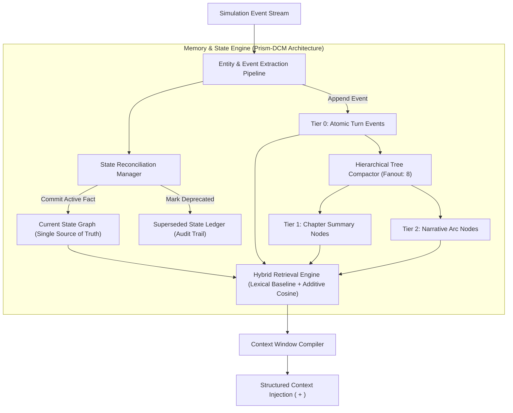

# RPGlitch Technical Roadmap

This roadmap outlines the core architectural tracks, active engineering sprints, and completed milestones for the RPGlitch simulation engine.

---

## Active Sprint: Hierarchical Memory Compaction & Entity State Graph

- Reference Identifier: `memory-compaction-and-state-transitions`
- Current Status: Generation stage tracking in `status.svelte.js` and `chrono.svelte.js` is complete; speaker loading states in `Feed.svelte` and storyboard confirmation modals in `StoryboardBar.svelte` are staged for verification.
- Sprint Scope: Hierarchical memory tree compaction, entity fact supersession, hybrid lexical retrieval, and 8-bit vector quantization.

---

## Architecture Blueprint: Hierarchical Memory & State Reconciliation

### Technical Rationale

1. Mutable State Invalidation Failure (Memory Collision)
   In `src/intelligence/temporal.js`, historical turns are stored as a flat array capped at `PAST_VECTOR_CAP = 20`. When state changes over time (for example, Turn 3 records an acquired weapon and Turn 12 records its destruction), both entries remain active in the vector index. Similarity search retrieves both contradictory states, leading to context window hallucination.

2. Hard Window Eviction
   When history exceeds 20 items, a basic FIFO eviction strategy (`evict_oldest_evictable`) permanently discards early events, truncating initial setup and core character arcs.

3. Inference Latency & Mutex Contention
   Semantic search via Transformers.js ONNX embeddings blocks on the main thread and contends for resources with Kokoro TTS audio synthesis. Cold-starts or thread locks degrade retrieval responsiveness.

4. IndexedDB Storage Bloat
   Storing uncompressed 384-dimension Float32 arrays directly inside Dexie.js causes rapid storage growth.

### Systems Design & Data Flow

### Technical Specifications

#### Entity State Machine & Fact Graphs

- Maintain entity attributes as atomic subject-predicate-object triples: `(subject, predicate, object)`.
- When updating an existing `subject + predicate` pair, flag the prior entry as `superseded`, append a `superseded_by` pointer, and record the turn timestamp.
- Active prompts receive only current verified facts. Superseded entries remain persisted in Dexie.js for temporal queries and rollback capabilities.

#### Multi-Tier Compaction (Summary Anchor Nodes)

- Tier 0: Direct extraction of key turning-point events.
- Tier 1 (Chapters): When a Tier 0 cluster reaches the fanout threshold (8 events), roll the window into a consolidated summary anchor node flagged with `ghost: true`.
- Tier 2 (Arcs): Condense sets of Tier 1 summaries into high-level campaign milestones.
- Selective Leaf Expansion: Top-level summary anchors persist in baseline context; matching real-time input keywords dynamically expands only the relevant child events into working context.

#### Deterministic Hybrid Retrieval

- Base ranking computes instantaneously without waiting for embedding generation:

$$\text{Score} = (\text{Entity Overlap} \times 3.0) + (\text{Lexical Frequency} \times 1.0) + (\text{Emotional Salience} \times 0.4) + (\text{Recency} \times 1.2)$$

- Semantic cosine similarity is integrated as an additive multiplier ($\times 1.5$) whenever embedding threads are idle, avoiding hard dependencies on model execution.

#### Vector Quantization (int8)

- Downscale 384-dimensional vector arrays from 32-bit floats to 8-bit integers (`Uint8Array`) serialized as base64 strings.
- Reduces Dexie.js vector storage overhead by 75% while maintaining cosine similarity preservation $> 0.99$.

### Implementation Touchpoints

- `src/intelligence/temporal.js`: Implement `add_entity_fact()`, `compact_fractal_nodes()`, and update `compute_relevance()` with the hybrid retrieval formula.
- `src/platform/embeddings.svelte.js`: Add `quantize_vector_q8()` and `dequantize_vector_q8()` serialization codecs.
- `src/intelligence/modules/format.js` & `src/intelligence/modules/entities/sheets.js`: Format context injection into isolated `<CURRENT_STATE>` and `<HISTORICAL_CONTEXT>` blocks.
- `src/state/chrono.svelte.js`: Attach tree compaction triggers to turn finalization on a configured interval (e.g., every 4 turns).

---

## Queued Tracks

### Runtime Lifecycle Orchestration & Storyboard Guardrails

- Scope: State machine lifecycle management, speaker generation indicators, storyboard navigation guards, and UI transition timings.
- Status: Staged for final verification.
- Target Deliverables:
  - 5-stage deterministic execution lifecycle (`start_director_stage`, `set_delegated_speaker`, `start_stream_stage`, `complete`).
  - Active story guard dialog in `src/ui/console/StoryboardBar.svelte` handling session recovery and resets.
  - Opacity and timing harmonization for `src/ui/motion/Shimmer.svelte`.

### Dynamic Pacing Contracts & Prose Heuristics Engine

- Scope: Input-dependent response sizing, anti-staging constraints for terse dialogue, and heuristic post-processing filters.
- Status: Queued in backlog.
- Target Deliverables:
  - Input categorization (`TINY` $\le 15$ chars, `SMALL` $\le 90$ chars, `MEDIUM`, `EXPANSIVE`) in `src/intelligence/modules/task.js` to dynamically scale generation limits.
  - Anti-staging constraint injection for short turns to prevent excessive physical blocking and cinematic monologues.
  - Rule-based regex scrubbers in `src/utils/styles.js` targeting mechanical dialogue clichés, unprompted narrative transitions ("Meanwhile", "Suddenly"), and repetitive simile constructions.
  - Narrative beat segmentation in `src/utils/text.js` to bound completion lengths on concise turns.

---

## Backlog & Technical Debt

### Codebase Debt & Immediate Micro-Actions

- [ ] Complete transition of any lingering `tasks/` references across tool scripts.
- [ ] Monitor Dexie.js 4 memory store indices during state-transition compaction testing.
- [ ] Verify Kokoro neural TTS mutex handling when background memory worker executes.
