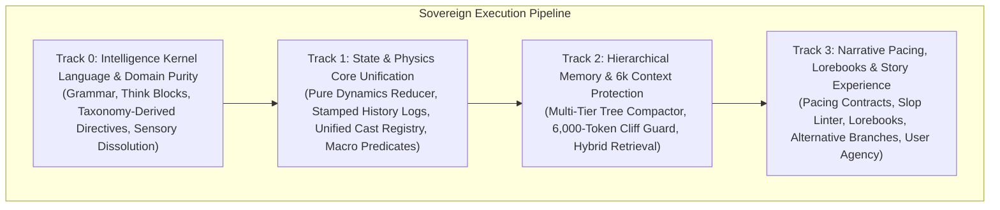
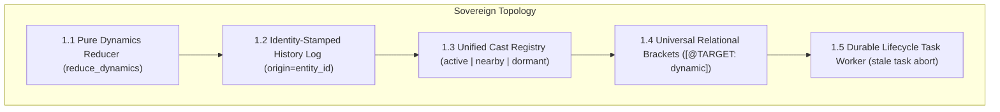
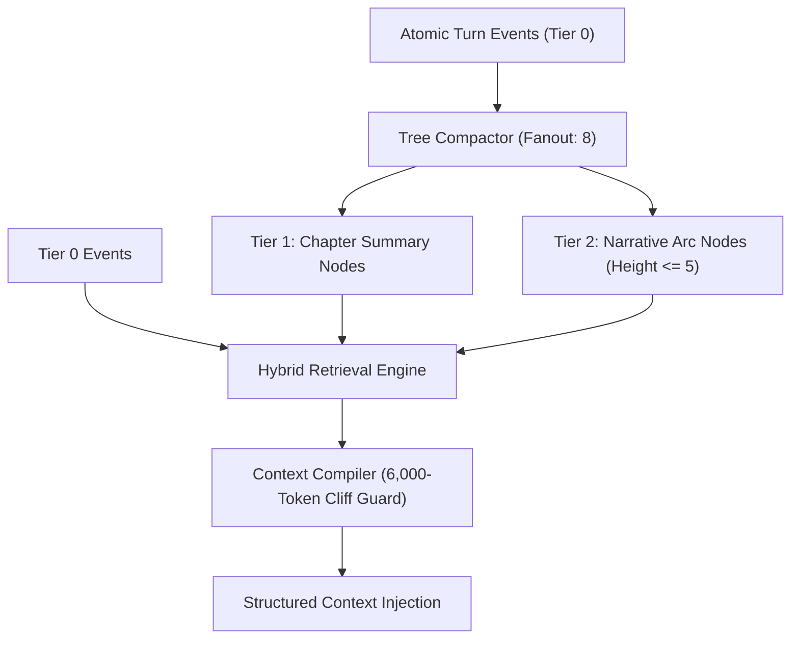

# RPGlitch Technical Roadmap

This roadmap defines the authoritative technical backlog, active engineering sprints, and target architectural blueprints for **RPGlitch**.

- **Temporal Mirror**: `ROADMAP.md` is the **FUTURE mirror** representing exclusively the unbuilt delta between the current state and the desired target state. Completed milestones are recorded in [CHANGELOG.md](CHANGELOG.md) (the **PAST mirror**).
- **Core Specifications**:
  - [README.md](README.md): Strategic product overview, game design, and simulation philosophy.
  - [ARCHITECTURE.md](ARCHITECTURE.md): Authoritative software architecture, layer boundaries, and state reality in `src/`.
  - [DESIGN.md](DESIGN.md): Nordic visual design tokens, typography, and motion contracts.
  - [SECURITY.md](SECURITY.md): Threat defense, input sanitization, and sink controls.
- **Idea Promotion Lifecycle**: Uncommitted mechanical ideas and exploratory proposals incubate in [`.agents/skills/simulation/references/`](.agents/skills/simulation/references/) as `suggestion-*.md`. When an idea is **promoted** from an exploratory possibility into a planned initiative, it is **removed from the incubator and fully migrated into this roadmap**.

---

## 🏛️ Engineering Backlog & Tracks at a Glance

---

## 1. Track 0: Intelligence Kernel Language & Domain Purity (The Synthetic Plan)

Ground-up linguistic and structural reconstruction across prompt compilers and intelligence domain modules (`task.js`, `reflex.js`, `protocols.js`, `style.js`, `sensory.js`, `physics.js`, `prompts.js`, `builder.js`). Enforces uniform grammar, eliminates circular dependencies, redesigns cognition think blocks, and rebuilds directives dynamically from the `PROFILE_FIELDS` taxonomy.

### Phase 0: Language & Token Contract (Define Before Use)

- [ ] **0.1 Uniform Instruction Language**:
  - **Grammar Law**: _Tags draw the boxes, lists fill them._
  - **Rules**:
    - Exactly one XML tag per instruction block (stable, CONTRACT-testable identity).
    - No nested headline restating the tag name inside the block.
    - Block bodies formatted strictly as numbered lines (sequence), bullets (sets), or bare prose (single mandate) to eliminate tag tax.
    - Forbid per-step tags (e.g. `<BEAT id step>` eliminated in favor of clean ordered lists `1. ... 2. ...`). Concept-level tags (`<TYPOGRAPHY>`, `<GROUNDING>`) remain.
  - **Touchpoints**: `src/intelligence/modules/task.js`, `src/intelligence/modules/protocols.js`.
- [ ] **0.2 Three-Layer Token System Contract**:
  - **Specification**:
    - `{...}` (Build-Time): Parameter interpolation within catalog atoms.
    - `«ABSOLUTE»` (Runtime Reference): Entity and regional referents (avoids raw tag literals in prose per metasyntax law).
    - `@` (Output Vocabulary Only): Reserved strictly for bracket directives (`[@TARGET: ...]`, `[@USER: ...]`).
  - **Constraint**: Add negative leak rule to `PROSE_DISCIPLINE` and `MACRO` protocols: _Never emit `@-tokens` outside bracket directives in narrative prose._
  - **Documentation**: Document the 3-layer token convention explicitly in the architectural header of `src/intelligence/modules/task.js`.
  - **Touchpoints**: `src/intelligence/modules/protocols.js`, `src/intelligence/modules/task.js`.

### Phase 1: Dead Surface & Redundancy Pruning

- [ ] **0.3 Strip Redundant Identity Claims from Scene Directives**:
  - **Problem**: `CONTINUATION` opens with _"You are the Fractal itself, narrating the scene"_ (duplicating the `<ROLE>` line), and `PROLOGUE`/`EPILOGUE`/`COLLAPSE` open with _"You see everything."_
  - **Action**: Delete identity preambles from `PROSE.SCENE`. Scene directives open directly with temporal sequencing and staging mandates (`"Open the scene..."`, `"Close the scene..."`).
  - **Touchpoints**: `src/intelligence/modules/task.js`, `src/intelligence/modules/task.test.js`, `src/intelligence/prompts.test.js`, `src/intelligence/builder.test.js`.
- [ ] **0.4 Merge `NPC_BOUNDARY` into `CHARACTER.BASE`**:
  - **Problem**: `NPC_BOUNDARY` duplicates core third-person limited constraints with minor speaker variations.
  - **Action**: Unify into a single boundary directive for `interaction` and `npc` turns: _"Own only your voice, actions, and perspective; never speak, act, or decide for other participants, or resolve overarching quests; end on a natural beat."_
  - **Refactor**: Remove the `is_npc` branch in `resolve_character_action_directive`. Speaker naming is preserved cleanly in the role line.
  - **Touchpoints**: `src/intelligence/modules/task.js`, `src/intelligence/modules/task.test.js`.

### Phase 2: Think System Redesign & Ghostwrite Purity

- [ ] **0.5 Cognition Think-Instruction Redesign & Optics Think Absorption**:
  - **Architecture**: Replace fragmented `THINK_CHARACTER`, `THINK_NARRATOR`, `THINK_ENHANCEMENT`, and sensory think blocks with a universal 3-sentence shell (open tag, ~200-word budget, close-and-conceal) populated by mode-specific numbered steps (dropping the `<BEAT id step>` XML wrapper):
    - _Character_: Stance (unsaid want + internal feeling) $\rightarrow$ Friction $\rightarrow$ Mask (how psychology leaks or conceals) $\rightarrow$ Smallest observable action. Purge dialogue pre-drafting beats that bias LLMs toward dialogue over action.
    - _Narrator / Fractal_: Tableau (freeze bodies in space) $\rightarrow$ Vector (the single mechanical or environmental change this beat delivers) $\rightarrow$ Sensorium (commit one dominant sensory channel charged with style DNA grounding). Spatial first, psychological second.
    - _Enhancer_: Canon check $\rightarrow$ Contrast vs cast on this axis $\rightarrow$ Compression (subtractive filtering).
    - _Optics_: Camera-calibration think steps absorb directly into the shared shell in `task.js` (ending split think templates across files).
  - **Naming Harmonization**: Fix naming collision — manifest content key retains `think_format`, while `TASK_MODE_PLANS` resolver is renamed `think`.
  - **Touchpoints**: `src/intelligence/modules/task.js`, `src/intelligence/modules/output.js`, `src/intelligence/builder.js`, `src/intelligence/prompts.test.js`, `src/intelligence/modules/task.test.js`.
- [ ] **0.6 Ghostwrite as Pure Speaker-Swap**:
  - **Architecture**: Ghostwrite becomes a standard `interaction` turn with speaker `USER` and zero custom branches:
    - Eliminate `style: null` subtext special case in `builder.js`.
    - Retire `GHOSTWRITE.BASE`; route ghost drafts through merged `CHARACTER.BASE` (from 0.4) and prune `is_ghostwrite` branch in `resolve_character_action_directive`.
    - Remove `SUBTEXT` for ghostwrite (live somatic dynamics are tracked for AI and Fractal only; user dynamics are static profile baselines, making behavioral tell signals phantom noise).
  - **Touchpoints**: `src/intelligence/builder.js`, `src/intelligence/modules/task.js`, `src/intelligence/prompts.test.js`.

### Phase 3: Taxonomy-Derived Directives & Director Reconstruction

- [ ] **0.7 Director Directives Reconstruction (`AGENCY`, `ROUTING`, `CAST_ECONOMY`)**:
  - **Problem**: Current `LOCK`, `ROUTING`, and `CONVERGENCE` directives state valid action enums and turn-yielding rules twice each; `directors_note` field scoping is incorrectly coupled into agency lock; genesis logic is split across routing and convergence.
  - **Architecture**: Reconstruct into three distinct single-concern atoms:
    - `AGENCY`: Player untouchable — never emit player as `next_action`, never script player dialogue/actions in `directors_note`. Auto-open window rule stated once. _(Crucial: director prompt carries `constitution: false`, making this the sole player agency shield)._
    - `ROUTING`: Pure decision tree (player-relevant $\rightarrow$ `AI`; environmental $\rightarrow$ `FRACTAL`; unfinished NPC dialogue $\rightarrow$ `npc:id`; cast gap $\rightarrow$ `GENESIS`; arc conclusion $\rightarrow$ `EPILOGUE_*`). Single authoritative home of the action enum.
    - `CAST_ECONOMY`: Reuse-before-mint discipline, referenced directly by the genesis branch.
  - **Touchpoints**: `src/intelligence/modules/task.js`, `src/intelligence/prompts.js`, `src/intelligence/director.test.js`.
- [ ] **0.8 Taxonomy-Derived Continuum Directives (`MANDATE`)**:
  - **Architecture**: Fold `TARGET_FOCUS` into the header of `MANDATE`. Dynamically derive the consolidation mandate from `PROFILE_FIELD_CATALOG` (`@data`):
    - A procedural walker iterates taxonomy layers (`eternal.physical`, `eternal.non_physical`, `present.physical`, `present.non_physical`, `past`, `future`) and emits one instruction line per layer from catalog metadata.
    - Fixes stale relationship pinning (relational bracket edges now span all non-physical fields rather than `present.non_physical` exclusively).
    - Eliminates redundant per-key documentation already provided by JSON schema definitions.
  - **Touchpoints**: `src/intelligence/modules/task.js`, `src/intelligence/prompts.js`, `src/intelligence/temporal.test.js`.
- [ ] **0.9 Taxonomy-Derived Profile Sorting Directives**:
  - **Architecture**: Reuses the taxonomy walker from 0.8 to generate field extraction lines directly from the type-selected entity model:
    - Delete `MACRO` atom; pull `@`-vocabulary directly from `protocols.js` `resolve_macro_directive`.
    - Delete `FOCUS_CHARACTER` and `FOCUS_FRACTAL` atoms (type scope is inherent in generated lines; retain one filter rule: _"Discard text belonging to the other entity half"_).
    - Replace hand-listed `REDISTRIBUTE` examples with inverted taxonomy directives.
  - **Touchpoints**: `src/intelligence/modules/task.js`, `src/intelligence/profile.test.js`.

### Phase 4: Structural Decoupling & Sensory Dissolution

- [ ] **0.10 Physics & Task Domain Re-Alignment**:
  - **Move Subtext to Physics**: Relocate `render_subtext_xml` and `resolve_physics_protocols` from `reflex.js` to `physics.js` (which owns `PHYSICS_PROTOCOLS` and dynamics evaluators, eliminating the dependency-injection bag from `builder.js`). `reflex.js` retains posture, recovery, and turn-state.
  - **Move Keywords to Task**: Relocate `render_available_keywords_xml` from `reflex.js` to `task.js` (co-locating it with `KEYWORD_DIRECTIVES` and `render_keyword_directives_xml`).
  - **Purge Dead Layer Slot**: Remove inert `layer` system slot from `system.js` and `prompts.js` (`resolve_layer_slot` returns `""` unconditionally).
  - **Touchpoints**: `src/intelligence/modules/reflex.js`, `src/intelligence/physics.js`, `src/intelligence/modules/task.js`, `src/intelligence/modules/system.js`, `src/intelligence/prompts.js`, `src/intelligence/builder.js`.
- [ ] **0.11 Dissolve `sensory.js` (Eliminate Double Import Cycles)**:
  - **Problem**: `sensory.js` introduced circular dependencies (`sensory ↔ task`, `sensory ↔ entities`) and split static catalogs (`PROTOCOL_LIBRARY.OPTICS` vs `SENSORY_LIBRARY`).
  - **Re-Distribution**:
    - _Static Atoms_ (`SUBJECT_RULES`, `SOLO_FRAME`, `ENVIRONMENTAL_SCALE`, `BACKGROUND`, `SPATIAL_GEOMETRY`, `MANDATE`, etc.) $\rightarrow$ `src/intelligence/modules/protocols.js`. Retire `get_sensory_atom` into `resolve_static_rule`.
    - _Subject Tiers & Selection_ (`SUBJECT_TIERS`, `resolve_optics_subject`) $\rightarrow$ `src/intelligence/modules/entities.js`.
    - _Cinematography_ (presets, rules, `resolve_optics_cinematography`) $\rightarrow$ `src/intelligence/modules/style.js`.
    - _Envelope Slots_ (think, target, spatial framing) $\rightarrow$ `src/intelligence/modules/task.js`.
    - _Optics Entities XML_ $\rightarrow$ `src/intelligence/modules/entities.js`.
    - _Optics Triggers_ (`IMAGE_TRIGGER`, `evaluate_image_trigger`) $\rightarrow$ `src/intelligence/physics.js`.
    - _Visual Payload Synthesis_ (`compose_visual_generation_prompt`, `build_aesthetic_map`) $\rightarrow$ `src/intelligence/modules/style.js`.
    - _Deterministic Fallback_ (`render_optics_fallback`) $\rightarrow$ `src/media/optics.js`.
    - Delete `src/intelligence/modules/sensory.js` and distribute tests into neighboring test suites.
  - **Touchpoints**: `src/intelligence/modules/protocols.js`, `src/intelligence/modules/entities.js`, `src/intelligence/modules/style.js`, `src/intelligence/modules/task.js`, `src/intelligence/physics.js`, `src/media/optics.js`.

### Phase 5: Verification & Standing Metasyntax Gate

- [ ] **0.12 Token-Hygiene Purge & Metasyntax Enforcement Gate**:
  - **Suite**: Create standing automated test gate `src/intelligence/metasyntax.test.js` validating all compiled prompts and catalog sources:
    - _No Raw Tag Literals_: Zero unescaped `<TAG>` literals in directive prose bodies (prevents prompt boundary injection).
    - _Strict Runtime Referents_: Every `«TOKEN»` strictly matches a frozen allowlist.
    - _Zero Stray Braces_: Every `{placeholder}` in catalog sources must resolve cleanly during compilation (no un-interpolated curly brackets).
    - _Output Token Containment_: `@-tokens` appear strictly inside bracket directives or macro rules, never in narrative prose bodies.
  - **Touchpoints**: `src/intelligence/metasyntax.test.js`, `src/intelligence/prompt-verification.js`, `src/intelligence/prompt-verification.test.js`, `src/intelligence/modules/output.test.js`, `src/intelligence/modules/protocols.test.js`.

---

## 2. Track 1: State & Physics Core Unification

Architectural unification of the core simulation runtime and physical models under **P4 Zero Backwards Compatibility (Pre-Beta Purity)**. Establishes pure functional state reducers, unified entity presence, and unambiguous identity-stamped logs.

- [ ] **1.1 Pure Functional Dynamics Reducer (`src/intelligence/dynamics.js`)**:
  - **Scope**: Rename `physics.js` $\rightarrow$ `dynamics.js` and unify all somatic and environmental metric calculations into a single stateless module.
  - **Mechanic**: Export a pure functional reducer `reduce_dynamics(current, deltas, baselines, entropy) => next_dynamics` used uniformly across all entity types.
  - **Touchpoints**: [`src/intelligence/physics.js`](src/intelligence/physics.js), [`src/intelligence/dynamics.js`](src/intelligence/dynamics.js).
- [ ] **1.2 Identity-Stamped History Log**:
  - **Scope**: Stamp `entity_id` directly onto log entries at creation in `src/state/log.svelte.js`.
  - **Mechanic**: Prompt compilation directly emits `<ENTRY origin="${entry.entity_id}">`, eliminating runtime reverse name-to-ID lookup maps (`_attach_history_origins`).
  - **Touchpoints**: [`src/state/log.svelte.js`](src/state/log.svelte.js), [`src/intelligence/modules/history.js`](src/intelligence/modules/history.js).
- [ ] **1.3 Unified Entity Cast Registry (Scene Presence & Genesis)**:
  - **Scope**: Unify the active trio and supporting NPCs into a single entity cast registry.
  - **Mechanic**: Track presence strictly via explicit state enum: `'active' | 'nearby' | 'dormant'` (eliminating the detached `in_scene_npc_ids` array and fuzzy name lookups). Character Genesis instantiates an entity directly with `presence: 'active'` and an assigned `entity_id`.
  - **Touchpoints**: [`src/state/runtime.svelte.js`](src/state/runtime.svelte.js), [`src/intelligence/story.js`](src/intelligence/story.js), [`src/intelligence/profile.js`](src/intelligence/profile.js).
- [ ] **1.4 Universal Predicates & Macro Relational Engine**:
  - **Scope**: Fully retire legacy `entity.relationships: string[]` plain-text arrays.
  - **Mechanic**: Store all relational dynamics as universal bracket predicates (`[@TARGET: dynamic | flags]`) across temporal layers (`eternal.non_physical` for baseline bonds, `present.non_physical` for situational dynamics). Integrate dynamic role targets (`[@USER: ...]`, `[@CHAR: ...]`, `[@FRACTAL: ...]`) and **Unified Perspective Resolution** (`{me}` = Source Entity, `{you}` = Target Entity) natively.
  - **Touchpoints**: [`src/utils/macros.js`](src/utils/macros.js), [`src/intelligence/modules/entities.js`](src/intelligence/modules/entities.js), [`src/intelligence/veil.js`](src/intelligence/veil.js), [`src/ui/profile/RelationalGraph.svelte`](src/ui/profile/RelationalGraph.svelte).
- [ ] **1.5 Durable Lifecycle Task Worker**:
  - **Scope**: Enhance `src/utils/job-queue.js` with session/round context gating (`queue.run(task, { story_id, round, latest: true })`).
  - **Mechanic**: Automatically abort stale background tasks with `{ stale: true }` if the story switches or round advances mid-flight.
  - **Touchpoint**: [`src/utils/job-queue.js`](src/utils/job-queue.js).

---

## 3. Track 2: Hierarchical Memory & 6k Context Protection

Eliminates flat FIFO memory eviction, middle-out context truncation cliff drops, and flat retrieval limits (Project Prism-DCM). Built on top of clean identity-stamped logs and modular slot budgeting.

- [ ] **2.1 Multi-Tier Tree Compactor (`entity.chapters`)**:
  - Replace flat 20-item memory window with a multi-tier tree:
    - _Tier 0_: Atomic turn events extracted during simulation.
    - _Tier 1 (Chapters)_: Cluster compacts into summary anchor when reaching fanout threshold (`prismFanout = 8`).
    - _Tier 2 (Arcs)_: Condenses Tier 1 summaries into arc milestones (height $\le 5$).
    - _Selective Leaf Expansion_: Active context retains summary anchors; keyword matching expands relevant leaf events on demand.
  - **Touchpoints**: [`src/intelligence/temporal.js`](src/intelligence/temporal.js), [`src/intelligence/temporal.test.js`](src/intelligence/temporal.test.js).
- [ ] **2.2 Context Window Compiler & 6,000-Token Cliff Protection**:
  - LLM inference servers truncate the middle of prompts when input exceeds ~6,000 tokens. Build proactive token budgeting into prompt compilation to clamp assemblies securely under the cliff, dynamically pruning lower-weight leaves before dispatch.
  - **Touchpoints**: [`src/intelligence/builder.js`](src/intelligence/builder.js), [`src/intelligence/modules/task.js`](src/intelligence/modules/task.js), [`src/intelligence/prompts.js`](src/intelligence/prompts.js).
- [ ] **2.3 Deterministic Hybrid Lexical & Semantic Retrieval Ranking**:
  - Calculate retrieval rank via deterministic multi-factor formula:
    $$\text{Score} = (\text{Entity Overlap} \times 3.0) + (\text{Lexical Frequency} \times 1.0) + (\text{Emotional Salience} \times 0.4) + (\text{Recency} \times 1.2)$$
  - Modulate recalled memory clarity/uncertainty via live dynamics (e.g. Chaos $> 70$ or Entropy $> 70$ prefixes fragmented recall; low chaos delivers crisp recall).
  - **Touchpoints**: [`src/intelligence/temporal.js`](src/intelligence/temporal.js), [`src/intelligence/temporal.test.js`](src/intelligence/temporal.test.js).
- [ ] **2.4 Memory Extraction Advisory & Write-Time Rot Prevention**:
  - Provide top 12 known settled facts in extraction prompts (`# ALREADY REMEMBERED`) and hash normalized strings (`eventKey`) to fold repeated events into existing node provenance instead of appending duplicates.
  - **Touchpoints**: [`src/intelligence/temporal.js`](src/intelligence/temporal.js), [`src/intelligence/prompts.js`](src/intelligence/prompts.js).

---

## 4. Track 3: Narrative Pacing, Lorebooks & Story Experience

Advanced storytelling mechanisms, conversational pacing heuristics, and world simulation modules.

- [ ] **3.1 Dynamic Pacing Contracts & Prose Heuristics Engine**:
  - _Input-Proportional Sizing_: Classify user inputs into size categories (`TINY` $\le 12$ chars, `SMALL` $\le 90$ chars, `MEDIUM` $\le 400$ chars, `EXPANSIVE` $> 400$ chars) and clamp reply beat counts accordingly to eliminate unprompted essays on simple user actions.
  - _Anti-Staging Constraints_: Forbid gratuitous physical movement on terse dialogue turns.
  - _Multi-Tier Slop Linter (`src/utils/styles.js`)_: Purge repetitive narrative clichés (`not X, but Y`, `against better judgment`) and cap cliché somatic markers to $\le 1$ per reply.
  - _Held-Moment Permitting_: Detect conversational pauses and silence without forcing abrupt scene transitions.
  - **Touchpoints**: [`src/intelligence/modules/task.js`](src/intelligence/modules/task.js), [`src/utils/styles.js`](src/utils/styles.js).
- [ ] **3.2 Standalone World Info & Triggered Lorebook System**:
  - Standalone lorebook entities `(id, name, description, scan_depth, token_budget, recursive, entries[])`.
  - Multi-pass regex, glob wildcards, and whole-word matching over last $N$ turns with secondary filter logic (`any`, `all`, `not_any`).
  - Budget-conscious insertion into prompt envelopes with strict token ceilings.
  - **Touchpoints**: [`src/data/db.js`](src/data/db.js), [`src/intelligence/modules/`](src/intelligence/modules/).
- [ ] **3.3 Epistemic Hardening & Director Alternative Branches**:
  - _Private Directive Purging_: Scrub covert directives and secret flags across entity boundaries before compiling persona prompts.
  - _Fractal & NPC Audio Stream Concurrency_: Prevent audio synthesis cutoffs when ambient fractal dialogue overlaps with AI character speech.
  - _Director Alternative Branches_: Allow Director to supply bracketed alternative dialogue branches for user-guided exploration.
  - **Touchpoints**: [`src/intelligence/director.js`](src/intelligence/director.js), [`src/intelligence/story.js`](src/intelligence/story.js), [`src/media/audio.svelte.js`](src/media/audio.svelte.js).
- [ ] **3.4 P1 User Agency Hard-Negative Enforcement (Anti-First-Person Hijacking)**:
  - **Issue**: In stress test logs, persona models occasionally hijacked the player avatar in first person (_"my thigh... I adjust posture"_).
  - **Remediation**: Evaluate post-Director's-Note-Lock stability. If first-person bleeding recurs, inject hard-negative boundary constraints into `CHARACTER.BASE` and `PROSE_DISCIPLINE` forbidding first-person pronouns when addressing or observing the player persona.
  - **Touchpoints**: `src/intelligence/modules/task.js`, `src/intelligence/modules/protocols.js`, `src/intelligence/story.js`, `src/intelligence/director.test.js`.
