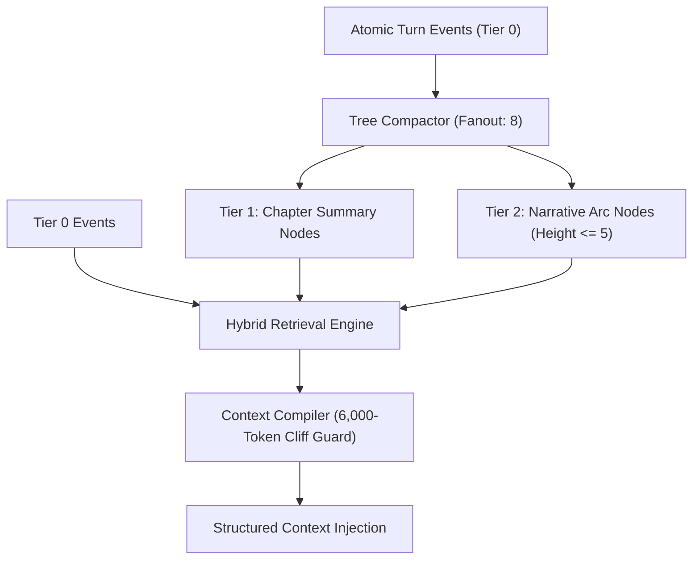
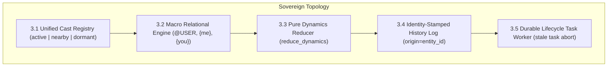

# RPGlitch Technical Roadmap

This roadmap defines the authoritative technical backlog, active engineering sprints, and target architectural blueprints for **RPGlitch**.

- **Temporal Mirror**: `ROADMAP.md` is the **FUTURE mirror** representing exclusively the unbuilt delta between the current state and the desired target state. Its completed counterpart is [CHANGELOG.md](CHANGELOG.md) (the **PAST mirror**).
- **Core Specifications**:
  - [README.md](README.md): Strategic product overview, game design, and simulation philosophy.
  - [ARCHITECTURE.md](ARCHITECTURE.md): Authoritative software architecture, layer boundaries, and state reality in `src/`.
  - [DESIGN.md](DESIGN.md): Nordic visual design tokens, typography, and motion contracts.
  - [SECURITY.md](SECURITY.md): Threat defense, input sanitization, and sink controls.
- **Idea Promotion Lifecycle**: Uncommitted mechanical ideas and exploratory proposals incubate in [`.agents/skills/simulation/references/`](.agents/skills/simulation/references/) as `suggestion-*.md`. When an idea is **promoted** from an exploratory possibility into a planned initiative, it is **removed from the incubator and fully migrated into this roadmap**.

---

## 1. Track 0: Sovereign Intelligence Kernel Refactors (Completed & In Flight)

Completed ground-up architectural deconstructions bringing the intelligence module layer to 100% pure data catalogs and frozen plan/render pipelines:
- [x] **0.1 Entities & Sheets Refactor (`sheets.js`, `entities.js`)**: Universal sheet compilers, macro hydration, and epistemic isolation.
- [x] **0.2 Task & Directives Refactor (`task.js`, `reflex.js`, `protocols.js`, `output.js`, `constitution.js`, `history.js`)**: Declarative atom libraries, normalized pacing/stability ladders, and pure data format schemas.
- [x] **0.3 Style Engine & Prose Detox (`style.js`, `detox.js`, `styles.js`)**: Single-turn style snapshot resolution, dedicated `detox.js` AI tell scrubbers, and normalized Style DNA `{ internal_ratio, rhythm, sensory, grounding }`.
- [x] **0.4 Sovereign System Envelope & Role Declarations (`system.js`)**: Pure data `ROLE_LIBRARY`, re-homed `PROMPT_LAYERS` and `pack_prompt`, and formal plan/render split (`resolve_system_plan` -> `render_system_plan`).

---

## 2. Track 1: Live Simulation Forensics & Integrity Remediation (Active Observation)

Follow-up hardening and behavioral verification derived directly from stress-test trace logs.

- [ ] **1.1 P1 User Agency Hard-Negative Enforcement (Anti-First-Person Hijacking)**:
  - **Issue**: In rounds 3 and 6 of the stress test, the AI persona hijacked the player avatar in the first person ("my thigh... I adjust posture").
  - **Status**: Under empirical observation following completion of Director's Note Speaker Lock (which disconnected user directives from Director thoughts). Evaluating whether this root fix prevents downstream first-person player hijacking before adding further prompt or regex layers.
  - **Touchpoints**: [`src/intelligence/modules/task.js`](src/intelligence/modules/task.js), [`src/intelligence/prompts.js`](src/intelligence/prompts.js), [`src/intelligence/director.js`](src/intelligence/director.js), [`src/intelligence/director.test.js`](src/intelligence/director.test.js), [`src/intelligence/prompt-verification.js`](src/intelligence/prompt-verification.js), [`src/media/optics.js`](src/media/optics.js), [`src/media/optics.test.js`](src/media/optics.test.js), [`src/utils/story-export.js`](src/utils/story-export.js), [`src/utils/story-export.test.js`](src/utils/story-export.test.js), [`src/utils/text.js`](src/utils/text.js), [`src/utils/text.test.js`](src/utils/text.test.js), [`src/data/definitions/profile-fields.js`](src/data/definitions/profile-fields.js), [`src/data/definitions/profile-fields.test.js`](src/data/definitions/profile-fields.test.js), [`src/data/definitions/premade-entities.js`](src/data/definitions/premade-entities.js), [`src/data/definitions/premade-entities.test.js`](src/data/definitions/premade-entities.test.js), [`src/data/sessions.svelte.js`](src/data/sessions.svelte.js), [`src/ui/profile/Profile.svelte`](src/ui/profile/Profile.svelte), [src/intelligence/veil.js](src/intelligence/veil.js), [src/intelligence/veil.test.js](src/intelligence/veil.test.js).

  - _Completed Track 1 items (Ghost Empty Rows, Think-Only Turn Recovery, Telemetry Deduplication, Lens Biasing, Terminal Biological Causality, Bracket Auto-Repair, Field History Clock Trigger, Premade Past String Standardization) have shipped and are recorded in [CHANGELOG.md](CHANGELOG.md)._

---

## 2. Track 2: Hierarchical Memory Compaction & Context Protection (Sprint Phase B2)

The active continuation of the Hierarchical Memory & State Reconciliation initiative (Project Prism-DCM), eliminating flat history limits, preventing middle-out context cliff drops, and establishing hybrid retrieval ranking.

- [ ] **2.1 Multi-Tier Tree Compactor (`entity.chapters`)**:
  - **Concept**: Replace the flat FIFO 20-item memory window with a multi-tier tree:
    - _Tier 0_: Atomic turn events extracted during simulation.
    - _Tier 1 (Chapters)_: When a cluster reaches the fanout threshold (`prismFanout = 8`), compact the window into an anchor node flagged with `ghost: true`.
    - _Tier 2 (Arcs)_: Condense groups of Tier 1 summaries into high-level arc milestones (height $\le 5$).
    - _Selective Leaf Expansion_: Active context retains high-level summary anchors; matching query keywords dynamically expands only the relevant leaf events without bloating the prompt.
  - **Touchpoints**: [`src/intelligence/temporal.js`](src/intelligence/temporal.js), [`src/intelligence/temporal.test.js`](src/intelligence/temporal.test.js).
- [ ] **2.2 Context Window Compiler & 6,000-Token Cliff Protection**:
  - **Concept**: Language model inference servers silently drop the center of prompts (middle-out truncation) when input exceeds ~6,000 tokens (`SPEC-context-limit.md`).
  - **Action**: Build proactive token budgeting into prompt compilation to clamp assemblies securely under the 6,000-token cliff, dynamically pruning lower-weight leaves before dispatch.
  - **Touchpoints**: [`src/intelligence/builder.js`](src/intelligence/builder.js), [`src/intelligence/modules/task.js`](src/intelligence/modules/task.js), [`src/intelligence/prompts.js`](src/intelligence/prompts.js).
- [ ] **2.3 Deterministic Hybrid Lexical & Semantic Retrieval Ranking**:
  - **Concept**: Calculate retrieval rank instantaneously via a deterministic multi-factor formula, incorporating cosine similarity as an additive multiplier without blocking the main execution loop:
    $$\text{Score} = (\text{Entity Overlap} \times 3.0) + (\text{Lexical Frequency} \times 1.0) + (\text{Emotional Salience} \times 0.4) + (\text{Recency} \times 1.2)$$
  - **Touchpoints**: [`src/intelligence/temporal.js`](src/intelligence/temporal.js), [`src/intelligence/temporal.test.js`](src/intelligence/temporal.test.js).
- [ ] **2.4 Memory Extraction Advisory & Write-Time Rot Prevention**:
  - **Concept**: Provide the top 12 known settled facts in extraction prompts (`# ALREADY REMEMBERED`) and hash normalized strings (`eventKey`) to fold repeated events into existing node provenance instead of appending duplicate records.
  - **Touchpoints**: [`src/intelligence/temporal.js`](src/intelligence/temporal.js), [`src/intelligence/prompts.js`](src/intelligence/prompts.js).

---

## 3. Track 3: Clean-Slate Sovereign Engine Reconstruction

Architectural unification of the core simulation runtime, deconstructing duplicate representations and eliminating legacy shims under **P4 Zero Backwards Compatibility (Pre-Beta Purity)**.

- [ ] **3.1 Unified Entity Cast Registry (Scene Presence & Genesis)**:
  - **Scope**: Unify the active trio and supporting NPCs into a single entity cast registry.
  - **Mechanic**: Track presence strictly via explicit state enum: `'active' | 'nearby' | 'dormant'` (eliminating the detached `in_scene_npc_ids` array and fuzzy name lookups). Character Genesis instantiates an entity directly with `presence: 'active'` and an assigned `entity_id`.
  - **Touchpoints**: [`src/state/runtime.svelte.js`](src/state/runtime.svelte.js), [`src/intelligence/story.js`](src/intelligence/story.js), [`src/intelligence/profile.js`](src/intelligence/profile.js).
- [ ] **3.2 Universal Predicates & Macro Relational Engine**:
  - **Scope**: Fully retire the legacy `entity.relationships: string[]` array.
  - **Mechanic**: Store all relational dynamics as universal bracket predicates (`[@TARGET: dynamic | flags]`) across temporal layers (`eternal.non_physical` for baseline bonds, `present.non_physical` for situational dynamics). Integrate dynamic role targets (`[@USER: ...]`, `[@CHAR: ...]`, `[@FRACTAL: ...]`) and **Unified Perspective Resolution** (`{me}` = Source Entity, `{you}` = Target Entity) natively.
  - **Touchpoints**: [`src/utils/macros.js`](src/utils/macros.js), [`src/intelligence/modules/entities.js`](src/intelligence/modules/entities.js), [`src/intelligence/veil.js`](src/intelligence/veil.js), [`src/ui/profile/RelationalGraph.svelte`](src/ui/profile/RelationalGraph.svelte).
- [ ] **3.3 Pure Functional Dynamics Reducer (`src/intelligence/dynamics.js`)**:
  - **Scope**: Rename `physics.js` $\rightarrow$ `dynamics.js` and unify all state calculations into a single stateless module.
  - **Mechanic**: Export a pure functional reducer `reduce_dynamics(current, deltas, baselines, entropy) => next_dynamics` used uniformly across all entity types.
  - **Touchpoints**: [`src/intelligence/physics.js`](src/intelligence/physics.js), [`src/intelligence/dynamics.js`](src/intelligence/dynamics.js).
- [ ] **3.4 Identity-Stamped History Log**:
  - **Scope**: Stamp `entity_id` directly onto log entries at creation in `src/state/log.svelte.js`.
  - **Mechanic**: Prompt compilation directly emits `<ENTRY origin="${entry.entity_id}">`, eliminating runtime reverse name-to-ID lookup maps (`_attach_history_origins`).
  - **Touchpoints**: [`src/state/log.svelte.js`](src/state/log.svelte.js), [`src/intelligence/modules/history.js`](src/intelligence/modules/history.js).
- [ ] **3.5 Durable Lifecycle Task Worker**:
  - **Scope**: Enhance `src/utils/job-queue.js` with session/round context gating (`queue.run(task, { story_id, round, latest: true })`).
  - **Mechanic**: Automatically abort stale background tasks with `{ stale: true }` if the story switches or round advances mid-flight.
  - **Touchpoint**: [`src/utils/job-queue.js`](src/utils/job-queue.js).

---

## 4. Track 4: Pacing, World Info & Advanced Narrative Mechanics

Advanced storytelling mechanisms, conversational pacing heuristics, and world simulation modules.

- [ ] **4.1 Dynamic Pacing Contracts & Prose Heuristics Engine**:
  - **Input-Proportional Sizing**: Classify user inputs into size categories (`TINY` $\le 12$ chars, `SMALL` $\le 90$ chars, `MEDIUM` $\le 400$ chars, `EXPANSIVE` $> 400$ chars) and clamp reply beat counts accordingly to eliminate unprompted essays on simple user actions.
  - **Anti-Staging Constraints**: Forbid gratuitous physical movement (walking to windows, adjusting clothes) on terse dialogue turns.
  - **Multi-Tier Slop Linter (`src/utils/styles.js`)**: Purge repetitive narrative clichés (`not X, but Y`, `against better judgment`) and cap cliché somatic markers to $\le 1$ per reply.
  - **Held-Moment Permitting**: Detect conversational pauses and silence without forcing abrupt scene transitions.
  - **Touchpoints**: [`src/intelligence/modules/task.js`](src/intelligence/modules/task.js), [`src/utils/styles.js`](src/utils/styles.js).
- [ ] **4.2 Standalone World Info & Triggered Lorebook System**:
  - **Schema**: Standalone lorebook entities `(id, name, description, scan_depth, token_budget, recursive, entries[])`.
  - **Matching Engine**: Multi-pass regex, glob wildcards, and whole-word matching over the last $N$ turns with secondary filter logic (`any`, `all`, `not_any`).
  - **Budget-Conscious Insertion**: Inject fired entries into prompt envelopes with strict token ceilings to avoid crowding live character state.
  - **Touchpoints**: [`src/data/db.js`](src/data/db.js), [`src/intelligence/modules/`](src/intelligence/modules/).
- [ ] **4.3 Epistemic Partitioning Hardening & Director Alternative Branches**:
  - **Private Directive Purging**: Ensure covert directives and secret flags are rigorously scrubbed across entity boundaries before compiling persona prompts.
  - **Fractal & NPC Audio Stream Concurrency**: Prevent audio synthesis cutoffs when ambient fractal dialogue overlaps with AI character speech.
  - **Director Alternative Branches**: Allow the Director to supply bracketed alternative dialogue branches for user-guided exploration.
  - **Touchpoints**: [`src/intelligence/director.js`](src/intelligence/director.js), [`src/intelligence/story.js`](src/intelligence/story.js), [`src/media/audio.svelte.js`](src/media/audio.svelte.js).
