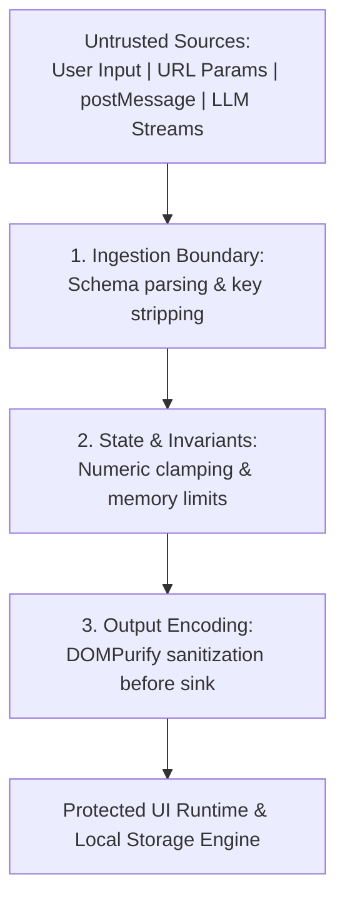

# Security Policy and Architecture Specification

This specification documents the client-side security architecture, threat model, input validation controls, and credential handling practices for RPGlitch. This standard integrates directly with the global Security Skill.

- **System Architecture**: Consult [ARCHITECTURE.md](ARCHITECTURE.md) for reactive state layers, dynamics, and persistence bindings.
- **Product Vision**: Consult [README.md](README.md) for game design philosophy and the User Agency Invariant (P1).
- **Visual Design**: Consult [DESIGN.md](DESIGN.md) for design tokens and rendering contracts.

---

## 1. Threat Model and Trust Boundaries

RPGlitch is a local-first Progressive Web Application running inside the Perchance sandboxed runtime. The application ingests data across four external ingestion vectors:

- Human text inputs (chat forms, UI controls, settings)
- URL query parameters and deep links
- Cross-document messaging interfaces (`window.postMessage`)
- Streaming AI LLM generation output

Every external data source is classified as untrusted. No payload is permitted to mutate reactive state or touch DOM sinks without traversing the multi-layer pipeline below:

---

## 2. Defense-in-Depth Pipeline

### 2.1 Boundary Validation and Schema Enforcement

External payloads must undergo strict shape and type verification at the ingress boundary before passing to application stores.

- **Validate all ingress payloads against strict schemas** using schema parsers prior to consumption.
- **Strip unknown object keys immediately** at boundary normalizers (such as `normalize_director_data`) to prevent prototype pollution and injection attacks.
- **Enforce primitive type checking** on all clipboard imports and message bridge payloads. Reject unparseable or malformed payloads without partial execution.

### 2.2 Domain Invariants and Resource Quotas

Application stores must reject out-of-spec mutations to maintain mathematical consistency and prevent client-side Denial-of-Service (DoS) via memory exhaustion.

- **Clamp all state metrics to valid boundaries** (0 to 100 on axes including `chaos`, `intensity`, `openness`, `affinity`, `velocity`, and `entropy`) using `@utils/math:clamp`.
- **Enforce capacity caps on collection vectors** (memories, chat history, relationship buffers) to avoid uncontrolled heap allocation.
- **Drop payloads exceeding byte-size ceilings** before state ingestion.

### 2.3 Cross-Site Scripting (XSS) Mitigation and Sink Controls

Browser DOM insertion sinks represent the primary vulnerability surface in client-rendered applications.

- **Never invoke dangerous DOM sinks** such as `element.innerHTML`, `element.outerHTML`, or `document.write`.
- **Sanitize all dynamic HTML and rendered markdown via DOMPurify** before passing content to Svelte rendering expressions (`{@html ...}`).
- **Rely on Svelte compile-time template auto-escaping** for all standard string interpolations.

### 2.4 Exception Handling and Information Disclosure Prevention

Runtime failures must provide clear application recovery without leaking internal implementation details.

- **Display opaque error messages to users** instead of raw runtime exceptions or stack traces.
- **Restrict diagnostic logs to the local developer console**, ensuring low-cardinality error reporting in production builds.

---

## 3. Secrets Management and Storage Isolation

### 3.1 Environment Isolation

- **Store secrets strictly in local environment files** (`.env`), ensuring they are never tracked in version control.
- **Maintain non-sensitive template variables** inside `.env.example`.
- **Block commits containing high-entropy strings** by maintaining static analysis or secret-detection hooks on pre-commit runs.

### 3.2 Client-Side Storage Hygiene

- **Confine persisted state to IndexedDB via Dexie.js** under the origin-isolated sandbox.
- **Prohibit third-party data egress**; state persistence must remain isolated to the user's local instance without outbound telemetry tracking.
