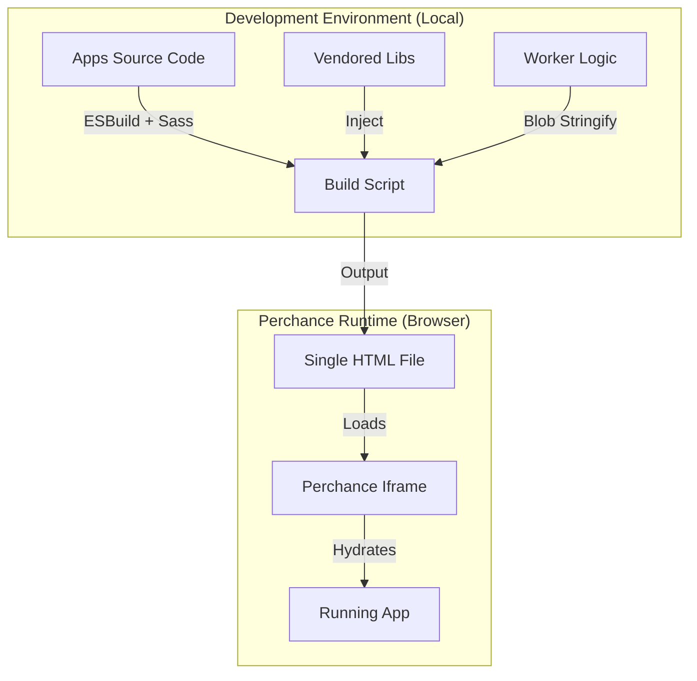

# RPGlitch

A next-generation AI Roleplay Engine built on Perchance, featuring a **Simulation-Driven Architecture** for immersive, consistent, and unrestricted storytelling.

## Overview

RPGlitch is a "Local-First" web application that turns your browser into a sophisticated RPG tabletop. It allows you to create custom Fractals and Characters, then engage in deep, coherent roleplay with an AI Game Master that adheres to strict narrative consistency rules.

## 🏗️ Architecture

### The Build Pipeline (Constraint-Based Engineering)

This explains how we turn a Monorepo into a Single File.



### The Runtime Data Flow (The Game Loop)

This explains the new WebWorker & Event Bus flow we just implemented.

```mermaid
sequenceDiagram
    participant User
    participant UI as 🖥️ UI (Main Thread)
    participant Bus as 📢 EventBus
    participant Bridge as 🌉 WorkerBridge
    participant Worker as ⚙️ Worker (Logic)
    participant DB as 💾 Dexie (IndexedDB)
    participant AI as 🧠 LLM Service

    Note over User, AI: The "Prometheus" Turn Cycle

    User->>UI: Types Message
    UI->>DB: Save User Message
    UI->>Bridge: runBackgroundUpdate()
    Bridge->>Worker: CMD_START_UPDATE

    rect rgb(20, 20, 20)
        Note right of Worker: Background Thread
        Worker->>Worker: Calculate Physics (Entropy)
        Worker->>Worker: Build Prompt (Context)

        Worker->>Bridge: CMD_LLM_REQUEST
        Bridge->>AI: generateStream()
        AI-->>Bridge: Stream Tokens
        Bridge-->>Worker: CMD_LLM_RESPONSE

        Worker->>DB: Save AI Message
        Worker->>DB: Update Entity States
    end

    Worker-->>Bridge: CMD_UPDATE_COMPLETE
    Bridge->>Bus: Dispatch "DB_UPDATED"
    Bus->>UI: Trigger Re-render
    UI->>DB: Fetch Latest Messages
    UI-->>User: Show Response
```



### The Simulation Engine

RPGlitch supersedes standard chatbot patterns by implementing a **Simulation Engine**. Instead of just generating text, the system calculates the "physics" of the narrative state in the background.

### 1. The Kernel (`js/engine-prompt-builder.js`)

- **Role:** Context Architect.
- **Function:** Assembles the prompt using a **Layered Injection Strategy**.
  - **Layer 1 (System):** Enforces absolute agency and format strictness.
  - **Layer 2 (Fractal):** Injects environmental constants (weather, physics).
  - **Layer 3 (Entity):** Injects the real-time snapshot of the character.
- **Key Feature:** Implements the **Hierarchy of Truth** (Present State overrides Permanent Traits) to prevent hallucinations.

### 2. The Physicist (`js/engine-physics.js`)

- **Role:** State Simulation.
- **Function:** A background process that runs _after_ the AI writes prose. It calculates abstract narrative variables to steer the next turn:
  - **Entropy:** Measures narrative chaos and disorder.
  - **Velocity:** Measures pacing and urgency.
  - **Permeability:** Measures emotional openness or defensiveness.
- **Mechanism:** These values are injected into the next prompt to mathematically force the AI's writing style to match the dramatic moment.

### 3. The Manager (`js/manager-turns.js`)

- **Role:** Orchestration & Developer Mode.
- **Function:**
  - **Turn Loop:** Handles the user input -> database -> prompt -> AI -> database cycle.
  - **Developer Mode:** If a message is rejected (regenerated), it injects a hidden **Variance Directive** (e.g., "Increase aggression") to ensure the retry is distinctly different.
  - **State Rollback:** Prevents "ghost memories" by reverting physics updates when a turn is deleted.
  - **Director Mode:** Internal monologues (`<think>`) and raw debugging data are now hidden by default and controlled via the Settings toggle.
  - **Continuation Protocol:** The engine allows extending AI responses seamlessly using the "Continue" action.

### 4. The Shield (`js/index.js` & `js/utils.js`)

- **Role:** Platform Compliance & Stability.
- **Function:**
  - **Passive Shield:** Intercepts storage calls to prevent the hosting platform from flagging the session.
  - **Active Pulse:** Clears penalty flags immediately before every generation request to ensure zero downtime.

---

## The "Freedom Protocol"

RPGlitch implements a client-side stability layer to ensure uninterrupted operation on the hosting platform.

1. **Storage Override:** The application wraps `localStorage` to silently reject specific flag writes that would otherwise restrict content generation.
2. **Pre-Flight Cleaning:** Before any API call, the system actively purges restrictive flags, ensuring the request is processed with full creative freedom.

---

## Security & Validation

While the engine allows for unrestricted narrative content, the application itself enforces strict security:

- **XSS Prevention:** All AI output and user input is passed through `DOMPurify` before rendering.
- **URL Validation:** Image uploads use the native `URL` constructor for robust validation.
- **Type Safety:** Plugin responses are type-checked before processing to prevent injection attacks.
- **Safe DOM:** The UI prefers `textContent` over `innerHTML` wherever possible.

---

## Source Structure

```text
apps/rpglitch/
├── RPGlitch-left-panel.txt    # Perchance engine imports
├── html/
│   └── index.html             # Main UI template
├── js/
│   ├── core/                  # App Foundation
│   │   ├── bootstrap.js       # Entry Point & Error Handling
│   │   ├── db.js              # Dexie Schema & DB Access
│   │   └── events.js          # Event Bus
│   ├── data/                  # Data Layer
│   │   ├── models.js          # Entity definitions & Normalization
│   │   └── repo.js            # Database Operations
│   ├── engine/                # Simulation Logic
│   │   ├── director.js        # Game Loop & State Management
│   │   ├── worker.js          # Background Physics Calculation
│   │   └── bridge.js          # Worker Communication
│   └── ui/                    # User Interface
│       ├── orchestrator.js    # View Management
│       └── components/        # UI Widgets
└── scss/
    ├── index.scss             # Main entry point
    ├── abstracts/             # Variables & Mixins
    ├── base/                  # Reset & Typography
    ├── layout/                # Grid & Modes
    └── components/            # UI Components
```

## Build

```bash
# Build RPGlitch
npm run build:rpglitch

# Output location
apps/rpglitch/RPGlitch.html
```

## Technology Stack

- **State Management:** IndexedDB via Dexie.js (single source of truth)
- **UI Framework:** Custom components built on Pico.css (SCSS)
- **JavaScript:** ES6+ modules (bundled via esbuild)
- **Security:** DOMPurify for XSS prevention

## Related Documentation

- [Deployment & Integration Guide](../../.agent/knowledge/perchance-technical.md)
- [UI/UX Guidelines](../../.agent/rules/style.md)
- [Agent Protocol](../../AGENTS.md)
