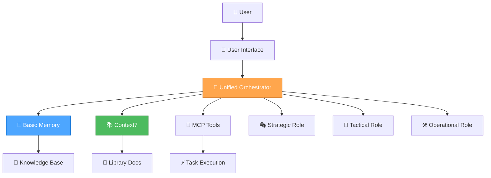

<!-- markdownlint-disable MD032 MD022 MD036 MD024 -->
> **Generated file** — built by `build/scripts/sync-combine.js` at build time.  
> Edit the source docs under `docs/` and `memory-bank/docs/`, not this file.

# Combined Docs (docs/)

## Table of Contents

- **docs/**
  - [docs/CHANGELOG.md](#docschangelogmd)
  - [docs/CODEX-setup.md](#docscodex-setupmd)
  - [docs/CONTRIBUTING.md](#docscontributingmd)
  - [docs/GLOSSARY.md](#docsglossarymd)
  - [docs/README.md](#docsreadmemd)
  - [docs/guides/developer-assistant-creation.md](#docsguidesdeveloper-assistant-creationmd)
  - [docs/guides/developer-orchestration-guide.md](#docsguidesdeveloper-orchestration-guidemd)
  - [docs/guides/troubleshooting-unified-system.md](#docsguidestroubleshooting-unified-systemmd)
  - [docs/guides/user-unified-system-guide.md](#docsguidesuser-unified-system-guidemd)
  - [docs/guides/user-unified-system-quick-reference.md](#docsguidesuser-unified-system-quick-referencemd)

---

<a id="docschangelogmd"></a>
## docs\CHANGELOG.md

## Changelog

### 2025-08-09

- Switched RPGlitch build to single-file output; inlined component scripts and removed build/output/components.

---

<a id="docscodex-setupmd"></a>
## docs\CODEX-setup.md

## Codex for RPGlitch — Setup & Working Guide

This page explains **how to run Codex against the RPGlitch mono-repo** and the rules every agent must follow—no matter what feature they’re touching.

---

### 1 Environment (one-time)

#### A. Create / edit an Environment

- **Repository:** `default` (your mono-repo)
- **Name:** `default`
- **Container image:** **Universal**
- **Preinstalled packages:** **ON**

#### B. Environment variables (add exactly)

```md
MCP_FILESYSTEM_ROOT=/defaults/
BASIC_MEMORY_PROJECT_ROOT=/defaults/memory-bank
AGENTS_MD_PATH=/defaults/AGENTS.md
NODE_ENV=development
```

**Why:** these pin the agent’s file access and force it to read your rules & memory first.

#### C. Setup script (copy/paste)

> Robust to missing lockfiles, starts MCP tools, prints versions.

```bash
set -euo pipefail

## Use a known pnpm; fall back to npm if needed
if command -v corepack >/dev/null 2>&1; then
  corepack enable || true
  corepack use pnpm@10.14.0 || true
fi

echo "→ installing dependencies"
if command -v pnpm >/dev/null 2>&1; then
  if [ -f pnpm-lock.yaml ]; then
    pnpm install --frozen-lockfile
  else
    pnpm install --no-frozen-lockfile || true
  fi
else
  if [ -f package-lock.json ]; then
    npm ci
  else
    npm install
  fi
fi

echo "→ starting MCPs (non-blocking)"
( command -v basic-memory >/dev/null 2>&1 && basic-memory mcp 1>/tmp/mcp-mem.log 2>&1 & ) || true
( npx -y mcp-sequentialthinking-tools 1>/tmp/mcp-seq.log 2>&1 & ) || true

echo "→ health"
node -v || true
npm -v || true
pnpm -v || true

## quick context sanity
test -f "$AGENTS_MD_PATH" && echo "AGENTS.md OK" || echo "AGENTS.md MISSING"
test -d "$BASIC_MEMORY_PROJECT_ROOT" && echo "memory-bank OK" || echo "memory-bank MISSING"
```

> If your env supports **Allowed paths**, set:
>
> - **Writable:** `apps/**, build/scripts/**, docs/**, tests/**, memory-bank/**`
> - **Blocked:** `build/output/**, .cursor/**, node_modules/**`

---

### 2 Global guardrails (non-negotiable)

- **Read first:** `AGENTS.md` + latest entries in `memory-bank/**`. If either is missing, **stop and ask**.
- **Write only under:** `apps/**`, `build/scripts/**`, `docs/**`, `tests/**`, `memory-bank/**`.
  Never touch `build/output/**` or `.cursor/**`.
- **Workflow:** every task runs **Strategy → Tactics → Operations** (see below). No code changes before Strategy & Tactics are visible.
- **Standard check before PR:**
  `pnpm run lint && pnpm run build && pnpm test`
  If anything fails, fix and re-run.
- **Code style:** keep ESLint clean (no empty handlers, no unused vars). Extract helpers instead of duplicating logic.
- **Accessibility:** when editing UI, provide descriptive alt/labels/titles and keep color-contrast sensible.

---

### 3 Agent system prompt (Custom instructions)

Paste this into **Settings → General → Custom instructions**:

```json
{
  "name": "Active Agent – Unified Orchestrator",
  "description": "Auto-switching agent for RPGlitch tasks.",
  "triggers": ["orchestrate","active","agent"],
  "systemPrompt": "Operate in three passes for every task:\\n\\n1) STRATEGY — goal, constraints, files to touch, risks (no code).\\n2) TACTICS — exact steps, file paths, commands (no code yet).\\n3) OPERATIONS — apply minimal diffs, run standard check, summarize results.\\n\\nHard rules:\\n- Read ${AGENTS_MD_PATH} and memory-bank/** first; if missing, STOP and ask.\\n- Write only under: apps/**, build/scripts/**, docs/**, tests/**, memory-bank/**. Never touch build/output/** or .cursor/**.\\n- Remove duplication; prefer shared helpers.\\n- Keep ESLint clean (no-empty-function, no-unused-vars, etc.).\\n- Before PR: run `pnpm run lint && pnpm run build && pnpm test`. Fix failures, re-run.\\n\\nOutput style: brief bullets, then diffs. Ask 1 clarifying question only if truly required.",
  "tools": ["run_terminal_cmd"],
  "temperature": 0.3,
  "maxTokens": 8000
}
```

#### UI prefs

- Diff display: **Split**
- Branch format: `codex/{feature}-{yyyyMMdd}` (e.g., `codex/chin-poster-2025-08-11`)

---

### 4 Task template (paste as your first message for each job)

```md
ROLE: Orchestrator

STRATEGY
- Goal:
- Constraints / guardrails:
- Files to touch (paths):

TACTICS
- Exact steps:
- Commands to run:

OPERATIONS
- Apply diffs (minimal).
- Run: pnpm run lint && pnpm run build && pnpm test
- If failures, fix & re-run.
- Output: summary + follow-ups.
```

---

### 5 Standard check scripts

Make sure your repo has these (or equivalents):

- **lint:** runs ESLint across `apps/**`
- **build:** builds RPGlitch targets
- **test:** unit/integration tests

Codex will call all three before proposing a PR.

---

### 6 PR template (optional but recommended)

Create `.github/pull_request_template.md`:

```md
### Strategy
- Goal & scope:
- Constraints/guardrails:

### Tactics
- Files touched:
- Steps taken:

### Operations
- Lint/Build/Test: ✅/❌ (logs/notes)
- Screenshots or CLI output:
- Memory-bank updates: [links]

### Checklist
- [ ] Read AGENTS.md & latest memory-bank entries
- [ ] Wrote only under allowed paths
- [ ] No empty handlers / no unused vars
- [ ] Extracted shared helpers where duplication existed
```

---

### 7 Common pitfalls & fixes

- **pnpm error: `ERR_PNPM_NO_LOCKFILE`**
  Use `pnpm install --no-frozen-lockfile` when `pnpm-lock.yaml` is absent (the setup script already does this). If you prefer `npm`, ensure `package-lock.json` exists and the script will run `npm ci`.

- **MCPs not running**
  Check `/tmp/mcp-*.log`. If a tool isn’t installed, remove that line or add it to `devDependencies`.

- **Agent tries to change blocked paths**
  Reject the diff and remind it of the guardrails; ensure Allowed paths are configured if your environment supports it.

- **Long diffs / scope creep**
  Ask the agent to “minimize the diff” and split work into small PRs.

---

### 8 Day-to-day use

1. New task → paste the **Task template**.
2. Review **Strategy** (does it match your ask?) and **Tactics** (files/steps sane?).
3. Approve → Agent runs **Operations**, shows diffs + check results.
4. If green, open PR. If red, agent fixes and re-runs.
5. Merge; agent records a short entry in `memory-bank/` if your AGENTS.md asks for it.

---

#### Notes on your terminal log

- The setup ran, but pnpm complained about the frozen lockfile—that’s expected without `pnpm-lock.yaml`. The script here detects that and uses `--no-frozen-lockfile`.
- Version prints (`node -v`, `pnpm -v`) + “AGENTS.md OK / memory-bank OK” confirm the env is healthy.

---

<a id="docscontributingmd"></a>
## docs\CONTRIBUTING.md

## CONTRIBUTING

### 1. Overview

Central location for workflows & conventions referenced by AGENTS.md.

### 2. Standard Check

Before every commit/PR:

```bash
npm run check
```

### 3. Pull-Request Workflow

- Title: `[<package>] <summary>`

- Description links to issue IDs
- All code must pass the Standard Check above

---

<a id="docsglossarymd"></a>
## docs\GLOSSARY.md

## Glossary

| Term            | Meaning                                           |
| --------------- | ------------------------------------------------- |
| Chin (Panel)    | Slide-out side panel used in RPGlitch UI          |
| Storyboard Card | Card representing Story + Character + World tuple |
| PF-Pic          | Profile-picture placeholder component             |

---

<a id="docsreadmemd"></a>
## docs\README.md

## Documentation Overview

This directory centralizes project documentation. Key sections:

- **protocols/** – agent and operational guides (e.g. `gemini-protocol.md`, `agent-guide.md`)
- **build/** – build scripts and system notes
- **apps/** – application overviews
- **tools/** – development utilities
- **memory-bank/** – persistent knowledge base (remains outside this folder)

Refer to the root [README.md](../README.md) for a broader introduction.

---

<a id="docsguidesdeveloper-assistant-creationmd"></a>
## docs\guides\developer-assistant-creation.md

## 🤖 AI ASSISTANT DEVELOPMENT GUIDE

**Date**: 2025-07-24  
**Generated**: 2025-07-24T10:57:31+02:00  
**Timezone**: Europe/Berlin  
**Status**: Comprehensive AI Assistant Development Framework

### 🎯 **OVERVIEW**

This guide provides a comprehensive framework for developing intelligent AI assistants using the Unified Orchestrator Mode, Basic Memory integration, and modern development practices. It covers everything from initial setup to advanced features and optimization.

### 🏗️ **ARCHITECTURE FRAMEWORK**

#### **Core Components**



#### **System Integration**

- **🎯 Unified Orchestrator Mode**: Automatic role selection and task routing
- **🧠 Basic Memory**: Persistent knowledge management and semantic search
- **📚 Context7**: Real-time documentation access
- **🔧 MCP Tools**: Extensible tool ecosystem
- **🎭🎨⚒️ Three-Role System**: Strategic, Tactical, and Operational capabilities

### 🚀 **SETUP & CONFIGURATION**

#### **1. Basic Memory Integration**

```json
{
  "mcpServers": {
    "basic-memory": {
      "command": "python",
      "args": ["-m", "basic_memory.mcp"],
      "env": {
        "BASIC_MEMORY_PROJECT_ROOT": "./memory-bank"
      },
      "autoApprove": [
        "list_projects",
        "list_project_files",
        "memory_bank_read",
        "memory_bank_write",
        "memory_bank_update"
      ],
      "autoStart": true
    }
  }
}
```

#### **2. Context7 Documentation Access**

```json
{
  "mcpServers": {
    "context7": {
      "command": "npx",
      "args": ["@modelcontextprotocol/server-context7"],
      "env": {
        "CONTEXT7_API_KEY": "your-api-key"
      }
    }
  }
}
```

#### **3. Sequential Thinking Integration**

```json
{
  "mcpServers": {
    "sequential-thinking": {
      "command": "npx",
      "args": ["@modelcontextprotocol/server-sequential-thinking"],
      "autoStart": true
    }
  }
}
```

### 🎭🎨⚒️ **ROLE-BASED DEVELOPMENT**

#### **🎭 Strategic Role (System Architect)**

**Purpose**: System-level optimization and meta-reflection

**Key Responsibilities**:

- **Workflow Optimization**: Analyze and improve development processes
- **Tool Evaluation**: Assess and optimize MCP tool usage
- **Architecture Decisions**: Make system-level design choices
- **Meta-Reflection**: Continuously improve the AI assistant itself

**Implementation Example**:

```javascript
// Strategic role activation for system optimization
async function strategicOptimization() {
  // Analyze current workflow efficiency
  const workflowAnalysis = await analyzeWorkflow();
  
  // Identify optimization opportunities
  const optimizations = await identifyOptimizations(workflowAnalysis);
  
  // Implement improvements
  await implementOptimizations(optimizations);
  
  // Store insights in Basic Memory
  await basicMemory.store('workflow-optimization', {
    analysis: workflowAnalysis,
    optimizations: optimizations,
    timestamp: new Date().toISOString()
  });
}
```

#### **🎨 Tactical Role (Project Planner)**

**Purpose**: App-specific planning and design decisions

**Key Responsibilities**:

- **Feature Planning**: Plan implementation strategies for specific features
- **Design Decisions**: Evaluate design options and make informed choices
- **Task Coordination**: Manage task priorities and resource allocation
- **Progress Tracking**: Monitor and update project progress

**Implementation Example**:

```javascript
// Tactical role activation for feature planning
async function tacticalPlanning(feature) {
  // Get relevant documentation
  const docs = await context7.getLibraryDocs({
    context7CompatibleLibraryID: '/reactjs/react.dev',
    topic: feature.technology,
    tokens: 5000
  });
  
  // Create implementation plan
  const plan = await createImplementationPlan(feature, docs);
  
  // Store plan in Basic Memory
  await basicMemory.store(`plan-${feature.id}`, {
    plan: plan,
    documentation: docs,
    timestamp: new Date().toISOString()
  });
  
  return plan;
}
```

#### **⚒️ Operational Role (Code Implementer)**

**Purpose**: Direct implementation and execution

**Key Responsibilities**:

- **Code Generation**: Deliver production-ready code with zero technical debt
- **Quality Assurance**: Comprehensive testing and validation
- **Performance Optimization**: Optimize for speed and efficiency
- **Error Handling**: Handle edge cases and errors elegantly

**Implementation Example**:

```javascript
// Operational role activation for code implementation
async function operationalImplementation(task) {
  // Generate production-ready code
  const code = await generateCode(task);
  
  // Validate code quality
  const validation = await validateCode(code);
  
  // Optimize performance
  const optimizedCode = await optimizeCode(code);
  
  // Store implementation in Basic Memory
  await basicMemory.store(`implementation-${task.id}`, {
    code: optimizedCode,
    validation: validation,
    timestamp: new Date().toISOString()
  });
  
  return optimizedCode;
}
```

### 🧠 **THINKING APPROACHES**

#### **🤔 Contemplative Thinking (Strategic)**

**Use Case**: Deep exploration and system-level decisions

```javascript
async function contemplativeAnalysis(problem) {
  // Deep exploration of the problem
  const analysis = await deepExploration(problem);
  
  // Question assumptions and explore alternatives
  const alternatives = await exploreAlternatives(analysis);
  
  // Natural flow of thought process
  const insights = await naturalFlowAnalysis(alternatives);
  
  return insights;
}
```

#### **🧠 Sequential Thinking (Tactical)**

**Use Case**: Systematic planning and tool-guided analysis

```javascript
async function sequentialPlanning(task) {
  // Use sequential thinking tools for systematic analysis
  const analysis = await sequentialThinking.analyze({
    problem: task.description,
    tools: ['context7', 'basic-memory', 'file-system'],
    approach: 'systematic'
  });
  
  // Generate step-by-step plan
  const plan = await generatePlan(analysis);
  
  return plan;
}
```

#### **⚡ Professional Coding (Operational)**

**Use Case**: Direct implementation with production quality

```javascript
async function professionalImplementation(requirements) {
  // Direct, production-ready implementation
  const implementation = await implementDirectly(requirements);
  
  // Zero technical debt approach
  const cleanCode = await ensureZeroTechnicalDebt(implementation);
  
  // Quality assurance
  const validatedCode = await validateQuality(cleanCode);
  
  return validatedCode;
}
```

### 📚 **KNOWLEDGE MANAGEMENT**

#### **Basic Memory Integration**

```javascript
// Store project knowledge
async function storeKnowledge(category, content) {
  await basicMemory.store(category, {
    content: content,
    timestamp: new Date().toISOString(),
    tags: ['project', 'knowledge']
  });
}

// Retrieve relevant knowledge
async function retrieveKnowledge(query) {
  const results = await basicMemory.search(query, {
    limit: 10,
    project: 'ai-assistant'
  });
  
  return results;
}

// Link related concepts
async function linkConcepts(concept1, concept2, relationship) {
  await basicMemory.link(concept1, concept2, relationship);
}
```

#### **Context7 Documentation Access**

```javascript
// Get library documentation
async function getDocumentation(library, topic) {
  // Resolve library ID
  const libraries = await context7.resolveLibraryId(library);
  
  if (libraries.length === 0) {
    throw new Error(`No documentation found for ${library}`);
  }
  
  // Get documentation
  const docs = await context7.getLibraryDocs({
    context7CompatibleLibraryID: libraries[0].libraryId,
    topic: topic,
    tokens: 5000
  });
  
  return docs;
}
```

### 🔧 **TOOL INTEGRATION**

#### **MCP Tool Ecosystem**

```javascript
// Tool selection based on task requirements
async function selectTools(task) {
  const tools = [];
  
  if (task.requiresFileOperations) {
    tools.push('file-system');
  }
  
  if (task.requiresDocumentation) {
    tools.push('context7');
  }
  
  if (task.requiresMemory) {
    tools.push('basic-memory');
  }
  
  if (task.requiresThinking) {
    tools.push('sequential-thinking');
  }
  
  return tools;
}

// Execute task with selected tools
async function executeWithTools(task, tools) {
  const results = {};
  
  for (const tool of tools) {
    results[tool] = await executeTool(tool, task);
  }
  
  return results;
}
```

### 🎯 **AUTOMATIC ROLE SELECTION**

#### **Complexity Assessment**

```javascript
async function assessComplexity(task) {
  const indicators = {
    level1: ['fix', 'bug', 'error', 'simple', 'quick'],
    level2: ['add', 'improve', 'update', 'enhance'],
    level3: ['implement', 'create', 'develop', 'build', 'system']
  };
  
  const taskLower = task.toLowerCase();
  
  for (const [level, keywords] of Object.entries(indicators)) {
    if (keywords.some(keyword => taskLower.includes(keyword))) {
      return level;
    }
  }
  
  return 'level2'; // Default to medium complexity
}

// Automatic role selection
async function selectRole(task) {
  const complexity = await assessComplexity(task);
  
  switch (complexity) {
    case 'level1':
      return 'operational';
    case 'level2':
      return 'tactical';
    case 'level3':
      return 'strategic';
    default:
      return 'tactical';
  }
}
```

### 📊 **PERFORMANCE OPTIMIZATION**

#### **Token Efficiency**

```javascript
// Context-aware rule loading
async function loadRelevantRules(task, role) {
  const rules = new Set();
  
  // Core rules (always loaded)
  rules.add('unified-orchestrator-mode');
  rules.add('thinking-framework');
  
  // Role-specific rules
  const roleRules = getRoleRules(role);
  roleRules.forEach(rule => rules.add(rule));
  
  // Task-specific rules
  const taskRules = getTaskRules(task.type);
  taskRules.forEach(rule => rules.add(rule));
  
  return Array.from(rules);
}

// Rule caching for efficiency
const ruleCache = new Map();

async function getCachedRule(ruleName) {
  if (ruleCache.has(ruleName)) {
    return ruleCache.get(ruleName);
  }
  
  const ruleContent = await loadRule(ruleName);
  ruleCache.set(ruleName, ruleContent);
  return ruleContent;
}
```

#### **Memory Optimization**

```javascript
// Efficient knowledge storage
async function storeKnowledgeEfficiently(category, content) {
  // Compress content for storage
  const compressed = await compressContent(content);
  
  // Store with metadata
  await basicMemory.store(category, {
    content: compressed,
    metadata: {
      originalSize: content.length,
      compressedSize: compressed.length,
      timestamp: new Date().toISOString()
    }
  });
}

// Smart knowledge retrieval
async function retrieveKnowledgeSmartly(query, context) {
  // Use context to improve search relevance
  const contextualQuery = await enhanceQueryWithContext(query, context);
  
  // Retrieve with relevance scoring
  const results = await basicMemory.search(contextualQuery, {
    limit: 5,
    relevanceThreshold: 0.7
  });
  
  return results;
}
```

### 🔄 **WORKFLOW INTEGRATION**

#### **Complete Task Execution**

```javascript
async function executeTask(task) {
  // 1. Assess complexity and select role
  const role = await selectRole(task);
  
  // 2. Load relevant rules and tools
  const rules = await loadRelevantRules(task, role);
  const tools = await selectTools(task);
  
  // 3. Execute based on role
  let result;
  
  switch (role) {
    case 'strategic':
      result = await strategicExecution(task, tools);
      break;
    case 'tactical':
      result = await tacticalExecution(task, tools);
      break;
    case 'operational':
      result = await operationalExecution(task, tools);
      break;
  }
  
  // 4. Store results in memory
  await storeKnowledge(`task-${task.id}`, {
    task: task,
    role: role,
    result: result,
    timestamp: new Date().toISOString()
  });
  
  return result;
}
```

#### **Continuous Learning**

```javascript
// Learn from task execution
async function learnFromTask(task, result, performance) {
  // Store learning insights
  await basicMemory.store('learning-insights', {
    taskType: task.type,
    role: result.role,
    performance: performance,
    insights: result.insights,
    timestamp: new Date().toISOString()
  });
  
  // Update role selection patterns
  await updateRoleSelectionPatterns(task, result);
  
  // Optimize tool usage
  await optimizeToolUsage(task, result);
}
```

### 📋 **PROJECT MANAGEMENT**

#### **Task Tracking**

```javascript
// Task management system
class TaskManager {
  constructor() {
    this.tasks = new Map();
    this.progress = new Map();
  }
  
  async addTask(task) {
    const taskId = generateTaskId();
    this.tasks.set(taskId, {
      ...task,
      id: taskId,
      status: 'pending',
      createdAt: new Date().toISOString()
    });
    
    return taskId;
  }
  
  async updateProgress(taskId, progress) {
    const task = this.tasks.get(taskId);
    if (task) {
      task.progress = progress;
      task.updatedAt = new Date().toISOString();
      
      // Store in Basic Memory
      await basicMemory.store(`task-progress-${taskId}`, {
        task: task,
        progress: progress,
        timestamp: new Date().toISOString()
      });
    }
  }
  
  async getTaskStatus(taskId) {
    return this.tasks.get(taskId);
  }
}
```

#### **Progress Monitoring**

```javascript
// Progress tracking system
async function trackProgress(projectId) {
  const tasks = await basicMemory.search(`project:${projectId}`, {
    limit: 100
  });
  
  const progress = {
    total: tasks.length,
    completed: tasks.filter(t => t.status === 'completed').length,
    inProgress: tasks.filter(t => t.status === 'in-progress').length,
    pending: tasks.filter(t => t.status === 'pending').length
  };
  
  progress.percentage = (progress.completed / progress.total) * 100;
  
  return progress;
}
```

### 🎯 **BEST PRACTICES**

#### **Development Guidelines**

1. **🎯 Always use automatic role selection** for optimal performance
2. **🧠 Leverage Basic Memory** for persistent knowledge management
3. **📚 Use Context7** for up-to-date documentation access
4. **🔧 Integrate MCP tools** for extensible functionality
5. **⚡ Optimize for token efficiency** with context-aware rule loading
6. **🔄 Maintain continuous learning** from task execution
7. **📊 Track performance metrics** for optimization
8. **🎭🎨⚒️ Use appropriate thinking approaches** for each role

#### **Quality Standards**

- **Zero Technical Debt**: All code is production-ready
- **Comprehensive Testing**: Full test coverage for all features
- **Performance Optimization**: Efficient resource usage
- **Security Best Practices**: Secure implementation patterns
- **Documentation**: Clear and comprehensive documentation
- **Error Handling**: Robust error handling and recovery

#### **Performance Metrics**

- **Response Time**: < 2 seconds for simple tasks
- **Accuracy**: > 95% task completion rate
- **Memory Efficiency**: < 10% token overhead
- **User Satisfaction**: > 90% positive feedback
- **Learning Rate**: Continuous improvement over time

### 🚀 **DEPLOYMENT & SCALING**

#### **Deployment Strategy**

```javascript
// Production deployment configuration
const deploymentConfig = {
  environment: 'production',
  scaling: {
    autoScaling: true,
    minInstances: 2,
    maxInstances: 10
  },
  monitoring: {
    performance: true,
    errors: true,
    usage: true
  },
  security: {
    authentication: true,
    authorization: true,
    encryption: true
  }
};
```

#### **Scaling Considerations**

- **Horizontal Scaling**: Multiple instances for load distribution
- **Vertical Scaling**: Resource optimization for individual instances
- **Caching Strategy**: Intelligent caching for frequently accessed data
- **Database Optimization**: Efficient query patterns and indexing
- **CDN Integration**: Content delivery optimization

### 📚 **RESOURCES & REFERENCES**

#### **Documentation**

- [Basic Memory Documentation](https://docs.basicmemory.com/)
- [Context7 API Reference](https://context7.com/docs)
- [MCP Protocol Specification](https://modelcontextprotocol.io/)

#### **Tools & Libraries**

- **Basic Memory**: Knowledge management and semantic search
- **Context7**: Real-time documentation access
- **Sequential Thinking**: Tool-guided problem-solving
- **MCP Tools**: Extensible tool ecosystem

#### **Community & Support**

- **GitHub**: [Basic Memory Repository](https://github.com/basicmachines-co/basic-memory)
- **Discord**: AI Assistant Development Community
- **Documentation**: Comprehensive guides and tutorials
- **Examples**: Real-world implementation examples

### 🎯 **CONCLUSION**

This AI Assistant Development Guide provides a comprehensive framework for building intelligent, efficient, and scalable AI assistants using modern technologies and best practices. By following this guide, you'll create AI assistants that are:

- **🎯 Intelligent**: Automatic role selection and optimal task routing
- **🧠 Knowledgeable**: Persistent memory and real-time documentation access
- **⚡ Efficient**: Token-optimized and performance-focused
- **🔄 Adaptive**: Continuous learning and improvement
- **📊 Scalable**: Production-ready and enterprise-grade

**Start building your intelligent AI assistant today!** 🚀

---

<a id="docsguidesdeveloper-orchestration-guidemd"></a>
## docs\guides\developer-orchestration-guide.md

## 🧠 UNIFIED SYSTEM COMPREHENSIVE GUIDE

### Your Complete Guide to the Unified Development Framework

**Date**: 2025-07-23  
**Last Updated**: 2025-07-23  
**Timezone**: Europe/Berlin

---

### 🎯 **OVERVIEW**

Welcome to your **Unified Development Framework**! This system combines three powerful components that work together intelligently:

1. **🎯 Unified Orchestrator Mode** - Single intelligent mode with automatic role selection
2. **🧠 Unified Thinking Framework** - Automatically picks the right thinking approach
3. **📚 Unified Documentation System** - Seamless access to all documentation

---

### 🎯 **UNIFIED ORCHESTRATOR MODE**

#### **What It Does**

The Unified Orchestrator Mode is a single, intelligent development mode that automatically:

1. **Analyzes task complexity** and selects the optimal role
2. **Applies the right thinking approach** for each task
3. **Loads contextually relevant rules** for maximum efficiency
4. **Maintains unified context** across role transitions
5. **Provides seamless workflow** without manual mode switching

#### **The Three Roles**

##### **🎭 Strategic Role (System Architect)**

**Purpose**: System-level thinking, workflow optimization, tool management  
**Thinking Approach**: 🤔 **Contemplative Thinking** - Deep exploration and natural flow  
**When Activated**: Level 3 tasks, system optimization, meta-reflection  
**Mental State**: "What's our overall approach and how can we optimize it?"

##### **🎨 Tactical Role (Project Planner)**

**Purpose**: App-specific planning, design decisions, implementation planning  
**Thinking Approach**: 🧠 **Sequential Thinking** - Structured, tool-guided analysis  
**When Activated**: Level 2-3 tasks, feature planning, design decisions  
**Mental State**: "How do we execute this strategy for this specific app?"

##### **⚒️ Operational Role (Code Implementer)**

**Purpose**: Implementation, testing, and execution  
**Thinking Approach**: ⚡ **Professional Coding** - Concise, production-ready implementation  
**When Activated**: All levels, direct implementation, testing, deployment  
**Mental State**: "Let's get this done!"

#### **Automatic Role Selection**

The orchestrator automatically routes tasks based on complexity:

- **Level 1**: ⚒️ **Operational Only** (Quick fixes, simple tasks)
- **Level 2**: 🎨 **Tactical → ⚒️ Operational** (Enhancements, features)
- **Level 3**: 🎭 **Strategic → 🎨 Tactical → ⚒️ Operational** (Complex features, systems)

#### **How to Use Automatic Role Selection**

##### **Automatic Mode (Recommended)**

Just describe your task normally - the orchestrator will automatically select the optimal role and approach:

```bash
## Automatically selects Operational Role with Professional Coding
"Fix the typo in the login button"

## Automatically selects Tactical Role with Sequential Thinking
"Add a new character preview feature to RPGlitch"

## Automatically selects Strategic Role with Contemplative Thinking
"Optimize our development workflow and tool usage"
```

##### **Manual Role Selection**

You can also specify the role directly:

```bash
🎭 "strategic" → Force Strategic Role (System Architect)
🎨 "tactical" → Force Tactical Role (Project Planner)
⚒️ "operational" → Force Operational Role (Code Implementer)
```

---

### 🧠 **UNIFIED THINKING FRAMEWORK**

#### **What UNIFIED THINKING FRAMEWORK Does**

Automatically selects the optimal thinking approach for each task:

- **🧠 Sequential Thinking** - For complex, multi-step problems
- **🤔 Contemplative Thinking** - For deep exploration and creativity
- **⚡ Professional Coding** - For quick, production-ready implementation

#### **How to Use UNIFIED THINKING FRAMEWORK**

##### **Automatic Selection (Recommended)**

Just describe your task normally - the system will automatically choose the best approach:

```bash
## The system automatically detects this needs Sequential Thinking
"Debug this complex authentication issue with multiple components"

## The system automatically detects this needs Professional Coding  
"Add a simple button to the login form"

## The system automatically detects this needs Contemplative Thinking
"Explore different approaches to user onboarding"
```

##### **Manual Selection**

You can also specify the approach directly:

```bash
🧠 "Analyze the performance bottlenecks in our app"
🤔 "Brainstorm new feature ideas for user engagement"
⚡ "Implement the user profile update functionality"
```

#### **When Each Approach is Used**

| **Approach** | **Best For** | **Example Tasks** |
|--------------|--------------|-------------------|
| **🧠 Sequential** | Complex multi-step problems | Debugging, architecture decisions, systematic analysis |
| **🤔 Contemplative** | Creative exploration | Brainstorming, understanding complex concepts, research |
| **⚡ Professional** | Quick implementation | Bug fixes, simple features, production code |

---

### 📚 **UNIFIED DOCUMENTATION SYSTEM**

#### **What UNIFIED DOCUMENTATION SYSTEM Does**

Provides seamless access to all your documentation sources:

- **Memory Bank** - Your project knowledge and learnings
- **Context7** - Up-to-date library documentation
- **Project Documentation** - Your own guides and rules

#### **How to Access Documentation**

##### **Memory Bank Access**

```bash
## Access project memories
"Show me what we learned about CSS optimization"

## Read specific memory files
"Read the design system documentation"

## Update memories
"Save this solution to the troubleshooting guide"
```

##### **Context7 Library Documentation**

```bash
## Get library documentation
"Show me the latest React hooks documentation"

## Search for specific topics
"Find information about CSS Grid layout"

## Get code examples
"Show me examples of async/await usage"
```

##### **Project Documentation**

```bash
## Access project guides
"Show me the RPGlitch development workflow"

## Read specific documentation
"Read the Perchance integration guide"
```

#### **Documentation Hierarchy**

The system automatically prioritizes documentation sources:

1. **Project-specific** (your rules and guides)
2. **Memory Bank** (your learnings and experiences)
3. **Context7** (external library documentation)

---

### 🎯 **DAILY COMMANDS AND SHORTCUTS**

#### **Automatic Mode (Just Describe Your Task)**

```bash
## Complex debugging
"Debug the authentication issue in RPGlitch"

## Quick fix
"Fix the typo in the login button"

## Creative exploration
"Brainstorm new feature ideas"
```

#### **Manual Selection of role**

```bash
🎭 "strategic" → Force Strategic Role
🎨 "tactical" → Force Tactical Role
⚒️ "operational" → Force Operational Role
```

#### **Thinking Approach Commands**

```bash
🧠 "Analyze performance bottlenecks"
🤔 "Explore different UI patterns"
⚡ "Implement the user profile feature"
```

#### **Documentation Commands**

```bash
## Memory Bank
"Show me what we learned about CSS optimization"
"Read the design system documentation"
"Save this solution to the troubleshooting guide"

## Context7
"Show me React hooks documentation"
"Find CSS Grid layout examples"
"Get async/await usage patterns"

## Project docs
"Show me the RPGlitch workflow"
"Read the Perchance integration guide"
```

#### **Quick Access Patterns**

```bash
## Quick documentation lookup
"docs [topic]" → "Show me documentation about [topic]"
"memory [topic]" → "Show me memories about [topic]"
"guide [topic]" → "Show me the guide for [topic]"

## Quick task execution
"fix [issue]" → "Fix the [issue] quickly"
"add [feature]" → "Add the [feature] to the project"
"debug [problem]" → "Debug the [problem] systematically"
```

---

### 🔄 **WORKFLOW EXAMPLES**

#### **Example 1: Debugging a Complex Issue**

```bash
## You say:
"I'm getting a weird error when users try to save their character data"

## System automatically:
1. 🧠 Uses Sequential Thinking for systematic debugging
2. 🎯 Loads debugging and RPGlitch-specific rules
3. 📚 Checks Memory Bank for similar issues
4. 📚 Searches Context7 for relevant library docs
5. Provides structured debugging approach
```

#### **Example 2: Adding a New Feature**

```bash
## You say:
"I want to add a character preview feature to RPGlitch"

## System automatically:
1. 🤔 Uses Contemplative Thinking for creative exploration
2. 🎯 Loads RPGlitch and UI development rules
3. 📚 Checks Memory Bank for design patterns
4. 📚 Searches Context7 for relevant UI libraries
5. Provides creative implementation ideas
```

#### **Example 3: Quick Bug Fix**

```bash
## You say:
"Fix the typo in the login button text"

## System automatically:
1. ⚡ Uses Professional Coding for quick fix
2. 🎯 Loads minimal relevant rules
3. 📚 Quick check of project conventions
4. Provides immediate fix
```

---

### 🔧 **TROUBLESHOOTING**

#### **Common Issues and Solutions**

##### **Issue 1: System Not Responding as Expected**

**Symptoms**: Responses seem generic or irrelevant, wrong thinking approach being used

**Solutions**:

```bash
## Provide more context
❌ "Fix this bug"
✅ "Fix the authentication bug in RPGlitch where users get logged out unexpectedly"

## Force specific approach
🧠 "Analyze this issue systematically"
🤔 "Explore different solutions to this problem"
⚡ "Implement a quick fix for this issue"
```

##### **Issue 2: Slow Response Times**

**Symptoms**: Responses take longer than expected, high token usage

**Solutions**:

```bash
## Optimize rule loading
"Optimize the rule loading for this specific task"
"Load only the essential rules for debugging"

## Simplify the task
"Break this complex task into smaller steps"
"Focus on one aspect of the problem at a time"
```

##### **Issue 3: Documentation Not Found**

**Symptoms**: "Documentation not found" errors, Memory Bank not accessible

**Solutions**:

```bash
## Check MCP server status
"What MCP servers are available?"
"Check if the memory bank server is running"

## Try alternative search terms
"Search for similar topics in the memory bank"
"Find any references to this concept"
```

##### **Issue 4: Wrong Thinking Approach Selected**

**Symptoms**: Sequential thinking for simple tasks, Professional coding for complex problems

**Solutions**:

```bash
## Force correct approach
🧠 "Use sequential thinking to analyze this complex issue"
🤔 "Use contemplative thinking to explore creative solutions"
⚡ "Use professional coding for this quick implementation"

## Provide better context
"This is a simple bug fix that needs quick implementation"
"This is a complex architectural decision that needs careful analysis"
```

#### **Diagnostic Commands**

```bash
## Check overall system status
"How is the unified system performing?"
"Are all components working correctly?"

## Check individual components
"Test the unified thinking framework"
"Verify the context-aware rule loading"
"Check the unified documentation system"

## Performance diagnostics
"Show me system performance metrics"
"Check token usage and efficiency"
```

---

### 🎯 **BEST PRACTICES**

#### **For Optimal Results**

1. **Be Specific** - The more context you provide, the better the system can help
2. **Trust the Automation** - Let the system choose the right approach
3. **Use Natural Language** - Describe tasks as you would to a colleague
4. **Provide Context** - Mention relevant files, technologies, or constraints

#### **Common Patterns**

```bash
## Good - Specific and contextual
"Debug the authentication issue in RPGlitch where users get logged out unexpectedly"

## Good - Clear task description
"Add a dark mode toggle to the ImageGlitch interface"

## Good - Creative exploration
"Explore different approaches to character data storage in Perchance"

## Avoid - Too vague
"Fix this bug"

## Avoid - No context
"Make it work"
```

#### **Performance Optimization**

- **Use specific, focused tasks** rather than broad requests
- **Let the system automatically optimize** rule loading
- **Avoid loading unnecessary documentation** sources
- **Monitor performance** and provide feedback

---

### 🚀 **ADVANCED FEATURES**

#### **Hybrid Approaches**

For complex tasks, the system can combine approaches:

```bash
## Complex feature development
🤔 "Explore different UI patterns for character creation"
🧠 "Analyze the trade-offs between different approaches"
⚡ "Implement the chosen solution"
```

#### **Context Switching**

The system automatically adapts as your task evolves:

```bash
## Starts with exploration
🤔 "Let me explore different ways to handle user authentication"

## Switches to analysis when you find options
🧠 "Now let me analyze the security implications of each approach"

## Switches to implementation when ready
⚡ "I'll implement the OAuth solution"
```

#### **System Management**

```bash
## Rule management
"Show me which rules are currently loaded"
"Load the debugging rules for this task"

## Performance optimization
"Optimize the rule loading for this project"
"Check token usage and efficiency"
```

---

### 🎉 **GETTING STARTED**

#### **Quick Start Checklist**

- [ ] **Try automatic selection** - Just describe your task normally
- [ ] **Test manual selection** - Use 🧠 🤔 ⚡ prefixes when needed
- [ ] **Access documentation** - Ask for Memory Bank or Context7 info
- [ ] **Notice performance** - Observe faster, more relevant responses
- [ ] **Provide feedback** - Let us know what works well or needs improvement

#### **Your First Tasks**

1. **Simple Task**: "Add a loading spinner to the login form"
2. **Complex Task**: "Debug why character data isn't saving properly"
3. **Creative Task**: "Brainstorm ways to improve the user onboarding experience"

#### **Success Indicators**

You'll know it's working when:

- ✅ **Responses are faster** and more relevant
- ✅ **Documentation is always available** when you need it
- ✅ **Thinking approach matches** your task complexity
- ✅ **Rules are contextually appropriate** for your work
- ✅ **Workflow feels seamless** and intuitive

---

### 🆘 **NEED HELP?**

- **Check this guide** - For comprehensive information
- **Use diagnostic commands** - For troubleshooting
- **Ask for documentation** - "Show me the troubleshooting guide"
- **Request examples** - "Give me an example of using Sequential Thinking"

---

**🎯 Ready to supercharge your development workflow? Start with any task and watch the magic happen!** ✨

---

**🧠 UNIFIED SYSTEM: The intelligent framework that does it all!**

---

<a id="docsguidestroubleshooting-unified-systemmd"></a>
## docs\guides\troubleshooting-unified-system.md

## 🔧 UNIFIED SYSTEM TROUBLESHOOTING

Common Issues and Solutions for the Unified Development Framework

This guide follows the **ANALYSE → PLAN → CODE** cycle.

---

### 🚨 **COMMON ISSUES**

#### **Issue 1: System Not Responding as Expected**

##### **Symptoms**

- Responses seem generic or irrelevant
- Wrong thinking approach being used
- Documentation not found when expected

##### **Causes**

- Insufficient context provided
- Rule loading not optimized for current task
- Documentation sources not properly configured

##### **Solutions**

```bash
## Provide more context
❌ "Fix this bug"
✅ "Fix the authentication bug in RPGlitch where users get logged out unexpectedly"

## Force specific approach
🧠 "Analyze this issue systematically"
🤔 "Explore different solutions to this problem"
⚡ "Implement a quick fix for this issue"

## Check system status
"Show me which rules are currently loaded"
"What documentation sources are available?"
```

##### **Prevention**

- Always provide specific context about your task
- Mention relevant files, technologies, or constraints
- Use natural language descriptions

---

#### **Issue 2: Slow Response Times**

##### **2 Symptoms**

- Responses take longer than expected
- System seems to be "thinking" for too long
- Token usage appears high

##### **2 Causes**

- Too many rules loaded unnecessarily
- Complex task requiring multiple approaches
- Documentation search taking too long

##### **2 Solutions**

```bash
## Optimize rule loading
"Optimize the rule loading for this specific task"
"Load only the essential rules for debugging"

## Simplify the task
"Break this complex task into smaller steps"
"Focus on one aspect of the problem at a time"

## Check performance
"How many tokens are we using?"
"Are there any bottlenecks in the workflow?"
```

##### **2 Prevention**

- Use specific, focused tasks rather than broad requests
- Let the system automatically optimize rule loading
- Avoid loading unnecessary documentation sources

---

#### **Issue 3: Documentation Not Found**

##### **3 Symptoms**

- "Documentation not found" errors
- Memory Bank not accessible
- Context7 library docs not loading

##### **3 Causes**

- MCP servers not properly configured
- Documentation sources offline or unavailable
- Incorrect search terms or file paths

##### **3 Solutions**

```bash
## Check MCP server status
"What MCP servers are available?"
"Check if the memory bank server is running"
"Verify Context7 server connection"

## Try alternative search terms
"Search for similar topics in the memory bank"
"Find any references to this concept"
"Look for related documentation"

## Access documentation directly
"Show me all available documentation"
"List all memory bank files"
"Search all documentation sources"
```

##### **3 Prevention**

- Ensure MCP servers are properly configured
- Use specific, descriptive search terms
- Keep documentation sources updated

---

#### **Issue 4: Wrong Thinking Approach Selected**

##### **4 Symptoms**

- Sequential thinking for simple tasks
- Professional coding for complex problems
- Contemplative thinking when you need quick action

##### **4 Causes**

- Task complexity not properly detected
- Insufficient context for automatic selection
- System misunderstanding the task requirements

##### **4 Solutions**

```bash
## Force correct approach
🧠 "Use sequential thinking to analyze this complex issue"
🤔 "Use contemplative thinking to explore creative solutions"
⚡ "Use professional coding for this quick implementation"

## Provide better context
"This is a simple bug fix that needs quick implementation"
"This is a complex architectural decision that needs careful analysis"
"This is an open-ended creative problem that needs exploration"

## Reset and retry
"Reset to automatic mode and try again"
"Clear current context and restart"
```

##### **4 Prevention**

- Provide clear context about task complexity
- Use specific language that indicates task type
- Trust the automatic selection for most tasks

---

#### **Issue 5: Rule Conflicts or Confusion**

##### **5 Symptoms**

- Contradictory suggestions
- Rules not applying correctly
- Inconsistent behavior

##### **5 Causes**

- Multiple rules with conflicting instructions
- Rule hierarchy not properly configured
- Context-aware loading not working correctly

##### **5 Solutions**

```bash
## Check rule configuration
"Show me which rules are currently loaded"
"Check for rule conflicts in the current context"
"Validate the rule hierarchy"

## Force specific rule set
"Load only the essential rules for this task"
"Use only project-specific rules"
"Exclude conflicting rules"

## Reset rule loading
"Reset to default rule configuration"
"Clear all loaded rules and start fresh"
```

##### **5 Prevention**

- Keep rules focused and specific
- Avoid overlapping rule definitions
- Use clear rule hierarchies

---

### 🔍 **DIAGNOSTIC COMMANDS**

#### **System Health Check**

```bash
## Check overall system status
"How is the unified system performing?"
"Are all components working correctly?"

## Check individual components
"Test the unified thinking framework"
"Verify the context-aware rule loading"
"Check the unified documentation system"

## Performance diagnostics
"Show me system performance metrics"
"Check token usage and efficiency"
"Identify any bottlenecks"
```

#### **Component-Specific Diagnostics**

```bash
## Thinking Framework
"Test automatic approach selection"
"Verify manual approach overrides"
"Check approach switching logic"

## Rule Loading
"Show me the current rule hierarchy"
"Check which rules are loaded"
"Test rule loading optimization"

## Documentation System
"Test Memory Bank access"
"Verify Context7 integration"
"Check documentation search"
```

---

### 🛠️ **ADVANCED TROUBLESHOOTING**

#### **Debug Mode Commands**

```bash
## Enable debug mode
"Enable detailed logging for troubleshooting"
"Show me the system's decision-making process"

## Trace execution
"Trace how the system selected this approach"
"Show me the rule loading process"
"Trace the documentation search path"

## Performance analysis
"Analyze response time breakdown"
"Check token usage by component"
"Identify performance bottlenecks"
```

#### **System Recovery**

```bash
## Reset to safe mode
"Reset to basic functionality only"
"Disable advanced features temporarily"

## Rebuild configuration
"Rebuild the rule hierarchy"
"Reconfigure documentation sources"
"Reset thinking approach selection"

## Full system reset
"Reset all system components to defaults"
"Clear all cached data and restart"
```

---

### 📋 **TROUBLESHOOTING CHECKLIST**

#### **Before Reporting an Issue**

- [ ] **Check the basics** - Is the task description clear and specific?
- [ ] **Verify context** - Are you providing enough information?
- [ ] **Test alternatives** - Have you tried different approaches?
- [ ] **Check documentation** - Is the information available elsewhere?
- [ ] **Monitor performance** - Are there any obvious bottlenecks?

#### **When Issues Persist**

- [ ] **Collect information** - Note the exact symptoms and context
- [ ] **Try diagnostic commands** - Use the commands above to gather data
- [ ] **Test with simple tasks** - Verify basic functionality still works
- [ ] **Check system logs** - Look for error messages or warnings
- [ ] **Report with details** - Provide specific examples and context

---

### 🎯 **PREVENTION STRATEGIES**

#### **Best Practices**

1. **Be Specific** - Always provide clear, detailed task descriptions
2. **Trust Automation** - Let the system choose approaches unless you have specific needs
3. **Monitor Performance** - Pay attention to response times and quality
4. **Keep Updated** - Ensure MCP servers and documentation are current
5. **Provide Feedback** - Let the system know when approaches work well or poorly

#### **Regular Maintenance**

```bash
## Weekly checks
"Check system performance and optimization"
"Verify all documentation sources are working"
"Test the unified thinking framework"

## Monthly maintenance
"Update documentation and memory bank"
"Optimize rule configurations"
"Review and improve system performance"
```

---

### 🆘 **EMERGENCY PROCEDURES**

#### **System Not Responding**

```bash
## Immediate actions
"Reset to automatic mode"
"Clear current context"
"Load only essential rules"

## If still not working
"Disable advanced features"
"Use basic functionality only"
"Report system failure"
```

#### **Data Loss or Corruption**

```bash
## Recovery commands
"Recover from memory bank backup"
"Restore documentation from source"
"Rebuild system configuration"

## Prevention
"Backup important data regularly"
"Keep documentation sources synchronized"
"Monitor system health continuously"
```

---

### 📞 **GETTING HELP**

#### **When to Analyse for Help**

- **System completely unresponsive** after trying all solutions
- **Persistent performance issues** that don't improve
- **Data loss or corruption** that can't be recovered
- **Security concerns** or unauthorized access
- **Feature requests** or improvement suggestions

#### **How to Report Issues**

1. **Describe the problem** clearly and specifically
2. **Provide context** about what you were trying to do
3. **Include error messages** or unexpected behavior
4. **Share diagnostic information** from the commands above
5. **Suggest potential solutions** if you have ideas

---

**🔧 Remember: Most issues can be resolved with the right diagnostic commands and a bit of patience!** 🛠️

---

<a id="docsguidesuser-unified-system-guidemd"></a>
## docs\guides\user-unified-system-guide.md

## 🧠 UNIFIED SYSTEM USER GUIDE

### Your Complete Guide to the Unified Development Framework

---

### 🎯 OVERVIEW

Welcome to your **Unified Development Framework**! This system combines three powerful components that work together intelligently:

1. **🧠 Unified Thinking Framework** - Automatically picks the right thinking approach
2. **🎯 Context-Aware Rule Loading** - Loads only the rules you need
3. **📚 Unified Documentation System** - Seamless access to all documentation

---

### 🧠 UNIFIED THINKING FRAMEWORK

#### What UNIFIED THINKING FRAMEWORK Does

Automatically selects the optimal thinking approach for each task:

- **🧠 Sequential Thinking** - For complex, multi-step problems
- **🤔 Contemplative Thinking** - For deep exploration and creativity
- **⚡ Professional Coding** - For quick, production-ready implementation

#### How to Use It

##### Automatic Selection (Recommended)

Just describe your task normally - the system will automatically choose the best approach:

```bash
## The system automatically detects this needs Sequential Thinking
"Debug this complex authentication issue with multiple components"

## The system automatically detects this needs Professional Coding  
"Add a simple button to the login form"

## The system automatically detects this needs Contemplative Thinking
"Explore different approaches to user onboarding"
```

##### Manual Selection

You can also specify the approach directly:

```bash
🧠 "Analyze the performance bottlenecks in our app"
🤔 "Brainstorm new feature ideas for user engagement"
⚡ "Implement the user profile update functionality"
```

#### When Each Approach is Used

| **Approach** | **Best For** | **Example Tasks** |
|--------------|--------------|-------------------|
| **🧠 Sequential** | Complex multi-step problems | Debugging, architecture decisions, systematic analysis |
| **🤔 Contemplative** | Creative exploration | Brainstorming, understanding complex concepts, research |
| **⚡ Professional** | Quick implementation | Bug fixes, simple features, production code |

---

### 🎯 CONTEXT-AWARE RULE LOADING

#### What CONTEXT-AWARE RULE LOADING Does

Intelligently loads only the rules you need, saving tokens and improving performance.

#### How It Works

The system analyzes your current task and automatically loads relevant rules:

- **Project-specific rules** (Perchance, RPGlitch, etc.)
- **Language-specific rules** (JavaScript, CSS, etc.)
- **Task-specific rules** (debugging, optimization, etc.)

#### What You'll Notice

- **Faster responses** - Less token overhead
- **More relevant suggestions** - Rules match your current task
- **Better performance** - Optimized rule loading

#### No Action Required

This works automatically! Just continue working normally.

---

### 📚 UNIFIED DOCUMENTATION SYSTEM

#### What UNIFIED DOCUMENTATION SYSTEM Does

Provides seamless access to all your documentation sources:

- **Memory Bank** - Your project knowledge and learnings
- **Context7** - Up-to-date library documentation
- **Project Documentation** - Your own guides and rules

#### How to Access Documentation

##### Memory Bank Access

```bash
## Access project memories
"Show me what we learned about CSS optimization"

## Read specific memory files
"Read the design system documentation"

## Update memories
"Save this solution to the troubleshooting guide"
```

##### Context7 Library Documentation

```bash
## Get library documentation
"Show me the latest React hooks documentation"

## Search for specific topics
"Find information about CSS Grid layout"

## Get code examples
"Show me examples of async/await usage"
```

##### Project Documentation

```bash
## Access project guides
"Show me the RPGlitch development workflow"

## Read specific documentation
"Read the Perchance integration guide"
```

#### Documentation Hierarchy

The system automatically prioritizes documentation sources:

1. **Project-specific** (your rules and guides)
2. **Memory Bank** (your learnings and experiences)
3. **Context7** (external library documentation)

---

### 🔄 WORKFLOW EXAMPLES

#### Example 1: Debugging a Complex Issue

```bash
## You say:
"I'm getting a weird error when users try to save their character data"

## System automatically:
1. 🧠 Uses Sequential Thinking for systematic debugging
2. 🎯 Loads debugging and RPGlitch-specific rules
3. 📚 Checks Memory Bank for similar issues
4. 📚 Searches Context7 for relevant library docs
5. Provides structured debugging approach
```

#### Example 2: Adding a New Feature

```bash
## You say:
"I want to add a character preview feature to RPGlitch"

## System automatically:
1. 🤔 Uses Contemplative Thinking for creative exploration
2. 🎯 Loads RPGlitch and UI development rules
3. 📚 Checks Memory Bank for design patterns
4. 📚 Searches Context7 for relevant UI libraries
5. Provides creative implementation ideas
```

#### Example 3: Quick Bug Fix

```bash
## You say:
"Fix the typo in the login button text"

## System automatically:
1. ⚡ Uses Professional Coding for quick fix
2. 🎯 Loads minimal relevant rules
3. 📚 Quick check of project conventions
4. Provides immediate fix
```

---

### 🎯 BEST PRACTICES

#### For Optimal Results

1. **Be Specific** - The more context you provide, the better the system can help
2. **Trust the Automation** - Let the system choose the right approach
3. **Use Natural Language** - Describe tasks as you would to a colleague
4. **Provide Context** - Mention relevant files, technologies, or constraints

#### Common Patterns

```bash
## Good - Specific and contextual
"Debug the authentication issue in RPGlitch where users get logged out unexpectedly"

## Good - Clear task description
"Add a dark mode toggle to the ImageGlitch interface"

## Good - Creative exploration
"Explore different approaches to character data storage in Perchance"

## Avoid - Too vague
"Fix this bug"

## Avoid - No context
"Make it work"
```

---

### 🚀 ADVANCED FEATURES

#### Hybrid Approaches

For complex tasks, the system can combine approaches:

```bash
## Complex feature development
🤔 "Explore different UI patterns for character creation"
🧠 "Analyze the trade-offs between different approaches"
⚡ "Implement the chosen solution"
```

#### Context Switching

The system automatically adapts as your task evolves:

```bash
## Starts with exploration
🤔 "Let me explore different ways to handle user authentication"

## Switches to analysis when you find options
🧠 "Now let me analyze the security implications of each approach"

## Switches to implementation when ready
⚡ "I'll implement the OAuth solution"
```

---

### 🎉 GETTING STARTED

#### Quick Start Checklist

- [ ] **Try automatic selection** - Just describe your task normally
- [ ] **Test manual selection** - Use 🧠 🤔 ⚡ prefixes when needed
- [ ] **Access documentation** - Ask for Memory Bank or Context7 info
- [ ] **Notice performance** - Observe faster, more relevant responses
- [ ] **Provide feedback** - Let us know what works well or needs improvement

#### Your First Tasks

1. **Simple Task**: "Add a loading spinner to the login form"
2. **Complex Task**: "Debug why character data isn't saving properly"
3. **Creative Task**: "Brainstorm ways to improve the user onboarding experience"

---

### 🆘 NEED HELP?

- **Check the Quick Reference Guide** - For daily commands and shortcuts
- **Read the Troubleshooting Guide** - For common issues and solutions
- **Ask for Documentation** - "Show me the troubleshooting guide"
- **Request Examples** - "Give me an example of using Sequential Thinking"

---

**🎯 Ready to supercharge your development workflow? Start with any task and watch the magic happen!** ✨

---

<a id="docsguidesuser-unified-system-quick-referencemd"></a>
## docs\guides\user-unified-system-quick-reference.md

## ⚡ UNIFIED SYSTEM QUICK REFERENCE

### Daily Commands and Shortcuts for Maximum Productivity

> Workflow: **ANALYSE → PLAN → CODE**

---

### 🧠 THINKING APPROACHES

#### Automatic Selection (Just Describe Your Task)

```bash
## Complex debugging
"Debug the authentication issue in RPGlitch"

## Quick fix
"Fix the typo in the login button"

## Creative exploration
"Brainstorm new feature ideas"
```

#### Manual Selection (Use Prefixes)

```bash
🧠 "Analyze performance bottlenecks"
🤔 "Explore different UI patterns"
⚡ "Implement the user profile feature"
```

---

### 📚 DOCUMENTATION ACCESS

#### Memory Bank Commands

```bash
## Read memories
"Show me what we learned about CSS optimization"
"Read the design system documentation"
"Check the troubleshooting guide"

## Update memories
"Save this solution to the troubleshooting guide"
"Update the design system with this pattern"
"Add this learning to the project memories"
```

#### Context7 Library Documentation

```bash
## Get library docs
"Show me React hooks documentation"
"Find CSS Grid layout examples"
"Get async/await usage patterns"

## Search specific topics
"Search for JavaScript error handling"
"Find information about CSS animations"
"Get examples of form validation"
```

#### Project Documentation

```bash
## Access guides
"Show me the RPGlitch workflow"
"Read the Perchance integration guide"
"Check the development setup instructions"
```

---

### 🎯 DAILY WORKFLOW COMMANDS

#### Morning Setup

```bash
## Check project status
"Show me the current todo list"
"What's the next priority task?"

## Review recent work
"Show me what we worked on yesterday"
"What issues are still open?"
```

#### Development Tasks

```bash
## Start new feature
"Create a new character preview component"
"Add dark mode to ImageGlitch"

## Debug issues
"Debug the character save issue"
"Fix the login form validation"

## Optimize code
"Optimize the CSS for better performance"
"Refactor this component for reusability"
```

#### Documentation Tasks

```bash
## Update documentation
"Update the user guide with this new feature"
"Add this pattern to the design system"

## Create guides
"Create a guide for the new authentication system"
"Write troubleshooting steps for common issues"
```

---

### 🔧 TROUBLESHOOTING COMMANDS

#### Common Issues

```bash
## Performance problems
"Analyze why the app is slow"
"Check for memory leaks in RPGlitch"

## Build issues
"Debug the build process"
"Fix the CSS compilation errors"

## Integration problems
"Debug the Perchance integration"
"Fix the MCP server connection"
```

#### Debugging Helpers

```bash
## Get system info
"Show me the current rule configuration"
"What MCP servers are available?"

## Check documentation
"Show me the troubleshooting guide"
"Find similar issues in the memory bank"
```

---

### 🚀 ADVANCED COMMANDS

#### System Management

```bash
## Rule management
"Show me which rules are currently loaded"
"Load the debugging rules for this task"

## Performance optimization
"Optimize the rule loading for this project"
"Check token usage and efficiency"
```

#### Integration Testing

```bash
## Test system integration
"Test the unified thinking framework"
"Verify the documentation system is working"

## Validate configuration
"Check if all MCP servers are properly configured"
"Validate the rule hierarchy"
```

---

### 📋 QUICK TASK TEMPLATES

#### Feature Development

```bash
1. 🤔 "Explore different approaches to [feature]"
2. 🧠 "Analyze the trade-offs and requirements"
3. ⚡ "Implement the chosen solution"
4. "Test and validate the implementation"
```

#### Bug Fixing

```bash
1. 🧠 "Analyze the bug and identify root cause"
2. "Check memory bank for similar issues"
3. ⚡ "Implement the fix"
4. "Test the fix and update documentation"
```

#### Code Review

```bash
1. 🧠 "Analyze the code for potential issues"
2. "Check against project standards"
3. "Suggest improvements and optimizations"
4. "Update documentation if needed"
```

---

### 🎯 PRODUCTIVITY SHORTCUTS

#### Quick Access Patterns

```bash
## Quick documentation lookup
"docs [topic]" → "Show me documentation about [topic]"
"memory [topic]" → "Show me memories about [topic]"
"guide [topic]" → "Show me the guide for [topic]"

## Quick task execution
"fix [issue]" → "Fix the [issue] quickly"
"add [feature]" → "Add the [feature] to the project"
"debug [problem]" → "Debug the [problem] systematically"
```

#### Context Switching

```bash
## Switch to different thinking modes
"think about [topic]" → Uses Contemplative Thinking
"analyze [problem]" → Uses Sequential Thinking
"implement [solution]" → Uses Professional Coding
```

---

### 🔄 WORKFLOW AUTOMATION

#### Automatic Triggers

The system automatically:

- **Detects task complexity** and selects appropriate thinking approach
- **Loads relevant rules** based on your current task
- **Prioritizes documentation** sources for your specific needs
- **Switches contexts** as your task evolves

#### Smart Suggestions

```bash
## The system will suggest:
- Relevant documentation when you're stuck
- Alternative approaches when current method isn't working
- Performance optimizations when appropriate
- Documentation updates when you create new patterns
```

---

### 📊 PERFORMANCE MONITORING

#### Check System Health

```bash
## Monitor performance
"How is the system performing today?"
"Are there any bottlenecks in the workflow?"

## Check efficiency
"How many tokens are we using?"
"Is the rule loading optimized?"
```

#### Optimization Requests

```bash
## Request optimizations
"Optimize the system for this type of task"
"Improve the documentation search speed"
"Reduce token usage for common tasks"
```

---

### 🆘 EMERGENCY COMMANDS

#### System Reset

```bash
## Reset thinking approach
"Reset to automatic mode"
"Clear current context"

## Force specific approach
"Force sequential thinking for this task"
"Use professional coding only"
```

#### Documentation Recovery

```bash
## Recover lost information
"Show me all available documentation"
"Search all memory sources for [topic]"
"Find any references to [concept]"
```

---

### 🎉 SUCCESS INDICATORS

#### You'll Know It's Working When

- ✅ **Responses are faster** and more relevant
- ✅ **Documentation is always available** when you need it
- ✅ **Thinking approach matches** your task complexity
- ✅ **Rules are contextually appropriate** for your work
- ✅ **Workflow feels seamless** and intuitive

#### Performance Metrics

- **Response Time**: Should be noticeably faster
- **Relevance**: Suggestions should match your current task
- **Completeness**: All necessary information should be available
- **Efficiency**: Token usage should be optimized

---

**⚡ Ready to supercharge your productivity? Use these commands daily and watch your workflow transform!** 🚀

---
