<!-- markdownlint-disable MD032 MD022 MD036 MD024 -->
> **Generated file** — built by `build/scripts/sync-combine.js` at build time.  
> Edit the source docs under `docs/` and `memory-bank/docs/`, not this file.

# Combined Other (config files, root files, and miscellaneous)

### Folder summary

- `.amazonq/` — 30 files
- `.gemini/` — 2 files
- `.github/` — 2 files
- `.vscode/` — 2 files
- `.windsurf/` — 30 files
- `AGENTS.md/` — 1 files
- `README.md/` — 1 files
- `build/` — 21 files
- `jsconfig.json/` — 1 files
- `mcp.json/` — 1 files
- `package-lock.json/` — 1 files
- `package.json/` — 1 files
- `rules/` — 29 files

## Table of Contents

- **.amazonq/**
  - [.amazonq/chat-preferences.json](#amazonqchat-preferencesjson)
  - [.amazonq/rules/html-development.md](#amazonqruleshtml-developmentmd)
  - [.amazonq/rules/html-hyperscript-usage.md](#amazonqruleshtml-hyperscript-usagemd)
  - [.amazonq/rules/js-cash-dom-usage.md](#amazonqrulesjs-cash-dom-usagemd)
  - [.amazonq/rules/js-development.md](#amazonqrulesjs-developmentmd)
  - [.amazonq/rules/js-dexie-usage.md](#amazonqrulesjs-dexie-usagemd)
  - [.amazonq/rules/js-dom-manipulation.md](#amazonqrulesjs-dom-manipulationmd)
  - [.amazonq/rules/js-ecosystem-overview.md](#amazonqrulesjs-ecosystem-overviewmd)
  - [.amazonq/rules/js-indexeddb-principles.md](#amazonqrulesjs-indexeddb-principlesmd)
  - [.amazonq/rules/js-modern-apis.md](#amazonqrulesjs-modern-apismd)
  - [.amazonq/rules/js-modern-features.md](#amazonqrulesjs-modern-featuresmd)
  - [.amazonq/rules/js-patterns-practices.md](#amazonqrulesjs-patterns-practicesmd)
  - [.amazonq/rules/js-storage-strategy.md](#amazonqrulesjs-storage-strategymd)
  - [.amazonq/rules/mcp-basic-memory.md](#amazonqrulesmcp-basic-memorymd)
  - [.amazonq/rules/mcp-context7.md](#amazonqrulesmcp-context7md)
  - [.amazonq/rules/mcp-ecosystem.md](#amazonqrulesmcp-ecosystemmd)
  - [.amazonq/rules/mcp-time.md](#amazonqrulesmcp-timemd)
  - [.amazonq/rules/memory-bank-overview.md](#amazonqrulesmemory-bank-overviewmd)
  - [.amazonq/rules/memory-bank-workflow.md](#amazonqrulesmemory-bank-workflowmd)
  - [.amazonq/rules/scss-advanced-patterns.md](#amazonqrulesscss-advanced-patternsmd)
  - [.amazonq/rules/scss-debugging.md](#amazonqrulesscss-debuggingmd)
  - [.amazonq/rules/scss-modern-css-frameworks.md](#amazonqrulesscss-modern-css-frameworksmd)
  - [.amazonq/rules/system-architecture.md](#amazonqrulessystem-architecturemd)
  - [.amazonq/rules/system-documentation-overview.md](#amazonqrulessystem-documentation-overviewmd)
  - [.amazonq/rules/system-documentation-tips.md](#amazonqrulessystem-documentation-tipsmd)
  - [.amazonq/rules/system-effective-rule-writing.md](#amazonqrulessystem-effective-rule-writingmd)
  - [.amazonq/rules/system-orchestration-mode.md](#amazonqrulessystem-orchestration-modemd)
  - [.amazonq/rules/system-rule-interactions.md](#amazonqrulessystem-rule-interactionsmd)
  - [.amazonq/rules/thinking-context-aware-rule-loading.md](#amazonqrulesthinking-context-aware-rule-loadingmd)
  - [.amazonq/rules/thinking-framework.md](#amazonqrulesthinking-frameworkmd)
- **.gemini/**
  - [.gemini/GEMINI.md](#geminigeminimd)
  - [.gemini/settings.json](#geminisettingsjson)
- **.github/**
  - [.github/pull_request_template.md](#githubpullrequesttemplatemd)
  - [.github/workflows/validate-pr.yml](#githubworkflowsvalidate-pryml)
- **.vscode/**
  - [.vscode/launch.json](#vscodelaunchjson)
  - [.vscode/settings.json](#vscodesettingsjson)
- **.windsurf/**
  - [.windsurf/mcp.json](#windsurfmcpjson)
  - [.windsurf/rules/html-development.md](#windsurfruleshtml-developmentmd)
  - [.windsurf/rules/html-hyperscript-usage.md](#windsurfruleshtml-hyperscript-usagemd)
  - [.windsurf/rules/js-cash-dom-usage.md](#windsurfrulesjs-cash-dom-usagemd)
  - [.windsurf/rules/js-development.md](#windsurfrulesjs-developmentmd)
  - [.windsurf/rules/js-dexie-usage.md](#windsurfrulesjs-dexie-usagemd)
  - [.windsurf/rules/js-dom-manipulation.md](#windsurfrulesjs-dom-manipulationmd)
  - [.windsurf/rules/js-ecosystem-overview.md](#windsurfrulesjs-ecosystem-overviewmd)
  - [.windsurf/rules/js-indexeddb-principles.md](#windsurfrulesjs-indexeddb-principlesmd)
  - [.windsurf/rules/js-modern-apis.md](#windsurfrulesjs-modern-apismd)
  - [.windsurf/rules/js-modern-features.md](#windsurfrulesjs-modern-featuresmd)
  - [.windsurf/rules/js-patterns-practices.md](#windsurfrulesjs-patterns-practicesmd)
  - [.windsurf/rules/js-storage-strategy.md](#windsurfrulesjs-storage-strategymd)
  - [.windsurf/rules/mcp-basic-memory.md](#windsurfrulesmcp-basic-memorymd)
  - [.windsurf/rules/mcp-context7.md](#windsurfrulesmcp-context7md)
  - [.windsurf/rules/mcp-ecosystem.md](#windsurfrulesmcp-ecosystemmd)
  - [.windsurf/rules/mcp-time.md](#windsurfrulesmcp-timemd)
  - [.windsurf/rules/memory-bank-overview.md](#windsurfrulesmemory-bank-overviewmd)
  - [.windsurf/rules/memory-bank-workflow.md](#windsurfrulesmemory-bank-workflowmd)
  - [.windsurf/rules/scss-advanced-patterns.md](#windsurfrulesscss-advanced-patternsmd)
  - [.windsurf/rules/scss-debugging.md](#windsurfrulesscss-debuggingmd)
  - [.windsurf/rules/scss-modern-css-frameworks.md](#windsurfrulesscss-modern-css-frameworksmd)
  - [.windsurf/rules/system-architecture.md](#windsurfrulessystem-architecturemd)
  - [.windsurf/rules/system-documentation-overview.md](#windsurfrulessystem-documentation-overviewmd)
  - [.windsurf/rules/system-documentation-tips.md](#windsurfrulessystem-documentation-tipsmd)
  - [.windsurf/rules/system-effective-rule-writing.md](#windsurfrulessystem-effective-rule-writingmd)
  - [.windsurf/rules/system-orchestration-mode.md](#windsurfrulessystem-orchestration-modemd)
  - [.windsurf/rules/system-rule-interactions.md](#windsurfrulessystem-rule-interactionsmd)
  - [.windsurf/rules/thinking-context-aware-rule-loading.md](#windsurfrulesthinking-context-aware-rule-loadingmd)
  - [.windsurf/rules/thinking-framework.md](#windsurfrulesthinking-frameworkmd)
- **AGENTS.md/**
  - [AGENTS.md](#agentsmd)
- **README.md/**
  - [README.md](#readmemd)
- **build/**
  - [build/README.md](#buildreadmemd)
  - [build/config/.markdownlint.json](#buildconfigmarkdownlintjson)
  - [build/config/eslint.config.mjs](#buildconfigeslintconfigmjs)
  - [build/config/ignore.eslint.json](#buildconfigignoreeslintjson)
  - [build/config/ignores.master.json](#buildconfigignoresmasterjson)
  - [build/config/jest.config.js](#buildconfigjestconfigjs)
  - [build/config/mcp.master.json](#buildconfigmcpmasterjson)
  - [build/config/stylelint.config.js](#buildconfigstylelintconfigjs)
  - [build/local_libs/_hyperscript.min.js](#buildlocallibshyperscriptminjs)
  - [build/local_libs/cash.min.js](#buildlocallibscashminjs)
  - [build/local_libs/dexie.js](#buildlocallibsdexiejs)
  - [build/local_libs/pico.min.css](#buildlocallibspicomincss)
  - [build/local_libs/purify.min.js](#buildlocallibspurifyminjs)
  - [build/output/RPGlitch.html](#buildoutputrpglitchhtml)
  - [build/scripts/background-htmlhint.js](#buildscriptsbackground-htmlhintjs)
  - [build/scripts/build-and-copy.js](#buildscriptsbuild-and-copyjs)
  - [build/scripts/build-rpglitch.js](#buildscriptsbuild-rpglitchjs)
  - [build/scripts/sync-combine.js](#buildscriptssync-combinejs)
  - [build/scripts/sync-configs.js](#buildscriptssync-configsjs)
  - [build/scripts/sync-hub.js](#buildscriptssync-hubjs)
  - [build/scripts/sync-libs.js](#buildscriptssync-libsjs)
- **jsconfig.json/**
  - [jsconfig.json](#jsconfigjson)
- **mcp.json/**
  - [mcp.json](#mcpjson)
- **package-lock.json/**
  - [package-lock.json](#package-lockjson)
- **package.json/**
  - [package.json](#packagejson)
- **rules/**
  - [rules/html-development.md](#ruleshtml-developmentmd)
  - [rules/html-hyperscript-usage.md](#ruleshtml-hyperscript-usagemd)
  - [rules/js-cash-dom-usage.md](#rulesjs-cash-dom-usagemd)
  - [rules/js-development.md](#rulesjs-developmentmd)
  - [rules/js-dexie-usage.md](#rulesjs-dexie-usagemd)
  - [rules/js-dom-manipulation.md](#rulesjs-dom-manipulationmd)
  - [rules/js-ecosystem-overview.md](#rulesjs-ecosystem-overviewmd)
  - [rules/js-indexeddb-principles.md](#rulesjs-indexeddb-principlesmd)
  - [rules/js-modern-apis.md](#rulesjs-modern-apismd)
  - [rules/js-modern-features.md](#rulesjs-modern-featuresmd)
  - [rules/js-patterns-practices.md](#rulesjs-patterns-practicesmd)
  - [rules/js-storage-strategy.md](#rulesjs-storage-strategymd)
  - [rules/mcp-basic-memory.md](#rulesmcp-basic-memorymd)
  - [rules/mcp-context7.md](#rulesmcp-context7md)
  - [rules/mcp-ecosystem.md](#rulesmcp-ecosystemmd)
  - [rules/mcp-time.md](#rulesmcp-timemd)
  - [rules/memory-bank-overview.md](#rulesmemory-bank-overviewmd)
  - [rules/memory-bank-workflow.md](#rulesmemory-bank-workflowmd)
  - [rules/scss-advanced-patterns.md](#rulesscss-advanced-patternsmd)
  - [rules/scss-debugging.md](#rulesscss-debuggingmd)
  - [rules/scss-modern-css-frameworks.md](#rulesscss-modern-css-frameworksmd)
  - [rules/system-architecture.md](#rulessystem-architecturemd)
  - [rules/system-documentation-overview.md](#rulessystem-documentation-overviewmd)
  - [rules/system-documentation-tips.md](#rulessystem-documentation-tipsmd)
  - [rules/system-effective-rule-writing.md](#rulessystem-effective-rule-writingmd)
  - [rules/system-orchestration-mode.md](#rulessystem-orchestration-modemd)
  - [rules/system-rule-interactions.md](#rulessystem-rule-interactionsmd)
  - [rules/thinking-context-aware-rule-loading.md](#rulesthinking-context-aware-rule-loadingmd)
  - [rules/thinking-framework.md](#rulesthinking-frameworkmd)

---

<a id="amazonqchat-preferencesjson"></a>
## .amazonq\chat-preferences.json

```json
{
  "chatHistory": {
    "autoCompact": false,
    "compactThreshold": 50000,
    "backgroundCompaction": true,
    "preserveContext": true
  },
  "notifications": {
    "compactionNotifications": false,
    "silentMode": true
  }
}
```

---

<a id="amazonqruleshtml-developmentmd"></a>
## .amazonq\rules\html-development.md

## HTML Foundations

### Scope

- Covers semantic HTML, accessibility, and Perchance-specific markup.
- Outlines best practices for structure and maintainability.
- References official HTML docs and Perchance examples.

---

### Core Principles

- **Pico.css Styling:**
    Pico.css provides modern, minimal styling for all native HTML elements.
- **Semantic Markup:**  
    Use semantic tags (`<main>`, `<section>`, `<button>`, etc.) for clarity and accessibility.
- **Minimalism:**  
    Keep markup clean and minimal; avoid unnecessary wrappers.
- **Accessibility:**  
    Use proper ARIA roles and labels where needed.
- **Integration:**  
    Structure HTML to work seamlessly with atomic CSS, Pico.css, and JS modules.

---

### Best Practices

- Use `<label>` for all form controls.
- Use `<button>` for actions, not `<div>` or `<span>`.
- Use headings (`<h2>`, `<h3>`, etc.) for structure, not just for styling.
- Test with keyboard navigation and screen readers.

---

### Example

```html
<main>
  <section>
    <h2>Character List</h2>
    <button id="add-character">Add Character</button>
    <ul id="character-list"></ul>
  </section>
</main>
```

---

### Related Rules

- [SCSS Modern CSS Frameworks](../.cursor/rules/scss-modern-css-frameworks.mdc) - Includes Pico.css usage
- [Perchance Architecture](../.cursor/rules/perchance-architecture.mdc)
- [SCSS Advanced Patterns](../.cursor/rules/scss-advanced-patterns.mdc)
- [JavaScript Development](../.cursor/rules/js-development.mdc)
- [HTML Hyperscript Usage](../.cursor/rules/html-hyperscript-usage.mdc) - For adding interactivity to semantic HTML
- [Perchance Build & Deployment](../.cursor/rules/perchance-build-deployment.mdc) - Production deployment guidance
- [Perchance Development Lifecycle](../.cursor/rules/perchance-development-lifecycle.mdc) - Planning and iteration steps

---

### References & Inspiration

- [Perchance Welcome](https://perchance.org/welcome)
- [Perchance Tutorial](https://perchance.org/tutorial)
- [Perchance Advanced Tutorial](https://perchance.org/advanced-tutorial)
- [Perchance Examples](https://perchance.org/examples)

---

<a id="amazonqruleshtml-hyperscript-usagemd"></a>
## .amazonq\rules\html-hyperscript-usage.md

## Objective

big sky Hyperscript enables easy, readable interactivity directly in HTML using the `_` attribute. Use for simple UI actions and event handling.

---

### Foundation Requirements

This rule builds upon semantic HTML principles. Ensure your HTML follows the guidelines in [HTML Development](../.cursor/rules/html-development.mdc) before adding Hyperscript interactivity.

### Usage Guidelines

- **How to include:**

    ```html
    <script src="https://unpkg.com/hyperscript.org@0.9.12"></script>
    ```

- **When to use:** For form submission, button clicks, toggles, and simple UI logic.
- **Example:**

    ```html
    <form _="on submit halt call sendMessage()">
      <input ...>
      <button type="submit">Send</button>
    </form>
    ```

- **Customizing:** Use with Cash DOM for more complex logic.

---

### Integration Example

```html
<!-- Semantic HTML structure with Hyperscript interactivity -->
<main>
  <section>
    <h2>Character List</h2>
    <button id="add-character" _="on click call addCharacter()">Add Character</button>
    <ul id="character-list"></ul>
  </section>
</main>
```

---

### References

- [big sky Hyperscript Docs](https://hyperscript.org/docs/)
- [Cash DOM Usage](../.cursor/rules/js-cash-dom-usage.mdc)
- [JavaScript Development](../.cursor/rules/js-development.mdc)
- [HTML Development](../.cursor/rules/html-development.mdc) - Foundation for semantic HTML structure

### Related Rules

- [Perchance Build & Deployment](../.cursor/rules/perchance-build-deployment.mdc)
- [Perchance Development Lifecycle](../.cursor/rules/perchance-development-lifecycle.mdc)

---

---

<a id="amazonqrulesjs-cash-dom-usagemd"></a>
## .amazonq\rules\js-cash-dom-usage.md

## Cash DOM Usage

### Objective

Cash DOM provides a tiny, fast jQuery-like API for DOM selection and manipulation. Use for concise, readable JS in Perchance projects.

### When to Use Cash DOM vs Vanilla DOM

#### **Use Cash DOM when:**

- Quick DOM manipulation in Perchance projects
- jQuery-like syntax preference
- Cross-browser compatibility needed
- Complex DOM operations with chaining
- Team prefers library syntax
- Legacy browser support required
- Rapid prototyping and development

#### **Use Vanilla DOM when:**

- Performance is critical
- You need modern browser APIs
- Learning/understanding DOM fundamentals
- Simple DOM operations
- Modern browser support is guaranteed
- Bundle size is a concern
- Direct control over DOM operations

### Usage Guidelines

#### **How to include:**

```html
<script src="https://unpkg.com/cash-dom"></script>
```

#### **When to use:** For selecting, updating, or animating DOM elements in JS

#### **Example:**

```js
$('#chat-input').val('');
$('#chat-log').append('<chat-message text="Hello!"></chat-message>');
```

#### **Works well with:** Hyperscript for event handling, Pico.css for UI

### Common Patterns

#### **Element Selection**

```javascript
// Single element
const element = $('#my-element');

// Multiple elements
const elements = $('.my-class');

// Complex selectors
const items = $('ul li:first-child');
```

#### **DOM Manipulation**

```javascript
// Content manipulation
$('#element').html('<span>New content</span>');
$('#element').text('Plain text content');

// Attribute manipulation
$('#element').attr('data-id', '123');
const id = $('#element').attr('data-id');

// Class manipulation
$('#element').addClass('highlight');
$('#element').removeClass('old-class');
$('#element').toggleClass('active');
```

#### **Event Handling**

```javascript
// Event binding
$('#button').on('click', function() {
  console.log('Button clicked!');
});

// Event delegation
$('#container').on('click', '.item', function() {
  console.log('Item clicked!');
});

// Multiple events
$('#element').on('click touchstart', function() {
  console.log('Element interacted!');
});
```

#### **Chaining**

```javascript
// Method chaining
$('#element')
  .addClass('active')
  .attr('data-state', 'loading')
  .html('Loading...')
  .show();
```

### Performance Considerations

#### **Efficient Selection**

```javascript
// Cache selectors for repeated use
const $element = $('#my-element');
$element.addClass('active');
$element.removeClass('inactive');

// Use specific selectors
$('div.my-class'); // More specific than $('.my-class')
```

#### **Batch Operations**

```javascript
// Batch DOM operations
const $elements = $('.item');
$elements.each(function(index, element) {
  $(element).addClass('processed');
});
```

### Integration with Modern JavaScript

#### **ES6+ Features**

```javascript
// Template literals
const message = 'Hello World';
$('#element').html(`<span>${message}</span>`);

// Arrow functions
$('#button').on('click', () => {
  console.log('Arrow function handler');
});

// Destructuring
const { id, text } = elementData;
$(`#${id}`).text(text);
```

#### **Async/Await**

```javascript
// Async operations
$('#button').on('click', async () => {
  const data = await fetchData();
  $('#result').html(data.content);
});
```

---

### References

- [Cash DOM Docs](https://github.com/fabiospampinato/cash)
- [DOM Manipulation](../.cursor/rules/js-dom-manipulation.mdc) - Vanilla DOM APIs
- [Modern JavaScript Features](../.cursor/rules/js-modern-features.mdc) - ES2023+ features
- [JavaScript Development](../.cursor/rules/js-development.mdc) - Comprehensive JavaScript guide

---

<a id="amazonqrulesjs-developmentmd"></a>
## .amazonq\rules\js-development.md

## Modern JavaScript Development - Index

### 🎯 **Specialized JavaScript Rules**

For detailed information on specific topics, see these focused rules:

- **[Modern JavaScript Features](js-modern-features.md)** - ES2023+ features, template literals, destructuring, arrow functions
- **[DOM Manipulation](js-dom-manipulation.md)** - Modern DOM APIs, event handling, performance optimization  
- **[Storage Strategy](js-storage-strategy.md)** - Unified client-side storage with localStorage, IndexedDB, and Dexie.js
- **[Modern APIs](js-modern-apis.md)** - Fetch API, Intersection Observer, Service Workers, Web Workers
- **[Patterns & Practices](js-patterns-practices.md)** - Performance optimization, code organization, error handling
- **[JavaScript Ecosystem Overview](js-ecosystem-overview.md)** - Decision frameworks for choosing approaches

### 🔧 **Library-Specific Rules**

- **[Cash DOM Usage](js-cash-dom-usage.md)** - jQuery-like DOM manipulation for Perchance projects
- **[Dexie.js Usage](js-dexie-usage.md)** - IndexedDB with Dexie.js for robust client-side storage
- **[IndexedDB Principles](js-indexeddb-principles.md)** - IndexedDB best practices and patterns

### 🚀 **Quick Reference**

#### Essential Modern Patterns

- Use `const`/`let` instead of `var`
- Prefer arrow functions for callbacks
- Use template literals for string interpolation
- Leverage destructuring for cleaner code
- Use async/await for asynchronous operations

#### Performance Tips

- Debounce/throttle event handlers
- Use Intersection Observer for lazy loading
- Minimize DOM queries with caching
- Prefer modern array methods over loops

#### Best Practices

- Always handle errors with try/catch
- Use meaningful variable names
- Keep functions small and focused
- Validate inputs and handle edge cases
- Use modern browser APIs when available

### 📖 **External Resources**

- [MDN JavaScript Guide](https://developer.mozilla.org/en-US/docs/Web/JavaScript/Guide)
- [JavaScript.info](https://javascript.info/)
- [ES6 Features](https://github.com/lukehoban/es6features)

---

<a id="amazonqrulesjs-dexie-usagemd"></a>
## .amazonq\rules\js-dexie-usage.md

## Objective

Dexie.js is the recommended library for IndexedDB management in Perchance projects. Use Dexie for all persistent client-side storage needs.

---

### Usage Guidelines

- **How to include:**

    ```js
    import Dexie from 'https://cdn.jsdelivr.net/npm/dexie@3.2.2/dist/dexie.mjs';
    // or in HTML:
    <script type="module" src="https://cdn.jsdelivr.net/npm/dexie@3.2.2/dist/dexie.mjs"></script>
    ```

- **When to use:** For all IndexedDB storage, schema versioning, and transactions.
- **Example:**

    ```js
    const db = new Dexie('MyAppDB');
    db.version(1).stores({
      characters: '++id,name,data'
    });
    ```

- **Best practices:** See [IndexedDB Principles](../.cursor/rules/js-indexeddb-principles.mdc) for schema/versioning guidance.

---

### References

- [Dexie.js Docs](https://dexie.org/docs/Tutorial/)
- [IndexedDB Principles](../.cursor/rules/js-indexeddb-principles.mdc)
- [JavaScript Development](../.cursor/rules/js-development.mdc)

---

<a id="amazonqrulesjs-dom-manipulationmd"></a>
## .amazonq\rules\js-dom-manipulation.md

## Modern DOM Manipulation

### Element Selection

```javascript
// Modern element selection
const element = document.querySelector('.my-class');
const elements = document.querySelectorAll('.my-class');

// Multiple selectors
const element = document.querySelector('.class1, .class2');

// Context-based selection
const container = document.querySelector('.container');
const child = container.querySelector('.child');

// ID selection (prefer querySelector over getElementById)
const element = document.querySelector('#my-id');
```

### Event Handling

```javascript
// Modern event handling
element.addEventListener('click', (event) => {
  console.log('Clicked!', event.target);
});

// Event delegation
document.addEventListener('click', (event) => {
  if (event.target.matches('.button')) {
    handleButtonClick(event);
  }
});

// Multiple event types
const events = ['click', 'touchstart', 'keydown'];
events.forEach(eventType => {
  element.addEventListener(eventType, handleEvent);
});

// Event removal
const handler = (event) => console.log('Handled');
element.addEventListener('click', handler);
element.removeEventListener('click', handler);

// One-time events
element.addEventListener('click', handler, { once: true });

// Event options
element.addEventListener('click', handler, {
  capture: true,    // Event capture phase
  passive: true,    // Performance optimization
  once: true        // Auto-remove after first trigger
});
```

### DOM Manipulation

```javascript
// Creating elements
const newElement = document.createElement('div');
newElement.textContent = 'Hello World';
newElement.classList.add('new-class');

// Modern insertion methods
parentElement.append(newElement);    // Append at end
parentElement.prepend(newElement);   // Insert at beginning
parentElement.before(newElement);    // Insert before
parentElement.after(newElement);     // Insert after

// Modern removal
element.remove(); // Remove element

// Cloning elements
const clone = element.cloneNode(true); // Deep clone
const shallowClone = element.cloneNode(false); // Shallow clone
```

### Class and Attribute Management

```javascript
// Class manipulation
element.classList.add('new-class');
element.classList.remove('old-class');
element.classList.toggle('toggle-class');
element.classList.contains('check-class');

// Multiple classes
element.classList.add('class1', 'class2', 'class3');

// Attribute handling
element.setAttribute('data-id', '123');
const id = element.getAttribute('data-id');
element.hasAttribute('data-id');
element.removeAttribute('data-id');

// Dataset API (for data-* attributes)
element.dataset.userId = '123';
const userId = element.dataset.userId;
element.dataset.userName = 'John'; // Creates data-user-name attribute
```

### Content Manipulation

```javascript
// Text content
element.textContent = 'New text content';
const text = element.textContent;

// HTML content
element.innerHTML = '<span>HTML content</span>';
const html = element.innerHTML;

// Insert adjacent HTML
element.insertAdjacentHTML('beforebegin', '<div>Before</div>');
element.insertAdjacentHTML('afterbegin', '<div>Inside start</div>');
element.insertAdjacentHTML('beforeend', '<div>Inside end</div>');
element.insertAdjacentHTML('afterend', '<div>After</div>');
```

### Style Manipulation

```javascript
// Direct style manipulation
element.style.backgroundColor = 'red';
element.style.setProperty('--custom-property', 'value');

// Computed styles
const computedStyle = window.getComputedStyle(element);
const backgroundColor = computedStyle.backgroundColor;

// CSS classes for styling
element.classList.add('highlight');
element.classList.remove('hidden');
```

### Form Elements

```javascript
// Form element access
const form = document.querySelector('form');
const input = form.querySelector('input[name="username"]');

// Input values
input.value = 'new value';
const value = input.value;

// Form submission
form.addEventListener('submit', (event) => {
  event.preventDefault();
  const formData = new FormData(form);
  // Process form data
});

// Form validation
const isValid = form.checkValidity();
const validationMessage = input.validationMessage;
```

### Performance Optimization

```javascript
// Document fragments for batch DOM operations
const fragment = document.createDocumentFragment();
for (let i = 0; i < 1000; i++) {
  const div = document.createElement('div');
  div.textContent = `Item ${i}`;
  fragment.appendChild(div);
}
document.body.appendChild(fragment);

// Debounced event handlers
const debounce = (func, wait) => {
  let timeout;
  return function executedFunction(...args) {
    const later = () => {
      clearTimeout(timeout);
      func(...args);
    };
    clearTimeout(timeout);
    timeout = setTimeout(later, wait);
  };
};

const debouncedHandler = debounce((event) => {
  // Handle scroll/resize events
}, 100);

window.addEventListener('scroll', debouncedHandler);
```

### Intersection Observer

```javascript
// Lazy loading with Intersection Observer
const observer = new IntersectionObserver((entries) => {
  entries.forEach(entry => {
    if (entry.isIntersecting) {
      entry.target.classList.add('visible');
      // Load content or trigger animation
    }
  });
}, {
  threshold: 0.1,
  rootMargin: '50px'
});

// Observe elements
document.querySelectorAll('.lazy-load').forEach(el => {
  observer.observe(el);
});
```

### Resize Observer

```javascript
// Monitor element size changes
const resizeObserver = new ResizeObserver(entries => {
  entries.forEach(entry => {
    console.log('Element resized:', entry.contentRect);
    // Handle resize logic
  });
});

resizeObserver.observe(element);
```

### When to Use Vanilla DOM vs Libraries

#### **Use Vanilla DOM when:**

- Performance is critical
- You need modern browser APIs
- Learning/understanding DOM fundamentals
- Simple DOM operations
- Modern browser support is guaranteed
- Bundle size is a concern

#### **Use DOM Libraries (like Cash DOM) when:**

- Quick DOM manipulation in Perchance projects
- jQuery-like syntax preference
- Cross-browser compatibility needed
- Complex DOM operations
- Team prefers library syntax
- Legacy browser support required

---

### References

- [Cash DOM Usage](../.cursor/rules/js-cash-dom-usage.mdc) - jQuery-like DOM manipulation
- [Modern JavaScript Features](../.cursor/rules/js-modern-features.mdc) - ES2023+ features
- [JavaScript Development](../.cursor/rules/js-development.mdc) - Comprehensive JavaScript guide

---

<a id="amazonqrulesjs-ecosystem-overviewmd"></a>
## .amazonq\rules\js-ecosystem-overview.md

## JavaScript Ecosystem Overview

### 🎯 **Unified Decision Framework**

This overview provides clear guidance on when to use each JavaScript approach in your projects.

### 📊 **Approach Selection Matrix**

| Task Type | Primary Approach | Secondary Approach | Key Considerations |
|-----------|------------------|-------------------|-------------------|
| **Simple DOM Operations** | Vanilla DOM | Cash DOM | Performance vs convenience |
| **Complex DOM Manipulation** | Cash DOM | Vanilla DOM | Chaining vs control |
| **Modern Features** | ES2023+ | Polyfills | Browser support |
| **Client Storage (Simple)** | localStorage | Session Storage | Data persistence needs |
| **Client Storage (Complex)** | IndexedDB + Dexie.js | localStorage | Data complexity & size |
| **HTTP Requests** | Fetch API | XMLHttpRequest | Modern vs legacy support |
| **Performance Critical** | Vanilla JS | Optimized libraries | Bundle size & speed |
| **Rapid Development** | Libraries | Vanilla JS | Development speed vs control |

### 🧠 **Thinking Framework**

#### **Ask These Questions:**

1. **Performance Requirements**
   - Is this performance-critical code?
   - Do we need minimal bundle size?
   - Are we targeting modern browsers?

2. **Development Speed**
   - Do we need rapid prototyping?
   - Is this a one-off project or long-term maintenance?
   - What's the team's expertise level?

3. **Browser Support**
   - What browsers do we need to support?
   - Can we use modern APIs?
   - Do we need polyfills?

4. **Project Context**
   - Is this a Perchance project?
   - Are we building a library or application?
   - What's the project's complexity level?

### 🎨 **DOM Manipulation Decision Tree**

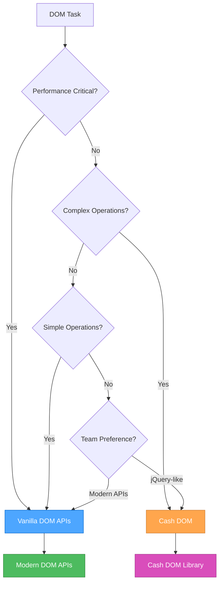

### 💾 **Storage Decision Tree**

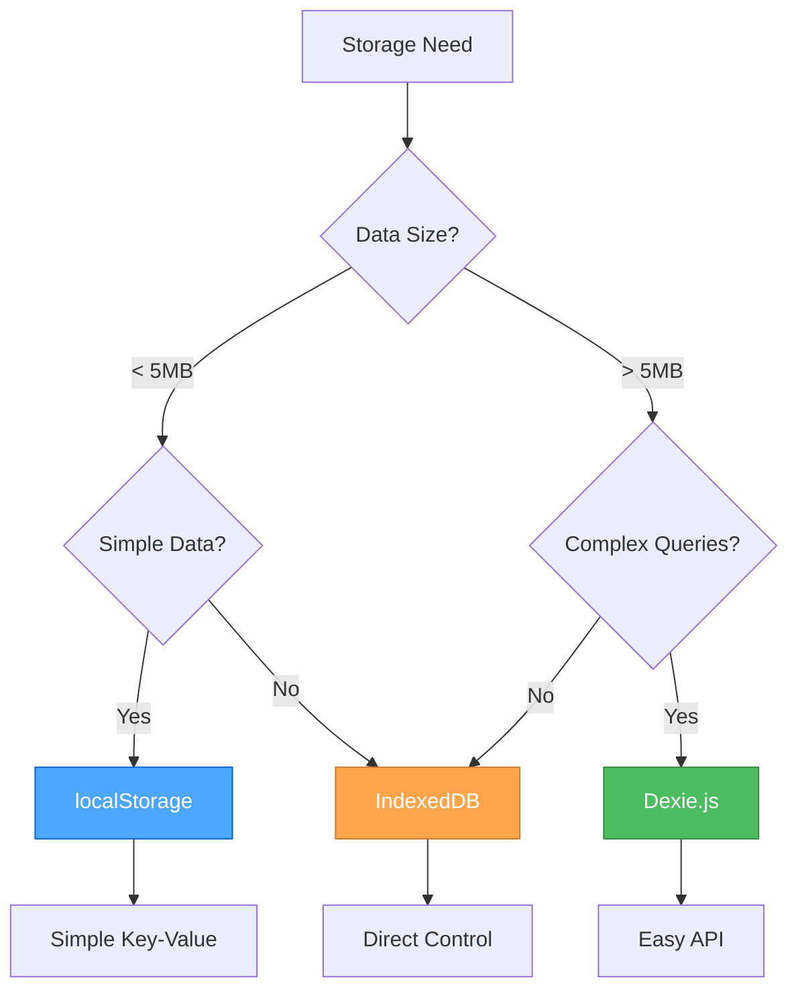

### 🚀 **Modern JavaScript Features Decision**

#### **When to Use ES2023+ Features:**

**✅ Use Modern Features When:**

- Targeting modern browsers (Chrome 90+, Firefox 88+, Safari 14+)
- Building new applications
- Performance is important
- Bundle size matters
- Team is comfortable with modern syntax

**⚠️ Consider Polyfills When:**

- Supporting older browsers
- Using cutting-edge features
- Need to maintain compatibility

**❌ Avoid When:**

- Supporting very old browsers (IE11 and below)
- Team lacks modern JavaScript experience
- Project requires maximum compatibility

### 📋 **Implementation Guidelines**

#### **For New Projects:**

1. **Start with Modern JavaScript**
   - Use ES2023+ features
   - Leverage modern DOM APIs
   - Implement proper error handling

2. **Choose Storage Based on Data**
   - Simple data → localStorage
   - Complex data → IndexedDB + Dexie.js

3. **Select DOM Approach**
   - Simple operations → Vanilla DOM
   - Complex operations → Cash DOM

#### **For Existing Projects:**

1. **Assess Current State**
   - Review existing patterns
   - Identify performance bottlenecks
   - Understand team preferences

2. **Gradual Migration**
   - Start with new features
   - Refactor critical paths
   - Maintain backward compatibility

3. **Document Decisions**
   - Record approach choices
   - Explain rationale
   - Update team guidelines

### 🔧 **Tool Integration**

#### **Perchance-Specific Considerations:**

```javascript
// Perchance projects often benefit from:
// 1. Cash DOM for quick DOM manipulation
// 2. localStorage for simple settings
// 3. IndexedDB + Dexie.js for character data
// 4. Modern JavaScript features for better code

// Example: Perchance character storage
const characterStorage = {
  // Simple settings in localStorage
  saveSettings(settings) {
    localStorage.setItem('perchance-settings', JSON.stringify(settings));
  },
  
  // Complex character data in IndexedDB
  async saveCharacter(character) {
    return await db.characters.add(character);
  },
  
  // Quick DOM updates with Cash DOM
  updateUI(character) {
    $('#character-name').text(character.name);
    $('#character-level').text(character.level);
  }
};
```

#### **Modern Web App Considerations:**

```javascript
// Modern web apps often benefit from:
// 1. Vanilla DOM for performance
// 2. Modern JavaScript features
// 3. IndexedDB for complex data
// 4. Service Workers for offline support

// Example: Modern web app patterns
class ModernApp {
  constructor() {
    this.useModernAPIs = this.checkModernSupport();
    this.storage = this.useModernAPIs ? new IndexedDBStorage() : new LocalStorage();
  }
  
  checkModernSupport() {
    return 'indexedDB' in window && 'fetch' in window;
  }
  
  async initialize() {
    if (this.useModernAPIs) {
      await this.setupServiceWorker();
      await this.setupIndexedDB();
    }
  }
}
```

### 📊 **Performance Comparison**

#### **Bundle Size Impact:**

| Approach | Bundle Size | Performance | Developer Experience |
|----------|-------------|-------------|---------------------|
| **Vanilla JS** | Minimal | Excellent | Good (with experience) |
| **Cash DOM** | ~3KB | Good | Excellent |
| **Dexie.js** | ~15KB | Good | Excellent |
| **Full jQuery** | ~30KB | Fair | Excellent |

#### **Performance Benchmarks:**

```javascript
// DOM manipulation performance (operations/second)
// Vanilla DOM: ~10,000 ops/sec
// Cash DOM: ~8,000 ops/sec
// jQuery: ~6,000 ops/sec

// Storage performance (read operations/second)
// localStorage: ~100,000 ops/sec
// IndexedDB: ~50,000 ops/sec
// Dexie.js: ~45,000 ops/sec
```

### 🎯 **Best Practices Summary**

#### **DO:**

- Choose the right tool for the job
- Consider performance requirements
- Factor in team expertise
- Plan for future maintenance
- Document your decisions
- Test across target browsers

#### **DON'T:**

- Use libraries just because they're popular
- Ignore bundle size impact
- Over-engineer simple solutions
- Mix approaches inconsistently
- Forget about browser support
- Skip performance testing

### 🔄 **Migration Strategies**

#### **From jQuery to Modern:**

1. **Replace selectors**: `$('#id')` → `document.querySelector('#id')`
2. **Replace methods**: `.addClass()` → `.classList.add()`
3. **Replace events**: `.on('click')` → `.addEventListener('click')`
4. **Replace AJAX**: `.ajax()` → `fetch()`

#### **From localStorage to IndexedDB:**

1. **Create migration utility**
2. **Transfer data gradually**
3. **Maintain backward compatibility**
4. **Update storage interfaces**

---

### References

- [Modern JavaScript Features](../.cursor/rules/js-modern-features.mdc) - ES2023+ features
- [DOM Manipulation](../.cursor/rules/js-dom-manipulation.mdc) - Vanilla DOM APIs
- [Cash DOM Usage](../.cursor/rules/js-cash-dom-usage.mdc) - jQuery-like DOM manipulation
- [Storage Strategy](../.cursor/rules/js-storage-strategy.mdc) - Client-side storage approaches
- [Dexie.js Usage](../.cursor/rules/js-dexie-usage.mdc) - IndexedDB with Dexie.js
- [IndexedDB Principles](../.cursor/rules/js-indexeddb-principles.mdc) - IndexedDB best practices
- [Modern APIs](../.cursor/rules/js-modern-apis.mdc) - Modern browser APIs
- [Patterns & Practices](../.cursor/rules/js-patterns-practices.mdc) - JavaScript best practices

---

<a id="amazonqrulesjs-indexeddb-principlesmd"></a>
## .amazonq\rules\js-indexeddb-principles.md

## IndexedDB Principles

### Scope

- Covers client-side storage for Perchance and web apps.
- Outlines schema design, versioning, and upgrade strategies.
- References Dexie.js and Perchance plugin storage.

---

### Core Principles

- **Client-Side Only:**  
    IndexedDB is used for persistent storage in the browser.
- **Schema Versioning:**  
    Always version your database schema and handle upgrades gracefully.
- **Atomic Transactions:**  
    Use transactions for reliable, consistent data operations.
- **Dexie.js Recommended:**  
    Use [Dexie.js](https://dexie.org/) for a simpler IndexedDB API.

---

### Best Practices

- Use a single database per app, with versioned object stores.
- Handle upgrade events to migrate data safely.
- Test storage logic in the Perchance editor and in production.

---

### Example: Dexie.js Setup

```js
const db = new Dexie("MyAppDB");
db.version(1).stores({
  characters: "++id,name,data"
});
```

---

### Related Rules

- [Perchance Architecture](../.cursor/rules/perchance-architecture.mdc)
- [JavaScript Development](../.cursor/rules/js-development.mdc)

---

### References & Inspiration

- [Dexie.js Docs](https://dexie.org/docs/Tutorial/)
- [Dexie.js Best Practices](https://dexie.org/docs/Tutorial/Best-Practices)
- [Perchance Plugins](https://perchance.org/plugins)
- [Perchance AI Character Chat Dependencies](https://perchance.org/ai-character-chat-dependencies-v1)

---

<a id="amazonqrulesjs-modern-apismd"></a>
## .amazonq\rules\js-modern-apis.md

## Modern Browser APIs

### Fetch API

#### **Basic Usage**

```javascript
// Simple GET request
async function fetchData(url) {
  try {
    const response = await fetch(url);
    if (!response.ok) {
      throw new Error(`HTTP error! status: ${response.status}`);
    }
    return await response.json();
  } catch (error) {
    console.error('Error fetching data:', error);
    throw error;
  }
}

// POST request with JSON data
async function postData(url, data) {
  try {
    const response = await fetch(url, {
      method: 'POST',
      headers: {
        'Content-Type': 'application/json',
      },
      body: JSON.stringify(data)
    });
    
    if (!response.ok) {
      throw new Error(`HTTP error! status: ${response.status}`);
    }
    
    return await response.json();
  } catch (error) {
    console.error('Error posting data:', error);
    throw error;
  }
}
```

#### **Advanced Fetch Patterns**

```javascript
// Fetch with timeout
async function fetchWithTimeout(url, timeout = 5000) {
  const controller = new AbortController();
  const timeoutId = setTimeout(() => controller.abort(), timeout);
  
  try {
    const response = await fetch(url, { signal: controller.signal });
    clearTimeout(timeoutId);
    return response;
  } catch (error) {
    clearTimeout(timeoutId);
    throw error;
  }
}

// Fetch with retry logic
async function fetchWithRetry(url, options = {}, maxRetries = 3) {
  for (let i = 0; i < maxRetries; i++) {
    try {
      const response = await fetch(url, options);
      if (!response.ok) {
        throw new Error(`HTTP error! status: ${response.status}`);
      }
      return response;
    } catch (error) {
      if (i === maxRetries - 1) throw error;
      await new Promise(resolve => setTimeout(resolve, 1000 * (i + 1))); // Exponential backoff
    }
  }
}

// Fetch utility with default options
const fetchApi = {
  async get(url, options = {}) {
    const defaultOptions = {
      headers: {
        'Content-Type': 'application/json',
      },
      ...options
    };
    
    const response = await fetch(url, defaultOptions);
    
    if (!response.ok) {
      throw new Error(`HTTP error! status: ${response.status}`);
    }
    
    return response.json();
  },
  
  async post(url, data, options = {}) {
    const defaultOptions = {
      method: 'POST',
      headers: {
        'Content-Type': 'application/json',
      },
      body: JSON.stringify(data),
      ...options
    };
    
    const response = await fetch(url, defaultOptions);
    
    if (!response.ok) {
      throw new Error(`HTTP error! status: ${response.status}`);
    }
    
    return response.json();
  },
  
  async put(url, data, options = {}) {
    const defaultOptions = {
      method: 'PUT',
      headers: {
        'Content-Type': 'application/json',
      },
      body: JSON.stringify(data),
      ...options
    };
    
    const response = await fetch(url, defaultOptions);
    
    if (!response.ok) {
      throw new Error(`HTTP error! status: ${response.status}`);
    }
    
    return response.json();
  },
  
  async delete(url, options = {}) {
    const defaultOptions = {
      method: 'DELETE',
      ...options
    };
    
    const response = await fetch(url, defaultOptions);
    
    if (!response.ok) {
      throw new Error(`HTTP error! status: ${response.status}`);
    }
    
    return response.json();
  }
};
```

#### **Form Data and File Upload**

```javascript
// Form data submission
async function submitForm(formElement) {
  const formData = new FormData(formElement);
  
  const response = await fetch('/api/submit', {
    method: 'POST',
    body: formData
  });
  
  return response.json();
}

// File upload
async function uploadFile(file, url) {
  const formData = new FormData();
  formData.append('file', file);
  
  const response = await fetch(url, {
    method: 'POST',
    body: formData
  });
  
  return response.json();
}

// Multiple file upload with progress
async function uploadFiles(files, url, onProgress) {
  const formData = new FormData();
  
  Array.from(files).forEach((file, index) => {
    formData.append(`file${index}`, file);
  });
  
  const xhr = new XMLHttpRequest();
  
  return new Promise((resolve, reject) => {
    xhr.upload.addEventListener('progress', (event) => {
      if (event.lengthComputable) {
        const percentComplete = (event.loaded / event.total) * 100;
        onProgress(percentComplete);
      }
    });
    
    xhr.addEventListener('load', () => {
      if (xhr.status === 200) {
        resolve(JSON.parse(xhr.responseText));
      } else {
        reject(new Error(`Upload failed: ${xhr.status}`));
      }
    });
    
    xhr.addEventListener('error', () => {
      reject(new Error('Upload failed'));
    });
    
    xhr.open('POST', url);
    xhr.send(formData);
  });
}
```

### Intersection Observer

#### **Intersection Observer Basic Usage**

```javascript
// Simple intersection observer
const observer = new IntersectionObserver((entries) => {
  entries.forEach(entry => {
    if (entry.isIntersecting) {
      entry.target.classList.add('visible');
    } else {
      entry.target.classList.remove('visible');
    }
  });
}, {
  threshold: 0.1,
  rootMargin: '50px'
});

// Observe elements
document.querySelectorAll('.observe').forEach(el => {
  observer.observe(el);
});
```

#### **Intersection Observer Patterns**

```javascript
// Lazy loading images
const lazyImageObserver = new IntersectionObserver((entries) => {
  entries.forEach(entry => {
    if (entry.isIntersecting) {
      const img = entry.target;
      img.src = img.dataset.src;
      img.classList.remove('lazy');
      lazyImageObserver.unobserve(img);
    }
  });
}, {
  threshold: 0.1,
  rootMargin: '100px'
});

document.querySelectorAll('img[data-src]').forEach(img => {
  lazyImageObserver.observe(img);
});

// Infinite scroll
const infiniteScrollObserver = new IntersectionObserver((entries) => {
  entries.forEach(entry => {
    if (entry.isIntersecting) {
      loadMoreContent();
    }
  });
}, {
  threshold: 0.1,
  rootMargin: '200px'
});

// Observe the last item in the list
const observeLastItem = () => {
  const items = document.querySelectorAll('.list-item');
  if (items.length > 0) {
    infiniteScrollObserver.observe(items[items.length - 1]);
  }
};

// Animation on scroll
const animationObserver = new IntersectionObserver((entries) => {
  entries.forEach(entry => {
    if (entry.isIntersecting) {
      entry.target.style.animation = 'fadeIn 0.6s ease-in-out';
    }
  });
}, {
  threshold: 0.2,
  rootMargin: '50px'
});

document.querySelectorAll('.animate-on-scroll').forEach(el => {
  animationObserver.observe(el);
});
```

### Resize Observer

#### **Resize Observer Basic Usage**

```javascript
// Monitor element size changes
const resizeObserver = new ResizeObserver(entries => {
  entries.forEach(entry => {
    const { width, height } = entry.contentRect;
    console.log(`Element resized to ${width}x${height}`);
    
    // Handle resize logic
    updateLayout(width, height);
  });
});

// Observe specific elements
const element = document.querySelector('.resizable');
resizeObserver.observe(element);
```

#### **Resize Observer Patterns**

```javascript
// Responsive layout updates
const responsiveObserver = new ResizeObserver(entries => {
  entries.forEach(entry => {
    const { width } = entry.contentRect;
    const element = entry.target;
    
    // Update layout based on width
    if (width < 768) {
      element.classList.add('mobile-layout');
      element.classList.remove('desktop-layout');
    } else {
      element.classList.add('desktop-layout');
      element.classList.remove('mobile-layout');
    }
  });
});

// Observe container elements
document.querySelectorAll('.responsive-container').forEach(el => {
  responsiveObserver.observe(el);
});

// Debounced resize handling
const debouncedResizeObserver = new ResizeObserver((entries) => {
  // Debounce resize events
  clearTimeout(window.resizeTimeout);
  window.resizeTimeout = setTimeout(() => {
    entries.forEach(entry => {
      handleResize(entry);
    });
  }, 100);
});
```

### Service Worker API

#### **Basic Service Worker**

```javascript
// Service worker registration
if ('serviceWorker' in navigator) {
  navigator.serviceWorker.register('/sw.js')
    .then(registration => {
      console.log('Service Worker registered:', registration);
    })
    .catch(error => {
      console.error('Service Worker registration failed:', error);
    });
}

// Service worker file (sw.js)
self.addEventListener('install', (event) => {
  console.log('Service Worker installing...');
  self.skipWaiting();
});

self.addEventListener('activate', (event) => {
  console.log('Service Worker activating...');
  event.waitUntil(self.clients.claim());
});

self.addEventListener('fetch', (event) => {
  // Cache-first strategy
  event.respondWith(
    caches.match(event.request)
      .then(response => {
        return response || fetch(event.request);
      })
  );
});
```

#### **Service Worker Caching Strategies**

```javascript
// Cache-first strategy
self.addEventListener('fetch', (event) => {
  event.respondWith(
    caches.match(event.request)
      .then(response => {
        if (response) {
          return response;
        }
        return fetch(event.request).then(response => {
          if (!response || response.status !== 200 || response.type !== 'basic') {
            return response;
          }
          const responseToCache = response.clone();
          caches.open('v1').then(cache => {
            cache.put(event.request, responseToCache);
          });
          return response;
        });
      })
  );
});

// Network-first strategy
self.addEventListener('fetch', (event) => {
  event.respondWith(
    fetch(event.request)
      .then(response => {
        const responseToCache = response.clone();
        caches.open('v1').then(cache => {
          cache.put(event.request, responseToCache);
        });
        return response;
      })
      .catch(() => {
        return caches.match(event.request);
      })
  );
});
```

### Web Storage APIs

#### **Local Storage**

```javascript
// Local storage utility
const localStorage = {
  set(key, value) {
    try {
      window.localStorage.setItem(key, JSON.stringify(value));
      return true;
    } catch (error) {
      console.error('LocalStorage set error:', error);
      return false;
    }
  },
  
  get(key, defaultValue = null) {
    try {
      const item = window.localStorage.getItem(key);
      return item ? JSON.parse(item) : defaultValue;
    } catch (error) {
      console.error('LocalStorage get error:', error);
      return defaultValue;
    }
  },
  
  remove(key) {
    window.localStorage.removeItem(key);
  },
  
  clear() {
    window.localStorage.clear();
  },
  
  // Check available space
  getAvailableSpace() {
    const testKey = '__storage_test__';
    const testValue = 'x'.repeat(1024 * 1024); // 1MB
    let available = 0;
    
    try {
      window.localStorage.setItem(testKey, testValue);
      available += testValue.length;
      
      while (true) {
        window.localStorage.setItem(testKey, testValue + testValue);
        available += testValue.length;
      }
    } catch (e) {
      window.localStorage.removeItem(testKey);
    }
    
    return available;
  }
};
```

#### **Session Storage**

```javascript
// Session storage utility
const sessionStorage = {
  set(key, value) {
    try {
      window.sessionStorage.setItem(key, JSON.stringify(value));
      return true;
    } catch (error) {
      console.error('SessionStorage set error:', error);
      return false;
    }
  },
  
  get(key, defaultValue = null) {
    try {
      const item = window.sessionStorage.getItem(key);
      return item ? JSON.parse(item) : defaultValue;
    } catch (error) {
      console.error('SessionStorage get error:', error);
      return defaultValue;
    }
  },
  
  remove(key) {
    window.sessionStorage.removeItem(key);
  },
  
  clear() {
    window.sessionStorage.clear();
  }
};
```

### Web Workers

#### **Web Worker Basic Usage**

```javascript
// Main thread
const worker = new Worker('worker.js');

worker.postMessage({
  type: 'calculate',
  data: { a: 10, b: 20 }
});

worker.onmessage = (event) => {
  console.log('Result from worker:', event.data);
};

worker.onerror = (error) => {
  console.error('Worker error:', error);
};

// Worker file (worker.js)
self.onmessage = (event) => {
  const { type, data } = event.data;
  
  switch (type) {
    case 'calculate':
      const result = data.a + data.b;
      self.postMessage({ type: 'result', data: result });
      break;
      
    default:
      self.postMessage({ type: 'error', data: 'Unknown message type' });
  }
};
```

#### **Shared Web Worker**

```javascript
// Shared worker for cross-tab communication
const sharedWorker = new SharedWorker('shared-worker.js');

sharedWorker.port.onmessage = (event) => {
  console.log('Message from shared worker:', event.data);
};

sharedWorker.port.postMessage({
  type: 'register',
  data: { tabId: Date.now() }
});

// Shared worker file (shared-worker.js)
const connections = [];

self.onconnect = (event) => {
  const port = event.ports[0];
  connections.push(port);
  
  port.onmessage = (event) => {
    const { type, data } = event.data;
    
    switch (type) {
      case 'register':
        port.postMessage({ type: 'registered', data: { tabId: data.tabId } });
        break;
        
      case 'broadcast':
        // Broadcast to all connected tabs
        connections.forEach(conn => {
          if (conn !== port) {
            conn.postMessage({ type: 'broadcast', data });
          }
        });
        break;
    }
  };
};
```

---

### References

- [Modern JavaScript Features](../.cursor/rules/js-modern-features.mdc) - ES2023+ features
- [DOM Manipulation](../.cursor/rules/js-dom-manipulation.mdc) - Modern DOM APIs
- [Storage Strategy](../.cursor/rules/js-storage-strategy.mdc) - Client-side storage approaches

---

<a id="amazonqrulesjs-modern-featuresmd"></a>
## .amazonq\rules\js-modern-features.md

## Modern JavaScript Features (ES2023+)

### Template Literals and String Manipulation

```javascript
// Multi-line strings with template literals
const str = `
  ECMA International's TC39 is a group of JavaScript developers,
  implementers, academics, and more, collaborating with the community
  to maintain and evolve the definition of JavaScript.
`;

// Expression interpolation
function sum(a, b) {
  return a + b;
}
console.log(`1 + 2 = ${sum(1, 2)}.`); // "1 + 2 = 3."

// Tagged templates
function highlight(strings, ...values) {
  return strings.reduce((result, str, i) => {
    return result + str + (values[i] ? `<mark>${values[i]}</mark>` : '');
  }, '');
}
const message = highlight`Hello ${name}, welcome to ${site}!`;
```

### Modern Array Methods

```javascript
// Array iteration with for...of (preferred over for...in for arrays)
const fruits = ["Apple", "Orange", "Plum"];
for (const fruit of fruits) {
  console.log(fruit);
}

// Modern array methods
const numbers = [1, 2, 3, 4, 5];

// Array.from with mapping
const doubled = Array.from(numbers, x => x * 2);

// Array destructuring
const [first, second, ...rest] = numbers;

// Array spreading
const combined = [...numbers, 6, 7, 8];

// Array methods with arrow functions
const evens = numbers.filter(n => n % 2 === 0);
const doubled = numbers.map(n => n * 2);
const sum = numbers.reduce((acc, n) => acc + n, 0);
```

### Object Features

```javascript
// Object destructuring
const user = {
  name: "John",
  age: 30,
  preferences: {
    theme: "dark",
    language: "en"
  }
};

const { name, age, preferences: { theme } } = user;

// Dynamic property access
const key = "likes birds";
user[key] = true;

// Object spreading
const userWithDefaults = {
  role: "user",
  active: true,
  ...user
};

// Object shorthand
const name = "John";
const age = 30;
const person = { name, age }; // { name: "John", age: 30 }

// Optional chaining
const theme = user?.preferences?.theme;
const result = api?.getData?.()?.items;

// Nullish coalescing
function showCount(count) {
  console.log(count ?? "unknown");
}
showCount(0); // 0
showCount(null); // "unknown"
showCount(); // "unknown"
```

### Modern Functions

```javascript
// Arrow functions
const sum = (a, b) => a + b;
const double = n => n * 2;
const sayHi = () => console.log("Hello");

// Arrow functions with implicit return
const numbers = [1, 2, 3, 4];
const doubled = numbers.map(n => n * 2);

// Arrow functions for context binding
const user = {
  name: "John",
  sayHi() {
    setTimeout(() => console.log(`Hello, ${this.name}!`), 1000);
  }
};

// Default parameters
function showMessage(from, text = "no text given") {
  console.log(`${from}: ${text}`);
}

// Rest parameters
function sum(...numbers) {
  return numbers.reduce((acc, n) => acc + n, 0);
}

// Function name inference
const sayHi = function() {
  console.log("Hi");
};
console.log(sayHi.name); // "sayHi"
```

### Promise and Async/Await

```javascript
// Modern async/await syntax
async function fetchUserData(userId) {
  try {
    const response = await fetch(`/api/users/${userId}`);
    if (!response.ok) {
      throw new Error(`HTTP error! status: ${response.status}`);
    }
    const user = await response.json();
    return user;
  } catch (error) {
    console.error('Error fetching user:', error);
    throw error;
  }
}

// Top-level await (in modules)
const response = await fetch('/api/data');
const data = await response.json();

// Promise.all for parallel requests
async function fetchMultipleUsers(userIds) {
  const promises = userIds.map(id => fetchUserData(id));
  const users = await Promise.all(promises);
  return users;
}

// Promise.race for timeout
async function fetchWithTimeout(url, timeout = 5000) {
  const controller = new AbortController();
  const timeoutId = setTimeout(() => controller.abort(), timeout);
  
  try {
    const response = await fetch(url, { signal: controller.signal });
    clearTimeout(timeoutId);
    return response;
  } catch (error) {
    clearTimeout(timeoutId);
    throw error;
  }
}
```

### Module Pattern

```javascript
// ES6 Modules
// utils.js
export const formatDate = (date) => {
  return new Intl.DateTimeFormat('en-US').format(date);
};

export const debounce = (func, wait) => {
  let timeout;
  return function executedFunction(...args) {
    const later = () => {
      clearTimeout(timeout);
      func(...args);
    };
    clearTimeout(timeout);
    timeout = setTimeout(later, wait);
  };
};

export default class Utils {
  static formatCurrency(amount, currency = 'USD') {
    return new Intl.NumberFormat('en-US', {
      style: 'currency',
      currency
    }).format(amount);
  }
}

// main.js
import Utils, { formatDate, debounce } from './utils.js';

// Dynamic imports
const loadModule = async () => {
  const module = await import('./dynamic-module.js');
  module.default();
};
```

### Class Patterns

```javascript
// Modern class syntax
class User {
  #privateField = 'private';
  
  constructor(name, email) {
    this.name = name;
    this.email = email;
  }
  
  // Getter
  get displayName() {
    return `${this.name} (${this.email})`;
  }
  
  // Setter
  set displayName(value) {
    const [name, email] = value.split(' (');
    this.name = name;
    this.email = email.replace(')', '');
  }
  
  // Static method
  static createFromJSON(json) {
    return new User(json.name, json.email);
  }
  
  // Instance method
  sayHello() {
    console.log(`Hello, I'm ${this.name}`);
  }
}

// Class inheritance
class AdminUser extends User {
  constructor(name, email, permissions = []) {
    super(name, email);
    this.permissions = permissions;
  }
  
  hasPermission(permission) {
    return this.permissions.includes(permission);
  }
}
```

### Error Handling

```javascript
// Modern error handling
class CustomError extends Error {
  constructor(message, code) {
    super(message);
    this.name = 'CustomError';
    this.code = code;
  }
}

// Try-catch with async/await
async function handleAsyncOperation() {
  try {
    const result = await riskyOperation();
    return result;
  } catch (error) {
    if (error instanceof CustomError) {
      console.error(`Custom error: ${error.message}`);
    } else {
      console.error('Unexpected error:', error);
    }
    throw error;
  } finally {
    // Cleanup code
    cleanup();
  }
}

// Error boundaries
window.addEventListener('error', (event) => {
  console.error('Global error:', event.error);
  // Send to error reporting service
});

window.addEventListener('unhandledrejection', (event) => {
  console.error('Unhandled promise rejection:', event.reason);
  event.preventDefault();
});
```

---

### References

- [JavaScript Development](../.cursor/rules/js-development.mdc) - Comprehensive JavaScript guide
- [DOM Manipulation](../.cursor/rules/js-dom-manipulation.mdc) - Modern DOM APIs
- [Storage Strategy](../.cursor/rules/js-storage-strategy.mdc) - Client-side storage approaches

---

<a id="amazonqrulesjs-patterns-practicesmd"></a>
## .amazonq\rules\js-patterns-practices.md

## JavaScript Patterns and Best Practices

### Performance Optimization

#### **Debouncing**

```javascript
// Debouncing for expensive operations
const debounce = (func, wait) => {
  let timeout;
  return function executedFunction(...args) {
    const later = () => {
      clearTimeout(timeout);
      func(...args);
    };
    clearTimeout(timeout);
    timeout = setTimeout(later, wait);
  };
};

// Usage examples
const debouncedSearch = debounce((query) => {
  // Expensive search operation
  performSearch(query);
}, 300);

const debouncedResize = debounce(() => {
  // Handle window resize
  updateLayout();
}, 100);
```

#### **Throttling**

```javascript
// Throttling for rate limiting
const throttle = (func, limit) => {
  let inThrottle;
  return function() {
    const args = arguments;
    const context = this;
    if (!inThrottle) {
      func.apply(context, args);
      inThrottle = true;
      setTimeout(() => inThrottle = false, limit);
    }
  };
};

// Usage examples
const throttledScroll = throttle(() => {
  // Handle scroll events
  updateScrollPosition();
}, 16); // ~60fps

const throttledInput = throttle((value) => {
  // Handle input changes
  validateInput(value);
}, 100);
```

#### **Memoization**

```javascript
// Memoization for expensive calculations
const memoize = (fn) => {
  const cache = new Map();
  return (...args) => {
    const key = JSON.stringify(args);
    if (cache.has(key)) {
      return cache.get(key);
    }
    const result = fn.apply(this, args);
    cache.set(key, result);
    return result;
  };
};

// Usage examples
const expensiveCalculation = memoize((a, b) => {
  // Expensive computation
  return a * b + Math.pow(a, 2) + Math.pow(b, 2);
});

const fibonacci = memoize((n) => {
  if (n <= 1) return n;
  return fibonacci(n - 1) + fibonacci(n - 2);
});
```

#### **Lazy Loading**

```javascript
// Lazy loading with Intersection Observer
const lazyLoad = (selector, callback) => {
  const observer = new IntersectionObserver((entries) => {
    entries.forEach(entry => {
      if (entry.isIntersecting) {
        callback(entry.target);
        observer.unobserve(entry.target);
      }
    });
  });
  
  document.querySelectorAll(selector).forEach(el => {
    observer.observe(el);
  });
};

// Usage
lazyLoad('.lazy-image', (img) => {
  img.src = img.dataset.src;
  img.classList.remove('lazy');
});

// Dynamic imports for code splitting
const loadModule = async (moduleName) => {
  try {
    const module = await import(`./modules/${moduleName}.js`);
    return module.default;
  } catch (error) {
    console.error(`Failed to load module: ${moduleName}`, error);
    return null;
  }
};
```

### Code Organization

#### **Utility Functions**

```javascript
// Utility functions for common operations
const utils = {
  // Type checking
  isString: (value) => typeof value === 'string',
  isNumber: (value) => typeof value === 'number' && !isNaN(value),
  isArray: (value) => Array.isArray(value),
  isObject: (value) => typeof value === 'object' && value !== null,
  isFunction: (value) => typeof value === 'function',
  
  // DOM utilities
  $: (selector) => document.querySelector(selector),
  $$: (selector) => document.querySelectorAll(selector),
  
  // Event utilities
  on: (element, event, handler) => element.addEventListener(event, handler),
  off: (element, event, handler) => element.removeEventListener(event, handler),
  
  // Storage utilities
  storage: {
    set: (key, value) => localStorage.setItem(key, JSON.stringify(value)),
    get: (key) => {
      try {
        return JSON.parse(localStorage.getItem(key));
      } catch {
        return null;
      }
    }
  },
  
  // String utilities
  capitalize: (str) => str.charAt(0).toUpperCase() + str.slice(1),
  slugify: (str) => str.toLowerCase().replace(/[^a-z0-9]+/g, '-').replace(/(^-|-$)/g, ''),
  
  // Array utilities
  unique: (arr) => [...new Set(arr)],
  chunk: (arr, size) => {
    const chunks = [];
    for (let i = 0; i < arr.length; i += size) {
      chunks.push(arr.slice(i, i + size));
    }
    return chunks;
  }
};
```

#### **Configuration Management**

```javascript
// Configuration object
const config = {
  api: {
    baseUrl: 'https://api.example.com',
    timeout: 5000,
    retries: 3
  },
  features: {
    darkMode: true,
    animations: true,
    offline: false
  },
  storage: {
    prefix: 'app_',
    ttl: 3600000 // 1 hour
  }
};

// Environment-based configuration
const env = {
  development: {
    api: { baseUrl: 'http://localhost:3000' },
    debug: true
  },
  production: {
    api: { baseUrl: 'https://api.production.com' },
    debug: false
  }
};

const currentConfig = {
  ...config,
  ...env[process.env.NODE_ENV || 'development']
};
```

#### **Feature Detection**

```javascript
// Feature detection for progressive enhancement
const features = {
  supportsIntersectionObserver: 'IntersectionObserver' in window,
  supportsResizeObserver: 'ResizeObserver' in window,
  supportsFetch: 'fetch' in window,
  supportsServiceWorker: 'serviceWorker' in navigator,
  supportsIndexedDB: 'indexedDB' in window,
  supportsLocalStorage: (() => {
    try {
      localStorage.setItem('test', 'test');
      localStorage.removeItem('test');
      return true;
    } catch {
      return false;
    }
  })()
};

// Conditional feature usage
if (features.supportsIntersectionObserver) {
  // Use Intersection Observer
  setupLazyLoading();
} else {
  // Fallback to scroll events
  setupScrollBasedLazyLoading();
}
```

### Error Handling

#### **Custom Error Classes**

```javascript
// Custom error classes for better error handling
class ValidationError extends Error {
  constructor(message, field) {
    super(message);
    this.name = 'ValidationError';
    this.field = field;
  }
}

class NetworkError extends Error {
  constructor(message, status, url) {
    super(message);
    this.name = 'NetworkError';
    this.status = status;
    this.url = url;
  }
}

class StorageError extends Error {
  constructor(message, operation) {
    super(message);
    this.name = 'StorageError';
    this.operation = operation;
  }
}
```

#### **Error Boundaries**

```javascript
// Global error handling
window.addEventListener('error', (event) => {
  console.error('Global error:', event.error);
  logError(event.error, {
    type: 'global',
    url: window.location.href,
    userAgent: navigator.userAgent
  });
});

window.addEventListener('unhandledrejection', (event) => {
  console.error('Unhandled promise rejection:', event.reason);
  logError(event.reason, {
    type: 'promise',
    url: window.location.href
  });
  event.preventDefault();
});

// Error logging utility
const logError = (error, context = {}) => {
  const errorInfo = {
    message: error.message,
    stack: error.stack,
    name: error.name,
    context,
    timestamp: new Date().toISOString(),
    userAgent: navigator.userAgent,
    url: window.location.href
  };
  
  console.error('Error occurred:', errorInfo);
  
  // Send to error reporting service
  if (window.errorReportingService) {
    window.errorReportingService.captureException(error, { extra: context });
  }
  
  // Store locally for debugging
  const errors = JSON.parse(localStorage.getItem('app_errors') || '[]');
  errors.push(errorInfo);
  localStorage.setItem('app_errors', JSON.stringify(errors.slice(-10))); // Keep last 10
};
```

### Testing and Debugging

#### **Modern Debugging**

```javascript
// Modern debugging techniques
console.log('Debug info:', { user, timestamp: Date.now() });
console.table(data);
console.group('Grouped logs');
console.groupEnd();

// Performance measurement
console.time('operation');
// ... operation
console.timeEnd('operation');

// Assertions
console.assert(condition, 'Assertion failed');

// Conditional logging
const DEBUG = true;
const debug = DEBUG ? console.log.bind(console) : () => {};

// Debug utilities
const debugUtils = {
  log: (message, data) => {
    if (DEBUG) {
      console.log(`[DEBUG] ${message}`, data);
    }
  },
  
  time: (label) => {
    if (DEBUG) {
      console.time(label);
    }
  },
  
  timeEnd: (label) => {
    if (DEBUG) {
      console.timeEnd(label);
    }
  },
  
  trace: (message) => {
    if (DEBUG) {
      console.trace(message);
    }
  }
};
```

#### **Testing Utilities**

```javascript
// Simple testing utilities
const test = {
  assert: (condition, message) => {
    if (!condition) {
      throw new Error(`Assertion failed: ${message}`);
    }
  },
  
  assertEquals: (actual, expected, message) => {
    if (actual !== expected) {
      throw new Error(`Assertion failed: ${message}. Expected ${expected}, got ${actual}`);
    }
  },
  
  assertArrayEquals: (actual, expected, message) => {
    if (!Array.isArray(actual) || !Array.isArray(expected)) {
      throw new Error(`Assertion failed: ${message}. Both arguments must be arrays`);
    }
    if (actual.length !== expected.length) {
      throw new Error(`Assertion failed: ${message}. Array lengths differ`);
    }
    for (let i = 0; i < actual.length; i++) {
      if (actual[i] !== expected[i]) {
        throw new Error(`Assertion failed: ${message}. Arrays differ at index ${i}`);
      }
    }
  }
};

// Usage example
try {
  test.assertEquals(sum(2, 3), 5, 'Basic addition');
  test.assertArrayEquals([1, 2, 3], [1, 2, 3], 'Array comparison');
  console.log('All tests passed!');
} catch (error) {
  console.error('Test failed:', error.message);
}
```

### Code Quality Patterns

#### **Clean Code Principles**

```javascript
// Meaningful variable names
const userPreferences = getUserPreferences();
const isUserLoggedIn = checkUserLoginStatus();
const hasValidPermissions = validateUserPermissions();

// Small, focused functions
const calculateTotalPrice = (items) => {
  return items.reduce((total, item) => total + item.price, 0);
};

const applyDiscount = (total, discountPercent) => {
  return total * (1 - discountPercent / 100);
};

const formatCurrency = (amount) => {
  return new Intl.NumberFormat('en-US', {
    style: 'currency',
    currency: 'USD'
  }).format(amount);
};

// Single responsibility
const processOrder = (order) => {
  const total = calculateTotalPrice(order.items);
  const discountedTotal = applyDiscount(total, order.discount);
  const formattedTotal = formatCurrency(discountedTotal);
  
  return {
    ...order,
    total: discountedTotal,
    formattedTotal
  };
};
```

#### **Consistent Code Style**

```javascript
// Consistent naming conventions
const CONSTANTS = {
  API_BASE_URL: 'https://api.example.com',
  MAX_RETRIES: 3,
  TIMEOUT_MS: 5000
};

// Consistent function declarations
const arrowFunction = () => {
  // Use for simple functions
};

function regularFunction() {
  // Use for more complex functions
}

// Consistent error handling
const safeOperation = async () => {
  try {
    const result = await riskyOperation();
    return { success: true, data: result };
  } catch (error) {
    logError(error);
    return { success: false, error: error.message };
  }
};
```

---

### References

- [Modern JavaScript Features](../.cursor/rules/js-modern-features.mdc) - ES2023+ features
- [DOM Manipulation](../.cursor/rules/js-dom-manipulation.mdc) - Modern DOM APIs
- [Storage Strategy](../.cursor/rules/js-storage-strategy.mdc) - Client-side storage approaches

---

<a id="amazonqrulesjs-storage-strategymd"></a>
## .amazonq\rules\js-storage-strategy.md

## Client-Side Storage Strategy

### Storage Decision Framework

#### **When to Use localStorage**

**✅ Perfect for:**

- Simple key-value data (settings, preferences, user choices)
- Small amounts of data (< 5MB total)
- Data that doesn't need complex querying
- Temporary data that can be lost
- Simple caching scenarios
- Cross-tab data sharing

**❌ Avoid for:**

- Large datasets (> 5MB)
- Complex data structures requiring queries
- Sensitive data (easily accessible)
- Data requiring transactions
- Binary data or files

#### **When to Use IndexedDB**

**✅ Perfect for:**

- Large datasets (> 5MB)
- Complex data structures requiring queries
- Binary data (images, files)
- Data requiring transactions and consistency
- Offline-first applications
- Complex caching scenarios
- Data that needs to persist across sessions

**❌ Avoid for:**

- Simple key-value storage
- Small amounts of data
- Quick prototyping
- Simple settings storage

#### **When to Use Dexie.js**

**✅ Perfect for:**

- All IndexedDB use cases
- Complex queries and relationships
- Schema versioning and migrations
- Transaction management
- Better developer experience
- Perchance projects requiring robust storage

**❌ Avoid for:**

- Simple localStorage scenarios
- When bundle size is critical
- When you need direct IndexedDB control

### localStorage Implementation

```javascript
// Local Storage utility
const storage = {
  set(key, value) {
    try {
      localStorage.setItem(key, JSON.stringify(value));
      return true;
    } catch (error) {
      console.error('Storage quota exceeded:', error);
      return false;
    }
  },
  
  get(key, defaultValue = null) {
    try {
      const item = localStorage.getItem(key);
      return item ? JSON.parse(item) : defaultValue;
    } catch (error) {
      console.error('Error reading from storage:', error);
      return defaultValue;
    }
  },
  
  remove(key) {
    localStorage.removeItem(key);
  },
  
  clear() {
    localStorage.clear();
  },
  
  // Check available space
  getAvailableSpace() {
    const testKey = '__storage_test__';
    const testValue = 'x'.repeat(1024 * 1024); // 1MB
    let available = 0;
    
    try {
      localStorage.setItem(testKey, testValue);
      available += testValue.length;
      
      while (true) {
        localStorage.setItem(testKey, testValue + testValue);
        available += testValue.length;
      }
    } catch (e) {
      localStorage.removeItem(testKey);
    }
    
    return available;
  }
};

// Usage examples
storage.set('user-preferences', { theme: 'dark', language: 'en' });
const prefs = storage.get('user-preferences', { theme: 'light' });
```

### IndexedDB with Dexie.js

```javascript
// Dexie.js setup
import Dexie from 'https://cdn.jsdelivr.net/npm/dexie@3.2.2/dist/dexie.mjs';

const db = new Dexie('MyAppDB');

// Schema definition with versioning
db.version(1).stores({
  characters: '++id,name,data,createdAt',
  settings: 'key,value,updatedAt',
  cache: 'url,data,expiresAt'
});

// Character management
const characterService = {
  async add(character) {
    return await db.characters.add({
      ...character,
      createdAt: new Date().toISOString()
    });
  },
  
  async get(id) {
    return await db.characters.get(id);
  },
  
  async getAll() {
    return await db.characters.toArray();
  },
  
  async update(id, updates) {
    return await db.characters.update(id, updates);
  },
  
  async delete(id) {
    return await db.characters.delete(id);
  },
  
  async search(query) {
    return await db.characters
      .where('name')
      .startsWithIgnoreCase(query)
      .toArray();
  }
};

// Settings management
const settingsService = {
  async set(key, value) {
    return await db.settings.put({
      key,
      value,
      updatedAt: new Date().toISOString()
    });
  },
  
  async get(key, defaultValue = null) {
    const setting = await db.settings.get(key);
    return setting ? setting.value : defaultValue;
  },
  
  async getAll() {
    const settings = await db.settings.toArray();
    return settings.reduce((acc, setting) => {
      acc[setting.key] = setting.value;
      return acc;
    }, {});
  }
};

// Cache management
const cacheService = {
  async set(url, data, ttl = 3600000) { // 1 hour default
    const expiresAt = new Date(Date.now() + ttl).toISOString();
    return await db.cache.put({ url, data, expiresAt });
  },
  
  async get(url) {
    const cached = await db.cache.get(url);
    if (!cached) return null;
    
    if (new Date(cached.expiresAt) < new Date()) {
      await db.cache.delete(url);
      return null;
    }
    
    return cached.data;
  },
  
  async cleanup() {
    const now = new Date().toISOString();
    return await db.cache
      .where('expiresAt')
      .below(now)
      .delete();
  }
};
```

### Hybrid Storage Strategy

```javascript
// Unified storage service that chooses the right storage method
class StorageService {
  constructor() {
    this.storageType = this.detectStorageType();
  }
  
  detectStorageType() {
    // Check if IndexedDB is available
    if ('indexedDB' in window) {
      return 'indexeddb';
    }
    // Fallback to localStorage
    return 'localstorage';
  }
  
  async set(key, value, options = {}) {
    const { useIndexedDB = false, ttl } = options;
    
    if (useIndexedDB && this.storageType === 'indexeddb') {
      return await settingsService.set(key, value);
    } else {
      return storage.set(key, value);
    }
  }
  
  async get(key, defaultValue = null, options = {}) {
    const { useIndexedDB = false } = options;
    
    if (useIndexedDB && this.storageType === 'indexeddb') {
      return await settingsService.get(key, defaultValue);
    } else {
      return storage.get(key, defaultValue);
    }
  }
  
  async remove(key, options = {}) {
    const { useIndexedDB = false } = options;
    
    if (useIndexedDB && this.storageType === 'indexeddb') {
      return await db.settings.delete(key);
    } else {
      return storage.remove(key);
    }
  }
}

// Usage
const storageService = new StorageService();

// Simple settings (uses localStorage)
await storageService.set('theme', 'dark');

// Complex data (uses IndexedDB)
await storageService.set('user-data', complexObject, { useIndexedDB: true });
```

### Migration Strategies

```javascript
// Migrate from localStorage to IndexedDB
const migrationService = {
  async migrateFromLocalStorage() {
    const keys = Object.keys(localStorage);
    const migrationData = {};
    
    // Collect all localStorage data
    keys.forEach(key => {
      try {
        migrationData[key] = JSON.parse(localStorage.getItem(key));
      } catch (error) {
        console.warn(`Failed to parse localStorage key: ${key}`);
      }
    });
    
    // Migrate to IndexedDB
    for (const [key, value] of Object.entries(migrationData)) {
      await settingsService.set(key, value);
      localStorage.removeItem(key); // Clean up
    }
    
    console.log(`Migrated ${Object.keys(migrationData).length} items`);
  },
  
  async migrateFromIndexedDB() {
    const settings = await settingsService.getAll();
    
    // Migrate to localStorage
    for (const [key, value] of Object.entries(settings)) {
      storage.set(key, value);
      await db.settings.delete(key); // Clean up
    }
    
    console.log(`Migrated ${Object.keys(settings).length} items`);
  }
};
```

### Error Handling and Fallbacks

```javascript
// Robust storage with fallbacks
class RobustStorage {
  constructor() {
    this.primaryStorage = 'indexeddb';
    this.fallbackStorage = 'localstorage';
  }
  
  async set(key, value) {
    try {
      if (this.primaryStorage === 'indexeddb') {
        await settingsService.set(key, value);
      } else {
        storage.set(key, value);
      }
    } catch (error) {
      console.warn('Primary storage failed, using fallback:', error);
      // Fallback to localStorage
      storage.set(key, value);
    }
  }
  
  async get(key, defaultValue = null) {
    try {
      if (this.primaryStorage === 'indexeddb') {
        return await settingsService.get(key, defaultValue);
      } else {
        return storage.get(key, defaultValue);
      }
    } catch (error) {
      console.warn('Primary storage failed, using fallback:', error);
      // Fallback to localStorage
      return storage.get(key, defaultValue);
    }
  }
}
```

### Perchance-Specific Considerations

```javascript
// Perchance storage patterns
const perchanceStorage = {
  // Character data (complex, use IndexedDB)
  async saveCharacter(character) {
    return await characterService.add(character);
  },
  
  // User preferences (simple, use localStorage)
  savePreferences(preferences) {
    storage.set('perchance-preferences', preferences);
  },
  
  // Cache generated content (use IndexedDB with TTL)
  async cacheGeneratedContent(url, content) {
    return await cacheService.set(url, content, 1800000); // 30 minutes
  },
  
  // Settings that persist across sessions
  async saveSetting(key, value) {
    return await settingsService.set(key, value);
  }
};
```

---

### References

- [Dexie.js Usage](../.cursor/rules/js-dexie-usage.mdc) - IndexedDB with Dexie.js
- [IndexedDB Principles](../.cursor/rules/js-indexeddb-principles.mdc) - IndexedDB best practices
- [Modern JavaScript Features](../.cursor/rules/js-modern-features.mdc) - ES2023+ features

---

<a id="amazonqrulesmcp-basic-memorymd"></a>
## .amazonq\rules\mcp-basic-memory.md

## Basic Memory MCP Server Integration

### Overview

Basic Memory is a knowledge management system that builds persistent semantic graphs and long-term storage from conversations. It integrates with Obsidian.md and provides native MCP server capabilities for the 3-mode development system.

### 🎯 **WHY BASIC MEMORY?**

#### **Perfect for 3-Mode System**

- **Semantic Knowledge Management**: Automatic graph building from conversations
- **Obsidian Integration**: Works with existing Obsidian workflows
- **Multi-Project Support**: Separate knowledge bases for each mode
- **Real-time Sync**: Automatic file synchronization with watch mode
- **Markdown Storage**: Human-readable knowledge files
- **Full Control**: You own all your data
- **High Trust Score**: 8.0/10 reliability
- **MCP Server**: Native MCP server integration

### 🔧 **INSTALLATION & SETUP**

#### **Step 1: Install Basic Memory**

```bash
## Using pip (recommended for Windows)
pip install basic-memory

## Verify installation
python -c "import basic_memory; print(basic_memory.__version__)"
```

#### **Step 2: Configure MCP Server**

Add to your `mcp.json`:

```json
{
  "mcpServers": {
    "basic-memory": {
      "command": "python",
      "args": [
        "-m",
        "basic_memory.mcp"
      ],
      "env": {
        "BASIC_MEMORY_PROJECT_ROOT": "./memory-bank"
      },
      "autoApprove": [
        "list_projects",
        "list_project_files",
        "memory_bank_read",
        "memory_bank_write",
        "memory_bank_update"
      ],
      "autoStart": true,
      "description": "Basic Memory MCP server for semantic knowledge management with Obsidian integration."
    }
  }
}
```

#### **Step 3: Set Up Projects**

Create mode-specific projects:

```bash
## Create strategic project
mkdir -p memory-bank/strategic
echo "# Strategic Knowledge Base" > memory-bank/strategic/README.md

## Create tactical project  
mkdir -p memory-bank/tactical
echo "# Tactical Knowledge Base" > memory-bank/tactical/README.md

## Create operational project
mkdir -p memory-bank/operational
echo "# Operational Knowledge Base" > memory-bank/operational/README.md
```

### 🔄 **3-MODE SYSTEM INTEGRATION**

#### **🎭 STRATEGIC MODE + Basic Memory**

**Knowledge Categories**:

- **System Architecture**: Workflow optimization insights
- **Tool Configurations**: Successful tool setups and configurations
- **Meta-Patterns**: Patterns across multiple projects
- **Strategic Decisions**: Planning decisions and rationales

**Usage Patterns**:

```bash
## Store strategic insights
basic-memory store "workflow-optimization" --content "Hierarchical rule loading reduces context usage by 40%"

## Search for strategic patterns
basic-memory search "workflow" --project strategic --limit 10

## Link related concepts
basic-memory link "workflow-optimization" "rule-loading" "performance-improvement"
```

#### **🎨 TACTICAL MODE + Basic Memory**

**Knowledge Categories**:

- **Design Decisions**: UI/UX design decisions and rationales
- **Requirements Patterns**: Common requirement structures
- **Architecture Templates**: Reusable architectural patterns
- **Planning Templates**: Planning approaches and methodologies

**Usage Patterns**:

```bash
## Store design decisions
basic-memory store "ui-pattern-decision" --content "Using Pico CSS for minimal, modern UI design"

## Search for design patterns
basic-memory search "ui" --project tactical --limit 5

## Create planning templates
basic-memory store "sprint-planning-template" --content "Standard sprint planning approach with user stories"
```

#### **⚒️ OPERATIONAL MODE + Basic Memory**

**Knowledge Categories**:

- **Implementation Patterns**: Code patterns and solutions
- **Debug Solutions**: Problem resolution approaches
- **Performance Optimizations**: Performance improvement techniques
- **Deployment Configs**: Deployment and configuration setups

**Usage Patterns**:

```bash
## Store implementation patterns
basic-memory store "react-hook-pattern" --content "Custom hook for form state management"

## Search for solutions
basic-memory search "debug" --project operational --limit 10

## Store performance optimizations
basic-memory store "css-optimization" --content "Consolidating CSS reduces bundle size by 30%"
```

### 🔍 **KNOWLEDGE MANAGEMENT**

#### **Semantic Search**

```bash
## Search across all projects
basic-memory search "workflow" --limit 20

## Search specific project
basic-memory search "react" --project operational --limit 10

## Search with filters
basic-memory search "optimization" --project strategic --type pattern --limit 5
```

#### **Knowledge Relationships**

Basic Memory automatically builds semantic connections:

```bash
## Store related concepts
basic-memory store "react-hooks" --content "React Hooks for state management"
basic-memory store "useState" --content "useState hook for component state"
basic-memory store "useEffect" --content "useEffect hook for side effects"

## Basic Memory automatically connects these concepts
```

#### **Multi-Project Knowledge Sharing**

```bash
## Share knowledge between projects
basic-memory link --from strategic --to tactical "workflow-patterns"
basic-memory link --from tactical --to operational "implementation-patterns"
```

#### **Knowledge Export/Import**

```bash
## Export knowledge for backup
basic-memory export --project strategic --format markdown

## Import knowledge from backup
basic-memory import --project strategic --file backup.md
```

### 🔧 **TROUBLESHOOTING**

#### **Common Issues**

1. **Installation Problems**

   ```bash
   # Check Python version
   python --version
   
   # Reinstall if needed
   pip uninstall basic-memory
   pip install basic-memory
   ```

2. **MCP Server Not Starting**

   ```bash
   # Check if Basic Memory is installed
   python -c "import basic_memory; print('Basic Memory installed')"
   
   # Test MCP server directly
   python -m basic_memory.mcp
   ```

3. **File Permission Issues**

   ```bash
   # Check directory permissions
   ls -la memory-bank/
   
   # Fix permissions if needed
   chmod 755 memory-bank/
   ```

#### **Verification Commands**

```bash
## Test Basic Memory installation
basic-memory --version

## Test MCP server
python -m basic_memory.mcp --help

## List available projects
basic-memory list-projects

## Test file operations
basic-memory store "test" --content "Test knowledge entry"
basic-memory search "test" --limit 1
```

### 📚 **REFERENCES**

- [Basic Memory Documentation](https://docs.basicmemory.com/)
- [Basic Memory GitHub Repository](https://github.com/basicmachines-co/basic-memory)
- MCP Ecosystem Overview
- System Documentation
- Memory Bank Workflow

### 🎯 **NEXT STEPS**

1. **Install Basic Memory** using the provided commands
2. **Configure MCP server** in your `mcp.json`
3. **Set up mode-specific projects** in your memory-bank directory
4. **Start using Basic Memory** with your 3-mode system
5. **Integrate with Obsidian** for enhanced visualization

---

**Last Updated**: 2025-07-23  
**Version**: 1.0  
**Status**: Complete Basic Memory integration guide

---

<a id="amazonqrulesmcp-context7md"></a>
## .amazonq\rules\mcp-context7.md

## Context7 MCP Server Usage Guide

### Overview

Context7 is a powerful MCP server that provides access to up-to-date documentation for thousands of libraries, frameworks, and technologies. It enables real-time access to current documentation without relying on outdated local copies.

### Core Features

- **Real-time Documentation**: Access current documentation for any library
- **Library Resolution**: Smart matching for library names and aliases
- **Code Snippets**: Thousands of practical code examples
- **Trust Scoring**: Quality indicators for documentation sources
- **Version Support**: Access specific library versions when needed

### Basic Usage

#### Library Resolution

```javascript
// Resolve a library by name
const libraryId = await context7.resolveLibraryId("react");

// Returns available libraries with metadata:
// - Context7-compatible library ID
// - Name and description
// - Code snippet count
// - Trust score (0-10)
// - Available versions
```

#### Documentation Retrieval

```javascript
// Get documentation for a specific library
const docs = await context7.getLibraryDocs({
  context7CompatibleLibraryID: "/reactjs/react.dev",
  topic: "hooks",
  tokens: 5000
});

// Returns structured documentation with:
// - Title and description
// - Source URL
// - Language specification
// - Code examples
```

### Library Selection Best Practices

#### Choosing the Right Library

When multiple libraries match your search, consider:

1. **Name Similarity**: Exact matches are prioritized
2. **Description Relevance**: Check if the description matches your intent
3. **Code Snippet Count**: Higher counts indicate more comprehensive documentation
4. **Trust Score**: Scores 7-10 indicate authoritative sources

#### Example Selection Process

```javascript
// Search for "react" returns multiple results:
// 1. React (reactjs/react.dev) - 2651 snippets, Trust: 9
// 2. React (context7/react_dev) - 2053 snippets, Trust: 10
// 3. React-XR (pmndrs/xr) - 68 snippets, Trust: 9.6
// 4. React95 (react95/react95) - 18 snippets, Trust: 7.8

// For general React development, choose reactjs/react.dev
// For React documentation, choose context7/react_dev
// For VR/AR development, choose pmndrs/xr
```

### Advanced Usage Patterns

#### Topic-Specific Documentation

```javascript
// Get documentation focused on specific topics
const topics = [
  "hooks",           // React Hooks
  "routing",         // Navigation and routing
  "state-management", // State management patterns
  "performance",     // Optimization techniques
  "testing",         // Testing strategies
  "deployment",      // Build and deployment
  "api",             // API integration
  "authentication",  // Auth patterns
  "database",        // Database operations
  "styling"          // CSS and styling
];

// Example: Get React Hooks documentation
const hooksDocs = await context7.getLibraryDocs({
  context7CompatibleLibraryID: "/reactjs/react.dev",
  topic: "hooks",
  tokens: 8000
});
```

#### Token Management

```javascript
// Token limits for different use cases
const tokenLimits = {
  quickReference: 1000,    // Basic syntax and examples
  detailedGuide: 5000,     // Comprehensive documentation
  deepDive: 10000,         // In-depth analysis
  completeReference: 20000 // Full documentation set
};

// Example: Get comprehensive React documentation
const reactDocs = await context7.getLibraryDocs({
  context7CompatibleLibraryID: "/reactjs/react.dev",
  topic: "modern javascript features",
  tokens: 10000
});
```

### Popular Library Categories

#### Frontend Frameworks

```javascript
// React ecosystem
const reactLibraries = [
  "/reactjs/react.dev",           // Core React
  "/reduxjs/react-redux",         // State management
  "/react-router/react-router",   // Routing
  "/styled-components/styled-components", // Styling
  "/testing-library/react-testing-library" // Testing
];

// Vue ecosystem
const vueLibraries = [
  "/vuejs/vue",                   // Core Vue
  "/vuejs/vue-router",            // Routing
  "/vuejs/vuex",                  // State management
  "/nuxt/nuxt.js"                 // Full-stack framework
];

// Angular ecosystem
const angularLibraries = [
  "/angular/angular",             // Core Angular
  "/angular/angular-cli",         // CLI tools
  "/angular/angularfire"          // Firebase integration
];
```

#### Backend and APIs

```javascript
// Node.js and Express
const backendLibraries = [
  "/nodejs/node",                 // Core Node.js
  "/expressjs/express",           // Web framework
  "/socketio/socket.io",          // Real-time communication
  "/prisma/prisma",               // Database ORM
  "/jwt-decode/jwt-decode"        // JWT handling
];

// Database libraries
const databaseLibraries = [
  "/mongodb/node-mongodb-native", // MongoDB driver
  "/sequelize/sequelize",         // SQL ORM
  "/knex/knex",                   // Query builder
  "/redis/node-redis"             // Redis client
];
```

#### Development Tools

```javascript
// Build tools and bundlers
const buildTools = [
  "/webpack/webpack",             // Module bundler
  "/vitejs/vite",                 // Build tool
  "/rollup/rollup",               // Module bundler
  "/parcel-bundler/parcel"        // Zero-config bundler
];

// Testing frameworks
const testingLibraries = [
  "/jestjs/jest",                 // Testing framework
  "/cypress-io/cypress",          // E2E testing
  "/playwright/playwright",       // Browser automation
  "/testing-library/testing-library" // Testing utilities
];
```

### Documentation Structure

#### Response Format

```javascript
// Each documentation snippet includes:
{
  title: "Function or feature name",
  description: "Detailed explanation",
  source: "https://github.com/org/repo/blob/main/file.js",
  language: "javascript", // or "typescript", "scss", etc.
  code: "// Code example here"
}
```

#### Language Support

Context7 supports documentation in multiple languages:

- **JavaScript/TypeScript**: Core web development
- **SCSS/Sass**: Styling and CSS preprocessing
- **HTML**: Markup and structure
- **CSS**: Styling and layout
- **Python**: Backend and data science
- **Go**: Systems programming
- **Rust**: Performance-critical applications
- **Java**: Enterprise applications
- **C#**: .NET ecosystem
- **PHP**: Web development
- **Ruby**: Web development and automation

### Integration with Development Workflow

#### IDE Integration

```javascript
// Use Context7 in your development process
async function getDocumentation(libraryName, topic) {
  try {
    // Resolve library
    const libraries = await context7.resolveLibraryId(libraryName);
    
    // Select best match
    const bestMatch = libraries.find(lib => 
      lib.trustScore >= 8 && lib.codeSnippets > 100
    );
    
    if (!bestMatch) {
      throw new Error(`No suitable documentation found for ${libraryName}`);
    }
    
    // Get documentation
    const docs = await context7.getLibraryDocs({
      context7CompatibleLibraryID: bestMatch.libraryId,
      topic: topic,
      tokens: 5000
    });
    
    return docs;
  } catch (error) {
    console.error('Error fetching documentation:', error);
    throw error;
  }
}
```

#### Documentation Caching

```javascript
// Simple caching for frequently accessed docs
const docCache = new Map();

async function getCachedDocs(libraryId, topic, tokens) {
  const cacheKey = `${libraryId}-${topic}-${tokens}`;
  
  if (docCache.has(cacheKey)) {
    return docCache.get(cacheKey);
  }
  
  const docs = await context7.getLibraryDocs({
    context7CompatibleLibraryID: libraryId,
    topic: topic,
    tokens: tokens
  });
  
  docCache.set(cacheKey, docs);
  return docs;
}
```

### Error Handling

#### Common Error Scenarios

```javascript
// Handle various error cases
async function safeGetDocs(libraryName, topic) {
  try {
    const libraries = await context7.resolveLibraryId(libraryName);
    
    if (!libraries || libraries.length === 0) {
      throw new Error(`No libraries found matching "${libraryName}"`);
    }
    
    const bestMatch = libraries[0]; // Take first match
    
    const docs = await context7.getLibraryDocs({
      context7CompatibleLibraryID: bestMatch.libraryId,
      topic: topic,
      tokens: 5000
    });
    
    return {
      success: true,
      library: bestMatch,
      documentation: docs
    };
    
  } catch (error) {
    return {
      success: false,
      error: error.message,
      suggestions: [
        "Check library name spelling",
        "Try alternative library names",
        "Verify the library exists in Context7"
      ]
    };
  }
}
```

### Best Practices

#### Library Resolution 1

1. **Use Specific Names**: "react" instead of "js framework"
2. **Check Trust Scores**: Prefer scores 7-10 for authoritative sources
3. **Verify Snippet Count**: Higher counts indicate more comprehensive docs
4. **Read Descriptions**: Ensure the library matches your needs

#### Documentation Retrieval 1

1. **Use Specific Topics**: "hooks" instead of "general"
2. **Manage Token Limits**: Balance detail with performance
3. **Cache Results**: Store frequently accessed documentation
4. **Handle Errors**: Implement proper error handling

#### Performance Optimization

1. **Limit Token Usage**: Use appropriate token limits
2. **Cache Responses**: Store documentation locally when possible
3. **Batch Requests**: Group related documentation requests
4. **Use Specific Topics**: Reduce response size with focused topics

### Troubleshooting

#### Common Issues

1. **Library Not Found**
   - Check spelling and try alternative names
   - Use more specific library names
   - Verify the library exists in Context7

2. **No Documentation Returned**
   - Try different topics
   - Increase token limit
   - Check if library has documentation

3. **Poor Quality Results**
   - Check trust scores
   - Look for libraries with more code snippets
   - Try alternative library names

#### Debug Information

```javascript
// Enable debug logging
const debugContext7 = async (libraryName) => {
  console.log(`Searching for: ${libraryName}`);
  
  const libraries = await context7.resolveLibraryId(libraryName);
  console.log(`Found ${libraries.length} libraries:`, libraries);
  
  if (libraries.length > 0) {
    const best = libraries[0];
    console.log(`Best match: ${best.name} (Trust: ${best.trustScore}, Snippets: ${best.codeSnippets})`);
  }
};
```

This comprehensive guide ensures effective use of Context7 for accessing up-to-date documentation across the JavaScript ecosystem and beyond.

---

<a id="amazonqrulesmcp-ecosystemmd"></a>
## .amazonq\rules\mcp-ecosystem.md

## MCP Ecosystem Overview

### Overview

The Model Context Protocol (MCP) ecosystem provides a standardized way for AI assistants to interact with external tools, data sources, and services. This guide provides a high-level overview of available MCP servers and their integration with the 3-mode development system.

### 🎯 **CORE MCP SERVERS**

#### **1. Context7 MCP Server** ⭐ **PRIMARY**

- **Purpose**: Real-time documentation access for libraries, frameworks, and technologies
- **Features**:
  - Resolves library IDs to Context7-compatible identifiers
  - Fetches up-to-date documentation with code examples
  - Supports topic-specific queries and token limits
  - Comprehensive coverage of modern web technologies
- **Use Cases**:
  - Getting current documentation for libraries
  - Code examples and best practices
  - API reference lookups
  - Framework-specific guidance
- **Status**: ✅ Working (requires API key)
- **Integration**: Detailed Context7 Guide

#### **2. Basic Memory MCP Server** ⭐ **PRIMARY**

- **Purpose**: Knowledge management system with persistent semantic graph and long-term storage
- **Features**:
  - Semantic knowledge management with automatic graph building
  - Obsidian integration for existing workflows
  - Multi-project support for mode-specific knowledge bases
  - Real-time synchronization with watch mode
  - Markdown storage for human-readable knowledge
- **Use Cases**:
  - Project-specific knowledge retention
  - Learning from past interactions
  - Decision tracking and documentation
  - Progress monitoring across sessions
- **Status**: ✅ Working
- **Integration**: Detailed Basic Memory Guide

#### **3. Time MCP Server** ⭐ **CRITICAL**

- **Purpose**: Mandatory date standardization and timezone handling
- **Features**:
  - Consistent date formatting across all documentation
  - Timezone-aware timestamp generation
  - Integration with all system components
  - Prevents hardcoded dates
- **Use Cases**:
  - Document headers and metadata
  - Progress tracking and timestamps
  - Handoff documentation
  - Archive timestamps
- **Status**: ✅ Working
- **Integration**: Detailed Time MCP Guide

### 🔄 **INTEGRATION WITH 3-MODE SYSTEM**

#### **🎭 Strategic Mode**

- **Context7**: Access current best practices and documentation
- **Basic Memory**: Store strategic insights and meta-patterns
- **Time MCP**: Track planning dates and timelines

#### **🎨 Tactical Mode**

- **Context7**: Get implementation guidance and API references
- **Basic Memory**: Store design decisions and planning templates
- **Time MCP**: Track milestone dates and schedules

#### **⚒️ Operational Mode**

- **Context7**: Access implementation details and code examples
- **Basic Memory**: Store implementation patterns and solutions
- **Time MCP**: Track completion dates and durations

### 📋 **MCP SERVER SELECTION GUIDE**

#### **For Documentation Access**

**Primary Choice**: Context7 MCP Server

- Real-time access to current documentation
- Comprehensive library coverage
- Code examples and best practices

#### **For Memory Management**

**Primary Choice**: Basic Memory MCP Server

- Semantic knowledge management
- Obsidian integration
- Multi-project support
- Markdown storage

#### **For Date Standardization**

**Primary Choice**: Time MCP Server

- Mandatory for all date formatting
- Timezone-aware handling
- Consistent across all components

### 🔧 **QUICK START CONFIGURATION**

#### **Essential MCP Servers**

```json
{
  "mcpServers": {
    "context7": {
      "command": "npx",
      "args": ["-y", "@context7/mcp"]
    },
    "basic-memory": {
      "command": "python",
      "args": ["-m", "basic_memory.mcp"],
      "env": {
        "BASIC_MEMORY_PROJECT_ROOT": "./memory-bank"
      }
    },
    "time": {
      "command": "npx",
      "args": ["-y", "@modelcontextprotocol/server-time"]
    }
  }
}
```

### 📚 **DETAILED GUIDES**

- Context7 MCP Server Guide - Complete usage guide
- Basic Memory MCP Server Guide - Integration and setup
- Time MCP Server Guide - Date standardization
- System Documentation - Unified system integration

### 🎯 **NEXT STEPS**

1. **Choose your primary MCP servers** based on your needs
2. **Configure the servers** using the provided configurations
3. **Read the detailed guides** for each server you plan to use
4. **Integrate with your 3-mode system** for enhanced capabilities

---

**Last Updated**: 2025-07-23  
**Version**: 1.0  
**Status**: Complete overview with 3-mode system integration

---

<a id="amazonqrulesmcp-timemd"></a>
## .amazonq\rules\mcp-time.md

## **🕐 TIME MCP USAGE: Ensuring accurate, consistent, and timezone-aware date handling across the entire system!**

### 🎯 **OBJECTIVE**

**Enforce mandatory use of the Time MCP for all date formatting** to ensure consistency, accuracy, and proper timezone handling across all documentation, code, and system outputs.

### 📋 **MANDATORY REQUIREMENTS**

#### **1. ALWAYS Use Time MCP for Dates**

**NEVER hardcode dates** in any format. Instead, **ALWAYS** use the Time MCP to generate current dates and timestamps.

**Forbidden Patterns** (DO NOT USE):

```markdown
**Date**: 2025-01-03
date: 2025-01-02
Last Updated: 2025-01-03
```

**Required Pattern** (ALWAYS USE):

```markdown
**Date**: [Use Time MCP to get current date]
date: [Use Time MCP to get current date]
Last Updated: [Use Time MCP to get current date]
```

#### **2. Time MCP Integration Workflow**

Step 1: Get Current Time

```javascript
// ALWAYS start by getting current time
const currentTime = await mcp_time_get_current_time({ timezone: 'Europe/Berlin' });
```

Step 2: Format for Documentation

```javascript
// Use the current time for all date fields
const formattedDate = currentTime.date; // YYYY-MM-DD format
const formattedDateTime = currentTime.datetime; // Full datetime
```

Step 3: Apply to All Date Fields

- Document headers
- File metadata
- Progress tracking
- Handoff documentation
- Archive timestamps

#### **3. Standardized Date Formats**

**Document Headers**:

```markdown
**Date**: [Time MCP current date]
**Last Updated**: [Time MCP current date]
**Generated**: [Time MCP current datetime]
```

**File Metadata**:

```yaml
---
date: [Time MCP current date]
last_updated: [Time MCP current datetime]
timezone: Europe/Berlin
---
```

**Progress Tracking**:

```markdown
**Completed**: [Time MCP current date]
**Started**: [Time MCP current date]
**Duration**: [Calculated from Time MCP timestamps]
```

### 🔧 **IMPLEMENTATION GUIDELINES**

#### **When Writing Documentation**

1. **Before writing any date**:
   - Call `mcp_time_get_current_time({ timezone: 'Europe/Berlin' })`
   - Use the returned date for all date fields
   - Never manually type dates

2. **For file creation**:
   - Always include current date from Time MCP
   - Use consistent format: `YYYY-MM-DD`
   - Include timezone information when relevant

3. **For updates**:
   - Update "Last Updated" field with current Time MCP date
   - Maintain creation date from original Time MCP call
   - Track duration using Time MCP timestamps

#### **When Updating Existing Files**

1. **Identify date fields**:
   - Search for hardcoded dates
   - Replace with Time MCP calls
   - Update all date references

2. **Maintain consistency**:
   - Use same timezone (Europe/Berlin)
   - Apply same format across all files
   - Update related timestamps

#### **Error Handling**

**If Time MCP fails**:

1. Log the error
2. Use fallback format: `[Date: Time MCP unavailable]`
3. Note the issue for later resolution
4. **NEVER** fall back to hardcoded dates

### 📝 **EXAMPLES**

#### **Correct Implementation**

```markdown
## Strategic Analysis Report

**Date**: 2025-01-03 (from Time MCP)
**Generated**: 2025-01-03T14:30:00+01:00 (from Time MCP)
**Timezone**: Europe/Berlin

### Current Status
- **Last Updated**: 2025-01-03 (from Time MCP)
- **Next Review**: 2025-01-10 (calculated from Time MCP)
```

#### **Incorrect Implementation**

```markdown
## Strategic Analysis Report

**Date**: 2025-01-03  ❌ HARDCODED
**Generated**: 2025-01-03T14:30:00+01:00  ❌ HARDCODED
**Timezone**: Europe/Berlin

### Current Status
- **Last Updated**: 2025-01-03  ❌ HARDCODED
- **Next Review**: 2025-01-10  ❌ HARDCODED
```

### 🎯 **ENFORCEMENT MECHANISMS**

#### **1. Pre-Write Validation**

**Before writing any content with dates**:

- [ ] Time MCP called and working
- [ ] Current date retrieved
- [ ] No hardcoded dates in content
- [ ] Consistent format applied

#### **2. Post-Write Verification**

**After writing content**:

- [ ] All dates sourced from Time MCP
- [ ] No hardcoded date patterns found
- [ ] Timezone information included
- [ ] Format consistency verified

#### **3. Quality Assurance**

**Regular checks**:

- [ ] Scan for hardcoded date patterns
- [ ] Verify Time MCP integration
- [ ] Test date accuracy
- [ ] Validate timezone handling

### 🔄 **INTEGRATION WITH EXISTING SYSTEMS**

#### **Mode System Integration**

**Strategic Mode**:

- Use Time MCP for all planning dates
- Track project timelines with Time MCP
- Generate strategic timelines

**Tactical Mode**:

- Plan implementation dates with Time MCP
- Track milestone dates
- Generate tactical schedules

**Operational Mode**:

- Log completion dates with Time MCP
- Track task durations
- Generate operational reports

#### **Memory Bank Integration**

**File Creation**:

```yaml
---
date: [Time MCP current date]
created: [Time MCP current datetime]
last_updated: [Time MCP current datetime]
timezone: Europe/Berlin
---
```

**Progress Tracking**:

```markdown
**Phase**: Phase 3A - Foundation Enhancement
**Started**: [Time MCP date]
**Last Updated**: [Time MCP current date]
**Duration**: [Calculated from Time MCP timestamps]
```

### ✅ **SUCCESS CRITERIA**

#### **Immediate Goals**

- [ ] 100% of new documentation uses Time MCP
- [ ] No hardcoded dates in new content
- [ ] Consistent date format across all files
- [ ] Timezone information included

#### **Long-term Goals**

- [ ] All existing files updated to use Time MCP
- [ ] Automated date validation in place
- [ ] Time MCP integration in all workflows
- [ ] Zero hardcoded dates in codebase

### 🚨 **CRITICAL REMINDERS**

1. **NEVER hardcode dates** - Always use Time MCP
2. **ALWAYS include timezone** - Default to Europe/Berlin
3. **MAINTAIN consistency** - Use same format everywhere
4. **VALIDATE accuracy** - Verify Time MCP is working
5. **DOCUMENT exceptions** - If Time MCP fails, note it

### 📚 **RESOURCES**

- **Time MCP Documentation**: Available in MCP ecosystem
- **Timezone Reference**: Europe/Berlin (UTC+1/UTC+2)
- **Date Format**: YYYY-MM-DD for dates, ISO 8601 for datetimes
- **Integration Examples**: See implementation guidelines above

---

<a id="amazonqrulesmemory-bank-overviewmd"></a>
## .amazonq\rules\memory-bank-overview.md

## Memory Bank System Overview

### Overview

The Memory Bank system provides persistent context and knowledge management for the 3-mode development system, enabling seamless workflow transitions, knowledge accumulation, and enhanced decision-making capabilities.

### 🎯 **SYSTEM ARCHITECTURE**

#### **Core Components**

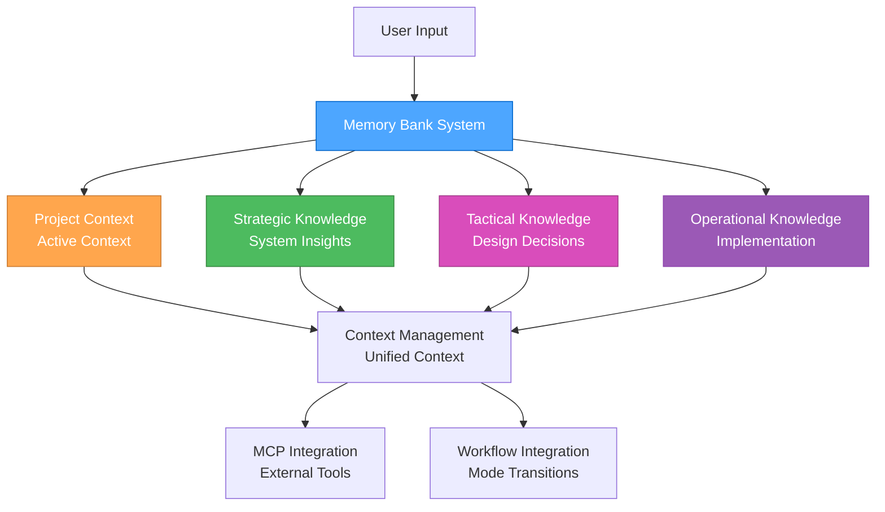

#### **File Structure**

```md
memory-bank/
├── project/                      # Main project context
│   ├── activeContext.md         # Current active context
│   ├── todo-handoff.md          # Todo and handoff status
│   ├── progress.md              # Progress tracking
│   ├── tasks.md                 # Task management
│   └── strategic-insights.md    # Strategic insights
├── strategic/                   # Strategic knowledge base
│   ├── README.md               # Strategic knowledge overview
│   ├── system-architecture/    # System-level insights
│   ├── tool-configurations/    # Tool setup knowledge
│   ├── meta-patterns/          # Cross-project patterns
│   └── strategic-decisions/    # Planning decisions
├── tactical/                    # Tactical knowledge base
│   ├── README.md               # Tactical knowledge overview
│   ├── design-decisions/       # Design decision rationales
│   ├── requirements-patterns/  # Requirement structures
│   ├── architecture-templates/ # Architectural patterns
│   └── planning-templates/     # Planning approaches
└── operational/                 # Operational knowledge base
    ├── README.md               # Operational knowledge overview
    ├── implementation-patterns/ # Implementation approaches
    ├── debug-solutions/        # Problem resolution
    ├── performance-optimizations/ # Performance techniques
    └── deployment-configs/     # Deployment setups
```

### 🔄 **KNOWLEDGE MANAGEMENT**

#### **Strategic Knowledge**

**Purpose**: System-level insights and meta-patterns

**Content Categories**:

- **System Architecture**: Workflow optimization insights
- **Tool Configurations**: Successful tool setups and configurations
- **Meta-Patterns**: Patterns across multiple projects
- **Strategic Decisions**: Planning decisions and rationales

**Storage Structure**:

```md
strategic/
├── system-architecture/
│   ├── workflow-optimizations.md
│   ├── tool-integrations.md
│   └── performance-patterns.md
├── tool-configurations/
│   ├── mcp-setups.md
│   ├── development-environments.md
│   └── deployment-configs.md
├── meta-patterns/
│   ├── project-patterns.md
│   ├── decision-patterns.md
│   └── optimization-patterns.md
└── strategic-decisions/
    ├── architecture-decisions.md
    ├── tool-selections.md
    └── workflow-decisions.md
```

#### **Tactical Knowledge**

**Purpose**: Design decisions and planning templates

**Content Categories**:

- **Design Decisions**: UI/UX design decisions and rationales
- **Requirements Patterns**: Common requirement structures
- **Architecture Templates**: Reusable architectural patterns
- **Planning Templates**: Planning approaches and methodologies

**Storage Structure**:

```md
tactical/
├── design-decisions/
│   ├── ui-patterns.md
│   ├── ux-decisions.md
│   └── design-rationales.md
├── requirements-patterns/
│   ├── feature-requirements.md
│   ├── user-stories.md
│   └── acceptance-criteria.md
├── architecture-templates/
│   ├── component-patterns.md
│   ├── data-flow-patterns.md
│   └── integration-patterns.md
└── planning-templates/
    ├── project-planning.md
    ├── sprint-planning.md
    └── milestone-planning.md
```

#### **Operational Knowledge**

**Purpose**: Implementation patterns and solutions

**Content Categories**:

- **Implementation Patterns**: Code patterns and solutions
- **Debug Solutions**: Problem resolution approaches
- **Performance Optimizations**: Performance improvement techniques
- **Deployment Configs**: Deployment and configuration setups

**Storage Structure**:

```md
operational/
├── implementation-patterns/
│   ├── code-patterns.md
│   ├── best-practices.md
│   └── solution-templates.md
├── debug-solutions/
│   ├── common-issues.md
│   ├── troubleshooting.md
│   └── resolution-patterns.md
├── performance-optimizations/
│   ├── optimization-techniques.md
│   ├── performance-patterns.md
│   └── monitoring-strategies.md
└── deployment-configs/
    ├── deployment-setups.md
    ├── configuration-templates.md
    └── environment-configs.md
```

### 🔧 **MCP INTEGRATION**

#### **Basic Memory Integration**

**Knowledge Server**: Basic Memory MCP Server

**Features**:

- Semantic knowledge management
- Automatic graph building
- Obsidian integration
- Multi-project support
- Real-time synchronization
- Markdown storage

**Integration**: Basic Memory MCP Guide

#### **Context7 Integration**

**Documentation Server**: Context7 MCP Server

**Features**:

- Real-time documentation access
- Library resolution
- Code examples
- Trust scoring

**Integration**: Context7 MCP Guide

#### **Time MCP Integration**

**Date Standardization**: Time MCP Server

**Features**:

- Consistent date formatting
- Timezone handling
- Integration with all components

**Integration**: Time MCP Guide

### 📋 **WORKFLOW INTEGRATION**

#### **Mode Transitions**

**Context Preservation**:

- Maintain active context during mode transitions
- Update context files appropriately
- Preserve important decisions and insights
- Track progress across modes

**Handoff Process**:

- Document current state in todo-handoff.md
- Update active context for next mode
- Preserve relevant knowledge
- Clear handoff status

#### **Knowledge Management**

**Storage Strategy**:

- Store knowledge in appropriate mode-specific directories
- Use consistent naming conventions
- Implement proper categorization
- Maintain knowledge relationships

**Retrieval Strategy**:

- Semantic search for relevant knowledge
- Context-aware recommendations
- Pattern-based suggestions
- Historical context integration

### 🎯 **BENEFITS**

#### **Persistent Context**

- Maintain context across sessions
- Resume work seamlessly
- Build knowledge over time
- Learn from past interactions

#### **Enhanced Decision Making**

- Access historical decisions
- Learn from past outcomes
- Identify successful patterns
- Optimize based on experience

#### **Improved Efficiency**

- Reduce repetitive work
- Leverage past solutions
- Optimize workflows
- Better resource utilization

#### **Knowledge Accumulation**

- Build comprehensive knowledge base
- Share knowledge across projects
- Maintain institutional memory
- Continuous learning and improvement

### 📚 **REFERENCES**

- Memory Bank Workflow - Detailed workflow integration
- Memory Bank Optimization - Performance optimization
- Basic Memory MCP Guide - MCP server integration
- System Documentation - Unified system integration
- MCP Ecosystem Overview - MCP server overview

### 🎯 **NEXT STEPS**

1. **Set up memory bank structure** using the provided file structure
2. **Configure MCP servers** for enhanced capabilities
3. **Implement workflow integration** for seamless mode transitions
4. **Start using memory bank** for persistent context and knowledge
5. **Optimize performance** using the provided strategies

---

**Last Updated**: 2025-07-23  
**Version**: 1.0  
**Status**: Complete memory bank system overview

---

<a id="amazonqrulesmemory-bank-workflowmd"></a>
## .amazonq\rules\memory-bank-workflow.md

## Memory Bank Workflow Integration

### Overview

This guide describes how the Memory Bank system integrates with the 3-mode development workflow, providing persistent context, knowledge management, and seamless transitions between Strategic, Tactical, and Operational modes.

### 🔄 **WORKFLOW INTEGRATION PATTERNS**

#### **Mode Transition Workflow**

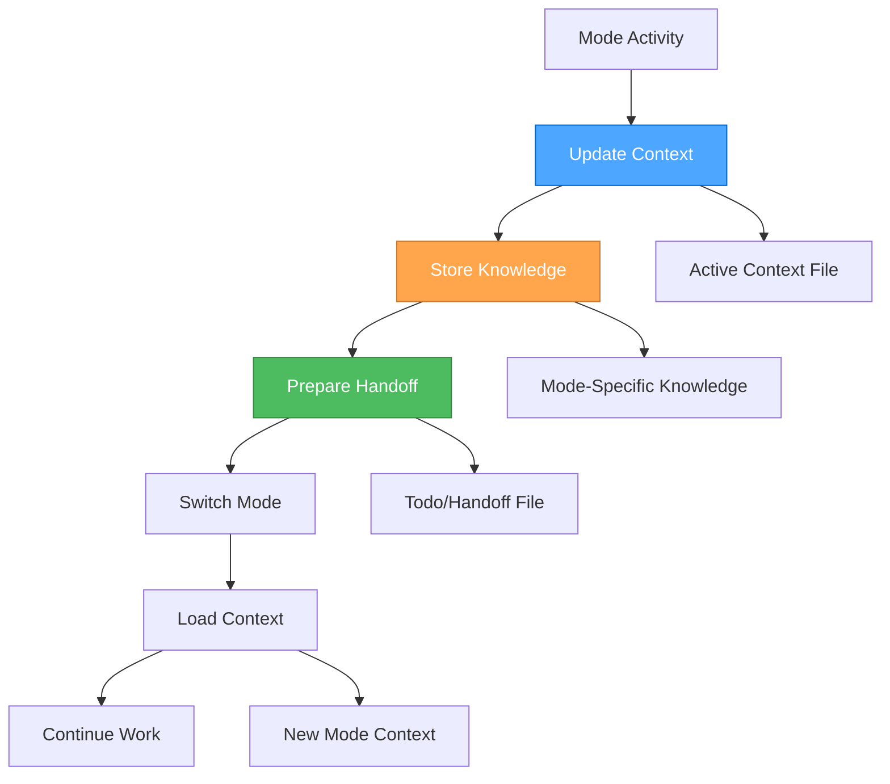

#### **Context Preservation Strategy**

**During Mode Transitions**:

1. **Update Active Context**: Document current state and decisions
2. **Store Mode Knowledge**: Archive mode-specific insights
3. **Prepare Handoff**: Create clear handoff documentation
4. **Load New Context**: Initialize next mode with relevant context

### 🎭 **STRATEGIC MODE INTEGRATION**

#### **Strategic Mode Workflow**

**Purpose**: System-level thinking, workflow optimization, tool management

**Memory Bank Activities**:

##### **Context Management**

```bash
## Update active context with strategic decisions
memory-bank-write strategic/active-context.md --content "
### Strategic Context Update
**Date**: [Time MCP current date]
**Current Focus**: [Strategic focus area]
**Key Decisions**: [Strategic decisions made]
**System Optimizations**: [Workflow improvements identified]
"

## Store strategic insights
memory-bank-write strategic/insights/workflow-optimization.md --content "
### Workflow Optimization Insight
**Date**: [Time MCP current date]
**Insight**: [Specific insight about workflow]
**Impact**: [Expected impact on system performance]
**Implementation**: [How to implement this insight]
"
```

##### **Knowledge Storage**

```bash
## Store system architecture decisions
memory-bank-write strategic/architecture/system-architecture.md --content "
### System Architecture Decision
**Date**: [Time MCP current date]
**Decision**: [Architecture decision made]
**Rationale**: [Why this decision was made]
**Alternatives**: [Alternatives considered]
**Expected Outcome**: [Expected results]
"

## Store tool configuration knowledge
memory-bank-write strategic/tools/tool-configuration.md --content "
### Tool Configuration Knowledge
**Date**: [Time MCP current date]
**Tool**: [Tool name and version]
**Configuration**: [Specific configuration details]
**Performance**: [Performance characteristics]
**Best Practices**: [Identified best practices]
"
```

##### **Strategic Handoff Preparation**

```bash
## Prepare handoff to tactical mode
memory-bank-write project/todo-handoff.md --content "
### 🎭 → 🎨 Strategic to Tactical Handoff

#### Strategic Context
**Overall Approach**: [Strategic approach determined]
**System Setup**: [Tools and workflows configured]
**Optimizations**: [Process improvements identified]

#### Ready for Tactical Planning
**Project Focus**: [Specific project to plan]
**Strategic Constraints**: [High-level constraints]
**Success Criteria**: [How success will be measured]

#### Handoff Status
**Date**: [Time MCP current date]
**Strategic Work Complete**: [Yes/No]
**Ready for Tactical Mode**: [Yes/No]
"
```

#### **Strategic Mode Commands**

```bash
## Store strategic insights
🎭 "store-insight [topic] [content]" → Store strategic insight
🎭 "search-patterns [domain]" → Search for strategic patterns
🎭 "archive-decision [decision] [rationale]" → Archive strategic decision

## Context management
🎭 "update-context [focus] [decisions]" → Update strategic context
🎭 "prepare-handoff [project] [constraints]" → Prepare tactical handoff
🎭 "load-context [project]" → Load project context
```

### 🎨 **TACTICAL MODE INTEGRATION**

#### **Tactical Mode Workflow**

**Purpose**: App-specific planning, design decisions, implementation planning

**Memory Bank Activities**:

##### **Context Loading**

```bash
## Load strategic context for tactical planning
memory-bank-read project/todo-handoff.md

## Load project-specific context
memory-bank-read project/activeContext.md

## Load relevant strategic insights
memory-bank-search strategic/insights/ --query "[project-specific insights]"
```

##### **Design Decision Storage**

```bash
## Store design decisions
memory-bank-write tactical/design-decisions/component-design.md --content "
### Component Design Decision
**Date**: [Time MCP current date]
**Component**: [Component name and purpose]
**Design Decision**: [Specific design decision]
**Rationale**: [Why this design was chosen]
**Trade-offs**: [Trade-offs considered]
**Implementation Plan**: [How to implement]
"

## Store requirements patterns
memory-bank-write tactical/requirements/requirements-pattern.md --content "
### Requirements Pattern
**Date**: [Time MCP current date]
**Pattern**: [Requirements pattern identified]
**Context**: [When this pattern applies]
**Implementation**: [How to implement this pattern]
**Examples**: [Examples of this pattern]
"
```

##### **Planning Template Storage**

```bash
## Store planning templates
memory-bank-write tactical/planning/planning-template.md --content "
### Planning Template
**Date**: [Time MCP current date]
**Template Type**: [Type of planning template]
**Structure**: [Template structure and sections]
**Usage**: [When and how to use this template]
**Examples**: [Example usage of this template]
"
```

##### **Tactical Handoff Preparation**

```bash
## Prepare handoff to operational mode
memory-bank-update project/todo-handoff.md --content "
### 🎨 → ⚒️ Tactical to Operational Handoff

#### Tactical Context
**App-Specific Strategy**: [How to execute the strategy]
**Design Decisions**: [Key design decisions made]
**Implementation Approach**: [Detailed implementation plan]

#### Ready for Operational Execution
**Implementation Tasks**: [Specific tasks to implement]
**Technical Constraints**: [Technical constraints identified]
**Success Criteria**: [How success will be measured]

#### Handoff Status
**Date**: [Time MCP current date]
**Tactical Work Complete**: [Yes/No]
**Ready for Operational Mode**: [Yes/No]
"
```

#### **Tactical Mode Commands**

```bash
## Store design decisions
🎨 "store-design [component] [decision]" → Store design decision
🎨 "search-requirements [feature]" → Search for similar requirements
🎨 "archive-plan [plan] [approach]" → Archive planning approach

## Context management
🎨 "load-strategic-context [project]" → Load strategic context
🎨 "update-tactical-context [focus] [decisions]" → Update tactical context
🎨 "prepare-operational-handoff [tasks] [constraints]" → Prepare operational handoff
```

### ⚒️ **OPERATIONAL MODE INTEGRATION**

#### **Operational Mode Workflow**

**Purpose**: Implementation, testing, and execution

**Memory Bank Activities**:

##### **Operational Context Loading**

```bash
## Load tactical context for implementation
memory-bank-read project/todo-handoff.md

## Load implementation plan
memory-bank-read tactical/planning/implementation-plan.md

## Load relevant design decisions
memory-bank-search tactical/design-decisions/ --query "[component-specific decisions]"
```

##### **Implementation Pattern Storage**

```bash
## Store implementation patterns
memory-bank-write operational/implementation-patterns/coding-pattern.md --content "
### Coding Pattern
**Date**: [Time MCP current date]
**Pattern**: [Coding pattern identified]
**Context**: [When to use this pattern]
**Implementation**: [How to implement this pattern]
**Examples**: [Code examples of this pattern]
"

## Store debug solutions
memory-bank-write operational/debug-solutions/issue-resolution.md --content "
### Issue Resolution
**Date**: [Time MCP current date]
**Issue**: [Issue description and symptoms]
**Root Cause**: [Root cause analysis]
**Solution**: [Solution implemented]
**Prevention**: [How to prevent this issue]
"
```

##### **Progress Tracking**

```bash
## Update progress
memory-bank-update project/progress.md --content "
### Progress Update
**Date**: [Time MCP current date]
**Completed**: [Tasks completed]
**In Progress**: [Current tasks]
**Next Up**: [Next tasks in queue]
**Blockers**: [Any issues preventing progress]
"

## Store performance optimizations
memory-bank-write operational/performance/optimization-technique.md --content "
### Performance Optimization
**Date**: [Time MCP current date]
**Technique**: [Optimization technique used]
**Before**: [Performance before optimization]
**After**: [Performance after optimization]
**Implementation**: [How to implement this optimization]
"
```

##### **Operational Handoff Preparation**

```bash
## Prepare handoff back to strategic mode
memory-bank-update project/todo-handoff.md --content "
### ⚒️ → 🎭 Operational to Strategic Handoff

#### Operational Context
**Implementation Complete**: [What was implemented]
**Performance Results**: [Performance outcomes]
**Issues Resolved**: [Issues encountered and resolved]

#### Ready for Strategic Reflection
**Success Metrics**: [How success was measured]
**Lessons Learned**: [Key learnings from implementation]
**Optimization Opportunities**: [Areas for future optimization]

#### Handoff Status
**Date**: [Time MCP current date]
**Operational Work Complete**: [Yes/No]
**Ready for Strategic Mode**: [Yes/No]
"
```

#### **Operational Mode Commands**

```bash
## Store implementation patterns
⚒️ "store-implementation [feature] [approach]" → Store implementation pattern
⚒️ "search-solutions [problem]" → Search for similar solutions
⚒️ "archive-config [system] [config]" → Archive configuration

## Progress tracking
⚒️ "update-progress [completed] [in-progress] [next]" → Update progress
⚒️ "store-optimization [technique] [results]" → Store performance optimization
⚒️ "prepare-strategic-handoff [results] [learnings]" → Prepare strategic handoff
```

### 🔄 **CROSS-MODE KNOWLEDGE SHARING**

#### **Knowledge Transfer Patterns**

##### **Strategic → Tactical**

- **System Architecture**: Strategic decisions inform tactical planning
- **Tool Configurations**: Strategic tool choices guide tactical implementation
- **Meta-Patterns**: Strategic patterns inform tactical approaches

##### **Tactical → Operational**

- **Design Decisions**: Tactical design decisions guide operational implementation
- **Requirements Patterns**: Tactical requirements inform operational tasks
- **Planning Templates**: Tactical planning guides operational execution

##### **Operational → Strategic**

- **Implementation Results**: Operational results inform strategic decisions
- **Performance Data**: Operational performance guides strategic optimization
- **Lessons Learned**: Operational learnings inform strategic planning

#### **Knowledge Search Patterns**

```bash
## Search across all modes for related knowledge
memory-bank-search all/ --query "[search term]" --mode all

## Search specific mode knowledge
memory-bank-search strategic/ --query "[strategic insights]"
memory-bank-search tactical/ --query "[design decisions]"
memory-bank-search operational/ --query "[implementation patterns]"

## Search for patterns across modes
memory-bank-search all/ --query "[pattern name]" --cross-mode true
```

### 📊 **WORKFLOW OPTIMIZATION**

#### **Context Preservation Optimization**

**Strategy**:

- Update context files at key decision points
- Preserve critical information during transitions
- Load relevant context for each mode
- Maintain context continuity across sessions

**Benefits**:

- Seamless mode transitions
- Reduced context loss
- Better decision continuity
- Improved workflow efficiency

#### **Knowledge Management Optimization**

**Strategy**:

- Store knowledge in appropriate mode-specific locations
- Use consistent naming conventions
- Implement proper categorization
- Maintain knowledge relationships

**Benefits**:

- Easy knowledge retrieval
- Better knowledge organization
- Improved knowledge reuse
- Enhanced learning accumulation

#### **Performance Optimization**

**Strategy**:

- Optimize file operations for speed
- Implement efficient search patterns
- Use appropriate storage formats
- Monitor and optimize performance

**Benefits**:

- Faster workflow execution
- Better resource utilization
- Improved user experience
- Enhanced system responsiveness

### 🎯 **BENEFITS**

#### **Seamless Workflow Integration**

- Smooth transitions between modes
- Context preservation across transitions
- Knowledge continuity throughout workflow
- Improved workflow efficiency

#### **Enhanced Decision Making**

- Access to relevant historical context
- Informed decisions based on past learnings
- Pattern recognition across modes
- Better decision outcomes

#### **Improved Knowledge Management**

- Organized knowledge storage
- Easy knowledge retrieval
- Knowledge accumulation over time
- Enhanced learning and improvement

#### **Better Performance**

- Optimized workflow execution
- Efficient resource utilization
- Improved user experience
- Enhanced system responsiveness

### 📚 **REFERENCES**

- Memory Bank Overview - System overview and architecture
- Memory Bank Optimization - Performance optimization
- Basic Memory MCP Guide - MCP server integration
- System Documentation - Unified system integration

### 🎯 **NEXT STEPS**

1. **Implement workflow integration** using the provided patterns
2. **Set up mode-specific knowledge storage** in your memory bank
3. **Configure cross-mode knowledge sharing** for enhanced capabilities
4. **Optimize workflow performance** using the provided strategies
5. **Start using memory bank workflow** for seamless mode transitions

---

**Last Updated**: 2025-07-23  
**Version**: 1.0  
**Status**: Complete workflow integration guide

---

<a id="amazonqrulesscss-advanced-patternsmd"></a>
## .amazonq\rules\scss-advanced-patterns.md

## SCSS Advanced Patterns and Modern Features

### Modern Color Spaces and Functions

#### New Color Spaces (CSS Color Level 4)

```scss
// Modern color spaces with better perceptual uniformity
$pink: oklch(64% 0.196 353deg); // Perceptually uniform
$blue: oklch(64% 0.196 253deg); // Consistent lightness/chroma

// Lab and LCH color spaces
$lab-color: lab(50% 20 30);
$lch-color: lch(50% 30 45deg);

// HWB color space
$hwb-color: hwb(120deg 20% 10%);
```

#### Modern Color Functions

```scss
@use "sass:color";

// Channel access (replaces deprecated red(), green(), blue())
$red-channel: color.channel($color, "red", rgb);
$green-channel: color.channel($color, "green", rgb);
$blue-channel: color.channel($color, "blue", rgb);

// Color adjustments with explicit color spaces
$brand: hsl(0 100% 25.1%);
$hsl-lightness: color.scale($brand, $lightness: 25%);
$oklch-lightness: color.scale($brand, $lightness: 25%, $space: oklch);

// Color transformations
$inverted: color.invert($color);
$grayscale: color.grayscale($color);
$complement: color.complement($color);

// Gamut mapping
$mapped: color.to-gamut($color, hsl, $method: local-minde);
```

#### Deprecated Functions to Avoid

```scss
// ❌ DEPRECATED - Use color.adjust() instead
lighten($color, 10%);
darken($color, 10%);
saturate($color, 10%);
desaturate($color, 10%);
opacify($color, 0.1);
transparentize($color, 0.1);
fade-in($color, 0.1);
fade-out($color, 0.1);

// ✅ MODERN APPROACH
color.adjust($color, $lightness: 10%);
color.adjust($color, $lightness: -10%);
color.adjust($color, $saturation: 10%);
color.adjust($color, $saturation: -10%);
color.adjust($color, $alpha: 0.1);
color.adjust($color, $alpha: -0.1);
```

### Module System Best Practices

#### Modern Module Usage

```scss
// ✅ Use @use instead of @import
@use "sass:color";
@use "sass:math";
@use "sass:map";
@use "sass:list";
@use "sass:string";
@use "sass:meta";
@use "sass:selector";

// Namespace usage
$adjusted: color.adjust($primary, $lightness: 10%);
$rounded: math.round($value);
$keys: map.keys($data);
```

#### Library Configuration Pattern

```scss
// _variables.scss
$paragraph-margin-bottom: 1rem !default;
$primary-color: #007bff !default;

// _reboot.scss
@use "variables" as *;

p {
  margin-bottom: $paragraph-margin-bottom;
  color: $primary-color;
}

// bootstrap.scss (entry point)
@forward "variables";
@use "reboot";

// User's stylesheet
@use "bootstrap" with (
  $paragraph-margin-bottom: 1.2rem,
  $primary-color: #0056b3
);
```

### Advanced Selector Patterns

#### Modern Selector Functions

```scss
@use "sass:selector";

// Nesting selectors
$nested: selector.nest(".parent", ".child");
// Result: .parent .child

// Appending selectors
$appended: selector.append(".btn", ":hover");
// Result: .btn:hover

// Replacing selectors
$replaced: selector.replace(".old", ".new");
// Result: .new

// Unifying selectors
$unified: selector.unify(".a", ".b");
// Result: .a.b

// Extending selectors
$extended: selector.extend(".base", ".extendee", ".extender");
```

#### Complex Selector Manipulation

```scss
// Modern selector parsing and manipulation
$parsed: selector.parse(".btn.btn-primary:hover");
$simple: selector.simple-selectors(".btn.btn-primary");
$is-superselector: selector.is-superselector(".btn", ".btn.btn-primary");
```

### Advanced Math and Calculations

#### Modern Math Functions

```scss
@use "sass:math";

// Mathematical operations
$percentage: math.percentage(0.5); // 50%
$rounded: math.round(3.7); // 4
$ceiled: math.ceil(3.2); // 4
$floored: math.floor(3.8); // 3
$absolute: math.abs(-5); // 5
$minimum: math.min(1, 2, 3); // 1
$maximum: math.max(1, 2, 3); // 3
$random: math.random(); // Random number 0-1

// Unit operations
$unit: math.unit(10px); // "px"
$is-unitless: math.is-unitless(10); // true
$compatible: math.compatible(10px, 20px); // true
```

#### CSS calc() Integration

```scss
// Modern calc() support
$width: 100px;
$calc-result: calc($width / 2);

// Slash separator for CSS Grid
.grid-item {
  grid-row: 1 / 3;
  grid-column: 1 / 4;
}
```

### Advanced List and Map Operations

#### Modern List Functions

```scss
@use "sass:list";

// List operations
$length: list.length($items);
$nth: list.nth($items, 2);
$set-nth: list.set-nth($items, 2, "new-value");
$join: list.join($list1, $list2);
$append: list.append($list, "new-item");
$zip: list.zip($list1, $list2);
$index: list.index($list, "item");
$separator: list.separator($list);
```

#### Advanced Map Operations

```scss
@use "sass:map";

// Map operations
$get: map.get($data, "key");
$merge: map.merge($map1, $map2);
$remove: map.remove($map, "key");
$keys: map.keys($map);
$values: map.values($map);
$has-key: map.has-key($map, "key");

// Nested map operations
$nested-get: map.get($map, "level1", "level2");
$nested-set: map.set($map, "level1", "level2", "value");
```

### Meta-Programming and Reflection

#### Feature Detection

```scss
@use "sass:meta";

// Check feature availability
$feature-exists: meta.feature-exists("global-variable-shadowing");

// Variable and function existence
$var-exists: meta.variable-exists("my-variable");
$global-var-exists: meta.global-variable-exists("global-var");
$function-exists: meta.function-exists("my-function");
$mixin-exists: meta.mixin-exists("my-mixin");

// Type checking
$type: meta.type-of($value);

// Function reflection
$function: meta.get-function("my-function");
$result: meta.call($function, $arg1, $arg2);

// Content detection
$has-content: meta.content-exists();
```

#### Advanced Inspection

```scss
// Debug and inspection
$inspected: meta.inspect($value);

// Keywords handling
@mixin my-mixin($positional, $keyword: default) {
  $keywords: meta.keywords($args);
  // Process keyword arguments
}
```

### Modern String Operations

#### String Functions

```scss
@use "sass:string";

// String manipulation
$length: string.length("hello"); // 5
$slice: string.slice("hello world", 0, 5); // "hello"
$index: string.index("hello world", "world"); // 7
$insert: string.insert("hello", " world", 5); // "hello world"

// Case conversion
$upper: string.to-upper-case("hello"); // "HELLO"
$lower: string.to-lower-case("HELLO"); // "hello"

// Unique ID generation
$unique: string.unique-id(); // "u123456"
```

### Performance and Best Practices

> **Note**: For comprehensive debugging and troubleshooting, see [SCSS Debugging](../.cursor/rules/scss-debugging.mdc).

#### Compilation Optimization

```scss
// Use @use for better performance
// @use loads modules once and caches them
@use "variables" as vars;

// Avoid @import in modern Sass
// @import loads files multiple times if used elsewhere
```

#### Memory Management

```scss
// Use maps for large datasets
$theme: (
  "primary": #007bff,
  "secondary": #6c757d,
  "success": #28a745,
  "danger": #dc3545
);

// Use lists for ordered data
$breakpoints: (xs, sm, md, lg, xl);
```

#### Advanced Debugging Techniques

```scss
// Advanced debugging with meta functions
@debug "Variable value: #{$variable}";
@warn "This is a warning message";
@error "This is an error message";

// Feature detection for progressive enhancement
@if meta.feature-exists("modern-color-spaces") {
  $color: oklch(50% 0.2 45deg);
} @else {
  $color: hsl(45deg 50% 50%);
}

// Advanced inspection
$inspected: meta.inspect($value);
```

### Modern CSS Integration

> **Note**: For comprehensive modern CSS principles, layout systems, and framework integration, see [SCSS Modern CSS & Frameworks](../.cursor/rules/scss-modern-css-frameworks.mdc).

#### CSS Custom Properties Integration

```scss
// Dynamic CSS custom properties with SCSS
:root {
  --primary-color: #{$primary-color};
  --spacing-unit: #{$spacing-unit};
}

.component {
  color: var(--primary-color);
  margin: calc(var(--spacing-unit) * 2);
}
```

#### SCSS-Specific Modern Features

```scss
// SCSS-specific grid generation
@mixin responsive-grid($columns: 3, $min-width: 200px) {
  display: grid;
  grid-template-columns: repeat(auto-fit, minmax($min-width, 1fr));
  gap: 1rem;
}

.grid {
  @include responsive-grid(3, 200px);
}

// SCSS-specific flexbox utilities
@mixin flex-center {
  display: flex;
  align-items: center;
  justify-content: center;
  gap: 1rem;
}
```

### Migration Guide

#### From Legacy to Modern

```scss
// ❌ Legacy approach
@import "variables";
$color: lighten($primary, 10%);
$list: join($list1, $list2);

// ✅ Modern approach
@use "variables" as vars;
$color: color.adjust(vars.$primary, $lightness: 10%);
$list: list.join($list1, $list2);
```

#### Backward Compatibility

```scss
// Check for feature support
@if meta.feature-exists("modern-color-spaces") {
  // Use modern color spaces
  $color: oklch(50% 0.2 45deg);
} @else {
  // Fallback to legacy colors
  $color: hsl(45deg 50% 50%);
}
```

### Related Rules

- [SCSS Modern CSS & Frameworks](../.cursor/rules/scss-modern-css-frameworks.mdc) - Modern CSS principles and framework integration
- [SCSS Debugging](../.cursor/rules/scss-debugging.mdc) - Troubleshooting and debugging SCSS issues
- [Perchance Build & Deployment](../.cursor/rules/perchance-build-deployment.mdc) - Build and deployment for Perchance projects
- [Perchance Development Lifecycle](../.cursor/rules/perchance-development-lifecycle.mdc) - Planning and iteration steps

---

This documentation reflects the latest Sass features and best practices, ensuring your SCSS code is modern, maintainable, and performant.

---

<a id="amazonqrulesscss-debuggingmd"></a>
## .amazonq\rules\scss-debugging.md

## SCSS Debugging & Troubleshooting

### Scope

- Common SCSS compilation errors and solutions
- Debugging techniques for SCSS issues
- Performance optimization and troubleshooting
- Best practices for avoiding SCSS problems

---

### Common SCSS Errors

#### **Compilation Errors**

##### **Variable Not Found**

```scss
// ❌ Error: Undefined variable $primary-color
.button {
  background-color: $primary-color;
}

// ✅ Solution: Define variable first
$primary-color: #007bff;
.button {
  background-color: $primary-color;
}
```

##### **Mixin Not Found**

```scss
// ❌ Error: Undefined mixin card-style
.card {
  @include card-style;
}

// ✅ Solution: Define mixin first
@mixin card-style {
  padding: 1rem;
  border-radius: 0.5rem;
  box-shadow: 0 2px 4px rgba(0, 0, 0, 0.1);
}

.card {
  @include card-style;
}
```

##### **Import Path Issues**

```scss
// ❌ Error: File to import not found
@import "variables";

// ✅ Solution: Use correct path
@import "./variables";
// or
@import "abstracts/variables";
```

#### **Syntax Errors**

##### **Missing Semicolons**

```scss
// ❌ Error: Missing semicolon
.button {
  background-color: #007bff
  color: white
}

// ✅ Solution: Add semicolons
.button {
  background-color: #007bff;
  color: white;
}
```

##### **Incorrect Nesting**

```scss
// ❌ Error: Invalid nesting
.card {
  .title {
    color: blue;
  }
  color: red; // This should be outside the nested selector
}

// ✅ Solution: Proper nesting
.card {
  color: red;
  
  .title {
    color: blue;
  }
}
```

##### **Invalid Selector Interpolation**

```scss
// ❌ Error: Invalid selector
$class-name: "button";
##{$class-name} {
  color: blue;
}

// ✅ Solution: Use proper interpolation
$class-name: "button";
.#{$class-name} {
  color: blue;
}
```

---

### Debugging Techniques

#### **Source Maps**

Enable source maps for better debugging:

```scss
// In your build configuration
sass --source-map --style=expanded input.scss output.css
```

#### **Debug Output**

Use `@debug` for debugging variables and values:

```scss
$primary-color: #007bff;
@debug "Primary color is: #{$primary-color}";

@mixin responsive($breakpoint) {
  @debug "Applying breakpoint: #{$breakpoint}";
  @media (min-width: $breakpoint) {
    @content;
  }
}
```

#### **Warnings**

Use `@warn` for non-critical issues:

```scss
@mixin theme($theme-name) {
  $theme: map-get($themes, $theme-name);
  
  @if $theme {
    @each $key, $value in $theme {
      --#{$key}: #{$value};
    }
  } @else {
    @warn "Theme '#{$theme-name}' not found. Available themes: #{map-keys($themes)}";
  }
}
```

#### **Error Handling**

Use `@error` for critical issues:

```scss
@function token($category, $key) {
  $value: map-get($design-tokens, $category);
  
  @if not $value {
    @error "Category '#{$category}' not found in design tokens";
  }
  
  $value: map-get($value, $key);
  
  @if not $value {
    @error "Key '#{$key}' not found in category '#{$category}'";
  }
  
  @return $value;
}
```

---

### Performance Issues

#### **Deep Nesting**

```scss
// ❌ Problem: Deep nesting creates overly specific selectors
.card {
  .header {
    .title {
      .text {
        .link {
          color: blue;
        }
      }
    }
  }
}

// ✅ Solution: Flatten nesting
.card {
  .header-title-link {
    color: blue;
  }
}

// Or use BEM methodology
.card__header-title-link {
  color: blue;
}
```

> **Note**: For modern CSS architecture patterns and BEM methodology, see [SCSS Modern CSS & Frameworks](../.cursor/rules/scss-modern-css-frameworks.mdc).

#### **Large Output Files**

```scss
// ❌ Problem: Unused styles in output
.unused-class {
  color: red;
}

// ✅ Solution: Remove unused styles
// Use tools like PurgeCSS to automatically remove unused styles
```

#### **Inefficient Selectors**

```scss
// ❌ Problem: Inefficient selector generation
@each $color in (red, blue, green) {
  .button-#{$color} {
    background-color: $color;
  }
}

// ✅ Solution: Use more efficient approach
.button {
  &--red { background-color: red; }
  &--blue { background-color: blue; }
  &--green { background-color: green; }
}
```

---

### Common Patterns & Solutions

#### **Circular Dependencies**

```scss
// ❌ Problem: Circular import
// _variables.scss
$primary-color: #007bff;
@import "mixins";

// _mixins.scss
@import "variables";
@mixin button-style {
  background-color: $primary-color;
}

// ✅ Solution: Separate concerns
// _variables.scss
$primary-color: #007bff;

// _mixins.scss
@import "variables";
@mixin button-style {
  background-color: $primary-color;
}

// main.scss
@import "variables";
@import "mixins";
```

#### **Variable Scope Issues**

```scss
// ❌ Problem: Variable scope confusion
$color: red;

.button {
  $color: blue; // This shadows the global variable
  background-color: $color;
}

.other-element {
  background-color: $color; // This uses the global red
}

// ✅ Solution: Use clear naming
$global-color: red;

.button {
  $button-color: blue;
  background-color: $button-color;
}

.other-element {
  background-color: $global-color;
}
```

#### **Map Access Issues**

```scss
// ❌ Problem: Incorrect map access
$colors: (
  primary: #007bff,
  secondary: #6c757d
);

.button {
  background-color: $colors[primary]; // Wrong syntax
}

// ✅ Solution: Use map-get function
$colors: (
  primary: #007bff,
  secondary: #6c757d
);

.button {
  background-color: map-get($colors, primary);
}
```

---

### Build Process Issues

#### **Compilation Failures**

Common build issues and solutions:

```bash
## ❌ Problem: Missing dependencies
sass input.scss output.css
## Error: File to import not found

## ✅ Solution: Check file paths and dependencies
sass --load-path=./node_modules input.scss output.css
```

#### **Output File Issues**

```bash
## ❌ Problem: Large output files
## Check for unused imports or styles

## ✅ Solution: Use optimization flags
sass --style=compressed input.scss output.css
```

#### **Source Map Issues**

```bash
## ❌ Problem: Source maps not working
## Check if source maps are enabled

## ✅ Solution: Enable source maps
sass --source-map --style=expanded input.scss output.css
```

---

### Testing & Validation

#### **SCSS Linting**

Use SCSS linting tools to catch issues early:

```bash
## Install sass-lint or stylelint
npm install -g sass-lint

## Run linting
sass-lint -v -q
```

#### **Compilation Testing**

Test compilation regularly:

```bash
## Test compilation without output
sass --check input.scss

## Test with specific output format
sass --style=compressed input.scss output.css
```

#### **Browser Testing**

Test compiled CSS in browsers:

- Check for CSS validation errors
- Test responsive breakpoints
- Verify cross-browser compatibility
- Check for performance issues

---

### Best Practices for Avoiding Issues

#### **File Organization**

```mermaid
scss/
├── abstracts/
│   ├── _variables.scss
│   ├── _functions.scss
│   └── _mixins.scss
├── base/
│   ├── _reset.scss
│   └── _typography.scss
├── components/
│   ├── _buttons.scss
│   └── _cards.scss
└── main.scss
```

#### **Naming Conventions**

- Use descriptive variable names: `$primary-color`, not `$pc`
- Use consistent naming: `$spacing-unit`, `$border-radius`
- Use BEM methodology for components: `.card__title--large`

#### **Import Order**

```scss
// 1. Variables and functions
@import "abstracts/variables";
@import "abstracts/functions";

// 2. Mixins
@import "abstracts/mixins";

// 3. Base styles
@import "base/reset";
@import "base/typography";

// 4. Components
@import "components/buttons";
@import "components/cards";

// 5. Layout
@import "layout/header";
@import "layout/footer";
```

#### **Documentation**

Document complex SCSS:

```scss
/**
 * Button component mixin
 * @param {string} $variant - Button variant (primary, secondary, danger)
 * @param {string} $size - Button size (sm, md, lg)
 */
@mixin button($variant: 'primary', $size: 'md') {
  // Implementation
}
```

---

### Related Rules

- [SCSS Modern CSS & Frameworks](../.cursor/rules/scss-modern-css-frameworks.mdc) - Modern CSS principles and framework integration
- [SCSS Advanced Patterns](../.cursor/rules/scss-advanced-patterns.mdc) - Advanced SCSS features and meta-programming
- [Perchance Build & Deployment](../.cursor/rules/perchance-build-deployment.mdc) - Build and deployment for Perchance projects
- [Perchance Development Lifecycle](../.cursor/rules/perchance-development-lifecycle.mdc) - Planning and iteration steps

---

### References

- [Sass Documentation](https://sass-lang.com/documentation)
- [Sass Guidelines](https://sass-guidelin.es/)
- [Sass Debugging](https://sass-lang.com/documentation/at-rules/debug/)
- [Stylelint](https://stylelint.io/)

---

<a id="amazonqrulesscss-modern-css-frameworksmd"></a>
## .amazonq\rules\scss-modern-css-frameworks.md

## Modern CSS Principles and Framework Integration

> **TL;DR:** Comprehensive guide covering modern CSS principles, layout systems, responsive design, and Pico.css framework integration for Perchance projects.

### 🎯 **OVERVIEW**

This guide combines modern CSS principles with practical framework integration, specifically focusing on Pico.css for Perchance projects. It covers foundational CSS concepts, modern layout systems, responsive design, and framework customization.

### 🏗️ **CORE CSS PRINCIPLES**

#### **Cascade and Specificity**

```css
/* Understanding CSS cascade and specificity */
/* 1. Inline styles (highest priority) */
/* 2. ID selectors */
/* 3. Class selectors, attributes, pseudo-classes */
/* 4. Element selectors, pseudo-elements */

/* Example: Specificity calculation */
##header .nav-item { } /* 1-1-0 = 110 */
.nav-item.active { }   /* 0-2-0 = 020 */
nav .item { }          /* 0-1-1 = 011 */

/* Use specificity wisely - avoid !important */
.button {
  background: blue; /* Good */
}

.button.primary {
  background: red; /* Higher specificity, no !important needed */
}
```

#### **Box Model**

```css
/* Modern box-sizing */
* {
  box-sizing: border-box; /* Include padding and border in element's total width/height */
}

/* Box model properties */
.element {
  width: 200px;
  height: 100px;
  padding: 20px;
  border: 2px solid black;
  margin: 10px;
  /* Total width: 200px (includes padding and border) */
}
```

### 🎨 **MODERN LAYOUT SYSTEMS**

#### **CSS Grid**

```css
/* Basic grid layout */
.grid-container {
  display: grid;
  grid-template-columns: repeat(3, 1fr);
  grid-template-rows: auto;
  gap: 1rem;
  padding: 1rem;
}

/* Responsive grid */
.responsive-grid {
  display: grid;
  grid-template-columns: repeat(auto-fit, minmax(250px, 1fr));
  gap: 1rem;
}

/* Named grid areas */
.layout {
  display: grid;
  grid-template-areas: 
    "header header header"
    "sidebar main aside"
    "footer footer footer";
  grid-template-columns: 200px 1fr 200px;
  grid-template-rows: auto 1fr auto;
  min-height: 100vh;
}

.header { grid-area: header; }
.sidebar { grid-area: sidebar; }
.main { grid-area: main; }
.aside { grid-area: aside; }
.footer { grid-area: footer; }

/* Grid line positioning */
.grid-item {
  grid-column: 1 / 3; /* Start at line 1, end at line 3 */
  grid-row: 2 / 4;    /* Start at line 2, end at line 4 */
}

/* Grid alignment */
.grid-container {
  justify-items: center;     /* Horizontal alignment */
  align-items: center;       /* Vertical alignment */
  justify-content: space-between; /* Container alignment */
  align-content: space-around;
}
```

#### **Flexbox**

```css
/* Basic flexbox */
.flex-container {
  display: flex;
  flex-direction: row; /* row | row-reverse | column | column-reverse */
  flex-wrap: wrap;     /* nowrap | wrap | wrap-reverse */
  justify-content: space-between; /* flex-start | flex-end | center | space-between | space-around | space-evenly */
  align-items: center; /* flex-start | flex-end | center | baseline | stretch */
  gap: 1rem;
}

/* Flex items */
.flex-item {
  flex: 1; /* flex-grow: 1, flex-shrink: 1, flex-basis: 0% */
  flex-grow: 0;    /* Don't grow */
  flex-shrink: 1;  /* Allow shrinking */
  flex-basis: auto; /* Auto size */
  
  /* Shorthand: flex: <grow> <shrink> <basis> */
  flex: 0 1 auto; /* Default value */
}

/* Responsive flexbox */
.responsive-flex {
  display: flex;
  flex-wrap: wrap;
  gap: 1rem;
}

.responsive-flex > * {
  flex: 1 1 300px; /* Grow, shrink, min-width */
}
```

### 🎨 **MODERN CSS FEATURES**

#### **CSS Custom Properties (Variables)**

```css
/* Define custom properties */
:root {
  --primary-color: #007bff;
  --secondary-color: #6c757d;
  --spacing-unit: 1rem;
  --border-radius: 0.25rem;
  --font-family: -apple-system, BlinkMacSystemFont, 'Segoe UI', Roboto, sans-serif;
  
  /* Color palette */
  --colors-primary-50: #eff6ff;
  --colors-primary-100: #dbeafe;
  --colors-primary-500: #3b82f6;
  --colors-primary-900: #1e3a8a;
  
  /* Spacing scale */
  --spacing-xs: 0.25rem;
  --spacing-sm: 0.5rem;
  --spacing-md: 1rem;
  --spacing-lg: 1.5rem;
  --spacing-xl: 2rem;
}

/* Use custom properties */
.button {
  background-color: var(--primary-color);
  padding: var(--spacing-sm) var(--spacing-md);
  border-radius: var(--border-radius);
  font-family: var(--font-family);
}

/* Dynamic custom properties */
.theme-dark {
  --primary-color: #0d6efd;
  --background-color: #212529;
  --text-color: #f8f9fa;
}

/* Fallback values */
.element {
  color: var(--custom-color, #333); /* Fallback to #333 if --custom-color not defined */
}
```

#### **Modern Color Functions**

```css
/* Modern color spaces */
.modern-colors {
  /* OKLCH - perceptually uniform */
  color: oklch(64% 0.196 353deg);
  background: oklch(64% 0.196 253deg);
  
  /* Lab color space */
  color: lab(50% 20 30);
  
  /* HWB color space */
  color: hwb(120deg 20% 10%);
  
  /* Alpha channel with slash */
  color: rgb(255 0 0 / 0.5);
  color: hsl(0 100% 50% / 0.5);
}

/* Color mixing and manipulation */
.color-utilities {
  /* Mix colors */
  background: color-mix(in srgb, #34c9eb 25%, white);
  
  /* Relative colors */
  color: hsl(from #ff0000 h s calc(l + 20%));
  
  /* Color contrast */
  color: color-contrast(wheat vs tan, sienna, #d2691e);
}
```

#### **Modern Selectors**

```css
/* Attribute selectors */
[data-state="active"] { }
[class*="btn"] { }        /* Contains */
[class^="btn"] { }        /* Starts with */
[class$="btn"] { }        /* Ends with */
[class~="btn"] { }        /* Contains word */

/* Pseudo-classes */
.button:hover { }
.button:focus { }
.button:active { }
.button:disabled { }

/* Structural pseudo-classes */
.item:first-child { }
.item:last-child { }
.item:nth-child(odd) { }
.item:nth-child(3n+1) { }
.item:only-child { }

/* Form pseudo-classes */
input:required { }
input:optional { }
input:valid { }
input:invalid { }
input:checked { }
input:indeterminate { }

/* Modern pseudo-classes */
.element:is(.class1, .class2) { }
.element:where(.class1, .class2) { }
.element:has(.child) { }
```

### 📱 **RESPONSIVE DESIGN**

#### **Media Queries**

```css
/* Mobile-first approach */
.container {
  width: 100%;
  padding: 1rem;
}

/* Tablet and up */
@media (min-width: 768px) {
  .container {
    max-width: 750px;
    margin: 0 auto;
  }
}

/* Desktop and up */
@media (min-width: 1024px) {
  .container {
    max-width: 970px;
  }
}

/* Large desktop */
@media (min-width: 1200px) {
  .container {
    max-width: 1170px;
  }
}

/* Modern container queries */
.card {
  container-type: inline-size;
}

@container (min-width: 400px) {
  .card-content {
    display: grid;
    grid-template-columns: 1fr 1fr;
  }
}
```

#### **Responsive Images**

```css
/* Responsive images */
.responsive-image {
  max-width: 100%;
  height: auto;
  display: block;
}

/* Picture element with art direction */
<picture>
  <source media="(min-width: 800px)" srcset="large.jpg">
  <source media="(min-width: 400px)" srcset="medium.jpg">
  
</picture>

/* CSS for responsive images */
.image-container {
  aspect-ratio: 16 / 9;
  overflow: hidden;
}

.image-container img {
  width: 100%;
  height: 100%;
  object-fit: cover;
}
```

### 🎨 **PICO.CSS FRAMEWORK INTEGRATION**

#### **Overview**

Pico.css provides minimal, modern CSS styling for native HTML elements. Use Pico.css for base styling in Perchance projects, with SCSS for customization and theming.

#### **Installation Methods**

##### **CDN Method (Recommended for Perchance):**

```html
<link rel="stylesheet" href="https://unpkg.com/@picocss/pico@1.5.10/css/pico.min.css">
```

##### **SCSS Method (For Custom Builds):**

```scss
// Import Pico with custom settings
@use "pico" with (
  $theme-color: "azure",
  $enable-classes: true,
  $enable-transitions: true
);

// Add your custom styles after Pico import
.your-custom-class {
  // Your styles here
}
```

#### **When to Use Pico.css**

- For consistent, modern styling of forms, buttons, tables, and all native HTML elements
- As a foundation for custom design systems
- When you need a lightweight, semantic CSS framework
- For Perchance projects requiring minimal setup

#### **SCSS Customization Examples**

##### **Theme Customization:**

```scss
@use "pico" with (
  $theme-color: "purple",
  $enable-semantic-container: true,
  $enable-responsive-spacings: true
);
```

##### **Lightweight Version:**

```scss
@use "pico" with (
  $enable-classes: false,
  $modules: (
    "components/card": false,
    "components/dropdown": false,
    "components/modal": false
  )
);
```

##### **Custom Theme:**

```scss
// Exclude default theme
@use "pico" with (
  $modules: (
    "themes/default": false
  )
);

// Import your custom theme
@use "path/custom-theme";
```

#### **Customizing with SCSS**

- Override Pico variables for theming
- Add custom components and utilities
- Use Pico's CSS custom properties for dynamic styling
- Compile to single CSS file for Perchance deployment

#### **Works well with:**

- Hyperscript and Cash DOM
- SCSS compilation tools
- Perchance build systems

### 🎯 **MODERN CSS TECHNIQUES**

#### **CSS Container Queries**

```css
/* Container queries for component-based design */
.card {
  container-type: inline-size;
  container-name: card;
}

@container card (min-width: 400px) {
  .card-content {
    display: grid;
    grid-template-columns: 1fr 1fr;
    gap: 1rem;
  }
}

@container card (min-width: 600px) {
  .card-content {
    grid-template-columns: 1fr 1fr 1fr;
  }
}
```

#### **CSS Logical Properties**

```css
/* Logical properties for internationalization */
.text {
  /* Instead of left/right, use start/end */
  margin-inline-start: 1rem;
  margin-inline-end: 1rem;
  padding-block-start: 1rem;
  padding-block-end: 1rem;
  
  /* Logical sizing */
  width: fit-content;
  height: fit-content;
  
  /* Logical borders */
  border-inline-start: 2px solid black;
  border-block-end: 1px solid gray;
}

/* Writing mode support */
.vertical-text {
  writing-mode: vertical-rl;
  text-orientation: mixed;
}
```

#### **Modern CSS Functions**

```css
/* Modern CSS functions */
.modern-functions {
  /* Clamp for responsive values */
  font-size: clamp(1rem, 2.5vw, 2rem);
  width: clamp(300px, 50vw, 800px);
  
  /* Min/Max for responsive design */
  width: min(100%, 800px);
  height: max(50vh, 400px);
  
  /* Calc with modern syntax */
  width: calc(100% - 2rem);
  height: calc(100vh - var(--header-height));
  
  /* CSS custom properties in functions */
  transform: translate(calc(var(--x) * 1px), calc(var(--y) * 1px));
}
```

### ⚡ **PERFORMANCE AND BEST PRACTICES**

#### **CSS Performance**

```css
/* Efficient selectors */
/* Good */
.button { }
.button.primary { }
.button:hover { }

/* Avoid */
div div div div { }
.container .wrapper .content .item { }

/* Use modern CSS instead of JavaScript */
/* Instead of JS for animations, use CSS */
.animate {
  transition: all 0.3s ease;
  transform: translateX(0);
}

.animate:hover {
  transform: translateX(10px);
}

/* Use will-change sparingly */
.optimized {
  will-change: transform; /* Only when needed */
}
```

#### **CSS Architecture**

```css
/* BEM methodology */
.block { }
.block__element { }
.block--modifier { }

/* Example */
.card { }
.card__title { }
.card__content { }
.card--featured { }
.card--featured .card__title { }

/* Utility-first approach */
.utility-classes {
  /* Spacing */
  .p-1 { padding: 0.25rem; }
  .p-2 { padding: 0.5rem; }
  .p-4 { padding: 1rem; }
  
  /* Typography */
  .text-sm { font-size: 0.875rem; }
  .text-lg { font-size: 1.125rem; }
  .font-bold { font-weight: 700; }
  
  /* Colors */
  .text-primary { color: var(--primary-color); }
  .bg-secondary { background-color: var(--secondary-color); }
}
```

#### **Accessibility**

```css
/* Focus management */
.focusable:focus {
  outline: 2px solid var(--primary-color);
  outline-offset: 2px;
}

/* Reduced motion */
@media (prefers-reduced-motion: reduce) {
  * {
    animation-duration: 0.01ms !important;
    animation-iteration-count: 1 !important;
    transition-duration: 0.01ms !important;
  }
}

/* High contrast mode */
@media (prefers-contrast: high) {
  .button {
    border: 2px solid currentColor;
  }
}

/* Dark mode support */
@media (prefers-color-scheme: dark) {
  :root {
    --background-color: #1a1a1a;
    --text-color: #ffffff;
  }
}
```

### 🛠️ **MODERN CSS TOOLS AND TECHNIQUES**

#### **CSS-in-JS Alternatives**

```css
/* CSS Modules approach */
/* styles.module.css */
.button {
  background: var(--primary-color);
  padding: 0.5rem 1rem;
  border-radius: 0.25rem;
}

.buttonPrimary {
  composes: button;
  background: var(--secondary-color);
}

/* Scoped CSS */
<style scoped>
.button {
  /* Styles only apply to this component */
}
</style>
```

#### **CSS Grid Layout Examples**

```css
/* Holy Grail Layout */
.holy-grail {
  display: grid;
  grid-template-areas: 
    "header header header"
    "nav main aside"
    "footer footer footer";
  grid-template-columns: 200px 1fr 200px;
  grid-template-rows: auto 1fr auto;
  min-height: 100vh;
}

/* Masonry-like layout */
.masonry {
  display: grid;
  grid-template-columns: repeat(auto-fill, minmax(200px, 1fr));
  grid-auto-rows: 0;
  grid-auto-flow: dense;
}

.masonry-item {
  grid-row: span var(--rows, 1);
}
```

### 🔗 **RELATED RULES**

- [SCSS Advanced Patterns](../.cursor/rules/scss-advanced-patterns.mdc) - Advanced SCSS features and meta-programming
- [SCSS Debugging](../.cursor/rules/scss-debugging.mdc) - Troubleshooting and debugging SCSS issues
- [JavaScript Development](../.cursor/rules/js-development.mdc) - Modern JavaScript for frontend development
- [Perchance Development Lifecycle](../.cursor/rules/perchance-development-lifecycle.mdc)

### 📚 **REFERENCES**

- [Pico.css Documentation](https://picocss.com/docs/)
- [Pico Sass Documentation](https://picocss.com/docs/sass)
- [CSS Grid Guide](https://developer.mozilla.org/en-US/docs/Web/CSS/CSS_Grid_Layout)
- [Flexbox Guide](https://developer.mozilla.org/en-US/docs/Web/CSS/CSS_Flexible_Box_Layout)
- [CSS Custom Properties](https://developer.mozilla.org/en-US/docs/Web/CSS/Using_CSS_custom_properties)

---

<a id="amazonqrulessystem-architecturemd"></a>
## .amazonq\rules\system-architecture.md

## SYSTEM ARCHITECTURE

> **TL;DR:** Comprehensive system architecture documentation covering the unified 3-mode development system, MCP integration, memory bank management, and overall system design principles.

### 🎯 **SYSTEM OVERVIEW**

The system architecture provides a unified framework for development with integrated thinking approaches, role behaviors, and automatic intelligence.

### 🏗️ **CORE ARCHITECTURE COMPONENTS**

#### **🎭🎨⚒️ Three-Mode System**

- **Strategic Mode**: System-level thinking & optimization
- **Tactical Mode**: Planning & design decisions  
- **Operational Mode**: Implementation & execution

#### **🧠 Thinking Framework Integration**

- **Contemplative Thinking**: Deep exploration for Strategic Mode
- **Sequential Thinking**: Systematic analysis for Tactical Mode
- **Professional Coding**: Direct implementation for Operational Mode

#### **📚 Memory Bank System**

- **Local Knowledge Management**: Persistent context & documentation
- **Context7 Integration**: Real-time external documentation access
- **Unified Documentation**: Single source of truth approach

#### **🔧 MCP Ecosystem Integration**

- **Context7**: Library documentation & API access
- **Time MCP**: Date standardization & timezone handling
- **Basic Memory**: Local knowledge management
- **Sequential Thinking**: Tool-guided problem solving

### 🎯 **ARCHITECTURE PRINCIPLES**

#### **Unified Orchestration**

- Single orchestrator managing multiple internal modes
- Automatic complexity assessment and routing
- Seamless context preservation across transitions

#### **Context-Aware Optimization**

- Intelligent rule loading based on task context
- Token efficiency through selective rule loading
- Mode-specific rule selection for optimal performance

#### **Zero Technical Debt**

- Production-ready code from the start
- Clean architecture and maintainable design
- Comprehensive testing and validation

#### **Continuous Evolution**

- Strategic reflection for system improvement
- Complexity tracking for optimization insights
- Workflow optimization based on patterns

### 🔄 **SYSTEM WORKFLOW**

#### **Task Processing Pipeline**

1. **Complexity Assessment**: Automatic level detection (1-3)
2. **Mode Routing**: Strategic → Tactical → Operational
3. **Thinking Approach**: Contemplative → Sequential → Professional
4. **Role Activation**: System Architect → Project Planner → Code Implementer
5. **Execution**: Implementation with quality assurance
6. **Reflection**: Strategic optimization and learning

#### **Context Management**

- **Unified Context**: Single context across all modes
- **Progressive Enhancement**: Context builds through mode transitions
- **Persistence**: Context preserved in memory bank system

### 📊 **PERFORMANCE OPTIMIZATION**

#### **Token Efficiency**

- Context-aware rule loading
- Mode-specific rule selection
- Lazy loading of specialized features
- Rule compression and optimization

#### **Response Quality**

- Optimal thinking approach selection
- Specialized role behaviors
- Quality-first implementation
- Comprehensive validation

#### **System Reliability**

- Robust error handling
- Graceful degradation
- Continuous monitoring
- Proactive optimization

### 🎯 **INTEGRATION POINTS**

#### **Development Workflow**

- **Project Management**: Unified TODO/handoff system
- **Documentation**: Integrated memory bank and Context7
- **Code Quality**: Professional coding standards
- **Testing**: Comprehensive validation approach

#### **External Systems**

- **Perchance Platform**: Platform-specific optimizations
- **MCP Servers**: Real-time documentation access
- **Version Control**: Git integration and workflow
- **Deployment**: Build and deployment automation

### 📋 **ARCHITECTURE DECISIONS**

#### **Mode-Based Design**

- **Rationale**: Clear mental separation and specialized capabilities
- **Benefits**: Optimal performance for each task type
- **Trade-offs**: Complexity of orchestration management

#### **Thinking Approach Integration**

- **Rationale**: Optimal problem-solving for each context
- **Benefits**: Improved solution quality and efficiency
- **Trade-offs**: Learning curve for approach selection

#### **Memory Bank System**

- **Rationale**: Persistent context and knowledge management
- **Benefits**: No lost context between sessions
- **Trade-offs**: Storage and synchronization complexity

#### **MCP Integration**

- **Rationale**: Real-time access to external resources
- **Benefits**: Up-to-date documentation and examples
- **Trade-offs**: Dependency on external services

### 🔧 **TECHNICAL IMPLEMENTATION**

#### **Rule Management**

- **File Structure**: Organized by domain and functionality
- **Loading Strategy**: Context-aware selective loading
- **Caching**: Intelligent rule caching for efficiency
- **Versioning**: Rule version management and updates

#### **Context Preservation**

- **Memory Bank**: Local persistent storage
- **Session Management**: Context across interactions
- **State Management**: Unified state across modes
- **Recovery**: Graceful context recovery

#### **Performance Monitoring**

- **Metrics**: Token usage, response quality, efficiency
- **Optimization**: Continuous performance improvement
- **Alerting**: Proactive issue detection
- **Reporting**: Performance insights and trends

### 🎯 **FUTURE ARCHITECTURE**

#### **Planned Enhancements**

- **Advanced AI Integration**: Enhanced reasoning capabilities
- **Multi-Project Support**: Context switching between projects
- **Collaborative Features**: Team development support
- **Advanced Analytics**: Deep performance insights

#### **Scalability Considerations**

- **Rule Management**: Scalable rule organization
- **Context Handling**: Efficient context management
- **Performance**: Optimized for large-scale usage
- **Integration**: Flexible external system integration

### 📚 **RELATED DOCUMENTATION**

- [Unified Orchestrator Mode](../.cursor/rules/orchestration-mode.mdc)
- [Thinking Framework](../.cursor/rules/thinking-framework.mdc)
- [Memory Bank Overview](../.cursor/rules/memory-bank-overview.mdc)
- [MCP Ecosystem](../.cursor/rules/mcp-ecosystem.mdc)
- [System Documentation](../.cursor/rules/system-documentation.mdc)

---

---

<a id="amazonqrulessystem-documentation-overviewmd"></a>
## .amazonq\rules\system-documentation-overview.md

## Unified Documentation System

### Overview

This system provides seamless access to documentation across multiple sources with intelligent conflict resolution and performance optimization. It combines local Memory Bank storage with real-time Context7 access for comprehensive documentation coverage.

### 🎯 **SYSTEM ARCHITECTURE**

#### **Documentation Sources**

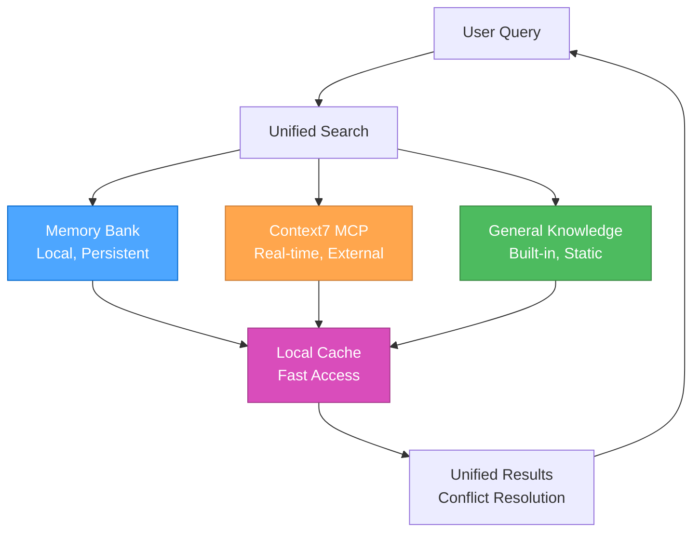

#### **Source Hierarchy**

1. **Memory Bank** (Local, Persistent)
   - Project-specific knowledge
   - Historical decisions and patterns
   - User preferences and learnings
   - Fast access, always available

2. **Context7 MCP** (Real-time, External)
   - Current library documentation
   - API references and examples
   - Best practices and guides
   - Up-to-date information

3. **General Knowledge** (Built-in, Static)
   - System documentation
   - Core concepts and principles
   - Troubleshooting guides
   - Fallback information

### 🔄 **INTELLIGENT CONFLICT RESOLUTION**

#### **Conflict Detection**

```javascript
const conflictResolver = {
  detectConflicts(memoryData, context7Data, generalData) {
    const conflicts = [];
    
    // Check for contradictory information
    if (memoryData && context7Data && memoryData.version !== context7Data.version) {
      conflicts.push({
        type: 'version_mismatch',
        memory: memoryData,
        context7: context7Data,
        priority: 'high'
      });
    }
    
    // Check for outdated information
    if (memoryData && this.isOutdated(memoryData.timestamp)) {
      conflicts.push({
        type: 'outdated',
        source: 'memory',
        data: memoryData,
        priority: 'medium'
      });
    }
    
    return conflicts;
  },
  
  resolveConflicts(conflicts) {
    return conflicts.map(conflict => {
      switch (conflict.type) {
        case 'version_mismatch':
          return this.resolveVersionMismatch(conflict);
        case 'outdated':
          return this.resolveOutdated(conflict);
        default:
          return this.resolveGeneric(conflict);
      }
    });
  }
};
```

#### **Resolution Strategies**

##### **Version Mismatch Resolution**

- **Priority**: Context7 > Memory Bank > General Knowledge
- **Action**: Update Memory Bank with current Context7 data
- **Notification**: Alert user of the update

##### **Outdated Information Resolution**

- **Priority**: Fetch fresh data from Context7
- **Action**: Replace outdated information
- **Notification**: Mark as updated

##### **Generic Conflict Resolution**

- **Priority**: Source hierarchy (Context7 > Memory > General)
- **Action**: Use highest priority source
- **Notification**: Log conflict for review

### 📊 **PERFORMANCE OPTIMIZATION**

#### **Caching Strategy**

```javascript
const documentationCache = {
  memory: new Map(),
  external: new Map(),
  general: new Map(),
  
  async get(key, source) {
    const cache = this[source];
    
    if (cache.has(key)) {
      const entry = cache.get(key);
      if (this.isValid(entry)) {
        return entry.data;
      }
    }
    
    const data = await this.fetch(key, source);
    cache.set(key, {
      data: data,
      timestamp: Date.now(),
      ttl: this.getTTL(source)
    });
    
    return data;
  },
  
  getTTL(source) {
    const ttlMap = {
      memory: 24 * 60 * 60 * 1000, // 24 hours
      external: 60 * 60 * 1000,    // 1 hour
      general: 7 * 24 * 60 * 60 * 1000 // 1 week
    };
    return ttlMap[source] || 60 * 60 * 1000;
  }
};
```

#### **Performance Metrics**

##### **Key Performance Indicators**

- **Search Speed**: Time to retrieve information from all sources
- **Cache Hit Rate**: Percentage of cached information usage
- **Conflict Resolution Time**: Time to resolve information conflicts
- **User Satisfaction**: Feedback on information quality and relevance

##### **Optimization Opportunities**

- **Intelligent Caching**: Cache frequently accessed information
- **Predictive Loading**: Pre-load likely needed information
- **Source Prioritization**: Optimize source selection based on usage patterns
- **Conflict Prevention**: Reduce conflicts through better information management

### 🔄 **INTEGRATION WITH 3-MODE SYSTEM**

#### **Mode-Specific Documentation**

##### **Strategic Mode**

- **Primary**: Memory Bank (historical decisions, patterns)
- **Secondary**: General Knowledge (strategic insights)
- **Tertiary**: Context7 (current best practices)

##### **Tactical Mode**

- **Primary**: Context7 (current documentation, APIs)
- **Secondary**: Memory Bank (project patterns)
- **Tertiary**: General Knowledge (design patterns)

##### **Operational Mode**

- **Primary**: Context7 (implementation details)
- **Secondary**: Memory Bank (project-specific context)
- **Tertiary**: General Knowledge (troubleshooting)

### 📚 **REFERENCES**

- [MCP Ecosystem Overview](../.cursor/rules/mcp-ecosystem.mdc) - MCP server overview
- [Memory Bank Overview](../.cursor/rules/memory-bank-overview.mdc) - Memory bank system overview
- [Context7 MCP Guide](../.cursor/rules/mcp-context7.mdc) - Context7 integration
- [Basic Memory MCP Guide](../.cursor/rules/mcp-basic-memory.mdc) - Basic Memory integration
- [System Architecture](../.cursor/rules/technical-architecture.mdc) - System architecture and relationships

### 🎯 **NEXT STEPS**

1. **Configure MCP servers** for enhanced documentation access
2. **Set up memory bank structure** for local knowledge management
3. **Implement unified search** for seamless information access
4. **Optimize performance** using caching and conflict resolution
5. **Integrate with 3-mode system** for mode-specific documentation

---

**Last Updated**: 2025-07-23  
**Version**: 1.0  
**Status**: Complete unified documentation system

---

<a id="amazonqrulessystem-documentation-tipsmd"></a>
## .amazonq\rules\system-documentation-tips.md

## What makes documentation good

Documentation puts useful information inside other people’s heads. Follow these tips to write better documentation.

### Make docs easy to skim

Few readers read linearly from top to bottom. They’ll jump around, trying to assess which bit solves their problem, if any. To reduce their search time and increase their odds of success, make docs easy to skim.

**Split content into sections with titles.** Section titles act as signposts, telling readers whether to focus in or move on.

**Prefer titles with informative sentences over abstract nouns.** For example, if you use a title like “Results”, a reader will need to hop into the following text to learn what the results actually are. In contrast, if you use the title “Streaming reduced time to first token by 50%”, it gives the reader the information immediately, without the burden of an extra hop.

**Include a table of contents.** Tables of contents help readers find information faster, akin to how hash maps have faster lookups than linked lists. Tables of contents also have a second, oft overlooked benefit: they give readers clues about the doc, which helps them understand if it’s worth reading.

**Keep paragraphs short.** Shorter paragraphs are easier to skim. If you have an essential point, consider putting it in its own one-sentence paragraph to reduce the odds it’s missed. Long paragraphs can bury information.

**Begin paragraphs and sections with short topic sentences that give a standalone preview.** When people skim, they look disproportionately at the first word, first line, and first sentence of a section. Write these sentences in a way that don’t depend on prior text. For example, consider the first sentence “Building on top of this, let’s now talk about a faster way.” This sentence will be meaningless to someone who hasn’t read the prior paragraph. Instead, write it in a way that can understood standalone: e.g., “Vector databases can speed up embeddings search.”

**Put topic words at the beginning of topic sentences.** Readers skim most efficiently when they only need to read a word or two to know what a paragraph is about. Therefore, when writing topic sentences, prefer putting the topic at the beginning of the sentence rather than the end. For example, imagine you’re writing a paragraph on vector databases in the middle of a long article on embeddings search. Instead of writing “Embeddings search can be sped up by vector databases” prefer “Vector databases speed up embeddings search.” The second sentence is better for skimming, because it puts the paragraph topic at the beginning of the paragraph.

**Put the takeaways up front.** Put the most important information at the tops of documents and sections. Don’t write a Socratic big build up. Don’t introduce your procedure before your results.

**Use bullets and tables.** Bulleted lists and tables make docs easier to skim. Use them frequently.

**Bold important text.** Don’t be afraid to bold important text to help readers find it.

#### Write well

Badly written text is taxing to read. Minimize the tax on readers by writing well.

**Keep sentences simple.** Split long sentences into two. Cut adverbs. Cut unnecessary words and phrases. Use the imperative mood, if applicable. Do what writing books tell you.

**Write sentences that can be parsed unambiguously.** For example, consider the sentence “Title sections with sentences.” When a reader reads the word “Title”, their brain doesn’t yet know whether “Title” is going to be a noun or verb or adjective. It takes a bit of brainpower to keep track as they parse the rest of the sentence, and can cause a hitch if their brain mispredicted the meaning. Prefer sentences that can be parsed more easily (e.g., “Write section titles as sentences”) even if longer. Similarly, avoid noun phrases like “Bicycle clearance exercise notice” which can take extra effort to parse.

**Avoid left-branching sentences.** Linguistic trees show how words relate to each other in sentences. Left-branching trees require readers to hold more things in memory than right-branching sentences, akin to breadth-first search vs depth-first search. An example of a left-branching sentence is “You need flour, eggs, milk, butter and a dash of salt to make pancakes.” In this sentence you don’t find out what ‘you need’ connects to until you reach the end of the sentence. An easier-to-read right-branching version is “To make pancakes, you need flour, eggs, milk, butter, and a dash of salt.” Watch out for sentences in which the reader must hold onto a word for a while, and see if you can rephrase them.

**Avoid demonstrative pronouns (e.g., “this”), especially across sentences.** For example, instead of saying “Building on our discussion of the previous topic, now let’s discuss function calling” try “Building on message formatting, now let’s discuss function calling.” The second sentence is easier to understand because it doesn’t burden the reader with recalling the previous topic. Look for opportunities to cut demonstrative pronouns altogether: e.g., “Now let’s discuss function calling.”

**Be consistent.** Human brains are amazing pattern matchers. Inconsistencies will annoy or distract readers. If we use Title Case everywhere, use Title Case. If we use terminal commas everywhere, use terminal commas. If all of the Cookbook notebooks are named with underscores and sentence case, use underscores and sentence case. Don’t do anything that will cause a reader to go ‘huh, that’s weird.’ Help them focus on the content, not its inconsistencies.

**Don’t tell readers what they think or what to do.** Avoid sentences like “Now you probably want to understand how to call a function” or “Next, you’ll need to learn to call a function.” Both examples presume a reader’s state of mind, which may annoy them or burn our credibility. Use phrases that avoid presuming the reader’s state. E.g., “To call a function, …”

#### Be broadly helpful

People come to documentation with varying levels of knowledge, language proficiency, and patience. Even if we target experienced developers, we should try to write docs helpful to everyone.

**Write simply.** Explain things more simply than you think you need to. Many readers might not speak English as a first language. Many readers might be really confused about technical terminology and have little excess brainpower to spend on parsing English sentences. Write simply. (But don’t oversimplify.)

**Avoid abbreviations.** Write things out. The cost to experts is low and the benefit to beginners is high. Instead of IF, write instruction following. Instead of RAG, write retrieval-augmented generation (or my preferred term: the search-ask procedure).

**Offer solutions to potential problems.** Even if 95% of our readers know how to install a Python package or save environment variables, it can still be worth proactively explaining it. Including explanations is not costly to experts—they can skim right past them. But excluding explanations is costly to beginners—they might get stuck or even abandon us. Remember that even an expert JavaScript engineer or C++ engineer might be a beginner at Python. Err on explaining too much, rather than too little.

**Prefer terminology that is specific and accurate.** Jargon is bad. Optimize the docs for people new to the field, instead of ourselves. For example, instead of writing “prompt”, write “input.” Or instead of writing “context limit” write “max token limit.” The latter terms are more self-evident, and are probably better than the jargon developed in base model days.

**Keep code examples general and exportable.** In code demonstrations, try to minimize dependencies. Don’t make users install extra libraries. Don’t make them have to refer back and forth between different pages or sections. Try to make examples simple and self-contained.

**Prioritize topics by value.** Documentation that covers common problems—e.g., how to count tokens—is magnitudes more valuable than documentation that covers rare problems—e.g., how to optimize an emoji database. Prioritize accordingly.

**Don’t teach bad habits.** If API keys should not be stored in code, never share an example that stores an API key in code.

**Introduce topics with a broad opening.** For example, if explaining how to program a good recommender, consider opening by briefly mentioning that recommendations are widespread across the web, from YouTube videos to Amazon items to Wikipedia. Grounding a narrow topic with a broad opening can help people feel more secure before jumping into uncertain territory. And if the text is well-written, those who already know it may still enjoy it.

#### Break these rules when you have a good reason

Ultimately, do what you think is best. Documentation is an exercise in empathy. Put yourself in the reader’s position, and do what you think will help them the most.

---

<a id="amazonqrulessystem-effective-rule-writingmd"></a>
## .amazonq\rules\system-effective-rule-writing.md

## System Effective Rule Writing

### 1. Getting Started: The Basics

To begin creating `.mdc` rule files that Cursor can use, follow these essential steps:

- Create new Markdown files (`.mdc`) directly within your workspace's `.cursor/rules/` directory.
- Name your files using `kebab-case` (e.g., `my-new-rule.mdc`).
- Ensure each rule file includes the [Mandatory Frontmatter Structure](#3-frontmatter-for-metadata) at its very beginning.

For managing your rule files in a version-controlled environment (e.g., Git/GitHub), common practices include forking the repository and submitting Pull Requests for changes. These practices are for repository management and collaboration, not for Cursor's local rule recognition.

### 2. Core Principles for All .mdc Rules

- **Clear Objective:** Every rule should have a well-defined purpose. State this objective clearly at the beginning of the rule, ideally in the frontmatter `description` and reinforced in the introductory text.
  - *Example:* This document's objective is stated in its frontmatter `description` and introduction.
- **Structured Content:** Use Markdown effectively to structure your rule.
  - **Headings and Subheadings:** Organize content logically using `#`, `##`, `###`, etc.
  - **Lists:** Use bulleted (`*`, `-`) or numbered (`1.`, `2.`) lists for steps, criteria, or key points.
  - **Code Blocks:** Use fenced code blocks (``` for code examples, commands, or structured data). Specify the language for syntax highlighting (e.g., ```typescript ... ```).
  - **Emphasis:** Use **bold** and *italics* to highlight important terms or instructions.
- **Clarity and Precision:** Write in a clear, unambiguous manner. Avoid jargon where possible, or explain it if necessary. If the rule is meant to guide AI behavior, precision is paramount.
- **Modularity (The "Surgically Specific" Principle):** This is a critical principle. Each rule should focus on a single, specific topic, tool, or workflow. Avoid creating large, monolithic rules that cover many different concepts. This makes rules easier to manage, understand, update, and for the AI to apply precisely when relevant.
- **Time MCP Integration:** **MANDATORY** - All rules that contain dates MUST use the Time MCP for date formatting. Never hardcode dates in any format. Always call `mcp_time_get_current_time({ timezone: 'Europe/Berlin' })` and use the returned date for all date fields.

### 3. Frontmatter for Metadata

Use YAML frontmatter at the beginning of your rule file to provide metadata. This helps Cursor (and humans) understand the rule's context and applicability.

⚠️ **CRITICAL: Use `alwaysApply: true` Sparingly** ⚠️

The `alwaysApply: true` flag is powerful, but should be reserved **only for the most fundamental, system-level rules** that are required for the AI to function correctly at all times (e.g., `protocol-control-system.mdc`). Most rules should be designed for **dynamic activation**—triggered by specific events, user commands, or file context—to keep the AI's active context lean and efficient.

⚠️ **CRITICAL: Mandatory Frontmatter Structure** ⚠️

**Every `.mdc` rule file MUST include a complete YAML frontmatter block at its very beginning.** This block provides essential metadata for Cursor's internal processing and human readability.

- **Delimiters:** The frontmatter block MUST start and end with `---` on its own line.
- **Required Fields:** At minimum, the `description` and `tags` fields are mandatory.
  - `description` (string): A concise summary of the rule's purpose.
  - `tags` (list of strings): A YAML list of keywords that categorize the rule (e.g., `[mode-specific, plan, quality]`).
- **Globs (Recommended for format-specific rules):**
  - Specify the `globs` field as a plain, comma-separated list of patterns, with **no brackets** and **no quotation marks**. For example:

    ```yaml
    globs: **/*.html
    ```

  - For multiple file types, separate each pattern with a comma (no spaces):

    ```yaml
    globs: **/*.js,**/*.ts,**/*.html
    ```

  - **Do NOT use brackets or quotes.** The following are all incorrect:

    ```yaml
    globs: ["**/*.html"]
    globs: [**/*.html]
    globs: ["**/*.html", "*.html"]
    globs: ["**/*.html"],**/*.html,.html
    globs: "**/*.html"
    ```

    These are invalid and may not be parsed correctly.
  - **Summary:**
    - Use only the plain, comma-separated format for globs.
    - No brackets, no quotes, no extra text after the patterns.
- **Optional Fields for Project Rules:** Project rules can also include `alwaysApply: true/false` and a `description` field for `Agent Requested` rule types.

⚠️ **CRITICAL: Avoid Duplicate Headers** ⚠️

**NEVER include multiple YAML frontmatter blocks in a single rule file.** Each `.mdc` file should have exactly ONE frontmatter block at the very beginning. Duplicate headers can cause confusion and inconsistent rule activation.

- **Common Mistake:** Having headers at both the beginning and end of the file
- **Correct Structure:** Single header block at the very top of the file
- **Validation:** Always verify your rule has only one `---` block

⚠️ **CRITICAL: "Agent Requested" Rule Structure** ⚠️

For rules that should be available to the AI across multiple file types (not constrained to specific globs), use this simplified structure:

```yaml
---
description: Clear description of the rule's purpose and scope.
alwaysApply: false
---
```

**Key Points:**

- **Remove `globs` field** - This makes the rule "Agent Requested" instead of "Auto Attached"
- **Remove `tags` field** - Not needed for Agent Requested rules
- **Keep `alwaysApply: false`** - Ensures the AI can choose when to apply the rule
- **Use for:** Thinking frameworks, mode systems, role definitions, workflow orchestrators, and other cross-cutting concerns

**Examples of "Agent Requested" Rules:**

- Thinking frameworks (`thinking-framework.mdc`, `thinking-contemplative.mdc`)
- Mode systems (`mode-system-unified.mdc`)
- Role definitions (`mode-system-unified.mdc`)
- System documentation (`system-documentation.mdc`)
- Memory management (`memory-bank-integration.mdc`)

Example of Mandatory Frontmatter:

```yaml
---
description: A brief explanation of what this rule is for.
tags: [category, subcategory]
globs: **/*.mdc
---
```

### 3.5. Understanding the Rule Ecosystem

Here's a breakdown of the different types of rules, instructions, and memories, how they interact, what's most important, and what each should contain:

#### 1. User Rules (Global Preferences)

- **What they are:** These are global preferences defined in Cursor Settings → Rules that apply across all projects. They define fundamental behavioral principles for the AI that are always applied.
- **Source:** Configured in `Cursor Settings` > `General` > `Rules for AI`.
- **Importance:** Most important, as they form the foundational behavioral constraints and guidelines. They are usually non-negotiable and apply regardless of project specifics.
- **What they should say:** Broad principles like communication style (e.g., "Technical but Concise"), core capabilities, and overarching operational guidelines (e.g., "Always verify information").
- **Why maintain separation (even with one workspace):** This separation keeps your fundamental AI model directives clean and focused on universal applicability. If you were ever to interact with the AI model in a completely different context (even if not a formal "workspace"), these rules would still apply, ensuring consistent AI behavior across all projects.

#### 2. Project Rules

These rules are specific to the current project or workspace, stored in the `.cursor/rules` directory, and are version-controlled. They can be further categorized by how they are applied:

- **Agent Requested:**
  - **What they are:** Available to the AI, which decides whether to include it based on its relevance to the task. They provide specialized context or modify behavior for particular scenarios.
  - **Source:** Defined by the user or project maintainers within specific rule files (e.g., `.mdc` files in `.cursor/rules/`).
  - **Importance:** Important for adapting the AI's behavior to project-specific needs without being constantly active. They are activated on demand.
  - **What they should say:** Context-specific guidelines like "context-management" (how to handle context window usage), "context7-auto-docs" (when to use a specific documentation tool), or "enhanced-error-handling" (how to diagnose and fix errors). Requires a `description` field in its frontmatter.

- **Always:**
  - **What they are:** Always included in the AI model's context when the rule's glob pattern matches. They define project-level standards, conventions, and non-negotiables that the AI must *always* follow within that project.
  - **Source:** Defined by the user or project maintainers within specific rule files (`.mdc` files in `.cursor/rules/`) with `alwaysApply: true` in their frontmatter.
  - **Importance:** Highly important for ensuring consistency and adherence to project-specific quality, architectural, and workflow standards. They directly shape how the AI operates within that project.
  - **What they should say:** Detailed standards for "Code Quality Standards" (no TODOs, readability, error handling), "Perchance Best Practices" (modular organization, IndexedDB, responsiveness), "Communication Style Guide" (output formats, problem-solving approach), and "Protocol Control System" (how Planning Protocol and Execution Protocol work).
- **Why maintain separation (even with one workspace):** This clearly signals that these rules are *for this project*. This enhances organizational clarity, makes it easier for new contributors (human or AI model) to understand project specifics, and prevents accidental application of project-specific rules if a second, unrelated workspace were ever introduced in the future.

- **Auto Attached:**
  - **What they are:** Included when files matching a specified glob pattern are referenced in the AI's context. These rules provide context-aware guidance without needing to be manually invoked.
  - **Source:** Defined within `.mdc` files in `.cursor/rules/` with a `globs` pattern specified in their frontmatter, and `alwaysApply: false` (or omitted).
  - **Importance:** Useful for providing specialized guidance relevant to specific file types or directory structures, ensuring the AI has relevant context when working on particular parts of the codebase.
  - **What they should say:** Framework-specific rules (e.g., SolidJS preferences for `.tsx` files), special handling for auto-generated files, custom UI development patterns, or code style for specific folders.

- **Manual:**
  - **What they are:** Only included when explicitly mentioned by the user using `@ruleName` in the chat or prompt.
  - **Source:** Any `.mdc` file in `.cursor/rules/` that does not have an `alwaysApply: true` or `globs` pattern that causes it to be `Auto Attached`.
  - **Importance:** Allows for on-demand application of specific rules that are not always needed but can be invoked when required for particular tasks or scenarios.
  - **What they should say:** Guidelines for specialized scenarios that are not triggered by file patterns or always active.

#### 3. .cursorrules (Legacy)

- **What they are:** A legacy file format for project-specific rules, located in your project's root directory. It is still supported for backward compatibility but is deprecated.
- **Source:** A `.cursorrules` file in the project root.
- **Importance:** Low, as it is deprecated. Migration to Project Rules (`.cursor/rules` directory) is recommended for better control, flexibility, and visibility.
- **What they should say:** Any project-specific rules, but ideally, this content should be migrated to `Project Rules`.

#### 4. Mode-Specific Rules

- **What they are:** Rules that become active only when the AI is in a particular "mode" (e.g., Planning Protocol or Execution Protocol). They define the specific behaviors and tool access for that mode.
- **Source:** Defined within the system that manages the AI's operational modes (often as part of the overall prompt or by Cursor's internal mechanisms).
- **Importance:** Crucial for dictating the AI's immediate behavior and available tools in different phases of a task (planning vs. execution).
- **What they should say:** Instructions like "Never ask for permission before making a change—just do it" (for Execution Protocol) or outlining available/restricted tools within a specific mode.

#### 5. Instructions

- **What they are:** Direct directives from the user that guide the AI's actions for the current task or overall session. These can be explicit requests or general preferences.
- **Source:** Directly provided by the user in natural language or embedded within files like `AI-Handoff.md` as "User's Explicit Instructions."
- **Importance:** Extremely important for fulfilling the user's immediate and long-term goals. The AI must prioritize these.
- **What they should say:** Specific requirements for a task (e.g., "Minimal, modern, robust UI/UX," "All CSS is consolidated into a single file"), preferences (e.g., "No icons in UI, only text labels"), and behavioral expectations (e.g., "Incremental, non-dramatic changes only").

#### 6. Memories

- **What they are:** Factual information or past learnings generated by the AI based on previous interactions, observations, or successful problem-solving. They serve as persistent context.
- **Source:** Generated by the AI and stored, often in a "memory-bank" directory (e.g., `coreContext.md`, `currentState.md`, `designSystem.md`).
- **Importance:** Important for maintaining continuity and avoiding repetitive actions or mistakes. They inform the AI's understanding of the project's history and current state.
- **What they should say:** Summaries of past tasks, identified preferences (e.g., "User prefers icon-less buttons"), successful bug fixes, or preferred working styles ("User prefers not to ask clarifying questions too frequently").

##### How Rules Interact (Hierarchy of Influence)

Rules provide persistent, reusable context at the prompt level. When applied, rule contents are included at the start of the model context, giving the AI consistent guidance. The interaction generally follows a hierarchy from broadest to most specific, with more specific elements potentially refining or overriding broader ones:

- **User Rules:** Form the absolute foundation. All other rules, instructions, and memories operate within the boundaries set by User Rules.
- **Project Rules (Always):** Apply constantly within a specific project, building upon User Rules and defining project-specific standards.
- **Instructions:** Direct user instructions take precedence over general project rules and memories for the current task, but must still operate within the bounds of User and Project Rules.
- **Mode-Specific Rules:** These are dynamic, temporarily altering the AI's behavior and tool access based on its current operational mode (e.g., Planning Protocol or Execution Protocol). They are a layer of behavior refinement on top of User, Project, and instruction sets.
- **Project Rules (Agent Requested/Auto Attached/Manual):** Activated dynamically by the AI or by reference to retrieve specific context or modify behavior for particular situations, adhering to all higher-level rules.
- **Memories:** Inform the AI's decision-making process by providing historical context and learned preferences. They influence how rules and instructions are interpreted and applied, but don't typically override explicit rules or instructions.

##### Most Important

- **User Rules** and **Project Rules (Always)** are foundational as they dictate the fundamental operating principles and project standards.
- **User's Explicit Instructions** are paramount for task fulfillment, as they represent your direct intent.
- **Mode-Specific Rules:** These are critical for the immediate operational behavior.

##### What should say what

- **User Rules / Project Rules (Always):** Should contain principles, standards, architectural patterns, non-negotiables, and broad behavioral guidelines. They are prescriptive and define how the AI should generally operate and what constitutes good practice.
- **Instructions:** Should contain specific requirements for tasks, direct preferences, and explicit prohibitions. They are declarative and tell the AI what to do or what to avoid.
- **Memories:** Should contain factual summaries, past learnings, identified user preferences, and project state information. They are descriptive and provide historical and ongoing context.

By having a clear separation, you make the system more robust, easier to manage, and more predictable in its behavior. You can update a small rule without fearing widespread unintended consequences, and the AI can more easily reason about its actions by referring to specific, well-defined guidelines.

### 4. Types of Cursor Rules and Their Structure

Cursor Rules can serve various purposes. Tailor the structure and content to the type of rule you're writing.

#### a. Informational / Documentation Rules

Provide comprehensive information about a system, architecture, or technology. This document is an example of an informational rule.

- **Key Elements:**
  - **Establish Context:** Provide a clear overview and state the project goals to set the stage for understanding.
  - **Explain Components:** Offer detailed explanations of system components, core concepts, or critical processes.
  - **Visualize Systems:** Include diagrams (e.g., Mermaid.js) to visually represent systems and their interactions.
  - **Illustrate Usage:** Provide concrete code snippets or configuration examples to show practical application.
  - **Define Terms:** Ensure clarity by defining key terms and acronyms used within the documentation.
- **Example:** This `writing-effective-rules.mdc` document.

#### b. Process / Workflow Rules

Define a sequence of steps for the AI model or the user to follow to achieve a specific outcome.

- **Key Elements:**
  - **Define Scope:** Clearly state a precise start and end point for the workflow.
  - **Sequence Actions:** Use numbered steps to outline sequential actions that must be performed.
  - **Handle Decisions:** Include decision points with clear options (e.g., "If X, then Y, else Z") to guide conditional paths.
  - **Specify Tools:** Explicitly state which tools (e.g., `use_mcp_tool`, `write_to_file`) are to be used at each step.
  - **Outline Inputs/Outputs:** Define the expected inputs required and outputs generated for each step.
  - **Note Prerequisites:** Include notes on any dependencies or prerequisites that must be met before starting or during the process.
- **Example:** `planning-protocol.mdc`, `execution-protocol.mdc`

#### c. Behavioral / Instructional Rules (for Guiding AI)

These rules directly instruct the AI model on how it should behave, process information, or generate responses, especially in specific contexts.

- **Key Elements:**
  - **Provide Directives:** Use imperative verbs (MUST, SHOULD, DO NOT, NEVER, ALWAYS) for absolute requirements or strong recommendations.
  - **Highlight Criticality:** Use formatting (bold, ALL CAPS, emojis like 🚨, ⚠️, ✅, ❌) to draw immediate attention to critical instructions or prohibitions.
  - **Show Examples:** Provide clear positive and negative examples (e.g., code patterns to use vs. avoid) to illustrate correct behavior.
  - **Define Triggers:** Specify conditions or triggers that activate the rule or particular instructions within it.
  - **Include Verification:** Integrate "thinking" blocks or checklists for the AI to verify its actions against the rule's constraints.
  - **Manage Context:** Define how the AI model should manage context, memory, or state if relevant (e.g., `coreContext.md`, `currentState.md`, `designSystem.md`).
- **Example:** `planning-protocol.mdc`, `execution-protocol.mdc`

#### d. Meta-Rules

Rules that define how other rules are managed or how the AI's own processes are governed. They provide structure and control over the entire rule ecosystem.

- **Key Elements:**
  - **Define Scope:** Clearly state the purpose of the meta-rule (e.g., managing protocol transitions, defining activation triggers).
  - **Centralize Logic:** Consolidate distributed logic into a single, authoritative source.
  - **Reference Other Rules:** Explicitly reference the other rules they govern or interact with by filename.
- **Example:** `protocol-control-system.mdc` (governs protocol state) or `rule-activation-triggers.mdc` (a central registry for what events activate which rules).

#### f. Nested Rules

Organize rules by placing them in `.cursor/rules` directories throughout your project. Nested rules automatically attach when files in their directory are referenced.

```text
project/
  .cursor/rules/        # Project-wide rules
  backend/
    server/
      .cursor/rules/    # Backend-specific rules
  frontend/
    .cursor/rules/      # Frontend-specific rules
```

#### g. How Rules Interact with Cursor's Features

Rules act as the primary filter and guide for the AI model's understanding and actions across all other information sources. They effectively serve as the "system prompt" or "AI brain" for Agent and Inline Edit features, influencing how the AI leverages various types of context.

- **Codebase Indexing & PR History Indexing:** Rules influence *how* the AI model interprets and uses the information derived from your indexed codebase and PR history. They can instruct the AI on *what to look for* in the indexed data, *how to interpret* code patterns, and *what standards to apply* when modifying or generating code within that codebase.

- **Model Context Protocol (MCP):** Rules *dictate when and how* the AI model uses MCP tools and accesses MCP resources. For instance, a rule could mandate the use of a specific MCP tool for certain security checks, for accessing real-time data from an external API, or specify when to use `sequential_thinking` for complex problem-solving.

- **APIs (External Services):** While Cursor doesn't directly manage external APIs, rules can define how the AI model should *interact* with APIs when generating code or making recommendations. This includes specifying authentication methods, error handling strategies, or data formatting for API calls.

- **Documentation (`@Docs` & Custom Resources):** Rules can guide the AI model to consult specific documentation sources (e.g., via `@Add Doc` in settings or `@Docs` references) for particular tasks, ensuring it prioritizes and uses the correct contextual information over general knowledge. This includes custom developer documentation and externally indexed resources.

### 5. Language and Formatting for AI Guidance

When writing rules intended to directly steer the AI model's behavior, certain conventions are highly effective:

- **Be Directive:**
  - Use **MUST** for absolute requirements.
  - Use **SHOULD** for strong recommendations.
  - Use **MAY** for optional actions.
  - Use **MUST NOT** or **NEVER** for absolute prohibitions.
  - Use **SHOULD NOT** for strong discouragement.
- **Highlight Critical Information:** Use formatting (bold, ALL CAPS, emojis like 🚨, ⚠️, ✅, ❌) to draw immediate attention to critical instructions or prohibitions.
- **Provide Concrete Examples:**
  - Show exact code snippets, commands, or output formats.
  - For code generation, clearly distinguish between desired and undesired patterns.
- **Define AI model's "Thought Process":** The `<thinking> ... </thinking>` block is a good way to make the AI model "pause and check" its understanding or state before proceeding.
- **Specify Tool Usage:** If the AI model needs to use a specific tool (e.g., `attempt_completion`, `replace_in_file`, `use_mcp_tool`), explicitly state it and provide any necessary parameters or context for that tool.

### 6. Content Best Practices

Good rules are focused, actionable, and scoped.

- **Start Broad, Then Narrow:** Begin with a general overview or objective, then delve into specifics.
- **Use Analogies or Scenarios:** If explaining a complex concept, an analogy or a use-case scenario can be helpful.
- **Define Terminology:** If your rule introduces specific terms or acronyms, define them.
- **Anticipate Questions:** Try to think about what questions a user (or the AI model itself) might have and address them proactively.
- **Keep it Updated:** As systems or processes change, ensure the relevant `.cursor/rules/` collection is updated to reflect those changes. This `writing-effective-rules.mdc` rule encourages this.
- **Keep rules under 500 lines:** Split large rules into multiple, composable rules.
- **Provide concrete examples or referenced files.**
- **Avoid vague guidance:** Write rules like clear internal docs.
- **Reuse rules:** When repeating prompts in chat.

### 7. Referencing Other Rules

If your rule builds upon or relates to another rule, feel free to reference it by its filename. This helps create a connected knowledge base.

### 8. Testing Your Rule

While not always formally testable, consider how your rule will be interpreted:

- **Human Readability:** Is it clear to another person? If so, it's more likely to be clear to the AI model.
- **AI model Interpretation (for behavioral rules):** Does it provide enough specific guidance? Are there ambiguities? Try "role-playing" as the AI model and see if you can follow the instructions.
- **Practical Application:** If it's a workflow, manually step through it. If it's a coding guideline, try applying it to a piece of code.
- **Self-Review Against These Guidelines:** Does your new rule adhere to the principles and best practices outlined in *this very document* (`writing-effective-rules.mdc`)?

- **Human Readability:** Is it clear to another person? If so, it's more likely to be clear to the AI model.
- **AI model Interpretation (for behavioral rules):** Does it provide enough specific guidance? Are there ambiguities? Try "role-playing" as the AI model and see if you can follow the instructions.
- **Practical Application:** If it's a workflow, manually step through it. If it's a coding guideline, try applying it to a piece of code.
- **Self-Review Against These Guidelines:** Does your new rule adhere to the principles and best practices outlined in *this very document* (`writing-effective-rules.mdc`)?

- **AI model Interpretation (for behavioral rules):** Does it provide enough specific guidance? Are there ambiguities? Try "role-playing" as the AI model and see if you can follow the instructions.
- **Practical Application:** If it's a workflow, manually step through it. If it's a coding guideline, try applying it to a piece of code.
- **Self-Review Against These Guidelines:** Does your new rule adhere to the principles and best practices outlined in *this very document* (`writing-effective-rules.mdc`)?

---

<a id="amazonqrulessystem-orchestration-modemd"></a>
## .amazonq\rules\system-orchestration-mode.md

## **🎯 UNIFIED ORCHESTRATOR MODE: The intelligent single mode that manages the 3-mode system!**

> **TL;DR:** Single intelligent mode that automatically selects and transitions between Strategic, Tactical, and Operational roles based on task complexity, providing seamless development workflow with unified context and optimal performance.

### 🎯 **SYSTEM OVERVIEW**

The Unified Orchestrator Mode is a single, intelligent development mode that automatically:

1. **Analyzes task complexity** and selects the optimal role
2. **Applies the right thinking approach** for each task
3. **Loads contextually relevant rules** for maximum efficiency
4. **Maintains unified context** across role transitions
5. **Provides seamless workflow** without manual mode switching

### 🎭🎨⚒️ **THE THREE ROLES**

#### **🎭 Strategic Role (System Architect)**

**Purpose**: System-level thinking, workflow optimization, tool management  
**Thinking Approach**: 🤔 **Contemplative Thinking** - Deep exploration and natural flow  
**When Activated**: Level 3 tasks, system optimization, meta-reflection  
**Mental State**: "What's our overall approach and how can we optimize it?"

**Key Capabilities**:

- **System-Level Optimization**: Focus on overall workflow and process improvement
- **Meta-Reflection**: Analyze and optimize the development process itself
- **Strategic Planning**: Coordinate long-term project architecture decisions
- **Context Management**: Maintain comprehensive project context awareness
- **Tool Evaluation**: Assess and optimize tool usage and MCP integrations

#### **🎨 Tactical Role (Project Planner)**

**Purpose**: App-specific planning, design decisions, implementation planning  
**Thinking Approach**: 🧠 **Sequential Thinking** - Structured, tool-guided analysis  
**When Activated**: Level 2-3 tasks, feature planning, design decisions  
**Mental State**: "How do we execute this strategy for this specific app?"

**Key Capabilities**:

- **App-Specific Planning**: Focus on specific application requirements and design
- **Implementation Coordination**: Plan and coordinate implementation strategies
- **Task Prioritization**: Manage task priorities and resource allocation
- **Progress Tracking**: Monitor and update project progress in real-time
- **Design Decision Making**: Evaluate design options and make informed choices

#### **⚒️ Operational Role (Code Implementer)**

**Purpose**: Implementation, testing, and execution  
**Thinking Approach**: ⚡ **Professional Coding** - Concise, production-ready implementation  
**When Activated**: All levels, direct implementation, testing, deployment  
**Mental State**: "Let's get this done!"

**Key Capabilities**:

- **Elite Code Generation**: Deliver optimal, production-grade code with zero technical debt
- **Complete Ownership**: Take complete ownership of all generated solutions
- **Precise Implementation**: Implement precise solutions that exactly match requirements
- **Technical Excellence**: Rigorously apply DRY and KISS principles in all code
- **Quality Assurance**: Comprehensive testing and validation

### 🎯 **AUTOMATIC ROLE SELECTION**

#### **Complexity-Based Routing**

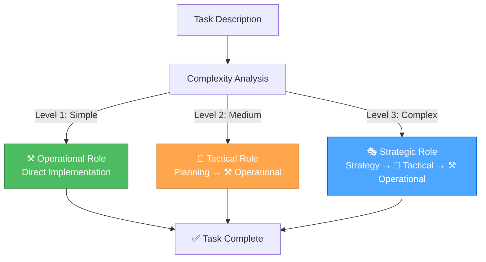

#### **Level Definitions**

##### **Level 1: Quick Fix (⚒️ Operational Only)**

**Keywords**: "fix", "broken", "not working", "issue", "bug", "error", "crash", "typo"  
**Examples**: Fix button not working, Correct styling issue, Fix validation error  
**Role**: Direct to Operational Role

##### **Level 2: Enhancement (🎨 Tactical → ⚒️ Operational)**

**Keywords**: "add", "improve", "update", "change", "enhance", "modify"  
**Examples**: Add form field, Improve validation, Update styling  
**Role**: Tactical Role creates plan, Operational Role executes

##### **Level 3: Complex Feature (🎭 Strategic → 🎨 Tactical → ⚒️ Operational)**

**Keywords**: "implement", "create", "develop", "build", "feature", "system"  
**Examples**: Implement user authentication, Create dashboard, Develop search functionality  
**Role**: Strategic Role provides context, Tactical Role plans, Operational Role executes

### 🧠 **THINKING APPROACH INTEGRATION**

#### **Automatic Approach Selection**

| Role | Thinking Approach | Primary Use Case | Key Characteristics |
|------|------------------|------------------|-------------------|
| 🎭 **Strategic** | 🤔 **Contemplative** | System-level decisions, meta-reflection | Deep exploration, natural flow, uncertainty embrace |
| 🎨 **Tactical** | 🧠 **Sequential** | Planning and design decisions | Systematic analysis, tool-guided, step-by-step |
| ⚒️ **Operational** | ⚡ **Professional** | Implementation and execution | Production-ready, zero technical debt, efficient |

#### **Seamless Transitions**

The orchestrator automatically transitions between thinking approaches as the task evolves:

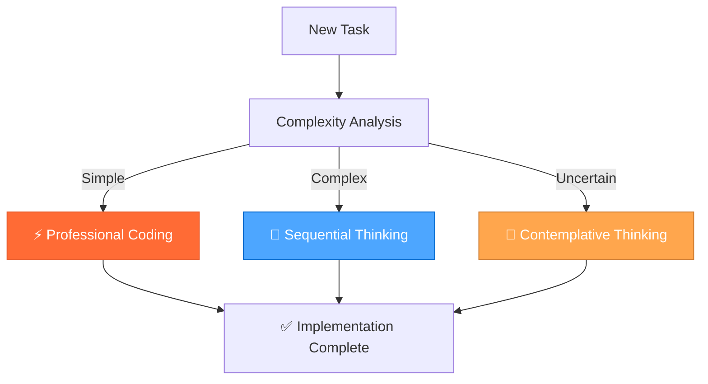

### ⚡ **CONTEXT-AWARE RULE LOADING**

#### **Unified Rule Management**

The orchestrator maintains a single, comprehensive rule set and loads rules contextually based on:

- **Current Role**: Strategic, Tactical, or Operational
- **Task Type**: Debugging, implementation, planning, analysis
- **Domain**: Frontend, backend, documentation, optimization
- **Complexity**: Simple, medium, complex

#### **Optimized Loading Strategy**

```javascript
function loadRulesForTask(task, currentRole) {
  const rules = new Set();
  
  // Core rules (always loaded)
  rules.add('unified-orchestrator-mode.md');
  rules.add('thinking-framework.md');
  
  // Role-specific rules
  const roleRules = getRoleRules(currentRole);
  roleRules.forEach(rule => rules.add(rule));
  
  // Task-specific rules
  const taskRules = getTaskRules(task.type);
  taskRules.forEach(rule => rules.add(rule));
  
  // Domain-specific rules
  const domainRules = getDomainRules(task.domain);
  domainRules.forEach(rule => rules.add(rule));
  
  return Array.from(rules);
}
```

### 📋 **UNIFIED DOCUMENTATION SYSTEM**

#### **Seamless Documentation Access**

The orchestrator provides unified access to all documentation sources:

- **Memory Bank**: Project knowledge and learnings
- **Context7**: Up-to-date library documentation
- **Project Documentation**: Guides and rules

#### **Smart Documentation Prioritization**

1. **Project-specific** (your rules and guides)
2. **Memory Bank** (your learnings and experiences)
3. **Context7** (external library documentation)

### 🎯 **ORCHESTRATOR COMMANDS**

#### **Automatic Mode (Recommended)**

Just describe your task normally - the orchestrator will automatically select the optimal role and approach:

```bash
## Automatically selects Operational Role with Professional Coding
"Fix the typo in the login button"

## Automatically selects Tactical Role with Sequential Thinking
"Add a new character preview feature to RPGlitch"

## Automatically selects Strategic Role with Contemplative Thinking
"Optimize our development workflow and tool usage"
```

#### **Manual Role Selection**

You can also specify the role directly:

```bash
🎭 "strategic" → Force Strategic Role (System Architect)
🎨 "tactical" → Force Tactical Role (Project Planner)
⚒️ "operational" → Force Operational Role (Code Implementer)
```

#### **Thinking Approach Commands**

```bash
🧠 "analyze [problem]" → Use Sequential Thinking for complex analysis
🤔 "explore [topic]" → Use Contemplative Thinking for deep exploration
⚡ "implement [feature]" → Use Professional Coding for quick implementation
```

#### **Documentation Commands**

```bash
📚 "memory [topic]" → Access Memory Bank for project knowledge
📚 "docs [library]" → Access Context7 for library documentation
📚 "guide [topic]" → Access project documentation
```

### 🔄 **WORKFLOW EXAMPLES**

#### **Example 1: Complex Feature Development**

```bash
## User says:
"I want to implement user authentication in RPGlitch"

## Orchestrator automatically:
1. 🎭 Activates Strategic Role with Contemplative Thinking
   - Explores different authentication approaches
   - Evaluates security implications
   - Considers integration with existing system

2. 🎨 Transitions to Tactical Role with Sequential Thinking
   - Plans implementation strategy
   - Breaks down into manageable tasks
   - Creates detailed implementation plan

3. ⚒️ Transitions to Operational Role with Professional Coding
   - Implements authentication system
   - Tests thoroughly
   - Deploys and validates
```

#### **Example 2: Quick Bug Fix**

```bash
## User says:
"Fix the login button not working"

## Orchestrator automatically:
1. ⚒️ Activates Operational Role with Professional Coding
   - Analyzes the issue quickly
   - Implements the fix
   - Tests the solution
   - Completes the task
```

#### **Example 3: System Optimization**

```bash
## User says:
"Optimize our development workflow"

## Orchestrator automatically:
1. 🎭 Activates Strategic Role with Contemplative Thinking
   - Explores current workflow inefficiencies
   - Identifies optimization opportunities
   - Evaluates different approaches

2. 🎨 Transitions to Tactical Role with Sequential Thinking
   - Plans optimization implementation
   - Creates improvement roadmap
   - Prioritizes changes

3. ⚒️ Transitions to Operational Role with Professional Coding
   - Implements workflow improvements
   - Tests new processes
   - Documents changes
```

### 📊 **PERFORMANCE BENEFITS**

#### **Efficiency Gains**

- **Faster Response Times**: Optimized rule loading and context management
- **Better Relevance**: Context-aware rule selection for each task
- **Reduced Complexity**: Single mode instead of three separate modes
- **Improved Accuracy**: Automatic role selection based on task analysis

#### **User Experience Improvements**

- **Simplified Setup**: Only one mode to configure
- **Seamless Workflow**: No manual mode switching required
- **Context Preservation**: Unified context across all role transitions
- **Intuitive Usage**: Just describe your task normally

### 🎯 **SUCCESS CRITERIA**

#### **System Performance**

- [ ] Automatic role selection accuracy > 95%
- [ ] Response time improvement > 30%
- [ ] Context preservation across role transitions
- [ ] Seamless documentation access

#### **User Experience**

- [ ] Simplified setup process
- [ ] Intuitive task description handling
- [ ] Seamless role transitions
- [ ] Consistent performance across all task types

#### **Technical Excellence**

- [ ] Zero technical debt in implementation
- [ ] Comprehensive error handling
- [ ] Robust performance optimization
- [ ] Scalable architecture

### 🚀 **READY TO ORCHESTRATE!**

The Unified Orchestrator Mode provides:

✅ **Single intelligent mode** for all development tasks  
✅ **Automatic role selection** based on task complexity  
✅ **Seamless thinking approach transitions**  
✅ **Optimized rule loading** for maximum efficiency  
✅ **Unified documentation access** across all sources  
✅ **Simplified user experience** with powerful capabilities  

**This is the ultimate development framework - sophisticated internally, simple to use!** 🎯⚡

---

<a id="amazonqrulessystem-rule-interactionsmd"></a>
## .amazonq\rules\system-rule-interactions.md

## **🔍 RULE INTERACTIONS ANALYSIS: Unified 39-rule system with seamless integration and optimal performance!**

> **TL;DR:** Comprehensive analysis of interactions, conflicts, and synergy opportunities between the 39 rule systems in the unified 3-mode development system.

### 🎯 **OVERVIEW**

This analysis examines the 39 rule systems in .cursor/rules/ to identify:

- **Interactions** between different rule approaches
- **Conflicts** that need resolution
- **Synergy opportunities** for enhanced functionality
- **Integration patterns** in the unified 3-mode system

### 📊 **CURRENT RULE SYSTEM INVENTORY (39 Rules)**

#### **🎭🎨⚒️ 3-Mode System & Orchestration**

1. **Unified Orchestrator Mode** (orchestration-mode.mdc)
   - **Purpose**: Single Cursor mode managing 3 internal modes with automatic complexity routing
   - **Approach**: Automatic role selection based on task complexity
   - **Scope**: Complete development workflow orchestration

2. **Orchestration System** (orchestration-system.mdc)
   - **Purpose**: Enhanced 3-mode framework with integrated thinking approaches
   - **Approach**: Complexity-based routing with mode-specific role behaviors
   - **Scope**: Complete system architecture and workflow

3. **Orchestration Architecture** (orchestration-architecture.mdc)
   - **Purpose**: System architecture and relationships for unified development
   - **Approach**: MCP integration and memory bank management
   - **Scope**: Overall system design principles

#### **🧠 Thinking Framework & Approaches**

1. **Thinking Framework** (thinking-framework.mdc)
   - **Purpose**: Unified framework integrating Contemplative, Sequential, and Professional approaches
   - **Approach**: Mode-to-thinking mapping with automatic selection
   - **Scope**: Optimal problem-solving for each task type

2. **Context-Aware Rule Loading** (thinking-context-aware-rule-loading.mdc)
   - **Purpose**: Intelligent rule selection based on task context and complexity
   - **Approach**: Token efficiency through selective rule loading
   - **Scope**: Performance optimization and efficiency

#### **📚 Memory Bank & Knowledge Management**

1. **Memory Bank Overview** (memory-bank-overview.mdc)
   - **Purpose**: Knowledge management system with persistent semantic graphs
   - **Approach**: Obsidian integration and multi-project support
   - **Scope**: Long-term context preservation

2. **Memory Bank Workflow** (memory-bank-workflow.mdc)
   - **Purpose**: Memory bank workflow integration for 3-mode system
   - **Approach**: Context preservation and knowledge management
   - **Scope**: Seamless mode transitions

#### **🔧 MCP Ecosystem Integration**

1. **MCP Ecosystem** (mcp-ecosystem.mdc)
    - **Purpose**: Model Context Protocol ecosystem overview and integration
    - **Approach**: Real-time documentation access and tool integration
    - **Scope**: External system connectivity

2. **Context7 MCP** (mcp-context7.mdc)
    - **Purpose**: Real-time documentation access for libraries and frameworks
    - **Approach**: Library resolution and documentation retrieval
    - **Scope**: Development research and documentation

3. **Basic Memory MCP** (mcp-basic-memory.mdc)
    - **Purpose**: Local knowledge management with MCP server capabilities
    - **Approach**: Semantic knowledge management with Obsidian integration
    - **Scope**: Persistent context and knowledge graphs

4. **Time MCP** (mcp-time.mdc)
    - **Purpose**: Date standardization and timezone handling
    - **Approach**: Consistent date formatting across all documentation
    - **Scope**: Time management and standardization

#### **🎨 Development & Architecture**

1. **Technical Architecture** (technical-architecture.mdc)
    - **Purpose**: Comprehensive system architecture documentation
    - **Approach**: Unified 3-mode development system with MCP integration
    - **Scope**: Overall system design and principles

2. **Perchance Architecture** (perchance-architecture.mdc)
    - **Purpose**: High-level structure and principles for Perchance apps
    - **Approach**: Platform-specific architectural guidance
    - **Scope**: Perchance platform development

3. **Perchance Build & Deployment** (perchance-build-deployment.mdc)
    - **Purpose**: Build and deployment automation for Perchance applications
    - **Approach**: Automated workflows and optimization strategies
    - **Scope**: Production deployment and optimization

4. **Perchance Development Lifecycle** (perchance-development-lifecycle.mdc)
    - **Purpose**: Standard workflow and development process
    - **Approach**: Protocol-driven development with quality assurance
    - **Scope**: Complete development lifecycle

5. **Perchance Plugin System** (perchance-plugin-system.mdc)
    - **Purpose**: Plugin development and integration guidelines
    - **Approach**: Extensible architecture and plugin patterns
    - **Scope**: Platform extensibility and customization

#### **💻 JavaScript Development**

1. **JavaScript Development** (js-development.mdc)
    - **Purpose**: Modern JavaScript best practices and features
    - **Approach**: ES2023+ features and modern APIs
    - **Scope**: JavaScript development excellence

2. **JavaScript Ecosystem Overview** (js-ecosystem-overview.mdc)
    - **Purpose**: Unified JavaScript ecosystem decision framework
    - **Approach**: Clear decision frameworks for choosing approaches
    - **Scope**: Technology selection and architecture

3. **JavaScript Modern Features** (js-modern-features.mdc)
    - **Purpose**: Modern JavaScript features and syntax patterns
    - **Approach**: ES2023+ features and modern syntax
    - **Scope**: Contemporary JavaScript development

4. **JavaScript Modern APIs** (js-modern-apis.mdc)
    - **Purpose**: Modern browser APIs and contemporary web APIs
    - **Approach**: Fetch API, Intersection Observer, Resize Observer
    - **Scope**: Enhanced web functionality

5. **JavaScript Patterns & Practices** (js-patterns-practices.mdc)
    - **Purpose**: JavaScript patterns and performance optimization
    - **Approach**: Code organization and debugging best practices
    - **Scope**: Production-ready JavaScript development

6. **JavaScript DOM Manipulation** (js-dom-manipulation.mdc)
    - **Purpose**: Modern DOM APIs and manipulation patterns
    - **Approach**: Element selection, event handling, modern DOM methods
    - **Scope**: Frontend interactivity and DOM management

7. **JavaScript Cash DOM Usage** (js-cash-dom-usage.mdc)
    - **Purpose**: Cash DOM for concise, readable JavaScript
    - **Approach**: Tiny, fast jQuery-like API for DOM manipulation
    - **Scope**: Simplified DOM operations

8. **JavaScript Dexie Usage** (js-dexie-usage.mdc)
    - **Purpose**: IndexedDB management with Dexie.js
    - **Approach**: Recommended library for persistent client-side storage
    - **Scope**: Data persistence and management

9. **JavaScript IndexedDB Principles** (js-indexeddb-principles.mdc)
    - **Purpose**: IndexedDB principles and best practices
    - **Approach**: Versioning, upgrades, and recommended libraries
    - **Scope**: Client-side data storage

10. **JavaScript Storage Strategy** (js-storage-strategy.mdc)
    - **Purpose**: Unified client-side storage strategy
    - **Approach**: localStorage, IndexedDB, and Dexie.js decision framework
    - **Scope**: Storage architecture and decisions

#### **🎨 SCSS & Styling**

1. **SCSS Advanced Patterns** (scss-advanced-patterns.mdc)
    - **Purpose**: Advanced SCSS patterns and modern features
    - **Approach**: Color spaces, module system, selector functions
    - **Scope**: Advanced styling and CSS architecture

2. **SCSS Modern CSS Frameworks** (scss-modern-css-frameworks.mdc)
    - **Purpose**: Modern CSS frameworks and principles
    - **Approach**: Utility-first CSS, component design, responsive layouts
    - **Scope**: Modern styling approaches

3. **SCSS Debugging** (scss-debugging.mdc)
    - **Purpose**: Comprehensive SCSS debugging and troubleshooting
    - **Approach**: Compilation errors, performance issues, common problems
    - **Scope**: SCSS development and maintenance

#### **🌐 HTML Development**

1. **HTML Development** (html-development.mdc)
    - **Purpose**: Semantic HTML, accessibility, and Perchance-specific markup
    - **Approach**: Semantic structure and accessibility best practices
    - **Scope**: HTML architecture and standards

2. **HTML Hyperscript Usage** (html-hyperscript-usage.mdc)
    - **Purpose**: Hyperscript for easy, readable interactivity
    - **Approach**: Direct HTML interactivity using _ attribute
    - **Scope**: Simple UI actions and event handling

#### **📋 System & Documentation**

1. **System Documentation** (system-documentation.mdc)
    - **Purpose**: Integrated documentation system with Memory Bank and Context7
    - **Approach**: Single source of truth with intelligent conflict resolution
    - **Scope**: Complete documentation management

2. **System Effective Rule Writing** (system-effective-rule-writing.mdc)
    - **Purpose**: Guidelines for writing effective and maintainable rules
    - **Approach**: Rule structure, clarity, and maintainability
    - **Scope**: Rule system quality and effectiveness

3. **System TODO Handoff Template** (system-todo-handoff-template.mdc)
    - **Purpose**: Unified TODO and handoff document system
    - **Approach**: Single source of truth for project management
    - **Scope**: Cross-mode project coordination

4. **System Rule Interactions** (system-rule-interactions.mdc)
    - **Purpose**: Analysis of rule system interactions and conflicts
    - **Approach**: Comprehensive rule system analysis and optimization
    - **Scope**: Rule system harmony and efficiency

### ⚠️ **IDENTIFIED CONFLICTS & RESOLUTIONS**

#### **1. Thinking Approach Integration** ✅ **RESOLVED**

##### **Unified Thinking Framework**

- **Resolution**: Integrated Contemplative, Sequential, and Professional approaches
- **Implementation**: Mode-to-thinking mapping with automatic selection
- **Benefits**: Optimal approach for each task type

#### **2. Mode System Conflicts** ✅ **RESOLVED**

##### **Unified Orchestrator Mode**

- **Resolution**: Single orchestrator managing 3 internal modes
- **Implementation**: Automatic complexity-based routing
- **Benefits**: Seamless mode transitions with context preservation

#### **3. Documentation Approach Conflicts** ✅ **RESOLVED**

##### **Integrated Documentation System**

- **Resolution**: Memory Bank + Context7 integration
- **Implementation**: Clear documentation source hierarchy
- **Benefits**: Comprehensive information access

### 🤝 **SYNERGY OPPORTUNITIES**

#### **1. Enhanced 3-Mode System**

##### **Automatic Intelligence**

- **Complexity Assessment**: Automatic level detection (1-3)
- **Mode Routing**: Strategic → Tactical → Operational
- **Role Selection**: System Architect → Project Planner → Code Implementer
- **Thinking Integration**: Contemplative → Sequential → Professional

#### **2. Memory Bank Integration**

##### **Persistent Context Management**

- **Local Knowledge**: Project-specific context and learnings
- **External Access**: Context7 for up-to-date documentation
- **Semantic Graphs**: Automatic relationship building
- **Obsidian Integration**: Existing workflow compatibility

#### **3. MCP Ecosystem Synergy**

##### **Real-Time Tool Integration**

- **Context7**: Library documentation and API access
- **Time MCP**: Date standardization and timezone handling
- **Basic Memory**: Local knowledge management with MCP server
- **Sequential Thinking**: Tool-guided problem solving

### 🔧 **INTEGRATION PATTERNS**

#### **1. Context-Aware Rule Loading**

##### **Intelligent Rule Selection**

- **Essential Rules**: Always loaded for core functionality
- **Mode-Specific Rules**: Loaded based on current mode
- **Task-Specific Rules**: Loaded based on current task type
- **Lazy Loading**: Specialized rules loaded only when needed

#### **2. Mode-Specific Rule Loading**

##### **Strategic Mode Rules**

- **Thinking Framework**: Contemplative thinking approach
- **Memory Bank**: System-level optimization and meta-reflection
- **Technical Architecture**: System-level decisions
- **MCP Integration**: Context7 and Basic Memory

##### **Tactical Mode Rules**

- **Thinking Framework**: Sequential thinking approach
- **JavaScript Development**: App-specific planning
- **SCSS Patterns**: Design decisions and styling
- **Perchance Architecture**: Platform-specific planning

##### **Operational Mode Rules**

- **Thinking Framework**: Professional coding approach
- **JavaScript Patterns**: Implementation and execution
- **HTML Development**: Semantic structure and accessibility
- **Build & Deployment**: Production-ready implementation

### 🚀 **SYSTEM OPTIMIZATION**

#### **1. Token Efficiency**

##### **Context-Aware Loading**

- **Essential Rules**: Always loaded for core functionality
- **Mode-Specific Rules**: Loaded based on current mode
- **Task-Specific Rules**: Loaded based on current task type
- **Lazy Loading**: Specialized rules loaded only when needed

#### **2. Performance Optimization**

##### **Rule Caching**

- **Frequently Used Rules**: Cached for efficiency
- **Rule Compression**: Optimized content for token efficiency
- **Progressive Loading**: Core rules first, enhanced rules as needed
- **Performance Monitoring**: Track token usage and efficiency

#### **3. Quality Assurance**

##### **Rule Validation**

- **Link Validation**: All internal references working
- **Content Consistency**: Unified terminology and approach
- **Version Management**: Rule updates and compatibility
- **Conflict Resolution**: Clear boundaries and integration

### 🎯 **EXPECTED BENEFITS**

#### **✅ Enhanced Problem-Solving**

- **Right tool for the job**: Appropriate thinking approach for each task
- **Comprehensive context**: Integrated local and external information
- **Consistent quality**: Professional standards across all complexity levels
- **Automatic intelligence**: Smart complexity assessment and routing

#### **✅ Improved Efficiency**

- **Smart rule loading**: Only load relevant rules
- **Reduced conflicts**: Clear decision criteria and integration
- **Faster responses**: Optimized context management
- **Token optimization**: Maximum efficiency with minimum context

#### **✅ Better User Experience**

- **Consistent behavior**: Unified approach across tasks
- **Clear expectations**: Predictable system responses
- **Enhanced capabilities**: Best of all rule systems
- **Seamless transitions**: Automatic mode routing and context preservation

### 🔮 **FUTURE ENHANCEMENTS**

#### **Advanced Integration Opportunities**

- **AI-driven rule selection**: Machine learning for optimal rule choice
- **Dynamic rule generation**: Create rules on-the-fly based on context
- **Cross-project learning**: Share insights across different projects
- **Performance analytics**: Track and optimize rule system performance

#### **Scalability Considerations**

- **Rule versioning**: Manage rule updates and compatibility
- **Modular architecture**: Easy addition of new rule systems
- **Performance monitoring**: Track token usage and response times
- **User feedback integration**: Learn from user preferences

### 📚 **RELATED DOCUMENTATION**

- [Technical Architecture](../.cursor/rules/technical-architecture.mdc) - Complete system architecture
- [Unified Orchestrator Mode](../.cursor/rules/orchestration-mode.mdc) - 3-mode system management
- [Thinking Framework](../.cursor/rules/thinking-framework.mdc) - Integrated thinking approaches
- [Memory Bank Overview](../.cursor/rules/memory-bank-overview.mdc) - Knowledge management system
- [MCP Ecosystem](../.cursor/rules/mcp-ecosystem.mdc) - External tool integration

---

<a id="amazonqrulesthinking-context-aware-rule-loadingmd"></a>
## .amazonq\rules\thinking-context-aware-rule-loading.md

## **🎯 CONTEXT-AWARE RULE LOADING: Intelligent optimization for the 3-mode system!**

> **TL;DR:** Intelligent rule loading system that selects and loads only relevant
> rules based on task context, complexity, current mode, and thinking approach for optimal token
> efficiency and performance.

### 🎯 **SYSTEM OVERVIEW**

The context-aware rule loading system analyzes the current task context and
intelligently selects only the most relevant rules to load, significantly
improving token efficiency while maintaining full functionality.

### 🔍 **CONTEXT ANALYSIS FRAMEWORK**

#### **Context Dimensions**

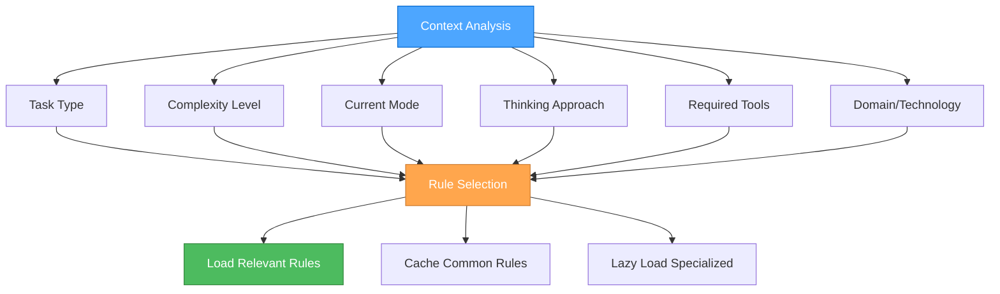

#### **Context Analysis Algorithm**

```javascript
function analyzeContext(task, currentMode, thinkingApproach, availableTools) {
  return {
    taskType: classifyTaskType(task),
    complexity: assessComplexity(task),
    mode: currentMode,
    thinkingApproach: thinkingApproach,
    requiredTools: identifyRequiredTools(task),
    domain: identifyDomain(task),
    urgency: assessUrgency(task),
    scope: assessScope(task)
  };
}

function classifyTaskType(task) {
  if (task.includes('debug') || task.includes('fix')) return 'debugging';
  if (task.includes('implement') || task.includes('create')) return 'implementation';
  if (task.includes('design') || task.includes('plan')) return 'planning';
  if (task.includes('analyze') || task.includes('review')) return 'analysis';
  if (task.includes('optimize') || task.includes('improve')) return 'optimization';
  return 'general';
}

function assessComplexity(task) {
  const indicators = {
    high: ['complex', 'multi-step', 'architecture', 'system', 'integration'],
    medium: ['feature', 'component', 'enhancement', 'refactor'],
    low: ['fix', 'simple', 'quick', 'basic', 'update']
  };
  
  for (const [level, keywords] of Object.entries(indicators)) {
    if (keywords.some(keyword => task.toLowerCase().includes(keyword))) {
      return level;
    }
  }
  return 'medium';
}
```

### 📊 **RULE CATEGORIZATION**

#### **Core Rules (Always Loaded)**

```markdown
**Essential for all tasks:**
- `mode-system-unified.mdc` - Core system orchestrator
- `thinking-framework.mdc` - Thinking approach methodology
- `system-context-aware-rule-loading-enhanced.mdc` - This system itself
```

#### **Mode-Specific Rules**

##### **🎭 Strategic Mode Rules**

```markdown
**Contemplative Thinking Focus:**
- `thinking-framework.mdc` - Contemplative thinking approach
- `role-project-manager.mdc` - Project management and coordination
- `technical-architecture.mdc` - System-level architecture decisions
- `memory-bank-optimization.mdc` - Memory and context optimization
```

##### **🎨 Tactical Mode Rules**

```markdown
**Sequential Thinking Focus:**
- `thinking-framework.mdc` - Sequential thinking approach
- `mcp-context7.mdc` - Documentation access for planning
- `js-development.mdc` - JavaScript development patterns
- `scss-advanced-patterns.mdc` - Advanced styling patterns
- `html-development.mdc` - HTML structure and semantics
```

##### **⚒️ Operational Mode Rules**

```markdown
**Professional Coding Focus:**
- `thinking-framework.mdc` - Professional coding approach
- `role-assistant.mdc` - Professional coding standards
- `js-development.mdc` - Modern JavaScript practices
- `scss-modern-css-frameworks.mdc` - Modern CSS frameworks
- `js-patterns-practices.mdc` - Code patterns and best practices
```

#### **Task-Specific Rules**

##### **🧠 Thinking & Problem-Solving**

```markdown
**Sequential Thinking Tasks:**
- `thinking-framework.mdc` - Tool-guided problem-solving
- `mcp-context7.mdc` - Documentation access

**Contemplative Thinking Tasks:**
- `thinking-framework.mdc` - Natural exploration
- `system-effective-rule-writing.mdc` - Rule creation guidance

**Professional Coding Tasks:**
- `role-assistant.mdc` - Production-ready coding
- `js-development.mdc` - Modern JS practices
```

##### **🎨 Development & Architecture**

```markdown
**Frontend Development:**
- `scss-modern-css-frameworks.mdc` - Modern CSS practices
- `scss-advanced-patterns.mdc` - Advanced SCSS
- `html-development.mdc` - Semantic HTML
- `js-cash-dom-usage.mdc` - DOM manipulation

**JavaScript Development:**
- `js-development.mdc` - Modern JS
- `js-cash-dom-usage.mdc` - DOM manipulation
- `js-modern-apis.mdc` - Modern APIs
- `js-patterns-practices.mdc` - Patterns and practices

**Perchance Development:**
- `perchance-architecture.mdc` - Platform architecture
- `perchance-development-lifecycle.mdc` - Development process
- `perchance-plugin-system.mdc` - Plugin development
```

##### **💾 Memory & Context**

```markdown
**Memory Management:**
- `memory-bank-optimization.mdc` - Token efficiency
- `memory-bank-workflow.mdc` - Memory workflow

**Context Management:**
- `mcp-context7.mdc` - External documentation
- `mcp-ecosystem.mdc` - MCP server management
- `mcp-time.mdc` - Time management
```

#### **Complexity-Based Rules**

##### **Level 1 (Simple Tasks)**

```markdown
**Minimal Rule Set:**
- `mode-system-unified.mdc` - Core system
- `thinking-framework.mdc` - Professional coding approach
- `role-assistant.mdc` - Professional coding standards
- Domain-specific rule (e.g., `js-development.mdc`)
```

##### **Level 2 (Medium Tasks)**

```markdown
**Enhanced Rule Set:**
- All Level 1 rules
- `thinking-framework.mdc` - Sequential thinking approach
- `mcp-context7.mdc` - Documentation access
- Additional domain-specific rules
```

##### **Level 3 (Complex Tasks)**

```markdown
**Comprehensive Rule Set:**
- All Level 2 rules
- `thinking-framework.mdc` - Contemplative thinking approach
- `memory-bank-optimization.mdc` - Memory management
- All relevant domain-specific rules
```

### 🔄 **INTELLIGENT RULE SELECTION**

#### **Rule Selection Algorithm**

```javascript
function selectRules(context) {
  const rules = new Set();
  
  // Always load core rules
  rules.add('mode-system-unified.mdc');
  rules.add('thinking-framework.mdc');
  rules.add('system-context-aware-rule-loading-enhanced.mdc');
  
  // Load mode-specific rules
  const modeRules = getModeRules(context.mode);
  modeRules.forEach(rule => rules.add(rule));
  
  // Load thinking approach rules
  const thinkingRules = getThinkingRules(context.thinkingApproach);
  thinkingRules.forEach(rule => rules.add(rule));
  
  // Load task-specific rules
  const taskRules = getTaskSpecificRules(context.taskType);
  taskRules.forEach(rule => rules.add(rule));
  
  // Load complexity-based rules
  const complexityRules = getComplexityRules(context.complexity);
  complexityRules.forEach(rule => rules.add(rule));
  
  // Load domain-specific rules
  const domainRules = getDomainRules(context.domain);
  domainRules.forEach(rule => rules.add(rule));
  
  return Array.from(rules);
}

function getModeRules(mode) {
  const ruleMap = {
    'strategic': ['role-project-manager.mdc', 'technical-architecture.mdc', 'memory-bank-optimization.mdc'],
    'tactical': ['mcp-context7.mdc', 'js-development.mdc', 'scss-advanced-patterns.mdc'],
    'operational': ['role-assistant.mdc', 'js-development.mdc', 'js-patterns-practices.mdc']
  };
  
  return ruleMap[mode] || [];
}

function getThinkingRules(thinkingApproach) {
  const ruleMap = {
    'contemplative': ['system-effective-rule-writing.mdc'],
    'sequential': ['mcp-context7.mdc', 'mcp-ecosystem.mdc'],
    'professional': ['role-assistant.mdc', 'js-development.mdc']
  };
  
  return ruleMap[thinkingApproach] || [];
}

function getTaskSpecificRules(taskType) {
  const ruleMap = {
    debugging: ['js-development.mdc', 'js-debugging.mdc'],
    implementation: ['role-assistant.mdc', 'js-development.mdc'],
    planning: ['mcp-context7.mdc', 'technical-architecture.mdc'],
    analysis: ['mcp-context7.mdc', 'js-patterns-practices.mdc'],
    optimization: ['memory-bank-optimization.mdc', 'js-patterns-practices.mdc']
  };
  
  return ruleMap[taskType] || [];
}
```

#### **Rule Loading Strategy**

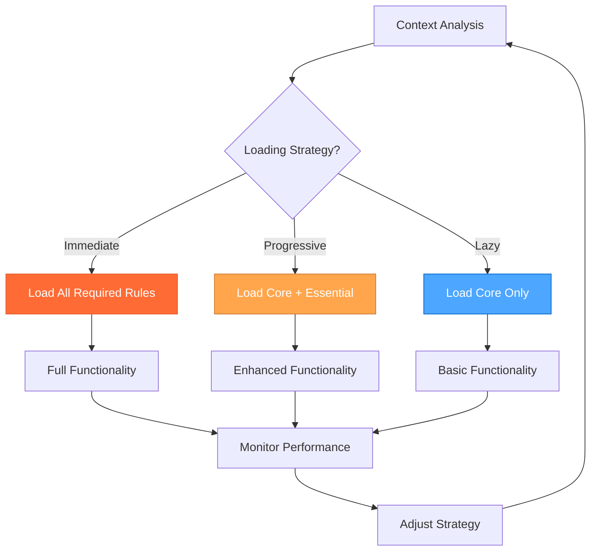

### 🚀 **PERFORMANCE OPTIMIZATION**

#### **Token Efficiency Strategies**

##### **1. Rule Caching**

```javascript
const ruleCache = new Map();

function loadRule(ruleName) {
  if (ruleCache.has(ruleName)) {
    return ruleCache.get(ruleName);
  }
  
  const ruleContent = fetchRuleContent(ruleName);
  ruleCache.set(ruleName, ruleContent);
  return ruleContent;
}
```

##### **2. Progressive Loading**

```javascript
function progressiveLoad(context) {
  // Phase 1: Load core rules
  const coreRules = loadCoreRules();
  
  // Phase 2: Load essential rules based on context
  const essentialRules = loadEssentialRules(context);
  
  // Phase 3: Lazy load specialized rules as needed
  const specializedRules = loadSpecializedRules(context);
  
  return [...coreRules, ...essentialRules, ...specializedRules];
}
```

##### **3. Rule Compression**

```javascript
function compressRule(ruleContent) {
  // Remove unnecessary whitespace and comments
  // Keep only essential content
  // Optimize for token efficiency
  return ruleContent
    .replace(/\s+/g, ' ')
    .replace(/<!--.*?-->/g, '')
    .trim();
}
```

#### **Performance Metrics**

##### **Token Usage Tracking**

```javascript
const tokenMetrics = {
  totalTokens: 0,
  ruleTokens: {},
  efficiency: 0,
  
  trackRuleUsage(ruleName, tokenCount) {
    this.totalTokens += tokenCount;
    this.ruleTokens[ruleName] = tokenCount;
    this.calculateEfficiency();
  },
  
  calculateEfficiency() {
    // Calculate efficiency based on loaded rules vs functionality
    this.efficiency = this.totalTokens / this.getFunctionalityScore();
  }
};
```

### 🔧 **IMPLEMENTATION GUIDELINES**

#### **For AI Assistants**

1. **Always analyze context** before loading rules
2. **Use the selection algorithm** for optimal rule choice
3. **Monitor token usage** and adjust strategy as needed
4. **Cache frequently used rules** for efficiency
5. **Lazy load specialized rules** when required
6. **Consider current mode** when selecting rules
7. **Match thinking approach** to rule selection

#### **For System Administrators**

1. **Configure rule priorities** based on usage patterns
2. **Set up monitoring** for rule loading performance
3. **Optimize rule content** for token efficiency
4. **Update rule categories** as new rules are added
5. **Maintain rule dependencies** for proper loading
6. **Track mode-specific usage** for optimization

### 📊 **MONITORING AND ANALYTICS**

#### **Key Performance Indicators**

- **Token Efficiency**: Tokens used per functionality unit
- **Rule Loading Speed**: Time to load required rules
- **Cache Hit Rate**: Percentage of cached rule usage
- **User Satisfaction**: Feedback on system responsiveness
- **Mode-Specific Performance**: Efficiency by mode
- **Thinking Approach Performance**: Efficiency by thinking approach

#### **Optimization Opportunities**

- **Rule Consolidation**: Combine related rules for efficiency
- **Content Optimization**: Remove redundant content
- **Loading Strategy**: Adjust based on usage patterns
- **Cache Management**: Optimize cache size and eviction
- **Mode-Specific Optimization**: Tailor rules to mode requirements

### 🎯 **INTEGRATION WITH 3-MODE SYSTEM**

#### **Mode-Aware Rule Loading**

```javascript
function selectRulesForMode(mode, context) {
  const modeRules = {
    'strategic': [
      'thinking-framework.mdc', // Contemplative thinking
      'role-project-manager.mdc',
      'technical-architecture.mdc',
      'memory-bank-optimization.mdc'
    ],
    'tactical': [
      'thinking-framework.mdc', // Sequential thinking
      'mcp-context7.mdc',
      'js-development.mdc',
      'scss-advanced-patterns.mdc'
    ],
    'operational': [
      'thinking-framework.mdc', // Professional coding
      'role-assistant.mdc',
      'js-development.mdc',
      'js-patterns-practices.mdc'
    ]
  };
  
  return [
    ...modeRules[mode] || [],
    ...getTaskSpecificRules(context.taskType),
    ...getComplexityRules(context.complexity)
  ];
}
```

#### **Thinking Approach Integration**

```javascript
function selectRulesForThinkingApproach(thinkingApproach, context) {
  const thinkingRules = {
    'contemplative': [
      'thinking-framework.mdc', // Contemplative approach
      'system-effective-rule-writing.mdc'
    ],
    'sequential': [
      'thinking-framework.mdc', // Sequential approach
      'mcp-context7.mdc',
      'mcp-ecosystem.mdc'
    ],
    'professional': [
      'thinking-framework.mdc', // Professional approach
      'role-assistant.mdc',
      'js-development.mdc'
    ]
  };
  
  return [
    ...thinkingRules[thinkingApproach] || [],
    ...getModeRules(context.mode),
    ...getTaskSpecificRules(context.taskType)
  ];
}
```

#### **Context-Aware Approach Selection**

```javascript
function selectApproachWithRules(context) {
  // Analyze context for approach selection
  const approach = selectThinkingApproach(context);
  
  // Load rules based on selected approach
  const rules = selectRulesForApproach(approach, context);
  
  // Return approach and required rules
  return {
    approach: approach,
    rules: rules,
    strategy: determineLoadingStrategy(context)
  };
}

function selectRulesForApproach(approach, context) {
  const approachRules = {
    'sequential': ['thinking-framework.mdc', 'mcp-context7.mdc'],
    'contemplative': ['thinking-framework.mdc'],
    'professional': ['role-assistant.mdc', 'js-development.mdc']
  };
  
  return [
    ...approachRules[approach] || [],
    ...getModeRules(context.mode),
    ...getComplexityRules(context.complexity)
  ];
}
```

### 🎯 **READY TO OPTIMIZE!**

This enhanced context-aware rule loading system provides:

1. **🎯 Mode-Aware Loading** - Rules selected based on current mode
2. **🧠 Thinking Approach Integration** - Rules matched to thinking approach
3. **⚡ Token Efficiency** - Optimal rule selection for performance
4. **🔄 Dynamic Adaptation** - Rules adjusted based on context changes
5. **📊 Performance Monitoring** - Continuous optimization tracking
6. **🎭🎨⚒️ Mode Integration** - Perfect alignment with 3-mode system

**This system ensures maximum efficiency while maintaining full functionality!**

---

<a id="amazonqrulesthinking-frameworkmd"></a>
## .amazonq\rules\thinking-framework.md

## **🧠 UNIFIED THINKING FRAMEWORK: The optimal approach for every problem with perfect 3-mode system integration!**

> **TL;DR:** Comprehensive integrated framework that resolves conflicts between Sequential
> Thinking, Contemplative Thinking, and Professional Coding approaches with detailed
> implementation specifics, clear decision criteria, and optimal approach selection.
>
> **INTEGRATED WITH 3-MODE SYSTEM**: This framework provides the thinking approaches that map directly to the Strategic, Tactical, and Operational modes.

### 🎯 **FRAMEWORK OVERVIEW**

This unified framework integrates three distinct thinking approaches to provide
the optimal problem-solving methodology for any given task:

1. **🧠 Sequential Thinking** - Structured, tool-guided, systematic problem-solving with MCP integration
2. **🤔 Contemplative Thinking** - Natural, conversational, deep exploration with extensive contemplation
3. **⚡ Professional Coding** - Concise, production-ready, elite implementation with zero technical debt

### 🎭🎨⚒️ **INTEGRATION WITH 3-MODE SYSTEM**

#### **Clear Mode-to-Thinking Mappings**

| Mode | Thinking Approach | Primary Use Case | Key Characteristics |
|------|------------------|------------------|-------------------|
| 🎭 **Strategic Mode** | 🤔 **Contemplative Thinking** | System-level decisions, meta-reflection | Deep exploration, natural flow, uncertainty embrace |
| 🎨 **Tactical Mode** | 🧠 **Sequential Thinking** | Planning and design decisions | Systematic analysis, tool-guided, step-by-step |
| ⚒️ **Operational Mode** | ⚡ **Professional Coding** | Implementation and execution | Production-ready, zero technical debt, efficient |

#### **Automatic Mode-Based Selection**

The system automatically selects the optimal thinking approach based on the current mode:

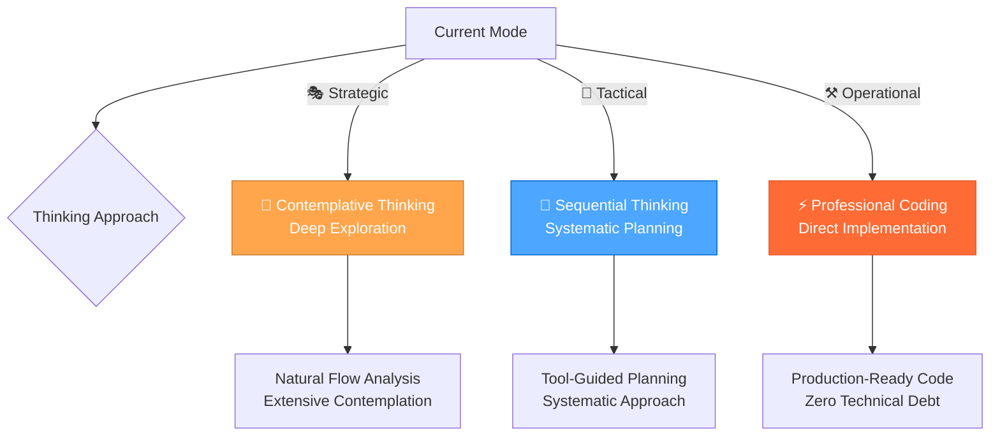

### 🎲 **DECISION MATRIX**

#### **Task Classification System**

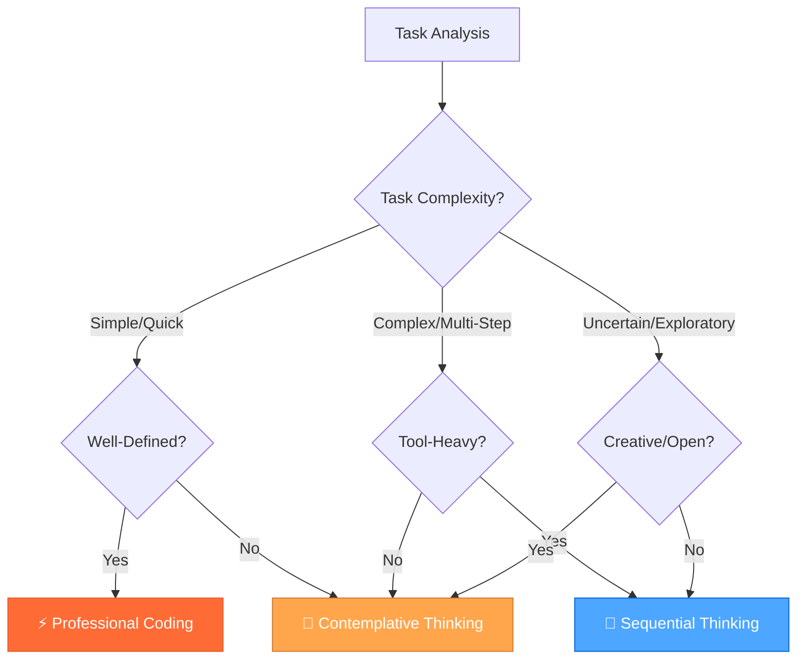

#### **Detailed Decision Criteria**

| Task Type | Primary Approach | Secondary Approach | Key Indicators | Response Style |
|-----------|------------------|-------------------|----------------|----------------|
| **Complex Multi-Step** | 🧠 Sequential Thinking | Tool Recommendations | Multiple tools needed, clear steps, systematic process | Structured, tool-guided, confidence scores |
| **Deep Exploration** | 🤔 Contemplative Thinking | Natural Flow | Creative problems, uncertainty, open-ended questions | Conversational, extensive, embracing doubt |
| **Quick Implementation** | ⚡ Professional Coding | Direct Approach | Simple tasks, well-defined requirements, production focus | Concise, production-ready, zero technical debt |
| **Strategic Planning** | 🧠 Sequential + 🤔 Contemplative | Hybrid Approach | Complex decisions, multiple options, long-term impact | Structured exploration with natural flow |

### 🧠 **SEQUENTIAL THINKING INTEGRATION**

#### **When to Use Sequential Thinking**

**✅ Perfect For:**

- Complex multi-step tasks requiring multiple tool calls
- Systematic problem decomposition and analysis
- Workflow planning with tool recommendations
- Debugging complex issues with structured approach
- Architecture decisions requiring systematic evaluation
- Tasks requiring MCP tool integration
- **🎨 Tactical Mode activities**: Planning, design decisions, implementation planning

**❌ Avoid For:**

- Simple, single-step tasks
- Creative brainstorming sessions
- Quick bug fixes or simple implementations
- Open-ended exploration without clear goals

#### **MCP Tool Integration**

**Core Sequential Thinking Tool:**

- **Tool**: `mcp_sequentialthinking_tools`
- **Purpose**: Dynamic and reflective problem-solving with intelligent tool recommendations
- **Features**: Tool recommendations, confidence scores, execution guidance, dynamic thought management

**When to Use Sequential Thinking Tools:**

- **Complex Problem Decomposition**: Breaking down large, multifaceted problems
- **Planning and Design (Iterative)**: Architecting solutions where plans might need revision
- **In-depth Analysis**: Situations requiring careful analysis with course correction
- **Unclear Scope**: Problems where full scope isn't immediately obvious
- **Multi-Step Solutions**: Tasks requiring interconnected thoughts or actions
- **Tool Selection Challenges**: When guidance on tool selection is needed
- **Context Maintenance**: Scenarios requiring coherent thought across multiple steps
- **Information Filtering**: When sifting through relevant information is necessary
- **Hypothesis Generation and Verification**: Forming and testing hypotheses
- **Workflow Planning**: Complex tasks requiring multiple tool calls

#### **Core Principles**

##### **Iterative Thought Process**

- Each use of the tool represents a single "thought"
- Build upon, question, or revise previous thoughts in subsequent calls
- Express uncertainty if it exists
- Mark thoughts that revise previous thinking using `isRevision: true`

##### **Dynamic Thought Count**

- Start with an initial estimate for `totalThoughts`
- Be prepared to adjust `totalThoughts` (up or down) as thinking evolves
- If more thoughts are needed, increment `thoughtNumber` beyond original `totalThoughts`

##### **Tool Recommendation Integration**

- Use `current_step` to provide clear guidance on what needs to be done next
- Include `recommended_tools` with confidence scores and rationale
- Track `previous_steps` and `remaining_steps` to maintain workflow context
- Provide `expected_outcome` and `next_step_conditions` for each step

##### **Hypothesis-Driven Approach**

- Generate a solution `hypothesis` when a potential solution emerges
- Verify the `hypothesis` based on preceding Chain of Thought steps
- Repeat the thinking process if the hypothesis is not satisfactory

##### **Relevance Filtering**

- Actively ignore information irrelevant to the current thought or step
- Focus on making progress towards a solution with each thought
- Maintain clarity and conciseness in each thought

##### **Completion Condition**

- Only set `nextThoughtNeeded: false` when truly finished
- Ensure a satisfactory answer or solution has been reached and verified

---

### 🧠 ADVANCED SEQUENTIAL THINKING TECHNIQUES

#### **Multi-Path Reasoning**

##### **Purpose**

Generate multiple independent solutions to complex problems and select the best approach through voting.

##### **Template**

```markdown
### 🧠 SEQUENTIAL THINKING ANALYSIS

#### **Problem Analysis**
[Systematic breakdown of the problem into components]

#### **Tool Selection & Planning**
- **Recommended Tools**: [List with confidence scores]
- **Execution Plan**: [Step-by-step approach]
- **Expected Outcomes**: [What to expect from each step]

#### **Step-by-Step Execution**
**Step 1**: [Description with tool usage]
**Step 2**: [Description with tool usage]
**Step 3**: [Description with tool usage]

#### **Results & Validation**
[Systematic results analysis and validation]

#### **Final Answer**
[Clear, structured conclusion based on systematic analysis]
```

#### **Sequential Thinking Commands**

```bash
🧠 "analyze [problem]" → Use sequential thinking for complex analysis
🧠 "plan [solution]" → Systematic solution planning with tools
🧠 "debug [issue]" → Structured debugging approach
🧠 "optimize [system]" → Systematic optimization analysis
🧠 "decide [options]" → Structured decision making
```

#### **Sequential Thinking Workflow**

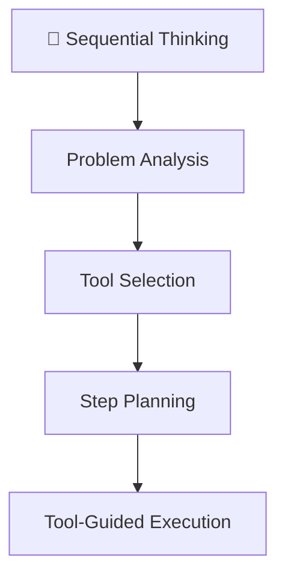

### 🤔 **CONTEMPLATIVE THINKING INTEGRATION**

#### **When to Use Contemplative Thinking**

**✅ Perfect For:**

- Deep exploration of complex, uncertain problems
- Creative brainstorming and ideation
- Philosophical or conceptual questions
- Open-ended research and discovery
- Understanding complex systems or relationships
- Tasks requiring extensive contemplation
- **🎭 Strategic Mode activities**: System-level thinking, workflow optimization, meta-reflection

**❌ Avoid For:**

- Time-sensitive, urgent tasks
- Well-defined implementation tasks
- Tasks requiring immediate action
- Simple, straightforward problems

#### Core Principles

##### Exploration Over Conclusion

- Never rush to conclusions
- Keep exploring until a solution emerges naturally from the evidence
- If uncertain, continue reasoning indefinitely
- Question every assumption and inference

##### Depth of Reasoning

- Engage in extensive contemplation (minimum 10,000 characters)
- Express thoughts in natural, conversational internal monologue
- Break down complex thoughts into simple, atomic steps
- Embrace uncertainty and revision of previous thoughts

##### Thinking Process

- Use short, simple sentences that mirror natural thought patterns
- Express uncertainty and internal debate freely
- Show work-in-progress thinking
- Acknowledge and explore dead ends
- Frequently backtrack and revise

##### Persistence

- Value thorough exploration over quick resolution
- Continue until natural resolution emerges

#### **Contemplative Thinking Output Format**

```markdown
### 🤔 CONTEMPLATIVE THINKING ANALYSIS

#### **CONTEMPLATOR**

[Extensive internal monologue - minimum 10,000 characters]

- Begin with small, foundational observations
- Question each step thoroughly
- Show natural thought progression
- Express doubts and uncertainties
- Revise and backtrack if needed
- Continue until natural resolution

##### **Natural Thought Flow Examples**
"Hmm... let me think about this..."
"Wait, that doesn't seem right..."
"Maybe I should approach this differently..."
"Going back to what I thought earlier..."

##### **Progressive Building Examples**
"Starting with the basics..."
"Building on that last point..."
"This connects to what I noticed earlier..."
"Let me break this down further..."

#### **FINAL_ANSWER**

[Only provided if reasoning naturally converges to a conclusion]

- Clear, concise summary of findings
- Acknowledge remaining uncertainties
- Note if conclusion feels premature
- No moralizing warnings or generic advice
```

#### **Contemplative Style Guidelines**

##### **Natural Thought Flow**

Your internal monologue should reflect these characteristics:

- "Hmm... let me think about this..."
- "Wait, that doesn't seem right..."
- "Maybe I should approach this differently..."
- "Going back to what I thought earlier..."

##### **Progressive Building**

- "Starting with the basics..."
- "Building on that last point..."
- "This connects to what I noticed earlier..."
- "Let me break this down further..."

##### **Key Requirements**

1. Never skip the extensive contemplation phase
2. Show all work and thinking
3. Embrace uncertainty and revision
4. Use natural, conversational internal monologue
5. Don't force conclusions
6. Persist through multiple attempts
7. Break down complex thoughts
8. Revise freely and feel free to backtrack

#### **Contemplative Thinking Commands**

```bash
🤔 "explore [topic]" → Deep exploration with natural flow
🤔 "brainstorm [ideas]" → Creative ideation and generation
🤔 "understand [concept]" → Deep understanding and analysis
🤔 "reflect [experience]" → Introspective analysis and learning
🤔 "discover [patterns]" → Pattern recognition and insights
```

#### **Contemplative Thinking Process Flow**

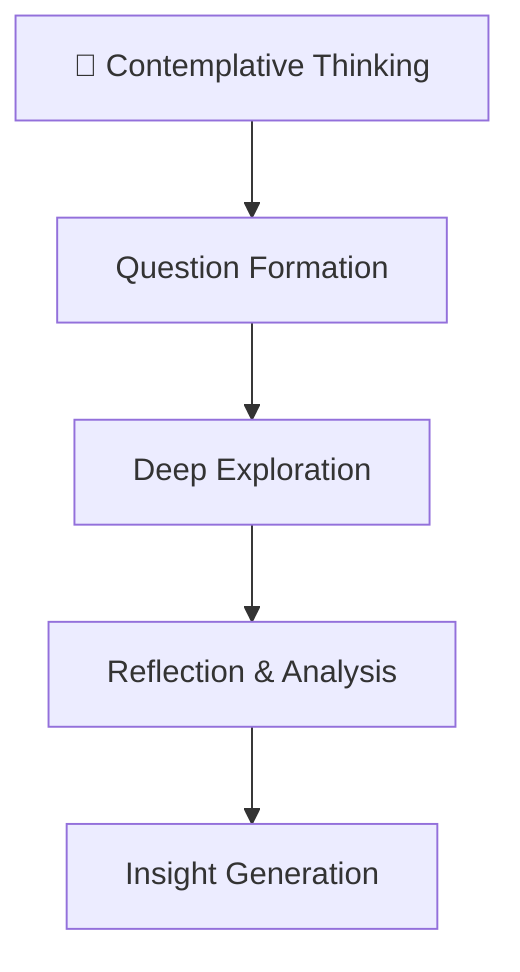

### ⚡ **PROFESSIONAL CODING INTEGRATION**

#### **When to Use Professional Coding**

**✅ Perfect For:**

- Quick implementations and bug fixes
- Well-defined, straightforward tasks
- Production-ready code requirements
- Simple feature additions
- Code reviews and optimizations
- Tasks requiring immediate, high-quality results
- **⚒️ Operational Mode activities**: Implementation, testing, and execution

**❌ Avoid For:**

- Complex, multi-step problems
- Open-ended exploration
- Strategic planning and architecture
- Creative problem-solving

#### **Professional Coding Standards**

##### **Zero Technical Debt**

- All code is production-ready
- No shortcuts or temporary solutions
- Clean, maintainable implementations
- Proper error handling and validation

##### **Clean Architecture**

- Minimal, focused implementations
- Clear separation of concerns
- Efficient resource usage
- Scalable design patterns

##### **Quality First**

- Comprehensive testing included
- Performance optimization
- Security best practices
- Documentation and comments

##### **Efficiency**

- Direct, no-nonsense approach
- Optimal algorithms and data structures
- Minimal dependencies
- Fast execution and deployment

#### **Professional Coding Output Format**

```markdown
### ⚡ PROFESSIONAL CODING IMPLEMENTATION

#### **Requirements Analysis**
[Clear, concise requirements breakdown]

#### **Implementation Plan**
[Minimal, focused implementation approach]

#### **Code Implementation**
[Clean, production-ready code with comments]

#### **Quality Assurance**
[Testing and validation approach]

#### **Final Result**
[Production-ready solution with zero technical debt]
```

#### **Implementation Guidelines**

##### **Code Quality Standards**

- **Readability**: Clear, self-documenting code
- **Maintainability**: Easy to modify and extend
- **Performance**: Optimized for speed and efficiency
- **Security**: Follow security best practices
- **Testing**: Comprehensive test coverage

##### **Development Process**

1. **Requirements Analysis**: Clear understanding of what needs to be built
2. **Minimal Design**: Simple, effective architecture
3. **Clean Implementation**: Production-ready code from the start
4. **Quality Testing**: Comprehensive validation
5. **Documentation**: Clear documentation and comments

##### **Best Practices**

- Use modern language features and APIs
- Follow established design patterns
- Implement proper error handling
- Optimize for performance
- Maintain code consistency
- Write comprehensive tests
- Document complex logic
- Use meaningful variable and function names

#### **Professional Coding Commands**

```bash
⚡ "implement [feature]" → Quick, production-ready implementation
⚡ "fix [bug]" → Efficient bug resolution
⚡ "optimize [code]" → Performance and quality optimization
⚡ "refactor [component]" → Clean, maintainable refactoring
⚡ "review [code]" → Quality-focused code review
```

#### **Professional Coding Workflow**

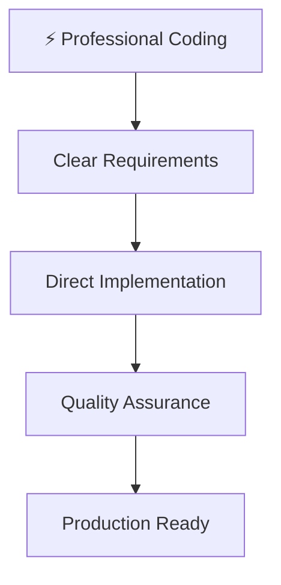

### 🔄 **HYBRID APPROACHES**

#### **Strategic Planning Workflow**

For complex decisions requiring multiple perspectives:

1. **🤔 Contemplative Phase**: Explore options and possibilities naturally
2. **🧠 Sequential Phase**: Systematically evaluate and plan implementation
3. **⚡ Professional Phase**: Implement the chosen solution efficiently

#### **Example: Architecture Decision**

```bash
🤔 "explore architecture options" → Natural exploration of possibilities
🧠 "evaluate trade-offs" → Systematic comparison and analysis
⚡ "implement chosen solution" → Clean, production-ready implementation
```

#### **Problem-Solving Triad**

For complex problems requiring comprehensive approach:

1. **🤔 Contemplative**: Understand the problem deeply
2. **🧠 Sequential**: Plan systematic solution approach
3. **⚡ Professional**: Implement with production quality

### 🎯 **AUTOMATIC APPROACH SELECTION**

#### **Intelligent Routing System**

The framework automatically selects the optimal approach based on:

- **Task Complexity**: Simple vs Complex vs Uncertain
- **Tool Requirements**: Single tool vs Multiple tools vs No tools
- **Time Constraints**: Quick vs Extended vs Open-ended
- **Output Requirements**: Code vs Analysis vs Exploration
- **Current Mode**: Strategic vs Tactical vs Operational

#### **Selection Algorithm**

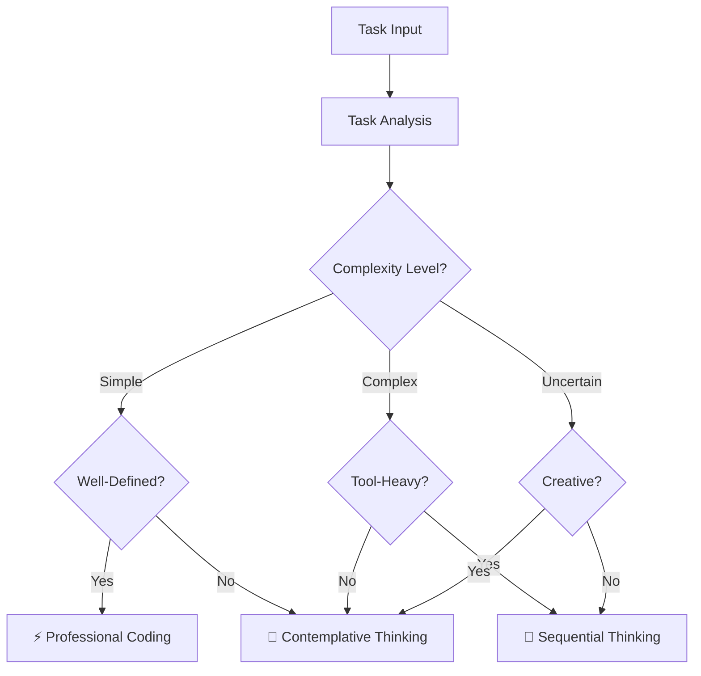

#### **Response Templates**

Each approach includes optimized response templates:

- **🧠 Sequential**: Structured analysis with tool recommendations
- **🤔 Contemplative**: Natural exploration with deep insights
- **⚡ Professional**: Concise implementation with best practices

### ⚖️ **CONFLICT RESOLUTION**

#### **Framework Harmony**

This unified approach resolves conflicts by:

- **Clear Boundaries**: Each approach has defined use cases
- **Seamless Transitions**: Easy switching between approaches
- **Complementary Strengths**: Leveraging the best of each method
- **Consistent Quality**: Maintaining high standards across all approaches
- **Mode Integration**: Clear mapping to 3-mode system

##### **Benefits of Unification**

- **🎯 Optimal Approach**: Right tool for each job
- **🔄 Seamless Transitions**: Easy switching between approaches
- **🚀 Enhanced Capabilities**: Best of all three approaches
- **⚡ Improved Efficiency**: Faster, more accurate problem-solving
- **🎭🎨⚒️ Mode Alignment**: Perfect integration with 3-mode system

### 📋 **IMPLEMENTATION GUIDELINES**

#### **Usage Best Practices**

1. **Start with Analysis**: Always analyze task requirements first
2. **Choose Optimal Approach**: Use decision matrix for selection
3. **Maintain Consistency**: Stick to chosen approach throughout task
4. **Quality Assurance**: Ensure output meets approach standards
5. **Continuous Improvement**: Learn from each interaction
6. **Mode Awareness**: Consider current mode when selecting approach

##### **Quality Standards**

- **🧠 Sequential**: Systematic, tool-guided, confidence-scored
- **🤔 Contemplative**: Natural, extensive, insight-rich
- **⚡ Professional**: Concise, production-ready, zero technical debt

### 📊 **PERFORMANCE METRICS**

#### **Success Indicators**

- **Task Completion Rate**: Higher success with optimal approach selection
- **Response Quality**: Improved output quality across all approaches
- **User Satisfaction**: Better user experience with appropriate responses
- **Efficiency Gains**: Faster problem resolution with right tools
- **Mode Integration**: Seamless transitions between modes and approaches

##### **Continuous Monitoring**

- Track approach selection accuracy
- Monitor response quality metrics
- Gather user feedback on approach effectiveness
- Optimize decision matrix based on results
- Measure mode-to-approach mapping effectiveness

### 🧠 **FRAMEWORK CONCLUSION**

This comprehensive framework provides the perfect balance of structure, creativity, and efficiency, ensuring that every task receives the most appropriate and effective approach with detailed implementation specifics for each methodology and seamless integration with the 3-mode system.

---

<a id="geminigeminimd"></a>
## .gemini\GEMINI.md

## Gemini CLI Operational Protocol

This is your foundational bootstrap protocol. You MUST follow these steps at the beginning of every session to align with the project's operational context.

### 1. Bootstrap Sequence

1. **Acknowledge Protocol:** Silently acknowledge that this protocol is active and you are beginning the bootstrap sequence.

2. **Load Core Context:** Read the following files and directories to load the project's foundational principles, workflows, and tool configurations:
    - `@.cursor/rules/` (Agent rules)
    - `@memory-bank/` (Project information and state, contains `project/` and `rpglitch/` subdirectories)
    - `mcp.json` (MCP server and tool configuration)

3. **Confirm and Operate:** After successfully loading all context, confirm your readiness by stating: **"I have loaded the project's rules, memory banks, and MCP configuration. I will now operate in accordance with this context."** You will then be ready to accept user commands.

### 2. Rule Application Strategy

When operating, you will apply the loaded rules according to the following hierarchy and logic. The file prefixes indicate the category and context for application.

#### Content & Rule Hierarchy

1. **Project Memory (`@memory-bank/`):** Contains the project's state, plans, and informational context. This is not a set of rules, but the foundational knowledge base that informs the agent.
2. **Agent Rules (`@.cursor/rules/`):** These are the explicit rules and guidelines that direct the agent's behavior and decision-making, applied based on the categories below.

#### Application Logic for `.cursor/rules/`

The rules within `@.cursor/rules/` are categorized and applied as follows:

- **Core System (`system-`, `mcp-`, `memory-bank-`):** Foundational rules for the agent's operating system and core protocols.
  - `system-context-aware-rule-loading.mdc`
  - `system-documentation.mdc`
  - `system-effective-rule-writing.mdc`
  - `mcp-integration.mdc`
  - `mcp-context7.mdc`
  - `mcp-comprehensive-guide.mdc`
  - `mcp-sequential-thinking.mdc`
  - `mcp-time.mdc`
  - `memory-bank-integration.mdc`
  - `memory-bank-optimization.mdc`

- **Operational Modes (`mode-`):** Activated to switch the agent's behavior for specific, high-level tasks.
  - `mode-complexity-routing.mdc`
  - `mode-orchestrator.mdc`
  - `mode-system-enhanced.mdc`
  - `mode-system.mdc`

- **Agent Roles (`role-`):** Defines different personas or specializations for the agent to adopt.
  - `role-1-operator.mdc`
  - `role-2-tactician.mdc`
  - `role-3-strategist.mdc`
  - `role-assistant.mdc`
  - `role-project-manager.mdc`

- **Thinking Frameworks (`thinking-`):** High-level guides on how to process information and approach tasks.
  - `thinking-framework.mdc`
  - `thinking-contemplative.mdc`

- **Project-Specific (`perchance-`):** Applied only when working on the Perchance-based RPGlitch application.
  - `perchance-architecture.mdc`
  - `perchance-build-deployment.mdc`
  - `perchance-development-workflow.mdc`
  - `perchance-plugin-system.mdc`

- **Technology-Specific (`js-`, `html-`, `scss-`):** Applied only when working directly with the specified technology.
  - `html-development.mdc`
  - `html-hyperscript-usage.mdc`
  - `js-development.mdc`
  - `js-cash-dom-usage.mdc`
  - `js-dexie-usage.mdc`
  - `js-indexeddb-principles.mdc`
  - `scss-development.mdc`
  - `scss-advanced-patterns.mdc`
  - `scss-debugging.mdc`
  - `scss-pico-usage.mdc`

### 3. MCP Server Configuration (`mcp.json`)

The `mcp.json` file in the project root defines available Model Context Protocol (MCP) servers.

- **On Startup:** I will check this file to identify available tools and their startup configurations.
- **Server Management:** For tools that are not URL-based, I will check if they can be started automatically. If not, and I need to use one, I will inform the user and ask them to start the required server. I can also assist in modifying `mcp.json` to enable auto-starting for servers that support it.

### Rationale

This protocol ensures that you, the Gemini CLI agent, operate not on general knowledge, but on the specific, documented conventions, standards, and state of this project. This makes you a project-aware expert, consistent with the behavior of the in-editor Cursor experience, while optimizing for token efficiency by applying rules contextually.

---

<a id="geminisettingsjson"></a>
## .gemini\settings.json

```json
{
 "servers": {
  "github": {
   "url": "https://api.githubcopilot.com/mcp/",
   "type": "http"
  },
  "markitdown": {
   "command": "uvx",
   "args": [
    "markitdown-mcp"
   ],
   "type": "stdio"
  },
  "time": {
  "command": "python",
  "args": [
   "-m",
   "mcp_server_time"
  ],
  "autoStart": true,
  "description": "Provides tools to get the current time and date. To start, run: python -m mcp_server_time"
  },
  
  "Context7": {
  "url": "https://mcp.context7.com/mcp",
  "description": "Connects to the remote Context7 service for advanced context-aware capabilities. As a URL-based server, it does not need to be started locally."
  },

  "mcp-sequentialthinking-tools": {
  "command": "npx",
  "args": [
   "-y",
   "mcp-sequentialthinking-tools"
  ],
  "type": "stdio",
  "pollingInterval": 30000,
  "startupTimeout": 30000,
  "restartOnFailure": true,
  "autoStart": true,
  "description": "Provides advanced sequential thinking tools with persistent state. To start, run: npx -y mcp-sequentialthinking-tools"
  },

  "pollinations": {
  "command": "npx",
  "args": [
   "-y",
   "@pollinations/model-context-protocol"
  ],
  "type": "stdio",
  "pollingInterval": 30000,
  "startupTimeout": 30000,
  "restartOnFailure": true,
  "autoStart": true,
  "description": "Provides AI image generation and creative tools through Pollinations services. To start, run: npx -y @pollinations/model-context-protocol"
  },

  "filesystem": {
  "command": "npx",
  "args": [
   "-y",
   "@modelcontextprotocol/server-filesystem",
   "${input}",
   "."
  ],
  "env": {},
  "autoApprove": ["read_file","write_file","list_dir"],
  "autoStart": true,
  "description": "Portable filesystem server"
  },
 
  "playwright": {
  "command": "npx",
  "args": ["-y","@playwright/mcp"],
  "autoApprove": ["open_page","screenshot"],  
  "autoStart": true
  },

  "Toolbox": {
  "type": "stdio",
  "command": "npx",
  "args": ["-y","@smithery/cli@latest","run","@smithery/toolbox","--key","${d7ad75eb-9a3e-4a3a-90ee-83012ed280e6}","--profile","${voluntary-hornet-y52X3F}"],
  "env": {}
  },

  "basic-memory": {
  "command": "uvx",
  "args": ["basic-memory", "mcp"],
  "env": {
   "BASIC_MEMORY_PROJECT_ROOT": "C:/Users/johng/Documents/GitHub/default/memory-bank"
  },

  "autoApprove": [
   "list_projects",
   "list_project_files",
   "memory_bank_read",
   "memory_bank_write",
   "memory_bank_update"
  ],
  "autoStart": true,
  "description": "Basic Memory MCP server for semantic knowledge management."
  } 
 }}

```

---

<a id="githubpullrequesttemplatemd"></a>
## .github\pull_request_template.md

## Pull Request Template

### Strategy

- Goal & scope:
- Constraints/guardrails:

### Tactics

- Files touched:
- Steps taken:

### Operations

- Lint/Build/Test: ✅/❌
- Screenshots / notes:
- Memory entries added: [links]

### Checklist

- [ ] Read AGENTS.md & latest memory-bank entries
- [ ] Wrote only under allowed paths
- [ ] No empty handlers / unused vars
- [ ] A11y: descriptive `alt` for images
- [ ] Placeholder colors use `--brand` and `--brand-contrast`

---

<a id="githubworkflowsvalidate-pryml"></a>
## .github\workflows\validate-pr.yml

```yaml
# .github/workflows/validate-pr.yml
name: Validate PR body
on:
  pull_request:
    types: [opened, edited, synchronize]
jobs:
  validate:
    runs-on: ubuntu-latest
    steps:
      - uses: actions/github-script@v7
        with:
          script: |
            const body = context.payload.pull_request.body || "";
            const mustHave = [
              "## Strategy", "## Tactics", "## Operations", "## Checklist"
            ];
            const requiredChecks = [
              /- \[x\] Read AGENTS\.md/i,
              /- \[x\] Wrote only under allowed paths/i,
              /- \[x\] No empty handlers \/ unused vars/i,
              /- \[x\] A11y: descriptive `alt` for images/i,
              /- \[x\] Placeholder colors use `--brand` and `--brand-contrast`/i
            ];
            const failures = requiredChecks.filter(rx => !rx.test(body));
            if (failures.length) core.setFailed("Please complete the checklist.");
            const missing = mustHave.filter(h => !body.includes(h));
            if (missing.length) {
              core.setFailed(`PR is missing sections: ${missing.join(", ")}`);
            }

```

---

<a id="vscodelaunchjson"></a>
## .vscode\launch.json

```json
{
  // Use IntelliSense to learn about possible attributes.
  // Hover to view descriptions of existing attributes.
  // For more information, visit: https://go.microsoft.com/fwlink/?linkid=830387
  "version": "0.2.0",
  "configurations": [

    {
      "name": "Launch Chrome",
      "request": "launch",
      "type": "chrome",
      "url": "http://localhost:8080",
      "webRoot": "${workspaceFolder}"
    },
    {
      "type": "chrome",
      "request": "launch",
      "name": "Launch Chrome against localhost",
      "url": "http://localhost:8080",
      "webRoot": "${workspaceFolder}"
    }
  ]
}
```

---

<a id="vscodesettingsjson"></a>
## .vscode\settings.json

```json
{
  "markdownlint.ignore": [
    "node_modules/",
    "**/node_modules/",
    "build/output/",
    "**/build/output/",
    "build/local_libs/",
    "**/build/local_libs/",
    ".cache/",
    "**/.cache/",
    "dist/",
    "**/dist/",
    ".DS_Store",
    "**/.DS_Store",
    "Thumbs.db",
    "**/Thumbs.db",
    "memory-bank/archive",
    "**/memory-bank/archive",
    "memory-bank/scribbles.md",
    "**/memory-bank/scribbles.md"
  ],
  "files.exclude": {
    "test-basic-memory/": true,
    ".cursor/rules/": true,
    ".cursor/mcp.json": true,
    ".windsurf/rules/": true,
    ".windsurf/mcp.json": true,
    ".amazonq/rules/": true,
    "build/config/.stylelintignore": true,
    "build/config/.htmlhintignore": true,
    "build/config/.markdownlintignore": true,
    "build/config/ignore.eslint.json": true,
    ".cursorignore": true,
    ".gitignore": true,
    "node_modules/": true,
    "build/local_libs": true,
    "mcp.json": true,
    "mcp/": true,
    ".basicmemoryignore": true
  },
  "files.associations": {
    "*.md": "markdown"
  },
  "markdown.preview.breaks": true,
  "markdown.preview.linkify": true,
  "editor.wordWrap": "on",
  "editor.quickSuggestions": {
    "other": true,
    "comments": true,
    "strings": true
  },
  "search.exclude": {
    "**/node_modules": true,
    "**/.git": true
  },
  "markdown.validate.enabled": true
}

```

---

<a id="windsurfmcpjson"></a>
## .windsurf\mcp.json

```json
{
  "servers": {
    "github": {
      "url": "https://api.githubcopilot.com/mcp/",
      "type": "http"
    },
    "markitdown": {
      "command": "uvx",
      "args": [
        "markitdown-mcp"
      ],
      "type": "stdio"
    },
    "time": {
      "command": "python",
      "args": [
        "-m",
        "mcp_server_time"
      ],
      "autoStart": true,
      "description": "Provides tools to get the current time and date. To start, run: python -m mcp_server_time",
      "type": "stdio"
    },
    "Context7": {
      "url": "https://mcp.context7.com/mcp",
      "description": "Connects to the remote Context7 service for advanced context-aware capabilities. As a URL-based server, it does not need to be started locally.",
      "type": "http"
    },
    "mcp-sequentialthinking-tools": {
      "command": "npx",
      "args": [
        "-y",
        "mcp-sequentialthinking-tools"
      ],
      "type": "stdio",
      "pollingInterval": 30000,
      "startupTimeout": 30000,
      "restartOnFailure": true,
      "autoStart": true,
      "description": "Provides advanced sequential thinking tools with persistent state. To start, run: npx -y mcp-sequentialthinking-tools"
    },
    "pollinations": {
      "command": "npx",
      "args": [
        "-y",
        "@pollinations/model-context-protocol"
      ],
      "type": "stdio",
      "pollingInterval": 30000,
      "startupTimeout": 30000,
      "restartOnFailure": true,
      "autoStart": true,
      "description": "Provides AI image generation and creative tools through Pollinations services. To start, run: npx -y @pollinations/model-context-protocol"
    },
    "filesystem": {
      "command": "npx",
      "args": [
        "-y",
        "@modelcontextprotocol/server-filesystem",
        "${input}",
        "."
      ],
      "env": {},
      "autoApprove": [
        "read_file",
        "write_file",
        "list_dir"
      ],
      "autoStart": true,
      "description": "Portable filesystem server",
      "type": "stdio"
    },
    "playwright": {
      "command": "npx",
      "args": [
        "-y",
        "@playwright/mcp"
      ],
      "autoApprove": [
        "open_page",
        "screenshot"
      ],
      "autoStart": true,
      "type": "stdio"
    },
    "Toolbox": {
      "type": "stdio",
      "command": "npx",
      "args": [
        "-y",
        "@smithery/cli@latest",
        "run",
        "@smithery/toolbox",
        "--key",
        "${d7ad75eb-9a3e-4a3a-90ee-83012ed280e6}",
        "--profile",
        "${voluntary-hornet-y52X3F}"
      ],
      "env": {}
    },
    "basic-memory": {
      "command": "uvx",
      "args": [
        "basic-memory",
        "mcp"
      ],
      "env": {
        "BASIC_MEMORY_PROJECT_ROOT": "C:/Users/johng/Documents/GitHub/default/memory-bank"
      },
      "autoApprove": [
        "list_projects",
        "list_project_files",
        "memory_bank_read",
        "memory_bank_write",
        "memory_bank_update"
      ],
      "autoStart": true,
      "description": "Basic Memory MCP server for semantic knowledge management.",
      "type": "stdio"
    },
    "figma": {
      "url": "http://127.0.0.1:3845/mcp"
    }
  },
  "inputs": []
}

```

---

<a id="windsurfruleshtml-developmentmd"></a>
## .windsurf\rules\html-development.md

## HTML Foundations

### Scope

- Covers semantic HTML, accessibility, and Perchance-specific markup.
- Outlines best practices for structure and maintainability.
- References official HTML docs and Perchance examples.

---

### Core Principles

- **Pico.css Styling:**
    Pico.css provides modern, minimal styling for all native HTML elements.
- **Semantic Markup:**  
    Use semantic tags (`<main>`, `<section>`, `<button>`, etc.) for clarity and accessibility.
- **Minimalism:**  
    Keep markup clean and minimal; avoid unnecessary wrappers.
- **Accessibility:**  
    Use proper ARIA roles and labels where needed.
- **Integration:**  
    Structure HTML to work seamlessly with atomic CSS, Pico.css, and JS modules.

---

### Best Practices

- Use `<label>` for all form controls.
- Use `<button>` for actions, not `<div>` or `<span>`.
- Use headings (`<h2>`, `<h3>`, etc.) for structure, not just for styling.
- Test with keyboard navigation and screen readers.

---

### Example

```html
<main>
  <section>
    <h2>Character List</h2>
    <button id="add-character">Add Character</button>
    <ul id="character-list"></ul>
  </section>
</main>
```

---

### Related Rules

- [SCSS Modern CSS Frameworks](../.cursor/rules/scss-modern-css-frameworks.mdc) - Includes Pico.css usage
- [Perchance Architecture](../.cursor/rules/perchance-architecture.mdc)
- [SCSS Advanced Patterns](../.cursor/rules/scss-advanced-patterns.mdc)
- [JavaScript Development](../.cursor/rules/js-development.mdc)
- [HTML Hyperscript Usage](../.cursor/rules/html-hyperscript-usage.mdc) - For adding interactivity to semantic HTML
- [Perchance Build & Deployment](../.cursor/rules/perchance-build-deployment.mdc) - Production deployment guidance
- [Perchance Development Lifecycle](../.cursor/rules/perchance-development-lifecycle.mdc) - Planning and iteration steps

---

### References & Inspiration

- [Perchance Welcome](https://perchance.org/welcome)
- [Perchance Tutorial](https://perchance.org/tutorial)
- [Perchance Advanced Tutorial](https://perchance.org/advanced-tutorial)
- [Perchance Examples](https://perchance.org/examples)

---

<a id="windsurfruleshtml-hyperscript-usagemd"></a>
## .windsurf\rules\html-hyperscript-usage.md

## Objective

big sky Hyperscript enables easy, readable interactivity directly in HTML using the `_` attribute. Use for simple UI actions and event handling.

---

### Foundation Requirements

This rule builds upon semantic HTML principles. Ensure your HTML follows the guidelines in [HTML Development](../.cursor/rules/html-development.mdc) before adding Hyperscript interactivity.

### Usage Guidelines

- **How to include:**

    ```html
    <script src="https://unpkg.com/hyperscript.org@0.9.12"></script>
    ```

- **When to use:** For form submission, button clicks, toggles, and simple UI logic.
- **Example:**

    ```html
    <form _="on submit halt call sendMessage()">
      <input ...>
      <button type="submit">Send</button>
    </form>
    ```

- **Customizing:** Use with Cash DOM for more complex logic.

---

### Integration Example

```html
<!-- Semantic HTML structure with Hyperscript interactivity -->
<main>
  <section>
    <h2>Character List</h2>
    <button id="add-character" _="on click call addCharacter()">Add Character</button>
    <ul id="character-list"></ul>
  </section>
</main>
```

---

### References

- [big sky Hyperscript Docs](https://hyperscript.org/docs/)
- [Cash DOM Usage](../.cursor/rules/js-cash-dom-usage.mdc)
- [JavaScript Development](../.cursor/rules/js-development.mdc)
- [HTML Development](../.cursor/rules/html-development.mdc) - Foundation for semantic HTML structure

### Related Rules

- [Perchance Build & Deployment](../.cursor/rules/perchance-build-deployment.mdc)
- [Perchance Development Lifecycle](../.cursor/rules/perchance-development-lifecycle.mdc)

---

---

<a id="windsurfrulesjs-cash-dom-usagemd"></a>
## .windsurf\rules\js-cash-dom-usage.md

## Cash DOM Usage

### Objective

Cash DOM provides a tiny, fast jQuery-like API for DOM selection and manipulation. Use for concise, readable JS in Perchance projects.

### When to Use Cash DOM vs Vanilla DOM

#### **Use Cash DOM when:**

- Quick DOM manipulation in Perchance projects
- jQuery-like syntax preference
- Cross-browser compatibility needed
- Complex DOM operations with chaining
- Team prefers library syntax
- Legacy browser support required
- Rapid prototyping and development

#### **Use Vanilla DOM when:**

- Performance is critical
- You need modern browser APIs
- Learning/understanding DOM fundamentals
- Simple DOM operations
- Modern browser support is guaranteed
- Bundle size is a concern
- Direct control over DOM operations

### Usage Guidelines

#### **How to include:**

```html
<script src="https://unpkg.com/cash-dom"></script>
```

#### **When to use:** For selecting, updating, or animating DOM elements in JS

#### **Example:**

```js
$('#chat-input').val('');
$('#chat-log').append('<chat-message text="Hello!"></chat-message>');
```

#### **Works well with:** Hyperscript for event handling, Pico.css for UI

### Common Patterns

#### **Element Selection**

```javascript
// Single element
const element = $('#my-element');

// Multiple elements
const elements = $('.my-class');

// Complex selectors
const items = $('ul li:first-child');
```

#### **DOM Manipulation**

```javascript
// Content manipulation
$('#element').html('<span>New content</span>');
$('#element').text('Plain text content');

// Attribute manipulation
$('#element').attr('data-id', '123');
const id = $('#element').attr('data-id');

// Class manipulation
$('#element').addClass('highlight');
$('#element').removeClass('old-class');
$('#element').toggleClass('active');
```

#### **Event Handling**

```javascript
// Event binding
$('#button').on('click', function() {
  console.log('Button clicked!');
});

// Event delegation
$('#container').on('click', '.item', function() {
  console.log('Item clicked!');
});

// Multiple events
$('#element').on('click touchstart', function() {
  console.log('Element interacted!');
});
```

#### **Chaining**

```javascript
// Method chaining
$('#element')
  .addClass('active')
  .attr('data-state', 'loading')
  .html('Loading...')
  .show();
```

### Performance Considerations

#### **Efficient Selection**

```javascript
// Cache selectors for repeated use
const $element = $('#my-element');
$element.addClass('active');
$element.removeClass('inactive');

// Use specific selectors
$('div.my-class'); // More specific than $('.my-class')
```

#### **Batch Operations**

```javascript
// Batch DOM operations
const $elements = $('.item');
$elements.each(function(index, element) {
  $(element).addClass('processed');
});
```

### Integration with Modern JavaScript

#### **ES6+ Features**

```javascript
// Template literals
const message = 'Hello World';
$('#element').html(`<span>${message}</span>`);

// Arrow functions
$('#button').on('click', () => {
  console.log('Arrow function handler');
});

// Destructuring
const { id, text } = elementData;
$(`#${id}`).text(text);
```

#### **Async/Await**

```javascript
// Async operations
$('#button').on('click', async () => {
  const data = await fetchData();
  $('#result').html(data.content);
});
```

---

### References

- [Cash DOM Docs](https://github.com/fabiospampinato/cash)
- [DOM Manipulation](../.cursor/rules/js-dom-manipulation.mdc) - Vanilla DOM APIs
- [Modern JavaScript Features](../.cursor/rules/js-modern-features.mdc) - ES2023+ features
- [JavaScript Development](../.cursor/rules/js-development.mdc) - Comprehensive JavaScript guide

---

<a id="windsurfrulesjs-developmentmd"></a>
## .windsurf\rules\js-development.md

## Modern JavaScript Development - Index

### 🎯 **Specialized JavaScript Rules**

For detailed information on specific topics, see these focused rules:

- **[Modern JavaScript Features](js-modern-features.md)** - ES2023+ features, template literals, destructuring, arrow functions
- **[DOM Manipulation](js-dom-manipulation.md)** - Modern DOM APIs, event handling, performance optimization  
- **[Storage Strategy](js-storage-strategy.md)** - Unified client-side storage with localStorage, IndexedDB, and Dexie.js
- **[Modern APIs](js-modern-apis.md)** - Fetch API, Intersection Observer, Service Workers, Web Workers
- **[Patterns & Practices](js-patterns-practices.md)** - Performance optimization, code organization, error handling
- **[JavaScript Ecosystem Overview](js-ecosystem-overview.md)** - Decision frameworks for choosing approaches

### 🔧 **Library-Specific Rules**

- **[Cash DOM Usage](js-cash-dom-usage.md)** - jQuery-like DOM manipulation for Perchance projects
- **[Dexie.js Usage](js-dexie-usage.md)** - IndexedDB with Dexie.js for robust client-side storage
- **[IndexedDB Principles](js-indexeddb-principles.md)** - IndexedDB best practices and patterns

### 🚀 **Quick Reference**

#### Essential Modern Patterns

- Use `const`/`let` instead of `var`
- Prefer arrow functions for callbacks
- Use template literals for string interpolation
- Leverage destructuring for cleaner code
- Use async/await for asynchronous operations

#### Performance Tips

- Debounce/throttle event handlers
- Use Intersection Observer for lazy loading
- Minimize DOM queries with caching
- Prefer modern array methods over loops

#### Best Practices

- Always handle errors with try/catch
- Use meaningful variable names
- Keep functions small and focused
- Validate inputs and handle edge cases
- Use modern browser APIs when available

### 📖 **External Resources**

- [MDN JavaScript Guide](https://developer.mozilla.org/en-US/docs/Web/JavaScript/Guide)
- [JavaScript.info](https://javascript.info/)
- [ES6 Features](https://github.com/lukehoban/es6features)

---

<a id="windsurfrulesjs-dexie-usagemd"></a>
## .windsurf\rules\js-dexie-usage.md

## Objective

Dexie.js is the recommended library for IndexedDB management in Perchance projects. Use Dexie for all persistent client-side storage needs.

---

### Usage Guidelines

- **How to include:**

    ```js
    import Dexie from 'https://cdn.jsdelivr.net/npm/dexie@3.2.2/dist/dexie.mjs';
    // or in HTML:
    <script type="module" src="https://cdn.jsdelivr.net/npm/dexie@3.2.2/dist/dexie.mjs"></script>
    ```

- **When to use:** For all IndexedDB storage, schema versioning, and transactions.
- **Example:**

    ```js
    const db = new Dexie('MyAppDB');
    db.version(1).stores({
      characters: '++id,name,data'
    });
    ```

- **Best practices:** See [IndexedDB Principles](../.cursor/rules/js-indexeddb-principles.mdc) for schema/versioning guidance.

---

### References

- [Dexie.js Docs](https://dexie.org/docs/Tutorial/)
- [IndexedDB Principles](../.cursor/rules/js-indexeddb-principles.mdc)
- [JavaScript Development](../.cursor/rules/js-development.mdc)

---

<a id="windsurfrulesjs-dom-manipulationmd"></a>
## .windsurf\rules\js-dom-manipulation.md

## Modern DOM Manipulation

### Element Selection

```javascript
// Modern element selection
const element = document.querySelector('.my-class');
const elements = document.querySelectorAll('.my-class');

// Multiple selectors
const element = document.querySelector('.class1, .class2');

// Context-based selection
const container = document.querySelector('.container');
const child = container.querySelector('.child');

// ID selection (prefer querySelector over getElementById)
const element = document.querySelector('#my-id');
```

### Event Handling

```javascript
// Modern event handling
element.addEventListener('click', (event) => {
  console.log('Clicked!', event.target);
});

// Event delegation
document.addEventListener('click', (event) => {
  if (event.target.matches('.button')) {
    handleButtonClick(event);
  }
});

// Multiple event types
const events = ['click', 'touchstart', 'keydown'];
events.forEach(eventType => {
  element.addEventListener(eventType, handleEvent);
});

// Event removal
const handler = (event) => console.log('Handled');
element.addEventListener('click', handler);
element.removeEventListener('click', handler);

// One-time events
element.addEventListener('click', handler, { once: true });

// Event options
element.addEventListener('click', handler, {
  capture: true,    // Event capture phase
  passive: true,    // Performance optimization
  once: true        // Auto-remove after first trigger
});
```

### DOM Manipulation

```javascript
// Creating elements
const newElement = document.createElement('div');
newElement.textContent = 'Hello World';
newElement.classList.add('new-class');

// Modern insertion methods
parentElement.append(newElement);    // Append at end
parentElement.prepend(newElement);   // Insert at beginning
parentElement.before(newElement);    // Insert before
parentElement.after(newElement);     // Insert after

// Modern removal
element.remove(); // Remove element

// Cloning elements
const clone = element.cloneNode(true); // Deep clone
const shallowClone = element.cloneNode(false); // Shallow clone
```

### Class and Attribute Management

```javascript
// Class manipulation
element.classList.add('new-class');
element.classList.remove('old-class');
element.classList.toggle('toggle-class');
element.classList.contains('check-class');

// Multiple classes
element.classList.add('class1', 'class2', 'class3');

// Attribute handling
element.setAttribute('data-id', '123');
const id = element.getAttribute('data-id');
element.hasAttribute('data-id');
element.removeAttribute('data-id');

// Dataset API (for data-* attributes)
element.dataset.userId = '123';
const userId = element.dataset.userId;
element.dataset.userName = 'John'; // Creates data-user-name attribute
```

### Content Manipulation

```javascript
// Text content
element.textContent = 'New text content';
const text = element.textContent;

// HTML content
element.innerHTML = '<span>HTML content</span>';
const html = element.innerHTML;

// Insert adjacent HTML
element.insertAdjacentHTML('beforebegin', '<div>Before</div>');
element.insertAdjacentHTML('afterbegin', '<div>Inside start</div>');
element.insertAdjacentHTML('beforeend', '<div>Inside end</div>');
element.insertAdjacentHTML('afterend', '<div>After</div>');
```

### Style Manipulation

```javascript
// Direct style manipulation
element.style.backgroundColor = 'red';
element.style.setProperty('--custom-property', 'value');

// Computed styles
const computedStyle = window.getComputedStyle(element);
const backgroundColor = computedStyle.backgroundColor;

// CSS classes for styling
element.classList.add('highlight');
element.classList.remove('hidden');
```

### Form Elements

```javascript
// Form element access
const form = document.querySelector('form');
const input = form.querySelector('input[name="username"]');

// Input values
input.value = 'new value';
const value = input.value;

// Form submission
form.addEventListener('submit', (event) => {
  event.preventDefault();
  const formData = new FormData(form);
  // Process form data
});

// Form validation
const isValid = form.checkValidity();
const validationMessage = input.validationMessage;
```

### Performance Optimization

```javascript
// Document fragments for batch DOM operations
const fragment = document.createDocumentFragment();
for (let i = 0; i < 1000; i++) {
  const div = document.createElement('div');
  div.textContent = `Item ${i}`;
  fragment.appendChild(div);
}
document.body.appendChild(fragment);

// Debounced event handlers
const debounce = (func, wait) => {
  let timeout;
  return function executedFunction(...args) {
    const later = () => {
      clearTimeout(timeout);
      func(...args);
    };
    clearTimeout(timeout);
    timeout = setTimeout(later, wait);
  };
};

const debouncedHandler = debounce((event) => {
  // Handle scroll/resize events
}, 100);

window.addEventListener('scroll', debouncedHandler);
```

### Intersection Observer

```javascript
// Lazy loading with Intersection Observer
const observer = new IntersectionObserver((entries) => {
  entries.forEach(entry => {
    if (entry.isIntersecting) {
      entry.target.classList.add('visible');
      // Load content or trigger animation
    }
  });
}, {
  threshold: 0.1,
  rootMargin: '50px'
});

// Observe elements
document.querySelectorAll('.lazy-load').forEach(el => {
  observer.observe(el);
});
```

### Resize Observer

```javascript
// Monitor element size changes
const resizeObserver = new ResizeObserver(entries => {
  entries.forEach(entry => {
    console.log('Element resized:', entry.contentRect);
    // Handle resize logic
  });
});

resizeObserver.observe(element);
```

### When to Use Vanilla DOM vs Libraries

#### **Use Vanilla DOM when:**

- Performance is critical
- You need modern browser APIs
- Learning/understanding DOM fundamentals
- Simple DOM operations
- Modern browser support is guaranteed
- Bundle size is a concern

#### **Use DOM Libraries (like Cash DOM) when:**

- Quick DOM manipulation in Perchance projects
- jQuery-like syntax preference
- Cross-browser compatibility needed
- Complex DOM operations
- Team prefers library syntax
- Legacy browser support required

---

### References

- [Cash DOM Usage](../.cursor/rules/js-cash-dom-usage.mdc) - jQuery-like DOM manipulation
- [Modern JavaScript Features](../.cursor/rules/js-modern-features.mdc) - ES2023+ features
- [JavaScript Development](../.cursor/rules/js-development.mdc) - Comprehensive JavaScript guide

---

<a id="windsurfrulesjs-ecosystem-overviewmd"></a>
## .windsurf\rules\js-ecosystem-overview.md

## JavaScript Ecosystem Overview

### 🎯 **Unified Decision Framework**

This overview provides clear guidance on when to use each JavaScript approach in your projects.

### 📊 **Approach Selection Matrix**

| Task Type | Primary Approach | Secondary Approach | Key Considerations |
|-----------|------------------|-------------------|-------------------|
| **Simple DOM Operations** | Vanilla DOM | Cash DOM | Performance vs convenience |
| **Complex DOM Manipulation** | Cash DOM | Vanilla DOM | Chaining vs control |
| **Modern Features** | ES2023+ | Polyfills | Browser support |
| **Client Storage (Simple)** | localStorage | Session Storage | Data persistence needs |
| **Client Storage (Complex)** | IndexedDB + Dexie.js | localStorage | Data complexity & size |
| **HTTP Requests** | Fetch API | XMLHttpRequest | Modern vs legacy support |
| **Performance Critical** | Vanilla JS | Optimized libraries | Bundle size & speed |
| **Rapid Development** | Libraries | Vanilla JS | Development speed vs control |

### 🧠 **Thinking Framework**

#### **Ask These Questions:**

1. **Performance Requirements**
   - Is this performance-critical code?
   - Do we need minimal bundle size?
   - Are we targeting modern browsers?

2. **Development Speed**
   - Do we need rapid prototyping?
   - Is this a one-off project or long-term maintenance?
   - What's the team's expertise level?

3. **Browser Support**
   - What browsers do we need to support?
   - Can we use modern APIs?
   - Do we need polyfills?

4. **Project Context**
   - Is this a Perchance project?
   - Are we building a library or application?
   - What's the project's complexity level?

### 🎨 **DOM Manipulation Decision Tree**


### 💾 **Storage Decision Tree**


### 🚀 **Modern JavaScript Features Decision**

#### **When to Use ES2023+ Features:**

**✅ Use Modern Features When:**

- Targeting modern browsers (Chrome 90+, Firefox 88+, Safari 14+)
- Building new applications
- Performance is important
- Bundle size matters
- Team is comfortable with modern syntax

**⚠️ Consider Polyfills When:**

- Supporting older browsers
- Using cutting-edge features
- Need to maintain compatibility

**❌ Avoid When:**

- Supporting very old browsers (IE11 and below)
- Team lacks modern JavaScript experience
- Project requires maximum compatibility

### 📋 **Implementation Guidelines**

#### **For New Projects:**

1. **Start with Modern JavaScript**
   - Use ES2023+ features
   - Leverage modern DOM APIs
   - Implement proper error handling

2. **Choose Storage Based on Data**
   - Simple data → localStorage
   - Complex data → IndexedDB + Dexie.js

3. **Select DOM Approach**
   - Simple operations → Vanilla DOM
   - Complex operations → Cash DOM

#### **For Existing Projects:**

1. **Assess Current State**
   - Review existing patterns
   - Identify performance bottlenecks
   - Understand team preferences

2. **Gradual Migration**
   - Start with new features
   - Refactor critical paths
   - Maintain backward compatibility

3. **Document Decisions**
   - Record approach choices
   - Explain rationale
   - Update team guidelines

### 🔧 **Tool Integration**

#### **Perchance-Specific Considerations:**

```javascript
// Perchance projects often benefit from:
// 1. Cash DOM for quick DOM manipulation
// 2. localStorage for simple settings
// 3. IndexedDB + Dexie.js for character data
// 4. Modern JavaScript features for better code

// Example: Perchance character storage
const characterStorage = {
  // Simple settings in localStorage
  saveSettings(settings) {
    localStorage.setItem('perchance-settings', JSON.stringify(settings));
  },
  
  // Complex character data in IndexedDB
  async saveCharacter(character) {
    return await db.characters.add(character);
  },
  
  // Quick DOM updates with Cash DOM
  updateUI(character) {
    $('#character-name').text(character.name);
    $('#character-level').text(character.level);
  }
};
```

#### **Modern Web App Considerations:**

```javascript
// Modern web apps often benefit from:
// 1. Vanilla DOM for performance
// 2. Modern JavaScript features
// 3. IndexedDB for complex data
// 4. Service Workers for offline support

// Example: Modern web app patterns
class ModernApp {
  constructor() {
    this.useModernAPIs = this.checkModernSupport();
    this.storage = this.useModernAPIs ? new IndexedDBStorage() : new LocalStorage();
  }
  
  checkModernSupport() {
    return 'indexedDB' in window && 'fetch' in window;
  }
  
  async initialize() {
    if (this.useModernAPIs) {
      await this.setupServiceWorker();
      await this.setupIndexedDB();
    }
  }
}
```

### 📊 **Performance Comparison**

#### **Bundle Size Impact:**

| Approach | Bundle Size | Performance | Developer Experience |
|----------|-------------|-------------|---------------------|
| **Vanilla JS** | Minimal | Excellent | Good (with experience) |
| **Cash DOM** | ~3KB | Good | Excellent |
| **Dexie.js** | ~15KB | Good | Excellent |
| **Full jQuery** | ~30KB | Fair | Excellent |

#### **Performance Benchmarks:**

```javascript
// DOM manipulation performance (operations/second)
// Vanilla DOM: ~10,000 ops/sec
// Cash DOM: ~8,000 ops/sec
// jQuery: ~6,000 ops/sec

// Storage performance (read operations/second)
// localStorage: ~100,000 ops/sec
// IndexedDB: ~50,000 ops/sec
// Dexie.js: ~45,000 ops/sec
```

### 🎯 **Best Practices Summary**

#### **DO:**

- Choose the right tool for the job
- Consider performance requirements
- Factor in team expertise
- Plan for future maintenance
- Document your decisions
- Test across target browsers

#### **DON'T:**

- Use libraries just because they're popular
- Ignore bundle size impact
- Over-engineer simple solutions
- Mix approaches inconsistently
- Forget about browser support
- Skip performance testing

### 🔄 **Migration Strategies**

#### **From jQuery to Modern:**

1. **Replace selectors**: `$('#id')` → `document.querySelector('#id')`
2. **Replace methods**: `.addClass()` → `.classList.add()`
3. **Replace events**: `.on('click')` → `.addEventListener('click')`
4. **Replace AJAX**: `.ajax()` → `fetch()`

#### **From localStorage to IndexedDB:**

1. **Create migration utility**
2. **Transfer data gradually**
3. **Maintain backward compatibility**
4. **Update storage interfaces**

---

### References

- [Modern JavaScript Features](../.cursor/rules/js-modern-features.mdc) - ES2023+ features
- [DOM Manipulation](../.cursor/rules/js-dom-manipulation.mdc) - Vanilla DOM APIs
- [Cash DOM Usage](../.cursor/rules/js-cash-dom-usage.mdc) - jQuery-like DOM manipulation
- [Storage Strategy](../.cursor/rules/js-storage-strategy.mdc) - Client-side storage approaches
- [Dexie.js Usage](../.cursor/rules/js-dexie-usage.mdc) - IndexedDB with Dexie.js
- [IndexedDB Principles](../.cursor/rules/js-indexeddb-principles.mdc) - IndexedDB best practices
- [Modern APIs](../.cursor/rules/js-modern-apis.mdc) - Modern browser APIs
- [Patterns & Practices](../.cursor/rules/js-patterns-practices.mdc) - JavaScript best practices

---

<a id="windsurfrulesjs-indexeddb-principlesmd"></a>
## .windsurf\rules\js-indexeddb-principles.md

## IndexedDB Principles

### Scope

- Covers client-side storage for Perchance and web apps.
- Outlines schema design, versioning, and upgrade strategies.
- References Dexie.js and Perchance plugin storage.

---

### Core Principles

- **Client-Side Only:**  
    IndexedDB is used for persistent storage in the browser.
- **Schema Versioning:**  
    Always version your database schema and handle upgrades gracefully.
- **Atomic Transactions:**  
    Use transactions for reliable, consistent data operations.
- **Dexie.js Recommended:**  
    Use [Dexie.js](https://dexie.org/) for a simpler IndexedDB API.

---

### Best Practices

- Use a single database per app, with versioned object stores.
- Handle upgrade events to migrate data safely.
- Test storage logic in the Perchance editor and in production.

---

### Example: Dexie.js Setup

```js
const db = new Dexie("MyAppDB");
db.version(1).stores({
  characters: "++id,name,data"
});
```

---

### Related Rules

- [Perchance Architecture](../.cursor/rules/perchance-architecture.mdc)
- [JavaScript Development](../.cursor/rules/js-development.mdc)

---

### References & Inspiration

- [Dexie.js Docs](https://dexie.org/docs/Tutorial/)
- [Dexie.js Best Practices](https://dexie.org/docs/Tutorial/Best-Practices)
- [Perchance Plugins](https://perchance.org/plugins)
- [Perchance AI Character Chat Dependencies](https://perchance.org/ai-character-chat-dependencies-v1)

---

<a id="windsurfrulesjs-modern-apismd"></a>
## .windsurf\rules\js-modern-apis.md

## Modern Browser APIs

### Fetch API

#### **Basic Usage**

```javascript
// Simple GET request
async function fetchData(url) {
  try {
    const response = await fetch(url);
    if (!response.ok) {
      throw new Error(`HTTP error! status: ${response.status}`);
    }
    return await response.json();
  } catch (error) {
    console.error('Error fetching data:', error);
    throw error;
  }
}

// POST request with JSON data
async function postData(url, data) {
  try {
    const response = await fetch(url, {
      method: 'POST',
      headers: {
        'Content-Type': 'application/json',
      },
      body: JSON.stringify(data)
    });
    
    if (!response.ok) {
      throw new Error(`HTTP error! status: ${response.status}`);
    }
    
    return await response.json();
  } catch (error) {
    console.error('Error posting data:', error);
    throw error;
  }
}
```

#### **Advanced Fetch Patterns**

```javascript
// Fetch with timeout
async function fetchWithTimeout(url, timeout = 5000) {
  const controller = new AbortController();
  const timeoutId = setTimeout(() => controller.abort(), timeout);
  
  try {
    const response = await fetch(url, { signal: controller.signal });
    clearTimeout(timeoutId);
    return response;
  } catch (error) {
    clearTimeout(timeoutId);
    throw error;
  }
}

// Fetch with retry logic
async function fetchWithRetry(url, options = {}, maxRetries = 3) {
  for (let i = 0; i < maxRetries; i++) {
    try {
      const response = await fetch(url, options);
      if (!response.ok) {
        throw new Error(`HTTP error! status: ${response.status}`);
      }
      return response;
    } catch (error) {
      if (i === maxRetries - 1) throw error;
      await new Promise(resolve => setTimeout(resolve, 1000 * (i + 1))); // Exponential backoff
    }
  }
}

// Fetch utility with default options
const fetchApi = {
  async get(url, options = {}) {
    const defaultOptions = {
      headers: {
        'Content-Type': 'application/json',
      },
      ...options
    };
    
    const response = await fetch(url, defaultOptions);
    
    if (!response.ok) {
      throw new Error(`HTTP error! status: ${response.status}`);
    }
    
    return response.json();
  },
  
  async post(url, data, options = {}) {
    const defaultOptions = {
      method: 'POST',
      headers: {
        'Content-Type': 'application/json',
      },
      body: JSON.stringify(data),
      ...options
    };
    
    const response = await fetch(url, defaultOptions);
    
    if (!response.ok) {
      throw new Error(`HTTP error! status: ${response.status}`);
    }
    
    return response.json();
  },
  
  async put(url, data, options = {}) {
    const defaultOptions = {
      method: 'PUT',
      headers: {
        'Content-Type': 'application/json',
      },
      body: JSON.stringify(data),
      ...options
    };
    
    const response = await fetch(url, defaultOptions);
    
    if (!response.ok) {
      throw new Error(`HTTP error! status: ${response.status}`);
    }
    
    return response.json();
  },
  
  async delete(url, options = {}) {
    const defaultOptions = {
      method: 'DELETE',
      ...options
    };
    
    const response = await fetch(url, defaultOptions);
    
    if (!response.ok) {
      throw new Error(`HTTP error! status: ${response.status}`);
    }
    
    return response.json();
  }
};
```

#### **Form Data and File Upload**

```javascript
// Form data submission
async function submitForm(formElement) {
  const formData = new FormData(formElement);
  
  const response = await fetch('/api/submit', {
    method: 'POST',
    body: formData
  });
  
  return response.json();
}

// File upload
async function uploadFile(file, url) {
  const formData = new FormData();
  formData.append('file', file);
  
  const response = await fetch(url, {
    method: 'POST',
    body: formData
  });
  
  return response.json();
}

// Multiple file upload with progress
async function uploadFiles(files, url, onProgress) {
  const formData = new FormData();
  
  Array.from(files).forEach((file, index) => {
    formData.append(`file${index}`, file);
  });
  
  const xhr = new XMLHttpRequest();
  
  return new Promise((resolve, reject) => {
    xhr.upload.addEventListener('progress', (event) => {
      if (event.lengthComputable) {
        const percentComplete = (event.loaded / event.total) * 100;
        onProgress(percentComplete);
      }
    });
    
    xhr.addEventListener('load', () => {
      if (xhr.status === 200) {
        resolve(JSON.parse(xhr.responseText));
      } else {
        reject(new Error(`Upload failed: ${xhr.status}`));
      }
    });
    
    xhr.addEventListener('error', () => {
      reject(new Error('Upload failed'));
    });
    
    xhr.open('POST', url);
    xhr.send(formData);
  });
}
```

### Intersection Observer

#### **Intersection Observer Basic Usage**

```javascript
// Simple intersection observer
const observer = new IntersectionObserver((entries) => {
  entries.forEach(entry => {
    if (entry.isIntersecting) {
      entry.target.classList.add('visible');
    } else {
      entry.target.classList.remove('visible');
    }
  });
}, {
  threshold: 0.1,
  rootMargin: '50px'
});

// Observe elements
document.querySelectorAll('.observe').forEach(el => {
  observer.observe(el);
});
```

#### **Intersection Observer Patterns**

```javascript
// Lazy loading images
const lazyImageObserver = new IntersectionObserver((entries) => {
  entries.forEach(entry => {
    if (entry.isIntersecting) {
      const img = entry.target;
      img.src = img.dataset.src;
      img.classList.remove('lazy');
      lazyImageObserver.unobserve(img);
    }
  });
}, {
  threshold: 0.1,
  rootMargin: '100px'
});

document.querySelectorAll('img[data-src]').forEach(img => {
  lazyImageObserver.observe(img);
});

// Infinite scroll
const infiniteScrollObserver = new IntersectionObserver((entries) => {
  entries.forEach(entry => {
    if (entry.isIntersecting) {
      loadMoreContent();
    }
  });
}, {
  threshold: 0.1,
  rootMargin: '200px'
});

// Observe the last item in the list
const observeLastItem = () => {
  const items = document.querySelectorAll('.list-item');
  if (items.length > 0) {
    infiniteScrollObserver.observe(items[items.length - 1]);
  }
};

// Animation on scroll
const animationObserver = new IntersectionObserver((entries) => {
  entries.forEach(entry => {
    if (entry.isIntersecting) {
      entry.target.style.animation = 'fadeIn 0.6s ease-in-out';
    }
  });
}, {
  threshold: 0.2,
  rootMargin: '50px'
});

document.querySelectorAll('.animate-on-scroll').forEach(el => {
  animationObserver.observe(el);
});
```

### Resize Observer

#### **Resize Observer Basic Usage**

```javascript
// Monitor element size changes
const resizeObserver = new ResizeObserver(entries => {
  entries.forEach(entry => {
    const { width, height } = entry.contentRect;
    console.log(`Element resized to ${width}x${height}`);
    
    // Handle resize logic
    updateLayout(width, height);
  });
});

// Observe specific elements
const element = document.querySelector('.resizable');
resizeObserver.observe(element);
```

#### **Resize Observer Patterns**

```javascript
// Responsive layout updates
const responsiveObserver = new ResizeObserver(entries => {
  entries.forEach(entry => {
    const { width } = entry.contentRect;
    const element = entry.target;
    
    // Update layout based on width
    if (width < 768) {
      element.classList.add('mobile-layout');
      element.classList.remove('desktop-layout');
    } else {
      element.classList.add('desktop-layout');
      element.classList.remove('mobile-layout');
    }
  });
});

// Observe container elements
document.querySelectorAll('.responsive-container').forEach(el => {
  responsiveObserver.observe(el);
});

// Debounced resize handling
const debouncedResizeObserver = new ResizeObserver((entries) => {
  // Debounce resize events
  clearTimeout(window.resizeTimeout);
  window.resizeTimeout = setTimeout(() => {
    entries.forEach(entry => {
      handleResize(entry);
    });
  }, 100);
});
```

### Service Worker API

#### **Basic Service Worker**

```javascript
// Service worker registration
if ('serviceWorker' in navigator) {
  navigator.serviceWorker.register('/sw.js')
    .then(registration => {
      console.log('Service Worker registered:', registration);
    })
    .catch(error => {
      console.error('Service Worker registration failed:', error);
    });
}

// Service worker file (sw.js)
self.addEventListener('install', (event) => {
  console.log('Service Worker installing...');
  self.skipWaiting();
});

self.addEventListener('activate', (event) => {
  console.log('Service Worker activating...');
  event.waitUntil(self.clients.claim());
});

self.addEventListener('fetch', (event) => {
  // Cache-first strategy
  event.respondWith(
    caches.match(event.request)
      .then(response => {
        return response || fetch(event.request);
      })
  );
});
```

#### **Service Worker Caching Strategies**

```javascript
// Cache-first strategy
self.addEventListener('fetch', (event) => {
  event.respondWith(
    caches.match(event.request)
      .then(response => {
        if (response) {
          return response;
        }
        return fetch(event.request).then(response => {
          if (!response || response.status !== 200 || response.type !== 'basic') {
            return response;
          }
          const responseToCache = response.clone();
          caches.open('v1').then(cache => {
            cache.put(event.request, responseToCache);
          });
          return response;
        });
      })
  );
});

// Network-first strategy
self.addEventListener('fetch', (event) => {
  event.respondWith(
    fetch(event.request)
      .then(response => {
        const responseToCache = response.clone();
        caches.open('v1').then(cache => {
          cache.put(event.request, responseToCache);
        });
        return response;
      })
      .catch(() => {
        return caches.match(event.request);
      })
  );
});
```

### Web Storage APIs

#### **Local Storage**

```javascript
// Local storage utility
const localStorage = {
  set(key, value) {
    try {
      window.localStorage.setItem(key, JSON.stringify(value));
      return true;
    } catch (error) {
      console.error('LocalStorage set error:', error);
      return false;
    }
  },
  
  get(key, defaultValue = null) {
    try {
      const item = window.localStorage.getItem(key);
      return item ? JSON.parse(item) : defaultValue;
    } catch (error) {
      console.error('LocalStorage get error:', error);
      return defaultValue;
    }
  },
  
  remove(key) {
    window.localStorage.removeItem(key);
  },
  
  clear() {
    window.localStorage.clear();
  },
  
  // Check available space
  getAvailableSpace() {
    const testKey = '__storage_test__';
    const testValue = 'x'.repeat(1024 * 1024); // 1MB
    let available = 0;
    
    try {
      window.localStorage.setItem(testKey, testValue);
      available += testValue.length;
      
      while (true) {
        window.localStorage.setItem(testKey, testValue + testValue);
        available += testValue.length;
      }
    } catch (e) {
      window.localStorage.removeItem(testKey);
    }
    
    return available;
  }
};
```

#### **Session Storage**

```javascript
// Session storage utility
const sessionStorage = {
  set(key, value) {
    try {
      window.sessionStorage.setItem(key, JSON.stringify(value));
      return true;
    } catch (error) {
      console.error('SessionStorage set error:', error);
      return false;
    }
  },
  
  get(key, defaultValue = null) {
    try {
      const item = window.sessionStorage.getItem(key);
      return item ? JSON.parse(item) : defaultValue;
    } catch (error) {
      console.error('SessionStorage get error:', error);
      return defaultValue;
    }
  },
  
  remove(key) {
    window.sessionStorage.removeItem(key);
  },
  
  clear() {
    window.sessionStorage.clear();
  }
};
```

### Web Workers

#### **Web Worker Basic Usage**

```javascript
// Main thread
const worker = new Worker('worker.js');

worker.postMessage({
  type: 'calculate',
  data: { a: 10, b: 20 }
});

worker.onmessage = (event) => {
  console.log('Result from worker:', event.data);
};

worker.onerror = (error) => {
  console.error('Worker error:', error);
};

// Worker file (worker.js)
self.onmessage = (event) => {
  const { type, data } = event.data;
  
  switch (type) {
    case 'calculate':
      const result = data.a + data.b;
      self.postMessage({ type: 'result', data: result });
      break;
      
    default:
      self.postMessage({ type: 'error', data: 'Unknown message type' });
  }
};
```

#### **Shared Web Worker**

```javascript
// Shared worker for cross-tab communication
const sharedWorker = new SharedWorker('shared-worker.js');

sharedWorker.port.onmessage = (event) => {
  console.log('Message from shared worker:', event.data);
};

sharedWorker.port.postMessage({
  type: 'register',
  data: { tabId: Date.now() }
});

// Shared worker file (shared-worker.js)
const connections = [];

self.onconnect = (event) => {
  const port = event.ports[0];
  connections.push(port);
  
  port.onmessage = (event) => {
    const { type, data } = event.data;
    
    switch (type) {
      case 'register':
        port.postMessage({ type: 'registered', data: { tabId: data.tabId } });
        break;
        
      case 'broadcast':
        // Broadcast to all connected tabs
        connections.forEach(conn => {
          if (conn !== port) {
            conn.postMessage({ type: 'broadcast', data });
          }
        });
        break;
    }
  };
};
```

---

### References

- [Modern JavaScript Features](../.cursor/rules/js-modern-features.mdc) - ES2023+ features
- [DOM Manipulation](../.cursor/rules/js-dom-manipulation.mdc) - Modern DOM APIs
- [Storage Strategy](../.cursor/rules/js-storage-strategy.mdc) - Client-side storage approaches

---

<a id="windsurfrulesjs-modern-featuresmd"></a>
## .windsurf\rules\js-modern-features.md

## Modern JavaScript Features (ES2023+)

### Template Literals and String Manipulation

```javascript
// Multi-line strings with template literals
const str = `
  ECMA International's TC39 is a group of JavaScript developers,
  implementers, academics, and more, collaborating with the community
  to maintain and evolve the definition of JavaScript.
`;

// Expression interpolation
function sum(a, b) {
  return a + b;
}
console.log(`1 + 2 = ${sum(1, 2)}.`); // "1 + 2 = 3."

// Tagged templates
function highlight(strings, ...values) {
  return strings.reduce((result, str, i) => {
    return result + str + (values[i] ? `<mark>${values[i]}</mark>` : '');
  }, '');
}
const message = highlight`Hello ${name}, welcome to ${site}!`;
```

### Modern Array Methods

```javascript
// Array iteration with for...of (preferred over for...in for arrays)
const fruits = ["Apple", "Orange", "Plum"];
for (const fruit of fruits) {
  console.log(fruit);
}

// Modern array methods
const numbers = [1, 2, 3, 4, 5];

// Array.from with mapping
const doubled = Array.from(numbers, x => x * 2);

// Array destructuring
const [first, second, ...rest] = numbers;

// Array spreading
const combined = [...numbers, 6, 7, 8];

// Array methods with arrow functions
const evens = numbers.filter(n => n % 2 === 0);
const doubled = numbers.map(n => n * 2);
const sum = numbers.reduce((acc, n) => acc + n, 0);
```

### Object Features

```javascript
// Object destructuring
const user = {
  name: "John",
  age: 30,
  preferences: {
    theme: "dark",
    language: "en"
  }
};

const { name, age, preferences: { theme } } = user;

// Dynamic property access
const key = "likes birds";
user[key] = true;

// Object spreading
const userWithDefaults = {
  role: "user",
  active: true,
  ...user
};

// Object shorthand
const name = "John";
const age = 30;
const person = { name, age }; // { name: "John", age: 30 }

// Optional chaining
const theme = user?.preferences?.theme;
const result = api?.getData?.()?.items;

// Nullish coalescing
function showCount(count) {
  console.log(count ?? "unknown");
}
showCount(0); // 0
showCount(null); // "unknown"
showCount(); // "unknown"
```

### Modern Functions

```javascript
// Arrow functions
const sum = (a, b) => a + b;
const double = n => n * 2;
const sayHi = () => console.log("Hello");

// Arrow functions with implicit return
const numbers = [1, 2, 3, 4];
const doubled = numbers.map(n => n * 2);

// Arrow functions for context binding
const user = {
  name: "John",
  sayHi() {
    setTimeout(() => console.log(`Hello, ${this.name}!`), 1000);
  }
};

// Default parameters
function showMessage(from, text = "no text given") {
  console.log(`${from}: ${text}`);
}

// Rest parameters
function sum(...numbers) {
  return numbers.reduce((acc, n) => acc + n, 0);
}

// Function name inference
const sayHi = function() {
  console.log("Hi");
};
console.log(sayHi.name); // "sayHi"
```

### Promise and Async/Await

```javascript
// Modern async/await syntax
async function fetchUserData(userId) {
  try {
    const response = await fetch(`/api/users/${userId}`);
    if (!response.ok) {
      throw new Error(`HTTP error! status: ${response.status}`);
    }
    const user = await response.json();
    return user;
  } catch (error) {
    console.error('Error fetching user:', error);
    throw error;
  }
}

// Top-level await (in modules)
const response = await fetch('/api/data');
const data = await response.json();

// Promise.all for parallel requests
async function fetchMultipleUsers(userIds) {
  const promises = userIds.map(id => fetchUserData(id));
  const users = await Promise.all(promises);
  return users;
}

// Promise.race for timeout
async function fetchWithTimeout(url, timeout = 5000) {
  const controller = new AbortController();
  const timeoutId = setTimeout(() => controller.abort(), timeout);
  
  try {
    const response = await fetch(url, { signal: controller.signal });
    clearTimeout(timeoutId);
    return response;
  } catch (error) {
    clearTimeout(timeoutId);
    throw error;
  }
}
```

### Module Pattern

```javascript
// ES6 Modules
// utils.js
export const formatDate = (date) => {
  return new Intl.DateTimeFormat('en-US').format(date);
};

export const debounce = (func, wait) => {
  let timeout;
  return function executedFunction(...args) {
    const later = () => {
      clearTimeout(timeout);
      func(...args);
    };
    clearTimeout(timeout);
    timeout = setTimeout(later, wait);
  };
};

export default class Utils {
  static formatCurrency(amount, currency = 'USD') {
    return new Intl.NumberFormat('en-US', {
      style: 'currency',
      currency
    }).format(amount);
  }
}

// main.js
import Utils, { formatDate, debounce } from './utils.js';

// Dynamic imports
const loadModule = async () => {
  const module = await import('./dynamic-module.js');
  module.default();
};
```

### Class Patterns

```javascript
// Modern class syntax
class User {
  #privateField = 'private';
  
  constructor(name, email) {
    this.name = name;
    this.email = email;
  }
  
  // Getter
  get displayName() {
    return `${this.name} (${this.email})`;
  }
  
  // Setter
  set displayName(value) {
    const [name, email] = value.split(' (');
    this.name = name;
    this.email = email.replace(')', '');
  }
  
  // Static method
  static createFromJSON(json) {
    return new User(json.name, json.email);
  }
  
  // Instance method
  sayHello() {
    console.log(`Hello, I'm ${this.name}`);
  }
}

// Class inheritance
class AdminUser extends User {
  constructor(name, email, permissions = []) {
    super(name, email);
    this.permissions = permissions;
  }
  
  hasPermission(permission) {
    return this.permissions.includes(permission);
  }
}
```

### Error Handling

```javascript
// Modern error handling
class CustomError extends Error {
  constructor(message, code) {
    super(message);
    this.name = 'CustomError';
    this.code = code;
  }
}

// Try-catch with async/await
async function handleAsyncOperation() {
  try {
    const result = await riskyOperation();
    return result;
  } catch (error) {
    if (error instanceof CustomError) {
      console.error(`Custom error: ${error.message}`);
    } else {
      console.error('Unexpected error:', error);
    }
    throw error;
  } finally {
    // Cleanup code
    cleanup();
  }
}

// Error boundaries
window.addEventListener('error', (event) => {
  console.error('Global error:', event.error);
  // Send to error reporting service
});

window.addEventListener('unhandledrejection', (event) => {
  console.error('Unhandled promise rejection:', event.reason);
  event.preventDefault();
});
```

---

### References

- [JavaScript Development](../.cursor/rules/js-development.mdc) - Comprehensive JavaScript guide
- [DOM Manipulation](../.cursor/rules/js-dom-manipulation.mdc) - Modern DOM APIs
- [Storage Strategy](../.cursor/rules/js-storage-strategy.mdc) - Client-side storage approaches

---

<a id="windsurfrulesjs-patterns-practicesmd"></a>
## .windsurf\rules\js-patterns-practices.md

## JavaScript Patterns and Best Practices

### Performance Optimization

#### **Debouncing**

```javascript
// Debouncing for expensive operations
const debounce = (func, wait) => {
  let timeout;
  return function executedFunction(...args) {
    const later = () => {
      clearTimeout(timeout);
      func(...args);
    };
    clearTimeout(timeout);
    timeout = setTimeout(later, wait);
  };
};

// Usage examples
const debouncedSearch = debounce((query) => {
  // Expensive search operation
  performSearch(query);
}, 300);

const debouncedResize = debounce(() => {
  // Handle window resize
  updateLayout();
}, 100);
```

#### **Throttling**

```javascript
// Throttling for rate limiting
const throttle = (func, limit) => {
  let inThrottle;
  return function() {
    const args = arguments;
    const context = this;
    if (!inThrottle) {
      func.apply(context, args);
      inThrottle = true;
      setTimeout(() => inThrottle = false, limit);
    }
  };
};

// Usage examples
const throttledScroll = throttle(() => {
  // Handle scroll events
  updateScrollPosition();
}, 16); // ~60fps

const throttledInput = throttle((value) => {
  // Handle input changes
  validateInput(value);
}, 100);
```

#### **Memoization**

```javascript
// Memoization for expensive calculations
const memoize = (fn) => {
  const cache = new Map();
  return (...args) => {
    const key = JSON.stringify(args);
    if (cache.has(key)) {
      return cache.get(key);
    }
    const result = fn.apply(this, args);
    cache.set(key, result);
    return result;
  };
};

// Usage examples
const expensiveCalculation = memoize((a, b) => {
  // Expensive computation
  return a * b + Math.pow(a, 2) + Math.pow(b, 2);
});

const fibonacci = memoize((n) => {
  if (n <= 1) return n;
  return fibonacci(n - 1) + fibonacci(n - 2);
});
```

#### **Lazy Loading**

```javascript
// Lazy loading with Intersection Observer
const lazyLoad = (selector, callback) => {
  const observer = new IntersectionObserver((entries) => {
    entries.forEach(entry => {
      if (entry.isIntersecting) {
        callback(entry.target);
        observer.unobserve(entry.target);
      }
    });
  });
  
  document.querySelectorAll(selector).forEach(el => {
    observer.observe(el);
  });
};

// Usage
lazyLoad('.lazy-image', (img) => {
  img.src = img.dataset.src;
  img.classList.remove('lazy');
});

// Dynamic imports for code splitting
const loadModule = async (moduleName) => {
  try {
    const module = await import(`./modules/${moduleName}.js`);
    return module.default;
  } catch (error) {
    console.error(`Failed to load module: ${moduleName}`, error);
    return null;
  }
};
```

### Code Organization

#### **Utility Functions**

```javascript
// Utility functions for common operations
const utils = {
  // Type checking
  isString: (value) => typeof value === 'string',
  isNumber: (value) => typeof value === 'number' && !isNaN(value),
  isArray: (value) => Array.isArray(value),
  isObject: (value) => typeof value === 'object' && value !== null,
  isFunction: (value) => typeof value === 'function',
  
  // DOM utilities
  $: (selector) => document.querySelector(selector),
  $$: (selector) => document.querySelectorAll(selector),
  
  // Event utilities
  on: (element, event, handler) => element.addEventListener(event, handler),
  off: (element, event, handler) => element.removeEventListener(event, handler),
  
  // Storage utilities
  storage: {
    set: (key, value) => localStorage.setItem(key, JSON.stringify(value)),
    get: (key) => {
      try {
        return JSON.parse(localStorage.getItem(key));
      } catch {
        return null;
      }
    }
  },
  
  // String utilities
  capitalize: (str) => str.charAt(0).toUpperCase() + str.slice(1),
  slugify: (str) => str.toLowerCase().replace(/[^a-z0-9]+/g, '-').replace(/(^-|-$)/g, ''),
  
  // Array utilities
  unique: (arr) => [...new Set(arr)],
  chunk: (arr, size) => {
    const chunks = [];
    for (let i = 0; i < arr.length; i += size) {
      chunks.push(arr.slice(i, i + size));
    }
    return chunks;
  }
};
```

#### **Configuration Management**

```javascript
// Configuration object
const config = {
  api: {
    baseUrl: 'https://api.example.com',
    timeout: 5000,
    retries: 3
  },
  features: {
    darkMode: true,
    animations: true,
    offline: false
  },
  storage: {
    prefix: 'app_',
    ttl: 3600000 // 1 hour
  }
};

// Environment-based configuration
const env = {
  development: {
    api: { baseUrl: 'http://localhost:3000' },
    debug: true
  },
  production: {
    api: { baseUrl: 'https://api.production.com' },
    debug: false
  }
};

const currentConfig = {
  ...config,
  ...env[process.env.NODE_ENV || 'development']
};
```

#### **Feature Detection**

```javascript
// Feature detection for progressive enhancement
const features = {
  supportsIntersectionObserver: 'IntersectionObserver' in window,
  supportsResizeObserver: 'ResizeObserver' in window,
  supportsFetch: 'fetch' in window,
  supportsServiceWorker: 'serviceWorker' in navigator,
  supportsIndexedDB: 'indexedDB' in window,
  supportsLocalStorage: (() => {
    try {
      localStorage.setItem('test', 'test');
      localStorage.removeItem('test');
      return true;
    } catch {
      return false;
    }
  })()
};

// Conditional feature usage
if (features.supportsIntersectionObserver) {
  // Use Intersection Observer
  setupLazyLoading();
} else {
  // Fallback to scroll events
  setupScrollBasedLazyLoading();
}
```

### Error Handling

#### **Custom Error Classes**

```javascript
// Custom error classes for better error handling
class ValidationError extends Error {
  constructor(message, field) {
    super(message);
    this.name = 'ValidationError';
    this.field = field;
  }
}

class NetworkError extends Error {
  constructor(message, status, url) {
    super(message);
    this.name = 'NetworkError';
    this.status = status;
    this.url = url;
  }
}

class StorageError extends Error {
  constructor(message, operation) {
    super(message);
    this.name = 'StorageError';
    this.operation = operation;
  }
}
```

#### **Error Boundaries**

```javascript
// Global error handling
window.addEventListener('error', (event) => {
  console.error('Global error:', event.error);
  logError(event.error, {
    type: 'global',
    url: window.location.href,
    userAgent: navigator.userAgent
  });
});

window.addEventListener('unhandledrejection', (event) => {
  console.error('Unhandled promise rejection:', event.reason);
  logError(event.reason, {
    type: 'promise',
    url: window.location.href
  });
  event.preventDefault();
});

// Error logging utility
const logError = (error, context = {}) => {
  const errorInfo = {
    message: error.message,
    stack: error.stack,
    name: error.name,
    context,
    timestamp: new Date().toISOString(),
    userAgent: navigator.userAgent,
    url: window.location.href
  };
  
  console.error('Error occurred:', errorInfo);
  
  // Send to error reporting service
  if (window.errorReportingService) {
    window.errorReportingService.captureException(error, { extra: context });
  }
  
  // Store locally for debugging
  const errors = JSON.parse(localStorage.getItem('app_errors') || '[]');
  errors.push(errorInfo);
  localStorage.setItem('app_errors', JSON.stringify(errors.slice(-10))); // Keep last 10
};
```

### Testing and Debugging

#### **Modern Debugging**

```javascript
// Modern debugging techniques
console.log('Debug info:', { user, timestamp: Date.now() });
console.table(data);
console.group('Grouped logs');
console.groupEnd();

// Performance measurement
console.time('operation');
// ... operation
console.timeEnd('operation');

// Assertions
console.assert(condition, 'Assertion failed');

// Conditional logging
const DEBUG = true;
const debug = DEBUG ? console.log.bind(console) : () => {};

// Debug utilities
const debugUtils = {
  log: (message, data) => {
    if (DEBUG) {
      console.log(`[DEBUG] ${message}`, data);
    }
  },
  
  time: (label) => {
    if (DEBUG) {
      console.time(label);
    }
  },
  
  timeEnd: (label) => {
    if (DEBUG) {
      console.timeEnd(label);
    }
  },
  
  trace: (message) => {
    if (DEBUG) {
      console.trace(message);
    }
  }
};
```

#### **Testing Utilities**

```javascript
// Simple testing utilities
const test = {
  assert: (condition, message) => {
    if (!condition) {
      throw new Error(`Assertion failed: ${message}`);
    }
  },
  
  assertEquals: (actual, expected, message) => {
    if (actual !== expected) {
      throw new Error(`Assertion failed: ${message}. Expected ${expected}, got ${actual}`);
    }
  },
  
  assertArrayEquals: (actual, expected, message) => {
    if (!Array.isArray(actual) || !Array.isArray(expected)) {
      throw new Error(`Assertion failed: ${message}. Both arguments must be arrays`);
    }
    if (actual.length !== expected.length) {
      throw new Error(`Assertion failed: ${message}. Array lengths differ`);
    }
    for (let i = 0; i < actual.length; i++) {
      if (actual[i] !== expected[i]) {
        throw new Error(`Assertion failed: ${message}. Arrays differ at index ${i}`);
      }
    }
  }
};

// Usage example
try {
  test.assertEquals(sum(2, 3), 5, 'Basic addition');
  test.assertArrayEquals([1, 2, 3], [1, 2, 3], 'Array comparison');
  console.log('All tests passed!');
} catch (error) {
  console.error('Test failed:', error.message);
}
```

### Code Quality Patterns

#### **Clean Code Principles**

```javascript
// Meaningful variable names
const userPreferences = getUserPreferences();
const isUserLoggedIn = checkUserLoginStatus();
const hasValidPermissions = validateUserPermissions();

// Small, focused functions
const calculateTotalPrice = (items) => {
  return items.reduce((total, item) => total + item.price, 0);
};

const applyDiscount = (total, discountPercent) => {
  return total * (1 - discountPercent / 100);
};

const formatCurrency = (amount) => {
  return new Intl.NumberFormat('en-US', {
    style: 'currency',
    currency: 'USD'
  }).format(amount);
};

// Single responsibility
const processOrder = (order) => {
  const total = calculateTotalPrice(order.items);
  const discountedTotal = applyDiscount(total, order.discount);
  const formattedTotal = formatCurrency(discountedTotal);
  
  return {
    ...order,
    total: discountedTotal,
    formattedTotal
  };
};
```

#### **Consistent Code Style**

```javascript
// Consistent naming conventions
const CONSTANTS = {
  API_BASE_URL: 'https://api.example.com',
  MAX_RETRIES: 3,
  TIMEOUT_MS: 5000
};

// Consistent function declarations
const arrowFunction = () => {
  // Use for simple functions
};

function regularFunction() {
  // Use for more complex functions
}

// Consistent error handling
const safeOperation = async () => {
  try {
    const result = await riskyOperation();
    return { success: true, data: result };
  } catch (error) {
    logError(error);
    return { success: false, error: error.message };
  }
};
```

---

### References

- [Modern JavaScript Features](../.cursor/rules/js-modern-features.mdc) - ES2023+ features
- [DOM Manipulation](../.cursor/rules/js-dom-manipulation.mdc) - Modern DOM APIs
- [Storage Strategy](../.cursor/rules/js-storage-strategy.mdc) - Client-side storage approaches

---

<a id="windsurfrulesjs-storage-strategymd"></a>
## .windsurf\rules\js-storage-strategy.md

## Client-Side Storage Strategy

### Storage Decision Framework

#### **When to Use localStorage**

**✅ Perfect for:**

- Simple key-value data (settings, preferences, user choices)
- Small amounts of data (< 5MB total)
- Data that doesn't need complex querying
- Temporary data that can be lost
- Simple caching scenarios
- Cross-tab data sharing

**❌ Avoid for:**

- Large datasets (> 5MB)
- Complex data structures requiring queries
- Sensitive data (easily accessible)
- Data requiring transactions
- Binary data or files

#### **When to Use IndexedDB**

**✅ Perfect for:**

- Large datasets (> 5MB)
- Complex data structures requiring queries
- Binary data (images, files)
- Data requiring transactions and consistency
- Offline-first applications
- Complex caching scenarios
- Data that needs to persist across sessions

**❌ Avoid for:**

- Simple key-value storage
- Small amounts of data
- Quick prototyping
- Simple settings storage

#### **When to Use Dexie.js**

**✅ Perfect for:**

- All IndexedDB use cases
- Complex queries and relationships
- Schema versioning and migrations
- Transaction management
- Better developer experience
- Perchance projects requiring robust storage

**❌ Avoid for:**

- Simple localStorage scenarios
- When bundle size is critical
- When you need direct IndexedDB control

### localStorage Implementation

```javascript
// Local Storage utility
const storage = {
  set(key, value) {
    try {
      localStorage.setItem(key, JSON.stringify(value));
      return true;
    } catch (error) {
      console.error('Storage quota exceeded:', error);
      return false;
    }
  },
  
  get(key, defaultValue = null) {
    try {
      const item = localStorage.getItem(key);
      return item ? JSON.parse(item) : defaultValue;
    } catch (error) {
      console.error('Error reading from storage:', error);
      return defaultValue;
    }
  },
  
  remove(key) {
    localStorage.removeItem(key);
  },
  
  clear() {
    localStorage.clear();
  },
  
  // Check available space
  getAvailableSpace() {
    const testKey = '__storage_test__';
    const testValue = 'x'.repeat(1024 * 1024); // 1MB
    let available = 0;
    
    try {
      localStorage.setItem(testKey, testValue);
      available += testValue.length;
      
      while (true) {
        localStorage.setItem(testKey, testValue + testValue);
        available += testValue.length;
      }
    } catch (e) {
      localStorage.removeItem(testKey);
    }
    
    return available;
  }
};

// Usage examples
storage.set('user-preferences', { theme: 'dark', language: 'en' });
const prefs = storage.get('user-preferences', { theme: 'light' });
```

### IndexedDB with Dexie.js

```javascript
// Dexie.js setup
import Dexie from 'https://cdn.jsdelivr.net/npm/dexie@3.2.2/dist/dexie.mjs';

const db = new Dexie('MyAppDB');

// Schema definition with versioning
db.version(1).stores({
  characters: '++id,name,data,createdAt',
  settings: 'key,value,updatedAt',
  cache: 'url,data,expiresAt'
});

// Character management
const characterService = {
  async add(character) {
    return await db.characters.add({
      ...character,
      createdAt: new Date().toISOString()
    });
  },
  
  async get(id) {
    return await db.characters.get(id);
  },
  
  async getAll() {
    return await db.characters.toArray();
  },
  
  async update(id, updates) {
    return await db.characters.update(id, updates);
  },
  
  async delete(id) {
    return await db.characters.delete(id);
  },
  
  async search(query) {
    return await db.characters
      .where('name')
      .startsWithIgnoreCase(query)
      .toArray();
  }
};

// Settings management
const settingsService = {
  async set(key, value) {
    return await db.settings.put({
      key,
      value,
      updatedAt: new Date().toISOString()
    });
  },
  
  async get(key, defaultValue = null) {
    const setting = await db.settings.get(key);
    return setting ? setting.value : defaultValue;
  },
  
  async getAll() {
    const settings = await db.settings.toArray();
    return settings.reduce((acc, setting) => {
      acc[setting.key] = setting.value;
      return acc;
    }, {});
  }
};

// Cache management
const cacheService = {
  async set(url, data, ttl = 3600000) { // 1 hour default
    const expiresAt = new Date(Date.now() + ttl).toISOString();
    return await db.cache.put({ url, data, expiresAt });
  },
  
  async get(url) {
    const cached = await db.cache.get(url);
    if (!cached) return null;
    
    if (new Date(cached.expiresAt) < new Date()) {
      await db.cache.delete(url);
      return null;
    }
    
    return cached.data;
  },
  
  async cleanup() {
    const now = new Date().toISOString();
    return await db.cache
      .where('expiresAt')
      .below(now)
      .delete();
  }
};
```

### Hybrid Storage Strategy

```javascript
// Unified storage service that chooses the right storage method
class StorageService {
  constructor() {
    this.storageType = this.detectStorageType();
  }
  
  detectStorageType() {
    // Check if IndexedDB is available
    if ('indexedDB' in window) {
      return 'indexeddb';
    }
    // Fallback to localStorage
    return 'localstorage';
  }
  
  async set(key, value, options = {}) {
    const { useIndexedDB = false, ttl } = options;
    
    if (useIndexedDB && this.storageType === 'indexeddb') {
      return await settingsService.set(key, value);
    } else {
      return storage.set(key, value);
    }
  }
  
  async get(key, defaultValue = null, options = {}) {
    const { useIndexedDB = false } = options;
    
    if (useIndexedDB && this.storageType === 'indexeddb') {
      return await settingsService.get(key, defaultValue);
    } else {
      return storage.get(key, defaultValue);
    }
  }
  
  async remove(key, options = {}) {
    const { useIndexedDB = false } = options;
    
    if (useIndexedDB && this.storageType === 'indexeddb') {
      return await db.settings.delete(key);
    } else {
      return storage.remove(key);
    }
  }
}

// Usage
const storageService = new StorageService();

// Simple settings (uses localStorage)
await storageService.set('theme', 'dark');

// Complex data (uses IndexedDB)
await storageService.set('user-data', complexObject, { useIndexedDB: true });
```

### Migration Strategies

```javascript
// Migrate from localStorage to IndexedDB
const migrationService = {
  async migrateFromLocalStorage() {
    const keys = Object.keys(localStorage);
    const migrationData = {};
    
    // Collect all localStorage data
    keys.forEach(key => {
      try {
        migrationData[key] = JSON.parse(localStorage.getItem(key));
      } catch (error) {
        console.warn(`Failed to parse localStorage key: ${key}`);
      }
    });
    
    // Migrate to IndexedDB
    for (const [key, value] of Object.entries(migrationData)) {
      await settingsService.set(key, value);
      localStorage.removeItem(key); // Clean up
    }
    
    console.log(`Migrated ${Object.keys(migrationData).length} items`);
  },
  
  async migrateFromIndexedDB() {
    const settings = await settingsService.getAll();
    
    // Migrate to localStorage
    for (const [key, value] of Object.entries(settings)) {
      storage.set(key, value);
      await db.settings.delete(key); // Clean up
    }
    
    console.log(`Migrated ${Object.keys(settings).length} items`);
  }
};
```

### Error Handling and Fallbacks

```javascript
// Robust storage with fallbacks
class RobustStorage {
  constructor() {
    this.primaryStorage = 'indexeddb';
    this.fallbackStorage = 'localstorage';
  }
  
  async set(key, value) {
    try {
      if (this.primaryStorage === 'indexeddb') {
        await settingsService.set(key, value);
      } else {
        storage.set(key, value);
      }
    } catch (error) {
      console.warn('Primary storage failed, using fallback:', error);
      // Fallback to localStorage
      storage.set(key, value);
    }
  }
  
  async get(key, defaultValue = null) {
    try {
      if (this.primaryStorage === 'indexeddb') {
        return await settingsService.get(key, defaultValue);
      } else {
        return storage.get(key, defaultValue);
      }
    } catch (error) {
      console.warn('Primary storage failed, using fallback:', error);
      // Fallback to localStorage
      return storage.get(key, defaultValue);
    }
  }
}
```

### Perchance-Specific Considerations

```javascript
// Perchance storage patterns
const perchanceStorage = {
  // Character data (complex, use IndexedDB)
  async saveCharacter(character) {
    return await characterService.add(character);
  },
  
  // User preferences (simple, use localStorage)
  savePreferences(preferences) {
    storage.set('perchance-preferences', preferences);
  },
  
  // Cache generated content (use IndexedDB with TTL)
  async cacheGeneratedContent(url, content) {
    return await cacheService.set(url, content, 1800000); // 30 minutes
  },
  
  // Settings that persist across sessions
  async saveSetting(key, value) {
    return await settingsService.set(key, value);
  }
};
```

---

### References

- [Dexie.js Usage](../.cursor/rules/js-dexie-usage.mdc) - IndexedDB with Dexie.js
- [IndexedDB Principles](../.cursor/rules/js-indexeddb-principles.mdc) - IndexedDB best practices
- [Modern JavaScript Features](../.cursor/rules/js-modern-features.mdc) - ES2023+ features

---

<a id="windsurfrulesmcp-basic-memorymd"></a>
## .windsurf\rules\mcp-basic-memory.md

## Basic Memory MCP Server Integration

### Overview

Basic Memory is a knowledge management system that builds persistent semantic graphs and long-term storage from conversations. It integrates with Obsidian.md and provides native MCP server capabilities for the 3-mode development system.

### 🎯 **WHY BASIC MEMORY?**

#### **Perfect for 3-Mode System**

- **Semantic Knowledge Management**: Automatic graph building from conversations
- **Obsidian Integration**: Works with existing Obsidian workflows
- **Multi-Project Support**: Separate knowledge bases for each mode
- **Real-time Sync**: Automatic file synchronization with watch mode
- **Markdown Storage**: Human-readable knowledge files
- **Full Control**: You own all your data
- **High Trust Score**: 8.0/10 reliability
- **MCP Server**: Native MCP server integration

### 🔧 **INSTALLATION & SETUP**

#### **Step 1: Install Basic Memory**

```bash
## Using pip (recommended for Windows)
pip install basic-memory

## Verify installation
python -c "import basic_memory; print(basic_memory.__version__)"
```

#### **Step 2: Configure MCP Server**

Add to your `mcp.json`:

```json
{
  "mcpServers": {
    "basic-memory": {
      "command": "python",
      "args": [
        "-m",
        "basic_memory.mcp"
      ],
      "env": {
        "BASIC_MEMORY_PROJECT_ROOT": "./memory-bank"
      },
      "autoApprove": [
        "list_projects",
        "list_project_files",
        "memory_bank_read",
        "memory_bank_write",
        "memory_bank_update"
      ],
      "autoStart": true,
      "description": "Basic Memory MCP server for semantic knowledge management with Obsidian integration."
    }
  }
}
```

#### **Step 3: Set Up Projects**

Create mode-specific projects:

```bash
## Create strategic project
mkdir -p memory-bank/strategic
echo "# Strategic Knowledge Base" > memory-bank/strategic/README.md

## Create tactical project  
mkdir -p memory-bank/tactical
echo "# Tactical Knowledge Base" > memory-bank/tactical/README.md

## Create operational project
mkdir -p memory-bank/operational
echo "# Operational Knowledge Base" > memory-bank/operational/README.md
```

### 🔄 **3-MODE SYSTEM INTEGRATION**

#### **🎭 STRATEGIC MODE + Basic Memory**

**Knowledge Categories**:

- **System Architecture**: Workflow optimization insights
- **Tool Configurations**: Successful tool setups and configurations
- **Meta-Patterns**: Patterns across multiple projects
- **Strategic Decisions**: Planning decisions and rationales

**Usage Patterns**:

```bash
## Store strategic insights
basic-memory store "workflow-optimization" --content "Hierarchical rule loading reduces context usage by 40%"

## Search for strategic patterns
basic-memory search "workflow" --project strategic --limit 10

## Link related concepts
basic-memory link "workflow-optimization" "rule-loading" "performance-improvement"
```

#### **🎨 TACTICAL MODE + Basic Memory**

**Knowledge Categories**:

- **Design Decisions**: UI/UX design decisions and rationales
- **Requirements Patterns**: Common requirement structures
- **Architecture Templates**: Reusable architectural patterns
- **Planning Templates**: Planning approaches and methodologies

**Usage Patterns**:

```bash
## Store design decisions
basic-memory store "ui-pattern-decision" --content "Using Pico CSS for minimal, modern UI design"

## Search for design patterns
basic-memory search "ui" --project tactical --limit 5

## Create planning templates
basic-memory store "sprint-planning-template" --content "Standard sprint planning approach with user stories"
```

#### **⚒️ OPERATIONAL MODE + Basic Memory**

**Knowledge Categories**:

- **Implementation Patterns**: Code patterns and solutions
- **Debug Solutions**: Problem resolution approaches
- **Performance Optimizations**: Performance improvement techniques
- **Deployment Configs**: Deployment and configuration setups

**Usage Patterns**:

```bash
## Store implementation patterns
basic-memory store "react-hook-pattern" --content "Custom hook for form state management"

## Search for solutions
basic-memory search "debug" --project operational --limit 10

## Store performance optimizations
basic-memory store "css-optimization" --content "Consolidating CSS reduces bundle size by 30%"
```

### 🔍 **KNOWLEDGE MANAGEMENT**

#### **Semantic Search**

```bash
## Search across all projects
basic-memory search "workflow" --limit 20

## Search specific project
basic-memory search "react" --project operational --limit 10

## Search with filters
basic-memory search "optimization" --project strategic --type pattern --limit 5
```

#### **Knowledge Relationships**

Basic Memory automatically builds semantic connections:

```bash
## Store related concepts
basic-memory store "react-hooks" --content "React Hooks for state management"
basic-memory store "useState" --content "useState hook for component state"
basic-memory store "useEffect" --content "useEffect hook for side effects"

## Basic Memory automatically connects these concepts
```

#### **Multi-Project Knowledge Sharing**

```bash
## Share knowledge between projects
basic-memory link --from strategic --to tactical "workflow-patterns"
basic-memory link --from tactical --to operational "implementation-patterns"
```

#### **Knowledge Export/Import**

```bash
## Export knowledge for backup
basic-memory export --project strategic --format markdown

## Import knowledge from backup
basic-memory import --project strategic --file backup.md
```

### 🔧 **TROUBLESHOOTING**

#### **Common Issues**

1. **Installation Problems**

   ```bash
   # Check Python version
   python --version
   
   # Reinstall if needed
   pip uninstall basic-memory
   pip install basic-memory
   ```

2. **MCP Server Not Starting**

   ```bash
   # Check if Basic Memory is installed
   python -c "import basic_memory; print('Basic Memory installed')"
   
   # Test MCP server directly
   python -m basic_memory.mcp
   ```

3. **File Permission Issues**

   ```bash
   # Check directory permissions
   ls -la memory-bank/
   
   # Fix permissions if needed
   chmod 755 memory-bank/
   ```

#### **Verification Commands**

```bash
## Test Basic Memory installation
basic-memory --version

## Test MCP server
python -m basic_memory.mcp --help

## List available projects
basic-memory list-projects

## Test file operations
basic-memory store "test" --content "Test knowledge entry"
basic-memory search "test" --limit 1
```

### 📚 **REFERENCES**

- [Basic Memory Documentation](https://docs.basicmemory.com/)
- [Basic Memory GitHub Repository](https://github.com/basicmachines-co/basic-memory)
- MCP Ecosystem Overview
- System Documentation
- Memory Bank Workflow

### 🎯 **NEXT STEPS**

1. **Install Basic Memory** using the provided commands
2. **Configure MCP server** in your `mcp.json`
3. **Set up mode-specific projects** in your memory-bank directory
4. **Start using Basic Memory** with your 3-mode system
5. **Integrate with Obsidian** for enhanced visualization

---

**Last Updated**: 2025-07-23  
**Version**: 1.0  
**Status**: Complete Basic Memory integration guide

---

<a id="windsurfrulesmcp-context7md"></a>
## .windsurf\rules\mcp-context7.md

## Context7 MCP Server Usage Guide

### Overview

Context7 is a powerful MCP server that provides access to up-to-date documentation for thousands of libraries, frameworks, and technologies. It enables real-time access to current documentation without relying on outdated local copies.

### Core Features

- **Real-time Documentation**: Access current documentation for any library
- **Library Resolution**: Smart matching for library names and aliases
- **Code Snippets**: Thousands of practical code examples
- **Trust Scoring**: Quality indicators for documentation sources
- **Version Support**: Access specific library versions when needed

### Basic Usage

#### Library Resolution

```javascript
// Resolve a library by name
const libraryId = await context7.resolveLibraryId("react");

// Returns available libraries with metadata:
// - Context7-compatible library ID
// - Name and description
// - Code snippet count
// - Trust score (0-10)
// - Available versions
```

#### Documentation Retrieval

```javascript
// Get documentation for a specific library
const docs = await context7.getLibraryDocs({
  context7CompatibleLibraryID: "/reactjs/react.dev",
  topic: "hooks",
  tokens: 5000
});

// Returns structured documentation with:
// - Title and description
// - Source URL
// - Language specification
// - Code examples
```

### Library Selection Best Practices

#### Choosing the Right Library

When multiple libraries match your search, consider:

1. **Name Similarity**: Exact matches are prioritized
2. **Description Relevance**: Check if the description matches your intent
3. **Code Snippet Count**: Higher counts indicate more comprehensive documentation
4. **Trust Score**: Scores 7-10 indicate authoritative sources

#### Example Selection Process

```javascript
// Search for "react" returns multiple results:
// 1. React (reactjs/react.dev) - 2651 snippets, Trust: 9
// 2. React (context7/react_dev) - 2053 snippets, Trust: 10
// 3. React-XR (pmndrs/xr) - 68 snippets, Trust: 9.6
// 4. React95 (react95/react95) - 18 snippets, Trust: 7.8

// For general React development, choose reactjs/react.dev
// For React documentation, choose context7/react_dev
// For VR/AR development, choose pmndrs/xr
```

### Advanced Usage Patterns

#### Topic-Specific Documentation

```javascript
// Get documentation focused on specific topics
const topics = [
  "hooks",           // React Hooks
  "routing",         // Navigation and routing
  "state-management", // State management patterns
  "performance",     // Optimization techniques
  "testing",         // Testing strategies
  "deployment",      // Build and deployment
  "api",             // API integration
  "authentication",  // Auth patterns
  "database",        // Database operations
  "styling"          // CSS and styling
];

// Example: Get React Hooks documentation
const hooksDocs = await context7.getLibraryDocs({
  context7CompatibleLibraryID: "/reactjs/react.dev",
  topic: "hooks",
  tokens: 8000
});
```

#### Token Management

```javascript
// Token limits for different use cases
const tokenLimits = {
  quickReference: 1000,    // Basic syntax and examples
  detailedGuide: 5000,     // Comprehensive documentation
  deepDive: 10000,         // In-depth analysis
  completeReference: 20000 // Full documentation set
};

// Example: Get comprehensive React documentation
const reactDocs = await context7.getLibraryDocs({
  context7CompatibleLibraryID: "/reactjs/react.dev",
  topic: "modern javascript features",
  tokens: 10000
});
```

### Popular Library Categories

#### Frontend Frameworks

```javascript
// React ecosystem
const reactLibraries = [
  "/reactjs/react.dev",           // Core React
  "/reduxjs/react-redux",         // State management
  "/react-router/react-router",   // Routing
  "/styled-components/styled-components", // Styling
  "/testing-library/react-testing-library" // Testing
];

// Vue ecosystem
const vueLibraries = [
  "/vuejs/vue",                   // Core Vue
  "/vuejs/vue-router",            // Routing
  "/vuejs/vuex",                  // State management
  "/nuxt/nuxt.js"                 // Full-stack framework
];

// Angular ecosystem
const angularLibraries = [
  "/angular/angular",             // Core Angular
  "/angular/angular-cli",         // CLI tools
  "/angular/angularfire"          // Firebase integration
];
```

#### Backend and APIs

```javascript
// Node.js and Express
const backendLibraries = [
  "/nodejs/node",                 // Core Node.js
  "/expressjs/express",           // Web framework
  "/socketio/socket.io",          // Real-time communication
  "/prisma/prisma",               // Database ORM
  "/jwt-decode/jwt-decode"        // JWT handling
];

// Database libraries
const databaseLibraries = [
  "/mongodb/node-mongodb-native", // MongoDB driver
  "/sequelize/sequelize",         // SQL ORM
  "/knex/knex",                   // Query builder
  "/redis/node-redis"             // Redis client
];
```

#### Development Tools

```javascript
// Build tools and bundlers
const buildTools = [
  "/webpack/webpack",             // Module bundler
  "/vitejs/vite",                 // Build tool
  "/rollup/rollup",               // Module bundler
  "/parcel-bundler/parcel"        // Zero-config bundler
];

// Testing frameworks
const testingLibraries = [
  "/jestjs/jest",                 // Testing framework
  "/cypress-io/cypress",          // E2E testing
  "/playwright/playwright",       // Browser automation
  "/testing-library/testing-library" // Testing utilities
];
```

### Documentation Structure

#### Response Format

```javascript
// Each documentation snippet includes:
{
  title: "Function or feature name",
  description: "Detailed explanation",
  source: "https://github.com/org/repo/blob/main/file.js",
  language: "javascript", // or "typescript", "scss", etc.
  code: "// Code example here"
}
```

#### Language Support

Context7 supports documentation in multiple languages:

- **JavaScript/TypeScript**: Core web development
- **SCSS/Sass**: Styling and CSS preprocessing
- **HTML**: Markup and structure
- **CSS**: Styling and layout
- **Python**: Backend and data science
- **Go**: Systems programming
- **Rust**: Performance-critical applications
- **Java**: Enterprise applications
- **C#**: .NET ecosystem
- **PHP**: Web development
- **Ruby**: Web development and automation

### Integration with Development Workflow

#### IDE Integration

```javascript
// Use Context7 in your development process
async function getDocumentation(libraryName, topic) {
  try {
    // Resolve library
    const libraries = await context7.resolveLibraryId(libraryName);
    
    // Select best match
    const bestMatch = libraries.find(lib => 
      lib.trustScore >= 8 && lib.codeSnippets > 100
    );
    
    if (!bestMatch) {
      throw new Error(`No suitable documentation found for ${libraryName}`);
    }
    
    // Get documentation
    const docs = await context7.getLibraryDocs({
      context7CompatibleLibraryID: bestMatch.libraryId,
      topic: topic,
      tokens: 5000
    });
    
    return docs;
  } catch (error) {
    console.error('Error fetching documentation:', error);
    throw error;
  }
}
```

#### Documentation Caching

```javascript
// Simple caching for frequently accessed docs
const docCache = new Map();

async function getCachedDocs(libraryId, topic, tokens) {
  const cacheKey = `${libraryId}-${topic}-${tokens}`;
  
  if (docCache.has(cacheKey)) {
    return docCache.get(cacheKey);
  }
  
  const docs = await context7.getLibraryDocs({
    context7CompatibleLibraryID: libraryId,
    topic: topic,
    tokens: tokens
  });
  
  docCache.set(cacheKey, docs);
  return docs;
}
```

### Error Handling

#### Common Error Scenarios

```javascript
// Handle various error cases
async function safeGetDocs(libraryName, topic) {
  try {
    const libraries = await context7.resolveLibraryId(libraryName);
    
    if (!libraries || libraries.length === 0) {
      throw new Error(`No libraries found matching "${libraryName}"`);
    }
    
    const bestMatch = libraries[0]; // Take first match
    
    const docs = await context7.getLibraryDocs({
      context7CompatibleLibraryID: bestMatch.libraryId,
      topic: topic,
      tokens: 5000
    });
    
    return {
      success: true,
      library: bestMatch,
      documentation: docs
    };
    
  } catch (error) {
    return {
      success: false,
      error: error.message,
      suggestions: [
        "Check library name spelling",
        "Try alternative library names",
        "Verify the library exists in Context7"
      ]
    };
  }
}
```

### Best Practices

#### Library Resolution 1

1. **Use Specific Names**: "react" instead of "js framework"
2. **Check Trust Scores**: Prefer scores 7-10 for authoritative sources
3. **Verify Snippet Count**: Higher counts indicate more comprehensive docs
4. **Read Descriptions**: Ensure the library matches your needs

#### Documentation Retrieval 1

1. **Use Specific Topics**: "hooks" instead of "general"
2. **Manage Token Limits**: Balance detail with performance
3. **Cache Results**: Store frequently accessed documentation
4. **Handle Errors**: Implement proper error handling

#### Performance Optimization

1. **Limit Token Usage**: Use appropriate token limits
2. **Cache Responses**: Store documentation locally when possible
3. **Batch Requests**: Group related documentation requests
4. **Use Specific Topics**: Reduce response size with focused topics

### Troubleshooting

#### Common Issues

1. **Library Not Found**
   - Check spelling and try alternative names
   - Use more specific library names
   - Verify the library exists in Context7

2. **No Documentation Returned**
   - Try different topics
   - Increase token limit
   - Check if library has documentation

3. **Poor Quality Results**
   - Check trust scores
   - Look for libraries with more code snippets
   - Try alternative library names

#### Debug Information

```javascript
// Enable debug logging
const debugContext7 = async (libraryName) => {
  console.log(`Searching for: ${libraryName}`);
  
  const libraries = await context7.resolveLibraryId(libraryName);
  console.log(`Found ${libraries.length} libraries:`, libraries);
  
  if (libraries.length > 0) {
    const best = libraries[0];
    console.log(`Best match: ${best.name} (Trust: ${best.trustScore}, Snippets: ${best.codeSnippets})`);
  }
};
```

This comprehensive guide ensures effective use of Context7 for accessing up-to-date documentation across the JavaScript ecosystem and beyond.

---

<a id="windsurfrulesmcp-ecosystemmd"></a>
## .windsurf\rules\mcp-ecosystem.md

## MCP Ecosystem Overview

### Overview

The Model Context Protocol (MCP) ecosystem provides a standardized way for AI assistants to interact with external tools, data sources, and services. This guide provides a high-level overview of available MCP servers and their integration with the 3-mode development system.

### 🎯 **CORE MCP SERVERS**

#### **1. Context7 MCP Server** ⭐ **PRIMARY**

- **Purpose**: Real-time documentation access for libraries, frameworks, and technologies
- **Features**:
  - Resolves library IDs to Context7-compatible identifiers
  - Fetches up-to-date documentation with code examples
  - Supports topic-specific queries and token limits
  - Comprehensive coverage of modern web technologies
- **Use Cases**:
  - Getting current documentation for libraries
  - Code examples and best practices
  - API reference lookups
  - Framework-specific guidance
- **Status**: ✅ Working (requires API key)
- **Integration**: Detailed Context7 Guide

#### **2. Basic Memory MCP Server** ⭐ **PRIMARY**

- **Purpose**: Knowledge management system with persistent semantic graph and long-term storage
- **Features**:
  - Semantic knowledge management with automatic graph building
  - Obsidian integration for existing workflows
  - Multi-project support for mode-specific knowledge bases
  - Real-time synchronization with watch mode
  - Markdown storage for human-readable knowledge
- **Use Cases**:
  - Project-specific knowledge retention
  - Learning from past interactions
  - Decision tracking and documentation
  - Progress monitoring across sessions
- **Status**: ✅ Working
- **Integration**: Detailed Basic Memory Guide

#### **3. Time MCP Server** ⭐ **CRITICAL**

- **Purpose**: Mandatory date standardization and timezone handling
- **Features**:
  - Consistent date formatting across all documentation
  - Timezone-aware timestamp generation
  - Integration with all system components
  - Prevents hardcoded dates
- **Use Cases**:
  - Document headers and metadata
  - Progress tracking and timestamps
  - Handoff documentation
  - Archive timestamps
- **Status**: ✅ Working
- **Integration**: Detailed Time MCP Guide

### 🔄 **INTEGRATION WITH 3-MODE SYSTEM**

#### **🎭 Strategic Mode**

- **Context7**: Access current best practices and documentation
- **Basic Memory**: Store strategic insights and meta-patterns
- **Time MCP**: Track planning dates and timelines

#### **🎨 Tactical Mode**

- **Context7**: Get implementation guidance and API references
- **Basic Memory**: Store design decisions and planning templates
- **Time MCP**: Track milestone dates and schedules

#### **⚒️ Operational Mode**

- **Context7**: Access implementation details and code examples
- **Basic Memory**: Store implementation patterns and solutions
- **Time MCP**: Track completion dates and durations

### 📋 **MCP SERVER SELECTION GUIDE**

#### **For Documentation Access**

**Primary Choice**: Context7 MCP Server

- Real-time access to current documentation
- Comprehensive library coverage
- Code examples and best practices

#### **For Memory Management**

**Primary Choice**: Basic Memory MCP Server

- Semantic knowledge management
- Obsidian integration
- Multi-project support
- Markdown storage

#### **For Date Standardization**

**Primary Choice**: Time MCP Server

- Mandatory for all date formatting
- Timezone-aware handling
- Consistent across all components

### 🔧 **QUICK START CONFIGURATION**

#### **Essential MCP Servers**

```json
{
  "mcpServers": {
    "context7": {
      "command": "npx",
      "args": ["-y", "@context7/mcp"]
    },
    "basic-memory": {
      "command": "python",
      "args": ["-m", "basic_memory.mcp"],
      "env": {
        "BASIC_MEMORY_PROJECT_ROOT": "./memory-bank"
      }
    },
    "time": {
      "command": "npx",
      "args": ["-y", "@modelcontextprotocol/server-time"]
    }
  }
}
```

### 📚 **DETAILED GUIDES**

- Context7 MCP Server Guide - Complete usage guide
- Basic Memory MCP Server Guide - Integration and setup
- Time MCP Server Guide - Date standardization
- System Documentation - Unified system integration

### 🎯 **NEXT STEPS**

1. **Choose your primary MCP servers** based on your needs
2. **Configure the servers** using the provided configurations
3. **Read the detailed guides** for each server you plan to use
4. **Integrate with your 3-mode system** for enhanced capabilities

---

**Last Updated**: 2025-07-23  
**Version**: 1.0  
**Status**: Complete overview with 3-mode system integration

---

<a id="windsurfrulesmcp-timemd"></a>
## .windsurf\rules\mcp-time.md

## **🕐 TIME MCP USAGE: Ensuring accurate, consistent, and timezone-aware date handling across the entire system!**

### 🎯 **OBJECTIVE**

**Enforce mandatory use of the Time MCP for all date formatting** to ensure consistency, accuracy, and proper timezone handling across all documentation, code, and system outputs.

### 📋 **MANDATORY REQUIREMENTS**

#### **1. ALWAYS Use Time MCP for Dates**

**NEVER hardcode dates** in any format. Instead, **ALWAYS** use the Time MCP to generate current dates and timestamps.

**Forbidden Patterns** (DO NOT USE):

```markdown
**Date**: 2025-01-03
date: 2025-01-02
Last Updated: 2025-01-03
```

**Required Pattern** (ALWAYS USE):

```markdown
**Date**: [Use Time MCP to get current date]
date: [Use Time MCP to get current date]
Last Updated: [Use Time MCP to get current date]
```

#### **2. Time MCP Integration Workflow**

Step 1: Get Current Time

```javascript
// ALWAYS start by getting current time
const currentTime = await mcp_time_get_current_time({ timezone: 'Europe/Berlin' });
```

Step 2: Format for Documentation

```javascript
// Use the current time for all date fields
const formattedDate = currentTime.date; // YYYY-MM-DD format
const formattedDateTime = currentTime.datetime; // Full datetime
```

Step 3: Apply to All Date Fields

- Document headers
- File metadata
- Progress tracking
- Handoff documentation
- Archive timestamps

#### **3. Standardized Date Formats**

**Document Headers**:

```markdown
**Date**: [Time MCP current date]
**Last Updated**: [Time MCP current date]
**Generated**: [Time MCP current datetime]
```

**File Metadata**:

```yaml
---
date: [Time MCP current date]
last_updated: [Time MCP current datetime]
timezone: Europe/Berlin
---
```

**Progress Tracking**:

```markdown
**Completed**: [Time MCP current date]
**Started**: [Time MCP current date]
**Duration**: [Calculated from Time MCP timestamps]
```

### 🔧 **IMPLEMENTATION GUIDELINES**

#### **When Writing Documentation**

1. **Before writing any date**:
   - Call `mcp_time_get_current_time({ timezone: 'Europe/Berlin' })`
   - Use the returned date for all date fields
   - Never manually type dates

2. **For file creation**:
   - Always include current date from Time MCP
   - Use consistent format: `YYYY-MM-DD`
   - Include timezone information when relevant

3. **For updates**:
   - Update "Last Updated" field with current Time MCP date
   - Maintain creation date from original Time MCP call
   - Track duration using Time MCP timestamps

#### **When Updating Existing Files**

1. **Identify date fields**:
   - Search for hardcoded dates
   - Replace with Time MCP calls
   - Update all date references

2. **Maintain consistency**:
   - Use same timezone (Europe/Berlin)
   - Apply same format across all files
   - Update related timestamps

#### **Error Handling**

**If Time MCP fails**:

1. Log the error
2. Use fallback format: `[Date: Time MCP unavailable]`
3. Note the issue for later resolution
4. **NEVER** fall back to hardcoded dates

### 📝 **EXAMPLES**

#### **Correct Implementation**

```markdown
## Strategic Analysis Report

**Date**: 2025-01-03 (from Time MCP)
**Generated**: 2025-01-03T14:30:00+01:00 (from Time MCP)
**Timezone**: Europe/Berlin

### Current Status
- **Last Updated**: 2025-01-03 (from Time MCP)
- **Next Review**: 2025-01-10 (calculated from Time MCP)
```

#### **Incorrect Implementation**

```markdown
## Strategic Analysis Report

**Date**: 2025-01-03  ❌ HARDCODED
**Generated**: 2025-01-03T14:30:00+01:00  ❌ HARDCODED
**Timezone**: Europe/Berlin

### Current Status
- **Last Updated**: 2025-01-03  ❌ HARDCODED
- **Next Review**: 2025-01-10  ❌ HARDCODED
```

### 🎯 **ENFORCEMENT MECHANISMS**

#### **1. Pre-Write Validation**

**Before writing any content with dates**:

- [ ] Time MCP called and working
- [ ] Current date retrieved
- [ ] No hardcoded dates in content
- [ ] Consistent format applied

#### **2. Post-Write Verification**

**After writing content**:

- [ ] All dates sourced from Time MCP
- [ ] No hardcoded date patterns found
- [ ] Timezone information included
- [ ] Format consistency verified

#### **3. Quality Assurance**

**Regular checks**:

- [ ] Scan for hardcoded date patterns
- [ ] Verify Time MCP integration
- [ ] Test date accuracy
- [ ] Validate timezone handling

### 🔄 **INTEGRATION WITH EXISTING SYSTEMS**

#### **Mode System Integration**

**Strategic Mode**:

- Use Time MCP for all planning dates
- Track project timelines with Time MCP
- Generate strategic timelines

**Tactical Mode**:

- Plan implementation dates with Time MCP
- Track milestone dates
- Generate tactical schedules

**Operational Mode**:

- Log completion dates with Time MCP
- Track task durations
- Generate operational reports

#### **Memory Bank Integration**

**File Creation**:

```yaml
---
date: [Time MCP current date]
created: [Time MCP current datetime]
last_updated: [Time MCP current datetime]
timezone: Europe/Berlin
---
```

**Progress Tracking**:

```markdown
**Phase**: Phase 3A - Foundation Enhancement
**Started**: [Time MCP date]
**Last Updated**: [Time MCP current date]
**Duration**: [Calculated from Time MCP timestamps]
```

### ✅ **SUCCESS CRITERIA**

#### **Immediate Goals**

- [ ] 100% of new documentation uses Time MCP
- [ ] No hardcoded dates in new content
- [ ] Consistent date format across all files
- [ ] Timezone information included

#### **Long-term Goals**

- [ ] All existing files updated to use Time MCP
- [ ] Automated date validation in place
- [ ] Time MCP integration in all workflows
- [ ] Zero hardcoded dates in codebase

### 🚨 **CRITICAL REMINDERS**

1. **NEVER hardcode dates** - Always use Time MCP
2. **ALWAYS include timezone** - Default to Europe/Berlin
3. **MAINTAIN consistency** - Use same format everywhere
4. **VALIDATE accuracy** - Verify Time MCP is working
5. **DOCUMENT exceptions** - If Time MCP fails, note it

### 📚 **RESOURCES**

- **Time MCP Documentation**: Available in MCP ecosystem
- **Timezone Reference**: Europe/Berlin (UTC+1/UTC+2)
- **Date Format**: YYYY-MM-DD for dates, ISO 8601 for datetimes
- **Integration Examples**: See implementation guidelines above

---

<a id="windsurfrulesmemory-bank-overviewmd"></a>
## .windsurf\rules\memory-bank-overview.md

## Memory Bank System Overview

### Overview

The Memory Bank system provides persistent context and knowledge management for the 3-mode development system, enabling seamless workflow transitions, knowledge accumulation, and enhanced decision-making capabilities.

### 🎯 **SYSTEM ARCHITECTURE**

#### **Core Components**


#### **File Structure**

```md
memory-bank/
├── project/                      # Main project context
│   ├── activeContext.md         # Current active context
│   ├── todo-handoff.md          # Todo and handoff status
│   ├── progress.md              # Progress tracking
│   ├── tasks.md                 # Task management
│   └── strategic-insights.md    # Strategic insights
├── strategic/                   # Strategic knowledge base
│   ├── README.md               # Strategic knowledge overview
│   ├── system-architecture/    # System-level insights
│   ├── tool-configurations/    # Tool setup knowledge
│   ├── meta-patterns/          # Cross-project patterns
│   └── strategic-decisions/    # Planning decisions
├── tactical/                    # Tactical knowledge base
│   ├── README.md               # Tactical knowledge overview
│   ├── design-decisions/       # Design decision rationales
│   ├── requirements-patterns/  # Requirement structures
│   ├── architecture-templates/ # Architectural patterns
│   └── planning-templates/     # Planning approaches
└── operational/                 # Operational knowledge base
    ├── README.md               # Operational knowledge overview
    ├── implementation-patterns/ # Implementation approaches
    ├── debug-solutions/        # Problem resolution
    ├── performance-optimizations/ # Performance techniques
    └── deployment-configs/     # Deployment setups
```

### 🔄 **KNOWLEDGE MANAGEMENT**

#### **Strategic Knowledge**

**Purpose**: System-level insights and meta-patterns

**Content Categories**:

- **System Architecture**: Workflow optimization insights
- **Tool Configurations**: Successful tool setups and configurations
- **Meta-Patterns**: Patterns across multiple projects
- **Strategic Decisions**: Planning decisions and rationales

**Storage Structure**:

```md
strategic/
├── system-architecture/
│   ├── workflow-optimizations.md
│   ├── tool-integrations.md
│   └── performance-patterns.md
├── tool-configurations/
│   ├── mcp-setups.md
│   ├── development-environments.md
│   └── deployment-configs.md
├── meta-patterns/
│   ├── project-patterns.md
│   ├── decision-patterns.md
│   └── optimization-patterns.md
└── strategic-decisions/
    ├── architecture-decisions.md
    ├── tool-selections.md
    └── workflow-decisions.md
```

#### **Tactical Knowledge**

**Purpose**: Design decisions and planning templates

**Content Categories**:

- **Design Decisions**: UI/UX design decisions and rationales
- **Requirements Patterns**: Common requirement structures
- **Architecture Templates**: Reusable architectural patterns
- **Planning Templates**: Planning approaches and methodologies

**Storage Structure**:

```md
tactical/
├── design-decisions/
│   ├── ui-patterns.md
│   ├── ux-decisions.md
│   └── design-rationales.md
├── requirements-patterns/
│   ├── feature-requirements.md
│   ├── user-stories.md
│   └── acceptance-criteria.md
├── architecture-templates/
│   ├── component-patterns.md
│   ├── data-flow-patterns.md
│   └── integration-patterns.md
└── planning-templates/
    ├── project-planning.md
    ├── sprint-planning.md
    └── milestone-planning.md
```

#### **Operational Knowledge**

**Purpose**: Implementation patterns and solutions

**Content Categories**:

- **Implementation Patterns**: Code patterns and solutions
- **Debug Solutions**: Problem resolution approaches
- **Performance Optimizations**: Performance improvement techniques
- **Deployment Configs**: Deployment and configuration setups

**Storage Structure**:

```md
operational/
├── implementation-patterns/
│   ├── code-patterns.md
│   ├── best-practices.md
│   └── solution-templates.md
├── debug-solutions/
│   ├── common-issues.md
│   ├── troubleshooting.md
│   └── resolution-patterns.md
├── performance-optimizations/
│   ├── optimization-techniques.md
│   ├── performance-patterns.md
│   └── monitoring-strategies.md
└── deployment-configs/
    ├── deployment-setups.md
    ├── configuration-templates.md
    └── environment-configs.md
```

### 🔧 **MCP INTEGRATION**

#### **Basic Memory Integration**

**Knowledge Server**: Basic Memory MCP Server

**Features**:

- Semantic knowledge management
- Automatic graph building
- Obsidian integration
- Multi-project support
- Real-time synchronization
- Markdown storage

**Integration**: Basic Memory MCP Guide

#### **Context7 Integration**

**Documentation Server**: Context7 MCP Server

**Features**:

- Real-time documentation access
- Library resolution
- Code examples
- Trust scoring

**Integration**: Context7 MCP Guide

#### **Time MCP Integration**

**Date Standardization**: Time MCP Server

**Features**:

- Consistent date formatting
- Timezone handling
- Integration with all components

**Integration**: Time MCP Guide

### 📋 **WORKFLOW INTEGRATION**

#### **Mode Transitions**

**Context Preservation**:

- Maintain active context during mode transitions
- Update context files appropriately
- Preserve important decisions and insights
- Track progress across modes

**Handoff Process**:

- Document current state in todo-handoff.md
- Update active context for next mode
- Preserve relevant knowledge
- Clear handoff status

#### **Knowledge Management**

**Storage Strategy**:

- Store knowledge in appropriate mode-specific directories
- Use consistent naming conventions
- Implement proper categorization
- Maintain knowledge relationships

**Retrieval Strategy**:

- Semantic search for relevant knowledge
- Context-aware recommendations
- Pattern-based suggestions
- Historical context integration

### 🎯 **BENEFITS**

#### **Persistent Context**

- Maintain context across sessions
- Resume work seamlessly
- Build knowledge over time
- Learn from past interactions

#### **Enhanced Decision Making**

- Access historical decisions
- Learn from past outcomes
- Identify successful patterns
- Optimize based on experience

#### **Improved Efficiency**

- Reduce repetitive work
- Leverage past solutions
- Optimize workflows
- Better resource utilization

#### **Knowledge Accumulation**

- Build comprehensive knowledge base
- Share knowledge across projects
- Maintain institutional memory
- Continuous learning and improvement

### 📚 **REFERENCES**

- Memory Bank Workflow - Detailed workflow integration
- Memory Bank Optimization - Performance optimization
- Basic Memory MCP Guide - MCP server integration
- System Documentation - Unified system integration
- MCP Ecosystem Overview - MCP server overview

### 🎯 **NEXT STEPS**

1. **Set up memory bank structure** using the provided file structure
2. **Configure MCP servers** for enhanced capabilities
3. **Implement workflow integration** for seamless mode transitions
4. **Start using memory bank** for persistent context and knowledge
5. **Optimize performance** using the provided strategies

---

**Last Updated**: 2025-07-23  
**Version**: 1.0  
**Status**: Complete memory bank system overview

---

<a id="windsurfrulesmemory-bank-workflowmd"></a>
## .windsurf\rules\memory-bank-workflow.md

## Memory Bank Workflow Integration

### Overview

This guide describes how the Memory Bank system integrates with the 3-mode development workflow, providing persistent context, knowledge management, and seamless transitions between Strategic, Tactical, and Operational modes.

### 🔄 **WORKFLOW INTEGRATION PATTERNS**

#### **Mode Transition Workflow**


#### **Context Preservation Strategy**

**During Mode Transitions**:

1. **Update Active Context**: Document current state and decisions
2. **Store Mode Knowledge**: Archive mode-specific insights
3. **Prepare Handoff**: Create clear handoff documentation
4. **Load New Context**: Initialize next mode with relevant context

### 🎭 **STRATEGIC MODE INTEGRATION**

#### **Strategic Mode Workflow**

**Purpose**: System-level thinking, workflow optimization, tool management

**Memory Bank Activities**:

##### **Context Management**

```bash
## Update active context with strategic decisions
memory-bank-write strategic/active-context.md --content "
### Strategic Context Update
**Date**: [Time MCP current date]
**Current Focus**: [Strategic focus area]
**Key Decisions**: [Strategic decisions made]
**System Optimizations**: [Workflow improvements identified]
"

## Store strategic insights
memory-bank-write strategic/insights/workflow-optimization.md --content "
### Workflow Optimization Insight
**Date**: [Time MCP current date]
**Insight**: [Specific insight about workflow]
**Impact**: [Expected impact on system performance]
**Implementation**: [How to implement this insight]
"
```

##### **Knowledge Storage**

```bash
## Store system architecture decisions
memory-bank-write strategic/architecture/system-architecture.md --content "
### System Architecture Decision
**Date**: [Time MCP current date]
**Decision**: [Architecture decision made]
**Rationale**: [Why this decision was made]
**Alternatives**: [Alternatives considered]
**Expected Outcome**: [Expected results]
"

## Store tool configuration knowledge
memory-bank-write strategic/tools/tool-configuration.md --content "
### Tool Configuration Knowledge
**Date**: [Time MCP current date]
**Tool**: [Tool name and version]
**Configuration**: [Specific configuration details]
**Performance**: [Performance characteristics]
**Best Practices**: [Identified best practices]
"
```

##### **Strategic Handoff Preparation**

```bash
## Prepare handoff to tactical mode
memory-bank-write project/todo-handoff.md --content "
### 🎭 → 🎨 Strategic to Tactical Handoff

#### Strategic Context
**Overall Approach**: [Strategic approach determined]
**System Setup**: [Tools and workflows configured]
**Optimizations**: [Process improvements identified]

#### Ready for Tactical Planning
**Project Focus**: [Specific project to plan]
**Strategic Constraints**: [High-level constraints]
**Success Criteria**: [How success will be measured]

#### Handoff Status
**Date**: [Time MCP current date]
**Strategic Work Complete**: [Yes/No]
**Ready for Tactical Mode**: [Yes/No]
"
```

#### **Strategic Mode Commands**

```bash
## Store strategic insights
🎭 "store-insight [topic] [content]" → Store strategic insight
🎭 "search-patterns [domain]" → Search for strategic patterns
🎭 "archive-decision [decision] [rationale]" → Archive strategic decision

## Context management
🎭 "update-context [focus] [decisions]" → Update strategic context
🎭 "prepare-handoff [project] [constraints]" → Prepare tactical handoff
🎭 "load-context [project]" → Load project context
```

### 🎨 **TACTICAL MODE INTEGRATION**

#### **Tactical Mode Workflow**

**Purpose**: App-specific planning, design decisions, implementation planning

**Memory Bank Activities**:

##### **Context Loading**

```bash
## Load strategic context for tactical planning
memory-bank-read project/todo-handoff.md

## Load project-specific context
memory-bank-read project/activeContext.md

## Load relevant strategic insights
memory-bank-search strategic/insights/ --query "[project-specific insights]"
```

##### **Design Decision Storage**

```bash
## Store design decisions
memory-bank-write tactical/design-decisions/component-design.md --content "
### Component Design Decision
**Date**: [Time MCP current date]
**Component**: [Component name and purpose]
**Design Decision**: [Specific design decision]
**Rationale**: [Why this design was chosen]
**Trade-offs**: [Trade-offs considered]
**Implementation Plan**: [How to implement]
"

## Store requirements patterns
memory-bank-write tactical/requirements/requirements-pattern.md --content "
### Requirements Pattern
**Date**: [Time MCP current date]
**Pattern**: [Requirements pattern identified]
**Context**: [When this pattern applies]
**Implementation**: [How to implement this pattern]
**Examples**: [Examples of this pattern]
"
```

##### **Planning Template Storage**

```bash
## Store planning templates
memory-bank-write tactical/planning/planning-template.md --content "
### Planning Template
**Date**: [Time MCP current date]
**Template Type**: [Type of planning template]
**Structure**: [Template structure and sections]
**Usage**: [When and how to use this template]
**Examples**: [Example usage of this template]
"
```

##### **Tactical Handoff Preparation**

```bash
## Prepare handoff to operational mode
memory-bank-update project/todo-handoff.md --content "
### 🎨 → ⚒️ Tactical to Operational Handoff

#### Tactical Context
**App-Specific Strategy**: [How to execute the strategy]
**Design Decisions**: [Key design decisions made]
**Implementation Approach**: [Detailed implementation plan]

#### Ready for Operational Execution
**Implementation Tasks**: [Specific tasks to implement]
**Technical Constraints**: [Technical constraints identified]
**Success Criteria**: [How success will be measured]

#### Handoff Status
**Date**: [Time MCP current date]
**Tactical Work Complete**: [Yes/No]
**Ready for Operational Mode**: [Yes/No]
"
```

#### **Tactical Mode Commands**

```bash
## Store design decisions
🎨 "store-design [component] [decision]" → Store design decision
🎨 "search-requirements [feature]" → Search for similar requirements
🎨 "archive-plan [plan] [approach]" → Archive planning approach

## Context management
🎨 "load-strategic-context [project]" → Load strategic context
🎨 "update-tactical-context [focus] [decisions]" → Update tactical context
🎨 "prepare-operational-handoff [tasks] [constraints]" → Prepare operational handoff
```

### ⚒️ **OPERATIONAL MODE INTEGRATION**

#### **Operational Mode Workflow**

**Purpose**: Implementation, testing, and execution

**Memory Bank Activities**:

##### **Operational Context Loading**

```bash
## Load tactical context for implementation
memory-bank-read project/todo-handoff.md

## Load implementation plan
memory-bank-read tactical/planning/implementation-plan.md

## Load relevant design decisions
memory-bank-search tactical/design-decisions/ --query "[component-specific decisions]"
```

##### **Implementation Pattern Storage**

```bash
## Store implementation patterns
memory-bank-write operational/implementation-patterns/coding-pattern.md --content "
### Coding Pattern
**Date**: [Time MCP current date]
**Pattern**: [Coding pattern identified]
**Context**: [When to use this pattern]
**Implementation**: [How to implement this pattern]
**Examples**: [Code examples of this pattern]
"

## Store debug solutions
memory-bank-write operational/debug-solutions/issue-resolution.md --content "
### Issue Resolution
**Date**: [Time MCP current date]
**Issue**: [Issue description and symptoms]
**Root Cause**: [Root cause analysis]
**Solution**: [Solution implemented]
**Prevention**: [How to prevent this issue]
"
```

##### **Progress Tracking**

```bash
## Update progress
memory-bank-update project/progress.md --content "
### Progress Update
**Date**: [Time MCP current date]
**Completed**: [Tasks completed]
**In Progress**: [Current tasks]
**Next Up**: [Next tasks in queue]
**Blockers**: [Any issues preventing progress]
"

## Store performance optimizations
memory-bank-write operational/performance/optimization-technique.md --content "
### Performance Optimization
**Date**: [Time MCP current date]
**Technique**: [Optimization technique used]
**Before**: [Performance before optimization]
**After**: [Performance after optimization]
**Implementation**: [How to implement this optimization]
"
```

##### **Operational Handoff Preparation**

```bash
## Prepare handoff back to strategic mode
memory-bank-update project/todo-handoff.md --content "
### ⚒️ → 🎭 Operational to Strategic Handoff

#### Operational Context
**Implementation Complete**: [What was implemented]
**Performance Results**: [Performance outcomes]
**Issues Resolved**: [Issues encountered and resolved]

#### Ready for Strategic Reflection
**Success Metrics**: [How success was measured]
**Lessons Learned**: [Key learnings from implementation]
**Optimization Opportunities**: [Areas for future optimization]

#### Handoff Status
**Date**: [Time MCP current date]
**Operational Work Complete**: [Yes/No]
**Ready for Strategic Mode**: [Yes/No]
"
```

#### **Operational Mode Commands**

```bash
## Store implementation patterns
⚒️ "store-implementation [feature] [approach]" → Store implementation pattern
⚒️ "search-solutions [problem]" → Search for similar solutions
⚒️ "archive-config [system] [config]" → Archive configuration

## Progress tracking
⚒️ "update-progress [completed] [in-progress] [next]" → Update progress
⚒️ "store-optimization [technique] [results]" → Store performance optimization
⚒️ "prepare-strategic-handoff [results] [learnings]" → Prepare strategic handoff
```

### 🔄 **CROSS-MODE KNOWLEDGE SHARING**

#### **Knowledge Transfer Patterns**

##### **Strategic → Tactical**

- **System Architecture**: Strategic decisions inform tactical planning
- **Tool Configurations**: Strategic tool choices guide tactical implementation
- **Meta-Patterns**: Strategic patterns inform tactical approaches

##### **Tactical → Operational**

- **Design Decisions**: Tactical design decisions guide operational implementation
- **Requirements Patterns**: Tactical requirements inform operational tasks
- **Planning Templates**: Tactical planning guides operational execution

##### **Operational → Strategic**

- **Implementation Results**: Operational results inform strategic decisions
- **Performance Data**: Operational performance guides strategic optimization
- **Lessons Learned**: Operational learnings inform strategic planning

#### **Knowledge Search Patterns**

```bash
## Search across all modes for related knowledge
memory-bank-search all/ --query "[search term]" --mode all

## Search specific mode knowledge
memory-bank-search strategic/ --query "[strategic insights]"
memory-bank-search tactical/ --query "[design decisions]"
memory-bank-search operational/ --query "[implementation patterns]"

## Search for patterns across modes
memory-bank-search all/ --query "[pattern name]" --cross-mode true
```

### 📊 **WORKFLOW OPTIMIZATION**

#### **Context Preservation Optimization**

**Strategy**:

- Update context files at key decision points
- Preserve critical information during transitions
- Load relevant context for each mode
- Maintain context continuity across sessions

**Benefits**:

- Seamless mode transitions
- Reduced context loss
- Better decision continuity
- Improved workflow efficiency

#### **Knowledge Management Optimization**

**Strategy**:

- Store knowledge in appropriate mode-specific locations
- Use consistent naming conventions
- Implement proper categorization
- Maintain knowledge relationships

**Benefits**:

- Easy knowledge retrieval
- Better knowledge organization
- Improved knowledge reuse
- Enhanced learning accumulation

#### **Performance Optimization**

**Strategy**:

- Optimize file operations for speed
- Implement efficient search patterns
- Use appropriate storage formats
- Monitor and optimize performance

**Benefits**:

- Faster workflow execution
- Better resource utilization
- Improved user experience
- Enhanced system responsiveness

### 🎯 **BENEFITS**

#### **Seamless Workflow Integration**

- Smooth transitions between modes
- Context preservation across transitions
- Knowledge continuity throughout workflow
- Improved workflow efficiency

#### **Enhanced Decision Making**

- Access to relevant historical context
- Informed decisions based on past learnings
- Pattern recognition across modes
- Better decision outcomes

#### **Improved Knowledge Management**

- Organized knowledge storage
- Easy knowledge retrieval
- Knowledge accumulation over time
- Enhanced learning and improvement

#### **Better Performance**

- Optimized workflow execution
- Efficient resource utilization
- Improved user experience
- Enhanced system responsiveness

### 📚 **REFERENCES**

- Memory Bank Overview - System overview and architecture
- Memory Bank Optimization - Performance optimization
- Basic Memory MCP Guide - MCP server integration
- System Documentation - Unified system integration

### 🎯 **NEXT STEPS**

1. **Implement workflow integration** using the provided patterns
2. **Set up mode-specific knowledge storage** in your memory bank
3. **Configure cross-mode knowledge sharing** for enhanced capabilities
4. **Optimize workflow performance** using the provided strategies
5. **Start using memory bank workflow** for seamless mode transitions

---

**Last Updated**: 2025-07-23  
**Version**: 1.0  
**Status**: Complete workflow integration guide

---

<a id="windsurfrulesscss-advanced-patternsmd"></a>
## .windsurf\rules\scss-advanced-patterns.md

## SCSS Advanced Patterns and Modern Features

### Modern Color Spaces and Functions

#### New Color Spaces (CSS Color Level 4)

```scss
// Modern color spaces with better perceptual uniformity
$pink: oklch(64% 0.196 353deg); // Perceptually uniform
$blue: oklch(64% 0.196 253deg); // Consistent lightness/chroma

// Lab and LCH color spaces
$lab-color: lab(50% 20 30);
$lch-color: lch(50% 30 45deg);

// HWB color space
$hwb-color: hwb(120deg 20% 10%);
```

#### Modern Color Functions

```scss
@use "sass:color";

// Channel access (replaces deprecated red(), green(), blue())
$red-channel: color.channel($color, "red", rgb);
$green-channel: color.channel($color, "green", rgb);
$blue-channel: color.channel($color, "blue", rgb);

// Color adjustments with explicit color spaces
$brand: hsl(0 100% 25.1%);
$hsl-lightness: color.scale($brand, $lightness: 25%);
$oklch-lightness: color.scale($brand, $lightness: 25%, $space: oklch);

// Color transformations
$inverted: color.invert($color);
$grayscale: color.grayscale($color);
$complement: color.complement($color);

// Gamut mapping
$mapped: color.to-gamut($color, hsl, $method: local-minde);
```

#### Deprecated Functions to Avoid

```scss
// ❌ DEPRECATED - Use color.adjust() instead
lighten($color, 10%);
darken($color, 10%);
saturate($color, 10%);
desaturate($color, 10%);
opacify($color, 0.1);
transparentize($color, 0.1);
fade-in($color, 0.1);
fade-out($color, 0.1);

// ✅ MODERN APPROACH
color.adjust($color, $lightness: 10%);
color.adjust($color, $lightness: -10%);
color.adjust($color, $saturation: 10%);
color.adjust($color, $saturation: -10%);
color.adjust($color, $alpha: 0.1);
color.adjust($color, $alpha: -0.1);
```

### Module System Best Practices

#### Modern Module Usage

```scss
// ✅ Use @use instead of @import
@use "sass:color";
@use "sass:math";
@use "sass:map";
@use "sass:list";
@use "sass:string";
@use "sass:meta";
@use "sass:selector";

// Namespace usage
$adjusted: color.adjust($primary, $lightness: 10%);
$rounded: math.round($value);
$keys: map.keys($data);
```

#### Library Configuration Pattern

```scss
// _variables.scss
$paragraph-margin-bottom: 1rem !default;
$primary-color: #007bff !default;

// _reboot.scss
@use "variables" as *;

p {
  margin-bottom: $paragraph-margin-bottom;
  color: $primary-color;
}

// bootstrap.scss (entry point)
@forward "variables";
@use "reboot";

// User's stylesheet
@use "bootstrap" with (
  $paragraph-margin-bottom: 1.2rem,
  $primary-color: #0056b3
);
```

### Advanced Selector Patterns

#### Modern Selector Functions

```scss
@use "sass:selector";

// Nesting selectors
$nested: selector.nest(".parent", ".child");
// Result: .parent .child

// Appending selectors
$appended: selector.append(".btn", ":hover");
// Result: .btn:hover

// Replacing selectors
$replaced: selector.replace(".old", ".new");
// Result: .new

// Unifying selectors
$unified: selector.unify(".a", ".b");
// Result: .a.b

// Extending selectors
$extended: selector.extend(".base", ".extendee", ".extender");
```

#### Complex Selector Manipulation

```scss
// Modern selector parsing and manipulation
$parsed: selector.parse(".btn.btn-primary:hover");
$simple: selector.simple-selectors(".btn.btn-primary");
$is-superselector: selector.is-superselector(".btn", ".btn.btn-primary");
```

### Advanced Math and Calculations

#### Modern Math Functions

```scss
@use "sass:math";

// Mathematical operations
$percentage: math.percentage(0.5); // 50%
$rounded: math.round(3.7); // 4
$ceiled: math.ceil(3.2); // 4
$floored: math.floor(3.8); // 3
$absolute: math.abs(-5); // 5
$minimum: math.min(1, 2, 3); // 1
$maximum: math.max(1, 2, 3); // 3
$random: math.random(); // Random number 0-1

// Unit operations
$unit: math.unit(10px); // "px"
$is-unitless: math.is-unitless(10); // true
$compatible: math.compatible(10px, 20px); // true
```

#### CSS calc() Integration

```scss
// Modern calc() support
$width: 100px;
$calc-result: calc($width / 2);

// Slash separator for CSS Grid
.grid-item {
  grid-row: 1 / 3;
  grid-column: 1 / 4;
}
```

### Advanced List and Map Operations

#### Modern List Functions

```scss
@use "sass:list";

// List operations
$length: list.length($items);
$nth: list.nth($items, 2);
$set-nth: list.set-nth($items, 2, "new-value");
$join: list.join($list1, $list2);
$append: list.append($list, "new-item");
$zip: list.zip($list1, $list2);
$index: list.index($list, "item");
$separator: list.separator($list);
```

#### Advanced Map Operations

```scss
@use "sass:map";

// Map operations
$get: map.get($data, "key");
$merge: map.merge($map1, $map2);
$remove: map.remove($map, "key");
$keys: map.keys($map);
$values: map.values($map);
$has-key: map.has-key($map, "key");

// Nested map operations
$nested-get: map.get($map, "level1", "level2");
$nested-set: map.set($map, "level1", "level2", "value");
```

### Meta-Programming and Reflection

#### Feature Detection

```scss
@use "sass:meta";

// Check feature availability
$feature-exists: meta.feature-exists("global-variable-shadowing");

// Variable and function existence
$var-exists: meta.variable-exists("my-variable");
$global-var-exists: meta.global-variable-exists("global-var");
$function-exists: meta.function-exists("my-function");
$mixin-exists: meta.mixin-exists("my-mixin");

// Type checking
$type: meta.type-of($value);

// Function reflection
$function: meta.get-function("my-function");
$result: meta.call($function, $arg1, $arg2);

// Content detection
$has-content: meta.content-exists();
```

#### Advanced Inspection

```scss
// Debug and inspection
$inspected: meta.inspect($value);

// Keywords handling
@mixin my-mixin($positional, $keyword: default) {
  $keywords: meta.keywords($args);
  // Process keyword arguments
}
```

### Modern String Operations

#### String Functions

```scss
@use "sass:string";

// String manipulation
$length: string.length("hello"); // 5
$slice: string.slice("hello world", 0, 5); // "hello"
$index: string.index("hello world", "world"); // 7
$insert: string.insert("hello", " world", 5); // "hello world"

// Case conversion
$upper: string.to-upper-case("hello"); // "HELLO"
$lower: string.to-lower-case("HELLO"); // "hello"

// Unique ID generation
$unique: string.unique-id(); // "u123456"
```

### Performance and Best Practices

> **Note**: For comprehensive debugging and troubleshooting, see [SCSS Debugging](../.cursor/rules/scss-debugging.mdc).

#### Compilation Optimization

```scss
// Use @use for better performance
// @use loads modules once and caches them
@use "variables" as vars;

// Avoid @import in modern Sass
// @import loads files multiple times if used elsewhere
```

#### Memory Management

```scss
// Use maps for large datasets
$theme: (
  "primary": #007bff,
  "secondary": #6c757d,
  "success": #28a745,
  "danger": #dc3545
);

// Use lists for ordered data
$breakpoints: (xs, sm, md, lg, xl);
```

#### Advanced Debugging Techniques

```scss
// Advanced debugging with meta functions
@debug "Variable value: #{$variable}";
@warn "This is a warning message";
@error "This is an error message";

// Feature detection for progressive enhancement
@if meta.feature-exists("modern-color-spaces") {
  $color: oklch(50% 0.2 45deg);
} @else {
  $color: hsl(45deg 50% 50%);
}

// Advanced inspection
$inspected: meta.inspect($value);
```

### Modern CSS Integration

> **Note**: For comprehensive modern CSS principles, layout systems, and framework integration, see [SCSS Modern CSS & Frameworks](../.cursor/rules/scss-modern-css-frameworks.mdc).

#### CSS Custom Properties Integration

```scss
// Dynamic CSS custom properties with SCSS
:root {
  --primary-color: #{$primary-color};
  --spacing-unit: #{$spacing-unit};
}

.component {
  color: var(--primary-color);
  margin: calc(var(--spacing-unit) * 2);
}
```

#### SCSS-Specific Modern Features

```scss
// SCSS-specific grid generation
@mixin responsive-grid($columns: 3, $min-width: 200px) {
  display: grid;
  grid-template-columns: repeat(auto-fit, minmax($min-width, 1fr));
  gap: 1rem;
}

.grid {
  @include responsive-grid(3, 200px);
}

// SCSS-specific flexbox utilities
@mixin flex-center {
  display: flex;
  align-items: center;
  justify-content: center;
  gap: 1rem;
}
```

### Migration Guide

#### From Legacy to Modern

```scss
// ❌ Legacy approach
@import "variables";
$color: lighten($primary, 10%);
$list: join($list1, $list2);

// ✅ Modern approach
@use "variables" as vars;
$color: color.adjust(vars.$primary, $lightness: 10%);
$list: list.join($list1, $list2);
```

#### Backward Compatibility

```scss
// Check for feature support
@if meta.feature-exists("modern-color-spaces") {
  // Use modern color spaces
  $color: oklch(50% 0.2 45deg);
} @else {
  // Fallback to legacy colors
  $color: hsl(45deg 50% 50%);
}
```

### Related Rules

- [SCSS Modern CSS & Frameworks](../.cursor/rules/scss-modern-css-frameworks.mdc) - Modern CSS principles and framework integration
- [SCSS Debugging](../.cursor/rules/scss-debugging.mdc) - Troubleshooting and debugging SCSS issues
- [Perchance Build & Deployment](../.cursor/rules/perchance-build-deployment.mdc) - Build and deployment for Perchance projects
- [Perchance Development Lifecycle](../.cursor/rules/perchance-development-lifecycle.mdc) - Planning and iteration steps

---

This documentation reflects the latest Sass features and best practices, ensuring your SCSS code is modern, maintainable, and performant.

---

<a id="windsurfrulesscss-debuggingmd"></a>
## .windsurf\rules\scss-debugging.md

## SCSS Debugging & Troubleshooting

### Scope

- Common SCSS compilation errors and solutions
- Debugging techniques for SCSS issues
- Performance optimization and troubleshooting
- Best practices for avoiding SCSS problems

---

### Common SCSS Errors

#### **Compilation Errors**

##### **Variable Not Found**

```scss
// ❌ Error: Undefined variable $primary-color
.button {
  background-color: $primary-color;
}

// ✅ Solution: Define variable first
$primary-color: #007bff;
.button {
  background-color: $primary-color;
}
```

##### **Mixin Not Found**

```scss
// ❌ Error: Undefined mixin card-style
.card {
  @include card-style;
}

// ✅ Solution: Define mixin first
@mixin card-style {
  padding: 1rem;
  border-radius: 0.5rem;
  box-shadow: 0 2px 4px rgba(0, 0, 0, 0.1);
}

.card {
  @include card-style;
}
```

##### **Import Path Issues**

```scss
// ❌ Error: File to import not found
@import "variables";

// ✅ Solution: Use correct path
@import "./variables";
// or
@import "abstracts/variables";
```

#### **Syntax Errors**

##### **Missing Semicolons**

```scss
// ❌ Error: Missing semicolon
.button {
  background-color: #007bff
  color: white
}

// ✅ Solution: Add semicolons
.button {
  background-color: #007bff;
  color: white;
}
```

##### **Incorrect Nesting**

```scss
// ❌ Error: Invalid nesting
.card {
  .title {
    color: blue;
  }
  color: red; // This should be outside the nested selector
}

// ✅ Solution: Proper nesting
.card {
  color: red;
  
  .title {
    color: blue;
  }
}
```

##### **Invalid Selector Interpolation**

```scss
// ❌ Error: Invalid selector
$class-name: "button";
##{$class-name} {
  color: blue;
}

// ✅ Solution: Use proper interpolation
$class-name: "button";
.#{$class-name} {
  color: blue;
}
```

---

### Debugging Techniques

#### **Source Maps**

Enable source maps for better debugging:

```scss
// In your build configuration
sass --source-map --style=expanded input.scss output.css
```

#### **Debug Output**

Use `@debug` for debugging variables and values:

```scss
$primary-color: #007bff;
@debug "Primary color is: #{$primary-color}";

@mixin responsive($breakpoint) {
  @debug "Applying breakpoint: #{$breakpoint}";
  @media (min-width: $breakpoint) {
    @content;
  }
}
```

#### **Warnings**

Use `@warn` for non-critical issues:

```scss
@mixin theme($theme-name) {
  $theme: map-get($themes, $theme-name);
  
  @if $theme {
    @each $key, $value in $theme {
      --#{$key}: #{$value};
    }
  } @else {
    @warn "Theme '#{$theme-name}' not found. Available themes: #{map-keys($themes)}";
  }
}
```

#### **Error Handling**

Use `@error` for critical issues:

```scss
@function token($category, $key) {
  $value: map-get($design-tokens, $category);
  
  @if not $value {
    @error "Category '#{$category}' not found in design tokens";
  }
  
  $value: map-get($value, $key);
  
  @if not $value {
    @error "Key '#{$key}' not found in category '#{$category}'";
  }
  
  @return $value;
}
```

---

### Performance Issues

#### **Deep Nesting**

```scss
// ❌ Problem: Deep nesting creates overly specific selectors
.card {
  .header {
    .title {
      .text {
        .link {
          color: blue;
        }
      }
    }
  }
}

// ✅ Solution: Flatten nesting
.card {
  .header-title-link {
    color: blue;
  }
}

// Or use BEM methodology
.card__header-title-link {
  color: blue;
}
```

> **Note**: For modern CSS architecture patterns and BEM methodology, see [SCSS Modern CSS & Frameworks](../.cursor/rules/scss-modern-css-frameworks.mdc).

#### **Large Output Files**

```scss
// ❌ Problem: Unused styles in output
.unused-class {
  color: red;
}

// ✅ Solution: Remove unused styles
// Use tools like PurgeCSS to automatically remove unused styles
```

#### **Inefficient Selectors**

```scss
// ❌ Problem: Inefficient selector generation
@each $color in (red, blue, green) {
  .button-#{$color} {
    background-color: $color;
  }
}

// ✅ Solution: Use more efficient approach
.button {
  &--red { background-color: red; }
  &--blue { background-color: blue; }
  &--green { background-color: green; }
}
```

---

### Common Patterns & Solutions

#### **Circular Dependencies**

```scss
// ❌ Problem: Circular import
// _variables.scss
$primary-color: #007bff;
@import "mixins";

// _mixins.scss
@import "variables";
@mixin button-style {
  background-color: $primary-color;
}

// ✅ Solution: Separate concerns
// _variables.scss
$primary-color: #007bff;

// _mixins.scss
@import "variables";
@mixin button-style {
  background-color: $primary-color;
}

// main.scss
@import "variables";
@import "mixins";
```

#### **Variable Scope Issues**

```scss
// ❌ Problem: Variable scope confusion
$color: red;

.button {
  $color: blue; // This shadows the global variable
  background-color: $color;
}

.other-element {
  background-color: $color; // This uses the global red
}

// ✅ Solution: Use clear naming
$global-color: red;

.button {
  $button-color: blue;
  background-color: $button-color;
}

.other-element {
  background-color: $global-color;
}
```

#### **Map Access Issues**

```scss
// ❌ Problem: Incorrect map access
$colors: (
  primary: #007bff,
  secondary: #6c757d
);

.button {
  background-color: $colors[primary]; // Wrong syntax
}

// ✅ Solution: Use map-get function
$colors: (
  primary: #007bff,
  secondary: #6c757d
);

.button {
  background-color: map-get($colors, primary);
}
```

---

### Build Process Issues

#### **Compilation Failures**

Common build issues and solutions:

```bash
## ❌ Problem: Missing dependencies
sass input.scss output.css
## Error: File to import not found

## ✅ Solution: Check file paths and dependencies
sass --load-path=./node_modules input.scss output.css
```

#### **Output File Issues**

```bash
## ❌ Problem: Large output files
## Check for unused imports or styles

## ✅ Solution: Use optimization flags
sass --style=compressed input.scss output.css
```

#### **Source Map Issues**

```bash
## ❌ Problem: Source maps not working
## Check if source maps are enabled

## ✅ Solution: Enable source maps
sass --source-map --style=expanded input.scss output.css
```

---

### Testing & Validation

#### **SCSS Linting**

Use SCSS linting tools to catch issues early:

```bash
## Install sass-lint or stylelint
npm install -g sass-lint

## Run linting
sass-lint -v -q
```

#### **Compilation Testing**

Test compilation regularly:

```bash
## Test compilation without output
sass --check input.scss

## Test with specific output format
sass --style=compressed input.scss output.css
```

#### **Browser Testing**

Test compiled CSS in browsers:

- Check for CSS validation errors
- Test responsive breakpoints
- Verify cross-browser compatibility
- Check for performance issues

---

### Best Practices for Avoiding Issues

#### **File Organization**

```mermaid
scss/
├── abstracts/
│   ├── _variables.scss
│   ├── _functions.scss
│   └── _mixins.scss
├── base/
│   ├── _reset.scss
│   └── _typography.scss
├── components/
│   ├── _buttons.scss
│   └── _cards.scss
└── main.scss
```

#### **Naming Conventions**

- Use descriptive variable names: `$primary-color`, not `$pc`
- Use consistent naming: `$spacing-unit`, `$border-radius`
- Use BEM methodology for components: `.card__title--large`

#### **Import Order**

```scss
// 1. Variables and functions
@import "abstracts/variables";
@import "abstracts/functions";

// 2. Mixins
@import "abstracts/mixins";

// 3. Base styles
@import "base/reset";
@import "base/typography";

// 4. Components
@import "components/buttons";
@import "components/cards";

// 5. Layout
@import "layout/header";
@import "layout/footer";
```

#### **Documentation**

Document complex SCSS:

```scss
/**
 * Button component mixin
 * @param {string} $variant - Button variant (primary, secondary, danger)
 * @param {string} $size - Button size (sm, md, lg)
 */
@mixin button($variant: 'primary', $size: 'md') {
  // Implementation
}
```

---

### Related Rules

- [SCSS Modern CSS & Frameworks](../.cursor/rules/scss-modern-css-frameworks.mdc) - Modern CSS principles and framework integration
- [SCSS Advanced Patterns](../.cursor/rules/scss-advanced-patterns.mdc) - Advanced SCSS features and meta-programming
- [Perchance Build & Deployment](../.cursor/rules/perchance-build-deployment.mdc) - Build and deployment for Perchance projects
- [Perchance Development Lifecycle](../.cursor/rules/perchance-development-lifecycle.mdc) - Planning and iteration steps

---

### References

- [Sass Documentation](https://sass-lang.com/documentation)
- [Sass Guidelines](https://sass-guidelin.es/)
- [Sass Debugging](https://sass-lang.com/documentation/at-rules/debug/)
- [Stylelint](https://stylelint.io/)

---

<a id="windsurfrulesscss-modern-css-frameworksmd"></a>
## .windsurf\rules\scss-modern-css-frameworks.md

## Modern CSS Principles and Framework Integration

> **TL;DR:** Comprehensive guide covering modern CSS principles, layout systems, responsive design, and Pico.css framework integration for Perchance projects.

### 🎯 **OVERVIEW**

This guide combines modern CSS principles with practical framework integration, specifically focusing on Pico.css for Perchance projects. It covers foundational CSS concepts, modern layout systems, responsive design, and framework customization.

### 🏗️ **CORE CSS PRINCIPLES**

#### **Cascade and Specificity**

```css
/* Understanding CSS cascade and specificity */
/* 1. Inline styles (highest priority) */
/* 2. ID selectors */
/* 3. Class selectors, attributes, pseudo-classes */
/* 4. Element selectors, pseudo-elements */

/* Example: Specificity calculation */
##header .nav-item { } /* 1-1-0 = 110 */
.nav-item.active { }   /* 0-2-0 = 020 */
nav .item { }          /* 0-1-1 = 011 */

/* Use specificity wisely - avoid !important */
.button {
  background: blue; /* Good */
}

.button.primary {
  background: red; /* Higher specificity, no !important needed */
}
```

#### **Box Model**

```css
/* Modern box-sizing */
* {
  box-sizing: border-box; /* Include padding and border in element's total width/height */
}

/* Box model properties */
.element {
  width: 200px;
  height: 100px;
  padding: 20px;
  border: 2px solid black;
  margin: 10px;
  /* Total width: 200px (includes padding and border) */
}
```

### 🎨 **MODERN LAYOUT SYSTEMS**

#### **CSS Grid**

```css
/* Basic grid layout */
.grid-container {
  display: grid;
  grid-template-columns: repeat(3, 1fr);
  grid-template-rows: auto;
  gap: 1rem;
  padding: 1rem;
}

/* Responsive grid */
.responsive-grid {
  display: grid;
  grid-template-columns: repeat(auto-fit, minmax(250px, 1fr));
  gap: 1rem;
}

/* Named grid areas */
.layout {
  display: grid;
  grid-template-areas: 
    "header header header"
    "sidebar main aside"
    "footer footer footer";
  grid-template-columns: 200px 1fr 200px;
  grid-template-rows: auto 1fr auto;
  min-height: 100vh;
}

.header { grid-area: header; }
.sidebar { grid-area: sidebar; }
.main { grid-area: main; }
.aside { grid-area: aside; }
.footer { grid-area: footer; }

/* Grid line positioning */
.grid-item {
  grid-column: 1 / 3; /* Start at line 1, end at line 3 */
  grid-row: 2 / 4;    /* Start at line 2, end at line 4 */
}

/* Grid alignment */
.grid-container {
  justify-items: center;     /* Horizontal alignment */
  align-items: center;       /* Vertical alignment */
  justify-content: space-between; /* Container alignment */
  align-content: space-around;
}
```

#### **Flexbox**

```css
/* Basic flexbox */
.flex-container {
  display: flex;
  flex-direction: row; /* row | row-reverse | column | column-reverse */
  flex-wrap: wrap;     /* nowrap | wrap | wrap-reverse */
  justify-content: space-between; /* flex-start | flex-end | center | space-between | space-around | space-evenly */
  align-items: center; /* flex-start | flex-end | center | baseline | stretch */
  gap: 1rem;
}

/* Flex items */
.flex-item {
  flex: 1; /* flex-grow: 1, flex-shrink: 1, flex-basis: 0% */
  flex-grow: 0;    /* Don't grow */
  flex-shrink: 1;  /* Allow shrinking */
  flex-basis: auto; /* Auto size */
  
  /* Shorthand: flex: <grow> <shrink> <basis> */
  flex: 0 1 auto; /* Default value */
}

/* Responsive flexbox */
.responsive-flex {
  display: flex;
  flex-wrap: wrap;
  gap: 1rem;
}

.responsive-flex > * {
  flex: 1 1 300px; /* Grow, shrink, min-width */
}
```

### 🎨 **MODERN CSS FEATURES**

#### **CSS Custom Properties (Variables)**

```css
/* Define custom properties */
:root {
  --primary-color: #007bff;
  --secondary-color: #6c757d;
  --spacing-unit: 1rem;
  --border-radius: 0.25rem;
  --font-family: -apple-system, BlinkMacSystemFont, 'Segoe UI', Roboto, sans-serif;
  
  /* Color palette */
  --colors-primary-50: #eff6ff;
  --colors-primary-100: #dbeafe;
  --colors-primary-500: #3b82f6;
  --colors-primary-900: #1e3a8a;
  
  /* Spacing scale */
  --spacing-xs: 0.25rem;
  --spacing-sm: 0.5rem;
  --spacing-md: 1rem;
  --spacing-lg: 1.5rem;
  --spacing-xl: 2rem;
}

/* Use custom properties */
.button {
  background-color: var(--primary-color);
  padding: var(--spacing-sm) var(--spacing-md);
  border-radius: var(--border-radius);
  font-family: var(--font-family);
}

/* Dynamic custom properties */
.theme-dark {
  --primary-color: #0d6efd;
  --background-color: #212529;
  --text-color: #f8f9fa;
}

/* Fallback values */
.element {
  color: var(--custom-color, #333); /* Fallback to #333 if --custom-color not defined */
}
```

#### **Modern Color Functions**

```css
/* Modern color spaces */
.modern-colors {
  /* OKLCH - perceptually uniform */
  color: oklch(64% 0.196 353deg);
  background: oklch(64% 0.196 253deg);
  
  /* Lab color space */
  color: lab(50% 20 30);
  
  /* HWB color space */
  color: hwb(120deg 20% 10%);
  
  /* Alpha channel with slash */
  color: rgb(255 0 0 / 0.5);
  color: hsl(0 100% 50% / 0.5);
}

/* Color mixing and manipulation */
.color-utilities {
  /* Mix colors */
  background: color-mix(in srgb, #34c9eb 25%, white);
  
  /* Relative colors */
  color: hsl(from #ff0000 h s calc(l + 20%));
  
  /* Color contrast */
  color: color-contrast(wheat vs tan, sienna, #d2691e);
}
```

#### **Modern Selectors**

```css
/* Attribute selectors */
[data-state="active"] { }
[class*="btn"] { }        /* Contains */
[class^="btn"] { }        /* Starts with */
[class$="btn"] { }        /* Ends with */
[class~="btn"] { }        /* Contains word */

/* Pseudo-classes */
.button:hover { }
.button:focus { }
.button:active { }
.button:disabled { }

/* Structural pseudo-classes */
.item:first-child { }
.item:last-child { }
.item:nth-child(odd) { }
.item:nth-child(3n+1) { }
.item:only-child { }

/* Form pseudo-classes */
input:required { }
input:optional { }
input:valid { }
input:invalid { }
input:checked { }
input:indeterminate { }

/* Modern pseudo-classes */
.element:is(.class1, .class2) { }
.element:where(.class1, .class2) { }
.element:has(.child) { }
```

### 📱 **RESPONSIVE DESIGN**

#### **Media Queries**

```css
/* Mobile-first approach */
.container {
  width: 100%;
  padding: 1rem;
}

/* Tablet and up */
@media (min-width: 768px) {
  .container {
    max-width: 750px;
    margin: 0 auto;
  }
}

/* Desktop and up */
@media (min-width: 1024px) {
  .container {
    max-width: 970px;
  }
}

/* Large desktop */
@media (min-width: 1200px) {
  .container {
    max-width: 1170px;
  }
}

/* Modern container queries */
.card {
  container-type: inline-size;
}

@container (min-width: 400px) {
  .card-content {
    display: grid;
    grid-template-columns: 1fr 1fr;
  }
}
```

#### **Responsive Images**

```css
/* Responsive images */
.responsive-image {
  max-width: 100%;
  height: auto;
  display: block;
}

/* Picture element with art direction */
<picture>
  <source media="(min-width: 800px)" srcset="large.jpg">
  <source media="(min-width: 400px)" srcset="medium.jpg">
  
</picture>

/* CSS for responsive images */
.image-container {
  aspect-ratio: 16 / 9;
  overflow: hidden;
}

.image-container img {
  width: 100%;
  height: 100%;
  object-fit: cover;
}
```

### 🎨 **PICO.CSS FRAMEWORK INTEGRATION**

#### **Overview**

Pico.css provides minimal, modern CSS styling for native HTML elements. Use Pico.css for base styling in Perchance projects, with SCSS for customization and theming.

#### **Installation Methods**

##### **CDN Method (Recommended for Perchance):**

```html
<link rel="stylesheet" href="https://unpkg.com/@picocss/pico@1.5.10/css/pico.min.css">
```

##### **SCSS Method (For Custom Builds):**

```scss
// Import Pico with custom settings
@use "pico" with (
  $theme-color: "azure",
  $enable-classes: true,
  $enable-transitions: true
);

// Add your custom styles after Pico import
.your-custom-class {
  // Your styles here
}
```

#### **When to Use Pico.css**

- For consistent, modern styling of forms, buttons, tables, and all native HTML elements
- As a foundation for custom design systems
- When you need a lightweight, semantic CSS framework
- For Perchance projects requiring minimal setup

#### **SCSS Customization Examples**

##### **Theme Customization:**

```scss
@use "pico" with (
  $theme-color: "purple",
  $enable-semantic-container: true,
  $enable-responsive-spacings: true
);
```

##### **Lightweight Version:**

```scss
@use "pico" with (
  $enable-classes: false,
  $modules: (
    "components/card": false,
    "components/dropdown": false,
    "components/modal": false
  )
);
```

##### **Custom Theme:**

```scss
// Exclude default theme
@use "pico" with (
  $modules: (
    "themes/default": false
  )
);

// Import your custom theme
@use "path/custom-theme";
```

#### **Customizing with SCSS**

- Override Pico variables for theming
- Add custom components and utilities
- Use Pico's CSS custom properties for dynamic styling
- Compile to single CSS file for Perchance deployment

#### **Works well with:**

- Hyperscript and Cash DOM
- SCSS compilation tools
- Perchance build systems

### 🎯 **MODERN CSS TECHNIQUES**

#### **CSS Container Queries**

```css
/* Container queries for component-based design */
.card {
  container-type: inline-size;
  container-name: card;
}

@container card (min-width: 400px) {
  .card-content {
    display: grid;
    grid-template-columns: 1fr 1fr;
    gap: 1rem;
  }
}

@container card (min-width: 600px) {
  .card-content {
    grid-template-columns: 1fr 1fr 1fr;
  }
}
```

#### **CSS Logical Properties**

```css
/* Logical properties for internationalization */
.text {
  /* Instead of left/right, use start/end */
  margin-inline-start: 1rem;
  margin-inline-end: 1rem;
  padding-block-start: 1rem;
  padding-block-end: 1rem;
  
  /* Logical sizing */
  width: fit-content;
  height: fit-content;
  
  /* Logical borders */
  border-inline-start: 2px solid black;
  border-block-end: 1px solid gray;
}

/* Writing mode support */
.vertical-text {
  writing-mode: vertical-rl;
  text-orientation: mixed;
}
```

#### **Modern CSS Functions**

```css
/* Modern CSS functions */
.modern-functions {
  /* Clamp for responsive values */
  font-size: clamp(1rem, 2.5vw, 2rem);
  width: clamp(300px, 50vw, 800px);
  
  /* Min/Max for responsive design */
  width: min(100%, 800px);
  height: max(50vh, 400px);
  
  /* Calc with modern syntax */
  width: calc(100% - 2rem);
  height: calc(100vh - var(--header-height));
  
  /* CSS custom properties in functions */
  transform: translate(calc(var(--x) * 1px), calc(var(--y) * 1px));
}
```

### ⚡ **PERFORMANCE AND BEST PRACTICES**

#### **CSS Performance**

```css
/* Efficient selectors */
/* Good */
.button { }
.button.primary { }
.button:hover { }

/* Avoid */
div div div div { }
.container .wrapper .content .item { }

/* Use modern CSS instead of JavaScript */
/* Instead of JS for animations, use CSS */
.animate {
  transition: all 0.3s ease;
  transform: translateX(0);
}

.animate:hover {
  transform: translateX(10px);
}

/* Use will-change sparingly */
.optimized {
  will-change: transform; /* Only when needed */
}
```

#### **CSS Architecture**

```css
/* BEM methodology */
.block { }
.block__element { }
.block--modifier { }

/* Example */
.card { }
.card__title { }
.card__content { }
.card--featured { }
.card--featured .card__title { }

/* Utility-first approach */
.utility-classes {
  /* Spacing */
  .p-1 { padding: 0.25rem; }
  .p-2 { padding: 0.5rem; }
  .p-4 { padding: 1rem; }
  
  /* Typography */
  .text-sm { font-size: 0.875rem; }
  .text-lg { font-size: 1.125rem; }
  .font-bold { font-weight: 700; }
  
  /* Colors */
  .text-primary { color: var(--primary-color); }
  .bg-secondary { background-color: var(--secondary-color); }
}
```

#### **Accessibility**

```css
/* Focus management */
.focusable:focus {
  outline: 2px solid var(--primary-color);
  outline-offset: 2px;
}

/* Reduced motion */
@media (prefers-reduced-motion: reduce) {
  * {
    animation-duration: 0.01ms !important;
    animation-iteration-count: 1 !important;
    transition-duration: 0.01ms !important;
  }
}

/* High contrast mode */
@media (prefers-contrast: high) {
  .button {
    border: 2px solid currentColor;
  }
}

/* Dark mode support */
@media (prefers-color-scheme: dark) {
  :root {
    --background-color: #1a1a1a;
    --text-color: #ffffff;
  }
}
```

### 🛠️ **MODERN CSS TOOLS AND TECHNIQUES**

#### **CSS-in-JS Alternatives**

```css
/* CSS Modules approach */
/* styles.module.css */
.button {
  background: var(--primary-color);
  padding: 0.5rem 1rem;
  border-radius: 0.25rem;
}

.buttonPrimary {
  composes: button;
  background: var(--secondary-color);
}

/* Scoped CSS */
<style scoped>
.button {
  /* Styles only apply to this component */
}
</style>
```

#### **CSS Grid Layout Examples**

```css
/* Holy Grail Layout */
.holy-grail {
  display: grid;
  grid-template-areas: 
    "header header header"
    "nav main aside"
    "footer footer footer";
  grid-template-columns: 200px 1fr 200px;
  grid-template-rows: auto 1fr auto;
  min-height: 100vh;
}

/* Masonry-like layout */
.masonry {
  display: grid;
  grid-template-columns: repeat(auto-fill, minmax(200px, 1fr));
  grid-auto-rows: 0;
  grid-auto-flow: dense;
}

.masonry-item {
  grid-row: span var(--rows, 1);
}
```

### 🔗 **RELATED RULES**

- [SCSS Advanced Patterns](../.cursor/rules/scss-advanced-patterns.mdc) - Advanced SCSS features and meta-programming
- [SCSS Debugging](../.cursor/rules/scss-debugging.mdc) - Troubleshooting and debugging SCSS issues
- [JavaScript Development](../.cursor/rules/js-development.mdc) - Modern JavaScript for frontend development
- [Perchance Development Lifecycle](../.cursor/rules/perchance-development-lifecycle.mdc)

### 📚 **REFERENCES**

- [Pico.css Documentation](https://picocss.com/docs/)
- [Pico Sass Documentation](https://picocss.com/docs/sass)
- [CSS Grid Guide](https://developer.mozilla.org/en-US/docs/Web/CSS/CSS_Grid_Layout)
- [Flexbox Guide](https://developer.mozilla.org/en-US/docs/Web/CSS/CSS_Flexible_Box_Layout)
- [CSS Custom Properties](https://developer.mozilla.org/en-US/docs/Web/CSS/Using_CSS_custom_properties)

---

<a id="windsurfrulessystem-architecturemd"></a>
## .windsurf\rules\system-architecture.md

## SYSTEM ARCHITECTURE

> **TL;DR:** Comprehensive system architecture documentation covering the unified 3-mode development system, MCP integration, memory bank management, and overall system design principles.

### 🎯 **SYSTEM OVERVIEW**

The system architecture provides a unified framework for development with integrated thinking approaches, role behaviors, and automatic intelligence.

### 🏗️ **CORE ARCHITECTURE COMPONENTS**

#### **🎭🎨⚒️ Three-Mode System**

- **Strategic Mode**: System-level thinking & optimization
- **Tactical Mode**: Planning & design decisions  
- **Operational Mode**: Implementation & execution

#### **🧠 Thinking Framework Integration**

- **Contemplative Thinking**: Deep exploration for Strategic Mode
- **Sequential Thinking**: Systematic analysis for Tactical Mode
- **Professional Coding**: Direct implementation for Operational Mode

#### **📚 Memory Bank System**

- **Local Knowledge Management**: Persistent context & documentation
- **Context7 Integration**: Real-time external documentation access
- **Unified Documentation**: Single source of truth approach

#### **🔧 MCP Ecosystem Integration**

- **Context7**: Library documentation & API access
- **Time MCP**: Date standardization & timezone handling
- **Basic Memory**: Local knowledge management
- **Sequential Thinking**: Tool-guided problem solving

### 🎯 **ARCHITECTURE PRINCIPLES**

#### **Unified Orchestration**

- Single orchestrator managing multiple internal modes
- Automatic complexity assessment and routing
- Seamless context preservation across transitions

#### **Context-Aware Optimization**

- Intelligent rule loading based on task context
- Token efficiency through selective rule loading
- Mode-specific rule selection for optimal performance

#### **Zero Technical Debt**

- Production-ready code from the start
- Clean architecture and maintainable design
- Comprehensive testing and validation

#### **Continuous Evolution**

- Strategic reflection for system improvement
- Complexity tracking for optimization insights
- Workflow optimization based on patterns

### 🔄 **SYSTEM WORKFLOW**

#### **Task Processing Pipeline**

1. **Complexity Assessment**: Automatic level detection (1-3)
2. **Mode Routing**: Strategic → Tactical → Operational
3. **Thinking Approach**: Contemplative → Sequential → Professional
4. **Role Activation**: System Architect → Project Planner → Code Implementer
5. **Execution**: Implementation with quality assurance
6. **Reflection**: Strategic optimization and learning

#### **Context Management**

- **Unified Context**: Single context across all modes
- **Progressive Enhancement**: Context builds through mode transitions
- **Persistence**: Context preserved in memory bank system

### 📊 **PERFORMANCE OPTIMIZATION**

#### **Token Efficiency**

- Context-aware rule loading
- Mode-specific rule selection
- Lazy loading of specialized features
- Rule compression and optimization

#### **Response Quality**

- Optimal thinking approach selection
- Specialized role behaviors
- Quality-first implementation
- Comprehensive validation

#### **System Reliability**

- Robust error handling
- Graceful degradation
- Continuous monitoring
- Proactive optimization

### 🎯 **INTEGRATION POINTS**

#### **Development Workflow**

- **Project Management**: Unified TODO/handoff system
- **Documentation**: Integrated memory bank and Context7
- **Code Quality**: Professional coding standards
- **Testing**: Comprehensive validation approach

#### **External Systems**

- **Perchance Platform**: Platform-specific optimizations
- **MCP Servers**: Real-time documentation access
- **Version Control**: Git integration and workflow
- **Deployment**: Build and deployment automation

### 📋 **ARCHITECTURE DECISIONS**

#### **Mode-Based Design**

- **Rationale**: Clear mental separation and specialized capabilities
- **Benefits**: Optimal performance for each task type
- **Trade-offs**: Complexity of orchestration management

#### **Thinking Approach Integration**

- **Rationale**: Optimal problem-solving for each context
- **Benefits**: Improved solution quality and efficiency
- **Trade-offs**: Learning curve for approach selection

#### **Memory Bank System**

- **Rationale**: Persistent context and knowledge management
- **Benefits**: No lost context between sessions
- **Trade-offs**: Storage and synchronization complexity

#### **MCP Integration**

- **Rationale**: Real-time access to external resources
- **Benefits**: Up-to-date documentation and examples
- **Trade-offs**: Dependency on external services

### 🔧 **TECHNICAL IMPLEMENTATION**

#### **Rule Management**

- **File Structure**: Organized by domain and functionality
- **Loading Strategy**: Context-aware selective loading
- **Caching**: Intelligent rule caching for efficiency
- **Versioning**: Rule version management and updates

#### **Context Preservation**

- **Memory Bank**: Local persistent storage
- **Session Management**: Context across interactions
- **State Management**: Unified state across modes
- **Recovery**: Graceful context recovery

#### **Performance Monitoring**

- **Metrics**: Token usage, response quality, efficiency
- **Optimization**: Continuous performance improvement
- **Alerting**: Proactive issue detection
- **Reporting**: Performance insights and trends

### 🎯 **FUTURE ARCHITECTURE**

#### **Planned Enhancements**

- **Advanced AI Integration**: Enhanced reasoning capabilities
- **Multi-Project Support**: Context switching between projects
- **Collaborative Features**: Team development support
- **Advanced Analytics**: Deep performance insights

#### **Scalability Considerations**

- **Rule Management**: Scalable rule organization
- **Context Handling**: Efficient context management
- **Performance**: Optimized for large-scale usage
- **Integration**: Flexible external system integration

### 📚 **RELATED DOCUMENTATION**

- [Unified Orchestrator Mode](../.cursor/rules/orchestration-mode.mdc)
- [Thinking Framework](../.cursor/rules/thinking-framework.mdc)
- [Memory Bank Overview](../.cursor/rules/memory-bank-overview.mdc)
- [MCP Ecosystem](../.cursor/rules/mcp-ecosystem.mdc)
- [System Documentation](../.cursor/rules/system-documentation.mdc)

---

---

<a id="windsurfrulessystem-documentation-overviewmd"></a>
## .windsurf\rules\system-documentation-overview.md

## Unified Documentation System

### Overview

This system provides seamless access to documentation across multiple sources with intelligent conflict resolution and performance optimization. It combines local Memory Bank storage with real-time Context7 access for comprehensive documentation coverage.

### 🎯 **SYSTEM ARCHITECTURE**

#### **Documentation Sources**

```mermaid
graph TD
    User["User Query"] --> Search["Unified Search"]
    
    Search --> Memory["Memory Bank<br/>Local, Persistent"]
    Search --> Context7["Context7 MCP<br/>Real-time, External"]
    Search --> General["General Knowledge<br/>Built-in, Static"]
    
    Memory --> Cache["Local Cache<br/>Fast Access"]
    Context7 --> Cache
    General --> Cache
    
    Cache --> Results["Unified Results<br/>Conflict Resolution"]
    Results --> User
    
    style Memory fill:#4da6ff,stroke:#0066cc,color:white
    style Context7 fill:#ffa64d,stroke:#cc7a30,color:white
    style General fill:#4dbb5f,stroke:#36873f,color:white
    style Cache fill:#d94dbb,stroke:#a3378a,color:white
```

#### **Source Hierarchy**

1. **Memory Bank** (Local, Persistent)
   - Project-specific knowledge
   - Historical decisions and patterns
   - User preferences and learnings
   - Fast access, always available

2. **Context7 MCP** (Real-time, External)
   - Current library documentation
   - API references and examples
   - Best practices and guides
   - Up-to-date information

3. **General Knowledge** (Built-in, Static)
   - System documentation
   - Core concepts and principles
   - Troubleshooting guides
   - Fallback information

### 🔄 **INTELLIGENT CONFLICT RESOLUTION**

#### **Conflict Detection**

```javascript
const conflictResolver = {
  detectConflicts(memoryData, context7Data, generalData) {
    const conflicts = [];
    
    // Check for contradictory information
    if (memoryData && context7Data && memoryData.version !== context7Data.version) {
      conflicts.push({
        type: 'version_mismatch',
        memory: memoryData,
        context7: context7Data,
        priority: 'high'
      });
    }
    
    // Check for outdated information
    if (memoryData && this.isOutdated(memoryData.timestamp)) {
      conflicts.push({
        type: 'outdated',
        source: 'memory',
        data: memoryData,
        priority: 'medium'
      });
    }
    
    return conflicts;
  },
  
  resolveConflicts(conflicts) {
    return conflicts.map(conflict => {
      switch (conflict.type) {
        case 'version_mismatch':
          return this.resolveVersionMismatch(conflict);
        case 'outdated':
          return this.resolveOutdated(conflict);
        default:
          return this.resolveGeneric(conflict);
      }
    });
  }
};
```

#### **Resolution Strategies**

##### **Version Mismatch Resolution**

- **Priority**: Context7 > Memory Bank > General Knowledge
- **Action**: Update Memory Bank with current Context7 data
- **Notification**: Alert user of the update

##### **Outdated Information Resolution**

- **Priority**: Fetch fresh data from Context7
- **Action**: Replace outdated information
- **Notification**: Mark as updated

##### **Generic Conflict Resolution**

- **Priority**: Source hierarchy (Context7 > Memory > General)
- **Action**: Use highest priority source
- **Notification**: Log conflict for review

### 📊 **PERFORMANCE OPTIMIZATION**

#### **Caching Strategy**

```javascript
const documentationCache = {
  memory: new Map(),
  external: new Map(),
  general: new Map(),
  
  async get(key, source) {
    const cache = this[source];
    
    if (cache.has(key)) {
      const entry = cache.get(key);
      if (this.isValid(entry)) {
        return entry.data;
      }
    }
    
    const data = await this.fetch(key, source);
    cache.set(key, {
      data: data,
      timestamp: Date.now(),
      ttl: this.getTTL(source)
    });
    
    return data;
  },
  
  getTTL(source) {
    const ttlMap = {
      memory: 24 * 60 * 60 * 1000, // 24 hours
      external: 60 * 60 * 1000,    // 1 hour
      general: 7 * 24 * 60 * 60 * 1000 // 1 week
    };
    return ttlMap[source] || 60 * 60 * 1000;
  }
};
```

#### **Performance Metrics**

##### **Key Performance Indicators**

- **Search Speed**: Time to retrieve information from all sources
- **Cache Hit Rate**: Percentage of cached information usage
- **Conflict Resolution Time**: Time to resolve information conflicts
- **User Satisfaction**: Feedback on information quality and relevance

##### **Optimization Opportunities**

- **Intelligent Caching**: Cache frequently accessed information
- **Predictive Loading**: Pre-load likely needed information
- **Source Prioritization**: Optimize source selection based on usage patterns
- **Conflict Prevention**: Reduce conflicts through better information management

### 🔄 **INTEGRATION WITH 3-MODE SYSTEM**

#### **Mode-Specific Documentation**

##### **Strategic Mode**

- **Primary**: Memory Bank (historical decisions, patterns)
- **Secondary**: General Knowledge (strategic insights)
- **Tertiary**: Context7 (current best practices)

##### **Tactical Mode**

- **Primary**: Context7 (current documentation, APIs)
- **Secondary**: Memory Bank (project patterns)
- **Tertiary**: General Knowledge (design patterns)

##### **Operational Mode**

- **Primary**: Context7 (implementation details)
- **Secondary**: Memory Bank (project-specific context)
- **Tertiary**: General Knowledge (troubleshooting)

### 📚 **REFERENCES**

- [MCP Ecosystem Overview](../.cursor/rules/mcp-ecosystem.mdc) - MCP server overview
- [Memory Bank Overview](../.cursor/rules/memory-bank-overview.mdc) - Memory bank system overview
- [Context7 MCP Guide](../.cursor/rules/mcp-context7.mdc) - Context7 integration
- [Basic Memory MCP Guide](../.cursor/rules/mcp-basic-memory.mdc) - Basic Memory integration
- [System Architecture](../.cursor/rules/technical-architecture.mdc) - System architecture and relationships

### 🎯 **NEXT STEPS**

1. **Configure MCP servers** for enhanced documentation access
2. **Set up memory bank structure** for local knowledge management
3. **Implement unified search** for seamless information access
4. **Optimize performance** using caching and conflict resolution
5. **Integrate with 3-mode system** for mode-specific documentation

---

**Last Updated**: 2025-07-23  
**Version**: 1.0  
**Status**: Complete unified documentation system

---

<a id="windsurfrulessystem-documentation-tipsmd"></a>
## .windsurf\rules\system-documentation-tips.md

## What makes documentation good

Documentation puts useful information inside other people’s heads. Follow these tips to write better documentation.

### Make docs easy to skim

Few readers read linearly from top to bottom. They’ll jump around, trying to assess which bit solves their problem, if any. To reduce their search time and increase their odds of success, make docs easy to skim.

**Split content into sections with titles.** Section titles act as signposts, telling readers whether to focus in or move on.

**Prefer titles with informative sentences over abstract nouns.** For example, if you use a title like “Results”, a reader will need to hop into the following text to learn what the results actually are. In contrast, if you use the title “Streaming reduced time to first token by 50%”, it gives the reader the information immediately, without the burden of an extra hop.

**Include a table of contents.** Tables of contents help readers find information faster, akin to how hash maps have faster lookups than linked lists. Tables of contents also have a second, oft overlooked benefit: they give readers clues about the doc, which helps them understand if it’s worth reading.

**Keep paragraphs short.** Shorter paragraphs are easier to skim. If you have an essential point, consider putting it in its own one-sentence paragraph to reduce the odds it’s missed. Long paragraphs can bury information.

**Begin paragraphs and sections with short topic sentences that give a standalone preview.** When people skim, they look disproportionately at the first word, first line, and first sentence of a section. Write these sentences in a way that don’t depend on prior text. For example, consider the first sentence “Building on top of this, let’s now talk about a faster way.” This sentence will be meaningless to someone who hasn’t read the prior paragraph. Instead, write it in a way that can understood standalone: e.g., “Vector databases can speed up embeddings search.”

**Put topic words at the beginning of topic sentences.** Readers skim most efficiently when they only need to read a word or two to know what a paragraph is about. Therefore, when writing topic sentences, prefer putting the topic at the beginning of the sentence rather than the end. For example, imagine you’re writing a paragraph on vector databases in the middle of a long article on embeddings search. Instead of writing “Embeddings search can be sped up by vector databases” prefer “Vector databases speed up embeddings search.” The second sentence is better for skimming, because it puts the paragraph topic at the beginning of the paragraph.

**Put the takeaways up front.** Put the most important information at the tops of documents and sections. Don’t write a Socratic big build up. Don’t introduce your procedure before your results.

**Use bullets and tables.** Bulleted lists and tables make docs easier to skim. Use them frequently.

**Bold important text.** Don’t be afraid to bold important text to help readers find it.

#### Write well

Badly written text is taxing to read. Minimize the tax on readers by writing well.

**Keep sentences simple.** Split long sentences into two. Cut adverbs. Cut unnecessary words and phrases. Use the imperative mood, if applicable. Do what writing books tell you.

**Write sentences that can be parsed unambiguously.** For example, consider the sentence “Title sections with sentences.” When a reader reads the word “Title”, their brain doesn’t yet know whether “Title” is going to be a noun or verb or adjective. It takes a bit of brainpower to keep track as they parse the rest of the sentence, and can cause a hitch if their brain mispredicted the meaning. Prefer sentences that can be parsed more easily (e.g., “Write section titles as sentences”) even if longer. Similarly, avoid noun phrases like “Bicycle clearance exercise notice” which can take extra effort to parse.

**Avoid left-branching sentences.** Linguistic trees show how words relate to each other in sentences. Left-branching trees require readers to hold more things in memory than right-branching sentences, akin to breadth-first search vs depth-first search. An example of a left-branching sentence is “You need flour, eggs, milk, butter and a dash of salt to make pancakes.” In this sentence you don’t find out what ‘you need’ connects to until you reach the end of the sentence. An easier-to-read right-branching version is “To make pancakes, you need flour, eggs, milk, butter, and a dash of salt.” Watch out for sentences in which the reader must hold onto a word for a while, and see if you can rephrase them.

**Avoid demonstrative pronouns (e.g., “this”), especially across sentences.** For example, instead of saying “Building on our discussion of the previous topic, now let’s discuss function calling” try “Building on message formatting, now let’s discuss function calling.” The second sentence is easier to understand because it doesn’t burden the reader with recalling the previous topic. Look for opportunities to cut demonstrative pronouns altogether: e.g., “Now let’s discuss function calling.”

**Be consistent.** Human brains are amazing pattern matchers. Inconsistencies will annoy or distract readers. If we use Title Case everywhere, use Title Case. If we use terminal commas everywhere, use terminal commas. If all of the Cookbook notebooks are named with underscores and sentence case, use underscores and sentence case. Don’t do anything that will cause a reader to go ‘huh, that’s weird.’ Help them focus on the content, not its inconsistencies.

**Don’t tell readers what they think or what to do.** Avoid sentences like “Now you probably want to understand how to call a function” or “Next, you’ll need to learn to call a function.” Both examples presume a reader’s state of mind, which may annoy them or burn our credibility. Use phrases that avoid presuming the reader’s state. E.g., “To call a function, …”

#### Be broadly helpful

People come to documentation with varying levels of knowledge, language proficiency, and patience. Even if we target experienced developers, we should try to write docs helpful to everyone.

**Write simply.** Explain things more simply than you think you need to. Many readers might not speak English as a first language. Many readers might be really confused about technical terminology and have little excess brainpower to spend on parsing English sentences. Write simply. (But don’t oversimplify.)

**Avoid abbreviations.** Write things out. The cost to experts is low and the benefit to beginners is high. Instead of IF, write instruction following. Instead of RAG, write retrieval-augmented generation (or my preferred term: the search-ask procedure).

**Offer solutions to potential problems.** Even if 95% of our readers know how to install a Python package or save environment variables, it can still be worth proactively explaining it. Including explanations is not costly to experts—they can skim right past them. But excluding explanations is costly to beginners—they might get stuck or even abandon us. Remember that even an expert JavaScript engineer or C++ engineer might be a beginner at Python. Err on explaining too much, rather than too little.

**Prefer terminology that is specific and accurate.** Jargon is bad. Optimize the docs for people new to the field, instead of ourselves. For example, instead of writing “prompt”, write “input.” Or instead of writing “context limit” write “max token limit.” The latter terms are more self-evident, and are probably better than the jargon developed in base model days.

**Keep code examples general and exportable.** In code demonstrations, try to minimize dependencies. Don’t make users install extra libraries. Don’t make them have to refer back and forth between different pages or sections. Try to make examples simple and self-contained.

**Prioritize topics by value.** Documentation that covers common problems—e.g., how to count tokens—is magnitudes more valuable than documentation that covers rare problems—e.g., how to optimize an emoji database. Prioritize accordingly.

**Don’t teach bad habits.** If API keys should not be stored in code, never share an example that stores an API key in code.

**Introduce topics with a broad opening.** For example, if explaining how to program a good recommender, consider opening by briefly mentioning that recommendations are widespread across the web, from YouTube videos to Amazon items to Wikipedia. Grounding a narrow topic with a broad opening can help people feel more secure before jumping into uncertain territory. And if the text is well-written, those who already know it may still enjoy it.

#### Break these rules when you have a good reason

Ultimately, do what you think is best. Documentation is an exercise in empathy. Put yourself in the reader’s position, and do what you think will help them the most.

---

<a id="windsurfrulessystem-effective-rule-writingmd"></a>
## .windsurf\rules\system-effective-rule-writing.md

## System Effective Rule Writing

### 1. Getting Started: The Basics

To begin creating `.mdc` rule files that Cursor can use, follow these essential steps:

- Create new Markdown files (`.mdc`) directly within your workspace's `.cursor/rules/` directory.
- Name your files using `kebab-case` (e.g., `my-new-rule.mdc`).
- Ensure each rule file includes the [Mandatory Frontmatter Structure](#3-frontmatter-for-metadata) at its very beginning.

For managing your rule files in a version-controlled environment (e.g., Git/GitHub), common practices include forking the repository and submitting Pull Requests for changes. These practices are for repository management and collaboration, not for Cursor's local rule recognition.

### 2. Core Principles for All .mdc Rules

- **Clear Objective:** Every rule should have a well-defined purpose. State this objective clearly at the beginning of the rule, ideally in the frontmatter `description` and reinforced in the introductory text.
  - *Example:* This document's objective is stated in its frontmatter `description` and introduction.
- **Structured Content:** Use Markdown effectively to structure your rule.
  - **Headings and Subheadings:** Organize content logically using `#`, `##`, `###`, etc.
  - **Lists:** Use bulleted (`*`, `-`) or numbered (`1.`, `2.`) lists for steps, criteria, or key points.
  - **Code Blocks:** Use fenced code blocks (``` for code examples, commands, or structured data). Specify the language for syntax highlighting (e.g., ```typescript ... ```).
  - **Emphasis:** Use **bold** and *italics* to highlight important terms or instructions.
- **Clarity and Precision:** Write in a clear, unambiguous manner. Avoid jargon where possible, or explain it if necessary. If the rule is meant to guide AI behavior, precision is paramount.
- **Modularity (The "Surgically Specific" Principle):** This is a critical principle. Each rule should focus on a single, specific topic, tool, or workflow. Avoid creating large, monolithic rules that cover many different concepts. This makes rules easier to manage, understand, update, and for the AI to apply precisely when relevant.
- **Time MCP Integration:** **MANDATORY** - All rules that contain dates MUST use the Time MCP for date formatting. Never hardcode dates in any format. Always call `mcp_time_get_current_time({ timezone: 'Europe/Berlin' })` and use the returned date for all date fields.

### 3. Frontmatter for Metadata

Use YAML frontmatter at the beginning of your rule file to provide metadata. This helps Cursor (and humans) understand the rule's context and applicability.

⚠️ **CRITICAL: Use `alwaysApply: true` Sparingly** ⚠️

The `alwaysApply: true` flag is powerful, but should be reserved **only for the most fundamental, system-level rules** that are required for the AI to function correctly at all times (e.g., `protocol-control-system.mdc`). Most rules should be designed for **dynamic activation**—triggered by specific events, user commands, or file context—to keep the AI's active context lean and efficient.

⚠️ **CRITICAL: Mandatory Frontmatter Structure** ⚠️

**Every `.mdc` rule file MUST include a complete YAML frontmatter block at its very beginning.** This block provides essential metadata for Cursor's internal processing and human readability.

- **Delimiters:** The frontmatter block MUST start and end with `---` on its own line.
- **Required Fields:** At minimum, the `description` and `tags` fields are mandatory.
  - `description` (string): A concise summary of the rule's purpose.
  - `tags` (list of strings): A YAML list of keywords that categorize the rule (e.g., `[mode-specific, plan, quality]`).
- **Globs (Recommended for format-specific rules):**
  - Specify the `globs` field as a plain, comma-separated list of patterns, with **no brackets** and **no quotation marks**. For example:

    ```yaml
    globs: **/*.html
    ```

  - For multiple file types, separate each pattern with a comma (no spaces):

    ```yaml
    globs: **/*.js,**/*.ts,**/*.html
    ```

  - **Do NOT use brackets or quotes.** The following are all incorrect:

    ```yaml
    globs: ["**/*.html"]
    globs: [**/*.html]
    globs: ["**/*.html", "*.html"]
    globs: ["**/*.html"],**/*.html,.html
    globs: "**/*.html"
    ```

    These are invalid and may not be parsed correctly.
  - **Summary:**
    - Use only the plain, comma-separated format for globs.
    - No brackets, no quotes, no extra text after the patterns.
- **Optional Fields for Project Rules:** Project rules can also include `alwaysApply: true/false` and a `description` field for `Agent Requested` rule types.

⚠️ **CRITICAL: Avoid Duplicate Headers** ⚠️

**NEVER include multiple YAML frontmatter blocks in a single rule file.** Each `.mdc` file should have exactly ONE frontmatter block at the very beginning. Duplicate headers can cause confusion and inconsistent rule activation.

- **Common Mistake:** Having headers at both the beginning and end of the file
- **Correct Structure:** Single header block at the very top of the file
- **Validation:** Always verify your rule has only one `---` block

⚠️ **CRITICAL: "Agent Requested" Rule Structure** ⚠️

For rules that should be available to the AI across multiple file types (not constrained to specific globs), use this simplified structure:

```yaml
---
description: Clear description of the rule's purpose and scope.
alwaysApply: false
---
```

**Key Points:**

- **Remove `globs` field** - This makes the rule "Agent Requested" instead of "Auto Attached"
- **Remove `tags` field** - Not needed for Agent Requested rules
- **Keep `alwaysApply: false`** - Ensures the AI can choose when to apply the rule
- **Use for:** Thinking frameworks, mode systems, role definitions, workflow orchestrators, and other cross-cutting concerns

**Examples of "Agent Requested" Rules:**

- Thinking frameworks (`thinking-framework.mdc`, `thinking-contemplative.mdc`)
- Mode systems (`mode-system-unified.mdc`)
- Role definitions (`mode-system-unified.mdc`)
- System documentation (`system-documentation.mdc`)
- Memory management (`memory-bank-integration.mdc`)

Example of Mandatory Frontmatter:

```yaml
---
description: A brief explanation of what this rule is for.
tags: [category, subcategory]
globs: **/*.mdc
---
```

### 3.5. Understanding the Rule Ecosystem

Here's a breakdown of the different types of rules, instructions, and memories, how they interact, what's most important, and what each should contain:

#### 1. User Rules (Global Preferences)

- **What they are:** These are global preferences defined in Cursor Settings → Rules that apply across all projects. They define fundamental behavioral principles for the AI that are always applied.
- **Source:** Configured in `Cursor Settings` > `General` > `Rules for AI`.
- **Importance:** Most important, as they form the foundational behavioral constraints and guidelines. They are usually non-negotiable and apply regardless of project specifics.
- **What they should say:** Broad principles like communication style (e.g., "Technical but Concise"), core capabilities, and overarching operational guidelines (e.g., "Always verify information").
- **Why maintain separation (even with one workspace):** This separation keeps your fundamental AI model directives clean and focused on universal applicability. If you were ever to interact with the AI model in a completely different context (even if not a formal "workspace"), these rules would still apply, ensuring consistent AI behavior across all projects.

#### 2. Project Rules

These rules are specific to the current project or workspace, stored in the `.cursor/rules` directory, and are version-controlled. They can be further categorized by how they are applied:

- **Agent Requested:**
  - **What they are:** Available to the AI, which decides whether to include it based on its relevance to the task. They provide specialized context or modify behavior for particular scenarios.
  - **Source:** Defined by the user or project maintainers within specific rule files (e.g., `.mdc` files in `.cursor/rules/`).
  - **Importance:** Important for adapting the AI's behavior to project-specific needs without being constantly active. They are activated on demand.
  - **What they should say:** Context-specific guidelines like "context-management" (how to handle context window usage), "context7-auto-docs" (when to use a specific documentation tool), or "enhanced-error-handling" (how to diagnose and fix errors). Requires a `description` field in its frontmatter.

- **Always:**
  - **What they are:** Always included in the AI model's context when the rule's glob pattern matches. They define project-level standards, conventions, and non-negotiables that the AI must *always* follow within that project.
  - **Source:** Defined by the user or project maintainers within specific rule files (`.mdc` files in `.cursor/rules/`) with `alwaysApply: true` in their frontmatter.
  - **Importance:** Highly important for ensuring consistency and adherence to project-specific quality, architectural, and workflow standards. They directly shape how the AI operates within that project.
  - **What they should say:** Detailed standards for "Code Quality Standards" (no TODOs, readability, error handling), "Perchance Best Practices" (modular organization, IndexedDB, responsiveness), "Communication Style Guide" (output formats, problem-solving approach), and "Protocol Control System" (how Planning Protocol and Execution Protocol work).
- **Why maintain separation (even with one workspace):** This clearly signals that these rules are *for this project*. This enhances organizational clarity, makes it easier for new contributors (human or AI model) to understand project specifics, and prevents accidental application of project-specific rules if a second, unrelated workspace were ever introduced in the future.

- **Auto Attached:**
  - **What they are:** Included when files matching a specified glob pattern are referenced in the AI's context. These rules provide context-aware guidance without needing to be manually invoked.
  - **Source:** Defined within `.mdc` files in `.cursor/rules/` with a `globs` pattern specified in their frontmatter, and `alwaysApply: false` (or omitted).
  - **Importance:** Useful for providing specialized guidance relevant to specific file types or directory structures, ensuring the AI has relevant context when working on particular parts of the codebase.
  - **What they should say:** Framework-specific rules (e.g., SolidJS preferences for `.tsx` files), special handling for auto-generated files, custom UI development patterns, or code style for specific folders.

- **Manual:**
  - **What they are:** Only included when explicitly mentioned by the user using `@ruleName` in the chat or prompt.
  - **Source:** Any `.mdc` file in `.cursor/rules/` that does not have an `alwaysApply: true` or `globs` pattern that causes it to be `Auto Attached`.
  - **Importance:** Allows for on-demand application of specific rules that are not always needed but can be invoked when required for particular tasks or scenarios.
  - **What they should say:** Guidelines for specialized scenarios that are not triggered by file patterns or always active.

#### 3. .cursorrules (Legacy)

- **What they are:** A legacy file format for project-specific rules, located in your project's root directory. It is still supported for backward compatibility but is deprecated.
- **Source:** A `.cursorrules` file in the project root.
- **Importance:** Low, as it is deprecated. Migration to Project Rules (`.cursor/rules` directory) is recommended for better control, flexibility, and visibility.
- **What they should say:** Any project-specific rules, but ideally, this content should be migrated to `Project Rules`.

#### 4. Mode-Specific Rules

- **What they are:** Rules that become active only when the AI is in a particular "mode" (e.g., Planning Protocol or Execution Protocol). They define the specific behaviors and tool access for that mode.
- **Source:** Defined within the system that manages the AI's operational modes (often as part of the overall prompt or by Cursor's internal mechanisms).
- **Importance:** Crucial for dictating the AI's immediate behavior and available tools in different phases of a task (planning vs. execution).
- **What they should say:** Instructions like "Never ask for permission before making a change—just do it" (for Execution Protocol) or outlining available/restricted tools within a specific mode.

#### 5. Instructions

- **What they are:** Direct directives from the user that guide the AI's actions for the current task or overall session. These can be explicit requests or general preferences.
- **Source:** Directly provided by the user in natural language or embedded within files like `AI-Handoff.md` as "User's Explicit Instructions."
- **Importance:** Extremely important for fulfilling the user's immediate and long-term goals. The AI must prioritize these.
- **What they should say:** Specific requirements for a task (e.g., "Minimal, modern, robust UI/UX," "All CSS is consolidated into a single file"), preferences (e.g., "No icons in UI, only text labels"), and behavioral expectations (e.g., "Incremental, non-dramatic changes only").

#### 6. Memories

- **What they are:** Factual information or past learnings generated by the AI based on previous interactions, observations, or successful problem-solving. They serve as persistent context.
- **Source:** Generated by the AI and stored, often in a "memory-bank" directory (e.g., `coreContext.md`, `currentState.md`, `designSystem.md`).
- **Importance:** Important for maintaining continuity and avoiding repetitive actions or mistakes. They inform the AI's understanding of the project's history and current state.
- **What they should say:** Summaries of past tasks, identified preferences (e.g., "User prefers icon-less buttons"), successful bug fixes, or preferred working styles ("User prefers not to ask clarifying questions too frequently").

##### How Rules Interact (Hierarchy of Influence)

Rules provide persistent, reusable context at the prompt level. When applied, rule contents are included at the start of the model context, giving the AI consistent guidance. The interaction generally follows a hierarchy from broadest to most specific, with more specific elements potentially refining or overriding broader ones:

- **User Rules:** Form the absolute foundation. All other rules, instructions, and memories operate within the boundaries set by User Rules.
- **Project Rules (Always):** Apply constantly within a specific project, building upon User Rules and defining project-specific standards.
- **Instructions:** Direct user instructions take precedence over general project rules and memories for the current task, but must still operate within the bounds of User and Project Rules.
- **Mode-Specific Rules:** These are dynamic, temporarily altering the AI's behavior and tool access based on its current operational mode (e.g., Planning Protocol or Execution Protocol). They are a layer of behavior refinement on top of User, Project, and instruction sets.
- **Project Rules (Agent Requested/Auto Attached/Manual):** Activated dynamically by the AI or by reference to retrieve specific context or modify behavior for particular situations, adhering to all higher-level rules.
- **Memories:** Inform the AI's decision-making process by providing historical context and learned preferences. They influence how rules and instructions are interpreted and applied, but don't typically override explicit rules or instructions.

##### Most Important

- **User Rules** and **Project Rules (Always)** are foundational as they dictate the fundamental operating principles and project standards.
- **User's Explicit Instructions** are paramount for task fulfillment, as they represent your direct intent.
- **Mode-Specific Rules:** These are critical for the immediate operational behavior.

##### What should say what

- **User Rules / Project Rules (Always):** Should contain principles, standards, architectural patterns, non-negotiables, and broad behavioral guidelines. They are prescriptive and define how the AI should generally operate and what constitutes good practice.
- **Instructions:** Should contain specific requirements for tasks, direct preferences, and explicit prohibitions. They are declarative and tell the AI what to do or what to avoid.
- **Memories:** Should contain factual summaries, past learnings, identified user preferences, and project state information. They are descriptive and provide historical and ongoing context.

By having a clear separation, you make the system more robust, easier to manage, and more predictable in its behavior. You can update a small rule without fearing widespread unintended consequences, and the AI can more easily reason about its actions by referring to specific, well-defined guidelines.

### 4. Types of Cursor Rules and Their Structure

Cursor Rules can serve various purposes. Tailor the structure and content to the type of rule you're writing.

#### a. Informational / Documentation Rules

Provide comprehensive information about a system, architecture, or technology. This document is an example of an informational rule.

- **Key Elements:**
  - **Establish Context:** Provide a clear overview and state the project goals to set the stage for understanding.
  - **Explain Components:** Offer detailed explanations of system components, core concepts, or critical processes.
  - **Visualize Systems:** Include diagrams (e.g., Mermaid.js) to visually represent systems and their interactions.
  - **Illustrate Usage:** Provide concrete code snippets or configuration examples to show practical application.
  - **Define Terms:** Ensure clarity by defining key terms and acronyms used within the documentation.
- **Example:** This `writing-effective-rules.mdc` document.

#### b. Process / Workflow Rules

Define a sequence of steps for the AI model or the user to follow to achieve a specific outcome.

- **Key Elements:**
  - **Define Scope:** Clearly state a precise start and end point for the workflow.
  - **Sequence Actions:** Use numbered steps to outline sequential actions that must be performed.
  - **Handle Decisions:** Include decision points with clear options (e.g., "If X, then Y, else Z") to guide conditional paths.
  - **Specify Tools:** Explicitly state which tools (e.g., `use_mcp_tool`, `write_to_file`) are to be used at each step.
  - **Outline Inputs/Outputs:** Define the expected inputs required and outputs generated for each step.
  - **Note Prerequisites:** Include notes on any dependencies or prerequisites that must be met before starting or during the process.
- **Example:** `planning-protocol.mdc`, `execution-protocol.mdc`

#### c. Behavioral / Instructional Rules (for Guiding AI)

These rules directly instruct the AI model on how it should behave, process information, or generate responses, especially in specific contexts.

- **Key Elements:**
  - **Provide Directives:** Use imperative verbs (MUST, SHOULD, DO NOT, NEVER, ALWAYS) for absolute requirements or strong recommendations.
  - **Highlight Criticality:** Use formatting (bold, ALL CAPS, emojis like 🚨, ⚠️, ✅, ❌) to draw immediate attention to critical instructions or prohibitions.
  - **Show Examples:** Provide clear positive and negative examples (e.g., code patterns to use vs. avoid) to illustrate correct behavior.
  - **Define Triggers:** Specify conditions or triggers that activate the rule or particular instructions within it.
  - **Include Verification:** Integrate "thinking" blocks or checklists for the AI to verify its actions against the rule's constraints.
  - **Manage Context:** Define how the AI model should manage context, memory, or state if relevant (e.g., `coreContext.md`, `currentState.md`, `designSystem.md`).
- **Example:** `planning-protocol.mdc`, `execution-protocol.mdc`

#### d. Meta-Rules

Rules that define how other rules are managed or how the AI's own processes are governed. They provide structure and control over the entire rule ecosystem.

- **Key Elements:**
  - **Define Scope:** Clearly state the purpose of the meta-rule (e.g., managing protocol transitions, defining activation triggers).
  - **Centralize Logic:** Consolidate distributed logic into a single, authoritative source.
  - **Reference Other Rules:** Explicitly reference the other rules they govern or interact with by filename.
- **Example:** `protocol-control-system.mdc` (governs protocol state) or `rule-activation-triggers.mdc` (a central registry for what events activate which rules).

#### f. Nested Rules

Organize rules by placing them in `.cursor/rules` directories throughout your project. Nested rules automatically attach when files in their directory are referenced.

```text
project/
  .cursor/rules/        # Project-wide rules
  backend/
    server/
      .cursor/rules/    # Backend-specific rules
  frontend/
    .cursor/rules/      # Frontend-specific rules
```

#### g. How Rules Interact with Cursor's Features

Rules act as the primary filter and guide for the AI model's understanding and actions across all other information sources. They effectively serve as the "system prompt" or "AI brain" for Agent and Inline Edit features, influencing how the AI leverages various types of context.

- **Codebase Indexing & PR History Indexing:** Rules influence *how* the AI model interprets and uses the information derived from your indexed codebase and PR history. They can instruct the AI on *what to look for* in the indexed data, *how to interpret* code patterns, and *what standards to apply* when modifying or generating code within that codebase.

- **Model Context Protocol (MCP):** Rules *dictate when and how* the AI model uses MCP tools and accesses MCP resources. For instance, a rule could mandate the use of a specific MCP tool for certain security checks, for accessing real-time data from an external API, or specify when to use `sequential_thinking` for complex problem-solving.

- **APIs (External Services):** While Cursor doesn't directly manage external APIs, rules can define how the AI model should *interact* with APIs when generating code or making recommendations. This includes specifying authentication methods, error handling strategies, or data formatting for API calls.

- **Documentation (`@Docs` & Custom Resources):** Rules can guide the AI model to consult specific documentation sources (e.g., via `@Add Doc` in settings or `@Docs` references) for particular tasks, ensuring it prioritizes and uses the correct contextual information over general knowledge. This includes custom developer documentation and externally indexed resources.

### 5. Language and Formatting for AI Guidance

When writing rules intended to directly steer the AI model's behavior, certain conventions are highly effective:

- **Be Directive:**
  - Use **MUST** for absolute requirements.
  - Use **SHOULD** for strong recommendations.
  - Use **MAY** for optional actions.
  - Use **MUST NOT** or **NEVER** for absolute prohibitions.
  - Use **SHOULD NOT** for strong discouragement.
- **Highlight Critical Information:** Use formatting (bold, ALL CAPS, emojis like 🚨, ⚠️, ✅, ❌) to draw immediate attention to critical instructions or prohibitions.
- **Provide Concrete Examples:**
  - Show exact code snippets, commands, or output formats.
  - For code generation, clearly distinguish between desired and undesired patterns.
- **Define AI model's "Thought Process":** The `<thinking> ... </thinking>` block is a good way to make the AI model "pause and check" its understanding or state before proceeding.
- **Specify Tool Usage:** If the AI model needs to use a specific tool (e.g., `attempt_completion`, `replace_in_file`, `use_mcp_tool`), explicitly state it and provide any necessary parameters or context for that tool.

### 6. Content Best Practices

Good rules are focused, actionable, and scoped.

- **Start Broad, Then Narrow:** Begin with a general overview or objective, then delve into specifics.
- **Use Analogies or Scenarios:** If explaining a complex concept, an analogy or a use-case scenario can be helpful.
- **Define Terminology:** If your rule introduces specific terms or acronyms, define them.
- **Anticipate Questions:** Try to think about what questions a user (or the AI model itself) might have and address them proactively.
- **Keep it Updated:** As systems or processes change, ensure the relevant `.cursor/rules/` collection is updated to reflect those changes. This `writing-effective-rules.mdc` rule encourages this.
- **Keep rules under 500 lines:** Split large rules into multiple, composable rules.
- **Provide concrete examples or referenced files.**
- **Avoid vague guidance:** Write rules like clear internal docs.
- **Reuse rules:** When repeating prompts in chat.

### 7. Referencing Other Rules

If your rule builds upon or relates to another rule, feel free to reference it by its filename. This helps create a connected knowledge base.

### 8. Testing Your Rule

While not always formally testable, consider how your rule will be interpreted:

- **Human Readability:** Is it clear to another person? If so, it's more likely to be clear to the AI model.
- **AI model Interpretation (for behavioral rules):** Does it provide enough specific guidance? Are there ambiguities? Try "role-playing" as the AI model and see if you can follow the instructions.
- **Practical Application:** If it's a workflow, manually step through it. If it's a coding guideline, try applying it to a piece of code.
- **Self-Review Against These Guidelines:** Does your new rule adhere to the principles and best practices outlined in *this very document* (`writing-effective-rules.mdc`)?

- **Human Readability:** Is it clear to another person? If so, it's more likely to be clear to the AI model.
- **AI model Interpretation (for behavioral rules):** Does it provide enough specific guidance? Are there ambiguities? Try "role-playing" as the AI model and see if you can follow the instructions.
- **Practical Application:** If it's a workflow, manually step through it. If it's a coding guideline, try applying it to a piece of code.
- **Self-Review Against These Guidelines:** Does your new rule adhere to the principles and best practices outlined in *this very document* (`writing-effective-rules.mdc`)?

- **AI model Interpretation (for behavioral rules):** Does it provide enough specific guidance? Are there ambiguities? Try "role-playing" as the AI model and see if you can follow the instructions.
- **Practical Application:** If it's a workflow, manually step through it. If it's a coding guideline, try applying it to a piece of code.
- **Self-Review Against These Guidelines:** Does your new rule adhere to the principles and best practices outlined in *this very document* (`writing-effective-rules.mdc`)?

---

<a id="windsurfrulessystem-orchestration-modemd"></a>
## .windsurf\rules\system-orchestration-mode.md

## **🎯 UNIFIED ORCHESTRATOR MODE: The intelligent single mode that manages the 3-mode system!**

> **TL;DR:** Single intelligent mode that automatically selects and transitions between Strategic, Tactical, and Operational roles based on task complexity, providing seamless development workflow with unified context and optimal performance.

### 🎯 **SYSTEM OVERVIEW**

The Unified Orchestrator Mode is a single, intelligent development mode that automatically:

1. **Analyzes task complexity** and selects the optimal role
2. **Applies the right thinking approach** for each task
3. **Loads contextually relevant rules** for maximum efficiency
4. **Maintains unified context** across role transitions
5. **Provides seamless workflow** without manual mode switching

### 🎭🎨⚒️ **THE THREE ROLES**

#### **🎭 Strategic Role (System Architect)**

**Purpose**: System-level thinking, workflow optimization, tool management  
**Thinking Approach**: 🤔 **Contemplative Thinking** - Deep exploration and natural flow  
**When Activated**: Level 3 tasks, system optimization, meta-reflection  
**Mental State**: "What's our overall approach and how can we optimize it?"

**Key Capabilities**:

- **System-Level Optimization**: Focus on overall workflow and process improvement
- **Meta-Reflection**: Analyze and optimize the development process itself
- **Strategic Planning**: Coordinate long-term project architecture decisions
- **Context Management**: Maintain comprehensive project context awareness
- **Tool Evaluation**: Assess and optimize tool usage and MCP integrations

#### **🎨 Tactical Role (Project Planner)**

**Purpose**: App-specific planning, design decisions, implementation planning  
**Thinking Approach**: 🧠 **Sequential Thinking** - Structured, tool-guided analysis  
**When Activated**: Level 2-3 tasks, feature planning, design decisions  
**Mental State**: "How do we execute this strategy for this specific app?"

**Key Capabilities**:

- **App-Specific Planning**: Focus on specific application requirements and design
- **Implementation Coordination**: Plan and coordinate implementation strategies
- **Task Prioritization**: Manage task priorities and resource allocation
- **Progress Tracking**: Monitor and update project progress in real-time
- **Design Decision Making**: Evaluate design options and make informed choices

#### **⚒️ Operational Role (Code Implementer)**

**Purpose**: Implementation, testing, and execution  
**Thinking Approach**: ⚡ **Professional Coding** - Concise, production-ready implementation  
**When Activated**: All levels, direct implementation, testing, deployment  
**Mental State**: "Let's get this done!"

**Key Capabilities**:

- **Elite Code Generation**: Deliver optimal, production-grade code with zero technical debt
- **Complete Ownership**: Take complete ownership of all generated solutions
- **Precise Implementation**: Implement precise solutions that exactly match requirements
- **Technical Excellence**: Rigorously apply DRY and KISS principles in all code
- **Quality Assurance**: Comprehensive testing and validation

### 🎯 **AUTOMATIC ROLE SELECTION**

#### **Complexity-Based Routing**

```mermaid
graph TD
    Start["Task Description"] --> Analysis["Complexity Analysis"]
    
    Analysis -->|"Level 1: Simple"| Operational["⚒️ Operational Role<br>Direct Implementation"]
    Analysis -->|"Level 2: Medium"| Tactical["🎨 Tactical Role<br>Planning → ⚒️ Operational"]
    Analysis -->|"Level 3: Complex"| Strategic["🎭 Strategic Role<br>Strategy → 🎨 Tactical → ⚒️ Operational"]
    
    Operational --> Complete["✅ Task Complete"]
    Tactical --> Complete
    Strategic --> Complete
    
    style Operational fill:#4dbb5f,stroke:#36873f,color:white
    style Tactical fill:#ffa64d,stroke:#cc7a30,color:white
    style Strategic fill:#4da6ff,stroke:#0066cc,color:white
```

#### **Level Definitions**

##### **Level 1: Quick Fix (⚒️ Operational Only)**

**Keywords**: "fix", "broken", "not working", "issue", "bug", "error", "crash", "typo"  
**Examples**: Fix button not working, Correct styling issue, Fix validation error  
**Role**: Direct to Operational Role

##### **Level 2: Enhancement (🎨 Tactical → ⚒️ Operational)**

**Keywords**: "add", "improve", "update", "change", "enhance", "modify"  
**Examples**: Add form field, Improve validation, Update styling  
**Role**: Tactical Role creates plan, Operational Role executes

##### **Level 3: Complex Feature (🎭 Strategic → 🎨 Tactical → ⚒️ Operational)**

**Keywords**: "implement", "create", "develop", "build", "feature", "system"  
**Examples**: Implement user authentication, Create dashboard, Develop search functionality  
**Role**: Strategic Role provides context, Tactical Role plans, Operational Role executes

### 🧠 **THINKING APPROACH INTEGRATION**

#### **Automatic Approach Selection**

| Role | Thinking Approach | Primary Use Case | Key Characteristics |
|------|------------------|------------------|-------------------|
| 🎭 **Strategic** | 🤔 **Contemplative** | System-level decisions, meta-reflection | Deep exploration, natural flow, uncertainty embrace |
| 🎨 **Tactical** | 🧠 **Sequential** | Planning and design decisions | Systematic analysis, tool-guided, step-by-step |
| ⚒️ **Operational** | ⚡ **Professional** | Implementation and execution | Production-ready, zero technical debt, efficient |

#### **Seamless Transitions**

The orchestrator automatically transitions between thinking approaches as the task evolves:

```mermaid
graph TD
    Task["New Task"] --> Analysis["Complexity Analysis"]
    
    Analysis -->|"Simple"| Professional["⚡ Professional Coding"]
    Analysis -->|"Complex"| Sequential["🧠 Sequential Thinking"]
    Analysis -->|"Uncertain"| Contemplative["🤔 Contemplative Thinking"]
    
    Professional --> Complete["✅ Implementation Complete"]
    Sequential --> Complete
    Contemplative --> Complete
    
    style Professional fill:#ff6b35,stroke:#e55a2b,color:white
    style Sequential fill:#4da6ff,stroke:#0066cc,color:white
    style Contemplative fill:#ffa64d,stroke:#cc7a30,color:white
```

### ⚡ **CONTEXT-AWARE RULE LOADING**

#### **Unified Rule Management**

The orchestrator maintains a single, comprehensive rule set and loads rules contextually based on:

- **Current Role**: Strategic, Tactical, or Operational
- **Task Type**: Debugging, implementation, planning, analysis
- **Domain**: Frontend, backend, documentation, optimization
- **Complexity**: Simple, medium, complex

#### **Optimized Loading Strategy**

```javascript
function loadRulesForTask(task, currentRole) {
  const rules = new Set();
  
  // Core rules (always loaded)
  rules.add('unified-orchestrator-mode.md');
  rules.add('thinking-framework.md');
  
  // Role-specific rules
  const roleRules = getRoleRules(currentRole);
  roleRules.forEach(rule => rules.add(rule));
  
  // Task-specific rules
  const taskRules = getTaskRules(task.type);
  taskRules.forEach(rule => rules.add(rule));
  
  // Domain-specific rules
  const domainRules = getDomainRules(task.domain);
  domainRules.forEach(rule => rules.add(rule));
  
  return Array.from(rules);
}
```

### 📋 **UNIFIED DOCUMENTATION SYSTEM**

#### **Seamless Documentation Access**

The orchestrator provides unified access to all documentation sources:

- **Memory Bank**: Project knowledge and learnings
- **Context7**: Up-to-date library documentation
- **Project Documentation**: Guides and rules

#### **Smart Documentation Prioritization**

1. **Project-specific** (your rules and guides)
2. **Memory Bank** (your learnings and experiences)
3. **Context7** (external library documentation)

### 🎯 **ORCHESTRATOR COMMANDS**

#### **Automatic Mode (Recommended)**

Just describe your task normally - the orchestrator will automatically select the optimal role and approach:

```bash
## Automatically selects Operational Role with Professional Coding
"Fix the typo in the login button"

## Automatically selects Tactical Role with Sequential Thinking
"Add a new character preview feature to RPGlitch"

## Automatically selects Strategic Role with Contemplative Thinking
"Optimize our development workflow and tool usage"
```

#### **Manual Role Selection**

You can also specify the role directly:

```bash
🎭 "strategic" → Force Strategic Role (System Architect)
🎨 "tactical" → Force Tactical Role (Project Planner)
⚒️ "operational" → Force Operational Role (Code Implementer)
```

#### **Thinking Approach Commands**

```bash
🧠 "analyze [problem]" → Use Sequential Thinking for complex analysis
🤔 "explore [topic]" → Use Contemplative Thinking for deep exploration
⚡ "implement [feature]" → Use Professional Coding for quick implementation
```

#### **Documentation Commands**

```bash
📚 "memory [topic]" → Access Memory Bank for project knowledge
📚 "docs [library]" → Access Context7 for library documentation
📚 "guide [topic]" → Access project documentation
```

### 🔄 **WORKFLOW EXAMPLES**

#### **Example 1: Complex Feature Development**

```bash
## User says:
"I want to implement user authentication in RPGlitch"

## Orchestrator automatically:
1. 🎭 Activates Strategic Role with Contemplative Thinking
   - Explores different authentication approaches
   - Evaluates security implications
   - Considers integration with existing system

2. 🎨 Transitions to Tactical Role with Sequential Thinking
   - Plans implementation strategy
   - Breaks down into manageable tasks
   - Creates detailed implementation plan

3. ⚒️ Transitions to Operational Role with Professional Coding
   - Implements authentication system
   - Tests thoroughly
   - Deploys and validates
```

#### **Example 2: Quick Bug Fix**

```bash
## User says:
"Fix the login button not working"

## Orchestrator automatically:
1. ⚒️ Activates Operational Role with Professional Coding
   - Analyzes the issue quickly
   - Implements the fix
   - Tests the solution
   - Completes the task
```

#### **Example 3: System Optimization**

```bash
## User says:
"Optimize our development workflow"

## Orchestrator automatically:
1. 🎭 Activates Strategic Role with Contemplative Thinking
   - Explores current workflow inefficiencies
   - Identifies optimization opportunities
   - Evaluates different approaches

2. 🎨 Transitions to Tactical Role with Sequential Thinking
   - Plans optimization implementation
   - Creates improvement roadmap
   - Prioritizes changes

3. ⚒️ Transitions to Operational Role with Professional Coding
   - Implements workflow improvements
   - Tests new processes
   - Documents changes
```

### 📊 **PERFORMANCE BENEFITS**

#### **Efficiency Gains**

- **Faster Response Times**: Optimized rule loading and context management
- **Better Relevance**: Context-aware rule selection for each task
- **Reduced Complexity**: Single mode instead of three separate modes
- **Improved Accuracy**: Automatic role selection based on task analysis

#### **User Experience Improvements**

- **Simplified Setup**: Only one mode to configure
- **Seamless Workflow**: No manual mode switching required
- **Context Preservation**: Unified context across all role transitions
- **Intuitive Usage**: Just describe your task normally

### 🎯 **SUCCESS CRITERIA**

#### **System Performance**

- [ ] Automatic role selection accuracy > 95%
- [ ] Response time improvement > 30%
- [ ] Context preservation across role transitions
- [ ] Seamless documentation access

#### **User Experience**

- [ ] Simplified setup process
- [ ] Intuitive task description handling
- [ ] Seamless role transitions
- [ ] Consistent performance across all task types

#### **Technical Excellence**

- [ ] Zero technical debt in implementation
- [ ] Comprehensive error handling
- [ ] Robust performance optimization
- [ ] Scalable architecture

### 🚀 **READY TO ORCHESTRATE!**

The Unified Orchestrator Mode provides:

✅ **Single intelligent mode** for all development tasks  
✅ **Automatic role selection** based on task complexity  
✅ **Seamless thinking approach transitions**  
✅ **Optimized rule loading** for maximum efficiency  
✅ **Unified documentation access** across all sources  
✅ **Simplified user experience** with powerful capabilities  

**This is the ultimate development framework - sophisticated internally, simple to use!** 🎯⚡

---

<a id="windsurfrulessystem-rule-interactionsmd"></a>
## .windsurf\rules\system-rule-interactions.md

## **🔍 RULE INTERACTIONS ANALYSIS: Unified 39-rule system with seamless integration and optimal performance!**

> **TL;DR:** Comprehensive analysis of interactions, conflicts, and synergy opportunities between the 39 rule systems in the unified 3-mode development system.

### 🎯 **OVERVIEW**

This analysis examines the 39 rule systems in .cursor/rules/ to identify:

- **Interactions** between different rule approaches
- **Conflicts** that need resolution
- **Synergy opportunities** for enhanced functionality
- **Integration patterns** in the unified 3-mode system

### 📊 **CURRENT RULE SYSTEM INVENTORY (39 Rules)**

#### **🎭🎨⚒️ 3-Mode System & Orchestration**

1. **Unified Orchestrator Mode** (orchestration-mode.mdc)
   - **Purpose**: Single Cursor mode managing 3 internal modes with automatic complexity routing
   - **Approach**: Automatic role selection based on task complexity
   - **Scope**: Complete development workflow orchestration

2. **Orchestration System** (orchestration-system.mdc)
   - **Purpose**: Enhanced 3-mode framework with integrated thinking approaches
   - **Approach**: Complexity-based routing with mode-specific role behaviors
   - **Scope**: Complete system architecture and workflow

3. **Orchestration Architecture** (orchestration-architecture.mdc)
   - **Purpose**: System architecture and relationships for unified development
   - **Approach**: MCP integration and memory bank management
   - **Scope**: Overall system design principles

#### **🧠 Thinking Framework & Approaches**

1. **Thinking Framework** (thinking-framework.mdc)
   - **Purpose**: Unified framework integrating Contemplative, Sequential, and Professional approaches
   - **Approach**: Mode-to-thinking mapping with automatic selection
   - **Scope**: Optimal problem-solving for each task type

2. **Context-Aware Rule Loading** (thinking-context-aware-rule-loading.mdc)
   - **Purpose**: Intelligent rule selection based on task context and complexity
   - **Approach**: Token efficiency through selective rule loading
   - **Scope**: Performance optimization and efficiency

#### **📚 Memory Bank & Knowledge Management**

1. **Memory Bank Overview** (memory-bank-overview.mdc)
   - **Purpose**: Knowledge management system with persistent semantic graphs
   - **Approach**: Obsidian integration and multi-project support
   - **Scope**: Long-term context preservation

2. **Memory Bank Workflow** (memory-bank-workflow.mdc)
   - **Purpose**: Memory bank workflow integration for 3-mode system
   - **Approach**: Context preservation and knowledge management
   - **Scope**: Seamless mode transitions

#### **🔧 MCP Ecosystem Integration**

1. **MCP Ecosystem** (mcp-ecosystem.mdc)
    - **Purpose**: Model Context Protocol ecosystem overview and integration
    - **Approach**: Real-time documentation access and tool integration
    - **Scope**: External system connectivity

2. **Context7 MCP** (mcp-context7.mdc)
    - **Purpose**: Real-time documentation access for libraries and frameworks
    - **Approach**: Library resolution and documentation retrieval
    - **Scope**: Development research and documentation

3. **Basic Memory MCP** (mcp-basic-memory.mdc)
    - **Purpose**: Local knowledge management with MCP server capabilities
    - **Approach**: Semantic knowledge management with Obsidian integration
    - **Scope**: Persistent context and knowledge graphs

4. **Time MCP** (mcp-time.mdc)
    - **Purpose**: Date standardization and timezone handling
    - **Approach**: Consistent date formatting across all documentation
    - **Scope**: Time management and standardization

#### **🎨 Development & Architecture**

1. **Technical Architecture** (technical-architecture.mdc)
    - **Purpose**: Comprehensive system architecture documentation
    - **Approach**: Unified 3-mode development system with MCP integration
    - **Scope**: Overall system design and principles

2. **Perchance Architecture** (perchance-architecture.mdc)
    - **Purpose**: High-level structure and principles for Perchance apps
    - **Approach**: Platform-specific architectural guidance
    - **Scope**: Perchance platform development

3. **Perchance Build & Deployment** (perchance-build-deployment.mdc)
    - **Purpose**: Build and deployment automation for Perchance applications
    - **Approach**: Automated workflows and optimization strategies
    - **Scope**: Production deployment and optimization

4. **Perchance Development Lifecycle** (perchance-development-lifecycle.mdc)
    - **Purpose**: Standard workflow and development process
    - **Approach**: Protocol-driven development with quality assurance
    - **Scope**: Complete development lifecycle

5. **Perchance Plugin System** (perchance-plugin-system.mdc)
    - **Purpose**: Plugin development and integration guidelines
    - **Approach**: Extensible architecture and plugin patterns
    - **Scope**: Platform extensibility and customization

#### **💻 JavaScript Development**

1. **JavaScript Development** (js-development.mdc)
    - **Purpose**: Modern JavaScript best practices and features
    - **Approach**: ES2023+ features and modern APIs
    - **Scope**: JavaScript development excellence

2. **JavaScript Ecosystem Overview** (js-ecosystem-overview.mdc)
    - **Purpose**: Unified JavaScript ecosystem decision framework
    - **Approach**: Clear decision frameworks for choosing approaches
    - **Scope**: Technology selection and architecture

3. **JavaScript Modern Features** (js-modern-features.mdc)
    - **Purpose**: Modern JavaScript features and syntax patterns
    - **Approach**: ES2023+ features and modern syntax
    - **Scope**: Contemporary JavaScript development

4. **JavaScript Modern APIs** (js-modern-apis.mdc)
    - **Purpose**: Modern browser APIs and contemporary web APIs
    - **Approach**: Fetch API, Intersection Observer, Resize Observer
    - **Scope**: Enhanced web functionality

5. **JavaScript Patterns & Practices** (js-patterns-practices.mdc)
    - **Purpose**: JavaScript patterns and performance optimization
    - **Approach**: Code organization and debugging best practices
    - **Scope**: Production-ready JavaScript development

6. **JavaScript DOM Manipulation** (js-dom-manipulation.mdc)
    - **Purpose**: Modern DOM APIs and manipulation patterns
    - **Approach**: Element selection, event handling, modern DOM methods
    - **Scope**: Frontend interactivity and DOM management

7. **JavaScript Cash DOM Usage** (js-cash-dom-usage.mdc)
    - **Purpose**: Cash DOM for concise, readable JavaScript
    - **Approach**: Tiny, fast jQuery-like API for DOM manipulation
    - **Scope**: Simplified DOM operations

8. **JavaScript Dexie Usage** (js-dexie-usage.mdc)
    - **Purpose**: IndexedDB management with Dexie.js
    - **Approach**: Recommended library for persistent client-side storage
    - **Scope**: Data persistence and management

9. **JavaScript IndexedDB Principles** (js-indexeddb-principles.mdc)
    - **Purpose**: IndexedDB principles and best practices
    - **Approach**: Versioning, upgrades, and recommended libraries
    - **Scope**: Client-side data storage

10. **JavaScript Storage Strategy** (js-storage-strategy.mdc)
    - **Purpose**: Unified client-side storage strategy
    - **Approach**: localStorage, IndexedDB, and Dexie.js decision framework
    - **Scope**: Storage architecture and decisions

#### **🎨 SCSS & Styling**

1. **SCSS Advanced Patterns** (scss-advanced-patterns.mdc)
    - **Purpose**: Advanced SCSS patterns and modern features
    - **Approach**: Color spaces, module system, selector functions
    - **Scope**: Advanced styling and CSS architecture

2. **SCSS Modern CSS Frameworks** (scss-modern-css-frameworks.mdc)
    - **Purpose**: Modern CSS frameworks and principles
    - **Approach**: Utility-first CSS, component design, responsive layouts
    - **Scope**: Modern styling approaches

3. **SCSS Debugging** (scss-debugging.mdc)
    - **Purpose**: Comprehensive SCSS debugging and troubleshooting
    - **Approach**: Compilation errors, performance issues, common problems
    - **Scope**: SCSS development and maintenance

#### **🌐 HTML Development**

1. **HTML Development** (html-development.mdc)
    - **Purpose**: Semantic HTML, accessibility, and Perchance-specific markup
    - **Approach**: Semantic structure and accessibility best practices
    - **Scope**: HTML architecture and standards

2. **HTML Hyperscript Usage** (html-hyperscript-usage.mdc)
    - **Purpose**: Hyperscript for easy, readable interactivity
    - **Approach**: Direct HTML interactivity using _ attribute
    - **Scope**: Simple UI actions and event handling

#### **📋 System & Documentation**

1. **System Documentation** (system-documentation.mdc)
    - **Purpose**: Integrated documentation system with Memory Bank and Context7
    - **Approach**: Single source of truth with intelligent conflict resolution
    - **Scope**: Complete documentation management

2. **System Effective Rule Writing** (system-effective-rule-writing.mdc)
    - **Purpose**: Guidelines for writing effective and maintainable rules
    - **Approach**: Rule structure, clarity, and maintainability
    - **Scope**: Rule system quality and effectiveness

3. **System TODO Handoff Template** (system-todo-handoff-template.mdc)
    - **Purpose**: Unified TODO and handoff document system
    - **Approach**: Single source of truth for project management
    - **Scope**: Cross-mode project coordination

4. **System Rule Interactions** (system-rule-interactions.mdc)
    - **Purpose**: Analysis of rule system interactions and conflicts
    - **Approach**: Comprehensive rule system analysis and optimization
    - **Scope**: Rule system harmony and efficiency

### ⚠️ **IDENTIFIED CONFLICTS & RESOLUTIONS**

#### **1. Thinking Approach Integration** ✅ **RESOLVED**

##### **Unified Thinking Framework**

- **Resolution**: Integrated Contemplative, Sequential, and Professional approaches
- **Implementation**: Mode-to-thinking mapping with automatic selection
- **Benefits**: Optimal approach for each task type

#### **2. Mode System Conflicts** ✅ **RESOLVED**

##### **Unified Orchestrator Mode**

- **Resolution**: Single orchestrator managing 3 internal modes
- **Implementation**: Automatic complexity-based routing
- **Benefits**: Seamless mode transitions with context preservation

#### **3. Documentation Approach Conflicts** ✅ **RESOLVED**

##### **Integrated Documentation System**

- **Resolution**: Memory Bank + Context7 integration
- **Implementation**: Clear documentation source hierarchy
- **Benefits**: Comprehensive information access

### 🤝 **SYNERGY OPPORTUNITIES**

#### **1. Enhanced 3-Mode System**

##### **Automatic Intelligence**

- **Complexity Assessment**: Automatic level detection (1-3)
- **Mode Routing**: Strategic → Tactical → Operational
- **Role Selection**: System Architect → Project Planner → Code Implementer
- **Thinking Integration**: Contemplative → Sequential → Professional

#### **2. Memory Bank Integration**

##### **Persistent Context Management**

- **Local Knowledge**: Project-specific context and learnings
- **External Access**: Context7 for up-to-date documentation
- **Semantic Graphs**: Automatic relationship building
- **Obsidian Integration**: Existing workflow compatibility

#### **3. MCP Ecosystem Synergy**

##### **Real-Time Tool Integration**

- **Context7**: Library documentation and API access
- **Time MCP**: Date standardization and timezone handling
- **Basic Memory**: Local knowledge management with MCP server
- **Sequential Thinking**: Tool-guided problem solving

### 🔧 **INTEGRATION PATTERNS**

#### **1. Context-Aware Rule Loading**

##### **Intelligent Rule Selection**

- **Essential Rules**: Always loaded for core functionality
- **Mode-Specific Rules**: Loaded based on current mode
- **Task-Specific Rules**: Loaded based on current task type
- **Lazy Loading**: Specialized rules loaded only when needed

#### **2. Mode-Specific Rule Loading**

##### **Strategic Mode Rules**

- **Thinking Framework**: Contemplative thinking approach
- **Memory Bank**: System-level optimization and meta-reflection
- **Technical Architecture**: System-level decisions
- **MCP Integration**: Context7 and Basic Memory

##### **Tactical Mode Rules**

- **Thinking Framework**: Sequential thinking approach
- **JavaScript Development**: App-specific planning
- **SCSS Patterns**: Design decisions and styling
- **Perchance Architecture**: Platform-specific planning

##### **Operational Mode Rules**

- **Thinking Framework**: Professional coding approach
- **JavaScript Patterns**: Implementation and execution
- **HTML Development**: Semantic structure and accessibility
- **Build & Deployment**: Production-ready implementation

### 🚀 **SYSTEM OPTIMIZATION**

#### **1. Token Efficiency**

##### **Context-Aware Loading**

- **Essential Rules**: Always loaded for core functionality
- **Mode-Specific Rules**: Loaded based on current mode
- **Task-Specific Rules**: Loaded based on current task type
- **Lazy Loading**: Specialized rules loaded only when needed

#### **2. Performance Optimization**

##### **Rule Caching**

- **Frequently Used Rules**: Cached for efficiency
- **Rule Compression**: Optimized content for token efficiency
- **Progressive Loading**: Core rules first, enhanced rules as needed
- **Performance Monitoring**: Track token usage and efficiency

#### **3. Quality Assurance**

##### **Rule Validation**

- **Link Validation**: All internal references working
- **Content Consistency**: Unified terminology and approach
- **Version Management**: Rule updates and compatibility
- **Conflict Resolution**: Clear boundaries and integration

### 🎯 **EXPECTED BENEFITS**

#### **✅ Enhanced Problem-Solving**

- **Right tool for the job**: Appropriate thinking approach for each task
- **Comprehensive context**: Integrated local and external information
- **Consistent quality**: Professional standards across all complexity levels
- **Automatic intelligence**: Smart complexity assessment and routing

#### **✅ Improved Efficiency**

- **Smart rule loading**: Only load relevant rules
- **Reduced conflicts**: Clear decision criteria and integration
- **Faster responses**: Optimized context management
- **Token optimization**: Maximum efficiency with minimum context

#### **✅ Better User Experience**

- **Consistent behavior**: Unified approach across tasks
- **Clear expectations**: Predictable system responses
- **Enhanced capabilities**: Best of all rule systems
- **Seamless transitions**: Automatic mode routing and context preservation

### 🔮 **FUTURE ENHANCEMENTS**

#### **Advanced Integration Opportunities**

- **AI-driven rule selection**: Machine learning for optimal rule choice
- **Dynamic rule generation**: Create rules on-the-fly based on context
- **Cross-project learning**: Share insights across different projects
- **Performance analytics**: Track and optimize rule system performance

#### **Scalability Considerations**

- **Rule versioning**: Manage rule updates and compatibility
- **Modular architecture**: Easy addition of new rule systems
- **Performance monitoring**: Track token usage and response times
- **User feedback integration**: Learn from user preferences

### 📚 **RELATED DOCUMENTATION**

- [Technical Architecture](../.cursor/rules/technical-architecture.mdc) - Complete system architecture
- [Unified Orchestrator Mode](../.cursor/rules/orchestration-mode.mdc) - 3-mode system management
- [Thinking Framework](../.cursor/rules/thinking-framework.mdc) - Integrated thinking approaches
- [Memory Bank Overview](../.cursor/rules/memory-bank-overview.mdc) - Knowledge management system
- [MCP Ecosystem](../.cursor/rules/mcp-ecosystem.mdc) - External tool integration

---

<a id="windsurfrulesthinking-context-aware-rule-loadingmd"></a>
## .windsurf\rules\thinking-context-aware-rule-loading.md

## **🎯 CONTEXT-AWARE RULE LOADING: Intelligent optimization for the 3-mode system!**

> **TL;DR:** Intelligent rule loading system that selects and loads only relevant
> rules based on task context, complexity, current mode, and thinking approach for optimal token
> efficiency and performance.

### 🎯 **SYSTEM OVERVIEW**

The context-aware rule loading system analyzes the current task context and
intelligently selects only the most relevant rules to load, significantly
improving token efficiency while maintaining full functionality.

### 🔍 **CONTEXT ANALYSIS FRAMEWORK**

#### **Context Dimensions**

```mermaid
graph TD
    Context["Context Analysis"] --> TaskType["Task Type"]
    Context --> Complexity["Complexity Level"]
    Context --> Mode["Current Mode"]
    Context --> Thinking["Thinking Approach"]
    Context --> Tools["Required Tools"]
    Context --> Domain["Domain/Technology"]
    
    TaskType --> Decision["Rule Selection"]
    Complexity --> Decision
    Mode --> Decision
    Thinking --> Decision
    Tools --> Decision
    Domain --> Decision
    
    Decision --> Load["Load Relevant Rules"]
    Decision --> Cache["Cache Common Rules"]
    Decision --> Lazy["Lazy Load Specialized"]
    
    style Context fill:#4da6ff,stroke:#0066cc,color:white
    style Decision fill:#ffa64d,stroke:#cc7a30,color:white
    style Load fill:#4dbb5f,stroke:#36873f,color:white
```

#### **Context Analysis Algorithm**

```javascript
function analyzeContext(task, currentMode, thinkingApproach, availableTools) {
  return {
    taskType: classifyTaskType(task),
    complexity: assessComplexity(task),
    mode: currentMode,
    thinkingApproach: thinkingApproach,
    requiredTools: identifyRequiredTools(task),
    domain: identifyDomain(task),
    urgency: assessUrgency(task),
    scope: assessScope(task)
  };
}

function classifyTaskType(task) {
  if (task.includes('debug') || task.includes('fix')) return 'debugging';
  if (task.includes('implement') || task.includes('create')) return 'implementation';
  if (task.includes('design') || task.includes('plan')) return 'planning';
  if (task.includes('analyze') || task.includes('review')) return 'analysis';
  if (task.includes('optimize') || task.includes('improve')) return 'optimization';
  return 'general';
}

function assessComplexity(task) {
  const indicators = {
    high: ['complex', 'multi-step', 'architecture', 'system', 'integration'],
    medium: ['feature', 'component', 'enhancement', 'refactor'],
    low: ['fix', 'simple', 'quick', 'basic', 'update']
  };
  
  for (const [level, keywords] of Object.entries(indicators)) {
    if (keywords.some(keyword => task.toLowerCase().includes(keyword))) {
      return level;
    }
  }
  return 'medium';
}
```

### 📊 **RULE CATEGORIZATION**

#### **Core Rules (Always Loaded)**

```markdown
**Essential for all tasks:**
- `mode-system-unified.mdc` - Core system orchestrator
- `thinking-framework.mdc` - Thinking approach methodology
- `system-context-aware-rule-loading-enhanced.mdc` - This system itself
```

#### **Mode-Specific Rules**

##### **🎭 Strategic Mode Rules**

```markdown
**Contemplative Thinking Focus:**
- `thinking-framework.mdc` - Contemplative thinking approach
- `role-project-manager.mdc` - Project management and coordination
- `technical-architecture.mdc` - System-level architecture decisions
- `memory-bank-optimization.mdc` - Memory and context optimization
```

##### **🎨 Tactical Mode Rules**

```markdown
**Sequential Thinking Focus:**
- `thinking-framework.mdc` - Sequential thinking approach
- `mcp-context7.mdc` - Documentation access for planning
- `js-development.mdc` - JavaScript development patterns
- `scss-advanced-patterns.mdc` - Advanced styling patterns
- `html-development.mdc` - HTML structure and semantics
```

##### **⚒️ Operational Mode Rules**

```markdown
**Professional Coding Focus:**
- `thinking-framework.mdc` - Professional coding approach
- `role-assistant.mdc` - Professional coding standards
- `js-development.mdc` - Modern JavaScript practices
- `scss-modern-css-frameworks.mdc` - Modern CSS frameworks
- `js-patterns-practices.mdc` - Code patterns and best practices
```

#### **Task-Specific Rules**

##### **🧠 Thinking & Problem-Solving**

```markdown
**Sequential Thinking Tasks:**
- `thinking-framework.mdc` - Tool-guided problem-solving
- `mcp-context7.mdc` - Documentation access

**Contemplative Thinking Tasks:**
- `thinking-framework.mdc` - Natural exploration
- `system-effective-rule-writing.mdc` - Rule creation guidance

**Professional Coding Tasks:**
- `role-assistant.mdc` - Production-ready coding
- `js-development.mdc` - Modern JS practices
```

##### **🎨 Development & Architecture**

```markdown
**Frontend Development:**
- `scss-modern-css-frameworks.mdc` - Modern CSS practices
- `scss-advanced-patterns.mdc` - Advanced SCSS
- `html-development.mdc` - Semantic HTML
- `js-cash-dom-usage.mdc` - DOM manipulation

**JavaScript Development:**
- `js-development.mdc` - Modern JS
- `js-cash-dom-usage.mdc` - DOM manipulation
- `js-modern-apis.mdc` - Modern APIs
- `js-patterns-practices.mdc` - Patterns and practices

**Perchance Development:**
- `perchance-architecture.mdc` - Platform architecture
- `perchance-development-lifecycle.mdc` - Development process
- `perchance-plugin-system.mdc` - Plugin development
```

##### **💾 Memory & Context**

```markdown
**Memory Management:**
- `memory-bank-optimization.mdc` - Token efficiency
- `memory-bank-workflow.mdc` - Memory workflow

**Context Management:**
- `mcp-context7.mdc` - External documentation
- `mcp-ecosystem.mdc` - MCP server management
- `mcp-time.mdc` - Time management
```

#### **Complexity-Based Rules**

##### **Level 1 (Simple Tasks)**

```markdown
**Minimal Rule Set:**
- `mode-system-unified.mdc` - Core system
- `thinking-framework.mdc` - Professional coding approach
- `role-assistant.mdc` - Professional coding standards
- Domain-specific rule (e.g., `js-development.mdc`)
```

##### **Level 2 (Medium Tasks)**

```markdown
**Enhanced Rule Set:**
- All Level 1 rules
- `thinking-framework.mdc` - Sequential thinking approach
- `mcp-context7.mdc` - Documentation access
- Additional domain-specific rules
```

##### **Level 3 (Complex Tasks)**

```markdown
**Comprehensive Rule Set:**
- All Level 2 rules
- `thinking-framework.mdc` - Contemplative thinking approach
- `memory-bank-optimization.mdc` - Memory management
- All relevant domain-specific rules
```

### 🔄 **INTELLIGENT RULE SELECTION**

#### **Rule Selection Algorithm**

```javascript
function selectRules(context) {
  const rules = new Set();
  
  // Always load core rules
  rules.add('mode-system-unified.mdc');
  rules.add('thinking-framework.mdc');
  rules.add('system-context-aware-rule-loading-enhanced.mdc');
  
  // Load mode-specific rules
  const modeRules = getModeRules(context.mode);
  modeRules.forEach(rule => rules.add(rule));
  
  // Load thinking approach rules
  const thinkingRules = getThinkingRules(context.thinkingApproach);
  thinkingRules.forEach(rule => rules.add(rule));
  
  // Load task-specific rules
  const taskRules = getTaskSpecificRules(context.taskType);
  taskRules.forEach(rule => rules.add(rule));
  
  // Load complexity-based rules
  const complexityRules = getComplexityRules(context.complexity);
  complexityRules.forEach(rule => rules.add(rule));
  
  // Load domain-specific rules
  const domainRules = getDomainRules(context.domain);
  domainRules.forEach(rule => rules.add(rule));
  
  return Array.from(rules);
}

function getModeRules(mode) {
  const ruleMap = {
    'strategic': ['role-project-manager.mdc', 'technical-architecture.mdc', 'memory-bank-optimization.mdc'],
    'tactical': ['mcp-context7.mdc', 'js-development.mdc', 'scss-advanced-patterns.mdc'],
    'operational': ['role-assistant.mdc', 'js-development.mdc', 'js-patterns-practices.mdc']
  };
  
  return ruleMap[mode] || [];
}

function getThinkingRules(thinkingApproach) {
  const ruleMap = {
    'contemplative': ['system-effective-rule-writing.mdc'],
    'sequential': ['mcp-context7.mdc', 'mcp-ecosystem.mdc'],
    'professional': ['role-assistant.mdc', 'js-development.mdc']
  };
  
  return ruleMap[thinkingApproach] || [];
}

function getTaskSpecificRules(taskType) {
  const ruleMap = {
    debugging: ['js-development.mdc', 'js-debugging.mdc'],
    implementation: ['role-assistant.mdc', 'js-development.mdc'],
    planning: ['mcp-context7.mdc', 'technical-architecture.mdc'],
    analysis: ['mcp-context7.mdc', 'js-patterns-practices.mdc'],
    optimization: ['memory-bank-optimization.mdc', 'js-patterns-practices.mdc']
  };
  
  return ruleMap[taskType] || [];
}
```

#### **Rule Loading Strategy**

```mermaid
graph TD
    Context["Context Analysis"] --> Strategy{"Loading Strategy?"}
    
    Strategy -->|"Immediate"| Immediate["Load All Required Rules"]
    Strategy -->|"Progressive"| Progressive["Load Core + Essential"]
    Strategy -->|"Lazy"| Lazy["Load Core Only"]
    
    Immediate --> Full["Full Functionality"]
    Progressive --> Enhanced["Enhanced Functionality"]
    Lazy --> Basic["Basic Functionality"]
    
    Full --> Monitor["Monitor Performance"]
    Enhanced --> Monitor
    Basic --> Monitor
    
    Monitor --> Adjust["Adjust Strategy"]
    Adjust --> Context
    
    style Immediate fill:#ff6b35,stroke:#e55a2b,color:white
    style Progressive fill:#ffa64d,stroke:#cc7a30,color:white
    style Lazy fill:#4da6ff,stroke:#0066cc,color:white
```

### 🚀 **PERFORMANCE OPTIMIZATION**

#### **Token Efficiency Strategies**

##### **1. Rule Caching**

```javascript
const ruleCache = new Map();

function loadRule(ruleName) {
  if (ruleCache.has(ruleName)) {
    return ruleCache.get(ruleName);
  }
  
  const ruleContent = fetchRuleContent(ruleName);
  ruleCache.set(ruleName, ruleContent);
  return ruleContent;
}
```

##### **2. Progressive Loading**

```javascript
function progressiveLoad(context) {
  // Phase 1: Load core rules
  const coreRules = loadCoreRules();
  
  // Phase 2: Load essential rules based on context
  const essentialRules = loadEssentialRules(context);
  
  // Phase 3: Lazy load specialized rules as needed
  const specializedRules = loadSpecializedRules(context);
  
  return [...coreRules, ...essentialRules, ...specializedRules];
}
```

##### **3. Rule Compression**

```javascript
function compressRule(ruleContent) {
  // Remove unnecessary whitespace and comments
  // Keep only essential content
  // Optimize for token efficiency
  return ruleContent
    .replace(/\s+/g, ' ')
    .replace(/<!--.*?-->/g, '')
    .trim();
}
```

#### **Performance Metrics**

##### **Token Usage Tracking**

```javascript
const tokenMetrics = {
  totalTokens: 0,
  ruleTokens: {},
  efficiency: 0,
  
  trackRuleUsage(ruleName, tokenCount) {
    this.totalTokens += tokenCount;
    this.ruleTokens[ruleName] = tokenCount;
    this.calculateEfficiency();
  },
  
  calculateEfficiency() {
    // Calculate efficiency based on loaded rules vs functionality
    this.efficiency = this.totalTokens / this.getFunctionalityScore();
  }
};
```

### 🔧 **IMPLEMENTATION GUIDELINES**

#### **For AI Assistants**

1. **Always analyze context** before loading rules
2. **Use the selection algorithm** for optimal rule choice
3. **Monitor token usage** and adjust strategy as needed
4. **Cache frequently used rules** for efficiency
5. **Lazy load specialized rules** when required
6. **Consider current mode** when selecting rules
7. **Match thinking approach** to rule selection

#### **For System Administrators**

1. **Configure rule priorities** based on usage patterns
2. **Set up monitoring** for rule loading performance
3. **Optimize rule content** for token efficiency
4. **Update rule categories** as new rules are added
5. **Maintain rule dependencies** for proper loading
6. **Track mode-specific usage** for optimization

### 📊 **MONITORING AND ANALYTICS**

#### **Key Performance Indicators**

- **Token Efficiency**: Tokens used per functionality unit
- **Rule Loading Speed**: Time to load required rules
- **Cache Hit Rate**: Percentage of cached rule usage
- **User Satisfaction**: Feedback on system responsiveness
- **Mode-Specific Performance**: Efficiency by mode
- **Thinking Approach Performance**: Efficiency by thinking approach

#### **Optimization Opportunities**

- **Rule Consolidation**: Combine related rules for efficiency
- **Content Optimization**: Remove redundant content
- **Loading Strategy**: Adjust based on usage patterns
- **Cache Management**: Optimize cache size and eviction
- **Mode-Specific Optimization**: Tailor rules to mode requirements

### 🎯 **INTEGRATION WITH 3-MODE SYSTEM**

#### **Mode-Aware Rule Loading**

```javascript
function selectRulesForMode(mode, context) {
  const modeRules = {
    'strategic': [
      'thinking-framework.mdc', // Contemplative thinking
      'role-project-manager.mdc',
      'technical-architecture.mdc',
      'memory-bank-optimization.mdc'
    ],
    'tactical': [
      'thinking-framework.mdc', // Sequential thinking
      'mcp-context7.mdc',
      'js-development.mdc',
      'scss-advanced-patterns.mdc'
    ],
    'operational': [
      'thinking-framework.mdc', // Professional coding
      'role-assistant.mdc',
      'js-development.mdc',
      'js-patterns-practices.mdc'
    ]
  };
  
  return [
    ...modeRules[mode] || [],
    ...getTaskSpecificRules(context.taskType),
    ...getComplexityRules(context.complexity)
  ];
}
```

#### **Thinking Approach Integration**

```javascript
function selectRulesForThinkingApproach(thinkingApproach, context) {
  const thinkingRules = {
    'contemplative': [
      'thinking-framework.mdc', // Contemplative approach
      'system-effective-rule-writing.mdc'
    ],
    'sequential': [
      'thinking-framework.mdc', // Sequential approach
      'mcp-context7.mdc',
      'mcp-ecosystem.mdc'
    ],
    'professional': [
      'thinking-framework.mdc', // Professional approach
      'role-assistant.mdc',
      'js-development.mdc'
    ]
  };
  
  return [
    ...thinkingRules[thinkingApproach] || [],
    ...getModeRules(context.mode),
    ...getTaskSpecificRules(context.taskType)
  ];
}
```

#### **Context-Aware Approach Selection**

```javascript
function selectApproachWithRules(context) {
  // Analyze context for approach selection
  const approach = selectThinkingApproach(context);
  
  // Load rules based on selected approach
  const rules = selectRulesForApproach(approach, context);
  
  // Return approach and required rules
  return {
    approach: approach,
    rules: rules,
    strategy: determineLoadingStrategy(context)
  };
}

function selectRulesForApproach(approach, context) {
  const approachRules = {
    'sequential': ['thinking-framework.mdc', 'mcp-context7.mdc'],
    'contemplative': ['thinking-framework.mdc'],
    'professional': ['role-assistant.mdc', 'js-development.mdc']
  };
  
  return [
    ...approachRules[approach] || [],
    ...getModeRules(context.mode),
    ...getComplexityRules(context.complexity)
  ];
}
```

### 🎯 **READY TO OPTIMIZE!**

This enhanced context-aware rule loading system provides:

1. **🎯 Mode-Aware Loading** - Rules selected based on current mode
2. **🧠 Thinking Approach Integration** - Rules matched to thinking approach
3. **⚡ Token Efficiency** - Optimal rule selection for performance
4. **🔄 Dynamic Adaptation** - Rules adjusted based on context changes
5. **📊 Performance Monitoring** - Continuous optimization tracking
6. **🎭🎨⚒️ Mode Integration** - Perfect alignment with 3-mode system

**This system ensures maximum efficiency while maintaining full functionality!**

---

<a id="windsurfrulesthinking-frameworkmd"></a>
## .windsurf\rules\thinking-framework.md

## **🧠 UNIFIED THINKING FRAMEWORK: The optimal approach for every problem with perfect 3-mode system integration!**

> **TL;DR:** Comprehensive integrated framework that resolves conflicts between Sequential
> Thinking, Contemplative Thinking, and Professional Coding approaches with detailed
> implementation specifics, clear decision criteria, and optimal approach selection.
>
> **INTEGRATED WITH 3-MODE SYSTEM**: This framework provides the thinking approaches that map directly to the Strategic, Tactical, and Operational modes.

### 🎯 **FRAMEWORK OVERVIEW**

This unified framework integrates three distinct thinking approaches to provide
the optimal problem-solving methodology for any given task:

1. **🧠 Sequential Thinking** - Structured, tool-guided, systematic problem-solving with MCP integration
2. **🤔 Contemplative Thinking** - Natural, conversational, deep exploration with extensive contemplation
3. **⚡ Professional Coding** - Concise, production-ready, elite implementation with zero technical debt

### 🎭🎨⚒️ **INTEGRATION WITH 3-MODE SYSTEM**

#### **Clear Mode-to-Thinking Mappings**

| Mode | Thinking Approach | Primary Use Case | Key Characteristics |
|------|------------------|------------------|-------------------|
| 🎭 **Strategic Mode** | 🤔 **Contemplative Thinking** | System-level decisions, meta-reflection | Deep exploration, natural flow, uncertainty embrace |
| 🎨 **Tactical Mode** | 🧠 **Sequential Thinking** | Planning and design decisions | Systematic analysis, tool-guided, step-by-step |
| ⚒️ **Operational Mode** | ⚡ **Professional Coding** | Implementation and execution | Production-ready, zero technical debt, efficient |

#### **Automatic Mode-Based Selection**

The system automatically selects the optimal thinking approach based on the current mode:

```mermaid
graph TD
    Mode["Current Mode"] --> Approach{"Thinking Approach"}
    
    Mode -->|"🎭 Strategic"| Contemplative["🤔 Contemplative Thinking<br>Deep Exploration"]
    Mode -->|"🎨 Tactical"| Sequential["🧠 Sequential Thinking<br>Systematic Planning"]
    Mode -->|"⚒️ Operational"| Professional["⚡ Professional Coding<br>Direct Implementation"]
    
    Contemplative --> Output1["Natural Flow Analysis<br>Extensive Contemplation"]
    Sequential --> Output2["Tool-Guided Planning<br>Systematic Approach"]
    Professional --> Output3["Production-Ready Code<br>Zero Technical Debt"]
    
    style Contemplative fill:#ffa64d,stroke:#cc7a30,color:white
    style Sequential fill:#4da6ff,stroke:#0066cc,color:white
    style Professional fill:#ff6b35,stroke:#e55a2b,color:white
```

### 🎲 **DECISION MATRIX**

#### **Task Classification System**

```mermaid
graph TD
    Start["Task Analysis"] --> Complexity{"Task Complexity?"}
    
    Complexity -->|"Simple/Quick"| Simple{"Well-Defined?"}
    Complexity -->|"Complex/Multi-Step"| Complex{"Tool-Heavy?"}
    Complexity -->|"Uncertain/Exploratory"| Uncertain{"Creative/Open?"}
    
    Simple -->|"Yes"| Professional["⚡ Professional Coding"]
    Simple -->|"No"| Contemplative["🤔 Contemplative Thinking"]
    
    Complex -->|"Yes"| Sequential["🧠 Sequential Thinking"]
    Complex -->|"No"| Contemplative["🤔 Contemplative Thinking"]
    
    Uncertain -->|"Yes"| Contemplative["🤔 Contemplative Thinking"]
    Uncertain -->|"No"| Sequential["🧠 Sequential Thinking"]
    
    style Professional fill:#ff6b35,stroke:#e55a2b,color:white
    style Sequential fill:#4da6ff,stroke:#0066cc,color:white
    style Contemplative fill:#ffa64d,stroke:#cc7a30,color:white
```

#### **Detailed Decision Criteria**

| Task Type | Primary Approach | Secondary Approach | Key Indicators | Response Style |
|-----------|------------------|-------------------|----------------|----------------|
| **Complex Multi-Step** | 🧠 Sequential Thinking | Tool Recommendations | Multiple tools needed, clear steps, systematic process | Structured, tool-guided, confidence scores |
| **Deep Exploration** | 🤔 Contemplative Thinking | Natural Flow | Creative problems, uncertainty, open-ended questions | Conversational, extensive, embracing doubt |
| **Quick Implementation** | ⚡ Professional Coding | Direct Approach | Simple tasks, well-defined requirements, production focus | Concise, production-ready, zero technical debt |
| **Strategic Planning** | 🧠 Sequential + 🤔 Contemplative | Hybrid Approach | Complex decisions, multiple options, long-term impact | Structured exploration with natural flow |

### 🧠 **SEQUENTIAL THINKING INTEGRATION**

#### **When to Use Sequential Thinking**

**✅ Perfect For:**

- Complex multi-step tasks requiring multiple tool calls
- Systematic problem decomposition and analysis
- Workflow planning with tool recommendations
- Debugging complex issues with structured approach
- Architecture decisions requiring systematic evaluation
- Tasks requiring MCP tool integration
- **🎨 Tactical Mode activities**: Planning, design decisions, implementation planning

**❌ Avoid For:**

- Simple, single-step tasks
- Creative brainstorming sessions
- Quick bug fixes or simple implementations
- Open-ended exploration without clear goals

#### **MCP Tool Integration**

**Core Sequential Thinking Tool:**

- **Tool**: `mcp_sequentialthinking_tools`
- **Purpose**: Dynamic and reflective problem-solving with intelligent tool recommendations
- **Features**: Tool recommendations, confidence scores, execution guidance, dynamic thought management

**When to Use Sequential Thinking Tools:**

- **Complex Problem Decomposition**: Breaking down large, multifaceted problems
- **Planning and Design (Iterative)**: Architecting solutions where plans might need revision
- **In-depth Analysis**: Situations requiring careful analysis with course correction
- **Unclear Scope**: Problems where full scope isn't immediately obvious
- **Multi-Step Solutions**: Tasks requiring interconnected thoughts or actions
- **Tool Selection Challenges**: When guidance on tool selection is needed
- **Context Maintenance**: Scenarios requiring coherent thought across multiple steps
- **Information Filtering**: When sifting through relevant information is necessary
- **Hypothesis Generation and Verification**: Forming and testing hypotheses
- **Workflow Planning**: Complex tasks requiring multiple tool calls

#### **Core Principles**

##### **Iterative Thought Process**

- Each use of the tool represents a single "thought"
- Build upon, question, or revise previous thoughts in subsequent calls
- Express uncertainty if it exists
- Mark thoughts that revise previous thinking using `isRevision: true`

##### **Dynamic Thought Count**

- Start with an initial estimate for `totalThoughts`
- Be prepared to adjust `totalThoughts` (up or down) as thinking evolves
- If more thoughts are needed, increment `thoughtNumber` beyond original `totalThoughts`

##### **Tool Recommendation Integration**

- Use `current_step` to provide clear guidance on what needs to be done next
- Include `recommended_tools` with confidence scores and rationale
- Track `previous_steps` and `remaining_steps` to maintain workflow context
- Provide `expected_outcome` and `next_step_conditions` for each step

##### **Hypothesis-Driven Approach**

- Generate a solution `hypothesis` when a potential solution emerges
- Verify the `hypothesis` based on preceding Chain of Thought steps
- Repeat the thinking process if the hypothesis is not satisfactory

##### **Relevance Filtering**

- Actively ignore information irrelevant to the current thought or step
- Focus on making progress towards a solution with each thought
- Maintain clarity and conciseness in each thought

##### **Completion Condition**

- Only set `nextThoughtNeeded: false` when truly finished
- Ensure a satisfactory answer or solution has been reached and verified

---

### 🧠 ADVANCED SEQUENTIAL THINKING TECHNIQUES

#### **Multi-Path Reasoning**

##### **Purpose**

Generate multiple independent solutions to complex problems and select the best approach through voting.

##### **Template**

```markdown
### 🧠 SEQUENTIAL THINKING ANALYSIS

#### **Problem Analysis**
[Systematic breakdown of the problem into components]

#### **Tool Selection & Planning**
- **Recommended Tools**: [List with confidence scores]
- **Execution Plan**: [Step-by-step approach]
- **Expected Outcomes**: [What to expect from each step]

#### **Step-by-Step Execution**
**Step 1**: [Description with tool usage]
**Step 2**: [Description with tool usage]
**Step 3**: [Description with tool usage]

#### **Results & Validation**
[Systematic results analysis and validation]

#### **Final Answer**
[Clear, structured conclusion based on systematic analysis]
```

#### **Sequential Thinking Commands**

```bash
🧠 "analyze [problem]" → Use sequential thinking for complex analysis
🧠 "plan [solution]" → Systematic solution planning with tools
🧠 "debug [issue]" → Structured debugging approach
🧠 "optimize [system]" → Systematic optimization analysis
🧠 "decide [options]" → Structured decision making
```

#### **Sequential Thinking Workflow**

```mermaid
graph TD
    Start["🧠 Sequential Thinking"] --> Analysis["Problem Analysis"]
    
    Analysis --> Tools["Tool Selection"]
    Tools --> Planning["Step Planning"]
    Planning --> Execution["Tool-Guided Execution"]
```

### 🤔 **CONTEMPLATIVE THINKING INTEGRATION**

#### **When to Use Contemplative Thinking**

**✅ Perfect For:**

- Deep exploration of complex, uncertain problems
- Creative brainstorming and ideation
- Philosophical or conceptual questions
- Open-ended research and discovery
- Understanding complex systems or relationships
- Tasks requiring extensive contemplation
- **🎭 Strategic Mode activities**: System-level thinking, workflow optimization, meta-reflection

**❌ Avoid For:**

- Time-sensitive, urgent tasks
- Well-defined implementation tasks
- Tasks requiring immediate action
- Simple, straightforward problems

#### Core Principles

##### Exploration Over Conclusion

- Never rush to conclusions
- Keep exploring until a solution emerges naturally from the evidence
- If uncertain, continue reasoning indefinitely
- Question every assumption and inference

##### Depth of Reasoning

- Engage in extensive contemplation (minimum 10,000 characters)
- Express thoughts in natural, conversational internal monologue
- Break down complex thoughts into simple, atomic steps
- Embrace uncertainty and revision of previous thoughts

##### Thinking Process

- Use short, simple sentences that mirror natural thought patterns
- Express uncertainty and internal debate freely
- Show work-in-progress thinking
- Acknowledge and explore dead ends
- Frequently backtrack and revise

##### Persistence

- Value thorough exploration over quick resolution
- Continue until natural resolution emerges

#### **Contemplative Thinking Output Format**

```markdown
### 🤔 CONTEMPLATIVE THINKING ANALYSIS

#### **CONTEMPLATOR**

[Extensive internal monologue - minimum 10,000 characters]

- Begin with small, foundational observations
- Question each step thoroughly
- Show natural thought progression
- Express doubts and uncertainties
- Revise and backtrack if needed
- Continue until natural resolution

##### **Natural Thought Flow Examples**
"Hmm... let me think about this..."
"Wait, that doesn't seem right..."
"Maybe I should approach this differently..."
"Going back to what I thought earlier..."

##### **Progressive Building Examples**
"Starting with the basics..."
"Building on that last point..."
"This connects to what I noticed earlier..."
"Let me break this down further..."

#### **FINAL_ANSWER**

[Only provided if reasoning naturally converges to a conclusion]

- Clear, concise summary of findings
- Acknowledge remaining uncertainties
- Note if conclusion feels premature
- No moralizing warnings or generic advice
```

#### **Contemplative Style Guidelines**

##### **Natural Thought Flow**

Your internal monologue should reflect these characteristics:

- "Hmm... let me think about this..."
- "Wait, that doesn't seem right..."
- "Maybe I should approach this differently..."
- "Going back to what I thought earlier..."

##### **Progressive Building**

- "Starting with the basics..."
- "Building on that last point..."
- "This connects to what I noticed earlier..."
- "Let me break this down further..."

##### **Key Requirements**

1. Never skip the extensive contemplation phase
2. Show all work and thinking
3. Embrace uncertainty and revision
4. Use natural, conversational internal monologue
5. Don't force conclusions
6. Persist through multiple attempts
7. Break down complex thoughts
8. Revise freely and feel free to backtrack

#### **Contemplative Thinking Commands**

```bash
🤔 "explore [topic]" → Deep exploration with natural flow
🤔 "brainstorm [ideas]" → Creative ideation and generation
🤔 "understand [concept]" → Deep understanding and analysis
🤔 "reflect [experience]" → Introspective analysis and learning
🤔 "discover [patterns]" → Pattern recognition and insights
```

#### **Contemplative Thinking Process Flow**

```mermaid
graph TD
    Start["🤔 Contemplative Thinking"] --> Question["Question Formation"]
    
    Question --> Exploration["Deep Exploration"]
    Exploration --> Reflection["Reflection & Analysis"]
    Reflection --> Insight["Insight Generation"]
```

### ⚡ **PROFESSIONAL CODING INTEGRATION**

#### **When to Use Professional Coding**

**✅ Perfect For:**

- Quick implementations and bug fixes
- Well-defined, straightforward tasks
- Production-ready code requirements
- Simple feature additions
- Code reviews and optimizations
- Tasks requiring immediate, high-quality results
- **⚒️ Operational Mode activities**: Implementation, testing, and execution

**❌ Avoid For:**

- Complex, multi-step problems
- Open-ended exploration
- Strategic planning and architecture
- Creative problem-solving

#### **Professional Coding Standards**

##### **Zero Technical Debt**

- All code is production-ready
- No shortcuts or temporary solutions
- Clean, maintainable implementations
- Proper error handling and validation

##### **Clean Architecture**

- Minimal, focused implementations
- Clear separation of concerns
- Efficient resource usage
- Scalable design patterns

##### **Quality First**

- Comprehensive testing included
- Performance optimization
- Security best practices
- Documentation and comments

##### **Efficiency**

- Direct, no-nonsense approach
- Optimal algorithms and data structures
- Minimal dependencies
- Fast execution and deployment

#### **Professional Coding Output Format**

```markdown
### ⚡ PROFESSIONAL CODING IMPLEMENTATION

#### **Requirements Analysis**
[Clear, concise requirements breakdown]

#### **Implementation Plan**
[Minimal, focused implementation approach]

#### **Code Implementation**
[Clean, production-ready code with comments]

#### **Quality Assurance**
[Testing and validation approach]

#### **Final Result**
[Production-ready solution with zero technical debt]
```

#### **Implementation Guidelines**

##### **Code Quality Standards**

- **Readability**: Clear, self-documenting code
- **Maintainability**: Easy to modify and extend
- **Performance**: Optimized for speed and efficiency
- **Security**: Follow security best practices
- **Testing**: Comprehensive test coverage

##### **Development Process**

1. **Requirements Analysis**: Clear understanding of what needs to be built
2. **Minimal Design**: Simple, effective architecture
3. **Clean Implementation**: Production-ready code from the start
4. **Quality Testing**: Comprehensive validation
5. **Documentation**: Clear documentation and comments

##### **Best Practices**

- Use modern language features and APIs
- Follow established design patterns
- Implement proper error handling
- Optimize for performance
- Maintain code consistency
- Write comprehensive tests
- Document complex logic
- Use meaningful variable and function names

#### **Professional Coding Commands**

```bash
⚡ "implement [feature]" → Quick, production-ready implementation
⚡ "fix [bug]" → Efficient bug resolution
⚡ "optimize [code]" → Performance and quality optimization
⚡ "refactor [component]" → Clean, maintainable refactoring
⚡ "review [code]" → Quality-focused code review
```

#### **Professional Coding Workflow**

```mermaid
graph TD
    Start["⚡ Professional Coding"] --> Requirements["Clear Requirements"]
    
    Requirements --> Implementation["Direct Implementation"]
    Implementation --> Quality["Quality Assurance"]
    Quality --> Production["Production Ready"]
```

### 🔄 **HYBRID APPROACHES**

#### **Strategic Planning Workflow**

For complex decisions requiring multiple perspectives:

1. **🤔 Contemplative Phase**: Explore options and possibilities naturally
2. **🧠 Sequential Phase**: Systematically evaluate and plan implementation
3. **⚡ Professional Phase**: Implement the chosen solution efficiently

#### **Example: Architecture Decision**

```bash
🤔 "explore architecture options" → Natural exploration of possibilities
🧠 "evaluate trade-offs" → Systematic comparison and analysis
⚡ "implement chosen solution" → Clean, production-ready implementation
```

#### **Problem-Solving Triad**

For complex problems requiring comprehensive approach:

1. **🤔 Contemplative**: Understand the problem deeply
2. **🧠 Sequential**: Plan systematic solution approach
3. **⚡ Professional**: Implement with production quality

### 🎯 **AUTOMATIC APPROACH SELECTION**

#### **Intelligent Routing System**

The framework automatically selects the optimal approach based on:

- **Task Complexity**: Simple vs Complex vs Uncertain
- **Tool Requirements**: Single tool vs Multiple tools vs No tools
- **Time Constraints**: Quick vs Extended vs Open-ended
- **Output Requirements**: Code vs Analysis vs Exploration
- **Current Mode**: Strategic vs Tactical vs Operational

#### **Selection Algorithm**

```mermaid
graph TD
    Input["Task Input"] --> Analysis["Task Analysis"]
    
    Analysis --> Complexity{"Complexity Level?"}
    Complexity -->|"Simple"| SimpleCheck{"Well-Defined?"}
    Complexity -->|"Complex"| ComplexCheck{"Tool-Heavy?"}
    Complexity -->|"Uncertain"| UncertainCheck{"Creative?"}
    
    SimpleCheck -->|"Yes"| Professional["⚡ Professional Coding"]
    SimpleCheck -->|"No"| Contemplative["🤔 Contemplative Thinking"]
    
    ComplexCheck -->|"Yes"| Sequential["🧠 Sequential Thinking"]
    ComplexCheck -->|"No"| Contemplative["🤔 Contemplative Thinking"]
    
    UncertainCheck -->|"Yes"| Contemplative["🤔 Contemplative Thinking"]
    UncertainCheck -->|"No"| Sequential["🧠 Sequential Thinking"]
```

#### **Response Templates**

Each approach includes optimized response templates:

- **🧠 Sequential**: Structured analysis with tool recommendations
- **🤔 Contemplative**: Natural exploration with deep insights
- **⚡ Professional**: Concise implementation with best practices

### ⚖️ **CONFLICT RESOLUTION**

#### **Framework Harmony**

This unified approach resolves conflicts by:

- **Clear Boundaries**: Each approach has defined use cases
- **Seamless Transitions**: Easy switching between approaches
- **Complementary Strengths**: Leveraging the best of each method
- **Consistent Quality**: Maintaining high standards across all approaches
- **Mode Integration**: Clear mapping to 3-mode system

##### **Benefits of Unification**

- **🎯 Optimal Approach**: Right tool for each job
- **🔄 Seamless Transitions**: Easy switching between approaches
- **🚀 Enhanced Capabilities**: Best of all three approaches
- **⚡ Improved Efficiency**: Faster, more accurate problem-solving
- **🎭🎨⚒️ Mode Alignment**: Perfect integration with 3-mode system

### 📋 **IMPLEMENTATION GUIDELINES**

#### **Usage Best Practices**

1. **Start with Analysis**: Always analyze task requirements first
2. **Choose Optimal Approach**: Use decision matrix for selection
3. **Maintain Consistency**: Stick to chosen approach throughout task
4. **Quality Assurance**: Ensure output meets approach standards
5. **Continuous Improvement**: Learn from each interaction
6. **Mode Awareness**: Consider current mode when selecting approach

##### **Quality Standards**

- **🧠 Sequential**: Systematic, tool-guided, confidence-scored
- **🤔 Contemplative**: Natural, extensive, insight-rich
- **⚡ Professional**: Concise, production-ready, zero technical debt

### 📊 **PERFORMANCE METRICS**

#### **Success Indicators**

- **Task Completion Rate**: Higher success with optimal approach selection
- **Response Quality**: Improved output quality across all approaches
- **User Satisfaction**: Better user experience with appropriate responses
- **Efficiency Gains**: Faster problem resolution with right tools
- **Mode Integration**: Seamless transitions between modes and approaches

##### **Continuous Monitoring**

- Track approach selection accuracy
- Monitor response quality metrics
- Gather user feedback on approach effectiveness
- Optimize decision matrix based on results
- Measure mode-to-approach mapping effectiveness

### 🧠 **FRAMEWORK CONCLUSION**

This comprehensive framework provides the perfect balance of structure, creativity, and efficiency, ensuring that every task receives the most appropriate and effective approach with detailed implementation specifics for each methodology and seamless integration with the 3-mode system.

---

<a id="agentsmd"></a>
## AGENTS.md

## AGENTS.md – RPGlitch Project Guide

Version 1.5.2 | Updated 2025-08-22

### Constants

| Token          | Value           |
| -------------- | --------------- |
| `{{APP_ROOT}}` | `apps/rpglitch` |

This document serves as a comprehensive reference for AI agents and human contributors working in the RPGlitch monorepo. It provides guidelines, standards, and instructions for consistent and effective collaboration.

### Overview

The repository structure is outlined below to provide clarity on navigation and responsibilities:

```md
/
├── apps/                 # Application source code (RPGlitch)
├── build/                # Build automation, scripts, and output artifacts
├── docs/                 # Project documentation and guides
├── memory-bank/          # Persistent knowledge and decision tracking (Basic-Memory MCP)
├── tests/                # Test files and testing utilities
├── tools/                # Development utilities and helper scripts
├── rules/                # AI guidance and rulesets
├── .amazonq/rules/       # Amazon Q AI guidance (synced from rules/)
└── README.md             # Repository documentation
```

The monorepo powers the RPGlitch ecosystem for Perchance. Under `apps/` you will find the RPGlitch application with its source files and build scripts. The `build/` folder contains automation scripts and outputs optimized HTML for deployment. `memory-bank/` tracks decisions, `tests/` contains all testing code, and `tools/` stores development helpers.

*Access and modifications outside these directories are restricted by permissions.*

#### Purpose

This monorepo contains the **RPGlitch Development System**, a web application built for the Perchance platform. The `apps/` directory houses the **RPGlitch** application. Build scripts live in `build/scripts`, and long-term project knowledge is stored in `memory-bank/`. Tests are consolidated in the `tests/` directory.

#### Directory Guide

| Directory        | Description                        | When to modify                              |
| ---------------- | ---------------------------------- | ------------------------------------------- |
| `apps/`          | RPGlitch source code               | Feature work and bug fixes                  |
| `build/`         | Build scripts and generated output | Update scripts; never modify `build/output` |
| `docs/`          | Developer documentation            | Update whenever documentation changes       |
| `memory-bank/`   | Persistent context and decisions   | Record reasoning and progress               |
| `tests/`         | All test files and utilities       | Add tests for new features                  |
| `tools/`         | Diagnostic and automation helpers  | Extend or maintain tooling                  |
| `rules/`         | AI rulesets                        | Only edit when updating rules               |

### Context Sources

Agents must load context from these essential paths **before** initiating any tasks:

| Path             | Purpose                                                                                |
| ---------------- | -------------------------------------------------------------------------------------- |
| `rules/`         | Organizational coding standards, rules, and architectural principles.                  |
| `memory-bank/`   | Comprehensive knowledge base, decision history, design rationale, and recorded issues. |

> AI systems automatically direct agents to these folders. Keep this information updated.

#### Rule Discovery

In addition to files directly under `rules/`, treat the following as rules:

- Markdown with YAML: any `*.md` file that begins with YAML front matter (a leading `---` block) is a rule.
- Priority: if duplicates exist, prefer the file in `rules/` over other locations.

### Core Rulesets

These foundational rules guide system architecture, communication, and project standards:

#### Core System Rules

- [Documentation](./rules/system-documentation-overview.md) – Documentation standards
- [Effective Rule Writing](./rules/system-effective-rule-writing.md) – Writing clear, impactful rules
- [Rule Interactions](./rules/system-rule-interactions.md) – Rule interactions and prioritization
- [TODO Template](./rules/templates/todo.md.template) – Template for task planning
- [Handoff Template](./rules/templates/handoff.md.template) – Template for handoffs
- [Technical Architecture](./rules/system-architecture.md) – Overall technical structure and constraints

#### Thinking Framework

- [Context Aware Rule Loading](./rules/thinking-context-aware-rule-loading.md) – Context-sensitive rule loading strategies
- [Thinking Framework](./rules/thinking-framework.md) - Framework

#### Orchestration Rules

- [Orchestration Mode](./rules/system-orchestration-mode.md) – Framework for task orchestration

### Perchance Rules

These rules provide specialized guidance for the Perchance platform:

- [Perchance Architecture](./apps/perchance-architecture.md) – Structural overview
- [Perchance Plugins](./apps/perchance-plugins.md) – Plugin architecture and integration
- [Perchance Development](./apps/perchance-lifecycle.md) – Dev lifecycle guidance
- [Perchance Deployment](./apps/perchance-build.md) – Guidelines for building and deploying

> **Tip:** Review the most relevant ruleset before coding. When unsure, start with the Core System Rules.

### Mission for Agents

1. Accurately translate natural-language requests into precise, production-ready code.
2. Adhere strictly to the Unified 3-Mode Architecture (Strategic → Tactical → Operational).
3. Use MCP services from `mcp.json` (Context7, Time, Basic-Memory, Sequential Thinking).
4. Consistently record decisions and important context into the Memory Bank for future reference.
5. Follow AI Rules rigorously, covering HTML, CSS, JavaScript, storage, and performance.
6. Maintain a high-quality codebase—every contribution must pass stringent linting, testing, and performance standards.

### Development Environment Guidelines

To foster consistency and efficiency:

- Use **npm** for Node-based operations.
- Regularly confirm package naming conventions in `package.json`.

#### Node Setup

The environment provides **Node 22** with modern package management. Install dependencies with:

```bash
npm install
```

#### Build Commands

- **Deploy to Perchance:** `npm run deploy` (sync all, test, lint, build & copy)
- **Deploy (looser checks):** `npm run deploy:loose` (continues on non-critical failures)
- **Build RPGlitch only:** `npm run build`
- **Lint everything:** `npm run lint` (use `npm run lint:fix` to auto-fix)
- **Sync everything:** `npm run sync` (libs, configs, combine docs)
- **Test:** `npm test`

### Coding Standards

- Implement semantic HTML, prioritize accessibility, and maintain minimalistic CSS.
- Leverage modern JavaScript (e.g., `async/await`) with efficient DOM manipulation.
- Employ `localStorage` for small datasets; use Dexie.js with `IndexedDB` for complex storage.
- Prioritize performance: observers, service workers, lazy-loading and optimized assets.

#### HTML

- Semantic elements, minimal wrappers, Pico.css baseline.
- Accessibility first: headings hierarchy, labelled controls, ARIA where needed.

#### JavaScript & DOM

- ES2023 modules, `async/await`, Vanilla DOM for simple tasks, Cash DOM for complex chaining.
- Performance: debounce, throttle, memoize, lazy-load.

#### Storage

| Data complexity | Volume | API            | Helper   |
| --------------- | ------ | -------------- | -------- |
| Simple settings | <5MB   | `localStorage` | —        |
| Complex objects | >5MB   | `IndexedDB`    | Dexie.js |

#### Performance Best Practices

- Intersection Observer, Resize Observer, Service Workers.
- Centralized config & feature flags.
- Robust error handling and logging.

### Contribution Rules

- Use `kebab-case` for file names and `camelCase` for JavaScript variables.
- Keep functions small with clear names.
- Commit messages should use the format `<scope>: <summary>` in present tense.
- PR titles follow `[<package>] <summary>`.
- Prefer smaller, focused PRs and split large refactors into separate submissions.

### Effective AI Prompting

- Offer precise file locations, reproduction steps, and references.
- Segment complex tasks for easier management and clarity.
- Utilize AI for streamlined debugging and encourage explorative, open-ended prompts.

#### Provide Clear Code Pointers

AI can search, but greppable identifiers, stack traces or direct paths speed it up.

#### Include Verification Steps

Describe how to reproduce bugs, run tests and lint, or validate success.

#### Split Large Tasks

Break complex work into smaller steps; AI handles and tests them better.

#### Try Open-Ended Prompts

Ask AI to clean up code, find bugs, brainstorm ideas, write docs, etc.

### Safety & Quality Assurance

- Restrict all external network calls to maintain security.
- Mandate comprehensive linting, extensive testing, and adherence to performance budgets.
- Prioritize robust, graceful error handling across all modules.

#### Quality Gates

1. External network calls are blocked.
2. Linting: ESLint, Stylelint, HTMLHint, MarkdownLint.
3. Testing: unit (Jest), integration and end-to-end.
4. Performance: Lighthouse CI budgets.
5. Graceful degradation and robust error handling are mandatory.

### Permissions

Explicitly managed to ensure repository integrity and security:

```yaml
allow_read:
  - "./**/*"
allow_write:
  - "./apps/**/*"
  - "./build/scripts/**/*"
  - "./memory-bank/**/*"
  - "./docs/**/*"
  - "./tests/**/*"
  - "./tools/**/*"
deny_write:
  - "./build/output/**/*"
  - "./.cursor/**"
```

### Agent-Specific Guidance

- Focus on `apps/` for feature work and `memory-bank/` for documentation.
- Tooling is allowed in `build/scripts/` and `tools/` when maintaining or extending build and dev utilities.
- Never modify generated artifacts like `build/output/`, or anything inside `node_modules/` or `.cursor/`.
- Before presenting a diff, run quality checks.

### Agent Operating Loop (all tasks)

1) Load context:
   - `rules/**`
   - `memory-bank/**` (present + project-relevant history)
2) Plan → Implement → Validate:
   - Plan: record a short TODO in `memory-bank/present/` (or appropriate file)
   - Implement: small, reviewable diffs only
   - Validate: run `npm run lint && npm test` (or `npm run validate`)
3) Record decisions and summaries in `memory-bank/present/`, and archive to `memory-bank/past/` when complete.

#### Non-negotiables

- No secrets in code or commits.
- Only modify files under `apps/`, `build/scripts/`, `memory-bank/`, `docs/`, `tests/`, `tools/`.

### Changelog

- **1.5.2 (2025-08-22)** – Added rule discovery policy (Markdown with YAML front matter, and README.md with YAML count as rules); clarified preference for `rules/`.
- **1.5.1 (2025-08-22)** – Clarified permissions (added `tools`), corrected validation step, added `deploy:loose`, aligned memory-bank paths
- **1.5.0 (2025-08-19)** – Merged agent-guide.md content, updated repository structure, added Amazon Q support, consolidated test organization
- **1.4.0 (2025-07-30)** – Added repository overview, directory guide, environment setup, lint/test workflow, contribution rules, and agent guidance
- **1.3.1 (2025-07-30)** – Expanded and detailed guidance, enhanced clarity, and additional instructions
- **1.3.0 (2025-07-30)** – Restructured rules and improved readability
- **1.2.0 (2025-07-30)** – Added structured rule references and system overview
- **1.1.0 (2025-07-30)** – Initial document creation and basic guidelines

---

<a id="readmemd"></a>
## README.md

## RPGlitch Workspace

A unified, Perchance-friendly workspace with:

- **Apps:** `apps/rpglitch`, `apps/imageglitch`
- **One-source configs:** `build/config/*`
- **Generators:** `build/scripts/sync-combine.js` (docs),
  `sync-configs.js` (ignores + IDE configs)
- **Output:** built HTML to `build/output/`

### Quick start

```bash
## One command to rule them all - ready for Perchance
npm run deploy
## Or just build and copy
npm run build:copy
```

### Common tasks

- **Deploy to Perchance:** `npm run deploy` (sync all, test, lint, build & copy)
- **Build RPGlitch only:** `npm run build`
- **Lint everything:** `npm run lint` (use `npm run lint:fix` to auto-fix)
- **Sync everything:** `npm run sync` (libs, configs, combine docs)
- **Combine docs (generated):** `npm run sync:combine`

### Where things live

- **Configs:** `build/config/` (eslint, stylelint, htmlhint, md, jest)
- **Config sync:** `build/config/ignores.master.json` + `.rules/` → `npm run sync` (or individual sync:xxx commands)
- **Scripts:** `build/scripts/*`
- **Generated docs:** `build/output/*.md` (⚠️ do not edit)

### Perchance constraints

- All scripts are **inlined**; no CDN tags in the final HTML.
- Local libs pulled into `build/local_libs` only.
- Output for RPGlitch: `build/output/RPGlitch.html`.

**More docs:** see
[`build/output/combined-docs.md`](build/output/combined-docs.md) and
[`build/output/repo-overview.md`](build/output/hub.md).

---

<a id="buildreadmemd"></a>
## build\README.md

## Build System

### Overview

This directory contains build scripts and output for RPGlitch.

### Structure

```md
build/
├── scripts/             # Build scripts
│   ├── build-and-copy.js
│   ├── build-perchance.js
│   └── README.md
├── output/              # Build outputs (gitignored)
│   ├── rpglitch/
│   ├── imageglitch/
│   └── archives/
└── README.md            # This file
```

### Scripts

#### `build-perchance.js`

The main build script that:

- Downloads and inlines external dependencies (Hyperscript, Cash DOM, Dexie.js, DOMPurify)
- Compiles SCSS to CSS
- Combines all source files into a single HTML file
- Minifies CSS with PostCSS and cssnano
- Minifies JavaScript with Terser
- Minifies the final HTML output
- Outputs to `../output/RPGlitch-perchance.html`

Install dev dependencies once before running builds:

```bash
npm install
```

**Usage:**

```bash
node build-perchance.js
```

#### `build-and-copy.js`

Builds RPGlitch and automatically copies the result to the clipboard for easy pasting into Perchance.

**Usage:**

```bash
## From build/scripts directory
node build-and-copy.js

## From project root
npm run build:copy
```

### Output

The build process creates:

- `../output/RPGlitch-perchance.html` - Fully minified HTML for Perchance
- `../output/archive/RPGlitch-perchance.css` - Compiled CSS (archived)
- `../output/archive/RPGlitch-perchance.css.map` - CSS source map (archived)

### Dependencies

The build process automatically downloads and inlines:

- **Hyperscript** (0.9.12) - For HTML interactivity
- **Cash DOM** (8.1.5) - jQuery-like DOM manipulation
- **Dexie.js** (4.0.8) - IndexedDB wrapper
- **DOMPurify** (3.0.1) - XSS protection

### Source Files

The build combines:

- `apps/rpglitch/RPGlitch.html` - Main HTML structure
- `apps/rpglitch/RPGlitch.scss` - Main stylesheet (compiled to CSS)
- `apps/rpglitch/ProfilePictureComponent.js` - Profile picture logic
- `apps/rpglitch/RPGlitch.js` - Main JavaScript logic

### Notes

- The build process runs from the `build/scripts` directory
- All paths are relative to the project root
- The output file is optimized for Perchance deployment
- External dependencies are inlined for reliability

---

<a id="buildconfigmarkdownlintjson"></a>
## build\config\.markdownlint.json

```json
{
  "default": true,
  "MD013": false,
  "MD033": false
}

```

---

<a id="buildconfigeslintconfigmjs"></a>
## build\config\eslint.config.mjs

```javascript
// Flat config for ESLint v9+ (no JSON import assertions)
// Loads ignore patterns from ignores.master.json using createRequire to avoid `assert { type: 'json' }`.

import js from '@eslint/js';
import globals from 'globals';
import pluginImport from 'eslint-plugin-import';
import pluginN from 'eslint-plugin-n';
import pluginPromise from 'eslint-plugin-promise';
import { createRequire } from 'node:module';

const require = createRequire(import.meta.url);

// Default fallbacks in case the master file is missing or shaped differently
let eslintIgnores = [
  'node_modules/',
  'build/output/',
  'build/local_libs/',
  '.cache/',
  'dist/',
  '_DS_Store',
  'Thumbs.db',
  // workspace-specific
  'memory-bank/archive',
  'memory-bank/scribbles.md',
];

// Try to read central ignore list
try {
  const master = require('./ignores.master.json');
  // Accept a few possible keys to be resilient
  eslintIgnores =
    master.eslintIgnore ||
    master.eslint_ignore ||
    master.common?.eslint ||
    master.all?.eslint ||
    master.eslint ||
    eslintIgnores;
} catch {
  // keep defaults
}

export default [
  // 1) Global ignores
  {
    ignores: eslintIgnores,
  },

  // 2) Base JS recommended rules
  js.configs.recommended,

  // 3) Project rules (browser + node)
  {
    files: ['**/*.js', '**/*.mjs', '**/*.cjs'],
    languageOptions: {
      ecmaVersion: 2022,
      sourceType: 'module',
      globals: {
        ...globals.browser,
        ...globals.node,
      },
    },
    plugins: {
      import: pluginImport,
      n: pluginN,
      promise: pluginPromise,
    },
    rules: {
      // Reasonable defaults
      'no-unused-vars': ['warn', { args: 'none', ignoreRestSiblings: true }],
      'no-undef': 'error',

      // You rely on bundling/Perchance includes; relax unresolved warnings
      'import/no-unresolved': 'off',
      'n/no-missing-import': 'off',

      // Optional ergonomics
      'promise/no-return-wrap': 'warn',
      'promise/param-names': 'warn',
      'promise/no-nesting': 'off',
      'promise/catch-or-return': 'off',
      'promise/always-return': 'off',
      'no-console': 'off',
    },
  },

  // 4) Jest test files
  {
    files: ['tests/**/*.js'],
    languageOptions: {
      globals: {
        ...globals.jest,
      },
    },
  },

  // 5) Node-only overrides for build scripts
  {
    files: ['build/scripts/**/*.js'],
    languageOptions: {
      sourceType: 'module',
      globals: {
        ...globals.node,
      },
    },
    rules: {
      // scripts often use sync fs/child_process — keep them permissive
      'import/no-extraneous-dependencies': 'off',
    },
  },
];

```

---

<a id="buildconfigignoreeslintjson"></a>
## build\config\ignore.eslint.json

```json
{
  "ignorePatterns": [
    "node_modules/",
    "build/output/",
    "build/local_libs/",
    ".cache/",
    "dist/",
    ".DS_Store",
    "Thumbs.db",
    "memory-bank/archive"
  ]
}

```

---

<a id="buildconfigignoresmasterjson"></a>
## build\config\ignores.master.json

```json
{
  "gitignore": [
    "node_modules/",
    "build/output/",
    "build/local_libs/",
    ".cache/",
    "dist/",
    ".DS_Store",
    "Thumbs.db",
    "memory-bank/archive",
    "memory-bank/scribbles.md",
    "test-basic-memory/",
    ".cursor/rules/",
    ".cursor/mcp.json",
    ".windsurf/rules/",
    ".windsurf/mcp.json",
    ".amazonq/rules/",
    ".vscode/settings.json",
    "build/config/.stylelintignore",
    "build/config/.htmlhintignore",
    "build/config/.markdownlintignore",
    "build/config/ignore.eslint.json"
  ],
  "cursorignore": [
    "node_modules/",
    "build/output/",
    "build/local_libs/",
    ".cache/",
    "dist/",
    ".DS_Store",
    "Thumbs.db",
    "memory-bank/archive",
    "memory-bank/scribbles.md",
    "test-basic-memory/",
    ".windsurf/rules/",
    ".windsurf/mcp.json",
    ".amazonq/rules/",
    ".vscode/settings.json",
    "build/config/.stylelintignore",
    "build/config/.htmlhintignore",
    "build/config/.markdownlintignore",
    "build/config/ignore.eslint.json"
  ],
  "markdownlintignore": [
    "node_modules/",
    "build/output/",
    "build/local_libs/",
    ".cache/",
    "dist/",
    ".DS_Store",
    "Thumbs.db",
    "memory-bank/archive",
    "memory-bank/scribbles.md"
  ],
  "eslintIgnore": [
    "node_modules/",
    "build/output/",
    "build/local_libs/",
    ".cache/",
    "dist/",
    ".DS_Store",
    "Thumbs.db",
    "memory-bank/archive"
  ],
  "stylelintIgnore": [
    "node_modules/",
    "build/output/",
    "build/local_libs/",
    ".cache/",
    "dist/",
    ".DS_Store",
    "Thumbs.db",
    "memory-bank/archive"
  ],
  "htmlhintIgnore": [
    "node_modules/",
    "build/output/",
    "build/local_libs/",
    ".cache/",
    "dist/",
    ".DS_Store",
    "Thumbs.db",
    "memory-bank/archive",
    "build/output/RPGlitch-perchance.html"
  ],
  "basicmemoryignore": [
    "node_modules/",
    "build/output/",
    "build/archive/",
    "output/",
    "archive/",
    "archives/",
    ".npm/",
    ".yarn/",
    ".vscode/",
    ".cursor/",
    "*.swp",
    "*.swo",
    ".DS_Store",
    "Thumbs.db",
    "*.tmp",
    "*.temp",
    ".cache/",
    "*.log",
    "logs/",
    "*.min.js",
    "*.min.css",
    "dist/"
  ],
  "vscodeFilesExclude": [
    "test-basic-memory/",
    ".cursor/rules/",
    ".cursor/mcp.json",
    ".windsurf/rules/",
    ".windsurf/mcp.json",
    ".amazonq/rules/",
    "build/config/.stylelintignore",
    "build/config/.htmlhintignore",
    "build/config/.markdownlintignore",
    "build/config/ignore.eslint.json",
    ".cursorignore",
    ".gitignore",
    "node_modules/",
    "build/local_libs",
    "mcp.json",
    "mcp/",
    ".basicmemoryignore"
  ]
}

```

---

<a id="buildconfigjestconfigjs"></a>
## build\config\jest.config.js

```javascript
const path = require('path');

module.exports = {
  testEnvironment: 'jsdom',
  rootDir: path.join(__dirname, '..', '..'),
  roots: ['<rootDir>/tests'],
  setupFilesAfterEnv: ['<rootDir>/tests/setup-jest.js']
};

```

---

<a id="buildconfigmcpmasterjson"></a>
## build\config\mcp.master.json

```json
{
 "servers": {
  "github": {
   "url": "https://api.githubcopilot.com/mcp/",
   "type": "http"
  },
  "markitdown": {
   "command": "uvx",
   "args": [
    "markitdown-mcp"
   ],
   "type": "stdio"
  },
  "time": {
   "command": "python",
   "args": [
    "-m",
    "mcp_server_time"
   ],
   "autoStart": true,
   "description": "Provides tools to get the current time and date. To start, run: python -m mcp_server_time",
   "type": "stdio"
  },
  "Context7": {
   "url": "https://mcp.context7.com/mcp",
   "description": "Connects to the remote Context7 service for advanced context-aware capabilities. As a URL-based server, it does not need to be started locally.",
   "type": "http"
  },
  "mcp-sequentialthinking-tools": {
   "command": "npx",
   "args": [
    "-y",
    "mcp-sequentialthinking-tools"
   ],
   "type": "stdio",
   "pollingInterval": 30000,
   "startupTimeout": 30000,
   "restartOnFailure": true,
   "autoStart": true,
   "description": "Provides advanced sequential thinking tools with persistent state. To start, run: npx -y mcp-sequentialthinking-tools"
  },
  "pollinations": {
   "command": "npx",
   "args": [
    "-y",
    "@pollinations/model-context-protocol"
   ],
   "type": "stdio",
   "pollingInterval": 30000,
   "startupTimeout": 30000,
   "restartOnFailure": true,
   "autoStart": true,
   "description": "Provides AI image generation and creative tools through Pollinations services. To start, run: npx -y @pollinations/model-context-protocol"
  },
  "filesystem": {
   "command": "npx",
   "args": [
    "-y",
    "@modelcontextprotocol/server-filesystem",
    "${input}",
    "."
   ],
   "env": {},
   "autoApprove": [
    "read_file",
    "write_file",
    "list_dir"
   ],
   "autoStart": true,
   "description": "Portable filesystem server",
   "type": "stdio"
  },
  "playwright": {
   "command": "npx",
   "args": [
    "-y",
    "@playwright/mcp"
   ],
   "autoApprove": [
    "open_page",
    "screenshot"
   ],
   "autoStart": true,
   "type": "stdio"
  },
  "Toolbox": {
   "type": "stdio",
   "command": "npx",
   "args": [
    "-y",
    "@smithery/cli@latest",
    "run",
    "@smithery/toolbox",
    "--key",
    "${d7ad75eb-9a3e-4a3a-90ee-83012ed280e6}",
    "--profile",
    "${voluntary-hornet-y52X3F}"
   ],
   "env": {}
  },
  "basic-memory": {
   "command": "uvx",
   "args": [
    "basic-memory",
    "mcp"
   ],
   "env": {
    "BASIC_MEMORY_PROJECT_ROOT": "C:/Users/johng/Documents/GitHub/default/memory-bank"
   },
   "autoApprove": [
    "list_projects",
    "list_project_files",
    "memory_bank_read",
    "memory_bank_write",
    "memory_bank_update"
   ],
   "autoStart": true,
   "description": "Basic Memory MCP server for semantic knowledge management.",
   "type": "stdio"
  },
  "figma": {
   "url": "http://127.0.0.1:3845/mcp"
  }
 },
 "inputs": []
}
```

---

<a id="buildconfigstylelintconfigjs"></a>
## build\config\stylelint.config.js

```javascript
// Stylelint config (CJS)
const master = require('./ignores.master.json');

module.exports = {
  // one source of truth for ignore globs
  ignoreFiles: master.stylelintIgnore || [],
  extends: [
    'stylelint-config-standard',
    'stylelint-config-standard-scss'
  ],
  overrides: [
    { files: ['**/*.scss'], customSyntax: 'postcss-scss' }
  ],
  rules: {
    // Accept kebab-case and optional BEM modifier: e.g. .card-title, .card-title--editing
    'selector-class-pattern': [
      '^[a-z][a-z0-9]*(?:-[a-z0-9]+)*(?:--[a-z0-9]+(?:-[a-z0-9]+)*)?$',
      {
        resolveNestedSelectors: true,
        message: 'Expected class selector to be kebab-case, optionally with a BEM modifier (--modifier).'
      }
    ]
  }
};

```

---

<a id="buildlocallibshyperscriptminjs"></a>
## build\local_libs\_hyperscript.min.js

```javascript
(function(e,t){const r=t(e);if(typeof exports==="object"&&typeof exports["nodeName"]!=="string"){module.exports=r}else{e["_hyperscript"]=r;if("document"in e)e["_hyperscript"].browserInit()}})(typeof self!=="undefined"?self:this,(e=>{"use strict";const t={dynamicResolvers:[function(e,t){if(e==="Fixed"){return Number(t).toFixed()}else if(e.indexOf("Fixed:")===0){let r=e.split(":")[1];return Number(t).toFixed(parseInt(r))}}],String:function(e){if(e.toString){return e.toString()}else{return""+e}},Int:function(e){return parseInt(e)},Float:function(e){return parseFloat(e)},Number:function(e){return Number(e)},Date:function(e){return new Date(e)},Array:function(e){return Array.from(e)},JSON:function(e){return JSON.stringify(e)},Object:function(e){if(e instanceof String){e=e.toString()}if(typeof e==="string"){return JSON.parse(e)}else{return Object.assign({},e)}}};const r={attributes:"_, script, data-script",defaultTransition:"all 500ms ease-in",disableSelector:"[disable-scripting], [data-disable-scripting]",hideShowStrategies:{},conversions:t};class n{static OP_TABLE={"+":"PLUS","-":"MINUS","*":"MULTIPLY","/":"DIVIDE",".":"PERIOD","..":"ELLIPSIS","\\":"BACKSLASH",":":"COLON","%":"PERCENT","|":"PIPE","!":"EXCLAMATION","?":"QUESTION","#":"POUND","&":"AMPERSAND",$:"DOLLAR",";":"SEMI",",":"COMMA","(":"L_PAREN",")":"R_PAREN","<":"L_ANG",">":"R_ANG","<=":"LTE_ANG",">=":"GTE_ANG","==":"EQ","===":"EQQ","!=":"NEQ","!==":"NEQQ","{":"L_BRACE","}":"R_BRACE","[":"L_BRACKET","]":"R_BRACKET","=":"EQUALS"};static isValidCSSClassChar(e){return n.isAlpha(e)||n.isNumeric(e)||e==="-"||e==="_"||e===":"}static isValidCSSIDChar(e){return n.isAlpha(e)||n.isNumeric(e)||e==="-"||e==="_"||e===":"}static isWhitespace(e){return e===" "||e==="\t"||n.isNewline(e)}static positionString(e){return"[Line: "+e.line+", Column: "+e.column+"]"}static isNewline(e){return e==="\r"||e==="\n"}static isNumeric(e){return e>="0"&&e<="9"}static isAlpha(e){return e>="a"&&e<="z"||e>="A"&&e<="Z"}static isIdentifierChar(e,t){return e==="_"||e==="$"}static isReservedChar(e){return e==="`"||e==="^"}static isValidSingleQuoteStringStart(e){if(e.length>0){var t=e[e.length-1];if(t.type==="IDENTIFIER"||t.type==="CLASS_REF"||t.type==="ID_REF"){return false}if(t.op&&(t.value===">"||t.value===")")){return false}}return true}static tokenize(e,t){var r=[];var a=e;var o=0;var s=0;var u=1;var l="<START>";var c=0;function f(){return t&&c===0}while(o<a.length){if(q()==="-"&&N()==="-"&&(n.isWhitespace(I(2))||I(2)===""||I(2)==="-")||q()==="/"&&N()==="/"&&(n.isWhitespace(I(2))||I(2)===""||I(2)==="/")){h()}else if(q()==="/"&&N()==="*"&&(n.isWhitespace(I(2))||I(2)===""||I(2)==="*")){v()}else{if(n.isWhitespace(q())){r.push(A())}else if(!R()&&q()==="."&&(n.isAlpha(N())||N()==="{"||N()==="-")){r.push(d())}else if(!R()&&q()==="#"&&(n.isAlpha(N())||N()==="{")){r.push(k())}else if(q()==="["&&N()==="@"){r.push(E())}else if(q()==="@"){r.push(T())}else if(q()==="*"&&n.isAlpha(N())){r.push(y())}else if(n.isAlpha(q())||!f()&&n.isIdentifierChar(q())){r.push(x())}else if(n.isNumeric(q())){r.push(g())}else if(!f()&&(q()==='"'||q()==="`")){r.push(w())}else if(!f()&&q()==="'"){if(n.isValidSingleQuoteStringStart(r)){r.push(w())}else{r.push(b())}}else if(n.OP_TABLE[q()]){if(l==="$"&&q()==="{"){c++}if(q()==="}"){c--}r.push(b())}else if(f()||n.isReservedChar(q())){r.push(p("RESERVED",C()))}else{if(o<a.length){throw Error("Unknown token: "+q()+" ")}}}}return new i(r,[],a);function m(e,t){var r=p(e,t);r.op=true;return r}function p(e,t){return{type:e,value:t||"",start:o,end:o+1,column:s,line:u}}function h(){while(q()&&!n.isNewline(q())){C()}C()}function v(){while(q()&&!(q()==="*"&&N()==="/")){C()}C();C()}function d(){var e=p("CLASS_REF");var t=C();if(q()==="{"){e.template=true;t+=C();while(q()&&q()!=="}"){t+=C()}if(q()!=="}"){throw Error("Unterminated class reference")}else{t+=C()}}else{while(n.isValidCSSClassChar(q())){t+=C()}}e.value=t;e.end=o;return e}function E(){var e=p("ATTRIBUTE_REF");var t=C();while(o<a.length&&q()!=="]"){t+=C()}if(q()==="]"){t+=C()}e.value=t;e.end=o;return e}function T(){var e=p("ATTRIBUTE_REF");var t=C();while(n.isValidCSSIDChar(q())){t+=C()}if(q()==="="){t+=C();if(q()==='"'||q()==="'"){let e=w();t+=e.value}else if(n.isAlpha(q())||n.isNumeric(q())||n.isIdentifierChar(q())){let e=x();t+=e.value}}e.value=t;e.end=o;return e}function y(){var e=p("STYLE_REF");var t=C();while(n.isAlpha(q())||q()==="-"){t+=C()}e.value=t;e.end=o;return e}function k(){var e=p("ID_REF");var t=C();if(q()==="{"){e.template=true;t+=C();while(q()&&q()!=="}"){t+=C()}if(q()!=="}"){throw Error("Unterminated id reference")}else{C()}}else{while(n.isValidCSSIDChar(q())){t+=C()}}e.value=t;e.end=o;return e}function x(){var e=p("IDENTIFIER");var t=C();while(n.isAlpha(q())||n.isNumeric(q())||n.isIdentifierChar(q())){t+=C()}if(q()==="!"&&t==="beep"){t+=C()}e.value=t;e.end=o;return e}function g(){var e=p("NUMBER");var t=C();while(n.isNumeric(q())){t+=C()}if(q()==="."&&n.isNumeric(N())){t+=C()}while(n.isNumeric(q())){t+=C()}if(q()==="e"||q()==="E"){if(n.isNumeric(N())){t+=C()}else if(N()==="-"){t+=C();t+=C()}}while(n.isNumeric(q())){t+=C()}e.value=t;e.end=o;return e}function b(){var e=m();var t=C();while(q()&&n.OP_TABLE[t+q()]){t+=C()}e.type=n.OP_TABLE[t];e.value=t;e.end=o;return e}function w(){var e=p("STRING");var t=C();var r="";while(q()&&q()!==t){if(q()==="\\"){C();let t=C();if(t==="b"){r+="\b"}else if(t==="f"){r+="\f"}else if(t==="n"){r+="\n"}else if(t==="r"){r+="\r"}else if(t==="t"){r+="\t"}else if(t==="v"){r+="\v"}else if(t==="x"){const t=S();if(Number.isNaN(t)){throw Error("Invalid hexadecimal escape at "+n.positionString(e))}r+=String.fromCharCode(t)}else{r+=t}}else{r+=C()}}if(q()!==t){throw Error("Unterminated string at "+n.positionString(e))}else{C()}e.value=r;e.end=o;e.template=t==="`";return e}function S(){const e=16;if(!q()){return NaN}let t=e*Number.parseInt(C(),e);if(!q()){return NaN}t+=Number.parseInt(C(),e);return t}function q(){return a.charAt(o)}function N(){return a.charAt(o+1)}function I(e=1){return a.charAt(o+e)}function C(){l=q();o++;s++;return l}function R(){return n.isAlpha(l)||n.isNumeric(l)||l===")"||l==='"'||l==="'"||l==="`"||l==="}"||l==="]"}function A(){var e=p("WHITESPACE");var t="";while(q()&&n.isWhitespace(q())){if(n.isNewline(q())){s=0;u++}t+=C()}e.value=t;e.end=o;return e}}tokenize(e,t){return n.tokenize(e,t)}}class i{constructor(e,t,r){this.tokens=e;this.consumed=t;this.source=r;this.consumeWhitespace()}get list(){return this.tokens}_lastConsumed=null;consumeWhitespace(){while(this.token(0,true).type==="WHITESPACE"){this.consumed.push(this.tokens.shift())}}raiseError(e,t){a.raiseParseError(e,t)}requireOpToken(e){var t=this.matchOpToken(e);if(t){return t}else{this.raiseError(this,"Expected '"+e+"' but found '"+this.currentToken().value+"'")}}matchAnyOpToken(e,t,r){for(var n=0;n<arguments.length;n++){var i=arguments[n];var a=this.matchOpToken(i);if(a){return a}}}matchAnyToken(e,t,r){for(var n=0;n<arguments.length;n++){var i=arguments[n];var a=this.matchToken(i);if(a){return a}}}matchOpToken(e){if(this.currentToken()&&this.currentToken().op&&this.currentToken().value===e){return this.consumeToken()}}requireTokenType(e,t,r,n){var i=this.matchTokenType(e,t,r,n);if(i){return i}else{this.raiseError(this,"Expected one of "+JSON.stringify([e,t,r]))}}matchTokenType(e,t,r,n){if(this.currentToken()&&this.currentToken().type&&[e,t,r,n].indexOf(this.currentToken().type)>=0){return this.consumeToken()}}requireToken(e,t){var r=this.matchToken(e,t);if(r){return r}else{this.raiseError(this,"Expected '"+e+"' but found '"+this.currentToken().value+"'")}}peekToken(e,t,r){t=t||0;r=r||"IDENTIFIER";if(this.tokens[t]&&this.tokens[t].value===e&&this.tokens[t].type===r){return this.tokens[t]}}matchToken(e,t){if(this.follows.indexOf(e)!==-1){return}t=t||"IDENTIFIER";if(this.currentToken()&&this.currentToken().value===e&&this.currentToken().type===t){return this.consumeToken()}}consumeToken(){var e=this.tokens.shift();this.consumed.push(e);this._lastConsumed=e;this.consumeWhitespace();return e}consumeUntil(e,t){var r=[];var n=this.token(0,true);while((t==null||n.type!==t)&&(e==null||n.value!==e)&&n.type!=="EOF"){var i=this.tokens.shift();this.consumed.push(i);r.push(n);n=this.token(0,true)}this.consumeWhitespace();return r}lastWhitespace(){if(this.consumed[this.consumed.length-1]&&this.consumed[this.consumed.length-1].type==="WHITESPACE"){return this.consumed[this.consumed.length-1].value}else{return""}}consumeUntilWhitespace(){return this.consumeUntil(null,"WHITESPACE")}hasMore(){return this.tokens.length>0}token(e,t){var r;var n=0;do{if(!t){while(this.tokens[n]&&this.tokens[n].type==="WHITESPACE"){n++}}r=this.tokens[n];e--;n++}while(e>-1);if(r){return r}else{return{type:"EOF",value:"<<<EOF>>>"}}}currentToken(){return this.token(0)}lastMatch(){return this._lastConsumed}static sourceFor=function(){return this.programSource.substring(this.startToken.start,this.endToken.end)};static lineFor=function(){return this.programSource.split("\n")[this.startToken.line-1]};follows=[];pushFollow(e){this.follows.push(e)}popFollow(){this.follows.pop()}clearFollows(){var e=this.follows;this.follows=[];return e}restoreFollows(e){this.follows=e}}class a{constructor(e){this.runtime=e;this.possessivesDisabled=false;this.addGrammarElement("feature",(function(e,t,r){if(r.matchOpToken("(")){var n=e.requireElement("feature",r);r.requireOpToken(")");return n}var i=e.FEATURES[r.currentToken().value||""];if(i){return i(e,t,r)}}));this.addGrammarElement("command",(function(e,t,r){if(r.matchOpToken("(")){const t=e.requireElement("command",r);r.requireOpToken(")");return t}var n=e.COMMANDS[r.currentToken().value||""];let i;if(n){i=n(e,t,r)}else if(r.currentToken().type==="IDENTIFIER"){i=e.parseElement("pseudoCommand",r)}if(i){return e.parseElement("indirectStatement",r,i)}return i}));this.addGrammarElement("commandList",(function(e,t,r){if(r.hasMore()){var n=e.parseElement("command",r);if(n){r.matchToken("then");const t=e.parseElement("commandList",r);if(t)n.next=t;return n}}return{type:"emptyCommandListCommand",op:function(e){return t.findNext(this,e)},execute:function(e){return t.unifiedExec(this,e)}}}));this.addGrammarElement("leaf",(function(e,t,r){var n=e.parseAnyOf(e.LEAF_EXPRESSIONS,r);if(n==null){return e.parseElement("symbol",r)}return n}));this.addGrammarElement("indirectExpression",(function(e,t,r,n){for(var i=0;i<e.INDIRECT_EXPRESSIONS.length;i++){var a=e.INDIRECT_EXPRESSIONS[i];n.endToken=r.lastMatch();var o=e.parseElement(a,r,n);if(o){return o}}return n}));this.addGrammarElement("indirectStatement",(function(e,t,r,n){if(r.matchToken("unless")){n.endToken=r.lastMatch();var i=e.requireElement("expression",r);var a={type:"unlessStatementModifier",args:[i],op:function(e,t){if(t){return this.next}else{return n}},execute:function(e){return t.unifiedExec(this,e)}};n.parent=a;return a}return n}));this.addGrammarElement("primaryExpression",(function(e,t,r){var n=e.parseElement("leaf",r);if(n){return e.parseElement("indirectExpression",r,n)}e.raiseParseError(r,"Unexpected value: "+r.currentToken().value)}))}use(e){e(this);return this}GRAMMAR={};COMMANDS={};FEATURES={};LEAF_EXPRESSIONS=[];INDIRECT_EXPRESSIONS=[];initElt(e,t,r){e.startToken=t;e.sourceFor=i.sourceFor;e.lineFor=i.lineFor;e.programSource=r.source}parseElement(e,t,r=undefined){var n=this.GRAMMAR[e];if(n){var i=t.currentToken();var a=n(this,this.runtime,t,r);if(a){this.initElt(a,i,t);a.endToken=a.endToken||t.lastMatch();var r=a.root;while(r!=null){this.initElt(r,i,t);r=r.root}}return a}}requireElement(e,t,r,n){var i=this.parseElement(e,t,n);if(!i)a.raiseParseError(t,r||"Expected "+e);return i}parseAnyOf(e,t){for(var r=0;r<e.length;r++){var n=e[r];var i=this.parseElement(n,t);if(i){return i}}}addGrammarElement(e,t){this.GRAMMAR[e]=t}addCommand(e,t){var r=e+"Command";var n=function(e,n,i){const a=t(e,n,i);if(a){a.type=r;a.execute=function(e){e.meta.command=a;return n.unifiedExec(this,e)};return a}};this.GRAMMAR[r]=n;this.COMMANDS[e]=n}addFeature(e,t){var r=e+"Feature";var n=function(n,i,a){var o=t(n,i,a);if(o){o.isFeature=true;o.keyword=e;o.type=r;return o}};this.GRAMMAR[r]=n;this.FEATURES[e]=n}addLeafExpression(e,t){this.LEAF_EXPRESSIONS.push(e);this.addGrammarElement(e,t)}addIndirectExpression(e,t){this.INDIRECT_EXPRESSIONS.push(e);this.addGrammarElement(e,t)}static createParserContext(e){var t=e.currentToken();var r=e.source;var n=r.split("\n");var i=t&&t.line?t.line-1:n.length-1;var a=n[i];var o=t&&t.line?t.column:a.length-1;return a+"\n"+" ".repeat(o)+"^^\n\n"}static raiseParseError(e,t){t=(t||"Unexpected Token : "+e.currentToken().value)+"\n\n"+a.createParserContext(e);var r=new Error(t);r["tokens"]=e;throw r}raiseParseError(e,t){a.raiseParseError(e,t)}parseHyperScript(e){var t=this.parseElement("hyperscript",e);if(e.hasMore())this.raiseParseError(e);if(t)return t}setParent(e,t){if(typeof e==="object"){e.parent=t;if(typeof t==="object"){t.children=t.children||new Set;t.children.add(e)}this.setParent(e.next,t)}}commandStart(e){return this.COMMANDS[e.value||""]}featureStart(e){return this.FEATURES[e.value||""]}commandBoundary(e){if(e.value=="end"||e.value=="then"||e.value=="else"||e.value=="otherwise"||e.value==")"||this.commandStart(e)||this.featureStart(e)||e.type=="EOF"){return true}return false}parseStringTemplate(e){var t=[""];do{t.push(e.lastWhitespace());if(e.currentToken().value==="$"){e.consumeToken();var r=e.matchOpToken("{");t.push(this.requireElement("expression",e));if(r){e.requireOpToken("}")}t.push("")}else if(e.currentToken().value==="\\"){e.consumeToken();e.consumeToken()}else{var n=e.consumeToken();t[t.length-1]+=n?n.value:""}}while(e.hasMore());t.push(e.lastWhitespace());return t}ensureTerminated(e){const t=this.runtime;var r={type:"implicitReturn",op:function(e){e.meta.returned=true;if(e.meta.resolve){e.meta.resolve()}return t.HALT},execute:function(e){}};var n=e;while(n.next){n=n.next}n.next=r}}class o{constructor(e,t){this.lexer=e??new n;this.parser=t??new a(this).use(T).use(y);this.parser.runtime=this}matchesSelector(e,t){var r=e.matches||e.matchesSelector||e.msMatchesSelector||e.mozMatchesSelector||e.webkitMatchesSelector||e.oMatchesSelector;return r&&r.call(e,t)}makeEvent(t,r){var n;if(e.Event&&typeof e.Event==="function"){n=new Event(t,{bubbles:true,cancelable:true});n["detail"]=r}else{n=document.createEvent("CustomEvent");n.initCustomEvent(t,true,true,r)}return n}triggerEvent(e,t,r,n){r=r||{};r["sender"]=n;var i=this.makeEvent(t,r);var a=e.dispatchEvent(i);return a}isArrayLike(e){return Array.isArray(e)||typeof NodeList!=="undefined"&&(e instanceof NodeList||e instanceof HTMLCollection)}isIterable(e){return typeof e==="object"&&Symbol.iterator in e&&typeof e[Symbol.iterator]==="function"}shouldAutoIterate(e){return e!=null&&e[p]||this.isArrayLike(e)}forEach(e,t){if(e==null){}else if(this.isIterable(e)){for(const r of e){t(r)}}else if(this.isArrayLike(e)){for(var r=0;r<e.length;r++){t(e[r])}}else{t(e)}}implicitLoop(e,t){if(this.shouldAutoIterate(e)){for(const r of e)t(r)}else{t(e)}}wrapArrays(e){var t=[];for(var r=0;r<e.length;r++){var n=e[r];if(Array.isArray(n)){t.push(Promise.all(n))}else{t.push(n)}}return t}unwrapAsyncs(e){for(var t=0;t<e.length;t++){var r=e[t];if(r.asyncWrapper){e[t]=r.value}if(Array.isArray(r)){for(var n=0;n<r.length;n++){var i=r[n];if(i.asyncWrapper){r[n]=i.value}}}}}static HALT={};HALT=o.HALT;unifiedExec(e,t){while(true){try{var r=this.unifiedEval(e,t)}catch(n){if(t.meta.handlingFinally){console.error(" Exception in finally block: ",n);r=o.HALT}else{this.registerHyperTrace(t,n);if(t.meta.errorHandler&&!t.meta.handlingError){t.meta.handlingError=true;t.locals[t.meta.errorSymbol]=n;e=t.meta.errorHandler;continue}else{t.meta.currentException=n;r=o.HALT}}}if(r==null){console.error(e," did not return a next element to execute! context: ",t);return}else if(r.then){r.then((e=>{this.unifiedExec(e,t)})).catch((e=>{this.unifiedExec({op:function(){throw e}},t)}));return}else if(r===o.HALT){if(t.meta.finallyHandler&&!t.meta.handlingFinally){t.meta.handlingFinally=true;e=t.meta.finallyHandler}else{if(t.meta.onHalt){t.meta.onHalt()}if(t.meta.currentException){if(t.meta.reject){t.meta.reject(t.meta.currentException);return}else{throw t.meta.currentException}}else{return}}}else{e=r}}}unifiedEval(e,t){var r=[t];var n=false;var i=false;if(e.args){for(var a=0;a<e.args.length;a++){var o=e.args[a];if(o==null){r.push(null)}else if(Array.isArray(o)){var s=[];for(var u=0;u<o.length;u++){var l=o[u];var c=l?l.evaluate(t):null;if(c){if(c.then){n=true}else if(c.asyncWrapper){i=true}}s.push(c)}r.push(s)}else if(o.evaluate){var c=o.evaluate(t);if(c){if(c.then){n=true}else if(c.asyncWrapper){i=true}}r.push(c)}else{r.push(o)}}}if(n){return new Promise(((t,n)=>{r=this.wrapArrays(r);Promise.all(r).then((function(r){if(i){this.unwrapAsyncs(r)}try{var a=e.op.apply(e,r);t(a)}catch(e){n(e)}})).catch((function(e){n(e)}))}))}else{if(i){this.unwrapAsyncs(r)}return e.op.apply(e,r)}}_scriptAttrs=null;getScriptAttributes(){if(this._scriptAttrs==null){this._scriptAttrs=r.attributes.replace(/ /g,"").split(",")}return this._scriptAttrs}getScript(e){for(var t=0;t<this.getScriptAttributes().length;t++){var r=this.getScriptAttributes()[t];if(e.hasAttribute&&e.hasAttribute(r)){return e.getAttribute(r)}}if(e instanceof HTMLScriptElement&&e.type==="text/hyperscript"){return e.innerText}return null}hyperscriptFeaturesMap=new WeakMap;getHyperscriptFeatures(e){var t=this.hyperscriptFeaturesMap.get(e);if(typeof t==="undefined"){if(e){this.hyperscriptFeaturesMap.set(e,t={})}}return t}addFeatures(e,t){if(e){Object.assign(t.locals,this.getHyperscriptFeatures(e));this.addFeatures(e.parentElement,t)}}makeContext(e,t,r,n){return new f(e,t,r,n,this)}getScriptSelector(){return this.getScriptAttributes().map((function(e){return"["+e+"]"})).join(", ")}convertValue(e,r){var n=t.dynamicResolvers;for(var i=0;i<n.length;i++){var a=n[i];var o=a(r,e);if(o!==undefined){return o}}if(e==null){return null}var s=t[r];if(s){return s(e)}throw"Unknown conversion : "+r}parse(e){const t=this.lexer,r=this.parser;var n=t.tokenize(e);if(this.parser.commandStart(n.currentToken())){var i=r.requireElement("commandList",n);if(n.hasMore())r.raiseParseError(n);r.ensureTerminated(i);return i}else if(r.featureStart(n.currentToken())){var a=r.requireElement("hyperscript",n);if(n.hasMore())r.raiseParseError(n);return a}else{var o=r.requireElement("expression",n);if(n.hasMore())r.raiseParseError(n);return o}}evaluateNoPromise(e,t){let r=e.evaluate(t);if(r.next){throw new Error(i.sourceFor.call(e)+" returned a Promise in a context that they are not allowed.")}return r}evaluate(t,r,n){class i extends EventTarget{constructor(e){super();this.module=e}toString(){return this.module.id}}var a="document"in e?e.document.body:new i(n&&n.module);r=Object.assign(this.makeContext(a,null,a,null),r||{});var o=this.parse(t);if(o.execute){o.execute(r);if(typeof r.meta.returnValue!=="undefined"){return r.meta.returnValue}else{return r.result}}else if(o.apply){o.apply(a,a,n);return this.getHyperscriptFeatures(a)}else{return o.evaluate(r)}function s(){return{}}}processNode(e){var t=this.getScriptSelector();if(this.matchesSelector(e,t)){this.initElement(e,e)}if(e instanceof HTMLScriptElement&&e.type==="text/hyperscript"){this.initElement(e,document.body)}if(e.querySelectorAll){this.forEach(e.querySelectorAll(t+", [type='text/hyperscript']"),(e=>{this.initElement(e,e instanceof HTMLScriptElement&&e.type==="text/hyperscript"?document.body:e)}))}}initElement(e,t){if(e.closest&&e.closest(r.disableSelector)){return}var n=this.getInternalData(e);if(!n.initialized){var i=this.getScript(e);if(i){try{n.initialized=true;n.script=i;const r=this.lexer,s=this.parser;var a=r.tokenize(i);var o=s.parseHyperScript(a);if(!o)return;o.apply(t||e,e);setTimeout((()=>{this.triggerEvent(t||e,"load",{hyperscript:true})}),1)}catch(t){this.triggerEvent(e,"exception",{error:t});console.error("hyperscript errors were found on the following element:",e,"\n\n",t.message,t.stack)}}}}internalDataMap=new WeakMap;getInternalData(e){var t=this.internalDataMap.get(e);if(typeof t==="undefined"){this.internalDataMap.set(e,t={})}return t}typeCheck(e,t,r){if(e==null&&r){return true}var n=Object.prototype.toString.call(e).slice(8,-1);return n===t}getElementScope(e){var t=e.meta&&e.meta.owner;if(t){var r=this.getInternalData(t);var n="elementScope";if(e.meta.feature&&e.meta.feature.behavior){n=e.meta.feature.behavior+"Scope"}var i=h(r,n);return i}else{return{}}}isReservedWord(e){return["meta","it","result","locals","event","target","detail","sender","body"].includes(e)}isHyperscriptContext(e){return e instanceof f}resolveSymbol(t,r,n){if(t==="me"||t==="my"||t==="I"){return r.me}if(t==="it"||t==="its"||t==="result"){return r.result}if(t==="you"||t==="your"||t==="yourself"){return r.you}else{if(n==="global"){return e[t]}else if(n==="element"){var i=this.getElementScope(r);return i[t]}else if(n==="local"){return r.locals[t]}else{if(r.meta&&r.meta.context){var a=r.meta.context[t];if(typeof a!=="undefined"){return a}if(r.meta.context.detail){a=r.meta.context.detail[t];if(typeof a!=="undefined"){return a}}}if(this.isHyperscriptContext(r)&&!this.isReservedWord(t)){var o=r.locals[t]}else{var o=r[t]}if(typeof o!=="undefined"){return o}else{var i=this.getElementScope(r);o=i[t];if(typeof o!=="undefined"){return o}else{return e[t]}}}}}setSymbol(t,r,n,i){if(n==="global"){e[t]=i}else if(n==="element"){var a=this.getElementScope(r);a[t]=i}else if(n==="local"){r.locals[t]=i}else{if(this.isHyperscriptContext(r)&&!this.isReservedWord(t)&&typeof r.locals[t]!=="undefined"){r.locals[t]=i}else{var a=this.getElementScope(r);var o=a[t];if(typeof o!=="undefined"){a[t]=i}else{if(this.isHyperscriptContext(r)&&!this.isReservedWord(t)){r.locals[t]=i}else{r[t]=i}}}}}findNext(e,t){if(e){if(e.resolveNext){return e.resolveNext(t)}else if(e.next){return e.next}else{return this.findNext(e.parent,t)}}}flatGet(e,t,r){if(e!=null){var n=r(e,t);if(typeof n!=="undefined"){return n}if(this.shouldAutoIterate(e)){var i=[];for(var a of e){var o=r(a,t);i.push(o)}return i}}}resolveProperty(e,t){return this.flatGet(e,t,((e,t)=>e[t]))}resolveAttribute(e,t){return this.flatGet(e,t,((e,t)=>e.getAttribute&&e.getAttribute(t)))}resolveStyle(e,t){return this.flatGet(e,t,((e,t)=>e.style&&e.style[t]))}resolveComputedStyle(e,t){return this.flatGet(e,t,((e,t)=>getComputedStyle(e).getPropertyValue(t)))}assignToNamespace(t,r,n,i){let a;if(typeof document!=="undefined"&&t===document.body){a=e}else{a=this.getHyperscriptFeatures(t)}var o;while((o=r.shift())!==undefined){var s=a[o];if(s==null){s={};a[o]=s}a=s}a[n]=i}getHyperTrace(e,t){var r=[];var n=e;while(n.meta.caller){n=n.meta.caller}if(n.meta.traceMap){return n.meta.traceMap.get(t,r)}}registerHyperTrace(e,t){var r=[];var n=null;while(e!=null){r.push(e);n=e;e=e.meta.caller}if(n.meta.traceMap==null){n.meta.traceMap=new Map}if(!n.meta.traceMap.get(t)){var i={trace:r,print:function(e){e=e||console.error;e("hypertrace /// ");var t=0;for(var n=0;n<r.length;n++){t=Math.max(t,r[n].meta.feature.displayName.length)}for(var n=0;n<r.length;n++){var i=r[n];e("  ->",i.meta.feature.displayName.padEnd(t+2),"-",i.meta.owner)}}};n.meta.traceMap.set(t,i)}}escapeSelector(e){return e.replace(/:/g,(function(e){return"\\"+e}))}nullCheck(e,t){if(e==null){throw new Error("'"+t.sourceFor()+"' is null")}}isEmpty(e){return e==undefined||e.length===0}doesExist(e){if(e==null){return false}if(this.shouldAutoIterate(e)){for(const t of e){return true}return false}return true}getRootNode(e){if(e&&e instanceof Node){var t=e.getRootNode();if(t instanceof Document||t instanceof ShadowRoot)return t}return document}getEventQueueFor(e,t){let r=this.getInternalData(e);var n=r.eventQueues;if(n==null){n=new Map;r.eventQueues=n}var i=n.get(t);if(i==null){i={queue:[],executing:false};n.set(t,i)}return i}beepValueToConsole(e,t,r){if(this.triggerEvent(e,"hyperscript:beep",{element:e,expression:t,value:r})){var n;if(r){if(r instanceof m){n="ElementCollection"}else if(r.constructor){n=r.constructor.name}else{n="unknown"}}else{n="object (null)"}var a=r;if(n==="String"){a='"'+a+'"'}else if(r instanceof m){a=Array.from(r)}console.log("///_ BEEP! The expression ("+i.sourceFor.call(t).replace("beep! ","")+") evaluates to:",a,"of type "+n)}}hyperscriptUrl="document"in e&&document.currentScript?document.currentScript.src:null}function s(){let e=document.cookie.split("; ").map((e=>{let t=e.split("=");return{name:t[0],value:decodeURIComponent(t[1])}}));return e}function u(e){document.cookie=e+"=;expires=Thu, 01 Jan 1970 00:00:00 GMT"}function l(){for(const e of s()){u(e.name)}}const c=new Proxy({},{get(e,t){if(t==="then"||t==="asyncWrapper"){return null}else if(t==="length"){return s().length}else if(t==="clear"){return u}else if(t==="clearAll"){return l}else if(typeof t==="string"){if(!isNaN(t)){return s()[parseInt(t)]}else{let e=document.cookie.split("; ").find((e=>e.startsWith(t+"=")))?.split("=")[1];if(e){return decodeURIComponent(e)}}}else if(t===Symbol.iterator){return s()[t]}},set(e,t,r){var n=null;if("string"===typeof r){n=encodeURIComponent(r);n+=";samesite=lax"}else{n=encodeURIComponent(r.value);if(r.expires){n+=";expires="+r.maxAge}if(r.maxAge){n+=";max-age="+r.maxAge}if(r.partitioned){n+=";partitioned="+r.partitioned}if(r.path){n+=";path="+r.path}if(r.samesite){n+=";samesite="+r.path}if(r.secure){n+=";secure="+r.path}}document.cookie=t+"="+n;return true}});class f{constructor(t,r,n,i,a){this.meta={parser:a.parser,lexer:a.lexer,runtime:a,owner:t,feature:r,iterators:{},ctx:this};this.locals={cookies:c};this.me=n,this.you=undefined;this.result=undefined;this.event=i;this.target=i?i.target:null;this.detail=i?i.detail:null;this.sender=i?i.detail?i.detail.sender:null:null;this.body="document"in e?document.body:null;a.addFeatures(t,this)}}class m{constructor(e,t,r){this._css=e;this.relativeToElement=t;this.escape=r;this[p]=true}get css(){if(this.escape){return o.prototype.escapeSelector(this._css)}else{return this._css}}get className(){return this._css.substr(1)}get id(){return this.className()}contains(e){for(let t of this){if(t.contains(e)){return true}}return false}get length(){return this.selectMatches().length}[Symbol.iterator](){let e=this.selectMatches();return e[Symbol.iterator]()}selectMatches(){let e=o.prototype.getRootNode(this.relativeToElement).querySelectorAll(this.css);return e}}const p=Symbol();function h(e,t){var r=e[t];if(r){return r}else{var n={};e[t]=n;return n}}function v(e){try{return JSON.parse(e)}catch(e){d(e);return null}}function d(e){if(console.error){console.error(e)}else if(console.log){console.log("ERROR: ",e)}}function E(e,t){return new(e.bind.apply(e,[e].concat(t)))}function T(t){t.addLeafExpression("parenthesized",(function(e,t,r){if(r.matchOpToken("(")){var n=r.clearFollows();try{var i=e.requireElement("expression",r)}finally{r.restoreFollows(n)}r.requireOpToken(")");return i}}));t.addLeafExpression("string",(function(e,t,r){var i=r.matchTokenType("STRING");if(!i)return;var a=i.value;var o;if(i.template){var s=n.tokenize(a,true);o=e.parseStringTemplate(s)}else{o=[]}return{type:"string",token:i,args:o,op:function(e){var t="";for(var r=1;r<arguments.length;r++){var n=arguments[r];if(n!==undefined){t+=n}}return t},evaluate:function(e){if(o.length===0){return a}else{return t.unifiedEval(this,e)}}}}));t.addGrammarElement("nakedString",(function(e,t,r){if(r.hasMore()){var n=r.consumeUntilWhitespace();r.matchTokenType("WHITESPACE");return{type:"nakedString",tokens:n,evaluate:function(e){return n.map((function(e){return e.value})).join("")}}}}));t.addLeafExpression("number",(function(e,t,r){var n=r.matchTokenType("NUMBER");if(!n)return;var i=n;var a=parseFloat(n.value);return{type:"number",value:a,numberToken:i,evaluate:function(){return a}}}));t.addLeafExpression("idRef",(function(e,t,r){var i=r.matchTokenType("ID_REF");if(!i)return;if(!i.value)return;if(i.template){var a=i.value.substring(2);var o=n.tokenize(a);var s=e.requireElement("expression",o);return{type:"idRefTemplate",args:[s],op:function(e,r){return t.getRootNode(e.me).getElementById(r)},evaluate:function(e){return t.unifiedEval(this,e)}}}else{const e=i.value.substring(1);return{type:"idRef",css:i.value,value:e,evaluate:function(r){return t.getRootNode(r.me).getElementById(e)}}}}));t.addLeafExpression("classRef",(function(e,t,r){var i=r.matchTokenType("CLASS_REF");if(!i)return;if(!i.value)return;if(i.template){var a=i.value.substring(2);var o=n.tokenize(a);var s=e.requireElement("expression",o);return{type:"classRefTemplate",args:[s],op:function(e,t){return new m("."+t,e.me,true)},evaluate:function(e){return t.unifiedEval(this,e)}}}else{const e=i.value;return{type:"classRef",css:e,evaluate:function(t){return new m(e,t.me,true)}}}}));class r extends m{constructor(e,t,r){super(e,t);this.templateParts=r;this.elements=r.filter((e=>e instanceof Element))}get css(){let e="",t=0;for(const r of this.templateParts){if(r instanceof Element){e+="[data-hs-query-id='"+t+++"']"}else e+=r}return e}[Symbol.iterator](){this.elements.forEach(((e,t)=>e.dataset.hsQueryId=t));const e=super[Symbol.iterator]();this.elements.forEach((e=>e.removeAttribute("data-hs-query-id")));return e}}t.addLeafExpression("queryRef",(function(e,t,i){var a=i.matchOpToken("<");if(!a)return;var o=i.consumeUntil("/");i.requireOpToken("/");i.requireOpToken(">");var s=o.map((function(e){if(e.type==="STRING"){return'"'+e.value+'"'}else{return e.value}})).join("");var u,l,c;if(s.indexOf("$")>=0){u=true;l=n.tokenize(s,true);c=e.parseStringTemplate(l)}return{type:"queryRef",css:s,args:c,op:function(e,...t){if(u){return new r(s,e.me,t)}else{return new m(s,e.me)}},evaluate:function(e){return t.unifiedEval(this,e)}}}));t.addLeafExpression("attributeRef",(function(e,t,r){var n=r.matchTokenType("ATTRIBUTE_REF");if(!n)return;if(!n.value)return;var i=n.value;if(i.indexOf("[")===0){var a=i.substring(2,i.length-1)}else{var a=i.substring(1)}var o="["+a+"]";var s=a.split("=");var u=s[0];var l=s[1];if(l){if(l.indexOf('"')===0){l=l.substring(1,l.length-1)}}return{type:"attributeRef",name:u,css:o,value:l,op:function(e){var t=e.you||e.me;if(t){return t.getAttribute(u)}},evaluate:function(e){return t.unifiedEval(this,e)}}}));t.addLeafExpression("styleRef",(function(e,t,r){var n=r.matchTokenType("STYLE_REF");if(!n)return;if(!n.value)return;var i=n.value.substr(1);if(i.startsWith("computed-")){i=i.substr("computed-".length);return{type:"computedStyleRef",name:i,op:function(e){var r=e.you||e.me;if(r){return t.resolveComputedStyle(r,i)}},evaluate:function(e){return t.unifiedEval(this,e)}}}else{return{type:"styleRef",name:i,op:function(e){var r=e.you||e.me;if(r){return t.resolveStyle(r,i)}},evaluate:function(e){return t.unifiedEval(this,e)}}}}));t.addGrammarElement("objectKey",(function(e,t,r){var n;if(n=r.matchTokenType("STRING")){return{type:"objectKey",key:n.value,evaluate:function(){return n.value}}}else if(r.matchOpToken("[")){var i=e.parseElement("expression",r);r.requireOpToken("]");return{type:"objectKey",expr:i,args:[i],op:function(e,t){return t},evaluate:function(e){return t.unifiedEval(this,e)}}}else{var a="";do{n=r.matchTokenType("IDENTIFIER")||r.matchOpToken("-");if(n)a+=n.value}while(n);return{type:"objectKey",key:a,evaluate:function(){return a}}}}));t.addLeafExpression("objectLiteral",(function(e,t,r){if(!r.matchOpToken("{"))return;var n=[];var i=[];if(!r.matchOpToken("}")){do{var a=e.requireElement("objectKey",r);r.requireOpToken(":");var o=e.requireElement("expression",r);i.push(o);n.push(a)}while(r.matchOpToken(","));r.requireOpToken("}")}return{type:"objectLiteral",args:[n,i],op:function(e,t,r){var n={};for(var i=0;i<t.length;i++){n[t[i]]=r[i]}return n},evaluate:function(e){return t.unifiedEval(this,e)}}}));t.addGrammarElement("nakedNamedArgumentList",(function(e,t,r){var n=[];var i=[];if(r.currentToken().type==="IDENTIFIER"){do{var a=r.requireTokenType("IDENTIFIER");r.requireOpToken(":");var o=e.requireElement("expression",r);i.push(o);n.push({name:a,value:o})}while(r.matchOpToken(","))}return{type:"namedArgumentList",fields:n,args:[i],op:function(e,t){var r={_namedArgList_:true};for(var i=0;i<t.length;i++){var a=n[i];r[a.name.value]=t[i]}return r},evaluate:function(e){return t.unifiedEval(this,e)}}}));t.addGrammarElement("namedArgumentList",(function(e,t,r){if(!r.matchOpToken("("))return;var n=e.requireElement("nakedNamedArgumentList",r);r.requireOpToken(")");return n}));t.addGrammarElement("symbol",(function(e,t,r){var n="default";if(r.matchToken("global")){n="global"}else if(r.matchToken("element")||r.matchToken("module")){n="element";if(r.matchOpToken("'")){r.requireToken("s")}}else if(r.matchToken("local")){n="local"}let i=r.matchOpToken(":");let a=r.matchTokenType("IDENTIFIER");if(a&&a.value){var o=a.value;if(i){o=":"+o}if(n==="default"){if(o.indexOf("$")===0){n="global"}if(o.indexOf(":")===0){n="element"}}return{type:"symbol",token:a,scope:n,name:o,evaluate:function(e){return t.resolveSymbol(o,e,n)}}}}));t.addGrammarElement("implicitMeTarget",(function(e,t,r){return{type:"implicitMeTarget",evaluate:function(e){return e.you||e.me}}}));t.addLeafExpression("boolean",(function(e,t,r){var n=r.matchToken("true")||r.matchToken("false");if(!n)return;const i=n.value==="true";return{type:"boolean",evaluate:function(e){return i}}}));t.addLeafExpression("null",(function(e,t,r){if(r.matchToken("null")){return{type:"null",evaluate:function(e){return null}}}}));t.addLeafExpression("arrayLiteral",(function(e,t,r){if(!r.matchOpToken("["))return;var n=[];if(!r.matchOpToken("]")){do{var i=e.requireElement("expression",r);n.push(i)}while(r.matchOpToken(","));r.requireOpToken("]")}return{type:"arrayLiteral",values:n,args:[n],op:function(e,t){return t},evaluate:function(e){return t.unifiedEval(this,e)}}}));t.addLeafExpression("blockLiteral",(function(e,t,r){if(!r.matchOpToken("\\"))return;var n=[];var i=r.matchTokenType("IDENTIFIER");if(i){n.push(i);while(r.matchOpToken(",")){n.push(r.requireTokenType("IDENTIFIER"))}}r.requireOpToken("-");r.requireOpToken(">");var a=e.requireElement("expression",r);return{type:"blockLiteral",args:n,expr:a,evaluate:function(e){var t=function(){for(var t=0;t<n.length;t++){e.locals[n[t].value]=arguments[t]}return a.evaluate(e)};return t}}}));t.addIndirectExpression("propertyAccess",(function(e,t,r,n){if(!r.matchOpToken("."))return;var i=r.requireTokenType("IDENTIFIER");var a={type:"propertyAccess",root:n,prop:i,args:[n],op:function(e,r){var n=t.resolveProperty(r,i.value);return n},evaluate:function(e){return t.unifiedEval(this,e)}};return e.parseElement("indirectExpression",r,a)}));t.addIndirectExpression("of",(function(e,t,r,n){if(!r.matchToken("of"))return;var i=e.requireElement("unaryExpression",r);var a=null;var o=n;while(o.root){a=o;o=o.root}if(o.type!=="symbol"&&o.type!=="attributeRef"&&o.type!=="styleRef"&&o.type!=="computedStyleRef"){e.raiseParseError(r,"Cannot take a property of a non-symbol: "+o.type)}var s=o.type==="attributeRef";var u=o.type==="styleRef"||o.type==="computedStyleRef";if(s||u){var l=o}var c=o.name;var f={type:"ofExpression",prop:o.token,root:i,attribute:l,expression:n,args:[i],op:function(e,r){if(s){return t.resolveAttribute(r,c)}else if(u){if(o.type==="computedStyleRef"){return t.resolveComputedStyle(r,c)}else{return t.resolveStyle(r,c)}}else{return t.resolveProperty(r,c)}},evaluate:function(e){return t.unifiedEval(this,e)}};if(o.type==="attributeRef"){f.attribute=o}if(a){a.root=f;a.args=[f]}else{n=f}return e.parseElement("indirectExpression",r,n)}));t.addIndirectExpression("possessive",(function(e,t,r,n){if(e.possessivesDisabled){return}var i=r.matchOpToken("'");if(i||n.type==="symbol"&&(n.name==="my"||n.name==="its"||n.name==="your")&&(r.currentToken().type==="IDENTIFIER"||r.currentToken().type==="ATTRIBUTE_REF"||r.currentToken().type==="STYLE_REF")){if(i){r.requireToken("s")}var a,o,s;a=e.parseElement("attributeRef",r);if(a==null){o=e.parseElement("styleRef",r);if(o==null){s=r.requireTokenType("IDENTIFIER")}}var u={type:"possessive",root:n,attribute:a||o,prop:s,args:[n],op:function(e,r){if(a){var n=t.resolveAttribute(r,a.name)}else if(o){var n;if(o.type==="computedStyleRef"){n=t.resolveComputedStyle(r,o["name"])}else{n=t.resolveStyle(r,o["name"])}}else{var n=t.resolveProperty(r,s.value)}return n},evaluate:function(e){return t.unifiedEval(this,e)}};return e.parseElement("indirectExpression",r,u)}}));t.addIndirectExpression("inExpression",(function(e,t,r,n){if(!r.matchToken("in"))return;var i=e.requireElement("unaryExpression",r);var a={type:"inExpression",root:n,args:[n,i],op:function(e,r,n){var i=[];if(r.css){t.implicitLoop(n,(function(e){var t=e.querySelectorAll(r.css);for(var n=0;n<t.length;n++){i.push(t[n])}}))}else if(r instanceof Element){var a=false;t.implicitLoop(n,(function(e){if(e.contains(r)){a=true}}));if(a){return r}}else{t.implicitLoop(r,(function(e){t.implicitLoop(n,(function(t){if(e===t){i.push(e)}}))}))}return i},evaluate:function(e){return t.unifiedEval(this,e)}};return e.parseElement("indirectExpression",r,a)}));t.addIndirectExpression("asExpression",(function(e,t,r,n){if(!r.matchToken("as"))return;r.matchToken("a")||r.matchToken("an");var i=e.requireElement("dotOrColonPath",r).evaluate();var a={type:"asExpression",root:n,args:[n],op:function(e,r){return t.convertValue(r,i)},evaluate:function(e){return t.unifiedEval(this,e)}};return e.parseElement("indirectExpression",r,a)}));t.addIndirectExpression("functionCall",(function(e,t,r,n){if(!r.matchOpToken("("))return;var i=[];if(!r.matchOpToken(")")){do{i.push(e.requireElement("expression",r))}while(r.matchOpToken(","));r.requireOpToken(")")}if(n.root){var a={type:"functionCall",root:n,argExressions:i,args:[n.root,i],op:function(e,r,i){t.nullCheck(r,n.root);var a=r[n.prop.value];t.nullCheck(a,n);if(a.hyperfunc){i.push(e)}return a.apply(r,i)},evaluate:function(e){return t.unifiedEval(this,e)}}}else{var a={type:"functionCall",root:n,argExressions:i,args:[n,i],op:function(e,r,i){t.nullCheck(r,n);if(r.hyperfunc){i.push(e)}var a=r.apply(null,i);return a},evaluate:function(e){return t.unifiedEval(this,e)}}}return e.parseElement("indirectExpression",r,a)}));t.addIndirectExpression("attributeRefAccess",(function(e,t,r,n){var i=e.parseElement("attributeRef",r);if(!i)return;var a={type:"attributeRefAccess",root:n,attribute:i,args:[n],op:function(e,r){var n=t.resolveAttribute(r,i.name);return n},evaluate:function(e){return t.unifiedEval(this,e)}};return a}));t.addIndirectExpression("arrayIndex",(function(e,t,r,n){if(!r.matchOpToken("["))return;var i=false;var a=false;var o=null;var s=null;if(r.matchOpToken("..")){i=true;o=e.requireElement("expression",r)}else{o=e.requireElement("expression",r);if(r.matchOpToken("..")){a=true;var u=r.currentToken();if(u.type!=="R_BRACKET"){s=e.parseElement("expression",r)}}}r.requireOpToken("]");var l={type:"arrayIndex",root:n,prop:o,firstIndex:o,secondIndex:s,args:[n,o,s],op:function(e,t,r,n){if(t==null){return null}if(i){if(r<0){r=t.length+r}return t.slice(0,r+1)}else if(a){if(n!=null){if(n<0){n=t.length+n}return t.slice(r,n+1)}else{return t.slice(r)}}else{return t[r]}},evaluate:function(e){return t.unifiedEval(this,e)}};return e.parseElement("indirectExpression",r,l)}));var a=["em","ex","cap","ch","ic","rem","lh","rlh","vw","vh","vi","vb","vmin","vmax","cm","mm","Q","pc","pt","px"];t.addGrammarElement("postfixExpression",(function(e,t,r){var n=e.parseElement("primaryExpression",r);let i=r.matchAnyToken.apply(r,a)||r.matchOpToken("%");if(i){return{type:"stringPostfix",postfix:i.value,args:[n],op:function(e,t){return""+t+i.value},evaluate:function(e){return t.unifiedEval(this,e)}}}var o=null;if(r.matchToken("s")||r.matchToken("seconds")){o=1e3}else if(r.matchToken("ms")||r.matchToken("milliseconds")){o=1}if(o){return{type:"timeExpression",time:n,factor:o,args:[n],op:function(e,t){return t*o},evaluate:function(e){return t.unifiedEval(this,e)}}}if(r.matchOpToken(":")){var s=r.requireTokenType("IDENTIFIER");if(!s.value)return;var u=!r.matchOpToken("!");return{type:"typeCheck",typeName:s,nullOk:u,args:[n],op:function(e,r){var n=t.typeCheck(r,this.typeName.value,u);if(n){return r}else{throw new Error("Typecheck failed!  Expected: "+s.value)}},evaluate:function(e){return t.unifiedEval(this,e)}}}else{return n}}));t.addGrammarElement("logicalNot",(function(e,t,r){if(!r.matchToken("not"))return;var n=e.requireElement("unaryExpression",r);return{type:"logicalNot",root:n,args:[n],op:function(e,t){return!t},evaluate:function(e){return t.unifiedEval(this,e)}}}));t.addGrammarElement("noExpression",(function(e,t,r){if(!r.matchToken("no"))return;var n=e.requireElement("unaryExpression",r);return{type:"noExpression",root:n,args:[n],op:function(e,r){return t.isEmpty(r)},evaluate:function(e){return t.unifiedEval(this,e)}}}));t.addLeafExpression("some",(function(e,t,r){if(!r.matchToken("some"))return;var n=e.requireElement("expression",r);return{type:"noExpression",root:n,args:[n],op:function(e,r){return!t.isEmpty(r)},evaluate(e){return t.unifiedEval(this,e)}}}));t.addGrammarElement("negativeNumber",(function(e,t,r){if(!r.matchOpToken("-"))return;var n=e.requireElement("unaryExpression",r);return{type:"negativeNumber",root:n,args:[n],op:function(e,t){return-1*t},evaluate:function(e){return t.unifiedEval(this,e)}}}));t.addGrammarElement("unaryExpression",(function(e,t,r){r.matchToken("the");return e.parseAnyOf(["beepExpression","logicalNot","relativePositionalExpression","positionalExpression","noExpression","negativeNumber","postfixExpression"],r)}));t.addGrammarElement("beepExpression",(function(e,t,r){if(!r.matchToken("beep!"))return;var n=e.parseElement("unaryExpression",r);if(n){n["booped"]=true;var i=n.evaluate;n.evaluate=function(e){let r=i.apply(n,arguments);let a=e.me;t.beepValueToConsole(a,n,r);return r};return n}}));var s=function(e,t,r,n){var i=t.querySelectorAll(r);for(var a=0;a<i.length;a++){var o=i[a];if(o.compareDocumentPosition(e)===Node.DOCUMENT_POSITION_PRECEDING){return o}}if(n){return i[0]}};var u=function(e,t,r,n){var i=t.querySelectorAll(r);for(var a=i.length-1;a>=0;a--){var o=i[a];if(o.compareDocumentPosition(e)===Node.DOCUMENT_POSITION_FOLLOWING){return o}}if(n){return i[i.length-1]}};var l=function(e,t,r,n){var i=[];o.prototype.forEach(t,(function(t){if(t.matches(r)||t===e){i.push(t)}}));for(var a=0;a<i.length-1;a++){var s=i[a];if(s===e){return i[a+1]}}if(n){var u=i[0];if(u&&u.matches(r)){return u}}};var c=function(e,t,r,n){return l(e,Array.from(t).reverse(),r,n)};t.addGrammarElement("relativePositionalExpression",(function(e,t,r){var n=r.matchAnyToken("next","previous");if(!n)return;var a=n.value==="next";var o=e.parseElement("expression",r);if(r.matchToken("from")){r.pushFollow("in");try{var f=e.requireElement("unaryExpression",r)}finally{r.popFollow()}}else{var f=e.requireElement("implicitMeTarget",r)}var m=false;var p;if(r.matchToken("in")){m=true;var h=e.requireElement("unaryExpression",r)}else if(r.matchToken("within")){p=e.requireElement("unaryExpression",r)}else{p=document.body}var v=false;if(r.matchToken("with")){r.requireToken("wrapping");v=true}return{type:"relativePositionalExpression",from:f,forwardSearch:a,inSearch:m,wrapping:v,inElt:h,withinElt:p,operator:n.value,args:[o,f,h,p],op:function(e,t,r,n,f){var p=t.css;if(p==null){throw"Expected a CSS value to be returned by "+i.sourceFor.apply(o)}if(m){if(n){if(a){return l(r,n,p,v)}else{return c(r,n,p,v)}}}else{if(f){if(a){return s(r,f,p,v)}else{return u(r,f,p,v)}}}},evaluate:function(e){return t.unifiedEval(this,e)}}}));t.addGrammarElement("positionalExpression",(function(e,t,r){var n=r.matchAnyToken("first","last","random");if(!n)return;r.matchAnyToken("in","from","of");var i=e.requireElement("unaryExpression",r);const a=n.value;return{type:"positionalExpression",rhs:i,operator:n.value,args:[i],op:function(e,t){if(t&&!Array.isArray(t)){if(t.children){t=t.children}else{t=Array.from(t)}}if(t){if(a==="first"){return t[0]}else if(a==="last"){return t[t.length-1]}else if(a==="random"){return t[Math.floor(Math.random()*t.length)]}}},evaluate:function(e){return t.unifiedEval(this,e)}}}));t.addGrammarElement("mathOperator",(function(e,t,r){var n=e.parseElement("unaryExpression",r);var i,a=null;i=r.matchAnyOpToken("+","-","*","/")||r.matchToken("mod");while(i){a=a||i;var o=i.value;if(a.value!==o){e.raiseParseError(r,"You must parenthesize math operations with different operators")}var s=e.parseElement("unaryExpression",r);n={type:"mathOperator",lhs:n,rhs:s,operator:o,args:[n,s],op:function(e,t,r){if(o==="+"){return t+r}else if(o==="-"){return t-r}else if(o==="*"){return t*r}else if(o==="/"){return t/r}else if(o==="mod"){return t%r}},evaluate:function(e){return t.unifiedEval(this,e)}};i=r.matchAnyOpToken("+","-","*","/")||r.matchToken("mod")}return n}));t.addGrammarElement("mathExpression",(function(e,t,r){return e.parseAnyOf(["mathOperator","unaryExpression"],r)}));function f(e,t,r){if(t["contains"]){return t.contains(r)}else if(t["includes"]){return t.includes(r)}else{throw Error("The value of "+e.sourceFor()+" does not have a contains or includes method on it")}}function p(e,t,r){if(t["match"]){return!!t.match(r)}else if(t["matches"]){return t.matches(r)}else{throw Error("The value of "+e.sourceFor()+" does not have a match or matches method on it")}}t.addGrammarElement("comparisonOperator",(function(e,t,r){var n=e.parseElement("mathExpression",r);var i=r.matchAnyOpToken("<",">","<=",">=","==","===","!=","!==");var a=i?i.value:null;var o=true;var s=false;if(a==null){if(r.matchToken("is")||r.matchToken("am")){if(r.matchToken("not")){if(r.matchToken("in")){a="not in"}else if(r.matchToken("a")){a="not a";s=true}else if(r.matchToken("empty")){a="not empty";o=false}else{if(r.matchToken("really")){a="!=="}else{a="!="}if(r.matchToken("equal")){r.matchToken("to")}}}else if(r.matchToken("in")){a="in"}else if(r.matchToken("a")){a="a";s=true}else if(r.matchToken("empty")){a="empty";o=false}else if(r.matchToken("less")){r.requireToken("than");if(r.matchToken("or")){r.requireToken("equal");r.requireToken("to");a="<="}else{a="<"}}else if(r.matchToken("greater")){r.requireToken("than");if(r.matchToken("or")){r.requireToken("equal");r.requireToken("to");a=">="}else{a=">"}}else{if(r.matchToken("really")){a="==="}else{a="=="}if(r.matchToken("equal")){r.matchToken("to")}}}else if(r.matchToken("equals")){a="=="}else if(r.matchToken("really")){r.requireToken("equals");a="==="}else if(r.matchToken("exist")||r.matchToken("exists")){a="exist";o=false}else if(r.matchToken("matches")||r.matchToken("match")){a="match"}else if(r.matchToken("contains")||r.matchToken("contain")){a="contain"}else if(r.matchToken("includes")||r.matchToken("include")){a="include"}else if(r.matchToken("do")||r.matchToken("does")){r.requireToken("not");if(r.matchToken("matches")||r.matchToken("match")){a="not match"}else if(r.matchToken("contains")||r.matchToken("contain")){a="not contain"}else if(r.matchToken("exist")||r.matchToken("exist")){a="not exist";o=false}else if(r.matchToken("include")){a="not include"}else{e.raiseParseError(r,"Expected matches or contains")}}}if(a){var u,l,c;if(s){u=r.requireTokenType("IDENTIFIER");l=!r.matchOpToken("!")}else if(o){c=e.requireElement("mathExpression",r);if(a==="match"||a==="not match"){c=c.css?c.css:c}}var m=n;n={type:"comparisonOperator",operator:a,typeName:u,nullOk:l,lhs:n,rhs:c,args:[n,c],op:function(e,r,n){if(a==="=="){return r==n}else if(a==="!="){return r!=n}if(a==="==="){return r===n}else if(a==="!=="){return r!==n}if(a==="match"){return r!=null&&p(m,r,n)}if(a==="not match"){return r==null||!p(m,r,n)}if(a==="in"){return n!=null&&f(c,n,r)}if(a==="not in"){return n==null||!f(c,n,r)}if(a==="contain"){return r!=null&&f(m,r,n)}if(a==="not contain"){return r==null||!f(m,r,n)}if(a==="include"){return r!=null&&f(m,r,n)}if(a==="not include"){return r==null||!f(m,r,n)}if(a==="==="){return r===n}else if(a==="!=="){return r!==n}else if(a==="<"){return r<n}else if(a===">"){return r>n}else if(a==="<="){return r<=n}else if(a===">="){return r>=n}else if(a==="empty"){return t.isEmpty(r)}else if(a==="not empty"){return!t.isEmpty(r)}else if(a==="exist"){return t.doesExist(r)}else if(a==="not exist"){return!t.doesExist(r)}else if(a==="a"){return t.typeCheck(r,u.value,l)}else if(a==="not a"){return!t.typeCheck(r,u.value,l)}else{throw"Unknown comparison : "+a}},evaluate:function(e){return t.unifiedEval(this,e)}}}return n}));t.addGrammarElement("comparisonExpression",(function(e,t,r){return e.parseAnyOf(["comparisonOperator","mathExpression"],r)}));t.addGrammarElement("logicalOperator",(function(e,t,r){var n=e.parseElement("comparisonExpression",r);var i,a=null;i=r.matchToken("and")||r.matchToken("or");while(i){a=a||i;if(a.value!==i.value){e.raiseParseError(r,"You must parenthesize logical operations with different operators")}var o=e.requireElement("comparisonExpression",r);const s=i.value;n={type:"logicalOperator",operator:s,lhs:n,rhs:o,args:[n,o],op:function(e,t,r){if(s==="and"){return t&&r}else{return t||r}},evaluate:function(e){return t.unifiedEval(this,e)}};i=r.matchToken("and")||r.matchToken("or")}return n}));t.addGrammarElement("logicalExpression",(function(e,t,r){return e.parseAnyOf(["logicalOperator","mathExpression"],r)}));t.addGrammarElement("asyncExpression",(function(e,t,r){if(r.matchToken("async")){var n=e.requireElement("logicalExpression",r);var i={type:"asyncExpression",value:n,evaluate:function(e){return{asyncWrapper:true,value:this.value.evaluate(e)}}};return i}else{return e.parseElement("logicalExpression",r)}}));t.addGrammarElement("expression",(function(e,t,r){r.matchToken("the");return e.parseElement("asyncExpression",r)}));t.addGrammarElement("assignableExpression",(function(e,t,r){r.matchToken("the");var n=e.parseElement("primaryExpression",r);if(n&&(n.type==="symbol"||n.type==="ofExpression"||n.type==="propertyAccess"||n.type==="attributeRefAccess"||n.type==="attributeRef"||n.type==="styleRef"||n.type==="arrayIndex"||n.type==="possessive")){return n}else{e.raiseParseError(r,"A target expression must be writable.  The expression type '"+(n&&n.type)+"' is not.")}return n}));t.addGrammarElement("hyperscript",(function(e,t,r){var n=[];if(r.hasMore()){while(e.featureStart(r.currentToken())||r.currentToken().value==="("){var i=e.requireElement("feature",r);n.push(i);r.matchToken("end")}}return{type:"hyperscript",features:n,apply:function(e,t,r){for(const i of n){i.install(e,t,r)}}}}));var v=function(e){var t=[];if(e.token(0).value==="("&&(e.token(1).value===")"||e.token(2).value===","||e.token(2).value===")")){e.matchOpToken("(");do{t.push(e.requireTokenType("IDENTIFIER"))}while(e.matchOpToken(","));e.requireOpToken(")")}return t};t.addFeature("on",(function(e,t,r){if(!r.matchToken("on"))return;var n=false;if(r.matchToken("every")){n=true}var i=[];var a=null;do{var o=e.requireElement("eventName",r,"Expected event name");var s=o.evaluate();if(a){a=a+" or "+s}else{a="on "+s}var u=v(r);var l=null;if(r.matchOpToken("[")){l=e.requireElement("expression",r);r.requireOpToken("]")}var c,f,m;if(r.currentToken().type==="NUMBER"){var p=r.consumeToken();if(!p.value)return;c=parseInt(p.value);if(r.matchToken("to")){var h=r.consumeToken();if(!h.value)return;f=parseInt(h.value)}else if(r.matchToken("and")){m=true;r.requireToken("on")}}var d,E;if(s==="intersection"){d={};if(r.matchToken("with")){d["with"]=e.requireElement("expression",r).evaluate()}if(r.matchToken("having")){do{if(r.matchToken("margin")){d["rootMargin"]=e.requireElement("stringLike",r).evaluate()}else if(r.matchToken("threshold")){d["threshold"]=e.requireElement("expression",r).evaluate()}else{e.raiseParseError(r,"Unknown intersection config specification")}}while(r.matchToken("and"))}}else if(s==="mutation"){E={};if(r.matchToken("of")){do{if(r.matchToken("anything")){E["attributes"]=true;E["subtree"]=true;E["characterData"]=true;E["childList"]=true}else if(r.matchToken("childList")){E["childList"]=true}else if(r.matchToken("attributes")){E["attributes"]=true;E["attributeOldValue"]=true}else if(r.matchToken("subtree")){E["subtree"]=true}else if(r.matchToken("characterData")){E["characterData"]=true;E["characterDataOldValue"]=true}else if(r.currentToken().type==="ATTRIBUTE_REF"){var T=r.consumeToken();if(E["attributeFilter"]==null){E["attributeFilter"]=[]}if(T.value.indexOf("@")==0){E["attributeFilter"].push(T.value.substring(1))}else{e.raiseParseError(r,"Only shorthand attribute references are allowed here")}}else{e.raiseParseError(r,"Unknown mutation config specification")}}while(r.matchToken("or"))}else{E["attributes"]=true;E["characterData"]=true;E["childList"]=true}}var y=null;var k=false;if(r.matchToken("from")){if(r.matchToken("elsewhere")){k=true}else{r.pushFollow("or");try{y=e.requireElement("expression",r)}finally{r.popFollow()}if(!y){e.raiseParseError(r,'Expected either target value or "elsewhere".')}}}if(y===null&&k===false&&r.matchToken("elsewhere")){k=true}if(r.matchToken("in")){var x=e.parseElement("unaryExpression",r)}if(r.matchToken("debounced")){r.requireToken("at");var g=e.requireElement("unaryExpression",r);var b=g.evaluate({})}else if(r.matchToken("throttled")){r.requireToken("at");var g=e.requireElement("unaryExpression",r);var w=g.evaluate({})}i.push({execCount:0,every:n,on:s,args:u,filter:l,from:y,inExpr:x,elsewhere:k,startCount:c,endCount:f,unbounded:m,debounceTime:b,throttleTime:w,mutationSpec:E,intersectionSpec:d,debounced:undefined,lastExec:undefined})}while(r.matchToken("or"));var S=true;if(!n){if(r.matchToken("queue")){if(r.matchToken("all")){var q=true;var S=false}else if(r.matchToken("first")){var N=true}else if(r.matchToken("none")){var I=true}else{r.requireToken("last")}}}var C=e.requireElement("commandList",r);e.ensureTerminated(C);var R,A;if(r.matchToken("catch")){R=r.requireTokenType("IDENTIFIER").value;A=e.requireElement("commandList",r);e.ensureTerminated(A)}if(r.matchToken("finally")){var L=e.requireElement("commandList",r);e.ensureTerminated(L)}var O={displayName:a,events:i,start:C,every:n,execCount:0,errorHandler:A,errorSymbol:R,execute:function(e){let r=t.getEventQueueFor(e.me,O);if(r.executing&&n===false){if(I||N&&r.queue.length>0){return}if(S){r.queue.length=0}r.queue.push(e);return}O.execCount++;r.executing=true;e.meta.onHalt=function(){r.executing=false;var e=r.queue.shift();if(e){setTimeout((function(){O.execute(e)}),1)}};e.meta.reject=function(r){console.error(r.message?r.message:r);var n=t.getHyperTrace(e,r);if(n){n.print()}t.triggerEvent(e.me,"exception",{error:r})};C.execute(e)},install:function(e,r){for(const r of O.events){var n;if(r.elsewhere){n=[document]}else if(r.from){n=r.from.evaluate(t.makeContext(e,O,e,null))}else{n=[e]}t.implicitLoop(n,(function(n){var i=r.on;if(n==null){console.warn("'%s' feature ignored because target does not exists:",a,e);return}if(r.mutationSpec){i="hyperscript:mutation";const e=new MutationObserver((function(e,r){if(!O.executing){t.triggerEvent(n,i,{mutationList:e,observer:r})}}));e.observe(n,r.mutationSpec)}if(r.intersectionSpec){i="hyperscript:intersection";const e=new IntersectionObserver((function(r){for(const o of r){var a={observer:e};a=Object.assign(a,o);a["intersecting"]=o.isIntersecting;t.triggerEvent(n,i,a)}}),r.intersectionSpec);e.observe(n)}var o=n.addEventListener||n.on;o.call(n,i,(function a(o){if(typeof Node!=="undefined"&&e instanceof Node&&n!==e&&!e.isConnected){n.removeEventListener(i,a);return}var s=t.makeContext(e,O,e,o);if(r.elsewhere&&e.contains(o.target)){return}if(r.from){s.result=n}for(const e of r.args){let t=s.event[e.value];if(t!==undefined){s.locals[e.value]=t}else if("detail"in s.event){s.locals[e.value]=s.event["detail"][e.value]}}s.meta.errorHandler=A;s.meta.errorSymbol=R;s.meta.finallyHandler=L;if(r.filter){var u=s.meta.context;s.meta.context=s.event;try{var l=r.filter.evaluate(s);if(l){}else{return}}finally{s.meta.context=u}}if(r.inExpr){var c=o.target;while(true){if(c.matches&&c.matches(r.inExpr.css)){s.result=c;break}else{c=c.parentElement;if(c==null){return}}}}r.execCount++;if(r.startCount){if(r.endCount){if(r.execCount<r.startCount||r.execCount>r.endCount){return}}else if(r.unbounded){if(r.execCount<r.startCount){return}}else if(r.execCount!==r.startCount){return}}if(r.debounceTime){if(r.debounced){clearTimeout(r.debounced)}r.debounced=setTimeout((function(){O.execute(s)}),r.debounceTime);return}if(r.throttleTime){if(r.lastExec&&Date.now()<r.lastExec+r.throttleTime){return}else{r.lastExec=Date.now()}}O.execute(s)}))}))}}};e.setParent(C,O);return O}));t.addFeature("def",(function(e,t,r){if(!r.matchToken("def"))return;var n=e.requireElement("dotOrColonPath",r);var i=n.evaluate();var a=i.split(".");var o=a.pop();var s=[];if(r.matchOpToken("(")){if(r.matchOpToken(")")){}else{do{s.push(r.requireTokenType("IDENTIFIER"))}while(r.matchOpToken(","));r.requireOpToken(")")}}var u=e.requireElement("commandList",r);var l,c;if(r.matchToken("catch")){l=r.requireTokenType("IDENTIFIER").value;c=e.parseElement("commandList",r)}if(r.matchToken("finally")){var f=e.requireElement("commandList",r);e.ensureTerminated(f)}var m={displayName:o+"("+s.map((function(e){return e.value})).join(", ")+")",name:o,args:s,start:u,errorHandler:c,errorSymbol:l,finallyHandler:f,install:function(e,r){var n=function(){var n=t.makeContext(r,m,e,null);n.meta.errorHandler=c;n.meta.errorSymbol=l;n.meta.finallyHandler=f;for(var i=0;i<s.length;i++){var a=s[i];var o=arguments[i];if(a){n.locals[a.value]=o}}n.meta.caller=arguments[s.length];if(n.meta.caller){n.meta.callingCommand=n.meta.caller.meta.command}var p,h=null;var v=new Promise((function(e,t){p=e;h=t}));u.execute(n);if(n.meta.returned){return n.meta.returnValue}else{n.meta.resolve=p;n.meta.reject=h;return v}};n.hyperfunc=true;n.hypername=i;t.assignToNamespace(e,a,o,n)}};e.ensureTerminated(u);if(c){e.ensureTerminated(c)}e.setParent(u,m);return m}));t.addFeature("set",(function(e,t,r){let n=e.parseElement("setCommand",r);if(n){if(n.target.scope!=="element"){e.raiseParseError(r,"variables declared at the feature level must be element scoped.")}let i={start:n,install:function(e,r){n&&n.execute(t.makeContext(e,i,e,null))}};e.ensureTerminated(n);return i}}));t.addFeature("init",(function(e,t,r){if(!r.matchToken("init"))return;var n=r.matchToken("immediately");var i=e.requireElement("commandList",r);var a={start:i,install:function(e,r){let o=function(){i&&i.execute(t.makeContext(e,a,e,null))};if(n){o()}else{setTimeout(o,0)}}};e.ensureTerminated(i);e.setParent(i,a);return a}));t.addFeature("worker",(function(e,t,r){if(r.matchToken("worker")){e.raiseParseError(r,"In order to use the 'worker' feature, include "+"the _hyperscript worker plugin. See "+"https://hyperscript.org/features/worker/ for "+"more info.");return undefined}}));t.addFeature("behavior",(function(t,r,n){if(!n.matchToken("behavior"))return;var i=t.requireElement("dotOrColonPath",n).evaluate();var a=i.split(".");var o=a.pop();var s=[];if(n.matchOpToken("(")&&!n.matchOpToken(")")){do{s.push(n.requireTokenType("IDENTIFIER").value)}while(n.matchOpToken(","));n.requireOpToken(")")}var u=t.requireElement("hyperscript",n);for(var l=0;l<u.features.length;l++){var c=u.features[l];c.behavior=i}return{install:function(t,n){r.assignToNamespace(e.document&&e.document.body,a,o,(function(e,t,n){var a=r.getInternalData(e);var o=h(a,i+"Scope");for(var l=0;l<s.length;l++){o[s[l]]=n[s[l]]}u.apply(e,t)}))}}}));t.addFeature("install",(function(t,r,n){if(!n.matchToken("install"))return;var i=t.requireElement("dotOrColonPath",n).evaluate();var a=i.split(".");var o=t.parseElement("namedArgumentList",n);var s;return s={install:function(t,n){r.unifiedEval({args:[o],op:function(r,o){var s=e;for(var u=0;u<a.length;u++){s=s[a[u]];if(typeof s!=="object"&&typeof s!=="function")throw new Error("No such behavior defined as "+i)}if(!(s instanceof Function))throw new Error(i+" is not a behavior");s(t,n,o)}},r.makeContext(t,s,t,null))}}}));t.addGrammarElement("jsBody",(function(e,t,r){var n=r.currentToken().start;var i=r.currentToken();var a=[];var o="";var s=false;while(r.hasMore()){i=r.consumeToken();var u=r.token(0,true);if(u.type==="IDENTIFIER"&&u.value==="end"){break}if(s){if(i.type==="IDENTIFIER"||i.type==="NUMBER"){o+=i.value}else{if(o!=="")a.push(o);o="";s=false}}else if(i.type==="IDENTIFIER"&&i.value==="function"){s=true}}var l=i.end+1;return{type:"jsBody",exposedFunctionNames:a,jsSource:r.source.substring(n,l)}}));t.addFeature("js",(function(t,r,n){if(!n.matchToken("js"))return;var i=t.requireElement("jsBody",n);var a=i.jsSource+"\nreturn { "+i.exposedFunctionNames.map((function(e){return e+":"+e})).join(",")+" } ";var o=new Function(a);return{jsSource:a,function:o,exposedFunctionNames:i.exposedFunctionNames,install:function(){Object.assign(e,o())}}}));t.addCommand("js",(function(t,r,n){if(!n.matchToken("js"))return;var i=[];if(n.matchOpToken("(")){if(n.matchOpToken(")")){}else{do{var a=n.requireTokenType("IDENTIFIER");i.push(a.value)}while(n.matchOpToken(","));n.requireOpToken(")")}}var o=t.requireElement("jsBody",n);n.matchToken("end");var s=E(Function,i.concat([o.jsSource]));var u={jsSource:o.jsSource,function:s,inputs:i,op:function(t){var n=[];i.forEach((function(e){n.push(r.resolveSymbol(e,t,"default"))}));var a=s.apply(e,n);if(a&&typeof a.then==="function"){return new Promise((function(e){a.then((function(n){t.result=n;e(r.findNext(this,t))}))}))}else{t.result=a;return r.findNext(this,t)}}};return u}));t.addCommand("async",(function(e,t,r){if(!r.matchToken("async"))return;if(r.matchToken("do")){var n=e.requireElement("commandList",r);var i=n;while(i.next)i=i.next;i.next=t.HALT;r.requireToken("end")}else{var n=e.requireElement("command",r)}var a={body:n,op:function(e){setTimeout((function(){n.execute(e)}));return t.findNext(this,e)}};e.setParent(n,a);return a}));t.addCommand("tell",(function(e,t,r){var n=r.currentToken();if(!r.matchToken("tell"))return;var i=e.requireElement("expression",r);var a=e.requireElement("commandList",r);if(r.hasMore()&&!e.featureStart(r.currentToken())){r.requireToken("end")}var o="tell_"+n.start;var s={value:i,body:a,args:[i],resolveNext:function(e){var r=e.meta.iterators[o];if(r.index<r.value.length){e.you=r.value[r.index++];return a}else{e.you=r.originalYou;if(this.next){return this.next}else{return t.findNext(this.parent,e)}}},op:function(e,t){if(t==null){t=[]}else if(!(Array.isArray(t)||t instanceof NodeList)){t=[t]}e.meta.iterators[o]={originalYou:e.you,index:0,value:t};return this.resolveNext(e)}};e.setParent(a,s);return s}));t.addCommand("wait",(function(e,t,r){if(!r.matchToken("wait"))return;var n;if(r.matchToken("for")){r.matchToken("a");var i=[];do{var a=r.token(0);if(a.type==="NUMBER"||a.type==="L_PAREN"){i.push({time:e.requireElement("expression",r).evaluate()})}else{i.push({name:e.requireElement("dotOrColonPath",r,"Expected event name").evaluate(),args:v(r)})}}while(r.matchToken("or"));if(r.matchToken("from")){var o=e.requireElement("expression",r)}n={event:i,on:o,args:[o],op:function(e,r){var n=r?r:e.me;if(!(n instanceof EventTarget))throw new Error("Not a valid event target: "+this.on.sourceFor());return new Promise((r=>{var a=false;for(const s of i){var o=n=>{e.result=n;if(s.args){for(const t of s.args){e.locals[t.value]=n[t.value]||(n.detail?n.detail[t.value]:null)}}if(!a){a=true;r(t.findNext(this,e))}};if(s.name){n.addEventListener(s.name,o,{once:true})}else if(s.time!=null){setTimeout(o,s.time,s.time)}}}))}};return n}else{var s;if(r.matchToken("a")){r.requireToken("tick");s=0}else{s=e.requireElement("expression",r)}n={type:"waitCmd",time:s,args:[s],op:function(e,r){return new Promise((n=>{setTimeout((()=>{n(t.findNext(this,e))}),r)}))},execute:function(e){return t.unifiedExec(this,e)}};return n}}));t.addGrammarElement("dotOrColonPath",(function(e,t,r){var n=r.matchTokenType("IDENTIFIER");if(n){var i=[n.value];var a=r.matchOpToken(".")||r.matchOpToken(":");if(a){do{i.push(r.requireTokenType("IDENTIFIER","NUMBER").value)}while(r.matchOpToken(a.value))}return{type:"dotOrColonPath",path:i,evaluate:function(){return i.join(a?a.value:"")}}}}));t.addGrammarElement("eventName",(function(e,t,r){var n;if(n=r.matchTokenType("STRING")){return{evaluate:function(){return n.value}}}return e.parseElement("dotOrColonPath",r)}));function d(e,t,r,n){var i=t.requireElement("eventName",n);var a=t.parseElement("namedArgumentList",n);if(e==="send"&&n.matchToken("to")||e==="trigger"&&n.matchToken("on")){var o=t.requireElement("expression",n)}else{var o=t.requireElement("implicitMeTarget",n)}var s={eventName:i,details:a,to:o,args:[o,i,a],op:function(e,t,n,i){r.nullCheck(t,o);r.implicitLoop(t,(function(t){r.triggerEvent(t,n,i,e.me)}));return r.findNext(s,e)}};return s}t.addCommand("trigger",(function(e,t,r){if(r.matchToken("trigger")){return d("trigger",e,t,r)}}));t.addCommand("send",(function(e,t,r){if(r.matchToken("send")){return d("send",e,t,r)}}));var T=function(e,t,r,n){if(n){if(e.commandBoundary(r.currentToken())){e.raiseParseError(r,"'return' commands must return a value.  If you do not wish to return a value, use 'exit' instead.")}else{var i=e.requireElement("expression",r)}}var a={value:i,args:[i],op:function(e,r){var n=e.meta.resolve;e.meta.returned=true;e.meta.returnValue=r;if(n){if(r){n(r)}else{n()}}return t.HALT}};return a};t.addCommand("return",(function(e,t,r){if(r.matchToken("return")){return T(e,t,r,true)}}));t.addCommand("exit",(function(e,t,r){if(r.matchToken("exit")){return T(e,t,r,false)}}));t.addCommand("halt",(function(e,t,r){if(r.matchToken("halt")){if(r.matchToken("the")){r.requireToken("event");if(r.matchOpToken("'")){r.requireToken("s")}var n=true}if(r.matchToken("bubbling")){var i=true}else if(r.matchToken("default")){var a=true}var o=T(e,t,r,false);var s={keepExecuting:true,bubbling:i,haltDefault:a,exit:o,op:function(e){if(e.event){if(i){e.event.stopPropagation()}else if(a){e.event.preventDefault()}else{e.event.stopPropagation();e.event.preventDefault()}if(n){return t.findNext(this,e)}else{return o}}}};return s}}));t.addCommand("log",(function(e,t,r){if(!r.matchToken("log"))return;var n=[e.parseElement("expression",r)];while(r.matchOpToken(",")){n.push(e.requireElement("expression",r))}if(r.matchToken("with")){var i=e.requireElement("expression",r)}var a={exprs:n,withExpr:i,args:[i,n],op:function(e,r,n){if(r){r.apply(null,n)}else{console.log.apply(null,n)}return t.findNext(this,e)}};return a}));t.addCommand("beep!",(function(e,t,r){if(!r.matchToken("beep!"))return;var n=[e.parseElement("expression",r)];while(r.matchOpToken(",")){n.push(e.requireElement("expression",r))}var i={exprs:n,args:[n],op:function(e,r){for(let i=0;i<n.length;i++){const a=n[i];const o=r[i];t.beepValueToConsole(e.me,a,o)}return t.findNext(this,e)}};return i}));t.addCommand("throw",(function(e,t,r){if(!r.matchToken("throw"))return;var n=e.requireElement("expression",r);var i={expr:n,args:[n],op:function(e,r){t.registerHyperTrace(e,r);throw r}};return i}));var y=function(e,t,r){var n=e.requireElement("expression",r);var i={expr:n,args:[n],op:function(e,r){e.result=r;return t.findNext(i,e)}};return i};t.addCommand("call",(function(e,t,r){if(!r.matchToken("call"))return;var n=y(e,t,r);if(n.expr&&n.expr.type!=="functionCall"){e.raiseParseError(r,"Must be a function invocation")}return n}));t.addCommand("get",(function(e,t,r){if(r.matchToken("get")){return y(e,t,r)}}));t.addCommand("make",(function(e,t,r){if(!r.matchToken("make"))return;r.matchToken("a")||r.matchToken("an");var n=e.requireElement("expression",r);var i=[];if(n.type!=="queryRef"&&r.matchToken("from")){do{i.push(e.requireElement("expression",r))}while(r.matchOpToken(","))}if(r.matchToken("called")){var a=e.requireElement("symbol",r)}var o;if(n.type==="queryRef"){o={op:function(e){var r,i="div",o,s=[];var u=/(?:(^|#|\.)([^#\. ]+))/g;while(r=u.exec(n.css)){if(r[1]==="")i=r[2].trim();else if(r[1]==="#")o=r[2].trim();else s.push(r[2].trim())}var l=document.createElement(i);if(o!==undefined)l.id=o;for(var c=0;c<s.length;c++){var f=s[c];l.classList.add(f)}e.result=l;if(a){t.setSymbol(a.name,e,a.scope,l)}return t.findNext(this,e)}};return o}else{o={args:[n,i],op:function(e,r,n){e.result=E(r,n);if(a){t.setSymbol(a.name,e,a.scope,e.result)}return t.findNext(this,e)}};return o}}));t.addGrammarElement("pseudoCommand",(function(e,t,r){let n=r.token(1);if(!(n&&n.op&&(n.value==="."||n.value==="("))){return null}var i=e.requireElement("primaryExpression",r);var a=i.root;var o=i;while(a.root!=null){o=o.root;a=a.root}if(i.type!=="functionCall"){e.raiseParseError(r,"Pseudo-commands must be function calls")}if(o.type==="functionCall"&&o.root.root==null){if(r.matchAnyToken("the","to","on","with","into","from","at")){var s=e.requireElement("expression",r)}else if(r.matchToken("me")){var s=e.requireElement("implicitMeTarget",r)}}var u;if(s){u={type:"pseudoCommand",root:s,argExressions:o.argExressions,args:[s,o.argExressions],op:function(e,r,n){t.nullCheck(r,s);var i=r[o.root.name];t.nullCheck(i,o);if(i.hyperfunc){n.push(e)}e.result=i.apply(r,n);return t.findNext(u,e)},execute:function(e){return t.unifiedExec(this,e)}}}else{u={type:"pseudoCommand",expr:i,args:[i],op:function(e,r){e.result=r;return t.findNext(u,e)},execute:function(e){return t.unifiedExec(this,e)}}}return u}));var k=function(e,t,r,n,i){var a=n.type==="symbol";var o=n.type==="attributeRef";var s=n.type==="styleRef";var u=n.type==="arrayIndex";if(!(o||s||a)&&n.root==null){e.raiseParseError(r,"Can only put directly into symbols, not references")}var l=null;var c=null;if(a){}else if(o||s){l=e.requireElement("implicitMeTarget",r);var f=n}else if(u){c=n.firstIndex;l=n.root}else{c=n.prop?n.prop.value:null;var f=n.attribute;l=n.root}var m={target:n,symbolWrite:a,value:i,args:[l,c,i],op:function(e,r,i,o){if(a){t.setSymbol(n.name,e,n.scope,o)}else{t.nullCheck(r,l);if(u){r[i]=o}else{t.implicitLoop(r,(function(e){if(f){if(f.type==="attributeRef"){if(o==null){e.removeAttribute(f.name)}else{e.setAttribute(f.name,o)}}else{e.style[f.name]=o}}else{e[i]=o}}))}}return t.findNext(this,e)}};return m};t.addCommand("default",(function(e,t,r){if(!r.matchToken("default"))return;var n=e.requireElement("assignableExpression",r);r.requireToken("to");var i=e.requireElement("expression",r);var a=k(e,t,r,n,i);var o={target:n,value:i,setter:a,args:[n],op:function(e,r){if(r){return t.findNext(this,e)}else{return a}}};a.parent=o;return o}));t.addCommand("set",(function(e,t,r){if(!r.matchToken("set"))return;if(r.currentToken().type==="L_BRACE"){var n=e.requireElement("objectLiteral",r);r.requireToken("on");var i=e.requireElement("expression",r);var a={objectLiteral:n,target:i,args:[n,i],op:function(e,r,n){Object.assign(n,r);return t.findNext(this,e)}};return a}try{r.pushFollow("to");var i=e.requireElement("assignableExpression",r)}finally{r.popFollow()}r.requireToken("to");var o=e.requireElement("expression",r);return k(e,t,r,i,o)}));t.addCommand("if",(function(e,t,r){if(!r.matchToken("if"))return;var n=e.requireElement("expression",r);r.matchToken("then");var i=e.parseElement("commandList",r);var a=false;let o=r.matchToken("else")||r.matchToken("otherwise");if(o){let t=r.peekToken("if");a=t!=null&&t.line===o.line;if(a){var s=e.parseElement("command",r)}else{var s=e.parseElement("commandList",r)}}if(r.hasMore()&&!a){r.requireToken("end")}var u={expr:n,trueBranch:i,falseBranch:s,args:[n],op:function(e,r){if(r){return i}else if(s){return s}else{return t.findNext(this,e)}}};e.setParent(i,u);e.setParent(s,u);return u}));var x=function(e,t,r,n){var i=t.currentToken();var a;if(t.matchToken("for")||n){var o=t.requireTokenType("IDENTIFIER");a=o.value;t.requireToken("in");var s=e.requireElement("expression",t)}else if(t.matchToken("in")){a="it";var s=e.requireElement("expression",t)}else if(t.matchToken("while")){var u=e.requireElement("expression",t)}else if(t.matchToken("until")){var l=true;if(t.matchToken("event")){var c=e.requireElement("dotOrColonPath",t,"Expected event name");if(t.matchToken("from")){var f=e.requireElement("expression",t)}}else{var u=e.requireElement("expression",t)}}else{if(!e.commandBoundary(t.currentToken())&&t.currentToken().value!=="forever"){var m=e.requireElement("expression",t);t.requireToken("times")}else{t.matchToken("forever");var p=true}}if(t.matchToken("index")){var o=t.requireTokenType("IDENTIFIER");var h=o.value}var v=e.parseElement("commandList",t);if(v&&c){var d=v;while(d.next){d=d.next}var E={type:"waitATick",op:function(){return new Promise((function(e){setTimeout((function(){e(r.findNext(E))}),0)}))}};d.next=E}if(t.hasMore()){t.requireToken("end")}if(a==null){a="_implicit_repeat_"+i.start;var T=a}else{var T=a+"_"+i.start}var y={identifier:a,indexIdentifier:h,slot:T,expression:s,forever:p,times:m,until:l,event:c,on:f,whileExpr:u,resolveNext:function(){return this},loop:v,args:[u,m],op:function(e,t,n){var i=e.meta.iterators[T];var o=false;var s=null;if(this.forever){o=true}else if(this.until){if(c){o=e.meta.iterators[T].eventFired===false}else{o=t!==true}}else if(u){o=t}else if(n){o=i.index<n}else{var l=i.iterator.next();o=!l.done;s=l.value}if(o){if(i.value){e.result=e.locals[a]=s}else{e.result=i.index}if(h){e.locals[h]=i.index}i.index++;return v}else{e.meta.iterators[T]=null;return r.findNext(this.parent,e)}}};e.setParent(v,y);var k={name:"repeatInit",args:[s,c,f],op:function(e,t,r,n){var i={index:0,value:t,eventFired:false};e.meta.iterators[T]=i;if(t&&t[Symbol.iterator]){i.iterator=t[Symbol.iterator]()}if(c){var a=n||e.me;a.addEventListener(r,(function(t){e.meta.iterators[T].eventFired=true}),{once:true})}return y},execute:function(e){return r.unifiedExec(this,e)}};e.setParent(y,k);return k};t.addCommand("repeat",(function(e,t,r){if(r.matchToken("repeat")){return x(e,r,t,false)}}));t.addCommand("for",(function(e,t,r){if(r.matchToken("for")){return x(e,r,t,true)}}));t.addCommand("continue",(function(e,t,r){if(!r.matchToken("continue"))return;var n={op:function(t){for(var n=this.parent;true;n=n.parent){if(n==undefined){e.raiseParseError(r,"Command `continue` cannot be used outside of a `repeat` loop.")}if(n.loop!=undefined){return n.resolveNext(t)}}}};return n}));t.addCommand("break",(function(e,t,r){if(!r.matchToken("break"))return;var n={op:function(n){for(var i=this.parent;true;i=i.parent){if(i==undefined){e.raiseParseError(r,"Command `continue` cannot be used outside of a `repeat` loop.")}if(i.loop!=undefined){return t.findNext(i.parent,n)}}}};return n}));t.addGrammarElement("stringLike",(function(e,t,r){return e.parseAnyOf(["string","nakedString"],r)}));t.addCommand("append",(function(e,t,r){if(!r.matchToken("append"))return;var n=null;var i=e.requireElement("expression",r);var a={type:"symbol",evaluate:function(e){return t.resolveSymbol("result",e)}};if(r.matchToken("to")){n=e.requireElement("expression",r)}else{n=a}var o=null;if(n.type==="symbol"||n.type==="attributeRef"||n.root!=null){o=k(e,t,r,n,a)}var s={value:i,target:n,args:[n,i],op:function(e,r,n){if(Array.isArray(r)){r.push(n);return t.findNext(this,e)}else if(r instanceof Element){r.innerHTML+=n;return t.findNext(this,e)}else if(o){e.result=(r||"")+n;return o}else{throw Error("Unable to append a value!")}},execute:function(e){return t.unifiedExec(this,e)}};if(o!=null){o.parent=s}return s}));function g(e,t,r){r.matchToken("at")||r.matchToken("from");const n={includeStart:true,includeEnd:false};n.from=r.matchToken("start")?0:e.requireElement("expression",r);if(r.matchToken("to")||r.matchOpToken("..")){if(r.matchToken("end")){n.toEnd=true}else{n.to=e.requireElement("expression",r)}}if(r.matchToken("inclusive"))n.includeEnd=true;else if(r.matchToken("exclusive"))n.includeStart=false;return n}class b{constructor(e,t){this.re=e;this.str=t}next(){const e=this.re.exec(this.str);if(e===null)return{done:true};else return{value:e}}}class w{constructor(e,t,r){this.re=e;this.flags=t;this.str=r}[Symbol.iterator](){return new b(new RegExp(this.re,this.flags),this.str)}}t.addCommand("pick",((e,t,r)=>{if(!r.matchToken("pick"))return;r.matchToken("the");if(r.matchToken("item")||r.matchToken("items")||r.matchToken("character")||r.matchToken("characters")){const n=g(e,t,r);r.requireToken("from");const i=e.requireElement("expression",r);return{args:[i,n.from,n.to],op(e,r,i,a){if(n.toEnd)a=r.length;if(!n.includeStart)i++;if(n.includeEnd)a++;if(a==null||a==undefined)a=i+1;e.result=r.slice(i,a);return t.findNext(this,e)}}}if(r.matchToken("match")){r.matchToken("of");const n=e.parseElement("expression",r);let i="";if(r.matchOpToken("|")){i=r.requireToken("identifier").value}r.requireToken("from");const a=e.parseElement("expression",r);return{args:[a,n],op(e,r,n){e.result=new RegExp(n,i).exec(r);return t.findNext(this,e)}}}if(r.matchToken("matches")){r.matchToken("of");const n=e.parseElement("expression",r);let i="gu";if(r.matchOpToken("|")){i="g"+r.requireToken("identifier").value.replace("g","")}console.log("flags",i);r.requireToken("from");const a=e.parseElement("expression",r);return{args:[a,n],op(e,r,n){e.result=new w(n,i,r);return t.findNext(this,e)}}}}));t.addCommand("increment",(function(e,t,r){if(!r.matchToken("increment"))return;var n;var i=e.parseElement("assignableExpression",r);if(r.matchToken("by")){n=e.requireElement("expression",r)}var a={type:"implicitIncrementOp",target:i,args:[i,n],op:function(e,t,r){t=t?parseFloat(t):0;r=n?parseFloat(r):1;var i=t+r;e.result=i;return i},evaluate:function(e){return t.unifiedEval(this,e)}};return k(e,t,r,i,a)}));t.addCommand("decrement",(function(e,t,r){if(!r.matchToken("decrement"))return;var n;var i=e.parseElement("assignableExpression",r);if(r.matchToken("by")){n=e.requireElement("expression",r)}var a={type:"implicitDecrementOp",target:i,args:[i,n],op:function(e,t,r){t=t?parseFloat(t):0;r=n?parseFloat(r):1;var i=t-r;e.result=i;return i},evaluate:function(e){return t.unifiedEval(this,e)}};return k(e,t,r,i,a)}));function S(e,t){var r="text";var n;e.matchToken("a")||e.matchToken("an");if(e.matchToken("json")||e.matchToken("Object")){r="json"}else if(e.matchToken("response")){r="response"}else if(e.matchToken("html")){r="html"}else if(e.matchToken("text")){}else{n=t.requireElement("dotOrColonPath",e).evaluate()}return{type:r,conversion:n}}t.addCommand("fetch",(function(e,t,r){if(!r.matchToken("fetch"))return;var n=e.requireElement("stringLike",r);if(r.matchToken("as")){var i=S(r,e)}if(r.matchToken("with")&&r.currentToken().value!=="{"){var a=e.parseElement("nakedNamedArgumentList",r)}else{var a=e.parseElement("objectLiteral",r)}if(i==null&&r.matchToken("as")){i=S(r,e)}var o=i?i.type:"text";var s=i?i.conversion:null;var u={url:n,argExpressions:a,args:[n,a],op:function(e,r,n){var i=n||{};i["sender"]=e.me;i["headers"]=i["headers"]||{};var a=new AbortController;let l=e.me.addEventListener("fetch:abort",(function(){a.abort()}),{once:true});i["signal"]=a.signal;t.triggerEvent(e.me,"hyperscript:beforeFetch",i);t.triggerEvent(e.me,"fetch:beforeRequest",i);n=i;var c=false;if(n.timeout){setTimeout((function(){if(!c){a.abort()}}),n.timeout)}return fetch(r,n).then((function(r){let n={response:r};t.triggerEvent(e.me,"fetch:afterResponse",n);r=n.response;if(o==="response"){e.result=r;t.triggerEvent(e.me,"fetch:afterRequest",{result:r});c=true;return t.findNext(u,e)}if(o==="json"){return r.json().then((function(r){e.result=r;t.triggerEvent(e.me,"fetch:afterRequest",{result:r});c=true;return t.findNext(u,e)}))}return r.text().then((function(r){if(s)r=t.convertValue(r,s);if(o==="html")r=t.convertValue(r,"Fragment");e.result=r;t.triggerEvent(e.me,"fetch:afterRequest",{result:r});c=true;return t.findNext(u,e)}))})).catch((function(r){t.triggerEvent(e.me,"fetch:error",{reason:r});throw r})).finally((function(){e.me.removeEventListener("fetch:abort",l)}))}};return u}))}function y(e){e.addCommand("settle",(function(e,t,r){if(r.matchToken("settle")){if(!e.commandBoundary(r.currentToken())){var n=e.requireElement("expression",r)}else{var n=e.requireElement("implicitMeTarget",r)}var i={type:"settleCmd",args:[n],op:function(e,r){t.nullCheck(r,n);var a=null;var o=false;var s=false;var u=new Promise((function(e){a=e}));r.addEventListener("transitionstart",(function(){s=true}),{once:true});setTimeout((function(){if(!s&&!o){a(t.findNext(i,e))}}),500);r.addEventListener("transitionend",(function(){if(!o){a(t.findNext(i,e))}}),{once:true});return u},execute:function(e){return t.unifiedExec(this,e)}};return i}}));e.addCommand("add",(function(e,t,r){if(r.matchToken("add")){var n=e.parseElement("classRef",r);var i=null;var a=null;if(n==null){i=e.parseElement("attributeRef",r);if(i==null){a=e.parseElement("styleLiteral",r);if(a==null){e.raiseParseError(r,"Expected either a class reference or attribute expression")}}}else{var o=[n];while(n=e.parseElement("classRef",r)){o.push(n)}}if(r.matchToken("to")){var s=e.requireElement("expression",r)}else{var s=e.requireElement("implicitMeTarget",r)}if(r.matchToken("when")){if(a){e.raiseParseError(r,"Only class and properties are supported with a when clause")}var u=e.requireElement("expression",r)}if(o){return{classRefs:o,to:s,args:[s,o],op:function(e,r,n){t.nullCheck(r,s);t.forEach(n,(function(n){t.implicitLoop(r,(function(r){if(u){e.result=r;let i=t.evaluateNoPromise(u,e);if(i){if(r instanceof Element)r.classList.add(n.className)}else{if(r instanceof Element)r.classList.remove(n.className)}e.result=null}else{if(r instanceof Element)r.classList.add(n.className)}}))}));return t.findNext(this,e)}}}else if(i){return{type:"addCmd",attributeRef:i,to:s,args:[s],op:function(e,r,n){t.nullCheck(r,s);t.implicitLoop(r,(function(r){if(u){e.result=r;let n=t.evaluateNoPromise(u,e);if(n){r.setAttribute(i.name,i.value)}else{r.removeAttribute(i.name)}e.result=null}else{r.setAttribute(i.name,i.value)}}));return t.findNext(this,e)},execute:function(e){return t.unifiedExec(this,e)}}}else{return{type:"addCmd",cssDeclaration:a,to:s,args:[s,a],op:function(e,r,n){t.nullCheck(r,s);t.implicitLoop(r,(function(e){e.style.cssText+=n}));return t.findNext(this,e)},execute:function(e){return t.unifiedExec(this,e)}}}}}));e.addGrammarElement("styleLiteral",(function(e,t,r){if(!r.matchOpToken("{"))return;var n=[""];var i=[];while(r.hasMore()){if(r.matchOpToken("\\")){r.consumeToken()}else if(r.matchOpToken("}")){break}else if(r.matchToken("$")){var a=r.matchOpToken("{");var o=e.parseElement("expression",r);if(a)r.requireOpToken("}");i.push(o);n.push("")}else{var s=r.consumeToken();n[n.length-1]+=r.source.substring(s.start,s.end)}n[n.length-1]+=r.lastWhitespace()}return{type:"styleLiteral",args:[i],op:function(e,t){var r="";n.forEach((function(e,n){r+=e;if(n in t)r+=t[n]}));return r},evaluate:function(e){return t.unifiedEval(this,e)}}}));e.addCommand("remove",(function(e,t,r){if(r.matchToken("remove")){var n=e.parseElement("classRef",r);var i=null;var a=null;if(n==null){i=e.parseElement("attributeRef",r);if(i==null){a=e.parseElement("expression",r);if(a==null){e.raiseParseError(r,"Expected either a class reference, attribute expression or value expression")}}}else{var o=[n];while(n=e.parseElement("classRef",r)){o.push(n)}}if(r.matchToken("from")){var s=e.requireElement("expression",r)}else{if(a==null){var s=e.requireElement("implicitMeTarget",r)}}if(a){return{elementExpr:a,from:s,args:[a,s],op:function(e,r,n){t.nullCheck(r,a);t.implicitLoop(r,(function(e){if(e.parentElement&&(n==null||n.contains(e))){e.parentElement.removeChild(e)}}));return t.findNext(this,e)}}}else{return{classRefs:o,attributeRef:i,elementExpr:a,from:s,args:[o,s],op:function(e,r,n){t.nullCheck(n,s);if(r){t.forEach(r,(function(e){t.implicitLoop(n,(function(t){t.classList.remove(e.className)}))}))}else{t.implicitLoop(n,(function(e){e.removeAttribute(i.name)}))}return t.findNext(this,e)}}}}}));e.addCommand("toggle",(function(e,t,r){if(r.matchToken("toggle")){r.matchAnyToken("the","my");if(r.currentToken().type==="STYLE_REF"){let t=r.consumeToken();var n=t.value.substr(1);var a=true;var o=i(e,r,n);if(r.matchToken("of")){r.pushFollow("with");try{var s=e.requireElement("expression",r)}finally{r.popFollow()}}else{var s=e.requireElement("implicitMeTarget",r)}}else if(r.matchToken("between")){var u=true;var l=e.parseElement("classRef",r);r.requireToken("and");var c=e.requireElement("classRef",r)}else{var l=e.parseElement("classRef",r);var f=null;if(l==null){f=e.parseElement("attributeRef",r);if(f==null){e.raiseParseError(r,"Expected either a class reference or attribute expression")}}else{var m=[l];while(l=e.parseElement("classRef",r)){m.push(l)}}}if(a!==true){if(r.matchToken("on")){var s=e.requireElement("expression",r)}else{var s=e.requireElement("implicitMeTarget",r)}}if(r.matchToken("for")){var p=e.requireElement("expression",r)}else if(r.matchToken("until")){var h=e.requireElement("dotOrColonPath",r,"Expected event name");if(r.matchToken("from")){var v=e.requireElement("expression",r)}}var d={classRef:l,classRef2:c,classRefs:m,attributeRef:f,on:s,time:p,evt:h,from:v,toggle:function(e,r,n,i){t.nullCheck(e,s);if(a){t.implicitLoop(e,(function(e){o("toggle",e)}))}else if(u){t.implicitLoop(e,(function(e){if(e.classList.contains(r.className)){e.classList.remove(r.className);e.classList.add(n.className)}else{e.classList.add(r.className);e.classList.remove(n.className)}}))}else if(i){t.forEach(i,(function(r){t.implicitLoop(e,(function(e){e.classList.toggle(r.className)}))}))}else{t.forEach(e,(function(e){if(e.hasAttribute(f.name)){e.removeAttribute(f.name)}else{e.setAttribute(f.name,f.value)}}))}},args:[s,p,h,v,l,c,m],op:function(e,r,n,i,a,o,s,u){if(n){return new Promise((function(i){d.toggle(r,o,s,u);setTimeout((function(){d.toggle(r,o,s,u);i(t.findNext(d,e))}),n)}))}else if(i){return new Promise((function(n){var l=a||e.me;l.addEventListener(i,(function(){d.toggle(r,o,s,u);n(t.findNext(d,e))}),{once:true});d.toggle(r,o,s,u)}))}else{this.toggle(r,o,s,u);return t.findNext(d,e)}}};return d}}));var t={display:function(r,n,i){if(i){n.style.display=i}else if(r==="toggle"){if(getComputedStyle(n).display==="none"){t.display("show",n,i)}else{t.display("hide",n,i)}}else if(r==="hide"){const t=e.runtime.getInternalData(n);if(t.originalDisplay==null){t.originalDisplay=n.style.display}n.style.display="none"}else{const t=e.runtime.getInternalData(n);if(t.originalDisplay&&t.originalDisplay!=="none"){n.style.display=t.originalDisplay}else{n.style.removeProperty("display")}}},visibility:function(e,r,n){if(n){r.style.visibility=n}else if(e==="toggle"){if(getComputedStyle(r).visibility==="hidden"){t.visibility("show",r,n)}else{t.visibility("hide",r,n)}}else if(e==="hide"){r.style.visibility="hidden"}else{r.style.visibility="visible"}},opacity:function(e,r,n){if(n){r.style.opacity=n}else if(e==="toggle"){if(getComputedStyle(r).opacity==="0"){t.opacity("show",r,n)}else{t.opacity("hide",r,n)}}else if(e==="hide"){r.style.opacity="0"}else{r.style.opacity="1"}}};var n=function(e,t,r){var n;var i=r.currentToken();if(i.value==="when"||i.value==="with"||e.commandBoundary(i)){n=e.parseElement("implicitMeTarget",r)}else{n=e.parseElement("expression",r)}return n};var i=function(e,n,i){var a=r.defaultHideShowStrategy;var o=t;if(r.hideShowStrategies){o=Object.assign(o,r.hideShowStrategies)}i=i||a||"display";var s=o[i];if(s==null){e.raiseParseError(n,"Unknown show/hide strategy : "+i)}return s};e.addCommand("hide",(function(e,t,r){if(r.matchToken("hide")){var a=n(e,t,r);var o=null;if(r.matchToken("with")){o=r.requireTokenType("IDENTIFIER","STYLE_REF").value;if(o.indexOf("*")===0){o=o.substr(1)}}var s=i(e,r,o);return{target:a,args:[a],op:function(e,r){t.nullCheck(r,a);t.implicitLoop(r,(function(e){s("hide",e)}));return t.findNext(this,e)}}}}));e.addCommand("show",(function(e,t,r){if(r.matchToken("show")){var a=n(e,t,r);var o=null;if(r.matchToken("with")){o=r.requireTokenType("IDENTIFIER","STYLE_REF").value;if(o.indexOf("*")===0){o=o.substr(1)}}var s=null;if(r.matchOpToken(":")){var u=r.consumeUntilWhitespace();r.matchTokenType("WHITESPACE");s=u.map((function(e){return e.value})).join("")}if(r.matchToken("when")){var l=e.requireElement("expression",r)}var c=i(e,r,o);return{target:a,when:l,args:[a],op:function(e,r){t.nullCheck(r,a);t.implicitLoop(r,(function(r){if(l){e.result=r;let n=t.evaluateNoPromise(l,e);if(n){c("show",r,s)}else{c("hide",r)}e.result=null}else{c("show",r,s)}}));return t.findNext(this,e)}}}}));e.addCommand("take",(function(e,t,r){if(r.matchToken("take")){let u=null;let l=[];while(u=e.parseElement("classRef",r)){l.push(u)}var n=null;var i=null;let c=l.length>0;if(!c){n=e.parseElement("attributeRef",r);if(n==null){e.raiseParseError(r,"Expected either a class reference or attribute expression")}if(r.matchToken("with")){i=e.requireElement("expression",r)}}if(r.matchToken("from")){var a=e.requireElement("expression",r)}if(r.matchToken("for")){var o=e.requireElement("expression",r)}else{var o=e.requireElement("implicitMeTarget",r)}if(c){var s={classRefs:l,from:a,forElt:o,args:[l,a,o],op:function(e,r,n,i){t.nullCheck(i,o);t.implicitLoop(r,(function(e){var r=e.className;if(n){t.implicitLoop(n,(function(e){e.classList.remove(r)}))}else{t.implicitLoop(e,(function(e){e.classList.remove(r)}))}t.implicitLoop(i,(function(e){e.classList.add(r)}))}));return t.findNext(this,e)}};return s}else{var s={attributeRef:n,from:a,forElt:o,args:[a,o,i],op:function(e,r,i,s){t.nullCheck(r,a);t.nullCheck(i,o);t.implicitLoop(r,(function(e){if(!s){e.removeAttribute(n.name)}else{e.setAttribute(n.name,s)}}));t.implicitLoop(i,(function(e){e.setAttribute(n.name,n.value||"")}));return t.findNext(this,e)}};return s}}}));function a(t,r,n,i){if(n!=null){var a=t.resolveSymbol(n,r)}else{var a=r}if(a instanceof Element||a instanceof HTMLDocument){while(a.firstChild)a.removeChild(a.firstChild);a.append(e.runtime.convertValue(i,"Fragment"));t.processNode(a)}else{if(n!=null){t.setSymbol(n,r,null,i)}else{throw"Don't know how to put a value into "+typeof r}}}e.addCommand("put",(function(e,t,r){if(r.matchToken("put")){var n=e.requireElement("expression",r);var i=r.matchAnyToken("into","before","after");if(i==null&&r.matchToken("at")){r.matchToken("the");i=r.matchAnyToken("start","end");r.requireToken("of")}if(i==null){e.raiseParseError(r,"Expected one of 'into', 'before', 'at start of', 'at end of', 'after'")}var o=e.requireElement("expression",r);var s=i.value;var u=false;var l=false;var c=null;var f=null;if(o.type==="arrayIndex"&&s==="into"){u=true;f=o.prop;c=o.root}else if(o.prop&&o.root&&s==="into"){f=o.prop.value;c=o.root}else if(o.type==="symbol"&&s==="into"){l=true;f=o.name}else if(o.type==="attributeRef"&&s==="into"){var m=true;f=o.name;c=e.requireElement("implicitMeTarget",r)}else if(o.type==="styleRef"&&s==="into"){var p=true;f=o.name;c=e.requireElement("implicitMeTarget",r)}else if(o.attribute&&s==="into"){var m=o.attribute.type==="attributeRef";var p=o.attribute.type==="styleRef";f=o.attribute.name;c=o.root}else{c=o}var h={target:o,operation:s,symbolWrite:l,value:n,args:[c,f,n],op:function(e,r,n,i){if(l){a(t,e,n,i)}else{t.nullCheck(r,c);if(s==="into"){if(m){t.implicitLoop(r,(function(e){e.setAttribute(n,i)}))}else if(p){t.implicitLoop(r,(function(e){e.style[n]=i}))}else if(u){r[n]=i}else{t.implicitLoop(r,(function(e){a(t,e,n,i)}))}}else{var o=s==="before"?Element.prototype.before:s==="after"?Element.prototype.after:s==="start"?Element.prototype.prepend:s==="end"?Element.prototype.append:Element.prototype.append;t.implicitLoop(r,(function(e){o.call(e,i instanceof Node?i:t.convertValue(i,"Fragment"));if(e.parentElement){t.processNode(e.parentElement)}else{t.processNode(e)}}))}}return t.findNext(this,e)}};return h}}));function o(e,t,r){var n;if(r.matchToken("the")||r.matchToken("element")||r.matchToken("elements")||r.currentToken().type==="CLASS_REF"||r.currentToken().type==="ID_REF"||r.currentToken().op&&r.currentToken().value==="<"){e.possessivesDisabled=true;try{n=e.parseElement("expression",r)}finally{delete e.possessivesDisabled}if(r.matchOpToken("'")){r.requireToken("s")}}else if(r.currentToken().type==="IDENTIFIER"&&r.currentToken().value==="its"){var i=r.matchToken("its");n={type:"pseudopossessiveIts",token:i,name:i.value,evaluate:function(e){return t.resolveSymbol("it",e)}}}else{r.matchToken("my")||r.matchToken("me");n=e.parseElement("implicitMeTarget",r)}return n}e.addCommand("transition",(function(e,t,n){if(n.matchToken("transition")){var i=o(e,t,n);var a=[];var s=[];var u=[];var l=n.currentToken();while(!e.commandBoundary(l)&&l.value!=="over"&&l.value!=="using"){if(n.currentToken().type==="STYLE_REF"){let e=n.consumeToken();let t=e.value.substr(1);a.push({type:"styleRefValue",evaluate:function(){return t}})}else{a.push(e.requireElement("stringLike",n))}if(n.matchToken("from")){s.push(e.requireElement("expression",n))}else{s.push(null)}n.requireToken("to");if(n.matchToken("initial")){u.push({type:"initial_literal",evaluate:function(){return"initial"}})}else{u.push(e.requireElement("expression",n))}l=n.currentToken()}if(n.matchToken("over")){var c=e.requireElement("expression",n)}else if(n.matchToken("using")){var f=e.requireElement("expression",n)}var m={to:u,args:[i,a,s,u,f,c],op:function(e,n,a,o,s,u,l){t.nullCheck(n,i);var c=[];t.implicitLoop(n,(function(e){var n=new Promise((function(n,i){var c=e.style.transition;if(l){e.style.transition="all "+l+"ms ease-in"}else if(u){e.style.transition=u}else{e.style.transition=r.defaultTransition}var f=t.getInternalData(e);var m=getComputedStyle(e);var p={};for(var h=0;h<m.length;h++){var v=m[h];var d=m[v];p[v]=d}if(!f.initialStyles){f.initialStyles=p}for(var h=0;h<a.length;h++){var E=a[h];var T=o[h];if(T==="computed"||T==null){e.style[E]=p[E]}else{e.style[E]=T}}var y=false;var k=false;e.addEventListener("transitionend",(function(){if(!k){e.style.transition=c;k=true;n()}}),{once:true});e.addEventListener("transitionstart",(function(){y=true}),{once:true});setTimeout((function(){if(!k&&!y){e.style.transition=c;k=true;n()}}),100);setTimeout((function(){var t=[];for(var r=0;r<a.length;r++){var n=a[r];var i=s[r];if(i==="initial"){var o=f.initialStyles[n];e.style[n]=o}else{e.style[n]=i}}}),0)}));c.push(n)}));return Promise.all(c).then((function(){return t.findNext(m,e)}))}};return m}}));e.addCommand("measure",(function(e,t,r){if(!r.matchToken("measure"))return;var n=o(e,t,r);var i=[];if(!e.commandBoundary(r.currentToken()))do{i.push(r.matchTokenType("IDENTIFIER").value)}while(r.matchOpToken(","));return{properties:i,args:[n],op:function(e,r){t.nullCheck(r,n);if(0 in r)r=r[0];var a=r.getBoundingClientRect();var o={top:r.scrollTop,left:r.scrollLeft,topMax:r.scrollTopMax,leftMax:r.scrollLeftMax,height:r.scrollHeight,width:r.scrollWidth};e.result={x:a.x,y:a.y,left:a.left,top:a.top,right:a.right,bottom:a.bottom,width:a.width,height:a.height,bounds:a,scrollLeft:o.left,scrollTop:o.top,scrollLeftMax:o.leftMax,scrollTopMax:o.topMax,scrollWidth:o.width,scrollHeight:o.height,scroll:o};t.forEach(i,(function(t){if(t in e.result)e.locals[t]=e.result[t];else throw"No such measurement as "+t}));return t.findNext(this,e)}}}));e.addLeafExpression("closestExpr",(function(e,t,r){if(r.matchToken("closest")){if(r.matchToken("parent")){var n=true}var i=null;if(r.currentToken().type==="ATTRIBUTE_REF"){var a=e.requireElement("attributeRefAccess",r,null);i="["+a.attribute.name+"]"}if(i==null){var o=e.requireElement("expression",r);if(o.css==null){e.raiseParseError(r,"Expected a CSS expression")}else{i=o.css}}if(r.matchToken("to")){var s=e.parseElement("expression",r)}else{var s=e.parseElement("implicitMeTarget",r)}var u={type:"closestExpr",parentSearch:n,expr:o,css:i,to:s,args:[s],op:function(e,r){if(r==null){return null}else{let e=[];t.implicitLoop(r,(function(t){if(n){e.push(t.parentElement?t.parentElement.closest(i):null)}else{e.push(t.closest(i))}}));if(t.shouldAutoIterate(r)){return e}else{return e[0]}}},evaluate:function(e){return t.unifiedEval(this,e)}};if(a){a.root=u;a.args=[u];return a}else{return u}}}));e.addCommand("go",(function(e,t,r){if(r.matchToken("go")){if(r.matchToken("back")){var n=true}else{r.matchToken("to");if(r.matchToken("url")){var i=e.requireElement("stringLike",r);var a=true;if(r.matchToken("in")){r.requireToken("new");r.requireToken("window");var o=true}}else{r.matchToken("the");var s=r.matchAnyToken("top","middle","bottom");var u=r.matchAnyToken("left","center","right");if(s||u){r.requireToken("of")}var i=e.requireElement("unaryExpression",r);var l=r.matchAnyOpToken("+","-");if(l){r.pushFollow("px");try{var c=e.requireElement("expression",r)}finally{r.popFollow()}}r.matchToken("px");var f=r.matchAnyToken("smoothly","instantly");var m={block:"start",inline:"nearest"};if(s){if(s.value==="top"){m.block="start"}else if(s.value==="bottom"){m.block="end"}else if(s.value==="middle"){m.block="center"}}if(u){if(u.value==="left"){m.inline="start"}else if(u.value==="center"){m.inline="center"}else if(u.value==="right"){m.inline="end"}}if(f){if(f.value==="smoothly"){m.behavior="smooth"}else if(f.value==="instantly"){m.behavior="instant"}}}}var p={target:i,args:[i,c],op:function(e,r,i){if(n){window.history.back()}else if(a){if(r){if(o){window.open(r)}else{window.location.href=r}}}else{t.implicitLoop(r,(function(e){if(e===window){e=document.body}if(l){let t=e.getBoundingClientRect();let r=document.createElement("div");let n=l.value==="+"?i:i*-1;let a=m.inline=="start"||m.inline=="end"?n:0;let o=m.block=="start"||m.block=="end"?n:0;r.style.position="absolute";r.style.top=t.top+window.scrollY+o+"px";r.style.left=t.left+window.scrollX+a+"px";r.style.height=t.height+"px";r.style.width=t.width+"px";r.style.zIndex=""+Number.MIN_SAFE_INTEGER;r.style.opacity="0";document.body.appendChild(r);setTimeout((function(){document.body.removeChild(r)}),100);e=r}e.scrollIntoView(m)}))}return t.findNext(p,e)}};return p}}));r.conversions.dynamicResolvers.push((function(t,r){if(!(t==="Values"||t.indexOf("Values:")===0)){return}var n=t.split(":")[1];var i={};var a=e.runtime.implicitLoop.bind(e.runtime);a(r,(function(e){var t=s(e);if(t!==undefined){i[t.name]=t.value;return}if(e.querySelectorAll!=undefined){var r=e.querySelectorAll("input,select,textarea");r.forEach(o)}}));if(n){if(n==="JSON"){return JSON.stringify(i)}else if(n==="Form"){return new URLSearchParams(i).toString()}else{throw"Unknown conversion: "+n}}else{return i}function o(e){var t=s(e);if(t==undefined){return}if(i[t.name]==undefined){i[t.name]=t.value;return}if(Array.isArray(i[t.name])&&Array.isArray(t.value)){i[t.name]=[].concat(i[t.name],t.value);return}}function s(e){try{var t={name:e.name,value:e.value};if(t.name==undefined||t.value==undefined){return undefined}if(e.type=="radio"&&e.checked==false){return undefined}if(e.type=="checkbox"){if(e.checked==false){t.value=undefined}else if(typeof t.value==="string"){t.value=[t.value]}}if(e.type=="select-multiple"){var r=e.querySelectorAll("option[selected]");t.value=[];for(var n=0;n<r.length;n++){t.value.push(r[n].value)}}return t}catch(e){return undefined}}}));r.conversions["HTML"]=function(e){var t=function(e){if(e instanceof Array){return e.map((function(e){return t(e)})).join("")}if(e instanceof HTMLElement){return e.outerHTML}if(e instanceof NodeList){var r="";for(var n=0;n<e.length;n++){var i=e[n];if(i instanceof HTMLElement){r+=i.outerHTML}}return r}if(e.toString){return e.toString()}return""};return t(e)};r.conversions["Fragment"]=function(t){var r=document.createDocumentFragment();e.runtime.implicitLoop(t,(function(e){if(e instanceof Node)r.append(e);else{var t=document.createElement("template");t.innerHTML=e;r.append(t.content)}}));return r}}const k=new o,x=k.lexer,g=k.parser;function b(e,t){return k.evaluate(e,t)}function w(){var t=Array.from(e.document.querySelectorAll("script[type='text/hyperscript'][src]"));Promise.all(t.map((function(e){return fetch(e.src).then((function(e){return e.text()}))}))).then((e=>e.forEach((e=>S(e))))).then((()=>n((function(){a();k.processNode(document.documentElement);e.document.addEventListener("htmx:load",(function(e){k.processNode(e.detail.elt)}))}))));function n(e){if(document.readyState!=="loading"){setTimeout(e)}else{document.addEventListener("DOMContentLoaded",e)}}function i(){var e=document.querySelector('meta[name="htmx-config"]');if(e){return v(e.content)}else{return null}}function a(){var e=i();if(e){Object.assign(r,e)}}}const S=Object.assign(b,{config:r,use(e){e(S)},internals:{lexer:x,parser:g,runtime:k,Lexer:n,Tokens:i,Parser:a,Runtime:o},ElementCollection:m,addFeature:g.addFeature.bind(g),addCommand:g.addCommand.bind(g),addLeafExpression:g.addLeafExpression.bind(g),addIndirectExpression:g.addIndirectExpression.bind(g),evaluate:k.evaluate.bind(k),parse:k.parse.bind(k),processNode:k.processNode.bind(k),version:"0.9.12",browserInit:w});return S}));

```

---

<a id="buildlocallibscashminjs"></a>
## build\local_libs\cash.min.js

```javascript
(function(){"use strict";var C=document,D=window,st=C.documentElement,L=C.createElement.bind(C),ft=L("div"),q=L("table"),Mt=L("tbody"),ot=L("tr"),H=Array.isArray,S=Array.prototype,Dt=S.concat,U=S.filter,at=S.indexOf,ct=S.map,Bt=S.push,ht=S.slice,z=S.some,_t=S.splice,Pt=/^#(?:[\w-]|\\.|[^\x00-\xa0])*$/,Ht=/^\.(?:[\w-]|\\.|[^\x00-\xa0])*$/,$t=/<.+>/,jt=/^\w+$/;function J(t,n){var r=It(n);return!t||!r&&!A(n)&&!c(n)?[]:!r&&Ht.test(t)?n.getElementsByClassName(t.slice(1).replace(/\\/g,"")):!r&&jt.test(t)?n.getElementsByTagName(t):n.querySelectorAll(t)}var dt=function(){function t(n,r){if(n){if(Y(n))return n;var i=n;if(g(n)){var e=r||C;if(i=Pt.test(n)&&A(e)?e.getElementById(n.slice(1).replace(/\\/g,"")):$t.test(n)?yt(n):Y(e)?e.find(n):g(e)?o(e).find(n):J(n,e),!i)return}else if(O(n))return this.ready(n);(i.nodeType||i===D)&&(i=[i]),this.length=i.length;for(var s=0,f=this.length;s<f;s++)this[s]=i[s]}}return t.prototype.init=function(n,r){return new t(n,r)},t}(),u=dt.prototype,o=u.init;o.fn=o.prototype=u,u.length=0,u.splice=_t,typeof Symbol=="function"&&(u[Symbol.iterator]=S[Symbol.iterator]);function Y(t){return t instanceof dt}function B(t){return!!t&&t===t.window}function A(t){return!!t&&t.nodeType===9}function It(t){return!!t&&t.nodeType===11}function c(t){return!!t&&t.nodeType===1}function Ft(t){return!!t&&t.nodeType===3}function Wt(t){return typeof t=="boolean"}function O(t){return typeof t=="function"}function g(t){return typeof t=="string"}function v(t){return t===void 0}function P(t){return t===null}function lt(t){return!isNaN(parseFloat(t))&&isFinite(t)}function G(t){if(typeof t!="object"||t===null)return!1;var n=Object.getPrototypeOf(t);return n===null||n===Object.prototype}o.isWindow=B,o.isFunction=O,o.isArray=H,o.isNumeric=lt,o.isPlainObject=G;function d(t,n,r){if(r){for(var i=t.length;i--;)if(n.call(t[i],i,t[i])===!1)return t}else if(G(t))for(var e=Object.keys(t),i=0,s=e.length;i<s;i++){var f=e[i];if(n.call(t[f],f,t[f])===!1)return t}else for(var i=0,s=t.length;i<s;i++)if(n.call(t[i],i,t[i])===!1)return t;return t}o.each=d,u.each=function(t){return d(this,t)},u.empty=function(){return this.each(function(t,n){for(;n.firstChild;)n.removeChild(n.firstChild)})};function $(){for(var t=[],n=0;n<arguments.length;n++)t[n]=arguments[n];var r=Wt(t[0])?t.shift():!1,i=t.shift(),e=t.length;if(!i)return{};if(!e)return $(r,o,i);for(var s=0;s<e;s++){var f=t[s];for(var a in f)r&&(H(f[a])||G(f[a]))?((!i[a]||i[a].constructor!==f[a].constructor)&&(i[a]=new f[a].constructor),$(r,i[a],f[a])):i[a]=f[a]}return i}o.extend=$,u.extend=function(t){return $(u,t)};var qt=/\S+/g;function j(t){return g(t)?t.match(qt)||[]:[]}u.toggleClass=function(t,n){var r=j(t),i=!v(n);return this.each(function(e,s){c(s)&&d(r,function(f,a){i?n?s.classList.add(a):s.classList.remove(a):s.classList.toggle(a)})})},u.addClass=function(t){return this.toggleClass(t,!0)},u.removeAttr=function(t){var n=j(t);return this.each(function(r,i){c(i)&&d(n,function(e,s){i.removeAttribute(s)})})};function Ut(t,n){if(t){if(g(t)){if(arguments.length<2){if(!this[0]||!c(this[0]))return;var r=this[0].getAttribute(t);return P(r)?void 0:r}return v(n)?this:P(n)?this.removeAttr(t):this.each(function(e,s){c(s)&&s.setAttribute(t,n)})}for(var i in t)this.attr(i,t[i]);return this}}u.attr=Ut,u.removeClass=function(t){return arguments.length?this.toggleClass(t,!1):this.attr("class","")},u.hasClass=function(t){return!!t&&z.call(this,function(n){return c(n)&&n.classList.contains(t)})},u.get=function(t){return v(t)?ht.call(this):(t=Number(t),this[t<0?t+this.length:t])},u.eq=function(t){return o(this.get(t))},u.first=function(){return this.eq(0)},u.last=function(){return this.eq(-1)};function zt(t){return v(t)?this.get().map(function(n){return c(n)||Ft(n)?n.textContent:""}).join(""):this.each(function(n,r){c(r)&&(r.textContent=t)})}u.text=zt;function T(t,n,r){if(c(t)){var i=D.getComputedStyle(t,null);return r?i.getPropertyValue(n)||void 0:i[n]||t.style[n]}}function E(t,n){return parseInt(T(t,n),10)||0}function gt(t,n){return E(t,"border".concat(n?"Left":"Top","Width"))+E(t,"padding".concat(n?"Left":"Top"))+E(t,"padding".concat(n?"Right":"Bottom"))+E(t,"border".concat(n?"Right":"Bottom","Width"))}var X={};function Jt(t){if(X[t])return X[t];var n=L(t);C.body.insertBefore(n,null);var r=T(n,"display");return C.body.removeChild(n),X[t]=r!=="none"?r:"block"}function vt(t){return T(t,"display")==="none"}function pt(t,n){var r=t&&(t.matches||t.webkitMatchesSelector||t.msMatchesSelector);return!!r&&!!n&&r.call(t,n)}function I(t){return g(t)?function(n,r){return pt(r,t)}:O(t)?t:Y(t)?function(n,r){return t.is(r)}:t?function(n,r){return r===t}:function(){return!1}}u.filter=function(t){var n=I(t);return o(U.call(this,function(r,i){return n.call(r,i,r)}))};function x(t,n){return n?t.filter(n):t}u.detach=function(t){return x(this,t).each(function(n,r){r.parentNode&&r.parentNode.removeChild(r)}),this};var Yt=/^\s*<(\w+)[^>]*>/,Gt=/^<(\w+)\s*\/?>(?:<\/\1>)?$/,mt={"*":ft,tr:Mt,td:ot,th:ot,thead:q,tbody:q,tfoot:q};function yt(t){if(!g(t))return[];if(Gt.test(t))return[L(RegExp.$1)];var n=Yt.test(t)&&RegExp.$1,r=mt[n]||mt["*"];return r.innerHTML=t,o(r.childNodes).detach().get()}o.parseHTML=yt,u.has=function(t){var n=g(t)?function(r,i){return J(t,i).length}:function(r,i){return i.contains(t)};return this.filter(n)},u.not=function(t){var n=I(t);return this.filter(function(r,i){return(!g(t)||c(i))&&!n.call(i,r,i)})};function R(t,n,r,i){for(var e=[],s=O(n),f=i&&I(i),a=0,y=t.length;a<y;a++)if(s){var h=n(t[a]);h.length&&Bt.apply(e,h)}else for(var p=t[a][n];p!=null&&!(i&&f(-1,p));)e.push(p),p=r?p[n]:null;return e}function bt(t){return t.multiple&&t.options?R(U.call(t.options,function(n){return n.selected&&!n.disabled&&!n.parentNode.disabled}),"value"):t.value||""}function Xt(t){return arguments.length?this.each(function(n,r){var i=r.multiple&&r.options;if(i||Ot.test(r.type)){var e=H(t)?ct.call(t,String):P(t)?[]:[String(t)];i?d(r.options,function(s,f){f.selected=e.indexOf(f.value)>=0},!0):r.checked=e.indexOf(r.value)>=0}else r.value=v(t)||P(t)?"":t}):this[0]&&bt(this[0])}u.val=Xt,u.is=function(t){var n=I(t);return z.call(this,function(r,i){return n.call(r,i,r)})},o.guid=1;function w(t){return t.length>1?U.call(t,function(n,r,i){return at.call(i,n)===r}):t}o.unique=w,u.add=function(t,n){return o(w(this.get().concat(o(t,n).get())))},u.children=function(t){return x(o(w(R(this,function(n){return n.children}))),t)},u.parent=function(t){return x(o(w(R(this,"parentNode"))),t)},u.index=function(t){var n=t?o(t)[0]:this[0],r=t?this:o(n).parent().children();return at.call(r,n)},u.closest=function(t){var n=this.filter(t);if(n.length)return n;var r=this.parent();return r.length?r.closest(t):n},u.siblings=function(t){return x(o(w(R(this,function(n){return o(n).parent().children().not(n)}))),t)},u.find=function(t){return o(w(R(this,function(n){return J(t,n)})))};var Kt=/^\s*<!(?:\[CDATA\[|--)|(?:\]\]|--)>\s*$/g,Qt=/^$|^module$|\/(java|ecma)script/i,Vt=["type","src","nonce","noModule"];function Zt(t,n){var r=o(t);r.filter("script").add(r.find("script")).each(function(i,e){if(Qt.test(e.type)&&st.contains(e)){var s=L("script");s.text=e.textContent.replace(Kt,""),d(Vt,function(f,a){e[a]&&(s[a]=e[a])}),n.head.insertBefore(s,null),n.head.removeChild(s)}})}function kt(t,n,r,i,e){i?t.insertBefore(n,r?t.firstChild:null):t.nodeName==="HTML"?t.parentNode.replaceChild(n,t):t.parentNode.insertBefore(n,r?t:t.nextSibling),e&&Zt(n,t.ownerDocument)}function N(t,n,r,i,e,s,f,a){return d(t,function(y,h){d(o(h),function(p,M){d(o(n),function(b,W){var rt=r?M:W,it=r?W:M,m=r?p:b;kt(rt,m?it.cloneNode(!0):it,i,e,!m)},a)},f)},s),n}u.after=function(){return N(arguments,this,!1,!1,!1,!0,!0)},u.append=function(){return N(arguments,this,!1,!1,!0)};function tn(t){if(!arguments.length)return this[0]&&this[0].innerHTML;if(v(t))return this;var n=/<script[\s>]/.test(t);return this.each(function(r,i){c(i)&&(n?o(i).empty().append(t):i.innerHTML=t)})}u.html=tn,u.appendTo=function(t){return N(arguments,this,!0,!1,!0)},u.wrapInner=function(t){return this.each(function(n,r){var i=o(r),e=i.contents();e.length?e.wrapAll(t):i.append(t)})},u.before=function(){return N(arguments,this,!1,!0)},u.wrapAll=function(t){for(var n=o(t),r=n[0];r.children.length;)r=r.firstElementChild;return this.first().before(n),this.appendTo(r)},u.wrap=function(t){return this.each(function(n,r){var i=o(t)[0];o(r).wrapAll(n?i.cloneNode(!0):i)})},u.insertAfter=function(t){return N(arguments,this,!0,!1,!1,!1,!1,!0)},u.insertBefore=function(t){return N(arguments,this,!0,!0)},u.prepend=function(){return N(arguments,this,!1,!0,!0,!0,!0)},u.prependTo=function(t){return N(arguments,this,!0,!0,!0,!1,!1,!0)},u.contents=function(){return o(w(R(this,function(t){return t.tagName==="IFRAME"?[t.contentDocument]:t.tagName==="TEMPLATE"?t.content.childNodes:t.childNodes})))},u.next=function(t,n,r){return x(o(w(R(this,"nextElementSibling",n,r))),t)},u.nextAll=function(t){return this.next(t,!0)},u.nextUntil=function(t,n){return this.next(n,!0,t)},u.parents=function(t,n){return x(o(w(R(this,"parentElement",!0,n))),t)},u.parentsUntil=function(t,n){return this.parents(n,t)},u.prev=function(t,n,r){return x(o(w(R(this,"previousElementSibling",n,r))),t)},u.prevAll=function(t){return this.prev(t,!0)},u.prevUntil=function(t,n){return this.prev(n,!0,t)},u.map=function(t){return o(Dt.apply([],ct.call(this,function(n,r){return t.call(n,r,n)})))},u.clone=function(){return this.map(function(t,n){return n.cloneNode(!0)})},u.offsetParent=function(){return this.map(function(t,n){for(var r=n.offsetParent;r&&T(r,"position")==="static";)r=r.offsetParent;return r||st})},u.slice=function(t,n){return o(ht.call(this,t,n))};var nn=/-([a-z])/g;function K(t){return t.replace(nn,function(n,r){return r.toUpperCase()})}u.ready=function(t){var n=function(){return setTimeout(t,0,o)};return C.readyState!=="loading"?n():C.addEventListener("DOMContentLoaded",n),this},u.unwrap=function(){return this.parent().each(function(t,n){if(n.tagName!=="BODY"){var r=o(n);r.replaceWith(r.children())}}),this},u.offset=function(){var t=this[0];if(t){var n=t.getBoundingClientRect();return{top:n.top+D.pageYOffset,left:n.left+D.pageXOffset}}},u.position=function(){var t=this[0];if(t){var n=T(t,"position")==="fixed",r=n?t.getBoundingClientRect():this.offset();if(!n){for(var i=t.ownerDocument,e=t.offsetParent||i.documentElement;(e===i.body||e===i.documentElement)&&T(e,"position")==="static";)e=e.parentNode;if(e!==t&&c(e)){var s=o(e).offset();r.top-=s.top+E(e,"borderTopWidth"),r.left-=s.left+E(e,"borderLeftWidth")}}return{top:r.top-E(t,"marginTop"),left:r.left-E(t,"marginLeft")}}};var Et={class:"className",contenteditable:"contentEditable",for:"htmlFor",readonly:"readOnly",maxlength:"maxLength",tabindex:"tabIndex",colspan:"colSpan",rowspan:"rowSpan",usemap:"useMap"};u.prop=function(t,n){if(t){if(g(t))return t=Et[t]||t,arguments.length<2?this[0]&&this[0][t]:this.each(function(i,e){e[t]=n});for(var r in t)this.prop(r,t[r]);return this}},u.removeProp=function(t){return this.each(function(n,r){delete r[Et[t]||t]})};var rn=/^--/;function Q(t){return rn.test(t)}var V={},en=ft.style,un=["webkit","moz","ms"];function sn(t,n){if(n===void 0&&(n=Q(t)),n)return t;if(!V[t]){var r=K(t),i="".concat(r[0].toUpperCase()).concat(r.slice(1)),e="".concat(r," ").concat(un.join("".concat(i," "))).concat(i).split(" ");d(e,function(s,f){if(f in en)return V[t]=f,!1})}return V[t]}var fn={animationIterationCount:!0,columnCount:!0,flexGrow:!0,flexShrink:!0,fontWeight:!0,gridArea:!0,gridColumn:!0,gridColumnEnd:!0,gridColumnStart:!0,gridRow:!0,gridRowEnd:!0,gridRowStart:!0,lineHeight:!0,opacity:!0,order:!0,orphans:!0,widows:!0,zIndex:!0};function wt(t,n,r){return r===void 0&&(r=Q(t)),!r&&!fn[t]&&lt(n)?"".concat(n,"px"):n}function on(t,n){if(g(t)){var r=Q(t);return t=sn(t,r),arguments.length<2?this[0]&&T(this[0],t,r):t?(n=wt(t,n,r),this.each(function(e,s){c(s)&&(r?s.style.setProperty(t,n):s.style[t]=n)})):this}for(var i in t)this.css(i,t[i]);return this}u.css=on;function Ct(t,n){try{return t(n)}catch{return n}}var an=/^\s+|\s+$/;function St(t,n){var r=t.dataset[n]||t.dataset[K(n)];return an.test(r)?r:Ct(JSON.parse,r)}function cn(t,n,r){r=Ct(JSON.stringify,r),t.dataset[K(n)]=r}function hn(t,n){if(!t){if(!this[0])return;var r={};for(var i in this[0].dataset)r[i]=St(this[0],i);return r}if(g(t))return arguments.length<2?this[0]&&St(this[0],t):v(n)?this:this.each(function(e,s){cn(s,t,n)});for(var i in t)this.data(i,t[i]);return this}u.data=hn;function Tt(t,n){var r=t.documentElement;return Math.max(t.body["scroll".concat(n)],r["scroll".concat(n)],t.body["offset".concat(n)],r["offset".concat(n)],r["client".concat(n)])}d([!0,!1],function(t,n){d(["Width","Height"],function(r,i){var e="".concat(n?"outer":"inner").concat(i);u[e]=function(s){if(this[0])return B(this[0])?n?this[0]["inner".concat(i)]:this[0].document.documentElement["client".concat(i)]:A(this[0])?Tt(this[0],i):this[0]["".concat(n?"offset":"client").concat(i)]+(s&&n?E(this[0],"margin".concat(r?"Top":"Left"))+E(this[0],"margin".concat(r?"Bottom":"Right")):0)}})}),d(["Width","Height"],function(t,n){var r=n.toLowerCase();u[r]=function(i){if(!this[0])return v(i)?void 0:this;if(!arguments.length)return B(this[0])?this[0].document.documentElement["client".concat(n)]:A(this[0])?Tt(this[0],n):this[0].getBoundingClientRect()[r]-gt(this[0],!t);var e=parseInt(i,10);return this.each(function(s,f){if(c(f)){var a=T(f,"boxSizing");f.style[r]=wt(r,e+(a==="border-box"?gt(f,!t):0))}})}});var Rt="___cd";u.toggle=function(t){return this.each(function(n,r){if(c(r)){var i=vt(r),e=v(t)?i:t;e?(r.style.display=r[Rt]||"",vt(r)&&(r.style.display=Jt(r.tagName))):i||(r[Rt]=T(r,"display"),r.style.display="none")}})},u.hide=function(){return this.toggle(!1)},u.show=function(){return this.toggle(!0)};var xt="___ce",Z=".",k={focus:"focusin",blur:"focusout"},Nt={mouseenter:"mouseover",mouseleave:"mouseout"},dn=/^(mouse|pointer|contextmenu|drag|drop|click|dblclick)/i;function tt(t){return Nt[t]||k[t]||t}function nt(t){var n=t.split(Z);return[n[0],n.slice(1).sort()]}u.trigger=function(t,n){if(g(t)){var r=nt(t),i=r[0],e=r[1],s=tt(i);if(!s)return this;var f=dn.test(s)?"MouseEvents":"HTMLEvents";t=C.createEvent(f),t.initEvent(s,!0,!0),t.namespace=e.join(Z),t.___ot=i}t.___td=n;var a=t.___ot in k;return this.each(function(y,h){a&&O(h[t.___ot])&&(h["___i".concat(t.type)]=!0,h[t.___ot](),h["___i".concat(t.type)]=!1),h.dispatchEvent(t)})};function Lt(t){return t[xt]=t[xt]||{}}function ln(t,n,r,i,e){var s=Lt(t);s[n]=s[n]||[],s[n].push([r,i,e]),t.addEventListener(n,e)}function At(t,n){return!n||!z.call(n,function(r){return t.indexOf(r)<0})}function F(t,n,r,i,e){var s=Lt(t);if(n)s[n]&&(s[n]=s[n].filter(function(f){var a=f[0],y=f[1],h=f[2];if(e&&h.guid!==e.guid||!At(a,r)||i&&i!==y)return!0;t.removeEventListener(n,h)}));else for(n in s)F(t,n,r,i,e)}u.off=function(t,n,r){var i=this;if(v(t))this.each(function(s,f){!c(f)&&!A(f)&&!B(f)||F(f)});else if(g(t))O(n)&&(r=n,n=""),d(j(t),function(s,f){var a=nt(f),y=a[0],h=a[1],p=tt(y);i.each(function(M,b){!c(b)&&!A(b)&&!B(b)||F(b,p,h,n,r)})});else for(var e in t)this.off(e,t[e]);return this},u.remove=function(t){return x(this,t).detach().off(),this},u.replaceWith=function(t){return this.before(t).remove()},u.replaceAll=function(t){return o(t).replaceWith(this),this};function gn(t,n,r,i,e){var s=this;if(!g(t)){for(var f in t)this.on(f,n,r,t[f],e);return this}return g(n)||(v(n)||P(n)?n="":v(r)?(r=n,n=""):(i=r,r=n,n="")),O(i)||(i=r,r=void 0),i?(d(j(t),function(a,y){var h=nt(y),p=h[0],M=h[1],b=tt(p),W=p in Nt,rt=p in k;b&&s.each(function(it,m){if(!(!c(m)&&!A(m)&&!B(m))){var et=function(l){if(l.target["___i".concat(l.type)])return l.stopImmediatePropagation();if(!(l.namespace&&!At(M,l.namespace.split(Z)))&&!(!n&&(rt&&(l.target!==m||l.___ot===b)||W&&l.relatedTarget&&m.contains(l.relatedTarget)))){var ut=m;if(n){for(var _=l.target;!pt(_,n);)if(_===m||(_=_.parentNode,!_))return;ut=_}Object.defineProperty(l,"currentTarget",{configurable:!0,get:function(){return ut}}),Object.defineProperty(l,"delegateTarget",{configurable:!0,get:function(){return m}}),Object.defineProperty(l,"data",{configurable:!0,get:function(){return r}});var bn=i.call(ut,l,l.___td);e&&F(m,b,M,n,et),bn===!1&&(l.preventDefault(),l.stopPropagation())}};et.guid=i.guid=i.guid||o.guid++,ln(m,b,M,n,et)}})}),this):this}u.on=gn;function vn(t,n,r,i){return this.on(t,n,r,i,!0)}u.one=vn;var pn=/\r?\n/g;function mn(t,n){return"&".concat(encodeURIComponent(t),"=").concat(encodeURIComponent(n.replace(pn,`\r
`)))}var yn=/file|reset|submit|button|image/i,Ot=/radio|checkbox/i;u.serialize=function(){var t="";return this.each(function(n,r){d(r.elements||[r],function(i,e){if(!(e.disabled||!e.name||e.tagName==="FIELDSET"||yn.test(e.type)||Ot.test(e.type)&&!e.checked)){var s=bt(e);if(!v(s)){var f=H(s)?s:[s];d(f,function(a,y){t+=mn(e.name,y)})}}})}),t.slice(1)},typeof exports<"u"?module.exports=o:D.cash=D.$=o})();

```

---

<a id="buildlocallibsdexiejs"></a>
## build\local_libs\dexie.js

```javascript
/*
 * Dexie.js - a minimalistic wrapper for IndexedDB
 * ===============================================
 *
 * By David Fahlander, david.fahlander@gmail.com
 *
 * Version 3.2.4, Tue May 30 2023
 *
 * https://dexie.org
 *
 * Apache License Version 2.0, January 2004, http://www.apache.org/licenses/
 */
 
(function (global, factory) {
    typeof exports === 'object' && typeof module !== 'undefined' ? module.exports = factory() :
    typeof define === 'function' && define.amd ? define(factory) :
    (global = typeof globalThis !== 'undefined' ? globalThis : global || self, global.Dexie = factory());
})(this, (function () { 'use strict';

    /*! *****************************************************************************
    Copyright (c) Microsoft Corporation.
    Permission to use, copy, modify, and/or distribute this software for any
    purpose with or without fee is hereby granted.
    THE SOFTWARE IS PROVIDED "AS IS" AND THE AUTHOR DISCLAIMS ALL WARRANTIES WITH
    REGARD TO THIS SOFTWARE INCLUDING ALL IMPLIED WARRANTIES OF MERCHANTABILITY
    AND FITNESS. IN NO EVENT SHALL THE AUTHOR BE LIABLE FOR ANY SPECIAL, DIRECT,
    INDIRECT, OR CONSEQUENTIAL DAMAGES OR ANY DAMAGES WHATSOEVER RESULTING FROM
    LOSS OF USE, DATA OR PROFITS, WHETHER IN AN ACTION OF CONTRACT, NEGLIGENCE OR
    OTHER TORTIOUS ACTION, ARISING OUT OF OR IN CONNECTION WITH THE USE OR
    PERFORMANCE OF THIS SOFTWARE.
    ***************************************************************************** */
    var __assign = function() {
        __assign = Object.assign || function __assign(t) {
            for (var s, i = 1, n = arguments.length; i < n; i++) {
                s = arguments[i];
                for (var p in s) if (Object.prototype.hasOwnProperty.call(s, p)) t[p] = s[p];
            }
            return t;
        };
        return __assign.apply(this, arguments);
    };
    function __spreadArray(to, from, pack) {
        if (pack || arguments.length === 2) for (var i = 0, l = from.length, ar; i < l; i++) {
            if (ar || !(i in from)) {
                if (!ar) ar = Array.prototype.slice.call(from, 0, i);
                ar[i] = from[i];
            }
        }
        return to.concat(ar || Array.prototype.slice.call(from));
    }

    var _global = typeof globalThis !== 'undefined' ? globalThis :
        typeof self !== 'undefined' ? self :
            typeof window !== 'undefined' ? window :
                global;

    var keys = Object.keys;
    var isArray = Array.isArray;
    if (typeof Promise !== 'undefined' && !_global.Promise) {
        _global.Promise = Promise;
    }
    function extend(obj, extension) {
        if (typeof extension !== 'object')
            return obj;
        keys(extension).forEach(function (key) {
            obj[key] = extension[key];
        });
        return obj;
    }
    var getProto = Object.getPrototypeOf;
    var _hasOwn = {}.hasOwnProperty;
    function hasOwn(obj, prop) {
        return _hasOwn.call(obj, prop);
    }
    function props(proto, extension) {
        if (typeof extension === 'function')
            extension = extension(getProto(proto));
        (typeof Reflect === "undefined" ? keys : Reflect.ownKeys)(extension).forEach(function (key) {
            setProp(proto, key, extension[key]);
        });
    }
    var defineProperty = Object.defineProperty;
    function setProp(obj, prop, functionOrGetSet, options) {
        defineProperty(obj, prop, extend(functionOrGetSet && hasOwn(functionOrGetSet, "get") && typeof functionOrGetSet.get === 'function' ?
            { get: functionOrGetSet.get, set: functionOrGetSet.set, configurable: true } :
            { value: functionOrGetSet, configurable: true, writable: true }, options));
    }
    function derive(Child) {
        return {
            from: function (Parent) {
                Child.prototype = Object.create(Parent.prototype);
                setProp(Child.prototype, "constructor", Child);
                return {
                    extend: props.bind(null, Child.prototype)
                };
            }
        };
    }
    var getOwnPropertyDescriptor = Object.getOwnPropertyDescriptor;
    function getPropertyDescriptor(obj, prop) {
        var pd = getOwnPropertyDescriptor(obj, prop);
        var proto;
        return pd || (proto = getProto(obj)) && getPropertyDescriptor(proto, prop);
    }
    var _slice = [].slice;
    function slice(args, start, end) {
        return _slice.call(args, start, end);
    }
    function override(origFunc, overridedFactory) {
        return overridedFactory(origFunc);
    }
    function assert(b) {
        if (!b)
            throw new Error("Assertion Failed");
    }
    function asap$1(fn) {
        if (_global.setImmediate)
            setImmediate(fn);
        else
            setTimeout(fn, 0);
    }
    function arrayToObject(array, extractor) {
        return array.reduce(function (result, item, i) {
            var nameAndValue = extractor(item, i);
            if (nameAndValue)
                result[nameAndValue[0]] = nameAndValue[1];
            return result;
        }, {});
    }
    function tryCatch(fn, onerror, args) {
        try {
            fn.apply(null, args);
        }
        catch (ex) {
            onerror && onerror(ex);
        }
    }
    function getByKeyPath(obj, keyPath) {
        if (hasOwn(obj, keyPath))
            return obj[keyPath];
        if (!keyPath)
            return obj;
        if (typeof keyPath !== 'string') {
            var rv = [];
            for (var i = 0, l = keyPath.length; i < l; ++i) {
                var val = getByKeyPath(obj, keyPath[i]);
                rv.push(val);
            }
            return rv;
        }
        var period = keyPath.indexOf('.');
        if (period !== -1) {
            var innerObj = obj[keyPath.substr(0, period)];
            return innerObj === undefined ? undefined : getByKeyPath(innerObj, keyPath.substr(period + 1));
        }
        return undefined;
    }
    function setByKeyPath(obj, keyPath, value) {
        if (!obj || keyPath === undefined)
            return;
        if ('isFrozen' in Object && Object.isFrozen(obj))
            return;
        if (typeof keyPath !== 'string' && 'length' in keyPath) {
            assert(typeof value !== 'string' && 'length' in value);
            for (var i = 0, l = keyPath.length; i < l; ++i) {
                setByKeyPath(obj, keyPath[i], value[i]);
            }
        }
        else {
            var period = keyPath.indexOf('.');
            if (period !== -1) {
                var currentKeyPath = keyPath.substr(0, period);
                var remainingKeyPath = keyPath.substr(period + 1);
                if (remainingKeyPath === "")
                    if (value === undefined) {
                        if (isArray(obj) && !isNaN(parseInt(currentKeyPath)))
                            obj.splice(currentKeyPath, 1);
                        else
                            delete obj[currentKeyPath];
                    }
                    else
                        obj[currentKeyPath] = value;
                else {
                    var innerObj = obj[currentKeyPath];
                    if (!innerObj || !hasOwn(obj, currentKeyPath))
                        innerObj = (obj[currentKeyPath] = {});
                    setByKeyPath(innerObj, remainingKeyPath, value);
                }
            }
            else {
                if (value === undefined) {
                    if (isArray(obj) && !isNaN(parseInt(keyPath)))
                        obj.splice(keyPath, 1);
                    else
                        delete obj[keyPath];
                }
                else
                    obj[keyPath] = value;
            }
        }
    }
    function delByKeyPath(obj, keyPath) {
        if (typeof keyPath === 'string')
            setByKeyPath(obj, keyPath, undefined);
        else if ('length' in keyPath)
            [].map.call(keyPath, function (kp) {
                setByKeyPath(obj, kp, undefined);
            });
    }
    function shallowClone(obj) {
        var rv = {};
        for (var m in obj) {
            if (hasOwn(obj, m))
                rv[m] = obj[m];
        }
        return rv;
    }
    var concat = [].concat;
    function flatten(a) {
        return concat.apply([], a);
    }
    var intrinsicTypeNames = "Boolean,String,Date,RegExp,Blob,File,FileList,FileSystemFileHandle,ArrayBuffer,DataView,Uint8ClampedArray,ImageBitmap,ImageData,Map,Set,CryptoKey"
        .split(',').concat(flatten([8, 16, 32, 64].map(function (num) { return ["Int", "Uint", "Float"].map(function (t) { return t + num + "Array"; }); }))).filter(function (t) { return _global[t]; });
    var intrinsicTypes = intrinsicTypeNames.map(function (t) { return _global[t]; });
    arrayToObject(intrinsicTypeNames, function (x) { return [x, true]; });
    var circularRefs = null;
    function deepClone(any) {
        circularRefs = typeof WeakMap !== 'undefined' && new WeakMap();
        var rv = innerDeepClone(any);
        circularRefs = null;
        return rv;
    }
    function innerDeepClone(any) {
        if (!any || typeof any !== 'object')
            return any;
        var rv = circularRefs && circularRefs.get(any);
        if (rv)
            return rv;
        if (isArray(any)) {
            rv = [];
            circularRefs && circularRefs.set(any, rv);
            for (var i = 0, l = any.length; i < l; ++i) {
                rv.push(innerDeepClone(any[i]));
            }
        }
        else if (intrinsicTypes.indexOf(any.constructor) >= 0) {
            rv = any;
        }
        else {
            var proto = getProto(any);
            rv = proto === Object.prototype ? {} : Object.create(proto);
            circularRefs && circularRefs.set(any, rv);
            for (var prop in any) {
                if (hasOwn(any, prop)) {
                    rv[prop] = innerDeepClone(any[prop]);
                }
            }
        }
        return rv;
    }
    var toString = {}.toString;
    function toStringTag(o) {
        return toString.call(o).slice(8, -1);
    }
    var iteratorSymbol = typeof Symbol !== 'undefined' ?
        Symbol.iterator :
        '@@iterator';
    var getIteratorOf = typeof iteratorSymbol === "symbol" ? function (x) {
        var i;
        return x != null && (i = x[iteratorSymbol]) && i.apply(x);
    } : function () { return null; };
    var NO_CHAR_ARRAY = {};
    function getArrayOf(arrayLike) {
        var i, a, x, it;
        if (arguments.length === 1) {
            if (isArray(arrayLike))
                return arrayLike.slice();
            if (this === NO_CHAR_ARRAY && typeof arrayLike === 'string')
                return [arrayLike];
            if ((it = getIteratorOf(arrayLike))) {
                a = [];
                while ((x = it.next()), !x.done)
                    a.push(x.value);
                return a;
            }
            if (arrayLike == null)
                return [arrayLike];
            i = arrayLike.length;
            if (typeof i === 'number') {
                a = new Array(i);
                while (i--)
                    a[i] = arrayLike[i];
                return a;
            }
            return [arrayLike];
        }
        i = arguments.length;
        a = new Array(i);
        while (i--)
            a[i] = arguments[i];
        return a;
    }
    var isAsyncFunction = typeof Symbol !== 'undefined'
        ? function (fn) { return fn[Symbol.toStringTag] === 'AsyncFunction'; }
        : function () { return false; };

    var debug = typeof location !== 'undefined' &&
        /^(http|https):\/\/(localhost|127\.0\.0\.1)/.test(location.href);
    function setDebug(value, filter) {
        debug = value;
        libraryFilter = filter;
    }
    var libraryFilter = function () { return true; };
    var NEEDS_THROW_FOR_STACK = !new Error("").stack;
    function getErrorWithStack() {
        if (NEEDS_THROW_FOR_STACK)
            try {
                getErrorWithStack.arguments;
                throw new Error();
            }
            catch (e) {
                return e;
            }
        return new Error();
    }
    function prettyStack(exception, numIgnoredFrames) {
        var stack = exception.stack;
        if (!stack)
            return "";
        numIgnoredFrames = (numIgnoredFrames || 0);
        if (stack.indexOf(exception.name) === 0)
            numIgnoredFrames += (exception.name + exception.message).split('\n').length;
        return stack.split('\n')
            .slice(numIgnoredFrames)
            .filter(libraryFilter)
            .map(function (frame) { return "\n" + frame; })
            .join('');
    }

    var dexieErrorNames = [
        'Modify',
        'Bulk',
        'OpenFailed',
        'VersionChange',
        'Schema',
        'Upgrade',
        'InvalidTable',
        'MissingAPI',
        'NoSuchDatabase',
        'InvalidArgument',
        'SubTransaction',
        'Unsupported',
        'Internal',
        'DatabaseClosed',
        'PrematureCommit',
        'ForeignAwait'
    ];
    var idbDomErrorNames = [
        'Unknown',
        'Constraint',
        'Data',
        'TransactionInactive',
        'ReadOnly',
        'Version',
        'NotFound',
        'InvalidState',
        'InvalidAccess',
        'Abort',
        'Timeout',
        'QuotaExceeded',
        'Syntax',
        'DataClone'
    ];
    var errorList = dexieErrorNames.concat(idbDomErrorNames);
    var defaultTexts = {
        VersionChanged: "Database version changed by other database connection",
        DatabaseClosed: "Database has been closed",
        Abort: "Transaction aborted",
        TransactionInactive: "Transaction has already completed or failed",
        MissingAPI: "IndexedDB API missing. Please visit https://tinyurl.com/y2uuvskb"
    };
    function DexieError(name, msg) {
        this._e = getErrorWithStack();
        this.name = name;
        this.message = msg;
    }
    derive(DexieError).from(Error).extend({
        stack: {
            get: function () {
                return this._stack ||
                    (this._stack = this.name + ": " + this.message + prettyStack(this._e, 2));
            }
        },
        toString: function () { return this.name + ": " + this.message; }
    });
    function getMultiErrorMessage(msg, failures) {
        return msg + ". Errors: " + Object.keys(failures)
            .map(function (key) { return failures[key].toString(); })
            .filter(function (v, i, s) { return s.indexOf(v) === i; })
            .join('\n');
    }
    function ModifyError(msg, failures, successCount, failedKeys) {
        this._e = getErrorWithStack();
        this.failures = failures;
        this.failedKeys = failedKeys;
        this.successCount = successCount;
        this.message = getMultiErrorMessage(msg, failures);
    }
    derive(ModifyError).from(DexieError);
    function BulkError(msg, failures) {
        this._e = getErrorWithStack();
        this.name = "BulkError";
        this.failures = Object.keys(failures).map(function (pos) { return failures[pos]; });
        this.failuresByPos = failures;
        this.message = getMultiErrorMessage(msg, failures);
    }
    derive(BulkError).from(DexieError);
    var errnames = errorList.reduce(function (obj, name) { return (obj[name] = name + "Error", obj); }, {});
    var BaseException = DexieError;
    var exceptions = errorList.reduce(function (obj, name) {
        var fullName = name + "Error";
        function DexieError(msgOrInner, inner) {
            this._e = getErrorWithStack();
            this.name = fullName;
            if (!msgOrInner) {
                this.message = defaultTexts[name] || fullName;
                this.inner = null;
            }
            else if (typeof msgOrInner === 'string') {
                this.message = "" + msgOrInner + (!inner ? '' : '\n ' + inner);
                this.inner = inner || null;
            }
            else if (typeof msgOrInner === 'object') {
                this.message = msgOrInner.name + " " + msgOrInner.message;
                this.inner = msgOrInner;
            }
        }
        derive(DexieError).from(BaseException);
        obj[name] = DexieError;
        return obj;
    }, {});
    exceptions.Syntax = SyntaxError;
    exceptions.Type = TypeError;
    exceptions.Range = RangeError;
    var exceptionMap = idbDomErrorNames.reduce(function (obj, name) {
        obj[name + "Error"] = exceptions[name];
        return obj;
    }, {});
    function mapError(domError, message) {
        if (!domError || domError instanceof DexieError || domError instanceof TypeError || domError instanceof SyntaxError || !domError.name || !exceptionMap[domError.name])
            return domError;
        var rv = new exceptionMap[domError.name](message || domError.message, domError);
        if ("stack" in domError) {
            setProp(rv, "stack", { get: function () {
                    return this.inner.stack;
                } });
        }
        return rv;
    }
    var fullNameExceptions = errorList.reduce(function (obj, name) {
        if (["Syntax", "Type", "Range"].indexOf(name) === -1)
            obj[name + "Error"] = exceptions[name];
        return obj;
    }, {});
    fullNameExceptions.ModifyError = ModifyError;
    fullNameExceptions.DexieError = DexieError;
    fullNameExceptions.BulkError = BulkError;

    function nop() { }
    function mirror(val) { return val; }
    function pureFunctionChain(f1, f2) {
        if (f1 == null || f1 === mirror)
            return f2;
        return function (val) {
            return f2(f1(val));
        };
    }
    function callBoth(on1, on2) {
        return function () {
            on1.apply(this, arguments);
            on2.apply(this, arguments);
        };
    }
    function hookCreatingChain(f1, f2) {
        if (f1 === nop)
            return f2;
        return function () {
            var res = f1.apply(this, arguments);
            if (res !== undefined)
                arguments[0] = res;
            var onsuccess = this.onsuccess,
            onerror = this.onerror;
            this.onsuccess = null;
            this.onerror = null;
            var res2 = f2.apply(this, arguments);
            if (onsuccess)
                this.onsuccess = this.onsuccess ? callBoth(onsuccess, this.onsuccess) : onsuccess;
            if (onerror)
                this.onerror = this.onerror ? callBoth(onerror, this.onerror) : onerror;
            return res2 !== undefined ? res2 : res;
        };
    }
    function hookDeletingChain(f1, f2) {
        if (f1 === nop)
            return f2;
        return function () {
            f1.apply(this, arguments);
            var onsuccess = this.onsuccess,
            onerror = this.onerror;
            this.onsuccess = this.onerror = null;
            f2.apply(this, arguments);
            if (onsuccess)
                this.onsuccess = this.onsuccess ? callBoth(onsuccess, this.onsuccess) : onsuccess;
            if (onerror)
                this.onerror = this.onerror ? callBoth(onerror, this.onerror) : onerror;
        };
    }
    function hookUpdatingChain(f1, f2) {
        if (f1 === nop)
            return f2;
        return function (modifications) {
            var res = f1.apply(this, arguments);
            extend(modifications, res);
            var onsuccess = this.onsuccess,
            onerror = this.onerror;
            this.onsuccess = null;
            this.onerror = null;
            var res2 = f2.apply(this, arguments);
            if (onsuccess)
                this.onsuccess = this.onsuccess ? callBoth(onsuccess, this.onsuccess) : onsuccess;
            if (onerror)
                this.onerror = this.onerror ? callBoth(onerror, this.onerror) : onerror;
            return res === undefined ?
                (res2 === undefined ? undefined : res2) :
                (extend(res, res2));
        };
    }
    function reverseStoppableEventChain(f1, f2) {
        if (f1 === nop)
            return f2;
        return function () {
            if (f2.apply(this, arguments) === false)
                return false;
            return f1.apply(this, arguments);
        };
    }
    function promisableChain(f1, f2) {
        if (f1 === nop)
            return f2;
        return function () {
            var res = f1.apply(this, arguments);
            if (res && typeof res.then === 'function') {
                var thiz = this, i = arguments.length, args = new Array(i);
                while (i--)
                    args[i] = arguments[i];
                return res.then(function () {
                    return f2.apply(thiz, args);
                });
            }
            return f2.apply(this, arguments);
        };
    }

    var INTERNAL = {};
    var LONG_STACKS_CLIP_LIMIT = 100,
    MAX_LONG_STACKS = 20, ZONE_ECHO_LIMIT = 100, _a$1 = typeof Promise === 'undefined' ?
        [] :
        (function () {
            var globalP = Promise.resolve();
            if (typeof crypto === 'undefined' || !crypto.subtle)
                return [globalP, getProto(globalP), globalP];
            var nativeP = crypto.subtle.digest("SHA-512", new Uint8Array([0]));
            return [
                nativeP,
                getProto(nativeP),
                globalP
            ];
        })(), resolvedNativePromise = _a$1[0], nativePromiseProto = _a$1[1], resolvedGlobalPromise = _a$1[2], nativePromiseThen = nativePromiseProto && nativePromiseProto.then;
    var NativePromise = resolvedNativePromise && resolvedNativePromise.constructor;
    var patchGlobalPromise = !!resolvedGlobalPromise;
    var stack_being_generated = false;
    var schedulePhysicalTick = resolvedGlobalPromise ?
        function () { resolvedGlobalPromise.then(physicalTick); }
        :
            _global.setImmediate ?
                setImmediate.bind(null, physicalTick) :
                _global.MutationObserver ?
                    function () {
                        var hiddenDiv = document.createElement("div");
                        (new MutationObserver(function () {
                            physicalTick();
                            hiddenDiv = null;
                        })).observe(hiddenDiv, { attributes: true });
                        hiddenDiv.setAttribute('i', '1');
                    } :
                    function () { setTimeout(physicalTick, 0); };
    var asap = function (callback, args) {
        microtickQueue.push([callback, args]);
        if (needsNewPhysicalTick) {
            schedulePhysicalTick();
            needsNewPhysicalTick = false;
        }
    };
    var isOutsideMicroTick = true,
    needsNewPhysicalTick = true,
    unhandledErrors = [],
    rejectingErrors = [],
    currentFulfiller = null, rejectionMapper = mirror;
    var globalPSD = {
        id: 'global',
        global: true,
        ref: 0,
        unhandleds: [],
        onunhandled: globalError,
        pgp: false,
        env: {},
        finalize: function () {
            this.unhandleds.forEach(function (uh) {
                try {
                    globalError(uh[0], uh[1]);
                }
                catch (e) { }
            });
        }
    };
    var PSD = globalPSD;
    var microtickQueue = [];
    var numScheduledCalls = 0;
    var tickFinalizers = [];
    function DexiePromise(fn) {
        if (typeof this !== 'object')
            throw new TypeError('Promises must be constructed via new');
        this._listeners = [];
        this.onuncatched = nop;
        this._lib = false;
        var psd = (this._PSD = PSD);
        if (debug) {
            this._stackHolder = getErrorWithStack();
            this._prev = null;
            this._numPrev = 0;
        }
        if (typeof fn !== 'function') {
            if (fn !== INTERNAL)
                throw new TypeError('Not a function');
            this._state = arguments[1];
            this._value = arguments[2];
            if (this._state === false)
                handleRejection(this, this._value);
            return;
        }
        this._state = null;
        this._value = null;
        ++psd.ref;
        executePromiseTask(this, fn);
    }
    var thenProp = {
        get: function () {
            var psd = PSD, microTaskId = totalEchoes;
            function then(onFulfilled, onRejected) {
                var _this = this;
                var possibleAwait = !psd.global && (psd !== PSD || microTaskId !== totalEchoes);
                var cleanup = possibleAwait && !decrementExpectedAwaits();
                var rv = new DexiePromise(function (resolve, reject) {
                    propagateToListener(_this, new Listener(nativeAwaitCompatibleWrap(onFulfilled, psd, possibleAwait, cleanup), nativeAwaitCompatibleWrap(onRejected, psd, possibleAwait, cleanup), resolve, reject, psd));
                });
                debug && linkToPreviousPromise(rv, this);
                return rv;
            }
            then.prototype = INTERNAL;
            return then;
        },
        set: function (value) {
            setProp(this, 'then', value && value.prototype === INTERNAL ?
                thenProp :
                {
                    get: function () {
                        return value;
                    },
                    set: thenProp.set
                });
        }
    };
    props(DexiePromise.prototype, {
        then: thenProp,
        _then: function (onFulfilled, onRejected) {
            propagateToListener(this, new Listener(null, null, onFulfilled, onRejected, PSD));
        },
        catch: function (onRejected) {
            if (arguments.length === 1)
                return this.then(null, onRejected);
            var type = arguments[0], handler = arguments[1];
            return typeof type === 'function' ? this.then(null, function (err) {
                return err instanceof type ? handler(err) : PromiseReject(err);
            })
                : this.then(null, function (err) {
                    return err && err.name === type ? handler(err) : PromiseReject(err);
                });
        },
        finally: function (onFinally) {
            return this.then(function (value) {
                onFinally();
                return value;
            }, function (err) {
                onFinally();
                return PromiseReject(err);
            });
        },
        stack: {
            get: function () {
                if (this._stack)
                    return this._stack;
                try {
                    stack_being_generated = true;
                    var stacks = getStack(this, [], MAX_LONG_STACKS);
                    var stack = stacks.join("\nFrom previous: ");
                    if (this._state !== null)
                        this._stack = stack;
                    return stack;
                }
                finally {
                    stack_being_generated = false;
                }
            }
        },
        timeout: function (ms, msg) {
            var _this = this;
            return ms < Infinity ?
                new DexiePromise(function (resolve, reject) {
                    var handle = setTimeout(function () { return reject(new exceptions.Timeout(msg)); }, ms);
                    _this.then(resolve, reject).finally(clearTimeout.bind(null, handle));
                }) : this;
        }
    });
    if (typeof Symbol !== 'undefined' && Symbol.toStringTag)
        setProp(DexiePromise.prototype, Symbol.toStringTag, 'Dexie.Promise');
    globalPSD.env = snapShot();
    function Listener(onFulfilled, onRejected, resolve, reject, zone) {
        this.onFulfilled = typeof onFulfilled === 'function' ? onFulfilled : null;
        this.onRejected = typeof onRejected === 'function' ? onRejected : null;
        this.resolve = resolve;
        this.reject = reject;
        this.psd = zone;
    }
    props(DexiePromise, {
        all: function () {
            var values = getArrayOf.apply(null, arguments)
                .map(onPossibleParallellAsync);
            return new DexiePromise(function (resolve, reject) {
                if (values.length === 0)
                    resolve([]);
                var remaining = values.length;
                values.forEach(function (a, i) { return DexiePromise.resolve(a).then(function (x) {
                    values[i] = x;
                    if (!--remaining)
                        resolve(values);
                }, reject); });
            });
        },
        resolve: function (value) {
            if (value instanceof DexiePromise)
                return value;
            if (value && typeof value.then === 'function')
                return new DexiePromise(function (resolve, reject) {
                    value.then(resolve, reject);
                });
            var rv = new DexiePromise(INTERNAL, true, value);
            linkToPreviousPromise(rv, currentFulfiller);
            return rv;
        },
        reject: PromiseReject,
        race: function () {
            var values = getArrayOf.apply(null, arguments).map(onPossibleParallellAsync);
            return new DexiePromise(function (resolve, reject) {
                values.map(function (value) { return DexiePromise.resolve(value).then(resolve, reject); });
            });
        },
        PSD: {
            get: function () { return PSD; },
            set: function (value) { return PSD = value; }
        },
        totalEchoes: { get: function () { return totalEchoes; } },
        newPSD: newScope,
        usePSD: usePSD,
        scheduler: {
            get: function () { return asap; },
            set: function (value) { asap = value; }
        },
        rejectionMapper: {
            get: function () { return rejectionMapper; },
            set: function (value) { rejectionMapper = value; }
        },
        follow: function (fn, zoneProps) {
            return new DexiePromise(function (resolve, reject) {
                return newScope(function (resolve, reject) {
                    var psd = PSD;
                    psd.unhandleds = [];
                    psd.onunhandled = reject;
                    psd.finalize = callBoth(function () {
                        var _this = this;
                        run_at_end_of_this_or_next_physical_tick(function () {
                            _this.unhandleds.length === 0 ? resolve() : reject(_this.unhandleds[0]);
                        });
                    }, psd.finalize);
                    fn();
                }, zoneProps, resolve, reject);
            });
        }
    });
    if (NativePromise) {
        if (NativePromise.allSettled)
            setProp(DexiePromise, "allSettled", function () {
                var possiblePromises = getArrayOf.apply(null, arguments).map(onPossibleParallellAsync);
                return new DexiePromise(function (resolve) {
                    if (possiblePromises.length === 0)
                        resolve([]);
                    var remaining = possiblePromises.length;
                    var results = new Array(remaining);
                    possiblePromises.forEach(function (p, i) { return DexiePromise.resolve(p).then(function (value) { return results[i] = { status: "fulfilled", value: value }; }, function (reason) { return results[i] = { status: "rejected", reason: reason }; })
                        .then(function () { return --remaining || resolve(results); }); });
                });
            });
        if (NativePromise.any && typeof AggregateError !== 'undefined')
            setProp(DexiePromise, "any", function () {
                var possiblePromises = getArrayOf.apply(null, arguments).map(onPossibleParallellAsync);
                return new DexiePromise(function (resolve, reject) {
                    if (possiblePromises.length === 0)
                        reject(new AggregateError([]));
                    var remaining = possiblePromises.length;
                    var failures = new Array(remaining);
                    possiblePromises.forEach(function (p, i) { return DexiePromise.resolve(p).then(function (value) { return resolve(value); }, function (failure) {
                        failures[i] = failure;
                        if (!--remaining)
                            reject(new AggregateError(failures));
                    }); });
                });
            });
    }
    function executePromiseTask(promise, fn) {
        try {
            fn(function (value) {
                if (promise._state !== null)
                    return;
                if (value === promise)
                    throw new TypeError('A promise cannot be resolved with itself.');
                var shouldExecuteTick = promise._lib && beginMicroTickScope();
                if (value && typeof value.then === 'function') {
                    executePromiseTask(promise, function (resolve, reject) {
                        value instanceof DexiePromise ?
                            value._then(resolve, reject) :
                            value.then(resolve, reject);
                    });
                }
                else {
                    promise._state = true;
                    promise._value = value;
                    propagateAllListeners(promise);
                }
                if (shouldExecuteTick)
                    endMicroTickScope();
            }, handleRejection.bind(null, promise));
        }
        catch (ex) {
            handleRejection(promise, ex);
        }
    }
    function handleRejection(promise, reason) {
        rejectingErrors.push(reason);
        if (promise._state !== null)
            return;
        var shouldExecuteTick = promise._lib && beginMicroTickScope();
        reason = rejectionMapper(reason);
        promise._state = false;
        promise._value = reason;
        debug && reason !== null && typeof reason === 'object' && !reason._promise && tryCatch(function () {
            var origProp = getPropertyDescriptor(reason, "stack");
            reason._promise = promise;
            setProp(reason, "stack", {
                get: function () {
                    return stack_being_generated ?
                        origProp && (origProp.get ?
                            origProp.get.apply(reason) :
                            origProp.value) :
                        promise.stack;
                }
            });
        });
        addPossiblyUnhandledError(promise);
        propagateAllListeners(promise);
        if (shouldExecuteTick)
            endMicroTickScope();
    }
    function propagateAllListeners(promise) {
        var listeners = promise._listeners;
        promise._listeners = [];
        for (var i = 0, len = listeners.length; i < len; ++i) {
            propagateToListener(promise, listeners[i]);
        }
        var psd = promise._PSD;
        --psd.ref || psd.finalize();
        if (numScheduledCalls === 0) {
            ++numScheduledCalls;
            asap(function () {
                if (--numScheduledCalls === 0)
                    finalizePhysicalTick();
            }, []);
        }
    }
    function propagateToListener(promise, listener) {
        if (promise._state === null) {
            promise._listeners.push(listener);
            return;
        }
        var cb = promise._state ? listener.onFulfilled : listener.onRejected;
        if (cb === null) {
            return (promise._state ? listener.resolve : listener.reject)(promise._value);
        }
        ++listener.psd.ref;
        ++numScheduledCalls;
        asap(callListener, [cb, promise, listener]);
    }
    function callListener(cb, promise, listener) {
        try {
            currentFulfiller = promise;
            var ret, value = promise._value;
            if (promise._state) {
                ret = cb(value);
            }
            else {
                if (rejectingErrors.length)
                    rejectingErrors = [];
                ret = cb(value);
                if (rejectingErrors.indexOf(value) === -1)
                    markErrorAsHandled(promise);
            }
            listener.resolve(ret);
        }
        catch (e) {
            listener.reject(e);
        }
        finally {
            currentFulfiller = null;
            if (--numScheduledCalls === 0)
                finalizePhysicalTick();
            --listener.psd.ref || listener.psd.finalize();
        }
    }
    function getStack(promise, stacks, limit) {
        if (stacks.length === limit)
            return stacks;
        var stack = "";
        if (promise._state === false) {
            var failure = promise._value, errorName, message;
            if (failure != null) {
                errorName = failure.name || "Error";
                message = failure.message || failure;
                stack = prettyStack(failure, 0);
            }
            else {
                errorName = failure;
                message = "";
            }
            stacks.push(errorName + (message ? ": " + message : "") + stack);
        }
        if (debug) {
            stack = prettyStack(promise._stackHolder, 2);
            if (stack && stacks.indexOf(stack) === -1)
                stacks.push(stack);
            if (promise._prev)
                getStack(promise._prev, stacks, limit);
        }
        return stacks;
    }
    function linkToPreviousPromise(promise, prev) {
        var numPrev = prev ? prev._numPrev + 1 : 0;
        if (numPrev < LONG_STACKS_CLIP_LIMIT) {
            promise._prev = prev;
            promise._numPrev = numPrev;
        }
    }
    function physicalTick() {
        beginMicroTickScope() && endMicroTickScope();
    }
    function beginMicroTickScope() {
        var wasRootExec = isOutsideMicroTick;
        isOutsideMicroTick = false;
        needsNewPhysicalTick = false;
        return wasRootExec;
    }
    function endMicroTickScope() {
        var callbacks, i, l;
        do {
            while (microtickQueue.length > 0) {
                callbacks = microtickQueue;
                microtickQueue = [];
                l = callbacks.length;
                for (i = 0; i < l; ++i) {
                    var item = callbacks[i];
                    item[0].apply(null, item[1]);
                }
            }
        } while (microtickQueue.length > 0);
        isOutsideMicroTick = true;
        needsNewPhysicalTick = true;
    }
    function finalizePhysicalTick() {
        var unhandledErrs = unhandledErrors;
        unhandledErrors = [];
        unhandledErrs.forEach(function (p) {
            p._PSD.onunhandled.call(null, p._value, p);
        });
        var finalizers = tickFinalizers.slice(0);
        var i = finalizers.length;
        while (i)
            finalizers[--i]();
    }
    function run_at_end_of_this_or_next_physical_tick(fn) {
        function finalizer() {
            fn();
            tickFinalizers.splice(tickFinalizers.indexOf(finalizer), 1);
        }
        tickFinalizers.push(finalizer);
        ++numScheduledCalls;
        asap(function () {
            if (--numScheduledCalls === 0)
                finalizePhysicalTick();
        }, []);
    }
    function addPossiblyUnhandledError(promise) {
        if (!unhandledErrors.some(function (p) { return p._value === promise._value; }))
            unhandledErrors.push(promise);
    }
    function markErrorAsHandled(promise) {
        var i = unhandledErrors.length;
        while (i)
            if (unhandledErrors[--i]._value === promise._value) {
                unhandledErrors.splice(i, 1);
                return;
            }
    }
    function PromiseReject(reason) {
        return new DexiePromise(INTERNAL, false, reason);
    }
    function wrap(fn, errorCatcher) {
        var psd = PSD;
        return function () {
            var wasRootExec = beginMicroTickScope(), outerScope = PSD;
            try {
                switchToZone(psd, true);
                return fn.apply(this, arguments);
            }
            catch (e) {
                errorCatcher && errorCatcher(e);
            }
            finally {
                switchToZone(outerScope, false);
                if (wasRootExec)
                    endMicroTickScope();
            }
        };
    }
    var task = { awaits: 0, echoes: 0, id: 0 };
    var taskCounter = 0;
    var zoneStack = [];
    var zoneEchoes = 0;
    var totalEchoes = 0;
    var zone_id_counter = 0;
    function newScope(fn, props, a1, a2) {
        var parent = PSD, psd = Object.create(parent);
        psd.parent = parent;
        psd.ref = 0;
        psd.global = false;
        psd.id = ++zone_id_counter;
        var globalEnv = globalPSD.env;
        psd.env = patchGlobalPromise ? {
            Promise: DexiePromise,
            PromiseProp: { value: DexiePromise, configurable: true, writable: true },
            all: DexiePromise.all,
            race: DexiePromise.race,
            allSettled: DexiePromise.allSettled,
            any: DexiePromise.any,
            resolve: DexiePromise.resolve,
            reject: DexiePromise.reject,
            nthen: getPatchedPromiseThen(globalEnv.nthen, psd),
            gthen: getPatchedPromiseThen(globalEnv.gthen, psd)
        } : {};
        if (props)
            extend(psd, props);
        ++parent.ref;
        psd.finalize = function () {
            --this.parent.ref || this.parent.finalize();
        };
        var rv = usePSD(psd, fn, a1, a2);
        if (psd.ref === 0)
            psd.finalize();
        return rv;
    }
    function incrementExpectedAwaits() {
        if (!task.id)
            task.id = ++taskCounter;
        ++task.awaits;
        task.echoes += ZONE_ECHO_LIMIT;
        return task.id;
    }
    function decrementExpectedAwaits() {
        if (!task.awaits)
            return false;
        if (--task.awaits === 0)
            task.id = 0;
        task.echoes = task.awaits * ZONE_ECHO_LIMIT;
        return true;
    }
    if (('' + nativePromiseThen).indexOf('[native code]') === -1) {
        incrementExpectedAwaits = decrementExpectedAwaits = nop;
    }
    function onPossibleParallellAsync(possiblePromise) {
        if (task.echoes && possiblePromise && possiblePromise.constructor === NativePromise) {
            incrementExpectedAwaits();
            return possiblePromise.then(function (x) {
                decrementExpectedAwaits();
                return x;
            }, function (e) {
                decrementExpectedAwaits();
                return rejection(e);
            });
        }
        return possiblePromise;
    }
    function zoneEnterEcho(targetZone) {
        ++totalEchoes;
        if (!task.echoes || --task.echoes === 0) {
            task.echoes = task.id = 0;
        }
        zoneStack.push(PSD);
        switchToZone(targetZone, true);
    }
    function zoneLeaveEcho() {
        var zone = zoneStack[zoneStack.length - 1];
        zoneStack.pop();
        switchToZone(zone, false);
    }
    function switchToZone(targetZone, bEnteringZone) {
        var currentZone = PSD;
        if (bEnteringZone ? task.echoes && (!zoneEchoes++ || targetZone !== PSD) : zoneEchoes && (!--zoneEchoes || targetZone !== PSD)) {
            enqueueNativeMicroTask(bEnteringZone ? zoneEnterEcho.bind(null, targetZone) : zoneLeaveEcho);
        }
        if (targetZone === PSD)
            return;
        PSD = targetZone;
        if (currentZone === globalPSD)
            globalPSD.env = snapShot();
        if (patchGlobalPromise) {
            var GlobalPromise_1 = globalPSD.env.Promise;
            var targetEnv = targetZone.env;
            nativePromiseProto.then = targetEnv.nthen;
            GlobalPromise_1.prototype.then = targetEnv.gthen;
            if (currentZone.global || targetZone.global) {
                Object.defineProperty(_global, 'Promise', targetEnv.PromiseProp);
                GlobalPromise_1.all = targetEnv.all;
                GlobalPromise_1.race = targetEnv.race;
                GlobalPromise_1.resolve = targetEnv.resolve;
                GlobalPromise_1.reject = targetEnv.reject;
                if (targetEnv.allSettled)
                    GlobalPromise_1.allSettled = targetEnv.allSettled;
                if (targetEnv.any)
                    GlobalPromise_1.any = targetEnv.any;
            }
        }
    }
    function snapShot() {
        var GlobalPromise = _global.Promise;
        return patchGlobalPromise ? {
            Promise: GlobalPromise,
            PromiseProp: Object.getOwnPropertyDescriptor(_global, "Promise"),
            all: GlobalPromise.all,
            race: GlobalPromise.race,
            allSettled: GlobalPromise.allSettled,
            any: GlobalPromise.any,
            resolve: GlobalPromise.resolve,
            reject: GlobalPromise.reject,
            nthen: nativePromiseProto.then,
            gthen: GlobalPromise.prototype.then
        } : {};
    }
    function usePSD(psd, fn, a1, a2, a3) {
        var outerScope = PSD;
        try {
            switchToZone(psd, true);
            return fn(a1, a2, a3);
        }
        finally {
            switchToZone(outerScope, false);
        }
    }
    function enqueueNativeMicroTask(job) {
        nativePromiseThen.call(resolvedNativePromise, job);
    }
    function nativeAwaitCompatibleWrap(fn, zone, possibleAwait, cleanup) {
        return typeof fn !== 'function' ? fn : function () {
            var outerZone = PSD;
            if (possibleAwait)
                incrementExpectedAwaits();
            switchToZone(zone, true);
            try {
                return fn.apply(this, arguments);
            }
            finally {
                switchToZone(outerZone, false);
                if (cleanup)
                    enqueueNativeMicroTask(decrementExpectedAwaits);
            }
        };
    }
    function getPatchedPromiseThen(origThen, zone) {
        return function (onResolved, onRejected) {
            return origThen.call(this, nativeAwaitCompatibleWrap(onResolved, zone), nativeAwaitCompatibleWrap(onRejected, zone));
        };
    }
    var UNHANDLEDREJECTION = "unhandledrejection";
    function globalError(err, promise) {
        var rv;
        try {
            rv = promise.onuncatched(err);
        }
        catch (e) { }
        if (rv !== false)
            try {
                var event, eventData = { promise: promise, reason: err };
                if (_global.document && document.createEvent) {
                    event = document.createEvent('Event');
                    event.initEvent(UNHANDLEDREJECTION, true, true);
                    extend(event, eventData);
                }
                else if (_global.CustomEvent) {
                    event = new CustomEvent(UNHANDLEDREJECTION, { detail: eventData });
                    extend(event, eventData);
                }
                if (event && _global.dispatchEvent) {
                    dispatchEvent(event);
                    if (!_global.PromiseRejectionEvent && _global.onunhandledrejection)
                        try {
                            _global.onunhandledrejection(event);
                        }
                        catch (_) { }
                }
                if (debug && event && !event.defaultPrevented) {
                    console.warn("Unhandled rejection: " + (err.stack || err));
                }
            }
            catch (e) { }
    }
    var rejection = DexiePromise.reject;

    function tempTransaction(db, mode, storeNames, fn) {
        if (!db.idbdb || (!db._state.openComplete && (!PSD.letThrough && !db._vip))) {
            if (db._state.openComplete) {
                return rejection(new exceptions.DatabaseClosed(db._state.dbOpenError));
            }
            if (!db._state.isBeingOpened) {
                if (!db._options.autoOpen)
                    return rejection(new exceptions.DatabaseClosed());
                db.open().catch(nop);
            }
            return db._state.dbReadyPromise.then(function () { return tempTransaction(db, mode, storeNames, fn); });
        }
        else {
            var trans = db._createTransaction(mode, storeNames, db._dbSchema);
            try {
                trans.create();
                db._state.PR1398_maxLoop = 3;
            }
            catch (ex) {
                if (ex.name === errnames.InvalidState && db.isOpen() && --db._state.PR1398_maxLoop > 0) {
                    console.warn('Dexie: Need to reopen db');
                    db._close();
                    return db.open().then(function () { return tempTransaction(db, mode, storeNames, fn); });
                }
                return rejection(ex);
            }
            return trans._promise(mode, function (resolve, reject) {
                return newScope(function () {
                    PSD.trans = trans;
                    return fn(resolve, reject, trans);
                });
            }).then(function (result) {
                return trans._completion.then(function () { return result; });
            });
        }
    }

    var DEXIE_VERSION = '3.2.4';
    var maxString = String.fromCharCode(65535);
    var minKey = -Infinity;
    var INVALID_KEY_ARGUMENT = "Invalid key provided. Keys must be of type string, number, Date or Array<string | number | Date>.";
    var STRING_EXPECTED = "String expected.";
    var connections = [];
    var isIEOrEdge = typeof navigator !== 'undefined' && /(MSIE|Trident|Edge)/.test(navigator.userAgent);
    var hasIEDeleteObjectStoreBug = isIEOrEdge;
    var hangsOnDeleteLargeKeyRange = isIEOrEdge;
    var dexieStackFrameFilter = function (frame) { return !/(dexie\.js|dexie\.min\.js)/.test(frame); };
    var DBNAMES_DB = '__dbnames';
    var READONLY = 'readonly';
    var READWRITE = 'readwrite';

    function combine(filter1, filter2) {
        return filter1 ?
            filter2 ?
                function () { return filter1.apply(this, arguments) && filter2.apply(this, arguments); } :
                filter1 :
            filter2;
    }

    var AnyRange = {
        type: 3 ,
        lower: -Infinity,
        lowerOpen: false,
        upper: [[]],
        upperOpen: false
    };

    function workaroundForUndefinedPrimKey(keyPath) {
        return typeof keyPath === "string" && !/\./.test(keyPath)
            ? function (obj) {
                if (obj[keyPath] === undefined && (keyPath in obj)) {
                    obj = deepClone(obj);
                    delete obj[keyPath];
                }
                return obj;
            }
            : function (obj) { return obj; };
    }

    var Table =  (function () {
        function Table() {
        }
        Table.prototype._trans = function (mode, fn, writeLocked) {
            var trans = this._tx || PSD.trans;
            var tableName = this.name;
            function checkTableInTransaction(resolve, reject, trans) {
                if (!trans.schema[tableName])
                    throw new exceptions.NotFound("Table " + tableName + " not part of transaction");
                return fn(trans.idbtrans, trans);
            }
            var wasRootExec = beginMicroTickScope();
            try {
                return trans && trans.db === this.db ?
                    trans === PSD.trans ?
                        trans._promise(mode, checkTableInTransaction, writeLocked) :
                        newScope(function () { return trans._promise(mode, checkTableInTransaction, writeLocked); }, { trans: trans, transless: PSD.transless || PSD }) :
                    tempTransaction(this.db, mode, [this.name], checkTableInTransaction);
            }
            finally {
                if (wasRootExec)
                    endMicroTickScope();
            }
        };
        Table.prototype.get = function (keyOrCrit, cb) {
            var _this = this;
            if (keyOrCrit && keyOrCrit.constructor === Object)
                return this.where(keyOrCrit).first(cb);
            return this._trans('readonly', function (trans) {
                return _this.core.get({ trans: trans, key: keyOrCrit })
                    .then(function (res) { return _this.hook.reading.fire(res); });
            }).then(cb);
        };
        Table.prototype.where = function (indexOrCrit) {
            if (typeof indexOrCrit === 'string')
                return new this.db.WhereClause(this, indexOrCrit);
            if (isArray(indexOrCrit))
                return new this.db.WhereClause(this, "[" + indexOrCrit.join('+') + "]");
            var keyPaths = keys(indexOrCrit);
            if (keyPaths.length === 1)
                return this
                    .where(keyPaths[0])
                    .equals(indexOrCrit[keyPaths[0]]);
            var compoundIndex = this.schema.indexes.concat(this.schema.primKey).filter(function (ix) {
                return ix.compound &&
                    keyPaths.every(function (keyPath) { return ix.keyPath.indexOf(keyPath) >= 0; }) &&
                    ix.keyPath.every(function (keyPath) { return keyPaths.indexOf(keyPath) >= 0; });
            })[0];
            if (compoundIndex && this.db._maxKey !== maxString)
                return this
                    .where(compoundIndex.name)
                    .equals(compoundIndex.keyPath.map(function (kp) { return indexOrCrit[kp]; }));
            if (!compoundIndex && debug)
                console.warn("The query " + JSON.stringify(indexOrCrit) + " on " + this.name + " would benefit of a " +
                    ("compound index [" + keyPaths.join('+') + "]"));
            var idxByName = this.schema.idxByName;
            var idb = this.db._deps.indexedDB;
            function equals(a, b) {
                try {
                    return idb.cmp(a, b) === 0;
                }
                catch (e) {
                    return false;
                }
            }
            var _a = keyPaths.reduce(function (_a, keyPath) {
                var prevIndex = _a[0], prevFilterFn = _a[1];
                var index = idxByName[keyPath];
                var value = indexOrCrit[keyPath];
                return [
                    prevIndex || index,
                    prevIndex || !index ?
                        combine(prevFilterFn, index && index.multi ?
                            function (x) {
                                var prop = getByKeyPath(x, keyPath);
                                return isArray(prop) && prop.some(function (item) { return equals(value, item); });
                            } : function (x) { return equals(value, getByKeyPath(x, keyPath)); })
                        : prevFilterFn
                ];
            }, [null, null]), idx = _a[0], filterFunction = _a[1];
            return idx ?
                this.where(idx.name).equals(indexOrCrit[idx.keyPath])
                    .filter(filterFunction) :
                compoundIndex ?
                    this.filter(filterFunction) :
                    this.where(keyPaths).equals('');
        };
        Table.prototype.filter = function (filterFunction) {
            return this.toCollection().and(filterFunction);
        };
        Table.prototype.count = function (thenShortcut) {
            return this.toCollection().count(thenShortcut);
        };
        Table.prototype.offset = function (offset) {
            return this.toCollection().offset(offset);
        };
        Table.prototype.limit = function (numRows) {
            return this.toCollection().limit(numRows);
        };
        Table.prototype.each = function (callback) {
            return this.toCollection().each(callback);
        };
        Table.prototype.toArray = function (thenShortcut) {
            return this.toCollection().toArray(thenShortcut);
        };
        Table.prototype.toCollection = function () {
            return new this.db.Collection(new this.db.WhereClause(this));
        };
        Table.prototype.orderBy = function (index) {
            return new this.db.Collection(new this.db.WhereClause(this, isArray(index) ?
                "[" + index.join('+') + "]" :
                index));
        };
        Table.prototype.reverse = function () {
            return this.toCollection().reverse();
        };
        Table.prototype.mapToClass = function (constructor) {
            this.schema.mappedClass = constructor;
            var readHook = function (obj) {
                if (!obj)
                    return obj;
                var res = Object.create(constructor.prototype);
                for (var m in obj)
                    if (hasOwn(obj, m))
                        try {
                            res[m] = obj[m];
                        }
                        catch (_) { }
                return res;
            };
            if (this.schema.readHook) {
                this.hook.reading.unsubscribe(this.schema.readHook);
            }
            this.schema.readHook = readHook;
            this.hook("reading", readHook);
            return constructor;
        };
        Table.prototype.defineClass = function () {
            function Class(content) {
                extend(this, content);
            }
            return this.mapToClass(Class);
        };
        Table.prototype.add = function (obj, key) {
            var _this = this;
            var _a = this.schema.primKey, auto = _a.auto, keyPath = _a.keyPath;
            var objToAdd = obj;
            if (keyPath && auto) {
                objToAdd = workaroundForUndefinedPrimKey(keyPath)(obj);
            }
            return this._trans('readwrite', function (trans) {
                return _this.core.mutate({ trans: trans, type: 'add', keys: key != null ? [key] : null, values: [objToAdd] });
            }).then(function (res) { return res.numFailures ? DexiePromise.reject(res.failures[0]) : res.lastResult; })
                .then(function (lastResult) {
                if (keyPath) {
                    try {
                        setByKeyPath(obj, keyPath, lastResult);
                    }
                    catch (_) { }
                }
                return lastResult;
            });
        };
        Table.prototype.update = function (keyOrObject, modifications) {
            if (typeof keyOrObject === 'object' && !isArray(keyOrObject)) {
                var key = getByKeyPath(keyOrObject, this.schema.primKey.keyPath);
                if (key === undefined)
                    return rejection(new exceptions.InvalidArgument("Given object does not contain its primary key"));
                try {
                    if (typeof modifications !== "function") {
                        keys(modifications).forEach(function (keyPath) {
                            setByKeyPath(keyOrObject, keyPath, modifications[keyPath]);
                        });
                    }
                    else {
                        modifications(keyOrObject, { value: keyOrObject, primKey: key });
                    }
                }
                catch (_a) {
                }
                return this.where(":id").equals(key).modify(modifications);
            }
            else {
                return this.where(":id").equals(keyOrObject).modify(modifications);
            }
        };
        Table.prototype.put = function (obj, key) {
            var _this = this;
            var _a = this.schema.primKey, auto = _a.auto, keyPath = _a.keyPath;
            var objToAdd = obj;
            if (keyPath && auto) {
                objToAdd = workaroundForUndefinedPrimKey(keyPath)(obj);
            }
            return this._trans('readwrite', function (trans) { return _this.core.mutate({ trans: trans, type: 'put', values: [objToAdd], keys: key != null ? [key] : null }); })
                .then(function (res) { return res.numFailures ? DexiePromise.reject(res.failures[0]) : res.lastResult; })
                .then(function (lastResult) {
                if (keyPath) {
                    try {
                        setByKeyPath(obj, keyPath, lastResult);
                    }
                    catch (_) { }
                }
                return lastResult;
            });
        };
        Table.prototype.delete = function (key) {
            var _this = this;
            return this._trans('readwrite', function (trans) { return _this.core.mutate({ trans: trans, type: 'delete', keys: [key] }); })
                .then(function (res) { return res.numFailures ? DexiePromise.reject(res.failures[0]) : undefined; });
        };
        Table.prototype.clear = function () {
            var _this = this;
            return this._trans('readwrite', function (trans) { return _this.core.mutate({ trans: trans, type: 'deleteRange', range: AnyRange }); })
                .then(function (res) { return res.numFailures ? DexiePromise.reject(res.failures[0]) : undefined; });
        };
        Table.prototype.bulkGet = function (keys) {
            var _this = this;
            return this._trans('readonly', function (trans) {
                return _this.core.getMany({
                    keys: keys,
                    trans: trans
                }).then(function (result) { return result.map(function (res) { return _this.hook.reading.fire(res); }); });
            });
        };
        Table.prototype.bulkAdd = function (objects, keysOrOptions, options) {
            var _this = this;
            var keys = Array.isArray(keysOrOptions) ? keysOrOptions : undefined;
            options = options || (keys ? undefined : keysOrOptions);
            var wantResults = options ? options.allKeys : undefined;
            return this._trans('readwrite', function (trans) {
                var _a = _this.schema.primKey, auto = _a.auto, keyPath = _a.keyPath;
                if (keyPath && keys)
                    throw new exceptions.InvalidArgument("bulkAdd(): keys argument invalid on tables with inbound keys");
                if (keys && keys.length !== objects.length)
                    throw new exceptions.InvalidArgument("Arguments objects and keys must have the same length");
                var numObjects = objects.length;
                var objectsToAdd = keyPath && auto ?
                    objects.map(workaroundForUndefinedPrimKey(keyPath)) :
                    objects;
                return _this.core.mutate({ trans: trans, type: 'add', keys: keys, values: objectsToAdd, wantResults: wantResults })
                    .then(function (_a) {
                    var numFailures = _a.numFailures, results = _a.results, lastResult = _a.lastResult, failures = _a.failures;
                    var result = wantResults ? results : lastResult;
                    if (numFailures === 0)
                        return result;
                    throw new BulkError(_this.name + ".bulkAdd(): " + numFailures + " of " + numObjects + " operations failed", failures);
                });
            });
        };
        Table.prototype.bulkPut = function (objects, keysOrOptions, options) {
            var _this = this;
            var keys = Array.isArray(keysOrOptions) ? keysOrOptions : undefined;
            options = options || (keys ? undefined : keysOrOptions);
            var wantResults = options ? options.allKeys : undefined;
            return this._trans('readwrite', function (trans) {
                var _a = _this.schema.primKey, auto = _a.auto, keyPath = _a.keyPath;
                if (keyPath && keys)
                    throw new exceptions.InvalidArgument("bulkPut(): keys argument invalid on tables with inbound keys");
                if (keys && keys.length !== objects.length)
                    throw new exceptions.InvalidArgument("Arguments objects and keys must have the same length");
                var numObjects = objects.length;
                var objectsToPut = keyPath && auto ?
                    objects.map(workaroundForUndefinedPrimKey(keyPath)) :
                    objects;
                return _this.core.mutate({ trans: trans, type: 'put', keys: keys, values: objectsToPut, wantResults: wantResults })
                    .then(function (_a) {
                    var numFailures = _a.numFailures, results = _a.results, lastResult = _a.lastResult, failures = _a.failures;
                    var result = wantResults ? results : lastResult;
                    if (numFailures === 0)
                        return result;
                    throw new BulkError(_this.name + ".bulkPut(): " + numFailures + " of " + numObjects + " operations failed", failures);
                });
            });
        };
        Table.prototype.bulkDelete = function (keys) {
            var _this = this;
            var numKeys = keys.length;
            return this._trans('readwrite', function (trans) {
                return _this.core.mutate({ trans: trans, type: 'delete', keys: keys });
            }).then(function (_a) {
                var numFailures = _a.numFailures, lastResult = _a.lastResult, failures = _a.failures;
                if (numFailures === 0)
                    return lastResult;
                throw new BulkError(_this.name + ".bulkDelete(): " + numFailures + " of " + numKeys + " operations failed", failures);
            });
        };
        return Table;
    }());

    function Events(ctx) {
        var evs = {};
        var rv = function (eventName, subscriber) {
            if (subscriber) {
                var i = arguments.length, args = new Array(i - 1);
                while (--i)
                    args[i - 1] = arguments[i];
                evs[eventName].subscribe.apply(null, args);
                return ctx;
            }
            else if (typeof (eventName) === 'string') {
                return evs[eventName];
            }
        };
        rv.addEventType = add;
        for (var i = 1, l = arguments.length; i < l; ++i) {
            add(arguments[i]);
        }
        return rv;
        function add(eventName, chainFunction, defaultFunction) {
            if (typeof eventName === 'object')
                return addConfiguredEvents(eventName);
            if (!chainFunction)
                chainFunction = reverseStoppableEventChain;
            if (!defaultFunction)
                defaultFunction = nop;
            var context = {
                subscribers: [],
                fire: defaultFunction,
                subscribe: function (cb) {
                    if (context.subscribers.indexOf(cb) === -1) {
                        context.subscribers.push(cb);
                        context.fire = chainFunction(context.fire, cb);
                    }
                },
                unsubscribe: function (cb) {
                    context.subscribers = context.subscribers.filter(function (fn) { return fn !== cb; });
                    context.fire = context.subscribers.reduce(chainFunction, defaultFunction);
                }
            };
            evs[eventName] = rv[eventName] = context;
            return context;
        }
        function addConfiguredEvents(cfg) {
            keys(cfg).forEach(function (eventName) {
                var args = cfg[eventName];
                if (isArray(args)) {
                    add(eventName, cfg[eventName][0], cfg[eventName][1]);
                }
                else if (args === 'asap') {
                    var context = add(eventName, mirror, function fire() {
                        var i = arguments.length, args = new Array(i);
                        while (i--)
                            args[i] = arguments[i];
                        context.subscribers.forEach(function (fn) {
                            asap$1(function fireEvent() {
                                fn.apply(null, args);
                            });
                        });
                    });
                }
                else
                    throw new exceptions.InvalidArgument("Invalid event config");
            });
        }
    }

    function makeClassConstructor(prototype, constructor) {
        derive(constructor).from({ prototype: prototype });
        return constructor;
    }

    function createTableConstructor(db) {
        return makeClassConstructor(Table.prototype, function Table(name, tableSchema, trans) {
            this.db = db;
            this._tx = trans;
            this.name = name;
            this.schema = tableSchema;
            this.hook = db._allTables[name] ? db._allTables[name].hook : Events(null, {
                "creating": [hookCreatingChain, nop],
                "reading": [pureFunctionChain, mirror],
                "updating": [hookUpdatingChain, nop],
                "deleting": [hookDeletingChain, nop]
            });
        });
    }

    function isPlainKeyRange(ctx, ignoreLimitFilter) {
        return !(ctx.filter || ctx.algorithm || ctx.or) &&
            (ignoreLimitFilter ? ctx.justLimit : !ctx.replayFilter);
    }
    function addFilter(ctx, fn) {
        ctx.filter = combine(ctx.filter, fn);
    }
    function addReplayFilter(ctx, factory, isLimitFilter) {
        var curr = ctx.replayFilter;
        ctx.replayFilter = curr ? function () { return combine(curr(), factory()); } : factory;
        ctx.justLimit = isLimitFilter && !curr;
    }
    function addMatchFilter(ctx, fn) {
        ctx.isMatch = combine(ctx.isMatch, fn);
    }
    function getIndexOrStore(ctx, coreSchema) {
        if (ctx.isPrimKey)
            return coreSchema.primaryKey;
        var index = coreSchema.getIndexByKeyPath(ctx.index);
        if (!index)
            throw new exceptions.Schema("KeyPath " + ctx.index + " on object store " + coreSchema.name + " is not indexed");
        return index;
    }
    function openCursor(ctx, coreTable, trans) {
        var index = getIndexOrStore(ctx, coreTable.schema);
        return coreTable.openCursor({
            trans: trans,
            values: !ctx.keysOnly,
            reverse: ctx.dir === 'prev',
            unique: !!ctx.unique,
            query: {
                index: index,
                range: ctx.range
            }
        });
    }
    function iter(ctx, fn, coreTrans, coreTable) {
        var filter = ctx.replayFilter ? combine(ctx.filter, ctx.replayFilter()) : ctx.filter;
        if (!ctx.or) {
            return iterate(openCursor(ctx, coreTable, coreTrans), combine(ctx.algorithm, filter), fn, !ctx.keysOnly && ctx.valueMapper);
        }
        else {
            var set_1 = {};
            var union = function (item, cursor, advance) {
                if (!filter || filter(cursor, advance, function (result) { return cursor.stop(result); }, function (err) { return cursor.fail(err); })) {
                    var primaryKey = cursor.primaryKey;
                    var key = '' + primaryKey;
                    if (key === '[object ArrayBuffer]')
                        key = '' + new Uint8Array(primaryKey);
                    if (!hasOwn(set_1, key)) {
                        set_1[key] = true;
                        fn(item, cursor, advance);
                    }
                }
            };
            return Promise.all([
                ctx.or._iterate(union, coreTrans),
                iterate(openCursor(ctx, coreTable, coreTrans), ctx.algorithm, union, !ctx.keysOnly && ctx.valueMapper)
            ]);
        }
    }
    function iterate(cursorPromise, filter, fn, valueMapper) {
        var mappedFn = valueMapper ? function (x, c, a) { return fn(valueMapper(x), c, a); } : fn;
        var wrappedFn = wrap(mappedFn);
        return cursorPromise.then(function (cursor) {
            if (cursor) {
                return cursor.start(function () {
                    var c = function () { return cursor.continue(); };
                    if (!filter || filter(cursor, function (advancer) { return c = advancer; }, function (val) { cursor.stop(val); c = nop; }, function (e) { cursor.fail(e); c = nop; }))
                        wrappedFn(cursor.value, cursor, function (advancer) { return c = advancer; });
                    c();
                });
            }
        });
    }

    function cmp(a, b) {
        try {
            var ta = type(a);
            var tb = type(b);
            if (ta !== tb) {
                if (ta === 'Array')
                    return 1;
                if (tb === 'Array')
                    return -1;
                if (ta === 'binary')
                    return 1;
                if (tb === 'binary')
                    return -1;
                if (ta === 'string')
                    return 1;
                if (tb === 'string')
                    return -1;
                if (ta === 'Date')
                    return 1;
                if (tb !== 'Date')
                    return NaN;
                return -1;
            }
            switch (ta) {
                case 'number':
                case 'Date':
                case 'string':
                    return a > b ? 1 : a < b ? -1 : 0;
                case 'binary': {
                    return compareUint8Arrays(getUint8Array(a), getUint8Array(b));
                }
                case 'Array':
                    return compareArrays(a, b);
            }
        }
        catch (_a) { }
        return NaN;
    }
    function compareArrays(a, b) {
        var al = a.length;
        var bl = b.length;
        var l = al < bl ? al : bl;
        for (var i = 0; i < l; ++i) {
            var res = cmp(a[i], b[i]);
            if (res !== 0)
                return res;
        }
        return al === bl ? 0 : al < bl ? -1 : 1;
    }
    function compareUint8Arrays(a, b) {
        var al = a.length;
        var bl = b.length;
        var l = al < bl ? al : bl;
        for (var i = 0; i < l; ++i) {
            if (a[i] !== b[i])
                return a[i] < b[i] ? -1 : 1;
        }
        return al === bl ? 0 : al < bl ? -1 : 1;
    }
    function type(x) {
        var t = typeof x;
        if (t !== 'object')
            return t;
        if (ArrayBuffer.isView(x))
            return 'binary';
        var tsTag = toStringTag(x);
        return tsTag === 'ArrayBuffer' ? 'binary' : tsTag;
    }
    function getUint8Array(a) {
        if (a instanceof Uint8Array)
            return a;
        if (ArrayBuffer.isView(a))
            return new Uint8Array(a.buffer, a.byteOffset, a.byteLength);
        return new Uint8Array(a);
    }

    var Collection =  (function () {
        function Collection() {
        }
        Collection.prototype._read = function (fn, cb) {
            var ctx = this._ctx;
            return ctx.error ?
                ctx.table._trans(null, rejection.bind(null, ctx.error)) :
                ctx.table._trans('readonly', fn).then(cb);
        };
        Collection.prototype._write = function (fn) {
            var ctx = this._ctx;
            return ctx.error ?
                ctx.table._trans(null, rejection.bind(null, ctx.error)) :
                ctx.table._trans('readwrite', fn, "locked");
        };
        Collection.prototype._addAlgorithm = function (fn) {
            var ctx = this._ctx;
            ctx.algorithm = combine(ctx.algorithm, fn);
        };
        Collection.prototype._iterate = function (fn, coreTrans) {
            return iter(this._ctx, fn, coreTrans, this._ctx.table.core);
        };
        Collection.prototype.clone = function (props) {
            var rv = Object.create(this.constructor.prototype), ctx = Object.create(this._ctx);
            if (props)
                extend(ctx, props);
            rv._ctx = ctx;
            return rv;
        };
        Collection.prototype.raw = function () {
            this._ctx.valueMapper = null;
            return this;
        };
        Collection.prototype.each = function (fn) {
            var ctx = this._ctx;
            return this._read(function (trans) { return iter(ctx, fn, trans, ctx.table.core); });
        };
        Collection.prototype.count = function (cb) {
            var _this = this;
            return this._read(function (trans) {
                var ctx = _this._ctx;
                var coreTable = ctx.table.core;
                if (isPlainKeyRange(ctx, true)) {
                    return coreTable.count({
                        trans: trans,
                        query: {
                            index: getIndexOrStore(ctx, coreTable.schema),
                            range: ctx.range
                        }
                    }).then(function (count) { return Math.min(count, ctx.limit); });
                }
                else {
                    var count = 0;
                    return iter(ctx, function () { ++count; return false; }, trans, coreTable)
                        .then(function () { return count; });
                }
            }).then(cb);
        };
        Collection.prototype.sortBy = function (keyPath, cb) {
            var parts = keyPath.split('.').reverse(), lastPart = parts[0], lastIndex = parts.length - 1;
            function getval(obj, i) {
                if (i)
                    return getval(obj[parts[i]], i - 1);
                return obj[lastPart];
            }
            var order = this._ctx.dir === "next" ? 1 : -1;
            function sorter(a, b) {
                var aVal = getval(a, lastIndex), bVal = getval(b, lastIndex);
                return aVal < bVal ? -order : aVal > bVal ? order : 0;
            }
            return this.toArray(function (a) {
                return a.sort(sorter);
            }).then(cb);
        };
        Collection.prototype.toArray = function (cb) {
            var _this = this;
            return this._read(function (trans) {
                var ctx = _this._ctx;
                if (ctx.dir === 'next' && isPlainKeyRange(ctx, true) && ctx.limit > 0) {
                    var valueMapper_1 = ctx.valueMapper;
                    var index = getIndexOrStore(ctx, ctx.table.core.schema);
                    return ctx.table.core.query({
                        trans: trans,
                        limit: ctx.limit,
                        values: true,
                        query: {
                            index: index,
                            range: ctx.range
                        }
                    }).then(function (_a) {
                        var result = _a.result;
                        return valueMapper_1 ? result.map(valueMapper_1) : result;
                    });
                }
                else {
                    var a_1 = [];
                    return iter(ctx, function (item) { return a_1.push(item); }, trans, ctx.table.core).then(function () { return a_1; });
                }
            }, cb);
        };
        Collection.prototype.offset = function (offset) {
            var ctx = this._ctx;
            if (offset <= 0)
                return this;
            ctx.offset += offset;
            if (isPlainKeyRange(ctx)) {
                addReplayFilter(ctx, function () {
                    var offsetLeft = offset;
                    return function (cursor, advance) {
                        if (offsetLeft === 0)
                            return true;
                        if (offsetLeft === 1) {
                            --offsetLeft;
                            return false;
                        }
                        advance(function () {
                            cursor.advance(offsetLeft);
                            offsetLeft = 0;
                        });
                        return false;
                    };
                });
            }
            else {
                addReplayFilter(ctx, function () {
                    var offsetLeft = offset;
                    return function () { return (--offsetLeft < 0); };
                });
            }
            return this;
        };
        Collection.prototype.limit = function (numRows) {
            this._ctx.limit = Math.min(this._ctx.limit, numRows);
            addReplayFilter(this._ctx, function () {
                var rowsLeft = numRows;
                return function (cursor, advance, resolve) {
                    if (--rowsLeft <= 0)
                        advance(resolve);
                    return rowsLeft >= 0;
                };
            }, true);
            return this;
        };
        Collection.prototype.until = function (filterFunction, bIncludeStopEntry) {
            addFilter(this._ctx, function (cursor, advance, resolve) {
                if (filterFunction(cursor.value)) {
                    advance(resolve);
                    return bIncludeStopEntry;
                }
                else {
                    return true;
                }
            });
            return this;
        };
        Collection.prototype.first = function (cb) {
            return this.limit(1).toArray(function (a) { return a[0]; }).then(cb);
        };
        Collection.prototype.last = function (cb) {
            return this.reverse().first(cb);
        };
        Collection.prototype.filter = function (filterFunction) {
            addFilter(this._ctx, function (cursor) {
                return filterFunction(cursor.value);
            });
            addMatchFilter(this._ctx, filterFunction);
            return this;
        };
        Collection.prototype.and = function (filter) {
            return this.filter(filter);
        };
        Collection.prototype.or = function (indexName) {
            return new this.db.WhereClause(this._ctx.table, indexName, this);
        };
        Collection.prototype.reverse = function () {
            this._ctx.dir = (this._ctx.dir === "prev" ? "next" : "prev");
            if (this._ondirectionchange)
                this._ondirectionchange(this._ctx.dir);
            return this;
        };
        Collection.prototype.desc = function () {
            return this.reverse();
        };
        Collection.prototype.eachKey = function (cb) {
            var ctx = this._ctx;
            ctx.keysOnly = !ctx.isMatch;
            return this.each(function (val, cursor) { cb(cursor.key, cursor); });
        };
        Collection.prototype.eachUniqueKey = function (cb) {
            this._ctx.unique = "unique";
            return this.eachKey(cb);
        };
        Collection.prototype.eachPrimaryKey = function (cb) {
            var ctx = this._ctx;
            ctx.keysOnly = !ctx.isMatch;
            return this.each(function (val, cursor) { cb(cursor.primaryKey, cursor); });
        };
        Collection.prototype.keys = function (cb) {
            var ctx = this._ctx;
            ctx.keysOnly = !ctx.isMatch;
            var a = [];
            return this.each(function (item, cursor) {
                a.push(cursor.key);
            }).then(function () {
                return a;
            }).then(cb);
        };
        Collection.prototype.primaryKeys = function (cb) {
            var ctx = this._ctx;
            if (ctx.dir === 'next' && isPlainKeyRange(ctx, true) && ctx.limit > 0) {
                return this._read(function (trans) {
                    var index = getIndexOrStore(ctx, ctx.table.core.schema);
                    return ctx.table.core.query({
                        trans: trans,
                        values: false,
                        limit: ctx.limit,
                        query: {
                            index: index,
                            range: ctx.range
                        }
                    });
                }).then(function (_a) {
                    var result = _a.result;
                    return result;
                }).then(cb);
            }
            ctx.keysOnly = !ctx.isMatch;
            var a = [];
            return this.each(function (item, cursor) {
                a.push(cursor.primaryKey);
            }).then(function () {
                return a;
            }).then(cb);
        };
        Collection.prototype.uniqueKeys = function (cb) {
            this._ctx.unique = "unique";
            return this.keys(cb);
        };
        Collection.prototype.firstKey = function (cb) {
            return this.limit(1).keys(function (a) { return a[0]; }).then(cb);
        };
        Collection.prototype.lastKey = function (cb) {
            return this.reverse().firstKey(cb);
        };
        Collection.prototype.distinct = function () {
            var ctx = this._ctx, idx = ctx.index && ctx.table.schema.idxByName[ctx.index];
            if (!idx || !idx.multi)
                return this;
            var set = {};
            addFilter(this._ctx, function (cursor) {
                var strKey = cursor.primaryKey.toString();
                var found = hasOwn(set, strKey);
                set[strKey] = true;
                return !found;
            });
            return this;
        };
        Collection.prototype.modify = function (changes) {
            var _this = this;
            var ctx = this._ctx;
            return this._write(function (trans) {
                var modifyer;
                if (typeof changes === 'function') {
                    modifyer = changes;
                }
                else {
                    var keyPaths = keys(changes);
                    var numKeys = keyPaths.length;
                    modifyer = function (item) {
                        var anythingModified = false;
                        for (var i = 0; i < numKeys; ++i) {
                            var keyPath = keyPaths[i], val = changes[keyPath];
                            if (getByKeyPath(item, keyPath) !== val) {
                                setByKeyPath(item, keyPath, val);
                                anythingModified = true;
                            }
                        }
                        return anythingModified;
                    };
                }
                var coreTable = ctx.table.core;
                var _a = coreTable.schema.primaryKey, outbound = _a.outbound, extractKey = _a.extractKey;
                var limit = _this.db._options.modifyChunkSize || 200;
                var totalFailures = [];
                var successCount = 0;
                var failedKeys = [];
                var applyMutateResult = function (expectedCount, res) {
                    var failures = res.failures, numFailures = res.numFailures;
                    successCount += expectedCount - numFailures;
                    for (var _i = 0, _a = keys(failures); _i < _a.length; _i++) {
                        var pos = _a[_i];
                        totalFailures.push(failures[pos]);
                    }
                };
                return _this.clone().primaryKeys().then(function (keys) {
                    var nextChunk = function (offset) {
                        var count = Math.min(limit, keys.length - offset);
                        return coreTable.getMany({
                            trans: trans,
                            keys: keys.slice(offset, offset + count),
                            cache: "immutable"
                        }).then(function (values) {
                            var addValues = [];
                            var putValues = [];
                            var putKeys = outbound ? [] : null;
                            var deleteKeys = [];
                            for (var i = 0; i < count; ++i) {
                                var origValue = values[i];
                                var ctx_1 = {
                                    value: deepClone(origValue),
                                    primKey: keys[offset + i]
                                };
                                if (modifyer.call(ctx_1, ctx_1.value, ctx_1) !== false) {
                                    if (ctx_1.value == null) {
                                        deleteKeys.push(keys[offset + i]);
                                    }
                                    else if (!outbound && cmp(extractKey(origValue), extractKey(ctx_1.value)) !== 0) {
                                        deleteKeys.push(keys[offset + i]);
                                        addValues.push(ctx_1.value);
                                    }
                                    else {
                                        putValues.push(ctx_1.value);
                                        if (outbound)
                                            putKeys.push(keys[offset + i]);
                                    }
                                }
                            }
                            var criteria = isPlainKeyRange(ctx) &&
                                ctx.limit === Infinity &&
                                (typeof changes !== 'function' || changes === deleteCallback) && {
                                index: ctx.index,
                                range: ctx.range
                            };
                            return Promise.resolve(addValues.length > 0 &&
                                coreTable.mutate({ trans: trans, type: 'add', values: addValues })
                                    .then(function (res) {
                                    for (var pos in res.failures) {
                                        deleteKeys.splice(parseInt(pos), 1);
                                    }
                                    applyMutateResult(addValues.length, res);
                                })).then(function () { return (putValues.length > 0 || (criteria && typeof changes === 'object')) &&
                                coreTable.mutate({
                                    trans: trans,
                                    type: 'put',
                                    keys: putKeys,
                                    values: putValues,
                                    criteria: criteria,
                                    changeSpec: typeof changes !== 'function'
                                        && changes
                                }).then(function (res) { return applyMutateResult(putValues.length, res); }); }).then(function () { return (deleteKeys.length > 0 || (criteria && changes === deleteCallback)) &&
                                coreTable.mutate({
                                    trans: trans,
                                    type: 'delete',
                                    keys: deleteKeys,
                                    criteria: criteria
                                }).then(function (res) { return applyMutateResult(deleteKeys.length, res); }); }).then(function () {
                                return keys.length > offset + count && nextChunk(offset + limit);
                            });
                        });
                    };
                    return nextChunk(0).then(function () {
                        if (totalFailures.length > 0)
                            throw new ModifyError("Error modifying one or more objects", totalFailures, successCount, failedKeys);
                        return keys.length;
                    });
                });
            });
        };
        Collection.prototype.delete = function () {
            var ctx = this._ctx, range = ctx.range;
            if (isPlainKeyRange(ctx) &&
                ((ctx.isPrimKey && !hangsOnDeleteLargeKeyRange) || range.type === 3 ))
             {
                return this._write(function (trans) {
                    var primaryKey = ctx.table.core.schema.primaryKey;
                    var coreRange = range;
                    return ctx.table.core.count({ trans: trans, query: { index: primaryKey, range: coreRange } }).then(function (count) {
                        return ctx.table.core.mutate({ trans: trans, type: 'deleteRange', range: coreRange })
                            .then(function (_a) {
                            var failures = _a.failures; _a.lastResult; _a.results; var numFailures = _a.numFailures;
                            if (numFailures)
                                throw new ModifyError("Could not delete some values", Object.keys(failures).map(function (pos) { return failures[pos]; }), count - numFailures);
                            return count - numFailures;
                        });
                    });
                });
            }
            return this.modify(deleteCallback);
        };
        return Collection;
    }());
    var deleteCallback = function (value, ctx) { return ctx.value = null; };

    function createCollectionConstructor(db) {
        return makeClassConstructor(Collection.prototype, function Collection(whereClause, keyRangeGenerator) {
            this.db = db;
            var keyRange = AnyRange, error = null;
            if (keyRangeGenerator)
                try {
                    keyRange = keyRangeGenerator();
                }
                catch (ex) {
                    error = ex;
                }
            var whereCtx = whereClause._ctx;
            var table = whereCtx.table;
            var readingHook = table.hook.reading.fire;
            this._ctx = {
                table: table,
                index: whereCtx.index,
                isPrimKey: (!whereCtx.index || (table.schema.primKey.keyPath && whereCtx.index === table.schema.primKey.name)),
                range: keyRange,
                keysOnly: false,
                dir: "next",
                unique: "",
                algorithm: null,
                filter: null,
                replayFilter: null,
                justLimit: true,
                isMatch: null,
                offset: 0,
                limit: Infinity,
                error: error,
                or: whereCtx.or,
                valueMapper: readingHook !== mirror ? readingHook : null
            };
        });
    }

    function simpleCompare(a, b) {
        return a < b ? -1 : a === b ? 0 : 1;
    }
    function simpleCompareReverse(a, b) {
        return a > b ? -1 : a === b ? 0 : 1;
    }

    function fail(collectionOrWhereClause, err, T) {
        var collection = collectionOrWhereClause instanceof WhereClause ?
            new collectionOrWhereClause.Collection(collectionOrWhereClause) :
            collectionOrWhereClause;
        collection._ctx.error = T ? new T(err) : new TypeError(err);
        return collection;
    }
    function emptyCollection(whereClause) {
        return new whereClause.Collection(whereClause, function () { return rangeEqual(""); }).limit(0);
    }
    function upperFactory(dir) {
        return dir === "next" ?
            function (s) { return s.toUpperCase(); } :
            function (s) { return s.toLowerCase(); };
    }
    function lowerFactory(dir) {
        return dir === "next" ?
            function (s) { return s.toLowerCase(); } :
            function (s) { return s.toUpperCase(); };
    }
    function nextCasing(key, lowerKey, upperNeedle, lowerNeedle, cmp, dir) {
        var length = Math.min(key.length, lowerNeedle.length);
        var llp = -1;
        for (var i = 0; i < length; ++i) {
            var lwrKeyChar = lowerKey[i];
            if (lwrKeyChar !== lowerNeedle[i]) {
                if (cmp(key[i], upperNeedle[i]) < 0)
                    return key.substr(0, i) + upperNeedle[i] + upperNeedle.substr(i + 1);
                if (cmp(key[i], lowerNeedle[i]) < 0)
                    return key.substr(0, i) + lowerNeedle[i] + upperNeedle.substr(i + 1);
                if (llp >= 0)
                    return key.substr(0, llp) + lowerKey[llp] + upperNeedle.substr(llp + 1);
                return null;
            }
            if (cmp(key[i], lwrKeyChar) < 0)
                llp = i;
        }
        if (length < lowerNeedle.length && dir === "next")
            return key + upperNeedle.substr(key.length);
        if (length < key.length && dir === "prev")
            return key.substr(0, upperNeedle.length);
        return (llp < 0 ? null : key.substr(0, llp) + lowerNeedle[llp] + upperNeedle.substr(llp + 1));
    }
    function addIgnoreCaseAlgorithm(whereClause, match, needles, suffix) {
        var upper, lower, compare, upperNeedles, lowerNeedles, direction, nextKeySuffix, needlesLen = needles.length;
        if (!needles.every(function (s) { return typeof s === 'string'; })) {
            return fail(whereClause, STRING_EXPECTED);
        }
        function initDirection(dir) {
            upper = upperFactory(dir);
            lower = lowerFactory(dir);
            compare = (dir === "next" ? simpleCompare : simpleCompareReverse);
            var needleBounds = needles.map(function (needle) {
                return { lower: lower(needle), upper: upper(needle) };
            }).sort(function (a, b) {
                return compare(a.lower, b.lower);
            });
            upperNeedles = needleBounds.map(function (nb) { return nb.upper; });
            lowerNeedles = needleBounds.map(function (nb) { return nb.lower; });
            direction = dir;
            nextKeySuffix = (dir === "next" ? "" : suffix);
        }
        initDirection("next");
        var c = new whereClause.Collection(whereClause, function () { return createRange(upperNeedles[0], lowerNeedles[needlesLen - 1] + suffix); });
        c._ondirectionchange = function (direction) {
            initDirection(direction);
        };
        var firstPossibleNeedle = 0;
        c._addAlgorithm(function (cursor, advance, resolve) {
            var key = cursor.key;
            if (typeof key !== 'string')
                return false;
            var lowerKey = lower(key);
            if (match(lowerKey, lowerNeedles, firstPossibleNeedle)) {
                return true;
            }
            else {
                var lowestPossibleCasing = null;
                for (var i = firstPossibleNeedle; i < needlesLen; ++i) {
                    var casing = nextCasing(key, lowerKey, upperNeedles[i], lowerNeedles[i], compare, direction);
                    if (casing === null && lowestPossibleCasing === null)
                        firstPossibleNeedle = i + 1;
                    else if (lowestPossibleCasing === null || compare(lowestPossibleCasing, casing) > 0) {
                        lowestPossibleCasing = casing;
                    }
                }
                if (lowestPossibleCasing !== null) {
                    advance(function () { cursor.continue(lowestPossibleCasing + nextKeySuffix); });
                }
                else {
                    advance(resolve);
                }
                return false;
            }
        });
        return c;
    }
    function createRange(lower, upper, lowerOpen, upperOpen) {
        return {
            type: 2 ,
            lower: lower,
            upper: upper,
            lowerOpen: lowerOpen,
            upperOpen: upperOpen
        };
    }
    function rangeEqual(value) {
        return {
            type: 1 ,
            lower: value,
            upper: value
        };
    }

    var WhereClause =  (function () {
        function WhereClause() {
        }
        Object.defineProperty(WhereClause.prototype, "Collection", {
            get: function () {
                return this._ctx.table.db.Collection;
            },
            enumerable: false,
            configurable: true
        });
        WhereClause.prototype.between = function (lower, upper, includeLower, includeUpper) {
            includeLower = includeLower !== false;
            includeUpper = includeUpper === true;
            try {
                if ((this._cmp(lower, upper) > 0) ||
                    (this._cmp(lower, upper) === 0 && (includeLower || includeUpper) && !(includeLower && includeUpper)))
                    return emptyCollection(this);
                return new this.Collection(this, function () { return createRange(lower, upper, !includeLower, !includeUpper); });
            }
            catch (e) {
                return fail(this, INVALID_KEY_ARGUMENT);
            }
        };
        WhereClause.prototype.equals = function (value) {
            if (value == null)
                return fail(this, INVALID_KEY_ARGUMENT);
            return new this.Collection(this, function () { return rangeEqual(value); });
        };
        WhereClause.prototype.above = function (value) {
            if (value == null)
                return fail(this, INVALID_KEY_ARGUMENT);
            return new this.Collection(this, function () { return createRange(value, undefined, true); });
        };
        WhereClause.prototype.aboveOrEqual = function (value) {
            if (value == null)
                return fail(this, INVALID_KEY_ARGUMENT);
            return new this.Collection(this, function () { return createRange(value, undefined, false); });
        };
        WhereClause.prototype.below = function (value) {
            if (value == null)
                return fail(this, INVALID_KEY_ARGUMENT);
            return new this.Collection(this, function () { return createRange(undefined, value, false, true); });
        };
        WhereClause.prototype.belowOrEqual = function (value) {
            if (value == null)
                return fail(this, INVALID_KEY_ARGUMENT);
            return new this.Collection(this, function () { return createRange(undefined, value); });
        };
        WhereClause.prototype.startsWith = function (str) {
            if (typeof str !== 'string')
                return fail(this, STRING_EXPECTED);
            return this.between(str, str + maxString, true, true);
        };
        WhereClause.prototype.startsWithIgnoreCase = function (str) {
            if (str === "")
                return this.startsWith(str);
            return addIgnoreCaseAlgorithm(this, function (x, a) { return x.indexOf(a[0]) === 0; }, [str], maxString);
        };
        WhereClause.prototype.equalsIgnoreCase = function (str) {
            return addIgnoreCaseAlgorithm(this, function (x, a) { return x === a[0]; }, [str], "");
        };
        WhereClause.prototype.anyOfIgnoreCase = function () {
            var set = getArrayOf.apply(NO_CHAR_ARRAY, arguments);
            if (set.length === 0)
                return emptyCollection(this);
            return addIgnoreCaseAlgorithm(this, function (x, a) { return a.indexOf(x) !== -1; }, set, "");
        };
        WhereClause.prototype.startsWithAnyOfIgnoreCase = function () {
            var set = getArrayOf.apply(NO_CHAR_ARRAY, arguments);
            if (set.length === 0)
                return emptyCollection(this);
            return addIgnoreCaseAlgorithm(this, function (x, a) { return a.some(function (n) { return x.indexOf(n) === 0; }); }, set, maxString);
        };
        WhereClause.prototype.anyOf = function () {
            var _this = this;
            var set = getArrayOf.apply(NO_CHAR_ARRAY, arguments);
            var compare = this._cmp;
            try {
                set.sort(compare);
            }
            catch (e) {
                return fail(this, INVALID_KEY_ARGUMENT);
            }
            if (set.length === 0)
                return emptyCollection(this);
            var c = new this.Collection(this, function () { return createRange(set[0], set[set.length - 1]); });
            c._ondirectionchange = function (direction) {
                compare = (direction === "next" ?
                    _this._ascending :
                    _this._descending);
                set.sort(compare);
            };
            var i = 0;
            c._addAlgorithm(function (cursor, advance, resolve) {
                var key = cursor.key;
                while (compare(key, set[i]) > 0) {
                    ++i;
                    if (i === set.length) {
                        advance(resolve);
                        return false;
                    }
                }
                if (compare(key, set[i]) === 0) {
                    return true;
                }
                else {
                    advance(function () { cursor.continue(set[i]); });
                    return false;
                }
            });
            return c;
        };
        WhereClause.prototype.notEqual = function (value) {
            return this.inAnyRange([[minKey, value], [value, this.db._maxKey]], { includeLowers: false, includeUppers: false });
        };
        WhereClause.prototype.noneOf = function () {
            var set = getArrayOf.apply(NO_CHAR_ARRAY, arguments);
            if (set.length === 0)
                return new this.Collection(this);
            try {
                set.sort(this._ascending);
            }
            catch (e) {
                return fail(this, INVALID_KEY_ARGUMENT);
            }
            var ranges = set.reduce(function (res, val) { return res ?
                res.concat([[res[res.length - 1][1], val]]) :
                [[minKey, val]]; }, null);
            ranges.push([set[set.length - 1], this.db._maxKey]);
            return this.inAnyRange(ranges, { includeLowers: false, includeUppers: false });
        };
        WhereClause.prototype.inAnyRange = function (ranges, options) {
            var _this = this;
            var cmp = this._cmp, ascending = this._ascending, descending = this._descending, min = this._min, max = this._max;
            if (ranges.length === 0)
                return emptyCollection(this);
            if (!ranges.every(function (range) {
                return range[0] !== undefined &&
                    range[1] !== undefined &&
                    ascending(range[0], range[1]) <= 0;
            })) {
                return fail(this, "First argument to inAnyRange() must be an Array of two-value Arrays [lower,upper] where upper must not be lower than lower", exceptions.InvalidArgument);
            }
            var includeLowers = !options || options.includeLowers !== false;
            var includeUppers = options && options.includeUppers === true;
            function addRange(ranges, newRange) {
                var i = 0, l = ranges.length;
                for (; i < l; ++i) {
                    var range = ranges[i];
                    if (cmp(newRange[0], range[1]) < 0 && cmp(newRange[1], range[0]) > 0) {
                        range[0] = min(range[0], newRange[0]);
                        range[1] = max(range[1], newRange[1]);
                        break;
                    }
                }
                if (i === l)
                    ranges.push(newRange);
                return ranges;
            }
            var sortDirection = ascending;
            function rangeSorter(a, b) { return sortDirection(a[0], b[0]); }
            var set;
            try {
                set = ranges.reduce(addRange, []);
                set.sort(rangeSorter);
            }
            catch (ex) {
                return fail(this, INVALID_KEY_ARGUMENT);
            }
            var rangePos = 0;
            var keyIsBeyondCurrentEntry = includeUppers ?
                function (key) { return ascending(key, set[rangePos][1]) > 0; } :
                function (key) { return ascending(key, set[rangePos][1]) >= 0; };
            var keyIsBeforeCurrentEntry = includeLowers ?
                function (key) { return descending(key, set[rangePos][0]) > 0; } :
                function (key) { return descending(key, set[rangePos][0]) >= 0; };
            function keyWithinCurrentRange(key) {
                return !keyIsBeyondCurrentEntry(key) && !keyIsBeforeCurrentEntry(key);
            }
            var checkKey = keyIsBeyondCurrentEntry;
            var c = new this.Collection(this, function () { return createRange(set[0][0], set[set.length - 1][1], !includeLowers, !includeUppers); });
            c._ondirectionchange = function (direction) {
                if (direction === "next") {
                    checkKey = keyIsBeyondCurrentEntry;
                    sortDirection = ascending;
                }
                else {
                    checkKey = keyIsBeforeCurrentEntry;
                    sortDirection = descending;
                }
                set.sort(rangeSorter);
            };
            c._addAlgorithm(function (cursor, advance, resolve) {
                var key = cursor.key;
                while (checkKey(key)) {
                    ++rangePos;
                    if (rangePos === set.length) {
                        advance(resolve);
                        return false;
                    }
                }
                if (keyWithinCurrentRange(key)) {
                    return true;
                }
                else if (_this._cmp(key, set[rangePos][1]) === 0 || _this._cmp(key, set[rangePos][0]) === 0) {
                    return false;
                }
                else {
                    advance(function () {
                        if (sortDirection === ascending)
                            cursor.continue(set[rangePos][0]);
                        else
                            cursor.continue(set[rangePos][1]);
                    });
                    return false;
                }
            });
            return c;
        };
        WhereClause.prototype.startsWithAnyOf = function () {
            var set = getArrayOf.apply(NO_CHAR_ARRAY, arguments);
            if (!set.every(function (s) { return typeof s === 'string'; })) {
                return fail(this, "startsWithAnyOf() only works with strings");
            }
            if (set.length === 0)
                return emptyCollection(this);
            return this.inAnyRange(set.map(function (str) { return [str, str + maxString]; }));
        };
        return WhereClause;
    }());

    function createWhereClauseConstructor(db) {
        return makeClassConstructor(WhereClause.prototype, function WhereClause(table, index, orCollection) {
            this.db = db;
            this._ctx = {
                table: table,
                index: index === ":id" ? null : index,
                or: orCollection
            };
            var indexedDB = db._deps.indexedDB;
            if (!indexedDB)
                throw new exceptions.MissingAPI();
            this._cmp = this._ascending = indexedDB.cmp.bind(indexedDB);
            this._descending = function (a, b) { return indexedDB.cmp(b, a); };
            this._max = function (a, b) { return indexedDB.cmp(a, b) > 0 ? a : b; };
            this._min = function (a, b) { return indexedDB.cmp(a, b) < 0 ? a : b; };
            this._IDBKeyRange = db._deps.IDBKeyRange;
        });
    }

    function eventRejectHandler(reject) {
        return wrap(function (event) {
            preventDefault(event);
            reject(event.target.error);
            return false;
        });
    }
    function preventDefault(event) {
        if (event.stopPropagation)
            event.stopPropagation();
        if (event.preventDefault)
            event.preventDefault();
    }

    var DEXIE_STORAGE_MUTATED_EVENT_NAME = 'storagemutated';
    var STORAGE_MUTATED_DOM_EVENT_NAME = 'x-storagemutated-1';
    var globalEvents = Events(null, DEXIE_STORAGE_MUTATED_EVENT_NAME);

    var Transaction =  (function () {
        function Transaction() {
        }
        Transaction.prototype._lock = function () {
            assert(!PSD.global);
            ++this._reculock;
            if (this._reculock === 1 && !PSD.global)
                PSD.lockOwnerFor = this;
            return this;
        };
        Transaction.prototype._unlock = function () {
            assert(!PSD.global);
            if (--this._reculock === 0) {
                if (!PSD.global)
                    PSD.lockOwnerFor = null;
                while (this._blockedFuncs.length > 0 && !this._locked()) {
                    var fnAndPSD = this._blockedFuncs.shift();
                    try {
                        usePSD(fnAndPSD[1], fnAndPSD[0]);
                    }
                    catch (e) { }
                }
            }
            return this;
        };
        Transaction.prototype._locked = function () {
            return this._reculock && PSD.lockOwnerFor !== this;
        };
        Transaction.prototype.create = function (idbtrans) {
            var _this = this;
            if (!this.mode)
                return this;
            var idbdb = this.db.idbdb;
            var dbOpenError = this.db._state.dbOpenError;
            assert(!this.idbtrans);
            if (!idbtrans && !idbdb) {
                switch (dbOpenError && dbOpenError.name) {
                    case "DatabaseClosedError":
                        throw new exceptions.DatabaseClosed(dbOpenError);
                    case "MissingAPIError":
                        throw new exceptions.MissingAPI(dbOpenError.message, dbOpenError);
                    default:
                        throw new exceptions.OpenFailed(dbOpenError);
                }
            }
            if (!this.active)
                throw new exceptions.TransactionInactive();
            assert(this._completion._state === null);
            idbtrans = this.idbtrans = idbtrans ||
                (this.db.core
                    ? this.db.core.transaction(this.storeNames, this.mode, { durability: this.chromeTransactionDurability })
                    : idbdb.transaction(this.storeNames, this.mode, { durability: this.chromeTransactionDurability }));
            idbtrans.onerror = wrap(function (ev) {
                preventDefault(ev);
                _this._reject(idbtrans.error);
            });
            idbtrans.onabort = wrap(function (ev) {
                preventDefault(ev);
                _this.active && _this._reject(new exceptions.Abort(idbtrans.error));
                _this.active = false;
                _this.on("abort").fire(ev);
            });
            idbtrans.oncomplete = wrap(function () {
                _this.active = false;
                _this._resolve();
                if ('mutatedParts' in idbtrans) {
                    globalEvents.storagemutated.fire(idbtrans["mutatedParts"]);
                }
            });
            return this;
        };
        Transaction.prototype._promise = function (mode, fn, bWriteLock) {
            var _this = this;
            if (mode === 'readwrite' && this.mode !== 'readwrite')
                return rejection(new exceptions.ReadOnly("Transaction is readonly"));
            if (!this.active)
                return rejection(new exceptions.TransactionInactive());
            if (this._locked()) {
                return new DexiePromise(function (resolve, reject) {
                    _this._blockedFuncs.push([function () {
                            _this._promise(mode, fn, bWriteLock).then(resolve, reject);
                        }, PSD]);
                });
            }
            else if (bWriteLock) {
                return newScope(function () {
                    var p = new DexiePromise(function (resolve, reject) {
                        _this._lock();
                        var rv = fn(resolve, reject, _this);
                        if (rv && rv.then)
                            rv.then(resolve, reject);
                    });
                    p.finally(function () { return _this._unlock(); });
                    p._lib = true;
                    return p;
                });
            }
            else {
                var p = new DexiePromise(function (resolve, reject) {
                    var rv = fn(resolve, reject, _this);
                    if (rv && rv.then)
                        rv.then(resolve, reject);
                });
                p._lib = true;
                return p;
            }
        };
        Transaction.prototype._root = function () {
            return this.parent ? this.parent._root() : this;
        };
        Transaction.prototype.waitFor = function (promiseLike) {
            var root = this._root();
            var promise = DexiePromise.resolve(promiseLike);
            if (root._waitingFor) {
                root._waitingFor = root._waitingFor.then(function () { return promise; });
            }
            else {
                root._waitingFor = promise;
                root._waitingQueue = [];
                var store = root.idbtrans.objectStore(root.storeNames[0]);
                (function spin() {
                    ++root._spinCount;
                    while (root._waitingQueue.length)
                        (root._waitingQueue.shift())();
                    if (root._waitingFor)
                        store.get(-Infinity).onsuccess = spin;
                }());
            }
            var currentWaitPromise = root._waitingFor;
            return new DexiePromise(function (resolve, reject) {
                promise.then(function (res) { return root._waitingQueue.push(wrap(resolve.bind(null, res))); }, function (err) { return root._waitingQueue.push(wrap(reject.bind(null, err))); }).finally(function () {
                    if (root._waitingFor === currentWaitPromise) {
                        root._waitingFor = null;
                    }
                });
            });
        };
        Transaction.prototype.abort = function () {
            if (this.active) {
                this.active = false;
                if (this.idbtrans)
                    this.idbtrans.abort();
                this._reject(new exceptions.Abort());
            }
        };
        Transaction.prototype.table = function (tableName) {
            var memoizedTables = (this._memoizedTables || (this._memoizedTables = {}));
            if (hasOwn(memoizedTables, tableName))
                return memoizedTables[tableName];
            var tableSchema = this.schema[tableName];
            if (!tableSchema) {
                throw new exceptions.NotFound("Table " + tableName + " not part of transaction");
            }
            var transactionBoundTable = new this.db.Table(tableName, tableSchema, this);
            transactionBoundTable.core = this.db.core.table(tableName);
            memoizedTables[tableName] = transactionBoundTable;
            return transactionBoundTable;
        };
        return Transaction;
    }());

    function createTransactionConstructor(db) {
        return makeClassConstructor(Transaction.prototype, function Transaction(mode, storeNames, dbschema, chromeTransactionDurability, parent) {
            var _this = this;
            this.db = db;
            this.mode = mode;
            this.storeNames = storeNames;
            this.schema = dbschema;
            this.chromeTransactionDurability = chromeTransactionDurability;
            this.idbtrans = null;
            this.on = Events(this, "complete", "error", "abort");
            this.parent = parent || null;
            this.active = true;
            this._reculock = 0;
            this._blockedFuncs = [];
            this._resolve = null;
            this._reject = null;
            this._waitingFor = null;
            this._waitingQueue = null;
            this._spinCount = 0;
            this._completion = new DexiePromise(function (resolve, reject) {
                _this._resolve = resolve;
                _this._reject = reject;
            });
            this._completion.then(function () {
                _this.active = false;
                _this.on.complete.fire();
            }, function (e) {
                var wasActive = _this.active;
                _this.active = false;
                _this.on.error.fire(e);
                _this.parent ?
                    _this.parent._reject(e) :
                    wasActive && _this.idbtrans && _this.idbtrans.abort();
                return rejection(e);
            });
        });
    }

    function createIndexSpec(name, keyPath, unique, multi, auto, compound, isPrimKey) {
        return {
            name: name,
            keyPath: keyPath,
            unique: unique,
            multi: multi,
            auto: auto,
            compound: compound,
            src: (unique && !isPrimKey ? '&' : '') + (multi ? '*' : '') + (auto ? "++" : "") + nameFromKeyPath(keyPath)
        };
    }
    function nameFromKeyPath(keyPath) {
        return typeof keyPath === 'string' ?
            keyPath :
            keyPath ? ('[' + [].join.call(keyPath, '+') + ']') : "";
    }

    function createTableSchema(name, primKey, indexes) {
        return {
            name: name,
            primKey: primKey,
            indexes: indexes,
            mappedClass: null,
            idxByName: arrayToObject(indexes, function (index) { return [index.name, index]; })
        };
    }

    function safariMultiStoreFix(storeNames) {
        return storeNames.length === 1 ? storeNames[0] : storeNames;
    }
    var getMaxKey = function (IdbKeyRange) {
        try {
            IdbKeyRange.only([[]]);
            getMaxKey = function () { return [[]]; };
            return [[]];
        }
        catch (e) {
            getMaxKey = function () { return maxString; };
            return maxString;
        }
    };

    function getKeyExtractor(keyPath) {
        if (keyPath == null) {
            return function () { return undefined; };
        }
        else if (typeof keyPath === 'string') {
            return getSinglePathKeyExtractor(keyPath);
        }
        else {
            return function (obj) { return getByKeyPath(obj, keyPath); };
        }
    }
    function getSinglePathKeyExtractor(keyPath) {
        var split = keyPath.split('.');
        if (split.length === 1) {
            return function (obj) { return obj[keyPath]; };
        }
        else {
            return function (obj) { return getByKeyPath(obj, keyPath); };
        }
    }

    function arrayify(arrayLike) {
        return [].slice.call(arrayLike);
    }
    var _id_counter = 0;
    function getKeyPathAlias(keyPath) {
        return keyPath == null ?
            ":id" :
            typeof keyPath === 'string' ?
                keyPath :
                "[" + keyPath.join('+') + "]";
    }
    function createDBCore(db, IdbKeyRange, tmpTrans) {
        function extractSchema(db, trans) {
            var tables = arrayify(db.objectStoreNames);
            return {
                schema: {
                    name: db.name,
                    tables: tables.map(function (table) { return trans.objectStore(table); }).map(function (store) {
                        var keyPath = store.keyPath, autoIncrement = store.autoIncrement;
                        var compound = isArray(keyPath);
                        var outbound = keyPath == null;
                        var indexByKeyPath = {};
                        var result = {
                            name: store.name,
                            primaryKey: {
                                name: null,
                                isPrimaryKey: true,
                                outbound: outbound,
                                compound: compound,
                                keyPath: keyPath,
                                autoIncrement: autoIncrement,
                                unique: true,
                                extractKey: getKeyExtractor(keyPath)
                            },
                            indexes: arrayify(store.indexNames).map(function (indexName) { return store.index(indexName); })
                                .map(function (index) {
                                var name = index.name, unique = index.unique, multiEntry = index.multiEntry, keyPath = index.keyPath;
                                var compound = isArray(keyPath);
                                var result = {
                                    name: name,
                                    compound: compound,
                                    keyPath: keyPath,
                                    unique: unique,
                                    multiEntry: multiEntry,
                                    extractKey: getKeyExtractor(keyPath)
                                };
                                indexByKeyPath[getKeyPathAlias(keyPath)] = result;
                                return result;
                            }),
                            getIndexByKeyPath: function (keyPath) { return indexByKeyPath[getKeyPathAlias(keyPath)]; }
                        };
                        indexByKeyPath[":id"] = result.primaryKey;
                        if (keyPath != null) {
                            indexByKeyPath[getKeyPathAlias(keyPath)] = result.primaryKey;
                        }
                        return result;
                    })
                },
                hasGetAll: tables.length > 0 && ('getAll' in trans.objectStore(tables[0])) &&
                    !(typeof navigator !== 'undefined' && /Safari/.test(navigator.userAgent) &&
                        !/(Chrome\/|Edge\/)/.test(navigator.userAgent) &&
                        [].concat(navigator.userAgent.match(/Safari\/(\d*)/))[1] < 604)
            };
        }
        function makeIDBKeyRange(range) {
            if (range.type === 3 )
                return null;
            if (range.type === 4 )
                throw new Error("Cannot convert never type to IDBKeyRange");
            var lower = range.lower, upper = range.upper, lowerOpen = range.lowerOpen, upperOpen = range.upperOpen;
            var idbRange = lower === undefined ?
                upper === undefined ?
                    null :
                    IdbKeyRange.upperBound(upper, !!upperOpen) :
                upper === undefined ?
                    IdbKeyRange.lowerBound(lower, !!lowerOpen) :
                    IdbKeyRange.bound(lower, upper, !!lowerOpen, !!upperOpen);
            return idbRange;
        }
        function createDbCoreTable(tableSchema) {
            var tableName = tableSchema.name;
            function mutate(_a) {
                var trans = _a.trans, type = _a.type, keys = _a.keys, values = _a.values, range = _a.range;
                return new Promise(function (resolve, reject) {
                    resolve = wrap(resolve);
                    var store = trans.objectStore(tableName);
                    var outbound = store.keyPath == null;
                    var isAddOrPut = type === "put" || type === "add";
                    if (!isAddOrPut && type !== 'delete' && type !== 'deleteRange')
                        throw new Error("Invalid operation type: " + type);
                    var length = (keys || values || { length: 1 }).length;
                    if (keys && values && keys.length !== values.length) {
                        throw new Error("Given keys array must have same length as given values array.");
                    }
                    if (length === 0)
                        return resolve({ numFailures: 0, failures: {}, results: [], lastResult: undefined });
                    var req;
                    var reqs = [];
                    var failures = [];
                    var numFailures = 0;
                    var errorHandler = function (event) {
                        ++numFailures;
                        preventDefault(event);
                    };
                    if (type === 'deleteRange') {
                        if (range.type === 4 )
                            return resolve({ numFailures: numFailures, failures: failures, results: [], lastResult: undefined });
                        if (range.type === 3 )
                            reqs.push(req = store.clear());
                        else
                            reqs.push(req = store.delete(makeIDBKeyRange(range)));
                    }
                    else {
                        var _a = isAddOrPut ?
                            outbound ?
                                [values, keys] :
                                [values, null] :
                            [keys, null], args1 = _a[0], args2 = _a[1];
                        if (isAddOrPut) {
                            for (var i = 0; i < length; ++i) {
                                reqs.push(req = (args2 && args2[i] !== undefined ?
                                    store[type](args1[i], args2[i]) :
                                    store[type](args1[i])));
                                req.onerror = errorHandler;
                            }
                        }
                        else {
                            for (var i = 0; i < length; ++i) {
                                reqs.push(req = store[type](args1[i]));
                                req.onerror = errorHandler;
                            }
                        }
                    }
                    var done = function (event) {
                        var lastResult = event.target.result;
                        reqs.forEach(function (req, i) { return req.error != null && (failures[i] = req.error); });
                        resolve({
                            numFailures: numFailures,
                            failures: failures,
                            results: type === "delete" ? keys : reqs.map(function (req) { return req.result; }),
                            lastResult: lastResult
                        });
                    };
                    req.onerror = function (event) {
                        errorHandler(event);
                        done(event);
                    };
                    req.onsuccess = done;
                });
            }
            function openCursor(_a) {
                var trans = _a.trans, values = _a.values, query = _a.query, reverse = _a.reverse, unique = _a.unique;
                return new Promise(function (resolve, reject) {
                    resolve = wrap(resolve);
                    var index = query.index, range = query.range;
                    var store = trans.objectStore(tableName);
                    var source = index.isPrimaryKey ?
                        store :
                        store.index(index.name);
                    var direction = reverse ?
                        unique ?
                            "prevunique" :
                            "prev" :
                        unique ?
                            "nextunique" :
                            "next";
                    var req = values || !('openKeyCursor' in source) ?
                        source.openCursor(makeIDBKeyRange(range), direction) :
                        source.openKeyCursor(makeIDBKeyRange(range), direction);
                    req.onerror = eventRejectHandler(reject);
                    req.onsuccess = wrap(function (ev) {
                        var cursor = req.result;
                        if (!cursor) {
                            resolve(null);
                            return;
                        }
                        cursor.___id = ++_id_counter;
                        cursor.done = false;
                        var _cursorContinue = cursor.continue.bind(cursor);
                        var _cursorContinuePrimaryKey = cursor.continuePrimaryKey;
                        if (_cursorContinuePrimaryKey)
                            _cursorContinuePrimaryKey = _cursorContinuePrimaryKey.bind(cursor);
                        var _cursorAdvance = cursor.advance.bind(cursor);
                        var doThrowCursorIsNotStarted = function () { throw new Error("Cursor not started"); };
                        var doThrowCursorIsStopped = function () { throw new Error("Cursor not stopped"); };
                        cursor.trans = trans;
                        cursor.stop = cursor.continue = cursor.continuePrimaryKey = cursor.advance = doThrowCursorIsNotStarted;
                        cursor.fail = wrap(reject);
                        cursor.next = function () {
                            var _this = this;
                            var gotOne = 1;
                            return this.start(function () { return gotOne-- ? _this.continue() : _this.stop(); }).then(function () { return _this; });
                        };
                        cursor.start = function (callback) {
                            var iterationPromise = new Promise(function (resolveIteration, rejectIteration) {
                                resolveIteration = wrap(resolveIteration);
                                req.onerror = eventRejectHandler(rejectIteration);
                                cursor.fail = rejectIteration;
                                cursor.stop = function (value) {
                                    cursor.stop = cursor.continue = cursor.continuePrimaryKey = cursor.advance = doThrowCursorIsStopped;
                                    resolveIteration(value);
                                };
                            });
                            var guardedCallback = function () {
                                if (req.result) {
                                    try {
                                        callback();
                                    }
                                    catch (err) {
                                        cursor.fail(err);
                                    }
                                }
                                else {
                                    cursor.done = true;
                                    cursor.start = function () { throw new Error("Cursor behind last entry"); };
                                    cursor.stop();
                                }
                            };
                            req.onsuccess = wrap(function (ev) {
                                req.onsuccess = guardedCallback;
                                guardedCallback();
                            });
                            cursor.continue = _cursorContinue;
                            cursor.continuePrimaryKey = _cursorContinuePrimaryKey;
                            cursor.advance = _cursorAdvance;
                            guardedCallback();
                            return iterationPromise;
                        };
                        resolve(cursor);
                    }, reject);
                });
            }
            function query(hasGetAll) {
                return function (request) {
                    return new Promise(function (resolve, reject) {
                        resolve = wrap(resolve);
                        var trans = request.trans, values = request.values, limit = request.limit, query = request.query;
                        var nonInfinitLimit = limit === Infinity ? undefined : limit;
                        var index = query.index, range = query.range;
                        var store = trans.objectStore(tableName);
                        var source = index.isPrimaryKey ? store : store.index(index.name);
                        var idbKeyRange = makeIDBKeyRange(range);
                        if (limit === 0)
                            return resolve({ result: [] });
                        if (hasGetAll) {
                            var req = values ?
                                source.getAll(idbKeyRange, nonInfinitLimit) :
                                source.getAllKeys(idbKeyRange, nonInfinitLimit);
                            req.onsuccess = function (event) { return resolve({ result: event.target.result }); };
                            req.onerror = eventRejectHandler(reject);
                        }
                        else {
                            var count_1 = 0;
                            var req_1 = values || !('openKeyCursor' in source) ?
                                source.openCursor(idbKeyRange) :
                                source.openKeyCursor(idbKeyRange);
                            var result_1 = [];
                            req_1.onsuccess = function (event) {
                                var cursor = req_1.result;
                                if (!cursor)
                                    return resolve({ result: result_1 });
                                result_1.push(values ? cursor.value : cursor.primaryKey);
                                if (++count_1 === limit)
                                    return resolve({ result: result_1 });
                                cursor.continue();
                            };
                            req_1.onerror = eventRejectHandler(reject);
                        }
                    });
                };
            }
            return {
                name: tableName,
                schema: tableSchema,
                mutate: mutate,
                getMany: function (_a) {
                    var trans = _a.trans, keys = _a.keys;
                    return new Promise(function (resolve, reject) {
                        resolve = wrap(resolve);
                        var store = trans.objectStore(tableName);
                        var length = keys.length;
                        var result = new Array(length);
                        var keyCount = 0;
                        var callbackCount = 0;
                        var req;
                        var successHandler = function (event) {
                            var req = event.target;
                            if ((result[req._pos] = req.result) != null)
                                ;
                            if (++callbackCount === keyCount)
                                resolve(result);
                        };
                        var errorHandler = eventRejectHandler(reject);
                        for (var i = 0; i < length; ++i) {
                            var key = keys[i];
                            if (key != null) {
                                req = store.get(keys[i]);
                                req._pos = i;
                                req.onsuccess = successHandler;
                                req.onerror = errorHandler;
                                ++keyCount;
                            }
                        }
                        if (keyCount === 0)
                            resolve(result);
                    });
                },
                get: function (_a) {
                    var trans = _a.trans, key = _a.key;
                    return new Promise(function (resolve, reject) {
                        resolve = wrap(resolve);
                        var store = trans.objectStore(tableName);
                        var req = store.get(key);
                        req.onsuccess = function (event) { return resolve(event.target.result); };
                        req.onerror = eventRejectHandler(reject);
                    });
                },
                query: query(hasGetAll),
                openCursor: openCursor,
                count: function (_a) {
                    var query = _a.query, trans = _a.trans;
                    var index = query.index, range = query.range;
                    return new Promise(function (resolve, reject) {
                        var store = trans.objectStore(tableName);
                        var source = index.isPrimaryKey ? store : store.index(index.name);
                        var idbKeyRange = makeIDBKeyRange(range);
                        var req = idbKeyRange ? source.count(idbKeyRange) : source.count();
                        req.onsuccess = wrap(function (ev) { return resolve(ev.target.result); });
                        req.onerror = eventRejectHandler(reject);
                    });
                }
            };
        }
        var _a = extractSchema(db, tmpTrans), schema = _a.schema, hasGetAll = _a.hasGetAll;
        var tables = schema.tables.map(function (tableSchema) { return createDbCoreTable(tableSchema); });
        var tableMap = {};
        tables.forEach(function (table) { return tableMap[table.name] = table; });
        return {
            stack: "dbcore",
            transaction: db.transaction.bind(db),
            table: function (name) {
                var result = tableMap[name];
                if (!result)
                    throw new Error("Table '" + name + "' not found");
                return tableMap[name];
            },
            MIN_KEY: -Infinity,
            MAX_KEY: getMaxKey(IdbKeyRange),
            schema: schema
        };
    }

    function createMiddlewareStack(stackImpl, middlewares) {
        return middlewares.reduce(function (down, _a) {
            var create = _a.create;
            return (__assign(__assign({}, down), create(down)));
        }, stackImpl);
    }
    function createMiddlewareStacks(middlewares, idbdb, _a, tmpTrans) {
        var IDBKeyRange = _a.IDBKeyRange; _a.indexedDB;
        var dbcore = createMiddlewareStack(createDBCore(idbdb, IDBKeyRange, tmpTrans), middlewares.dbcore);
        return {
            dbcore: dbcore
        };
    }
    function generateMiddlewareStacks(_a, tmpTrans) {
        var db = _a._novip;
        var idbdb = tmpTrans.db;
        var stacks = createMiddlewareStacks(db._middlewares, idbdb, db._deps, tmpTrans);
        db.core = stacks.dbcore;
        db.tables.forEach(function (table) {
            var tableName = table.name;
            if (db.core.schema.tables.some(function (tbl) { return tbl.name === tableName; })) {
                table.core = db.core.table(tableName);
                if (db[tableName] instanceof db.Table) {
                    db[tableName].core = table.core;
                }
            }
        });
    }

    function setApiOnPlace(_a, objs, tableNames, dbschema) {
        var db = _a._novip;
        tableNames.forEach(function (tableName) {
            var schema = dbschema[tableName];
            objs.forEach(function (obj) {
                var propDesc = getPropertyDescriptor(obj, tableName);
                if (!propDesc || ("value" in propDesc && propDesc.value === undefined)) {
                    if (obj === db.Transaction.prototype || obj instanceof db.Transaction) {
                        setProp(obj, tableName, {
                            get: function () { return this.table(tableName); },
                            set: function (value) {
                                defineProperty(this, tableName, { value: value, writable: true, configurable: true, enumerable: true });
                            }
                        });
                    }
                    else {
                        obj[tableName] = new db.Table(tableName, schema);
                    }
                }
            });
        });
    }
    function removeTablesApi(_a, objs) {
        var db = _a._novip;
        objs.forEach(function (obj) {
            for (var key in obj) {
                if (obj[key] instanceof db.Table)
                    delete obj[key];
            }
        });
    }
    function lowerVersionFirst(a, b) {
        return a._cfg.version - b._cfg.version;
    }
    function runUpgraders(db, oldVersion, idbUpgradeTrans, reject) {
        var globalSchema = db._dbSchema;
        var trans = db._createTransaction('readwrite', db._storeNames, globalSchema);
        trans.create(idbUpgradeTrans);
        trans._completion.catch(reject);
        var rejectTransaction = trans._reject.bind(trans);
        var transless = PSD.transless || PSD;
        newScope(function () {
            PSD.trans = trans;
            PSD.transless = transless;
            if (oldVersion === 0) {
                keys(globalSchema).forEach(function (tableName) {
                    createTable(idbUpgradeTrans, tableName, globalSchema[tableName].primKey, globalSchema[tableName].indexes);
                });
                generateMiddlewareStacks(db, idbUpgradeTrans);
                DexiePromise.follow(function () { return db.on.populate.fire(trans); }).catch(rejectTransaction);
            }
            else
                updateTablesAndIndexes(db, oldVersion, trans, idbUpgradeTrans).catch(rejectTransaction);
        });
    }
    function updateTablesAndIndexes(_a, oldVersion, trans, idbUpgradeTrans) {
        var db = _a._novip;
        var queue = [];
        var versions = db._versions;
        var globalSchema = db._dbSchema = buildGlobalSchema(db, db.idbdb, idbUpgradeTrans);
        var anyContentUpgraderHasRun = false;
        var versToRun = versions.filter(function (v) { return v._cfg.version >= oldVersion; });
        versToRun.forEach(function (version) {
            queue.push(function () {
                var oldSchema = globalSchema;
                var newSchema = version._cfg.dbschema;
                adjustToExistingIndexNames(db, oldSchema, idbUpgradeTrans);
                adjustToExistingIndexNames(db, newSchema, idbUpgradeTrans);
                globalSchema = db._dbSchema = newSchema;
                var diff = getSchemaDiff(oldSchema, newSchema);
                diff.add.forEach(function (tuple) {
                    createTable(idbUpgradeTrans, tuple[0], tuple[1].primKey, tuple[1].indexes);
                });
                diff.change.forEach(function (change) {
                    if (change.recreate) {
                        throw new exceptions.Upgrade("Not yet support for changing primary key");
                    }
                    else {
                        var store_1 = idbUpgradeTrans.objectStore(change.name);
                        change.add.forEach(function (idx) { return addIndex(store_1, idx); });
                        change.change.forEach(function (idx) {
                            store_1.deleteIndex(idx.name);
                            addIndex(store_1, idx);
                        });
                        change.del.forEach(function (idxName) { return store_1.deleteIndex(idxName); });
                    }
                });
                var contentUpgrade = version._cfg.contentUpgrade;
                if (contentUpgrade && version._cfg.version > oldVersion) {
                    generateMiddlewareStacks(db, idbUpgradeTrans);
                    trans._memoizedTables = {};
                    anyContentUpgraderHasRun = true;
                    var upgradeSchema_1 = shallowClone(newSchema);
                    diff.del.forEach(function (table) {
                        upgradeSchema_1[table] = oldSchema[table];
                    });
                    removeTablesApi(db, [db.Transaction.prototype]);
                    setApiOnPlace(db, [db.Transaction.prototype], keys(upgradeSchema_1), upgradeSchema_1);
                    trans.schema = upgradeSchema_1;
                    var contentUpgradeIsAsync_1 = isAsyncFunction(contentUpgrade);
                    if (contentUpgradeIsAsync_1) {
                        incrementExpectedAwaits();
                    }
                    var returnValue_1;
                    var promiseFollowed = DexiePromise.follow(function () {
                        returnValue_1 = contentUpgrade(trans);
                        if (returnValue_1) {
                            if (contentUpgradeIsAsync_1) {
                                var decrementor = decrementExpectedAwaits.bind(null, null);
                                returnValue_1.then(decrementor, decrementor);
                            }
                        }
                    });
                    return (returnValue_1 && typeof returnValue_1.then === 'function' ?
                        DexiePromise.resolve(returnValue_1) : promiseFollowed.then(function () { return returnValue_1; }));
                }
            });
            queue.push(function (idbtrans) {
                if (!anyContentUpgraderHasRun || !hasIEDeleteObjectStoreBug) {
                    var newSchema = version._cfg.dbschema;
                    deleteRemovedTables(newSchema, idbtrans);
                }
                removeTablesApi(db, [db.Transaction.prototype]);
                setApiOnPlace(db, [db.Transaction.prototype], db._storeNames, db._dbSchema);
                trans.schema = db._dbSchema;
            });
        });
        function runQueue() {
            return queue.length ? DexiePromise.resolve(queue.shift()(trans.idbtrans)).then(runQueue) :
                DexiePromise.resolve();
        }
        return runQueue().then(function () {
            createMissingTables(globalSchema, idbUpgradeTrans);
        });
    }
    function getSchemaDiff(oldSchema, newSchema) {
        var diff = {
            del: [],
            add: [],
            change: []
        };
        var table;
        for (table in oldSchema) {
            if (!newSchema[table])
                diff.del.push(table);
        }
        for (table in newSchema) {
            var oldDef = oldSchema[table], newDef = newSchema[table];
            if (!oldDef) {
                diff.add.push([table, newDef]);
            }
            else {
                var change = {
                    name: table,
                    def: newDef,
                    recreate: false,
                    del: [],
                    add: [],
                    change: []
                };
                if ((
                '' + (oldDef.primKey.keyPath || '')) !== ('' + (newDef.primKey.keyPath || '')) ||
                    (oldDef.primKey.auto !== newDef.primKey.auto && !isIEOrEdge))
                 {
                    change.recreate = true;
                    diff.change.push(change);
                }
                else {
                    var oldIndexes = oldDef.idxByName;
                    var newIndexes = newDef.idxByName;
                    var idxName = void 0;
                    for (idxName in oldIndexes) {
                        if (!newIndexes[idxName])
                            change.del.push(idxName);
                    }
                    for (idxName in newIndexes) {
                        var oldIdx = oldIndexes[idxName], newIdx = newIndexes[idxName];
                        if (!oldIdx)
                            change.add.push(newIdx);
                        else if (oldIdx.src !== newIdx.src)
                            change.change.push(newIdx);
                    }
                    if (change.del.length > 0 || change.add.length > 0 || change.change.length > 0) {
                        diff.change.push(change);
                    }
                }
            }
        }
        return diff;
    }
    function createTable(idbtrans, tableName, primKey, indexes) {
        var store = idbtrans.db.createObjectStore(tableName, primKey.keyPath ?
            { keyPath: primKey.keyPath, autoIncrement: primKey.auto } :
            { autoIncrement: primKey.auto });
        indexes.forEach(function (idx) { return addIndex(store, idx); });
        return store;
    }
    function createMissingTables(newSchema, idbtrans) {
        keys(newSchema).forEach(function (tableName) {
            if (!idbtrans.db.objectStoreNames.contains(tableName)) {
                createTable(idbtrans, tableName, newSchema[tableName].primKey, newSchema[tableName].indexes);
            }
        });
    }
    function deleteRemovedTables(newSchema, idbtrans) {
        [].slice.call(idbtrans.db.objectStoreNames).forEach(function (storeName) {
            return newSchema[storeName] == null && idbtrans.db.deleteObjectStore(storeName);
        });
    }
    function addIndex(store, idx) {
        store.createIndex(idx.name, idx.keyPath, { unique: idx.unique, multiEntry: idx.multi });
    }
    function buildGlobalSchema(db, idbdb, tmpTrans) {
        var globalSchema = {};
        var dbStoreNames = slice(idbdb.objectStoreNames, 0);
        dbStoreNames.forEach(function (storeName) {
            var store = tmpTrans.objectStore(storeName);
            var keyPath = store.keyPath;
            var primKey = createIndexSpec(nameFromKeyPath(keyPath), keyPath || "", false, false, !!store.autoIncrement, keyPath && typeof keyPath !== "string", true);
            var indexes = [];
            for (var j = 0; j < store.indexNames.length; ++j) {
                var idbindex = store.index(store.indexNames[j]);
                keyPath = idbindex.keyPath;
                var index = createIndexSpec(idbindex.name, keyPath, !!idbindex.unique, !!idbindex.multiEntry, false, keyPath && typeof keyPath !== "string", false);
                indexes.push(index);
            }
            globalSchema[storeName] = createTableSchema(storeName, primKey, indexes);
        });
        return globalSchema;
    }
    function readGlobalSchema(_a, idbdb, tmpTrans) {
        var db = _a._novip;
        db.verno = idbdb.version / 10;
        var globalSchema = db._dbSchema = buildGlobalSchema(db, idbdb, tmpTrans);
        db._storeNames = slice(idbdb.objectStoreNames, 0);
        setApiOnPlace(db, [db._allTables], keys(globalSchema), globalSchema);
    }
    function verifyInstalledSchema(db, tmpTrans) {
        var installedSchema = buildGlobalSchema(db, db.idbdb, tmpTrans);
        var diff = getSchemaDiff(installedSchema, db._dbSchema);
        return !(diff.add.length || diff.change.some(function (ch) { return ch.add.length || ch.change.length; }));
    }
    function adjustToExistingIndexNames(_a, schema, idbtrans) {
        var db = _a._novip;
        var storeNames = idbtrans.db.objectStoreNames;
        for (var i = 0; i < storeNames.length; ++i) {
            var storeName = storeNames[i];
            var store = idbtrans.objectStore(storeName);
            db._hasGetAll = 'getAll' in store;
            for (var j = 0; j < store.indexNames.length; ++j) {
                var indexName = store.indexNames[j];
                var keyPath = store.index(indexName).keyPath;
                var dexieName = typeof keyPath === 'string' ? keyPath : "[" + slice(keyPath).join('+') + "]";
                if (schema[storeName]) {
                    var indexSpec = schema[storeName].idxByName[dexieName];
                    if (indexSpec) {
                        indexSpec.name = indexName;
                        delete schema[storeName].idxByName[dexieName];
                        schema[storeName].idxByName[indexName] = indexSpec;
                    }
                }
            }
        }
        if (typeof navigator !== 'undefined' && /Safari/.test(navigator.userAgent) &&
            !/(Chrome\/|Edge\/)/.test(navigator.userAgent) &&
            _global.WorkerGlobalScope && _global instanceof _global.WorkerGlobalScope &&
            [].concat(navigator.userAgent.match(/Safari\/(\d*)/))[1] < 604) {
            db._hasGetAll = false;
        }
    }
    function parseIndexSyntax(primKeyAndIndexes) {
        return primKeyAndIndexes.split(',').map(function (index, indexNum) {
            index = index.trim();
            var name = index.replace(/([&*]|\+\+)/g, "");
            var keyPath = /^\[/.test(name) ? name.match(/^\[(.*)\]$/)[1].split('+') : name;
            return createIndexSpec(name, keyPath || null, /\&/.test(index), /\*/.test(index), /\+\+/.test(index), isArray(keyPath), indexNum === 0);
        });
    }

    var Version =  (function () {
        function Version() {
        }
        Version.prototype._parseStoresSpec = function (stores, outSchema) {
            keys(stores).forEach(function (tableName) {
                if (stores[tableName] !== null) {
                    var indexes = parseIndexSyntax(stores[tableName]);
                    var primKey = indexes.shift();
                    if (primKey.multi)
                        throw new exceptions.Schema("Primary key cannot be multi-valued");
                    indexes.forEach(function (idx) {
                        if (idx.auto)
                            throw new exceptions.Schema("Only primary key can be marked as autoIncrement (++)");
                        if (!idx.keyPath)
                            throw new exceptions.Schema("Index must have a name and cannot be an empty string");
                    });
                    outSchema[tableName] = createTableSchema(tableName, primKey, indexes);
                }
            });
        };
        Version.prototype.stores = function (stores) {
            var db = this.db;
            this._cfg.storesSource = this._cfg.storesSource ?
                extend(this._cfg.storesSource, stores) :
                stores;
            var versions = db._versions;
            var storesSpec = {};
            var dbschema = {};
            versions.forEach(function (version) {
                extend(storesSpec, version._cfg.storesSource);
                dbschema = (version._cfg.dbschema = {});
                version._parseStoresSpec(storesSpec, dbschema);
            });
            db._dbSchema = dbschema;
            removeTablesApi(db, [db._allTables, db, db.Transaction.prototype]);
            setApiOnPlace(db, [db._allTables, db, db.Transaction.prototype, this._cfg.tables], keys(dbschema), dbschema);
            db._storeNames = keys(dbschema);
            return this;
        };
        Version.prototype.upgrade = function (upgradeFunction) {
            this._cfg.contentUpgrade = promisableChain(this._cfg.contentUpgrade || nop, upgradeFunction);
            return this;
        };
        return Version;
    }());

    function createVersionConstructor(db) {
        return makeClassConstructor(Version.prototype, function Version(versionNumber) {
            this.db = db;
            this._cfg = {
                version: versionNumber,
                storesSource: null,
                dbschema: {},
                tables: {},
                contentUpgrade: null
            };
        });
    }

    function getDbNamesTable(indexedDB, IDBKeyRange) {
        var dbNamesDB = indexedDB["_dbNamesDB"];
        if (!dbNamesDB) {
            dbNamesDB = indexedDB["_dbNamesDB"] = new Dexie$1(DBNAMES_DB, {
                addons: [],
                indexedDB: indexedDB,
                IDBKeyRange: IDBKeyRange,
            });
            dbNamesDB.version(1).stores({ dbnames: "name" });
        }
        return dbNamesDB.table("dbnames");
    }
    function hasDatabasesNative(indexedDB) {
        return indexedDB && typeof indexedDB.databases === "function";
    }
    function getDatabaseNames(_a) {
        var indexedDB = _a.indexedDB, IDBKeyRange = _a.IDBKeyRange;
        return hasDatabasesNative(indexedDB)
            ? Promise.resolve(indexedDB.databases()).then(function (infos) {
                return infos
                    .map(function (info) { return info.name; })
                    .filter(function (name) { return name !== DBNAMES_DB; });
            })
            : getDbNamesTable(indexedDB, IDBKeyRange).toCollection().primaryKeys();
    }
    function _onDatabaseCreated(_a, name) {
        var indexedDB = _a.indexedDB, IDBKeyRange = _a.IDBKeyRange;
        !hasDatabasesNative(indexedDB) &&
            name !== DBNAMES_DB &&
            getDbNamesTable(indexedDB, IDBKeyRange).put({ name: name }).catch(nop);
    }
    function _onDatabaseDeleted(_a, name) {
        var indexedDB = _a.indexedDB, IDBKeyRange = _a.IDBKeyRange;
        !hasDatabasesNative(indexedDB) &&
            name !== DBNAMES_DB &&
            getDbNamesTable(indexedDB, IDBKeyRange).delete(name).catch(nop);
    }

    function vip(fn) {
        return newScope(function () {
            PSD.letThrough = true;
            return fn();
        });
    }

    function idbReady() {
        var isSafari = !navigator.userAgentData &&
            /Safari\//.test(navigator.userAgent) &&
            !/Chrom(e|ium)\//.test(navigator.userAgent);
        if (!isSafari || !indexedDB.databases)
            return Promise.resolve();
        var intervalId;
        return new Promise(function (resolve) {
            var tryIdb = function () { return indexedDB.databases().finally(resolve); };
            intervalId = setInterval(tryIdb, 100);
            tryIdb();
        }).finally(function () { return clearInterval(intervalId); });
    }

    function dexieOpen(db) {
        var state = db._state;
        var indexedDB = db._deps.indexedDB;
        if (state.isBeingOpened || db.idbdb)
            return state.dbReadyPromise.then(function () { return state.dbOpenError ?
                rejection(state.dbOpenError) :
                db; });
        debug && (state.openCanceller._stackHolder = getErrorWithStack());
        state.isBeingOpened = true;
        state.dbOpenError = null;
        state.openComplete = false;
        var openCanceller = state.openCanceller;
        function throwIfCancelled() {
            if (state.openCanceller !== openCanceller)
                throw new exceptions.DatabaseClosed('db.open() was cancelled');
        }
        var resolveDbReady = state.dbReadyResolve,
        upgradeTransaction = null, wasCreated = false;
        return DexiePromise.race([openCanceller, (typeof navigator === 'undefined' ? DexiePromise.resolve() : idbReady()).then(function () { return new DexiePromise(function (resolve, reject) {
                throwIfCancelled();
                if (!indexedDB)
                    throw new exceptions.MissingAPI();
                var dbName = db.name;
                var req = state.autoSchema ?
                    indexedDB.open(dbName) :
                    indexedDB.open(dbName, Math.round(db.verno * 10));
                if (!req)
                    throw new exceptions.MissingAPI();
                req.onerror = eventRejectHandler(reject);
                req.onblocked = wrap(db._fireOnBlocked);
                req.onupgradeneeded = wrap(function (e) {
                    upgradeTransaction = req.transaction;
                    if (state.autoSchema && !db._options.allowEmptyDB) {
                        req.onerror = preventDefault;
                        upgradeTransaction.abort();
                        req.result.close();
                        var delreq = indexedDB.deleteDatabase(dbName);
                        delreq.onsuccess = delreq.onerror = wrap(function () {
                            reject(new exceptions.NoSuchDatabase("Database " + dbName + " doesnt exist"));
                        });
                    }
                    else {
                        upgradeTransaction.onerror = eventRejectHandler(reject);
                        var oldVer = e.oldVersion > Math.pow(2, 62) ? 0 : e.oldVersion;
                        wasCreated = oldVer < 1;
                        db._novip.idbdb = req.result;
                        runUpgraders(db, oldVer / 10, upgradeTransaction, reject);
                    }
                }, reject);
                req.onsuccess = wrap(function () {
                    upgradeTransaction = null;
                    var idbdb = db._novip.idbdb = req.result;
                    var objectStoreNames = slice(idbdb.objectStoreNames);
                    if (objectStoreNames.length > 0)
                        try {
                            var tmpTrans = idbdb.transaction(safariMultiStoreFix(objectStoreNames), 'readonly');
                            if (state.autoSchema)
                                readGlobalSchema(db, idbdb, tmpTrans);
                            else {
                                adjustToExistingIndexNames(db, db._dbSchema, tmpTrans);
                                if (!verifyInstalledSchema(db, tmpTrans)) {
                                    console.warn("Dexie SchemaDiff: Schema was extended without increasing the number passed to db.version(). Some queries may fail.");
                                }
                            }
                            generateMiddlewareStacks(db, tmpTrans);
                        }
                        catch (e) {
                        }
                    connections.push(db);
                    idbdb.onversionchange = wrap(function (ev) {
                        state.vcFired = true;
                        db.on("versionchange").fire(ev);
                    });
                    idbdb.onclose = wrap(function (ev) {
                        db.on("close").fire(ev);
                    });
                    if (wasCreated)
                        _onDatabaseCreated(db._deps, dbName);
                    resolve();
                }, reject);
            }); })]).then(function () {
            throwIfCancelled();
            state.onReadyBeingFired = [];
            return DexiePromise.resolve(vip(function () { return db.on.ready.fire(db.vip); })).then(function fireRemainders() {
                if (state.onReadyBeingFired.length > 0) {
                    var remainders_1 = state.onReadyBeingFired.reduce(promisableChain, nop);
                    state.onReadyBeingFired = [];
                    return DexiePromise.resolve(vip(function () { return remainders_1(db.vip); })).then(fireRemainders);
                }
            });
        }).finally(function () {
            state.onReadyBeingFired = null;
            state.isBeingOpened = false;
        }).then(function () {
            return db;
        }).catch(function (err) {
            state.dbOpenError = err;
            try {
                upgradeTransaction && upgradeTransaction.abort();
            }
            catch (_a) { }
            if (openCanceller === state.openCanceller) {
                db._close();
            }
            return rejection(err);
        }).finally(function () {
            state.openComplete = true;
            resolveDbReady();
        });
    }

    function awaitIterator(iterator) {
        var callNext = function (result) { return iterator.next(result); }, doThrow = function (error) { return iterator.throw(error); }, onSuccess = step(callNext), onError = step(doThrow);
        function step(getNext) {
            return function (val) {
                var next = getNext(val), value = next.value;
                return next.done ? value :
                    (!value || typeof value.then !== 'function' ?
                        isArray(value) ? Promise.all(value).then(onSuccess, onError) : onSuccess(value) :
                        value.then(onSuccess, onError));
            };
        }
        return step(callNext)();
    }

    function extractTransactionArgs(mode, _tableArgs_, scopeFunc) {
        var i = arguments.length;
        if (i < 2)
            throw new exceptions.InvalidArgument("Too few arguments");
        var args = new Array(i - 1);
        while (--i)
            args[i - 1] = arguments[i];
        scopeFunc = args.pop();
        var tables = flatten(args);
        return [mode, tables, scopeFunc];
    }
    function enterTransactionScope(db, mode, storeNames, parentTransaction, scopeFunc) {
        return DexiePromise.resolve().then(function () {
            var transless = PSD.transless || PSD;
            var trans = db._createTransaction(mode, storeNames, db._dbSchema, parentTransaction);
            var zoneProps = {
                trans: trans,
                transless: transless
            };
            if (parentTransaction) {
                trans.idbtrans = parentTransaction.idbtrans;
            }
            else {
                try {
                    trans.create();
                    db._state.PR1398_maxLoop = 3;
                }
                catch (ex) {
                    if (ex.name === errnames.InvalidState && db.isOpen() && --db._state.PR1398_maxLoop > 0) {
                        console.warn('Dexie: Need to reopen db');
                        db._close();
                        return db.open().then(function () { return enterTransactionScope(db, mode, storeNames, null, scopeFunc); });
                    }
                    return rejection(ex);
                }
            }
            var scopeFuncIsAsync = isAsyncFunction(scopeFunc);
            if (scopeFuncIsAsync) {
                incrementExpectedAwaits();
            }
            var returnValue;
            var promiseFollowed = DexiePromise.follow(function () {
                returnValue = scopeFunc.call(trans, trans);
                if (returnValue) {
                    if (scopeFuncIsAsync) {
                        var decrementor = decrementExpectedAwaits.bind(null, null);
                        returnValue.then(decrementor, decrementor);
                    }
                    else if (typeof returnValue.next === 'function' && typeof returnValue.throw === 'function') {
                        returnValue = awaitIterator(returnValue);
                    }
                }
            }, zoneProps);
            return (returnValue && typeof returnValue.then === 'function' ?
                DexiePromise.resolve(returnValue).then(function (x) { return trans.active ?
                    x
                    : rejection(new exceptions.PrematureCommit("Transaction committed too early. See http://bit.ly/2kdckMn")); })
                : promiseFollowed.then(function () { return returnValue; })).then(function (x) {
                if (parentTransaction)
                    trans._resolve();
                return trans._completion.then(function () { return x; });
            }).catch(function (e) {
                trans._reject(e);
                return rejection(e);
            });
        });
    }

    function pad(a, value, count) {
        var result = isArray(a) ? a.slice() : [a];
        for (var i = 0; i < count; ++i)
            result.push(value);
        return result;
    }
    function createVirtualIndexMiddleware(down) {
        return __assign(__assign({}, down), { table: function (tableName) {
                var table = down.table(tableName);
                var schema = table.schema;
                var indexLookup = {};
                var allVirtualIndexes = [];
                function addVirtualIndexes(keyPath, keyTail, lowLevelIndex) {
                    var keyPathAlias = getKeyPathAlias(keyPath);
                    var indexList = (indexLookup[keyPathAlias] = indexLookup[keyPathAlias] || []);
                    var keyLength = keyPath == null ? 0 : typeof keyPath === 'string' ? 1 : keyPath.length;
                    var isVirtual = keyTail > 0;
                    var virtualIndex = __assign(__assign({}, lowLevelIndex), { isVirtual: isVirtual, keyTail: keyTail, keyLength: keyLength, extractKey: getKeyExtractor(keyPath), unique: !isVirtual && lowLevelIndex.unique });
                    indexList.push(virtualIndex);
                    if (!virtualIndex.isPrimaryKey) {
                        allVirtualIndexes.push(virtualIndex);
                    }
                    if (keyLength > 1) {
                        var virtualKeyPath = keyLength === 2 ?
                            keyPath[0] :
                            keyPath.slice(0, keyLength - 1);
                        addVirtualIndexes(virtualKeyPath, keyTail + 1, lowLevelIndex);
                    }
                    indexList.sort(function (a, b) { return a.keyTail - b.keyTail; });
                    return virtualIndex;
                }
                var primaryKey = addVirtualIndexes(schema.primaryKey.keyPath, 0, schema.primaryKey);
                indexLookup[":id"] = [primaryKey];
                for (var _i = 0, _a = schema.indexes; _i < _a.length; _i++) {
                    var index = _a[_i];
                    addVirtualIndexes(index.keyPath, 0, index);
                }
                function findBestIndex(keyPath) {
                    var result = indexLookup[getKeyPathAlias(keyPath)];
                    return result && result[0];
                }
                function translateRange(range, keyTail) {
                    return {
                        type: range.type === 1  ?
                            2  :
                            range.type,
                        lower: pad(range.lower, range.lowerOpen ? down.MAX_KEY : down.MIN_KEY, keyTail),
                        lowerOpen: true,
                        upper: pad(range.upper, range.upperOpen ? down.MIN_KEY : down.MAX_KEY, keyTail),
                        upperOpen: true
                    };
                }
                function translateRequest(req) {
                    var index = req.query.index;
                    return index.isVirtual ? __assign(__assign({}, req), { query: {
                            index: index,
                            range: translateRange(req.query.range, index.keyTail)
                        } }) : req;
                }
                var result = __assign(__assign({}, table), { schema: __assign(__assign({}, schema), { primaryKey: primaryKey, indexes: allVirtualIndexes, getIndexByKeyPath: findBestIndex }), count: function (req) {
                        return table.count(translateRequest(req));
                    }, query: function (req) {
                        return table.query(translateRequest(req));
                    }, openCursor: function (req) {
                        var _a = req.query.index, keyTail = _a.keyTail, isVirtual = _a.isVirtual, keyLength = _a.keyLength;
                        if (!isVirtual)
                            return table.openCursor(req);
                        function createVirtualCursor(cursor) {
                            function _continue(key) {
                                key != null ?
                                    cursor.continue(pad(key, req.reverse ? down.MAX_KEY : down.MIN_KEY, keyTail)) :
                                    req.unique ?
                                        cursor.continue(cursor.key.slice(0, keyLength)
                                            .concat(req.reverse
                                            ? down.MIN_KEY
                                            : down.MAX_KEY, keyTail)) :
                                        cursor.continue();
                            }
                            var virtualCursor = Object.create(cursor, {
                                continue: { value: _continue },
                                continuePrimaryKey: {
                                    value: function (key, primaryKey) {
                                        cursor.continuePrimaryKey(pad(key, down.MAX_KEY, keyTail), primaryKey);
                                    }
                                },
                                primaryKey: {
                                    get: function () {
                                        return cursor.primaryKey;
                                    }
                                },
                                key: {
                                    get: function () {
                                        var key = cursor.key;
                                        return keyLength === 1 ?
                                            key[0] :
                                            key.slice(0, keyLength);
                                    }
                                },
                                value: {
                                    get: function () {
                                        return cursor.value;
                                    }
                                }
                            });
                            return virtualCursor;
                        }
                        return table.openCursor(translateRequest(req))
                            .then(function (cursor) { return cursor && createVirtualCursor(cursor); });
                    } });
                return result;
            } });
    }
    var virtualIndexMiddleware = {
        stack: "dbcore",
        name: "VirtualIndexMiddleware",
        level: 1,
        create: createVirtualIndexMiddleware
    };

    function getObjectDiff(a, b, rv, prfx) {
        rv = rv || {};
        prfx = prfx || '';
        keys(a).forEach(function (prop) {
            if (!hasOwn(b, prop)) {
                rv[prfx + prop] = undefined;
            }
            else {
                var ap = a[prop], bp = b[prop];
                if (typeof ap === 'object' && typeof bp === 'object' && ap && bp) {
                    var apTypeName = toStringTag(ap);
                    var bpTypeName = toStringTag(bp);
                    if (apTypeName !== bpTypeName) {
                        rv[prfx + prop] = b[prop];
                    }
                    else if (apTypeName === 'Object') {
                        getObjectDiff(ap, bp, rv, prfx + prop + '.');
                    }
                    else if (ap !== bp) {
                        rv[prfx + prop] = b[prop];
                    }
                }
                else if (ap !== bp)
                    rv[prfx + prop] = b[prop];
            }
        });
        keys(b).forEach(function (prop) {
            if (!hasOwn(a, prop)) {
                rv[prfx + prop] = b[prop];
            }
        });
        return rv;
    }

    function getEffectiveKeys(primaryKey, req) {
        if (req.type === 'delete')
            return req.keys;
        return req.keys || req.values.map(primaryKey.extractKey);
    }

    var hooksMiddleware = {
        stack: "dbcore",
        name: "HooksMiddleware",
        level: 2,
        create: function (downCore) { return (__assign(__assign({}, downCore), { table: function (tableName) {
                var downTable = downCore.table(tableName);
                var primaryKey = downTable.schema.primaryKey;
                var tableMiddleware = __assign(__assign({}, downTable), { mutate: function (req) {
                        var dxTrans = PSD.trans;
                        var _a = dxTrans.table(tableName).hook, deleting = _a.deleting, creating = _a.creating, updating = _a.updating;
                        switch (req.type) {
                            case 'add':
                                if (creating.fire === nop)
                                    break;
                                return dxTrans._promise('readwrite', function () { return addPutOrDelete(req); }, true);
                            case 'put':
                                if (creating.fire === nop && updating.fire === nop)
                                    break;
                                return dxTrans._promise('readwrite', function () { return addPutOrDelete(req); }, true);
                            case 'delete':
                                if (deleting.fire === nop)
                                    break;
                                return dxTrans._promise('readwrite', function () { return addPutOrDelete(req); }, true);
                            case 'deleteRange':
                                if (deleting.fire === nop)
                                    break;
                                return dxTrans._promise('readwrite', function () { return deleteRange(req); }, true);
                        }
                        return downTable.mutate(req);
                        function addPutOrDelete(req) {
                            var dxTrans = PSD.trans;
                            var keys = req.keys || getEffectiveKeys(primaryKey, req);
                            if (!keys)
                                throw new Error("Keys missing");
                            req = req.type === 'add' || req.type === 'put' ? __assign(__assign({}, req), { keys: keys }) : __assign({}, req);
                            if (req.type !== 'delete')
                                req.values = __spreadArray([], req.values, true);
                            if (req.keys)
                                req.keys = __spreadArray([], req.keys, true);
                            return getExistingValues(downTable, req, keys).then(function (existingValues) {
                                var contexts = keys.map(function (key, i) {
                                    var existingValue = existingValues[i];
                                    var ctx = { onerror: null, onsuccess: null };
                                    if (req.type === 'delete') {
                                        deleting.fire.call(ctx, key, existingValue, dxTrans);
                                    }
                                    else if (req.type === 'add' || existingValue === undefined) {
                                        var generatedPrimaryKey = creating.fire.call(ctx, key, req.values[i], dxTrans);
                                        if (key == null && generatedPrimaryKey != null) {
                                            key = generatedPrimaryKey;
                                            req.keys[i] = key;
                                            if (!primaryKey.outbound) {
                                                setByKeyPath(req.values[i], primaryKey.keyPath, key);
                                            }
                                        }
                                    }
                                    else {
                                        var objectDiff = getObjectDiff(existingValue, req.values[i]);
                                        var additionalChanges_1 = updating.fire.call(ctx, objectDiff, key, existingValue, dxTrans);
                                        if (additionalChanges_1) {
                                            var requestedValue_1 = req.values[i];
                                            Object.keys(additionalChanges_1).forEach(function (keyPath) {
                                                if (hasOwn(requestedValue_1, keyPath)) {
                                                    requestedValue_1[keyPath] = additionalChanges_1[keyPath];
                                                }
                                                else {
                                                    setByKeyPath(requestedValue_1, keyPath, additionalChanges_1[keyPath]);
                                                }
                                            });
                                        }
                                    }
                                    return ctx;
                                });
                                return downTable.mutate(req).then(function (_a) {
                                    var failures = _a.failures, results = _a.results, numFailures = _a.numFailures, lastResult = _a.lastResult;
                                    for (var i = 0; i < keys.length; ++i) {
                                        var primKey = results ? results[i] : keys[i];
                                        var ctx = contexts[i];
                                        if (primKey == null) {
                                            ctx.onerror && ctx.onerror(failures[i]);
                                        }
                                        else {
                                            ctx.onsuccess && ctx.onsuccess(req.type === 'put' && existingValues[i] ?
                                                req.values[i] :
                                                primKey
                                            );
                                        }
                                    }
                                    return { failures: failures, results: results, numFailures: numFailures, lastResult: lastResult };
                                }).catch(function (error) {
                                    contexts.forEach(function (ctx) { return ctx.onerror && ctx.onerror(error); });
                                    return Promise.reject(error);
                                });
                            });
                        }
                        function deleteRange(req) {
                            return deleteNextChunk(req.trans, req.range, 10000);
                        }
                        function deleteNextChunk(trans, range, limit) {
                            return downTable.query({ trans: trans, values: false, query: { index: primaryKey, range: range }, limit: limit })
                                .then(function (_a) {
                                var result = _a.result;
                                return addPutOrDelete({ type: 'delete', keys: result, trans: trans }).then(function (res) {
                                    if (res.numFailures > 0)
                                        return Promise.reject(res.failures[0]);
                                    if (result.length < limit) {
                                        return { failures: [], numFailures: 0, lastResult: undefined };
                                    }
                                    else {
                                        return deleteNextChunk(trans, __assign(__assign({}, range), { lower: result[result.length - 1], lowerOpen: true }), limit);
                                    }
                                });
                            });
                        }
                    } });
                return tableMiddleware;
            } })); }
    };
    function getExistingValues(table, req, effectiveKeys) {
        return req.type === "add"
            ? Promise.resolve([])
            : table.getMany({ trans: req.trans, keys: effectiveKeys, cache: "immutable" });
    }

    function getFromTransactionCache(keys, cache, clone) {
        try {
            if (!cache)
                return null;
            if (cache.keys.length < keys.length)
                return null;
            var result = [];
            for (var i = 0, j = 0; i < cache.keys.length && j < keys.length; ++i) {
                if (cmp(cache.keys[i], keys[j]) !== 0)
                    continue;
                result.push(clone ? deepClone(cache.values[i]) : cache.values[i]);
                ++j;
            }
            return result.length === keys.length ? result : null;
        }
        catch (_a) {
            return null;
        }
    }
    var cacheExistingValuesMiddleware = {
        stack: "dbcore",
        level: -1,
        create: function (core) {
            return {
                table: function (tableName) {
                    var table = core.table(tableName);
                    return __assign(__assign({}, table), { getMany: function (req) {
                            if (!req.cache) {
                                return table.getMany(req);
                            }
                            var cachedResult = getFromTransactionCache(req.keys, req.trans["_cache"], req.cache === "clone");
                            if (cachedResult) {
                                return DexiePromise.resolve(cachedResult);
                            }
                            return table.getMany(req).then(function (res) {
                                req.trans["_cache"] = {
                                    keys: req.keys,
                                    values: req.cache === "clone" ? deepClone(res) : res,
                                };
                                return res;
                            });
                        }, mutate: function (req) {
                            if (req.type !== "add")
                                req.trans["_cache"] = null;
                            return table.mutate(req);
                        } });
                },
            };
        },
    };

    var _a;
    function isEmptyRange(node) {
        return !("from" in node);
    }
    var RangeSet = function (fromOrTree, to) {
        if (this) {
            extend(this, arguments.length ? { d: 1, from: fromOrTree, to: arguments.length > 1 ? to : fromOrTree } : { d: 0 });
        }
        else {
            var rv = new RangeSet();
            if (fromOrTree && ("d" in fromOrTree)) {
                extend(rv, fromOrTree);
            }
            return rv;
        }
    };
    props(RangeSet.prototype, (_a = {
            add: function (rangeSet) {
                mergeRanges(this, rangeSet);
                return this;
            },
            addKey: function (key) {
                addRange(this, key, key);
                return this;
            },
            addKeys: function (keys) {
                var _this = this;
                keys.forEach(function (key) { return addRange(_this, key, key); });
                return this;
            }
        },
        _a[iteratorSymbol] = function () {
            return getRangeSetIterator(this);
        },
        _a));
    function addRange(target, from, to) {
        var diff = cmp(from, to);
        if (isNaN(diff))
            return;
        if (diff > 0)
            throw RangeError();
        if (isEmptyRange(target))
            return extend(target, { from: from, to: to, d: 1 });
        var left = target.l;
        var right = target.r;
        if (cmp(to, target.from) < 0) {
            left
                ? addRange(left, from, to)
                : (target.l = { from: from, to: to, d: 1, l: null, r: null });
            return rebalance(target);
        }
        if (cmp(from, target.to) > 0) {
            right
                ? addRange(right, from, to)
                : (target.r = { from: from, to: to, d: 1, l: null, r: null });
            return rebalance(target);
        }
        if (cmp(from, target.from) < 0) {
            target.from = from;
            target.l = null;
            target.d = right ? right.d + 1 : 1;
        }
        if (cmp(to, target.to) > 0) {
            target.to = to;
            target.r = null;
            target.d = target.l ? target.l.d + 1 : 1;
        }
        var rightWasCutOff = !target.r;
        if (left && !target.l) {
            mergeRanges(target, left);
        }
        if (right && rightWasCutOff) {
            mergeRanges(target, right);
        }
    }
    function mergeRanges(target, newSet) {
        function _addRangeSet(target, _a) {
            var from = _a.from, to = _a.to, l = _a.l, r = _a.r;
            addRange(target, from, to);
            if (l)
                _addRangeSet(target, l);
            if (r)
                _addRangeSet(target, r);
        }
        if (!isEmptyRange(newSet))
            _addRangeSet(target, newSet);
    }
    function rangesOverlap(rangeSet1, rangeSet2) {
        var i1 = getRangeSetIterator(rangeSet2);
        var nextResult1 = i1.next();
        if (nextResult1.done)
            return false;
        var a = nextResult1.value;
        var i2 = getRangeSetIterator(rangeSet1);
        var nextResult2 = i2.next(a.from);
        var b = nextResult2.value;
        while (!nextResult1.done && !nextResult2.done) {
            if (cmp(b.from, a.to) <= 0 && cmp(b.to, a.from) >= 0)
                return true;
            cmp(a.from, b.from) < 0
                ? (a = (nextResult1 = i1.next(b.from)).value)
                : (b = (nextResult2 = i2.next(a.from)).value);
        }
        return false;
    }
    function getRangeSetIterator(node) {
        var state = isEmptyRange(node) ? null : { s: 0, n: node };
        return {
            next: function (key) {
                var keyProvided = arguments.length > 0;
                while (state) {
                    switch (state.s) {
                        case 0:
                            state.s = 1;
                            if (keyProvided) {
                                while (state.n.l && cmp(key, state.n.from) < 0)
                                    state = { up: state, n: state.n.l, s: 1 };
                            }
                            else {
                                while (state.n.l)
                                    state = { up: state, n: state.n.l, s: 1 };
                            }
                        case 1:
                            state.s = 2;
                            if (!keyProvided || cmp(key, state.n.to) <= 0)
                                return { value: state.n, done: false };
                        case 2:
                            if (state.n.r) {
                                state.s = 3;
                                state = { up: state, n: state.n.r, s: 0 };
                                continue;
                            }
                        case 3:
                            state = state.up;
                    }
                }
                return { done: true };
            },
        };
    }
    function rebalance(target) {
        var _a, _b;
        var diff = (((_a = target.r) === null || _a === void 0 ? void 0 : _a.d) || 0) - (((_b = target.l) === null || _b === void 0 ? void 0 : _b.d) || 0);
        var r = diff > 1 ? "r" : diff < -1 ? "l" : "";
        if (r) {
            var l = r === "r" ? "l" : "r";
            var rootClone = __assign({}, target);
            var oldRootRight = target[r];
            target.from = oldRootRight.from;
            target.to = oldRootRight.to;
            target[r] = oldRootRight[r];
            rootClone[r] = oldRootRight[l];
            target[l] = rootClone;
            rootClone.d = computeDepth(rootClone);
        }
        target.d = computeDepth(target);
    }
    function computeDepth(_a) {
        var r = _a.r, l = _a.l;
        return (r ? (l ? Math.max(r.d, l.d) : r.d) : l ? l.d : 0) + 1;
    }

    var observabilityMiddleware = {
        stack: "dbcore",
        level: 0,
        create: function (core) {
            var dbName = core.schema.name;
            var FULL_RANGE = new RangeSet(core.MIN_KEY, core.MAX_KEY);
            return __assign(__assign({}, core), { table: function (tableName) {
                    var table = core.table(tableName);
                    var schema = table.schema;
                    var primaryKey = schema.primaryKey;
                    var extractKey = primaryKey.extractKey, outbound = primaryKey.outbound;
                    var tableClone = __assign(__assign({}, table), { mutate: function (req) {
                            var trans = req.trans;
                            var mutatedParts = trans.mutatedParts || (trans.mutatedParts = {});
                            var getRangeSet = function (indexName) {
                                var part = "idb://" + dbName + "/" + tableName + "/" + indexName;
                                return (mutatedParts[part] ||
                                    (mutatedParts[part] = new RangeSet()));
                            };
                            var pkRangeSet = getRangeSet("");
                            var delsRangeSet = getRangeSet(":dels");
                            var type = req.type;
                            var _a = req.type === "deleteRange"
                                ? [req.range]
                                : req.type === "delete"
                                    ? [req.keys]
                                    : req.values.length < 50
                                        ? [[], req.values]
                                        : [], keys = _a[0], newObjs = _a[1];
                            var oldCache = req.trans["_cache"];
                            return table.mutate(req).then(function (res) {
                                if (isArray(keys)) {
                                    if (type !== "delete")
                                        keys = res.results;
                                    pkRangeSet.addKeys(keys);
                                    var oldObjs = getFromTransactionCache(keys, oldCache);
                                    if (!oldObjs && type !== "add") {
                                        delsRangeSet.addKeys(keys);
                                    }
                                    if (oldObjs || newObjs) {
                                        trackAffectedIndexes(getRangeSet, schema, oldObjs, newObjs);
                                    }
                                }
                                else if (keys) {
                                    var range = { from: keys.lower, to: keys.upper };
                                    delsRangeSet.add(range);
                                    pkRangeSet.add(range);
                                }
                                else {
                                    pkRangeSet.add(FULL_RANGE);
                                    delsRangeSet.add(FULL_RANGE);
                                    schema.indexes.forEach(function (idx) { return getRangeSet(idx.name).add(FULL_RANGE); });
                                }
                                return res;
                            });
                        } });
                    var getRange = function (_a) {
                        var _b, _c;
                        var _d = _a.query, index = _d.index, range = _d.range;
                        return [
                            index,
                            new RangeSet((_b = range.lower) !== null && _b !== void 0 ? _b : core.MIN_KEY, (_c = range.upper) !== null && _c !== void 0 ? _c : core.MAX_KEY),
                        ];
                    };
                    var readSubscribers = {
                        get: function (req) { return [primaryKey, new RangeSet(req.key)]; },
                        getMany: function (req) { return [primaryKey, new RangeSet().addKeys(req.keys)]; },
                        count: getRange,
                        query: getRange,
                        openCursor: getRange,
                    };
                    keys(readSubscribers).forEach(function (method) {
                        tableClone[method] = function (req) {
                            var subscr = PSD.subscr;
                            if (subscr) {
                                var getRangeSet = function (indexName) {
                                    var part = "idb://" + dbName + "/" + tableName + "/" + indexName;
                                    return (subscr[part] ||
                                        (subscr[part] = new RangeSet()));
                                };
                                var pkRangeSet_1 = getRangeSet("");
                                var delsRangeSet_1 = getRangeSet(":dels");
                                var _a = readSubscribers[method](req), queriedIndex = _a[0], queriedRanges = _a[1];
                                getRangeSet(queriedIndex.name || "").add(queriedRanges);
                                if (!queriedIndex.isPrimaryKey) {
                                    if (method === "count") {
                                        delsRangeSet_1.add(FULL_RANGE);
                                    }
                                    else {
                                        var keysPromise_1 = method === "query" &&
                                            outbound &&
                                            req.values &&
                                            table.query(__assign(__assign({}, req), { values: false }));
                                        return table[method].apply(this, arguments).then(function (res) {
                                            if (method === "query") {
                                                if (outbound && req.values) {
                                                    return keysPromise_1.then(function (_a) {
                                                        var resultingKeys = _a.result;
                                                        pkRangeSet_1.addKeys(resultingKeys);
                                                        return res;
                                                    });
                                                }
                                                var pKeys = req.values
                                                    ? res.result.map(extractKey)
                                                    : res.result;
                                                if (req.values) {
                                                    pkRangeSet_1.addKeys(pKeys);
                                                }
                                                else {
                                                    delsRangeSet_1.addKeys(pKeys);
                                                }
                                            }
                                            else if (method === "openCursor") {
                                                var cursor_1 = res;
                                                var wantValues_1 = req.values;
                                                return (cursor_1 &&
                                                    Object.create(cursor_1, {
                                                        key: {
                                                            get: function () {
                                                                delsRangeSet_1.addKey(cursor_1.primaryKey);
                                                                return cursor_1.key;
                                                            },
                                                        },
                                                        primaryKey: {
                                                            get: function () {
                                                                var pkey = cursor_1.primaryKey;
                                                                delsRangeSet_1.addKey(pkey);
                                                                return pkey;
                                                            },
                                                        },
                                                        value: {
                                                            get: function () {
                                                                wantValues_1 && pkRangeSet_1.addKey(cursor_1.primaryKey);
                                                                return cursor_1.value;
                                                            },
                                                        },
                                                    }));
                                            }
                                            return res;
                                        });
                                    }
                                }
                            }
                            return table[method].apply(this, arguments);
                        };
                    });
                    return tableClone;
                } });
        },
    };
    function trackAffectedIndexes(getRangeSet, schema, oldObjs, newObjs) {
        function addAffectedIndex(ix) {
            var rangeSet = getRangeSet(ix.name || "");
            function extractKey(obj) {
                return obj != null ? ix.extractKey(obj) : null;
            }
            var addKeyOrKeys = function (key) { return ix.multiEntry && isArray(key)
                ? key.forEach(function (key) { return rangeSet.addKey(key); })
                : rangeSet.addKey(key); };
            (oldObjs || newObjs).forEach(function (_, i) {
                var oldKey = oldObjs && extractKey(oldObjs[i]);
                var newKey = newObjs && extractKey(newObjs[i]);
                if (cmp(oldKey, newKey) !== 0) {
                    if (oldKey != null)
                        addKeyOrKeys(oldKey);
                    if (newKey != null)
                        addKeyOrKeys(newKey);
                }
            });
        }
        schema.indexes.forEach(addAffectedIndex);
    }

    var Dexie$1 =  (function () {
        function Dexie(name, options) {
            var _this = this;
            this._middlewares = {};
            this.verno = 0;
            var deps = Dexie.dependencies;
            this._options = options = __assign({
                addons: Dexie.addons, autoOpen: true,
                indexedDB: deps.indexedDB, IDBKeyRange: deps.IDBKeyRange }, options);
            this._deps = {
                indexedDB: options.indexedDB,
                IDBKeyRange: options.IDBKeyRange
            };
            var addons = options.addons;
            this._dbSchema = {};
            this._versions = [];
            this._storeNames = [];
            this._allTables = {};
            this.idbdb = null;
            this._novip = this;
            var state = {
                dbOpenError: null,
                isBeingOpened: false,
                onReadyBeingFired: null,
                openComplete: false,
                dbReadyResolve: nop,
                dbReadyPromise: null,
                cancelOpen: nop,
                openCanceller: null,
                autoSchema: true,
                PR1398_maxLoop: 3
            };
            state.dbReadyPromise = new DexiePromise(function (resolve) {
                state.dbReadyResolve = resolve;
            });
            state.openCanceller = new DexiePromise(function (_, reject) {
                state.cancelOpen = reject;
            });
            this._state = state;
            this.name = name;
            this.on = Events(this, "populate", "blocked", "versionchange", "close", { ready: [promisableChain, nop] });
            this.on.ready.subscribe = override(this.on.ready.subscribe, function (subscribe) {
                return function (subscriber, bSticky) {
                    Dexie.vip(function () {
                        var state = _this._state;
                        if (state.openComplete) {
                            if (!state.dbOpenError)
                                DexiePromise.resolve().then(subscriber);
                            if (bSticky)
                                subscribe(subscriber);
                        }
                        else if (state.onReadyBeingFired) {
                            state.onReadyBeingFired.push(subscriber);
                            if (bSticky)
                                subscribe(subscriber);
                        }
                        else {
                            subscribe(subscriber);
                            var db_1 = _this;
                            if (!bSticky)
                                subscribe(function unsubscribe() {
                                    db_1.on.ready.unsubscribe(subscriber);
                                    db_1.on.ready.unsubscribe(unsubscribe);
                                });
                        }
                    });
                };
            });
            this.Collection = createCollectionConstructor(this);
            this.Table = createTableConstructor(this);
            this.Transaction = createTransactionConstructor(this);
            this.Version = createVersionConstructor(this);
            this.WhereClause = createWhereClauseConstructor(this);
            this.on("versionchange", function (ev) {
                if (ev.newVersion > 0)
                    console.warn("Another connection wants to upgrade database '" + _this.name + "'. Closing db now to resume the upgrade.");
                else
                    console.warn("Another connection wants to delete database '" + _this.name + "'. Closing db now to resume the delete request.");
                _this.close();
            });
            this.on("blocked", function (ev) {
                if (!ev.newVersion || ev.newVersion < ev.oldVersion)
                    console.warn("Dexie.delete('" + _this.name + "') was blocked");
                else
                    console.warn("Upgrade '" + _this.name + "' blocked by other connection holding version " + ev.oldVersion / 10);
            });
            this._maxKey = getMaxKey(options.IDBKeyRange);
            this._createTransaction = function (mode, storeNames, dbschema, parentTransaction) { return new _this.Transaction(mode, storeNames, dbschema, _this._options.chromeTransactionDurability, parentTransaction); };
            this._fireOnBlocked = function (ev) {
                _this.on("blocked").fire(ev);
                connections
                    .filter(function (c) { return c.name === _this.name && c !== _this && !c._state.vcFired; })
                    .map(function (c) { return c.on("versionchange").fire(ev); });
            };
            this.use(virtualIndexMiddleware);
            this.use(hooksMiddleware);
            this.use(observabilityMiddleware);
            this.use(cacheExistingValuesMiddleware);
            this.vip = Object.create(this, { _vip: { value: true } });
            addons.forEach(function (addon) { return addon(_this); });
        }
        Dexie.prototype.version = function (versionNumber) {
            if (isNaN(versionNumber) || versionNumber < 0.1)
                throw new exceptions.Type("Given version is not a positive number");
            versionNumber = Math.round(versionNumber * 10) / 10;
            if (this.idbdb || this._state.isBeingOpened)
                throw new exceptions.Schema("Cannot add version when database is open");
            this.verno = Math.max(this.verno, versionNumber);
            var versions = this._versions;
            var versionInstance = versions.filter(function (v) { return v._cfg.version === versionNumber; })[0];
            if (versionInstance)
                return versionInstance;
            versionInstance = new this.Version(versionNumber);
            versions.push(versionInstance);
            versions.sort(lowerVersionFirst);
            versionInstance.stores({});
            this._state.autoSchema = false;
            return versionInstance;
        };
        Dexie.prototype._whenReady = function (fn) {
            var _this = this;
            return (this.idbdb && (this._state.openComplete || PSD.letThrough || this._vip)) ? fn() : new DexiePromise(function (resolve, reject) {
                if (_this._state.openComplete) {
                    return reject(new exceptions.DatabaseClosed(_this._state.dbOpenError));
                }
                if (!_this._state.isBeingOpened) {
                    if (!_this._options.autoOpen) {
                        reject(new exceptions.DatabaseClosed());
                        return;
                    }
                    _this.open().catch(nop);
                }
                _this._state.dbReadyPromise.then(resolve, reject);
            }).then(fn);
        };
        Dexie.prototype.use = function (_a) {
            var stack = _a.stack, create = _a.create, level = _a.level, name = _a.name;
            if (name)
                this.unuse({ stack: stack, name: name });
            var middlewares = this._middlewares[stack] || (this._middlewares[stack] = []);
            middlewares.push({ stack: stack, create: create, level: level == null ? 10 : level, name: name });
            middlewares.sort(function (a, b) { return a.level - b.level; });
            return this;
        };
        Dexie.prototype.unuse = function (_a) {
            var stack = _a.stack, name = _a.name, create = _a.create;
            if (stack && this._middlewares[stack]) {
                this._middlewares[stack] = this._middlewares[stack].filter(function (mw) {
                    return create ? mw.create !== create :
                        name ? mw.name !== name :
                            false;
                });
            }
            return this;
        };
        Dexie.prototype.open = function () {
            return dexieOpen(this);
        };
        Dexie.prototype._close = function () {
            var state = this._state;
            var idx = connections.indexOf(this);
            if (idx >= 0)
                connections.splice(idx, 1);
            if (this.idbdb) {
                try {
                    this.idbdb.close();
                }
                catch (e) { }
                this._novip.idbdb = null;
            }
            state.dbReadyPromise = new DexiePromise(function (resolve) {
                state.dbReadyResolve = resolve;
            });
            state.openCanceller = new DexiePromise(function (_, reject) {
                state.cancelOpen = reject;
            });
        };
        Dexie.prototype.close = function () {
            this._close();
            var state = this._state;
            this._options.autoOpen = false;
            state.dbOpenError = new exceptions.DatabaseClosed();
            if (state.isBeingOpened)
                state.cancelOpen(state.dbOpenError);
        };
        Dexie.prototype.delete = function () {
            var _this = this;
            var hasArguments = arguments.length > 0;
            var state = this._state;
            return new DexiePromise(function (resolve, reject) {
                var doDelete = function () {
                    _this.close();
                    var req = _this._deps.indexedDB.deleteDatabase(_this.name);
                    req.onsuccess = wrap(function () {
                        _onDatabaseDeleted(_this._deps, _this.name);
                        resolve();
                    });
                    req.onerror = eventRejectHandler(reject);
                    req.onblocked = _this._fireOnBlocked;
                };
                if (hasArguments)
                    throw new exceptions.InvalidArgument("Arguments not allowed in db.delete()");
                if (state.isBeingOpened) {
                    state.dbReadyPromise.then(doDelete);
                }
                else {
                    doDelete();
                }
            });
        };
        Dexie.prototype.backendDB = function () {
            return this.idbdb;
        };
        Dexie.prototype.isOpen = function () {
            return this.idbdb !== null;
        };
        Dexie.prototype.hasBeenClosed = function () {
            var dbOpenError = this._state.dbOpenError;
            return dbOpenError && (dbOpenError.name === 'DatabaseClosed');
        };
        Dexie.prototype.hasFailed = function () {
            return this._state.dbOpenError !== null;
        };
        Dexie.prototype.dynamicallyOpened = function () {
            return this._state.autoSchema;
        };
        Object.defineProperty(Dexie.prototype, "tables", {
            get: function () {
                var _this = this;
                return keys(this._allTables).map(function (name) { return _this._allTables[name]; });
            },
            enumerable: false,
            configurable: true
        });
        Dexie.prototype.transaction = function () {
            var args = extractTransactionArgs.apply(this, arguments);
            return this._transaction.apply(this, args);
        };
        Dexie.prototype._transaction = function (mode, tables, scopeFunc) {
            var _this = this;
            var parentTransaction = PSD.trans;
            if (!parentTransaction || parentTransaction.db !== this || mode.indexOf('!') !== -1)
                parentTransaction = null;
            var onlyIfCompatible = mode.indexOf('?') !== -1;
            mode = mode.replace('!', '').replace('?', '');
            var idbMode, storeNames;
            try {
                storeNames = tables.map(function (table) {
                    var storeName = table instanceof _this.Table ? table.name : table;
                    if (typeof storeName !== 'string')
                        throw new TypeError("Invalid table argument to Dexie.transaction(). Only Table or String are allowed");
                    return storeName;
                });
                if (mode == "r" || mode === READONLY)
                    idbMode = READONLY;
                else if (mode == "rw" || mode == READWRITE)
                    idbMode = READWRITE;
                else
                    throw new exceptions.InvalidArgument("Invalid transaction mode: " + mode);
                if (parentTransaction) {
                    if (parentTransaction.mode === READONLY && idbMode === READWRITE) {
                        if (onlyIfCompatible) {
                            parentTransaction = null;
                        }
                        else
                            throw new exceptions.SubTransaction("Cannot enter a sub-transaction with READWRITE mode when parent transaction is READONLY");
                    }
                    if (parentTransaction) {
                        storeNames.forEach(function (storeName) {
                            if (parentTransaction && parentTransaction.storeNames.indexOf(storeName) === -1) {
                                if (onlyIfCompatible) {
                                    parentTransaction = null;
                                }
                                else
                                    throw new exceptions.SubTransaction("Table " + storeName +
                                        " not included in parent transaction.");
                            }
                        });
                    }
                    if (onlyIfCompatible && parentTransaction && !parentTransaction.active) {
                        parentTransaction = null;
                    }
                }
            }
            catch (e) {
                return parentTransaction ?
                    parentTransaction._promise(null, function (_, reject) { reject(e); }) :
                    rejection(e);
            }
            var enterTransaction = enterTransactionScope.bind(null, this, idbMode, storeNames, parentTransaction, scopeFunc);
            return (parentTransaction ?
                parentTransaction._promise(idbMode, enterTransaction, "lock") :
                PSD.trans ?
                    usePSD(PSD.transless, function () { return _this._whenReady(enterTransaction); }) :
                    this._whenReady(enterTransaction));
        };
        Dexie.prototype.table = function (tableName) {
            if (!hasOwn(this._allTables, tableName)) {
                throw new exceptions.InvalidTable("Table " + tableName + " does not exist");
            }
            return this._allTables[tableName];
        };
        return Dexie;
    }());

    var symbolObservable = typeof Symbol !== "undefined" && "observable" in Symbol
        ? Symbol.observable
        : "@@observable";
    var Observable =  (function () {
        function Observable(subscribe) {
            this._subscribe = subscribe;
        }
        Observable.prototype.subscribe = function (x, error, complete) {
            return this._subscribe(!x || typeof x === "function" ? { next: x, error: error, complete: complete } : x);
        };
        Observable.prototype[symbolObservable] = function () {
            return this;
        };
        return Observable;
    }());

    function extendObservabilitySet(target, newSet) {
        keys(newSet).forEach(function (part) {
            var rangeSet = target[part] || (target[part] = new RangeSet());
            mergeRanges(rangeSet, newSet[part]);
        });
        return target;
    }

    function liveQuery(querier) {
        var hasValue = false;
        var currentValue = undefined;
        var observable = new Observable(function (observer) {
            var scopeFuncIsAsync = isAsyncFunction(querier);
            function execute(subscr) {
                if (scopeFuncIsAsync) {
                    incrementExpectedAwaits();
                }
                var exec = function () { return newScope(querier, { subscr: subscr, trans: null }); };
                var rv = PSD.trans
                    ?
                        usePSD(PSD.transless, exec)
                    : exec();
                if (scopeFuncIsAsync) {
                    rv.then(decrementExpectedAwaits, decrementExpectedAwaits);
                }
                return rv;
            }
            var closed = false;
            var accumMuts = {};
            var currentObs = {};
            var subscription = {
                get closed() {
                    return closed;
                },
                unsubscribe: function () {
                    closed = true;
                    globalEvents.storagemutated.unsubscribe(mutationListener);
                },
            };
            observer.start && observer.start(subscription);
            var querying = false, startedListening = false;
            function shouldNotify() {
                return keys(currentObs).some(function (key) {
                    return accumMuts[key] && rangesOverlap(accumMuts[key], currentObs[key]);
                });
            }
            var mutationListener = function (parts) {
                extendObservabilitySet(accumMuts, parts);
                if (shouldNotify()) {
                    doQuery();
                }
            };
            var doQuery = function () {
                if (querying || closed)
                    return;
                accumMuts = {};
                var subscr = {};
                var ret = execute(subscr);
                if (!startedListening) {
                    globalEvents(DEXIE_STORAGE_MUTATED_EVENT_NAME, mutationListener);
                    startedListening = true;
                }
                querying = true;
                Promise.resolve(ret).then(function (result) {
                    hasValue = true;
                    currentValue = result;
                    querying = false;
                    if (closed)
                        return;
                    if (shouldNotify()) {
                        doQuery();
                    }
                    else {
                        accumMuts = {};
                        currentObs = subscr;
                        observer.next && observer.next(result);
                    }
                }, function (err) {
                    querying = false;
                    hasValue = false;
                    observer.error && observer.error(err);
                    subscription.unsubscribe();
                });
            };
            doQuery();
            return subscription;
        });
        observable.hasValue = function () { return hasValue; };
        observable.getValue = function () { return currentValue; };
        return observable;
    }

    var domDeps;
    try {
        domDeps = {
            indexedDB: _global.indexedDB || _global.mozIndexedDB || _global.webkitIndexedDB || _global.msIndexedDB,
            IDBKeyRange: _global.IDBKeyRange || _global.webkitIDBKeyRange
        };
    }
    catch (e) {
        domDeps = { indexedDB: null, IDBKeyRange: null };
    }

    var Dexie = Dexie$1;
    props(Dexie, __assign(__assign({}, fullNameExceptions), {
        delete: function (databaseName) {
            var db = new Dexie(databaseName, { addons: [] });
            return db.delete();
        },
        exists: function (name) {
            return new Dexie(name, { addons: [] }).open().then(function (db) {
                db.close();
                return true;
            }).catch('NoSuchDatabaseError', function () { return false; });
        },
        getDatabaseNames: function (cb) {
            try {
                return getDatabaseNames(Dexie.dependencies).then(cb);
            }
            catch (_a) {
                return rejection(new exceptions.MissingAPI());
            }
        },
        defineClass: function () {
            function Class(content) {
                extend(this, content);
            }
            return Class;
        }, ignoreTransaction: function (scopeFunc) {
            return PSD.trans ?
                usePSD(PSD.transless, scopeFunc) :
                scopeFunc();
        }, vip: vip, async: function (generatorFn) {
            return function () {
                try {
                    var rv = awaitIterator(generatorFn.apply(this, arguments));
                    if (!rv || typeof rv.then !== 'function')
                        return DexiePromise.resolve(rv);
                    return rv;
                }
                catch (e) {
                    return rejection(e);
                }
            };
        }, spawn: function (generatorFn, args, thiz) {
            try {
                var rv = awaitIterator(generatorFn.apply(thiz, args || []));
                if (!rv || typeof rv.then !== 'function')
                    return DexiePromise.resolve(rv);
                return rv;
            }
            catch (e) {
                return rejection(e);
            }
        },
        currentTransaction: {
            get: function () { return PSD.trans || null; }
        }, waitFor: function (promiseOrFunction, optionalTimeout) {
            var promise = DexiePromise.resolve(typeof promiseOrFunction === 'function' ?
                Dexie.ignoreTransaction(promiseOrFunction) :
                promiseOrFunction)
                .timeout(optionalTimeout || 60000);
            return PSD.trans ?
                PSD.trans.waitFor(promise) :
                promise;
        },
        Promise: DexiePromise,
        debug: {
            get: function () { return debug; },
            set: function (value) {
                setDebug(value, value === 'dexie' ? function () { return true; } : dexieStackFrameFilter);
            }
        },
        derive: derive, extend: extend, props: props, override: override,
        Events: Events, on: globalEvents, liveQuery: liveQuery, extendObservabilitySet: extendObservabilitySet,
        getByKeyPath: getByKeyPath, setByKeyPath: setByKeyPath, delByKeyPath: delByKeyPath, shallowClone: shallowClone, deepClone: deepClone, getObjectDiff: getObjectDiff, cmp: cmp, asap: asap$1,
        minKey: minKey,
        addons: [],
        connections: connections,
        errnames: errnames,
        dependencies: domDeps,
        semVer: DEXIE_VERSION, version: DEXIE_VERSION.split('.')
            .map(function (n) { return parseInt(n); })
            .reduce(function (p, c, i) { return p + (c / Math.pow(10, i * 2)); }) }));
    Dexie.maxKey = getMaxKey(Dexie.dependencies.IDBKeyRange);

    if (typeof dispatchEvent !== 'undefined' && typeof addEventListener !== 'undefined') {
        globalEvents(DEXIE_STORAGE_MUTATED_EVENT_NAME, function (updatedParts) {
            if (!propagatingLocally) {
                var event_1;
                if (isIEOrEdge) {
                    event_1 = document.createEvent('CustomEvent');
                    event_1.initCustomEvent(STORAGE_MUTATED_DOM_EVENT_NAME, true, true, updatedParts);
                }
                else {
                    event_1 = new CustomEvent(STORAGE_MUTATED_DOM_EVENT_NAME, {
                        detail: updatedParts
                    });
                }
                propagatingLocally = true;
                dispatchEvent(event_1);
                propagatingLocally = false;
            }
        });
        addEventListener(STORAGE_MUTATED_DOM_EVENT_NAME, function (_a) {
            var detail = _a.detail;
            if (!propagatingLocally) {
                propagateLocally(detail);
            }
        });
    }
    function propagateLocally(updateParts) {
        var wasMe = propagatingLocally;
        try {
            propagatingLocally = true;
            globalEvents.storagemutated.fire(updateParts);
        }
        finally {
            propagatingLocally = wasMe;
        }
    }
    var propagatingLocally = false;

    if (typeof BroadcastChannel !== 'undefined') {
        var bc_1 = new BroadcastChannel(STORAGE_MUTATED_DOM_EVENT_NAME);
        if (typeof bc_1.unref === 'function') {
            bc_1.unref();
        }
        globalEvents(DEXIE_STORAGE_MUTATED_EVENT_NAME, function (changedParts) {
            if (!propagatingLocally) {
                bc_1.postMessage(changedParts);
            }
        });
        bc_1.onmessage = function (ev) {
            if (ev.data)
                propagateLocally(ev.data);
        };
    }
    else if (typeof self !== 'undefined' && typeof navigator !== 'undefined') {
        globalEvents(DEXIE_STORAGE_MUTATED_EVENT_NAME, function (changedParts) {
            try {
                if (!propagatingLocally) {
                    if (typeof localStorage !== 'undefined') {
                        localStorage.setItem(STORAGE_MUTATED_DOM_EVENT_NAME, JSON.stringify({
                            trig: Math.random(),
                            changedParts: changedParts,
                        }));
                    }
                    if (typeof self['clients'] === 'object') {
                        __spreadArray([], self['clients'].matchAll({ includeUncontrolled: true }), true).forEach(function (client) {
                            return client.postMessage({
                                type: STORAGE_MUTATED_DOM_EVENT_NAME,
                                changedParts: changedParts,
                            });
                        });
                    }
                }
            }
            catch (_a) { }
        });
        if (typeof addEventListener !== 'undefined') {
            addEventListener('storage', function (ev) {
                if (ev.key === STORAGE_MUTATED_DOM_EVENT_NAME) {
                    var data = JSON.parse(ev.newValue);
                    if (data)
                        propagateLocally(data.changedParts);
                }
            });
        }
        var swContainer = self.document && navigator.serviceWorker;
        if (swContainer) {
            swContainer.addEventListener('message', propagateMessageLocally);
        }
    }
    function propagateMessageLocally(_a) {
        var data = _a.data;
        if (data && data.type === STORAGE_MUTATED_DOM_EVENT_NAME) {
            propagateLocally(data.changedParts);
        }
    }

    DexiePromise.rejectionMapper = mapError;
    setDebug(debug, dexieStackFrameFilter);

    var namedExports = /*#__PURE__*/Object.freeze({
        __proto__: null,
        Dexie: Dexie$1,
        liveQuery: liveQuery,
        'default': Dexie$1,
        RangeSet: RangeSet,
        mergeRanges: mergeRanges,
        rangesOverlap: rangesOverlap
    });

    __assign(Dexie$1, namedExports, { default: Dexie$1 });

    return Dexie$1;

}));
//# sourceMappingURL=dexie.js.map

```

---

<a id="buildlocallibspicomincss"></a>
## build\local_libs\pico.min.css

```css
@charset "UTF-8";/*!
 * Pico CSS ✨ v2.0.6 (https://picocss.com)
 * Copyright 2019-2024 - Licensed under MIT
 */:root{--pico-font-family-emoji:"Apple Color Emoji","Segoe UI Emoji","Segoe UI Symbol","Noto Color Emoji";--pico-font-family-sans-serif:system-ui,"Segoe UI",Roboto,Oxygen,Ubuntu,Cantarell,Helvetica,Arial,"Helvetica Neue",sans-serif,var(--pico-font-family-emoji);--pico-font-family-monospace:ui-monospace,SFMono-Regular,"SF Mono",Menlo,Consolas,"Liberation Mono",monospace,var(--pico-font-family-emoji);--pico-font-family:var(--pico-font-family-sans-serif);--pico-line-height:1.5;--pico-font-weight:400;--pico-font-size:100%;--pico-text-underline-offset:0.1rem;--pico-border-radius:0.25rem;--pico-border-width:0.0625rem;--pico-outline-width:0.125rem;--pico-transition:0.2s ease-in-out;--pico-spacing:1rem;--pico-typography-spacing-vertical:1rem;--pico-block-spacing-vertical:var(--pico-spacing);--pico-block-spacing-horizontal:var(--pico-spacing);--pico-grid-column-gap:var(--pico-spacing);--pico-grid-row-gap:var(--pico-spacing);--pico-form-element-spacing-vertical:0.75rem;--pico-form-element-spacing-horizontal:1rem;--pico-group-box-shadow:0 0 0 rgba(0, 0, 0, 0);--pico-group-box-shadow-focus-with-button:0 0 0 var(--pico-outline-width) var(--pico-primary-focus);--pico-group-box-shadow-focus-with-input:0 0 0 0.0625rem var(--pico-form-element-border-color);--pico-modal-overlay-backdrop-filter:blur(0.375rem);--pico-nav-element-spacing-vertical:1rem;--pico-nav-element-spacing-horizontal:0.5rem;--pico-nav-link-spacing-vertical:0.5rem;--pico-nav-link-spacing-horizontal:0.5rem;--pico-nav-breadcrumb-divider:">";--pico-icon-checkbox:url("data:image/svg+xml,%3Csvg xmlns='http://www.w3.org/2000/svg' width='24' height='24' viewBox='0 0 24 24' fill='none' stroke='rgb(255, 255, 255)' stroke-width='4' stroke-linecap='round' stroke-linejoin='round'%3E%3Cpolyline points='20 6 9 17 4 12'%3E%3C/polyline%3E%3C/svg%3E");--pico-icon-minus:url("data:image/svg+xml,%3Csvg xmlns='http://www.w3.org/2000/svg' width='24' height='24' viewBox='0 0 24 24' fill='none' stroke='rgb(255, 255, 255)' stroke-width='4' stroke-linecap='round' stroke-linejoin='round'%3E%3Cline x1='5' y1='12' x2='19' y2='12'%3E%3C/line%3E%3C/svg%3E");--pico-icon-chevron:url("data:image/svg+xml,%3Csvg xmlns='http://www.w3.org/2000/svg' width='24' height='24' viewBox='0 0 24 24' fill='none' stroke='rgb(136, 145, 164)' stroke-width='2' stroke-linecap='round' stroke-linejoin='round'%3E%3Cpolyline points='6 9 12 15 18 9'%3E%3C/polyline%3E%3C/svg%3E");--pico-icon-date:url("data:image/svg+xml,%3Csvg xmlns='http://www.w3.org/2000/svg' width='24' height='24' viewBox='0 0 24 24' fill='none' stroke='rgb(136, 145, 164)' stroke-width='2' stroke-linecap='round' stroke-linejoin='round'%3E%3Crect x='3' y='4' width='18' height='18' rx='2' ry='2'%3E%3C/rect%3E%3Cline x1='16' y1='2' x2='16' y2='6'%3E%3C/line%3E%3Cline x1='8' y1='2' x2='8' y2='6'%3E%3C/line%3E%3Cline x1='3' y1='10' x2='21' y2='10'%3E%3C/line%3E%3C/svg%3E");--pico-icon-time:url("data:image/svg+xml,%3Csvg xmlns='http://www.w3.org/2000/svg' width='24' height='24' viewBox='0 0 24 24' fill='none' stroke='rgb(136, 145, 164)' stroke-width='2' stroke-linecap='round' stroke-linejoin='round'%3E%3Ccircle cx='12' cy='12' r='10'%3E%3C/circle%3E%3Cpolyline points='12 6 12 12 16 14'%3E%3C/polyline%3E%3C/svg%3E");--pico-icon-search:url("data:image/svg+xml,%3Csvg xmlns='http://www.w3.org/2000/svg' width='24' height='24' viewBox='0 0 24 24' fill='none' stroke='rgb(136, 145, 164)' stroke-width='1.5' stroke-linecap='round' stroke-linejoin='round'%3E%3Ccircle cx='11' cy='11' r='8'%3E%3C/circle%3E%3Cline x1='21' y1='21' x2='16.65' y2='16.65'%3E%3C/line%3E%3C/svg%3E");--pico-icon-close:url("data:image/svg+xml,%3Csvg xmlns='http://www.w3.org/2000/svg' width='24' height='24' viewBox='0 0 24 24' fill='none' stroke='rgb(136, 145, 164)' stroke-width='3' stroke-linecap='round' stroke-linejoin='round'%3E%3Cline x1='18' y1='6' x2='6' y2='18'%3E%3C/line%3E%3Cline x1='6' y1='6' x2='18' y2='18'%3E%3C/line%3E%3C/svg%3E");--pico-icon-loading:url("data:image/svg+xml,%3Csvg fill='none' height='24' width='24' viewBox='0 0 24 24' xmlns='http://www.w3.org/2000/svg' %3E%3Cstyle%3E g %7B animation: rotate 2s linear infinite; transform-origin: center center; %7D circle %7B stroke-dasharray: 75,100; stroke-dashoffset: -5; animation: dash 1.5s ease-in-out infinite; stroke-linecap: round; %7D @keyframes rotate %7B 0%25 %7B transform: rotate(0deg); %7D 100%25 %7B transform: rotate(360deg); %7D %7D @keyframes dash %7B 0%25 %7B stroke-dasharray: 1,100; stroke-dashoffset: 0; %7D 50%25 %7B stroke-dasharray: 44.5,100; stroke-dashoffset: -17.5; %7D 100%25 %7B stroke-dasharray: 44.5,100; stroke-dashoffset: -62; %7D %7D %3C/style%3E%3Cg%3E%3Ccircle cx='12' cy='12' r='10' fill='none' stroke='rgb(136, 145, 164)' stroke-width='4' /%3E%3C/g%3E%3C/svg%3E")}@media (min-width:576px){:root{--pico-font-size:106.25%}}@media (min-width:768px){:root{--pico-font-size:112.5%}}@media (min-width:1024px){:root{--pico-font-size:118.75%}}@media (min-width:1280px){:root{--pico-font-size:125%}}@media (min-width:1536px){:root{--pico-font-size:131.25%}}a{--pico-text-decoration:underline}a.contrast,a.secondary{--pico-text-decoration:underline}small{--pico-font-size:0.875em}h1,h2,h3,h4,h5,h6{--pico-font-weight:700}h1{--pico-font-size:2rem;--pico-line-height:1.125;--pico-typography-spacing-top:3rem}h2{--pico-font-size:1.75rem;--pico-line-height:1.15;--pico-typography-spacing-top:2.625rem}h3{--pico-font-size:1.5rem;--pico-line-height:1.175;--pico-typography-spacing-top:2.25rem}h4{--pico-font-size:1.25rem;--pico-line-height:1.2;--pico-typography-spacing-top:1.874rem}h5{--pico-font-size:1.125rem;--pico-line-height:1.225;--pico-typography-spacing-top:1.6875rem}h6{--pico-font-size:1rem;--pico-line-height:1.25;--pico-typography-spacing-top:1.5rem}tfoot td,tfoot th,thead td,thead th{--pico-font-weight:600;--pico-border-width:0.1875rem}code,kbd,pre,samp{--pico-font-family:var(--pico-font-family-monospace)}kbd{--pico-font-weight:bolder}:where(select,textarea),input:not([type=submit],[type=button],[type=reset],[type=checkbox],[type=radio],[type=file]){--pico-outline-width:0.0625rem}[type=search]{--pico-border-radius:5rem}[type=checkbox],[type=radio]{--pico-border-width:0.125rem}[type=checkbox][role=switch]{--pico-border-width:0.1875rem}details.dropdown summary:not([role=button]){--pico-outline-width:0.0625rem}nav details.dropdown summary:focus-visible{--pico-outline-width:0.125rem}[role=search]{--pico-border-radius:5rem}[role=group]:has(button.secondary:focus,[type=submit].secondary:focus,[type=button].secondary:focus,[role=button].secondary:focus),[role=search]:has(button.secondary:focus,[type=submit].secondary:focus,[type=button].secondary:focus,[role=button].secondary:focus){--pico-group-box-shadow-focus-with-button:0 0 0 var(--pico-outline-width) var(--pico-secondary-focus)}[role=group]:has(button.contrast:focus,[type=submit].contrast:focus,[type=button].contrast:focus,[role=button].contrast:focus),[role=search]:has(button.contrast:focus,[type=submit].contrast:focus,[type=button].contrast:focus,[role=button].contrast:focus){--pico-group-box-shadow-focus-with-button:0 0 0 var(--pico-outline-width) var(--pico-contrast-focus)}[role=group] [role=button],[role=group] [type=button],[role=group] [type=submit],[role=group] button,[role=search] [role=button],[role=search] [type=button],[role=search] [type=submit],[role=search] button{--pico-form-element-spacing-horizontal:2rem}details summary[role=button]:not(.outline)::after{filter:brightness(0) invert(1)}[aria-busy=true]:not(input,select,textarea):is(button,[type=submit],[type=button],[type=reset],[role=button]):not(.outline)::before{filter:brightness(0) invert(1)}:root:not([data-theme=dark]),[data-theme=light]{--pico-background-color:#fff;--pico-color:#373c44;--pico-text-selection-color:rgba(2, 154, 232, 0.25);--pico-muted-color:#646b79;--pico-muted-border-color:#e7eaf0;--pico-primary:#0172ad;--pico-primary-background:#0172ad;--pico-primary-border:var(--pico-primary-background);--pico-primary-underline:rgba(1, 114, 173, 0.5);--pico-primary-hover:#015887;--pico-primary-hover-background:#02659a;--pico-primary-hover-border:var(--pico-primary-hover-background);--pico-primary-hover-underline:var(--pico-primary-hover);--pico-primary-focus:rgba(2, 154, 232, 0.5);--pico-primary-inverse:#fff;--pico-secondary:#5d6b89;--pico-secondary-background:#525f7a;--pico-secondary-border:var(--pico-secondary-background);--pico-secondary-underline:rgba(93, 107, 137, 0.5);--pico-secondary-hover:#48536b;--pico-secondary-hover-background:#48536b;--pico-secondary-hover-border:var(--pico-secondary-hover-background);--pico-secondary-hover-underline:var(--pico-secondary-hover);--pico-secondary-focus:rgba(93, 107, 137, 0.25);--pico-secondary-inverse:#fff;--pico-contrast:#181c25;--pico-contrast-background:#181c25;--pico-contrast-border:var(--pico-contrast-background);--pico-contrast-underline:rgba(24, 28, 37, 0.5);--pico-contrast-hover:#000;--pico-contrast-hover-background:#000;--pico-contrast-hover-border:var(--pico-contrast-hover-background);--pico-contrast-hover-underline:var(--pico-secondary-hover);--pico-contrast-focus:rgba(93, 107, 137, 0.25);--pico-contrast-inverse:#fff;--pico-box-shadow:0.0145rem 0.029rem 0.174rem rgba(129, 145, 181, 0.01698),0.0335rem 0.067rem 0.402rem rgba(129, 145, 181, 0.024),0.0625rem 0.125rem 0.75rem rgba(129, 145, 181, 0.03),0.1125rem 0.225rem 1.35rem rgba(129, 145, 181, 0.036),0.2085rem 0.417rem 2.502rem rgba(129, 145, 181, 0.04302),0.5rem 1rem 6rem rgba(129, 145, 181, 0.06),0 0 0 0.0625rem rgba(129, 145, 181, 0.015);--pico-h1-color:#2d3138;--pico-h2-color:#373c44;--pico-h3-color:#424751;--pico-h4-color:#4d535e;--pico-h5-color:#5c6370;--pico-h6-color:#646b79;--pico-mark-background-color:#fde7c0;--pico-mark-color:#0f1114;--pico-ins-color:#1d6a54;--pico-del-color:#883935;--pico-blockquote-border-color:var(--pico-muted-border-color);--pico-blockquote-footer-color:var(--pico-muted-color);--pico-button-box-shadow:0 0 0 rgba(0, 0, 0, 0);--pico-button-hover-box-shadow:0 0 0 rgba(0, 0, 0, 0);--pico-table-border-color:var(--pico-muted-border-color);--pico-table-row-stripped-background-color:rgba(111, 120, 135, 0.0375);--pico-code-background-color:#f3f5f7;--pico-code-color:#646b79;--pico-code-kbd-background-color:var(--pico-color);--pico-code-kbd-color:var(--pico-background-color);--pico-form-element-background-color:#fbfcfc;--pico-form-element-selected-background-color:#dfe3eb;--pico-form-element-border-color:#cfd5e2;--pico-form-element-color:#23262c;--pico-form-element-placeholder-color:var(--pico-muted-color);--pico-form-element-active-background-color:#fff;--pico-form-element-active-border-color:var(--pico-primary-border);--pico-form-element-focus-color:var(--pico-primary-border);--pico-form-element-disabled-opacity:0.5;--pico-form-element-invalid-border-color:#b86a6b;--pico-form-element-invalid-active-border-color:#c84f48;--pico-form-element-invalid-focus-color:var(--pico-form-element-invalid-active-border-color);--pico-form-element-valid-border-color:#4c9b8a;--pico-form-element-valid-active-border-color:#279977;--pico-form-element-valid-focus-color:var(--pico-form-element-valid-active-border-color);--pico-switch-background-color:#bfc7d9;--pico-switch-checked-background-color:var(--pico-primary-background);--pico-switch-color:#fff;--pico-switch-thumb-box-shadow:0 0 0 rgba(0, 0, 0, 0);--pico-range-border-color:#dfe3eb;--pico-range-active-border-color:#bfc7d9;--pico-range-thumb-border-color:var(--pico-background-color);--pico-range-thumb-color:var(--pico-secondary-background);--pico-range-thumb-active-color:var(--pico-primary-background);--pico-accordion-border-color:var(--pico-muted-border-color);--pico-accordion-active-summary-color:var(--pico-primary-hover);--pico-accordion-close-summary-color:var(--pico-color);--pico-accordion-open-summary-color:var(--pico-muted-color);--pico-card-background-color:var(--pico-background-color);--pico-card-border-color:var(--pico-muted-border-color);--pico-card-box-shadow:var(--pico-box-shadow);--pico-card-sectioning-background-color:#fbfcfc;--pico-dropdown-background-color:#fff;--pico-dropdown-border-color:#eff1f4;--pico-dropdown-box-shadow:var(--pico-box-shadow);--pico-dropdown-color:var(--pico-color);--pico-dropdown-hover-background-color:#eff1f4;--pico-loading-spinner-opacity:0.5;--pico-modal-overlay-background-color:rgba(232, 234, 237, 0.75);--pico-progress-background-color:#dfe3eb;--pico-progress-color:var(--pico-primary-background);--pico-tooltip-background-color:var(--pico-contrast-background);--pico-tooltip-color:var(--pico-contrast-inverse);--pico-icon-valid:url("data:image/svg+xml,%3Csvg xmlns='http://www.w3.org/2000/svg' width='24' height='24' viewBox='0 0 24 24' fill='none' stroke='rgb(76, 155, 138)' stroke-width='2' stroke-linecap='round' stroke-linejoin='round'%3E%3Cpolyline points='20 6 9 17 4 12'%3E%3C/polyline%3E%3C/svg%3E");--pico-icon-invalid:url("data:image/svg+xml,%3Csvg xmlns='http://www.w3.org/2000/svg' width='24' height='24' viewBox='0 0 24 24' fill='none' stroke='rgb(200, 79, 72)' stroke-width='2' stroke-linecap='round' stroke-linejoin='round'%3E%3Ccircle cx='12' cy='12' r='10'%3E%3C/circle%3E%3Cline x1='12' y1='8' x2='12' y2='12'%3E%3C/line%3E%3Cline x1='12' y1='16' x2='12.01' y2='16'%3E%3C/line%3E%3C/svg%3E");color-scheme:light}:root:not([data-theme=dark]) input:is([type=submit],[type=button],[type=reset],[type=checkbox],[type=radio],[type=file]),[data-theme=light] input:is([type=submit],[type=button],[type=reset],[type=checkbox],[type=radio],[type=file]){--pico-form-element-focus-color:var(--pico-primary-focus)}@media only screen and (prefers-color-scheme:dark){:root:not([data-theme]){--pico-background-color:#13171f;--pico-color:#c2c7d0;--pico-text-selection-color:rgba(1, 170, 255, 0.1875);--pico-muted-color:#7b8495;--pico-muted-border-color:#202632;--pico-primary:#01aaff;--pico-primary-background:#0172ad;--pico-primary-border:var(--pico-primary-background);--pico-primary-underline:rgba(1, 170, 255, 0.5);--pico-primary-hover:#79c0ff;--pico-primary-hover-background:#017fc0;--pico-primary-hover-border:var(--pico-primary-hover-background);--pico-primary-hover-underline:var(--pico-primary-hover);--pico-primary-focus:rgba(1, 170, 255, 0.375);--pico-primary-inverse:#fff;--pico-secondary:#969eaf;--pico-secondary-background:#525f7a;--pico-secondary-border:var(--pico-secondary-background);--pico-secondary-underline:rgba(150, 158, 175, 0.5);--pico-secondary-hover:#b3b9c5;--pico-secondary-hover-background:#5d6b89;--pico-secondary-hover-border:var(--pico-secondary-hover-background);--pico-secondary-hover-underline:var(--pico-secondary-hover);--pico-secondary-focus:rgba(144, 158, 190, 0.25);--pico-secondary-inverse:#fff;--pico-contrast:#dfe3eb;--pico-contrast-background:#eff1f4;--pico-contrast-border:var(--pico-contrast-background);--pico-contrast-underline:rgba(223, 227, 235, 0.5);--pico-contrast-hover:#fff;--pico-contrast-hover-background:#fff;--pico-contrast-hover-border:var(--pico-contrast-hover-background);--pico-contrast-hover-underline:var(--pico-contrast-hover);--pico-contrast-focus:rgba(207, 213, 226, 0.25);--pico-contrast-inverse:#000;--pico-box-shadow:0.0145rem 0.029rem 0.174rem rgba(7, 9, 12, 0.01698),0.0335rem 0.067rem 0.402rem rgba(7, 9, 12, 0.024),0.0625rem 0.125rem 0.75rem rgba(7, 9, 12, 0.03),0.1125rem 0.225rem 1.35rem rgba(7, 9, 12, 0.036),0.2085rem 0.417rem 2.502rem rgba(7, 9, 12, 0.04302),0.5rem 1rem 6rem rgba(7, 9, 12, 0.06),0 0 0 0.0625rem rgba(7, 9, 12, 0.015);--pico-h1-color:#f0f1f3;--pico-h2-color:#e0e3e7;--pico-h3-color:#c2c7d0;--pico-h4-color:#b3b9c5;--pico-h5-color:#a4acba;--pico-h6-color:#8891a4;--pico-mark-background-color:#014063;--pico-mark-color:#fff;--pico-ins-color:#62af9a;--pico-del-color:#ce7e7b;--pico-blockquote-border-color:var(--pico-muted-border-color);--pico-blockquote-footer-color:var(--pico-muted-color);--pico-button-box-shadow:0 0 0 rgba(0, 0, 0, 0);--pico-button-hover-box-shadow:0 0 0 rgba(0, 0, 0, 0);--pico-table-border-color:var(--pico-muted-border-color);--pico-table-row-stripped-background-color:rgba(111, 120, 135, 0.0375);--pico-code-background-color:#1a1f28;--pico-code-color:#8891a4;--pico-code-kbd-background-color:var(--pico-color);--pico-code-kbd-color:var(--pico-background-color);--pico-form-element-background-color:#1c212c;--pico-form-element-selected-background-color:#2a3140;--pico-form-element-border-color:#2a3140;--pico-form-element-color:#e0e3e7;--pico-form-element-placeholder-color:#8891a4;--pico-form-element-active-background-color:#1a1f28;--pico-form-element-active-border-color:var(--pico-primary-border);--pico-form-element-focus-color:var(--pico-primary-border);--pico-form-element-disabled-opacity:0.5;--pico-form-element-invalid-border-color:#964a50;--pico-form-element-invalid-active-border-color:#b7403b;--pico-form-element-invalid-focus-color:var(--pico-form-element-invalid-active-border-color);--pico-form-element-valid-border-color:#2a7b6f;--pico-form-element-valid-active-border-color:#16896a;--pico-form-element-valid-focus-color:var(--pico-form-element-valid-active-border-color);--pico-switch-background-color:#333c4e;--pico-switch-checked-background-color:var(--pico-primary-background);--pico-switch-color:#fff;--pico-switch-thumb-box-shadow:0 0 0 rgba(0, 0, 0, 0);--pico-range-border-color:#202632;--pico-range-active-border-color:#2a3140;--pico-range-thumb-border-color:var(--pico-background-color);--pico-range-thumb-color:var(--pico-secondary-background);--pico-range-thumb-active-color:var(--pico-primary-background);--pico-accordion-border-color:var(--pico-muted-border-color);--pico-accordion-active-summary-color:var(--pico-primary-hover);--pico-accordion-close-summary-color:var(--pico-color);--pico-accordion-open-summary-color:var(--pico-muted-color);--pico-card-background-color:#181c25;--pico-card-border-color:var(--pico-card-background-color);--pico-card-box-shadow:var(--pico-box-shadow);--pico-card-sectioning-background-color:#1a1f28;--pico-dropdown-background-color:#181c25;--pico-dropdown-border-color:#202632;--pico-dropdown-box-shadow:var(--pico-box-shadow);--pico-dropdown-color:var(--pico-color);--pico-dropdown-hover-background-color:#202632;--pico-loading-spinner-opacity:0.5;--pico-modal-overlay-background-color:rgba(8, 9, 10, 0.75);--pico-progress-background-color:#202632;--pico-progress-color:var(--pico-primary-background);--pico-tooltip-background-color:var(--pico-contrast-background);--pico-tooltip-color:var(--pico-contrast-inverse);--pico-icon-valid:url("data:image/svg+xml,%3Csvg xmlns='http://www.w3.org/2000/svg' width='24' height='24' viewBox='0 0 24 24' fill='none' stroke='rgb(42, 123, 111)' stroke-width='2' stroke-linecap='round' stroke-linejoin='round'%3E%3Cpolyline points='20 6 9 17 4 12'%3E%3C/polyline%3E%3C/svg%3E");--pico-icon-invalid:url("data:image/svg+xml,%3Csvg xmlns='http://www.w3.org/2000/svg' width='24' height='24' viewBox='0 0 24 24' fill='none' stroke='rgb(150, 74, 80)' stroke-width='2' stroke-linecap='round' stroke-linejoin='round'%3E%3Ccircle cx='12' cy='12' r='10'%3E%3C/circle%3E%3Cline x1='12' y1='8' x2='12' y2='12'%3E%3C/line%3E%3Cline x1='12' y1='16' x2='12.01' y2='16'%3E%3C/line%3E%3C/svg%3E");color-scheme:dark}:root:not([data-theme]) input:is([type=submit],[type=button],[type=reset],[type=checkbox],[type=radio],[type=file]){--pico-form-element-focus-color:var(--pico-primary-focus)}:root:not([data-theme]) details summary[role=button].contrast:not(.outline)::after{filter:brightness(0)}:root:not([data-theme]) [aria-busy=true]:not(input,select,textarea).contrast:is(button,[type=submit],[type=button],[type=reset],[role=button]):not(.outline)::before{filter:brightness(0)}}[data-theme=dark]{--pico-background-color:#13171f;--pico-color:#c2c7d0;--pico-text-selection-color:rgba(1, 170, 255, 0.1875);--pico-muted-color:#7b8495;--pico-muted-border-color:#202632;--pico-primary:#01aaff;--pico-primary-background:#0172ad;--pico-primary-border:var(--pico-primary-background);--pico-primary-underline:rgba(1, 170, 255, 0.5);--pico-primary-hover:#79c0ff;--pico-primary-hover-background:#017fc0;--pico-primary-hover-border:var(--pico-primary-hover-background);--pico-primary-hover-underline:var(--pico-primary-hover);--pico-primary-focus:rgba(1, 170, 255, 0.375);--pico-primary-inverse:#fff;--pico-secondary:#969eaf;--pico-secondary-background:#525f7a;--pico-secondary-border:var(--pico-secondary-background);--pico-secondary-underline:rgba(150, 158, 175, 0.5);--pico-secondary-hover:#b3b9c5;--pico-secondary-hover-background:#5d6b89;--pico-secondary-hover-border:var(--pico-secondary-hover-background);--pico-secondary-hover-underline:var(--pico-secondary-hover);--pico-secondary-focus:rgba(144, 158, 190, 0.25);--pico-secondary-inverse:#fff;--pico-contrast:#dfe3eb;--pico-contrast-background:#eff1f4;--pico-contrast-border:var(--pico-contrast-background);--pico-contrast-underline:rgba(223, 227, 235, 0.5);--pico-contrast-hover:#fff;--pico-contrast-hover-background:#fff;--pico-contrast-hover-border:var(--pico-contrast-hover-background);--pico-contrast-hover-underline:var(--pico-contrast-hover);--pico-contrast-focus:rgba(207, 213, 226, 0.25);--pico-contrast-inverse:#000;--pico-box-shadow:0.0145rem 0.029rem 0.174rem rgba(7, 9, 12, 0.01698),0.0335rem 0.067rem 0.402rem rgba(7, 9, 12, 0.024),0.0625rem 0.125rem 0.75rem rgba(7, 9, 12, 0.03),0.1125rem 0.225rem 1.35rem rgba(7, 9, 12, 0.036),0.2085rem 0.417rem 2.502rem rgba(7, 9, 12, 0.04302),0.5rem 1rem 6rem rgba(7, 9, 12, 0.06),0 0 0 0.0625rem rgba(7, 9, 12, 0.015);--pico-h1-color:#f0f1f3;--pico-h2-color:#e0e3e7;--pico-h3-color:#c2c7d0;--pico-h4-color:#b3b9c5;--pico-h5-color:#a4acba;--pico-h6-color:#8891a4;--pico-mark-background-color:#014063;--pico-mark-color:#fff;--pico-ins-color:#62af9a;--pico-del-color:#ce7e7b;--pico-blockquote-border-color:var(--pico-muted-border-color);--pico-blockquote-footer-color:var(--pico-muted-color);--pico-button-box-shadow:0 0 0 rgba(0, 0, 0, 0);--pico-button-hover-box-shadow:0 0 0 rgba(0, 0, 0, 0);--pico-table-border-color:var(--pico-muted-border-color);--pico-table-row-stripped-background-color:rgba(111, 120, 135, 0.0375);--pico-code-background-color:#1a1f28;--pico-code-color:#8891a4;--pico-code-kbd-background-color:var(--pico-color);--pico-code-kbd-color:var(--pico-background-color);--pico-form-element-background-color:#1c212c;--pico-form-element-selected-background-color:#2a3140;--pico-form-element-border-color:#2a3140;--pico-form-element-color:#e0e3e7;--pico-form-element-placeholder-color:#8891a4;--pico-form-element-active-background-color:#1a1f28;--pico-form-element-active-border-color:var(--pico-primary-border);--pico-form-element-focus-color:var(--pico-primary-border);--pico-form-element-disabled-opacity:0.5;--pico-form-element-invalid-border-color:#964a50;--pico-form-element-invalid-active-border-color:#b7403b;--pico-form-element-invalid-focus-color:var(--pico-form-element-invalid-active-border-color);--pico-form-element-valid-border-color:#2a7b6f;--pico-form-element-valid-active-border-color:#16896a;--pico-form-element-valid-focus-color:var(--pico-form-element-valid-active-border-color);--pico-switch-background-color:#333c4e;--pico-switch-checked-background-color:var(--pico-primary-background);--pico-switch-color:#fff;--pico-switch-thumb-box-shadow:0 0 0 rgba(0, 0, 0, 0);--pico-range-border-color:#202632;--pico-range-active-border-color:#2a3140;--pico-range-thumb-border-color:var(--pico-background-color);--pico-range-thumb-color:var(--pico-secondary-background);--pico-range-thumb-active-color:var(--pico-primary-background);--pico-accordion-border-color:var(--pico-muted-border-color);--pico-accordion-active-summary-color:var(--pico-primary-hover);--pico-accordion-close-summary-color:var(--pico-color);--pico-accordion-open-summary-color:var(--pico-muted-color);--pico-card-background-color:#181c25;--pico-card-border-color:var(--pico-card-background-color);--pico-card-box-shadow:var(--pico-box-shadow);--pico-card-sectioning-background-color:#1a1f28;--pico-dropdown-background-color:#181c25;--pico-dropdown-border-color:#202632;--pico-dropdown-box-shadow:var(--pico-box-shadow);--pico-dropdown-color:var(--pico-color);--pico-dropdown-hover-background-color:#202632;--pico-loading-spinner-opacity:0.5;--pico-modal-overlay-background-color:rgba(8, 9, 10, 0.75);--pico-progress-background-color:#202632;--pico-progress-color:var(--pico-primary-background);--pico-tooltip-background-color:var(--pico-contrast-background);--pico-tooltip-color:var(--pico-contrast-inverse);--pico-icon-valid:url("data:image/svg+xml,%3Csvg xmlns='http://www.w3.org/2000/svg' width='24' height='24' viewBox='0 0 24 24' fill='none' stroke='rgb(42, 123, 111)' stroke-width='2' stroke-linecap='round' stroke-linejoin='round'%3E%3Cpolyline points='20 6 9 17 4 12'%3E%3C/polyline%3E%3C/svg%3E");--pico-icon-invalid:url("data:image/svg+xml,%3Csvg xmlns='http://www.w3.org/2000/svg' width='24' height='24' viewBox='0 0 24 24' fill='none' stroke='rgb(150, 74, 80)' stroke-width='2' stroke-linecap='round' stroke-linejoin='round'%3E%3Ccircle cx='12' cy='12' r='10'%3E%3C/circle%3E%3Cline x1='12' y1='8' x2='12' y2='12'%3E%3C/line%3E%3Cline x1='12' y1='16' x2='12.01' y2='16'%3E%3C/line%3E%3C/svg%3E");color-scheme:dark}[data-theme=dark] input:is([type=submit],[type=button],[type=reset],[type=checkbox],[type=radio],[type=file]){--pico-form-element-focus-color:var(--pico-primary-focus)}[data-theme=dark] details summary[role=button].contrast:not(.outline)::after{filter:brightness(0)}[data-theme=dark] [aria-busy=true]:not(input,select,textarea).contrast:is(button,[type=submit],[type=button],[type=reset],[role=button]):not(.outline)::before{filter:brightness(0)}[type=checkbox],[type=radio],[type=range],progress{accent-color:var(--pico-primary)}*,::after,::before{box-sizing:border-box;background-repeat:no-repeat}::after,::before{text-decoration:inherit;vertical-align:inherit}:where(:root){-webkit-tap-highlight-color:transparent;-webkit-text-size-adjust:100%;-moz-text-size-adjust:100%;text-size-adjust:100%;background-color:var(--pico-background-color);color:var(--pico-color);font-weight:var(--pico-font-weight);font-size:var(--pico-font-size);line-height:var(--pico-line-height);font-family:var(--pico-font-family);text-underline-offset:var(--pico-text-underline-offset);text-rendering:optimizeLegibility;overflow-wrap:break-word;-moz-tab-size:4;-o-tab-size:4;tab-size:4}body{width:100%;margin:0}main{display:block}body>footer,body>header,body>main{padding-block:var(--pico-block-spacing-vertical)}section{margin-bottom:var(--pico-block-spacing-vertical)}.container,.container-fluid{width:100%;margin-right:auto;margin-left:auto;padding-right:var(--pico-spacing);padding-left:var(--pico-spacing)}@media (min-width:576px){.container{max-width:510px;padding-right:0;padding-left:0}}@media (min-width:768px){.container{max-width:700px}}@media (min-width:1024px){.container{max-width:950px}}@media (min-width:1280px){.container{max-width:1200px}}@media (min-width:1536px){.container{max-width:1450px}}.grid{grid-column-gap:var(--pico-grid-column-gap);grid-row-gap:var(--pico-grid-row-gap);display:grid;grid-template-columns:1fr}@media (min-width:768px){.grid{grid-template-columns:repeat(auto-fit,minmax(0%,1fr))}}.grid>*{min-width:0}.overflow-auto{overflow:auto}b,strong{font-weight:bolder}sub,sup{position:relative;font-size:.75em;line-height:0;vertical-align:baseline}sub{bottom:-.25em}sup{top:-.5em}address,blockquote,dl,ol,p,pre,table,ul{margin-top:0;margin-bottom:var(--pico-typography-spacing-vertical);color:var(--pico-color);font-style:normal;font-weight:var(--pico-font-weight)}h1,h2,h3,h4,h5,h6{margin-top:0;margin-bottom:var(--pico-typography-spacing-vertical);color:var(--pico-color);font-weight:var(--pico-font-weight);font-size:var(--pico-font-size);line-height:var(--pico-line-height);font-family:var(--pico-font-family)}h1{--pico-color:var(--pico-h1-color)}h2{--pico-color:var(--pico-h2-color)}h3{--pico-color:var(--pico-h3-color)}h4{--pico-color:var(--pico-h4-color)}h5{--pico-color:var(--pico-h5-color)}h6{--pico-color:var(--pico-h6-color)}:where(article,address,blockquote,dl,figure,form,ol,p,pre,table,ul)~:is(h1,h2,h3,h4,h5,h6){margin-top:var(--pico-typography-spacing-top)}p{margin-bottom:var(--pico-typography-spacing-vertical)}hgroup{margin-bottom:var(--pico-typography-spacing-vertical)}hgroup>*{margin-top:0;margin-bottom:0}hgroup>:not(:first-child):last-child{--pico-color:var(--pico-muted-color);--pico-font-weight:unset;font-size:1rem}:where(ol,ul) li{margin-bottom:calc(var(--pico-typography-spacing-vertical) * .25)}:where(dl,ol,ul) :where(dl,ol,ul){margin:0;margin-top:calc(var(--pico-typography-spacing-vertical) * .25)}ul li{list-style:square}mark{padding:.125rem .25rem;background-color:var(--pico-mark-background-color);color:var(--pico-mark-color);vertical-align:baseline}blockquote{display:block;margin:var(--pico-typography-spacing-vertical) 0;padding:var(--pico-spacing);border-right:none;border-left:.25rem solid var(--pico-blockquote-border-color);border-inline-start:0.25rem solid var(--pico-blockquote-border-color);border-inline-end:none}blockquote footer{margin-top:calc(var(--pico-typography-spacing-vertical) * .5);color:var(--pico-blockquote-footer-color)}abbr[title]{border-bottom:1px dotted;text-decoration:none;cursor:help}ins{color:var(--pico-ins-color);text-decoration:none}del{color:var(--pico-del-color)}::-moz-selection{background-color:var(--pico-text-selection-color)}::selection{background-color:var(--pico-text-selection-color)}:where(a:not([role=button])),[role=link]{--pico-color:var(--pico-primary);--pico-background-color:transparent;--pico-underline:var(--pico-primary-underline);outline:0;background-color:var(--pico-background-color);color:var(--pico-color);-webkit-text-decoration:var(--pico-text-decoration);text-decoration:var(--pico-text-decoration);text-decoration-color:var(--pico-underline);text-underline-offset:0.125em;transition:background-color var(--pico-transition),color var(--pico-transition),box-shadow var(--pico-transition),-webkit-text-decoration var(--pico-transition);transition:background-color var(--pico-transition),color var(--pico-transition),text-decoration var(--pico-transition),box-shadow var(--pico-transition);transition:background-color var(--pico-transition),color var(--pico-transition),text-decoration var(--pico-transition),box-shadow var(--pico-transition),-webkit-text-decoration var(--pico-transition)}:where(a:not([role=button])):is([aria-current]:not([aria-current=false]),:hover,:active,:focus),[role=link]:is([aria-current]:not([aria-current=false]),:hover,:active,:focus){--pico-color:var(--pico-primary-hover);--pico-underline:var(--pico-primary-hover-underline);--pico-text-decoration:underline}:where(a:not([role=button])):focus-visible,[role=link]:focus-visible{box-shadow:0 0 0 var(--pico-outline-width) var(--pico-primary-focus)}:where(a:not([role=button])).secondary,[role=link].secondary{--pico-color:var(--pico-secondary);--pico-underline:var(--pico-secondary-underline)}:where(a:not([role=button])).secondary:is([aria-current]:not([aria-current=false]),:hover,:active,:focus),[role=link].secondary:is([aria-current]:not([aria-current=false]),:hover,:active,:focus){--pico-color:var(--pico-secondary-hover);--pico-underline:var(--pico-secondary-hover-underline)}:where(a:not([role=button])).contrast,[role=link].contrast{--pico-color:var(--pico-contrast);--pico-underline:var(--pico-contrast-underline)}:where(a:not([role=button])).contrast:is([aria-current]:not([aria-current=false]),:hover,:active,:focus),[role=link].contrast:is([aria-current]:not([aria-current=false]),:hover,:active,:focus){--pico-color:var(--pico-contrast-hover);--pico-underline:var(--pico-contrast-hover-underline)}a[role=button]{display:inline-block}button{margin:0;overflow:visible;font-family:inherit;text-transform:none}[type=button],[type=reset],[type=submit],button{-webkit-appearance:button}[role=button],[type=button],[type=file]::file-selector-button,[type=reset],[type=submit],button{--pico-background-color:var(--pico-primary-background);--pico-border-color:var(--pico-primary-border);--pico-color:var(--pico-primary-inverse);--pico-box-shadow:var(--pico-button-box-shadow, 0 0 0 rgba(0, 0, 0, 0));padding:var(--pico-form-element-spacing-vertical) var(--pico-form-element-spacing-horizontal);border:var(--pico-border-width) solid var(--pico-border-color);border-radius:var(--pico-border-radius);outline:0;background-color:var(--pico-background-color);box-shadow:var(--pico-box-shadow);color:var(--pico-color);font-weight:var(--pico-font-weight);font-size:1rem;line-height:var(--pico-line-height);text-align:center;text-decoration:none;cursor:pointer;-webkit-user-select:none;-moz-user-select:none;user-select:none;transition:background-color var(--pico-transition),border-color var(--pico-transition),color var(--pico-transition),box-shadow var(--pico-transition)}[role=button]:is(:hover,:active,:focus),[role=button]:is([aria-current]:not([aria-current=false])),[type=button]:is(:hover,:active,:focus),[type=button]:is([aria-current]:not([aria-current=false])),[type=file]::file-selector-button:is(:hover,:active,:focus),[type=file]::file-selector-button:is([aria-current]:not([aria-current=false])),[type=reset]:is(:hover,:active,:focus),[type=reset]:is([aria-current]:not([aria-current=false])),[type=submit]:is(:hover,:active,:focus),[type=submit]:is([aria-current]:not([aria-current=false])),button:is(:hover,:active,:focus),button:is([aria-current]:not([aria-current=false])){--pico-background-color:var(--pico-primary-hover-background);--pico-border-color:var(--pico-primary-hover-border);--pico-box-shadow:var(--pico-button-hover-box-shadow, 0 0 0 rgba(0, 0, 0, 0));--pico-color:var(--pico-primary-inverse)}[role=button]:focus,[role=button]:is([aria-current]:not([aria-current=false])):focus,[type=button]:focus,[type=button]:is([aria-current]:not([aria-current=false])):focus,[type=file]::file-selector-button:focus,[type=file]::file-selector-button:is([aria-current]:not([aria-current=false])):focus,[type=reset]:focus,[type=reset]:is([aria-current]:not([aria-current=false])):focus,[type=submit]:focus,[type=submit]:is([aria-current]:not([aria-current=false])):focus,button:focus,button:is([aria-current]:not([aria-current=false])):focus{--pico-box-shadow:var(--pico-button-hover-box-shadow, 0 0 0 rgba(0, 0, 0, 0)),0 0 0 var(--pico-outline-width) var(--pico-primary-focus)}[type=button],[type=reset],[type=submit]{margin-bottom:var(--pico-spacing)}:is(button,[type=submit],[type=button],[role=button]).secondary,[type=file]::file-selector-button,[type=reset]{--pico-background-color:var(--pico-secondary-background);--pico-border-color:var(--pico-secondary-border);--pico-color:var(--pico-secondary-inverse);cursor:pointer}:is(button,[type=submit],[type=button],[role=button]).secondary:is([aria-current]:not([aria-current=false]),:hover,:active,:focus),[type=file]::file-selector-button:is([aria-current]:not([aria-current=false]),:hover,:active,:focus),[type=reset]:is([aria-current]:not([aria-current=false]),:hover,:active,:focus){--pico-background-color:var(--pico-secondary-hover-background);--pico-border-color:var(--pico-secondary-hover-border);--pico-color:var(--pico-secondary-inverse)}:is(button,[type=submit],[type=button],[role=button]).secondary:focus,:is(button,[type=submit],[type=button],[role=button]).secondary:is([aria-current]:not([aria-current=false])):focus,[type=file]::file-selector-button:focus,[type=file]::file-selector-button:is([aria-current]:not([aria-current=false])):focus,[type=reset]:focus,[type=reset]:is([aria-current]:not([aria-current=false])):focus{--pico-box-shadow:var(--pico-button-hover-box-shadow, 0 0 0 rgba(0, 0, 0, 0)),0 0 0 var(--pico-outline-width) var(--pico-secondary-focus)}:is(button,[type=submit],[type=button],[role=button]).contrast{--pico-background-color:var(--pico-contrast-background);--pico-border-color:var(--pico-contrast-border);--pico-color:var(--pico-contrast-inverse)}:is(button,[type=submit],[type=button],[role=button]).contrast:is([aria-current]:not([aria-current=false]),:hover,:active,:focus){--pico-background-color:var(--pico-contrast-hover-background);--pico-border-color:var(--pico-contrast-hover-border);--pico-color:var(--pico-contrast-inverse)}:is(button,[type=submit],[type=button],[role=button]).contrast:focus,:is(button,[type=submit],[type=button],[role=button]).contrast:is([aria-current]:not([aria-current=false])):focus{--pico-box-shadow:var(--pico-button-hover-box-shadow, 0 0 0 rgba(0, 0, 0, 0)),0 0 0 var(--pico-outline-width) var(--pico-contrast-focus)}:is(button,[type=submit],[type=button],[role=button]).outline,[type=reset].outline{--pico-background-color:transparent;--pico-color:var(--pico-primary);--pico-border-color:var(--pico-primary)}:is(button,[type=submit],[type=button],[role=button]).outline:is([aria-current]:not([aria-current=false]),:hover,:active,:focus),[type=reset].outline:is([aria-current]:not([aria-current=false]),:hover,:active,:focus){--pico-background-color:transparent;--pico-color:var(--pico-primary-hover);--pico-border-color:var(--pico-primary-hover)}:is(button,[type=submit],[type=button],[role=button]).outline.secondary,[type=reset].outline{--pico-color:var(--pico-secondary);--pico-border-color:var(--pico-secondary)}:is(button,[type=submit],[type=button],[role=button]).outline.secondary:is([aria-current]:not([aria-current=false]),:hover,:active,:focus),[type=reset].outline:is([aria-current]:not([aria-current=false]),:hover,:active,:focus){--pico-color:var(--pico-secondary-hover);--pico-border-color:var(--pico-secondary-hover)}:is(button,[type=submit],[type=button],[role=button]).outline.contrast{--pico-color:var(--pico-contrast);--pico-border-color:var(--pico-contrast)}:is(button,[type=submit],[type=button],[role=button]).outline.contrast:is([aria-current]:not([aria-current=false]),:hover,:active,:focus){--pico-color:var(--pico-contrast-hover);--pico-border-color:var(--pico-contrast-hover)}:where(button,[type=submit],[type=reset],[type=button],[role=button])[disabled],:where(fieldset[disabled]) :is(button,[type=submit],[type=button],[type=reset],[role=button]){opacity:.5;pointer-events:none}:where(table){width:100%;border-collapse:collapse;border-spacing:0;text-indent:0}td,th{padding:calc(var(--pico-spacing)/ 2) var(--pico-spacing);border-bottom:var(--pico-border-width) solid var(--pico-table-border-color);background-color:var(--pico-background-color);color:var(--pico-color);font-weight:var(--pico-font-weight);text-align:left;text-align:start}tfoot td,tfoot th{border-top:var(--pico-border-width) solid var(--pico-table-border-color);border-bottom:0}table.striped tbody tr:nth-child(odd) td,table.striped tbody tr:nth-child(odd) th{background-color:var(--pico-table-row-stripped-background-color)}:where(audio,canvas,iframe,img,svg,video){vertical-align:middle}audio,video{display:inline-block}audio:not([controls]){display:none;height:0}:where(iframe){border-style:none}img{max-width:100%;height:auto;border-style:none}:where(svg:not([fill])){fill:currentColor}svg:not(:root){overflow:hidden}code,kbd,pre,samp{font-size:.875em;font-family:var(--pico-font-family)}pre code{font-size:inherit;font-family:inherit}pre{-ms-overflow-style:scrollbar;overflow:auto}code,kbd,pre{border-radius:var(--pico-border-radius);background:var(--pico-code-background-color);color:var(--pico-code-color);font-weight:var(--pico-font-weight);line-height:initial}code,kbd{display:inline-block;padding:.375rem}pre{display:block;margin-bottom:var(--pico-spacing);overflow-x:auto}pre>code{display:block;padding:var(--pico-spacing);background:0 0;line-height:var(--pico-line-height)}kbd{background-color:var(--pico-code-kbd-background-color);color:var(--pico-code-kbd-color);vertical-align:baseline}figure{display:block;margin:0;padding:0}figure figcaption{padding:calc(var(--pico-spacing) * .5) 0;color:var(--pico-muted-color)}hr{height:0;margin:var(--pico-typography-spacing-vertical) 0;border:0;border-top:1px solid var(--pico-muted-border-color);color:inherit}[hidden],template{display:none!important}canvas{display:inline-block}input,optgroup,select,textarea{margin:0;font-size:1rem;line-height:var(--pico-line-height);font-family:inherit;letter-spacing:inherit}input{overflow:visible}select{text-transform:none}legend{max-width:100%;padding:0;color:inherit;white-space:normal}textarea{overflow:auto}[type=checkbox],[type=radio]{padding:0}::-webkit-inner-spin-button,::-webkit-outer-spin-button{height:auto}[type=search]{-webkit-appearance:textfield;outline-offset:-2px}[type=search]::-webkit-search-decoration{-webkit-appearance:none}::-webkit-file-upload-button{-webkit-appearance:button;font:inherit}::-moz-focus-inner{padding:0;border-style:none}:-moz-focusring{outline:0}:-moz-ui-invalid{box-shadow:none}::-ms-expand{display:none}[type=file],[type=range]{padding:0;border-width:0}input:not([type=checkbox],[type=radio],[type=range]){height:calc(1rem * var(--pico-line-height) + var(--pico-form-element-spacing-vertical) * 2 + var(--pico-border-width) * 2)}fieldset{width:100%;margin:0;margin-bottom:var(--pico-spacing);padding:0;border:0}fieldset legend,label{display:block;margin-bottom:calc(var(--pico-spacing) * .375);color:var(--pico-color);font-weight:var(--pico-form-label-font-weight,var(--pico-font-weight))}fieldset legend{margin-bottom:calc(var(--pico-spacing) * .5)}button[type=submit],input:not([type=checkbox],[type=radio]),select,textarea{width:100%}input:not([type=checkbox],[type=radio],[type=range],[type=file]),select,textarea{-webkit-appearance:none;-moz-appearance:none;appearance:none;padding:var(--pico-form-element-spacing-vertical) var(--pico-form-element-spacing-horizontal)}input,select,textarea{--pico-background-color:var(--pico-form-element-background-color);--pico-border-color:var(--pico-form-element-border-color);--pico-color:var(--pico-form-element-color);--pico-box-shadow:none;border:var(--pico-border-width) solid var(--pico-border-color);border-radius:var(--pico-border-radius);outline:0;background-color:var(--pico-background-color);box-shadow:var(--pico-box-shadow);color:var(--pico-color);font-weight:var(--pico-font-weight);transition:background-color var(--pico-transition),border-color var(--pico-transition),color var(--pico-transition),box-shadow var(--pico-transition)}:where(select,textarea):not([readonly]):is(:active,:focus),input:not([type=submit],[type=button],[type=reset],[type=checkbox],[type=radio],[readonly]):is(:active,:focus){--pico-background-color:var(--pico-form-element-active-background-color)}:where(select,textarea):not([readonly]):is(:active,:focus),input:not([type=submit],[type=button],[type=reset],[role=switch],[readonly]):is(:active,:focus){--pico-border-color:var(--pico-form-element-active-border-color)}:where(select,textarea):not([readonly]):focus,input:not([type=submit],[type=button],[type=reset],[type=range],[type=file],[readonly]):focus{--pico-box-shadow:0 0 0 var(--pico-outline-width) var(--pico-form-element-focus-color)}:where(fieldset[disabled]) :is(input:not([type=submit],[type=button],[type=reset]),select,textarea),input:not([type=submit],[type=button],[type=reset])[disabled],label[aria-disabled=true],select[disabled],textarea[disabled]{opacity:var(--pico-form-element-disabled-opacity);pointer-events:none}label[aria-disabled=true] input[disabled]{opacity:1}:where(input,select,textarea):not([type=checkbox],[type=radio],[type=date],[type=datetime-local],[type=month],[type=time],[type=week],[type=range])[aria-invalid]{padding-right:calc(var(--pico-form-element-spacing-horizontal) + 1.5rem)!important;padding-left:var(--pico-form-element-spacing-horizontal);padding-inline-start:var(--pico-form-element-spacing-horizontal)!important;padding-inline-end:calc(var(--pico-form-element-spacing-horizontal) + 1.5rem)!important;background-position:center right .75rem;background-size:1rem auto;background-repeat:no-repeat}:where(input,select,textarea):not([type=checkbox],[type=radio],[type=date],[type=datetime-local],[type=month],[type=time],[type=week],[type=range])[aria-invalid=false]:not(select){background-image:var(--pico-icon-valid)}:where(input,select,textarea):not([type=checkbox],[type=radio],[type=date],[type=datetime-local],[type=month],[type=time],[type=week],[type=range])[aria-invalid=true]:not(select){background-image:var(--pico-icon-invalid)}:where(input,select,textarea)[aria-invalid=false]{--pico-border-color:var(--pico-form-element-valid-border-color)}:where(input,select,textarea)[aria-invalid=false]:is(:active,:focus){--pico-border-color:var(--pico-form-element-valid-active-border-color)!important}:where(input,select,textarea)[aria-invalid=false]:is(:active,:focus):not([type=checkbox],[type=radio]){--pico-box-shadow:0 0 0 var(--pico-outline-width) var(--pico-form-element-valid-focus-color)!important}:where(input,select,textarea)[aria-invalid=true]{--pico-border-color:var(--pico-form-element-invalid-border-color)}:where(input,select,textarea)[aria-invalid=true]:is(:active,:focus){--pico-border-color:var(--pico-form-element-invalid-active-border-color)!important}:where(input,select,textarea)[aria-invalid=true]:is(:active,:focus):not([type=checkbox],[type=radio]){--pico-box-shadow:0 0 0 var(--pico-outline-width) var(--pico-form-element-invalid-focus-color)!important}[dir=rtl] :where(input,select,textarea):not([type=checkbox],[type=radio]):is([aria-invalid],[aria-invalid=true],[aria-invalid=false]){background-position:center left .75rem}input::-webkit-input-placeholder,input::placeholder,select:invalid,textarea::-webkit-input-placeholder,textarea::placeholder{color:var(--pico-form-element-placeholder-color);opacity:1}input:not([type=checkbox],[type=radio]),select,textarea{margin-bottom:var(--pico-spacing)}select::-ms-expand{border:0;background-color:transparent}select:not([multiple],[size]){padding-right:calc(var(--pico-form-element-spacing-horizontal) + 1.5rem);padding-left:var(--pico-form-element-spacing-horizontal);padding-inline-start:var(--pico-form-element-spacing-horizontal);padding-inline-end:calc(var(--pico-form-element-spacing-horizontal) + 1.5rem);background-image:var(--pico-icon-chevron);background-position:center right .75rem;background-size:1rem auto;background-repeat:no-repeat}select[multiple] option:checked{background:var(--pico-form-element-selected-background-color);color:var(--pico-form-element-color)}[dir=rtl] select:not([multiple],[size]){background-position:center left .75rem}textarea{display:block;resize:vertical}textarea[aria-invalid]{--pico-icon-height:calc(1rem * var(--pico-line-height) + var(--pico-form-element-spacing-vertical) * 2 + var(--pico-border-width) * 2);background-position:top right .75rem!important;background-size:1rem var(--pico-icon-height)!important}:where(input,select,textarea,fieldset,.grid)+small{display:block;width:100%;margin-top:calc(var(--pico-spacing) * -.75);margin-bottom:var(--pico-spacing);color:var(--pico-muted-color)}:where(input,select,textarea,fieldset,.grid)[aria-invalid=false]+small{color:var(--pico-ins-color)}:where(input,select,textarea,fieldset,.grid)[aria-invalid=true]+small{color:var(--pico-del-color)}label>:where(input,select,textarea){margin-top:calc(var(--pico-spacing) * .25)}label:has([type=checkbox],[type=radio]){width:-moz-fit-content;width:fit-content;cursor:pointer}[type=checkbox],[type=radio]{-webkit-appearance:none;-moz-appearance:none;appearance:none;width:1.25em;height:1.25em;margin-top:-.125em;margin-inline-end:.5em;border-width:var(--pico-border-width);vertical-align:middle;cursor:pointer}[type=checkbox]::-ms-check,[type=radio]::-ms-check{display:none}[type=checkbox]:checked,[type=checkbox]:checked:active,[type=checkbox]:checked:focus,[type=radio]:checked,[type=radio]:checked:active,[type=radio]:checked:focus{--pico-background-color:var(--pico-primary-background);--pico-border-color:var(--pico-primary-border);background-image:var(--pico-icon-checkbox);background-position:center;background-size:.75em auto;background-repeat:no-repeat}[type=checkbox]~label,[type=radio]~label{display:inline-block;margin-bottom:0;cursor:pointer}[type=checkbox]~label:not(:last-of-type),[type=radio]~label:not(:last-of-type){margin-inline-end:1em}[type=checkbox]:indeterminate{--pico-background-color:var(--pico-primary-background);--pico-border-color:var(--pico-primary-border);background-image:var(--pico-icon-minus);background-position:center;background-size:.75em auto;background-repeat:no-repeat}[type=radio]{border-radius:50%}[type=radio]:checked,[type=radio]:checked:active,[type=radio]:checked:focus{--pico-background-color:var(--pico-primary-inverse);border-width:.35em;background-image:none}[type=checkbox][role=switch]{--pico-background-color:var(--pico-switch-background-color);--pico-color:var(--pico-switch-color);width:2.25em;height:1.25em;border:var(--pico-border-width) solid var(--pico-border-color);border-radius:1.25em;background-color:var(--pico-background-color);line-height:1.25em}[type=checkbox][role=switch]:not([aria-invalid]){--pico-border-color:var(--pico-switch-background-color)}[type=checkbox][role=switch]:before{display:block;aspect-ratio:1;height:100%;border-radius:50%;background-color:var(--pico-color);box-shadow:var(--pico-switch-thumb-box-shadow);content:"";transition:margin .1s ease-in-out}[type=checkbox][role=switch]:focus{--pico-background-color:var(--pico-switch-background-color);--pico-border-color:var(--pico-switch-background-color)}[type=checkbox][role=switch]:checked{--pico-background-color:var(--pico-switch-checked-background-color);--pico-border-color:var(--pico-switch-checked-background-color);background-image:none}[type=checkbox][role=switch]:checked::before{margin-inline-start:calc(2.25em - 1.25em)}[type=checkbox][role=switch][disabled]{--pico-background-color:var(--pico-border-color)}[type=checkbox][aria-invalid=false]:checked,[type=checkbox][aria-invalid=false]:checked:active,[type=checkbox][aria-invalid=false]:checked:focus,[type=checkbox][role=switch][aria-invalid=false]:checked,[type=checkbox][role=switch][aria-invalid=false]:checked:active,[type=checkbox][role=switch][aria-invalid=false]:checked:focus{--pico-background-color:var(--pico-form-element-valid-border-color)}[type=checkbox]:checked:active[aria-invalid=true],[type=checkbox]:checked:focus[aria-invalid=true],[type=checkbox]:checked[aria-invalid=true],[type=checkbox][role=switch]:checked:active[aria-invalid=true],[type=checkbox][role=switch]:checked:focus[aria-invalid=true],[type=checkbox][role=switch]:checked[aria-invalid=true]{--pico-background-color:var(--pico-form-element-invalid-border-color)}[type=checkbox][aria-invalid=false]:checked,[type=checkbox][aria-invalid=false]:checked:active,[type=checkbox][aria-invalid=false]:checked:focus,[type=checkbox][role=switch][aria-invalid=false]:checked,[type=checkbox][role=switch][aria-invalid=false]:checked:active,[type=checkbox][role=switch][aria-invalid=false]:checked:focus,[type=radio][aria-invalid=false]:checked,[type=radio][aria-invalid=false]:checked:active,[type=radio][aria-invalid=false]:checked:focus{--pico-border-color:var(--pico-form-element-valid-border-color)}[type=checkbox]:checked:active[aria-invalid=true],[type=checkbox]:checked:focus[aria-invalid=true],[type=checkbox]:checked[aria-invalid=true],[type=checkbox][role=switch]:checked:active[aria-invalid=true],[type=checkbox][role=switch]:checked:focus[aria-invalid=true],[type=checkbox][role=switch]:checked[aria-invalid=true],[type=radio]:checked:active[aria-invalid=true],[type=radio]:checked:focus[aria-invalid=true],[type=radio]:checked[aria-invalid=true]{--pico-border-color:var(--pico-form-element-invalid-border-color)}[type=color]::-webkit-color-swatch-wrapper{padding:0}[type=color]::-moz-focus-inner{padding:0}[type=color]::-webkit-color-swatch{border:0;border-radius:calc(var(--pico-border-radius) * .5)}[type=color]::-moz-color-swatch{border:0;border-radius:calc(var(--pico-border-radius) * .5)}input:not([type=checkbox],[type=radio],[type=range],[type=file]):is([type=date],[type=datetime-local],[type=month],[type=time],[type=week]){--pico-icon-position:0.75rem;--pico-icon-width:1rem;padding-right:calc(var(--pico-icon-width) + var(--pico-icon-position));background-image:var(--pico-icon-date);background-position:center right var(--pico-icon-position);background-size:var(--pico-icon-width) auto;background-repeat:no-repeat}input:not([type=checkbox],[type=radio],[type=range],[type=file])[type=time]{background-image:var(--pico-icon-time)}[type=date]::-webkit-calendar-picker-indicator,[type=datetime-local]::-webkit-calendar-picker-indicator,[type=month]::-webkit-calendar-picker-indicator,[type=time]::-webkit-calendar-picker-indicator,[type=week]::-webkit-calendar-picker-indicator{width:var(--pico-icon-width);margin-right:calc(var(--pico-icon-width) * -1);margin-left:var(--pico-icon-position);opacity:0}@-moz-document url-prefix(){[type=date],[type=datetime-local],[type=month],[type=time],[type=week]{padding-right:var(--pico-form-element-spacing-horizontal)!important;background-image:none!important}}[dir=rtl] :is([type=date],[type=datetime-local],[type=month],[type=time],[type=week]){text-align:right}[type=file]{--pico-color:var(--pico-muted-color);margin-left:calc(var(--pico-outline-width) * -1);padding:calc(var(--pico-form-element-spacing-vertical) * .5) 0;padding-left:var(--pico-outline-width);border:0;border-radius:0;background:0 0}[type=file]::file-selector-button{margin-right:calc(var(--pico-spacing)/ 2);padding:calc(var(--pico-form-element-spacing-vertical) * .5) var(--pico-form-element-spacing-horizontal)}[type=file]:is(:hover,:active,:focus)::file-selector-button{--pico-background-color:var(--pico-secondary-hover-background);--pico-border-color:var(--pico-secondary-hover-border)}[type=file]:focus::file-selector-button{--pico-box-shadow:var(--pico-button-hover-box-shadow, 0 0 0 rgba(0, 0, 0, 0)),0 0 0 var(--pico-outline-width) var(--pico-secondary-focus)}[type=range]{-webkit-appearance:none;-moz-appearance:none;appearance:none;width:100%;height:1.25rem;background:0 0}[type=range]::-webkit-slider-runnable-track{width:100%;height:.375rem;border-radius:var(--pico-border-radius);background-color:var(--pico-range-border-color);-webkit-transition:background-color var(--pico-transition),box-shadow var(--pico-transition);transition:background-color var(--pico-transition),box-shadow var(--pico-transition)}[type=range]::-moz-range-track{width:100%;height:.375rem;border-radius:var(--pico-border-radius);background-color:var(--pico-range-border-color);-moz-transition:background-color var(--pico-transition),box-shadow var(--pico-transition);transition:background-color var(--pico-transition),box-shadow var(--pico-transition)}[type=range]::-ms-track{width:100%;height:.375rem;border-radius:var(--pico-border-radius);background-color:var(--pico-range-border-color);-ms-transition:background-color var(--pico-transition),box-shadow var(--pico-transition);transition:background-color var(--pico-transition),box-shadow var(--pico-transition)}[type=range]::-webkit-slider-thumb{-webkit-appearance:none;width:1.25rem;height:1.25rem;margin-top:-.4375rem;border:2px solid var(--pico-range-thumb-border-color);border-radius:50%;background-color:var(--pico-range-thumb-color);cursor:pointer;-webkit-transition:background-color var(--pico-transition),transform var(--pico-transition);transition:background-color var(--pico-transition),transform var(--pico-transition)}[type=range]::-moz-range-thumb{-webkit-appearance:none;width:1.25rem;height:1.25rem;margin-top:-.4375rem;border:2px solid var(--pico-range-thumb-border-color);border-radius:50%;background-color:var(--pico-range-thumb-color);cursor:pointer;-moz-transition:background-color var(--pico-transition),transform var(--pico-transition);transition:background-color var(--pico-transition),transform var(--pico-transition)}[type=range]::-ms-thumb{-webkit-appearance:none;width:1.25rem;height:1.25rem;margin-top:-.4375rem;border:2px solid var(--pico-range-thumb-border-color);border-radius:50%;background-color:var(--pico-range-thumb-color);cursor:pointer;-ms-transition:background-color var(--pico-transition),transform var(--pico-transition);transition:background-color var(--pico-transition),transform var(--pico-transition)}[type=range]:active,[type=range]:focus-within{--pico-range-border-color:var(--pico-range-active-border-color);--pico-range-thumb-color:var(--pico-range-thumb-active-color)}[type=range]:active::-webkit-slider-thumb{transform:scale(1.25)}[type=range]:active::-moz-range-thumb{transform:scale(1.25)}[type=range]:active::-ms-thumb{transform:scale(1.25)}input:not([type=checkbox],[type=radio],[type=range],[type=file])[type=search]{padding-inline-start:calc(var(--pico-form-element-spacing-horizontal) + 1.75rem);background-image:var(--pico-icon-search);background-position:center left calc(var(--pico-form-element-spacing-horizontal) + .125rem);background-size:1rem auto;background-repeat:no-repeat}input:not([type=checkbox],[type=radio],[type=range],[type=file])[type=search][aria-invalid]{padding-inline-start:calc(var(--pico-form-element-spacing-horizontal) + 1.75rem)!important;background-position:center left 1.125rem,center right .75rem}input:not([type=checkbox],[type=radio],[type=range],[type=file])[type=search][aria-invalid=false]{background-image:var(--pico-icon-search),var(--pico-icon-valid)}input:not([type=checkbox],[type=radio],[type=range],[type=file])[type=search][aria-invalid=true]{background-image:var(--pico-icon-search),var(--pico-icon-invalid)}[dir=rtl] :where(input):not([type=checkbox],[type=radio],[type=range],[type=file])[type=search]{background-position:center right 1.125rem}[dir=rtl] :where(input):not([type=checkbox],[type=radio],[type=range],[type=file])[type=search][aria-invalid]{background-position:center right 1.125rem,center left .75rem}details{display:block;margin-bottom:var(--pico-spacing)}details summary{line-height:1rem;list-style-type:none;cursor:pointer;transition:color var(--pico-transition)}details summary:not([role]){color:var(--pico-accordion-close-summary-color)}details summary::-webkit-details-marker{display:none}details summary::marker{display:none}details summary::-moz-list-bullet{list-style-type:none}details summary::after{display:block;width:1rem;height:1rem;margin-inline-start:calc(var(--pico-spacing,1rem) * .5);float:right;transform:rotate(-90deg);background-image:var(--pico-icon-chevron);background-position:right center;background-size:1rem auto;background-repeat:no-repeat;content:"";transition:transform var(--pico-transition)}details summary:focus{outline:0}details summary:focus:not([role]){color:var(--pico-accordion-active-summary-color)}details summary:focus-visible:not([role]){outline:var(--pico-outline-width) solid var(--pico-primary-focus);outline-offset:calc(var(--pico-spacing,1rem) * 0.5);color:var(--pico-primary)}details summary[role=button]{width:100%;text-align:left}details summary[role=button]::after{height:calc(1rem * var(--pico-line-height,1.5))}details[open]>summary{margin-bottom:var(--pico-spacing)}details[open]>summary:not([role]):not(:focus){color:var(--pico-accordion-open-summary-color)}details[open]>summary::after{transform:rotate(0)}[dir=rtl] details summary{text-align:right}[dir=rtl] details summary::after{float:left;background-position:left center}article{margin-bottom:var(--pico-block-spacing-vertical);padding:var(--pico-block-spacing-vertical) var(--pico-block-spacing-horizontal);border-radius:var(--pico-border-radius);background:var(--pico-card-background-color);box-shadow:var(--pico-card-box-shadow)}article>footer,article>header{margin-right:calc(var(--pico-block-spacing-horizontal) * -1);margin-left:calc(var(--pico-block-spacing-horizontal) * -1);padding:calc(var(--pico-block-spacing-vertical) * .66) var(--pico-block-spacing-horizontal);background-color:var(--pico-card-sectioning-background-color)}article>header{margin-top:calc(var(--pico-block-spacing-vertical) * -1);margin-bottom:var(--pico-block-spacing-vertical);border-bottom:var(--pico-border-width) solid var(--pico-card-border-color);border-top-right-radius:var(--pico-border-radius);border-top-left-radius:var(--pico-border-radius)}article>footer{margin-top:var(--pico-block-spacing-vertical);margin-bottom:calc(var(--pico-block-spacing-vertical) * -1);border-top:var(--pico-border-width) solid var(--pico-card-border-color);border-bottom-right-radius:var(--pico-border-radius);border-bottom-left-radius:var(--pico-border-radius)}details.dropdown{position:relative;border-bottom:none}details.dropdown summary::after,details.dropdown>a::after,details.dropdown>button::after{display:block;width:1rem;height:calc(1rem * var(--pico-line-height,1.5));margin-inline-start:.25rem;float:right;transform:rotate(0) translateX(.2rem);background-image:var(--pico-icon-chevron);background-position:right center;background-size:1rem auto;background-repeat:no-repeat;content:""}nav details.dropdown{margin-bottom:0}details.dropdown summary:not([role]){height:calc(1rem * var(--pico-line-height) + var(--pico-form-element-spacing-vertical) * 2 + var(--pico-border-width) * 2);padding:var(--pico-form-element-spacing-vertical) var(--pico-form-element-spacing-horizontal);border:var(--pico-border-width) solid var(--pico-form-element-border-color);border-radius:var(--pico-border-radius);background-color:var(--pico-form-element-background-color);color:var(--pico-form-element-placeholder-color);line-height:inherit;cursor:pointer;-webkit-user-select:none;-moz-user-select:none;user-select:none;transition:background-color var(--pico-transition),border-color var(--pico-transition),color var(--pico-transition),box-shadow var(--pico-transition)}details.dropdown summary:not([role]):active,details.dropdown summary:not([role]):focus{border-color:var(--pico-form-element-active-border-color);background-color:var(--pico-form-element-active-background-color)}details.dropdown summary:not([role]):focus{box-shadow:0 0 0 var(--pico-outline-width) var(--pico-form-element-focus-color)}details.dropdown summary:not([role]):focus-visible{outline:0}details.dropdown summary:not([role])[aria-invalid=false]{--pico-form-element-border-color:var(--pico-form-element-valid-border-color);--pico-form-element-active-border-color:var(--pico-form-element-valid-focus-color);--pico-form-element-focus-color:var(--pico-form-element-valid-focus-color)}details.dropdown summary:not([role])[aria-invalid=true]{--pico-form-element-border-color:var(--pico-form-element-invalid-border-color);--pico-form-element-active-border-color:var(--pico-form-element-invalid-focus-color);--pico-form-element-focus-color:var(--pico-form-element-invalid-focus-color)}nav details.dropdown{display:inline;margin:calc(var(--pico-nav-element-spacing-vertical) * -1) 0}nav details.dropdown summary::after{transform:rotate(0) translateX(0)}nav details.dropdown summary:not([role]){height:calc(1rem * var(--pico-line-height) + var(--pico-nav-link-spacing-vertical) * 2);padding:calc(var(--pico-nav-link-spacing-vertical) - var(--pico-border-width) * 2) var(--pico-nav-link-spacing-horizontal)}nav details.dropdown summary:not([role]):focus-visible{box-shadow:0 0 0 var(--pico-outline-width) var(--pico-primary-focus)}details.dropdown summary+ul{display:flex;z-index:99;position:absolute;left:0;flex-direction:column;width:100%;min-width:-moz-fit-content;min-width:fit-content;margin:0;margin-top:var(--pico-outline-width);padding:0;border:var(--pico-border-width) solid var(--pico-dropdown-border-color);border-radius:var(--pico-border-radius);background-color:var(--pico-dropdown-background-color);box-shadow:var(--pico-dropdown-box-shadow);color:var(--pico-dropdown-color);white-space:nowrap;opacity:0;transition:opacity var(--pico-transition),transform 0s ease-in-out 1s}details.dropdown summary+ul[dir=rtl]{right:0;left:auto}details.dropdown summary+ul li{width:100%;margin-bottom:0;padding:calc(var(--pico-form-element-spacing-vertical) * .5) var(--pico-form-element-spacing-horizontal);list-style:none}details.dropdown summary+ul li:first-of-type{margin-top:calc(var(--pico-form-element-spacing-vertical) * .5)}details.dropdown summary+ul li:last-of-type{margin-bottom:calc(var(--pico-form-element-spacing-vertical) * .5)}details.dropdown summary+ul li a{display:block;margin:calc(var(--pico-form-element-spacing-vertical) * -.5) calc(var(--pico-form-element-spacing-horizontal) * -1);padding:calc(var(--pico-form-element-spacing-vertical) * .5) var(--pico-form-element-spacing-horizontal);overflow:hidden;border-radius:0;color:var(--pico-dropdown-color);text-decoration:none;text-overflow:ellipsis}details.dropdown summary+ul li a:active,details.dropdown summary+ul li a:focus,details.dropdown summary+ul li a:focus-visible,details.dropdown summary+ul li a:hover,details.dropdown summary+ul li a[aria-current]:not([aria-current=false]){background-color:var(--pico-dropdown-hover-background-color)}details.dropdown summary+ul li label{width:100%}details.dropdown summary+ul li:has(label):hover{background-color:var(--pico-dropdown-hover-background-color)}details.dropdown[open] summary{margin-bottom:0}details.dropdown[open] summary+ul{transform:scaleY(1);opacity:1;transition:opacity var(--pico-transition),transform 0s ease-in-out 0s}details.dropdown[open] summary::before{display:block;z-index:1;position:fixed;width:100vw;height:100vh;inset:0;background:0 0;content:"";cursor:default}label>details.dropdown{margin-top:calc(var(--pico-spacing) * .25)}[role=group],[role=search]{display:inline-flex;position:relative;width:100%;margin-bottom:var(--pico-spacing);border-radius:var(--pico-border-radius);box-shadow:var(--pico-group-box-shadow,0 0 0 transparent);vertical-align:middle;transition:box-shadow var(--pico-transition)}[role=group] input:not([type=checkbox],[type=radio]),[role=group] select,[role=group]>*,[role=search] input:not([type=checkbox],[type=radio]),[role=search] select,[role=search]>*{position:relative;flex:1 1 auto;margin-bottom:0}[role=group] input:not([type=checkbox],[type=radio]):not(:first-child),[role=group] select:not(:first-child),[role=group]>:not(:first-child),[role=search] input:not([type=checkbox],[type=radio]):not(:first-child),[role=search] select:not(:first-child),[role=search]>:not(:first-child){margin-left:0;border-top-left-radius:0;border-bottom-left-radius:0}[role=group] input:not([type=checkbox],[type=radio]):not(:last-child),[role=group] select:not(:last-child),[role=group]>:not(:last-child),[role=search] input:not([type=checkbox],[type=radio]):not(:last-child),[role=search] select:not(:last-child),[role=search]>:not(:last-child){border-top-right-radius:0;border-bottom-right-radius:0}[role=group] input:not([type=checkbox],[type=radio]):focus,[role=group] select:focus,[role=group]>:focus,[role=search] input:not([type=checkbox],[type=radio]):focus,[role=search] select:focus,[role=search]>:focus{z-index:2}[role=group] [role=button]:not(:first-child),[role=group] [type=button]:not(:first-child),[role=group] [type=reset]:not(:first-child),[role=group] [type=submit]:not(:first-child),[role=group] button:not(:first-child),[role=group] input:not([type=checkbox],[type=radio]):not(:first-child),[role=group] select:not(:first-child),[role=search] [role=button]:not(:first-child),[role=search] [type=button]:not(:first-child),[role=search] [type=reset]:not(:first-child),[role=search] [type=submit]:not(:first-child),[role=search] button:not(:first-child),[role=search] input:not([type=checkbox],[type=radio]):not(:first-child),[role=search] select:not(:first-child){margin-left:calc(var(--pico-border-width) * -1)}[role=group] [role=button],[role=group] [type=button],[role=group] [type=reset],[role=group] [type=submit],[role=group] button,[role=search] [role=button],[role=search] [type=button],[role=search] [type=reset],[role=search] [type=submit],[role=search] button{width:auto}@supports selector(:has(*)){[role=group]:has(button:focus,[type=submit]:focus,[type=button]:focus,[role=button]:focus),[role=search]:has(button:focus,[type=submit]:focus,[type=button]:focus,[role=button]:focus){--pico-group-box-shadow:var(--pico-group-box-shadow-focus-with-button)}[role=group]:has(button:focus,[type=submit]:focus,[type=button]:focus,[role=button]:focus) input:not([type=checkbox],[type=radio]),[role=group]:has(button:focus,[type=submit]:focus,[type=button]:focus,[role=button]:focus) select,[role=search]:has(button:focus,[type=submit]:focus,[type=button]:focus,[role=button]:focus) input:not([type=checkbox],[type=radio]),[role=search]:has(button:focus,[type=submit]:focus,[type=button]:focus,[role=button]:focus) select{border-color:transparent}[role=group]:has(input:not([type=submit],[type=button]):focus,select:focus),[role=search]:has(input:not([type=submit],[type=button]):focus,select:focus){--pico-group-box-shadow:var(--pico-group-box-shadow-focus-with-input)}[role=group]:has(input:not([type=submit],[type=button]):focus,select:focus) [role=button],[role=group]:has(input:not([type=submit],[type=button]):focus,select:focus) [type=button],[role=group]:has(input:not([type=submit],[type=button]):focus,select:focus) [type=submit],[role=group]:has(input:not([type=submit],[type=button]):focus,select:focus) button,[role=search]:has(input:not([type=submit],[type=button]):focus,select:focus) [role=button],[role=search]:has(input:not([type=submit],[type=button]):focus,select:focus) [type=button],[role=search]:has(input:not([type=submit],[type=button]):focus,select:focus) [type=submit],[role=search]:has(input:not([type=submit],[type=button]):focus,select:focus) button{--pico-button-box-shadow:0 0 0 var(--pico-border-width) var(--pico-primary-border);--pico-button-hover-box-shadow:0 0 0 var(--pico-border-width) var(--pico-primary-hover-border)}[role=group] [role=button]:focus,[role=group] [type=button]:focus,[role=group] [type=reset]:focus,[role=group] [type=submit]:focus,[role=group] button:focus,[role=search] [role=button]:focus,[role=search] [type=button]:focus,[role=search] [type=reset]:focus,[role=search] [type=submit]:focus,[role=search] button:focus{box-shadow:none}}[role=search]>:first-child{border-top-left-radius:5rem;border-bottom-left-radius:5rem}[role=search]>:last-child{border-top-right-radius:5rem;border-bottom-right-radius:5rem}[aria-busy=true]:not(input,select,textarea,html){white-space:nowrap}[aria-busy=true]:not(input,select,textarea,html)::before{display:inline-block;width:1em;height:1em;background-image:var(--pico-icon-loading);background-size:1em auto;background-repeat:no-repeat;content:"";vertical-align:-.125em}[aria-busy=true]:not(input,select,textarea,html):not(:empty)::before{margin-inline-end:calc(var(--pico-spacing) * .5)}[aria-busy=true]:not(input,select,textarea,html):empty{text-align:center}[role=button][aria-busy=true],[type=button][aria-busy=true],[type=reset][aria-busy=true],[type=submit][aria-busy=true],a[aria-busy=true],button[aria-busy=true]{pointer-events:none}:root{--pico-scrollbar-width:0px}dialog{display:flex;z-index:999;position:fixed;top:0;right:0;bottom:0;left:0;align-items:center;justify-content:center;width:inherit;min-width:100%;height:inherit;min-height:100%;padding:0;border:0;-webkit-backdrop-filter:var(--pico-modal-overlay-backdrop-filter);backdrop-filter:var(--pico-modal-overlay-backdrop-filter);background-color:var(--pico-modal-overlay-background-color);color:var(--pico-color)}dialog article{width:100%;max-height:calc(100vh - var(--pico-spacing) * 2);margin:var(--pico-spacing);overflow:auto}@media (min-width:576px){dialog article{max-width:510px}}@media (min-width:768px){dialog article{max-width:700px}}dialog article>header>*{margin-bottom:0}dialog article>header .close,dialog article>header :is(a,button)[rel=prev]{margin:0;margin-left:var(--pico-spacing);padding:0;float:right}dialog article>footer{text-align:right}dialog article>footer [role=button],dialog article>footer button{margin-bottom:0}dialog article>footer [role=button]:not(:first-of-type),dialog article>footer button:not(:first-of-type){margin-left:calc(var(--pico-spacing) * .5)}dialog article .close,dialog article :is(a,button)[rel=prev]{display:block;width:1rem;height:1rem;margin-top:calc(var(--pico-spacing) * -1);margin-bottom:var(--pico-spacing);margin-left:auto;border:none;background-image:var(--pico-icon-close);background-position:center;background-size:auto 1rem;background-repeat:no-repeat;background-color:transparent;opacity:.5;transition:opacity var(--pico-transition)}dialog article .close:is([aria-current]:not([aria-current=false]),:hover,:active,:focus),dialog article :is(a,button)[rel=prev]:is([aria-current]:not([aria-current=false]),:hover,:active,:focus){opacity:1}dialog:not([open]),dialog[open=false]{display:none}.modal-is-open{padding-right:var(--pico-scrollbar-width,0);overflow:hidden;pointer-events:none;touch-action:none}.modal-is-open dialog{pointer-events:auto;touch-action:auto}:where(.modal-is-opening,.modal-is-closing) dialog,:where(.modal-is-opening,.modal-is-closing) dialog>article{animation-duration:.2s;animation-timing-function:ease-in-out;animation-fill-mode:both}:where(.modal-is-opening,.modal-is-closing) dialog{animation-duration:.8s;animation-name:modal-overlay}:where(.modal-is-opening,.modal-is-closing) dialog>article{animation-delay:.2s;animation-name:modal}.modal-is-closing dialog,.modal-is-closing dialog>article{animation-delay:0s;animation-direction:reverse}@keyframes modal-overlay{from{-webkit-backdrop-filter:none;backdrop-filter:none;background-color:transparent}}@keyframes modal{from{transform:translateY(-100%);opacity:0}}:where(nav li)::before{float:left;content:"​"}nav,nav ul{display:flex}nav{justify-content:space-between;overflow:visible}nav ol,nav ul{align-items:center;margin-bottom:0;padding:0;list-style:none}nav ol:first-of-type,nav ul:first-of-type{margin-left:calc(var(--pico-nav-element-spacing-horizontal) * -1)}nav ol:last-of-type,nav ul:last-of-type{margin-right:calc(var(--pico-nav-element-spacing-horizontal) * -1)}nav li{display:inline-block;margin:0;padding:var(--pico-nav-element-spacing-vertical) var(--pico-nav-element-spacing-horizontal)}nav li :where(a,[role=link]){display:inline-block;margin:calc(var(--pico-nav-link-spacing-vertical) * -1) calc(var(--pico-nav-link-spacing-horizontal) * -1);padding:var(--pico-nav-link-spacing-vertical) var(--pico-nav-link-spacing-horizontal);border-radius:var(--pico-border-radius)}nav li :where(a,[role=link]):not(:hover){text-decoration:none}nav li [role=button],nav li [type=button],nav li button,nav li input:not([type=checkbox],[type=radio],[type=range],[type=file]),nav li select{height:auto;margin-right:inherit;margin-bottom:0;margin-left:inherit;padding:calc(var(--pico-nav-link-spacing-vertical) - var(--pico-border-width) * 2) var(--pico-nav-link-spacing-horizontal)}nav[aria-label=breadcrumb]{align-items:center;justify-content:start}nav[aria-label=breadcrumb] ul li:not(:first-child){margin-inline-start:var(--pico-nav-link-spacing-horizontal)}nav[aria-label=breadcrumb] ul li a{margin:calc(var(--pico-nav-link-spacing-vertical) * -1) 0;margin-inline-start:calc(var(--pico-nav-link-spacing-horizontal) * -1)}nav[aria-label=breadcrumb] ul li:not(:last-child)::after{display:inline-block;position:absolute;width:calc(var(--pico-nav-link-spacing-horizontal) * 4);margin:0 calc(var(--pico-nav-link-spacing-horizontal) * -1);content:var(--pico-nav-breadcrumb-divider);color:var(--pico-muted-color);text-align:center;text-decoration:none;white-space:nowrap}nav[aria-label=breadcrumb] a[aria-current]:not([aria-current=false]){background-color:transparent;color:inherit;text-decoration:none;pointer-events:none}aside li,aside nav,aside ol,aside ul{display:block}aside li{padding:calc(var(--pico-nav-element-spacing-vertical) * .5) var(--pico-nav-element-spacing-horizontal)}aside li a{display:block}aside li [role=button]{margin:inherit}[dir=rtl] nav[aria-label=breadcrumb] ul li:not(:last-child) ::after{content:"\\"}progress{display:inline-block;vertical-align:baseline}progress{-webkit-appearance:none;-moz-appearance:none;display:inline-block;appearance:none;width:100%;height:.5rem;margin-bottom:calc(var(--pico-spacing) * .5);overflow:hidden;border:0;border-radius:var(--pico-border-radius);background-color:var(--pico-progress-background-color);color:var(--pico-progress-color)}progress::-webkit-progress-bar{border-radius:var(--pico-border-radius);background:0 0}progress[value]::-webkit-progress-value{background-color:var(--pico-progress-color);-webkit-transition:inline-size var(--pico-transition);transition:inline-size var(--pico-transition)}progress::-moz-progress-bar{background-color:var(--pico-progress-color)}@media (prefers-reduced-motion:no-preference){progress:indeterminate{background:var(--pico-progress-background-color) linear-gradient(to right,var(--pico-progress-color) 30%,var(--pico-progress-background-color) 30%) top left/150% 150% no-repeat;animation:progress-indeterminate 1s linear infinite}progress:indeterminate[value]::-webkit-progress-value{background-color:transparent}progress:indeterminate::-moz-progress-bar{background-color:transparent}}@media (prefers-reduced-motion:no-preference){[dir=rtl] progress:indeterminate{animation-direction:reverse}}@keyframes progress-indeterminate{0%{background-position:200% 0}100%{background-position:-200% 0}}[data-tooltip]{position:relative}[data-tooltip]:not(a,button,input){border-bottom:1px dotted;text-decoration:none;cursor:help}[data-tooltip]::after,[data-tooltip]::before,[data-tooltip][data-placement=top]::after,[data-tooltip][data-placement=top]::before{display:block;z-index:99;position:absolute;bottom:100%;left:50%;padding:.25rem .5rem;overflow:hidden;transform:translate(-50%,-.25rem);border-radius:var(--pico-border-radius);background:var(--pico-tooltip-background-color);content:attr(data-tooltip);color:var(--pico-tooltip-color);font-style:normal;font-weight:var(--pico-font-weight);font-size:.875rem;text-decoration:none;text-overflow:ellipsis;white-space:nowrap;opacity:0;pointer-events:none}[data-tooltip]::after,[data-tooltip][data-placement=top]::after{padding:0;transform:translate(-50%,0);border-top:.3rem solid;border-right:.3rem solid transparent;border-left:.3rem solid transparent;border-radius:0;background-color:transparent;content:"";color:var(--pico-tooltip-background-color)}[data-tooltip][data-placement=bottom]::after,[data-tooltip][data-placement=bottom]::before{top:100%;bottom:auto;transform:translate(-50%,.25rem)}[data-tooltip][data-placement=bottom]:after{transform:translate(-50%,-.3rem);border:.3rem solid transparent;border-bottom:.3rem solid}[data-tooltip][data-placement=left]::after,[data-tooltip][data-placement=left]::before{top:50%;right:100%;bottom:auto;left:auto;transform:translate(-.25rem,-50%)}[data-tooltip][data-placement=left]:after{transform:translate(.3rem,-50%);border:.3rem solid transparent;border-left:.3rem solid}[data-tooltip][data-placement=right]::after,[data-tooltip][data-placement=right]::before{top:50%;right:auto;bottom:auto;left:100%;transform:translate(.25rem,-50%)}[data-tooltip][data-placement=right]:after{transform:translate(-.3rem,-50%);border:.3rem solid transparent;border-right:.3rem solid}[data-tooltip]:focus::after,[data-tooltip]:focus::before,[data-tooltip]:hover::after,[data-tooltip]:hover::before{opacity:1}@media (hover:hover) and (pointer:fine){[data-tooltip]:focus::after,[data-tooltip]:focus::before,[data-tooltip]:hover::after,[data-tooltip]:hover::before{--pico-tooltip-slide-to:translate(-50%, -0.25rem);transform:translate(-50%,.75rem);animation-duration:.2s;animation-fill-mode:forwards;animation-name:tooltip-slide;opacity:0}[data-tooltip]:focus::after,[data-tooltip]:hover::after{--pico-tooltip-caret-slide-to:translate(-50%, 0rem);transform:translate(-50%,-.25rem);animation-name:tooltip-caret-slide}[data-tooltip][data-placement=bottom]:focus::after,[data-tooltip][data-placement=bottom]:focus::before,[data-tooltip][data-placement=bottom]:hover::after,[data-tooltip][data-placement=bottom]:hover::before{--pico-tooltip-slide-to:translate(-50%, 0.25rem);transform:translate(-50%,-.75rem);animation-name:tooltip-slide}[data-tooltip][data-placement=bottom]:focus::after,[data-tooltip][data-placement=bottom]:hover::after{--pico-tooltip-caret-slide-to:translate(-50%, -0.3rem);transform:translate(-50%,-.5rem);animation-name:tooltip-caret-slide}[data-tooltip][data-placement=left]:focus::after,[data-tooltip][data-placement=left]:focus::before,[data-tooltip][data-placement=left]:hover::after,[data-tooltip][data-placement=left]:hover::before{--pico-tooltip-slide-to:translate(-0.25rem, -50%);transform:translate(.75rem,-50%);animation-name:tooltip-slide}[data-tooltip][data-placement=left]:focus::after,[data-tooltip][data-placement=left]:hover::after{--pico-tooltip-caret-slide-to:translate(0.3rem, -50%);transform:translate(.05rem,-50%);animation-name:tooltip-caret-slide}[data-tooltip][data-placement=right]:focus::after,[data-tooltip][data-placement=right]:focus::before,[data-tooltip][data-placement=right]:hover::after,[data-tooltip][data-placement=right]:hover::before{--pico-tooltip-slide-to:translate(0.25rem, -50%);transform:translate(-.75rem,-50%);animation-name:tooltip-slide}[data-tooltip][data-placement=right]:focus::after,[data-tooltip][data-placement=right]:hover::after{--pico-tooltip-caret-slide-to:translate(-0.3rem, -50%);transform:translate(-.05rem,-50%);animation-name:tooltip-caret-slide}}@keyframes tooltip-slide{to{transform:var(--pico-tooltip-slide-to);opacity:1}}@keyframes tooltip-caret-slide{50%{opacity:0}to{transform:var(--pico-tooltip-caret-slide-to);opacity:1}}[aria-controls]{cursor:pointer}[aria-disabled=true],[disabled]{cursor:not-allowed}[aria-hidden=false][hidden]{display:initial}[aria-hidden=false][hidden]:not(:focus){clip:rect(0,0,0,0);position:absolute}[tabindex],a,area,button,input,label,select,summary,textarea{-ms-touch-action:manipulation}[dir=rtl]{direction:rtl}@media (prefers-reduced-motion:reduce){:not([aria-busy=true]),:not([aria-busy=true])::after,:not([aria-busy=true])::before{background-attachment:initial!important;animation-duration:1ms!important;animation-delay:-1ms!important;animation-iteration-count:1!important;scroll-behavior:auto!important;transition-delay:0s!important;transition-duration:0s!important}}
```

---

<a id="buildlocallibspurifyminjs"></a>
## build\local_libs\purify.min.js

```javascript
/*! @license DOMPurify 3.1.6 | (c) Cure53 and other contributors | Released under the Apache license 2.0 and Mozilla Public License 2.0 | github.com/cure53/DOMPurify/blob/3.1.6/LICENSE */
!function(e,t){"object"==typeof exports&&"undefined"!=typeof module?module.exports=t():"function"==typeof define&&define.amd?define(t):(e="undefined"!=typeof globalThis?globalThis:e||self).DOMPurify=t()}(this,(function(){"use strict";const{entries:e,setPrototypeOf:t,isFrozen:n,getPrototypeOf:o,getOwnPropertyDescriptor:r}=Object;let{freeze:i,seal:a,create:l}=Object,{apply:c,construct:s}="undefined"!=typeof Reflect&&Reflect;i||(i=function(e){return e}),a||(a=function(e){return e}),c||(c=function(e,t,n){return e.apply(t,n)}),s||(s=function(e,t){return new e(...t)});const u=b(Array.prototype.forEach),m=b(Array.prototype.pop),p=b(Array.prototype.push),f=b(String.prototype.toLowerCase),d=b(String.prototype.toString),h=b(String.prototype.match),g=b(String.prototype.replace),T=b(String.prototype.indexOf),y=b(String.prototype.trim),E=b(Object.prototype.hasOwnProperty),_=b(RegExp.prototype.test),A=(N=TypeError,function(){for(var e=arguments.length,t=new Array(e),n=0;n<e;n++)t[n]=arguments[n];return s(N,t)});var N;function b(e){return function(t){for(var n=arguments.length,o=new Array(n>1?n-1:0),r=1;r<n;r++)o[r-1]=arguments[r];return c(e,t,o)}}function S(e,o){let r=arguments.length>2&&void 0!==arguments[2]?arguments[2]:f;t&&t(e,null);let i=o.length;for(;i--;){let t=o[i];if("string"==typeof t){const e=r(t);e!==t&&(n(o)||(o[i]=e),t=e)}e[t]=!0}return e}function R(e){for(let t=0;t<e.length;t++){E(e,t)||(e[t]=null)}return e}function w(t){const n=l(null);for(const[o,r]of e(t)){E(t,o)&&(Array.isArray(r)?n[o]=R(r):r&&"object"==typeof r&&r.constructor===Object?n[o]=w(r):n[o]=r)}return n}function C(e,t){for(;null!==e;){const n=r(e,t);if(n){if(n.get)return b(n.get);if("function"==typeof n.value)return b(n.value)}e=o(e)}return function(){return null}}const L=i(["a","abbr","acronym","address","area","article","aside","audio","b","bdi","bdo","big","blink","blockquote","body","br","button","canvas","caption","center","cite","code","col","colgroup","content","data","datalist","dd","decorator","del","details","dfn","dialog","dir","div","dl","dt","element","em","fieldset","figcaption","figure","font","footer","form","h1","h2","h3","h4","h5","h6","head","header","hgroup","hr","html","i","img","input","ins","kbd","label","legend","li","main","map","mark","marquee","menu","menuitem","meter","nav","nobr","ol","optgroup","option","output","p","picture","pre","progress","q","rp","rt","ruby","s","samp","section","select","shadow","small","source","spacer","span","strike","strong","style","sub","summary","sup","table","tbody","td","template","textarea","tfoot","th","thead","time","tr","track","tt","u","ul","var","video","wbr"]),D=i(["svg","a","altglyph","altglyphdef","altglyphitem","animatecolor","animatemotion","animatetransform","circle","clippath","defs","desc","ellipse","filter","font","g","glyph","glyphref","hkern","image","line","lineargradient","marker","mask","metadata","mpath","path","pattern","polygon","polyline","radialgradient","rect","stop","style","switch","symbol","text","textpath","title","tref","tspan","view","vkern"]),v=i(["feBlend","feColorMatrix","feComponentTransfer","feComposite","feConvolveMatrix","feDiffuseLighting","feDisplacementMap","feDistantLight","feDropShadow","feFlood","feFuncA","feFuncB","feFuncG","feFuncR","feGaussianBlur","feImage","feMerge","feMergeNode","feMorphology","feOffset","fePointLight","feSpecularLighting","feSpotLight","feTile","feTurbulence"]),O=i(["animate","color-profile","cursor","discard","font-face","font-face-format","font-face-name","font-face-src","font-face-uri","foreignobject","hatch","hatchpath","mesh","meshgradient","meshpatch","meshrow","missing-glyph","script","set","solidcolor","unknown","use"]),x=i(["math","menclose","merror","mfenced","mfrac","mglyph","mi","mlabeledtr","mmultiscripts","mn","mo","mover","mpadded","mphantom","mroot","mrow","ms","mspace","msqrt","mstyle","msub","msup","msubsup","mtable","mtd","mtext","mtr","munder","munderover","mprescripts"]),k=i(["maction","maligngroup","malignmark","mlongdiv","mscarries","mscarry","msgroup","mstack","msline","msrow","semantics","annotation","annotation-xml","mprescripts","none"]),M=i(["#text"]),I=i(["accept","action","align","alt","autocapitalize","autocomplete","autopictureinpicture","autoplay","background","bgcolor","border","capture","cellpadding","cellspacing","checked","cite","class","clear","color","cols","colspan","controls","controlslist","coords","crossorigin","datetime","decoding","default","dir","disabled","disablepictureinpicture","disableremoteplayback","download","draggable","enctype","enterkeyhint","face","for","headers","height","hidden","high","href","hreflang","id","inputmode","integrity","ismap","kind","label","lang","list","loading","loop","low","max","maxlength","media","method","min","minlength","multiple","muted","name","nonce","noshade","novalidate","nowrap","open","optimum","pattern","placeholder","playsinline","popover","popovertarget","popovertargetaction","poster","preload","pubdate","radiogroup","readonly","rel","required","rev","reversed","role","rows","rowspan","spellcheck","scope","selected","shape","size","sizes","span","srclang","start","src","srcset","step","style","summary","tabindex","title","translate","type","usemap","valign","value","width","wrap","xmlns","slot"]),U=i(["accent-height","accumulate","additive","alignment-baseline","ascent","attributename","attributetype","azimuth","basefrequency","baseline-shift","begin","bias","by","class","clip","clippathunits","clip-path","clip-rule","color","color-interpolation","color-interpolation-filters","color-profile","color-rendering","cx","cy","d","dx","dy","diffuseconstant","direction","display","divisor","dur","edgemode","elevation","end","fill","fill-opacity","fill-rule","filter","filterunits","flood-color","flood-opacity","font-family","font-size","font-size-adjust","font-stretch","font-style","font-variant","font-weight","fx","fy","g1","g2","glyph-name","glyphref","gradientunits","gradienttransform","height","href","id","image-rendering","in","in2","k","k1","k2","k3","k4","kerning","keypoints","keysplines","keytimes","lang","lengthadjust","letter-spacing","kernelmatrix","kernelunitlength","lighting-color","local","marker-end","marker-mid","marker-start","markerheight","markerunits","markerwidth","maskcontentunits","maskunits","max","mask","media","method","mode","min","name","numoctaves","offset","operator","opacity","order","orient","orientation","origin","overflow","paint-order","path","pathlength","patterncontentunits","patterntransform","patternunits","points","preservealpha","preserveaspectratio","primitiveunits","r","rx","ry","radius","refx","refy","repeatcount","repeatdur","restart","result","rotate","scale","seed","shape-rendering","specularconstant","specularexponent","spreadmethod","startoffset","stddeviation","stitchtiles","stop-color","stop-opacity","stroke-dasharray","stroke-dashoffset","stroke-linecap","stroke-linejoin","stroke-miterlimit","stroke-opacity","stroke","stroke-width","style","surfacescale","systemlanguage","tabindex","targetx","targety","transform","transform-origin","text-anchor","text-decoration","text-rendering","textlength","type","u1","u2","unicode","values","viewbox","visibility","version","vert-adv-y","vert-origin-x","vert-origin-y","width","word-spacing","wrap","writing-mode","xchannelselector","ychannelselector","x","x1","x2","xmlns","y","y1","y2","z","zoomandpan"]),P=i(["accent","accentunder","align","bevelled","close","columnsalign","columnlines","columnspan","denomalign","depth","dir","display","displaystyle","encoding","fence","frame","height","href","id","largeop","length","linethickness","lspace","lquote","mathbackground","mathcolor","mathsize","mathvariant","maxsize","minsize","movablelimits","notation","numalign","open","rowalign","rowlines","rowspacing","rowspan","rspace","rquote","scriptlevel","scriptminsize","scriptsizemultiplier","selection","separator","separators","stretchy","subscriptshift","supscriptshift","symmetric","voffset","width","xmlns"]),F=i(["xlink:href","xml:id","xlink:title","xml:space","xmlns:xlink"]),H=a(/\{\{[\w\W]*|[\w\W]*\}\}/gm),z=a(/<%[\w\W]*|[\w\W]*%>/gm),B=a(/\${[\w\W]*}/gm),W=a(/^data-[\-\w.\u00B7-\uFFFF]/),G=a(/^aria-[\-\w]+$/),Y=a(/^(?:(?:(?:f|ht)tps?|mailto|tel|callto|sms|cid|xmpp):|[^a-z]|[a-z+.\-]+(?:[^a-z+.\-:]|$))/i),j=a(/^(?:\w+script|data):/i),X=a(/[\u0000-\u0020\u00A0\u1680\u180E\u2000-\u2029\u205F\u3000]/g),q=a(/^html$/i),$=a(/^[a-z][.\w]*(-[.\w]+)+$/i);var K=Object.freeze({__proto__:null,MUSTACHE_EXPR:H,ERB_EXPR:z,TMPLIT_EXPR:B,DATA_ATTR:W,ARIA_ATTR:G,IS_ALLOWED_URI:Y,IS_SCRIPT_OR_DATA:j,ATTR_WHITESPACE:X,DOCTYPE_NAME:q,CUSTOM_ELEMENT:$});const V=1,Z=3,J=7,Q=8,ee=9,te=function(){return"undefined"==typeof window?null:window};var ne=function t(){let n=arguments.length>0&&void 0!==arguments[0]?arguments[0]:te();const o=e=>t(e);if(o.version="3.1.6",o.removed=[],!n||!n.document||n.document.nodeType!==ee)return o.isSupported=!1,o;let{document:r}=n;const a=r,c=a.currentScript,{DocumentFragment:s,HTMLTemplateElement:N,Node:b,Element:R,NodeFilter:H,NamedNodeMap:z=n.NamedNodeMap||n.MozNamedAttrMap,HTMLFormElement:B,DOMParser:W,trustedTypes:G}=n,j=R.prototype,X=C(j,"cloneNode"),$=C(j,"remove"),ne=C(j,"nextSibling"),oe=C(j,"childNodes"),re=C(j,"parentNode");if("function"==typeof N){const e=r.createElement("template");e.content&&e.content.ownerDocument&&(r=e.content.ownerDocument)}let ie,ae="";const{implementation:le,createNodeIterator:ce,createDocumentFragment:se,getElementsByTagName:ue}=r,{importNode:me}=a;let pe={};o.isSupported="function"==typeof e&&"function"==typeof re&&le&&void 0!==le.createHTMLDocument;const{MUSTACHE_EXPR:fe,ERB_EXPR:de,TMPLIT_EXPR:he,DATA_ATTR:ge,ARIA_ATTR:Te,IS_SCRIPT_OR_DATA:ye,ATTR_WHITESPACE:Ee,CUSTOM_ELEMENT:_e}=K;let{IS_ALLOWED_URI:Ae}=K,Ne=null;const be=S({},[...L,...D,...v,...x,...M]);let Se=null;const Re=S({},[...I,...U,...P,...F]);let we=Object.seal(l(null,{tagNameCheck:{writable:!0,configurable:!1,enumerable:!0,value:null},attributeNameCheck:{writable:!0,configurable:!1,enumerable:!0,value:null},allowCustomizedBuiltInElements:{writable:!0,configurable:!1,enumerable:!0,value:!1}})),Ce=null,Le=null,De=!0,ve=!0,Oe=!1,xe=!0,ke=!1,Me=!0,Ie=!1,Ue=!1,Pe=!1,Fe=!1,He=!1,ze=!1,Be=!0,We=!1,Ge=!0,Ye=!1,je={},Xe=null;const qe=S({},["annotation-xml","audio","colgroup","desc","foreignobject","head","iframe","math","mi","mn","mo","ms","mtext","noembed","noframes","noscript","plaintext","script","style","svg","template","thead","title","video","xmp"]);let $e=null;const Ke=S({},["audio","video","img","source","image","track"]);let Ve=null;const Ze=S({},["alt","class","for","id","label","name","pattern","placeholder","role","summary","title","value","style","xmlns"]),Je="http://www.w3.org/1998/Math/MathML",Qe="http://www.w3.org/2000/svg",et="http://www.w3.org/1999/xhtml";let tt=et,nt=!1,ot=null;const rt=S({},[Je,Qe,et],d);let it=null;const at=["application/xhtml+xml","text/html"];let lt=null,ct=null;const st=r.createElement("form"),ut=function(e){return e instanceof RegExp||e instanceof Function},mt=function(){let e=arguments.length>0&&void 0!==arguments[0]?arguments[0]:{};if(!ct||ct!==e){if(e&&"object"==typeof e||(e={}),e=w(e),it=-1===at.indexOf(e.PARSER_MEDIA_TYPE)?"text/html":e.PARSER_MEDIA_TYPE,lt="application/xhtml+xml"===it?d:f,Ne=E(e,"ALLOWED_TAGS")?S({},e.ALLOWED_TAGS,lt):be,Se=E(e,"ALLOWED_ATTR")?S({},e.ALLOWED_ATTR,lt):Re,ot=E(e,"ALLOWED_NAMESPACES")?S({},e.ALLOWED_NAMESPACES,d):rt,Ve=E(e,"ADD_URI_SAFE_ATTR")?S(w(Ze),e.ADD_URI_SAFE_ATTR,lt):Ze,$e=E(e,"ADD_DATA_URI_TAGS")?S(w(Ke),e.ADD_DATA_URI_TAGS,lt):Ke,Xe=E(e,"FORBID_CONTENTS")?S({},e.FORBID_CONTENTS,lt):qe,Ce=E(e,"FORBID_TAGS")?S({},e.FORBID_TAGS,lt):{},Le=E(e,"FORBID_ATTR")?S({},e.FORBID_ATTR,lt):{},je=!!E(e,"USE_PROFILES")&&e.USE_PROFILES,De=!1!==e.ALLOW_ARIA_ATTR,ve=!1!==e.ALLOW_DATA_ATTR,Oe=e.ALLOW_UNKNOWN_PROTOCOLS||!1,xe=!1!==e.ALLOW_SELF_CLOSE_IN_ATTR,ke=e.SAFE_FOR_TEMPLATES||!1,Me=!1!==e.SAFE_FOR_XML,Ie=e.WHOLE_DOCUMENT||!1,Fe=e.RETURN_DOM||!1,He=e.RETURN_DOM_FRAGMENT||!1,ze=e.RETURN_TRUSTED_TYPE||!1,Pe=e.FORCE_BODY||!1,Be=!1!==e.SANITIZE_DOM,We=e.SANITIZE_NAMED_PROPS||!1,Ge=!1!==e.KEEP_CONTENT,Ye=e.IN_PLACE||!1,Ae=e.ALLOWED_URI_REGEXP||Y,tt=e.NAMESPACE||et,we=e.CUSTOM_ELEMENT_HANDLING||{},e.CUSTOM_ELEMENT_HANDLING&&ut(e.CUSTOM_ELEMENT_HANDLING.tagNameCheck)&&(we.tagNameCheck=e.CUSTOM_ELEMENT_HANDLING.tagNameCheck),e.CUSTOM_ELEMENT_HANDLING&&ut(e.CUSTOM_ELEMENT_HANDLING.attributeNameCheck)&&(we.attributeNameCheck=e.CUSTOM_ELEMENT_HANDLING.attributeNameCheck),e.CUSTOM_ELEMENT_HANDLING&&"boolean"==typeof e.CUSTOM_ELEMENT_HANDLING.allowCustomizedBuiltInElements&&(we.allowCustomizedBuiltInElements=e.CUSTOM_ELEMENT_HANDLING.allowCustomizedBuiltInElements),ke&&(ve=!1),He&&(Fe=!0),je&&(Ne=S({},M),Se=[],!0===je.html&&(S(Ne,L),S(Se,I)),!0===je.svg&&(S(Ne,D),S(Se,U),S(Se,F)),!0===je.svgFilters&&(S(Ne,v),S(Se,U),S(Se,F)),!0===je.mathMl&&(S(Ne,x),S(Se,P),S(Se,F))),e.ADD_TAGS&&(Ne===be&&(Ne=w(Ne)),S(Ne,e.ADD_TAGS,lt)),e.ADD_ATTR&&(Se===Re&&(Se=w(Se)),S(Se,e.ADD_ATTR,lt)),e.ADD_URI_SAFE_ATTR&&S(Ve,e.ADD_URI_SAFE_ATTR,lt),e.FORBID_CONTENTS&&(Xe===qe&&(Xe=w(Xe)),S(Xe,e.FORBID_CONTENTS,lt)),Ge&&(Ne["#text"]=!0),Ie&&S(Ne,["html","head","body"]),Ne.table&&(S(Ne,["tbody"]),delete Ce.tbody),e.TRUSTED_TYPES_POLICY){if("function"!=typeof e.TRUSTED_TYPES_POLICY.createHTML)throw A('TRUSTED_TYPES_POLICY configuration option must provide a "createHTML" hook.');if("function"!=typeof e.TRUSTED_TYPES_POLICY.createScriptURL)throw A('TRUSTED_TYPES_POLICY configuration option must provide a "createScriptURL" hook.');ie=e.TRUSTED_TYPES_POLICY,ae=ie.createHTML("")}else void 0===ie&&(ie=function(e,t){if("object"!=typeof e||"function"!=typeof e.createPolicy)return null;let n=null;const o="data-tt-policy-suffix";t&&t.hasAttribute(o)&&(n=t.getAttribute(o));const r="dompurify"+(n?"#"+n:"");try{return e.createPolicy(r,{createHTML:e=>e,createScriptURL:e=>e})}catch(e){return console.warn("TrustedTypes policy "+r+" could not be created."),null}}(G,c)),null!==ie&&"string"==typeof ae&&(ae=ie.createHTML(""));i&&i(e),ct=e}},pt=S({},["mi","mo","mn","ms","mtext"]),ft=S({},["foreignobject","annotation-xml"]),dt=S({},["title","style","font","a","script"]),ht=S({},[...D,...v,...O]),gt=S({},[...x,...k]),Tt=function(e){p(o.removed,{element:e});try{re(e).removeChild(e)}catch(t){$(e)}},yt=function(e,t){try{p(o.removed,{attribute:t.getAttributeNode(e),from:t})}catch(e){p(o.removed,{attribute:null,from:t})}if(t.removeAttribute(e),"is"===e&&!Se[e])if(Fe||He)try{Tt(t)}catch(e){}else try{t.setAttribute(e,"")}catch(e){}},Et=function(e){let t=null,n=null;if(Pe)e="<remove></remove>"+e;else{const t=h(e,/^[\r\n\t ]+/);n=t&&t[0]}"application/xhtml+xml"===it&&tt===et&&(e='<html xmlns="http://www.w3.org/1999/xhtml"><head></head><body>'+e+"</body></html>");const o=ie?ie.createHTML(e):e;if(tt===et)try{t=(new W).parseFromString(o,it)}catch(e){}if(!t||!t.documentElement){t=le.createDocument(tt,"template",null);try{t.documentElement.innerHTML=nt?ae:o}catch(e){}}const i=t.body||t.documentElement;return e&&n&&i.insertBefore(r.createTextNode(n),i.childNodes[0]||null),tt===et?ue.call(t,Ie?"html":"body")[0]:Ie?t.documentElement:i},_t=function(e){return ce.call(e.ownerDocument||e,e,H.SHOW_ELEMENT|H.SHOW_COMMENT|H.SHOW_TEXT|H.SHOW_PROCESSING_INSTRUCTION|H.SHOW_CDATA_SECTION,null)},At=function(e){return e instanceof B&&("string"!=typeof e.nodeName||"string"!=typeof e.textContent||"function"!=typeof e.removeChild||!(e.attributes instanceof z)||"function"!=typeof e.removeAttribute||"function"!=typeof e.setAttribute||"string"!=typeof e.namespaceURI||"function"!=typeof e.insertBefore||"function"!=typeof e.hasChildNodes)},Nt=function(e){return"function"==typeof b&&e instanceof b},bt=function(e,t,n){pe[e]&&u(pe[e],(e=>{e.call(o,t,n,ct)}))},St=function(e){let t=null;if(bt("beforeSanitizeElements",e,null),At(e))return Tt(e),!0;const n=lt(e.nodeName);if(bt("uponSanitizeElement",e,{tagName:n,allowedTags:Ne}),e.hasChildNodes()&&!Nt(e.firstElementChild)&&_(/<[/\w]/g,e.innerHTML)&&_(/<[/\w]/g,e.textContent))return Tt(e),!0;if(e.nodeType===J)return Tt(e),!0;if(Me&&e.nodeType===Q&&_(/<[/\w]/g,e.data))return Tt(e),!0;if(!Ne[n]||Ce[n]){if(!Ce[n]&&wt(n)){if(we.tagNameCheck instanceof RegExp&&_(we.tagNameCheck,n))return!1;if(we.tagNameCheck instanceof Function&&we.tagNameCheck(n))return!1}if(Ge&&!Xe[n]){const t=re(e)||e.parentNode,n=oe(e)||e.childNodes;if(n&&t){for(let o=n.length-1;o>=0;--o){const r=X(n[o],!0);r.__removalCount=(e.__removalCount||0)+1,t.insertBefore(r,ne(e))}}}return Tt(e),!0}return e instanceof R&&!function(e){let t=re(e);t&&t.tagName||(t={namespaceURI:tt,tagName:"template"});const n=f(e.tagName),o=f(t.tagName);return!!ot[e.namespaceURI]&&(e.namespaceURI===Qe?t.namespaceURI===et?"svg"===n:t.namespaceURI===Je?"svg"===n&&("annotation-xml"===o||pt[o]):Boolean(ht[n]):e.namespaceURI===Je?t.namespaceURI===et?"math"===n:t.namespaceURI===Qe?"math"===n&&ft[o]:Boolean(gt[n]):e.namespaceURI===et?!(t.namespaceURI===Qe&&!ft[o])&&!(t.namespaceURI===Je&&!pt[o])&&!gt[n]&&(dt[n]||!ht[n]):!("application/xhtml+xml"!==it||!ot[e.namespaceURI]))}(e)?(Tt(e),!0):"noscript"!==n&&"noembed"!==n&&"noframes"!==n||!_(/<\/no(script|embed|frames)/i,e.innerHTML)?(ke&&e.nodeType===Z&&(t=e.textContent,u([fe,de,he],(e=>{t=g(t,e," ")})),e.textContent!==t&&(p(o.removed,{element:e.cloneNode()}),e.textContent=t)),bt("afterSanitizeElements",e,null),!1):(Tt(e),!0)},Rt=function(e,t,n){if(Be&&("id"===t||"name"===t)&&(n in r||n in st))return!1;if(ve&&!Le[t]&&_(ge,t));else if(De&&_(Te,t));else if(!Se[t]||Le[t]){if(!(wt(e)&&(we.tagNameCheck instanceof RegExp&&_(we.tagNameCheck,e)||we.tagNameCheck instanceof Function&&we.tagNameCheck(e))&&(we.attributeNameCheck instanceof RegExp&&_(we.attributeNameCheck,t)||we.attributeNameCheck instanceof Function&&we.attributeNameCheck(t))||"is"===t&&we.allowCustomizedBuiltInElements&&(we.tagNameCheck instanceof RegExp&&_(we.tagNameCheck,n)||we.tagNameCheck instanceof Function&&we.tagNameCheck(n))))return!1}else if(Ve[t]);else if(_(Ae,g(n,Ee,"")));else if("src"!==t&&"xlink:href"!==t&&"href"!==t||"script"===e||0!==T(n,"data:")||!$e[e]){if(Oe&&!_(ye,g(n,Ee,"")));else if(n)return!1}else;return!0},wt=function(e){return"annotation-xml"!==e&&h(e,_e)},Ct=function(e){bt("beforeSanitizeAttributes",e,null);const{attributes:t}=e;if(!t)return;const n={attrName:"",attrValue:"",keepAttr:!0,allowedAttributes:Se};let r=t.length;for(;r--;){const i=t[r],{name:a,namespaceURI:l,value:c}=i,s=lt(a);let p="value"===a?c:y(c);if(n.attrName=s,n.attrValue=p,n.keepAttr=!0,n.forceKeepAttr=void 0,bt("uponSanitizeAttribute",e,n),p=n.attrValue,Me&&_(/((--!?|])>)|<\/(style|title)/i,p)){yt(a,e);continue}if(n.forceKeepAttr)continue;if(yt(a,e),!n.keepAttr)continue;if(!xe&&_(/\/>/i,p)){yt(a,e);continue}ke&&u([fe,de,he],(e=>{p=g(p,e," ")}));const f=lt(e.nodeName);if(Rt(f,s,p)){if(!We||"id"!==s&&"name"!==s||(yt(a,e),p="user-content-"+p),ie&&"object"==typeof G&&"function"==typeof G.getAttributeType)if(l);else switch(G.getAttributeType(f,s)){case"TrustedHTML":p=ie.createHTML(p);break;case"TrustedScriptURL":p=ie.createScriptURL(p)}try{l?e.setAttributeNS(l,a,p):e.setAttribute(a,p),At(e)?Tt(e):m(o.removed)}catch(e){}}}bt("afterSanitizeAttributes",e,null)},Lt=function e(t){let n=null;const o=_t(t);for(bt("beforeSanitizeShadowDOM",t,null);n=o.nextNode();)bt("uponSanitizeShadowNode",n,null),St(n)||(n.content instanceof s&&e(n.content),Ct(n));bt("afterSanitizeShadowDOM",t,null)};return o.sanitize=function(e){let t=arguments.length>1&&void 0!==arguments[1]?arguments[1]:{},n=null,r=null,i=null,l=null;if(nt=!e,nt&&(e="\x3c!--\x3e"),"string"!=typeof e&&!Nt(e)){if("function"!=typeof e.toString)throw A("toString is not a function");if("string"!=typeof(e=e.toString()))throw A("dirty is not a string, aborting")}if(!o.isSupported)return e;if(Ue||mt(t),o.removed=[],"string"==typeof e&&(Ye=!1),Ye){if(e.nodeName){const t=lt(e.nodeName);if(!Ne[t]||Ce[t])throw A("root node is forbidden and cannot be sanitized in-place")}}else if(e instanceof b)n=Et("\x3c!----\x3e"),r=n.ownerDocument.importNode(e,!0),r.nodeType===V&&"BODY"===r.nodeName||"HTML"===r.nodeName?n=r:n.appendChild(r);else{if(!Fe&&!ke&&!Ie&&-1===e.indexOf("<"))return ie&&ze?ie.createHTML(e):e;if(n=Et(e),!n)return Fe?null:ze?ae:""}n&&Pe&&Tt(n.firstChild);const c=_t(Ye?e:n);for(;i=c.nextNode();)St(i)||(i.content instanceof s&&Lt(i.content),Ct(i));if(Ye)return e;if(Fe){if(He)for(l=se.call(n.ownerDocument);n.firstChild;)l.appendChild(n.firstChild);else l=n;return(Se.shadowroot||Se.shadowrootmode)&&(l=me.call(a,l,!0)),l}let m=Ie?n.outerHTML:n.innerHTML;return Ie&&Ne["!doctype"]&&n.ownerDocument&&n.ownerDocument.doctype&&n.ownerDocument.doctype.name&&_(q,n.ownerDocument.doctype.name)&&(m="<!DOCTYPE "+n.ownerDocument.doctype.name+">\n"+m),ke&&u([fe,de,he],(e=>{m=g(m,e," ")})),ie&&ze?ie.createHTML(m):m},o.setConfig=function(){mt(arguments.length>0&&void 0!==arguments[0]?arguments[0]:{}),Ue=!0},o.clearConfig=function(){ct=null,Ue=!1},o.isValidAttribute=function(e,t,n){ct||mt({});const o=lt(e),r=lt(t);return Rt(o,r,n)},o.addHook=function(e,t){"function"==typeof t&&(pe[e]=pe[e]||[],p(pe[e],t))},o.removeHook=function(e){if(pe[e])return m(pe[e])},o.removeHooks=function(e){pe[e]&&(pe[e]=[])},o.removeAllHooks=function(){pe={}},o}();return ne}));
//# sourceMappingURL=purify.min.js.map

```

---

<a id="buildoutputrpglitchhtml"></a>
## build\output\RPGlitch.html

```html
<!DOCTYPE html>
<html lang="en">

<head>
  <meta charset="utf-8" />
  <meta name="viewport" content="width=device-width,initial-scale=1" />
  <title>RPGlitch - AI Storytelling Platform</title>
<style id="rpglitch-inline-css">
@charset "UTF-8";/*!
 * Pico CSS ✨ v2.0.6 (https://picocss.com)
 * Copyright 2019-2024 - Licensed under MIT
 */:root{--pico-font-family-emoji:"Apple Color Emoji","Segoe UI Emoji","Segoe UI Symbol","Noto Color Emoji";--pico-font-family-sans-serif:system-ui,"Segoe UI",Roboto,Oxygen,Ubuntu,Cantarell,Helvetica,Arial,"Helvetica Neue",sans-serif,var(--pico-font-family-emoji);--pico-font-family-monospace:ui-monospace,SFMono-Regular,"SF Mono",Menlo,Consolas,"Liberation Mono",monospace,var(--pico-font-family-emoji);--pico-font-family:var(--pico-font-family-sans-serif);--pico-line-height:1.5;--pico-font-weight:400;--pico-font-size:100%;--pico-text-underline-offset:0.1rem;--pico-border-radius:0.25rem;--pico-border-width:0.0625rem;--pico-outline-width:0.125rem;--pico-transition:0.2s ease-in-out;--pico-spacing:1rem;--pico-typography-spacing-vertical:1rem;--pico-block-spacing-vertical:var(--pico-spacing);--pico-block-spacing-horizontal:var(--pico-spacing);--pico-grid-column-gap:var(--pico-spacing);--pico-grid-row-gap:var(--pico-spacing);--pico-form-element-spacing-vertical:0.75rem;--pico-form-element-spacing-horizontal:1rem;--pico-group-box-shadow:0 0 0 rgba(0, 0, 0, 0);--pico-group-box-shadow-focus-with-button:0 0 0 var(--pico-outline-width) var(--pico-primary-focus);--pico-group-box-shadow-focus-with-input:0 0 0 0.0625rem var(--pico-form-element-border-color);--pico-modal-overlay-backdrop-filter:blur(0.375rem);--pico-nav-element-spacing-vertical:1rem;--pico-nav-element-spacing-horizontal:0.5rem;--pico-nav-link-spacing-vertical:0.5rem;--pico-nav-link-spacing-horizontal:0.5rem;--pico-nav-breadcrumb-divider:">";--pico-icon-checkbox:url("data:image/svg+xml,%3Csvg xmlns='http://www.w3.org/2000/svg' width='24' height='24' viewBox='0 0 24 24' fill='none' stroke='rgb(255, 255, 255)' stroke-width='4' stroke-linecap='round' stroke-linejoin='round'%3E%3Cpolyline points='20 6 9 17 4 12'%3E%3C/polyline%3E%3C/svg%3E");--pico-icon-minus:url("data:image/svg+xml,%3Csvg xmlns='http://www.w3.org/2000/svg' width='24' height='24' viewBox='0 0 24 24' fill='none' stroke='rgb(255, 255, 255)' stroke-width='4' stroke-linecap='round' stroke-linejoin='round'%3E%3Cline x1='5' y1='12' x2='19' y2='12'%3E%3C/line%3E%3C/svg%3E");--pico-icon-chevron:url("data:image/svg+xml,%3Csvg xmlns='http://www.w3.org/2000/svg' width='24' height='24' viewBox='0 0 24 24' fill='none' stroke='rgb(136, 145, 164)' stroke-width='2' stroke-linecap='round' stroke-linejoin='round'%3E%3Cpolyline points='6 9 12 15 18 9'%3E%3C/polyline%3E%3C/svg%3E");--pico-icon-date:url("data:image/svg+xml,%3Csvg xmlns='http://www.w3.org/2000/svg' width='24' height='24' viewBox='0 0 24 24' fill='none' stroke='rgb(136, 145, 164)' stroke-width='2' stroke-linecap='round' stroke-linejoin='round'%3E%3Crect x='3' y='4' width='18' height='18' rx='2' ry='2'%3E%3C/rect%3E%3Cline x1='16' y1='2' x2='16' y2='6'%3E%3C/line%3E%3Cline x1='8' y1='2' x2='8' y2='6'%3E%3C/line%3E%3Cline x1='3' y1='10' x2='21' y2='10'%3E%3C/line%3E%3C/svg%3E");--pico-icon-time:url("data:image/svg+xml,%3Csvg xmlns='http://www.w3.org/2000/svg' width='24' height='24' viewBox='0 0 24 24' fill='none' stroke='rgb(136, 145, 164)' stroke-width='2' stroke-linecap='round' stroke-linejoin='round'%3E%3Ccircle cx='12' cy='12' r='10'%3E%3C/circle%3E%3Cpolyline points='12 6 12 12 16 14'%3E%3C/polyline%3E%3C/svg%3E");--pico-icon-search:url("data:image/svg+xml,%3Csvg xmlns='http://www.w3.org/2000/svg' width='24' height='24' viewBox='0 0 24 24' fill='none' stroke='rgb(136, 145, 164)' stroke-width='1.5' stroke-linecap='round' stroke-linejoin='round'%3E%3Ccircle cx='11' cy='11' r='8'%3E%3C/circle%3E%3Cline x1='21' y1='21' x2='16.65' y2='16.65'%3E%3C/line%3E%3C/svg%3E");--pico-icon-close:url("data:image/svg+xml,%3Csvg xmlns='http://www.w3.org/2000/svg' width='24' height='24' viewBox='0 0 24 24' fill='none' stroke='rgb(136, 145, 164)' stroke-width='3' stroke-linecap='round' stroke-linejoin='round'%3E%3Cline x1='18' y1='6' x2='6' y2='18'%3E%3C/line%3E%3Cline x1='6' y1='6' x2='18' y2='18'%3E%3C/line%3E%3C/svg%3E");--pico-icon-loading:url("data:image/svg+xml,%3Csvg fill='none' height='24' width='24' viewBox='0 0 24 24' xmlns='http://www.w3.org/2000/svg' %3E%3Cstyle%3E g %7B animation: rotate 2s linear infinite; transform-origin: center center; %7D circle %7B stroke-dasharray: 75,100; stroke-dashoffset: -5; animation: dash 1.5s ease-in-out infinite; stroke-linecap: round; %7D @keyframes rotate %7B 0%25 %7B transform: rotate(0deg); %7D 100%25 %7B transform: rotate(360deg); %7D %7D @keyframes dash %7B 0%25 %7B stroke-dasharray: 1,100; stroke-dashoffset: 0; %7D 50%25 %7B stroke-dasharray: 44.5,100; stroke-dashoffset: -17.5; %7D 100%25 %7B stroke-dasharray: 44.5,100; stroke-dashoffset: -62; %7D %7D %3C/style%3E%3Cg%3E%3Ccircle cx='12' cy='12' r='10' fill='none' stroke='rgb(136, 145, 164)' stroke-width='4' /%3E%3C/g%3E%3C/svg%3E")}@media (min-width:576px){:root{--pico-font-size:106.25%}}@media (min-width:768px){:root{--pico-font-size:112.5%}}@media (min-width:1024px){:root{--pico-font-size:118.75%}}@media (min-width:1280px){:root{--pico-font-size:125%}}@media (min-width:1536px){:root{--pico-font-size:131.25%}}a{--pico-text-decoration:underline}a.contrast,a.secondary{--pico-text-decoration:underline}small{--pico-font-size:0.875em}h1,h2,h3,h4,h5,h6{--pico-font-weight:700}h1{--pico-font-size:2rem;--pico-line-height:1.125;--pico-typography-spacing-top:3rem}h2{--pico-font-size:1.75rem;--pico-line-height:1.15;--pico-typography-spacing-top:2.625rem}h3{--pico-font-size:1.5rem;--pico-line-height:1.175;--pico-typography-spacing-top:2.25rem}h4{--pico-font-size:1.25rem;--pico-line-height:1.2;--pico-typography-spacing-top:1.874rem}h5{--pico-font-size:1.125rem;--pico-line-height:1.225;--pico-typography-spacing-top:1.6875rem}h6{--pico-font-size:1rem;--pico-line-height:1.25;--pico-typography-spacing-top:1.5rem}tfoot td,tfoot th,thead td,thead th{--pico-font-weight:600;--pico-border-width:0.1875rem}code,kbd,pre,samp{--pico-font-family:var(--pico-font-family-monospace)}kbd{--pico-font-weight:bolder}:where(select,textarea),input:not([type=submit],[type=button],[type=reset],[type=checkbox],[type=radio],[type=file]){--pico-outline-width:0.0625rem}[type=search]{--pico-border-radius:5rem}[type=checkbox],[type=radio]{--pico-border-width:0.125rem}[type=checkbox][role=switch]{--pico-border-width:0.1875rem}details.dropdown summary:not([role=button]){--pico-outline-width:0.0625rem}nav details.dropdown summary:focus-visible{--pico-outline-width:0.125rem}[role=search]{--pico-border-radius:5rem}[role=group]:has(button.secondary:focus,[type=submit].secondary:focus,[type=button].secondary:focus,[role=button].secondary:focus),[role=search]:has(button.secondary:focus,[type=submit].secondary:focus,[type=button].secondary:focus,[role=button].secondary:focus){--pico-group-box-shadow-focus-with-button:0 0 0 var(--pico-outline-width) var(--pico-secondary-focus)}[role=group]:has(button.contrast:focus,[type=submit].contrast:focus,[type=button].contrast:focus,[role=button].contrast:focus),[role=search]:has(button.contrast:focus,[type=submit].contrast:focus,[type=button].contrast:focus,[role=button].contrast:focus){--pico-group-box-shadow-focus-with-button:0 0 0 var(--pico-outline-width) var(--pico-contrast-focus)}[role=group] [role=button],[role=group] [type=button],[role=group] [type=submit],[role=group] button,[role=search] [role=button],[role=search] [type=button],[role=search] [type=submit],[role=search] button{--pico-form-element-spacing-horizontal:2rem}details summary[role=button]:not(.outline)::after{filter:brightness(0) invert(1)}[aria-busy=true]:not(input,select,textarea):is(button,[type=submit],[type=button],[type=reset],[role=button]):not(.outline)::before{filter:brightness(0) invert(1)}:root:not([data-theme=dark]),[data-theme=light]{--pico-background-color:#fff;--pico-color:#373c44;--pico-text-selection-color:rgba(2, 154, 232, 0.25);--pico-muted-color:#646b79;--pico-muted-border-color:#e7eaf0;--pico-primary:#0172ad;--pico-primary-background:#0172ad;--pico-primary-border:var(--pico-primary-background);--pico-primary-underline:rgba(1, 114, 173, 0.5);--pico-primary-hover:#015887;--pico-primary-hover-background:#02659a;--pico-primary-hover-border:var(--pico-primary-hover-background);--pico-primary-hover-underline:var(--pico-primary-hover);--pico-primary-focus:rgba(2, 154, 232, 0.5);--pico-primary-inverse:#fff;--pico-secondary:#5d6b89;--pico-secondary-background:#525f7a;--pico-secondary-border:var(--pico-secondary-background);--pico-secondary-underline:rgba(93, 107, 137, 0.5);--pico-secondary-hover:#48536b;--pico-secondary-hover-background:#48536b;--pico-secondary-hover-border:var(--pico-secondary-hover-background);--pico-secondary-hover-underline:var(--pico-secondary-hover);--pico-secondary-focus:rgba(93, 107, 137, 0.25);--pico-secondary-inverse:#fff;--pico-contrast:#181c25;--pico-contrast-background:#181c25;--pico-contrast-border:var(--pico-contrast-background);--pico-contrast-underline:rgba(24, 28, 37, 0.5);--pico-contrast-hover:#000;--pico-contrast-hover-background:#000;--pico-contrast-hover-border:var(--pico-contrast-hover-background);--pico-contrast-hover-underline:var(--pico-secondary-hover);--pico-contrast-focus:rgba(93, 107, 137, 0.25);--pico-contrast-inverse:#fff;--pico-box-shadow:0.0145rem 0.029rem 0.174rem rgba(129, 145, 181, 0.01698),0.0335rem 0.067rem 0.402rem rgba(129, 145, 181, 0.024),0.0625rem 0.125rem 0.75rem rgba(129, 145, 181, 0.03),0.1125rem 0.225rem 1.35rem rgba(129, 145, 181, 0.036),0.2085rem 0.417rem 2.502rem rgba(129, 145, 181, 0.04302),0.5rem 1rem 6rem rgba(129, 145, 181, 0.06),0 0 0 0.0625rem rgba(129, 145, 181, 0.015);--pico-h1-color:#2d3138;--pico-h2-color:#373c44;--pico-h3-color:#424751;--pico-h4-color:#4d535e;--pico-h5-color:#5c6370;--pico-h6-color:#646b79;--pico-mark-background-color:#fde7c0;--pico-mark-color:#0f1114;--pico-ins-color:#1d6a54;--pico-del-color:#883935;--pico-blockquote-border-color:var(--pico-muted-border-color);--pico-blockquote-footer-color:var(--pico-muted-color);--pico-button-box-shadow:0 0 0 rgba(0, 0, 0, 0);--pico-button-hover-box-shadow:0 0 0 rgba(0, 0, 0, 0);--pico-table-border-color:var(--pico-muted-border-color);--pico-table-row-stripped-background-color:rgba(111, 120, 135, 0.0375);--pico-code-background-color:#f3f5f7;--pico-code-color:#646b79;--pico-code-kbd-background-color:var(--pico-color);--pico-code-kbd-color:var(--pico-background-color);--pico-form-element-background-color:#fbfcfc;--pico-form-element-selected-background-color:#dfe3eb;--pico-form-element-border-color:#cfd5e2;--pico-form-element-color:#23262c;--pico-form-element-placeholder-color:var(--pico-muted-color);--pico-form-element-active-background-color:#fff;--pico-form-element-active-border-color:var(--pico-primary-border);--pico-form-element-focus-color:var(--pico-primary-border);--pico-form-element-disabled-opacity:0.5;--pico-form-element-invalid-border-color:#b86a6b;--pico-form-element-invalid-active-border-color:#c84f48;--pico-form-element-invalid-focus-color:var(--pico-form-element-invalid-active-border-color);--pico-form-element-valid-border-color:#4c9b8a;--pico-form-element-valid-active-border-color:#279977;--pico-form-element-valid-focus-color:var(--pico-form-element-valid-active-border-color);--pico-switch-background-color:#bfc7d9;--pico-switch-checked-background-color:var(--pico-primary-background);--pico-switch-color:#fff;--pico-switch-thumb-box-shadow:0 0 0 rgba(0, 0, 0, 0);--pico-range-border-color:#dfe3eb;--pico-range-active-border-color:#bfc7d9;--pico-range-thumb-border-color:var(--pico-background-color);--pico-range-thumb-color:var(--pico-secondary-background);--pico-range-thumb-active-color:var(--pico-primary-background);--pico-accordion-border-color:var(--pico-muted-border-color);--pico-accordion-active-summary-color:var(--pico-primary-hover);--pico-accordion-close-summary-color:var(--pico-color);--pico-accordion-open-summary-color:var(--pico-muted-color);--pico-card-background-color:var(--pico-background-color);--pico-card-border-color:var(--pico-muted-border-color);--pico-card-box-shadow:var(--pico-box-shadow);--pico-card-sectioning-background-color:#fbfcfc;--pico-dropdown-background-color:#fff;--pico-dropdown-border-color:#eff1f4;--pico-dropdown-box-shadow:var(--pico-box-shadow);--pico-dropdown-color:var(--pico-color);--pico-dropdown-hover-background-color:#eff1f4;--pico-loading-spinner-opacity:0.5;--pico-modal-overlay-background-color:rgba(232, 234, 237, 0.75);--pico-progress-background-color:#dfe3eb;--pico-progress-color:var(--pico-primary-background);--pico-tooltip-background-color:var(--pico-contrast-background);--pico-tooltip-color:var(--pico-contrast-inverse);--pico-icon-valid:url("data:image/svg+xml,%3Csvg xmlns='http://www.w3.org/2000/svg' width='24' height='24' viewBox='0 0 24 24' fill='none' stroke='rgb(76, 155, 138)' stroke-width='2' stroke-linecap='round' stroke-linejoin='round'%3E%3Cpolyline points='20 6 9 17 4 12'%3E%3C/polyline%3E%3C/svg%3E");--pico-icon-invalid:url("data:image/svg+xml,%3Csvg xmlns='http://www.w3.org/2000/svg' width='24' height='24' viewBox='0 0 24 24' fill='none' stroke='rgb(200, 79, 72)' stroke-width='2' stroke-linecap='round' stroke-linejoin='round'%3E%3Ccircle cx='12' cy='12' r='10'%3E%3C/circle%3E%3Cline x1='12' y1='8' x2='12' y2='12'%3E%3C/line%3E%3Cline x1='12' y1='16' x2='12.01' y2='16'%3E%3C/line%3E%3C/svg%3E");color-scheme:light}:root:not([data-theme=dark]) input:is([type=submit],[type=button],[type=reset],[type=checkbox],[type=radio],[type=file]),[data-theme=light] input:is([type=submit],[type=button],[type=reset],[type=checkbox],[type=radio],[type=file]){--pico-form-element-focus-color:var(--pico-primary-focus)}@media only screen and (prefers-color-scheme:dark){:root:not([data-theme]){--pico-background-color:#13171f;--pico-color:#c2c7d0;--pico-text-selection-color:rgba(1, 170, 255, 0.1875);--pico-muted-color:#7b8495;--pico-muted-border-color:#202632;--pico-primary:#01aaff;--pico-primary-background:#0172ad;--pico-primary-border:var(--pico-primary-background);--pico-primary-underline:rgba(1, 170, 255, 0.5);--pico-primary-hover:#79c0ff;--pico-primary-hover-background:#017fc0;--pico-primary-hover-border:var(--pico-primary-hover-background);--pico-primary-hover-underline:var(--pico-primary-hover);--pico-primary-focus:rgba(1, 170, 255, 0.375);--pico-primary-inverse:#fff;--pico-secondary:#969eaf;--pico-secondary-background:#525f7a;--pico-secondary-border:var(--pico-secondary-background);--pico-secondary-underline:rgba(150, 158, 175, 0.5);--pico-secondary-hover:#b3b9c5;--pico-secondary-hover-background:#5d6b89;--pico-secondary-hover-border:var(--pico-secondary-hover-background);--pico-secondary-hover-underline:var(--pico-secondary-hover);--pico-secondary-focus:rgba(144, 158, 190, 0.25);--pico-secondary-inverse:#fff;--pico-contrast:#dfe3eb;--pico-contrast-background:#eff1f4;--pico-contrast-border:var(--pico-contrast-background);--pico-contrast-underline:rgba(223, 227, 235, 0.5);--pico-contrast-hover:#fff;--pico-contrast-hover-background:#fff;--pico-contrast-hover-border:var(--pico-contrast-hover-background);--pico-contrast-hover-underline:var(--pico-contrast-hover);--pico-contrast-focus:rgba(207, 213, 226, 0.25);--pico-contrast-inverse:#000;--pico-box-shadow:0.0145rem 0.029rem 0.174rem rgba(7, 9, 12, 0.01698),0.0335rem 0.067rem 0.402rem rgba(7, 9, 12, 0.024),0.0625rem 0.125rem 0.75rem rgba(7, 9, 12, 0.03),0.1125rem 0.225rem 1.35rem rgba(7, 9, 12, 0.036),0.2085rem 0.417rem 2.502rem rgba(7, 9, 12, 0.04302),0.5rem 1rem 6rem rgba(7, 9, 12, 0.06),0 0 0 0.0625rem rgba(7, 9, 12, 0.015);--pico-h1-color:#f0f1f3;--pico-h2-color:#e0e3e7;--pico-h3-color:#c2c7d0;--pico-h4-color:#b3b9c5;--pico-h5-color:#a4acba;--pico-h6-color:#8891a4;--pico-mark-background-color:#014063;--pico-mark-color:#fff;--pico-ins-color:#62af9a;--pico-del-color:#ce7e7b;--pico-blockquote-border-color:var(--pico-muted-border-color);--pico-blockquote-footer-color:var(--pico-muted-color);--pico-button-box-shadow:0 0 0 rgba(0, 0, 0, 0);--pico-button-hover-box-shadow:0 0 0 rgba(0, 0, 0, 0);--pico-table-border-color:var(--pico-muted-border-color);--pico-table-row-stripped-background-color:rgba(111, 120, 135, 0.0375);--pico-code-background-color:#1a1f28;--pico-code-color:#8891a4;--pico-code-kbd-background-color:var(--pico-color);--pico-code-kbd-color:var(--pico-background-color);--pico-form-element-background-color:#1c212c;--pico-form-element-selected-background-color:#2a3140;--pico-form-element-border-color:#2a3140;--pico-form-element-color:#e0e3e7;--pico-form-element-placeholder-color:#8891a4;--pico-form-element-active-background-color:#1a1f28;--pico-form-element-active-border-color:var(--pico-primary-border);--pico-form-element-focus-color:var(--pico-primary-border);--pico-form-element-disabled-opacity:0.5;--pico-form-element-invalid-border-color:#964a50;--pico-form-element-invalid-active-border-color:#b7403b;--pico-form-element-invalid-focus-color:var(--pico-form-element-invalid-active-border-color);--pico-form-element-valid-border-color:#2a7b6f;--pico-form-element-valid-active-border-color:#16896a;--pico-form-element-valid-focus-color:var(--pico-form-element-valid-active-border-color);--pico-switch-background-color:#333c4e;--pico-switch-checked-background-color:var(--pico-primary-background);--pico-switch-color:#fff;--pico-switch-thumb-box-shadow:0 0 0 rgba(0, 0, 0, 0);--pico-range-border-color:#202632;--pico-range-active-border-color:#2a3140;--pico-range-thumb-border-color:var(--pico-background-color);--pico-range-thumb-color:var(--pico-secondary-background);--pico-range-thumb-active-color:var(--pico-primary-background);--pico-accordion-border-color:var(--pico-muted-border-color);--pico-accordion-active-summary-color:var(--pico-primary-hover);--pico-accordion-close-summary-color:var(--pico-color);--pico-accordion-open-summary-color:var(--pico-muted-color);--pico-card-background-color:#181c25;--pico-card-border-color:var(--pico-card-background-color);--pico-card-box-shadow:var(--pico-box-shadow);--pico-card-sectioning-background-color:#1a1f28;--pico-dropdown-background-color:#181c25;--pico-dropdown-border-color:#202632;--pico-dropdown-box-shadow:var(--pico-box-shadow);--pico-dropdown-color:var(--pico-color);--pico-dropdown-hover-background-color:#202632;--pico-loading-spinner-opacity:0.5;--pico-modal-overlay-background-color:rgba(8, 9, 10, 0.75);--pico-progress-background-color:#202632;--pico-progress-color:var(--pico-primary-background);--pico-tooltip-background-color:var(--pico-contrast-background);--pico-tooltip-color:var(--pico-contrast-inverse);--pico-icon-valid:url("data:image/svg+xml,%3Csvg xmlns='http://www.w3.org/2000/svg' width='24' height='24' viewBox='0 0 24 24' fill='none' stroke='rgb(42, 123, 111)' stroke-width='2' stroke-linecap='round' stroke-linejoin='round'%3E%3Cpolyline points='20 6 9 17 4 12'%3E%3C/polyline%3E%3C/svg%3E");--pico-icon-invalid:url("data:image/svg+xml,%3Csvg xmlns='http://www.w3.org/2000/svg' width='24' height='24' viewBox='0 0 24 24' fill='none' stroke='rgb(150, 74, 80)' stroke-width='2' stroke-linecap='round' stroke-linejoin='round'%3E%3Ccircle cx='12' cy='12' r='10'%3E%3C/circle%3E%3Cline x1='12' y1='8' x2='12' y2='12'%3E%3C/line%3E%3Cline x1='12' y1='16' x2='12.01' y2='16'%3E%3C/line%3E%3C/svg%3E");color-scheme:dark}:root:not([data-theme]) input:is([type=submit],[type=button],[type=reset],[type=checkbox],[type=radio],[type=file]){--pico-form-element-focus-color:var(--pico-primary-focus)}:root:not([data-theme]) details summary[role=button].contrast:not(.outline)::after{filter:brightness(0)}:root:not([data-theme]) [aria-busy=true]:not(input,select,textarea).contrast:is(button,[type=submit],[type=button],[type=reset],[role=button]):not(.outline)::before{filter:brightness(0)}}[data-theme=dark]{--pico-background-color:#13171f;--pico-color:#c2c7d0;--pico-text-selection-color:rgba(1, 170, 255, 0.1875);--pico-muted-color:#7b8495;--pico-muted-border-color:#202632;--pico-primary:#01aaff;--pico-primary-background:#0172ad;--pico-primary-border:var(--pico-primary-background);--pico-primary-underline:rgba(1, 170, 255, 0.5);--pico-primary-hover:#79c0ff;--pico-primary-hover-background:#017fc0;--pico-primary-hover-border:var(--pico-primary-hover-background);--pico-primary-hover-underline:var(--pico-primary-hover);--pico-primary-focus:rgba(1, 170, 255, 0.375);--pico-primary-inverse:#fff;--pico-secondary:#969eaf;--pico-secondary-background:#525f7a;--pico-secondary-border:var(--pico-secondary-background);--pico-secondary-underline:rgba(150, 158, 175, 0.5);--pico-secondary-hover:#b3b9c5;--pico-secondary-hover-background:#5d6b89;--pico-secondary-hover-border:var(--pico-secondary-hover-background);--pico-secondary-hover-underline:var(--pico-secondary-hover);--pico-secondary-focus:rgba(144, 158, 190, 0.25);--pico-secondary-inverse:#fff;--pico-contrast:#dfe3eb;--pico-contrast-background:#eff1f4;--pico-contrast-border:var(--pico-contrast-background);--pico-contrast-underline:rgba(223, 227, 235, 0.5);--pico-contrast-hover:#fff;--pico-contrast-hover-background:#fff;--pico-contrast-hover-border:var(--pico-contrast-hover-background);--pico-contrast-hover-underline:var(--pico-contrast-hover);--pico-contrast-focus:rgba(207, 213, 226, 0.25);--pico-contrast-inverse:#000;--pico-box-shadow:0.0145rem 0.029rem 0.174rem rgba(7, 9, 12, 0.01698),0.0335rem 0.067rem 0.402rem rgba(7, 9, 12, 0.024),0.0625rem 0.125rem 0.75rem rgba(7, 9, 12, 0.03),0.1125rem 0.225rem 1.35rem rgba(7, 9, 12, 0.036),0.2085rem 0.417rem 2.502rem rgba(7, 9, 12, 0.04302),0.5rem 1rem 6rem rgba(7, 9, 12, 0.06),0 0 0 0.0625rem rgba(7, 9, 12, 0.015);--pico-h1-color:#f0f1f3;--pico-h2-color:#e0e3e7;--pico-h3-color:#c2c7d0;--pico-h4-color:#b3b9c5;--pico-h5-color:#a4acba;--pico-h6-color:#8891a4;--pico-mark-background-color:#014063;--pico-mark-color:#fff;--pico-ins-color:#62af9a;--pico-del-color:#ce7e7b;--pico-blockquote-border-color:var(--pico-muted-border-color);--pico-blockquote-footer-color:var(--pico-muted-color);--pico-button-box-shadow:0 0 0 rgba(0, 0, 0, 0);--pico-button-hover-box-shadow:0 0 0 rgba(0, 0, 0, 0);--pico-table-border-color:var(--pico-muted-border-color);--pico-table-row-stripped-background-color:rgba(111, 120, 135, 0.0375);--pico-code-background-color:#1a1f28;--pico-code-color:#8891a4;--pico-code-kbd-background-color:var(--pico-color);--pico-code-kbd-color:var(--pico-background-color);--pico-form-element-background-color:#1c212c;--pico-form-element-selected-background-color:#2a3140;--pico-form-element-border-color:#2a3140;--pico-form-element-color:#e0e3e7;--pico-form-element-placeholder-color:#8891a4;--pico-form-element-active-background-color:#1a1f28;--pico-form-element-active-border-color:var(--pico-primary-border);--pico-form-element-focus-color:var(--pico-primary-border);--pico-form-element-disabled-opacity:0.5;--pico-form-element-invalid-border-color:#964a50;--pico-form-element-invalid-active-border-color:#b7403b;--pico-form-element-invalid-focus-color:var(--pico-form-element-invalid-active-border-color);--pico-form-element-valid-border-color:#2a7b6f;--pico-form-element-valid-active-border-color:#16896a;--pico-form-element-valid-focus-color:var(--pico-form-element-valid-active-border-color);--pico-switch-background-color:#333c4e;--pico-switch-checked-background-color:var(--pico-primary-background);--pico-switch-color:#fff;--pico-switch-thumb-box-shadow:0 0 0 rgba(0, 0, 0, 0);--pico-range-border-color:#202632;--pico-range-active-border-color:#2a3140;--pico-range-thumb-border-color:var(--pico-background-color);--pico-range-thumb-color:var(--pico-secondary-background);--pico-range-thumb-active-color:var(--pico-primary-background);--pico-accordion-border-color:var(--pico-muted-border-color);--pico-accordion-active-summary-color:var(--pico-primary-hover);--pico-accordion-close-summary-color:var(--pico-color);--pico-accordion-open-summary-color:var(--pico-muted-color);--pico-card-background-color:#181c25;--pico-card-border-color:var(--pico-card-background-color);--pico-card-box-shadow:var(--pico-box-shadow);--pico-card-sectioning-background-color:#1a1f28;--pico-dropdown-background-color:#181c25;--pico-dropdown-border-color:#202632;--pico-dropdown-box-shadow:var(--pico-box-shadow);--pico-dropdown-color:var(--pico-color);--pico-dropdown-hover-background-color:#202632;--pico-loading-spinner-opacity:0.5;--pico-modal-overlay-background-color:rgba(8, 9, 10, 0.75);--pico-progress-background-color:#202632;--pico-progress-color:var(--pico-primary-background);--pico-tooltip-background-color:var(--pico-contrast-background);--pico-tooltip-color:var(--pico-contrast-inverse);--pico-icon-valid:url("data:image/svg+xml,%3Csvg xmlns='http://www.w3.org/2000/svg' width='24' height='24' viewBox='0 0 24 24' fill='none' stroke='rgb(42, 123, 111)' stroke-width='2' stroke-linecap='round' stroke-linejoin='round'%3E%3Cpolyline points='20 6 9 17 4 12'%3E%3C/polyline%3E%3C/svg%3E");--pico-icon-invalid:url("data:image/svg+xml,%3Csvg xmlns='http://www.w3.org/2000/svg' width='24' height='24' viewBox='0 0 24 24' fill='none' stroke='rgb(150, 74, 80)' stroke-width='2' stroke-linecap='round' stroke-linejoin='round'%3E%3Ccircle cx='12' cy='12' r='10'%3E%3C/circle%3E%3Cline x1='12' y1='8' x2='12' y2='12'%3E%3C/line%3E%3Cline x1='12' y1='16' x2='12.01' y2='16'%3E%3C/line%3E%3C/svg%3E");color-scheme:dark}[data-theme=dark] input:is([type=submit],[type=button],[type=reset],[type=checkbox],[type=radio],[type=file]){--pico-form-element-focus-color:var(--pico-primary-focus)}[data-theme=dark] details summary[role=button].contrast:not(.outline)::after{filter:brightness(0)}[data-theme=dark] [aria-busy=true]:not(input,select,textarea).contrast:is(button,[type=submit],[type=button],[type=reset],[role=button]):not(.outline)::before{filter:brightness(0)}[type=checkbox],[type=radio],[type=range],progress{accent-color:var(--pico-primary)}*,::after,::before{box-sizing:border-box;background-repeat:no-repeat}::after,::before{text-decoration:inherit;vertical-align:inherit}:where(:root){-webkit-tap-highlight-color:transparent;-webkit-text-size-adjust:100%;-moz-text-size-adjust:100%;text-size-adjust:100%;background-color:var(--pico-background-color);color:var(--pico-color);font-weight:var(--pico-font-weight);font-size:var(--pico-font-size);line-height:var(--pico-line-height);font-family:var(--pico-font-family);text-underline-offset:var(--pico-text-underline-offset);text-rendering:optimizeLegibility;overflow-wrap:break-word;-moz-tab-size:4;-o-tab-size:4;tab-size:4}body{width:100%;margin:0}main{display:block}body>footer,body>header,body>main{padding-block:var(--pico-block-spacing-vertical)}section{margin-bottom:var(--pico-block-spacing-vertical)}.container,.container-fluid{width:100%;margin-right:auto;margin-left:auto;padding-right:var(--pico-spacing);padding-left:var(--pico-spacing)}@media (min-width:576px){.container{max-width:510px;padding-right:0;padding-left:0}}@media (min-width:768px){.container{max-width:700px}}@media (min-width:1024px){.container{max-width:950px}}@media (min-width:1280px){.container{max-width:1200px}}@media (min-width:1536px){.container{max-width:1450px}}.grid{grid-column-gap:var(--pico-grid-column-gap);grid-row-gap:var(--pico-grid-row-gap);display:grid;grid-template-columns:1fr}@media (min-width:768px){.grid{grid-template-columns:repeat(auto-fit,minmax(0%,1fr))}}.grid>*{min-width:0}.overflow-auto{overflow:auto}b,strong{font-weight:bolder}sub,sup{position:relative;font-size:.75em;line-height:0;vertical-align:baseline}sub{bottom:-.25em}sup{top:-.5em}address,blockquote,dl,ol,p,pre,table,ul{margin-top:0;margin-bottom:var(--pico-typography-spacing-vertical);color:var(--pico-color);font-style:normal;font-weight:var(--pico-font-weight)}h1,h2,h3,h4,h5,h6{margin-top:0;margin-bottom:var(--pico-typography-spacing-vertical);color:var(--pico-color);font-weight:var(--pico-font-weight);font-size:var(--pico-font-size);line-height:var(--pico-line-height);font-family:var(--pico-font-family)}h1{--pico-color:var(--pico-h1-color)}h2{--pico-color:var(--pico-h2-color)}h3{--pico-color:var(--pico-h3-color)}h4{--pico-color:var(--pico-h4-color)}h5{--pico-color:var(--pico-h5-color)}h6{--pico-color:var(--pico-h6-color)}:where(article,address,blockquote,dl,figure,form,ol,p,pre,table,ul)~:is(h1,h2,h3,h4,h5,h6){margin-top:var(--pico-typography-spacing-top)}p{margin-bottom:var(--pico-typography-spacing-vertical)}hgroup{margin-bottom:var(--pico-typography-spacing-vertical)}hgroup>*{margin-top:0;margin-bottom:0}hgroup>:not(:first-child):last-child{--pico-color:var(--pico-muted-color);--pico-font-weight:unset;font-size:1rem}:where(ol,ul) li{margin-bottom:calc(var(--pico-typography-spacing-vertical) * .25)}:where(dl,ol,ul) :where(dl,ol,ul){margin:0;margin-top:calc(var(--pico-typography-spacing-vertical) * .25)}ul li{list-style:square}mark{padding:.125rem .25rem;background-color:var(--pico-mark-background-color);color:var(--pico-mark-color);vertical-align:baseline}blockquote{display:block;margin:var(--pico-typography-spacing-vertical) 0;padding:var(--pico-spacing);border-right:none;border-left:.25rem solid var(--pico-blockquote-border-color);border-inline-start:0.25rem solid var(--pico-blockquote-border-color);border-inline-end:none}blockquote footer{margin-top:calc(var(--pico-typography-spacing-vertical) * .5);color:var(--pico-blockquote-footer-color)}abbr[title]{border-bottom:1px dotted;text-decoration:none;cursor:help}ins{color:var(--pico-ins-color);text-decoration:none}del{color:var(--pico-del-color)}::-moz-selection{background-color:var(--pico-text-selection-color)}::selection{background-color:var(--pico-text-selection-color)}:where(a:not([role=button])),[role=link]{--pico-color:var(--pico-primary);--pico-background-color:transparent;--pico-underline:var(--pico-primary-underline);outline:0;background-color:var(--pico-background-color);color:var(--pico-color);-webkit-text-decoration:var(--pico-text-decoration);text-decoration:var(--pico-text-decoration);text-decoration-color:var(--pico-underline);text-underline-offset:0.125em;transition:background-color var(--pico-transition),color var(--pico-transition),box-shadow var(--pico-transition),-webkit-text-decoration var(--pico-transition);transition:background-color var(--pico-transition),color var(--pico-transition),text-decoration var(--pico-transition),box-shadow var(--pico-transition);transition:background-color var(--pico-transition),color var(--pico-transition),text-decoration var(--pico-transition),box-shadow var(--pico-transition),-webkit-text-decoration var(--pico-transition)}:where(a:not([role=button])):is([aria-current]:not([aria-current=false]),:hover,:active,:focus),[role=link]:is([aria-current]:not([aria-current=false]),:hover,:active,:focus){--pico-color:var(--pico-primary-hover);--pico-underline:var(--pico-primary-hover-underline);--pico-text-decoration:underline}:where(a:not([role=button])):focus-visible,[role=link]:focus-visible{box-shadow:0 0 0 var(--pico-outline-width) var(--pico-primary-focus)}:where(a:not([role=button])).secondary,[role=link].secondary{--pico-color:var(--pico-secondary);--pico-underline:var(--pico-secondary-underline)}:where(a:not([role=button])).secondary:is([aria-current]:not([aria-current=false]),:hover,:active,:focus),[role=link].secondary:is([aria-current]:not([aria-current=false]),:hover,:active,:focus){--pico-color:var(--pico-secondary-hover);--pico-underline:var(--pico-secondary-hover-underline)}:where(a:not([role=button])).contrast,[role=link].contrast{--pico-color:var(--pico-contrast);--pico-underline:var(--pico-contrast-underline)}:where(a:not([role=button])).contrast:is([aria-current]:not([aria-current=false]),:hover,:active,:focus),[role=link].contrast:is([aria-current]:not([aria-current=false]),:hover,:active,:focus){--pico-color:var(--pico-contrast-hover);--pico-underline:var(--pico-contrast-hover-underline)}a[role=button]{display:inline-block}button{margin:0;overflow:visible;font-family:inherit;text-transform:none}[type=button],[type=reset],[type=submit],button{-webkit-appearance:button}[role=button],[type=button],[type=file]::file-selector-button,[type=reset],[type=submit],button{--pico-background-color:var(--pico-primary-background);--pico-border-color:var(--pico-primary-border);--pico-color:var(--pico-primary-inverse);--pico-box-shadow:var(--pico-button-box-shadow, 0 0 0 rgba(0, 0, 0, 0));padding:var(--pico-form-element-spacing-vertical) var(--pico-form-element-spacing-horizontal);border:var(--pico-border-width) solid var(--pico-border-color);border-radius:var(--pico-border-radius);outline:0;background-color:var(--pico-background-color);box-shadow:var(--pico-box-shadow);color:var(--pico-color);font-weight:var(--pico-font-weight);font-size:1rem;line-height:var(--pico-line-height);text-align:center;text-decoration:none;cursor:pointer;-webkit-user-select:none;-moz-user-select:none;user-select:none;transition:background-color var(--pico-transition),border-color var(--pico-transition),color var(--pico-transition),box-shadow var(--pico-transition)}[role=button]:is(:hover,:active,:focus),[role=button]:is([aria-current]:not([aria-current=false])),[type=button]:is(:hover,:active,:focus),[type=button]:is([aria-current]:not([aria-current=false])),[type=file]::file-selector-button:is(:hover,:active,:focus),[type=file]::file-selector-button:is([aria-current]:not([aria-current=false])),[type=reset]:is(:hover,:active,:focus),[type=reset]:is([aria-current]:not([aria-current=false])),[type=submit]:is(:hover,:active,:focus),[type=submit]:is([aria-current]:not([aria-current=false])),button:is(:hover,:active,:focus),button:is([aria-current]:not([aria-current=false])){--pico-background-color:var(--pico-primary-hover-background);--pico-border-color:var(--pico-primary-hover-border);--pico-box-shadow:var(--pico-button-hover-box-shadow, 0 0 0 rgba(0, 0, 0, 0));--pico-color:var(--pico-primary-inverse)}[role=button]:focus,[role=button]:is([aria-current]:not([aria-current=false])):focus,[type=button]:focus,[type=button]:is([aria-current]:not([aria-current=false])):focus,[type=file]::file-selector-button:focus,[type=file]::file-selector-button:is([aria-current]:not([aria-current=false])):focus,[type=reset]:focus,[type=reset]:is([aria-current]:not([aria-current=false])):focus,[type=submit]:focus,[type=submit]:is([aria-current]:not([aria-current=false])):focus,button:focus,button:is([aria-current]:not([aria-current=false])):focus{--pico-box-shadow:var(--pico-button-hover-box-shadow, 0 0 0 rgba(0, 0, 0, 0)),0 0 0 var(--pico-outline-width) var(--pico-primary-focus)}[type=button],[type=reset],[type=submit]{margin-bottom:var(--pico-spacing)}:is(button,[type=submit],[type=button],[role=button]).secondary,[type=file]::file-selector-button,[type=reset]{--pico-background-color:var(--pico-secondary-background);--pico-border-color:var(--pico-secondary-border);--pico-color:var(--pico-secondary-inverse);cursor:pointer}:is(button,[type=submit],[type=button],[role=button]).secondary:is([aria-current]:not([aria-current=false]),:hover,:active,:focus),[type=file]::file-selector-button:is([aria-current]:not([aria-current=false]),:hover,:active,:focus),[type=reset]:is([aria-current]:not([aria-current=false]),:hover,:active,:focus){--pico-background-color:var(--pico-secondary-hover-background);--pico-border-color:var(--pico-secondary-hover-border);--pico-color:var(--pico-secondary-inverse)}:is(button,[type=submit],[type=button],[role=button]).secondary:focus,:is(button,[type=submit],[type=button],[role=button]).secondary:is([aria-current]:not([aria-current=false])):focus,[type=file]::file-selector-button:focus,[type=file]::file-selector-button:is([aria-current]:not([aria-current=false])):focus,[type=reset]:focus,[type=reset]:is([aria-current]:not([aria-current=false])):focus{--pico-box-shadow:var(--pico-button-hover-box-shadow, 0 0 0 rgba(0, 0, 0, 0)),0 0 0 var(--pico-outline-width) var(--pico-secondary-focus)}:is(button,[type=submit],[type=button],[role=button]).contrast{--pico-background-color:var(--pico-contrast-background);--pico-border-color:var(--pico-contrast-border);--pico-color:var(--pico-contrast-inverse)}:is(button,[type=submit],[type=button],[role=button]).contrast:is([aria-current]:not([aria-current=false]),:hover,:active,:focus){--pico-background-color:var(--pico-contrast-hover-background);--pico-border-color:var(--pico-contrast-hover-border);--pico-color:var(--pico-contrast-inverse)}:is(button,[type=submit],[type=button],[role=button]).contrast:focus,:is(button,[type=submit],[type=button],[role=button]).contrast:is([aria-current]:not([aria-current=false])):focus{--pico-box-shadow:var(--pico-button-hover-box-shadow, 0 0 0 rgba(0, 0, 0, 0)),0 0 0 var(--pico-outline-width) var(--pico-contrast-focus)}:is(button,[type=submit],[type=button],[role=button]).outline,[type=reset].outline{--pico-background-color:transparent;--pico-color:var(--pico-primary);--pico-border-color:var(--pico-primary)}:is(button,[type=submit],[type=button],[role=button]).outline:is([aria-current]:not([aria-current=false]),:hover,:active,:focus),[type=reset].outline:is([aria-current]:not([aria-current=false]),:hover,:active,:focus){--pico-background-color:transparent;--pico-color:var(--pico-primary-hover);--pico-border-color:var(--pico-primary-hover)}:is(button,[type=submit],[type=button],[role=button]).outline.secondary,[type=reset].outline{--pico-color:var(--pico-secondary);--pico-border-color:var(--pico-secondary)}:is(button,[type=submit],[type=button],[role=button]).outline.secondary:is([aria-current]:not([aria-current=false]),:hover,:active,:focus),[type=reset].outline:is([aria-current]:not([aria-current=false]),:hover,:active,:focus){--pico-color:var(--pico-secondary-hover);--pico-border-color:var(--pico-secondary-hover)}:is(button,[type=submit],[type=button],[role=button]).outline.contrast{--pico-color:var(--pico-contrast);--pico-border-color:var(--pico-contrast)}:is(button,[type=submit],[type=button],[role=button]).outline.contrast:is([aria-current]:not([aria-current=false]),:hover,:active,:focus){--pico-color:var(--pico-contrast-hover);--pico-border-color:var(--pico-contrast-hover)}:where(button,[type=submit],[type=reset],[type=button],[role=button])[disabled],:where(fieldset[disabled]) :is(button,[type=submit],[type=button],[type=reset],[role=button]){opacity:.5;pointer-events:none}:where(table){width:100%;border-collapse:collapse;border-spacing:0;text-indent:0}td,th{padding:calc(var(--pico-spacing)/ 2) var(--pico-spacing);border-bottom:var(--pico-border-width) solid var(--pico-table-border-color);background-color:var(--pico-background-color);color:var(--pico-color);font-weight:var(--pico-font-weight);text-align:left;text-align:start}tfoot td,tfoot th{border-top:var(--pico-border-width) solid var(--pico-table-border-color);border-bottom:0}table.striped tbody tr:nth-child(odd) td,table.striped tbody tr:nth-child(odd) th{background-color:var(--pico-table-row-stripped-background-color)}:where(audio,canvas,iframe,img,svg,video){vertical-align:middle}audio,video{display:inline-block}audio:not([controls]){display:none;height:0}:where(iframe){border-style:none}img{max-width:100%;height:auto;border-style:none}:where(svg:not([fill])){fill:currentColor}svg:not(:root){overflow:hidden}code,kbd,pre,samp{font-size:.875em;font-family:var(--pico-font-family)}pre code{font-size:inherit;font-family:inherit}pre{-ms-overflow-style:scrollbar;overflow:auto}code,kbd,pre{border-radius:var(--pico-border-radius);background:var(--pico-code-background-color);color:var(--pico-code-color);font-weight:var(--pico-font-weight);line-height:initial}code,kbd{display:inline-block;padding:.375rem}pre{display:block;margin-bottom:var(--pico-spacing);overflow-x:auto}pre>code{display:block;padding:var(--pico-spacing);background:0 0;line-height:var(--pico-line-height)}kbd{background-color:var(--pico-code-kbd-background-color);color:var(--pico-code-kbd-color);vertical-align:baseline}figure{display:block;margin:0;padding:0}figure figcaption{padding:calc(var(--pico-spacing) * .5) 0;color:var(--pico-muted-color)}hr{height:0;margin:var(--pico-typography-spacing-vertical) 0;border:0;border-top:1px solid var(--pico-muted-border-color);color:inherit}[hidden],template{display:none!important}canvas{display:inline-block}input,optgroup,select,textarea{margin:0;font-size:1rem;line-height:var(--pico-line-height);font-family:inherit;letter-spacing:inherit}input{overflow:visible}select{text-transform:none}legend{max-width:100%;padding:0;color:inherit;white-space:normal}textarea{overflow:auto}[type=checkbox],[type=radio]{padding:0}::-webkit-inner-spin-button,::-webkit-outer-spin-button{height:auto}[type=search]{-webkit-appearance:textfield;outline-offset:-2px}[type=search]::-webkit-search-decoration{-webkit-appearance:none}::-webkit-file-upload-button{-webkit-appearance:button;font:inherit}::-moz-focus-inner{padding:0;border-style:none}:-moz-focusring{outline:0}:-moz-ui-invalid{box-shadow:none}::-ms-expand{display:none}[type=file],[type=range]{padding:0;border-width:0}input:not([type=checkbox],[type=radio],[type=range]){height:calc(1rem * var(--pico-line-height) + var(--pico-form-element-spacing-vertical) * 2 + var(--pico-border-width) * 2)}fieldset{width:100%;margin:0;margin-bottom:var(--pico-spacing);padding:0;border:0}fieldset legend,label{display:block;margin-bottom:calc(var(--pico-spacing) * .375);color:var(--pico-color);font-weight:var(--pico-form-label-font-weight,var(--pico-font-weight))}fieldset legend{margin-bottom:calc(var(--pico-spacing) * .5)}button[type=submit],input:not([type=checkbox],[type=radio]),select,textarea{width:100%}input:not([type=checkbox],[type=radio],[type=range],[type=file]),select,textarea{-webkit-appearance:none;-moz-appearance:none;appearance:none;padding:var(--pico-form-element-spacing-vertical) var(--pico-form-element-spacing-horizontal)}input,select,textarea{--pico-background-color:var(--pico-form-element-background-color);--pico-border-color:var(--pico-form-element-border-color);--pico-color:var(--pico-form-element-color);--pico-box-shadow:none;border:var(--pico-border-width) solid var(--pico-border-color);border-radius:var(--pico-border-radius);outline:0;background-color:var(--pico-background-color);box-shadow:var(--pico-box-shadow);color:var(--pico-color);font-weight:var(--pico-font-weight);transition:background-color var(--pico-transition),border-color var(--pico-transition),color var(--pico-transition),box-shadow var(--pico-transition)}:where(select,textarea):not([readonly]):is(:active,:focus),input:not([type=submit],[type=button],[type=reset],[type=checkbox],[type=radio],[readonly]):is(:active,:focus){--pico-background-color:var(--pico-form-element-active-background-color)}:where(select,textarea):not([readonly]):is(:active,:focus),input:not([type=submit],[type=button],[type=reset],[role=switch],[readonly]):is(:active,:focus){--pico-border-color:var(--pico-form-element-active-border-color)}:where(select,textarea):not([readonly]):focus,input:not([type=submit],[type=button],[type=reset],[type=range],[type=file],[readonly]):focus{--pico-box-shadow:0 0 0 var(--pico-outline-width) var(--pico-form-element-focus-color)}:where(fieldset[disabled]) :is(input:not([type=submit],[type=button],[type=reset]),select,textarea),input:not([type=submit],[type=button],[type=reset])[disabled],label[aria-disabled=true],select[disabled],textarea[disabled]{opacity:var(--pico-form-element-disabled-opacity);pointer-events:none}label[aria-disabled=true] input[disabled]{opacity:1}:where(input,select,textarea):not([type=checkbox],[type=radio],[type=date],[type=datetime-local],[type=month],[type=time],[type=week],[type=range])[aria-invalid]{padding-right:calc(var(--pico-form-element-spacing-horizontal) + 1.5rem)!important;padding-left:var(--pico-form-element-spacing-horizontal);padding-inline-start:var(--pico-form-element-spacing-horizontal)!important;padding-inline-end:calc(var(--pico-form-element-spacing-horizontal) + 1.5rem)!important;background-position:center right .75rem;background-size:1rem auto;background-repeat:no-repeat}:where(input,select,textarea):not([type=checkbox],[type=radio],[type=date],[type=datetime-local],[type=month],[type=time],[type=week],[type=range])[aria-invalid=false]:not(select){background-image:var(--pico-icon-valid)}:where(input,select,textarea):not([type=checkbox],[type=radio],[type=date],[type=datetime-local],[type=month],[type=time],[type=week],[type=range])[aria-invalid=true]:not(select){background-image:var(--pico-icon-invalid)}:where(input,select,textarea)[aria-invalid=false]{--pico-border-color:var(--pico-form-element-valid-border-color)}:where(input,select,textarea)[aria-invalid=false]:is(:active,:focus){--pico-border-color:var(--pico-form-element-valid-active-border-color)!important}:where(input,select,textarea)[aria-invalid=false]:is(:active,:focus):not([type=checkbox],[type=radio]){--pico-box-shadow:0 0 0 var(--pico-outline-width) var(--pico-form-element-valid-focus-color)!important}:where(input,select,textarea)[aria-invalid=true]{--pico-border-color:var(--pico-form-element-invalid-border-color)}:where(input,select,textarea)[aria-invalid=true]:is(:active,:focus){--pico-border-color:var(--pico-form-element-invalid-active-border-color)!important}:where(input,select,textarea)[aria-invalid=true]:is(:active,:focus):not([type=checkbox],[type=radio]){--pico-box-shadow:0 0 0 var(--pico-outline-width) var(--pico-form-element-invalid-focus-color)!important}[dir=rtl] :where(input,select,textarea):not([type=checkbox],[type=radio]):is([aria-invalid],[aria-invalid=true],[aria-invalid=false]){background-position:center left .75rem}input::-webkit-input-placeholder,input::placeholder,select:invalid,textarea::-webkit-input-placeholder,textarea::placeholder{color:var(--pico-form-element-placeholder-color);opacity:1}input:not([type=checkbox],[type=radio]),select,textarea{margin-bottom:var(--pico-spacing)}select::-ms-expand{border:0;background-color:transparent}select:not([multiple],[size]){padding-right:calc(var(--pico-form-element-spacing-horizontal) + 1.5rem);padding-left:var(--pico-form-element-spacing-horizontal);padding-inline-start:var(--pico-form-element-spacing-horizontal);padding-inline-end:calc(var(--pico-form-element-spacing-horizontal) + 1.5rem);background-image:var(--pico-icon-chevron);background-position:center right .75rem;background-size:1rem auto;background-repeat:no-repeat}select[multiple] option:checked{background:var(--pico-form-element-selected-background-color);color:var(--pico-form-element-color)}[dir=rtl] select:not([multiple],[size]){background-position:center left .75rem}textarea{display:block;resize:vertical}textarea[aria-invalid]{--pico-icon-height:calc(1rem * var(--pico-line-height) + var(--pico-form-element-spacing-vertical) * 2 + var(--pico-border-width) * 2);background-position:top right .75rem!important;background-size:1rem var(--pico-icon-height)!important}:where(input,select,textarea,fieldset,.grid)+small{display:block;width:100%;margin-top:calc(var(--pico-spacing) * -.75);margin-bottom:var(--pico-spacing);color:var(--pico-muted-color)}:where(input,select,textarea,fieldset,.grid)[aria-invalid=false]+small{color:var(--pico-ins-color)}:where(input,select,textarea,fieldset,.grid)[aria-invalid=true]+small{color:var(--pico-del-color)}label>:where(input,select,textarea){margin-top:calc(var(--pico-spacing) * .25)}label:has([type=checkbox],[type=radio]){width:-moz-fit-content;width:fit-content;cursor:pointer}[type=checkbox],[type=radio]{-webkit-appearance:none;-moz-appearance:none;appearance:none;width:1.25em;height:1.25em;margin-top:-.125em;margin-inline-end:.5em;border-width:var(--pico-border-width);vertical-align:middle;cursor:pointer}[type=checkbox]::-ms-check,[type=radio]::-ms-check{display:none}[type=checkbox]:checked,[type=checkbox]:checked:active,[type=checkbox]:checked:focus,[type=radio]:checked,[type=radio]:checked:active,[type=radio]:checked:focus{--pico-background-color:var(--pico-primary-background);--pico-border-color:var(--pico-primary-border);background-image:var(--pico-icon-checkbox);background-position:center;background-size:.75em auto;background-repeat:no-repeat}[type=checkbox]~label,[type=radio]~label{display:inline-block;margin-bottom:0;cursor:pointer}[type=checkbox]~label:not(:last-of-type),[type=radio]~label:not(:last-of-type){margin-inline-end:1em}[type=checkbox]:indeterminate{--pico-background-color:var(--pico-primary-background);--pico-border-color:var(--pico-primary-border);background-image:var(--pico-icon-minus);background-position:center;background-size:.75em auto;background-repeat:no-repeat}[type=radio]{border-radius:50%}[type=radio]:checked,[type=radio]:checked:active,[type=radio]:checked:focus{--pico-background-color:var(--pico-primary-inverse);border-width:.35em;background-image:none}[type=checkbox][role=switch]{--pico-background-color:var(--pico-switch-background-color);--pico-color:var(--pico-switch-color);width:2.25em;height:1.25em;border:var(--pico-border-width) solid var(--pico-border-color);border-radius:1.25em;background-color:var(--pico-background-color);line-height:1.25em}[type=checkbox][role=switch]:not([aria-invalid]){--pico-border-color:var(--pico-switch-background-color)}[type=checkbox][role=switch]:before{display:block;aspect-ratio:1;height:100%;border-radius:50%;background-color:var(--pico-color);box-shadow:var(--pico-switch-thumb-box-shadow);content:"";transition:margin .1s ease-in-out}[type=checkbox][role=switch]:focus{--pico-background-color:var(--pico-switch-background-color);--pico-border-color:var(--pico-switch-background-color)}[type=checkbox][role=switch]:checked{--pico-background-color:var(--pico-switch-checked-background-color);--pico-border-color:var(--pico-switch-checked-background-color);background-image:none}[type=checkbox][role=switch]:checked::before{margin-inline-start:calc(2.25em - 1.25em)}[type=checkbox][role=switch][disabled]{--pico-background-color:var(--pico-border-color)}[type=checkbox][aria-invalid=false]:checked,[type=checkbox][aria-invalid=false]:checked:active,[type=checkbox][aria-invalid=false]:checked:focus,[type=checkbox][role=switch][aria-invalid=false]:checked,[type=checkbox][role=switch][aria-invalid=false]:checked:active,[type=checkbox][role=switch][aria-invalid=false]:checked:focus{--pico-background-color:var(--pico-form-element-valid-border-color)}[type=checkbox]:checked:active[aria-invalid=true],[type=checkbox]:checked:focus[aria-invalid=true],[type=checkbox]:checked[aria-invalid=true],[type=checkbox][role=switch]:checked:active[aria-invalid=true],[type=checkbox][role=switch]:checked:focus[aria-invalid=true],[type=checkbox][role=switch]:checked[aria-invalid=true]{--pico-background-color:var(--pico-form-element-invalid-border-color)}[type=checkbox][aria-invalid=false]:checked,[type=checkbox][aria-invalid=false]:checked:active,[type=checkbox][aria-invalid=false]:checked:focus,[type=checkbox][role=switch][aria-invalid=false]:checked,[type=checkbox][role=switch][aria-invalid=false]:checked:active,[type=checkbox][role=switch][aria-invalid=false]:checked:focus,[type=radio][aria-invalid=false]:checked,[type=radio][aria-invalid=false]:checked:active,[type=radio][aria-invalid=false]:checked:focus{--pico-border-color:var(--pico-form-element-valid-border-color)}[type=checkbox]:checked:active[aria-invalid=true],[type=checkbox]:checked:focus[aria-invalid=true],[type=checkbox]:checked[aria-invalid=true],[type=checkbox][role=switch]:checked:active[aria-invalid=true],[type=checkbox][role=switch]:checked:focus[aria-invalid=true],[type=checkbox][role=switch]:checked[aria-invalid=true],[type=radio]:checked:active[aria-invalid=true],[type=radio]:checked:focus[aria-invalid=true],[type=radio]:checked[aria-invalid=true]{--pico-border-color:var(--pico-form-element-invalid-border-color)}[type=color]::-webkit-color-swatch-wrapper{padding:0}[type=color]::-moz-focus-inner{padding:0}[type=color]::-webkit-color-swatch{border:0;border-radius:calc(var(--pico-border-radius) * .5)}[type=color]::-moz-color-swatch{border:0;border-radius:calc(var(--pico-border-radius) * .5)}input:not([type=checkbox],[type=radio],[type=range],[type=file]):is([type=date],[type=datetime-local],[type=month],[type=time],[type=week]){--pico-icon-position:0.75rem;--pico-icon-width:1rem;padding-right:calc(var(--pico-icon-width) + var(--pico-icon-position));background-image:var(--pico-icon-date);background-position:center right var(--pico-icon-position);background-size:var(--pico-icon-width) auto;background-repeat:no-repeat}input:not([type=checkbox],[type=radio],[type=range],[type=file])[type=time]{background-image:var(--pico-icon-time)}[type=date]::-webkit-calendar-picker-indicator,[type=datetime-local]::-webkit-calendar-picker-indicator,[type=month]::-webkit-calendar-picker-indicator,[type=time]::-webkit-calendar-picker-indicator,[type=week]::-webkit-calendar-picker-indicator{width:var(--pico-icon-width);margin-right:calc(var(--pico-icon-width) * -1);margin-left:var(--pico-icon-position);opacity:0}@-moz-document url-prefix(){[type=date],[type=datetime-local],[type=month],[type=time],[type=week]{padding-right:var(--pico-form-element-spacing-horizontal)!important;background-image:none!important}}[dir=rtl] :is([type=date],[type=datetime-local],[type=month],[type=time],[type=week]){text-align:right}[type=file]{--pico-color:var(--pico-muted-color);margin-left:calc(var(--pico-outline-width) * -1);padding:calc(var(--pico-form-element-spacing-vertical) * .5) 0;padding-left:var(--pico-outline-width);border:0;border-radius:0;background:0 0}[type=file]::file-selector-button{margin-right:calc(var(--pico-spacing)/ 2);padding:calc(var(--pico-form-element-spacing-vertical) * .5) var(--pico-form-element-spacing-horizontal)}[type=file]:is(:hover,:active,:focus)::file-selector-button{--pico-background-color:var(--pico-secondary-hover-background);--pico-border-color:var(--pico-secondary-hover-border)}[type=file]:focus::file-selector-button{--pico-box-shadow:var(--pico-button-hover-box-shadow, 0 0 0 rgba(0, 0, 0, 0)),0 0 0 var(--pico-outline-width) var(--pico-secondary-focus)}[type=range]{-webkit-appearance:none;-moz-appearance:none;appearance:none;width:100%;height:1.25rem;background:0 0}[type=range]::-webkit-slider-runnable-track{width:100%;height:.375rem;border-radius:var(--pico-border-radius);background-color:var(--pico-range-border-color);-webkit-transition:background-color var(--pico-transition),box-shadow var(--pico-transition);transition:background-color var(--pico-transition),box-shadow var(--pico-transition)}[type=range]::-moz-range-track{width:100%;height:.375rem;border-radius:var(--pico-border-radius);background-color:var(--pico-range-border-color);-moz-transition:background-color var(--pico-transition),box-shadow var(--pico-transition);transition:background-color var(--pico-transition),box-shadow var(--pico-transition)}[type=range]::-ms-track{width:100%;height:.375rem;border-radius:var(--pico-border-radius);background-color:var(--pico-range-border-color);-ms-transition:background-color var(--pico-transition),box-shadow var(--pico-transition);transition:background-color var(--pico-transition),box-shadow var(--pico-transition)}[type=range]::-webkit-slider-thumb{-webkit-appearance:none;width:1.25rem;height:1.25rem;margin-top:-.4375rem;border:2px solid var(--pico-range-thumb-border-color);border-radius:50%;background-color:var(--pico-range-thumb-color);cursor:pointer;-webkit-transition:background-color var(--pico-transition),transform var(--pico-transition);transition:background-color var(--pico-transition),transform var(--pico-transition)}[type=range]::-moz-range-thumb{-webkit-appearance:none;width:1.25rem;height:1.25rem;margin-top:-.4375rem;border:2px solid var(--pico-range-thumb-border-color);border-radius:50%;background-color:var(--pico-range-thumb-color);cursor:pointer;-moz-transition:background-color var(--pico-transition),transform var(--pico-transition);transition:background-color var(--pico-transition),transform var(--pico-transition)}[type=range]::-ms-thumb{-webkit-appearance:none;width:1.25rem;height:1.25rem;margin-top:-.4375rem;border:2px solid var(--pico-range-thumb-border-color);border-radius:50%;background-color:var(--pico-range-thumb-color);cursor:pointer;-ms-transition:background-color var(--pico-transition),transform var(--pico-transition);transition:background-color var(--pico-transition),transform var(--pico-transition)}[type=range]:active,[type=range]:focus-within{--pico-range-border-color:var(--pico-range-active-border-color);--pico-range-thumb-color:var(--pico-range-thumb-active-color)}[type=range]:active::-webkit-slider-thumb{transform:scale(1.25)}[type=range]:active::-moz-range-thumb{transform:scale(1.25)}[type=range]:active::-ms-thumb{transform:scale(1.25)}input:not([type=checkbox],[type=radio],[type=range],[type=file])[type=search]{padding-inline-start:calc(var(--pico-form-element-spacing-horizontal) + 1.75rem);background-image:var(--pico-icon-search);background-position:center left calc(var(--pico-form-element-spacing-horizontal) + .125rem);background-size:1rem auto;background-repeat:no-repeat}input:not([type=checkbox],[type=radio],[type=range],[type=file])[type=search][aria-invalid]{padding-inline-start:calc(var(--pico-form-element-spacing-horizontal) + 1.75rem)!important;background-position:center left 1.125rem,center right .75rem}input:not([type=checkbox],[type=radio],[type=range],[type=file])[type=search][aria-invalid=false]{background-image:var(--pico-icon-search),var(--pico-icon-valid)}input:not([type=checkbox],[type=radio],[type=range],[type=file])[type=search][aria-invalid=true]{background-image:var(--pico-icon-search),var(--pico-icon-invalid)}[dir=rtl] :where(input):not([type=checkbox],[type=radio],[type=range],[type=file])[type=search]{background-position:center right 1.125rem}[dir=rtl] :where(input):not([type=checkbox],[type=radio],[type=range],[type=file])[type=search][aria-invalid]{background-position:center right 1.125rem,center left .75rem}details{display:block;margin-bottom:var(--pico-spacing)}details summary{line-height:1rem;list-style-type:none;cursor:pointer;transition:color var(--pico-transition)}details summary:not([role]){color:var(--pico-accordion-close-summary-color)}details summary::-webkit-details-marker{display:none}details summary::marker{display:none}details summary::-moz-list-bullet{list-style-type:none}details summary::after{display:block;width:1rem;height:1rem;margin-inline-start:calc(var(--pico-spacing,1rem) * .5);float:right;transform:rotate(-90deg);background-image:var(--pico-icon-chevron);background-position:right center;background-size:1rem auto;background-repeat:no-repeat;content:"";transition:transform var(--pico-transition)}details summary:focus{outline:0}details summary:focus:not([role]){color:var(--pico-accordion-active-summary-color)}details summary:focus-visible:not([role]){outline:var(--pico-outline-width) solid var(--pico-primary-focus);outline-offset:calc(var(--pico-spacing,1rem) * 0.5);color:var(--pico-primary)}details summary[role=button]{width:100%;text-align:left}details summary[role=button]::after{height:calc(1rem * var(--pico-line-height,1.5))}details[open]>summary{margin-bottom:var(--pico-spacing)}details[open]>summary:not([role]):not(:focus){color:var(--pico-accordion-open-summary-color)}details[open]>summary::after{transform:rotate(0)}[dir=rtl] details summary{text-align:right}[dir=rtl] details summary::after{float:left;background-position:left center}article{margin-bottom:var(--pico-block-spacing-vertical);padding:var(--pico-block-spacing-vertical) var(--pico-block-spacing-horizontal);border-radius:var(--pico-border-radius);background:var(--pico-card-background-color);box-shadow:var(--pico-card-box-shadow)}article>footer,article>header{margin-right:calc(var(--pico-block-spacing-horizontal) * -1);margin-left:calc(var(--pico-block-spacing-horizontal) * -1);padding:calc(var(--pico-block-spacing-vertical) * .66) var(--pico-block-spacing-horizontal);background-color:var(--pico-card-sectioning-background-color)}article>header{margin-top:calc(var(--pico-block-spacing-vertical) * -1);margin-bottom:var(--pico-block-spacing-vertical);border-bottom:var(--pico-border-width) solid var(--pico-card-border-color);border-top-right-radius:var(--pico-border-radius);border-top-left-radius:var(--pico-border-radius)}article>footer{margin-top:var(--pico-block-spacing-vertical);margin-bottom:calc(var(--pico-block-spacing-vertical) * -1);border-top:var(--pico-border-width) solid var(--pico-card-border-color);border-bottom-right-radius:var(--pico-border-radius);border-bottom-left-radius:var(--pico-border-radius)}details.dropdown{position:relative;border-bottom:none}details.dropdown summary::after,details.dropdown>a::after,details.dropdown>button::after{display:block;width:1rem;height:calc(1rem * var(--pico-line-height,1.5));margin-inline-start:.25rem;float:right;transform:rotate(0) translateX(.2rem);background-image:var(--pico-icon-chevron);background-position:right center;background-size:1rem auto;background-repeat:no-repeat;content:""}nav details.dropdown{margin-bottom:0}details.dropdown summary:not([role]){height:calc(1rem * var(--pico-line-height) + var(--pico-form-element-spacing-vertical) * 2 + var(--pico-border-width) * 2);padding:var(--pico-form-element-spacing-vertical) var(--pico-form-element-spacing-horizontal);border:var(--pico-border-width) solid var(--pico-form-element-border-color);border-radius:var(--pico-border-radius);background-color:var(--pico-form-element-background-color);color:var(--pico-form-element-placeholder-color);line-height:inherit;cursor:pointer;-webkit-user-select:none;-moz-user-select:none;user-select:none;transition:background-color var(--pico-transition),border-color var(--pico-transition),color var(--pico-transition),box-shadow var(--pico-transition)}details.dropdown summary:not([role]):active,details.dropdown summary:not([role]):focus{border-color:var(--pico-form-element-active-border-color);background-color:var(--pico-form-element-active-background-color)}details.dropdown summary:not([role]):focus{box-shadow:0 0 0 var(--pico-outline-width) var(--pico-form-element-focus-color)}details.dropdown summary:not([role]):focus-visible{outline:0}details.dropdown summary:not([role])[aria-invalid=false]{--pico-form-element-border-color:var(--pico-form-element-valid-border-color);--pico-form-element-active-border-color:var(--pico-form-element-valid-focus-color);--pico-form-element-focus-color:var(--pico-form-element-valid-focus-color)}details.dropdown summary:not([role])[aria-invalid=true]{--pico-form-element-border-color:var(--pico-form-element-invalid-border-color);--pico-form-element-active-border-color:var(--pico-form-element-invalid-focus-color);--pico-form-element-focus-color:var(--pico-form-element-invalid-focus-color)}nav details.dropdown{display:inline;margin:calc(var(--pico-nav-element-spacing-vertical) * -1) 0}nav details.dropdown summary::after{transform:rotate(0) translateX(0)}nav details.dropdown summary:not([role]){height:calc(1rem * var(--pico-line-height) + var(--pico-nav-link-spacing-vertical) * 2);padding:calc(var(--pico-nav-link-spacing-vertical) - var(--pico-border-width) * 2) var(--pico-nav-link-spacing-horizontal)}nav details.dropdown summary:not([role]):focus-visible{box-shadow:0 0 0 var(--pico-outline-width) var(--pico-primary-focus)}details.dropdown summary+ul{display:flex;z-index:99;position:absolute;left:0;flex-direction:column;width:100%;min-width:-moz-fit-content;min-width:fit-content;margin:0;margin-top:var(--pico-outline-width);padding:0;border:var(--pico-border-width) solid var(--pico-dropdown-border-color);border-radius:var(--pico-border-radius);background-color:var(--pico-dropdown-background-color);box-shadow:var(--pico-dropdown-box-shadow);color:var(--pico-dropdown-color);white-space:nowrap;opacity:0;transition:opacity var(--pico-transition),transform 0s ease-in-out 1s}details.dropdown summary+ul[dir=rtl]{right:0;left:auto}details.dropdown summary+ul li{width:100%;margin-bottom:0;padding:calc(var(--pico-form-element-spacing-vertical) * .5) var(--pico-form-element-spacing-horizontal);list-style:none}details.dropdown summary+ul li:first-of-type{margin-top:calc(var(--pico-form-element-spacing-vertical) * .5)}details.dropdown summary+ul li:last-of-type{margin-bottom:calc(var(--pico-form-element-spacing-vertical) * .5)}details.dropdown summary+ul li a{display:block;margin:calc(var(--pico-form-element-spacing-vertical) * -.5) calc(var(--pico-form-element-spacing-horizontal) * -1);padding:calc(var(--pico-form-element-spacing-vertical) * .5) var(--pico-form-element-spacing-horizontal);overflow:hidden;border-radius:0;color:var(--pico-dropdown-color);text-decoration:none;text-overflow:ellipsis}details.dropdown summary+ul li a:active,details.dropdown summary+ul li a:focus,details.dropdown summary+ul li a:focus-visible,details.dropdown summary+ul li a:hover,details.dropdown summary+ul li a[aria-current]:not([aria-current=false]){background-color:var(--pico-dropdown-hover-background-color)}details.dropdown summary+ul li label{width:100%}details.dropdown summary+ul li:has(label):hover{background-color:var(--pico-dropdown-hover-background-color)}details.dropdown[open] summary{margin-bottom:0}details.dropdown[open] summary+ul{transform:scaleY(1);opacity:1;transition:opacity var(--pico-transition),transform 0s ease-in-out 0s}details.dropdown[open] summary::before{display:block;z-index:1;position:fixed;width:100vw;height:100vh;inset:0;background:0 0;content:"";cursor:default}label>details.dropdown{margin-top:calc(var(--pico-spacing) * .25)}[role=group],[role=search]{display:inline-flex;position:relative;width:100%;margin-bottom:var(--pico-spacing);border-radius:var(--pico-border-radius);box-shadow:var(--pico-group-box-shadow,0 0 0 transparent);vertical-align:middle;transition:box-shadow var(--pico-transition)}[role=group] input:not([type=checkbox],[type=radio]),[role=group] select,[role=group]>*,[role=search] input:not([type=checkbox],[type=radio]),[role=search] select,[role=search]>*{position:relative;flex:1 1 auto;margin-bottom:0}[role=group] input:not([type=checkbox],[type=radio]):not(:first-child),[role=group] select:not(:first-child),[role=group]>:not(:first-child),[role=search] input:not([type=checkbox],[type=radio]):not(:first-child),[role=search] select:not(:first-child),[role=search]>:not(:first-child){margin-left:0;border-top-left-radius:0;border-bottom-left-radius:0}[role=group] input:not([type=checkbox],[type=radio]):not(:last-child),[role=group] select:not(:last-child),[role=group]>:not(:last-child),[role=search] input:not([type=checkbox],[type=radio]):not(:last-child),[role=search] select:not(:last-child),[role=search]>:not(:last-child){border-top-right-radius:0;border-bottom-right-radius:0}[role=group] input:not([type=checkbox],[type=radio]):focus,[role=group] select:focus,[role=group]>:focus,[role=search] input:not([type=checkbox],[type=radio]):focus,[role=search] select:focus,[role=search]>:focus{z-index:2}[role=group] [role=button]:not(:first-child),[role=group] [type=button]:not(:first-child),[role=group] [type=reset]:not(:first-child),[role=group] [type=submit]:not(:first-child),[role=group] button:not(:first-child),[role=group] input:not([type=checkbox],[type=radio]):not(:first-child),[role=group] select:not(:first-child),[role=search] [role=button]:not(:first-child),[role=search] [type=button]:not(:first-child),[role=search] [type=reset]:not(:first-child),[role=search] [type=submit]:not(:first-child),[role=search] button:not(:first-child),[role=search] input:not([type=checkbox],[type=radio]):not(:first-child),[role=search] select:not(:first-child){margin-left:calc(var(--pico-border-width) * -1)}[role=group] [role=button],[role=group] [type=button],[role=group] [type=reset],[role=group] [type=submit],[role=group] button,[role=search] [role=button],[role=search] [type=button],[role=search] [type=reset],[role=search] [type=submit],[role=search] button{width:auto}@supports selector(:has(*)){[role=group]:has(button:focus,[type=submit]:focus,[type=button]:focus,[role=button]:focus),[role=search]:has(button:focus,[type=submit]:focus,[type=button]:focus,[role=button]:focus){--pico-group-box-shadow:var(--pico-group-box-shadow-focus-with-button)}[role=group]:has(button:focus,[type=submit]:focus,[type=button]:focus,[role=button]:focus) input:not([type=checkbox],[type=radio]),[role=group]:has(button:focus,[type=submit]:focus,[type=button]:focus,[role=button]:focus) select,[role=search]:has(button:focus,[type=submit]:focus,[type=button]:focus,[role=button]:focus) input:not([type=checkbox],[type=radio]),[role=search]:has(button:focus,[type=submit]:focus,[type=button]:focus,[role=button]:focus) select{border-color:transparent}[role=group]:has(input:not([type=submit],[type=button]):focus,select:focus),[role=search]:has(input:not([type=submit],[type=button]):focus,select:focus){--pico-group-box-shadow:var(--pico-group-box-shadow-focus-with-input)}[role=group]:has(input:not([type=submit],[type=button]):focus,select:focus) [role=button],[role=group]:has(input:not([type=submit],[type=button]):focus,select:focus) [type=button],[role=group]:has(input:not([type=submit],[type=button]):focus,select:focus) [type=submit],[role=group]:has(input:not([type=submit],[type=button]):focus,select:focus) button,[role=search]:has(input:not([type=submit],[type=button]):focus,select:focus) [role=button],[role=search]:has(input:not([type=submit],[type=button]):focus,select:focus) [type=button],[role=search]:has(input:not([type=submit],[type=button]):focus,select:focus) [type=submit],[role=search]:has(input:not([type=submit],[type=button]):focus,select:focus) button{--pico-button-box-shadow:0 0 0 var(--pico-border-width) var(--pico-primary-border);--pico-button-hover-box-shadow:0 0 0 var(--pico-border-width) var(--pico-primary-hover-border)}[role=group] [role=button]:focus,[role=group] [type=button]:focus,[role=group] [type=reset]:focus,[role=group] [type=submit]:focus,[role=group] button:focus,[role=search] [role=button]:focus,[role=search] [type=button]:focus,[role=search] [type=reset]:focus,[role=search] [type=submit]:focus,[role=search] button:focus{box-shadow:none}}[role=search]>:first-child{border-top-left-radius:5rem;border-bottom-left-radius:5rem}[role=search]>:last-child{border-top-right-radius:5rem;border-bottom-right-radius:5rem}[aria-busy=true]:not(input,select,textarea,html){white-space:nowrap}[aria-busy=true]:not(input,select,textarea,html)::before{display:inline-block;width:1em;height:1em;background-image:var(--pico-icon-loading);background-size:1em auto;background-repeat:no-repeat;content:"";vertical-align:-.125em}[aria-busy=true]:not(input,select,textarea,html):not(:empty)::before{margin-inline-end:calc(var(--pico-spacing) * .5)}[aria-busy=true]:not(input,select,textarea,html):empty{text-align:center}[role=button][aria-busy=true],[type=button][aria-busy=true],[type=reset][aria-busy=true],[type=submit][aria-busy=true],a[aria-busy=true],button[aria-busy=true]{pointer-events:none}:root{--pico-scrollbar-width:0px}dialog{display:flex;z-index:999;position:fixed;top:0;right:0;bottom:0;left:0;align-items:center;justify-content:center;width:inherit;min-width:100%;height:inherit;min-height:100%;padding:0;border:0;-webkit-backdrop-filter:var(--pico-modal-overlay-backdrop-filter);backdrop-filter:var(--pico-modal-overlay-backdrop-filter);background-color:var(--pico-modal-overlay-background-color);color:var(--pico-color)}dialog article{width:100%;max-height:calc(100vh - var(--pico-spacing) * 2);margin:var(--pico-spacing);overflow:auto}@media (min-width:576px){dialog article{max-width:510px}}@media (min-width:768px){dialog article{max-width:700px}}dialog article>header>*{margin-bottom:0}dialog article>header .close,dialog article>header :is(a,button)[rel=prev]{margin:0;margin-left:var(--pico-spacing);padding:0;float:right}dialog article>footer{text-align:right}dialog article>footer [role=button],dialog article>footer button{margin-bottom:0}dialog article>footer [role=button]:not(:first-of-type),dialog article>footer button:not(:first-of-type){margin-left:calc(var(--pico-spacing) * .5)}dialog article .close,dialog article :is(a,button)[rel=prev]{display:block;width:1rem;height:1rem;margin-top:calc(var(--pico-spacing) * -1);margin-bottom:var(--pico-spacing);margin-left:auto;border:none;background-image:var(--pico-icon-close);background-position:center;background-size:auto 1rem;background-repeat:no-repeat;background-color:transparent;opacity:.5;transition:opacity var(--pico-transition)}dialog article .close:is([aria-current]:not([aria-current=false]),:hover,:active,:focus),dialog article :is(a,button)[rel=prev]:is([aria-current]:not([aria-current=false]),:hover,:active,:focus){opacity:1}dialog:not([open]),dialog[open=false]{display:none}.modal-is-open{padding-right:var(--pico-scrollbar-width,0);overflow:hidden;pointer-events:none;touch-action:none}.modal-is-open dialog{pointer-events:auto;touch-action:auto}:where(.modal-is-opening,.modal-is-closing) dialog,:where(.modal-is-opening,.modal-is-closing) dialog>article{animation-duration:.2s;animation-timing-function:ease-in-out;animation-fill-mode:both}:where(.modal-is-opening,.modal-is-closing) dialog{animation-duration:.8s;animation-name:modal-overlay}:where(.modal-is-opening,.modal-is-closing) dialog>article{animation-delay:.2s;animation-name:modal}.modal-is-closing dialog,.modal-is-closing dialog>article{animation-delay:0s;animation-direction:reverse}@keyframes modal-overlay{from{-webkit-backdrop-filter:none;backdrop-filter:none;background-color:transparent}}@keyframes modal{from{transform:translateY(-100%);opacity:0}}:where(nav li)::before{float:left;content:"​"}nav,nav ul{display:flex}nav{justify-content:space-between;overflow:visible}nav ol,nav ul{align-items:center;margin-bottom:0;padding:0;list-style:none}nav ol:first-of-type,nav ul:first-of-type{margin-left:calc(var(--pico-nav-element-spacing-horizontal) * -1)}nav ol:last-of-type,nav ul:last-of-type{margin-right:calc(var(--pico-nav-element-spacing-horizontal) * -1)}nav li{display:inline-block;margin:0;padding:var(--pico-nav-element-spacing-vertical) var(--pico-nav-element-spacing-horizontal)}nav li :where(a,[role=link]){display:inline-block;margin:calc(var(--pico-nav-link-spacing-vertical) * -1) calc(var(--pico-nav-link-spacing-horizontal) * -1);padding:var(--pico-nav-link-spacing-vertical) var(--pico-nav-link-spacing-horizontal);border-radius:var(--pico-border-radius)}nav li :where(a,[role=link]):not(:hover){text-decoration:none}nav li [role=button],nav li [type=button],nav li button,nav li input:not([type=checkbox],[type=radio],[type=range],[type=file]),nav li select{height:auto;margin-right:inherit;margin-bottom:0;margin-left:inherit;padding:calc(var(--pico-nav-link-spacing-vertical) - var(--pico-border-width) * 2) var(--pico-nav-link-spacing-horizontal)}nav[aria-label=breadcrumb]{align-items:center;justify-content:start}nav[aria-label=breadcrumb] ul li:not(:first-child){margin-inline-start:var(--pico-nav-link-spacing-horizontal)}nav[aria-label=breadcrumb] ul li a{margin:calc(var(--pico-nav-link-spacing-vertical) * -1) 0;margin-inline-start:calc(var(--pico-nav-link-spacing-horizontal) * -1)}nav[aria-label=breadcrumb] ul li:not(:last-child)::after{display:inline-block;position:absolute;width:calc(var(--pico-nav-link-spacing-horizontal) * 4);margin:0 calc(var(--pico-nav-link-spacing-horizontal) * -1);content:var(--pico-nav-breadcrumb-divider);color:var(--pico-muted-color);text-align:center;text-decoration:none;white-space:nowrap}nav[aria-label=breadcrumb] a[aria-current]:not([aria-current=false]){background-color:transparent;color:inherit;text-decoration:none;pointer-events:none}aside li,aside nav,aside ol,aside ul{display:block}aside li{padding:calc(var(--pico-nav-element-spacing-vertical) * .5) var(--pico-nav-element-spacing-horizontal)}aside li a{display:block}aside li [role=button]{margin:inherit}[dir=rtl] nav[aria-label=breadcrumb] ul li:not(:last-child) ::after{content:"\\"}progress{display:inline-block;vertical-align:baseline}progress{-webkit-appearance:none;-moz-appearance:none;display:inline-block;appearance:none;width:100%;height:.5rem;margin-bottom:calc(var(--pico-spacing) * .5);overflow:hidden;border:0;border-radius:var(--pico-border-radius);background-color:var(--pico-progress-background-color);color:var(--pico-progress-color)}progress::-webkit-progress-bar{border-radius:var(--pico-border-radius);background:0 0}progress[value]::-webkit-progress-value{background-color:var(--pico-progress-color);-webkit-transition:inline-size var(--pico-transition);transition:inline-size var(--pico-transition)}progress::-moz-progress-bar{background-color:var(--pico-progress-color)}@media (prefers-reduced-motion:no-preference){progress:indeterminate{background:var(--pico-progress-background-color) linear-gradient(to right,var(--pico-progress-color) 30%,var(--pico-progress-background-color) 30%) top left/150% 150% no-repeat;animation:progress-indeterminate 1s linear infinite}progress:indeterminate[value]::-webkit-progress-value{background-color:transparent}progress:indeterminate::-moz-progress-bar{background-color:transparent}}@media (prefers-reduced-motion:no-preference){[dir=rtl] progress:indeterminate{animation-direction:reverse}}@keyframes progress-indeterminate{0%{background-position:200% 0}100%{background-position:-200% 0}}[data-tooltip]{position:relative}[data-tooltip]:not(a,button,input){border-bottom:1px dotted;text-decoration:none;cursor:help}[data-tooltip]::after,[data-tooltip]::before,[data-tooltip][data-placement=top]::after,[data-tooltip][data-placement=top]::before{display:block;z-index:99;position:absolute;bottom:100%;left:50%;padding:.25rem .5rem;overflow:hidden;transform:translate(-50%,-.25rem);border-radius:var(--pico-border-radius);background:var(--pico-tooltip-background-color);content:attr(data-tooltip);color:var(--pico-tooltip-color);font-style:normal;font-weight:var(--pico-font-weight);font-size:.875rem;text-decoration:none;text-overflow:ellipsis;white-space:nowrap;opacity:0;pointer-events:none}[data-tooltip]::after,[data-tooltip][data-placement=top]::after{padding:0;transform:translate(-50%,0);border-top:.3rem solid;border-right:.3rem solid transparent;border-left:.3rem solid transparent;border-radius:0;background-color:transparent;content:"";color:var(--pico-tooltip-background-color)}[data-tooltip][data-placement=bottom]::after,[data-tooltip][data-placement=bottom]::before{top:100%;bottom:auto;transform:translate(-50%,.25rem)}[data-tooltip][data-placement=bottom]:after{transform:translate(-50%,-.3rem);border:.3rem solid transparent;border-bottom:.3rem solid}[data-tooltip][data-placement=left]::after,[data-tooltip][data-placement=left]::before{top:50%;right:100%;bottom:auto;left:auto;transform:translate(-.25rem,-50%)}[data-tooltip][data-placement=left]:after{transform:translate(.3rem,-50%);border:.3rem solid transparent;border-left:.3rem solid}[data-tooltip][data-placement=right]::after,[data-tooltip][data-placement=right]::before{top:50%;right:auto;bottom:auto;left:100%;transform:translate(.25rem,-50%)}[data-tooltip][data-placement=right]:after{transform:translate(-.3rem,-50%);border:.3rem solid transparent;border-right:.3rem solid}[data-tooltip]:focus::after,[data-tooltip]:focus::before,[data-tooltip]:hover::after,[data-tooltip]:hover::before{opacity:1}@media (hover:hover) and (pointer:fine){[data-tooltip]:focus::after,[data-tooltip]:focus::before,[data-tooltip]:hover::after,[data-tooltip]:hover::before{--pico-tooltip-slide-to:translate(-50%, -0.25rem);transform:translate(-50%,.75rem);animation-duration:.2s;animation-fill-mode:forwards;animation-name:tooltip-slide;opacity:0}[data-tooltip]:focus::after,[data-tooltip]:hover::after{--pico-tooltip-caret-slide-to:translate(-50%, 0rem);transform:translate(-50%,-.25rem);animation-name:tooltip-caret-slide}[data-tooltip][data-placement=bottom]:focus::after,[data-tooltip][data-placement=bottom]:focus::before,[data-tooltip][data-placement=bottom]:hover::after,[data-tooltip][data-placement=bottom]:hover::before{--pico-tooltip-slide-to:translate(-50%, 0.25rem);transform:translate(-50%,-.75rem);animation-name:tooltip-slide}[data-tooltip][data-placement=bottom]:focus::after,[data-tooltip][data-placement=bottom]:hover::after{--pico-tooltip-caret-slide-to:translate(-50%, -0.3rem);transform:translate(-50%,-.5rem);animation-name:tooltip-caret-slide}[data-tooltip][data-placement=left]:focus::after,[data-tooltip][data-placement=left]:focus::before,[data-tooltip][data-placement=left]:hover::after,[data-tooltip][data-placement=left]:hover::before{--pico-tooltip-slide-to:translate(-0.25rem, -50%);transform:translate(.75rem,-50%);animation-name:tooltip-slide}[data-tooltip][data-placement=left]:focus::after,[data-tooltip][data-placement=left]:hover::after{--pico-tooltip-caret-slide-to:translate(0.3rem, -50%);transform:translate(.05rem,-50%);animation-name:tooltip-caret-slide}[data-tooltip][data-placement=right]:focus::after,[data-tooltip][data-placement=right]:focus::before,[data-tooltip][data-placement=right]:hover::after,[data-tooltip][data-placement=right]:hover::before{--pico-tooltip-slide-to:translate(0.25rem, -50%);transform:translate(-.75rem,-50%);animation-name:tooltip-slide}[data-tooltip][data-placement=right]:focus::after,[data-tooltip][data-placement=right]:hover::after{--pico-tooltip-caret-slide-to:translate(-0.3rem, -50%);transform:translate(-.05rem,-50%);animation-name:tooltip-caret-slide}}@keyframes tooltip-slide{to{transform:var(--pico-tooltip-slide-to);opacity:1}}@keyframes tooltip-caret-slide{50%{opacity:0}to{transform:var(--pico-tooltip-caret-slide-to);opacity:1}}[aria-controls]{cursor:pointer}[aria-disabled=true],[disabled]{cursor:not-allowed}[aria-hidden=false][hidden]{display:initial}[aria-hidden=false][hidden]:not(:focus){clip:rect(0,0,0,0);position:absolute}[tabindex],a,area,button,input,label,select,summary,textarea{-ms-touch-action:manipulation}[dir=rtl]{direction:rtl}@media (prefers-reduced-motion:reduce){:not([aria-busy=true]),:not([aria-busy=true])::after,:not([aria-busy=true])::before{background-attachment:initial!important;animation-duration:1ms!important;animation-delay:-1ms!important;animation-iteration-count:1!important;scroll-behavior:auto!important;transition-delay:0s!important;transition-duration:0s!important}}

.selected{border-color:currentcolor;filter:none}.empty-card{background:var(--pico-form-element-background-color);border:2px dashed #ccc;display:flex;align-items:center;justify-content:center;color:#999;font-style:italic}.storyboard-card-right .desc{display:-webkit-box;-webkit-line-clamp:2;line-clamp:2;-webkit-box-orient:vertical;overflow:hidden}.storyboard-card img,.storyboard-card .picture{width:100%;height:100%;object-fit:cover;display:block;border-radius:0;transition:opacity .25s ease;transform:none}.storyboard-card-left{width:clamp(96px,22vw,168px);flex:0 0 auto;display:flex;justify-content:center;border-top-left-radius:inherit;border-bottom-left-radius:inherit;background:var(--brand);color:var(--brand-contrast);align-items:center;padding:0;height:100%;margin:0;aspect-ratio:auto}.storyboard-card-left .picture{display:block;width:100%;aspect-ratio:1/1;border-radius:0;overflow:hidden;background:var(--pico-muted-border-color, #e7eaf0);box-shadow:var(--pico-box-shadow, 0 0 0 1px rgba(0, 0, 0, 0.05))}.storyboard-card-left .picture img{display:block;width:100%;height:100%;object-fit:cover}.storyboard-card .storyboard-card-left,.chin-card .picture-placeholder{color:#fff}.storyboard-card .storyboard-card-left .picture-placeholder svg{fill:currentcolor}.storyboard-card .card-title,.storyboard-card select.storyboard-card-title{text-align:center}select,.storyboard-card select{text-align:left;text-align-last:left}.storyboard-card option{text-align:left}.storyboard-card-right header .card-title{margin:0 0 .25rem;line-height:1.2}.storyboard-card.empty-card .card-title{opacity:.8;text-align:center}.storyboard-card .overlay{pointer-events:none}.storyboard-card{display:flex;flex-direction:row;z-index:auto;grid-template-columns:unset;grid-template-rows:unset;grid-column:auto;grid-row:auto;width:100%;max-width:100%;flex:0 0 auto;outline:2px solid rgba(0,0,0,0);transition:transform .6s cubic-bezier(0.175, 0.885, 0.32, 1.275),box-shadow .4s ease,opacity .4s ease,outline .15s ease,color .2s ease;border-radius:var(--pico-border-radius);cursor:pointer;min-height:260px;height:auto;backdrop-filter:blur(15px);position:relative;gap:0;overflow:hidden;box-shadow:0 1px 2px 0 rgba(0,0,0,.05);border:none;transform:translateY(0) scale(1);object-fit:cover;pointer-events:auto;align-items:stretch}#storyboard-dynamic-title-wrapper{display:flex;justify-content:center;align-items:center;min-height:7rem}#storyboard-dynamic-title{max-width:40ch;text-align:center;text-wrap:balance;overflow:hidden;text-overflow:ellipsis;white-space:normal;cursor:pointer;display:flex;align-items:center;justify-content:center;min-height:3.5rem}#storyboard-dynamic-title[contenteditable]{outline:none;cursor:text}#storyboard-dynamic-title:hover{text-decoration:underline dotted}#storyboard-title{min-height:2.5em;display:flex;align-items:center;justify-content:center;text-wrap:balance;text-overflow:ellipsis;overflow:hidden}.storyboard-card-title:not([hidden]){background:var(--pico-form-element-background-color);border:none;cursor:pointer;padding:unset;position:absolute;width:65%;height:20%;box-shadow:unset;text-align:left;font-style:italic;opacity:1}#storyboard-grid{height:260px;min-height:260px;grid-template-columns:repeat(3, 1fr);gap:1rem;align-items:stretch;margin:1rem;padding:0;display:grid;width:auto;max-width:100%;box-sizing:border-box}#storyboard-grid select:focus{outline:none}#storyboard-grid select::-ms-expand{display:none}.storyboard-card:hover{transform:translateY(-2px) scale(1.01);box-shadow:var(--elevated-shadow, 0 10px 24px rgba(0, 0, 0, 0.15));outline:2px solid var(--pico-primary-hover);align-items:stretch}.storyboard-card .card-title--editing{outline:2px solid var(--pico-primary-hover)}.storyboard-card-right{flex:1;display:flex;flex-direction:column;justify-content:space-between;align-items:center;text-align:center;height:100%}.storyboard-card[disabled],.storyboard-card[disabled]:hover{color:var(--pico-primary);text-shadow:0 0 15px rgb(var(--pico-primary-rgb), 0.6);transition:color .3s ease,text-shadow .3s ease;font-weight:bold;font-size:.9em;box-shadow:0 0 20px rgb(var(--pico-primary-rgb), 0.3);border:2px solid rgb(var(--pico-primary-rgb), 0.5);cursor:pointer;pointer-events:auto;filter:none}.storyboard-card h4{transition:inherit}.storyboard-card .storyboard-card-left{color:#fff}.storyboard-card[data-id=empty] .card-title{opacity:1}.storyboard-card:not(.empty-card) .card-title{text-align:left}.storyboard-card.empty-card header .card-title{text-align:center;justify-content:center}.storyboard-card header select.storyboard-card-title{text-align:left}.storyboard-card-right .card-description{margin:.25rem 0 0;line-height:1.35}.storyboard-card-right,.storyboard-card-right>header,.storyboard-card-right>header>select.storyboard-card-title{border-top-right-radius:inherit;border-bottom-right-radius:inherit}.storyboard-card.empty-card select.storyboard-card-title{text-align:center;text-align-last:center}.storyboard-card:focus-visible{outline:2px solid currentcolor;outline-offset:2px;border-radius:12px}.storyboard-card[data-id=empty] .card-title::before{content:"Empty"}.storyboard-card[data-id=empty] .card-thumb{background:var(--muted-bg, #1f2733);color:var(--muted-fg, #8aa0b4);display:grid;place-items:center}.storyboard-card::before{content:"";position:absolute;inset:0;border-radius:inherit;background:radial-gradient(circle at top left, var(--pico-primary) 0%, transparent 70%);opacity:1;transform:scale(0.8);transition:opacity .4s ease,transform .4s ease;pointer-events:none}.storyboard-card::after{content:"";position:absolute;inset:0;border-radius:inherit;border:2px solid var(--pico-primary);opacity:0;transform:scale(0.96);transition:opacity .3s ease,transform .3s ease;pointer-events:none}:is(.storyboard-card) :is(button,select,input,textarea){cursor:default}.storyboard-card-left .picture img,.storyboard-card-left .placeholder-image{width:100%;height:100%;object-fit:cover;display:block}.placeholder-image{display:flex;align-items:center;width:100%;height:auto;color:hsla(0,0%,100%,.85);font-weight:bold;font-size:1.2rem;overflow:hidden;fill:#fff;stroke:#fff}.entity-image{width:100%;height:100%;object-fit:cover}.placeholder-image svg,.placeholder-image svg *,.profile-placeholder svg,.profile-placeholder svg *{fill:#fff;stroke:#fff}*::placeholder{font-style:italic;opacity:.8}.profile-picture[data-is-placeholder="1"]{filter:none}.storyboard-card-left .placeholder-image{display:grid;place-items:center;width:100%;height:100%;font-size:1.6rem;opacity:1;color:#fff}.chin-card .picture-placeholder{color:#fff}.chin-card-left .placeholder-image,.profile-picture svg[data-is-placeholder="1"],.profile-picture[data-is-placeholder="1"]{color:#fff}.storyboard-card.empty-card .placeholder-image{opacity:1}.picture.profile-picture[data-is-placeholder],.storyboard-card-left .profile-picture[data-is-placeholder],.chin-card .profile-picture[data-is-placeholder]{color:#fff}.storyboard-card-title-placeholder{text-align:center;font-style:italic;opacity:.8}.profile-name[data-placeholder]:not(:focus):empty::before,.profile-name[data-placeholder]:not(:focus):blank::before{content:attr(data-placeholder);color:hsla(0,0%,100%,.5);font-style:italic;pointer-events:none}:root{--color-accent: #ff7ad5;--z-overlay: 10000;--pico-radius: 0.5rem;--pico-box-shadow: 0;--pico-switch-thumb-box-shadow: 0;--pico-card-box-shadow: 0;--shadow-sm: 0 1px 2px 0 rgb(0 0 0 / 5%);--pico-nav-element-spacing-vertical: 0;--pico-nav-element-spacing-horizontal: 0;--pico-nav-link-spacing-vertical: var(--pico-form-element-spacing-vertical);--pico-nav-link-spacing-horizontal: var(--pico-form-element-spacing-horizontal);--pico-typography-spacing-vertical: 0;--pico-typography-spacing-horizontal: 0;--pico-spacing: 0;--brand-default: #777;--brand-text-on: #fff}.palette--pink{--brand: #ec4899;--brand-10: color-mix(in srgb, var(--brand), transparent 90%);--brand-20: color-mix(in srgb, var(--brand), transparent 80%);--brand-contrast: var(--brand-text-on)}.palette--emerald{--brand: #10b981;--brand-10: color-mix(in srgb, var(--brand), transparent 90%);--brand-20: color-mix(in srgb, var(--brand), transparent 80%);--brand-contrast: var(--brand-text-on)}.palette--cyan{--brand: #06b6d4;--brand-10: color-mix(in srgb, var(--brand), transparent 90%);--brand-20: color-mix(in srgb, var(--brand), transparent 80%);--brand-contrast: var(--brand-text-on)}html,body{min-height:100vh;height:100%;overflow:visible;background:linear-gradient(120deg, #181c2f 0%, #23243a 40%, #1a3a4a 70%, #2a1a3a 100%);padding-top:0;box-sizing:border-box}h1,h2,h3,h4,h5,h6,p,ul{color:inherit}:focus-visible{outline:2px solid var(--color-accent)}button[data-chin]:focus-visible{outline:2px solid var(--color-accent)}.container{position:relative;margin-right:auto;margin-left:auto}a,area,button,input,label,select,summary,textarea,[tabindex]{touch-action:manipulation}button{text-align:center;text-wrap:balance;justify-content:center;display:flex;align-items:center;flex:nowrap;transition:transform .3s cubic-bezier(0.175, 0.885, 0.32, 1.275),box-shadow .3s cubic-bezier(0.175, 0.885, 0.32, 1.275);padding:var(--pico-form-element-spacing-vertical) var(--pico-form-element-spacing-horizontal)}.card-title{width:100%;height:100%;background:var(--pico-form-element-background-color);z-index:9999999;pointer-events:none;margin:0;align-content:center}.title{margin:0;font-weight:700;line-height:1.2}.chin-card .title,.chin-card .card-title{display:block;margin:0;padding:0}.chin-card header{margin:0 0 .25rem;line-height:1.2}.clamp-2{display:-webkit-box;-webkit-box-orient:vertical;-webkit-line-clamp:2;line-clamp:2;overflow:hidden}.picture{width:100%;height:100%;overflow:hidden;display:block;aspect-ratio:1/1;border-radius:0;background:var(--pico-muted-border-color, #e7eaf0);box-shadow:var(--pico-box-shadow, 0 0 0 1px rgba(0, 0, 0, 0.05))}.picture img{display:block;width:100%;height:100%;object-fit:cover}.picture--cover img{width:100%;height:100%;object-fit:cover}.profile-hero .picture,.chin-card .card-poster .picture,.profile-hero img,.chin-card .card-poster img{border-radius:0;display:block;transition:opacity .25s ease;transform:none}.chin-card .card-poster img{border-radius:0;display:block;transition:opacity .25s ease;transform:none}:is(button,[type=submit],[type=button],[role=button]).secondary:focus,.button--focused,:is(button,[type=submit],[type=button],[role=button]).secondary:is([aria-current]:not([aria-current=false])):focus,[type=file]::file-selector-button:focus,[type=file]::file-selector-button:is([aria-current]:not([aria-current=false])):focus,[type=reset]:focus,[type=reset]:is([aria-current]:not([aria-current=false])):focus{--pico-box-shadow: var(--pico-button-hover-box-shadow, 0 0 0 rgb(0% 0% 0% / 0%)), 0 0 0 var(--pico-outline-width) var(--brand-text-on)}.profile header{text-align:center;display:flex;align-items:center;justify-content:center;min-height:3rem;margin:1.5rem 2rem 2rem;padding:1rem}article{box-shadow:0 0 0 0 rgba(0,0,0,0);display:flex;flex-direction:column;height:100%;justify-content:space-between;align-items:center;text-align:center;text-wrap:balance;padding:0 .5rem;border-radius:0}article footer{display:flex;align-items:center;width:calc(100% + 1rem);height:15%;justify-content:flex-end;padding-right:1rem;background:var(--pico-form-element-background-color);border-bottom-left-radius:0;border:0}article header{width:calc(100% + 1rem);display:flex;justify-content:center;align-items:center;text-align:center;height:20%;background:var(--pico-form-element-background-color);border:0}input[type=text],input[type=email],input[type=password],input[type=search],input[type=url],input[type=tel],input[type=number],textarea{cursor:text}input[type=file]{cursor:pointer}[data-tooltip],[data-tooltip]::before,[data-tooltip]::after{position:relative;z-index:var(--z-overlay);pointer-events:none}.app-scrollable-container{height:100vh;overflow:hidden auto;margin:0;padding:1rem 0 0;max-width:100vw;width:100vw}.top-bar{display:flex;align-items:center;justify-content:space-between;position:relative;z-index:10;background:rgba(35,36,58,.85);backdrop-filter:blur(15px);box-shadow:0 4px 20px rgba(0,0,0,.2);padding:1rem;color:var(--pico-contrast, #fff);border-radius:var(--pico-radius);margin:1rem 1rem 0;width:auto;max-width:100%;border:0}.chin-search{line-height:2.5rem;padding-block:0;padding-inline:.75rem;display:flex;isolation:isolate;background-image:url("data:image/svg+xml,%3Csvg xmlns='http://www.w3.org/2000/svg' width='16' height='16' viewBox='0 0 24 24' fill='none' stroke='%23888' stroke-width='2' stroke-linecap='round' stroke-linejoin='round'%3E%3Ccircle cx='11' cy='11' r='8'/%3E%3Cpath d='m21 21-4.35-4.35'/%3E%3C/svg%3E");background-repeat:no-repeat;background-position:.75rem center;background-size:1rem;height:var(--pico-form-element-height);box-sizing:border-box}.chin-search:focus-within{box-shadow:0 0 0 .125rem #ff6ad5}.chin-search input,.chin-search button{height:2.5rem;padding-block:.5rem}a:not([disabled]),label:not([disabled]),select:not([disabled]),button:not([disabled]),input[type=submit]:not([disabled]){cursor:pointer;color:initial}a:not([disabled]):hover,label:not([disabled]):hover,select:not([disabled]):hover,button:not([disabled]):hover,input[type=submit]:not([disabled]):hover{cursor:pointer;transform:none;transition:box-shadow .3s cubic-bezier(0.68, -0.55, 0.265, 1.55);box-shadow:0 0 20px rgb(var(--pico-primary-rgb), 0.6),0 0 30px hsla(0,0%,100%,.15);text-shadow:0 2px 8px rgba(0,0,0,.3)}.danger,.danger:active,.danger:hover{background:var(--pico-del-color, #dc3545);border-color:var(--pico-del-color, #dc3545);color:#fff}.main-content-container{height:auto;min-height:0;overflow:visible}.chin{left:1rem;right:1rem;top:-0.5rem;color:#fff;padding:.5rem 1rem 1rem;font-family:inherit;border-radius:0 0 var(--pico-radius) var(--pico-radius);min-height:200px;height:auto;background:rgba(35,36,58,.85);backdrop-filter:blur(15px);border-bottom:1px solid var(--pico-muted-border-color);gap:1rem;grid-template-rows:auto 1fr;position:absolute;z-index:9999;display:flex;flex-direction:column;transition:transform .25s ease,opacity .25s ease}.chin-actions{flex-flow:nowrap;display:flex;align-items:center;justify-content:space-between;margin:0;grid-row:1}.chin-actions-right{display:flex;gap:1rem;align-items:flex-end;flex-wrap:nowrap}.chin-actions-left{display:flex;gap:1rem;align-items:center;flex-wrap:nowrap}[role=group]>:not(:last-child),[role=search]>:not(:last-child){padding:0;height:auto}.chin-grid{align-content:start;box-shadow:none;margin-bottom:0;flex:1;overflow:visible;max-height:100%;min-height:160px;height:auto;z-index:100;position:relative;display:grid;align-items:stretch;gap:1rem;grid-template-columns:repeat(auto-fill, minmax(180px, 1fr))}.chin-empty{place-items:center;font-size:1.1em;background:none;border:none;padding:0;opacity:.8;font-style:italic;color:var(--pico-muted-color, #aaa);display:flex;align-items:center;justify-content:center;min-height:120px;width:100%;height:100%;text-align:center;margin:0 auto;grid-column:1/-1}.chin-card{display:block;border:0;overflow:hidden;min-height:260px;height:auto;width:100%;max-width:100%;backdrop-filter:blur(15px);z-index:auto;box-shadow:0 1px 2px 0 rgba(0,0,0,.05);transform:translateY(0) scale(1);object-fit:cover;position:relative;transition:transform .6s cubic-bezier(0.175, 0.885, 0.32, 1.275),box-shadow .4s ease,opacity .4s ease,outline .15s ease;cursor:pointer;border-radius:var(--pico-radius);outline:none;padding:0;background:var(--pico-form-element-background-color)}.chin-card:hover{transform:translateY(-2px) scale(1.01);box-shadow:var(--elevated-shadow, 0 10px 24px rgba(0, 0, 0, 0.15));outline:2px solid var(--pico-primary-hover)}.chin-card:focus-visible{box-shadow:0 0 0 3px rgba(2,154,232,.35);transform:translateY(-1px);outline:2px solid currentcolor;outline-offset:2px}.chin-card .picture img{width:100%;height:100%;object-fit:cover;display:block;place-items:center}.media{position:relative}.media .badge{position:absolute;top:.5rem;right:.5rem;font-size:.75rem;padding:.2rem .5rem;border-radius:var(--pico-radius);background:rgba(0,0,0,.65);color:#fff}.chin-card .badge{position:absolute;top:8px;left:8px;background:var(--brand);color:var(--brand-contrast, #fff);padding:2px 6px;border-radius:var(--pico-radius);font-size:12px}.description{margin:0;opacity:1;text-wrap:balance}:is(.chin-card) :is(button,select,input,textarea){cursor:default}.chin-card::before{content:"";position:absolute;inset:0;background:radial-gradient(circle at top left, var(--pico-primary) 0%, transparent 70%);opacity:0;transform:scale(0.8);transition:opacity .4s ease,transform .4s ease;pointer-events:none}.chin-card::after{content:"";position:absolute;inset:0;border:2px solid var(--pico-primary);opacity:0;transform:scale(0.96);transition:opacity .3s ease,transform .3s ease;pointer-events:none}.chin-options-fields{display:grid;grid-template-columns:1fr 1fr;gap:1rem;grid-row:2}.chin-options-fields textarea{width:100%;min-height:8em;border-radius:var(--pico-radius);font-size:1rem;box-sizing:border-box;margin:0 0 .5em}.chin[hidden] *{outline:0;box-shadow:none}.chin-card .card-poster{position:relative;aspect-ratio:4/5;overflow:hidden;border-radius:var(--pico-radius) var(--pico-radius) 0 0}.chin-card .card-description{margin:0;line-height:1.35}details:not([open]) .button--focused,.chin[hidden] .button--focused{outline:none;box-shadow:none}.chin-focus-ring{opacity:0;transition:opacity .15s ease}body.chin-open .chin-focus-ring{opacity:1}.chin-card .subtitle{margin-top:.125rem;display:block}.chin-card .card-description,.chin-card .description{font-size:13px;color:hsla(0,0%,100%,.85);margin:0;display:-webkit-box;-webkit-line-clamp:2;line-clamp:2;-webkit-box-orient:vertical;overflow:hidden}.chin-button.selected,.chin-button:focus-visible{outline:2px solid currentcolor;outline-offset:2px}.top-bar-search{height:2.5rem;padding-block:0}.top-bar-right{display:flex;gap:1rem}.top-bar-left{display:flex;gap:1rem}.picture-edit{position:absolute;inset:0;background:rgba(0,0,0,.6);display:flex;align-items:center;justify-content:center;transition:opacity .2s ease;cursor:pointer;margin-bottom:1rem}.profile-background{position:sticky;top:0;block-size:min(40vh,360px);inline-size:100%;overflow:clip;border-radius:0}.profile-background img{inline-size:100%;block-size:100%;object-fit:cover;display:block}.is-selected{border:2px solid currentcolor;filter:none;backdrop-filter:none;border-radius:var(--pico-radius)}.profile-titlebar{margin-block-start:.5rem}.profile-tags{display:flex;flex-wrap:wrap;gap:.375rem;margin-block:.5rem;padding:0}.profile-tags li{list-style:none;padding:.15rem .5rem;border-radius:999px;background:var(--pico-primary-contrast);color:var(--pico-primary);font-size:.875rem}.profile-content-overlay{position:fixed;left:0;right:0;z-index:5;height:calc(100vh - 6.7rem);overflow:hidden auto;display:flex;flex-direction:column;justify-content:flex-start;box-sizing:border-box;padding-left:35vw;padding-right:calc(5% - 1rem);scrollbar-width:thin;scrollbar-color:hsla(0,0%,100%,.3) rgba(0,0,0,0)}.profile-content-overlay::-webkit-scrollbar,.profile-content-overlay::-webkit-scrollbar-track{background:rgba(0,0,0,0);width:8px}.profile-content-overlay::-webkit-scrollbar-thumb,.profile-content-overlay::-webkit-scrollbar-thumb:hover{background:hsla(0,0%,100%,.3);border-radius:4px;transition:background .2s ease}.profile-description{font-size:1.2rem;color:hsla(0,0%,100%,.9);line-height:1.6;margin:0 1rem 1rem;text-shadow:0 2px 4px rgba(0,0,0,.3);background:rgba(0,0,0,.2);padding:1rem;border-radius:var(--pico-radius);backdrop-filter:blur(10px)}.profile-field{display:grid;grid-template-columns:20% auto;align-items:center;color:#fff;line-height:1.7;padding:1rem;background:hsla(0,0%,100%,.08);border-radius:var(--pico-radius);font-size:.95rem;min-height:3rem;margin:.5rem 1rem;text-shadow:0 1px 2px rgba(0,0,0,.3)}.profile-field:last-child{margin-bottom:2rem}.profile-field-label{display:flex;flex-direction:column;justify-content:flex-end;font-weight:600;color:var(--pico-h1-color, #fff)}.profile-name{text-wrap:balance;height:3.5em;line-height:1.4em;overflow:visible;text-overflow:unset;white-space:normal;word-wrap:break-word;word-break:break-all;text-align:center;display:flex;align-items:center;justify-content:center;flex-wrap:wrap;font-size:2em;font-weight:400;letter-spacing:.05em;text-shadow:0 2px 4px rgba(0,0,0,.3);padding:0;margin:0;border:none;border-radius:var(--pico-radius);transition:all .2s ease;margin-top:1.25rem;margin-bottom:1.25rem;color:var(--pico-color, #fff);min-width:0;background:rgba(0,0,0,0);box-shadow:none;position:relative}.profile-name:focus{outline:none;background:hsla(0,0%,100%,.1);border-color:var(--pico-primary, #0172ad);box-shadow:0 0 0 3px rgb(var(--pico-primary-rgb, 1, 114, 173), 0.1)}.profile-name:empty::before,.profile-name:blank::before{content:attr(data-placeholder);color:hsla(0,0%,100%,.5);font-style:italic;pointer-events:none}.profile-layout{display:flex;min-height:100%;background:var(--pico-surface, #23243a);border-radius:var(--pico-radius);overflow:visible;box-shadow:0 4px 12px rgba(0,0,0,.15)}.profile-left{flex:0 0 300px;display:flex;flex-direction:column;align-items:center;padding:0;overflow:visible;overflow-x:hidden}.profile-right{flex:1;display:flex;flex-direction:column;min-width:0;overflow:visible;overflow-x:hidden}.profile-left,.profile-right{scrollbar-width:thin;scrollbar-color:hsla(0,0%,100%,.2) hsla(0,0%,100%,.05)}.profile-left::-webkit-scrollbar,.profile-right::-webkit-scrollbar{width:8px}.profile-left::-webkit-scrollbar-track,.profile-right::-webkit-scrollbar-track{background:hsla(0,0%,100%,.05);border-radius:4px}.profile-left::-webkit-scrollbar-thumb,.profile-right::-webkit-scrollbar-thumb{background:hsla(0,0%,100%,.2);border-radius:4px;transition:background .2s ease}.profile-left::-webkit-scrollbar-thumb:hover,.profile-right::-webkit-scrollbar-thumb:hover{background:hsla(0,0%,100%,.3)}.color-swatch-small{background-color:var(--swatch-color, var(--pico-primary, #0172ad))}.color-swatch-large{background-color:var(--swatch-color, var(--pico-primary, #0172ad))}.system-message{margin:1rem auto;text-align:center}.chat-form{display:flex;gap:.5rem;align-items:flex-end}#chat-log{min-height:200px;margin-bottom:1rem;padding:.5rem;border-radius:var(--pico-radius);overflow:visible}.main-content-wrapper{position:relative}.card-title--editing{outline:1px dashed var(--pico-primary);cursor:text}#card option{visibility:hidden}.hero-wrap{position:relative}.hero-bleed{position:sticky;top:0;width:100%;height:60vh;object-fit:cover}.tag-chips{position:absolute;left:.5rem;bottom:.5rem;display:flex;flex-wrap:wrap;gap:.375rem;margin:0}.tag-chip{padding:.15rem .5rem;border-radius:999px;background:var(--pico-primary-contrast);color:var(--pico-primary);font-size:.875rem}@media(width <= 480px){.tag-chips{position:static;margin:.5rem 0}}@media(width <= 480px){.profile-content-overlay{padding:.75rem}.profile-field{gap:.25rem}.picture{height:150px;gap:.75rem}.profile-name{font-size:1.25rem;padding:.75rem}}@media(width <= 600px){.chin-card{height:auto;grid-template-columns:1fr;grid-template-rows:auto 1fr;min-height:unset}.chin-grid{grid-template-columns:1fr;grid-template-rows:auto auto;height:auto}.chin-card-right{justify-content:center;margin-top:1em}.picture{height:160px;min-height:120px;max-height:200px}}@media(width <= 768px){.profile-content-overlay{padding:1rem;margin-top:70px}.profile-field{grid-template-columns:1fr;gap:1rem}.profile-description{font-size:1rem;padding:1rem}.profile{flex-direction:column}.profile-left{flex:none;max-height:none;overflow:visible;padding:0}.profile-right{max-height:none;overflow:visible;padding-right:0}.profile-layout{max-height:none;overflow:visible}.picture{width:100%;height:200px;border-radius:0}}@media(width >= 769px)and (width <= 1024px){.profile-left{flex:0 0 250px}.picture{width:100%;height:100%}}@media(width >= 1025px){.profile-left{flex:0 0 350px}.picture{width:100%;height:100%}}@keyframes card-wiggle{0%{transform:translateY(0) scale(1) rotate(0)}30%{transform:translateY(-6px) scale(1.04) rotate(1deg)}60%{transform:translateY(-6px) scale(1.04) rotate(-1deg)}100%{transform:translateY(-4px) scale(1.03) rotate(0)}}@keyframes border-glow{0%{box-shadow:0 0 0 0 rgba(255,122,213,.6)}100%{box-shadow:0 0 12px 6px rgba(255,122,213,0)}}@keyframes subtle-pulse{0%,100%{box-shadow:0 2px 8px rgba(0,0,0,.1)}50%{box-shadow:0 4px 15px rgba(0,0,0,.2),0 0 10px hsla(0,0%,100%,.05)}}
</style>
</head>

<body>

  <!-- Hidden for accessibility/SEO -->
  <a href="#main" hidden="hidden">Skip to main content</a>

  <!-- Initial Loading -->
  <dialog id="loading-modal">
    <article>
      <header>
        <button aria-label="Close" rel="prev"></button>
      </header>
      <span aria-busy="true">
        <h2>Loading...</h2>
      </span>
    </article>
  </dialog>

  <!-- Error Emergency -->
  <dialog id="emergency-modal">
    <article>
      <header>
        <button aria-label="Close" rel="prev"></button>
      </header>
      <h2>Error during load?</h2>
      <footer>
        <button id="emergency-export" class="danger" data-action="export-all">
          Save All Data &#128190;
        </button>
        <button id="emergency-delete" class="danger" data-action="delete-all">
          Delete All Data &#128680;
        </button>
      </footer>
    </article>
  </dialog>

  <header class="container">

    <!-- Top Bar -->
    <nav id="top-bar" class="top-bar">

      <!-- Top Bar Left -->
      <ul role="presentation" id="top-bar-left">
        <div role="tablist" class="top-bar-left">
          <li role="presentation"><button class="secondary" role="tab" tabindex="0" id="tab-stories" aria-selected="false" aria-expanded="false" aria-controls="chin-stories" data-chin="stories">Stories</button></li>
          <li role="presentation"><button class="secondary" role="tab" tabindex="-1" id="tab-characters" aria-selected="false" aria-expanded="false" aria-controls="chin-characters" data-chin="characters">Characters</button></li>
          <li role="presentation"><button class="secondary" role="tab" tabindex="-1" id="tab-worlds" aria-selected="false" aria-expanded="false" aria-controls="chin-worlds" data-chin="worlds">Worlds</button></li>
          <li role="presentation"><button class="secondary" role="tab" tabindex="-1" id="tab-options" aria-selected="false" aria-expanded="false" aria-controls="chin-options" data-chin="options">Options</button></li>
        </div>
      </ul>

      <!-- Top Bar Right: Storyboard -->
      <ul id="top-bar-right-storyboard">
        <div class="top-bar-right"><li><button class="secondary" id="shuffle-btn">Shuffle</button></li><li><button class="primary" id="begin-story">Begin Story</button></li></div></ul>

      <!-- Top Bar Right: Form -->
      <ul id="top-bar-right-form" hidden="hidden">
        <div class="top-bar-right">
          <li><button class="secondary" id="form-cancel">Cancel</button></li>
          <li><button class="danger" id="form-delete">Delete</button></li>
          <li><button class="primary" id="form-save">Save</button></li>
        </div>
      </ul>

      <!-- Top Bar Right: Profile -->
      <ul id="top-bar-right-profile" hidden="hidden">
        <div class="top-bar-right">
          <li><button class="secondary" id="profile-edit">Edit</button></li>
          <li><button class="secondary" id="profile-copy">Copy & Customise</button></li>
          <li><button class="primary" id="profile-back">Back</button></li>
        </div>
      </ul>

    </nav>
  </header>

  <!-- Chin Container -->
  <div id="chin-container" class="container" hidden="hidden">

    <!-- Stories Chin -->
    <div role="tabpanel" tabindex="0" id="chin-stories" aria-labelledby="tab-stories" data-chin="stories" class="chin" hidden="hidden">
      <div class="chin-actions">
        <div class="chin-actions-left">
          <form role="search">
            <fieldset role="group">
              <input type="search" class="chin-search" id="search-stories-input" name="search" placeholder="Search Stories" aria-label="Search Stories" /><button type="button" class="secondary">Search</button>
            </fieldset>
          </form>
        </div>

        <div class="chin-actions-right">
          <button type="button" class="secondary" data-trigger="upload-story">Upload Story</button>
          <input type="file" id="upload-story" aria-label="Upload Story" class="file-input" hidden="hidden" />
          <button id="new-story" class="secondary">New Story</button></div>
      </div>
      <div id="chin-story-grid" class="chin-grid"><!-- Story Cards --></div>
    </div>

    <!-- Chin: Character -->
    <div role="tabpanel" tabindex="0" id="chin-characters" aria-labelledby="tab-characters" data-chin="characters" class="chin" hidden="hidden">
      <div class="chin-actions">
        <div class="chin-actions-left">
          <form role="search">
            <fieldset role="group">
              <input type="search" class="chin-search" id="search-characters-input" name="search" placeholder="Search Characters" aria-label="Search Characters" />
              <button type="button" class="secondary">Search</button>
            </fieldset>
          </form>
        </div>

        <div class="chin-actions-right">
          <button type="button" class="secondary" data-trigger="upload-character">Upload Character</button>
          <input type="file" id="upload-character" aria-label="Upload Character" hidden="hidden" />
          <button id="new-character" class="secondary">New Character</button>
        </div>
      </div>
      <div id="chin-character-grid" class="chin-grid"><!-- Character Cards --></div>
    </div>

    <!-- Chin: World -->
    <div role="tabpanel" tabindex="0" id="chin-worlds" aria-labelledby="tab-worlds" data-chin="worlds" class="chin"
      hidden="hidden">
      <div class="chin-actions">
        <div class="chin-actions-left">
          <form role="search">
            <fieldset role="group">
              <input type="search" class="chin-search" id="search-worlds-input" name="search" placeholder="Search Worlds" aria-label="Search Worlds" />
              <button type="button" class="secondary">Search</button>
            </fieldset>
          </form>
        </div>
        <div class="chin-actions-right">
          <button type="button" class="secondary" data-trigger="upload-world">Upload World</button>
          <input type="file" id="upload-world" aria-label="Upload World" hidden="hidden" />
          <button id="new-world" class="secondary">New World</button>
        </div>
      </div>
      <div id="chin-world-grid" class="chin-grid">

        <!-- Chin Card Template -->
        <template id="chin-card-template">
          <div class="chin-card" role="button" tabindex="0" aria-label="">
            <div class="media"><!-- picture gets injected here --><div class="badge" hidden>Premade</div>
            </div>
            <article class=""><header><h4 class="title"></h4></header>
              <footer><div class="body"><p class="description"></p></div></footer>
            </article>
          </div>
        </template>

        <!-- Optional: Storyboard Empty Picture Templates -->
        <template id="tpl-storyboard-picture-character">
          <div class="picture picture--cover">
            <div class="placeholder-image" role="img" aria-label="character">
              <svg viewBox="0 0 24 24" width="48" height="48" aria-hidden="true">
                <path d="M12 12a5 5 0 100-10 5 5 0 000 10zm0 2c-3.33 0-8 1.67-8 5v3h16v-3c0-3.33-4.67-5-8-5z" />
              </svg>
            </div>
          </div>
        </template>

        <template id="tpl-storyboard-picture-world">
          <div class="picture picture--cover">
            <div class="placeholder-image" role="img" aria-label="world">
              <svg viewBox="0 0 24 24" width="48" height="48" aria-hidden="true">
                <path d="M12 2a10 10 0 100 20 10 10 0 000-20z" />
              </svg>
            </div>
          </div>
        </template>

        <template id="tpl-storyboard-picture-default">
          <div class="picture picture--cover">
            <div class="placeholder-image" role="img" aria-label="placeholder"></div>
          </div>
        </template>

      </div>
    </div>

    <!-- Chin: Options -->
    <div role="tabpanel" tabindex="0" id="chin-options" aria-labelledby="tab-options" data-chin="options" class="chin" hidden="hidden">
      <div class="chin-actions">
        <div class="chin-actions-left"><!-- Something in the future? --></div>
        <div class="chin-actions-right">
          <button type="button" class="secondary" data-trigger="upload-backup">Upload All</button>
          <input type="file" id="upload-backup" aria-label="Upload Backup" hidden="hidden" />
          <button id="download-backup" class="secondary">Download Backup</button>
          <button id="delete-all-data" class="danger">Delete All Data</button>
        </div>
      </div>
      <div class="chin-options-fields">
        <textarea id="opening-prompt" placeholder="Story Prompt"></textarea>
        <textarea id="custom-js" placeholder="Custom JS"></textarea>
      </div>
    </div>
  </div>

  <!-- Main Container -->
  <main id="main" class="container-fluid">

    <!-- Storyboard Screen -->
    <div id="storyboard-screen">
      <div id="storyboard-dynamic-title-wrapper">
        <h2 id="storyboard-dynamic-title" role="textbox" aria-multiline="false" aria-label="Storyboard title">Storyboard</h2></div>

      <div id="storyboard-grid">
        <div class="storyboard-card empty-card" id="storyboard-card-ai" data-type="character">
          <div class="storyboard-card-left"></div>

          <article class="storyboard-card-right">
            <header>
              <select id="storyboard-ai-select" class="storyboard-card-title" aria-label="Choose AI Character" data-placeholder="Select AI Character…">
                <option value="" class="storyboard-card-title-placeholder">Select AI Character…</option>
              </select>
            </header>
            <p class="desc">Select an AI character for your story...</p>
            <footer><small>Bajskorv</small></footer>
          </article>
        </div>

        <div class="storyboard-card empty-card" id="storyboard-card-user" data-type="character">
          <div class="storyboard-card-left"></div>
          <article class="storyboard-card-right">
            <header>
              <select id="storyboard-user-select" class="storyboard-card-title" aria-label="Choose User Character" data-placeholder="Select Your Character…">
                <option value="" class="storyboard-card-title-placeholder">
                  Select Your Character…
                </option>
              </select>
            </header>
            <p class="desc">Select your character for the story...</p>
            <footer>
              <small><!-- Premade Tag --></small>
            </footer>
          </article>
        </div>

        <div class="storyboard-card empty-card" id="storyboard-card-world" data-type="world">
          <div class="storyboard-card-left"></div>
          <article class="storyboard-card-right">
            <header>
              <select id="storyboard-world-select" class="storyboard-card-title" aria-label="Choose World" data-placeholder="Select World…">
                <option value="" class="storyboard-card-title-placeholder">Select World…</option>
              </select>
            </header>
            <p class="desc">Select a world for your story...</p>
            <footer><small><!-- Premade Tag --></small></footer>
          </article>
        </div>
      </div>
    </div>

    <!-- Chat Screen -->
    <div id="chat-screen-container" hidden="hidden">
      <div id="chat-screen">

        <!-- Character Display Areas -->
        <div id="user-character-display"></div>
        <div id="ai-character-display"></div>

        <!-- Chat Wrapper -->
        <div id="chat-wrapper">

          <!-- Chat Feed -->
          <div id="chat-feed" role="log" aria-live="polite" aria-relevant="additions text"></div>

          <!-- Status Elements -->
          <div id="story-concluded">Story concluded</div>
          <div id="no-messages">No messages yet</div>
          <div id="status-notifier" role="status" aria-live="polite" aria-atomic="true"></div>
          <div id="typing-indicator" role="status" aria-live="polite" aria-atomic="true"></div>
          <button id="conclude-story">Conclude Story</button>
        </div>
      </div>

      <!-- Input Area -->
      <footer>
        <form>
          <fieldset role="group">
            <input type="text" name="message" placeholder="Type your message..." aria-label="Message" />
            <input type="submit" value="Send" />
          </fieldset>
        </form>
      </footer>
    </div>

    <!-- Profile Screen -->
    <div id="profile-screen" hidden="hidden"><!-- Profile content will be dynamically generated --></div>

    <!-- Character Form Screen -->
    <div id="character-form-screen" hidden="hidden"><!-- Character form content will be dynamically generated --></div>

    <!-- World Form Screen -->
    <div id="world-form-screen" hidden="hidden"><!-- World form content will be dynamically generated --></div>

    <!-- Premade Character Bank -->
    <div id="premade-character-bank" hidden="hidden">
      <div id="premade-character-list"></div>
    </div>

    <!-- Premade World Bank -->
    <div id="premade-world-bank" hidden="hidden">
      <div id="premade-world-list"></div>
    </div>

    <!-- Memory Application Screen -->
    <div id="memory-application-screen" hidden="hidden">
      <!-- Memory application content will be dynamically generated --></div>

  </main>

  <script id="rpglitch-inline-js">
(function(){
  try {
/* cash.min.js */
(function(){"use strict";var C=document,D=window,st=C.documentElement,L=C.createElement.bind(C),ft=L("div"),q=L("table"),Mt=L("tbody"),ot=L("tr"),H=Array.isArray,S=Array.prototype,Dt=S.concat,U=S.filter,at=S.indexOf,ct=S.map,Bt=S.push,ht=S.slice,z=S.some,_t=S.splice,Pt=/^#(?:[\w-]|\\.|[^\x00-\xa0])*$/,Ht=/^\.(?:[\w-]|\\.|[^\x00-\xa0])*$/,$t=/<.+>/,jt=/^\w+$/;function J(t,n){var r=It(n);return!t||!r&&!A(n)&&!c(n)?[]:!r&&Ht.test(t)?n.getElementsByClassName(t.slice(1).replace(/\\/g,"")):!r&&jt.test(t)?n.getElementsByTagName(t):n.querySelectorAll(t)}var dt=function(){function t(n,r){if(n){if(Y(n))return n;var i=n;if(g(n)){var e=r||C;if(i=Pt.test(n)&&A(e)?e.getElementById(n.slice(1).replace(/\\/g,"")):$t.test(n)?yt(n):Y(e)?e.find(n):g(e)?o(e).find(n):J(n,e),!i)return}else if(O(n))return this.ready(n);(i.nodeType||i===D)&&(i=[i]),this.length=i.length;for(var s=0,f=this.length;s<f;s++)this[s]=i[s]}}return t.prototype.init=function(n,r){return new t(n,r)},t}(),u=dt.prototype,o=u.init;o.fn=o.prototype=u,u.length=0,u.splice=_t,typeof Symbol=="function"&&(u[Symbol.iterator]=S[Symbol.iterator]);function Y(t){return t instanceof dt}function B(t){return!!t&&t===t.window}function A(t){return!!t&&t.nodeType===9}function It(t){return!!t&&t.nodeType===11}function c(t){return!!t&&t.nodeType===1}function Ft(t){return!!t&&t.nodeType===3}function Wt(t){return typeof t=="boolean"}function O(t){return typeof t=="function"}function g(t){return typeof t=="string"}function v(t){return t===void 0}function P(t){return t===null}function lt(t){return!isNaN(parseFloat(t))&&isFinite(t)}function G(t){if(typeof t!="object"||t===null)return!1;var n=Object.getPrototypeOf(t);return n===null||n===Object.prototype}o.isWindow=B,o.isFunction=O,o.isArray=H,o.isNumeric=lt,o.isPlainObject=G;function d(t,n,r){if(r){for(var i=t.length;i--;)if(n.call(t[i],i,t[i])===!1)return t}else if(G(t))for(var e=Object.keys(t),i=0,s=e.length;i<s;i++){var f=e[i];if(n.call(t[f],f,t[f])===!1)return t}else for(var i=0,s=t.length;i<s;i++)if(n.call(t[i],i,t[i])===!1)return t;return t}o.each=d,u.each=function(t){return d(this,t)},u.empty=function(){return this.each(function(t,n){for(;n.firstChild;)n.removeChild(n.firstChild)})};function $(){for(var t=[],n=0;n<arguments.length;n++)t[n]=arguments[n];var r=Wt(t[0])?t.shift():!1,i=t.shift(),e=t.length;if(!i)return{};if(!e)return $(r,o,i);for(var s=0;s<e;s++){var f=t[s];for(var a in f)r&&(H(f[a])||G(f[a]))?((!i[a]||i[a].constructor!==f[a].constructor)&&(i[a]=new f[a].constructor),$(r,i[a],f[a])):i[a]=f[a]}return i}o.extend=$,u.extend=function(t){return $(u,t)};var qt=/\S+/g;function j(t){return g(t)?t.match(qt)||[]:[]}u.toggleClass=function(t,n){var r=j(t),i=!v(n);return this.each(function(e,s){c(s)&&d(r,function(f,a){i?n?s.classList.add(a):s.classList.remove(a):s.classList.toggle(a)})})},u.addClass=function(t){return this.toggleClass(t,!0)},u.removeAttr=function(t){var n=j(t);return this.each(function(r,i){c(i)&&d(n,function(e,s){i.removeAttribute(s)})})};function Ut(t,n){if(t){if(g(t)){if(arguments.length<2){if(!this[0]||!c(this[0]))return;var r=this[0].getAttribute(t);return P(r)?void 0:r}return v(n)?this:P(n)?this.removeAttr(t):this.each(function(e,s){c(s)&&s.setAttribute(t,n)})}for(var i in t)this.attr(i,t[i]);return this}}u.attr=Ut,u.removeClass=function(t){return arguments.length?this.toggleClass(t,!1):this.attr("class","")},u.hasClass=function(t){return!!t&&z.call(this,function(n){return c(n)&&n.classList.contains(t)})},u.get=function(t){return v(t)?ht.call(this):(t=Number(t),this[t<0?t+this.length:t])},u.eq=function(t){return o(this.get(t))},u.first=function(){return this.eq(0)},u.last=function(){return this.eq(-1)};function zt(t){return v(t)?this.get().map(function(n){return c(n)||Ft(n)?n.textContent:""}).join(""):this.each(function(n,r){c(r)&&(r.textContent=t)})}u.text=zt;function T(t,n,r){if(c(t)){var i=D.getComputedStyle(t,null);return r?i.getPropertyValue(n)||void 0:i[n]||t.style[n]}}function E(t,n){return parseInt(T(t,n),10)||0}function gt(t,n){return E(t,"border".concat(n?"Left":"Top","Width"))+E(t,"padding".concat(n?"Left":"Top"))+E(t,"padding".concat(n?"Right":"Bottom"))+E(t,"border".concat(n?"Right":"Bottom","Width"))}var X={};function Jt(t){if(X[t])return X[t];var n=L(t);C.body.insertBefore(n,null);var r=T(n,"display");return C.body.removeChild(n),X[t]=r!=="none"?r:"block"}function vt(t){return T(t,"display")==="none"}function pt(t,n){var r=t&&(t.matches||t.webkitMatchesSelector||t.msMatchesSelector);return!!r&&!!n&&r.call(t,n)}function I(t){return g(t)?function(n,r){return pt(r,t)}:O(t)?t:Y(t)?function(n,r){return t.is(r)}:t?function(n,r){return r===t}:function(){return!1}}u.filter=function(t){var n=I(t);return o(U.call(this,function(r,i){return n.call(r,i,r)}))};function x(t,n){return n?t.filter(n):t}u.detach=function(t){return x(this,t).each(function(n,r){r.parentNode&&r.parentNode.removeChild(r)}),this};var Yt=/^\s*<(\w+)[^>]*>/,Gt=/^<(\w+)\s*\/?>(?:<\/\1>)?$/,mt={"*":ft,tr:Mt,td:ot,th:ot,thead:q,tbody:q,tfoot:q};function yt(t){if(!g(t))return[];if(Gt.test(t))return[L(RegExp.$1)];var n=Yt.test(t)&&RegExp.$1,r=mt[n]||mt["*"];return r.innerHTML=t,o(r.childNodes).detach().get()}o.parseHTML=yt,u.has=function(t){var n=g(t)?function(r,i){return J(t,i).length}:function(r,i){return i.contains(t)};return this.filter(n)},u.not=function(t){var n=I(t);return this.filter(function(r,i){return(!g(t)||c(i))&&!n.call(i,r,i)})};function R(t,n,r,i){for(var e=[],s=O(n),f=i&&I(i),a=0,y=t.length;a<y;a++)if(s){var h=n(t[a]);h.length&&Bt.apply(e,h)}else for(var p=t[a][n];p!=null&&!(i&&f(-1,p));)e.push(p),p=r?p[n]:null;return e}function bt(t){return t.multiple&&t.options?R(U.call(t.options,function(n){return n.selected&&!n.disabled&&!n.parentNode.disabled}),"value"):t.value||""}function Xt(t){return arguments.length?this.each(function(n,r){var i=r.multiple&&r.options;if(i||Ot.test(r.type)){var e=H(t)?ct.call(t,String):P(t)?[]:[String(t)];i?d(r.options,function(s,f){f.selected=e.indexOf(f.value)>=0},!0):r.checked=e.indexOf(r.value)>=0}else r.value=v(t)||P(t)?"":t}):this[0]&&bt(this[0])}u.val=Xt,u.is=function(t){var n=I(t);return z.call(this,function(r,i){return n.call(r,i,r)})},o.guid=1;function w(t){return t.length>1?U.call(t,function(n,r,i){return at.call(i,n)===r}):t}o.unique=w,u.add=function(t,n){return o(w(this.get().concat(o(t,n).get())))},u.children=function(t){return x(o(w(R(this,function(n){return n.children}))),t)},u.parent=function(t){return x(o(w(R(this,"parentNode"))),t)},u.index=function(t){var n=t?o(t)[0]:this[0],r=t?this:o(n).parent().children();return at.call(r,n)},u.closest=function(t){var n=this.filter(t);if(n.length)return n;var r=this.parent();return r.length?r.closest(t):n},u.siblings=function(t){return x(o(w(R(this,function(n){return o(n).parent().children().not(n)}))),t)},u.find=function(t){return o(w(R(this,function(n){return J(t,n)})))};var Kt=/^\s*<!(?:\[CDATA\[|--)|(?:\]\]|--)>\s*$/g,Qt=/^$|^module$|\/(java|ecma)script/i,Vt=["type","src","nonce","noModule"];function Zt(t,n){var r=o(t);r.filter("script").add(r.find("script")).each(function(i,e){if(Qt.test(e.type)&&st.contains(e)){var s=L("script");s.text=e.textContent.replace(Kt,""),d(Vt,function(f,a){e[a]&&(s[a]=e[a])}),n.head.insertBefore(s,null),n.head.removeChild(s)}})}function kt(t,n,r,i,e){i?t.insertBefore(n,r?t.firstChild:null):t.nodeName==="HTML"?t.parentNode.replaceChild(n,t):t.parentNode.insertBefore(n,r?t:t.nextSibling),e&&Zt(n,t.ownerDocument)}function N(t,n,r,i,e,s,f,a){return d(t,function(y,h){d(o(h),function(p,M){d(o(n),function(b,W){var rt=r?M:W,it=r?W:M,m=r?p:b;kt(rt,m?it.cloneNode(!0):it,i,e,!m)},a)},f)},s),n}u.after=function(){return N(arguments,this,!1,!1,!1,!0,!0)},u.append=function(){return N(arguments,this,!1,!1,!0)};function tn(t){if(!arguments.length)return this[0]&&this[0].innerHTML;if(v(t))return this;var n=/<script[\s>]/.test(t);return this.each(function(r,i){c(i)&&(n?o(i).empty().append(t):i.innerHTML=t)})}u.html=tn,u.appendTo=function(t){return N(arguments,this,!0,!1,!0)},u.wrapInner=function(t){return this.each(function(n,r){var i=o(r),e=i.contents();e.length?e.wrapAll(t):i.append(t)})},u.before=function(){return N(arguments,this,!1,!0)},u.wrapAll=function(t){for(var n=o(t),r=n[0];r.children.length;)r=r.firstElementChild;return this.first().before(n),this.appendTo(r)},u.wrap=function(t){return this.each(function(n,r){var i=o(t)[0];o(r).wrapAll(n?i.cloneNode(!0):i)})},u.insertAfter=function(t){return N(arguments,this,!0,!1,!1,!1,!1,!0)},u.insertBefore=function(t){return N(arguments,this,!0,!0)},u.prepend=function(){return N(arguments,this,!1,!0,!0,!0,!0)},u.prependTo=function(t){return N(arguments,this,!0,!0,!0,!1,!1,!0)},u.contents=function(){return o(w(R(this,function(t){return t.tagName==="IFRAME"?[t.contentDocument]:t.tagName==="TEMPLATE"?t.content.childNodes:t.childNodes})))},u.next=function(t,n,r){return x(o(w(R(this,"nextElementSibling",n,r))),t)},u.nextAll=function(t){return this.next(t,!0)},u.nextUntil=function(t,n){return this.next(n,!0,t)},u.parents=function(t,n){return x(o(w(R(this,"parentElement",!0,n))),t)},u.parentsUntil=function(t,n){return this.parents(n,t)},u.prev=function(t,n,r){return x(o(w(R(this,"previousElementSibling",n,r))),t)},u.prevAll=function(t){return this.prev(t,!0)},u.prevUntil=function(t,n){return this.prev(n,!0,t)},u.map=function(t){return o(Dt.apply([],ct.call(this,function(n,r){return t.call(n,r,n)})))},u.clone=function(){return this.map(function(t,n){return n.cloneNode(!0)})},u.offsetParent=function(){return this.map(function(t,n){for(var r=n.offsetParent;r&&T(r,"position")==="static";)r=r.offsetParent;return r||st})},u.slice=function(t,n){return o(ht.call(this,t,n))};var nn=/-([a-z])/g;function K(t){return t.replace(nn,function(n,r){return r.toUpperCase()})}u.ready=function(t){var n=function(){return setTimeout(t,0,o)};return C.readyState!=="loading"?n():C.addEventListener("DOMContentLoaded",n),this},u.unwrap=function(){return this.parent().each(function(t,n){if(n.tagName!=="BODY"){var r=o(n);r.replaceWith(r.children())}}),this},u.offset=function(){var t=this[0];if(t){var n=t.getBoundingClientRect();return{top:n.top+D.pageYOffset,left:n.left+D.pageXOffset}}},u.position=function(){var t=this[0];if(t){var n=T(t,"position")==="fixed",r=n?t.getBoundingClientRect():this.offset();if(!n){for(var i=t.ownerDocument,e=t.offsetParent||i.documentElement;(e===i.body||e===i.documentElement)&&T(e,"position")==="static";)e=e.parentNode;if(e!==t&&c(e)){var s=o(e).offset();r.top-=s.top+E(e,"borderTopWidth"),r.left-=s.left+E(e,"borderLeftWidth")}}return{top:r.top-E(t,"marginTop"),left:r.left-E(t,"marginLeft")}}};var Et={class:"className",contenteditable:"contentEditable",for:"htmlFor",readonly:"readOnly",maxlength:"maxLength",tabindex:"tabIndex",colspan:"colSpan",rowspan:"rowSpan",usemap:"useMap"};u.prop=function(t,n){if(t){if(g(t))return t=Et[t]||t,arguments.length<2?this[0]&&this[0][t]:this.each(function(i,e){e[t]=n});for(var r in t)this.prop(r,t[r]);return this}},u.removeProp=function(t){return this.each(function(n,r){delete r[Et[t]||t]})};var rn=/^--/;function Q(t){return rn.test(t)}var V={},en=ft.style,un=["webkit","moz","ms"];function sn(t,n){if(n===void 0&&(n=Q(t)),n)return t;if(!V[t]){var r=K(t),i="".concat(r[0].toUpperCase()).concat(r.slice(1)),e="".concat(r," ").concat(un.join("".concat(i," "))).concat(i).split(" ");d(e,function(s,f){if(f in en)return V[t]=f,!1})}return V[t]}var fn={animationIterationCount:!0,columnCount:!0,flexGrow:!0,flexShrink:!0,fontWeight:!0,gridArea:!0,gridColumn:!0,gridColumnEnd:!0,gridColumnStart:!0,gridRow:!0,gridRowEnd:!0,gridRowStart:!0,lineHeight:!0,opacity:!0,order:!0,orphans:!0,widows:!0,zIndex:!0};function wt(t,n,r){return r===void 0&&(r=Q(t)),!r&&!fn[t]&&lt(n)?"".concat(n,"px"):n}function on(t,n){if(g(t)){var r=Q(t);return t=sn(t,r),arguments.length<2?this[0]&&T(this[0],t,r):t?(n=wt(t,n,r),this.each(function(e,s){c(s)&&(r?s.style.setProperty(t,n):s.style[t]=n)})):this}for(var i in t)this.css(i,t[i]);return this}u.css=on;function Ct(t,n){try{return t(n)}catch{return n}}var an=/^\s+|\s+$/;function St(t,n){var r=t.dataset[n]||t.dataset[K(n)];return an.test(r)?r:Ct(JSON.parse,r)}function cn(t,n,r){r=Ct(JSON.stringify,r),t.dataset[K(n)]=r}function hn(t,n){if(!t){if(!this[0])return;var r={};for(var i in this[0].dataset)r[i]=St(this[0],i);return r}if(g(t))return arguments.length<2?this[0]&&St(this[0],t):v(n)?this:this.each(function(e,s){cn(s,t,n)});for(var i in t)this.data(i,t[i]);return this}u.data=hn;function Tt(t,n){var r=t.documentElement;return Math.max(t.body["scroll".concat(n)],r["scroll".concat(n)],t.body["offset".concat(n)],r["offset".concat(n)],r["client".concat(n)])}d([!0,!1],function(t,n){d(["Width","Height"],function(r,i){var e="".concat(n?"outer":"inner").concat(i);u[e]=function(s){if(this[0])return B(this[0])?n?this[0]["inner".concat(i)]:this[0].document.documentElement["client".concat(i)]:A(this[0])?Tt(this[0],i):this[0]["".concat(n?"offset":"client").concat(i)]+(s&&n?E(this[0],"margin".concat(r?"Top":"Left"))+E(this[0],"margin".concat(r?"Bottom":"Right")):0)}})}),d(["Width","Height"],function(t,n){var r=n.toLowerCase();u[r]=function(i){if(!this[0])return v(i)?void 0:this;if(!arguments.length)return B(this[0])?this[0].document.documentElement["client".concat(n)]:A(this[0])?Tt(this[0],n):this[0].getBoundingClientRect()[r]-gt(this[0],!t);var e=parseInt(i,10);return this.each(function(s,f){if(c(f)){var a=T(f,"boxSizing");f.style[r]=wt(r,e+(a==="border-box"?gt(f,!t):0))}})}});var Rt="___cd";u.toggle=function(t){return this.each(function(n,r){if(c(r)){var i=vt(r),e=v(t)?i:t;e?(r.style.display=r[Rt]||"",vt(r)&&(r.style.display=Jt(r.tagName))):i||(r[Rt]=T(r,"display"),r.style.display="none")}})},u.hide=function(){return this.toggle(!1)},u.show=function(){return this.toggle(!0)};var xt="___ce",Z=".",k={focus:"focusin",blur:"focusout"},Nt={mouseenter:"mouseover",mouseleave:"mouseout"},dn=/^(mouse|pointer|contextmenu|drag|drop|click|dblclick)/i;function tt(t){return Nt[t]||k[t]||t}function nt(t){var n=t.split(Z);return[n[0],n.slice(1).sort()]}u.trigger=function(t,n){if(g(t)){var r=nt(t),i=r[0],e=r[1],s=tt(i);if(!s)return this;var f=dn.test(s)?"MouseEvents":"HTMLEvents";t=C.createEvent(f),t.initEvent(s,!0,!0),t.namespace=e.join(Z),t.___ot=i}t.___td=n;var a=t.___ot in k;return this.each(function(y,h){a&&O(h[t.___ot])&&(h["___i".concat(t.type)]=!0,h[t.___ot](),h["___i".concat(t.type)]=!1),h.dispatchEvent(t)})};function Lt(t){return t[xt]=t[xt]||{}}function ln(t,n,r,i,e){var s=Lt(t);s[n]=s[n]||[],s[n].push([r,i,e]),t.addEventListener(n,e)}function At(t,n){return!n||!z.call(n,function(r){return t.indexOf(r)<0})}function F(t,n,r,i,e){var s=Lt(t);if(n)s[n]&&(s[n]=s[n].filter(function(f){var a=f[0],y=f[1],h=f[2];if(e&&h.guid!==e.guid||!At(a,r)||i&&i!==y)return!0;t.removeEventListener(n,h)}));else for(n in s)F(t,n,r,i,e)}u.off=function(t,n,r){var i=this;if(v(t))this.each(function(s,f){!c(f)&&!A(f)&&!B(f)||F(f)});else if(g(t))O(n)&&(r=n,n=""),d(j(t),function(s,f){var a=nt(f),y=a[0],h=a[1],p=tt(y);i.each(function(M,b){!c(b)&&!A(b)&&!B(b)||F(b,p,h,n,r)})});else for(var e in t)this.off(e,t[e]);return this},u.remove=function(t){return x(this,t).detach().off(),this},u.replaceWith=function(t){return this.before(t).remove()},u.replaceAll=function(t){return o(t).replaceWith(this),this};function gn(t,n,r,i,e){var s=this;if(!g(t)){for(var f in t)this.on(f,n,r,t[f],e);return this}return g(n)||(v(n)||P(n)?n="":v(r)?(r=n,n=""):(i=r,r=n,n="")),O(i)||(i=r,r=void 0),i?(d(j(t),function(a,y){var h=nt(y),p=h[0],M=h[1],b=tt(p),W=p in Nt,rt=p in k;b&&s.each(function(it,m){if(!(!c(m)&&!A(m)&&!B(m))){var et=function(l){if(l.target["___i".concat(l.type)])return l.stopImmediatePropagation();if(!(l.namespace&&!At(M,l.namespace.split(Z)))&&!(!n&&(rt&&(l.target!==m||l.___ot===b)||W&&l.relatedTarget&&m.contains(l.relatedTarget)))){var ut=m;if(n){for(var _=l.target;!pt(_,n);)if(_===m||(_=_.parentNode,!_))return;ut=_}Object.defineProperty(l,"currentTarget",{configurable:!0,get:function(){return ut}}),Object.defineProperty(l,"delegateTarget",{configurable:!0,get:function(){return m}}),Object.defineProperty(l,"data",{configurable:!0,get:function(){return r}});var bn=i.call(ut,l,l.___td);e&&F(m,b,M,n,et),bn===!1&&(l.preventDefault(),l.stopPropagation())}};et.guid=i.guid=i.guid||o.guid++,ln(m,b,M,n,et)}})}),this):this}u.on=gn;function vn(t,n,r,i){return this.on(t,n,r,i,!0)}u.one=vn;var pn=/\r?\n/g;function mn(t,n){return"&".concat(encodeURIComponent(t),"=").concat(encodeURIComponent(n.replace(pn,`\r
`)))}var yn=/file|reset|submit|button|image/i,Ot=/radio|checkbox/i;u.serialize=function(){var t="";return this.each(function(n,r){d(r.elements||[r],function(i,e){if(!(e.disabled||!e.name||e.tagName==="FIELDSET"||yn.test(e.type)||Ot.test(e.type)&&!e.checked)){var s=bt(e);if(!v(s)){var f=H(s)?s:[s];d(f,function(a,y){t+=mn(e.name,y)})}}})}),t.slice(1)},typeof exports<"u"?module.exports=o:D.cash=D.$=o})();

/* dexie.js */
/*
 * Dexie.js - a minimalistic wrapper for IndexedDB
 * ===============================================
 *
 * By David Fahlander, david.fahlander@gmail.com
 *
 * Version 3.2.4, Tue May 30 2023
 *
 * https://dexie.org
 *
 * Apache License Version 2.0, January 2004, http://www.apache.org/licenses/
 */
 
(function (global, factory) {
    typeof exports === 'object' && typeof module !== 'undefined' ? module.exports = factory() :
    typeof define === 'function' && define.amd ? define(factory) :
    (global = typeof globalThis !== 'undefined' ? globalThis : global || self, global.Dexie = factory());
})(this, (function () { 'use strict';

    /*! *****************************************************************************
    Copyright (c) Microsoft Corporation.
    Permission to use, copy, modify, and/or distribute this software for any
    purpose with or without fee is hereby granted.
    THE SOFTWARE IS PROVIDED "AS IS" AND THE AUTHOR DISCLAIMS ALL WARRANTIES WITH
    REGARD TO THIS SOFTWARE INCLUDING ALL IMPLIED WARRANTIES OF MERCHANTABILITY
    AND FITNESS. IN NO EVENT SHALL THE AUTHOR BE LIABLE FOR ANY SPECIAL, DIRECT,
    INDIRECT, OR CONSEQUENTIAL DAMAGES OR ANY DAMAGES WHATSOEVER RESULTING FROM
    LOSS OF USE, DATA OR PROFITS, WHETHER IN AN ACTION OF CONTRACT, NEGLIGENCE OR
    OTHER TORTIOUS ACTION, ARISING OUT OF OR IN CONNECTION WITH THE USE OR
    PERFORMANCE OF THIS SOFTWARE.
    ***************************************************************************** */
    var __assign = function() {
        __assign = Object.assign || function __assign(t) {
            for (var s, i = 1, n = arguments.length; i < n; i++) {
                s = arguments[i];
                for (var p in s) if (Object.prototype.hasOwnProperty.call(s, p)) t[p] = s[p];
            }
            return t;
        };
        return __assign.apply(this, arguments);
    };
    function __spreadArray(to, from, pack) {
        if (pack || arguments.length === 2) for (var i = 0, l = from.length, ar; i < l; i++) {
            if (ar || !(i in from)) {
                if (!ar) ar = Array.prototype.slice.call(from, 0, i);
                ar[i] = from[i];
            }
        }
        return to.concat(ar || Array.prototype.slice.call(from));
    }

    var _global = typeof globalThis !== 'undefined' ? globalThis :
        typeof self !== 'undefined' ? self :
            typeof window !== 'undefined' ? window :
                global;

    var keys = Object.keys;
    var isArray = Array.isArray;
    if (typeof Promise !== 'undefined' && !_global.Promise) {
        _global.Promise = Promise;
    }
    function extend(obj, extension) {
        if (typeof extension !== 'object')
            return obj;
        keys(extension).forEach(function (key) {
            obj[key] = extension[key];
        });
        return obj;
    }
    var getProto = Object.getPrototypeOf;
    var _hasOwn = {}.hasOwnProperty;
    function hasOwn(obj, prop) {
        return _hasOwn.call(obj, prop);
    }
    function props(proto, extension) {
        if (typeof extension === 'function')
            extension = extension(getProto(proto));
        (typeof Reflect === "undefined" ? keys : Reflect.ownKeys)(extension).forEach(function (key) {
            setProp(proto, key, extension[key]);
        });
    }
    var defineProperty = Object.defineProperty;
    function setProp(obj, prop, functionOrGetSet, options) {
        defineProperty(obj, prop, extend(functionOrGetSet && hasOwn(functionOrGetSet, "get") && typeof functionOrGetSet.get === 'function' ?
            { get: functionOrGetSet.get, set: functionOrGetSet.set, configurable: true } :
            { value: functionOrGetSet, configurable: true, writable: true }, options));
    }
    function derive(Child) {
        return {
            from: function (Parent) {
                Child.prototype = Object.create(Parent.prototype);
                setProp(Child.prototype, "constructor", Child);
                return {
                    extend: props.bind(null, Child.prototype)
                };
            }
        };
    }
    var getOwnPropertyDescriptor = Object.getOwnPropertyDescriptor;
    function getPropertyDescriptor(obj, prop) {
        var pd = getOwnPropertyDescriptor(obj, prop);
        var proto;
        return pd || (proto = getProto(obj)) && getPropertyDescriptor(proto, prop);
    }
    var _slice = [].slice;
    function slice(args, start, end) {
        return _slice.call(args, start, end);
    }
    function override(origFunc, overridedFactory) {
        return overridedFactory(origFunc);
    }
    function assert(b) {
        if (!b)
            throw new Error("Assertion Failed");
    }
    function asap$1(fn) {
        if (_global.setImmediate)
            setImmediate(fn);
        else
            setTimeout(fn, 0);
    }
    function arrayToObject(array, extractor) {
        return array.reduce(function (result, item, i) {
            var nameAndValue = extractor(item, i);
            if (nameAndValue)
                result[nameAndValue[0]] = nameAndValue[1];
            return result;
        }, {});
    }
    function tryCatch(fn, onerror, args) {
        try {
            fn.apply(null, args);
        }
        catch (ex) {
            onerror && onerror(ex);
        }
    }
    function getByKeyPath(obj, keyPath) {
        if (hasOwn(obj, keyPath))
            return obj[keyPath];
        if (!keyPath)
            return obj;
        if (typeof keyPath !== 'string') {
            var rv = [];
            for (var i = 0, l = keyPath.length; i < l; ++i) {
                var val = getByKeyPath(obj, keyPath[i]);
                rv.push(val);
            }
            return rv;
        }
        var period = keyPath.indexOf('.');
        if (period !== -1) {
            var innerObj = obj[keyPath.substr(0, period)];
            return innerObj === undefined ? undefined : getByKeyPath(innerObj, keyPath.substr(period + 1));
        }
        return undefined;
    }
    function setByKeyPath(obj, keyPath, value) {
        if (!obj || keyPath === undefined)
            return;
        if ('isFrozen' in Object && Object.isFrozen(obj))
            return;
        if (typeof keyPath !== 'string' && 'length' in keyPath) {
            assert(typeof value !== 'string' && 'length' in value);
            for (var i = 0, l = keyPath.length; i < l; ++i) {
                setByKeyPath(obj, keyPath[i], value[i]);
            }
        }
        else {
            var period = keyPath.indexOf('.');
            if (period !== -1) {
                var currentKeyPath = keyPath.substr(0, period);
                var remainingKeyPath = keyPath.substr(period + 1);
                if (remainingKeyPath === "")
                    if (value === undefined) {
                        if (isArray(obj) && !isNaN(parseInt(currentKeyPath)))
                            obj.splice(currentKeyPath, 1);
                        else
                            delete obj[currentKeyPath];
                    }
                    else
                        obj[currentKeyPath] = value;
                else {
                    var innerObj = obj[currentKeyPath];
                    if (!innerObj || !hasOwn(obj, currentKeyPath))
                        innerObj = (obj[currentKeyPath] = {});
                    setByKeyPath(innerObj, remainingKeyPath, value);
                }
            }
            else {
                if (value === undefined) {
                    if (isArray(obj) && !isNaN(parseInt(keyPath)))
                        obj.splice(keyPath, 1);
                    else
                        delete obj[keyPath];
                }
                else
                    obj[keyPath] = value;
            }
        }
    }
    function delByKeyPath(obj, keyPath) {
        if (typeof keyPath === 'string')
            setByKeyPath(obj, keyPath, undefined);
        else if ('length' in keyPath)
            [].map.call(keyPath, function (kp) {
                setByKeyPath(obj, kp, undefined);
            });
    }
    function shallowClone(obj) {
        var rv = {};
        for (var m in obj) {
            if (hasOwn(obj, m))
                rv[m] = obj[m];
        }
        return rv;
    }
    var concat = [].concat;
    function flatten(a) {
        return concat.apply([], a);
    }
    var intrinsicTypeNames = "Boolean,String,Date,RegExp,Blob,File,FileList,FileSystemFileHandle,ArrayBuffer,DataView,Uint8ClampedArray,ImageBitmap,ImageData,Map,Set,CryptoKey"
        .split(',').concat(flatten([8, 16, 32, 64].map(function (num) { return ["Int", "Uint", "Float"].map(function (t) { return t + num + "Array"; }); }))).filter(function (t) { return _global[t]; });
    var intrinsicTypes = intrinsicTypeNames.map(function (t) { return _global[t]; });
    arrayToObject(intrinsicTypeNames, function (x) { return [x, true]; });
    var circularRefs = null;
    function deepClone(any) {
        circularRefs = typeof WeakMap !== 'undefined' && new WeakMap();
        var rv = innerDeepClone(any);
        circularRefs = null;
        return rv;
    }
    function innerDeepClone(any) {
        if (!any || typeof any !== 'object')
            return any;
        var rv = circularRefs && circularRefs.get(any);
        if (rv)
            return rv;
        if (isArray(any)) {
            rv = [];
            circularRefs && circularRefs.set(any, rv);
            for (var i = 0, l = any.length; i < l; ++i) {
                rv.push(innerDeepClone(any[i]));
            }
        }
        else if (intrinsicTypes.indexOf(any.constructor) >= 0) {
            rv = any;
        }
        else {
            var proto = getProto(any);
            rv = proto === Object.prototype ? {} : Object.create(proto);
            circularRefs && circularRefs.set(any, rv);
            for (var prop in any) {
                if (hasOwn(any, prop)) {
                    rv[prop] = innerDeepClone(any[prop]);
                }
            }
        }
        return rv;
    }
    var toString = {}.toString;
    function toStringTag(o) {
        return toString.call(o).slice(8, -1);
    }
    var iteratorSymbol = typeof Symbol !== 'undefined' ?
        Symbol.iterator :
        '@@iterator';
    var getIteratorOf = typeof iteratorSymbol === "symbol" ? function (x) {
        var i;
        return x != null && (i = x[iteratorSymbol]) && i.apply(x);
    } : function () { return null; };
    var NO_CHAR_ARRAY = {};
    function getArrayOf(arrayLike) {
        var i, a, x, it;
        if (arguments.length === 1) {
            if (isArray(arrayLike))
                return arrayLike.slice();
            if (this === NO_CHAR_ARRAY && typeof arrayLike === 'string')
                return [arrayLike];
            if ((it = getIteratorOf(arrayLike))) {
                a = [];
                while ((x = it.next()), !x.done)
                    a.push(x.value);
                return a;
            }
            if (arrayLike == null)
                return [arrayLike];
            i = arrayLike.length;
            if (typeof i === 'number') {
                a = new Array(i);
                while (i--)
                    a[i] = arrayLike[i];
                return a;
            }
            return [arrayLike];
        }
        i = arguments.length;
        a = new Array(i);
        while (i--)
            a[i] = arguments[i];
        return a;
    }
    var isAsyncFunction = typeof Symbol !== 'undefined'
        ? function (fn) { return fn[Symbol.toStringTag] === 'AsyncFunction'; }
        : function () { return false; };

    var debug = typeof location !== 'undefined' &&
        /^(http|https):\/\/(localhost|127\.0\.0\.1)/.test(location.href);
    function setDebug(value, filter) {
        debug = value;
        libraryFilter = filter;
    }
    var libraryFilter = function () { return true; };
    var NEEDS_THROW_FOR_STACK = !new Error("").stack;
    function getErrorWithStack() {
        if (NEEDS_THROW_FOR_STACK)
            try {
                getErrorWithStack.arguments;
                throw new Error();
            }
            catch (e) {
                return e;
            }
        return new Error();
    }
    function prettyStack(exception, numIgnoredFrames) {
        var stack = exception.stack;
        if (!stack)
            return "";
        numIgnoredFrames = (numIgnoredFrames || 0);
        if (stack.indexOf(exception.name) === 0)
            numIgnoredFrames += (exception.name + exception.message).split('\n').length;
        return stack.split('\n')
            .slice(numIgnoredFrames)
            .filter(libraryFilter)
            .map(function (frame) { return "\n" + frame; })
            .join('');
    }

    var dexieErrorNames = [
        'Modify',
        'Bulk',
        'OpenFailed',
        'VersionChange',
        'Schema',
        'Upgrade',
        'InvalidTable',
        'MissingAPI',
        'NoSuchDatabase',
        'InvalidArgument',
        'SubTransaction',
        'Unsupported',
        'Internal',
        'DatabaseClosed',
        'PrematureCommit',
        'ForeignAwait'
    ];
    var idbDomErrorNames = [
        'Unknown',
        'Constraint',
        'Data',
        'TransactionInactive',
        'ReadOnly',
        'Version',
        'NotFound',
        'InvalidState',
        'InvalidAccess',
        'Abort',
        'Timeout',
        'QuotaExceeded',
        'Syntax',
        'DataClone'
    ];
    var errorList = dexieErrorNames.concat(idbDomErrorNames);
    var defaultTexts = {
        VersionChanged: "Database version changed by other database connection",
        DatabaseClosed: "Database has been closed",
        Abort: "Transaction aborted",
        TransactionInactive: "Transaction has already completed or failed",
        MissingAPI: "IndexedDB API missing. Please visit https://tinyurl.com/y2uuvskb"
    };
    function DexieError(name, msg) {
        this._e = getErrorWithStack();
        this.name = name;
        this.message = msg;
    }
    derive(DexieError).from(Error).extend({
        stack: {
            get: function () {
                return this._stack ||
                    (this._stack = this.name + ": " + this.message + prettyStack(this._e, 2));
            }
        },
        toString: function () { return this.name + ": " + this.message; }
    });
    function getMultiErrorMessage(msg, failures) {
        return msg + ". Errors: " + Object.keys(failures)
            .map(function (key) { return failures[key].toString(); })
            .filter(function (v, i, s) { return s.indexOf(v) === i; })
            .join('\n');
    }
    function ModifyError(msg, failures, successCount, failedKeys) {
        this._e = getErrorWithStack();
        this.failures = failures;
        this.failedKeys = failedKeys;
        this.successCount = successCount;
        this.message = getMultiErrorMessage(msg, failures);
    }
    derive(ModifyError).from(DexieError);
    function BulkError(msg, failures) {
        this._e = getErrorWithStack();
        this.name = "BulkError";
        this.failures = Object.keys(failures).map(function (pos) { return failures[pos]; });
        this.failuresByPos = failures;
        this.message = getMultiErrorMessage(msg, failures);
    }
    derive(BulkError).from(DexieError);
    var errnames = errorList.reduce(function (obj, name) { return (obj[name] = name + "Error", obj); }, {});
    var BaseException = DexieError;
    var exceptions = errorList.reduce(function (obj, name) {
        var fullName = name + "Error";
        function DexieError(msgOrInner, inner) {
            this._e = getErrorWithStack();
            this.name = fullName;
            if (!msgOrInner) {
                this.message = defaultTexts[name] || fullName;
                this.inner = null;
            }
            else if (typeof msgOrInner === 'string') {
                this.message = "" + msgOrInner + (!inner ? '' : '\n ' + inner);
                this.inner = inner || null;
            }
            else if (typeof msgOrInner === 'object') {
                this.message = msgOrInner.name + " " + msgOrInner.message;
                this.inner = msgOrInner;
            }
        }
        derive(DexieError).from(BaseException);
        obj[name] = DexieError;
        return obj;
    }, {});
    exceptions.Syntax = SyntaxError;
    exceptions.Type = TypeError;
    exceptions.Range = RangeError;
    var exceptionMap = idbDomErrorNames.reduce(function (obj, name) {
        obj[name + "Error"] = exceptions[name];
        return obj;
    }, {});
    function mapError(domError, message) {
        if (!domError || domError instanceof DexieError || domError instanceof TypeError || domError instanceof SyntaxError || !domError.name || !exceptionMap[domError.name])
            return domError;
        var rv = new exceptionMap[domError.name](message || domError.message, domError);
        if ("stack" in domError) {
            setProp(rv, "stack", { get: function () {
                    return this.inner.stack;
                } });
        }
        return rv;
    }
    var fullNameExceptions = errorList.reduce(function (obj, name) {
        if (["Syntax", "Type", "Range"].indexOf(name) === -1)
            obj[name + "Error"] = exceptions[name];
        return obj;
    }, {});
    fullNameExceptions.ModifyError = ModifyError;
    fullNameExceptions.DexieError = DexieError;
    fullNameExceptions.BulkError = BulkError;

    function nop() { }
    function mirror(val) { return val; }
    function pureFunctionChain(f1, f2) {
        if (f1 == null || f1 === mirror)
            return f2;
        return function (val) {
            return f2(f1(val));
        };
    }
    function callBoth(on1, on2) {
        return function () {
            on1.apply(this, arguments);
            on2.apply(this, arguments);
        };
    }
    function hookCreatingChain(f1, f2) {
        if (f1 === nop)
            return f2;
        return function () {
            var res = f1.apply(this, arguments);
            if (res !== undefined)
                arguments[0] = res;
            var onsuccess = this.onsuccess,
            onerror = this.onerror;
            this.onsuccess = null;
            this.onerror = null;
            var res2 = f2.apply(this, arguments);
            if (onsuccess)
                this.onsuccess = this.onsuccess ? callBoth(onsuccess, this.onsuccess) : onsuccess;
            if (onerror)
                this.onerror = this.onerror ? callBoth(onerror, this.onerror) : onerror;
            return res2 !== undefined ? res2 : res;
        };
    }
    function hookDeletingChain(f1, f2) {
        if (f1 === nop)
            return f2;
        return function () {
            f1.apply(this, arguments);
            var onsuccess = this.onsuccess,
            onerror = this.onerror;
            this.onsuccess = this.onerror = null;
            f2.apply(this, arguments);
            if (onsuccess)
                this.onsuccess = this.onsuccess ? callBoth(onsuccess, this.onsuccess) : onsuccess;
            if (onerror)
                this.onerror = this.onerror ? callBoth(onerror, this.onerror) : onerror;
        };
    }
    function hookUpdatingChain(f1, f2) {
        if (f1 === nop)
            return f2;
        return function (modifications) {
            var res = f1.apply(this, arguments);
            extend(modifications, res);
            var onsuccess = this.onsuccess,
            onerror = this.onerror;
            this.onsuccess = null;
            this.onerror = null;
            var res2 = f2.apply(this, arguments);
            if (onsuccess)
                this.onsuccess = this.onsuccess ? callBoth(onsuccess, this.onsuccess) : onsuccess;
            if (onerror)
                this.onerror = this.onerror ? callBoth(onerror, this.onerror) : onerror;
            return res === undefined ?
                (res2 === undefined ? undefined : res2) :
                (extend(res, res2));
        };
    }
    function reverseStoppableEventChain(f1, f2) {
        if (f1 === nop)
            return f2;
        return function () {
            if (f2.apply(this, arguments) === false)
                return false;
            return f1.apply(this, arguments);
        };
    }
    function promisableChain(f1, f2) {
        if (f1 === nop)
            return f2;
        return function () {
            var res = f1.apply(this, arguments);
            if (res && typeof res.then === 'function') {
                var thiz = this, i = arguments.length, args = new Array(i);
                while (i--)
                    args[i] = arguments[i];
                return res.then(function () {
                    return f2.apply(thiz, args);
                });
            }
            return f2.apply(this, arguments);
        };
    }

    var INTERNAL = {};
    var LONG_STACKS_CLIP_LIMIT = 100,
    MAX_LONG_STACKS = 20, ZONE_ECHO_LIMIT = 100, _a$1 = typeof Promise === 'undefined' ?
        [] :
        (function () {
            var globalP = Promise.resolve();
            if (typeof crypto === 'undefined' || !crypto.subtle)
                return [globalP, getProto(globalP), globalP];
            var nativeP = crypto.subtle.digest("SHA-512", new Uint8Array([0]));
            return [
                nativeP,
                getProto(nativeP),
                globalP
            ];
        })(), resolvedNativePromise = _a$1[0], nativePromiseProto = _a$1[1], resolvedGlobalPromise = _a$1[2], nativePromiseThen = nativePromiseProto && nativePromiseProto.then;
    var NativePromise = resolvedNativePromise && resolvedNativePromise.constructor;
    var patchGlobalPromise = !!resolvedGlobalPromise;
    var stack_being_generated = false;
    var schedulePhysicalTick = resolvedGlobalPromise ?
        function () { resolvedGlobalPromise.then(physicalTick); }
        :
            _global.setImmediate ?
                setImmediate.bind(null, physicalTick) :
                _global.MutationObserver ?
                    function () {
                        var hiddenDiv = document.createElement("div");
                        (new MutationObserver(function () {
                            physicalTick();
                            hiddenDiv = null;
                        })).observe(hiddenDiv, { attributes: true });
                        hiddenDiv.setAttribute('i', '1');
                    } :
                    function () { setTimeout(physicalTick, 0); };
    var asap = function (callback, args) {
        microtickQueue.push([callback, args]);
        if (needsNewPhysicalTick) {
            schedulePhysicalTick();
            needsNewPhysicalTick = false;
        }
    };
    var isOutsideMicroTick = true,
    needsNewPhysicalTick = true,
    unhandledErrors = [],
    rejectingErrors = [],
    currentFulfiller = null, rejectionMapper = mirror;
    var globalPSD = {
        id: 'global',
        global: true,
        ref: 0,
        unhandleds: [],
        onunhandled: globalError,
        pgp: false,
        env: {},
        finalize: function () {
            this.unhandleds.forEach(function (uh) {
                try {
                    globalError(uh[0], uh[1]);
                }
                catch (e) { }
            });
        }
    };
    var PSD = globalPSD;
    var microtickQueue = [];
    var numScheduledCalls = 0;
    var tickFinalizers = [];
    function DexiePromise(fn) {
        if (typeof this !== 'object')
            throw new TypeError('Promises must be constructed via new');
        this._listeners = [];
        this.onuncatched = nop;
        this._lib = false;
        var psd = (this._PSD = PSD);
        if (debug) {
            this._stackHolder = getErrorWithStack();
            this._prev = null;
            this._numPrev = 0;
        }
        if (typeof fn !== 'function') {
            if (fn !== INTERNAL)
                throw new TypeError('Not a function');
            this._state = arguments[1];
            this._value = arguments[2];
            if (this._state === false)
                handleRejection(this, this._value);
            return;
        }
        this._state = null;
        this._value = null;
        ++psd.ref;
        executePromiseTask(this, fn);
    }
    var thenProp = {
        get: function () {
            var psd = PSD, microTaskId = totalEchoes;
            function then(onFulfilled, onRejected) {
                var _this = this;
                var possibleAwait = !psd.global && (psd !== PSD || microTaskId !== totalEchoes);
                var cleanup = possibleAwait && !decrementExpectedAwaits();
                var rv = new DexiePromise(function (resolve, reject) {
                    propagateToListener(_this, new Listener(nativeAwaitCompatibleWrap(onFulfilled, psd, possibleAwait, cleanup), nativeAwaitCompatibleWrap(onRejected, psd, possibleAwait, cleanup), resolve, reject, psd));
                });
                debug && linkToPreviousPromise(rv, this);
                return rv;
            }
            then.prototype = INTERNAL;
            return then;
        },
        set: function (value) {
            setProp(this, 'then', value && value.prototype === INTERNAL ?
                thenProp :
                {
                    get: function () {
                        return value;
                    },
                    set: thenProp.set
                });
        }
    };
    props(DexiePromise.prototype, {
        then: thenProp,
        _then: function (onFulfilled, onRejected) {
            propagateToListener(this, new Listener(null, null, onFulfilled, onRejected, PSD));
        },
        catch: function (onRejected) {
            if (arguments.length === 1)
                return this.then(null, onRejected);
            var type = arguments[0], handler = arguments[1];
            return typeof type === 'function' ? this.then(null, function (err) {
                return err instanceof type ? handler(err) : PromiseReject(err);
            })
                : this.then(null, function (err) {
                    return err && err.name === type ? handler(err) : PromiseReject(err);
                });
        },
        finally: function (onFinally) {
            return this.then(function (value) {
                onFinally();
                return value;
            }, function (err) {
                onFinally();
                return PromiseReject(err);
            });
        },
        stack: {
            get: function () {
                if (this._stack)
                    return this._stack;
                try {
                    stack_being_generated = true;
                    var stacks = getStack(this, [], MAX_LONG_STACKS);
                    var stack = stacks.join("\nFrom previous: ");
                    if (this._state !== null)
                        this._stack = stack;
                    return stack;
                }
                finally {
                    stack_being_generated = false;
                }
            }
        },
        timeout: function (ms, msg) {
            var _this = this;
            return ms < Infinity ?
                new DexiePromise(function (resolve, reject) {
                    var handle = setTimeout(function () { return reject(new exceptions.Timeout(msg)); }, ms);
                    _this.then(resolve, reject).finally(clearTimeout.bind(null, handle));
                }) : this;
        }
    });
    if (typeof Symbol !== 'undefined' && Symbol.toStringTag)
        setProp(DexiePromise.prototype, Symbol.toStringTag, 'Dexie.Promise');
    globalPSD.env = snapShot();
    function Listener(onFulfilled, onRejected, resolve, reject, zone) {
        this.onFulfilled = typeof onFulfilled === 'function' ? onFulfilled : null;
        this.onRejected = typeof onRejected === 'function' ? onRejected : null;
        this.resolve = resolve;
        this.reject = reject;
        this.psd = zone;
    }
    props(DexiePromise, {
        all: function () {
            var values = getArrayOf.apply(null, arguments)
                .map(onPossibleParallellAsync);
            return new DexiePromise(function (resolve, reject) {
                if (values.length === 0)
                    resolve([]);
                var remaining = values.length;
                values.forEach(function (a, i) { return DexiePromise.resolve(a).then(function (x) {
                    values[i] = x;
                    if (!--remaining)
                        resolve(values);
                }, reject); });
            });
        },
        resolve: function (value) {
            if (value instanceof DexiePromise)
                return value;
            if (value && typeof value.then === 'function')
                return new DexiePromise(function (resolve, reject) {
                    value.then(resolve, reject);
                });
            var rv = new DexiePromise(INTERNAL, true, value);
            linkToPreviousPromise(rv, currentFulfiller);
            return rv;
        },
        reject: PromiseReject,
        race: function () {
            var values = getArrayOf.apply(null, arguments).map(onPossibleParallellAsync);
            return new DexiePromise(function (resolve, reject) {
                values.map(function (value) { return DexiePromise.resolve(value).then(resolve, reject); });
            });
        },
        PSD: {
            get: function () { return PSD; },
            set: function (value) { return PSD = value; }
        },
        totalEchoes: { get: function () { return totalEchoes; } },
        newPSD: newScope,
        usePSD: usePSD,
        scheduler: {
            get: function () { return asap; },
            set: function (value) { asap = value; }
        },
        rejectionMapper: {
            get: function () { return rejectionMapper; },
            set: function (value) { rejectionMapper = value; }
        },
        follow: function (fn, zoneProps) {
            return new DexiePromise(function (resolve, reject) {
                return newScope(function (resolve, reject) {
                    var psd = PSD;
                    psd.unhandleds = [];
                    psd.onunhandled = reject;
                    psd.finalize = callBoth(function () {
                        var _this = this;
                        run_at_end_of_this_or_next_physical_tick(function () {
                            _this.unhandleds.length === 0 ? resolve() : reject(_this.unhandleds[0]);
                        });
                    }, psd.finalize);
                    fn();
                }, zoneProps, resolve, reject);
            });
        }
    });
    if (NativePromise) {
        if (NativePromise.allSettled)
            setProp(DexiePromise, "allSettled", function () {
                var possiblePromises = getArrayOf.apply(null, arguments).map(onPossibleParallellAsync);
                return new DexiePromise(function (resolve) {
                    if (possiblePromises.length === 0)
                        resolve([]);
                    var remaining = possiblePromises.length;
                    var results = new Array(remaining);
                    possiblePromises.forEach(function (p, i) { return DexiePromise.resolve(p).then(function (value) { return results[i] = { status: "fulfilled", value: value }; }, function (reason) { return results[i] = { status: "rejected", reason: reason }; })
                        .then(function () { return --remaining || resolve(results); }); });
                });
            });
        if (NativePromise.any && typeof AggregateError !== 'undefined')
            setProp(DexiePromise, "any", function () {
                var possiblePromises = getArrayOf.apply(null, arguments).map(onPossibleParallellAsync);
                return new DexiePromise(function (resolve, reject) {
                    if (possiblePromises.length === 0)
                        reject(new AggregateError([]));
                    var remaining = possiblePromises.length;
                    var failures = new Array(remaining);
                    possiblePromises.forEach(function (p, i) { return DexiePromise.resolve(p).then(function (value) { return resolve(value); }, function (failure) {
                        failures[i] = failure;
                        if (!--remaining)
                            reject(new AggregateError(failures));
                    }); });
                });
            });
    }
    function executePromiseTask(promise, fn) {
        try {
            fn(function (value) {
                if (promise._state !== null)
                    return;
                if (value === promise)
                    throw new TypeError('A promise cannot be resolved with itself.');
                var shouldExecuteTick = promise._lib && beginMicroTickScope();
                if (value && typeof value.then === 'function') {
                    executePromiseTask(promise, function (resolve, reject) {
                        value instanceof DexiePromise ?
                            value._then(resolve, reject) :
                            value.then(resolve, reject);
                    });
                }
                else {
                    promise._state = true;
                    promise._value = value;
                    propagateAllListeners(promise);
                }
                if (shouldExecuteTick)
                    endMicroTickScope();
            }, handleRejection.bind(null, promise));
        }
        catch (ex) {
            handleRejection(promise, ex);
        }
    }
    function handleRejection(promise, reason) {
        rejectingErrors.push(reason);
        if (promise._state !== null)
            return;
        var shouldExecuteTick = promise._lib && beginMicroTickScope();
        reason = rejectionMapper(reason);
        promise._state = false;
        promise._value = reason;
        debug && reason !== null && typeof reason === 'object' && !reason._promise && tryCatch(function () {
            var origProp = getPropertyDescriptor(reason, "stack");
            reason._promise = promise;
            setProp(reason, "stack", {
                get: function () {
                    return stack_being_generated ?
                        origProp && (origProp.get ?
                            origProp.get.apply(reason) :
                            origProp.value) :
                        promise.stack;
                }
            });
        });
        addPossiblyUnhandledError(promise);
        propagateAllListeners(promise);
        if (shouldExecuteTick)
            endMicroTickScope();
    }
    function propagateAllListeners(promise) {
        var listeners = promise._listeners;
        promise._listeners = [];
        for (var i = 0, len = listeners.length; i < len; ++i) {
            propagateToListener(promise, listeners[i]);
        }
        var psd = promise._PSD;
        --psd.ref || psd.finalize();
        if (numScheduledCalls === 0) {
            ++numScheduledCalls;
            asap(function () {
                if (--numScheduledCalls === 0)
                    finalizePhysicalTick();
            }, []);
        }
    }
    function propagateToListener(promise, listener) {
        if (promise._state === null) {
            promise._listeners.push(listener);
            return;
        }
        var cb = promise._state ? listener.onFulfilled : listener.onRejected;
        if (cb === null) {
            return (promise._state ? listener.resolve : listener.reject)(promise._value);
        }
        ++listener.psd.ref;
        ++numScheduledCalls;
        asap(callListener, [cb, promise, listener]);
    }
    function callListener(cb, promise, listener) {
        try {
            currentFulfiller = promise;
            var ret, value = promise._value;
            if (promise._state) {
                ret = cb(value);
            }
            else {
                if (rejectingErrors.length)
                    rejectingErrors = [];
                ret = cb(value);
                if (rejectingErrors.indexOf(value) === -1)
                    markErrorAsHandled(promise);
            }
            listener.resolve(ret);
        }
        catch (e) {
            listener.reject(e);
        }
        finally {
            currentFulfiller = null;
            if (--numScheduledCalls === 0)
                finalizePhysicalTick();
            --listener.psd.ref || listener.psd.finalize();
        }
    }
    function getStack(promise, stacks, limit) {
        if (stacks.length === limit)
            return stacks;
        var stack = "";
        if (promise._state === false) {
            var failure = promise._value, errorName, message;
            if (failure != null) {
                errorName = failure.name || "Error";
                message = failure.message || failure;
                stack = prettyStack(failure, 0);
            }
            else {
                errorName = failure;
                message = "";
            }
            stacks.push(errorName + (message ? ": " + message : "") + stack);
        }
        if (debug) {
            stack = prettyStack(promise._stackHolder, 2);
            if (stack && stacks.indexOf(stack) === -1)
                stacks.push(stack);
            if (promise._prev)
                getStack(promise._prev, stacks, limit);
        }
        return stacks;
    }
    function linkToPreviousPromise(promise, prev) {
        var numPrev = prev ? prev._numPrev + 1 : 0;
        if (numPrev < LONG_STACKS_CLIP_LIMIT) {
            promise._prev = prev;
            promise._numPrev = numPrev;
        }
    }
    function physicalTick() {
        beginMicroTickScope() && endMicroTickScope();
    }
    function beginMicroTickScope() {
        var wasRootExec = isOutsideMicroTick;
        isOutsideMicroTick = false;
        needsNewPhysicalTick = false;
        return wasRootExec;
    }
    function endMicroTickScope() {
        var callbacks, i, l;
        do {
            while (microtickQueue.length > 0) {
                callbacks = microtickQueue;
                microtickQueue = [];
                l = callbacks.length;
                for (i = 0; i < l; ++i) {
                    var item = callbacks[i];
                    item[0].apply(null, item[1]);
                }
            }
        } while (microtickQueue.length > 0);
        isOutsideMicroTick = true;
        needsNewPhysicalTick = true;
    }
    function finalizePhysicalTick() {
        var unhandledErrs = unhandledErrors;
        unhandledErrors = [];
        unhandledErrs.forEach(function (p) {
            p._PSD.onunhandled.call(null, p._value, p);
        });
        var finalizers = tickFinalizers.slice(0);
        var i = finalizers.length;
        while (i)
            finalizers[--i]();
    }
    function run_at_end_of_this_or_next_physical_tick(fn) {
        function finalizer() {
            fn();
            tickFinalizers.splice(tickFinalizers.indexOf(finalizer), 1);
        }
        tickFinalizers.push(finalizer);
        ++numScheduledCalls;
        asap(function () {
            if (--numScheduledCalls === 0)
                finalizePhysicalTick();
        }, []);
    }
    function addPossiblyUnhandledError(promise) {
        if (!unhandledErrors.some(function (p) { return p._value === promise._value; }))
            unhandledErrors.push(promise);
    }
    function markErrorAsHandled(promise) {
        var i = unhandledErrors.length;
        while (i)
            if (unhandledErrors[--i]._value === promise._value) {
                unhandledErrors.splice(i, 1);
                return;
            }
    }
    function PromiseReject(reason) {
        return new DexiePromise(INTERNAL, false, reason);
    }
    function wrap(fn, errorCatcher) {
        var psd = PSD;
        return function () {
            var wasRootExec = beginMicroTickScope(), outerScope = PSD;
            try {
                switchToZone(psd, true);
                return fn.apply(this, arguments);
            }
            catch (e) {
                errorCatcher && errorCatcher(e);
            }
            finally {
                switchToZone(outerScope, false);
                if (wasRootExec)
                    endMicroTickScope();
            }
        };
    }
    var task = { awaits: 0, echoes: 0, id: 0 };
    var taskCounter = 0;
    var zoneStack = [];
    var zoneEchoes = 0;
    var totalEchoes = 0;
    var zone_id_counter = 0;
    function newScope(fn, props, a1, a2) {
        var parent = PSD, psd = Object.create(parent);
        psd.parent = parent;
        psd.ref = 0;
        psd.global = false;
        psd.id = ++zone_id_counter;
        var globalEnv = globalPSD.env;
        psd.env = patchGlobalPromise ? {
            Promise: DexiePromise,
            PromiseProp: { value: DexiePromise, configurable: true, writable: true },
            all: DexiePromise.all,
            race: DexiePromise.race,
            allSettled: DexiePromise.allSettled,
            any: DexiePromise.any,
            resolve: DexiePromise.resolve,
            reject: DexiePromise.reject,
            nthen: getPatchedPromiseThen(globalEnv.nthen, psd),
            gthen: getPatchedPromiseThen(globalEnv.gthen, psd)
        } : {};
        if (props)
            extend(psd, props);
        ++parent.ref;
        psd.finalize = function () {
            --this.parent.ref || this.parent.finalize();
        };
        var rv = usePSD(psd, fn, a1, a2);
        if (psd.ref === 0)
            psd.finalize();
        return rv;
    }
    function incrementExpectedAwaits() {
        if (!task.id)
            task.id = ++taskCounter;
        ++task.awaits;
        task.echoes += ZONE_ECHO_LIMIT;
        return task.id;
    }
    function decrementExpectedAwaits() {
        if (!task.awaits)
            return false;
        if (--task.awaits === 0)
            task.id = 0;
        task.echoes = task.awaits * ZONE_ECHO_LIMIT;
        return true;
    }
    if (('' + nativePromiseThen).indexOf('[native code]') === -1) {
        incrementExpectedAwaits = decrementExpectedAwaits = nop;
    }
    function onPossibleParallellAsync(possiblePromise) {
        if (task.echoes && possiblePromise && possiblePromise.constructor === NativePromise) {
            incrementExpectedAwaits();
            return possiblePromise.then(function (x) {
                decrementExpectedAwaits();
                return x;
            }, function (e) {
                decrementExpectedAwaits();
                return rejection(e);
            });
        }
        return possiblePromise;
    }
    function zoneEnterEcho(targetZone) {
        ++totalEchoes;
        if (!task.echoes || --task.echoes === 0) {
            task.echoes = task.id = 0;
        }
        zoneStack.push(PSD);
        switchToZone(targetZone, true);
    }
    function zoneLeaveEcho() {
        var zone = zoneStack[zoneStack.length - 1];
        zoneStack.pop();
        switchToZone(zone, false);
    }
    function switchToZone(targetZone, bEnteringZone) {
        var currentZone = PSD;
        if (bEnteringZone ? task.echoes && (!zoneEchoes++ || targetZone !== PSD) : zoneEchoes && (!--zoneEchoes || targetZone !== PSD)) {
            enqueueNativeMicroTask(bEnteringZone ? zoneEnterEcho.bind(null, targetZone) : zoneLeaveEcho);
        }
        if (targetZone === PSD)
            return;
        PSD = targetZone;
        if (currentZone === globalPSD)
            globalPSD.env = snapShot();
        if (patchGlobalPromise) {
            var GlobalPromise_1 = globalPSD.env.Promise;
            var targetEnv = targetZone.env;
            nativePromiseProto.then = targetEnv.nthen;
            GlobalPromise_1.prototype.then = targetEnv.gthen;
            if (currentZone.global || targetZone.global) {
                Object.defineProperty(_global, 'Promise', targetEnv.PromiseProp);
                GlobalPromise_1.all = targetEnv.all;
                GlobalPromise_1.race = targetEnv.race;
                GlobalPromise_1.resolve = targetEnv.resolve;
                GlobalPromise_1.reject = targetEnv.reject;
                if (targetEnv.allSettled)
                    GlobalPromise_1.allSettled = targetEnv.allSettled;
                if (targetEnv.any)
                    GlobalPromise_1.any = targetEnv.any;
            }
        }
    }
    function snapShot() {
        var GlobalPromise = _global.Promise;
        return patchGlobalPromise ? {
            Promise: GlobalPromise,
            PromiseProp: Object.getOwnPropertyDescriptor(_global, "Promise"),
            all: GlobalPromise.all,
            race: GlobalPromise.race,
            allSettled: GlobalPromise.allSettled,
            any: GlobalPromise.any,
            resolve: GlobalPromise.resolve,
            reject: GlobalPromise.reject,
            nthen: nativePromiseProto.then,
            gthen: GlobalPromise.prototype.then
        } : {};
    }
    function usePSD(psd, fn, a1, a2, a3) {
        var outerScope = PSD;
        try {
            switchToZone(psd, true);
            return fn(a1, a2, a3);
        }
        finally {
            switchToZone(outerScope, false);
        }
    }
    function enqueueNativeMicroTask(job) {
        nativePromiseThen.call(resolvedNativePromise, job);
    }
    function nativeAwaitCompatibleWrap(fn, zone, possibleAwait, cleanup) {
        return typeof fn !== 'function' ? fn : function () {
            var outerZone = PSD;
            if (possibleAwait)
                incrementExpectedAwaits();
            switchToZone(zone, true);
            try {
                return fn.apply(this, arguments);
            }
            finally {
                switchToZone(outerZone, false);
                if (cleanup)
                    enqueueNativeMicroTask(decrementExpectedAwaits);
            }
        };
    }
    function getPatchedPromiseThen(origThen, zone) {
        return function (onResolved, onRejected) {
            return origThen.call(this, nativeAwaitCompatibleWrap(onResolved, zone), nativeAwaitCompatibleWrap(onRejected, zone));
        };
    }
    var UNHANDLEDREJECTION = "unhandledrejection";
    function globalError(err, promise) {
        var rv;
        try {
            rv = promise.onuncatched(err);
        }
        catch (e) { }
        if (rv !== false)
            try {
                var event, eventData = { promise: promise, reason: err };
                if (_global.document && document.createEvent) {
                    event = document.createEvent('Event');
                    event.initEvent(UNHANDLEDREJECTION, true, true);
                    extend(event, eventData);
                }
                else if (_global.CustomEvent) {
                    event = new CustomEvent(UNHANDLEDREJECTION, { detail: eventData });
                    extend(event, eventData);
                }
                if (event && _global.dispatchEvent) {
                    dispatchEvent(event);
                    if (!_global.PromiseRejectionEvent && _global.onunhandledrejection)
                        try {
                            _global.onunhandledrejection(event);
                        }
                        catch (_) { }
                }
                if (debug && event && !event.defaultPrevented) {
                    console.warn("Unhandled rejection: " + (err.stack || err));
                }
            }
            catch (e) { }
    }
    var rejection = DexiePromise.reject;

    function tempTransaction(db, mode, storeNames, fn) {
        if (!db.idbdb || (!db._state.openComplete && (!PSD.letThrough && !db._vip))) {
            if (db._state.openComplete) {
                return rejection(new exceptions.DatabaseClosed(db._state.dbOpenError));
            }
            if (!db._state.isBeingOpened) {
                if (!db._options.autoOpen)
                    return rejection(new exceptions.DatabaseClosed());
                db.open().catch(nop);
            }
            return db._state.dbReadyPromise.then(function () { return tempTransaction(db, mode, storeNames, fn); });
        }
        else {
            var trans = db._createTransaction(mode, storeNames, db._dbSchema);
            try {
                trans.create();
                db._state.PR1398_maxLoop = 3;
            }
            catch (ex) {
                if (ex.name === errnames.InvalidState && db.isOpen() && --db._state.PR1398_maxLoop > 0) {
                    console.warn('Dexie: Need to reopen db');
                    db._close();
                    return db.open().then(function () { return tempTransaction(db, mode, storeNames, fn); });
                }
                return rejection(ex);
            }
            return trans._promise(mode, function (resolve, reject) {
                return newScope(function () {
                    PSD.trans = trans;
                    return fn(resolve, reject, trans);
                });
            }).then(function (result) {
                return trans._completion.then(function () { return result; });
            });
        }
    }

    var DEXIE_VERSION = '3.2.4';
    var maxString = String.fromCharCode(65535);
    var minKey = -Infinity;
    var INVALID_KEY_ARGUMENT = "Invalid key provided. Keys must be of type string, number, Date or Array<string | number | Date>.";
    var STRING_EXPECTED = "String expected.";
    var connections = [];
    var isIEOrEdge = typeof navigator !== 'undefined' && /(MSIE|Trident|Edge)/.test(navigator.userAgent);
    var hasIEDeleteObjectStoreBug = isIEOrEdge;
    var hangsOnDeleteLargeKeyRange = isIEOrEdge;
    var dexieStackFrameFilter = function (frame) { return !/(dexie\.js|dexie\.min\.js)/.test(frame); };
    var DBNAMES_DB = '__dbnames';
    var READONLY = 'readonly';
    var READWRITE = 'readwrite';

    function combine(filter1, filter2) {
        return filter1 ?
            filter2 ?
                function () { return filter1.apply(this, arguments) && filter2.apply(this, arguments); } :
                filter1 :
            filter2;
    }

    var AnyRange = {
        type: 3 ,
        lower: -Infinity,
        lowerOpen: false,
        upper: [[]],
        upperOpen: false
    };

    function workaroundForUndefinedPrimKey(keyPath) {
        return typeof keyPath === "string" && !/\./.test(keyPath)
            ? function (obj) {
                if (obj[keyPath] === undefined && (keyPath in obj)) {
                    obj = deepClone(obj);
                    delete obj[keyPath];
                }
                return obj;
            }
            : function (obj) { return obj; };
    }

    var Table =  (function () {
        function Table() {
        }
        Table.prototype._trans = function (mode, fn, writeLocked) {
            var trans = this._tx || PSD.trans;
            var tableName = this.name;
            function checkTableInTransaction(resolve, reject, trans) {
                if (!trans.schema[tableName])
                    throw new exceptions.NotFound("Table " + tableName + " not part of transaction");
                return fn(trans.idbtrans, trans);
            }
            var wasRootExec = beginMicroTickScope();
            try {
                return trans && trans.db === this.db ?
                    trans === PSD.trans ?
                        trans._promise(mode, checkTableInTransaction, writeLocked) :
                        newScope(function () { return trans._promise(mode, checkTableInTransaction, writeLocked); }, { trans: trans, transless: PSD.transless || PSD }) :
                    tempTransaction(this.db, mode, [this.name], checkTableInTransaction);
            }
            finally {
                if (wasRootExec)
                    endMicroTickScope();
            }
        };
        Table.prototype.get = function (keyOrCrit, cb) {
            var _this = this;
            if (keyOrCrit && keyOrCrit.constructor === Object)
                return this.where(keyOrCrit).first(cb);
            return this._trans('readonly', function (trans) {
                return _this.core.get({ trans: trans, key: keyOrCrit })
                    .then(function (res) { return _this.hook.reading.fire(res); });
            }).then(cb);
        };
        Table.prototype.where = function (indexOrCrit) {
            if (typeof indexOrCrit === 'string')
                return new this.db.WhereClause(this, indexOrCrit);
            if (isArray(indexOrCrit))
                return new this.db.WhereClause(this, "[" + indexOrCrit.join('+') + "]");
            var keyPaths = keys(indexOrCrit);
            if (keyPaths.length === 1)
                return this
                    .where(keyPaths[0])
                    .equals(indexOrCrit[keyPaths[0]]);
            var compoundIndex = this.schema.indexes.concat(this.schema.primKey).filter(function (ix) {
                return ix.compound &&
                    keyPaths.every(function (keyPath) { return ix.keyPath.indexOf(keyPath) >= 0; }) &&
                    ix.keyPath.every(function (keyPath) { return keyPaths.indexOf(keyPath) >= 0; });
            })[0];
            if (compoundIndex && this.db._maxKey !== maxString)
                return this
                    .where(compoundIndex.name)
                    .equals(compoundIndex.keyPath.map(function (kp) { return indexOrCrit[kp]; }));
            if (!compoundIndex && debug)
                console.warn("The query " + JSON.stringify(indexOrCrit) + " on " + this.name + " would benefit of a " +
                    ("compound index [" + keyPaths.join('+') + "]"));
            var idxByName = this.schema.idxByName;
            var idb = this.db._deps.indexedDB;
            function equals(a, b) {
                try {
                    return idb.cmp(a, b) === 0;
                }
                catch (e) {
                    return false;
                }
            }
            var _a = keyPaths.reduce(function (_a, keyPath) {
                var prevIndex = _a[0], prevFilterFn = _a[1];
                var index = idxByName[keyPath];
                var value = indexOrCrit[keyPath];
                return [
                    prevIndex || index,
                    prevIndex || !index ?
                        combine(prevFilterFn, index && index.multi ?
                            function (x) {
                                var prop = getByKeyPath(x, keyPath);
                                return isArray(prop) && prop.some(function (item) { return equals(value, item); });
                            } : function (x) { return equals(value, getByKeyPath(x, keyPath)); })
                        : prevFilterFn
                ];
            }, [null, null]), idx = _a[0], filterFunction = _a[1];
            return idx ?
                this.where(idx.name).equals(indexOrCrit[idx.keyPath])
                    .filter(filterFunction) :
                compoundIndex ?
                    this.filter(filterFunction) :
                    this.where(keyPaths).equals('');
        };
        Table.prototype.filter = function (filterFunction) {
            return this.toCollection().and(filterFunction);
        };
        Table.prototype.count = function (thenShortcut) {
            return this.toCollection().count(thenShortcut);
        };
        Table.prototype.offset = function (offset) {
            return this.toCollection().offset(offset);
        };
        Table.prototype.limit = function (numRows) {
            return this.toCollection().limit(numRows);
        };
        Table.prototype.each = function (callback) {
            return this.toCollection().each(callback);
        };
        Table.prototype.toArray = function (thenShortcut) {
            return this.toCollection().toArray(thenShortcut);
        };
        Table.prototype.toCollection = function () {
            return new this.db.Collection(new this.db.WhereClause(this));
        };
        Table.prototype.orderBy = function (index) {
            return new this.db.Collection(new this.db.WhereClause(this, isArray(index) ?
                "[" + index.join('+') + "]" :
                index));
        };
        Table.prototype.reverse = function () {
            return this.toCollection().reverse();
        };
        Table.prototype.mapToClass = function (constructor) {
            this.schema.mappedClass = constructor;
            var readHook = function (obj) {
                if (!obj)
                    return obj;
                var res = Object.create(constructor.prototype);
                for (var m in obj)
                    if (hasOwn(obj, m))
                        try {
                            res[m] = obj[m];
                        }
                        catch (_) { }
                return res;
            };
            if (this.schema.readHook) {
                this.hook.reading.unsubscribe(this.schema.readHook);
            }
            this.schema.readHook = readHook;
            this.hook("reading", readHook);
            return constructor;
        };
        Table.prototype.defineClass = function () {
            function Class(content) {
                extend(this, content);
            }
            return this.mapToClass(Class);
        };
        Table.prototype.add = function (obj, key) {
            var _this = this;
            var _a = this.schema.primKey, auto = _a.auto, keyPath = _a.keyPath;
            var objToAdd = obj;
            if (keyPath && auto) {
                objToAdd = workaroundForUndefinedPrimKey(keyPath)(obj);
            }
            return this._trans('readwrite', function (trans) {
                return _this.core.mutate({ trans: trans, type: 'add', keys: key != null ? [key] : null, values: [objToAdd] });
            }).then(function (res) { return res.numFailures ? DexiePromise.reject(res.failures[0]) : res.lastResult; })
                .then(function (lastResult) {
                if (keyPath) {
                    try {
                        setByKeyPath(obj, keyPath, lastResult);
                    }
                    catch (_) { }
                }
                return lastResult;
            });
        };
        Table.prototype.update = function (keyOrObject, modifications) {
            if (typeof keyOrObject === 'object' && !isArray(keyOrObject)) {
                var key = getByKeyPath(keyOrObject, this.schema.primKey.keyPath);
                if (key === undefined)
                    return rejection(new exceptions.InvalidArgument("Given object does not contain its primary key"));
                try {
                    if (typeof modifications !== "function") {
                        keys(modifications).forEach(function (keyPath) {
                            setByKeyPath(keyOrObject, keyPath, modifications[keyPath]);
                        });
                    }
                    else {
                        modifications(keyOrObject, { value: keyOrObject, primKey: key });
                    }
                }
                catch (_a) {
                }
                return this.where(":id").equals(key).modify(modifications);
            }
            else {
                return this.where(":id").equals(keyOrObject).modify(modifications);
            }
        };
        Table.prototype.put = function (obj, key) {
            var _this = this;
            var _a = this.schema.primKey, auto = _a.auto, keyPath = _a.keyPath;
            var objToAdd = obj;
            if (keyPath && auto) {
                objToAdd = workaroundForUndefinedPrimKey(keyPath)(obj);
            }
            return this._trans('readwrite', function (trans) { return _this.core.mutate({ trans: trans, type: 'put', values: [objToAdd], keys: key != null ? [key] : null }); })
                .then(function (res) { return res.numFailures ? DexiePromise.reject(res.failures[0]) : res.lastResult; })
                .then(function (lastResult) {
                if (keyPath) {
                    try {
                        setByKeyPath(obj, keyPath, lastResult);
                    }
                    catch (_) { }
                }
                return lastResult;
            });
        };
        Table.prototype.delete = function (key) {
            var _this = this;
            return this._trans('readwrite', function (trans) { return _this.core.mutate({ trans: trans, type: 'delete', keys: [key] }); })
                .then(function (res) { return res.numFailures ? DexiePromise.reject(res.failures[0]) : undefined; });
        };
        Table.prototype.clear = function () {
            var _this = this;
            return this._trans('readwrite', function (trans) { return _this.core.mutate({ trans: trans, type: 'deleteRange', range: AnyRange }); })
                .then(function (res) { return res.numFailures ? DexiePromise.reject(res.failures[0]) : undefined; });
        };
        Table.prototype.bulkGet = function (keys) {
            var _this = this;
            return this._trans('readonly', function (trans) {
                return _this.core.getMany({
                    keys: keys,
                    trans: trans
                }).then(function (result) { return result.map(function (res) { return _this.hook.reading.fire(res); }); });
            });
        };
        Table.prototype.bulkAdd = function (objects, keysOrOptions, options) {
            var _this = this;
            var keys = Array.isArray(keysOrOptions) ? keysOrOptions : undefined;
            options = options || (keys ? undefined : keysOrOptions);
            var wantResults = options ? options.allKeys : undefined;
            return this._trans('readwrite', function (trans) {
                var _a = _this.schema.primKey, auto = _a.auto, keyPath = _a.keyPath;
                if (keyPath && keys)
                    throw new exceptions.InvalidArgument("bulkAdd(): keys argument invalid on tables with inbound keys");
                if (keys && keys.length !== objects.length)
                    throw new exceptions.InvalidArgument("Arguments objects and keys must have the same length");
                var numObjects = objects.length;
                var objectsToAdd = keyPath && auto ?
                    objects.map(workaroundForUndefinedPrimKey(keyPath)) :
                    objects;
                return _this.core.mutate({ trans: trans, type: 'add', keys: keys, values: objectsToAdd, wantResults: wantResults })
                    .then(function (_a) {
                    var numFailures = _a.numFailures, results = _a.results, lastResult = _a.lastResult, failures = _a.failures;
                    var result = wantResults ? results : lastResult;
                    if (numFailures === 0)
                        return result;
                    throw new BulkError(_this.name + ".bulkAdd(): " + numFailures + " of " + numObjects + " operations failed", failures);
                });
            });
        };
        Table.prototype.bulkPut = function (objects, keysOrOptions, options) {
            var _this = this;
            var keys = Array.isArray(keysOrOptions) ? keysOrOptions : undefined;
            options = options || (keys ? undefined : keysOrOptions);
            var wantResults = options ? options.allKeys : undefined;
            return this._trans('readwrite', function (trans) {
                var _a = _this.schema.primKey, auto = _a.auto, keyPath = _a.keyPath;
                if (keyPath && keys)
                    throw new exceptions.InvalidArgument("bulkPut(): keys argument invalid on tables with inbound keys");
                if (keys && keys.length !== objects.length)
                    throw new exceptions.InvalidArgument("Arguments objects and keys must have the same length");
                var numObjects = objects.length;
                var objectsToPut = keyPath && auto ?
                    objects.map(workaroundForUndefinedPrimKey(keyPath)) :
                    objects;
                return _this.core.mutate({ trans: trans, type: 'put', keys: keys, values: objectsToPut, wantResults: wantResults })
                    .then(function (_a) {
                    var numFailures = _a.numFailures, results = _a.results, lastResult = _a.lastResult, failures = _a.failures;
                    var result = wantResults ? results : lastResult;
                    if (numFailures === 0)
                        return result;
                    throw new BulkError(_this.name + ".bulkPut(): " + numFailures + " of " + numObjects + " operations failed", failures);
                });
            });
        };
        Table.prototype.bulkDelete = function (keys) {
            var _this = this;
            var numKeys = keys.length;
            return this._trans('readwrite', function (trans) {
                return _this.core.mutate({ trans: trans, type: 'delete', keys: keys });
            }).then(function (_a) {
                var numFailures = _a.numFailures, lastResult = _a.lastResult, failures = _a.failures;
                if (numFailures === 0)
                    return lastResult;
                throw new BulkError(_this.name + ".bulkDelete(): " + numFailures + " of " + numKeys + " operations failed", failures);
            });
        };
        return Table;
    }());

    function Events(ctx) {
        var evs = {};
        var rv = function (eventName, subscriber) {
            if (subscriber) {
                var i = arguments.length, args = new Array(i - 1);
                while (--i)
                    args[i - 1] = arguments[i];
                evs[eventName].subscribe.apply(null, args);
                return ctx;
            }
            else if (typeof (eventName) === 'string') {
                return evs[eventName];
            }
        };
        rv.addEventType = add;
        for (var i = 1, l = arguments.length; i < l; ++i) {
            add(arguments[i]);
        }
        return rv;
        function add(eventName, chainFunction, defaultFunction) {
            if (typeof eventName === 'object')
                return addConfiguredEvents(eventName);
            if (!chainFunction)
                chainFunction = reverseStoppableEventChain;
            if (!defaultFunction)
                defaultFunction = nop;
            var context = {
                subscribers: [],
                fire: defaultFunction,
                subscribe: function (cb) {
                    if (context.subscribers.indexOf(cb) === -1) {
                        context.subscribers.push(cb);
                        context.fire = chainFunction(context.fire, cb);
                    }
                },
                unsubscribe: function (cb) {
                    context.subscribers = context.subscribers.filter(function (fn) { return fn !== cb; });
                    context.fire = context.subscribers.reduce(chainFunction, defaultFunction);
                }
            };
            evs[eventName] = rv[eventName] = context;
            return context;
        }
        function addConfiguredEvents(cfg) {
            keys(cfg).forEach(function (eventName) {
                var args = cfg[eventName];
                if (isArray(args)) {
                    add(eventName, cfg[eventName][0], cfg[eventName][1]);
                }
                else if (args === 'asap') {
                    var context = add(eventName, mirror, function fire() {
                        var i = arguments.length, args = new Array(i);
                        while (i--)
                            args[i] = arguments[i];
                        context.subscribers.forEach(function (fn) {
                            asap$1(function fireEvent() {
                                fn.apply(null, args);
                            });
                        });
                    });
                }
                else
                    throw new exceptions.InvalidArgument("Invalid event config");
            });
        }
    }

    function makeClassConstructor(prototype, constructor) {
        derive(constructor).from({ prototype: prototype });
        return constructor;
    }

    function createTableConstructor(db) {
        return makeClassConstructor(Table.prototype, function Table(name, tableSchema, trans) {
            this.db = db;
            this._tx = trans;
            this.name = name;
            this.schema = tableSchema;
            this.hook = db._allTables[name] ? db._allTables[name].hook : Events(null, {
                "creating": [hookCreatingChain, nop],
                "reading": [pureFunctionChain, mirror],
                "updating": [hookUpdatingChain, nop],
                "deleting": [hookDeletingChain, nop]
            });
        });
    }

    function isPlainKeyRange(ctx, ignoreLimitFilter) {
        return !(ctx.filter || ctx.algorithm || ctx.or) &&
            (ignoreLimitFilter ? ctx.justLimit : !ctx.replayFilter);
    }
    function addFilter(ctx, fn) {
        ctx.filter = combine(ctx.filter, fn);
    }
    function addReplayFilter(ctx, factory, isLimitFilter) {
        var curr = ctx.replayFilter;
        ctx.replayFilter = curr ? function () { return combine(curr(), factory()); } : factory;
        ctx.justLimit = isLimitFilter && !curr;
    }
    function addMatchFilter(ctx, fn) {
        ctx.isMatch = combine(ctx.isMatch, fn);
    }
    function getIndexOrStore(ctx, coreSchema) {
        if (ctx.isPrimKey)
            return coreSchema.primaryKey;
        var index = coreSchema.getIndexByKeyPath(ctx.index);
        if (!index)
            throw new exceptions.Schema("KeyPath " + ctx.index + " on object store " + coreSchema.name + " is not indexed");
        return index;
    }
    function openCursor(ctx, coreTable, trans) {
        var index = getIndexOrStore(ctx, coreTable.schema);
        return coreTable.openCursor({
            trans: trans,
            values: !ctx.keysOnly,
            reverse: ctx.dir === 'prev',
            unique: !!ctx.unique,
            query: {
                index: index,
                range: ctx.range
            }
        });
    }
    function iter(ctx, fn, coreTrans, coreTable) {
        var filter = ctx.replayFilter ? combine(ctx.filter, ctx.replayFilter()) : ctx.filter;
        if (!ctx.or) {
            return iterate(openCursor(ctx, coreTable, coreTrans), combine(ctx.algorithm, filter), fn, !ctx.keysOnly && ctx.valueMapper);
        }
        else {
            var set_1 = {};
            var union = function (item, cursor, advance) {
                if (!filter || filter(cursor, advance, function (result) { return cursor.stop(result); }, function (err) { return cursor.fail(err); })) {
                    var primaryKey = cursor.primaryKey;
                    var key = '' + primaryKey;
                    if (key === '[object ArrayBuffer]')
                        key = '' + new Uint8Array(primaryKey);
                    if (!hasOwn(set_1, key)) {
                        set_1[key] = true;
                        fn(item, cursor, advance);
                    }
                }
            };
            return Promise.all([
                ctx.or._iterate(union, coreTrans),
                iterate(openCursor(ctx, coreTable, coreTrans), ctx.algorithm, union, !ctx.keysOnly && ctx.valueMapper)
            ]);
        }
    }
    function iterate(cursorPromise, filter, fn, valueMapper) {
        var mappedFn = valueMapper ? function (x, c, a) { return fn(valueMapper(x), c, a); } : fn;
        var wrappedFn = wrap(mappedFn);
        return cursorPromise.then(function (cursor) {
            if (cursor) {
                return cursor.start(function () {
                    var c = function () { return cursor.continue(); };
                    if (!filter || filter(cursor, function (advancer) { return c = advancer; }, function (val) { cursor.stop(val); c = nop; }, function (e) { cursor.fail(e); c = nop; }))
                        wrappedFn(cursor.value, cursor, function (advancer) { return c = advancer; });
                    c();
                });
            }
        });
    }

    function cmp(a, b) {
        try {
            var ta = type(a);
            var tb = type(b);
            if (ta !== tb) {
                if (ta === 'Array')
                    return 1;
                if (tb === 'Array')
                    return -1;
                if (ta === 'binary')
                    return 1;
                if (tb === 'binary')
                    return -1;
                if (ta === 'string')
                    return 1;
                if (tb === 'string')
                    return -1;
                if (ta === 'Date')
                    return 1;
                if (tb !== 'Date')
                    return NaN;
                return -1;
            }
            switch (ta) {
                case 'number':
                case 'Date':
                case 'string':
                    return a > b ? 1 : a < b ? -1 : 0;
                case 'binary': {
                    return compareUint8Arrays(getUint8Array(a), getUint8Array(b));
                }
                case 'Array':
                    return compareArrays(a, b);
            }
        }
        catch (_a) { }
        return NaN;
    }
    function compareArrays(a, b) {
        var al = a.length;
        var bl = b.length;
        var l = al < bl ? al : bl;
        for (var i = 0; i < l; ++i) {
            var res = cmp(a[i], b[i]);
            if (res !== 0)
                return res;
        }
        return al === bl ? 0 : al < bl ? -1 : 1;
    }
    function compareUint8Arrays(a, b) {
        var al = a.length;
        var bl = b.length;
        var l = al < bl ? al : bl;
        for (var i = 0; i < l; ++i) {
            if (a[i] !== b[i])
                return a[i] < b[i] ? -1 : 1;
        }
        return al === bl ? 0 : al < bl ? -1 : 1;
    }
    function type(x) {
        var t = typeof x;
        if (t !== 'object')
            return t;
        if (ArrayBuffer.isView(x))
            return 'binary';
        var tsTag = toStringTag(x);
        return tsTag === 'ArrayBuffer' ? 'binary' : tsTag;
    }
    function getUint8Array(a) {
        if (a instanceof Uint8Array)
            return a;
        if (ArrayBuffer.isView(a))
            return new Uint8Array(a.buffer, a.byteOffset, a.byteLength);
        return new Uint8Array(a);
    }

    var Collection =  (function () {
        function Collection() {
        }
        Collection.prototype._read = function (fn, cb) {
            var ctx = this._ctx;
            return ctx.error ?
                ctx.table._trans(null, rejection.bind(null, ctx.error)) :
                ctx.table._trans('readonly', fn).then(cb);
        };
        Collection.prototype._write = function (fn) {
            var ctx = this._ctx;
            return ctx.error ?
                ctx.table._trans(null, rejection.bind(null, ctx.error)) :
                ctx.table._trans('readwrite', fn, "locked");
        };
        Collection.prototype._addAlgorithm = function (fn) {
            var ctx = this._ctx;
            ctx.algorithm = combine(ctx.algorithm, fn);
        };
        Collection.prototype._iterate = function (fn, coreTrans) {
            return iter(this._ctx, fn, coreTrans, this._ctx.table.core);
        };
        Collection.prototype.clone = function (props) {
            var rv = Object.create(this.constructor.prototype), ctx = Object.create(this._ctx);
            if (props)
                extend(ctx, props);
            rv._ctx = ctx;
            return rv;
        };
        Collection.prototype.raw = function () {
            this._ctx.valueMapper = null;
            return this;
        };
        Collection.prototype.each = function (fn) {
            var ctx = this._ctx;
            return this._read(function (trans) { return iter(ctx, fn, trans, ctx.table.core); });
        };
        Collection.prototype.count = function (cb) {
            var _this = this;
            return this._read(function (trans) {
                var ctx = _this._ctx;
                var coreTable = ctx.table.core;
                if (isPlainKeyRange(ctx, true)) {
                    return coreTable.count({
                        trans: trans,
                        query: {
                            index: getIndexOrStore(ctx, coreTable.schema),
                            range: ctx.range
                        }
                    }).then(function (count) { return Math.min(count, ctx.limit); });
                }
                else {
                    var count = 0;
                    return iter(ctx, function () { ++count; return false; }, trans, coreTable)
                        .then(function () { return count; });
                }
            }).then(cb);
        };
        Collection.prototype.sortBy = function (keyPath, cb) {
            var parts = keyPath.split('.').reverse(), lastPart = parts[0], lastIndex = parts.length - 1;
            function getval(obj, i) {
                if (i)
                    return getval(obj[parts[i]], i - 1);
                return obj[lastPart];
            }
            var order = this._ctx.dir === "next" ? 1 : -1;
            function sorter(a, b) {
                var aVal = getval(a, lastIndex), bVal = getval(b, lastIndex);
                return aVal < bVal ? -order : aVal > bVal ? order : 0;
            }
            return this.toArray(function (a) {
                return a.sort(sorter);
            }).then(cb);
        };
        Collection.prototype.toArray = function (cb) {
            var _this = this;
            return this._read(function (trans) {
                var ctx = _this._ctx;
                if (ctx.dir === 'next' && isPlainKeyRange(ctx, true) && ctx.limit > 0) {
                    var valueMapper_1 = ctx.valueMapper;
                    var index = getIndexOrStore(ctx, ctx.table.core.schema);
                    return ctx.table.core.query({
                        trans: trans,
                        limit: ctx.limit,
                        values: true,
                        query: {
                            index: index,
                            range: ctx.range
                        }
                    }).then(function (_a) {
                        var result = _a.result;
                        return valueMapper_1 ? result.map(valueMapper_1) : result;
                    });
                }
                else {
                    var a_1 = [];
                    return iter(ctx, function (item) { return a_1.push(item); }, trans, ctx.table.core).then(function () { return a_1; });
                }
            }, cb);
        };
        Collection.prototype.offset = function (offset) {
            var ctx = this._ctx;
            if (offset <= 0)
                return this;
            ctx.offset += offset;
            if (isPlainKeyRange(ctx)) {
                addReplayFilter(ctx, function () {
                    var offsetLeft = offset;
                    return function (cursor, advance) {
                        if (offsetLeft === 0)
                            return true;
                        if (offsetLeft === 1) {
                            --offsetLeft;
                            return false;
                        }
                        advance(function () {
                            cursor.advance(offsetLeft);
                            offsetLeft = 0;
                        });
                        return false;
                    };
                });
            }
            else {
                addReplayFilter(ctx, function () {
                    var offsetLeft = offset;
                    return function () { return (--offsetLeft < 0); };
                });
            }
            return this;
        };
        Collection.prototype.limit = function (numRows) {
            this._ctx.limit = Math.min(this._ctx.limit, numRows);
            addReplayFilter(this._ctx, function () {
                var rowsLeft = numRows;
                return function (cursor, advance, resolve) {
                    if (--rowsLeft <= 0)
                        advance(resolve);
                    return rowsLeft >= 0;
                };
            }, true);
            return this;
        };
        Collection.prototype.until = function (filterFunction, bIncludeStopEntry) {
            addFilter(this._ctx, function (cursor, advance, resolve) {
                if (filterFunction(cursor.value)) {
                    advance(resolve);
                    return bIncludeStopEntry;
                }
                else {
                    return true;
                }
            });
            return this;
        };
        Collection.prototype.first = function (cb) {
            return this.limit(1).toArray(function (a) { return a[0]; }).then(cb);
        };
        Collection.prototype.last = function (cb) {
            return this.reverse().first(cb);
        };
        Collection.prototype.filter = function (filterFunction) {
            addFilter(this._ctx, function (cursor) {
                return filterFunction(cursor.value);
            });
            addMatchFilter(this._ctx, filterFunction);
            return this;
        };
        Collection.prototype.and = function (filter) {
            return this.filter(filter);
        };
        Collection.prototype.or = function (indexName) {
            return new this.db.WhereClause(this._ctx.table, indexName, this);
        };
        Collection.prototype.reverse = function () {
            this._ctx.dir = (this._ctx.dir === "prev" ? "next" : "prev");
            if (this._ondirectionchange)
                this._ondirectionchange(this._ctx.dir);
            return this;
        };
        Collection.prototype.desc = function () {
            return this.reverse();
        };
        Collection.prototype.eachKey = function (cb) {
            var ctx = this._ctx;
            ctx.keysOnly = !ctx.isMatch;
            return this.each(function (val, cursor) { cb(cursor.key, cursor); });
        };
        Collection.prototype.eachUniqueKey = function (cb) {
            this._ctx.unique = "unique";
            return this.eachKey(cb);
        };
        Collection.prototype.eachPrimaryKey = function (cb) {
            var ctx = this._ctx;
            ctx.keysOnly = !ctx.isMatch;
            return this.each(function (val, cursor) { cb(cursor.primaryKey, cursor); });
        };
        Collection.prototype.keys = function (cb) {
            var ctx = this._ctx;
            ctx.keysOnly = !ctx.isMatch;
            var a = [];
            return this.each(function (item, cursor) {
                a.push(cursor.key);
            }).then(function () {
                return a;
            }).then(cb);
        };
        Collection.prototype.primaryKeys = function (cb) {
            var ctx = this._ctx;
            if (ctx.dir === 'next' && isPlainKeyRange(ctx, true) && ctx.limit > 0) {
                return this._read(function (trans) {
                    var index = getIndexOrStore(ctx, ctx.table.core.schema);
                    return ctx.table.core.query({
                        trans: trans,
                        values: false,
                        limit: ctx.limit,
                        query: {
                            index: index,
                            range: ctx.range
                        }
                    });
                }).then(function (_a) {
                    var result = _a.result;
                    return result;
                }).then(cb);
            }
            ctx.keysOnly = !ctx.isMatch;
            var a = [];
            return this.each(function (item, cursor) {
                a.push(cursor.primaryKey);
            }).then(function () {
                return a;
            }).then(cb);
        };
        Collection.prototype.uniqueKeys = function (cb) {
            this._ctx.unique = "unique";
            return this.keys(cb);
        };
        Collection.prototype.firstKey = function (cb) {
            return this.limit(1).keys(function (a) { return a[0]; }).then(cb);
        };
        Collection.prototype.lastKey = function (cb) {
            return this.reverse().firstKey(cb);
        };
        Collection.prototype.distinct = function () {
            var ctx = this._ctx, idx = ctx.index && ctx.table.schema.idxByName[ctx.index];
            if (!idx || !idx.multi)
                return this;
            var set = {};
            addFilter(this._ctx, function (cursor) {
                var strKey = cursor.primaryKey.toString();
                var found = hasOwn(set, strKey);
                set[strKey] = true;
                return !found;
            });
            return this;
        };
        Collection.prototype.modify = function (changes) {
            var _this = this;
            var ctx = this._ctx;
            return this._write(function (trans) {
                var modifyer;
                if (typeof changes === 'function') {
                    modifyer = changes;
                }
                else {
                    var keyPaths = keys(changes);
                    var numKeys = keyPaths.length;
                    modifyer = function (item) {
                        var anythingModified = false;
                        for (var i = 0; i < numKeys; ++i) {
                            var keyPath = keyPaths[i], val = changes[keyPath];
                            if (getByKeyPath(item, keyPath) !== val) {
                                setByKeyPath(item, keyPath, val);
                                anythingModified = true;
                            }
                        }
                        return anythingModified;
                    };
                }
                var coreTable = ctx.table.core;
                var _a = coreTable.schema.primaryKey, outbound = _a.outbound, extractKey = _a.extractKey;
                var limit = _this.db._options.modifyChunkSize || 200;
                var totalFailures = [];
                var successCount = 0;
                var failedKeys = [];
                var applyMutateResult = function (expectedCount, res) {
                    var failures = res.failures, numFailures = res.numFailures;
                    successCount += expectedCount - numFailures;
                    for (var _i = 0, _a = keys(failures); _i < _a.length; _i++) {
                        var pos = _a[_i];
                        totalFailures.push(failures[pos]);
                    }
                };
                return _this.clone().primaryKeys().then(function (keys) {
                    var nextChunk = function (offset) {
                        var count = Math.min(limit, keys.length - offset);
                        return coreTable.getMany({
                            trans: trans,
                            keys: keys.slice(offset, offset + count),
                            cache: "immutable"
                        }).then(function (values) {
                            var addValues = [];
                            var putValues = [];
                            var putKeys = outbound ? [] : null;
                            var deleteKeys = [];
                            for (var i = 0; i < count; ++i) {
                                var origValue = values[i];
                                var ctx_1 = {
                                    value: deepClone(origValue),
                                    primKey: keys[offset + i]
                                };
                                if (modifyer.call(ctx_1, ctx_1.value, ctx_1) !== false) {
                                    if (ctx_1.value == null) {
                                        deleteKeys.push(keys[offset + i]);
                                    }
                                    else if (!outbound && cmp(extractKey(origValue), extractKey(ctx_1.value)) !== 0) {
                                        deleteKeys.push(keys[offset + i]);
                                        addValues.push(ctx_1.value);
                                    }
                                    else {
                                        putValues.push(ctx_1.value);
                                        if (outbound)
                                            putKeys.push(keys[offset + i]);
                                    }
                                }
                            }
                            var criteria = isPlainKeyRange(ctx) &&
                                ctx.limit === Infinity &&
                                (typeof changes !== 'function' || changes === deleteCallback) && {
                                index: ctx.index,
                                range: ctx.range
                            };
                            return Promise.resolve(addValues.length > 0 &&
                                coreTable.mutate({ trans: trans, type: 'add', values: addValues })
                                    .then(function (res) {
                                    for (var pos in res.failures) {
                                        deleteKeys.splice(parseInt(pos), 1);
                                    }
                                    applyMutateResult(addValues.length, res);
                                })).then(function () { return (putValues.length > 0 || (criteria && typeof changes === 'object')) &&
                                coreTable.mutate({
                                    trans: trans,
                                    type: 'put',
                                    keys: putKeys,
                                    values: putValues,
                                    criteria: criteria,
                                    changeSpec: typeof changes !== 'function'
                                        && changes
                                }).then(function (res) { return applyMutateResult(putValues.length, res); }); }).then(function () { return (deleteKeys.length > 0 || (criteria && changes === deleteCallback)) &&
                                coreTable.mutate({
                                    trans: trans,
                                    type: 'delete',
                                    keys: deleteKeys,
                                    criteria: criteria
                                }).then(function (res) { return applyMutateResult(deleteKeys.length, res); }); }).then(function () {
                                return keys.length > offset + count && nextChunk(offset + limit);
                            });
                        });
                    };
                    return nextChunk(0).then(function () {
                        if (totalFailures.length > 0)
                            throw new ModifyError("Error modifying one or more objects", totalFailures, successCount, failedKeys);
                        return keys.length;
                    });
                });
            });
        };
        Collection.prototype.delete = function () {
            var ctx = this._ctx, range = ctx.range;
            if (isPlainKeyRange(ctx) &&
                ((ctx.isPrimKey && !hangsOnDeleteLargeKeyRange) || range.type === 3 ))
             {
                return this._write(function (trans) {
                    var primaryKey = ctx.table.core.schema.primaryKey;
                    var coreRange = range;
                    return ctx.table.core.count({ trans: trans, query: { index: primaryKey, range: coreRange } }).then(function (count) {
                        return ctx.table.core.mutate({ trans: trans, type: 'deleteRange', range: coreRange })
                            .then(function (_a) {
                            var failures = _a.failures; _a.lastResult; _a.results; var numFailures = _a.numFailures;
                            if (numFailures)
                                throw new ModifyError("Could not delete some values", Object.keys(failures).map(function (pos) { return failures[pos]; }), count - numFailures);
                            return count - numFailures;
                        });
                    });
                });
            }
            return this.modify(deleteCallback);
        };
        return Collection;
    }());
    var deleteCallback = function (value, ctx) { return ctx.value = null; };

    function createCollectionConstructor(db) {
        return makeClassConstructor(Collection.prototype, function Collection(whereClause, keyRangeGenerator) {
            this.db = db;
            var keyRange = AnyRange, error = null;
            if (keyRangeGenerator)
                try {
                    keyRange = keyRangeGenerator();
                }
                catch (ex) {
                    error = ex;
                }
            var whereCtx = whereClause._ctx;
            var table = whereCtx.table;
            var readingHook = table.hook.reading.fire;
            this._ctx = {
                table: table,
                index: whereCtx.index,
                isPrimKey: (!whereCtx.index || (table.schema.primKey.keyPath && whereCtx.index === table.schema.primKey.name)),
                range: keyRange,
                keysOnly: false,
                dir: "next",
                unique: "",
                algorithm: null,
                filter: null,
                replayFilter: null,
                justLimit: true,
                isMatch: null,
                offset: 0,
                limit: Infinity,
                error: error,
                or: whereCtx.or,
                valueMapper: readingHook !== mirror ? readingHook : null
            };
        });
    }

    function simpleCompare(a, b) {
        return a < b ? -1 : a === b ? 0 : 1;
    }
    function simpleCompareReverse(a, b) {
        return a > b ? -1 : a === b ? 0 : 1;
    }

    function fail(collectionOrWhereClause, err, T) {
        var collection = collectionOrWhereClause instanceof WhereClause ?
            new collectionOrWhereClause.Collection(collectionOrWhereClause) :
            collectionOrWhereClause;
        collection._ctx.error = T ? new T(err) : new TypeError(err);
        return collection;
    }
    function emptyCollection(whereClause) {
        return new whereClause.Collection(whereClause, function () { return rangeEqual(""); }).limit(0);
    }
    function upperFactory(dir) {
        return dir === "next" ?
            function (s) { return s.toUpperCase(); } :
            function (s) { return s.toLowerCase(); };
    }
    function lowerFactory(dir) {
        return dir === "next" ?
            function (s) { return s.toLowerCase(); } :
            function (s) { return s.toUpperCase(); };
    }
    function nextCasing(key, lowerKey, upperNeedle, lowerNeedle, cmp, dir) {
        var length = Math.min(key.length, lowerNeedle.length);
        var llp = -1;
        for (var i = 0; i < length; ++i) {
            var lwrKeyChar = lowerKey[i];
            if (lwrKeyChar !== lowerNeedle[i]) {
                if (cmp(key[i], upperNeedle[i]) < 0)
                    return key.substr(0, i) + upperNeedle[i] + upperNeedle.substr(i + 1);
                if (cmp(key[i], lowerNeedle[i]) < 0)
                    return key.substr(0, i) + lowerNeedle[i] + upperNeedle.substr(i + 1);
                if (llp >= 0)
                    return key.substr(0, llp) + lowerKey[llp] + upperNeedle.substr(llp + 1);
                return null;
            }
            if (cmp(key[i], lwrKeyChar) < 0)
                llp = i;
        }
        if (length < lowerNeedle.length && dir === "next")
            return key + upperNeedle.substr(key.length);
        if (length < key.length && dir === "prev")
            return key.substr(0, upperNeedle.length);
        return (llp < 0 ? null : key.substr(0, llp) + lowerNeedle[llp] + upperNeedle.substr(llp + 1));
    }
    function addIgnoreCaseAlgorithm(whereClause, match, needles, suffix) {
        var upper, lower, compare, upperNeedles, lowerNeedles, direction, nextKeySuffix, needlesLen = needles.length;
        if (!needles.every(function (s) { return typeof s === 'string'; })) {
            return fail(whereClause, STRING_EXPECTED);
        }
        function initDirection(dir) {
            upper = upperFactory(dir);
            lower = lowerFactory(dir);
            compare = (dir === "next" ? simpleCompare : simpleCompareReverse);
            var needleBounds = needles.map(function (needle) {
                return { lower: lower(needle), upper: upper(needle) };
            }).sort(function (a, b) {
                return compare(a.lower, b.lower);
            });
            upperNeedles = needleBounds.map(function (nb) { return nb.upper; });
            lowerNeedles = needleBounds.map(function (nb) { return nb.lower; });
            direction = dir;
            nextKeySuffix = (dir === "next" ? "" : suffix);
        }
        initDirection("next");
        var c = new whereClause.Collection(whereClause, function () { return createRange(upperNeedles[0], lowerNeedles[needlesLen - 1] + suffix); });
        c._ondirectionchange = function (direction) {
            initDirection(direction);
        };
        var firstPossibleNeedle = 0;
        c._addAlgorithm(function (cursor, advance, resolve) {
            var key = cursor.key;
            if (typeof key !== 'string')
                return false;
            var lowerKey = lower(key);
            if (match(lowerKey, lowerNeedles, firstPossibleNeedle)) {
                return true;
            }
            else {
                var lowestPossibleCasing = null;
                for (var i = firstPossibleNeedle; i < needlesLen; ++i) {
                    var casing = nextCasing(key, lowerKey, upperNeedles[i], lowerNeedles[i], compare, direction);
                    if (casing === null && lowestPossibleCasing === null)
                        firstPossibleNeedle = i + 1;
                    else if (lowestPossibleCasing === null || compare(lowestPossibleCasing, casing) > 0) {
                        lowestPossibleCasing = casing;
                    }
                }
                if (lowestPossibleCasing !== null) {
                    advance(function () { cursor.continue(lowestPossibleCasing + nextKeySuffix); });
                }
                else {
                    advance(resolve);
                }
                return false;
            }
        });
        return c;
    }
    function createRange(lower, upper, lowerOpen, upperOpen) {
        return {
            type: 2 ,
            lower: lower,
            upper: upper,
            lowerOpen: lowerOpen,
            upperOpen: upperOpen
        };
    }
    function rangeEqual(value) {
        return {
            type: 1 ,
            lower: value,
            upper: value
        };
    }

    var WhereClause =  (function () {
        function WhereClause() {
        }
        Object.defineProperty(WhereClause.prototype, "Collection", {
            get: function () {
                return this._ctx.table.db.Collection;
            },
            enumerable: false,
            configurable: true
        });
        WhereClause.prototype.between = function (lower, upper, includeLower, includeUpper) {
            includeLower = includeLower !== false;
            includeUpper = includeUpper === true;
            try {
                if ((this._cmp(lower, upper) > 0) ||
                    (this._cmp(lower, upper) === 0 && (includeLower || includeUpper) && !(includeLower && includeUpper)))
                    return emptyCollection(this);
                return new this.Collection(this, function () { return createRange(lower, upper, !includeLower, !includeUpper); });
            }
            catch (e) {
                return fail(this, INVALID_KEY_ARGUMENT);
            }
        };
        WhereClause.prototype.equals = function (value) {
            if (value == null)
                return fail(this, INVALID_KEY_ARGUMENT);
            return new this.Collection(this, function () { return rangeEqual(value); });
        };
        WhereClause.prototype.above = function (value) {
            if (value == null)
                return fail(this, INVALID_KEY_ARGUMENT);
            return new this.Collection(this, function () { return createRange(value, undefined, true); });
        };
        WhereClause.prototype.aboveOrEqual = function (value) {
            if (value == null)
                return fail(this, INVALID_KEY_ARGUMENT);
            return new this.Collection(this, function () { return createRange(value, undefined, false); });
        };
        WhereClause.prototype.below = function (value) {
            if (value == null)
                return fail(this, INVALID_KEY_ARGUMENT);
            return new this.Collection(this, function () { return createRange(undefined, value, false, true); });
        };
        WhereClause.prototype.belowOrEqual = function (value) {
            if (value == null)
                return fail(this, INVALID_KEY_ARGUMENT);
            return new this.Collection(this, function () { return createRange(undefined, value); });
        };
        WhereClause.prototype.startsWith = function (str) {
            if (typeof str !== 'string')
                return fail(this, STRING_EXPECTED);
            return this.between(str, str + maxString, true, true);
        };
        WhereClause.prototype.startsWithIgnoreCase = function (str) {
            if (str === "")
                return this.startsWith(str);
            return addIgnoreCaseAlgorithm(this, function (x, a) { return x.indexOf(a[0]) === 0; }, [str], maxString);
        };
        WhereClause.prototype.equalsIgnoreCase = function (str) {
            return addIgnoreCaseAlgorithm(this, function (x, a) { return x === a[0]; }, [str], "");
        };
        WhereClause.prototype.anyOfIgnoreCase = function () {
            var set = getArrayOf.apply(NO_CHAR_ARRAY, arguments);
            if (set.length === 0)
                return emptyCollection(this);
            return addIgnoreCaseAlgorithm(this, function (x, a) { return a.indexOf(x) !== -1; }, set, "");
        };
        WhereClause.prototype.startsWithAnyOfIgnoreCase = function () {
            var set = getArrayOf.apply(NO_CHAR_ARRAY, arguments);
            if (set.length === 0)
                return emptyCollection(this);
            return addIgnoreCaseAlgorithm(this, function (x, a) { return a.some(function (n) { return x.indexOf(n) === 0; }); }, set, maxString);
        };
        WhereClause.prototype.anyOf = function () {
            var _this = this;
            var set = getArrayOf.apply(NO_CHAR_ARRAY, arguments);
            var compare = this._cmp;
            try {
                set.sort(compare);
            }
            catch (e) {
                return fail(this, INVALID_KEY_ARGUMENT);
            }
            if (set.length === 0)
                return emptyCollection(this);
            var c = new this.Collection(this, function () { return createRange(set[0], set[set.length - 1]); });
            c._ondirectionchange = function (direction) {
                compare = (direction === "next" ?
                    _this._ascending :
                    _this._descending);
                set.sort(compare);
            };
            var i = 0;
            c._addAlgorithm(function (cursor, advance, resolve) {
                var key = cursor.key;
                while (compare(key, set[i]) > 0) {
                    ++i;
                    if (i === set.length) {
                        advance(resolve);
                        return false;
                    }
                }
                if (compare(key, set[i]) === 0) {
                    return true;
                }
                else {
                    advance(function () { cursor.continue(set[i]); });
                    return false;
                }
            });
            return c;
        };
        WhereClause.prototype.notEqual = function (value) {
            return this.inAnyRange([[minKey, value], [value, this.db._maxKey]], { includeLowers: false, includeUppers: false });
        };
        WhereClause.prototype.noneOf = function () {
            var set = getArrayOf.apply(NO_CHAR_ARRAY, arguments);
            if (set.length === 0)
                return new this.Collection(this);
            try {
                set.sort(this._ascending);
            }
            catch (e) {
                return fail(this, INVALID_KEY_ARGUMENT);
            }
            var ranges = set.reduce(function (res, val) { return res ?
                res.concat([[res[res.length - 1][1], val]]) :
                [[minKey, val]]; }, null);
            ranges.push([set[set.length - 1], this.db._maxKey]);
            return this.inAnyRange(ranges, { includeLowers: false, includeUppers: false });
        };
        WhereClause.prototype.inAnyRange = function (ranges, options) {
            var _this = this;
            var cmp = this._cmp, ascending = this._ascending, descending = this._descending, min = this._min, max = this._max;
            if (ranges.length === 0)
                return emptyCollection(this);
            if (!ranges.every(function (range) {
                return range[0] !== undefined &&
                    range[1] !== undefined &&
                    ascending(range[0], range[1]) <= 0;
            })) {
                return fail(this, "First argument to inAnyRange() must be an Array of two-value Arrays [lower,upper] where upper must not be lower than lower", exceptions.InvalidArgument);
            }
            var includeLowers = !options || options.includeLowers !== false;
            var includeUppers = options && options.includeUppers === true;
            function addRange(ranges, newRange) {
                var i = 0, l = ranges.length;
                for (; i < l; ++i) {
                    var range = ranges[i];
                    if (cmp(newRange[0], range[1]) < 0 && cmp(newRange[1], range[0]) > 0) {
                        range[0] = min(range[0], newRange[0]);
                        range[1] = max(range[1], newRange[1]);
                        break;
                    }
                }
                if (i === l)
                    ranges.push(newRange);
                return ranges;
            }
            var sortDirection = ascending;
            function rangeSorter(a, b) { return sortDirection(a[0], b[0]); }
            var set;
            try {
                set = ranges.reduce(addRange, []);
                set.sort(rangeSorter);
            }
            catch (ex) {
                return fail(this, INVALID_KEY_ARGUMENT);
            }
            var rangePos = 0;
            var keyIsBeyondCurrentEntry = includeUppers ?
                function (key) { return ascending(key, set[rangePos][1]) > 0; } :
                function (key) { return ascending(key, set[rangePos][1]) >= 0; };
            var keyIsBeforeCurrentEntry = includeLowers ?
                function (key) { return descending(key, set[rangePos][0]) > 0; } :
                function (key) { return descending(key, set[rangePos][0]) >= 0; };
            function keyWithinCurrentRange(key) {
                return !keyIsBeyondCurrentEntry(key) && !keyIsBeforeCurrentEntry(key);
            }
            var checkKey = keyIsBeyondCurrentEntry;
            var c = new this.Collection(this, function () { return createRange(set[0][0], set[set.length - 1][1], !includeLowers, !includeUppers); });
            c._ondirectionchange = function (direction) {
                if (direction === "next") {
                    checkKey = keyIsBeyondCurrentEntry;
                    sortDirection = ascending;
                }
                else {
                    checkKey = keyIsBeforeCurrentEntry;
                    sortDirection = descending;
                }
                set.sort(rangeSorter);
            };
            c._addAlgorithm(function (cursor, advance, resolve) {
                var key = cursor.key;
                while (checkKey(key)) {
                    ++rangePos;
                    if (rangePos === set.length) {
                        advance(resolve);
                        return false;
                    }
                }
                if (keyWithinCurrentRange(key)) {
                    return true;
                }
                else if (_this._cmp(key, set[rangePos][1]) === 0 || _this._cmp(key, set[rangePos][0]) === 0) {
                    return false;
                }
                else {
                    advance(function () {
                        if (sortDirection === ascending)
                            cursor.continue(set[rangePos][0]);
                        else
                            cursor.continue(set[rangePos][1]);
                    });
                    return false;
                }
            });
            return c;
        };
        WhereClause.prototype.startsWithAnyOf = function () {
            var set = getArrayOf.apply(NO_CHAR_ARRAY, arguments);
            if (!set.every(function (s) { return typeof s === 'string'; })) {
                return fail(this, "startsWithAnyOf() only works with strings");
            }
            if (set.length === 0)
                return emptyCollection(this);
            return this.inAnyRange(set.map(function (str) { return [str, str + maxString]; }));
        };
        return WhereClause;
    }());

    function createWhereClauseConstructor(db) {
        return makeClassConstructor(WhereClause.prototype, function WhereClause(table, index, orCollection) {
            this.db = db;
            this._ctx = {
                table: table,
                index: index === ":id" ? null : index,
                or: orCollection
            };
            var indexedDB = db._deps.indexedDB;
            if (!indexedDB)
                throw new exceptions.MissingAPI();
            this._cmp = this._ascending = indexedDB.cmp.bind(indexedDB);
            this._descending = function (a, b) { return indexedDB.cmp(b, a); };
            this._max = function (a, b) { return indexedDB.cmp(a, b) > 0 ? a : b; };
            this._min = function (a, b) { return indexedDB.cmp(a, b) < 0 ? a : b; };
            this._IDBKeyRange = db._deps.IDBKeyRange;
        });
    }

    function eventRejectHandler(reject) {
        return wrap(function (event) {
            preventDefault(event);
            reject(event.target.error);
            return false;
        });
    }
    function preventDefault(event) {
        if (event.stopPropagation)
            event.stopPropagation();
        if (event.preventDefault)
            event.preventDefault();
    }

    var DEXIE_STORAGE_MUTATED_EVENT_NAME = 'storagemutated';
    var STORAGE_MUTATED_DOM_EVENT_NAME = 'x-storagemutated-1';
    var globalEvents = Events(null, DEXIE_STORAGE_MUTATED_EVENT_NAME);

    var Transaction =  (function () {
        function Transaction() {
        }
        Transaction.prototype._lock = function () {
            assert(!PSD.global);
            ++this._reculock;
            if (this._reculock === 1 && !PSD.global)
                PSD.lockOwnerFor = this;
            return this;
        };
        Transaction.prototype._unlock = function () {
            assert(!PSD.global);
            if (--this._reculock === 0) {
                if (!PSD.global)
                    PSD.lockOwnerFor = null;
                while (this._blockedFuncs.length > 0 && !this._locked()) {
                    var fnAndPSD = this._blockedFuncs.shift();
                    try {
                        usePSD(fnAndPSD[1], fnAndPSD[0]);
                    }
                    catch (e) { }
                }
            }
            return this;
        };
        Transaction.prototype._locked = function () {
            return this._reculock && PSD.lockOwnerFor !== this;
        };
        Transaction.prototype.create = function (idbtrans) {
            var _this = this;
            if (!this.mode)
                return this;
            var idbdb = this.db.idbdb;
            var dbOpenError = this
```

> ⚠️ File truncated at 244.1 KB (full size 546.6 KB). Increase `COMBINE_MAX_BYTES` to include more.

---

<a id="buildscriptsbackground-htmlhintjs"></a>
## build\scripts\background-htmlhint.js

```javascript
#!/usr/bin/env node
/**
 * Run HTMLHint with cwd=build/config so that .htmlhintignore in that folder is used.
 * Passes through args to htmlhint, but rewrites the glob to be relative to repo root.
 *
 * Usage in package.json:
 *  node build/scripts/run-htmlhint.js
 */
const path = require('path');
const { spawnSync } = require('child_process');

const ROOT = path.resolve(__dirname, '../../..');
const CONFIG_DIR = path.join(ROOT, 'build', 'config');

const userGlob = process.argv[2] || 'apps/**/*.html';
const args = [
  userGlob.startsWith('.') || userGlob.startsWith('..') ? userGlob : path.join('..', '..', userGlob),
  '--config',
  '.htmlhintrc',
];

const res = spawnSync(process.platform === 'win32' ? 'npx.cmd' : 'npx', ['-y', 'htmlhint', ...args], {
  stdio: 'inherit',
  cwd: CONFIG_DIR,
  env: process.env,
});

process.exit(res.status ?? 0);

```

---

<a id="buildscriptsbuild-and-copyjs"></a>
## build\scripts\build-and-copy.js

```javascript
#!/usr/bin/env node

/**
 * Wrapper that:
 *  1) builds the Perchance bundle (build-perchance.js)
 *  2) copies build/output/RPGlitch-perchance.html to the OS clipboard
 *
 * Clipboard support:
 *  - Windows: PowerShell Set-Clipboard (fallback to clip.exe)
 *  - macOS: pbcopy
 *  - Linux/WSL: wl-copy | xclip | xsel (first available)
 */

const path = require('path');
const fs = require('fs');
const { spawnSync } = require('child_process');

const ROOT = path.resolve(__dirname, '..', '..');
const BUILD_DIR = path.join(ROOT, 'build');
const OUTPUT_FILE = path.join(BUILD_DIR, 'output', 'RPGlitch.html');

function runNode(scriptRelPath, args = []) {
  const scriptAbs = path.join(__dirname, scriptRelPath);
  const res = spawnSync(process.execPath, [scriptAbs, ...args], {
    cwd: ROOT,
    stdio: 'inherit',
  });
  if (res.error) throw res.error;
  if (typeof res.status === 'number' && res.status !== 0) {
    throw new Error(`Command failed: node ${scriptRelPath} (exit ${res.status})`);
  }
}

function which(cmd) {
  const isWin = process.platform === 'win32';
  const where = isWin ? 'where' : 'which';
  const out = spawnSync(where, [cmd], { encoding: 'utf8' });
  return out.status === 0;
}

/**
 * Copy a file’s UTF-8 contents to the clipboard with platform-specific tools.
 * Returns true if it looks successful, false otherwise.
 */
function copyFileToClipboard(filePath) {
  const isWin = process.platform === 'win32';
  const isMac = process.platform === 'darwin';

  if (!fs.existsSync(filePath)) {
    console.warn(`⚠️  Clipboard copy skipped: file not found: ${filePath}`);
    return false;
  }

  // WINDOWS (PowerShell Set-Clipboard → fallback to clip.exe)
  if (isWin) {
    // Prefer Set-Clipboard (PowerShell 5+)
    const psCmd = [
      '-NoProfile',
      '-NonInteractive',
      '-Command',
      // Use -LiteralPath to avoid issues with special chars; -Raw to keep the file un-split
      `Get-Content -LiteralPath '${filePath.replace(/'/g, "''")}' -Raw | Set-Clipboard`,
    ];
    const ps = spawnSync('powershell.exe', psCmd, { stdio: 'ignore' });
    if (ps.status === 0) {
      console.log('📋 Copied to clipboard (Windows PowerShell).');
      return true;
    }

    // Fallback: clip.exe (ANSI), still better than nothing
    if (which('clip.exe')) {
      const clip = spawnSync('clip.exe', [], {
        input: fs.readFileSync(filePath, 'utf8'),
        encoding: 'utf8',
        stdio: ['pipe', 'ignore', 'ignore'],
      });
      if (clip.status === 0) {
        console.log('📋 Copied to clipboard (clip.exe fallback).');
        return true;
      }
    }

    return false;
  }

  // macOS: pbcopy
  if (isMac) {
    if (which('pbcopy')) {
      const pb = spawnSync('pbcopy', [], {
        input: fs.readFileSync(filePath, 'utf8'),
        encoding: 'utf8',
        stdio: ['pipe', 'ignore', 'ignore'],
      });
      if (pb.status === 0) {
        console.log('📋 Copied to clipboard (macOS pbcopy).');
        return true;
      }
    }
    return false;
  }

  // LINUX / WSL: try wl-copy, then xclip, then xsel
  const content = fs.readFileSync(filePath, 'utf8');
  if (which('wl-copy')) {
    const wl = spawnSync('wl-copy', [], {
      input: content,
      encoding: 'utf8',
      stdio: ['pipe', 'ignore', 'ignore'],
    });
    if (wl.status === 0) {
      console.log('📋 Copied to clipboard (wl-copy).');
      return true;
    }
  }
  if (which('xclip')) {
    const xc = spawnSync('xclip', ['-selection', 'clipboard'], {
      input: content,
      encoding: 'utf8',
      stdio: ['pipe', 'ignore', 'ignore'],
    });
    if (xc.status === 0) {
      console.log('📋 Copied to clipboard (xclip).');
      return true;
    }
  }
  if (which('xsel')) {
    const xs = spawnSync('xsel', ['--clipboard', '--input'], {
      input: content,
      encoding: 'utf8',
      stdio: ['pipe', 'ignore', 'ignore'],
    });
    if (xs.status === 0) {
      console.log('📋 Copied to clipboard (xsel).');
      return true;
    }
  }

  return false;
}

(function main() {
  try {
    console.log('🔨 Building RPGlitch (wrapper)…');

    // 1) Build RPGlitch bundle (writes build/output/RPGlitch.html)
    console.log('🔨 Building RPGlitch…');
    runNode('build-rpglitch.js');

    // 2) Verify and copy to clipboard
    if (fs.existsSync(OUTPUT_FILE)) {
      console.log(`✅ Built: ${path.relative(ROOT, OUTPUT_FILE)}`);
      const ok = copyFileToClipboard(OUTPUT_FILE);
      if (!ok) {
        console.warn('⚠️  Clipboard copy failed: no supported clipboard tool detected or command failed.');
      }
    } else {
      console.error(`❌ Build reported success but output file was not found at: ${OUTPUT_FILE}`);
      process.exitCode = 1;
      return;
    }

    console.log('✅ All done.');
  } catch (err) {
    console.error('❌ Error:', err.message);
    process.exitCode = 1;
  }
})();

```

---

<a id="buildscriptsbuild-rpglitchjs"></a>
## build\scripts\build-rpglitch.js

```javascript
#!/usr/bin/env node
/* Build RPGlitch: inlines CSS/JS, respects Perchance constraints, writes build/output/RPGlitch.html */

const fs = require('fs');
const path = require('path');

const ROOT = path.resolve(__dirname, '..', '..');
const APP_DIR = path.join(ROOT, 'apps', 'rpglitch');
const APP_JS_DIR = path.join(APP_DIR, 'js');
const BUILD_DIR = path.join(ROOT, 'build');
const LOCAL_LIBS_DIR = path.join(BUILD_DIR, 'local_libs');
const OUTPUT_DIR = path.join(BUILD_DIR, 'output');

const OUTPUT_HTML = path.join(OUTPUT_DIR, 'RPGlitch.html');

const LOCAL_LIBS = {
  pico: { file: 'pico.min.css' },
  cash: { file: 'cash.min.js' },
  dexie: { file: 'dexie.js' },
  dompurify: { file: 'purify.min.js' },
  hyperscript: { file: '_hyperscript.min.js' },
};

// --- NEW: resolve helper looks in js/ first, then app root ---
function resolveAppFile(basename) {
  const candidateA = path.join(APP_JS_DIR, basename);
  if (fs.existsSync(candidateA)) return candidateA;
  // All JS files should now be in js/ folder
  return candidateA;
}

// App scripts (keep order: utils → entities → entity-form → profile-router → RPGlitch)
const APP_JS_FILES = [
  resolveAppFile('utils.js'),
  resolveAppFile('entities.js'),
  resolveAppFile('entity-form.js'),
  resolveAppFile('profile-router.js'),
  resolveAppFile('index.js'),   // ← this now works whether it's in js/ or app root
];

const SRC_HTML = path.join(APP_DIR, 'html', 'index.html');
const ENTRY_SCSS = path.join(APP_DIR, 'scss', 'index.scss');

function ensureDir(p) {
  fs.mkdirSync(p, { recursive: true });
}

function readFileSafe(filePath, kind, allowEmpty = false) {
  try {
    const buf = fs.readFileSync(filePath);
    if (!allowEmpty && buf.length === 0) {
      console.warn(`⚠️  ${kind} is empty: ${filePath}`);
    }
    return buf.toString('utf8');
  } catch {
    console.warn(`⚠️  Missing ${kind}: ${filePath}`);
    return '';
  }
}

function hasAllLocalLibs() {
  let ok = true;
  for (const key of Object.keys(LOCAL_LIBS)) {
    const p = path.join(LOCAL_LIBS_DIR, LOCAL_LIBS[key].file);
    if (!fs.existsSync(p)) {
      console.warn(`⚠️  Missing ${LOCAL_LIBS[key].file} in local_libs/. Place it at: ${p}`);
      ok = false;
    }
  }
  return ok;
}

function buildScss() {
  if (!fs.existsSync(ENTRY_SCSS)) {
    console.warn(`⚠️  SCSS entry not found (optional): ${ENTRY_SCSS}`);
    return '';
  }
  let sass;
  try {
    sass = require('sass');
  } catch {
    console.warn('⚠️  "sass" module not found. Skipping SCSS compilation.');
    return '';
  }
  try {
    const result = sass.compile(ENTRY_SCSS, {
      style: 'compressed',
      loadPaths: [path.join(APP_DIR, 'scss'), APP_DIR],
    });
    return result.css || '';
  } catch (err) {
    console.error('❌ SCSS compile failed:', err.message);
    return '';
  }
}

function stripTagsForInlining(html) {
  let out = html.replace(/<link[^>]*href=["'][^"']*pico[^"']*["'][^>]*>\s*/gi, '');
  out = out.replace(
    /<script[^>]*\bsrc=(['"])(?!https?:\/\/)[^'"]+\.js\1[^>]*>\s*<\/script>\s*/gi,
    ''
  );
  out = out.replace(/<script>[\s\S]*?App\.initializeWhenReady[\s\S]*?<\/script>\s*/gi, '');
  return out;
}

function injectCss(html, css) {
  if (!css) return html;
  const styleTag = `<style id="rpglitch-inline-css">\n${css}\n</style>`;
  return html.includes('</head>') ? html.replace('</head>', `${styleTag}\n</head>`) : `${styleTag}\n${html}`;
}

function injectJs(html, js) {
  if (!js) return html;
  const wrapped = [
    '<script id="rpglitch-inline-js">',
    '(function(){',
    '  try {',
    js,
    '    if (typeof App !== "undefined" && typeof App.initializeWhenReady === "function") {',
    '      if (document.readyState === "loading") {',
    '        document.addEventListener("DOMContentLoaded", function(){ App.initializeWhenReady(); }, { once: true });',
    '      } else {',
    '        App.initializeWhenReady();',
    '      }',
    '    }',
    '  } catch (err) {',
    '    console.error("App bootstrap failed:", err);',
    '  }',
    '})();',
    '</script>',
  ].join('\n');
  return html.includes('</body>') ? html.replace('</body>', `${wrapped}\n</body>`) : `${html}\n${wrapped}`;
}

function bundleJs() {
  const libs = [
    path.join(LOCAL_LIBS_DIR, LOCAL_LIBS.cash.file),
    path.join(LOCAL_LIBS_DIR, LOCAL_LIBS.dexie.file),
    path.join(LOCAL_LIBS_DIR, LOCAL_LIBS.dompurify.file),
    path.join(LOCAL_LIBS_DIR, LOCAL_LIBS.hyperscript.file),
  ];
  const parts = [];
  for (const p of libs) {
    const code = readFileSafe(p, 'local lib JS', true);
    if (code) parts.push(`/* ${path.basename(p)} */\n${code}\n`);
  }
  for (const p of APP_JS_FILES) {
    const code = readFileSafe(p, `app script ${path.basename(p)}`, true);
    if (code) parts.push(`/* ${path.basename(p)} */\n${code}\n`);
  }
  return parts.join('\n');
}

(function main() {
  console.log('🔨 Building RPGlitch…');
  ensureDir(LOCAL_LIBS_DIR);
  ensureDir(OUTPUT_DIR);

  const htmlSrc = readFileSafe(SRC_HTML, 'source HTML');
  if (!htmlSrc) {
    console.error(`❌ Source HTML not found at ${SRC_HTML}`);
    process.exitCode = 1;
    return;
  }

  if (!hasAllLocalLibs()) {
    console.warn('⚠️  Some local libs are missing; build will continue but UI/runtime may be degraded.');
  }
  const picoCss = readFileSafe(path.join(LOCAL_LIBS_DIR, LOCAL_LIBS.pico.file), 'pico.min.css', true);
  const compiledScss = buildScss();
  const combinedCss = [picoCss, compiledScss].filter(Boolean).join('\n\n');

  const jsBundle = bundleJs();

  let finalHtml = stripTagsForInlining(htmlSrc);
  finalHtml = injectCss(finalHtml, combinedCss);
  finalHtml = injectJs(finalHtml, jsBundle);

  fs.writeFileSync(OUTPUT_HTML, finalHtml, 'utf8');
  console.log(`✅ Built: ${path.relative(ROOT, OUTPUT_HTML)}`);
})();
```

---

<a id="buildscriptssync-combinejs"></a>
## build\scripts\sync-combine.js

```javascript
/* build/scripts/combine-views.js
 * Combine key repo areas into Markdown overviews for fast human/AI review.
 * Outputs → build/output/*.md
 *
 * This version:
 *  - **does not** create INDEX.md (delete yours once; it won’t come back)
 *  - keeps a merged hub at build/output/hub.md:
 *      quick links + Mermaid repo tree + curated overview body
 *  - treats docs/rules as OPTIONAL (no warning if missing)
 *  - prepends a generated-file banner to each output
 *
 * Env knobs:
 *   COMBINE_MAX_BYTES          (default: 250000)
 *   COMBINE_RECENT_SINCE_DAYS  (default: 7)
 *   COMBINE_RECENT_LIMIT       (default: 100)
 *   COMBINE_IGNORE_FILE        (default: config/ignore.master)
 *   COMBINE_TREE_DEPTH         (default: 2)
 *   COMBINE_TREE_MAX_NODES     (default: 200)
 *   COMBINE_DEBUG=1            (log files ignored by master ignore)
 */

const fs = require('fs');
const path = require('path');
const cp = require('child_process');
const picomatch = require('picomatch');

// -------- config --------
const REPO_ROOT  = path.join(__dirname, '..', '..');
const OUTPUT_DIR = path.join(__dirname, '..', 'output');

const MAX_BYTES          = Number(process.env.COMBINE_MAX_BYTES || 250_000);
const RECENT_SINCE_DAYS  = Number(process.env.COMBINE_RECENT_SINCE_DAYS || 7);
const RECENT_LIMIT       = Number(process.env.COMBINE_RECENT_LIMIT || 100);
// const TREE_DEPTH         = Number(process.env.COMBINE_TREE_DEPTH || 2);
// const TREE_MAX_NODES     = Number(process.env.COMBINE_TREE_MAX_NODES || 200);

const TEXT_EXTS = new Set([
  '.md', '.mdx', '.mdc',
  '.js', '.mjs', '.cjs', '.ts',
  '.json', '.yml', '.yaml',
  '.html', '.css', '.scss',
  '.sh'
]);

// -------- master ignore (single source of truth for this combiner) --------
const IGNORE_FILE = process.env.COMBINE_IGNORE_FILE || path.join(REPO_ROOT, 'config', 'ignore.master');

function loadIgnorePatterns(filePath) {
  try {
    const raw = fs.readFileSync(filePath, 'utf8');
    return raw
      .split(/\r?\n/)
      .map(s => s.trim())
      .filter(s => s && !s.startsWith('#'));
  } catch {
    return [];
  }
}
const MASTER_IGNORE = loadIgnorePatterns(IGNORE_FILE);
const _toPosix = p => p.split(path.sep).join('/');
const MATCHERS = MASTER_IGNORE
  .filter(p => !p.startsWith('!'))
  .map(p => picomatch(p));
function isIgnored(relPath) {
  const posix = _toPosix(relPath);
  return MATCHERS.some(fn => fn(posix));
}
const DEBUG_IGNORE = process.env.COMBINE_DEBUG === '1';

// -------- targets to build --------
const TARGETS = [
  {
    name: 'rules',
    title: 'Combined Rules',
    // Canonical rules live in `rules/`; additionally include any *.md with YAML front matter anywhere.
    sources: ['rules'],
    excludeDirs: new Set(['node_modules']),
    output: 'combined-rules.md',
    warnOnMissing: false, // <— silence missing-source warnings for this target
    discoverRules: true
  },
  {
    name: 'memory',
    title: 'Combined Memory Bank (excluding archive/)',
    sources: ['memory-bank'],
    excludeDirs: new Set(['archive', 'node_modules']),
    output: 'combined-memory.md'
  },
  {
    name: 'tests',
    title: 'Combined Tests (tests/)',
    sources: ['tests'],
    excludeDirs: new Set(['node_modules']),
    output: 'combined-tests.md'
  },
  {
    name: 'tools',
    title: 'Combined Tools (tools/ + build/scripts/)',
    sources: ['tools', 'build/scripts'],
    excludeDirs: new Set(['node_modules', 'build/output']),
    output: 'combined-tools.md'
  },
  {
    name: 'docs',
    title: 'Combined Docs (docs/)',
    sources: ['docs'],
    output: 'combined-docs.md',
    excludeDirs: new Set(['node_modules', '.git', 'build/output'])
  },
  {
    name: 'readmes',
    title: 'All READMEs across repo',
    sources: ['.'],
    output: 'combined-readmes.md',
    excludeDirs: new Set(['node_modules', '.git', 'build/output']),
    filter: (relPath) => /(^|[\\/])README(\.(md|mdx|mdc))?$/i.test(relPath)
  },
  {
    name: 'combined-other',
    title: 'Combined Other (config files, root files, and miscellaneous)',
    sources: ['.'],
    excludeDirs: new Set([
      'node_modules', 'build/output', '.git', '.cursor',
      'apps', 'build/scripts', 'docs', 'memory-bank', 'tests', 'tools',
      'archive', 'dist', 'coverage', '.nyc_output', '.cache', '.tmp', '.temp'
    ]),
    output: 'combined-other.md',
    filter: (relPath) => {
      // Only include files not covered by other combined files
      const name = relPath.toLowerCase();
      return !relPath.startsWith('apps/') &&
             !relPath.startsWith('build/scripts/') &&
             !relPath.startsWith('docs/') &&
             !relPath.startsWith('memory-bank/') &&
             !relPath.startsWith('tests/') &&
             !relPath.startsWith('tools/') &&
             !relPath.startsWith('rules/') &&
             !name.includes('test') && 
             !name.includes('spec') &&
             !relPath.includes('combined-') &&
             !relPath.includes('hub.md');
    }
  },
  {
    name: 'hub',
    title: 'Repository Hub',
    sources: [],
    excludeDirs: new Set(),
    output: 'hub.md',
    hubOnly: true
  },
  {
    name: 'combined-everything',
    title: 'Combined Everything (entire repo except archive/ & generated dirs)',
    sources: ['.'],
    excludeDirs: new Set([
      'archive',
      'node_modules',
      'build/output',
      '.git',
      '.cursor/.trash',
      'dist',
      'coverage',
      '.nyc_output',
      '.cache',
      '.tmp',
      '.temp'
    ]),
    output: 'combined-everything.md'
  },
  {
    name: 'combined-recent-changes',
    title: `Combined Recent Changes (last ${RECENT_SINCE_DAYS} days, up to ${RECENT_LIMIT} files)`,
    sources: [
      'apps',
      'build/scripts',
      'docs',
      'memory-bank',
      'tests',
      'rules'
    ],
    excludeDirs: new Set(['node_modules', 'build/output', '.git']),
    output: 'combined-recent-changes.md',
    recent: true
  }
];

// -------- helpers --------
function ensureDir(p){ fs.mkdirSync(p, { recursive: true }); }
function isTextFile(file){ return TEXT_EXTS.has(path.extname(file).toLowerCase()); }

function walk(dir, excludeDirs, out = []) {
  if (!fs.existsSync(dir)) return out;
  const entries = fs.readdirSync(dir, { withFileTypes: true });
  for (const e of entries) {
    const abs = path.join(dir, e.name);
    const rel = path.relative(REPO_ROOT, abs);

    const ignored = isIgnored(rel);
    if (DEBUG_IGNORE && ignored) console.warn(`↪ ignored by master: ${rel}`);
    if (ignored) continue;

    if (e.isDirectory()) {
      if (excludeDirs.has(e.name)) continue;
      walk(abs, excludeDirs, out);
    } else if (e.isFile()) {
      if (isTextFile(abs)) out.push(rel);
    }
  }
  return out;
}

function stripFrontmatter(s){ return s.replace(/^---[\s\S]*?---\s*/, ''); }
function demoteHeadings(s){ return s.replace(/^(#+)/gm, '#$1'); }
function languageFromExt(rel){
  const ext = path.extname(rel).toLowerCase();
  switch (ext){
    case '.js': case '.cjs': case '.mjs': return 'javascript';
    case '.ts':  return 'typescript';
    case '.json':return 'json';
    case '.yml': case '.yaml': return 'yaml';
    case '.html':return 'html';
    case '.css': return 'css';
    case '.scss':return 'scss';
    case '.sh':  return 'bash';
    case '.md': case '.mdx': case '.mdc': return 'markdown';
    default:     return '';
  }
}
function humanKB(n){ return (n/1024).toFixed(1) + ' KB'; }

// recent helpers
function gitAvailable(){
  try { cp.execSync('git --version', { stdio: 'ignore' }); return true; }
  catch { return false; }
}
function gitRecentFiles({ sinceDays, limit, includeDirs }){
  const args = [
    '-C', REPO_ROOT,
    'log', `--since=${sinceDays} days ago`,
    '--name-only', '--pretty=format:', '--diff-filter=ACMRT'
  ].concat(includeDirs);
  const cmd = 'git ' + args.map(a => (a.includes(' ') ? `"${a}"` : a)).join(' ');
  let out = '';
  try {
    out = cp.execSync(cmd, { encoding: 'utf8', stdio: ['ignore','pipe','ignore'] });
  } catch {
    return [];
  }
  const lines = out.split(/\r?\n/).map(s => s.trim()).filter(Boolean);
  const seen = new Set();
  const files = [];
  for (const rel of lines){
    if (seen.has(rel)) continue;
    const abs = path.join(REPO_ROOT, rel);
    if (fs.existsSync(abs) && fs.statSync(abs).isFile() && isTextFile(abs)){
      seen.add(rel);
      files.push(rel);
      if (files.length >= limit) break;
    }
  }
  return files;
}
function mtimeRecentFiles({ limit, includeDirs, excludeDirs }) {
  const all = [];
  for (const src of includeDirs){
    const abs = path.join(REPO_ROOT, src);
    if (!fs.existsSync(abs)) continue;
    const stack = [abs];
    while (stack.length){
      const dir = stack.pop();
      for (const e of fs.readdirSync(dir, { withFileTypes: true })){
        const a = path.join(REPO_ROOT, path.relative(REPO_ROOT, path.join(dir, e.name)));
        const r = path.relative(REPO_ROOT, a);
        if (e.isDirectory()){
          if (excludeDirs.has(e.name)) continue;
          if (isIgnored(r)) continue;
          stack.push(a);
        } else if (e.isFile() && isTextFile(a)){
          if (isIgnored(r)) continue;
          all.push({ rel: r, mtime: fs.statSync(a).mtimeMs });
        }
      }
    }
  }
  all.sort((a,b) => b.mtime - a.mtime);
  return all.slice(0, limit).map(x => x.rel);
}

// sources hygiene
function splitExistingSources(sources) {
  const existing = [];
  const missing  = [];
  for (const src of sources) {
    const abs = path.join(REPO_ROOT, src);
    if (fs.existsSync(abs)) existing.push(src);
    else missing.push(src);
  }
  return { existing, missing };
}

// markdown builder
function buildFromList({ title, files }) {
  let out =
    `<!-- markdownlint-disable MD032 MD022 MD036 MD024 -->\n` +
    `> **Generated file** — built by \`build/scripts/sync-combine.js\` at build time.  \n` +
    `> Edit the source docs under \`docs/\` and \`memory-bank/docs/\`, not this file.\n\n` +
    `# ${title}\n\n`;

  const folderCounts = {};
  for (const rel of files) {
    const top = (rel.split(path.sep)[0] || '.');
    folderCounts[top] = (folderCounts[top] || 0) + 1;
  }
  if (Object.keys(folderCounts).length > 1) {
    out += '### Folder summary\n\n';
    for (const top of Object.keys(folderCounts).sort()) {
      out += `- \`${top}/\` — ${folderCounts[top]} files\n`;
    }
    out += `\n`;
  }

  out += `## Table of Contents\n\n`;
  const groups = {};
  for (const rel of files) {
    const top = (rel.split(path.sep)[0] || '.');
    (groups[top] ??= []).push(rel);
  }
  for (const top of Object.keys(groups).sort()) {
    out += `- **${top}/**\n`;
    for (const rel of groups[top]) {
      const label = rel.replace(/\\/g, '/');
      const id = safeAnchor(rel);
      out += `  - [${label}](#${id})\n`;
    }
  }
  out += `\n---\n`;

  for (const rel of files) {
    const abs = path.join(REPO_ROOT, rel);
    const { text, size, truncated } = readPreview(abs);
    const ext = path.extname(rel).toLowerCase();
    const lang = languageFromExt(rel);

    const id = safeAnchor(rel);
    out += `\n\n<a id="${id}"></a>\n## ${rel}\n\n`;

    if (ext === '.md' || ext === '.mdx' || ext === '.mdc') {
      const processed = demoteHeadings(stripFrontmatter(text)).trim();
      out += processed + '\n';
    } else {
      out += `\n\`\`\`${lang}\n${text}\n\`\`\`\n`;
    }

    if (truncated) {
      out += `\n> ⚠️ File truncated at ${humanKB(MAX_BYTES)} (full size ${humanKB(size)}). Increase \`COMBINE_MAX_BYTES\` to include more.\n`;
    }
    out += `\n---\n`;
  }
  out = out.replace(/\n{3,}/g, '\n\n');
  return out.trim() + '\n';
}

function safeAnchor(text) {
  let slug = String(text).toLowerCase().trim();
  slug = slug.replace(/[\\/]+/g, '');
  slug = slug.replace(/\./g, '');
  slug = slug.replace(/[^a-z0-9\s-]/g, '');
  slug = slug.replace(/\s+/g, '-');
  slug = slug.replace(/-+/g, '-').replace(/^-|-$/g, '');
  return slug;
}
function readPreview(abs, max = MAX_BYTES){
  const stat = fs.statSync(abs);
  const truncated = stat.size > max;
  const buf = fs.readFileSync(abs, 'utf8').slice(0, max);
  return { text: buf, size: stat.size, truncated };
}

function hasFrontmatterStart(s) {
  return /^---\s*[\r\n]/.test(s);
}

function readFileFrontmatterFlag(abs) {
  try {
    const chunk = fs.readFileSync(abs, 'utf8').slice(0, 4096);
    return hasFrontmatterStart(chunk);
  } catch {
    return false;
  }
}

function discoverRuleFiles() {
  const exclude = new Set(['node_modules', '.git', 'build', '.cursor', '.amazonq', '.windsurf', 'archive']);
  const all = walk(REPO_ROOT, exclude, []);
  // Filter to markdown only
  const md = all.filter(rel => rel.toLowerCase().endsWith('.md'));
  const candidates = [];
  for (const rel of md) {
    const abs = path.join(REPO_ROOT, rel);
    if (readFileFrontmatterFlag(abs)) candidates.push(rel);
  }
  // Prefer rules/ over others for duplicate basenames
  const pick = new Map();
  for (const rel of candidates.sort()) {
    const base = path.basename(rel).toLowerCase();
    const prev = pick.get(base);
    if (!prev) {
      pick.set(base, rel);
    } else {
      const aIsRules = rel.startsWith('rules/');
      const bIsRules = prev.startsWith('rules/');
      if (aIsRules && !bIsRules) pick.set(base, rel);
    }
  }
  return Array.from(pick.values()).sort();
}

// build one target
function buildOne(target) {
  if (target.hubOnly) {
    // Hub is handled separately by writeCombinedRepoHub
    return {
      name: target.name,
      title: target.title,
      output: target.output,
      path: path.join(OUTPUT_DIR, target.output),
      filesCount: 0,
      sources: [],
      excludeDirs: [],
      recent: false
    };
  }

  const { existing, missing } = splitExistingSources(target.sources);
  const SOURCES = existing.length ? existing : [];

  // Only warn about missing sources if explicitly enabled
  const shouldWarn = target.warnOnMissing === true;
  if (shouldWarn && missing.length) {
    console.warn(`⚠ ${target.name}: missing source dirs -> ${missing.join(', ')}`);
  }

  const start = Date.now();
  let files = [];

  if (target.recent) {
    files = gitAvailable()
      ? gitRecentFiles({
          sinceDays: RECENT_SINCE_DAYS,
          limit: RECENT_LIMIT,
          includeDirs: SOURCES
        })
      : [];
    if (!files.length) {
      files = mtimeRecentFiles({
        limit: RECENT_LIMIT,
        includeDirs: SOURCES,
        excludeDirs: target.excludeDirs || new Set()
      });
    }
  } else {
    if (target.discoverRules) {
      files = discoverRuleFiles();
    } else {
      for (const src of SOURCES) {
        const abs = path.join(REPO_ROOT, src);
        files.push(...walk(abs, target.excludeDirs || new Set()));
      }
      files = Array.from(new Set(files)).sort();
      if (typeof target.filter === 'function') {
        files = files.filter(target.filter);
      }
    }
  }

  ensureDir(OUTPUT_DIR);
  const outfile = path.join(OUTPUT_DIR, target.output);
  const markdown = buildFromList({ title: target.title, files });
  fs.writeFileSync(outfile, markdown, 'utf8');

  const meta = {
    name: target.name,
    title: target.title,
    output: path.basename(outfile),
    path: outfile,
    filesCount: files.length,
    sources: SOURCES,
    excludeDirs: Array.from(target.excludeDirs || new Set()),
    recent: !!target.recent
  };

  console.log(`✔ ${target.name}: ${files.length} files → ${path.relative(REPO_ROOT, outfile)} (${Date.now()-start}ms)`);
  return meta;
}


const { writeHub } = require('./sync-hub');

function writeCombinedRepoHub(built) {
  writeHub(built);
}

// -------- main --------
(function main(){
  const only = process.argv.slice(2); // allow: node combine-views.js rules recent ...
  const selected = only.length ? TARGETS.filter(t => only.includes(t.name)) : TARGETS;
  if (!selected.length){
    console.error(`No targets matched. Use one of: ${TARGETS.map(t => t.name).join(', ')}`);
    process.exit(1);
  }
  const built = selected.map(buildOne);
  if (built.some(b => b.name === 'hub')) writeCombinedRepoHub(built);
})();

```

---

<a id="buildscriptssync-configsjs"></a>
## build\scripts\sync-configs.js

```javascript
const fs = require('fs');
const path = require('path');

const ROOT = path.resolve(__dirname, '../..');
const CONFIG_DIR = path.join(ROOT, 'build', 'config');
const VSCODE_DIR = path.join(ROOT, '.vscode');

// Master sources
const MASTER_IGNORES_PATH = path.join(CONFIG_DIR, 'ignores.master.json');
const MASTER_RULES_DIR = path.join(ROOT, 'rules');
const MASTER_MCP_PATH = path.join(CONFIG_DIR, 'mcp.master.json');

// Ignore targets
const ESLINT_IGNORE_JSON = path.join(CONFIG_DIR, 'ignore.eslint.json');
const STYLELINT_IGNORE_FILE = path.join(CONFIG_DIR, '.stylelintignore');
const HTMLHINT_IGNORE_FILE = path.join(CONFIG_DIR, '.htmlhintignore');
const MARKDOWNLINT_IGNORE_FILE = path.join(CONFIG_DIR, '.markdownlintignore');
const GITIGNORE_FILE = path.join(ROOT, '.gitignore');
const CURSORIGNORE_FILE = path.join(ROOT, '.cursorignore');
const BASICMEMORYIGNORE_FILE = path.join(ROOT, '.basicmemoryignore');
const SETTINGS_PATH = path.join(VSCODE_DIR, 'settings.json');

// IDE config targets
const CURSOR_RULES_DIR = path.join(ROOT, '.cursor', 'rules');
const CURSOR_MCP_PATH = path.join(ROOT, '.cursor', 'mcp.json');
const WINDSURF_RULES_DIR = path.join(ROOT, '.windsurf', 'rules');
const WINDSURF_MCP_PATH = path.join(ROOT, '.windsurf', 'mcp.json');
const AMAZONQ_RULES_DIR = path.join(ROOT, '.amazonq', 'rules');

function ensureDir(p) { fs.mkdirSync(p, { recursive: true }); }
function readJson(p, fallback) {
  try { return JSON.parse(fs.readFileSync(p, 'utf8')); }
  catch { return fallback; }
}
function writeText(p, s) {
  ensureDir(path.dirname(p));
  fs.writeFileSync(p, s, 'utf8');
  console.log('📝 wrote', path.relative(ROOT, p));
}
function writeJson(p, obj) {
  writeText(p, JSON.stringify(obj, null, 2) + '\n');
}
function normalizeGlobs(globs) {
  const out = [];
  for (const g of globs) {
    if (!out.includes(g)) out.push(g);
    const star = g.startsWith('**/') ? g : `**/${g}`;
    if (!out.includes(star)) out.push(star);
  }
  return out;
}

function copyRules(sourceDir, targetDir) {
  if (!fs.existsSync(sourceDir)) return;
  
  ensureDir(targetDir);
  const files = fs.readdirSync(sourceDir, { withFileTypes: true });
  
  for (const file of files) {
    // Skip templates folder
    if (file.name === 'templates') continue;
    
    const sourcePath = path.join(sourceDir, file.name);
    const targetPath = path.join(targetDir, file.name);
    
    if (file.isDirectory()) {
      copyRules(sourcePath, targetPath);
    } else if (file.name.endsWith('.md') || file.name.endsWith('.mdc')) {
      const content = fs.readFileSync(sourcePath, 'utf8');
      writeText(targetPath, content);
    }
  }
}

function syncIgnores() {
  const master = readJson(MASTER_IGNORES_PATH, {
    gitignore: [],
    cursorignore: [],
    eslintIgnore: [],
    stylelintIgnore: [],
    htmlhintIgnore: [],
    markdownlintIgnore: [],
    basicmemoryignore: [],
  });

  const mdIgnoreSrc = master.markdownlintignore ?? master.markdownlintIgnore ?? [];

  writeJson(ESLINT_IGNORE_JSON, { ignorePatterns: master.eslintIgnore || [] });
  writeText(STYLELINT_IGNORE_FILE, (master.stylelintIgnore || []).join('\n') + '\n');
  writeText(HTMLHINT_IGNORE_FILE, (master.htmlhintIgnore || []).join('\n') + '\n');

  const mdIgnores = normalizeGlobs(mdIgnoreSrc);
  const header = '# Generated by build/scripts/sync-configs.js – do not edit.\n';
  writeText(MARKDOWNLINT_IGNORE_FILE, header + mdIgnores.join('\n') + '\n');

  ensureDir(VSCODE_DIR);
  const settings = readJson(SETTINGS_PATH, {});
  settings['markdownlint.ignore'] = mdIgnores;
  
  if (master.vscodeFilesExclude?.length) {
    settings['files.exclude'] = {};
    for (const pattern of master.vscodeFilesExclude) {
      settings['files.exclude'][pattern] = true;
    }
  }
  
  writeJson(SETTINGS_PATH, settings);
  console.log('⚙️  VS Code settings.json updated');

  if (master.gitignore?.length) writeText(GITIGNORE_FILE, master.gitignore.join('\n') + '\n');
  if (master.cursorignore?.length) writeText(CURSORIGNORE_FILE, master.cursorignore.join('\n') + '\n');
  if (master.basicmemoryignore?.length) writeText(BASICMEMORYIGNORE_FILE, master.basicmemoryignore.join('\n') + '\n');
}

function syncConfigs() {
  // Sync rules to IDE directories
  if (fs.existsSync(MASTER_RULES_DIR)) {
    copyRules(MASTER_RULES_DIR, CURSOR_RULES_DIR);
    copyRules(MASTER_RULES_DIR, WINDSURF_RULES_DIR);
    copyRules(MASTER_RULES_DIR, AMAZONQ_RULES_DIR);
    console.log('📋 Rules synced to IDE directories');
  }

  // Sync MCP configuration to IDE directories
  const masterMcp = readJson(MASTER_MCP_PATH, null);
  if (masterMcp) {
    writeJson(CURSOR_MCP_PATH, masterMcp);
    writeJson(WINDSURF_MCP_PATH, masterMcp);
    console.log('🔧 MCP configuration synced to IDE directories');
  } else {
    console.log('⚠️  No master MCP configuration found at', path.relative(ROOT, MASTER_MCP_PATH));
  }

}

(function main() {
  syncIgnores();
  syncConfigs();
  console.log('✅ All configurations synchronized (ignores + rules + MCP + IDE settings)');
})();
```

---

<a id="buildscriptssync-hubjs"></a>
## build\scripts\sync-hub.js

```javascript
const fs = require('fs');
const path = require('path');
const { execSync } = require('child_process');

const REPO_ROOT = path.join(__dirname, '..', '..');
const OUTPUT_DIR = path.join(__dirname, '..', 'output');

function getActivityDashboard() {
  const stats = {
    tests: '?/?',
    lint: '?',
    build: '?',
    lastSync: 'Never'
  };

  try {
    // Check if Jest output exists
    const testOutput = execSync('npm test 2>&1', { cwd: REPO_ROOT, encoding: 'utf8' });
    const testMatch = testOutput.match(/(\d+) passed.*?(\d+) total/);
    if (testMatch) stats.tests = `${testMatch[1]}/${testMatch[2]}`;
  } catch { /* empty */ }

  try {
    // Check build output exists
    const buildFile = path.join(REPO_ROOT, 'build/output/RPGlitch-perchance.html');
    stats.build = fs.existsSync(buildFile) ? '✅' : '❌';
  } catch { /* empty */ }

  try {
    // Check last sync time
    const hubFile = path.join(OUTPUT_DIR, 'hub.md');
    if (fs.existsSync(hubFile)) {
      const content = fs.readFileSync(hubFile, 'utf8');
      const timeMatch = content.match(/Generated (\d{4}-\d{2}-\d{2}T\d{2}:\d{2})/); 
      if (timeMatch) {
        const syncTime = new Date(timeMatch[1]);
        const now = new Date();
        const diffHours = Math.floor((now - syncTime) / (1000 * 60 * 60));
        stats.lastSync = diffHours < 1 ? 'Just now' : `${diffHours}h ago`;
      }
    }
  } catch { /* empty */ }

  return `🧪 Tests: ${stats.tests}  🏗️ Build: ${stats.build}  🔄 Last sync: ${stats.lastSync}`;
}

function buildSimpleRepoTree() {
  return `
\`\`\`text
rpglitch/
├── apps/
│   ├── rpglitch/          # Main Perchance app
│   └── imageglitch/       # Image generator app
├── build/
│   ├── scripts/           # Build & sync automation
│   ├── config/            # Linting & tool configs
│   └── output/            # Generated files
├── docs/                  # Project documentation
├── tests/                 # Jest test suites
├── tools/                 # Development utilities
├── memory-bank/           # AI context & knowledge
├── rules/                 # Canonical rules (synced to IDE configs)
├── .cursor/               # Cursor IDE config
├── .windsurf/             # Windsurf IDE config
└── .github/               # GitHub workflows
\`\`\`
`;
}

function buildHub(built) {
  const ts = new Date().toISOString();
  const others = built.filter(b => b.name !== 'hub');

  const navSections = {
    'Core': ['rules', 'docs', 'tests'],
    'Content': ['memory', 'tools', 'combined-other'],
    'Complete': ['combined-everything', 'combined-recent-changes', 'readmes']
  };

  const navLines = [];
  for (const [section, names] of Object.entries(navSections)) {
    const items = names.map(name => others.find(b => b.name === name)).filter(Boolean);
    if (items.length) {
      navLines.push(`**${section}**`);
      items.forEach(b => {
        navLines.push(`• [${b.title.replace('Combined ', '')}](./${b.output})`);
      });
      navLines.push('');
    }
  }

  const dashboard = getActivityDashboard();
  const quickActions = [
    '## Quick Actions',
    '',
    '```bash',
    'npm run sync          # Update all (libs + configs + docs)',
    'npm run deploy        # Full deploy pipeline',
    'npm run test          # Run test suite', 
    'npm run lint:fix      # Fix linting issues',
    'npm run build:copy    # Build & copy to clipboard',
    'npm run sync:hub      # Update this hub',
    '```',
    ''
  ].join('\n');

  const tree = buildSimpleRepoTree();

  return [
    '<!-- markdownlint-disable MD032 MD022 MD036 MD024 -->',
    '# Repository Hub',
    '',
    `> Generated ${ts} by \`build/scripts/sync-hub.js\``,
    '',
    dashboard,
    '',
    navLines.join('\n'),
    quickActions,
    '## Repository Structure',
    tree,
    '## About',
    '',
    'This repository contains RPGlitch, an AI-powered storytelling platform for Perchance.',
    'Use the links above to explore different aspects of the codebase.',
    ''
  ].join('\n');
}

function writeHub(built) {
  const hubPath = path.join(OUTPUT_DIR, 'hub.md');
  const content = buildHub(built);
  
  fs.mkdirSync(path.dirname(hubPath), { recursive: true });
  fs.writeFileSync(hubPath, content, 'utf8');
  console.log(`✔ hub created → ${path.relative(REPO_ROOT, hubPath)}`);
}

// CLI support
if (require.main === module) {
  // When run directly, generate hub from existing combined files
  const outputFiles = fs.readdirSync(OUTPUT_DIR)
    .filter(f => f.startsWith('combined-') && f.endsWith('.md'))
    .map(f => ({ 
      name: f.replace('combined-', '').replace('.md', ''), 
      title: f.replace('combined-', '').replace('.md', '').replace(/-/g, ' '),
      output: f 
    }));
  
  writeHub(outputFiles);
}

module.exports = { writeHub };

```

---

<a id="buildscriptssync-libsjs"></a>
## build\scripts\sync-libs.js

```javascript
#!/usr/bin/env node
/* Fetch/refresh local libs into build/local_libs to satisfy Perchance constraints. */

const fs = require('fs');
const path = require('path');
const https = require('https');

const ROOT = path.resolve(__dirname, '..', '..');
const LOCAL_LIBS_DIR = path.join(ROOT, 'build', 'local_libs');

const SOURCES = [
// Versions pinned intentionally (stable, widely used)
{ url: 'https://unpkg.com/@picocss/pico@2.0.6/css/pico.min.css', file: 'pico.min.css' },
{ url: 'https://unpkg.com/cash-dom@8.1.5/dist/cash.min.js', file: 'cash.min.js' },
{ url: 'https://unpkg.com/dexie@3.2.4/dist/dexie.js', file: 'dexie.js' },
{ url: 'https://unpkg.com/dompurify@3.1.6/dist/purify.min.js', file: 'purify.min.js' },
{ url: 'https://unpkg.com/hyperscript.org@0.9.12/dist/_hyperscript.min.js', file: '_hyperscript.min.js' },
];

function ensureDir(p) {
  fs.mkdirSync(p, { recursive: true });
}

function download(url, dest) {
  return new Promise((resolve, reject) => {
      const tmp = `${dest}.tmp`;
      const file = fs.createWriteStream(tmp);
      https.get(url, (res) => {
          if (res.statusCode !== 200) {
            reject(new Error(`HTTP ${res.statusCode} for ${url}`));
              res.resume();
              return;
            }
            res.pipe(file);
            file.on('finish', () => {
                file.close(() => {
                    fs.renameSync(tmp, dest);
                    resolve();
                  });
              });
          }).on('error', (err) => {
            try { fs.unlinkSync(tmp); } catch { /* empty */ }
            reject(err);
          });
      });
  }

  (async function main() {
    console.log('⬇️  Fetching local libs into build/local_libs …');
    ensureDir(LOCAL_LIBS_DIR);
    for (const { url, file } of SOURCES) {
      const dest = path.join(LOCAL_LIBS_DIR, file);
      try {
        await download(url, dest);
        const size = fs.statSync(dest).size;
        console.log(`✅ ${file} (${size} bytes)`);
        }
        catch (err) {
          console.warn(`⚠️  Failed to fetch ${file} from ${url}: ${err.message}`);
          }
        }
        console.log('✅ Done.');
      })();

```

---

<a id="jsconfigjson"></a>
## jsconfig.json

```json
{
  "compilerOptions": {
    "module": "ESNext",
    "moduleResolution": "Bundler",
    "target": "ES2022",
    "jsx": "preserve",
    "allowImportingTsExtensions": true,
    "strictNullChecks": true,
    "strictFunctionTypes": true
  },
  "exclude": [
      "**/*node_modules/**",
      "**/*archive/**", 
      "**/*output/**",
      "**/*local_libs/**", // This should cover the minified files
      "**/*.min.js", // Additional safety net,
      "**/*diagnostics/**",
      "**/*browser-tools/**",
      "**/*test-globs/**",
      "**/*node_modules/**",
      "**/*RPGlitch-left-panel.txt"
  ]
}
```

---

<a id="mcpjson"></a>
## mcp.json

```json
{
 "servers": {
  "github": {
   "url": "https://api.githubcopilot.com/mcp/",
   "type": "http"
  },
  "markitdown": {
   "command": "uvx",
   "args": [
    "markitdown-mcp"
   ],
   "type": "stdio"
  },
  "time": {
  "command": "python",
  "args": [
   "-m",
   "mcp_server_time"
  ],
  "autoStart": true,
  "description": "Provides tools to get the current time and date. To start, run: python -m mcp_server_time"
  },
  
  "Context7": {
  "url": "https://mcp.context7.com/mcp",
  "description": "Connects to the remote Context7 service for advanced context-aware capabilities. As a URL-based server, it does not need to be started locally."
  },

  "mcp-sequentialthinking-tools": {
  "command": "npx",
  "args": [
   "-y",
   "mcp-sequentialthinking-tools"
  ],
  "type": "stdio",
  "pollingInterval": 30000,
  "startupTimeout": 30000,
  "restartOnFailure": true,
  "autoStart": true,
  "description": "Provides advanced sequential thinking tools with persistent state. To start, run: npx -y mcp-sequentialthinking-tools"
  },

  "pollinations": {
  "command": "npx",
  "args": [
   "-y",
   "@pollinations/model-context-protocol"
  ],
  "type": "stdio",
  "pollingInterval": 30000,
  "startupTimeout": 30000,
  "restartOnFailure": true,
  "autoStart": true,
  "description": "Provides AI image generation and creative tools through Pollinations services. To start, run: npx -y @pollinations/model-context-protocol"
  },

  "filesystem": {
  "command": "npx",
  "args": [
   "-y",
   "@modelcontextprotocol/server-filesystem",
   "${input}",
   "."
  ],
  "env": {},
  "autoApprove": ["read_file","write_file","list_dir"],
  "autoStart": true,
  "description": "Portable filesystem server"
  },
 
  "playwright": {
  "command": "npx",
  "args": ["-y","@playwright/mcp"],
  "autoApprove": ["open_page","screenshot"],  
  "autoStart": true
  },

  "Toolbox": {
  "type": "stdio",
  "command": "npx",
  "args": ["-y","@smithery/cli@latest","run","@smithery/toolbox","--key","${d7ad75eb-9a3e-4a3a-90ee-83012ed280e6}","--profile","${voluntary-hornet-y52X3F}"],
  "env": {}
  },

  "basic-memory": {
  "command": "uvx",
  "args": ["basic-memory", "mcp"],
  "env": {
   "BASIC_MEMORY_PROJECT_ROOT": "C:/Users/johng/Documents/GitHub/default/memory-bank"
  },

  "autoApprove": [
   "list_projects",
   "list_project_files",
   "memory_bank_read",
   "memory_bank_write",
   "memory_bank_update"
  ],
  "autoStart": true,
  "description": "Basic Memory MCP server for semantic knowledge management."
  } 
 }}

```

---

<a id="package-lockjson"></a>
## package-lock.json

```json
{
  "name": "rpglitch",
  "version": "1.0.0",
  "lockfileVersion": 3,
  "requires": true,
  "packages": {
    "": {
      "name": "rpglitch",
      "version": "1.0.0",
      "hasInstallScript": true,
      "license": "MIT",
      "dependencies": {
        "eslint-plugin-import": "^2.32.0",
        "eslint-plugin-n": "^17.21.3",
        "eslint-plugin-promise": "^7.2.1",
        "package_name": "^1.0.0",
        "postcss-scss": "^4.0.9",
        "stylelint-config-standard-scss": "^15.0.1"
      },
      "devDependencies": {
        "clipboardy": "^4.0.0",
        "cssnano": "^6.1.2",
        "eslint": "^9.0.0",
        "html-minifier-terser": "^7.2.0",
        "htmlhint": "^1.1.4",
        "jest": "^29.7.0",
        "jest-environment-jsdom": "^29.7.0",
        "jsdom": "^24.0.0",
        "markdownlint-cli": "^0.45.0",
        "nodemon": "^3.0.0",
        "npm-run-all": "^4.1.5",
        "picomatch": "^4.0.3",
        "postcss": "^8.4.35",
        "postcss-cli": "^10.1.0",
        "sass": "^1.90.0",
        "stylelint": "^16.0.0",
        "stylelint-config-standard": "^36.0.1",
        "terser": "^5.30.3"
      },
      "engines": {
        "node": ">=22",
        "npm": ">=10"
      }
    },
    "node_modules/@ampproject/remapping": {
      "version": "2.3.0",
      "resolved": "https://registry.npmjs.org/@ampproject/remapping/-/remapping-2.3.0.tgz",
      "integrity": "sha512-30iZtAPgz+LTIYoeivqYo853f02jBYSd5uGnGpkFV0M3xOt9aN73erkgYAmZU43x4VfqcnLxW9Kpg3R5LC4YYw==",
      "dev": true,
      "license": "Apache-2.0",
      "dependencies": {
        "@jridgewell/gen-mapping": "^0.3.5",
        "@jridgewell/trace-mapping": "^0.3.24"
      },
      "engines": {
        "node": ">=6.0.0"
      }
    },
    "node_modules/@asamuzakjp/css-color": {
      "version": "3.2.0",
      "resolved": "https://registry.npmjs.org/@asamuzakjp/css-color/-/css-color-3.2.0.tgz",
      "integrity": "sha512-K1A6z8tS3XsmCMM86xoWdn7Fkdn9m6RSVtocUrJYIwZnFVkng/PvkEoWtOWmP+Scc6saYWHWZYbndEEXxl24jw==",
      "dev": true,
      "license": "MIT",
      "dependencies": {
        "@csstools/css-calc": "^2.1.3",
        "@csstools/css-color-parser": "^3.0.9",
        "@csstools/css-parser-algorithms": "^3.0.4",
        "@csstools/css-tokenizer": "^3.0.3",
        "lru-cache": "^10.4.3"
      }
    },
    "node_modules/@asamuzakjp/css-color/node_modules/lru-cache": {
      "version": "10.4.3",
      "resolved": "https://registry.npmjs.org/lru-cache/-/lru-cache-10.4.3.tgz",
      "integrity": "sha512-JNAzZcXrCt42VGLuYz0zfAzDfAvJWW6AfYlDBQyDV5DClI2m5sAmK+OIO7s59XfsRsWHp02jAJrRadPRGTt6SQ==",
      "dev": true,
      "license": "ISC"
    },
    "node_modules/@babel/code-frame": {
      "version": "7.27.1",
      "resolved": "https://registry.npmjs.org/@babel/code-frame/-/code-frame-7.27.1.tgz",
      "integrity": "sha512-cjQ7ZlQ0Mv3b47hABuTevyTuYN4i+loJKGeV9flcCgIK37cCXRh+L1bd3iBHlynerhQ7BhCkn2BPbQUL+rGqFg==",
      "license": "MIT",
      "dependencies": {
        "@babel/helper-validator-identifier": "^7.27.1",
        "js-tokens": "^4.0.0",
        "picocolors": "^1.1.1"
      },
      "engines": {
        "node": ">=6.9.0"
      }
    },
    "node_modules/@babel/compat-data": {
      "version": "7.28.0",
      "resolved": "https://registry.npmjs.org/@babel/compat-data/-/compat-data-7.28.0.tgz",
      "integrity": "sha512-60X7qkglvrap8mn1lh2ebxXdZYtUcpd7gsmy9kLaBJ4i/WdY8PqTSdxyA8qraikqKQK5C1KRBKXqznrVapyNaw==",
      "dev": true,
      "license": "MIT",
      "engines": {
        "node": ">=6.9.0"
      }
    },
    "node_modules/@babel/core": {
      "version": "7.28.3",
      "resolved": "https://registry.npmjs.org/@babel/core/-/core-7.28.3.tgz",
      "integrity": "sha512-yDBHV9kQNcr2/sUr9jghVyz9C3Y5G2zUM2H2lo+9mKv4sFgbA8s8Z9t8D1jiTkGoO/NoIfKMyKWr4s6CN23ZwQ==",
      "dev": true,
      "license": "MIT",
      "dependencies": {
        "@ampproject/remapping": "^2.2.0",
        "@babel/code-frame": "^7.27.1",
        "@babel/generator": "^7.28.3",
        "@babel/helper-compilation-targets": "^7.27.2",
        "@babel/helper-module-transforms": "^7.28.3",
        "@babel/helpers": "^7.28.3",
        "@babel/parser": "^7.28.3",
        "@babel/template": "^7.27.2",
        "@babel/traverse": "^7.28.3",
        "@babel/types": "^7.28.2",
        "convert-source-map": "^2.0.0",
        "debug": "^4.1.0",
        "gensync": "^1.0.0-beta.2",
        "json5": "^2.2.3",
        "semver": "^6.3.1"
      },
      "engines": {
        "node": ">=6.9.0"
      },
      "funding": {
        "type": "opencollective",
        "url": "https://opencollective.com/babel"
      }
    },
    "node_modules/@babel/generator": {
      "version": "7.28.3",
      "resolved": "https://registry.npmjs.org/@babel/generator/-/generator-7.28.3.tgz",
      "integrity": "sha512-3lSpxGgvnmZznmBkCRnVREPUFJv2wrv9iAoFDvADJc0ypmdOxdUtcLeBgBJ6zE0PMeTKnxeQzyk0xTBq4Ep7zw==",
      "dev": true,
      "license": "MIT",
      "dependencies": {
        "@babel/parser": "^7.28.3",
        "@babel/types": "^7.28.2",
        "@jridgewell/gen-mapping": "^0.3.12",
        "@jridgewell/trace-mapping": "^0.3.28",
        "jsesc": "^3.0.2"
      },
      "engines": {
        "node": ">=6.9.0"
      }
    },
    "node_modules/@babel/helper-compilation-targets": {
      "version": "7.27.2",
      "resolved": "https://registry.npmjs.org/@babel/helper-compilation-targets/-/helper-compilation-targets-7.27.2.tgz",
      "integrity": "sha512-2+1thGUUWWjLTYTHZWK1n8Yga0ijBz1XAhUXcKy81rd5g6yh7hGqMp45v7cadSbEHc9G3OTv45SyneRN3ps4DQ==",
      "dev": true,
      "license": "MIT",
      "dependencies": {
        "@babel/compat-data": "^7.27.2",
        "@babel/helper-validator-option": "^7.27.1",
        "browserslist": "^4.24.0",
        "lru-cache": "^5.1.1",
        "semver": "^6.3.1"
      },
      "engines": {
        "node": ">=6.9.0"
      }
    },
    "node_modules/@babel/helper-globals": {
      "version": "7.28.0",
      "resolved": "https://registry.npmjs.org/@babel/helper-globals/-/helper-globals-7.28.0.tgz",
      "integrity": "sha512-+W6cISkXFa1jXsDEdYA8HeevQT/FULhxzR99pxphltZcVaugps53THCeiWA8SguxxpSp3gKPiuYfSWopkLQ4hw==",
      "dev": true,
      "license": "MIT",
      "engines": {
        "node": ">=6.9.0"
      }
    },
    "node_modules/@babel/helper-module-imports": {
      "version": "7.27.1",
      "resolved": "https://registry.npmjs.org/@babel/helper-module-imports/-/helper-module-imports-7.27.1.tgz",
      "integrity": "sha512-0gSFWUPNXNopqtIPQvlD5WgXYI5GY2kP2cCvoT8kczjbfcfuIljTbcWrulD1CIPIX2gt1wghbDy08yE1p+/r3w==",
      "dev": true,
      "license": "MIT",
      "dependencies": {
        "@babel/traverse": "^7.27.1",
        "@babel/types": "^7.27.1"
      },
      "engines": {
        "node": ">=6.9.0"
      }
    },
    "node_modules/@babel/helper-module-transforms": {
      "version": "7.28.3",
      "resolved": "https://registry.npmjs.org/@babel/helper-module-transforms/-/helper-module-transforms-7.28.3.tgz",
      "integrity": "sha512-gytXUbs8k2sXS9PnQptz5o0QnpLL51SwASIORY6XaBKF88nsOT0Zw9szLqlSGQDP/4TljBAD5y98p2U1fqkdsw==",
      "dev": true,
      "license": "MIT",
      "dependencies": {
        "@babel/helper-module-imports": "^7.27.1",
        "@babel/helper-validator-identifier": "^7.27.1",
        "@babel/traverse": "^7.28.3"
      },
      "engines": {
        "node": ">=6.9.0"
      },
      "peerDependencies": {
        "@babel/core": "^7.0.0"
      }
    },
    "node_modules/@babel/helper-plugin-utils": {
      "version": "7.27.1",
      "resolved": "https://registry.npmjs.org/@babel/helper-plugin-utils/-/helper-plugin-utils-7.27.1.tgz",
      "integrity": "sha512-1gn1Up5YXka3YYAHGKpbideQ5Yjf1tDa9qYcgysz+cNCXukyLl6DjPXhD3VRwSb8c0J9tA4b2+rHEZtc6R0tlw==",
      "dev": true,
      "license": "MIT",
      "engines": {
        "node": ">=6.9.0"
      }
    },
    "node_modules/@babel/helper-string-parser": {
      "version": "7.27.1",
      "resolved": "https://registry.npmjs.org/@babel/helper-string-parser/-/helper-string-parser-7.27.1.tgz",
      "integrity": "sha512-qMlSxKbpRlAridDExk92nSobyDdpPijUq2DW6oDnUqd0iOGxmQjyqhMIihI9+zv4LPyZdRje2cavWPbCbWm3eA==",
      "dev": true,
      "license": "MIT",
      "engines": {
        "node": ">=6.9.0"
      }
    },
    "node_modules/@babel/helper-validator-identifier": {
      "version": "7.27.1",
      "resolved": "https://registry.npmjs.org/@babel/helper-validator-identifier/-/helper-validator-identifier-7.27.1.tgz",
      "integrity": "sha512-D2hP9eA+Sqx1kBZgzxZh0y1trbuU+JoDkiEwqhQ36nodYqJwyEIhPSdMNd7lOm/4io72luTPWH20Yda0xOuUow==",
      "license": "MIT",
      "engines": {
        "node": ">=6.9.0"
      }
    },
    "node_modules/@babel/helper-validator-option": {
      "version": "7.27.1",
      "resolved": "https://registry.npmjs.org/@babel/helper-validator-option/-/helper-validator-option-7.27.1.tgz",
      "integrity": "sha512-YvjJow9FxbhFFKDSuFnVCe2WxXk1zWc22fFePVNEaWJEu8IrZVlda6N0uHwzZrUM1il7NC9Mlp4MaJYbYd9JSg==",
      "dev": true,
      "license": "MIT",
      "engines": {
        "node": ">=6.9.0"
      }
    },
    "node_modules/@babel/helpers": {
      "version": "7.28.3",
      "resolved": "https://registry.npmjs.org/@babel/helpers/-/helpers-7.28.3.tgz",
      "integrity": "sha512-PTNtvUQihsAsDHMOP5pfobP8C6CM4JWXmP8DrEIt46c3r2bf87Ua1zoqevsMo9g+tWDwgWrFP5EIxuBx5RudAw==",
      "dev": true,
      "license": "MIT",
      "dependencies": {
        "@babel/template": "^7.27.2",
        "@babel/types": "^7.28.2"
      },
      "engines": {
        "node": ">=6.9.0"
      }
    },
    "node_modules/@babel/parser": {
      "version": "7.28.3",
      "resolved": "https://registry.npmjs.org/@babel/parser/-/parser-7.28.3.tgz",
      "integrity": "sha512-7+Ey1mAgYqFAx2h0RuoxcQT5+MlG3GTV0TQrgr7/ZliKsm/MNDxVVutlWaziMq7wJNAz8MTqz55XLpWvva6StA==",
      "dev": true,
      "license": "MIT",
      "dependencies": {
        "@babel/types": "^7.28.2"
      },
      "bin": {
        "parser": "bin/babel-parser.js"
      },
      "engines": {
        "node": ">=6.0.0"
      }
    },
    "node_modules/@babel/plugin-syntax-async-generators": {
      "version": "7.8.4",
      "resolved": "https://registry.npmjs.org/@babel/plugin-syntax-async-generators/-/plugin-syntax-async-generators-7.8.4.tgz",
      "integrity": "sha512-tycmZxkGfZaxhMRbXlPXuVFpdWlXpir2W4AMhSJgRKzk/eDlIXOhb2LHWoLpDF7TEHylV5zNhykX6KAgHJmTNw==",
      "dev": true,
      "license": "MIT",
      "dependencies": {
        "@babel/helper-plugin-utils": "^7.8.0"
      },
      "peerDependencies": {
        "@babel/core": "^7.0.0-0"
      }
    },
    "node_modules/@babel/plugin-syntax-bigint": {
      "version": "7.8.3",
      "resolved": "https://registry.npmjs.org/@babel/plugin-syntax-bigint/-/plugin-syntax-bigint-7.8.3.tgz",
      "integrity": "sha512-wnTnFlG+YxQm3vDxpGE57Pj0srRU4sHE/mDkt1qv2YJJSeUAec2ma4WLUnUPeKjyrfntVwe/N6dCXpU+zL3Npg==",
      "dev": true,
      "license": "MIT",
      "dependencies": {
        "@babel/helper-plugin-utils": "^7.8.0"
      },
      "peerDependencies": {
        "@babel/core": "^7.0.0-0"
      }
    },
    "node_modules/@babel/plugin-syntax-class-properties": {
      "version": "7.12.13",
      "resolved": "https://registry.npmjs.org/@babel/plugin-syntax-class-properties/-/plugin-syntax-class-properties-7.12.13.tgz",
      "integrity": "sha512-fm4idjKla0YahUNgFNLCB0qySdsoPiZP3iQE3rky0mBUtMZ23yDJ9SJdg6dXTSDnulOVqiF3Hgr9nbXvXTQZYA==",
      "dev": true,
      "license": "MIT",
      "dependencies": {
        "@babel/helper-plugin-utils": "^7.12.13"
      },
      "peerDependencies": {
        "@babel/core": "^7.0.0-0"
      }
    },
    "node_modules/@babel/plugin-syntax-class-static-block": {
      "version": "7.14.5",
      "resolved": "https://registry.npmjs.org/@babel/plugin-syntax-class-static-block/-/plugin-syntax-class-static-block-7.14.5.tgz",
      "integrity": "sha512-b+YyPmr6ldyNnM6sqYeMWE+bgJcJpO6yS4QD7ymxgH34GBPNDM/THBh8iunyvKIZztiwLH4CJZ0RxTk9emgpjw==",
      "dev": true,
      "license": "MIT",
      "dependencies": {
        "@babel/helper-plugin-utils": "^7.14.5"
      },
      "engines": {
        "node": ">=6.9.0"
      },
      "peerDependencies": {
        "@babel/core": "^7.0.0-0"
      }
    },
    "node_modules/@babel/plugin-syntax-import-attributes": {
      "version": "7.27.1",
      "resolved": "https://registry.npmjs.org/@babel/plugin-syntax-import-attributes/-/plugin-syntax-import-attributes-7.27.1.tgz",
      "integrity": "sha512-oFT0FrKHgF53f4vOsZGi2Hh3I35PfSmVs4IBFLFj4dnafP+hIWDLg3VyKmUHfLoLHlyxY4C7DGtmHuJgn+IGww==",
      "dev": true,
      "license": "MIT",
      "dependencies": {
        "@babel/helper-plugin-utils": "^7.27.1"
      },
      "engines": {
        "node": ">=6.9.0"
      },
      "peerDependencies": {
        "@babel/core": "^7.0.0-0"
      }
    },
    "node_modules/@babel/plugin-syntax-import-meta": {
      "version": "7.10.4",
      "resolved": "https://registry.npmjs.org/@babel/plugin-syntax-import-meta/-/plugin-syntax-import-meta-7.10.4.tgz",
      "integrity": "sha512-Yqfm+XDx0+Prh3VSeEQCPU81yC+JWZ2pDPFSS4ZdpfZhp4MkFMaDC1UqseovEKwSUpnIL7+vK+Clp7bfh0iD7g==",
      "dev": true,
      "license": "MIT",
      "dependencies": {
        "@babel/helper-plugin-utils": "^7.10.4"
      },
      "peerDependencies": {
        "@babel/core": "^7.0.0-0"
      }
    },
    "node_modules/@babel/plugin-syntax-json-strings": {
      "version": "7.8.3",
      "resolved": "https://registry.npmjs.org/@babel/plugin-syntax-json-strings/-/plugin-syntax-json-strings-7.8.3.tgz",
      "integrity": "sha512-lY6kdGpWHvjoe2vk4WrAapEuBR69EMxZl+RoGRhrFGNYVK8mOPAW8VfbT/ZgrFbXlDNiiaxQnAtgVCZ6jv30EA==",
      "dev": true,
      "license": "MIT",
      "dependencies": {
        "@babel/helper-plugin-utils": "^7.8.0"
      },
      "peerDependencies": {
        "@babel/core": "^7.0.0-0"
      }
    },
    "node_modules/@babel/plugin-syntax-jsx": {
      "version": "7.27.1",
      "resolved": "https://registry.npmjs.org/@babel/plugin-syntax-jsx/-/plugin-syntax-jsx-7.27.1.tgz",
      "integrity": "sha512-y8YTNIeKoyhGd9O0Jiyzyyqk8gdjnumGTQPsz0xOZOQ2RmkVJeZ1vmmfIvFEKqucBG6axJGBZDE/7iI5suUI/w==",
      "dev": true,
      "license": "MIT",
      "dependencies": {
        "@babel/helper-plugin-utils": "^7.27.1"
      },
      "engines": {
        "node": ">=6.9.0"
      },
      "peerDependencies": {
        "@babel/core": "^7.0.0-0"
      }
    },
    "node_modules/@babel/plugin-syntax-logical-assignment-operators": {
      "version": "7.10.4",
      "resolved": "https://registry.npmjs.org/@babel/plugin-syntax-logical-assignment-operators/-/plugin-syntax-logical-assignment-operators-7.10.4.tgz",
      "integrity": "sha512-d8waShlpFDinQ5MtvGU9xDAOzKH47+FFoney2baFIoMr952hKOLp1HR7VszoZvOsV/4+RRszNY7D17ba0te0ig==",
      "dev": true,
      "license": "MIT",
      "dependencies": {
        "@babel/helper-plugin-utils": "^7.10.4"
      },
      "peerDependencies": {
        "@babel/core": "^7.0.0-0"
      }
    },
    "node_modules/@babel/plugin-syntax-nullish-coalescing-operator": {
      "version": "7.8.3",
      "resolved": "https://registry.npmjs.org/@babel/plugin-syntax-nullish-coalescing-operator/-/plugin-syntax-nullish-coalescing-operator-7.8.3.tgz",
      "integrity": "sha512-aSff4zPII1u2QD7y+F8oDsz19ew4IGEJg9SVW+bqwpwtfFleiQDMdzA/R+UlWDzfnHFCxxleFT0PMIrR36XLNQ==",
      "dev": true,
      "license": "MIT",
      "dependencies": {
        "@babel/helper-plugin-utils": "^7.8.0"
      },
      "peerDependencies": {
        "@babel/core": "^7.0.0-0"
      }
    },
    "node_modules/@babel/plugin-syntax-numeric-separator": {
      "version": "7.10.4",
      "resolved": "https://registry.npmjs.org/@babel/plugin-syntax-numeric-separator/-/plugin-syntax-numeric-separator-7.10.4.tgz",
      "integrity": "sha512-9H6YdfkcK/uOnY/K7/aA2xpzaAgkQn37yzWUMRK7OaPOqOpGS1+n0H5hxT9AUw9EsSjPW8SVyMJwYRtWs3X3ug==",
      "dev": true,
      "license": "MIT",
      "dependencies": {
        "@babel/helper-plugin-utils": "^7.10.4"
      },
      "peerDependencies": {
        "@babel/core": "^7.0.0-0"
      }
    },
    "node_modules/@babel/plugin-syntax-object-rest-spread": {
      "version": "7.8.3",
      "resolved": "https://registry.npmjs.org/@babel/plugin-syntax-object-rest-spread/-/plugin-syntax-object-rest-spread-7.8.3.tgz",
      "integrity": "sha512-XoqMijGZb9y3y2XskN+P1wUGiVwWZ5JmoDRwx5+3GmEplNyVM2s2Dg8ILFQm8rWM48orGy5YpI5Bl8U1y7ydlA==",
      "dev": true,
      "license": "MIT",
      "dependencies": {
        "@babel/helper-plugin-utils": "^7.8.0"
      },
      "peerDependencies": {
        "@babel/core": "^7.0.0-0"
      }
    },
    "node_modules/@babel/plugin-syntax-optional-catch-binding": {
      "version": "7.8.3",
      "resolved": "https://registry.npmjs.org/@babel/plugin-syntax-optional-catch-binding/-/plugin-syntax-optional-catch-binding-7.8.3.tgz",
      "integrity": "sha512-6VPD0Pc1lpTqw0aKoeRTMiB+kWhAoT24PA+ksWSBrFtl5SIRVpZlwN3NNPQjehA2E/91FV3RjLWoVTglWcSV3Q==",
      "dev": true,
      "license": "MIT",
      "dependencies": {
        "@babel/helper-plugin-utils": "^7.8.0"
      },
      "peerDependencies": {
        "@babel/core": "^7.0.0-0"
      }
    },
    "node_modules/@babel/plugin-syntax-optional-chaining": {
      "version": "7.8.3",
      "resolved": "https://registry.npmjs.org/@babel/plugin-syntax-optional-chaining/-/plugin-syntax-optional-chaining-7.8.3.tgz",
      "integrity": "sha512-KoK9ErH1MBlCPxV0VANkXW2/dw4vlbGDrFgz8bmUsBGYkFRcbRwMh6cIJubdPrkxRwuGdtCk0v/wPTKbQgBjkg==",
      "dev": true,
      "license": "MIT",
      "dependencies": {
        "@babel/helper-plugin-utils": "^7.8.0"
      },
      "peerDependencies": {
        "@babel/core": "^7.0.0-0"
      }
    },
    "node_modules/@babel/plugin-syntax-private-property-in-object": {
      "version": "7.14.5",
      "resolved": "https://registry.npmjs.org/@babel/plugin-syntax-private-property-in-object/-/plugin-syntax-private-property-in-object-7.14.5.tgz",
      "integrity": "sha512-0wVnp9dxJ72ZUJDV27ZfbSj6iHLoytYZmh3rFcxNnvsJF3ktkzLDZPy/mA17HGsaQT3/DQsWYX1f1QGWkCoVUg==",
      "dev": true,
      "license": "MIT",
      "dependencies": {
        "@babel/helper-plugin-utils": "^7.14.5"
      },
      "engines": {
        "node": ">=6.9.0"
      },
      "peerDependencies": {
        "@babel/core": "^7.0.0-0"
      }
    },
    "node_modules/@babel/plugin-syntax-top-level-await": {
      "version": "7.14.5",
      "resolved": "https://registry.npmjs.org/@babel/plugin-syntax-top-level-await/-/plugin-syntax-top-level-await-7.14.5.tgz",
      "integrity": "sha512-hx++upLv5U1rgYfwe1xBQUhRmU41NEvpUvrp8jkrSCdvGSnM5/qdRMtylJ6PG5OFkBaHkbTAKTnd3/YyESRHFw==",
      "dev": true,
      "license": "MIT",
      "dependencies": {
        "@babel/helper-plugin-utils": "^7.14.5"
      },
      "engines": {
        "node": ">=6.9.0"
      },
      "peerDependencies": {
        "@babel/core": "^7.0.0-0"
      }
    },
    "node_modules/@babel/plugin-syntax-typescript": {
      "version": "7.27.1",
      "resolved": "https://registry.npmjs.org/@babel/plugin-syntax-typescript/-/plugin-syntax-typescript-7.27.1.tgz",
      "integrity": "sha512-xfYCBMxveHrRMnAWl1ZlPXOZjzkN82THFvLhQhFXFt81Z5HnN+EtUkZhv/zcKpmT3fzmWZB0ywiBrbC3vogbwQ==",
      "dev": true,
      "license": "MIT",
      "dependencies": {
        "@babel/helper-plugin-utils": "^7.27.1"
      },
      "engines": {
        "node": ">=6.9.0"
      },
      "peerDependencies": {
        "@babel/core": "^7.0.0-0"
      }
    },
    "node_modules/@babel/template": {
      "version": "7.27.2",
      "resolved": "https://registry.npmjs.org/@babel/template/-/template-7.27.2.tgz",
      "integrity": "sha512-LPDZ85aEJyYSd18/DkjNh4/y1ntkE5KwUHWTiqgRxruuZL2F1yuHligVHLvcHY2vMHXttKFpJn6LwfI7cw7ODw==",
      "dev": true,
      "license": "MIT",
      "dependencies": {
        "@babel/code-frame": "^7.27.1",
        "@babel/parser": "^7.27.2",
        "@babel/types": "^7.27.1"
      },
      "engines": {
        "node": ">=6.9.0"
      }
    },
    "node_modules/@babel/traverse": {
      "version": "7.28.3",
      "resolved": "https://registry.npmjs.org/@babel/traverse/-/traverse-7.28.3.tgz",
      "integrity": "sha512-7w4kZYHneL3A6NP2nxzHvT3HCZ7puDZZjFMqDpBPECub79sTtSO5CGXDkKrTQq8ksAwfD/XI2MRFX23njdDaIQ==",
      "dev": true,
      "license": "MIT",
      "dependencies": {
        "@babel/code-frame": "^7.27.1",
        "@babel/generator": "^7.28.3",
        "@babel/helper-globals": "^7.28.0",
        "@babel/parser": "^7.28.3",
        "@babel/template": "^7.27.2",
        "@babel/types": "^7.28.2",
        "debug": "^4.3.1"
      },
      "engines": {
        "node": ">=6.9.0"
      }
    },
    "node_modules/@babel/types": {
      "version": "7.28.2",
      "resolved": "https://registry.npmjs.org/@babel/types/-/types-7.28.2.tgz",
      "integrity": "sha512-ruv7Ae4J5dUYULmeXw1gmb7rYRz57OWCPM57pHojnLq/3Z1CK2lNSLTCVjxVk1F/TZHwOZZrOWi0ur95BbLxNQ==",
      "dev": true,
      "license": "MIT",
      "dependencies": {
        "@babel/helper-string-parser": "^7.27.1",
        "@babel/helper-validator-identifier": "^7.27.1"
      },
      "engines": {
        "node": ">=6.9.0"
      }
    },
    "node_modules/@bcoe/v8-coverage": {
      "version": "0.2.3",
      "resolved": "https://registry.npmjs.org/@bcoe/v8-coverage/-/v8-coverage-0.2.3.tgz",
      "integrity": "sha512-0hYQ8SB4Db5zvZB4axdMHGwEaQjkZzFjQiN9LVYvIFB2nSUHW9tYpxWriPrWDASIxiaXax83REcLxuSdnGPZtw==",
      "dev": true,
      "license": "MIT"
    },
    "node_modules/@csstools/color-helpers": {
      "version": "5.0.2",
      "resolved": "https://registry.npmjs.org/@csstools/color-helpers/-/color-helpers-5.0.2.tgz",
      "integrity": "sha512-JqWH1vsgdGcw2RR6VliXXdA0/59LttzlU8UlRT/iUUsEeWfYq8I+K0yhihEUTTHLRm1EXvpsCx3083EU15ecsA==",
      "dev": true,
      "funding": [
        {
          "type": "github",
          "url": "https://github.com/sponsors/csstools"
        },
        {
          "type": "opencollective",
          "url": "https://opencollective.com/csstools"
        }
      ],
      "license": "MIT-0",
      "engines": {
        "node": ">=18"
      }
    },
    "node_modules/@csstools/css-calc": {
      "version": "2.1.4",
      "resolved": "https://registry.npmjs.org/@csstools/css-calc/-/css-calc-2.1.4.tgz",
      "integrity": "sha512-3N8oaj+0juUw/1H3YwmDDJXCgTB1gKU6Hc/bB502u9zR0q2vd786XJH9QfrKIEgFlZmhZiq6epXl4rHqhzsIgQ==",
      "dev": true,
      "funding": [
        {
          "type": "github",
          "url": "https://github.com/sponsors/csstools"
        },
        {
          "type": "opencollective",
          "url": "https://opencollective.com/csstools"
        }
      ],
      "license": "MIT",
      "engines": {
        "node": ">=18"
      },
      "peerDependencies": {
        "@csstools/css-parser-algorithms": "^3.0.5",
        "@csstools/css-tokenizer": "^3.0.4"
      }
    },
    "node_modules/@csstools/css-color-parser": {
      "version": "3.0.10",
      "resolved": "https://registry.npmjs.org/@csstools/css-color-parser/-/css-color-parser-3.0.10.tgz",
      "integrity": "sha512-TiJ5Ajr6WRd1r8HSiwJvZBiJOqtH86aHpUjq5aEKWHiII2Qfjqd/HCWKPOW8EP4vcspXbHnXrwIDlu5savQipg==",
      "dev": true,
      "funding": [
        {
          "type": "github",
          "url": "https://github.com/sponsors/csstools"
        },
        {
          "type": "opencollective",
          "url": "https://opencollective.com/csstools"
        }
      ],
      "license": "MIT",
      "dependencies": {
        "@csstools/color-helpers": "^5.0.2",
        "@csstools/css-calc": "^2.1.4"
      },
      "engines": {
        "node": ">=18"
      },
      "peerDependencies": {
        "@csstools/css-parser-algorithms": "^3.0.5",
        "@csstools/css-tokenizer": "^3.0.4"
      }
    },
    "node_modules/@csstools/css-parser-algorithms": {
      "version": "3.0.5",
      "resolved": "https://registry.npmjs.org/@csstools/css-parser-algorithms/-/css-parser-algorithms-3.0.5.tgz",
      "integrity": "sha512-DaDeUkXZKjdGhgYaHNJTV9pV7Y9B3b644jCLs9Upc3VeNGg6LWARAT6O+Q+/COo+2gg/bM5rhpMAtf70WqfBdQ==",
      "funding": [
        {
          "type": "github",
          "url": "https://github.com/sponsors/csstools"
        },
        {
          "type": "opencollective",
          "url": "https://opencollective.com/csstools"
        }
      ],
      "license": "MIT",
      "engines": {
        "node": ">=18"
      },
      "peerDependencies": {
        "@csstools/css-tokenizer": "^3.0.4"
      }
    },
    "node_modules/@csstools/css-tokenizer": {
      "version": "3.0.4",
      "resolved": "https://registry.npmjs.org/@csstools/css-tokenizer/-/css-tokenizer-3.0.4.tgz",
      "integrity": "sha512-Vd/9EVDiu6PPJt9yAh6roZP6El1xHrdvIVGjyBsHR0RYwNHgL7FJPyIIW4fANJNG6FtyZfvlRPpFI4ZM/lubvw==",
      "funding": [
        {
          "type": "github",
          "url": "https://github.com/sponsors/csstools"
        },
        {
          "type": "opencollective",
          "url": "https://opencollective.com/csstools"
        }
      ],
      "license": "MIT",
      "engines": {
        "node": ">=18"
      }
    },
    "node_modules/@csstools/media-query-list-parser": {
      "version": "4.0.3",
      "resolved": "https://registry.npmjs.org/@csstools/media-query-list-parser/-/media-query-list-parser-4.0.3.tgz",
      "integrity": "sha512-HAYH7d3TLRHDOUQK4mZKf9k9Ph/m8Akstg66ywKR4SFAigjs3yBiUeZtFxywiTm5moZMAp/5W/ZuFnNXXYLuuQ==",
      "funding": [
        {
          "type": "github",
          "url": "https://github.com/sponsors/csstools"
        },
        {
          "type": "opencollective",
          "url": "https://opencollective.com/csstools"
        }
      ],
      "license": "MIT",
      "engines": {
        "node": ">=18"
      },
      "peerDependencies": {
        "@csstools/css-parser-algorithms": "^3.0.5",
        "@csstools/css-tokenizer": "^3.0.4"
      }
    },
    "node_modules/@dual-bundle/import-meta-resolve": {
      "version": "4.1.0",
      "resolved": "https://registry.npmjs.org/@dual-bundle/import-meta-resolve/-/import-meta-resolve-4.1.0.tgz",
      "integrity": "sha512-+nxncfwHM5SgAtrVzgpzJOI1ol0PkumhVo469KCf9lUi21IGcY90G98VuHm9VRrUypmAzawAHO9bs6hqeADaVg==",
      "license": "MIT",
      "funding": {
        "type": "github",
        "url": "https://github.com/sponsors/wooorm"
      }
    },
    "node_modules/@eslint-community/eslint-utils": {
      "version": "4.7.0",
      "resolved": "https://registry.npmjs.org/@eslint-community/eslint-utils/-/eslint-utils-4.7.0.tgz",
      "integrity": "sha512-dyybb3AcajC7uha6CvhdVRJqaKyn7w2YKqKyAN37NKYgZT36w+iRb0Dymmc5qEJ549c/S31cMMSFd75bteCpCw==",
      "license": "MIT",
      "dependencies": {
        "eslint-visitor-keys": "^3.4.3"
      },
      "engines": {
        "node": "^12.22.0 || ^14.17.0 || >=16.0.0"
      },
      "funding": {
        "url": "https://opencollective.com/eslint"
      },
      "peerDependencies": {
        "eslint": "^6.0.0 || ^7.0.0 || >=8.0.0"
      }
    },
    "node_modules/@eslint-community/eslint-utils/node_modules/eslint-visitor-keys": {
      "version": "3.4.3",
      "resolved": "https://registry.npmjs.org/eslint-visitor-keys/-/eslint-visitor-keys-3.4.3.tgz",
      "integrity": "sha512-wpc+LXeiyiisxPlEkUzU6svyS1frIO3Mgxj1fdy7Pm8Ygzguax2N3Fa/D/ag1WqbOprdI+uY6wMUl8/a2G+iag==",
      "license": "Apache-2.0",
      "engines": {
        "node": "^12.22.0 || ^14.17.0 || >=16.0.0"
      },
      "funding": {
        "url": "https://opencollective.com/eslint"
      }
    },
    "node_modules/@eslint-community/regexpp": {
      "version": "4.12.1",
      "resolved": "https://registry.npmjs.org/@eslint-community/regexpp/-/regexpp-4.12.1.tgz",
      "integrity": "sha512-CCZCDJuduB9OUkFkY2IgppNZMi2lBQgD2qzwXkEia16cge2pijY/aXi96CJMquDMn3nJdlPV1A5KrJEXwfLNzQ==",
      "license": "MIT",
      "engines": {
        "node": "^12.0.0 || ^14.0.0 || >=16.0.0"
      }
    },
    "node_modules/@eslint/config-array": {
      "version": "0.21.0",
      "resolved": "https://registry.npmjs.org/@eslint/config-array/-/config-array-0.21.0.tgz",
      "integrity": "sha512-ENIdc4iLu0d93HeYirvKmrzshzofPw6VkZRKQGe9Nv46ZnWUzcF1xV01dcvEg/1wXUR61OmmlSfyeyO7EvjLxQ==",
      "license": "Apache-2.0",
      "dependencies": {
        "@eslint/object-schema": "^2.1.6",
        "debug": "^4.3.1",
        "minimatch": "^3.1.2"
      },
      "engines": {
        "node": "^18.18.0 || ^20.9.0 || >=21.1.0"
      }
    },
    "node_modules/@eslint/config-helpers": {
      "version": "0.3.1",
      "resolved": "https://registry.npmjs.org/@eslint/config-helpers/-/config-helpers-0.3.1.tgz",
      "integrity": "sha512-xR93k9WhrDYpXHORXpxVL5oHj3Era7wo6k/Wd8/IsQNnZUTzkGS29lyn3nAT05v6ltUuTFVCCYDEGfy2Or/sPA==",
      "license": "Apache-2.0",
      "engines": {
        "node": "^18.18.0 || ^20.9.0 || >=21.1.0"
      }
    },
    "node_modules/@eslint/core": {
      "version": "0.15.2",
      "resolved": "https://registry.npmjs.org/@eslint/core/-/core-0.15.2.tgz",
      "integrity": "sha512-78Md3/Rrxh83gCxoUc0EiciuOHsIITzLy53m3d9UyiW8y9Dj2D29FeETqyKA+BRK76tnTp6RXWb3pCay8Oyomg==",
      "license": "Apache-2.0",
      "dependencies": {
        "@types/json-schema": "^7.0.15"
      },
      "engines": {
        "node": "^18.18.0 || ^20.9.0 || >=21.1.0"
      }
    },
    "node_modules/@eslint/eslintrc": {
      "version": "3.3.1",
      "resolved": "https://registry.npmjs.org/@eslint/eslintrc/-/eslintrc-3.3.1.tgz",
      "integrity": "sha512-gtF186CXhIl1p4pJNGZw8Yc6RlshoePRvE0X91oPGb3vZ8pM3qOS9W9NGPat9LziaBV7XrJWGylNQXkGcnM3IQ==",
      "license": "MIT",
      "dependencies": {
        "ajv": "^6.12.4",
        "debug": "^4.3.2",
        "espree": "^10.0.1",
        "globals": "^14.0.0",
        "ignore": "^5.2.0",
        "import-fresh": "^3.2.1",
        "js-yaml": "^4.1.0",
        "minimatch": "^3.1.2",
        "strip-json-comments": "^3.1.1"
      },
      "engines": {
        "node": "^18.18.0 || ^20.9.0 || >=21.1.0"
      },
      "funding": {
        "url": "https://opencollective.com/eslint"
      }
    },
    "node_modules/@eslint/js": {
      "version": "9.33.0",
      "resolved": "https://registry.npmjs.org/@eslint/js/-/js-9.33.0.tgz",
      "integrity": "sha512-5K1/mKhWaMfreBGJTwval43JJmkip0RmM+3+IuqupeSKNC/Th2Kc7ucaq5ovTSra/OOKB9c58CGSz3QMVbWt0A==",
      "license": "MIT",
      "engines": {
        "node": "^18.18.0 || ^20.9.0 || >=21.1.0"
      },
      "funding": {
        "url": "https://eslint.org/donate"
      }
    },
    "node_modules/@eslint/object-schema": {
      "version": "2.1.6",
      "resolved": "https://registry.npmjs.org/@eslint/object-schema/-/object-schema-2.1.6.tgz",
      "integrity": "sha512-RBMg5FRL0I0gs51M/guSAj5/e14VQ4tpZnQNWwuDT66P14I43ItmPfIZRhO9fUVIPOAQXU47atlywZ/czoqFPA==",
      "license": "Apache-2.0",
      "engines": {
        "node": "^18.18.0 || ^20.9.0 || >=21.1.0"
      }
    },
    "node_modules/@eslint/plugin-kit": {
      "version": "0.3.5",
      "resolved": "https://registry.npmjs.org/@eslint/plugin-kit/-/plugin-kit-0.3.5.tgz",
      "integrity": "sha512-Z5kJ+wU3oA7MMIqVR9tyZRtjYPr4OC004Q4Rw7pgOKUOKkJfZ3O24nz3WYfGRpMDNmcOi3TwQOmgm7B7Tpii0w==",
      "license": "Apache-2.0",
      "dependencies": {
        "@eslint/core": "^0.15.2",
        "levn": "^0.4.1"
      },
      "engines": {
        "node": "^18.18.0 || ^20.9.0 || >=21.1.0"
      }
    },
    "node_modules/@humanfs/core": {
      "version": "0.19.1",
      "resolved": "https://registry.npmjs.org/@humanfs/core/-/core-0.19.1.tgz",
      "integrity": "sha512-5DyQ4+1JEUzejeK1JGICcideyfUbGixgS9jNgex5nqkW+cY7WZhxBigmieN5Qnw9ZosSNVC9KQKyb+GUaGyKUA==",
      "license": "Apache-2.0",
      "engines": {
        "node": ">=18.18.0"
      }
    },
    "node_modules/@humanfs/node": {
      "version": "0.16.6",
      "resolved": "https://registry.npmjs.org/@humanfs/node/-/node-0.16.6.tgz",
      "integrity": "sha512-YuI2ZHQL78Q5HbhDiBA1X4LmYdXCKCMQIfw0pw7piHJwyREFebJUvrQN4cMssyES6x+vfUbx1CIpaQUKYdQZOw==",
      "license": "Apache-2.0",
      "dependencies": {
        "@humanfs/core": "^0.19.1",
        "@humanwhocodes/retry": "^0.3.0"
      },
      "engines": {
        "node": ">=18.18.0"
      }
    },
    "node_modules/@humanfs/node/node_modules/@humanwhocodes/retry": {
      "version": "0.3.1",
      "resolved": "https://registry.npmjs.org/@humanwhocodes/retry/-/retry-0.3.1.tgz",
      "integrity": "sha512-JBxkERygn7Bv/GbN5Rv8Ul6LVknS+5Bp6RgDC/O8gEBU/yeH5Ui5C/OlWrTb6qct7LjjfT6Re2NxB0ln0yYybA==",
      "license": "Apache-2.0",
      "engines": {
        "node": ">=18.18"
      },
      "funding": {
        "type": "github",
        "url": "https://github.com/sponsors/nzakas"
      }
    },
    "node_modules/@humanwhocodes/module-importer": {
      "version": "1.0.1",
      "resolved": "https://registry.npmjs.org/@humanwhocodes/module-importer/-/module-importer-1.0.1.tgz",
      "integrity": "sha512-bxveV4V8v5Yb4ncFTT3rPSgZBOpCkjfK0y4oVVVJwIuDVBRMDXrPyXRL988i5ap9m9bnyEEjWfm5WkBmtffLfA==",
      "license": "Apache-2.0",
      "engines": {
        "node": ">=12.22"
      },
      "funding": {
        "type": "github",
        "url": "https://github.com/sponsors/nzakas"
      }
    },
    "node_modules/@humanwhocodes/retry": {
      "version": "0.4.3",
      "resolved": "https://registry.npmjs.org/@humanwhocodes/retry/-/retry-0.4.3.tgz",
      "integrity": "sha512-bV0Tgo9K4hfPCek+aMAn81RppFKv2ySDQeMoSZuvTASywNTnVJCArCZE2FWqpvIatKu7VMRLWlR1EazvVhDyhQ==",
      "license": "Apache-2.0",
      "engines": {
        "node": ">=18.18"
      },
      "funding": {
        "type": "github",
        "url": "https://github.com/sponsors/nzakas"
      }
    },
    "node_modules/@isaacs/balanced-match": {
      "version": "4.0.1",
      "resolved": "https://registry.npmjs.org/@isaacs/balanced-match/-/balanced-match-4.0.1.tgz",
      "integrity": "sha512-yzMTt9lEb8Gv7zRioUilSglI0c0smZ9k5D65677DLWLtWJaXIS3CqcGyUFByYKlnUj6TkjLVs54fBl6+TiGQDQ==",
      "dev": true,
      "license": "MIT",
      "engines": {
        "node": "20 || >=22"
      }
    },
    "node_modules/@isaacs/brace-expansion": {
      "version": "5.0.0",
      "resolved": "https://registry.npmjs.org/@isaacs/brace-expansion/-/brace-expansion-5.0.0.tgz",
      "integrity": "sha512-ZT55BDLV0yv0RBm2czMiZ+SqCGO7AvmOM3G/w2xhVPH+te0aKgFjmBvGlL1dH+ql2tgGO3MVrbb3jCKyvpgnxA==",
      "dev": true,
      "license": "MIT",
      "dependencies": {
        "@isaacs/balanced-match": "^4.0.1"
      },
      "engines": {
        "node": "20 || >=22"
      }
    },
    "node_modules/@isaacs/cliui": {
      "version": "8.0.2",
      "resolved": "https://registry.npmjs.org/@isaacs/cliui/-/cliui-8.0.2.tgz",
      "integrity": "sha512-O8jcjabXaleOG9DQ0+ARXWZBTfnP4WNAqzuiJK7ll44AmxGKv/J2M4TPjxjY3znBCfvBXFzucm1twdyFybFqEA==",
      "dev": true,
      "license": "ISC",
      "dependencies": {
        "string-width": "^5.1.2",
        "string-width-cjs": "npm:string-width@^4.2.0",
        "strip-ansi": "^7.0.1",
        "strip-ansi-cjs": "npm:strip-ansi@^6.0.1",
        "wrap-ansi": "^8.1.0",
        "wrap-ansi-cjs": "npm:wrap-ansi@^7.0.0"
      },
      "engines": {
        "node": ">=12"
      }
    },
    "node_modules/@isaacs/cliui/node_modules/ansi-regex": {
      "version": "6.1.0",
      "resolved": "https://registry.npmjs.org/ansi-regex/-/ansi-regex-6.1.0.tgz",
      "integrity": "sha512-7HSX4QQb4CspciLpVFwyRe79O3xsIZDDLER21kERQ71oaPodF8jL725AgJMFAYbooIqolJoRLuM81SpeUkpkvA==",
      "dev": true,
      "license": "MIT",
      "engines": {
        "node": ">=12"
      },
      "funding": {
        "url": "https://github.com/chalk/ansi-regex?sponsor=1"
      }
    },
    "node_modules/@isaacs/cliui/node_modules/ansi-styles": {
      "version": "6.2.1",
      "resolved": "https://registry.npmjs.org/ansi-styles/-/ansi-styles-6.2.1.tgz",
      "integrity": "sha512-bN798gFfQX+viw3R7yrGWRqnrN2oRkEkUjjl4JNn4E8GxxbjtG3FbrEIIY3l8/hrwUwIeCZvi4QuOTP4MErVug==",
      "dev": true,
      "license": "MIT",
      "engines": {
        "node": ">=12"
      },
      "funding": {
        "url": "https://github.com/chalk/ansi-styles?sponsor=1"
      }
    },
    "node_modules/@isaacs/cliui/node_modules/emoji-regex": {
      "version": "9.2.2",
      "resolved": "https://registry.npmjs.org/emoji-regex/-/emoji-regex-9.2.2.tgz",
      "integrity": "sha512-L18DaJsXSUk2+42pv8mLs5jJT2hqFkFE4j21wOmgbUqsZ2hL72NsUU785g9RXgo3s0ZNgVl42TiHp3ZtOv/Vyg==",
      "dev": true,
      "license": "MIT"
    },
    "node_modules/@isaacs/cliui/node_modules/string-width": {
      "version": "5.1.2",
      "resolved": "https://registry.npmjs.org/string-width/-/string-width-5.1.2.tgz",
      "integrity": "sha512-HnLOCR3vjcY8beoNLtcjZ5/nxn2afmME6lhrDrebokqMap+XbeW8n9TXpPDOqdGK5qcI3oT0GKTW6wC7EMiVqA==",
      "dev": true,
      "license": "MIT",
      "dependencies": {
        "eastasianwidth": "^0.2.0",
        "emoji-regex": "^9.2.2",
        "strip-ansi": "^7.0.1"
      },
      "engines": {
        "node": ">=12"
      },
      "funding": {
        "url": "https://github.com/sponsors/sindresorhus"
      }
    },
    "node_modules/@isaacs/cliui/node_modules/strip-ansi": {
      "version": "7.1.0",
      "resolved": "https://registry.npmjs.org/strip-ansi/-/strip-ansi-7.1.0.tgz",
      "integrity": "sha512-iq6eVVI64nQQTRYq2KtEg2d2uU7LElhTJwsH4YzIHZshxlgZms/wIc4VoDQTlG/IvVIrBKG06CrZnp0qv7hkcQ==",
      "dev": true,
      "license": "MIT",
      "dependencies": {
        "ansi-regex": "^6.0.1"
      },
      "engines": {
        "node": ">=12"
      },
      "funding": {
        "url": "https://github.com/chalk/strip-ansi?sponsor=1"
      }
    },
    "node_modules/@isaacs/cliui/node_modules/wrap-ansi": {
      "version": "8.1.0",
      "resolved": "https://registry.npmjs.org/wrap-ansi/-/wrap-ansi-8.1.0.tgz",
      "integrity": "sha512-si7QWI6zUMq56bESFvagtmzMdGOtoxfR+Sez11Mobfc7tm+VkUckk9bW2UeffTGVUbOksxmSw0AA2gs8g71NCQ==",
      "dev": true,
      "license": "MIT",
      "dependencies": {
        "ansi-styles": "^6.1.0",
        "string-width": "^5.0.1",
        "strip-ansi": "^7.0.1"
      },
      "engines": {
        "node": ">=12"
      },
      "funding": {
        "url": "https://github.com/chalk/wrap-ansi?sponsor=1"
      }
    },
    "node_modules/@istanbuljs/load-nyc-config": {
      "version": "1.1.0",
      "resolved": "https://registry.npmjs.org/@istanbuljs/load-nyc-config/-/load-nyc-config-1.1.0.tgz",
      "integrity": "sha512-VjeHSlIzpv/NyD3N0YuHfXOPDIixcA1q2ZV98wsMqcYlPmv2n3Yb2lYP9XMElnaFVXg5A7YLTeLu6V84uQDjmQ==",
      "dev": true,
      "license": "ISC",
      "dependencies": {
        "camelcase": "^5.3.1",
        "find-up": "^4.1.0",
        "get-package-type": "^0.1.0",
        "js-yaml": "^3.13.1",
        "resolve-from": "^5.0.0"
      },
      "engines": {
        "node": ">=8"
      }
    },
    "node_modules/@istanbuljs/load-nyc-config/node_modules/argparse": {
      "version": "1.0.10",
      "resolved": "https://registry.npmjs.org/argparse/-/argparse-1.0.10.tgz",
      "integrity": "sha512-o5Roy6tNG4SL/FOkCAN6RzjiakZS25RLYFrcMttJqbdd8BWrnA+fGz57iN5Pb06pvBGvl5gQ0B48dJlslXvoTg==",
      "dev": true,
      "license": "MIT",
      "dependencies": {
        "sprintf-js": "~1.0.2"
      }
    },
    "node_modules/@istanbuljs/load-nyc-config/node_modules/find-up": {
      "version": "4.1.0",
      "resolved": "https://registry.npmjs.org/find-up/-/find-up-4.1.0.tgz",
      "integrity": "sha512-PpOwAdQ/YlXQ2vj8a3h8IipDuYRi3wceVQQGYWxNINccq40Anw7BlsEXCMbt1Zt+OLA6Fq9suIpIWD0OsnISlw==",
      "dev": true,
      "license": "MIT",
      "dependencies": {
        "locate-path": "^5.0.0",
        "path-exists": "^4.0.0"
      },
      "engines": {
        "node": ">=8"
      }
    },
    "node_modules/@istanbuljs/load-nyc-config/node_modules/js-yaml": {
      "version": "3.14.1",
      "resolved": "https://registry.npmjs.org/js-yaml/-/js-yaml-3.14.1.tgz",
      "integrity": "sha512-okMH7OXXJ7YrN9Ok3/SXrnu4iX9yOk+25nqX4imS2npuvTYDmo/QEZoqwZkYaIDk3jVvBOTOIEgEhaLOynBS9g==",
      "dev": true,
      "license": "MIT",
      "dependencies": {
        "argparse": "^1.0.7",
        "esprima": "^4.0.0"
      },
      "bin": {
        "js-yaml": "bin/js-yaml.js"
      }
    },
    "node_modules/@istanbuljs/load-nyc-config/node_modules/locate-path": {
      "version": "5.0.0",
      "resolved": "https://registry.npmjs.org/locate-path/-/locate-path-5.0.0.tgz",
      "integrity": "sha512-t7hw9pI+WvuwNJXwk5zVHpyhIqzg2qTlklJOf0mVxGSbe3Fp2VieZcduNYjaLDoy6p9uGpQEGWG87WpMKlNq8g==",
      "dev": true,
      "license": "MIT",
      "dependencies": {
        "p-locate": "^4.1.0"
      },
      "engines": {
        "node": ">=8"
      }
    },
    "node_modules/@istanbuljs/load-nyc-config/node_modules/p-limit": {
      "version": "2.3.0",
      "resolved": "https://registry.npmjs.org/p-limit/-/p-limit-2.3.0.tgz",
      "integrity": "sha512-//88mFWSJx8lxCzwdAABTJL2MyWB12+eIY7MDL2SqLmAkeKU9qxRvWuSyTjm3FUmpBEMuFfckAIqEaVGUDxb6w==",
      "dev": true,
      "license": "MIT",
      "dependencies": {
        "p-try": "^2.0.0"
      },
      "engines": {
        "node": ">=6"
      },
      "funding": {
        "url": "https://github.com/sponsors/sindresorhus"
      }
    },
    "node_modules/@istanbuljs/load-nyc-config/node_modules/p-locate": {
      "version": "4.1.0",
      "resolved": "https://registry.npmjs.org/p-locate/-/p-locate-4.1.0.tgz",
      "integrity": "sha512-R79ZZ/0wAxKGu3oYMlz8jy/kbhsNrS7SKZ7PxEHBgJ5+F2mtFW2fK2cOtBh1cHYkQsbzFV7I+EoRKe6Yt0oK7A==",
      "dev": true,
      "license": "MIT",
      "dependencies": {
        "p-limit": "^2.2.0"
      },
      "engines": {
        "node": ">=8"
      }
    },
    "node_modules/@istanbuljs/load-nyc-config/node_modules/resolve-from": {
      "version": "5.0.0",
      "resolved": "https://registry.npmjs.org/resolve-from/-/resolve-from-5.0.0.tgz",
      "integrity": "sha512-qYg9KP24dD5qka9J47d0aVky0N+b4fTU89LN9iDnjB5waksiC49rvMB0PrUJQGoTmH50XPiqOvAjDfaijGxYZw==",
      "dev": true,
      "license": "MIT",
      "engines": {
        "node": ">=8"
      }
    },
    "node_modules/@istanbuljs/schema": {
      "version": "0.1.3",
      "resolved": "https://registry.npmjs.org/@istanbuljs/schema/-/schema-0.1.3.tgz",
      "integrity": "sha512-ZXRY4jNvVgSVQ8DL3LTcakaAtXwTVUxE81hslsyD2AtoXW/wVob10HkOJ1X/pAlcI7D+2YoZKg5do8G/w6RYgA==",
      "dev": true,
      "license": "MIT",
      "engines": {
        "node": ">=8"
      }
    },
    "node_modules/@jest/console": {
      "version": "29.7.0",
      "resolved": "https://registry.npmjs.org/@jest/console/-/console-29.7.0.tgz",
      "integrity": "sha512-5Ni4CU7XHQi32IJ398EEP4RrB8eV09sXP2ROqD4bksHrnTree52PsxvX8tpL8LvTZ3pFzXyPbNQReSN41CAhOg==",
      "dev": true,
      "license": "MIT",
      "dependencies": {
        "@jest/types": "^29.6.3",
        "@types/node": "*",
        "chalk": "^4.0.0",
        "jest-message-util": "^29.7.0",
        "jest-util": "^29.7.0",
        "slash": "^3.0.0"
      },
      "engines": {
        "node": "^14.15.0 || ^16.10.0 || >=18.0.0"
      }
    },
    "node_modules/@jest/core": {
      "version": "29.7.0",
      "resolved": "https://registry.npmjs.org/@jest/core/-/core-29.7.0.tgz",
      "integrity": "sha512-n7aeXWKMnGtDA48y8TLWJPJmLmmZ642Ceo78cYWEpiD7FzDgmNDV/GCVRorPABdXLJZ/9wzzgZAlHjXjxDHGsg==",
      "dev": true,
      "license": "MIT",
      "dependencies": {
        "@jest/console": "^29.7.0",
        "@jest/reporters": "^29.7.0",
        "@jest/test-result": "^29.7.0",
        "@jest/transform": "^29.7.0",
        "@jest/types": "^29.6.3",
        "@types/node": "*",
        "ansi-escapes": "^4.2.1",
        "chalk": "^4.0.0",
        "ci-info": "^3.2.0",
        "exit": "^0.1.2",
        "graceful-fs": "^4.2.9",
        "jest-changed-files": "^29.7.0",
        "jest-config": "^29.7.0",
        "jest-haste-map": "^29.7.0",
        "jest-message-util": "^29.7.0",
        "jest-regex-util": "^29.6.3",
        "jest-resolve": "^29.7.0",
        "jest-resolve-dependencies": "^29.7.0",
        "jest-runner": "^29.7.0",
        "jest-runtime": "^29.7.0",
        "jest-snapshot": "^29.7.0",
        "jest-util": "^29.7.0",
        "jest-validate": "^29.7.0",
        "jest-watcher": "^29.7.0",
        "micromatch": "^4.0.4",
        "pretty-format": "^29.7.0",
        "slash": "^3.0.0",
        "strip-ansi": "^6.0.0"
      },
      "engines": {
        "node": "^14.15.0 || ^16.10.0 || >=18.0.0"
      },
      "peerDependencies": {
        "node-notifier": "^8.0.1 || ^9.0.0 || ^10.0.0"
      },
      "peerDependenciesMeta": {
        "node-notifier": {
          "optional": true
        }
      }
    },
    "node_modules/@jest/environment": {
      "version": "29.7.0",
      "resolved": "https://registry.npmjs.org/@jest/environment/-/environment-29.7.0.tgz",
      "integrity": "sha512-aQIfHDq33ExsN4jP1NWGXhxgQ/wixs60gDiKO+XVMd8Mn0NWPWgc34ZQDTb2jKaUWQ7MuwoitXAsN2XVXNMpAw==",
      "dev": true,
      "license": "MIT",
      "dependencies": {
        "@jest/fake-timers": "^29.7.0",
        "@jest/types": "^29.6.3",
        "@types/node": "*",
        "jest-mock": "^29.7.0"
      },
      "engines": {
        "node": "^14.15.0 || ^16.10.0 || >=18.0.0"
      }
    },
    "node_modules/@jest/expect": {
      "version": "29.7.0",
      "resolved": "https://registry.npmjs.org/@jest/expect/-/expect-29.7.0.tgz",
      "integrity": "sha512-8uMeAMycttpva3P1lBHB8VciS9V0XAr3GymPpipdyQXbBcuhkLQOSe8E/p92RyAdToS6ZD1tFkX+CkhoECE0dQ==",
      "dev": true,
      "license": "MIT",
      "dependencies": {
        "expect": "^29.7.0",
        "jest-snapshot": "^29.7.0"
      },
      "engines": {
        "node": "^14.15.0 || ^16.10.0 || >=18.0.0"
      }
    },
    "node_modules/@jest/expect-utils": {
      "version": "29.7.0",
      "resolved": "https://registry.npmjs.org/@jest/expect-utils/-/expect-utils-29.7.0.tgz",
      "integrity": "sha512-GlsNBWiFQFCVi9QVSx7f5AgMeLxe9YCCs5PuP2O2LdjDAA8Jh9eX7lA1Jq/xdXw3Wb3hyvlFNfZIfcRetSzYcA==",
      "dev": true,
      "license": "MIT",
      "dependencies": {
        "jest-get-type": "^29.6.3"
      },
      "engines": {
        "node": "^14.15.0 || ^16.10.0 || >=18.0.0"
      }
    },
    "node_modules/@jest/fake-timers": {
      "version": "29.7.0",
      "resolved": "https://registry.npmjs.org/@jest/fake-timers/-/fake-timers-29.7.0.tgz",
      "integrity": "sha512-q4DH1Ha4TTFPdxLsqDXK1d3+ioSL7yL5oCMJZgDYm6i+6CygW5E5xVr/D1HdsGxjt1ZWSfUAs9OxSB/BNelWrQ==",
      "dev": true,
      "license": "MIT",
      "dependencies": {
        "@jest/types": "^29.6.3",
        "@sinonjs/fake-timers": "^10.0.2",
        "@types/node": "*",
        "jest-message-util": "^29.7.0",
        "jest-mock": "^29.7.0",
        "jest-util": "^29.7.0"
      },
      "engines": {
        "node": "^14.15.0 || ^16.10.0 || >=18.0.0"
      }
    },
    "node_modules/@jest/globals": {
      "version": "29.7.0",
      "resolved": "https://registry.npmjs.org/@jest/globals/-/globals-29.7.0.tgz",
      "integrity": "sha512-mpiz3dutLbkW2MNFubUGUEVLkTGiqW6yLVTA+JbP6fI6J5iL9Y0Nlg8k95pcF8ctKwCS7WVxteBs29hhfAotzQ==",
      "dev": true,
      "license": "MIT",
      "dependencies": {
        "@jest/environment": "^29.7.0",
        "@jest/expect": "^29.7.0",
        "@jest/types": "^29.6.3",
        "jest-mock": "^29.7.0"
      },
      "engines": {
        "node": "^14.15.0 || ^16.10.0 || >=18.0.0"
      }
    },
    "node_modules/@jest/reporters": {
      "version": "29.7.0",
      "resolved": "https://registry.npmjs.org/@jest/reporters/-/reporters-29.7.0.tgz",
      "integrity": "sha512-DApq0KJbJOEzAFYjHADNNxAE3KbhxQB1y5Kplb5Waqw6zVbuWatSnMjE5gs8FUgEPmNsnZA3NCWl9NG0ia04Pg==",
      "dev": true,
      "license": "MIT",
      "dependencies": {
        "@bcoe/v8-coverage": "^0.2.3",
        "@jest/console": "^29.7.0",
        "@jest/test-result": "^29.7.0",
        "@jest/transform": "^29.7.0",
        "@jest/types": "^29.6.3",
        "@jridgewell/trace-mapping": "^0.3.18",
        "@types/node": "*",
        "chalk": "^4.0.0",
        "collect-v8-coverage": "^1.0.0",
        "exit": "^0.1.2",
        "glob": "^7.1.3",
        "graceful-fs": "^4.2.9",
        "istanbul-lib-coverage": "^3.0.0",
        "istanbul-lib-instrument": "^6.0.0",
        "istanbul-lib-report": "^3.0.0",
        "istanbul-lib-source-maps": "^4.0.0",
        "istanbul-reports": "^3.1.3",
        "jest-message-util": "^29.7.0",
        "jest-util": "^29.7.0",
        "jest-worker": "^29.7.0",
        "slash": "^3.0.0",
        "string-length": "^4.0.1",
        "strip-ansi": "^6.0.0",
        "v8-to-istanbul": "^9.0.1"
      },
      "engines": {
        "node": "^14.15.0 || ^16.10.0 || >=18.0.0"
      },
      "peerDependencies": {
        "node-notifier": "^8.0.1 || ^9.0.0 || ^10.0.0"
      },
      "peerDependenciesMeta": {
        "node-notifier": {
          "optional": true
        }
      }
    },
    "node_modules/@jest/reporters/node_modules/glob": {
      "version": "7.2.3",
      "resolved": "https://registry.npmjs.org/glob/-/glob-7.2.3.tgz",
      "integrity": "sha512-nFR0zLpU2YCaRxwoCJvL6UvCH2JFyFVIvwTLsIf21AuHlMskA1hhTdk+LlYJtOlYt9v6dvszD2BGRqBL+iQK9Q==",
      "deprecated": "Glob versions prior to v9 are no longer supported",
      "dev": true,
      "license": "ISC",
      "dependencies": {
        "fs.realpath": "^1.0.0",
        "inflight": "^1.0.4",
        "inherits": "2",
        "minimatch": "^3.1.1",
        "once": "^1.3.0",
        "path-is-absolute": "^1.0.0"
      },
      "engines": {
        "node": "*"
      },
      "funding": {
        "url": "https://github.com/sponsors/isaacs"
      }
    },
    "node_modules/@jest/schemas": {
      "version": "29.6.3",
      "resolved": "https://registry.npmjs.org/@jest/schemas/-/schemas-29.6.3.tgz",
      "integrity": "sha512-mo5j5X+jIZmJQveBKeS/clAueipV7KgiX1vMgCxam1RNYiqE1w62n0/tJJnHtjW8ZHcQco5gY85jA3mi0L+nSA==",
      "dev": true,
      "license": "MIT",
      "dependencies": {
        "@sinclair/typebox": "^0.27.8"
      },
      "engines": {
        "node": "^14.15.0 || ^16.10.0 || >=18.0.0"
      }
    },
    "node_modules/@jest/source-map": {
      "version": "29.6.3",
      "resolved": "https://registry.npmjs.org/@jest/source-map/-/source-map-29.6.3.tgz",
      "integrity": "sha512-MHjT95QuipcPrpLM+8JMSzFx6eHp5Bm+4XeFDJlwsvVBjmKNiIAvasGK2fxz2WbGRlnvqehFbh07MMa7n3YJnw==",
      "dev": true,
      "license": "MIT",
      "dependencies": {
        "@jridgewell/trace-mapping": "^0.3.18",
        "callsites": "^3.0.0",
        "graceful-fs": "^4.2.9"
      },
      "engines": {
        "node": "^14.15.0 || ^16.10.0 || >=18.0.0"
      }
    },
    "node_modules/@jest/test-result": {
      "version": "29.7.0",
      "resolved": "https://registry.npmjs.org/@jest/test-result/-/test-result-29.7.0.tgz",
      "integrity": "sha512-Fdx+tv6x1zlkJPcWXmMDAG2HBnaR9XPSd5aDWQVsfrZmLVT3lU1cwyxLgRmXR9yrq4NBoEm9BMsfgFzTQAbJYA==",
      "dev": true,
      "license": "MIT",
      "dependencies": {
        "@jest/console": "^29.7.0",
        "@jest/types": "^29.6.3",
        "@types/istanbul-lib-coverage": "^2.0.0",
        "collect-v8-coverage": "^1.0.0"
      },
      "engines": {
        "node": "^14.15.0 || ^16.10.0 || >=18.0.0"
      }
    },
    "node_modules/@jest/test-sequencer": {
      "version": "29.7.0",
      "resolved": "https://registry.npmjs.org/@jest/test-sequencer/-/test-sequencer-29.7.0.tgz",
      "integrity": "sha512-GQwJ5WZVrKnOJuiYiAF52UNUJXgTZx1NHjFSEB0qEMmSZKAkdMoIzw/Cj6x6NF4AvV23AUqDpFzQkN/eYCYTxw==",
      "dev": true,
      "license": "MIT",
      "dependencies": {
        "@jest/test-result": "^29.7.0",
        "graceful-fs": "^4.2.9",
        "jest-haste-map": "^29.7.0",
        "slash": "^3.0.0"
      },
      "engines": {
        "node": "^14.15.0 || ^16.10.0 || >=18.0.0"
      }
    },
    "node_modules/@jest/transform": {
      "version": "29.7.0",
      "resolved": "https://registry.npmjs.org/@jest/transform/-/transform-29.7.0.tgz",
      "integrity": "sha512-ok/BTPFzFKVMwO5eOHRrvnBVHdRy9IrsrW1GpMaQ9MCnilNLXQKmAX8s1YXDFaai9xJpac2ySzV0YeRRECr2Vw==",
      "dev": true,
      "license": "MIT",
      "dependencies": {
        "@babel/core": "^7.11.6",
        "@jest/types": "^29.6.3",
        "@jridgewell/trace-mapping": "^0.3.18",
        "babel-plugin-istanbul": "^6.1.1",
        "chalk": "^4.0.0",
        "convert-source-map": "^2.0.0",
        "fast-json-stable-stringify": "^2.1.0",
        "graceful-fs": "^4.2.9",
        "jest-haste-map": "^29.7.0",
        "jest-regex-util": "^29.6.3",
        "jest-util": "^29.7.0",
        "micromatch": "^4.0.4",
        "pirates": "^4.0.4",
        "slash": "^3.0.0",
        "write-file-atomic": "^4.0.2"
      },
      "engines": {
        "node": "^14.15.0 || ^16.10.0 || >=18.0.0"
      }
    },
    "node_modules/@jest/types": {
      "version": "29.6.3",
      "resolved": "https://registry.npmjs.org/@jest/types/-/types-29.6.3.tgz",
      "integrity": "sha512-u3UPsIilWKOM3F9CXtrG8LEJmNxwoCQC/XVj4IKYXvvpx7QIi/Kg1LI5uDmDpKlac62NUtX7eLjRh+jVZcLOzw==",
      "dev": true,
      "license": "MIT",
      "dependencies": {
        "@jest/schemas": "^29.6.3",
        "@types/istanbul-lib-coverage": "^2.0.0",
        "@types/istanbul-reports": "^3.0.0",
        "@types/node": "*",
        "@types/yargs": "^17.0.8",
        "chalk": "^4.0.0"
      },
      "engines": {
        "node": "^14.15.0 || ^16.10.0 || >=18.0.0"
      }
    },
    "node_modules/@jridgewell/gen-mapping": {
      "version": "0.3.13",
      "resolved": "https://registry.npmjs.org/@jridgewell/gen-mapping/-/gen-mapping-0.3.13.tgz",
      "integrity": "sha512-2kkt/7niJ6MgEPxF0bYdQ6etZaA+fQvDcLKckhy1yIQOzaoKjBBjSj63/aLVjYE3qhRt5dvM+uUyfCg6UKCBbA==",
      "dev": true,
      "license": "MIT",
      "dependencies": {
        "@jridgewell/sourcemap-codec": "^1.5.0",
        "@jridgewell/trace-mapping": "^0.3.24"
      }
    },
    "node_modules/@jridgewell/resolve-uri": {
      "version": "3.1.2",
      "resolved": "https://registry.npmjs.org/@jridgewell/resolve-uri/-/resolve-uri-3.1.2.tgz",
      "integrity": "sha512-bRISgCIjP20/tbWSPWMEi54QVPRZExkuD9lJL+UIxUKtwVJA8wW1Trb1jMs1RFXo1CBTNZ/5hpC9QvmKWdopKw==",
      "dev": true,
      "license": "MIT",
      "engines": {
        "node": ">=6.0.0"
      }
    },
    "node_modules/@jridgewell/source-map": {
      "version": "0.3.11",
      "resolved": "https://registry.npmjs.org/@jridgewell/source-map/-/source-map-0.3.11.tgz",
      "integrity": "sha512-ZMp1V8ZFcPG5dIWnQLr3NSI1MiCU7UETdS/A0G8V/XWHvJv3ZsFqutJn1Y5RPmAPX6F3BiE397OqveU/9NCuIA==",
      "dev": true,
      "license": "MIT",
      "dependencies": {
        "@jridgewell/gen-mapping": "^0.3.5",
        "@jridgewell/trace-mapping": "^0.3.25"
      }
    },
    "node_modules/@jridgewell/sourcemap-codec": {
      "version": "1.5.5",
      "resolved": "https://registry.npmjs.org/@jridgewell/sourcemap-codec/-/sourcemap-codec-1.5.5.tgz",
      "integrity": "sha512-cYQ9310grqxueWbl+WuIUIaiUaDcj7WOq5fVhEljNVgRfOUhY9fy2zTvfoqWsnebh8Sl70VScFbICvJnLKB0Og==",
      "dev": true,
      "license": "MIT"
    },
    "node_modules/@jridgewell/trace-mapping": {
      "version": "0.3.30",
      "resolved": "https://registry.npmjs.org/@jridgewell/trace-mapping/-/trace-mapping-0.3.30.tgz",
      "integrity": "sha512-GQ7Nw5G2lTu/BtHTKfXhKHok2WGetd4XYcVKGx00SjAk8GMwgJM3zr6zORiPGuOE+/vkc90KtTosSSvaCjKb2Q==",
      "dev": true,
      "license": "MIT",
      "dependencies": {
        "@jridgewell/resolve-uri": "^3.1.0",
        "@jridgewell/sourcemap-codec": "^1.4.14"
      }
    },
    "node_modules/@keyv/serialize": {
      "version": "1.1.0",
      "resolved": "https://registry.npmjs.org/@keyv/serialize/-/serialize-1.1.0.tgz",
      "integrity": "sha512-RlDgexML7Z63Q8BSaqhXdCYNBy/JQnqYIwxofUrNLGCblOMHp+xux2Q8nLMLlPpgHQPoU0Do8Z6btCpRBEqZ8g==",
      "license": "MIT"
    },
    "node_modules/@nodelib/fs.scandir": {
      "version": "2.1.5",
      "resolved": "https://registry.npmjs.org/@nodelib/fs.scandir/-/fs.scandir-2.1.5.tgz",
      "integrity": "sha512-vq24Bq3ym5HEQm2NKCr3yXDwjc7vTsEThRDnkp2DK9p1uqLR+DHurm/NOTo0KG7HYHU7eppKZj3MyqYuMBf62g==",
      "license": "MIT",
      "dependencies": {
        "@nodelib/fs.stat": "2.0.5",
        "run-parallel": "^1.1.9"
      },
      "engines": {
        "node": ">= 8"
      }
    },
    "node_modules/@nodelib/fs.stat": {
      "version": "2.0.5",
      "resolved": "https://registry.npmjs.org/@nodelib/fs.stat/-/fs.stat-2.0.5.tgz",
      "integrity": "sha512-RkhPPp2zrqDAQA/2jNhnztcPAlv64XdhIp7a7454A5ovI7Bukxgt7MX7udwAu3zg1DcpPU0rz3VV1SeaqvY4+A==",
      "license": "MIT",
      "engines": {
        "node": ">= 8"
      }
    },
    "node_modules/@nodelib/fs.walk": {
      "version": "1.2.8",
      "resolved": "https://registry.npmjs.org/@nodelib/fs.walk/-/fs.walk-1.2.8.tgz",
      "integrity": "sha512-oGB+UxlgWcgQkgwo8GcEGwemoTFt3FIO9ababBmaGwXIoBKZ+GTy0pP185beGg7Llih/NSHSV2XAs1lnznocSg==",
      "license": "MIT",
      "dependencies": {
        "@nodelib/fs.scandir": "2.1.5",
        "fastq": "^1.6.0"
      },
      "engines": {
        "node": ">= 8"
      }
    },
    "node_modules/@parcel/watcher": {
      "version": "2.5.1",
      "resolved": "https://registry.npmjs.org/@parcel/watcher/-/watcher-2.5.1.tgz",
      "integrity": "sha512-dfUnCxiN9H4ap84DvD2ubjw+3vUNpstxa0TneY/Paat8a3R4uQZDLSvWjmznAY/DoahqTHl9V46HF/Zs3F29pg==",
      "dev": true,
      "hasInstallScript": true,
      "license": "MIT",
      "optional": true,
      "dependencies": {
        "detect-libc": "^1.0.3",
        "is-glob": "^4.0.3",
        "micromatch": "^4.0.5",
        "node-addon-api": "^7.0.0"
      },
      "engines": {
        "node": ">= 10.0.0"
      },
      "funding": {
        "type": "opencollective",
        "url": "https://opencollective.com/parcel"
      },
      "optionalDependencies": {
        "@parcel/watcher-android-arm64": "2.5.1",
        "@parcel/watcher-darwin-arm64": "2.5.1",
        "@parcel/watcher-darwin-x64": "2.5.1",
        "@parcel/watcher-freebsd-x64": "2.5.1",
        "@parcel/watcher-linux-arm-glibc": "2.5.1",
        "@parcel/watcher-linux-arm-musl": "2.5.1",
        "@parcel/watcher-linux-arm64-glibc": "2.5.1",
        "@parcel/watcher-linux-arm64-musl": "2.5.1",
        "@parcel/watcher-linux-x64-glibc": "2.5.1",
        "@parcel/watcher-linux-x64-musl": "2.5.1",
        "@parcel/watcher-win32-arm64": "2.5.1",
        "@parcel/watcher-win32-ia32": "2.5.1",
        "@parcel/watcher-win32-x64": "2.5.1"
      }
    },
    "node_modules/@parcel/watcher-android-arm64": {
      "version": "2.5.1",
      "resolved": "https://registry.npmjs.org/@parcel/watcher-android-arm64/-/watcher-android-arm64-2.5.1.tgz",
      "integrity": "sha512-KF8+j9nNbUN8vzOFDpRMsaKBHZ/mcjEjMToVMJOhTozkDonQFFrRcfdLWn6yWKCmJKmdVxSgHiYvTCef4/qcBA==",
      "cpu": [
        "arm64"
      ],
      "dev": true,
      "license": "MIT",
      "optional": true,
      "os": [
        "android"
      ],
      "engines": {
        "node": ">= 10.0.0"
      },
      "funding": {
        "type": "opencollective",
        "url": "https://opencollective.com/parcel"
      }
    },
    "node_modules/@parcel/watcher-darwin-arm64": {
      "version": "2.5.1",
      "resolved": "https://registry.npmjs.org/@parcel/watcher-darwin-arm64/-/watcher-darwin-arm64-2.5.1.tgz",
      "integrity": "sha512-eAzPv5osDmZyBhou8PoF4i6RQXAfeKL9tjb3QzYuccXFMQU0ruIc/POh30ePnaOyD1UXdlKguHBmsTs53tVoPw==",
      "cpu": [
        "arm64"
      ],
      "dev": true,
      "license": "MIT",
      "optional": true,
      "os": [
        "darwin"
      ],
      "engines": {
        "node": ">= 10.0.0"
      },
      "funding": {
        "type": "opencollective",
        "url": "https://opencollective.com/parcel"
      }
    },
    "node_modules/@parcel/watcher-darwin-x64": {
      "version": "2.5.1",
      "resolved": "https://registry.npmjs.org/@parcel/watcher-darwin-x64/-/watcher-darwin-x64-2.5.1.tgz",
      "integrity": "sha512-1ZXDthrnNmwv10A0/3AJNZ9JGlzrF82i3gNQcWOzd7nJ8aj+ILyW1MTxVk35Db0u91oD5Nlk9MBiujMlwmeXZg==",
      "cpu": [
        "x64"
      ],
      "dev": true,
      "license": "MIT",
      "optional": true,
      "os": [
        "darwin"
      ],
      "engines": {
        "node": ">= 10.0.0"
      },
      "funding": {
        "type": "opencollective",
        "url": "https://opencollective.com/parcel"
      }
    },
    "node_modules/@parcel/watcher-freebsd-x64": {
      "version": "2.5.1",
      "resolved": "https://registry.npmjs.org/@parcel/watcher-freebsd-x64/-/watcher-freebsd-x64-2.5.1.tgz",
      "integrity": "sha512-SI4eljM7Flp9yPuKi8W0ird8TI/JK6CSxju3NojVI6BjHsTyK7zxA9urjVjEKJ5MBYC+bLmMcbAWlZ+rFkLpJQ==",
      "cpu": [
        "x64"
      ],
      "dev": true,
      "license": "MIT",
      "optional": true,
      "os": [
        "freebsd"
      ],
      "engines": {
        "node": ">= 10.0.0"
      },
      "funding": {
        "type": "opencollective",
        "url": "https://opencollective.com/parcel"
      }
    },
    "node_modules/@parcel/watcher-linux-arm-glibc": {
      "version": "2.5.1",
      "resolved": "https://registry.npmjs.org/@parcel/watcher-linux-arm-glibc/-/watcher-linux-arm-glibc-2.5.1.tgz",
      "integrity": "sha512-RCdZlEyTs8geyBkkcnPWvtXLY44BCeZKmGYRtSgtwwnHR4dxfHRG3gR99XdMEdQ7KeiDdasJwwvNSF5jKtDwdA==",
      "cpu": [
        "arm"
      ],
      "dev": true,
      "license": "MIT",
      "optional": true,
      "os": [
        "linux"
      ],
      "engines": {
        "node": ">= 10.0.0"
      },
      "funding": {
        "type": "opencollective",
        "url": "https://opencollective.com/parcel"
      }
    },
    "node_modules/@parcel/watcher-linux-arm-musl": {
      "version": "2.5.1",
      "resolved": "https://registry.npmjs.org/@parcel/watcher-linux-arm-musl/-/watcher-linux-arm-musl-2.5.1.tgz",
      "integrity": "sha512-6E+m/Mm1t1yhB8X412stiKFG3XykmgdIOqhjWj+VL8oHkKABfu/gjFj8DvLrYVHSBNC+/u5PeNrujiSQ1zwd1Q==",
      "cpu": [
        "arm"
      ],
      "dev": true,
      "license": "MIT",
      "optional": true,
      "os": [
        "linux"
      ],
      "engines": {
        "node": ">= 10.0.0"
      },
      "funding": {
        "type": "opencollective",
        "url": "https://opencollective.com/parcel"
      }
    },
    "node_modules/@parcel/watcher-linux-arm64-glibc": {
      "version": "2.5.1",
      "resolved": "https://registry.npmjs.org/@parcel/watcher-linux-arm64-glibc/-/watcher-linux-arm64-glibc-2.5.1.tgz",
      "integrity": "sha512-LrGp+f02yU3BN9A+DGuY3v3bmnFUggAITBGriZHUREfNEzZh/GO06FF5u2kx8x+GBEUYfyTGamol4j3m9ANe8w==",
      "cpu": [
        "arm64"
      ],
      "dev": true,
      "license": "MIT",
      "optional": true,
      "os": [
        "linux"
      ],
      "engines": {
        "node": ">= 10.0.0"
      },
      "funding": {
        "type": "opencollective",
        "url": "https://opencollective.com/parcel"
      }
    },
    "node_modules/@parcel/watcher-linux-arm64-musl": {
      "version": "2.5.1",
      "resolved": "https://registry.npmjs.org/@parcel/watcher-linux-arm64-musl/-/watcher-linux-arm64-musl-2.5.1.tgz",
      "integrity": "sha512-cFOjABi92pMYRXS7AcQv9/M1YuKRw8SZniCDw0ssQb/noPkRzA+HBDkwmyOJYp5wXcsTrhxO0zq1U11cK9jsFg==",
      "cpu": [
        "arm64"
      ],
      "dev": true,
      "license": "MIT",
      "optional": true,
      "os": [
        "linux"
      ],
      "engines": {
        "node": ">= 10.0.0"
      },
      "funding": {
        "type": "opencollective",
        "url": "https://opencollective.com/parcel"
      }
    },
    "node_modules/@parcel/watcher-linux-x64-glibc": {
      "version": "2.5.1",
      "resolved": "https://registry.npmjs.org/@parcel/watcher-linux-x64-glibc/-/watcher-linux-x64-glibc-2.5.1.tgz",
      "integrity": "sha512-GcESn8NZySmfwlTsIur+49yDqSny2IhPeZfXunQi48DMugKeZ7uy1FX83pO0X22sHntJ4Ub+9k34XQCX+oHt2A==",
      "cpu": [
        "x64"
      ],
      "dev": true,
      "license": "MIT",
      "optional": true,
      "os": [
        "linux"
      ],
      "engines": {
        "node": ">= 10.0.0"
      },
      "funding": {
        "type": "opencollective",
        "url": "https://opencollective.com/parcel"
      }
    },
    "node_modules/@parcel/watcher-linux-x64-musl": {
      "version": "2.5.1",
      "resolved": "https://registry.npmjs.org/@parcel/watcher-linux-x64-musl/-/watcher-linux-x64-musl-2.5.1.tgz",
      "integrity": "sha512-n0E2EQbatQ3bXhcH2D1XIAANAcTZkQICBPVaxMeaCVBtOpBZpWJuf7LwyWPSBDITb7In8mqQgJ7gH8CILCURXg==",
      "cpu": [
        "x64"
      ],
      "dev": true,
      "license": "MIT",
      "optional": true,
      "os": [
        "linux"
      ],
      "engines": {
        "node": ">= 10.0.0"
      },
      "funding": {
        "type": "opencollective",
        "url": "https://opencollective.com/parcel"
      }
    },
    "node_modules/@parcel/watcher-win32-arm64": {
      "version": "2.5.1",
      "resolved": "https://registry.npmjs.org/@parcel/watcher-win32-arm64/-/watcher-win32-arm64-2.5.1.tgz",
      "integrity": "sha512-RFzklRvmc3PkjKjry3hLF9wD7ppR4AKcWNzH7kXR7GUe0Igb3Nz8fyPwtZCSquGrhU5HhUNDr/mKBqj7tqA2Vw==",
      "cpu": [
        "arm64"
      ],
      "dev": true,
      "license": "MIT",
      "optional": true,
      "os": [
        "win32"
      ],
      "engines": {
        "node": ">= 10.0.0"
      },
      "funding": {
        "type": "opencollective",
        "url": "https://opencollective.com/parcel"
      }
    },
    "node_modules/@parcel/watcher-win32-ia32": {
      "version": "2.5.1",
      "resolved": "https://registry.npmjs.org/@parcel/watcher-win32-ia32/-/watcher-win32-ia32-2.5.1.tgz",
      "integrity": "sha512-c2KkcVN+NJmuA7CGlaGD1qJh1cLfDnQsHjE89E60vUEMlqduHGCdCLJCID5geFVM0dOtA3ZiIO8BoEQmzQVfpQ==",
      "cpu": [
        "ia32"
      ],
      "dev": true,
      "license": "MIT",
      "optional": true,
      "os": [
        "win32"
      ],
      "engines": {
        "node": ">= 10.0.0"
      },
      "funding": {
        "type": "opencollective",
        "url": "https://opencollective.com/parcel"
      }
    },
    "node_modules/@parcel/watcher-win32-x64": {
      "version": "2.5.1",
      "resolved": "https://registry.npmjs.org/@parcel/watcher-win32-x64/-/watcher-win32-x64-2.5.1.tgz",
      "integrity": "sha512-9lHBdJITeNR++EvSQVUcaZoWupyHfXe1jZvGZ06O/5MflPcuPLtEphScIBL+AiCWBO46tDSHzWyD0uDmmZqsgA==",
      "cpu": [
        "x64"
      ],
      "dev": true,
      "license": "MIT",
      "optional": true,
      "os": [
        "win32"
      ],
      "engines": {
        "node": ">= 10.0.0"
      },
      "funding": {
        "type": "opencollective",
        "url": "https://opencollective.com/parcel"
      }
    },
    "node_modules/@rtsao/scc": {
      "version": "1.1.0",
      "resolved": "https://registry.npmjs.org/@rtsao/scc/-/scc-1.1.0.tgz",
      "integrity": "sha512-zt6OdqaDoOnJ1ZYsCYGt9YmWzDXl4vQdKTyJev62gFhRGKdx7mcT54V9KIjg+d2wi9EXsPvAPKe7i7WjfVWB8g==",
      "license": "MIT"
    },
    "node_modules/@sinclair/typebox": {
      "version": "0.27.8",
      "resolved": "https://registry.npmjs.org/@sinclair/typebox/-/typebox-0.27.8.tgz",
      "integrity": "sha512-+Fj43pSMwJs4KRrH/938Uf+uAELIgVBmQzg/q1YG10djyfA3TnrU8N8XzqCh/okZdszqBQTZf96idMfE5lnwTA==",
      "dev": true,
      "license": "MIT"
    },
    "node_modules/@sinonjs/commons": {
      "version": "3.0.1",
      "resolved": "https://registry.npmjs.org/@sinonjs/commons/-/commons-3.0.1.tgz",
      "integrity": "sha512-K3mCHKQ9sVh8o1C9cxkwxaOmXoAMlDxC1mYyHrjqOWEcBjYr76t96zL2zlj5dUGZ3HSw240X1qgH3Mjf1yJWpQ==",
      "dev": true,
      "license": "BSD-3-Clause",
      "dependencies": {
        "type-detect": "4.0.8"
      }
    },
    "node_modules/@sinonjs/fake-timers": {
      "version": "10.3.0",
      "resolved": "https://registry.npmjs.org/@sinonjs/fake-timers/-/fake-timers-10.3.0.tgz",
      "integrity": "sha512-V4BG07kuYSUkTCSBHG8G8TNhM+F19jXFWnQtzj+we8DrkpSBCee9Z3Ms8yiGer/dlmhe35/Xdgyo3/0rQKg7YA==",
      "dev": true,
      "license": "BSD-3-Clause",
      "dependencies": {
        "@sinonjs/commons": "^3.0.0"
      }
    },
    "node_modules/@tootallnate/once": {
      "version": "2.0.0",
      "resolved": "https://registry.npmjs.org/@tootallnate/once/-/once-2.0.0.tgz",
      "integrity": "sha512-XCuKFP5PS55gnMVu3dty8KPatLqUoy/ZYzDzAGCQ8JNFCkLXzmI7vNHCR+XpbZaMWQK/vQubr7PkYq8g470J/A==",
      "dev": true,
      "license": "MIT",
      "engines": {
        "node": ">= 10"
      }
    },
    "node_modules/@trysound/sax": {
      "version": "0.2.0",
      "resolved": "https://registry.npmjs.org/@trysound/sax/-/sax-0.2.0.tgz",
      "integrity": "sha512-L7z9BgrNEcYyUYtF+HaEfiS5ebkh9jXqbszz7pC0hRBPaatV0XjSD3+eHrpqFemQfgwiFF0QPIarnIihIDn7OA==",
      "dev": true,
      "license": "ISC",
      "engines": {
        "node": ">=10.13.0"
      }
    },
    "node_modules/@types/babel__core": {
      "version": "7.20.5",
      "resolved": "https://registry.npmjs.org/@types/babel__core/-/babel__core-7.20.5.tgz",
      "integrity": "sha512-qoQprZvz5wQFJwMDqeseRXWv3rqMvhgpbXFfVyWhbx9X47POIA6i/+dXefEmZKoAgOaTdaIgNSMqMIU61yRyzA==",
      "dev": true,
      "license": "MIT",
      "dependencies": {
        "@babel/parser": "^7.20.7",
        "@babel/types": "^7.20.7",
        "@types/babel__generator": "*",
        "@types/babel__template": "*",
        "@types/babel__traverse": "*"
      }
    },
    "node_modules/@types/babel__generator": {
      "version": "7.27.0",
      "resolved": "https://registry.npmjs.org/@types/babel__generator/-/babel__generator-7.27.0.tgz",
      "integrity": "sha512-ufFd2Xi92OAVPYsy+P4n7/U7e68fex0+Ee8gSG9KX7eo084CWiQ4sdxktvdl0bOPupXtVJPY19zk6EwWqUQ8lg==",
      "dev": true,
      "license": "MIT",
      "dependencies": {
        "@babel/types": "^7.0.0"
      }
    },
    "node_modules/@types/babel__template": {
      "version": "7.4.4",
      "resolved": "https://registry.npmjs.org/@types/babel__template/-/babel__template-7.4.4.tgz",
      "integrity": "sha512-h/NUaSyG5EyxBIp8YRxo4RMe2/qQgvyowRwVMzhYhBCONbW8PUsg4lkFMrhgZhUe5z3L3MiLDuvyJ/CaPa2A8A==",
      "dev": true,
      "license": "MIT",
      "dependencies": {
        "@babel/parser": "^7.1.0",
        "@babel/types": "^7.0.0"
      }
    },
    "node_modules/@types/babel__traverse": {
      "version": "7.28.0",
      "resolved": "https://registry.npmjs.org/@types/babel__traverse/-/babel__traverse-7.28.0.tgz",
      "integrity": "sha512-8PvcXf70gTDZBgt9ptxJ8elBeBjcLOAcOtoO/mPJjtji1+CdGbHgm77om1GrsPxsiE+uXIpNSK64UYaIwQXd4Q==",
      "dev": true,
      "license": "MIT",
      "dependencies": {
        "@babel/types": "^7.28.2"
      }
    },
    "node_modules/@types/debug": {
      "version": "4.1.12",
      "resolved": "https://registry.npmjs.org/@types/debug/-/debug-4.1.12.tgz",
      "integrity": "sha512-vIChWdVG3LG1SMxEvI/AK+FWJthlrqlTu7fbrlywTkkaONwk/UAGaULXRlf8vkzFBLVm0zkMdCquhL5aOjhXPQ==",
      "dev": true,
      "license": "MIT",
      "dependencies": {
        "@types/ms": "*"
      }
    },
    "node_modules/@types/estree": {
      "version": "1.0.8",
      "resolved": "https://registry.npmjs.org/@types/estree/-/estree-1.0.8.tgz",
      "integrity": "sha512-dWHzHa2WqEXI/O1E9OjrocMTKJl2mSrEolh1Iomrv6U+JuNwaHXsXx9bLu5gG7BUWFIN0skIQJQ/L1rIex4X6w==",
      "license": "MIT"
    },
    "node_modules/@types/graceful-fs": {
      "version": "4.1.9",
      "resolved": "https://registry.npmjs.org/@types/graceful-fs/-/graceful-fs-4.1.9.tgz",
      "integrity": "sha512-olP3sd1qOEe5dXTSaFvQG+02VdRXcdytWLAZsAq1PecU8uqQAhkrnbli7DagjtXKW/Bl7YJbUsa8MPcuc8LHEQ==",
      "dev": true,
      "license": "MIT",
      "dependencies": {
        "@types/node": "*"
      }
    },
    "node_modules/@types/istanbul-lib-coverage": {
      "version": "2.0.6",
      "resolved": "https://registry.npmjs.org/@types/istanbul-lib-coverage/-/istanbul-lib-coverage-2.0.6.tgz",
      "integrity": "sha512-2QF/t/auWm0lsy8XtKVPG19v3sSOQlJe/YHZgfjb/KBBHOGSV+J2q/S671rcq9uTBrLAXmZpqJiaQbMT+zNU1w==",
      "dev": true,
      "license": "MIT"
    },
    "node_modules/@types/istanbul-lib-report": {
      "version": "3.0.3",
      "resolved": "https://registry.npmjs.org/@types/istanbul-lib-report/-/istanbul-lib-report-3.0.3.tgz",
      "integrity": "sha512-NQn7AHQnk/RSLOxrBbGyJM/aVQ+pjj5HCgasFxc0K/KhoATfQ/47AyUl15I2yBUpihjmas+a+VJBOqecrFH+uA==",
      "dev": true,
      "license": "MIT",
      "dependencies": {
        "@types/istanbul-lib-coverage": "*"
      }
    },
    "node_modules/@types/istanbul-reports": {
      "version": "3.0.4",
      "resolved": "https://registry.npmjs.org/@types/istanbul-reports/-/istanbul-reports-3.0.4.tgz",
      "integrity": "sha512-pk2B1NWalF9toCRu6gjBzR69syFjP4Od8WRAX+0mmf9lAjCRicLOWc+ZrxZHx/0XRjotgkF9t6iaMJ+aXcOdZQ==",
      "dev": true,
      "license": "MIT",
      "dependencies": {
        "@types/istanbul-lib-report": "*"
      }
    },
    "node_modules/@types/jsdom": {
      "version": "20.0.1",
      "resolved": "https://registry.npmjs.org/@types/jsdom/-/jsdom-20.0.1.tgz",
      "integrity": "sha512-d0r18sZPmMQr1eG35u12FZfhIXNrnsPU/g5wvRKCUf/tOGilKKwYMYGqh33BNR6ba+2gkHw1EUiHoN3mn7E5IQ==",
      "dev": true,
      "license": "MIT",
      "dependencies": {
        "@types/node": "*",
        "@types/tough-cookie": "*",
        "parse5": "^7.0.0"
      }
    },
    "node_modules/@types/json-schema": {
      "version": "7.0.15",
      "resolved": "https://registry.npmjs.org/@types/json-schema/-/json-schema-7.0.15.tgz",
      "integrity": "sha512-5+fP8P8MFNC+AyZCDxrB2pkZFPGzqQWUzpSeuuVLvm8VMcorNYavBqoFcxK8bQz4Qsbn4oUEEem4wDLfcysGHA==",
      "license": "MIT"
    },
    "node_modules/@types/json5": {
      "version": "0.0.29",
      "resolved": "https://registry.npmjs.org/@types/json5/-/json5-0.0.29.tgz",
      "integrity": "sha512-dRLjCWHYg4oaA77cxO64oO+7JwCwnIzkZPdrrC71jQmQtlhM556pwKo5bUzqvZndkVbeFLIIi+9TC40JNF5hNQ==",
      "license": "MIT"
    },
    "node_modules/@types/katex": {
      "version": "0.16.7",
      "resolved": "https://registry.npmjs.org/@types/katex/-/katex-0.16.7.tgz",
      "integrity": "sha512-HMwFiRujE5PjrgwHQ25+bsLJgowjGjm5Z8FVSf0N6PwgJrwxH0QxzHYDcKsTfV3wva0vzrpqMTJS2jXPr5BMEQ==",
      "dev": true,
      "license": "MIT"
    },
    "node_modules/@types/ms": {
      "version": "2.1.0",
      "resolved": "https://registry.npmjs.org/@types/ms/-/ms-2.1.0.tgz",
      "integrity": "sha512-GsCCIZDE/p3i96vtEqx+7dBUGXrc7zeSK3wwPHIaRThS+9OhWIXRqzs4d6k1SVU8g91DrNRWxWUGhp5KXQb2VA==",
      "dev": true,
      "license": "MIT"
    },
    "node_modules/@types/node": {
      "version": "24.2.1",
      "resolved": "https://registry.npmjs.org/@types/node/-/node-24.2.1.tgz",
      "integrity": "sha512-DRh5K+ka5eJic8CjH7td8QpYEV6Zo10gfRkjHCO3weqZHWDtAaSTFtl4+VMqOJ4N5jcuhZ9/l+yy8rVgw7BQeQ==",
      "dev": true,
      "license": "MIT",
      "dependencies": {
        "undici-types": "~7.10.0"
      }
    },
    "node_modules/@types/sarif": {
      "version": "2.1.7",
      "resolved": "https://registry.npmjs.org/@types/sarif/-/sarif-2.1.7.tgz",
      "integrity": "sha512-kRz0VEkJqWLf1LLVN4pT1cg1Z9wAuvI6L97V3m2f5B76Tg8d413ddvLBPTEHAZJlnn4XSvu0FkZtViCQGVyrXQ==",
      "dev": true,
      "license": "MIT"
    },
    "node_modules/@types/stack-utils": {
      "version": "2.0.3",
      "resolved": "https://registry.npmjs.org/@types/stack-utils/-/stack-utils-2.0.3.tgz",
      "integrity": "sha512-9aEbYZ3TbYMznPdcdr3SmIrLXwC/AKZXQeCf9Pgao5CKb8CyHuEX5jzWPTkvregvhRJHcpRO6BFoGW9ycaOkYw==",
      "dev": true,
      "license": "MIT"
    },
    "node_modules/@types/tough-cookie": {
      "version": "4.0.5",
      "resolved": "https://registry.npmjs.org/@types/tough-cookie/-/tough-cookie-4.0.5.tgz",
      "integrity": "sha512-/Ad8+nIOV7Rl++6f1BdKxFSMgmoqEoYbHRpPcx3JEfv8VRsQe9Z4mCXeJBzxs7mbHY/XOZZuXlRNfhpVPbs6ZA==",
      "dev": true,
      "license": "MIT"
    },
    "node_modules/@types/unist": {
      "version": "2.0.11",
      "resolved": "https://registry.npmjs.org/@types/unist/-/unist-2.0.11.tgz",
      "integrity": "sha512-CmBKiL6NNo/OqgmMn95Fk9Whlp2mtvIv+KNpQKN2F4SjvrEesubTRWGYSg+BnWZOnlCaSTU1sMpsBOzgbYhnsA==",
      "dev": true,
      "license": "MIT"
    },
    "node_modules/@types/yargs": {
      "version": "17.0.33",
      "resolved": "https://registry.npmjs.org/@types/yargs/-/yargs-17.0.33.tgz",
      "integrity": "sha512-WpxBCKWPLr4xSsHgz511rFJAM+wS28w2zEO1QDNY5zM/S8ok70NNfztH0xwhqKyaK0OHCbN98LDAZuy1ctxDkA==",
      "dev": true,
      "license": "MIT",
      "dependencies": {
        "@types/yargs-parser": "*"
      }
    },
    "node_modules/@types/yargs-parser": {
      "version": "21.0.3",
      "resolved": "https://registry.npmjs.org/@types/yargs-parser/-/yargs-parser-21.0.3.tgz",
      "integrity": "sha512-I4q9QU9MQv4oEOz4tAHJtNz1cwuLxn2F3xcc2iV5WdqLPpUnj30aUuxt1mAxYTG+oe8CZMV/+6rU4S4gRDzqtQ==",
      "dev": true,
      "license": "MIT"
    },
    "node_modules/abab": {
      "version": "2.0.6",
      "resolved": "https://registry.npmjs.org/abab/-/abab-2.0.6.tgz",
      "integrity": "sha512-j2afSsaIENvHZN2B8GOpF566vZ5WVk5opAiMTvWgaQT8DkbOqsTfvNAvHoRGU2zzP8cPoqys+xHTRDWW8L+/BA==",
      "deprecated": "Use your platform's native atob() and btoa() methods instead",
      "dev": true,
      "license": "BSD-3-Clause"
    },
    "node_modules/acorn": {
      "version": "8.15.0",
      "resolved": "https://registry.npmjs.org/acorn/-/acorn-8.15.0.tgz",
      "integrity": "sha512-NZyJarBfL7nWwIq+FDL6Zp/yHEhePMNnnJ0y3qfieCrmNvYct8uvtiV41UvlSe6apAfk0fY1FbWx+NwfmpvtTg==",
      "license": "MIT",
      "bin": {
        "acorn": "bin/acorn"
      },
      "engines": {
        "node": ">=0.4.0"
      }
    },
    "node_modules/acorn-globals": {
      "version": "7.0.1",
      "resolved": "https://registry.npmjs.org/acorn-globals/-/acorn-globals-7.0.1.tgz",
      "integrity": "sha512-umOSDSDrfHbTNPuNpC2NSnnA3LUrqpevPb4T9jRx4MagXNS0rs+gwiTcAvqCRmsD6utzsrzNt+ebm00SNWiC3Q==",
      "dev": true,
      "license": "MIT",
      "dependencies": {
        "acorn": "^8.1.0",
        "acorn-walk": "^8.0.2"
      }
    },
    "node_modules/acorn-jsx": {
      "version": "5.3.2",
      "resolved": "https://registry.npmjs.org/acorn-jsx/-/acorn-jsx-5.3.2.tgz",
      "integrity": "sha512-rq9s+JNhf0IChjtDXxllJ7g41oZk5SlXtp0LHwyA5cejwn7vKmKp4pPri6YEePv2PU65sAsegbXtIinmDFDXgQ==",
      "license": "MIT",
      "peerDependencies": {
        "acorn": "^6.0.0 || ^7.0.0 || ^8.0.0"
      }
    },
    "node_modules/acorn-walk": {
      "version": "8.3.4",
      "resolved": "https://registry.npmjs.org/acorn-walk/-/acorn-walk-8.3.4.tgz",
      "integrity": "sha512-ueEepnujpqee2o5aIYnvHU6C0A42MNdsIDeqy5BydrkuC5R1ZuUFnm27EeFJGoEHJQgn3uleRvmTXaJgfXbt4g==",
      "dev": true,
      "license": "MIT",
      "dependencies": {
        "acorn": "^8.11.0"
      },
      "engines": {
        "node": ">=0.4.0"
      }
    },
    "node_modules/agent-base": {
      "version": "7.1.4",
      "resolved": "https://registry.npmjs.org/agent-base/-/agent-base-7.1.4.tgz",
      "integrity": "sha512-MnA+YT8fwfJPgBx3m60MNqakm30XOkyIoH1y6huTQvC0PwZG7ki8NacLBcrPbNoo8vEZy7Jpuk7+jMO+CUovTQ==",
      "dev": true,
      "license": "MIT",
      "engines": {
        "node": ">= 14"
      }
    },
    "node_modules/ajv": {
      "version": "6.12.6",
      "resolved": "https://registry.npmjs.org/ajv/-/ajv-6.12.6.tgz",
      "integrity": "sha512-j3fVLgvTo527anyYyJOGTYJbG+vnnQYvE0m5mmkc1TK+nxAppkCLMIL0aZ4dblVCNoGShhm+kzE4ZUykBoMg4g==",
      "license": "MIT",
      "dependencies": {
        "fast-deep-equal": "^3.1.1",
        "fast-json-stable-stringify": "^2.0.0",
        "json-schema-traverse": "^0.4.1",
        "uri-js": "^4.2.2"
      },
      "funding": {
        "type": "github",
        "url": "https://github.com/sponsors/epoberezkin"
      }
    },
    "node_modules/ansi-escapes": {
      "version": "4.3.2",
      "resolved": "https://registry.npmjs.org/ansi-escapes/-/ansi-escapes-4.3.2.tgz",
      "integrity": "sha512-gKXj5ALrKWQLsYG9jlTRmR/xKluxHV+Z9QEwNIgCfM1/uwPMCuzVVnh5mwTd+OuBZcwSIMbqssNWRm1lE51QaQ==",
      "dev": true,
      "license": "MIT",
      "dependencies": {
        "type-fest": "^0.21.3"
      },
      "engines": {
        "node": ">=8"
      },
      "funding": {
        "url": "https://github.com/sponsors/sindresorhus"
      }
    },
    "node_modules/ansi-regex": {
      "version": "5.0.1",
      "resolved": "https://registry.npmjs.org/ansi-regex/-/ansi-regex-5.0.1.tgz",
      "integrity": "sha512-quJQXlTSUGL2LH9SUXo8VwsY4soanhgo6LNSm84E1LBcE8s3O0wpdiRzyR9z/ZZJMlMWv37qOOb9pdJlMUEKFQ==",
      "license": "MIT",
      "engines": {
        "node": ">=8"
      }
    },
    "node_modules/ansi-styles": {
      "version": "4.3.0",
      "resolved": "https://registry.npmjs.org/ansi-styles/-/ansi-styles-4.3.0.tgz",
      "integrity": "sha512-zbB9rCJAT1rbjiVDb2hqKFHNYLxgtk8NURxZ3IZwD3F6NtxbXZQCnnSi1Lkx+IDohdPlFp222wVALIheZJQSEg==",
      "license": "MIT",
      "dependencies": {
        "color-convert": "^2.0.1"
      },
      "engines": {
        "node": ">=8"
      },
      "funding": {
        "url": "https://github.com/chalk/ansi-styles?sponsor=1"
      }
    },
    "node_modules/anymatch": {
      "version": "3.1.3",
      "resolved": "https://registry.npmjs.org/anymatch/-/anymatch-3.1.3.tgz",
      "integrity": "sha512-KMReFUr0B4t+D+OBkjR3KYqvocp2XaSzO55UcB6mgQMd3KbcE+mWTyvVV7D/zsdEbNnV6acZUutkiHQXvTr1Rw==",
      "dev": true,
      "license": "ISC",
      "dependencies": {
        "normalize-path": "^3.0.0",
        "picomatch": "^2.0.4"
      },
      "engines": {
        "node": ">= 8"
      }
    },
    "node_modules/anymatch/node_modules/picomatch": {
      "version": "2.3.1",
      "resolved": "https://registry.npmjs.org/picomatch/-/picomatch-2.3.1.tgz",
      "integrity": "sha512-JU3teHTNjmE2VCGFzuY8EXzCDVwEqB2a8fsIvwaStHhAWJEeVd1o1QD80CU6+ZdEXXSLbSsuLwJjkCBWqRQUVA==",
      "dev": true,
      "license": "MIT",
      "engines": {
        "node": ">=8.6"
      },
      "funding": {
        "url": "https://github.com/sponsors/jonschlinkert"
      }
    },
    "node_modules/argparse": {
      "version": "2.0.1",
      "resolved": "https://registry.npmjs.org/argparse/-/argparse-2.0.1.tgz",
      "integrity": "sha512-8+9WqebbFzpX9OR+Wa6O29asIogeRMzcGtAINdpMHHyAg10f05aSFVBbcEqGf/PXw1EjAZ+q2/bEBg3DvurK3Q==",
      "license": "Python-2.0"
    },
    "node_modules/array-buffer-byte-length": {
      "version": "1.0.2",
      "resolved": "https://registry.npmjs.org/array-buffer-byte-length/-/array-buffer-byte-length-1.0.2.tgz",
      "integrity": "sha512-LHE+8BuR7RYGDKvnrmcuSq3tDcKv9OFEXQt/HpbZhY7V6h0zlUXutnAD82GiFx9rdieCMjkvtcsPqBwgUl1Iiw==",
      "license": "MIT",
      "dependencies": {
        "call-bound": "^1.0.3",
        "is-array-buffer": "^3.0.5"
      },
      "engines": {
        "node": ">= 0.4"
      },
      "funding": {
        "url": "https://github.com/sponsors/ljharb"
      }
    },
    "node_modules/array-includes": {
      "version": "3.1.9",
      "resolved": "https://registry.npmjs.org/array-includes/-/array-includes-3.1.9.tgz",
      "integrity": "sha512-FmeCCAenzH0KH381SPT5FZmiA/TmpndpcaShhfgEN9eCVjnFBqq3l1xrI42y8+PPLI6hypzou4GXw00WHmPBLQ==",
      "license": "MIT",
      "dependencies": {
        "call-bind": "^1.0.8",
        "call-bound": "^1.0.4",
        "define-properties": "^1.2.1",
        "es-abstract": "^1.24.0",
        "es-object-atoms": "^1.1.1",
        "get-intrinsic": "^1.3.0",
        "is-string": "^1.1.1",
        "math-intrinsics": "^1.1.0"
      },
      "engines": {
        "node": ">= 0.4"
      },
      "funding": {
        "url": "https://github.com/sponsors/ljharb"
      }
    },
    "node_modules/array-union": {
      "version": "2.1.0",
      "resolved": "https://registry.npmjs.org/array-union/-/array-union-2.1.0.tgz",
      "integrity": "sha512-HGyxoOTYUyCM6stUe6EJgnd4EoewAI7zMdfqO+kGjnlZmBDz/cR5pf8r/cR4Wq60sL/p0IkcjUEEPwS3GFrIyw==",
      "license": "MIT",
      "engines": {
        "node": ">=8"
      }
    },
    "node_modules/array.prototype.findlastindex": {
      "version": "1.2.6",
      "resolved": "https://registry.npmjs.org/array.prototype.findlastindex/-/array.prototype.findlastindex-1.2.6.tgz",
      "integrity": "sha512-F/TKATkzseUExPlfvmwQKGITM3DGTK+vkAsCZoDc5daVygbJBnjEUCbgkAvVFsgfXfX4YIqZ/27G3k3tdXrTxQ==",
      "license": "MIT",
      "dependencies": {
        "call-bind": "^1.0.8",
        "call-bound": "^1.0.4",
        "define-properties": "^1.2.1",
        "es-abstract": "^1.23.9",
        "es-errors": "^1.3.0",
        "es-object-atoms": "^1.1.1",
        "es-shim-unscopables": "^1.1.0"
      },
      "engines": {
        "node": ">= 0.4"
      },
      "funding": {
        "url": "https://github.com/sponsors/ljharb"
      }
    },
    "node_modules/array.prototype.flat": {
      "version": "1.3.3",
      "resolved": "https://registry.npmjs.org/array.prototype.flat/-/array.prototype.flat-1.3.3.tgz",
      "integrity": "sha512-rwG/ja1neyLqCuGZ5YYrznA62D4mZXg0i1cIskIUKSiqF3Cje9/wXAls9B9s1Wa2fomMsIv8czB8jZcPmxCXFg==",
      "license": "MIT",
      "dependencies": {
        "call-bind": "^1.0.8",
        "define-properties": "^1.2.1",
        "es-abstract": "^1.23.5",
        "es-shim-unscopables": "^1.0.2"
      },
      "engines": {
        "node": ">= 0.4"
      },
      "funding": {
        "url": "https://github.com/sponsors/ljharb"
      }
    },
    "node_modules/array.prototype.flatmap": {
      "version": "1.3.3",
      "resolved": "https://registry.npmjs.org/array.prototype.flatmap/-/array.prototype.flatmap-1.3.3.tgz",
      "integrity": "sha512-Y7Wt51eKJSyi80hFrJCePGGNo5ktJCslFuboqJsbf57CCPcm5zztluPlc4/aD8sWsKvlwatezpV4U1efk8kpjg==",
      "license": "MIT",
      "dependencies": {
        "call-bind": "^1.0.8",
        "define-properties": "^1.2.1",
        "es-abstract": "^1.23.5",
        "es-shim-unscopables": "^1.0.2"
      },
      "engines": {
        "node": ">= 0.4"
      },
      "funding": {
        "url": "https://github.com/sponsors/ljharb"
      }
    },
    "node_modules/arraybuffer.prototype.slice": {
      "version": "1.0.4",
      "resolved": "https://registry.npmjs.org/arraybuffer.prototype.slice/-/arraybuffer.prototype.slice-1.0.4.tgz",
      "integrity": "sha512-BNoCY6SXXPQ7gF2opIP4GBE+Xw7U+pHMYKuzjgCN3GwiaIR09UUeKfheyIry77QtrCBlC0KK0q5/TER/tYh3PQ==",
      "license": "MIT",
      "dependencies": {
        "array-buffer-byte-length": "^1.0.1",
        "call-bind": "^1.0.8",
        "define-properties": "^1.2.1",
        "es-abstract": "^1.23.5",
        "es-errors": "^1.3.0",
        "get-intrinsic": "^1.2.6",
        "is-array-buffer": "^3.0.4"
      },
      "engines": {
        "node": ">= 0.4"
      },
      "funding": {
        "url": "https://github.com/sponsors/ljharb"
      }
    },
    "node_modules/astral-regex": {
      "version": "2.0.0",
      "resolved": "https://registry.npmjs.org/astral-regex/-/astral-regex-2.0.0.tgz",
      "integrity": "sha512-Z7tMw1ytTXt5jqMcOP+OQteU1VuNK9Y02uuJtKQ1Sv69jXQKKg5cibLwGJow8yzZP+eAc18EmLGPal0bp36rvQ==",
      "license": "MIT",
      "engines": {
        "node": ">=8"
      }
    },
    "node_modules/async": {
      "version": "3.2.6",
      "resolved": "https://registry.npmjs.org/async/-/async-3.2.6.tgz",
      "integrity": "sha512-htCUDlxyyCLMgaM3xXg0C0LW2xqfuQ6p05pCEIsXuyQ+a1koYKTuBMzRNwmybfLgvJDMd0r1LTn4+E0Ti6C2AA==",
      "dev": true,
      "license": "MIT"
    },
    "node_modules/async-function": {
      "version": "1.0.0",
      "resolved": "https://registry.npmjs.org/async-function/-/async-function-1.0.0.tgz",
      "integrity": "sha512-hsU18Ae8CDTR6Kgu9DYf0EbCr/a5iGL0rytQDobUcdpYOKokk8LEjVphnXkDkgpi0wYVsqrXuP0bZxJaTqdgoA==",
      "license": "MIT",
      "engines": {
        "node": ">= 0.4"
      }
    },
    "node_modules/asynckit": {
      "version": "0.4.0",
      "resolved": "https://registry.npmjs.org/asynckit/-/asynckit-0.4.0.tgz",
      "integrity": "sha512-Oei9OH4tRh0YqU3GxhX79dM/mwVgvbZJaSNaRk+bshkj0S5cfHcgYakreBjrHwatXKbz+IoIdYLxrKim2MjW0Q==",
      "dev": true,
      "license": "MIT"
    },
    "node_modules/available-typed-arrays": {
      "version": "1.0.7",
      "resolved": "https://registry.npmjs.org/available-typed-arrays/-/available-typed-arrays-1.0.7.tgz",
      "integrity": "sha512-wvUjBtSGN7+7SjNpq/9M2Tg350UZD3q62IFZLbRAR1bSMlCo1ZaeW+BJ+D090e4hIIZLBcTDWe4Mh4jvUDajzQ==",
      "license": "MIT",
      "dependencies": {
        "possible-typed-array-names": "^1.0.0"
      },
      "engines": {
        "node": ">= 0.4"
      },
      "funding": {
        "url": "https://github.com/sponsors/ljharb"
      }
    },
    "node_modules/babel-jest": {
      "version": "29.7.0",
      "resolved": "https://registry.npmjs.org/babel-jest/-/babel-jest-29.7.0.tgz",
      "integrity": "sha512-BrvGY3xZSwEcCzKvKsCi2GgHqDqsYkOP4/by5xCgIwGXQxIEh+8ew3gmrE1y7XRR6LHZIj6yLYnUi/mm2KXKBg==",
      "dev": true,
      "license": "MIT",
      "dependencies": {
        "@jest/transform": "^29.7.0",
        "@types/babel__core": "^7.1.14",
        "babel-plugin-istanbul": "^6.1.1",
        "babel-preset-jest": "^29.6.3",
        "chalk": "^4.0.0",
        "graceful-fs": "^4.2.9",
        "slash": "^3.0.0"
      },
      "engines": {
        "node": "^14.15.0 || ^16.10.0 || >=18.0.0"
      },
      "peerDependencies": {
        "@babel/core": "^7.8.0"
      }
    },
    "node_modules/babel-plugin-istanbul": {
      "version": "6.1.1",
      "resolved": "https://registry.npmjs.org/babel-plugin-istanbul/-/babel-plugin-istanbul-6.1.1.tgz",
      "integrity": "sha512-Y1IQok9821cC9onCx5otgFfRm7Lm+I+wwxOx738M/WLPZ9Q42m4IG5W0FNX8WLL2gYMZo3JkuXIH2DOpWM+qwA==",
      "dev": true,
      "license": "BSD-3-Clause",
      "dependencies": {
        "@babel/helper-plugin-utils": "^7.0.0",
        "@istanbuljs/load-nyc-config": "^1.0.0",
        "@istanbuljs/schema": "^0.1.2",
        "istanbul-lib-instrument": "^5.0.4",
        "test-exclude": "^6.0.0"
      },
      "engines": {
        "node": ">=8"
      }
    },
    "node_modules/babel-plugin-istanbul/node_modules/istanbul-lib-instrument": {
      "version": "5.2.1",
      "resolved": "https://registry.npmjs.org/istanbul-lib-instrument/-/istanbul-lib-instrument-5.2.1.tgz",
      "integrity": "sha512-pzqtp31nLv/XFOzXGuvhCb8qhjmTVo5vjVk19XE4CRlSWz0KoeJ3bw9XsA7nOp9YBf4qHjwBxkDzKcME/J29Yg==",
      "dev": true,
      "license": "BSD-3-Clause",
      "dependencies": {
        "@babel/core": "^7.12.3",
        "@babel/parser": "^7.14.7",
        "@istanbuljs/schema": "^0.1.2",
        "istanbul-lib-coverage": "^3.2.0",
        "semver": "^6.3.0"
      },
      "engines": {
        "node": ">=8"
      }
    },
    "node_modules/babel-plugin-jest-hoist": {
      "version": "29.6.3",
      "resolved": "https://registry.npmjs.org/babel-plugin-jest-hoist/-/babel-plugin-jest-hoist-29.6.3.tgz",
      "integrity": "sha512-ESAc/RJvGTFEzRwOTT4+lNDk/GNHMkKbNzsvT0qKRfDyyYTskxB5rnU2njIDYVxXCBHHEI1c0YwHob3WaYujOg==",
      "dev": true,
      "license": "MIT",
      "dependencies": {
        "@babel/template": "^7.3.3",
        "@babel/types": "^7.3.3",
        "@types/babel__core": "^7.1.14",
        "@types/babel__traverse": "^7.0.6"
      },
      "engines": {
        "node": "^14.15.0 || ^16.10.0 || >=18.0.0"
      }
    },
    "node_modules/babel-preset-current-node-syntax": {
      "version": "1.2.0",
      "resolved": "https://registry.npmjs.org/babel-preset-current-node-syntax/-/babel-preset-current-node-syntax-1.2.0.tgz",
      "integrity": "sha512-E/VlAEzRrsLEb2+dv8yp3bo4scof3l9nR4lrld+Iy5NyVqgVYUJnDAmunkhPMisRI32Qc4iRiz425d8vM++2fg==",
      "dev": true,
      "license": "MIT",
      "dependencies": {
        "@babel/plugin-syntax-async-generators": "^7.8.4",
        "@babel/plugin-syntax-bigint": "^7.8.3",
        "@babel/plugin-syntax-class-properties": "^7.12.13",
        "@babel/plugin-syntax-class-static-block": "^7.14.5",
        "@babel/plugin-syntax-import-attributes": "^7.24.7",
        "@babel/plugin-syntax-import-meta": "^7.10.4",
        "@babel/plugin-syntax-json-strings": "^7.8.3",
        "@babel/plugin-syntax-logical-assignment-operators": "^7.10.4",
        "@babel/plugin-syntax-nullish-coalescing-operator": "^7.8.3",
        "@babel/plugin-syntax-numeric-separator": "^7.10.4",
        "@babel/plugin-syntax-object-rest-spread": "^7.8.3",
        "@babel/plugin-syntax-optional-catch-binding": "^7.8.3",
        "@babel/plugin-syntax-optional-chaining": "^7.8.3",
        "@babel/plugin-syntax-private-property-in-object": "^7.14.5",
        "@babel/plugin-syntax-top-level-await": "^7.14.5"
      },
      "peerDependencies": {
        "@babel/core": "^7.0.0 || ^8.0.0-0"
      }
    },
    "node_modules/babel-preset-jest": {
      "version": "29.6.3",
      "resolved": "https://registry.npmjs.org/babel-preset-jest/-/babel-preset-jest-29.6.3.tgz",
      "integrity": "sha512-0B3bhxR6snWXJZtR/RliHTDPRgn1sNHOR0yVtq/IiQFyuOVjFS+wuio/R4gSNkyYmKmJB4wGZv2NZanmKmTnNA==",
      "dev": true,
      "license": "MIT",
      "dependencies": {
        "babel-plugin-jest-hoist": "^29.6.3",
        "babel-preset-current-node-syntax": "^1.0.0"
      },
      "engines": {
        "node": "^14.15.0 || ^16.10.0 || >=18.0.0"
      },
      "peerDependencies": {
        "@babel/core": "^7.0.0"
      }
    },
    "node_modules/balanced-match": {
      "version": "1.0.2",
      "resolved": "https://registry.npmjs.org/balanced-match/-/balanced-match-1.0.2.tgz",
      "integrity": "sha512-3oSeUO0TMV67hN1AmbXsK4yaqU7tjiHlbxRDZOpH0KW9+CeX4bRAaX0Anxt0tx2MrpRpWwQaPwIlISEJhYU5Pw==",
      "license": "MIT"
    },
    "node_modules/binary-extensions": {
      "version": "2.3.0",
      "resolved": "https://registry.npmjs.org/binary-extensions/-/binary-extensions-2.3.0.tgz",
      "integrity": "sha512-Ceh+7ox5qe7LJuLHoY0feh3pHuUDHAcRUeyL2VYghZwfpkNIy/+8Ocg0a3UuSoYzavmylwuLWQOf3hl0jjMMIw==",
      "dev": true,
      "license": "MIT",
      "engines": {
        "node": ">=8"
      },
      "funding": {
        "url": "https://github.com/sponsors/sindresorhus"
      }
    },
    "node_modules/boolbase": {
      "version": "1.0.0",
      "resolved": "https://registry.npmjs.org/boolbase/-/boolbase-1.0.0.tgz",
      "integrity": "sha512-JZOSA7Mo9sNGB8+UjSgzdLtokWAky1zbztM3WRLCbZ70/3cTANmQmOdR7y2g+J0e2WXywy1yS468tY+IruqEww==",
      "dev": true,
      "license": "ISC"
    },
    "node_modules/brace-expansion": {
      "version": "1.1.12",
      "resolved": "https://registry.npmjs.org/brace-expansion/-/brace-expansion-1.1.12.tgz",
      "integrity": "sha512-9T9UjW3r0UW5c1Q7GTwllptXwhvYmEzFhzMfZ9H7FQWt+uZePjZPjBP/W1ZEyZ1twGWom5/56TF4lPcqjnDHcg==",
      "license": "MIT",
      "dependencies": {
        "balanced-match": "^1.0.0",
        "concat-map": "0.0.1"
      }
    },
    "node_modules/braces": {
      "version": "3.0.3",
      "resolved": "https://registry.npmjs.org/braces/-/braces-3.0.3.tgz",
      "integrity": "sha512-yQbXgO/OSZVD2IsiLlro+7Hf6Q18EJrKSEsdoMzKePKXct3gvD8oLcOQdIzGupr5Fj+EDe8gO/lxc1BzfMpxvA==",
      "license": "MIT",
      "dependencies": {
        "fill-range": "^7.1.1"
      },
      "engines": {
        "node": ">=8"
      }
    },
    "node_modules/browserslist": {
      "version": "4.25.2",
      "resolved": "https://registry.npmjs.org/browserslist/-/browserslist-4.25.2.tgz",
      "integrity": "sha512-0si2SJK3ooGzIawRu61ZdPCO1IncZwS8IzuX73sPZsXW6EQ/w/DAfPyKI8l1ETTCr2MnvqWitmlCUxgdul45jA==",
      "dev": true,
      "funding": [
        {
          "type": "opencollective",
          "url": "https://opencollective.com/browserslist"
        },
        {
          "type": "tidelift",
          "url": "https://tidelift.com/funding/github/npm/browserslist"
        },
        {
          "type": "github",
          "url": "https://github.com/sponsors/ai"
        }
      ],
      "license": "MIT",
      "dependencies": {
        "caniuse-lite": "^1.0.30001733",
        "electron-to-chromium": "^1.5.199",
        "node-releases": "^2.0.19",
        "update-browserslist-db": "^1.1.3"
      },
      "bin": {
        "browserslist": "cli.js"
      },
      "engines": {
        "node": "^6 || ^7 || ^8 || ^9 || ^10 || ^11 || ^12 || >=13.7"
      }
    },
    "node_modules/bser": {
      "version": "2.1.1",
      "resolved": "https://registry.npmjs.org/bser/-/bser-2.1.1.tgz",
      "integrity": "sha512-gQxTNE/GAfIIrmHLUE3oJyp5FO6HRBfhjnw4/wMmA63ZGDJnWBmgY/lyQBpnDUkGmAhbSe39tx2d/iTOAfglwQ==",
      "dev": true,
      "license": "Apache-2.0",
      "dependencies": {
        "node-int64": "^0.4.0"
      }
    },
    "node_modules/buffer-from": {
      "version": "1.1.2",
      "resolved": "https://registry.npmjs.org/buffer-from/-/buffer-from-1.1.2.tgz",
      "integrity": "sha512-E+XQCRwSbaaiChtv6k6Dwgc+bx+Bs6vuKJHHl5kox/BaKbhiXzqQOwK4cO22yElGp2OCmjwVhT3HmxgyPGnJfQ==",
      "dev": true,
      "license": "MIT"
    },
    "node_modules/cacheable": {
      "version": "1.10.3",
      "resolved": "https://registry.npmjs.org/cacheable/-/cacheable-1.10.3.tgz",
      "integrity": "sha512-M6p10iJ/VT0wT7TLIGUnm958oVrU2cUK8pQAVU21Zu7h8rbk/PeRtRWrvHJBql97Bhzk3g1N6+2VKC+Rjxna9Q==",
      "license": "MIT",
      "dependencies": {
        "hookified": "^1.10.0",
        "keyv": "^5.4.0"
      }
    },
    "node_modules/cacheable/node_modules/keyv": {
      "version": "5.5.0",
      "resolved": "https://registry.npmjs.org/keyv/-/keyv-5.5.0.tgz",
      "integrity": "sha512-QG7qR2tijh1ftOvClut4YKKg1iW6cx3GZsKoGyJPxHkGWK9oJhG9P3j5deP0QQOGDowBMVQFaP+Vm4NpGYvmIQ==",
      "license": "MIT",
      "dependencies": {
        "@keyv/serialize": "^1.1.0"
      }
    },
    "node_modules/call-bind": {
      "version": "1.0.8",
      "resolved": "https://registry.npmjs.org/call-bind/-/call-bind-1.0.8.tgz",
      "integrity": "sha512-oKlSFMcMwpUg2ednkhQ454wfWiU/ul3CkJe/PEHcTKuiX6RpbehUiFMXu13HalGZxfUwCQzZG747YXBn1im9ww==",
      "license": "MIT",
      "dependencies": {
        "call-bind-apply-helpers": "^1.0.0",
        "es-define-property": "^1.0.0",
        "get-intrinsic": "^1.2.4",
        "set-function-length": "^1.2.2"
      },
      "engines": {
        "node": ">= 0.4"
      },
      "funding": {
        "url": "https://github.com/sponsors/ljharb"
      }
    },
    "node_modules/call-bind-apply-helpers": {
      "version": "1.0.2",
      "resolved": "https://registry.npmjs.org/call-bind-apply-helpers/-/call-bind-apply-helpers-1.0.2.tgz",
      "integrity": "sha512-Sp1ablJ0ivDkSzjcaJdxEunN5/XvksFJ2sMBFfq6x0ryhQV/2b/KwFe21cMpmHtPOSij8K99/wSfoEuTObmuMQ==",
      "license": "MIT",
      "dependencies": {
        "es-errors": "^1.3.0",
        "function-bind": "^1.1.2"
      },
      "engines": {
        "node": ">= 0.4"
      }
    },
    "node_modules/call-bound": {
      "version": "1.0.4",
      "resolved": "https://registry.npmjs.org/call-bound/-/call-bound-1.0.4.tgz",
      "integrity": "sha512-+ys997U96po4Kx/ABpBCqhA9EuxJaQWDQg7295H4hBphv3IZg0boBKuwYpt4YXp6MZ5AmZQnU/tyMTlRpaSejg==",
      "license": "MIT",
      "dependencies": {
        "call-bind-apply-helpers": "^1.0.2",
        "get-intrinsic": "^1.3.0"
      },
      "engines": {
        "node": ">= 0.4"
      },
      "funding": {
        "url": "https://github.com/sponsors/ljharb"
      }
    },
    "node_modules/callsites": {
      "version": "3.1.0",
      "resolved": "https://registry.npmjs.org/callsites/-/callsites-3.1.0.tgz",
      "integrity": "sha512-P8BjAsXvZS+VIDUI11hHCQEv74YT67YUi5JJFNWIqL235sBmjX4+qx9Muvls5ivyNENctx46xQLQ3aTuE7ssaQ==",
      "license": "MIT",
      "engines": {
        "node": ">=6"
      }
    },
    "node_modules/camel-case": {
      "version": "4.1.2",
      "resolved": "https://registry.npmjs.org/camel-case/-/camel-case-4.1.2.tgz",
      "integrity": "sha512-gxGWBrTT1JuMx6R+o5PTXMmUnhnVzLQ9SNutD4YqKtI6ap897t3tKECYla6gCWEkplXnlNybEkZg9GEGxKFCgw==",
      "dev": true,
      "license": "MIT",
      "dependencies": {
        "pascal-case": "^3.1.2",
        "tslib": "^2.0.3"
      }
    },
    "node_modules/camelcase": {
      "version": "5.3.1",
      "resolved": "https://registry.npmjs.org/camelcase/-/camelcase-5.3.1.tgz",
      "integrity": "sha512-L28STB170nwWS63UjtlEOE3dldQApaJXZkOI1uMFfzf3rRuPegHaHesyee+YxQ+W6SvRDQV6UrdOdRiR153wJg==",
      "dev": true,
      "license": "MIT",
      "engines": {
        "node": ">=6"
      }
    },
    "node_modules/caniuse-api": {
      "version": "3.0.0",
      "resolved": "https://registry.npmjs.org/caniuse-api/-/caniuse-api-3.0.0.tgz",
      "integrity": "sha512-bsTwuIg/BZZK/vreVTYYbSWoe2F+71P7K5QGEX+pT250DZbfU1MQ5prOKpPR+LL6uWKK3KMwMCAS74QB3Um1uw==",
      "dev": true,
      "license": "MIT",
      "dependencies": {
        "browserslist": "^4.0.0",
        "caniuse-lite": "^1.0.0",
        "lodash.memoize": "^4.1.2",
        "lodash.uniq": "^4.5.0"
      }
    },
    "node_modules/caniuse-lite": {
      "version": "1.0.30001735",
      "resolved": "https://registry.npmjs.org/caniuse-lite/-/caniuse-lite-1.0.30001735.tgz",
      "integrity": "sha512-EV/laoX7Wq2J9TQlyIXRxTJqIw4sxfXS4OYgudGxBYRuTv0q7AM6yMEpU/Vo1I94thg9U6EZ2NfZx9GJq83u7w==",
      "dev": true,
      "funding": [
        {
          "type": "opencollective",
          "url": "https://opencollective.com/browserslist"
        },
        {
          "type": "tidelift",
          "url": "https://tidelift.com/funding/github/npm/caniuse-lite"
        },
        {
          "type": "github",
          "url": "https://github.com/sponsors/ai"
        }
      ],
      "license": "CC-BY-4.0"
    },
    "node_modules/chalk": {
      "version": "4.1.2",
      "resolved": "https://registry.npmjs.org/chalk/-/chalk-4.1.2.tgz",
      "integrity": "sha512-oKnbhFyRIXpUuez8iBMmyEa4nbj4IOQyuhc/wy9kY7/WVPcwIO9VA668Pu8RkO7+0G76SLROeyw9CpQ061i4mA==",
      "license": "MIT",
      "dependencies": {
        "ansi-styles": "^4.1.0",
        "supports-color": "^7.1.0"
      },
      "engines": {
        "node": ">=10"
      },
      "funding": {
        "url": "https://github.com/chalk/chalk?sponsor=1"
      }
    },
    "node_modules/char-regex": {
      "version": "1.0.2",
      "resolved": "https://registry.npmjs.org/char-regex/-/char-regex-1.0.2.tgz",
      "integrity": "sha512-kWWXztvZ5SBQV+eRgKFeh8q5sLuZY2+8WUIzlxWVTg+oGwY14qylx1KbKzHd8P6ZYkAg0xyIDU9JMHhyJMZ1jw==",
      "dev": true,
      "license": "MIT",
      "engines": {
        "node": ">=10"
      }
    },
    "node_modules/character-entities": {
      "version": "2.0.2",
      "resolved": "https://registry.npmjs.org/character-entities/-/character-entities-2.0.2.tgz",
      "integrity": "sha512-shx7oQ0Awen/BRIdkjkvz54PnEEI/EjwXDSIZp86/KKdbafHh1Df/RYGBhn4hbe2+uKC9FnT5UCEdyPz3ai9hQ==",
      "dev": true,
      "license": "MIT",
      "funding": {
        "type": "github",
        "url": "https://github.com/sponsors/wooorm"
      }
    },
    "node_modules/character-entities-legacy": {
      "version": "3.0.0",
      "resolved": "https://registry.npmjs.org/character-entities-legacy/-/character-entities-legacy-3.0.0.tgz",
      "integrity": "sha512-RpPp0asT/6ufRm//AJVwpViZbGM/MkjQFxJccQRHmISF/22NBtsHqAWmL+/pmkPWoIUJdWyeVleTl1wydHATVQ==",
      "dev": true,
      "license": "MIT",
      "funding": {
        "type": "github",
        "url": "https://github.com/sponsors/wooorm"
      }
    },
    "node_modules/character-reference-invalid": {
      "version": "2.0.1",
      "resolved": "https://registry.npmjs.org/character-reference-invalid/-/character-reference-invalid-2.0.1.tgz",
      "integrity": "sha512-iBZ4F4wRbyORVsu0jPV7gXkOsGYjGHPmAyv+HiHG8gi5PtC9KI2j1+v8/tlibRvjoWX027ypmG/n0HtO5t7unw==",
      "dev": true,
      "license": "MIT",
      "funding": {
        "type": "github",
        "url": "https://github.com/sponsors/wooorm"
      }
    },
    "node_modules/chokidar": {
      "version": "3.6.0",
      "resolved": "https://registry.npmjs.org/chokidar/-/chokidar-3.6.0.tgz",
      "integrity": "sha512-7VT13fmjotKpGipCW9JEQAusEPE+Ei8nl6/g4FBAmIm0GOOLMua9NDDo/DWp0ZAxCr3cPq5ZpBqmPAQgDda2Pw==",
      "dev": true,
      "license": "MIT",
      "dependencies": {
        "anymatch": "~3.1.2",
        "braces": "~3.0.2",
        "glob-parent": "~5.1.2",
        "is-binary-path": "~2.1.0",
        "is-glob": "~4.0.1",
        "normalize-path": "~3.0.0",
        "readdirp": "~3.6.0"
      },
      "engines": {
        "node": ">= 8.10.0"
      },
      "funding": {
        "url": "https://paulmillr.com/funding/"
      },
      "optionalDependencies": {
        "fsevents": "~2.3.2"
      }
    },
    "node_modules/chokidar/node_modules/glob-parent": {
      "version": "5.1.2",
      "resolved": "https://registry.npmjs.org/glob-parent/-/glob-parent-5.1.2.tgz",
      "integrity": "sha512-AOIgSQCepiJYwP3ARnGx+5VnTu2HBYdzbGP45eLw1vr3zB3vZLeyed1sC9hnbcOc9/SrMyM5RPQrkGz4aS9Zow==",
      "dev": true,
      "license": "ISC",
      "dependencies": {
        "is-glob": "^4.0.1"
      },
      "engines": {
        "node": ">= 6"
      }
    },
    "node_modules/ci-info": {
      "version": "3.9.0",
      "resolved": "https://registry.npmjs.org/ci-info/-/ci-info-3.9.0.tgz",
      "integrity": "sha512-NIxF55hv4nSqQswkAeiOi1r83xy8JldOFDTWiug55KBu9Jnblncd2U6ViHmYgHf01TPZS77NJBhBMKdWj9HQMQ==",
      "dev": true,
      "funding": [
        {
          "type": "github",
          "url": "https://github.com/sponsors/sibiraj-s"
        }
      ],
      "license": "MIT",
      "engines": {
        "node": ">=8"
      }
    },
    "node_modules/cjs-module-lexer": {
      "version": "1.4.3",
      "resolved": "https://registry.npmjs.org/cjs-module-lexer/-/cjs-module-lexer-1.4.3.tgz",
      "integrity": "sha512-9z8TZaGM1pfswYeXrUpzPrkx8UnWYdhJclsiYMm6x/w5+nN+8Tf/LnAgfLGQCm59qAOxU8WwHEq2vNwF6i4j+Q==",
      "dev": true,
      "license": "MIT"
    },
    "node_modules/clean-css": {
      "version": "5.3.3",
      "resolved": "https://registry.npmjs.org/clean-css/-/clean-css-5.3.3.tgz",
      "integrity": "sha512-D5J+kHaVb/wKSFcyyV75uCn8fiY4sV38XJoe4CUyGQ+mOU/fMVYUdH1hJC+CJQ5uY3EnW27SbJYS4X8BiLrAFg==",
      "dev": true,
      "license": "MIT",
      "dependencies": {
        "source-map": "~0.6.0"
      },
      "engines": {
        "node": ">= 10.0"
      }
    },
    "node_modules/clipboardy": {
      "version": "4.0.0",
      "resolved": "https://registry.npmjs.org/clipboardy/-/clipboardy-4.0.0.tgz",
      "integrity": "sha512-5mOlNS0mhX0707P2I0aZ2V/cmHUEO/fL7VFLqszkhUsxt7RwnmrInf/eEQKlf5GzvYeHIjT+Ov1HRfNmymlG0w==",
      "dev": true,
      "license": "MIT",
      "dependencies": {
        "execa": "^8.0.1",
        "is-wsl": "^3.1.0",
        "is64bit": "^2.0.0"
      },
      "engines": {
        "node": ">=18"
      },
      "funding": {
        "url": "https://github.com/sponsors/sindresorhus"
      }
    },
    "node_modules/cliui": {
      "version": "8.0.1",
      "resolved": "https://registry.npmjs.org/cliui/-/cliui-8.0.1.tgz",
      "integrity": "sha512-BSeNnyus75C4//NQ9gQt1/csTXyo/8Sb+afLAkzAptFuMsod9HFokGNudZpi/oQV73hnVK+sR+5PVRMd+Dr7YQ==",
      "dev": true,
      "license": "ISC",
      "dependencies": {
        "string-width": "^4.2.0",
        "strip-ansi": "^6.0.1",
        "wrap-ansi": "^7.0.0"
      },
      "engines": {
        "node": ">=12"
      }
    },
    "node_modules/co": {
      "version": "4.6.0",
      "resolved": "https://registry.npmjs.org/co/-/co-4.6.0.tgz",
      "integrity": "sha512-QVb0dM5HvG+uaxitm8wONl7jltx8dqhfU33DcqtOZcLSVIKSDDLDi7+0LbAKiyI8hD9u42m2YxXSkMGWThaecQ==",
      "dev": true,
      "license": "MIT",
      "engines": {
        "iojs": ">= 1.0.0",
        "node": ">= 0.12.0"
      }
    },
    "node_modules/collect-v8-coverage": {
      "version": "1.0.2",
      "resolved": "https://registry.npmjs.org/collect-v8-coverage/-/collect-v8-coverage-1.0.2.tgz",
      "integrity": "sha512-lHl4d5/ONEbLlJvaJNtsF/Lz+WvB07u2ycqTYbdrq7UypDXailES4valYb2eWiJFxZlVmpGekfqoxQhzyFdT4Q==",
      "dev": true,
      "license": "MIT"
    },
    "node_modules/color-convert": {
      "version": "2.0.1",
      "resolved": "https://registry.npmjs.org/color-convert/-/color-convert-2.0.1.tgz",
      "integrity": "sha512-RRECPsj7iu/xb5oKYcsFHSppFNnsj/52OVTRKb4zP5onXwVF3zVmmToNcOfGC+CRDpfK/U584fMg38ZHCaElKQ==",
      "license": "MIT",
      "dependencies": {
        "color-name": "~1.1.4"
      },
      "engines": {
        "node": ">=7.0.0"
      }
    },
    "node_modules/color-name": {
      "version": "1.1.4",
      "resolved": "https://registry.npmjs.org/color-name/-/color-name-1.1.4.tgz",
      "integrity": "sha512-dOy+3AuW3a2wNbZHIuMZpTcgjGuLU/uBL/ubcZF9OXbDo8ff4O8yVp5Bf0efS8uEoYo5q4Fx7dY9OgQGXgAsQA==",
      "license": "MIT"
    },
    "node_modules/colord": {
      "version": "2.9.3",
      "resolved": "https://registry.npmjs.org/colord/-/colord-2.9.3.tgz",
      "integrity": "sha512-jeC1axXpnb0/2nn/Y1LPuLdgXBLH7aDcHu4KEKfqw3CUhX7ZpfBSlPKyqXE6btIgEzfWtrX3/tyBCaCvXvMkOw==",
      "license": "MIT"
    },
    "node_modules/combined-stream": {
      "version": "1.0.8",
      "resolved": "https://registry.npmjs.org/combined-stream/-/combined-stream-1.0.8.tgz",
      "integrity": "sha512-FQN4MRfuJeHf7cBbBMJFXhKSDq+2kAArBlmRBvcvFE5BB1HZKXtSFASDhdlz9zOYwxh8lDdnvmMOe/+5cdoEdg==",
      "dev": true,
      "license": "MIT",
      "dependencies": {
        "delayed-stream": "~1.0.0"
      },
      "engines": {
        "node": ">= 0.8"
      }
    },
    "node_modules/commander": {
      "version": "10.0.1",
      "resolved": "https://registry.npmjs.org/commander/-/commander-10.0.1.tgz",
      "integrity": "sha512-y4Mg2tXshplEbSGzx7amzPwKKOCGuoSRP/CjEdwwk0FOGlUbq6lKuoyDZTNZkmxHdJtp54hdfY/JUrdL7Xfdug==",
      "dev": true,
      "license": "MIT",
      "engines": {
        "node": ">=14"
      }
    },
    "node_modules/concat-map": {
      "version": "0.0.1",
      "resolved": "https://registry.npmjs.org/concat-map/-/concat-map-0.0.1.tgz",
      "integrity": "sha512-/Srv4dswyQNBfohGpz9o6Yb3Gz3SrUDqBH5rTuhGR7ahtlbYKnVxw2bCFMRljaA7EXHaXZ8wsHdodFvbkhKmqg==",
      "license": "MIT"
    },
    "node_modules/convert-source-map": {
      "version": "2.0.0",
      "resolved": "https://registry.npmjs.org/convert-source-map/-/convert-source-map-2.0.0.tgz",
      "integrity": "sha512-Kvp459HrV2FEJ1CAsi1Ku+MY3kasH19TFykTz2xWmMeq6bk2NU3XXvfJ+Q61m0xktWwt+1HSYf3JZsTms3aRJg==",
      "dev": true,
      "license": "MIT"
    },
    "node_modules/cosmiconfig": {
      "version": "9.0.0",
      "resolved": "https://registry.npmjs.org/cosmiconfig/-/cosmiconfig-9.0.0.tgz",
      "integrity": "sha512-itvL5h8RETACmOTFc4UfIyB2RfEHi71Ax6E/PivVxq9NseKbOWpeyHEOIbmAw1rs8Ak0VursQNww7lf7YtUwzg==",
      "license": "MIT",
      "dependencies": {
        "env-paths": "^2.2.1",
        "import-fresh": "^3.3.0",
        "js-yaml": "^4.1.0",
        "parse-json": "^5.2.0"
      },
      "engines": {
        "node": ">=14"
      },
      "funding": {
        "url": "https://github.com/sponsors/d-fischer"
      },
      "peerDependencies": {
        "typescript": ">=4.9.5"
      },
      "peerDependenciesMeta": {
        "typescript": {
          "optional": true
        }
      }
    },
    "node_modules/create-jest": {
      "version": "29.7.0",
      "resolved": "https://registry.npmjs.org/create-jest/-/create-jest-29.7.0.tgz",
      "integrity": "sha512-Adz2bdH0Vq3F53KEMJOoftQFutWCukm6J24wbPWRO4k1kMY7gS7ds/uoJkNuV8wDCtWWnuwGcJwpWcih+zEW1Q==",
      "dev": true,
      "license": "MIT",
      "dependencies": {
        "@jest/types": "^29.6.3",
        "chalk": "^4.0.0",
        "exit": "^0.1.2",
        "graceful-fs": "^4.2.9",
        "jest-config": "^29.7.0",
        "jest-util": "^29.7.0",
        "prompts": "^2.0.1"
      },
      "bin": {
        "create-jest": "bin/create-jest.js"
      },
      "engines": {
        "node": "^14.15.0 || ^16.10.0 || >=18.0.0"
      }
    },
    "node_modules/cross-spawn": {
      "version": "7.0.6",
      "resolved": "https://registry.npmjs.org/cross-spawn/-/cross-spawn-7.0.6.tgz",
      "integrity": "sha512-uV2QOWP2nWzsy2aMp8aRibhi9dlzF5Hgh5SHaB9OiTGEyDTiJJyx0uy51QXdyWbtAHNua4XJzUKca3OzKUd3vA==",
      "license": "MIT",
      "dependencies": {
        "path-key": "^3.1.0",
        "shebang-command": "^2.0.0",
        "which": "^2.0.1"
      },
      "engines": {
        "node": ">= 8"
      }
    },
    "node_modules/css-declaration-sorter": {
      "version": "7.2.0",
      "resolved": "https://registry.npmjs.org/css-declaration-sorter/-/css-declaration-sorter-7.2.0.tgz",
      "integrity": "sha512-h70rUM+3PNFuaBDTLe8wF/cdWu+dOZmb7pJt8Z2sedYbAcQVQV/tEchueg3GWxwqS0cxtbxmaHEdkNACqcvsow==",
      "dev": true,
      "license": "ISC",
      "engines": {
        "node": "^14 || ^16 || >=18"
      },
      "peerDependencies": {
        "postcss": "^8.0.9"
      }
    },
    "node_modules/css-functions-list": {
      "version": "3.2.3",
      "resolved": "https://registry.npmjs.org/css-functions-list/-/css-functions-list-3.2.3.tgz",
      "integrity": "sha512-IQOkD3hbR5KrN93MtcYuad6YPuTSUhntLHDuLEbFWE+ff2/XSZNdZG+LcbbIW5AXKg/WFIfYItIzVoHngHXZzA==",
      "license": "MIT",
      "engines": {
        "node": ">=12 || >=16"
      }
    },
    "node_modules/css-select": {
      "version": "5.2.2",
      "resolved": "https://registry.npmjs.org/css-select/-/css-select-5.2.2.tgz",
      "integrity": "sha512-TizTzUddG/xYLA3NXodFM0fSbNizXjOKhqiQQwvhlspadZokn1KDy0NZFS0wuEubIYAV5/c1/lAr0TaaFXEXzw==",
      "dev": true,
      "license": "BSD-2-Clause",
      "dependencies": {
        "boolbase": "^1.0.0",
        "css-what": "^6.1.0",
        "domhandler": "^5.0.2",
        "domutils": "^3.0.1",
        "nth-check": "^2.0.1"
      },
      "funding": {
        "url": "https://github.com/sponsors/fb55"
      }
    },
    "node_modules/css-tree": {
      "version": "3.1.0",
      "resolved": "https://registry.npmjs.org/css-tree/-/css-tree-3.1.0.tgz",
      "integrity": "sha512-0eW44TGN5SQXU1mWSkKwFstI/22X2bG1nYzZTYMAWjylYURhse752YgbE4Cx46AC+bAvI+/dYTPRk1LqSUnu6w==",
      "license": "MIT",
      "dependencies": {
        "mdn-data": "2.12.2",
        "source-map-js": "^1.0.1"
      },
      "engines": {
        "node": "^10 || ^12.20.0 || ^14.13.0 || >=15.0.0"
      }
    },
    "node_modules/css-what": {
      "version": "6.2.2",
      "resolved": "https://registry.npmjs.org/css-what/-/css-what-6.2.2.tgz",
      "integrity": "sha512-u/O3vwbptzhMs3L1fQE82ZSLHQQfto5gyZzwteVIEyeaY5Fc7R4dapF/BvRoSYFeqfBk4m0V1Vafq5Pjv25wvA==",
      "dev": true,
      "license": "BSD-2-Clause",
      "engines": {
        "node": ">= 6"
      },
      "funding": {
        "url": "https://github.com/sponsors/fb55"
      }
    },
    "node_modules/cssesc": {
      "version": "3.0.0",
      "resolved": "https://registry.npmjs.org/cssesc/-/cssesc-3.0.0.tgz",
      "integrity": "sha512-/Tb/JcjK111nNScGob5MNtsntNM1aCNUDipB/TkwZFhyDrrE47SOx/18wF2bbjgc3ZzCSKW1T5nt5EbFoAz/Vg==",
      "license": "MIT",
      "bin": {
        "cssesc": "bin/cssesc"
      },
      "engines": {
        "node": ">=4"
      }
    },
    "node_modules/cssnano": {
      "version": "6.1.2",
      "resolved": "https://registry.npmjs.org/cssnano/-/cssnano-6.1.2.tgz",
      "integrity": "sha512-rYk5UeX7VAM/u0lNqewCdasdtPK81CgX8wJFLEIXHbV2oldWRgJAsZrdhRXkV1NJzA2g850KiFm9mMU2HxNxMA==",
      "dev": true,
      "license": "MIT",
      "dependencies": {
        "cssnano-preset-default": "^6.1.2",
        "lilconfig": "^3.1.1"
      },
      "engines": {
        "node": "^14 || ^16 || >=18.0"
      },
      "funding": {
        "type": "opencollective",
        "url": "https://opencollective.com/cssnano"
      },
      "peerDependencies": {
        "postcss": "^8.4.31"
      }
    },
    "node_modules/cssnano-preset-default": {
      "version": "6.1.2",
      "resolved": "https://registry.npmjs.org/cssnano-preset-default/-/cssnano-preset-default-6.1.2.tgz",
      "integrity": "sha512-1C0C+eNaeN8OcHQa193aRgYexyJtU8XwbdieEjClw+J9d94E41LwT6ivKH0WT+fYwYWB0Zp3I3IZ7tI/BbUbrg==",
      "dev": true,
      "license": "MIT",
      "dependencies": {
        "browserslist": "^4.23.0",
        "css-declaration-sorter": "^7.2.0",
        "cssnano-utils": "^4.0.2",
        "postcss-calc": "^9.0.1",
        "postcss-colormin": "^6.1.0",
        "postcss-convert-values": "^6.1.0",
        "postcss-discard-comments": "^6.0.2",
        "postcss-discard-duplicates": "^6.0.3",
        "postcss-discard-empty": "^6.0.3",
        "postcss-discard-overridden": "^6.0.2",
        "postcss-merge-longhand": "^6.0.5",
        "postcss-merge-rules": "^6.1.1",
        "postcss-minify-font-values": "^6.1.0",
        "postcss-minify-gradients": "^6.0.3",
        "postcss-minify-params": "^6.1.0",
        "postcss-minify-selectors": "^6.0.4",
        "postcss-normalize-charset": "^6.0.2",
        "postcss-normalize-display-values": "^6.0.2",
        "postcss-normalize-positions": "^6.0.2",
        "postcss-normalize-repeat-style": "^6.0.2",
        "postcss-normalize-string": "^6.0.2",
        "postcss-normalize-timing-functions": "^6.0.2",
        "postcss-normalize-unicode": "^6.1.0",
        "postcss-normalize-url": "^6.0.2",
        "postcss-normalize-whitespace": "^6.0.2",
        "postcss-ordered-values": "^6.0.2",
        "postcss-reduce-initial": "^6.1.0",
        "postcss-reduce-transforms": "^6.0.2",
        "postcss-svgo": "^6.0.3",
        "postcss-unique-selectors": "^6.0.4"
      },
      "engines": {
        "node": "^14 || ^16 || >=18.0"
      },
      "peerDependencies": {
        "postcss": "^8.4.31"
      }
    },
    "node_modules/cssnano-utils": {
      "version": "4.0.2",
      "resolved": "https://registry.npmjs.org/cssnano-utils/-/cssnano-utils-4.0.2.tgz",
      "integrity": "sha512-ZR1jHg+wZ8o4c3zqf1SIUSTIvm/9mU343FMR6Obe/unskbvpGhZOo1J6d/r8D1pzkRQYuwbcH3hToOuoA2G7oQ==",
      "dev": true,
      "license": "MIT",
      "engines": {
        "node": "^14 || ^16 || >=18.0"
      },
      "peerDependencies": {
        "postcss": "^8.4.31"
      }
    },
    "node_modules/csso": {
      "version": "5.0.5",
      "resolved": "https://registry.npmjs.org/csso/-/csso-5.0.5.tgz",
      "integrity": "sha512-0LrrStPOdJj+SPCCrGhzryycLjwcgUSHBtxNA8aIDxf0GLsRh1cKYhB00Gd1lDOS4yGH69+SNn13+TWbVHETFQ==",
      "dev": true,
      "license": "MIT",
      "dependencies": {
        "css-tree": "~2.2.0"
      },
      "engines": {
        "node": "^10 || ^12.20.0 || ^14.13.0 || >=15.0.0",
        "npm": ">=7.0.0"
      }
    },
    "node_modules/csso/node_modules/css-tree": {
      "version": "2.2.1",
      "resolved": "https://registry.npmjs.org/css-tree/-/css-tree-2.2.1.tgz",
      "integrity": "sha512-OA0mILzGc1kCOCSJerOeqDxDQ4HOh+G8NbOJFOTgOCzpw7fCBubk0fEyxp8AgOL/jvLgYA/uV0cMbe43ElF1JA==",
      "dev": true,
      "license": "MIT",
      "dependencies": {
        "mdn-data": "2.0.28",
        "source-map-js": "^1.0.1"
      },
      "engines": {
        "node": "^10 || ^12.20.0 || ^14.13.0 || >=15.0.0",
        "npm": ">=7.0.0"
      }
    },
    "node_modules/csso/node_modules/mdn-data": {
      "version": "2.0.28",
      "resolved": "https://registry.npmjs.org/mdn-data/-/mdn-data-2.0.28.tgz",
      "integrity": "sha512-aylIc7Z9y4yzHYAJNuESG3hfhC+0Ibp/MAMiaOZgNv4pmEdFyfZhhhny4MNiAfWdBQ1RQ2mfDWmM1x8SvGyp8g==",
      "dev": true,
      "license": "CC0-1.0"
    },
    "node_modules/cssom": {
      "version": "0.5.0",
      "resolved": "https://registry.npmjs.org/cssom/-/cssom-0.5.0.tgz",
      "integrity": "sha512-iKuQcq+NdHqlAcwUY0o/HL69XQrUaQdMjmStJ8JFmUaiiQErlhrmuigkg/CU4E2J0IyUKUrMAgl36TvN67MqTw==",
      "dev": true,
      "license": "MIT"
    },
    "node_modules/cssstyle": {
      "version": "4.6.0",
      "resolved": "https://registry.npmjs.org/cssstyle/-/cssstyle-4.6.0.tgz",
      "integrity": "sha512-2z+rWdzbbSZv6/rhtvzvqeZQHrBaqgogqt85sqFNbabZOuFbCVFb8kPeEtZjiKkbrm395irpNKiYeFeLiQnFPg==",
      "dev": true,
      "license": "MIT",
      "dependencies": {
        "@asamuzakjp/css-color": "^3.2.0",
        "rrweb-cssom": "^0.8.0"
      },
      "engines": {
        "node": ">=18"
      }
    },
    "node_modules/cssstyle/node_modules/rrweb-cssom": {
      "version": "0.8.0",
      "resolved": "https://registry.npmjs.org/rrweb-cssom/-/rrweb-cssom-0.8.0.tgz",
      "integrity": "sha512-guoltQEx+9aMf2gDZ0s62EcV8lsXR+0w8915TC3ITdn2YueuNjdAYh/levpU9nFaoChh9RUS5ZdQMrKfVEN9tw==",
      "dev": true,
      "license": "MIT"
    },
    "node_modules/data-urls": {
      "version": "5.0.0",
      "resolved": "https://registry.npmjs.org/data-urls/-/data-urls-5.0.0.tgz",
      "integrity": "sha512-ZYP5VBHshaDAiVZxjbRVcFJpc+4xGgT0bK3vzy1HLN8jTO975HEbuYzZJcHoQEY5K1a0z8YayJkyVETa08eNTg==",
      "dev": true,
      "license": "MIT",
      "dependencies": {
        "whatwg-mimetype": "^4.0.0",
        "whatwg-url": "^14.0.0"
      },
      "engines": {
        "node": ">=18"
      }
    },
    "node_modules/data-view-buffer": {
      "version": "1.0.2",
      "resolved": "https://registry.npmjs.org/data-view-buffer/-/data-view-buffer-1.0.2.tgz",
      "integrity": "sha512-EmKO5V3OLXh1rtK2wgXRansaK1/mtVdTUEiEI0W8RkvgT05kfxaH29PliLnpLP73yYO6142Q72QNa8Wx/A5CqQ==",
      "license": "MIT",
      "dependencies": {
        "call-bound": "^1.0.3",
        "es-errors": "^1.3.0",
        "is-data-view": "^1.0.2"
      },
      "engines": {
        "node": ">= 0.4"
      },
      "funding": {
        "url": "https://github.com/sponsors/ljharb"
      }
    },
    "node_modules/data-view-byte-length": {
      "version": "1.0.2",
      "resolved": "https://registry.npmjs.org/data-view-byte-length/-/data-view-byte-length-1.0.2.tgz",
      "integrity": "sha512-tuhGbE6CfTM9+5ANGf+oQb72Ky/0+s3xKUpHvShfiz2RxMFgFPjsXuRLBVMtvMs15awe45SRb83D6wH4ew6wlQ==",
      "license": "MIT",
      "dependencies": {
        "call-bound": "^1.0.3",
        "es-errors": "^1.3.0",
        "is-data-view": "^1.0.2"
      },
      "engines": {
        "node": ">= 0.4"
      },
      "funding": {
        "url": "https://github.com/sponsors/inspect-js"
      }
    },
    "node_modules/data-view-byte-offset": {
      "version": "1.0.1",
      "resolved": "https://registry.npmjs.org/data-view-byte-offset/-/data-view-byte-offset-1.0.1.tgz",
      "integrity": "sha512-BS8PfmtDGnrgYdOonGZQdLZslWIeCGFP9tpan0hi1Co2Zr2NKADsvGYA8XxuG/4UWgJ6Cjtv+YJnB6MM69QGlQ==",
      "license": "MIT",
      "dependencies": {
        "call-bound": "^1.0.2",
        "es-errors": "^1.3.0",
        "is-data-view": "^1.0.1"
      },
      "engines": {
        "node": ">= 0.4"
      },
      "funding": {
        "url": "https://github.com/sponsors/ljharb"
      }
    },
    "node_modules/debug": {
      "version": "4.4.1",
      "resolved": "https://registry.npmjs.org/debug/-/debug-4.4.1.tgz",
      "integrity": "sha512-KcKCqiftBJcZr++7ykoDIEwSa3XWowTfNPo92BYxjXiyYEVrUQh2aLyhxBCwww+heortUFxEJYcRzosstTEBYQ==",
      "license": "MIT",
      "dependencies": {
        "ms": "^2.1.3"
      },
      "engines": {
        "node": ">=6.0"
      },
      "peerDependenciesMeta": {
        "supports-color": {
          "optional": true
        }
      }
    },
    "node_modules/decimal.js": {
      "version": "10.6.0",
      "resolved": "https://registry.npmjs.org/decimal.js/-/decimal.js-10.6.0.tgz",
      "integrity": "sha512-YpgQiITW3JXGntzdUmyUR1V812Hn8T1YVXhCu+wO3OpS4eU9l4YdD3qjyiKdV6mvV29zapkMeD390UVEf2lkUg==",
      "dev": true,
      "license": "MIT"
    },
    "node_modules/decode-named-character-reference": {
      "version": "1.2.0",
      "resolved": "https://registry.npmjs.org/decode-named-character-reference/-/decode-named-character-reference-1.2.0.tgz",
      "integrity": "sha512-c6fcElNV6ShtZXmsgNgFFV5tVX2PaV4g+MOAkb8eXHvn6sryJBrZa9r0zV6+dtTyoCKxtDy5tyQ5ZwQuidtd+Q==",
      "dev": true,
      "license": "MIT",
      "dependencies": {
        "character-entities": "^2.0.0"
      },
      "funding": {
        "type": "github",
        "url": "https://github.com/sponsors/wooorm"
      }
    },
    "node_modules/dedent": {
      "version": "1.6.0",
      "resolved": "https://registry.npmjs.org/dedent/-/dedent-1.6.0.tgz",
      "integrity": "sha512-F1Z+5UCFpmQUzJa11agbyPVMbpgT/qA3/SKyJ1jyBgm7dUcUEa8v9JwDkerSQXfakBwFljIxhOJqGkjUwZ9FSA==",
      "dev": true,
      "license": "MIT",
      "peerDependencies": {
        "babel-plugin-macros": "^3.1.0"
      },
      "peerDependenciesMeta": {
        "babel-plugin-macros": {
          "optional": true
        }
      }
    },
    "node_modules/deep-extend": {
      "version": "0.6.0",
      "resolved": "https://registry.npmjs.org/deep-extend/-/deep-extend-0.6.0.tgz",
      "integrity": "sha512-LOHxIOaPYdHlJRtCQfDIVZtfw/ufM8+rVj649RIHzcm/vGwQRXFt6OPqIFWsm2XEMrNIEtWR64sY1LEKD2vAOA==",
      "dev": true,
      "license": "MIT",
      "engines": {
        "node": ">=4.0.0"
      }
    },
    "node_modules/deep-is": {
      "version": "0.1.4",
      "resolved": "https://registry.npmjs.org/deep-is/-/deep-is-0.1.4.tgz",
      "integrity": "sha512-oIPzksmTg4/MriiaYGO+okXDT7ztn/w3Eptv/+gSIdMdKsJo0u4CfYNFJPy+4SKMuCqGw2wxnA+URMg3t8a/bQ==",
      "license": "MIT"
    },
    "node_modules/deepmerge": {
      "version": "4.3.1",
      "resolved": "https://registry.npmjs.org/deepmerge/-/deepmerge-4.3.1.tgz",
      "integrity": "sha512-3sUqbMEc77XqpdNO7FRyRog+eW3ph+GYCbj+rK+uYyRMuwsVy0rMiVtPn+QJlKFvWP/1PYpapqYn0Me2knFn+A==",
      "dev": true,
      "license": "MIT",
      "engines": {
        "node": ">=0.10.0"
      }
    },
    "node_modules/define-data-property": {
      "version": "1.1.4",
      "resolved": "https://registry.npmjs.org/define-data-property/-/define-data-property-1.1.4.tgz",
      "integrity": "sha512-rBMvIzlpA8v6E+SJZoo++HAYqsLrkg7MSfIinMPFhmkorw7X+dOXVJQs+QT69zGkzMyfDnIMN2Wid1+NbL3T+A==",
      "license": "MIT",
      "dependencies": {
        "es-define-property": "^1.0.0",
        "es-errors": "^1.3.0",
        "gopd": "^1.0.1"
      },
      "engines": {
        "node": ">= 0.4"
      },
      "funding": {
        "url": "https://github.com/sponsors/ljharb"
      }
    },
    "node_modules/define-properties": {
      "version": "1.2.1",
      "resolved": "https://registry.npmjs.org/define-properties/-/define-properties-1.2.1.tgz",
      "integrity": "sha512-8QmQKqEASLd5nx0U1B1okLElbUuuttJ/AnYmRXbbbGDWh6uS208EjD4Xqq/I9wK7u0v6O08XhTWnt5XtEbR6Dg==",
      "license": "MIT",
      "dependencies": {
        "define-data-property": "^1.0.1",
        "has-property-descriptors": "^1.0.0",
        "object-keys": "^1.1.1"
      },
      "engines": {
        "node": ">= 0.4"
      },
      "funding": {
        "url": "https://github.com/sponsors/ljharb"
      }
    },
    "node_modules/delayed-stream": {
      "version": "1.0.0",
      "resolved": "https://registry.npmjs.org/delayed-stream/-/delayed-stream-1.0.0.tgz",
      "integrity": "sha512-ZySD7Nf91aLB0RxL4KGrKHBXl7Eds1DAmEdcoVawXnLD7SDhpNgtuII2aAkg7a7QS41jxPSZ17p4VdGnMHk3MQ==",
      "dev": true,
      "license": "MIT",
      "engines": {
        "node": ">=0.4.0"
      }
    },
    "node_modules/dependency-graph": {
      "version": "0.11.0",
      "resolved": "https://registry.npmjs.org/dependency-graph/-/dependency-graph-0.11.0.tgz",
      "integrity": "sha512-JeMq7fEshyepOWDfcfHK06N3MhyPhz++vtqWhMT5O9A3K42rdsEDpfdVqjaqaAhsw6a+ZqeDvQVtD0hFHQWrzg==",
      "dev": true,
      "license": "MIT",
      "engines": {
        "node": ">= 0.6.0"
      }
    },
    "node_modules/dequal": {
      "version": "2.0.3",
      "resolved": "https://registry.npmjs.org/dequal/-/dequal-2.0.3.tgz",
      "integrity": "sha512-0je+qPKHEMohvfRTCEo3CrPG6cAzAYgmzKyxRiYSSDkS6eGJdyVJm7WaYA5ECaAD9wLB2T4EEeymA5aFVcYXCA==",
      "dev": true,
      "license": "MIT",
      "engines": {
        "node": ">=6"
      }
    },
    "node_modules/detect-libc": {
      "version": "1.0.3",
      "resolved": "https://registry.npmjs.org/detect-libc/-/detect-libc-1.0.3.tgz",
      "integrity": "sha512-pGjwhsmsp4kL2RTz08wcOlGN83otlqHeD/Z5T8GXZB+/YcpQ/dgo+lbU8ZsGxV0HIvqqxo9l7mqYwyYMD9bKDg==",
      "dev": true,
      "license": "Apache-2.0",
      "optional": true,
      "bin": {
        "detect-libc": "bin/detect-libc.js"
      },
      "engines": {
        "node": ">=0.10"
      }
    },
    "node_modules/detect-newline": {
      "version": "3.1.0",
      "resolved": "https://registry.npmjs.org/detect-newline/-/detect-newline-3.1.0.tgz",
      "integrity": "sha512-TLz+x/vEXm/Y7P7wn1EJFNLxYpUD4TgMosxY6fAVJUnJMbupHBOncxyWUG9OpTaH9EBD7uFI5LfEgmMOc54DsA==",
      "dev": true,
      "license": "MIT",
      "engines": {
        "node": ">=8"
      }
    },
    "node_modules/devlop": {
      "version": "1.1.0",
      "resolved": "https://registry.npmjs.org/devlop/-/devlop-1.1.0.tgz",
      "integrity": "sha512-RWmIqhcFf1lRYBvNmr7qTNuyCt/7/ns2jbpp1+PalgE/rDQcBT0fioSMUpJ93irlUhC5hrg4cYqe6U+0ImW0rA==",
      "dev": true,
      "license": "MIT",
      "dependencies": {
        "dequal": "^2.0.0"
      },
      "funding": {
        "type": "github",
        "url": "https://github.com/sponsors/wooorm"
      }
    },
    "node_modules/diff-sequences": {
      "version": "29.6.3",
      "resolved": "https://registry.npmjs.org/diff-sequences/-/diff-sequences-29.6.3.tgz",
      "integrity": "sha512-EjePK1srD3P08o2j4f0ExnylqRs5B9tJjcp9t1krH2qRi8CCdsYfwe9JgSLurFBWwq4uOlipzfk5fHNvwFKr8Q==",
      "dev": true,
      "license": "MIT",
      "engines": {
        "node": "^14.15.0 || ^16.10.0 || >=18.0.0"
      }
    },
    "node_modules/dir-glob": {
      "version": "3.0.1",
      "resolved": "https://registry.npmjs.org/dir-glob/-/dir-glob-3.0.1.tgz",
      "integrity": "sha512-WkrWp9GR4KXfKGYzOLmTuGVi1UWFfws377n9cc55/tb6DuqyF6pcQ5AbiHEshaDpY9v6oaSr2XCDidGmMwdzIA==",
      "license": "MIT",
      "dependencies": {
        "path-type": "^4.0.0"
      },
      "engines": {
        "node": ">=8"
      }
    },
    "node_modules/doctrine": {
      "version": "2.1.0",
      "resolved": "https://registry.npmjs.org/doctrine/-/doctrine-2.1.0.tgz",
      "integrity": "sha512-35mSku4ZXK0vfCuHEDAwt55dg2jNajHZ1odvF+8SSr82EsZY4QmXfuWso8oEd8zRhVObSN18aM0CjSdoBX7zIw==",
      "license": "Apache-2.0",
      "dependencies": {
        "esutils": "^2.0.2"
      },
      "engines": {
        "node": ">=0.10.0"
      }
    },
    "node_modules/dom-serializer": {
      "version": "2.0.0",
      "resolved": "https://registry.npmjs.org/dom-serializer/-/dom-serializer-2.0.0.tgz",
      "integrity": "sha512-wIkAryiqt/nV5EQKqQpo3SToSOV9J0DnbJqwK7Wv/Trc92zIAYZ4FlMu+JPFW1DfGFt81ZTCGgDEabffXeLyJg==",
      "dev": true,
      "license": "MIT",
      "dependencies": {
        "domelementtype": "^2.3.0",
        "domhandler": "^5.0.2",
        "entities": "^4.2.0"
      },
      "funding": {
        "url": "https://github.com/cheeriojs/dom-serializer?sponsor=1"
      }
    },
    "node_modules/domelementtype": {
      "version": "2.3.0",
      "resolved": "https://registry.npmjs.org/domelementtype/-/domelementtype-2.3.0.tgz",
      "integrity": "sha512-OLETBj6w0OsagBwdXnPdN0cnMfF9opN69co+7ZrbfPGrdpPVNBUj02spi6B1N7wChLQiPn4CSH/zJvXw56gmHw==",
      "dev": true,
      "funding": [
        {
          "type": "github",
          "url": "https://github.com/sponsors/fb55"
        }
      ],
      "license": "BSD-2-Clause"
    },
    "node_modules/domexception": {
      "version": "4.0.0",
      "resolved": "https://registry.npmjs.org/domexception/-/domexception-4.0.0.tgz",
      "integrity": "sha512-A2is4PLG+eeSfoTMA95/s4pvAoSo2mKtiM5jlHkAVewmiO8ISFTFKZjH7UAM1Atli/OT/7JHOrJRJiMKUZKYBw==",
      "deprecated": "Use your platform's native DOMException instead",
      "dev": true,
      "license": "MIT",
      "dependencies": {
        "webidl-conversions": "^7.0.0"
      },
      "engines": {
        "node": ">=12"
      }
    },
    "node_modules/domhandler": {
      "version": "5.0.3",
      "resolved": "https://registry.npmjs.org/domhandler/-/domhandler-5.0.3.tgz",
      "integrity": "sha512-cgwlv/1iFQiFnU96XXgROh8xTeetsnJiDsTc7TYCLFd9+/WNkIqPTxiM/8pSd8VIrhXGTf1Ny1q1hquVqDJB5w==",
      "dev": true,
      "license": "BSD-2-Clause",
      "dependencies": {
        "domelementtype": "^2.3.0"
      },
      "engines": {
        "node": ">= 4"
      },
      "funding": {
        "url": "https://github.com/fb55/domhandler?sponsor=1"
      }
    },
    "node_modules/domutils": {
      "version": "3.2.2",
      "resolved": "https://registry.npmjs.org/domutils/-/domutils-3.2.2.tgz",
      "integrity": "sha512-6kZKyUajlDuqlHKVX1w7gyslj9MPIXzIFiz/rGu35uC1wMi+kMhQwGhl4lt9unC9Vb9INnY9Z3/ZA3+FhASLaw==",
      "dev": true,
      "license": "BSD-2-Clause",
      "dependencies": {
        "dom-serializer": "^2.0.0",
        "domelementtype": "^2.3.0",
        "domhandler": "^5.0.3"
      },
      "funding": {
        "url": "https://github.com/fb55/domutils?sponsor=1"
      }
    },
    "node_modules/dot-case": {
      "version": "3.0.4",
      "resolved": "https://registry.npmjs.org/dot-case/-/dot-case-3.0.4.tgz",
      "integrity": "sha512-Kv5nKlh6yRrdrGvxeJ2e5y2eRUpkUosIW4A2AS38zwSz27zu7ufDwQPi5Jhs3XAlGNetl3bmnGhQsMtkKJnj3w==",
      "dev": true,
      "license": "MIT",
      "dependencies": {
        "no-case": "^3.0.4",
        "tslib": "^2.0.3"
      }
    },
    "node_modules/dunder-proto": {
      "version": "1.0.1",
      "resolved": "https://registry.npmjs.org/dunder-proto/-/dunder-proto-1.0.1.tgz",
      "integrity": "sha512-KIN/nDJBQRcXw0MLVhZE9iQHmG68qAVIBg9CqmUYjmQIhgij9U5MFvrqkUL5FbtyyzZuOeOt0zdeRe4UY7ct+A==",
      "license": "MIT",
      "dependencies": {
        "call-bind-apply-helpers": "^1.0.1",
        "es-errors": "^1.3.0",
        "gopd": "^1.2.0"
      },
      "engines": {
        "node": ">= 0.4"
      }
    },
    "node_modules/eastasianwidth": {
      "version": "0.2.0",
      "resolved": "https://registry.npmjs.org/eastasianwidth/-/eastasianwidth-0.2.0.tgz",
      "integrity": "sha512-I88TYZWc9XiYHRQ4/3c5rjjfgkjhLyW2luGIheGERbNQ6OY7yTybanSpDXZa8y7VUP9YmDcYa+eyq4ca7iLqWA==",
      "dev": true,
      "license": "MIT"
    },
    "node_modules/electron-to-chromium": {
      "version": "1.5.201",
      "resolved": "https://registry.npmjs.org/electron-to-chromium/-/electron-to-chromium-1.5.201.tgz",
      "integrity": "sha512-ZG65vsrLClodGqywuigc+7m0gr4ISoTQttfVh7nfpLv0M7SIwF4WbFNEOywcqTiujs12AUeeXbFyQieDICAIxg==",
      "dev": true,
      "license": "ISC"
    },
    "node_modules/emittery": {
      "version": "0.13.1",
      "resolved": "https://registry.npmjs.org/emittery/-/emittery-0.13.1.tgz",
      "integrity": "sha512-DeWwawk6r5yR9jFgnDKYt4sLS0LmHJJi3ZOnb5/JdbYwj3nW+FxQnHIjhBKz8YLC7oRNPVM9NQ47I3CVx34eqQ==",
      "dev": true,
      "license": "MIT",
      "engines": {
        "node": ">=12"
      },
      "funding": {
        "url": "https://github.com/sindresorhus/emittery?sponsor=1"
      }
    },
    "node_modules/emoji-regex": {
      "version": "8.0.0",
      "resolved": "https://registry.npmjs.org/emoji-regex/-/emoji-regex-8.0.0.tgz",
      "integrity": "sha512-MSjYzcWNOA0ewAHpz0MxpYFvwg6yjy1NG3xteoqz644VCo/RPgnr1/GGt+ic3iJTzQ8Eu3TdM14SawnVUmGE6A==",
      "license": "MIT"
    },
    "node_modules/enhanced-resolve": {
      "version": "5.18.3",
      "resolved": "https://registry.npmjs.org/enhanced-resolve/-/enhanced-resolve-5.18.3.tgz",
      "integrity": "sha512-d4lC8xfavMeBjzGr2vECC3fsGXziXZQyJxD868h2M/mBI3PwAuODxAkLkq5HYuvrPYcUtiLzsTo8U3PgX3Ocww==",
      "license": "MIT",
      "dependencies": {
        "graceful-fs": "^4.2.4",
        "tapable": "^2.2.0"
      },
      "engines": {
        "node": ">=10.13.0"
      }
    },
    "node_modules/entities": {
      "version": "4.5.0",
      "resolved": "https://registry.npmjs.org/entities/-/entities-4.5.0.tgz",
      "integrity": "sha512-V0hjH4dGPh9Ao5p0MoRY6BVqtwCjhz6vI5LT8AJ55H+4g9/4vbHx1I54fS0XuclLhDHArPQCiMjDxjaL8fPxhw==",
      "dev": true,
      "license": "BSD-2-Clause",
      "engines": {
        "node": ">=0.12"
      },
      "funding": {
        "url": "https://github.com/fb55/entities?sponsor=1"
      }
    },
    "node_modules/env-paths": {
      "version": "2.2.1",
      "resolved": "https://registry.npmjs.org/env-paths/-/env-paths-2.2.1.tgz",
      "integrity": "sha512-+h1lkLKhZMTYjog1VEpJNG7NZJWcuc2DDk/qsqSTRRCOXiLjeQ1d1/udrUGhqMxUgAlwKNZ0cf2uqan5GLuS2A==",
      "license": "MIT",
      "engines": {
        "node": ">=6"
      }
    },
    "node_modules/error-ex": {
      "version": "1.3.2",
      "resolved": "https://registry.npmjs.org/error-ex/-/error-ex-1.3.2.tgz",
      "integrity": "sha512-7dFHNmqeFSEt2ZBsCriorKnn3Z2pj+fd9kmI6QoWw4//DL+icEBfc0U7qJCisqrTsKTjw4fNFy2pW9OqStD84g==",
      "license": "MIT",
      "dependencies": {
        "is-arrayish": "^0.2.1"
      }
    },
    "node_modules/es-abstract": {
      "version": "1.24.0",
      "resolved": "https://registry.npmjs.org/es-abstract/-/es-abstract-1.24.0.tgz",
      "integrity": "sha512-WSzPgsdLtTcQwm4CROfS5ju2Wa1QQcVeT37jFjYzdFz1r9ahadC8B8/a4qxJxM+09F18iumCdRmlr96ZYkQvEg==",
      "license": "MIT",
      "dependencies": {
        "array-buffer-byte-length": "^1.0.2",
        "arraybuffer.prototype.slice": "^1.0.4",
        "available-typed-arrays": "^1.0.7",
        "call-bind": "^1.0.8",
        "call-bound": "^1.0.4",
        "data-view-buffer": "^1.0.2",
        "data-view-byte-length": "^1.0.2",
        "data-view-byte-offset": "^1.0.1",
        "es-define-property": "^1.0.1",
        "es-errors": "^1.3.0",
        "es-object-atoms": "^1.1.1",
        "es-set-tostringtag": "^2.1.0",
        "es-to-primitive": "^1.3.0",
        "function.prototype.name": "^1.1.8",
        "get-intrinsic": "^1.3.0",
        "get-proto": "^1.0.1",
        "get-symbol-description": "^1.1.0",
        "globalthis": "^1.0.4",
        "gopd": "^1.2.0",
        "has-property-descriptors": "^1.0.2",
        "has-proto": "^1.2.0",
        "has-symbols": "^1.1.0",
        "hasown": "^2.0.2",
        "internal-slot": "^1.1.0",
        "is-array-buffer": "^3.0.5",
        "is-callable": "^1.2.7",
        "is-data-view": "^1.0.2",
        "is-negative-zero": "^2.0.3",
        "is-regex": "^1.2.1",
        "is-set": "^2.0.3",
        "is-shared-array-buffer": "^1.0.4",
        "is-string": "^1.1.1",
        "is-typed-array": "^1.1.15",
        "is-weakref": "^1.1.1",
        "math-intrinsics": "^1.1.0",
        "object-inspect": "^1.13.4",
        "object-keys": "^1.1.1",
        "object.assign": "^4.1.7",
        "own-keys": "^1.0.1",
        "regexp.prototype.flags": "^1.5.4",
        "safe-array-concat": "^1.1.3",
        "safe-push-apply": "^1.0.0",
        "safe-regex-test": "^1.1.0",
        "set-proto": "^1.0.0",
        "stop-iteration-iterator": "^1.1.0",
        "string.prototype.trim": "^1.2.10",
        "string.prototype.trimend": "^1.0.9",
        "string.prototype.trimstart": "^1.0.8",
        "typed-array-buffer": "^1.0.3",
        "typed-array-byte-length": "^1.0.3",
        "typed-array-byte-offset": "^1.0.4",
        "typed-array-length": "^1.0.7",
        "unbox-primitive": "^1.1.0",
        "which-typed-array": "^1.1.19"
      },
      "engines": {
        "node": ">= 0.4"
      },
      "funding": {
        "url": "https://github.com/sponsors/ljharb"
      }
    },
    "node_modules/es-define-property": {
      "version": "1.0.1",
      "resolved": "https://registry.npmjs.org/es-define-property/-/es-define-property-1.0.1.tgz",
      "integrity": "sha512-e3nRfgfUZ4rNGL232gUgX06QNyyez04KdjFrF+LTRoOXmrOgFKDg4BCdsjW8EnT69eqdYGmRpJwiPVYNrCaW3g==",
      "license": "MIT",
      "engines": {
        "node": ">= 0.4"
      }
    },
    "node_modules/es-errors": {
      "version": "1.3.0",
      "resolved": "https://registry.npmjs.org/es-errors/-/es-errors-1.3.0.tgz",
      "integrity": "sha512-Zf5H2Kxt2xjTvbJvP2ZWLEICxA6j+hAmMzIlypy4xcBg1vKVnx89Wy0GbS+kf5cwCVFFzdCFh2XSCFNULS6csw==",
      "license": "MIT",
      "engines": {
        "node": ">= 0.4"
      }
    },
    "node_modules/es-object-atoms": {
      "version": "1.1.1",
      "resolved": "https://registry.npmjs.org/es-object-atoms/-/es-object-atoms-1.1.1.tgz",
      "integrity": "sha512-FGgH2h8zKNim9ljj7dankFPcICIK9Cp5bm+c2gQSYePhpaG5+esrLODihIorn+Pe6FGJzWhXQotPv73jTaldXA==",
      "license": "MIT",
      "dependencies": {
        "es-errors": "^1.3.0"
      },
      "engines": {
        "node": ">= 0.4"
      }
    },
    "node_modules/es-set-tostringtag": {
      "version": "2.1.0",
      "resolved": "https://registry.npmjs.org/es-set-tostringtag/-/es-set-tostringtag-2.1.0.tgz",
      "integrity": "sha512-j6vWzfrGVfyXxge+O0x5sh6cvxAog0a/4Rdd2K36zCMV5eJ+/+tOAngRO8cODMNWbVRdVlmGZQL2YS3yR8bIUA==",
      "license": "MIT",
      "dependencies": {
        "es-errors": "^1.3.0",
        "get-intrinsic": "^1.2.6",
        "has-tostringtag": "^1.0.2",
        "hasown": "^2.0.2"
      },
      "engines": {
        "node": ">= 0.4"
      }
    },
    "node_modules/es-shim-unscopables": {
      "version": "1.1.0",
      "resolved": "https://registry.npmjs.org/es-shim-unscopables/-/es-shim-unscopables-1.1.0.tgz",
      "integrity": "sha512-d9T8ucsEhh8Bi1woXCf+TIKDIROLG5WCkxg8geBCbvk22kzwC5G2OnXVMO6FUsvQlgUUXQ2itephWDLqDzbeCw==",
      "license": "MIT",
      "dependencies": {
        "hasown": "^2.0.2"
      },
      "engines": {
        "node": ">= 0.4"
      }
    },
    "node_modules/es-to-primitive": {
      "version": "1.3.0",
      "resolved": "https://registry.npmjs.org/es-to-primitive/-/es-to-primitive-1.3.0.tgz",
      "integrity": "sha512-w+5mJ3GuFL+NjVtJlvydShqE1eN3h3PbI7/5LAsYJP/2qtuMXjfL2LpHSRqo4b4eSF5K/DH1JXKUAHSB2UW50g==",
      "license": "MIT",
      "dependencies": {
        "is-callable": "^1.2.7",
        "is-date-object": "^1.0.5",
        "is-symbol": "^1.0.4"
      },
      "engines": {
        "node": ">= 0.4"
      },
      "funding": {
        "url": "https://github.com/sponsors/ljharb"
      }
    },
    "node_modules/escalade": {
      "version": "3.2.0",
      "resolved": "https://registry.npmjs.org/escalade/-/escalade-3.2.0.tgz",
      "integrity": "sha512-WUj2qlxaQtO4g6Pq5c29GTcWGDyd8itL8zTlipgECz3JesAiiOKotd8JU6otB3PACgG6xkJUyVhboMS+bje/jA==",
      "dev": true,
      "license": "MIT",
      "engines": {
        "node": ">=6"
      }
    },
    "node_modules/escape-string-regexp": {
      "version": "4.0.0",
      "resolved": "https://registry.npmjs.org/escape-string-regexp/-/escape-string-regexp-4.0.0.tgz",
      "integrity": "sha512-TtpcNJ3XAzx3Gq8sWRzJaVajRs0uVxA2YAkdb1jm2YkPz4G6egUFAyA3n5vtEIZefPk5Wa4UXbKuS5fKkJWdgA==",
      "license": "MIT",
      "engines": {
        "node": ">=10"
      },
      "funding": {
        "url": "https://github.com/sponsors/sindresorhus"
      }
    },
    "node_modules/escodegen": {
      "version": "2.1.0",
      "resolved": "https://registry.npmjs.org/escodegen/-/escodegen-2.1.0.tgz",
      "integrity": "sha512-2NlIDTwUWJN0mRPQOdtQBzbUHvdGY2P1VXSyU83Q3xKxM7WHX2Ql8dKq782Q9TgQUNOLEzEYu9bzLNj1q88I5w==",
      "dev": true,
      "license": "BSD-2-Clause",
      "dependencies": {
        "esprima": "^4.0.1",
        "estraverse": "^5.2.0",
        "esutils": "^2.0.2"
      },
      "bin": {
        "escodegen": "bin/escodegen.js",
        "esgenerate": "bin/esgenerate.js"
      },
      "engines": {
        "node": ">=6.0"
      },
      "optionalDependencies": {
        "source-map": "~0.6.1"
      }
    },
    "node_modules/eslint": {
      "version": "9.33.0",
      "resolved": "https://registry.npmjs.org/eslint/-/eslint-9.33.0.tgz",
      "integrity": "sha512-TS9bTNIryDzStCpJN93aC5VRSW3uTx9sClUn4B87pwiCaJh220otoI0X8mJKr+VcPtniMdN8GKjlwgWGUv5ZKA==",
      "license": "MIT",
      "dependencies": {
        "@eslint-community/eslint-utils": "^4.2.0",
        "@eslint-community/regexpp": "^4.12.1",
        "@eslint/config-array": "^0.21.0",
        "@eslint/config-helpers": "^0.3.1",
        "@eslint/core": "^0.15.2",
        "@eslint/eslintrc": "^3.3.1",
        "@eslint/js": "9.33.0",
        "@eslint/plugin-kit": "^0.3.5",
        "@humanfs/node": "^0.16.6",
        "@humanwhocodes/module-importer": "^1.0.1",
        "@humanwhocodes/retry": "^0.4.2",
        "@types/estree": "^1.0.6",
        "@types/json-schema": "^7.0.15",
        "ajv": "^6.12.4",
        "chalk": "^4.0.0",
        "cross-spawn": "^7.0.6",
        "debug": "^4.3.2",
        "escape-string-regexp": "^4.0.0",
        "eslint-scope": "^8.4.0",
        "eslint-visitor-keys": "^4.2.1",
        "espree": "^10.4.0",
        "esquery": "^1.5.0",
        "esutils": "^2.0.2",
        "fast-deep-equal": "^3.1.3",
        "file-entry-cache": "^8.0.0",
        "find-up": "^5.0.0",
        "glob-parent": "^6.0.2",
        "ignore": "^5.2.0",
        "imurmurhash": "^0.1.4",
        "is-glob": "^4.0.0",
        "json-stable-stringify-without-jsonify": "^1.0.1",
        "lodash.merge": "^4.6.2",
        "minimatch": "^3.1.2",
        "natural-compare": "^1.4.0",
        "optionator": "^0.9.3"
      },
      "bin": {
        "eslint": "bin/eslint.js"
      },
      "engines": {
        "node": "^18.18.0 || ^20.9.0 || >=21.1.0"
      },
      "funding": {
        "url": "https://eslint.org/donate"
      },
      "peerDependencies": {
        "jiti": "*"
      },
      "peerDependenciesMeta": {
        "jiti": {
          "optional": true
        }
      }
    },
    "node_modules/eslint-compat-utils": {
      "version": "0.5.1",
      "resolved": "https://registry.npmjs.org/eslint-compat-utils/-/eslint-compat-utils-0.5.1.tgz",
      "integrity": "sha512-3z3vFexKIEnjHE3zCMRo6fn/e44U7T1khUjg+Hp0ZQMCigh28rALD0nPFBcGZuiLC5rLZa2ubQHDRln09JfU2Q==",
      "license": "MIT",
      "dependencies": {
        "semver": "^7.5.4"
      },
      "engines": {
        "node": ">=12"
      },
      "peerDependencies": {
        "eslint": ">=6.0.0"
      }
    },
    "node_modules/eslint-compat-utils/node_modules/semver": {
      "version": "7.7.2",
      "resolved": "https://registry.npmjs.org/semver/-/semver-7.7.2.tgz",
      "integrity": "sha512-RF0Fw+rO5AMf9MAyaRXI4AV0Ulj5lMHqVxxdSgiVbixSCXoEmmX/jk0CuJw4+3SqroYO9VoUh+HcuJivvtJemA==",
      "license": "ISC",
      "bin": {
        "semver": "bin/semver.js"
      },
      "engines": {
        "node": ">=10"
      }
    },
    "node_modules/eslint-import-resolver-node": {
      "version": "0.3.9",
      "resolved": "https://registry.npmjs.org/eslint-import-resolver-node/-/eslint-import-resolver-node-0.3.9.tgz",
      "integrity": "sha512-WFj2isz22JahUv+B788TlO3N6zL3nNJGU8CcZbPZvVEkBPaJdCV4vy5wyghty5ROFbCRnm132v8BScu5/1BQ8g==",
      "license": "MIT",
      "dependencies": {
        "debug": "^3.2.7",
        "is-core-module": "^2.13.0",
        "resolve": "^1.22.4"
      }
    },
    "node_modules/eslint-import-resolver-node/node_modules/debug": {
      "version": "3.2.7",
      "resolved": "https://registry.npmjs.org/debug/-/debug-3.2.7.tgz",
      "integrity": "sha512-CFjzYYAi4ThfiQvizrFQevTTXHtnCqWfe7x1AhgEscTz6ZbLbfoLRLPugTQyBth6f8ZERVUSyWHFD/7Wu4t1XQ==",
      "license": "MIT",
      "dependencies": {
        "ms": "^2.1.1"
      }
    },
    "node_modules/eslint-module-utils": {
      "version": "2.12.1",
      "resolved": "https://registry.npmjs.org/eslint-module-utils/-/eslint-module-utils-2.12.1.tgz",
      "integrity": "sha512-L8jSWTze7K2mTg0vos/RuLRS5soomksDPoJLXIslC7c8Wmut3bx7CPpJijDcBZtxQ5lrbUdM+s0OlNbz0DCDNw==",
      "license": "MIT",
      "dependencies": {
        "debug": "^3.2.7"
      },
      "engines": {
        "node": ">=4"
      },
      "peerDependenciesMeta": {
        "eslint": {
          "optional": true
        }
      }
    },
    "node_modules/eslint-module-utils/node_modules/debug": {
      "version": "3.2.7",
      "resolved": "https://registry.npmjs.org/debug/-/debug-3.2.7.tgz",
      "integrity": "sha512-CFjzYYAi4ThfiQvizrFQevTTXHtnCqWfe7x1AhgEscTz6ZbLbfoLRLPugTQyBth6f8ZERVUSyWHFD/7Wu4t1XQ==",
      "license": "MIT",
      "dependencies": {
        "ms": "^2.1.1"
      }
    },
    "node_modules/eslint-plugin-es-x": {
      "version": "7.8.0",
      "resolved": "https://registry.npmjs.org/eslint-plugin-es-x/-/eslint-plugin-es-x-7.8.0.tgz",
      "integrity": "sha512-7Ds8+wAAoV3T+LAKeu39Y5BzXCrGKrcISfgKEqTS4BDN8SFEDQd0S43jiQ8vIa3wUKD07qitZdfzlenSi8/0qQ==",
      "funding": [
        "https://github.com/sponsors/ota-meshi",
        "https://opencollective.com/eslint"
      ],
      "license": "MIT",
      "dependencies": {
        "@eslint-community/eslint-utils": "^4.1.2",
        "@eslint-community/regexpp": "^4.11.0",
        "eslint-compat-utils": "^0.5.1"
      },
      "engines": {
        "node": "^14.18.0 || >=16.0.0"
      },
      "peerDependencies": {
        "eslint": ">=8"
      }
    },
    "node_modules/eslint-plugin-import": {
      "version": "2.32.0",
      "resolved": "https://registry.npmjs.org/eslint-plugin-import/-/eslint-plugin-import-2.32.0.tgz",
      "integrity": "sha512-whOE1HFo/qJDyX4SnXzP4N6zOWn79WhnCUY/iDR0mPfQZO8wcYE4JClzI2oZrhBnnMUCBCHZhO6VQyoBU95mZA==",
      "license": "MIT",
      "dependencies": {
        "@rtsao/scc": "^1.1.0",
        "array-includes": "^3.1.9",
        "array.prototype.findlastindex": "^1.2.6",
        "array.prototype.flat": "^1.3.3",
        "array.prototype.flatmap": "^1.3.3",
        "debug": "^3.2.7",
        "doctrine": "^2.1.0",
        "eslint-import-resolver-node": "^0.3.9",
        "eslint-module-utils": "^2.12.1",
        "hasown": "^2.0.2",
        "is-core-module": "^2.16.1",
        "is-glob": "^4.0.3",
        "minimatch": "^3.1.2",
        "object.fromentries": "^2.0.8",
        "object.groupby": "^1.0.3",
        "object.values": "^1.2.1",
        "semver": "^6.3.1",
        "string.prototype.trimend": "^1.0.9",
        "tsconfig-paths": "^3.15.0"
      },
      "engines": {
        "node": ">=4"
      },
      "peerDependencies": {
        "eslint": "^2 || ^3 || ^4 || ^5 || ^6 || ^7.2.0 || ^8 || ^9"
      }
    },
    "node_modules/eslint-plugin-import/node_modules/debug": {
      "version": "3.2.7",
      "resolved": "https://registry.npmjs.org/debug/-/debug-3.2.7.tgz",
      "integrity": "sha512-CFjzYYAi4ThfiQvizrFQevTTXHtnCqWfe7x1AhgEscTz6ZbLbfoLRLPugTQyBth6f8ZERVUSyWHFD/7Wu4t1XQ==",
      "license": "MIT",
      "dependencies": {
        "ms": "^2.1.1"
      }
    },
    "node_modules/eslint-plugin-n": {
      "version": "17.21.3",
      "resolved": "https://registry.npmjs.org/eslint-plugin-n/-/eslint-plugin-n-17.21.3.tgz",
      "integrity": "sha512-MtxYjDZhMQgsWRm/4xYLL0i2EhusWT7itDxlJ80l1NND2AL2Vi5Mvneqv/ikG9+zpran0VsVRXTEHrpLmUZRNw==",
      "license": "MIT",
      "dependencies": {
        "@eslint-community/eslint-utils": "^4.5.0",
        "enhanced-resolve": "^5.17.1",
        "eslint-plugin-es-x": "^7.8.0",
        "get-tsconfig": "^4.8.1",
        "globals": "^15.11.0",
        "globrex": "^0.1.2",
        "ignore": "^5.3.2",
        "semver": "^7.6.3",
        "ts-declaration-location": "^1.0.6"
      },
      "engines": {
        "node": "^18.18.0 || ^20.9.0 || >=21.1.0"
      },
      "funding": {
        "url": "https://opencollective.com/eslint"
      },
      "peerDependencies": {
        "eslint": ">=8.23.0"
      }
    },
    "node_modules/eslint-plugin-n/node_modules/globals": {
      "version": "15.15.0",
      "resolved": "https://registry.npmjs.org/globals/-/globals-15.15.0.tgz",
      "integrity": "sha512-7ACyT3wmyp3I61S4fG682L0VA2RGD9otkqGJIwNUMF1SWUombIIk+af1unuDYgMm082aHYwD+mzJvv9Iu8dsgg==",
      "license": "MIT",
      "engines": {
        "node": ">=18"
      },
      "funding": {
        "url": "https://github.com/sponsors/sindresorhus"
      }
    },
    "node_modules/eslint-plugin-n/node_modules/semver": {
      "version": "7.7.2",
      "resolved": "https://registry.npmjs.org/semver/-/semver-7.7.2.tgz",
      "integrity": "sha512-RF0Fw+rO5AMf9MAyaRXI4AV0Ulj5lMHqVxxdSgiVbixSCXoEmmX/jk0CuJw4+3SqroYO9VoUh+HcuJivvtJemA==",
      "license": "ISC",
      "bin": {
        "semver": "bin/semver.js"
      },
      "engines": {
        "node": ">=10"
      }
    },
    "node_modules/eslint-plugin-promise": {
      "version": "7.2.1",
      "resolved": "https://registry.npmjs.org/eslint-plugin-promise/-/eslint-plugin-promise-7.2.1.tgz",
      "integrity": "sha512-SWKjd+EuvWkYaS+uN2csvj0KoP43YTu7+phKQ5v+xw6+A0gutVX2yqCeCkC3uLCJFiPfR2dD8Es5L7yUsmvEaA==",
      "license": "ISC",
      "dependencies": {
        "@eslint-community/eslint-utils": "^4.4.0"
      },
      "engines": {
        "node": "^18.18.0 || ^20.9.0 || >=21.1.0"
      },
      "funding": {
        "url": "https://opencollective.com/eslint"
      },
      "peerDependencies": {
        "eslint": "^7.0.0 || ^8.0.0 || ^9.0.0"
      }
    },
    "node_modules/eslint-scope": {
      "version": "8.4.0",
      "resolved": "https://registry.npmjs.org/eslint-scope/-/eslint-scope-8.4.0.tgz",
      "integrity": "sha512-sNXOfKCn74rt8RICKMvJS7XKV/Xk9kA7DyJr8mJik3S7Cwgy3qlkkmyS2uQB3jiJg6VNdZd/pDBJu0nvG2NlTg==",
      "license": "BSD-2-Clause",
      "dependencies": {
        "esrecurse": "^4.3.0",
        "estraverse": "^5.2.0"
      },
      "engines": {
        "node": "^18.18.0 || ^20.9.0 || >=21.1.0"
      },
      "funding": {
        "url": "https://opencollective.com/eslint"
      }
    },
    "node_modules/eslint-visitor-keys": {
      "version": "4.2.1",
      "resolved": "https://registry.npmjs.org/eslint-visitor-keys/-/eslint-visitor-keys-4.2.1.tgz",
      "integrity": "sha512-Uhdk5sfqcee/9H/rCOJikYz67o0a2Tw2hGRPOG2Y1R2dg7brRe1uG0yaNQDHu+TO/uQPF/5eCapvYSmHUjt7JQ==",
      "license": "Apache-2.0",
      "engines": {
        "node": "^18.18.0 || ^20.9.0 || >=21.1.0"
      },
      "funding": {
        "url": "https://opencollective.com/eslint"
      }
    },
    "node_modules/espree": {
      "version": "10.4.0",
      "resolved": "https://registry.npmjs.org/espree/-/espree-10.4.0.tgz",
      "integrity": "sha512-j6PAQ2uUr79PZhBjP5C5fhl8e39FmRnOjsD5lGnWrFU8i2G776tBK7+nP8KuQUTTyAZUwfQqXAgrVH5MbH9CYQ==",
      "license": "BSD-2-Clause",
      "dependencies": {
        "acorn": "^8.15.0",
        "acorn-jsx": "^5.3.2",
        "eslint-visitor-keys": "^4.2.1"
      },
      "engines": {
        "node": "^18.18.0 || ^20.9.0 || >=21.1.0"
      },
      "funding": {
        "url": "https://opencollective.com/eslint"
      }
    },
    "node_modules/esprima": {
      "version": "4.0.1",
      "resolved": "https://registry.npmjs.org/esprima/-/esprima-4.0.1.tgz",
      "integrity": "sha512-eGuFFw7Upda+g4p+QHvnW0RyTX/SVeJBDM/gCtMARO0cLuT2HcEKnTPvhjV6aGeqrCB/sbNop0Kszm0jsaWU4A==",
      "dev": true,
      "license": "BSD-2-Clause",
      "bin": {
        "esparse": "bin/esparse.js",
        "esvalidate": "bin/esvalidate.js"
      },
      "engines": {
        "node": ">=4"
      }
    },
    "node_modules/esquery": {
      "version": "1.6.0",
      "resolved": "https://registry.npmjs.org/esquery/-/esquery-1.6.0.tgz",
      "integrity": "sha512-ca9pw9fomFcKPvFLXhBKUK90ZvGibiGOvRJNbjljY7s7uq/5YO4BOzcYtJqExdx99rF6aAcnRxHmcUHcz6sQsg==",
      "license": "BSD-3-Clause",
      "dependencies": {
        "estraverse": "^5.1.0"
      },
      "engines": {
        "node": ">=0.10"
      }
    },
    "node_modules/esrecurse": {
      "version": "4.3.0",
      "resolved": "https://registry.npmjs.org/esrecurse/-/esrecurse-4.3.0.tgz",
      "integrity": "sha512-KmfKL3b6G+RXvP8N1vr3Tq1kL/oCFgn2NYXEtqP8/L3pKapUA4G8cFVaoF3SU323CD4XypR/ffioHmkti6/Tag==",
      "license": "BSD-2-Clause",
      "dependencies": {
        "estraverse": "^5.2.0"
      },
      "engines": {
        "node": ">=4.0"
      }
    },
    "node_modules/estraverse": {
      "version": "5.3.0",
      "resolved": "https://registry.npmjs.org/estraverse/-/estraverse-5.3.0.tgz",
      "integrity": "sha512-MMdARuVEQziNTeJD8DgMqmhwR11BRQ/cBP+pLtYdSTnf3MIO8fFeiINEbX36ZdNlfU/7A9f3gUw49B3oQsvwBA==",
      "license": "BSD-2-Clause",
      "engines": {
        "node": ">=4.0"
      }
    },
    "node_modules/esutils": {
      "version": "2.0.3",
      "resolved": "https://registry.npmjs.org/esutils/-/esutils-2.0.3.tgz",
      "integrity": "sha512-kVscqXk4OCp68SZ0dkgEKVi6/8ij300KBWTJq32P/dYeWTSwK41WyTxalN1eRmA5Z9UU/LX9D7FWSmV9SAYx6g==",
      "license": "BSD-2-Clause",
      "engines": {
        "node": ">=0.10.0"
      }
    },
    "node_modules/execa": {
      "version": "8.0.1",
      "resolved": "https://registry.npmjs.org/execa/-/execa-8.0.1.tgz",
      "integrity": "sha512-VyhnebXciFV2DESc+p6B+y0LjSm0krU4OgJN44qFAhBY0TJ+1V61tYD2+wHusZ6F9n5K+vl8k0sTy7PEfV4qpg==",
      "dev": true,
      "license": "MIT",
      "dependencies": {
        "cross-spawn": "^7.0.3",
        "get-stream": "^8.0.1",
        "human-signals": "^5.0.0",
        "is-stream": "^3.0.0",
        "merge-stream": "^2.0.0",
        "npm-run-path": "^5.1.0",
        "onetime": "^6.0.0",
        "signal-exit": "^4.1.0",
        "strip-final-newline": "^3.0.0"
      },
      "engines": {
        "node": ">=16.17"
      },
      "funding": {
        "url": "https://github.com/sindresorhus/execa?sponsor=1"
      }
    },
    "node_modules/exit": {
      "version": "0.1.2",
      "resolved": "https://registry.npmjs.org/exit/-/exit-0.1.2.tgz",
      "integrity": "sha512-Zk/eNKV2zbjpKzrsQ+n1G6poVbErQxJ0LBOJXaKZ1EViLzH+hrLu9cdXI4zw9dBQJslwBEpbQ2P1oS7nDxs6jQ==",
      "dev": true,
      "engines": {
        "node": ">= 0.8.0"
      }
    },
    "node_modules/expect": {
      "version": "29.7.0",
      "resolved": "https://registry.npmjs.org/expect/-/expect-29.7.0.tgz",
      "integrity": "sha512-2Zks0hf1VLFYI1kbh0I5jP3KHHyCHpkfyHBzsSXRFgl/Bg9mWYfMW8oD+PdMPlEwy5HNsR9JutYy6pMeOh61nw==",
      "dev": true,
      "license": "MIT",
      "dependencies": {
        "@jest/expect-utils": "^29.7.0",
        "jest-get-type": "^29.6.3",
        "jest-matcher-utils": "^29.7.0",
        "jest-message-util": "^29.7.0",
        "jest-util": "^29.7.0"
      },
      "engines": {
        "node": "^14.15.0 || ^16.10.0 || >=18.0.0"
      }
    },
    "node_modules/fast-deep-equal": {
      "version": "3.1.3",
      "resolved": "https://registry.npmjs.org/fast-deep-equal/-/fast-deep-equal-3.1.3.tgz",
      "integrity": "sha512-f3qQ9oQy9j2AhBe/H9VC91wLmKBCCU/gDOnKNAYG5hswO7BLKj09Hc5HYNz9cGI++xlpDCIgDaitVs03ATR84Q==",
      "license": "MIT"
    },
    "node_modules/fast-glob": {
      "version": "3.3.3",
      "resolved": "https://registry.npmjs.org/fast-glob/-/fast-glob-3.3.3.tgz",
      "integrity": "sha512-7MptL8U0cqcFdzIzwOTHoilX9x5BrNqye7Z/LuC7kCMRio1EMSyqRK3BEAUD7sXRq4iT4AzTVuZdhgQ2TCvYLg==",
      "license": "MIT",
      "dependencies": {
        "@nodelib/fs.stat": "^2.0.2",
        "@nodelib/fs.walk": "^1.2.3",
        "glob-parent": "^5.1.2",
        "merge2": "^1.3.0",
        "micromatch": "^4.0.8"
      },
      "engines": {
        "node": ">=8.6.0"
      }
    },
    "node_modules/fast-glob/node_modules/glob-parent": {
      "version": "5.1.2",
      "resolved": "https://registry.npmjs.org/glob-parent/-/glob-parent-5.1.2.tgz",
      "integrity": "sha512-AOIgSQCepiJYwP3ARnGx+5VnTu2HBYdzbGP45eLw1vr3zB3vZLeyed1sC9hnbcOc9/SrMyM5RPQrkGz4aS9Zow==",
      "license": "ISC",
      "dependencies": {
        "is-glob": "^4.0.1"
      },
      "engines": {
        "node": ">= 6"
      }
    },
    "node_modules/fast-json-stable-stringify": {
      "version": "2.1.0",
      "resolved": "https://registry.npmjs.org/fast-json-stable-stringify/-/fast-json-stable-stringify-2.1.0.tgz",
      "integrity": "sha512-lhd/wF+Lk98HZoTCtlVraHtfh5XYijIjalXck7saUtuanSDyLMxnHhSXEDJqHxD7msR8D0uCmqlkwjCV8xvwHw==",
      "license": "MIT"
    },
    "node_modules/fast-levenshtein": {
      "version": "2.0.6",
      "resolved": "https://registry.npmjs.org/fast-levenshtein/-/fast-levenshtein-2.0.6.tgz",
      "integrity": "sha512-DCXu6Ifhqcks7TZKY3Hxp3y6qphY5SJZmrWMDrKcERSOXWQdMhU9Ig/PYrzyw/ul9jOIyh0N4M0tbC5hodg8dw==",
      "license": "MIT"
    },
    "node_modules/fast-uri": {
      "version": "3.0.6",
      "resolved": "https://registry.npmjs.org/fast-uri/-/fast-uri-3.0.6.tgz",
      "integrity": "sha512-Atfo14OibSv5wAp4VWNsFYE1AchQRTv9cBGWET4pZWHzYshFSS9NQI6I57rdKn9croWVMbYFbLhJ+yJvmZIIHw==",
      "funding": [
        {
          "type": "github",
          "url": "https://github.com/sponsors/fastify"
        },
        {
          "type": "opencollective",
          "url": "https://opencollective.com/fastify"
        }
      ],
      "license": "BSD-3-Clause"
    },
    "node_modules/fastest-levenshtein": {
      "version": "1.0.16",
      "resolved": "https://registry.npmjs.org/fastest-levenshtein/-/fastest-levenshtein-1.0.16.tgz",
      "integrity": "sha512-eRnCtTTtGZFpQCwhJiUOuxPQWRXVKYDn0b2PeHfXL6/Zi53SLAzAHfVhVWK2AryC/WH05kGfxhFIPvTF0SXQzg==",
      "license": "MIT",
      "engines": {
        "node": ">= 4.9.1"
      }
    },
    "node_modules/fastq": {
      "version": "1.19.1",
      "resolved": "https://registry.npmjs.org/fastq/-/fastq-1.19.1.tgz",
      "integrity": "sha512-GwLTyxkCXjXbxqIhTsMI2Nui8huMPtnxg7krajPJAjnEG/iiOS7i+zCtWGZR9G0NBKbXKh6X9m9UIsYX/N6vvQ==",
      "license": "ISC",
      "dependencies": {
        "reusify": "^1.0.4"
      }
    },
    "node_modules/fb-watchman": {
      "version": "2.0.2",
      "resolved": "https://registry.npmjs.org/fb-watchman/-/fb-watchman-2.0.2.tgz",
      "integrity": "sha512-p5161BqbuCaSnB8jIbzQHOlpgsPmK5rJVDfDKO91Axs5NC1uu3HRQm6wt9cd9/+GtQQIO53JdGXXoyDpTAsgYA==",
      "dev": true,
      "license": "Apache-2.0",
      "dependencies": {
        "bser": "2.1.1"
      }
    },
    "node_modules/file-entry-cache": {
      "version": "8.0.0",
      "resolved": "https://registry.npmjs.org/file-entry-cache/-/file-entry-cache-8.0.0.tgz",
      "integrity": "sha512-XXTUwCvisa5oacNGRP9SfNtYBNAMi+RPwBFmblZEF7N7swHYQS6/Zfk7SRwx4D5j3CH211YNRco1DEMNVfZCnQ==",
      "license": "MIT",
      "dependencies": {
        "flat-cache": "^4.0.0"
      },
      "engines": {
        "node": ">=16.0.0"
      }
    },
    "node_modules/fill-range": {
      "version": "7.1.1",
      "resolved": "https://registry.npmjs.org/fill-range/-/fill-range-7.1.1.tgz",
      "integrity": "sha512-YsGpe3WHLK8ZYi4tWDg2Jy3ebRz2rXowDxnld4bkQB00cc/1Zw9AWnC0i9ztDJitivtQvaI9KaLyKrc+hBW0yg==",
      "license": "MIT",
      "dependencies": {
        "to-regex-range": "^5.0.1"
      },
      "engines": {
        "node": ">=8"
      }
    },
    "node_modules/find-up": {
      "version": "5.0.0",
      "resolved": "https://registry.npmjs.org/find-up/-/find-up-5.0.0.tgz",
      "integrity": "sha512-78/PXT1wlLLDgTzDs7sjq9hzz0vXD+zn+7wypEe4fXQxCmdmqfGsEPQxmiCSQI3ajFV91bVSsvNtrJRiW6nGng==",
      "license": "MIT",
      "dependencies": {
        "locate-path": "^6.0.0",
        "path-exists": "^4.0.0"
      },
      "engines": {
        "node": ">=10"
      },
      "funding": {
        "url": "https://github.com/sponsors/sindresorhus"
      }
    },
    "node_modules/flat-cache": {
      "version": "4.0.1",
      "resolved": "https://registry.npmjs.org/flat-cache/-/flat-cache-4.0.1.tgz",
      "integrity": "sha512-f7ccFPK3SXFHpx15UIGyRJ/FJQctuKZ0zVuN3frBo4HnK3cay9VEW0R6yPYFHC0AgqhukPzKjq22t5DmAyqGyw==",
      "license": "MIT",
      "dependencies": {
        "flatted": "^3.2.9",
        "keyv": "^4.5.4"
      },
      "engines": {
        "node": ">=16"
      }
    },
    "node_modules/flatted": {
      "version": "3.3.3",
      "resolved": "https://registry.npmjs.org/flatted/-/flatted-3.3.3.tgz",
      "integrity": "sha512-GX+ysw4PBCz0PzosHDepZGANEuFCMLrnRTiEy9McGjmkCQYwRq4A/X786G/fjM/+OjsWSU1ZrY5qyARZmO/uwg==",
      "license": "ISC"
    },
    "node_modules/for-each": {
      "version": "0.3.5",
      "resolved": "https://registry.npmjs.org/for-each/-/for-each-0.3.5.tgz",
      "integrity": "sha512-dKx12eRCVIzqCxFGplyFKJMPvLEWgmNtUrpTiJIR5u97zEhRG8ySrtboPHZXx7daLxQVrl643cTzbab2tkQjxg==",
      "license": "MIT",
      "dependencies": {
        "is-callable": "^1.2.7"
      },
      "engines": {
        "node": ">= 0.4"
      },
      "funding": {
        "url": "https://github.com/sponsors/ljharb"
      }
    },
    "node_modules/foreground-child": {
      "version": "3.3.1",
      "resolved": "https://registry.npmjs.org/foreground-child/-/foreground-child-3.3.1.tgz",
      "integrity": "sha512-gIXjKqtFuWEgzFRJA9WCQeSJLZDjgJUOMCMzxtvFq/37KojM1BFGufqsCy0r4qSQmYLsZYMeyRqzIWOMup03sw==",
      "dev": true,
      "license": "ISC",
      "dependencies": {
        "cross-spawn": "^7.0.6",
        "signal-exit": "^4.0.1"
      },
      "engines": {
        "node": ">=14"
      },
      "funding": {
        "url": "https://github.com/sponsors/isaacs"
      }
    },
    "node_modules/form-data": {
      "version": "4.0.4",
      "resolved": "https://registry.npmjs.org/form-data/-/form-data-4.0.4.tgz",
      "integrity": "sha512-KrGhL9Q4zjj0kiUt5OO4Mr/A/jlI2jDYs5eHBpYHPcBEVSiipAvn2Ko2HnPe20rmcuuvMHNdZFp+4IlGTMF0Ow==",
      "dev": true,
      "license": "MIT",
      "dependencies": {
        "asynckit": "^0.4.0",
        "combined-stream": "^1.0.8",
        "es-set-tostringtag": "^2.1.0",
        "hasown": "^2.0.2",
        "mime-types": "^2.1.12"
      },
      "engines": {
        "node": ">= 6"
      }
    },
    "node_modules/fs-extra": {
      "version": "11.3.1",
      "resolved": "https://registry.npmjs.org/fs-extra/-/fs-extra-11.3.1.tgz",
      "integrity": "sha512-eXvGGwZ5CL17ZSwHWd3bbgk7UUpF6IFHtP57NYYakPvHOs8GDgDe5KJI36jIJzDkJ6eJjuzRA8eBQb6SkKue0g==",
      "dev": true,
      "license": "MIT",
      "dependencies": {
        "graceful-fs": "^4.2.0",
        "jsonfile": "^6.0.1",
        "universalify": "^2.0.0"
      },
      "engines": {
        "node": ">=14.14"
      }
    },
    "node_modules/fs.realpath": {
      "version": "1.0.0",
      "resolved": "https://registry.npmjs.org/fs.realpath/-/fs.realpath-1.0.0.tgz",
      "integrity": "sha512-OO0pH2lK6a0hZnAdau5ItzHPI6pUlvI7jMVnxUQRtw4owF2wk8lOSabtGDCTP4Ggrg2MbGnWO9X8K1t4+fGMDw==",
      "dev": true,
      "license": "ISC"
    },
    "node_modules/fsevents": {
      "version": "2.3.3",
      "resolved": "https://registry.npmjs.org/fsevents/-/fsevents-2.3.3.tgz",
      "integrity": "sha512-5xoDfX+fL7faATnagmWPpbFtwh/R77WmMMqqHGS65C3vvB0YHrgF+B1YmZ3441tMj5n63k0212XNoJwzlhffQw==",
      "dev": true,
      "hasInstallScript": true,
      "license": "MIT",
      "optional": true,
      "os": [
        "darwin"
      ],
      "engines": {
        "node": "^8.16.0 || ^10.6.0 || >=11.0.0"
      }
    },
    "node_modules/function-bind": {
      "version": "1.1.2",
      "resolved": "https://registry.npmjs.org/function-bind/-/function-bind-1.1.2.tgz",
      "integrity": "sha512-7XHNxH7qX9xG5mIwxkhumTox/MIRNcOgDrxWsMt2pAr23WHp6MrRlN7FBSFpCpr+oVO0F744iUgR82nJMfG2SA==",
      "license": "MIT",
      "funding": {
        "url": "https://github.com/sponsors/ljharb"
      }
    },
    "node_modules/function.prototype.name": {
      "version": "1.1.8",
      "resolved": "https://registry.npmjs.org/function.prototype.name/-/function.prototype.name-1.1.8.tgz",
      "integrity": "sha512-e5iwyodOHhbMr/yNrc7fDYG4qlbIvI5gajyzPnb5TCwyhjApznQh1BMFou9b30SevY43gCJKXycoCBjMbsuW0Q==",
      "license": "MIT",
      "dependencies": {
        "call-bind": "^1.0.8",
        "call-bound": "^1.0.3",
        "define-properties": "^1.2.1",
        "functions-have-names": "^1.2.3",
        "hasown": "^2.0.2",
        "is-callable": "^1.2.7"
      },
      "engines": {
        "node": ">= 0.4"
      },
      "funding": {
        "url": "https://github.com/sponsors/ljharb"
      }
    },
    "node_modules/functions-have-names": {
      "version": "1.2.3",
      "resolved": "https://registry.npmjs.org/functions-have-names/-/functions-have-names-1.2.3.tgz",
      "integrity": "sha512-xckBUXyTIqT97tq2x2AMb+g163b5JFysYk0x4qxNFwbfQkmNZoiRHb6sPzI9/QV33WeuvVYBUIiD4NzNIyqaRQ==",
      "license": "MIT",
      "funding": {
        "url": "https://github.com/sponsors/ljharb"
      }
    },
    "node_modules/gensync": {
      "version": "1.0.0-beta.2",
      "resolved": "https://registry.npmjs.org/gensync/-/gensync-1.0.0-beta.2.tgz",
      "integrity": "sha512-3hN7NaskYvMDLQY55gnW3NQ+mesEAepTqlg+VEbj7zzqEMBVNhzcGYYeqFo/TlYz6eQiFcp1HcsCZO+nGgS8zg==",
      "dev": true,
      "license": "MIT",
      "engines": {
        "node": ">=6.9.0"
      }
    },
    "node_modules/get-caller-file": {
      "version": "2.0.5",
      "resolved": "https://registry.npmjs.org/get-caller-file/-/get-caller-file-2.0.5.tgz",
      "integrity": "sha512-DyFP3BM/3YHTQOCUL/w0OZHR0lpKeGrxotcHWcqNEdnltqFwXVfhEBQ94eIo34AfQpo0rGki4cyIiftY06h2Fg==",
      "dev": true,
      "license": "ISC",
      "engines": {
        "node": "6.* || 8.* || >= 10.*"
      }
    },
    "node_modules/get-intrinsic": {
      "version": "1.3.0",
      "resolved": "https://registry.npmjs.org/get-intrinsic/-/get-intrinsic-1.3.0.tgz",
      "integrity": "sha512-9fSjSaos/fRIVIp+xSJlE6lfwhES7LNtKaCBIamHsjr2na1BiABJPo0mOjjz8GJDURarmCPGqaiVg5mfjb98CQ==",
      "license": "MIT",
      "dependencies": {
        "call-bind-apply-helpers": "^1.0.2",
        "es-define-property": "^1.0.1",
        "es-errors": "^1.3.0",
        "es-object-atoms": "^1.1.1",
        "function-bind": "^1.1.2",
        "get-proto": "^1.0.1",
        "gopd": "^1.2.0",
        "has-symbols": "^1.1.0",
        "hasown": "^2.0.2",
        "math-intrinsics": "^1.1.0"
      },
      "engines": {
        "node": ">= 0.4"
      },
      "funding": {
        "url": "https://github.com/sponsors/ljharb"
      }
    },
    "node_modules/get-package-type": {
      "version": "0.1.0",
      "resolved": "https://registry.npmjs.org/get-package-type/-/get-package-type-0.1.0.tgz",
      "integrity": "sha512-pjzuKtY64GYfWizNAJ0fr9VqttZkNiK2iS430LtIHzjBEr6bX8Am2zm4sW4Ro5wjWW5cAlRL1qAMTcXbjNAO2Q==",
      "dev": true,
      "license": "MIT",
      "engines": {
        "node": ">=8.0.0"
      }
    },
    "node_modules/get-proto": {
      "version": "1.0.1",
      "resolved": "https://registry.npmjs.org/get-proto/-/get-proto-1.0.1.tgz",
      "integrity": "sha512-sTSfBjoXBp89JvIKIefqw7U2CCebsc74kiY6awiGogKtoSGbgjYE/G/+l9sF3MWFPNc9IcoOC4ODfKHfxFmp0g==",
      "license": "MIT",
      "dependencies": {
        "dunder-proto": "^1.0.1",
        "es-object-atoms": "^1.0.0"
      },
      "engines": {
        "node": ">= 0.4"
      }
    },
    "node_modules/get-stdin": {
      "version": "9.0.0",
      "resolved": "https://registry.npmjs.org/get-stdin/-/get-stdin-9.0.0.tgz",
      "integrity": "sha512-dVKBjfWisLAicarI2Sf+JuBE/DghV4UzNAVe9yhEJuzeREd3JhOTE9cUaJTeSa77fsbQUK3pcOpJfM59+VKZaA==",
      "dev": true,
      "license": "MIT",
      "engines": {
        "node": ">=12"
      },
      "funding": {
        "url": "https://github.com/sponsors/sindresorhus"
      }
    },
    "node_modules/get-stream": {
      "version": "8.0.1",
      "resolved": "https://registry.npmjs.org/get-stream/-/get-stream-8.0.1.tgz",
      "integrity": "sha512-VaUJspBffn/LMCJVoMvSAdmscJyS1auj5Zulnn5UoYcY531UWmdwhRWkcGKnGU93m5HSXP9LP2usOryrBtQowA==",
      "dev": true,
      "license": "MIT",
      "engines": {
        "node": ">=16"
      },
      "funding": {
        "url": "https://github.com/sponsors/sindresorhus"
      }
    },
    "node_modules/get-symbol-description": {
      "version": "1.1.0",
      "resolved": "https://registry.npmjs.org/get-symbol-description/-/get-symbol-description-1.1.0.tgz",
      "integrity": "sha512-w9UMqWwJxHNOvoNzSJ2oPF5wvYcvP7jUvYzhp67yEhTi17ZDBBC1z9pTdGuzjD+EFIqLSYRweZjqfiPzQ06Ebg==",
      "license": "MIT",
      "dependencies": {
        "call-bound": "^1.0.3",
        "es-errors": "^1.3.0",
        "get-intrinsic": "^1.2.6"
      },
      "engines": {
        "node": ">= 0.4"
      },
      "funding": {
        "url": "https://github.com/sponsors/ljharb"
      }
    },
    "node_modules/get-tsconfig": {
      "version": "4.10.1",
      "resolved": "https://registry.npmjs.org/get-tsconfig/-/get-tsconfig-4.10.1.tgz",
      "integrity": "sha512-auHyJ4AgMz7vgS8Hp3N6HXSmlMdUyhSUrfBF16w153rxtLIEOE+HGqaBppczZvnHLqQJfiHotCYpNhl0lUROFQ==",
      "license": "MIT",
      "dependencies": {
        "resolve-pkg-maps": "^1.0.0"
      },
      "funding": {
        "url": "https://github.com/privatenumber/get-tsconfig?sponsor=1"
      }
    },
    "node_modules/glob": {
      "version": "8.1.0",
      "resolved": "https://registry.npmjs.org/glob/-/glob-8.1.0.tgz",
      "integrity": "sha512-r8hpEjiQEYlF2QU0df3dS+nxxSIreXQS1qRhMJM0Q5NDdR386C7jb7Hwwod8Fgiuex+k0GFjgft18yvxm5XoCQ==",
      "deprecated": "Glob versions prior to v9 are no longer supported",
      "dev": true,
      "license": "ISC",
      "dependencies": {
        "fs.realpath": "^1.0.0",
        "inflight": "^1.0.4",
        "inherits": "2",
        "minimatch": "^5.0.1",
        "once": "^1.3.0"
      },
      "engines": {
        "node": ">=12"
      },
      "funding": {
        "url": "https://github.com/sponsors/isaacs"
      }
    },
    "node_modules/glob-parent": {
      "version": "6.0.2",
      "resolved": "https://registry.npmjs.org/glob-parent/-/glob-parent-6.0.2.tgz",
      "integrity": "sha512-XxwI8EOhVQgWp6iDL+3b0r86f4d6AX6zSU55HfB4ydCEuXLXc5FcYeOu+nnGftS4TEju/11rt4KJPTMgbfmv4A==",
      "license": "ISC",
      "dependencies": {
        "is-glob": "^4.0.3"
      },
      "engines": {
        "node": ">=10.13.0"
      }
    },
    "node_modules/glob/node_modules/brace-expansion": {
      "version": "2.0.2",
      "resolved": "https://registry.npmjs.org/brace-expansion/-/brace-expansion-2.0.2.tgz",
      "integrity": "sha512-Jt0vHyM+jmUBqojB7E1NIYadt0vI0Qxjxd2TErW94wDz+E2LAm5vKMXXwg6ZZBTHPuUlDgQHKXvjGBdfcF1ZDQ==",
      "dev": true,
      "license": "MIT",
      "dependencies": {
        "balanced-match": "^1.0.0"
      }
    },
    "node_modules/glob/node_modules/minimatch": {
      "version": "5.1.6",
      "resolved": "https://registry.npmjs.org/minimatch/-/minimatch-5.1.6.tgz",
      "integrity": "sha512-lKwV/1brpG6mBUFHtb7NUmtABCb2WZZmm2wNiOA5hAb8VdCS4B3dtMWyvcoViccwAW/COERjXLt0zP1zXUN26g==",
      "dev": true,
      "license": "ISC",
      "dependencies": {
        "brace-expansion": "^2.0.1"
      },
      "engines": {
        "node": ">=10"
      }
    },
    "node_modules/global-modules": {
      "version": "2.0.0",
      "resolved": "https://registry.npmjs.org/global-modules/-/global-modules-2.0.0.tgz",
      "integrity": "sha512-NGbfmJBp9x8IxyJSd1P+otYK8vonoJactOogrVfFRIAEY1ukil8RSKDz2Yo7wh1oihl51l/r6W4epkeKJHqL8A==",
      "license": "MIT",
      "dependencies": {
        "global-prefix": "^3.0.0"
      },
      "engines": {
        "node": ">=6"
      }
    },
    "node_modules/global-prefix": {
      "version": "3.0.0",
      "resolved": "https://registry.npmjs.org/global-prefix/-/global-prefix-3.0.0.tgz",
      "integrity": "sha512-awConJSVCHVGND6x3tmMaKcQvwXLhjdkmomy2W+Goaui8YPgYgXJZewhg3fWC+DlfqqQuWg8AwqjGTD2nAPVWg==",
      "license": "MIT",
      "dependencies": {
        "ini": "^1.3.5",
        "kind-of": "^6.0.2",
        "which": "^1.3.1"
      },
      "engines": {
        "node": ">=6"
      }
    },
    "node_modules/global-prefix/node_modules/which": {
      "version": "1.3.1",
      "resolved": "https://registry.npmjs.org/which/-/which-1.3.1.tgz",
      "integrity": "sha512-HxJdYWq1MTIQbJ3nw0cqssHoTNU267KlrDuGZ1WYlxDStUtKUhOaJmh112/TZmHxxUfuJqPXSOm7tDyas0OSIQ==",
      "license": "ISC",
      "dependencies": {
        "isexe": "^2.0.0"
      },
      "bin": {
        "which": "bin/which"
      }
    },
    "node_modules/globals": {
      "version": "14.0.0",
      "resolved": "https://registry.npmjs.org/globals/-/globals-14.0.0.tgz",
      "integrity": "sha512-oahGvuMGQlPw/ivIYBjVSrWAfWLBeku5tpPE2fOPLi+WHffIWbuh2tCjhyQhTBPMf5E9jDEH4FOmTYgYwbKwtQ==",
      "license": "MIT",
      "engines": {
        "node": ">=18"
      },
      "funding": {
        "url": "https://github.com/sponsors/sindresorhus"
      }
    },
    "node_modules/globalthis": {
      "version": "1.0.4",
      "resolved": "https://registry.npmjs.org/globalthis/-/globalthis-1.0.4.tgz",
      "integrity": "sha512-DpLKbNU4WylpxJykQujfCcwYWiV/Jhm50Goo0wrVILAv5jOr9d+H+UR3PhSCD2rCCEIg0uc+G+muBTwD54JhDQ==",
      "license": "MIT",
      "dependencies": {
        "define-properties": "^1.2.1",
        "gopd": "^1.0.1"
      },
      "engines": {
        "node": ">= 0.4"
      },
      "funding": {
        "url": "https://github.com/sponsors/ljharb"
      }
    },
    "node_modules/globby": {
      "version": "13.2.2",
      "resolved": "https://registry.npmjs.org/globby/-/globby-13.2.2.tgz",
      "integrity": "sha512-Y1zNGV+pzQdh7H39l9zgB4PJqjRNqydvdYCDG4HFXM4XuvSaQQlEc91IU1yALL8gUTDomgBAfz3XJdmUS+oo0w==",
      "dev": true,
      "license": "MIT",
      "dependencies": {
        "dir-glob": "^3.0.1",
        "fast-glob": "^3.3.0",
        "ignore": "^5.2.4",
        "merge2": "^1.4.1",
        "slash": "^4.0.0"
      },
      "engines": {
        "node": "^12.20.0 || ^14.13.1 || >=16.0.0"
      },
      "funding": {
        "url": "https://github.com/sponsors/sindresorhus"
      }
    },
    "node_modules/globby/node_modules/slash": {
      "version": "4.0.0",
      "resolved": "https://registry.npmjs.org/slash/-/slash-4.0.0.tgz",
      "integrity": "sha512-3dOsAHXXUkQTpOYcoAxLIorMTp4gIQr5IW3iVb7A7lFIp0VHhnynm9izx6TssdrIcVIESAlVjtnO2K8bg+Coew==",
      "dev": true,
      "license": "MIT",
      "engines": {
        "node": ">=12"
      },
      "funding": {
        "url": "https://github.com/sponsors/sindresorhus"
      }
    },
    "node_modules/globjoin": {
      "version": "0.1.4",
      "resolved": "https://registry.npmjs.org/globjoin/-/globjoin-0.1.4.tgz",
      "integrity": "sha512-xYfnw62CKG8nLkZBfWbhWwDw02CHty86jfPcc2cr3ZfeuK9ysoVPPEUxf21bAD/rWAgk52SuBrLJlefNy8mvFg==",
      "license": "MIT"
    },
    "node_modules/globrex": {
      "version": "0.1.2",
      "resolved": "https://registry.npmjs.org/globrex/-/globrex-0.1.2.tgz",
      "integrity": "sha512-uHJgbwAMwNFf5mLst7IWLNg14x1CkeqglJb/K3doi4dw6q2IvAAmM/Y81kevy83wP+Sst+nutFTYOGg3d1lsxg==",
      "license": "MIT"
    },
    "node_modules/gopd": {
      "version": "1.2.0",
      "resolved": "https://registry.npmjs.org/gopd/-/gopd-1.2.0.tgz",
      "integrity": "sha512-ZUKRh6/kUFoAiTAtTYPZJ3hw9wNxx+BIBOijnlG9PnrJsCcSjs1wyyD6vJpaYtgnzDrKYRSqf3OO6Rfa93xsRg==",
      "license": "MIT",
      "engines": {
        "node": ">= 0.4"
      },
      "funding": {
        "url": "https://github.com/sponsors/ljharb"
      }
    },
    "node_modules/graceful-fs": {
      "version": "4.2.11",
      "resolved": "https://registry.npmjs.org/graceful-fs/-/graceful-fs-4.2.11.tgz",
      "integrity": "sha512-RbJ5/jmFcNNCcDV5o9eTnBLJ/HszWV0P73bc+Ff4nS/rJj+YaS6IGyiOL0VoBYX+l1Wrl3k63h/KrH+nhJ0XvQ==",
      "license": "ISC"
    },
    "node_modules/has-bigints": {
      "version": "1.1.0",
      "resolved": "https://registry.npmjs.org/has-bigints/-/has-bigints-1.1.0.tgz",
      "integrity": "sha512-R3pbpkcIqv2Pm3dUwgjclDRVmWpTJW2DcMzcIhEXEx1oh/CEMObMm3KLmRJOdvhM7o4uQBnwr8pzRK2sJWIqfg==",
      "license": "MIT",
      "engines": {
        "node": ">= 0.4"
      },
      "funding": {
        "url": "https://github.com/sponsors/ljharb"
      }
    },
    "node_modules/has-flag": {
      "version": "4.0.0",
      "resolved": "https://registry.npmjs.org/has-flag/-/has-flag-4.0.0.tgz",
      "integrity": "sha512-EykJT/Q1KjTWctppgIAgfSO0tKVuZUjhgMr17kqTumMl6Afv3EISleU7qZUzoXDFTAHTDC4NOoG/ZxU3EvlMPQ==",
      "license": "MIT",
      "engines": {
        "node": ">=8"
      }
    },
    "node_modules/has-property-descriptors": {
      "version": "1.0.2",
      "resolved": "https://registry.npmjs.org/has-property-descriptors/-/has-property-descriptors-1.0.2.tgz",
      "integrity": "sha512-55JNKuIW+vq4Ke1BjOTjM2YctQIvCT7GFzHwmfZPGo5wnrgkid0YQtnAleFSqumZm4az3n2BS+erby5ipJdgrg==",
      "license": "MIT",
      "dependencies": {
        "es-define-property": "^1.0.0"
      },
      "funding": {
        "url": "https://github.com/sponsors/ljharb"
      }
    },
    "node_modules/has-proto": {
      "version": "1.2.0",
      "resolved": "https://registry.npmjs.org/has-proto/-/has-proto-1.2.0.tgz",
      "integrity": "sha512-KIL7eQPfHQRC8+XluaIw7BHUwwqL19bQn4hzNgdr+1wXoU0KKj6rufu47lhY7KbJR2C6T6+PfyN0Ea7wkSS+qQ==",
      "license": "MIT",
      "dependencies": {
        "dunder-proto": "^1.0.0"
      },
      "engines": {
        "node": ">= 0.4"
      },
      "funding": {
        "url": "https://github.com/sponsors/ljharb"
      }
    },
    "node_modules/has-symbols": {
      "version": "1.1.0",
      "resolved": "https://registry.npmjs.org/has-symbols/-/has-symbols-1.1.0.tgz",
      "integrity": "sha512-1cDNdwJ2Jaohmb3sg4OmKaMBwuC48sYni5HUw2DvsC8LjGTLK9h+eb1X6RyuOHe4hT0ULCW68iomhjUoKUqlPQ==",
      "license": "MIT",
      "engines": {
        "node": ">= 0.4"
      },
      "funding": {
        "url": "https://github.com/sponsors/ljharb"
      }
    },
    "node_modules/has-tostringtag": {
      "version": "1.0.2",
      "resolved": "https://registry.npmjs.org/has-tostringtag/-/has-tostringtag-1.0.2.tgz",
      "integrity": "sha512-NqADB8VjPFLM2V0VvHUewwwsw0ZWBaIdgo+ieHtK3hasLz4qeCRjYcqfB6AQrBggRKppKF8L52/VqdVsO47Dlw==",
      "license": "MIT",
      "dependencies": {
        "has-symbols": "^1.0.3"
      },
      "engines": {
        "node": ">= 0.4"
      },
      "funding": {
        "url": "https://github.com/sponsors/ljharb"
      }
    },
    "node_modules/hasown": {
      "version": "2.0.2",
      "resolved": "https://registry.npmjs.org/hasown/-/hasown-2.0.2.tgz",
      "integrity": "sha512-0hJU9SCPvmMzIBdZFqNPXWa6dqh7WdH0cII9y+CyS8rG3nL48Bclra9HmKhVVUHyPWNH5Y7xDwAB7bfgSjkUMQ==",
      "license": "MIT",
      "dependencies": {
        "function-bind": "^1.1.2"
      },
      "engines": {
        "node": ">= 0.4"
      }
    },
    "node_modules/hookified": {
      "version": "1.11.0",
      "resolved": "https://registry.npmjs.org/hookified/-/hookified-1.11.0.tgz",
      "integrity": "sha512-aDdIN3GyU5I6wextPplYdfmWCo+aLmjjVbntmX6HLD5RCi/xKsivYEBhnRD+d9224zFf008ZpLMPlWF0ZodYZw==",
      "license": "MIT"
    },
    "node_modules/hosted-git-info": {
      "version": "2.8.9",
      "resolved": "https://registry.npmjs.org/hosted-git-info/-/hosted-git-info-2.8.9.tgz",
      "integrity": "sha512-mxIDAb9Lsm6DoOJ7xH+5+X4y1LU/4Hi50L9C5sIswK3JzULS4bwk1FvjdBgvYR4bzT4tuUQiC15FE2f5HbLvYw==",
      "dev": true,
      "license": "ISC"
    },
    "node_modules/html-encoding-sniffer": {
      "version": "4.0.0",
      "resolved": "https://registry.npmjs.org/html-encoding-sniffer/-/html-encoding-sniffer-4.0.0.tgz",
      "integrity": "sha512-Y22oTqIU4uuPgEemfz7NDJz6OeKf12Lsu+QC+s3BVpda64lTiMYCyGwg5ki4vFxkMwQdeZDl2adZoqUgdFuTgQ==",
      "dev": true,
      "license": "MIT",
      "dependencies": {
        "whatwg-encoding": "^3.1.1"
      },
      "engines": {
        "node": ">=18"
      }
    },
    "node_modules/html-escaper": {
      "version": "2.0.2",
      "resolved": "https://registry.npmjs.org/html-escaper/-/html-escaper-2.0.2.tgz",
      "integrity": "sha512-H2iMtd0I4Mt5eYiapRdIDjp+XzelXQ0tFE4JS7YFwFevXXMmOp9myNrUvCg0D6ws8iqkRPBfKHgbwig1SmlLfg==",
      "dev": true,
      "license": "MIT"
    },
    "node_modules/html-minifier-terser": {
      "version": "7.2.0",
      "resolved": "https://registry.npmjs.org/html-minifier-terser/-/html-minifier-terser-7.2.0.tgz",
      "integrity": "sha512-tXgn3QfqPIpGl9o+K5tpcj3/MN4SfLtsx2GWwBC3SSd0tXQGyF3gsSqad8loJgKZGM3ZxbYDd5yhiBIdWpmvLA==",
      "dev": true,
      "license": "MIT",
      "dependencies": {
        "camel-case": "^4.1.2",
        "clean-css": "~5.3.2",
        "commander": "^10.0.0",
        "entities": "^4.4.0",
        "param-case": "^3.0.4",
        "relateurl": "^0.2.7",
        "terser": "^5.15.1"
      },
      "bin": {
        "html-minifier-terser": "cli.js"
      },
      "engines": {
        "node": "^14.13.1 || >=16.0.0"
      }
    },
    "node_modules/html-tags": {
      "version": "3.3.1",
      "resolved": "https://registry.npmjs.org/html-tags/-/html-tags-3.3.1.tgz",
      "integrity": "sha512-ztqyC3kLto0e9WbNp0aeP+M3kTt+nbaIveGmUxAtZa+8iFgKLUOD4YKM5j+f3QD89bra7UeumolZHKuOXnTmeQ==",
      "license": "MIT",
      "engines": {
        "node": ">=8"
      },
      "funding": {
        "url": "https://github.com/sponsors/sindresorhus"
      }
    },
    "node_modules/htmlhint": {
      "version": "1.6.3",
      "resolved": "https://registry.npmjs.org/htmlhint/-/htmlhint-1.6.3.tgz",
      "integrity": "sha512-AVmlXD75nRVcb+a+6PZxUgSFIR67KbzrwooCzyx0lV5A17EJioxtOUuM1k9z+xXjzhZt0z3vntcu5JPSH/XHxA==",
      "dev": true,
      "license": "MIT",
      "dependencies": {
        "async": "3.2.6",
        "chalk": "4.1.2",
        "commander": "11.1.0",
        "glob": "^8.1.0",
        "is-glob": "^4.0.3",
        "node-sarif-builder": "^3.2.0",
        "strip-json-comments": "3.1.1",
        "xml": "1.0.1"
      },
      "bin": {
        "htmlhint": "bin/htmlhint"
      },
      "engines": {
        "node": ">=20"
      },
      "funding": {
        "type": "Open Collective",
        "url": "https://opencollective.com/htmlhint"
      }
    },
    "node_modules/htmlhint/node_modules/commander": {
      "version": "11.1.0",
      "resolved": "https://registry.npmjs.org/commander/-/commander-11.1.0.tgz",
      "integrity": "sha512-yPVavfyCcRhmorC7rWlkHn15b4wDVgVmBA7kV4QVBsF7kv/9TKJAbAXVTxvTnwP8HHKjRCJDClKbciiYS7p0DQ==",
      "dev": true,
      "license": "MIT",
      "engines": {
        "node": ">=16"
      }
    },
    "node_modules/http-proxy-agent": {
      "version": "7.0.2",
      "resolved": "https://registry.npmjs.org/http-proxy-agent/-/http-proxy-agent-7.0.2.tgz",
      "integrity": "sha512-T1gkAiYYDWYx3V5Bmyu7HcfcvL7mUrTWiM6yOfa3PIphViJ/gFPbvidQ+veqSOHci/PxBcDabeUNCzpOODJZig==",
      "dev": true,
      "license": "MIT",
      "dependencies": {
        "agent-base": "^7.1.0",
        "debug": "^4.3.4"
      },
      "engines": {
        "node": ">= 14"
      }
    },
    "node_modules/https-proxy-agent": {
      "version": "7.0.6",
      "resolved": "https://registry.npmjs.org/https-proxy-agent/-/https-proxy-agent-7.0.6.tgz",
      "integrity": "sha512-vK9P5/iUfdl95AI+JVyUuIcVtd4ofvtrOr3HNtM2yxC9bnMbEdp3x01OhQNnjb8IJYi38VlTE3mBXwcfvywuSw==",
      "dev": true,
      "license": "MIT",
      "dependencies": {
        "agent-base": "^7.1.2",
        "debug": "4"
      },
      "engines": {
        "node": ">= 14"
      }
    },
    "node_modules/human-signals": {
      "version": "5.0.0",
      "resolved": "https://registry.npmjs.org/human-signals/-/human-signals-5.0.0.tgz",
      "integrity": "sha512-AXcZb6vzzrFAUE61HnN4mpLqd/cSIwNQjtNWR0euPm6y0iqx3G4gOXaIDdtdDwZmhwe82LA6+zinmW4UBWVePQ==",
      "dev": true,
      "license": "Apache-2.0",
      "engines": {
        "node": ">=16.17.0"
      }
    },
    "node_modules/iconv-lite": {
      "version": "0.6.3",
      "resolved": "https://registry.npmjs.org/iconv-lite/-/iconv-lite-0.6.3.tgz",
      "integrity": "sha512-4fCk79wshMdzMp2rH06qWrJE4iolqLhCUH+OiuIgU++RB0+94NlDL81atO7GX55uUKueo0txHNtvEyI6D7WdMw==",
      "dev": true,
      "license": "MIT",
      "dependencies": {
        "safer-buffer": ">= 2.1.2 < 3.0.0"
      },
      "engines": {
        "node": ">=0.10.0"
      }
    },
    "node_modules/ignore": {
      "version": "5.3.2",
      "resolved": "https://registry.npmjs.org/ignore/-/ignore-5.3.2.tgz",
      "integrity": "sha512-hsBTNUqQTDwkWtcdYI2i06Y/nUBEsNEDJKjWdigLvegy8kDuJAS8uRlpkkcQpyEXL0Z/pjDy5HBmMjRCJ2gq+g==",
      "license": "MIT",
      "engines": {
        "node": ">= 4"
      }
    },
    "node_modules/ignore-by-default": {
      "version": "1.0.1",
      "resolved": "https://registry.npmjs.org/ignore-by-default/-/ignore-by-default-1.0.1.tgz",
      "integrity": "sha512-Ius2VYcGNk7T90CppJqcIkS5ooHUZyIQK+ClZfMfMNFEF9VSE73Fq+906u/CWu92x4gzZMWOwfFYckPObzdEbA==",
      "dev": true,
      "license": "ISC"
    },
    "node_modules/immutable": {
      "version": "5.1.3",
      "resolved": "https://registry.npmjs.org/immutable/-/immutable-5.1.3.tgz",
      "integrity": "sha512-+chQdDfvscSF1SJqv2gn4SRO2ZyS3xL3r7IW/wWEEzrzLisnOlKiQu5ytC/BVNcS15C39WT2Hg/bjKjDMcu+zg==",
      "dev": true,
      "license": "MIT"
    },
    "node_modules/import-fresh": {
      "version": "3.3.1",
      "resolved": "https://registry.npmjs.org/import-fresh/-/import-fresh-3.3.1.tgz",
      "integrity": "sha512-TR3KfrTZTYLPB6jUjfx6MF9WcWrHL9su5TObK4ZkYgBdWKPOFoSoQIdEuTuR82pmtxH2spWG9h6etwfr1pLBqQ==",
      "license": "MIT",
      "dependencies": {
        "parent-module": "^1.0.0",
        "resolve-from": "^4.0.0"
      },
      "engines": {
        "node": ">=6"
      },
      "funding": {
        "url": "https://github.com/sponsors/sindresorhus"
      }
    },
    "node_modules/import-local": {
      "version": "3.2.0",
      "resolved": "https://registry.npmjs.org/import-local/-/import-local-3.2.0.tgz",
      "integrity": "sha512-2SPlun1JUPWoM6t3F0dw0FkCF/jWY8kttcY4f599GLTSjh2OCuuhdTkJQsEcZzBqbXZGKMK2OqW1oZsjtf/gQA==",
      "dev": true,
      "license": "MIT",
      "dependencies": {
        "pkg-dir": "^4.2.0",
        "resolve-cwd": "^3.0.0"
      },
      "bin": {
        "import-local-fixture": "fixtures/cli.js"
      },
      "engines": {
        "node": ">=8"
      },
      "funding": {
        "url": "https://github.com/sponsors/sindresorhus"
      }
    },
    "node_modules/imurmurhash": {
      "version": "0.1.4",
      "resolved": "https://registry.npmjs.org/imurmurhash/-/imurmurhash-0.1.4.tgz",
      "integrity": "sha512-JmXMZ6wuvDmLiHEml9ykzqO6lwFbof0GG4IkcGaENdCRDDmMVnny7s5HsIgHCbaq0w2MyPhDqkhTUgS2LU2PHA==",
      "license": "MIT",
      "engines": {
        "node": ">=0.8.19"
      }
    },
    "node_modules/inflight": {
      "version": "1.0.6",
      "resolved": "https://registry.npmjs.org/inflight/-/inflight-1.0.6.tgz",
      "integrity": "sha512-k92I/b08q4wvFscXCLvqfsHCrjrF7yiXsQuIVvVE7N82W3+aqpzuUdBbfhWcy/FZR3/4IgflMgKLOsvPDrGCJA==",
      "deprecated": "This module is not supported, and leaks memory. Do not use it. Check out lru-cache if you want a good and tested way to coalesce async requests by a key value, which is much more comprehensive and powerful.",
      "dev": true,
      "license": "ISC",
      "dependencies": {
        "once": "^1.3.0",
        "wrappy": "1"
      }
    },
    "node_modules/inherits": {
      "version": "2.0.4",
      "resolved": "https://registry.npmjs.org/inherits/-/inherits-2.0.4.tgz",
      "integrity": "sha512-k/vGaX4/Yla3WzyMCvTQOXYeIHvqOKtnqBduzTHpzpQZzAskKMhZ2K+EnBiSM9zGSoIFeMpXKxa4dYeZIQqewQ==",
      "dev": true,
      "license": "ISC"
    },
    "node_modules/ini": {
      "version": "1.3.8",
      "resolved": "https://registry.npmjs.org/ini/-/ini-1.3.8.tgz",
      "integrity": "sha512-JV/yugV2uzW5iMRSiZAyDtQd+nxtUnjeLt0acNdw98kKLrvuRVyB80tsREOE7yvGVgalhZ6RNXCmEHkUKBKxew==",
      "license": "ISC"
    },
    "node_modules/internal-slot": {
      "version": "1.1.0",
      "resolved": "https://registry.npmjs.org/internal-slot/-/internal-slot-1.1.0.tgz",
      "integrity": "sha512-4gd7VpWNQNB4UKKCFFVcp1AVv+FMOgs9NKzjHKusc8jTMhd5eL1NqQqOpE0KzMds804/yHlglp3uxgluOqAPLw==",
      "license": "MIT",
      "dependencies": {
        "es-errors": "^1.3.0",
        "hasown": "^2.0.2",
        "side-channel": "^1.1.0"
      },
      "engines": {
        "node": ">= 0.4"
      }
    },
    "node_modules/is-alphabetical": {
      "version": "2.0.1",
      "resolved": "https://registry.npmjs.org/is-alphabetical/-/is-alphabetical-2.0.1.tgz",
      "integrity": "sha512-FWyyY60MeTNyeSRpkM2Iry0G9hpr7/9kD40mD/cGQEuilcZYS4okz8SN2Q6rLCJ8gbCt6fN+rC+6tMGS99LaxQ==",
      "dev": true,
      "license": "MIT",
      "funding": {
        "type": "github",
        "url": "https://github.com/sponsors/wooorm"
      }
    },
    "node_modules/is-alphanumerical": {
      "version": "2.0.1",
      "resolved": "https://registry.npmjs.org/is-alphanumerical/-/is-alphanumerical-2.0.1.tgz",
      "integrity": "sha512-hmbYhX/9MUMF5uh7tOXyK/n0ZvWpad5caBA17GsC6vyuCqaWliRG5K1qS9inmUhEMaOBIW7/whAnSwveW/LtZw==",
      "dev": true,
      "license": "MIT",
      "dependencies": {
        "is-alphabetical": "^2.0.0",
        "is-decimal": "^2.0.0"
      },
      "funding": {
        "type": "github",
        "url": "https://github.com/sponsors/wooorm"
      }
    },
    "node_modules/is-array-buffer": {
      "version": "3.0.5",
      "resolved": "https://registry.npmjs.org/is-array-buffer/-/is-array-buffer-3.0.5.tgz",
      "integrity": "sha512-DDfANUiiG2wC1qawP66qlTugJeL5HyzMpfr8lLK+jMQirGzNod0B12cFB/9q838Ru27sBwfw78/rdoU7RERz6A==",
      "license": "MIT",
      "dependencies": {
        "call-bind": "^1.0.8",
        "call-bound": "^1.0.3",
        "get-intrinsic": "^1.2.6"
      },
      "engines": {
        "node": ">= 0.4"
      },
      "funding": {
        "url": "https://github.com/sponsors/ljharb"
      }
    },
    "node_modules/is-arrayish": {
      "version": "0.2.1",
      "resolved": "https://registry.npmjs.org/is-arrayish/-/is-arrayish-0.2.1.tgz",
      "integrity": "sha512-zz06S8t0ozoDXMG+ube26zeCTNXcKIPJZJi8hBrF4idCLms4CG9QtK7qBl1boi5ODzFpjswb5JPmHCbMpjaYzg==",
      "license": "MIT"
    },
    "node_modules/is-async-function": {
      "version": "2.1.1",
      "resolved": "https://registry.npmjs.org/is-async-function/-/is-async-function-2.1.1.tgz",
      "integrity": "sha512-9dgM/cZBnNvjzaMYHVoxxfPj2QXt22Ev7SuuPrs+xav0ukGB0S6d4ydZdEiM48kLx5kDV+QBPrpVnFyefL8kkQ==",
      "license": "MIT",
      "dependencies": {
        "async-function": "^1.0.0",
        "call-bound": "^1.0.3",
        "get-proto": "^1.0.1",
        "has-tostringtag": "^1.0.2",
        "safe-regex-test": "^1.1.0"
      },
      "engines": {
        "node": ">= 0.4"
      },
      "funding": {
        "url": "https://github.com/sponsors/ljharb"
      }
    },
    "node_modules/is-bigint": {
      "version": "1.1.0",
      "resolved": "https://registry.npmjs.org/is-bigint/-/is-bigint-1.1.0.tgz",
      "integrity": "sha512-n4ZT37wG78iz03xPRKJrHTdZbe3IicyucEtdRsV5yglwc3GyUfbAfpSeD0FJ41NbUNSt5wbhqfp1fS+BgnvDFQ==",
      "license": "MIT",
      "dependencies": {
        "has-bigints": "^1.0.2"
      },
      "engines": {
        "node": ">= 0.4"
      },
      "funding": {
        "url": "https://github.com/sponsors/ljharb"
      }
    },
    "node_modules/is-binary-path": {
      "version": "2.1.0",
      "resolved": "https://registry.npmjs.org/is-binary-path/-/is-binary-path-2.1.0.tgz",
      "integrity": "sha512-ZMERYes6pDydyuGidse7OsHxtbI7WVeUEozgR/g7rd0xUimYNlvZRE/K2MgZTjWy725IfelLeVcEM97mmtRGXw==",
      "dev": true,
      "license": "MIT",
      "dependencies": {
        "binary-extensions": "^2.0.0"
      },
      "engines": {
        "node": ">=8"
      }
    },
    "node_modules/is-boolean-object": {
      "version": "1.2.2",
      "resolved": "https://registry.npmjs.org/is-boolean-object/-/is-boolean-object-1.2.2.tgz",
      "integrity": "sha512-wa56o2/ElJMYqjCjGkXri7it5FbebW5usLw/nPmCMs5DeZ7eziSYZhSmPRn0txqeW4LnAmQQU7FgqLpsEFKM4A==",
      "license": "MIT",
      "dependencies": {
        "call-bound": "^1.0.3",
        "has-tostringtag": "^1.0.2"
      },
      "engines": {
        "node": ">= 0.4"
      },
      "funding": {
        "url": "https://github.com/sponsors/ljharb"
      }
    },
    "node_modules/is-callable": {
      "version": "1.2.7",
      "resolved": "https://registry.npmjs.org/is-callable/-/is-callable-1.2.7.tgz",
      "integrity": "sha512-1BC0BVFhS/p0qtw6enp8e+8OD0UrK0oFLztSjNzhcKA3WDuJxxAPXzPuPtKkjEY9UUoEWlX/8fgKeu2S8i9JTA==",
      "license": "MIT",
      "engines": {
        "node": ">= 0.4"
      },
      "funding": {
        "url": "https://github.com/sponsors/ljharb"
      }
    },
    "node_modules/is-core-module": {
      "version": "2.16.1",
      "resolved": "https://registry.npmjs.org/is-core-module/-/is-core-module-2.16.1.tgz",
      "integrity": "sha512-UfoeMA6fIJ8wTYFEUjelnaGI67v6+N7qXJEvQuIGa99l4xsCruSYOVSQ0uPANn4dAzm8lkYPaKLrrijLq7x23w==",
      "license": "MIT",
      "dependencies": {
        "hasown": "^2.0.2"
      },
      "engines": {
        "node": ">= 0.4"
      },
      "funding": {
        "url": "https://github.com/sponsors/ljharb"
      }
    },
    "node_modules/is-data-view": {
      "version": "1.0.2",
      "resolved": "https://registry.npmjs.org/is-data-view/-/is-data-view-1.0.2.tgz",
      "integrity": "sha512-RKtWF8pGmS87i2D6gqQu/l7EYRlVdfzemCJN/P3UOs//x1QE7mfhvzHIApBTRf7axvT6DMGwSwBXYCT0nfB9xw==",
      "license": "MIT",
      "dependencies": {
        "call-bound": "^1.0.2",
        "get-intrinsic": "^1.2.6",
        "is-typed-array": "^1.1.13"
      },
      "engines": {
        "node": ">= 0.4"
      },
      "funding": {
        "url": "https://github.com/sponsors/ljharb"
      }
    },
    "node_modules/is-date-object": {
      "version": "1.1.0",
      "resolved": "https://registry.npmjs.org/is-date-object/-/is-date-object-1.1.0.tgz",
      "integrity": "sha512-PwwhEakHVKTdRNVOw+/Gyh0+MzlCl4R6qKvkhuvLtPMggI1WAHt9sOwZxQLSGpUaDnrdyDsomoRgNnCfKNSXXg==",
      "license": "MIT",
      "dependencies": {
        "call-bound": "^1.0.2",
        "has-tostringtag": "^1.0.2"
      },
      "engines": {
        "node": ">= 0.4"
      },
      "funding": {
        "url": "https://github.com/sponsors/ljharb"
      }
    },
    "node_modules/is-decimal": {
      "version": "2.0.1",
      "resolved": "https://registry.npmjs.org/is-decimal/-/is-decimal-2.0.1.tgz",
      "integrity": "sha512-AAB9hiomQs5DXWcRB1rqsxGUstbRroFOPPVAomNk/3XHR5JyEZChOyTWe2oayKnsSsr/kcGqF+z6yuH6HHpN0A==",
      "dev": true,
      "license": "MIT",
      "funding": {
        "type": "github",
        "url": "https://github.com/sponsors/wooorm"
      }
    },
    "node_modules/is-docker": {
      "version": "3.0.0",
      "resolved": "https://registry.npmjs.org/is-docker/-/is-docker-3.0.0.tgz",
      "integrity": "sha512-eljcgEDlEns/7AXFosB5K/2nCM4P7FQPkGc/DWLy5rmFEWvZayGrik1d9/QIY5nJ4f9YsVvBkA6kJpHn9rISdQ==",
      "dev": true,
      "license": "MIT",
      "bin": {
        "is-docker": "cli.js"
      },
      "engines": {
        "node": "^12.20.0 || ^14.13.1 || >=16.0.0"
      },
      "funding": {
        "url": "https://github.com/sponsors/sindresorhus"
      }
    },
    "node_modules/is-extglob": {
      "version": "2.1.1",
      "resolved": "https://registry.npmjs.org/is-extglob/-/is-extglob-2.1.1.tgz",
      "integrity": "sha512-SbKbANkN603Vi4jEZv49LeVJMn4yGwsbzZworEoyEiutsN3nJYdbO36zfhGJ6QEDpOZIFkDtnq5JRxmvl3jsoQ==",
      "license": "MIT",
      "engines": {
        "node": ">=0.10.0"
      }
    },
    "node_modules/is-finalizationregistry": {
      "version": "1.1.1",
      "resolved": "https://registry.npmjs.org/is-finalizationregistry/-/is-finalizationregistry-1.1.1.tgz",
      "integrity": "sha512-1pC6N8qWJbWoPtEjgcL2xyhQOP491EQjeUo3qTKcmV8YSDDJrOepfG8pcC7h/QgnQHYSv0mJ3Z/ZWxmatVrysg==",
      "license": "MIT",
      "dependencies": {
        "call-bound": "^1.0.3"
      },
      "engines": {
        "node": ">= 0.4"
      },
      "funding": {
        "url": "https://github.com/sponsors/ljharb"
      }
    },
    "node_modules/is-fullwidth-code-point": {
      "version": "3.0.0",
      "resolved": "https://registry.npmjs.org/is-fullwidth-code-point/-/is-fullwidth-code-point-3.0.0.tgz",
      "integrity": "sha512-zymm5+u+sCsSWyD9qNaejV3DFvhCKclKdizYaJUuHA83RLjb7nSuGnddCHGv0hk+KY7BMAlsWeK4Ueg6EV6XQg==",
      "license": "MIT",
      "engines": {
        "node": ">=8"
      }
    },
    "node_modules/is-generator-fn": {
      "version": "2.1.0",
      "resolved": "https://registry.npmjs.org/is-generator-fn/-/is-generator-fn-2.1.0.tgz",
      "integrity": "sha512-cTIB4yPYL/Grw0EaSzASzg6bBy9gqCofvWN8okThAYIxKJZC+udlRAmGbM0XLeniEJSs8uEgHPGuHSe1XsOLSQ==",
      "dev": true,
      "license": "MIT",
      "engines": {
        "node": ">=6"
      }
    },
    "node_modules/is-generator-function": {
      "version": "1.1.0",
      "resolved": "https://registry.npmjs.org/is-generator-function/-/is-generator-function-1.1.0.tgz",
      "integrity": "sha512-nPUB5km40q9e8UfN/Zc24eLlzdSf9OfKByBw9CIdw4H1giPMeA0OIJvbchsCu4npfI2QcMVBsGEBHKZ7wLTWmQ==",
      "license": "MIT",
      "dependencies": {
        "call-bound": "^1.0.3",
        "get-proto": "^1.0.0",
        "has-tostringtag": "^1.0.2",
        "safe-regex-test": "^1.1.0"
      },
      "engines": {
        "node": ">= 0.4"
      },
      "funding": {
        "url": "https://github.com/sponsors/ljharb"
      }
    },
    "node_modules/is-glob": {
      "version": "4.0.3",
      "resolved": "https://registry.npmjs.org/is-glob/-/is-glob-4.0.3.tgz",
      "integrity": "sha512-xelSayHH36ZgE7ZWhli7pW34hNbNl8Ojv5KVmkJD4hBdD3th8Tfk9vYasLM+mXWOZhFkgZfxhLSnrwRr4elSSg==",
      "license": "MIT",
      "dependencies": {
        "is-extglob": "^2.1.1"
      },
      "engines": {
        "node": ">=0.10.0"
      }
    },
    "node_modules/is-hexadecimal": {
      "version": "2.0.1",
      "resolved": "https://registry.npmjs.org/is-hexadecimal/-/is-hexadecimal-2.0.1.tgz",
      "integrity": "sha512-DgZQp241c8oO6cA1SbTEWiXeoxV42vlcJxgH+B3hi1AiqqKruZR3ZGF8In3fj4+/y/7rHvlOZLZtgJ/4ttYGZg==",
      "dev": true,
      "license": "MIT",
      "funding": {
        "type": "github",
        "url": "https://github.com/sponsors/wooorm"
      }
    },
    "node_modules/is-inside-container": {
      "version": "1.0.0",
      "resolved": "https://registry.npmjs.org/is-inside-container/-/is-inside-container-1.0.0.tgz",
      "integrity": "sha512-KIYLCCJghfHZxqjYBE7rEy0OBuTd5xCHS7tHVgvCLkx7StIoaxwNW3hCALgEUjFfeRk+MG/Qxmp/vtETEF3tRA==",
      "dev": true,
      "license": "MIT",
      "dependencies": {
        "is-docker": "^3.0.0"
      },
      "bin": {
        "is-inside-container": "cli.js"
      },
      "engines": {
        "node": ">=14.16"
      },
      "funding": {
        "url": "https://github.com/sponsors/sindresorhus"
      }
    },
    "node_modules/is-map": {
      "version": "2.0.3",
      "resolved": "https://registry.npmjs.org/is-map/-/is-map-2.0.3.tgz",
      "integrity": "sha512-1Qed0/Hr2m+YqxnM09CjA2d/i6YZNfF6R2oRAOj36eUdS6qIV/huPJNSEpKbupewFs+ZsJlxsjjPbc0/afW6Lw==",
      "license": "MIT",
      "engines": {
        "node": ">= 0.4"
      },
      "funding": {
        "url": "https://github.com/sponsors/ljharb"
      }
    },
    "node_modules/is-negative-zero": {
      "version": "2.0.3",
      "resolved": "https://registry.npmjs.org/is-negative-zero/-/is-negative-zero-2.0.3.tgz",
      "integrity": "sha512-5KoIu2Ngpyek75jXodFvnafB6DJgr3u8uuK0LEZJjrU19DrMD3EVERaR8sjz8CCGgpZvxPl9SuE1GMVPFHx1mw==",
      "license": "MIT",
      "engines": {
        "node": ">= 0.4"
      },
      "funding": {
        "url": "https://github.com/sponsors/ljharb"
      }
    },
    "node_modules/is-number": {
      "version": "7.0.0",
      "resolved": "https://registry.npmjs.org/is-number/-/is-number-7.0.0.tgz",
      "integrity": "sha512-41Cifkg6e8TylSpdtTpeLVMqvSBEVzTttHvERD741+pnZ8ANv0004MRL43QKPDlK9cGvNp6NZWZUBlbGXYxxng==",
      "license": "MIT",
      "engines": {
        "node": ">=0.12.0"
      }
    },
    "node_modules/is-number-object": {
      "version": "1.1.1",
      "resolved": "https://registry.npmjs.org/is-number-object/-/is-number-object-1.1.1.tgz",
      "integrity": "sha512-lZhclumE1G6VYD8VHe35wFaIif+CTy5SJIi5+3y4psDgWu4wPDoBhF8NxUOinEc7pHgiTsT6MaBb92rKhhD+Xw==",
      "license": "MIT",
      "dependencies": {
        "call-bound": "^1.0.3",
        "has-tostringtag": "^1.0.2"
      },
      "engines": {
        "node": ">= 0.4"
      },
      "funding": {
        "url": "https://github.com/sponsors/ljharb"
      }
    },
    "node_modules/is-plain-object": {
      "version": "5.0.0",
      "resolved": "https://registry.npmjs.org/is-plain-object/-/is-plain-object-5.0.0.tgz",
      "integrity": "sha512-VRSzKkbMm5jMDoKLbltAkFQ5Qr7VDiTFGXxYFXXowVj387GeGNOCsOH6Msy00SGZ3Fp84b1Naa1psqgcCIEP5Q==",
      "license": "MIT",
      "engines": {
        "node": ">=0.10.0"
      }
    },
    "node_modules/is-potential-custom-element-name": {
      "version": "1.0.1",
      "resolved": "https://registry.npmjs.org/is-potential-custom-element-name/-/is-potential-custom-element-name-1.0.1.tgz",
      "integrity": "sha512-bCYeRA2rVibKZd+s2625gGnGF/t7DSqDs4dP7CrLA1m7jKWz6pps0LpYLJN8Q64HtmPKJ1hrN3nzPNKFEKOUiQ==",
      "dev": true,
      "license": "MIT"
    },
    "node_modules/is-regex": {
      "version": "1.2.1",
      "resolved": "https://registry.npmjs.org/is-regex/-/is-regex-1.2.1.tgz",
      "integrity": "sha512-MjYsKHO5O7mCsmRGxWcLWheFqN9DJ/2TmngvjKXihe6efViPqc274+Fx/4fYj/r03+ESvBdTXK0V6tA3rgez1g==",
      "license": "MIT",
      "dependencies": {
        "call-bound": "^1.0.2",
        "gopd": "^1.2.0",
        "has-tostringtag": "^1.0.2",
        "hasown": "^2.0.2"
      },
      "engines": {
        "node": ">= 0.4"
      },
      "funding": {
        "url": "https://github.com/sponsors/ljharb"
      }
    },
    "node_modules/is-set": {
      "version": "2.0.3",
      "resolved": "https://registry.npmjs.org/is-set/-/is-set-2.0.3.tgz",
      "integrity": "sha512-iPAjerrse27/ygGLxw+EBR9agv9Y6uLeYVJMu+QNCoouJ1/1ri0mGrcWpfCqFZuzzx3WjtwxG098X+n4OuRkPg==",
      "license": "MIT",
      "engines": {
        "node": ">= 0.4"
      },
      "funding": {
        "url": "https://github.com/sponsors/ljharb"
      }
    },
    "node_modules/is-shared-array-buffer": {
      "version": "1.0.4",
      "resolved": "https://registry.npmjs.org/is-shared-array-buffer/-/is-shared-array-buffer-1.0.4.tgz",
      "integrity": "sha512-ISWac8drv4ZGfwKl5slpHG9OwPNty4jOWPRIhBpxOoD+hqITiwuipOQ2bNthAzwA3B4fIjO4Nln74N0S9byq8A==",
      "license": "MIT",
      "dependencies": {
        "call-bound": "^1.0.3"
      },
      "engines": {
        "node": ">= 0.4"
      },
      "funding": {
        "url": "https://github.com/sponsors/ljharb"
      }
    },
    "node_modules/is-stream": {
      "version": "3.0.0",
      "resolved": "https://registry.npmjs.org/is-stream/-/is-stream-3.0.0.tgz",
      "integrity": "sha512-LnQR4bZ9IADDRSkvpqMGvt/tEJWclzklNgSw48V5EAaAeDd6qGvN8ei6k5p0tvxSR171VmGyHuTiAOfxAbr8kA==",
      "dev": true,
      "license": "MIT",
      "engines": {
        "node": "^12.20.0 || ^14.13.1 || >=16.0.0"
      },
      "funding": {
        "url": "https://github.com/sponsors/sindresorhus"
      }
    },
    "node_modules/is-string": {
      "version": "1.1.1",
      "resolved": "https://registry.npmjs.org/is-string/-/is-string-1.1.1.tgz",
      "integrity": "sha512-BtEeSsoaQjlSPBemMQIrY1MY0uM6vnS1g5fmufYOtnxLGUZM2178PKbhsk7Ffv58IX+ZtcvoGwccYsh0PglkAA==",
      "license": "MIT",
      "dependencies": {
        "call-bound": "^1.0.3",
        "has-tostringtag": "^1.0.2"
      },
      "engines": {
        "node": ">= 0.4"
      },
      "funding": {
        "url": "https://github.com/sponsors/ljharb"
      }
    },
    "node_modules/is-symbol": {
      "version": "1.1.1",
      "resolved": "https://registry.npmjs.org/is-symbol/-/is-symbol-1.1.1.tgz",
      "integrity": "sha512-9gGx6GTtCQM73BgmHQXfDmLtfjjTUDSyoxTCbp5WtoixAhfgsDirWIcVQ/IHpvI5Vgd5i/J5F7B9cN/WlVbC/w==",
      "license": "MIT",
      "dependencies": {
        "call-bound": "^1.0.2",
        "has-symbols": "^1.1.0",
        "safe-regex-test": "^1.1.0"
      },
      "engines": {
        "node": ">= 0.4"
      },
      "funding": {
        "url": "https://github.com/sponsors/ljharb"
      }
    },
    "node_modules/is-typed-array": {
      "version": "1.1.15",
      "resolved": "https://registry.npmjs.org/is-typed-array/-/is-typed-array-1.1.15.tgz",
      "integrity": "sha512-p3EcsicXjit7SaskXHs1hA91QxgTw46Fv6EFKKGS5DRFLD8yKnohjF3hxoju94b/OcMZoQukzpPpBE9uLVKzgQ==",
      "license": "MIT",
      "dependencies": {
        "which-typed-array": "^1.1.16"
      },
      "engines": {
        "node": ">= 0.4"
      },
      "funding": {
        "url": "https://github.com/sponsors/ljharb"
      }
    },
    "node_modules/is-weakmap": {
      "version": "2.0.2",
      "resolved": "https://registry.npmjs.org/is-weakmap/-/is-weakmap-2.0.2.tgz",
      "integrity": "sha512-K5pXYOm9wqY1RgjpL3YTkF39tni1XajUIkawTLUo9EZEVUFga5gSQJF8nNS7ZwJQ02y+1YCNYcMh+HIf1ZqE+w==",
      "license": "MIT",
      "engines": {
        "node": ">= 0.4"
      },
      "funding": {
        "url": "https://github.com/sponsors/ljharb"
      }
    },
    "node_modules/is-weakref": {
      "version": "1.1.1",
      "resolved": "https://registry.npmjs.org/is-weakref/-/is-weakref-1.1.1.tgz",
      "integrity": "sha512-6i9mGWSlqzNMEqpCp93KwRS1uUOodk2OJ6b+sq7ZPDSy2WuI5NFIxp/254TytR8ftefexkWn5xNiHUNpPOfSew==",
      "license": "MIT",
      "dependencies": {
        "call-bound": "^1.0.3"
      },
      "engines": {
        "node": ">= 0.4"
      },
      "funding": {
        "url": "https://github.com/sponsors/ljharb"
      }
    },
    "node_modules/is-weakset": {
      "version": "2.0.4",
      "resolved": "https://registry.npmjs.org/is-weakset/-/is-weakset-2.0.4.tgz",
      "integrity": "sha512-mfcwb6IzQyOKTs84CQMrOwW4gQcaTOAWJ0zzJCl2WSPDrWk/OzDaImWFH3djXhb24g4eudZfLRozAvPGw4d9hQ==",
      "license": "MIT",
      "dependencies": {
        "call-bound": "^1.0.3",
        "get-intrinsic": "^1.2.6"
      },
      "engines": {
        "node": ">= 0.4"
      },
      "funding": {
        "url": "https://github.com/sponsors/ljharb"
      }
    },
    "node_modules/is-wsl": {
      "version": "3.1.0",
      "resolved": "https://registry.npmjs.org/is-wsl/-/is-wsl-3.1.0.tgz",
      "integrity": "sha512-UcVfVfaK4Sc4m7X3dUSoHoozQGBEFeDC+zVo06t98xe8CzHSZZBekNXH+tu0NalHolcJ/QAGqS46Hef7QXBIMw==",
      "dev": true,
      "license": "MIT",
      "dependencies": {
        "is-inside-container": "^1.0.0"
      },
      "engines": {
        "node": ">=16"
      },
      "funding": {
        "url": "https://github.com/sponsors/sindresorhus"
      }
    },
    "node_modules/is64bit": {
      "version": "2.0.0",
      "resolved": "https://registry.npmjs.org/is64bit/-/is64bit-2.0.0.tgz",
      "integrity": "sha512-jv+8jaWCl0g2lSBkNSVXdzfBA0npK1HGC2KtWM9FumFRoGS94g3NbCCLVnCYHLjp4GrW2KZeeSTMo5ddtznmGw==",
      "dev": true,
      "license": "MIT",
      "dependencies": {
        "system-architecture": "^0.1.0"
      },
      "engines": {
        "node": ">=18"
      },
      "funding": {
        "url": "https://github.com/sponsors/sindresorhus"
      }
    },
    "node_modules/isarray": {
      "version": "2.0.5",
      "resolved": "https://registry.npmjs.org/isarray/-/isarray-2.0.5.tgz",
      "integrity": "sha512-xHjhDr3cNBK0BzdUJSPXZntQUx/mwMS5Rw4A7lPJ90XGAO6ISP/ePDNuo0vhqOZU+UD5JoodwCAAoZQd3FeAKw==",
      "license": "MIT"
    },
    "node_modules/isexe": {
      "version": "2.0.0",
      "resolved": "https://registry.npmjs.org/isexe/-/isexe-2.0.0.tgz",
      "integrity": "sha512-RHxMLp9lnKHGHRng9QFhRCMbYAcVpn69smSGcq3f36xjgVVWThj4qqLbTLlq7Ssj8B+fIQ1EuCEGI2lKsyQeIw==",
      "license": "ISC"
    },
    "node_modules/istanbul-lib-coverage": {
      "version": "3.2.2",
      "resolved": "https://registry.npmjs.org/istanbul-lib-coverage/-/istanbul-lib-coverage-3.2.2.tgz",
      "integrity": "sha512-O8dpsF+r0WV/8MNRKfnmrtCWhuKjxrq2w+jpzBL5UZKTi2LeVWnWOmWRxFlesJONmc+wLAGvKQZEOanko0LFTg==",
      "dev": true,
      "license": "BSD-3-Clause",
      "engines": {
        "node": ">=8"
      }
    },
    "node_modules/istanbul-lib-instrument": {
      "version": "6.0.3",
      "resolved": "https://registry.npmjs.org/istanbul-lib-instrument/-/istanbul-lib-instrument-6.0.3.tgz",
      "integrity": "sha512-Vtgk7L/R2JHyyGW07spoFlB8/lpjiOLTjMdms6AFMraYt3BaJauod/NGrfnVG/y4Ix1JEuMRPDPEj2ua+zz1/Q==",
      "dev": true,
      "license": "BSD-3-Clause",
      "dependencies": {
        "@babel/core": "^7.23.9",
        "@babel/parser": "^7.23.9",
        "@istanbuljs/schema": "^0.1.3",
        "istanbul-lib-coverage": "^3.2.0",
        "semver": "^7.5.4"
      },
      "engines": {
        "node": ">=10"
      }
    },
    "node_modules/istanbul-lib-instrument/node_modules/semver": {
      "version": "7.7.2",
      "resolved": "https://registry.npmjs.org/semver/-/semver-7.7.2.tgz",
      "integrity": "sha512-RF0Fw+rO5AMf9MAyaRXI4AV0Ulj5lMHqVxxdSgiVbixSCXoEmmX/jk0CuJw4+3SqroYO9VoUh+HcuJivvtJemA==",
      "dev": true,
      "license": "ISC",
      "bin": {
        "semver": "bin/semver.js"
      },
      "engines": {
        "node": ">=10"
      }
    },
    "node_modules/istanbul-lib-report": {
      "version": "3.0.1",
      "resolved": "https://registry.npmjs.org/istanbul-lib-report/-/istanbul-lib-report-3.0.1.tgz",
      "integrity": "sha512-GCfE1mtsHGOELCU8e/Z7YWzpmybrx/+dSTfLrvY8qRmaY6zXTKWn6WQIjaAFw069icm6GVMNkgu0NzI4iPZUNw==",
      "dev": true,
      "license": "BSD-3-Clause",
      "dependencies": {
        "istanbul-lib-coverage": "^3.0.0",
        "make-dir": "^4.0.0",
        "supports-color": "^7.1.0"
      },
      "engines": {
        "node": ">=10"
      }
    },
    "node_modules/istanbul-lib-source-maps": {
      "version": "4.0.1",
      "resolved": "https://registry.npmjs.org/istanbul-lib-source-maps/-/istanbul-lib-source-maps-4.0.1.tgz",
      "integrity": "sha512-n3s8EwkdFIJCG3BPKBYvskgXGoy88ARzvegkitk60NxRdwltLOTaH7CUiMRXvwYorl0Q712iEjcWB+fK/MrWVw==",
      "dev": true,
      "license": "BSD-3-Clause",
      "dependencies": {
        "debug": "^4.1.1",
        "istanbul-lib-coverage": "^3.0.0",
        "source-map": "^0.6.1"
      },
      "engines": {
        "node": ">=10"
      }
    },
    "node_modules/istanbul-reports": {
      "version": "3.1.7",
      "resolved": "https://registry.npmjs.org/istanbul-reports/-/istanbul-reports-3.1.7.tgz",
      "integrity": "sha512-BewmUXImeuRk2YY0PVbxgKAysvhRPUQE0h5QRM++nVWyubKGV0l8qQ5op8+B2DOmwSe63Jivj0BjkPQVf8fP5g==",
      "dev": true,
      "license": "BSD-3-Clause",
      "dependencies": {
        "html-escaper": "^2.0.0",
        "istanbul-lib-report": "^3.0.0"
      },
      "engines": {
        "node": ">=8"
      }
    },
    "node_modules/jackspeak": {
      "version": "4.1.1",
      "resolved": "https://registry.npmjs.org/jackspeak/-/jackspeak-4.1.1.tgz",
      "integrity": "sha512-zptv57P3GpL+O0I7VdMJNBZCu+BPHVQUk55Ft8/QCJjTVxrnJHuVuX/0Bl2A6/+2oyR/ZMEuFKwmzqqZ/U5nPQ==",
      "dev": true,
      "license": "BlueOak-1.0.0",
      "dependencies": {
        "@isaacs/cliui": "^8.0.2"
      },
      "engines": {
        "node": "20 || >=22"
      },
      "funding": {
        "url": "https://github.com/sponsors/isaacs"
      }
    },
    "node_modules/jest": {
      "version": "29.7.0",
      "resolved": "https://registry.npmjs.org/jest/-/jest-29.7.0.tgz",
      "integrity": "sha512-NIy3oAFp9shda19hy4HK0HRTWKtPJmGdnvywu01nOqNC2vZg+Z+fvJDxpMQA88eb2I9EcafcdjYgsDthnYTvGw==",
      "dev": true,
      "license": "MIT",
      "dependencies": {
        "@jest/core": "^29.7.0",
        "@jest/types": "^29.6.3",
        "import-local": "^3.0.2",
        "jest-cli": "^29.7.0"
      },
      "bin": {
        "jest": "bin/jest.js"
      },
      "engines": {
        "node": "^14.15.0 || ^16.10.0 || >=18.0.0"
      },
      "peerDependencies": {
        "node-notifier": "^8.0.1 || ^9.0.0 || ^10.0.0"
      },
      "peerDependenciesMeta": {
        "node-notifier": {
          "optional": true
        }
      }
    },
    "node_modules/jest-changed-files": {
      "version": "29.7.0",
      "resolved": "https://registry.npmjs.org/jest-changed-files/-/jest-changed-files-29.7.0.tgz",
      "integrity": "sha512-fEArFiwf1BpQ+4bXSprcDc3/x4HSzL4al2tozwVpDFpsxALjLYdyiIK4e5Vz66GQJIbXJ82+35PtysofptNX2w==",
      "dev": true,
      "license": "MIT",
      "dependencies": {
        "execa": "^5.0.0",
        "jest-util": "^29.7.0",
        "p-limit": "^3.1.0"
      },
      "engines": {
        "node": "^14.15.0 || ^16.10.0 || >=18.0.0"
      }
    },
    "node_modules/jest-changed-files/node_modules/execa": {
      "version": "5.1.1",
      "resolved": "https://registry.npmjs.org/execa/-/execa-5.1.1.tgz",
      "integrity": "sha512-8uSpZZocAZRBAPIEINJj3Lo9HyGitllczc27Eh5YYojjMFMn8yHMDMaUHE2Jqfq05D/wucwI4JGURyXt1vchyg==",
      "dev": true,
      "license": "MIT",
      "dependencies": {
        "cross-spawn": "^7.0.3",
        "get-stream": "^6.0.0",
        "human-signals": "^2.1.0",
        "is-stream": "^2.0.0",
        "merge-stream": "^2.0.0",
        "npm-run-path": "^4.0.1",
        "onetime": "^5.1.2",
        "signal-exit": "^3.0.3",
        "strip-final-newline": "^2.0.0"
      },
      "engines": {
        "node": ">=10"
      },
      "funding": {
        "url": "https://github.com/sindresorhus/execa?sponsor=1"
      }
    },
    "node_modules/jest-changed-files/node_modules/get-stream": {
      "version": "6.0.1",
      "resolved": "https://registry.npmjs.org/get-stream/-/get-stream-6.0.1.tgz",
      "integrity": "sha512-ts6Wi+2j3jQjqi70w5AlN8DFnkSwC+MqmxEzdEALB2qXZYV3X/b1CTfgPLGJNMeAWxdPfU8FO1ms3NUfaHCPYg==",
      "dev": true,
      "license": "MIT",
      "engines": {
        "node": ">=10"
      },
      "funding": {
        "url": "https://github.com/sponsors/sindresorhus"
      }
    },
    "node_modules/jest-changed-files/node_modules/human-signals": {
      "version": "2.1.0",
      "resolved": "https://registry.npmjs.org/human-signals/-/human-signals-2.1.0.tgz",
      "integrity": "sha512-B4FFZ6q/T2jhhksgkbEW3HBvWIfDW85snkQgawt07S7J5QXTk6BkNV+0yAeZrM5QpMAdYlocGoljn0sJ/WQkFw==",
      "dev": true,
      "license": "Apache-2.0",
      "engines": {
        "node": ">=10.17.0"
      }
    },
    "node_modules/jest-changed-files/node_modules/is-stream": {
      "version": "2.0.1",
      "resolved": "https://registry.npmjs.org/is-stream/-/is-stream-2.0.1.tgz",
      "integrity": "sha512-hFoiJiTl63nn+kstHGBtewWSKnQLpyb155KHheA1l39uvtO9nWIop1p3udqPcUd/xbF1VLMO4n7OI6p7RbngDg==",
      "dev": true,
      "license": "MIT",
      "engines": {
        "node": ">=8"
      },
      "funding": {
        "url": "https://github.com/sponsors/sindresorhus"
      }
    },
    "node_modules/jest-changed-files/node_modules/mimic-fn": {
      "version": "2.1.0",
      "resolved": "https://registry.npmjs.org/mimic-fn/-/mimic-fn-2.1.0.tgz",
      "integrity": "sha512-OqbOk5oEQeAZ8WXWydlu9HJjz9WVdEIvamMCcXmuqUYjTknH/sqsWvhQ3vgwKFRR1HpjvNBKQ37nbJgYzGqGcg==",
      "dev": true,
      "license": "MIT",
      "engines": {
        "node": ">=6"
      }
    },
    "node_modules/jest-changed-files/node_modules/npm-run-path": {
      "version": "4.0.1",
      "resolved": "https://registry.npmjs.org/npm-run-path/-/npm-run-path-4.0.1.tgz",
      "integrity": "sha512-S48WzZW777zhNIrn7gxOlISNAqi9ZC/uQFnRdbeIHhZhCA6UqpkOT8T1G7BvfdgP4Er8gF4sUbaS0i7QvIfCWw==",
      "dev": true,
      "license": "MIT",
      "dependencies": {
        "path-key": "^3.0.0"
      },
      "engines": {
        "node": ">=8"
      }
    },
    "node_modules/jest-changed-files/node_modules/onetime": {
      "version": "5.1.2",
      "resolved": "https://registry.npmjs.org/onetime/-/onetime-5.1.2.tgz",
      "integrity": "sha512-kbpaSSGJTWdAY5KPVeMOKXSrPtr8C8C7wodJbcsd51jRnmD+GZu8Y0VoU6Dm5Z4vWr0Ig/1NKuWRKf7j5aaYSg==",
      "dev": true,
      "license": "MIT",
      "dependencies": {
        "mimic-fn": "^2.1.0"
      },
      "engines": {
        "node": ">=6"
      },
      "funding": {
        "url": "https://github.com/sponsors/sindresorhus"
      }
    },
    "node_modules/jest-changed-files/node_modules/signal-exit": {
      "version": "3.0.7",
      "resolved": "https://registry.npmjs.org/signal-exit/-/signal-exit-3.0.7.tgz",
      "integrity": "sha512-wnD2ZE+l+SPC/uoS0vXeE9L1+0wuaMqKlfz9AMUo38JsyLSBWSFcHR1Rri62LZc12vLr1gb3jl7iwQhgwpAbGQ==",
      "dev": true,
      "license": "ISC"
    },
    "node_modules/jest-changed-files/node_modules/strip-final-newline": {
      "version": "2.0.0",
      "resolved": "https://registry.npmjs.org/strip-final-newline/-/strip-final-newline-2.0.0.tgz",
      "integrity": "sha512-BrpvfNAE3dcvq7ll3xVumzjKjZQ5tI1sEUIKr3Uoks0XUl45St3FlatVqef9prk4jRDzhW6WZg+3bk93y6pLjA==",
      "dev": true,
      "license": "MIT",
      "engines": {
        "node": ">=6"
      }
    },
    "node_modules/jest-circus": {
      "version": "29.7.0",
      "resolved": "https://registry.npmjs.org/jest-circus/-/jest-circus-29.7.0.tgz",
      "integrity": "sha512-3E1nCMgipcTkCocFwM90XXQab9bS+GMsjdpmPrlelaxwD93Ad8iVEjX/vvHPdLPnFf+L40u+5+iutRdA1N9myw==",
      "dev": true,
      "license": "MIT",
      "dependencies": {
        "@jest/environment": "^29.7.0",
        "@jest/expect": "^29.7.0",
        "@jest/test-result": "^29.7.0",
        "@jest/types": "^29.6.3",
        "@types/node": "*",
        "chalk": "^4.0.0",
        "co": "^4.6.0",
        "dedent": "^1.0.0",
        "is-generator-fn": "^2.0.0",
        "jest-each": "^29.7.0",
        "jest-matcher-utils": "^29.7.0",
        "jest-message-util": "^29.7.0",
        "jest-runtime": "^29.7.0",
        "jest-snapshot": "^29.7.0",
        "jest-util": "^29.7.0",
        "p-limit": "^3.1.0",
        "pretty-format": "^29.7.0",
        "pure-rand": "^6.0.0",
        "slash": "^3.0.0",
        "stack-utils": "^2.0.3"
      },
      "engines": {
        "node": "^14.15.0 || ^16.10.0 || >=18.0.0"
      }
    },
    "node_modules/jest-cli": {
      "version": "29.7.0",
      "resolved": "https://registry.npmjs.org/jest-cli/-/jest-cli-29.7.0.tgz",
      "integrity": "sha512-OVVobw2IubN/GSYsxETi+gOe7Ka59EFMR/twOU3Jb2GnKKeMGJB5SGUUrEz3SFVmJASUdZUzy83sLNNQ2gZslg==",
      "dev": true,
      "license": "MIT",
      "dependencies": {
        "@jest/core": "^29.7.0",
        "@jest/test-result": "^29.7.0",
        "@jest/types": "^29.6.3",
        "chalk": "^4.0.0",
        "create-jest": "^29.7.0",
        "exit": "^0.1.2",
        "import-local": "^3.0.2",
        "jest-config": "^29.7.0",
        "jest-util": "^29.7.0",
        "jest-validate": "^29.7.0",
        "yargs": "^17.3.1"
      },
      "bin": {
        "jest": "bin/jest.js"
      },
      "engines": {
        "node": "^14.15.0 || ^16.10.0 || >=18.0.0"
      },
      "peerDependencies": {
        "node-notifier": "^8.0.1 || ^9.0.0 || ^10.0.0"
      },
      "peerDependenciesMeta": {
        "node-notifier": {
          "optional": true
        }
      }
    },
    "node_modules/jest-config": {
      "version": "29.7.0",
      "resolved": "https://registry.npmjs.org/jest-config/-/jest-config-29.7.0.tgz",
      "integrity": "sha512-uXbpfeQ7R6TZBqI3/TxCU4q4ttk3u0PJeC+E0zbfSoSjq6bJ7buBPxzQPL0ifrkY4DNu4JUdk0ImlBUYi840eQ==",
      "dev": true,
      "license": "MIT",
      "dependencies": {
        "@babel/core": "^7.11.6",
        "@jest/test-sequencer": "^29.7.0",
        "@jest/types": "^29.6.3",
        "babel-jest": "^29.7.0",
        "chalk": "^4.0.0",
        "ci-info": "^3.2.0",
        "deepmerge": "^4.2.2",
        "glob": "^7.1.3",
        "graceful-fs": "^4.2.9",
        "jest-circus": "^29.7.0",
        "jest-environment-node": "^29.7.0",
        "jest-get-type": "^29.6.3",
        "jest-regex-util": "^29.6.3",
        "jest-resolve": "^29.7.0",
        "jest-runner": "^29.7.0",
        "jest-util": "^29.7.0",
        "jest-validate": "^29.7.0",
        "micromatch": "^4.0.4",
        "parse-json": "^5.2.0",
        "pretty-format": "^29.7.0",
        "slash": "^3.0.0",
        "strip-json-comments": "^3.1.1"
      },
      "engines": {
        "node": "^14.15.0 || ^16.10.0 || >=18.0.0"
      },
      "peerDependencies": {
        "@types/node": "*",
        "ts-node": ">=9.0.0"
      },
      "peerDependenciesMeta": {
        "@types/node": {
          "optional": true
        },
        "ts-node": {
          "optional": true
        }
      }
    },
    "node_modules/jest-config/node_modules/glob": {
      "version": "7.2.3",
      "resolved": "https://registry.npmjs.org/glob/-/glob-7.2.3.tgz",
      "integrity": "sha512-nFR0zLpU2YCaRxwoCJvL6UvCH2JFyFVIvwTLsIf21AuHlMskA1hhTdk+LlYJtOlYt9v6dvszD2BGRqBL+iQK9Q==",
      "deprecated": "Glob versions prior to v9 are no longer supported",
      "dev": true,
      "license": "ISC",
      "dependencies": {
        "fs.realpath": "^1.0.0",
        "inflight": "^1.0.4",
        "inherits": "2",
        "minimatch": "^3.1.1",
        "once": "^1.3.0",
        "path-is-absolute": "^1.0.0"
      },
      "engines": {
        "node": "*"
      },
      "funding": {
        "url": "https://github.com/sponsors/isaacs"
      }
    },
    "node_modules/jest-diff": {
      "version": "29.7.0",
      "resolved": "https://registry.npmjs.org/jest-diff/-/jest-diff-29.7.0.tgz",
      "integrity": "sha512-LMIgiIrhigmPrs03JHpxUh2yISK3vLFPkAodPeo0+BuF7wA2FoQbkEg1u8gBYBThncu7e1oEDUfIXVuTqLRUjw==",
      "dev": true,
      "license": "MIT",
      "dependencies": {
        "chalk": "^4.0.0",
        "diff-sequences": "^29.6.3",
        "jest-get-type": "^29.6.3",
        "pretty-format": "^29.7.0"
      },
      "engines": {
        "node": "^14.15.0 || ^16.10.0 || >=18.0.0"
      }
    },
    "node_modules/jest-docblock": {
      "version": "29.7.0",
      "resolved": "https://registry.npmjs.org/jest-docblock/-/jest-docblock-29.7.0.tgz",
      "integrity": "sha512-q617Auw3A612guyaFgsbFeYpNP5t2aoUNLwBUbc/0kD1R4t9ixDbyFTHd1nok4epoVFpr7PmeWHrhvuV3XaJ4g==",
      "dev": true,
      "license": "MIT",
      "dependencies": {
        "detect-newline": "^3.0.0"
      },
      "engines": {
        "node": "^14.15.0 || ^16.10.0 || >=18.0.0"
      }
    },
    "node_modules/jest-each": {
      "version": "29.7.0",
      "resolved": "https://registry.npmjs.org/jest-each/-/jest-each-29.7.0.tgz",
      "integrity": "sha512-gns+Er14+ZrEoC5fhOfYCY1LOHHr0TI+rQUHZS8Ttw2l7gl+80eHc/gFf2Ktkw0+SIACDTeWvpFcv3B04VembQ==",
      "dev": true,
      "license": "MIT",
      "dependencies": {
        "@jest/types": "^29.6.3",
        "chalk": "^4.0.0",
        "jest-get-type": "^29.6.3",
        "jest-util": "^29.7.0",
        "pretty-format": "^29.7.0"
      },
      "engines": {
        "node": "^14.15.0 || ^16.10.0 || >=18.0.0"
      }
    },
    "node_modules/jest-environment-jsdom": {
      "version": "29.7.0",
      "resolved": "https://registry.npmjs.org/jest-environment-jsdom/-/jest-environment-jsdom-29.7.0.tgz",
      "integrity": "sha512-k9iQbsf9OyOfdzWH8HDmrRT0gSIcX+FLNW7IQq94tFX0gynPwqDTW0Ho6iMVNjGz/nb+l/vW3dWM2bbLLpkbXA==",
      "dev": true,
      "license": "MIT",
      "dependencies": {
        "@jest/environment": "^29.7.0",
        "@jest/fake-timers": "^29.7.0",
        "@jest/types": "^29.6.3",
        "@types/jsdom": "^20.0.0",
        "@types/node": "*",
        "jest-mock": "^29.7.0",
        "jest-util": "^29.7.0",
        "jsdom": "^20.0.0"
      },
      "engines": {
        "node": "^14.15.0 || ^16.10.0 || >=18.0.0"
      },
      "peerDependencies": {
        "canvas": "^2.5.0"
      },
      "peerDependenciesMeta": {
        "canvas": {
          "optional": true
        }
      }
    },
    "node_modules/jest-environment-jsdom/node_modules/agent-base": {
      "version": "6.0.2",
      "resolved": "https://registry.npmjs.org/agent-base/-/agent-base-6.0.2.tgz",
      "integrity": "sha512-RZNwNclF7+MS/8bDg70amg32dyeZGZxiDuQmZxKLAlQjr3jGyLx+4Kkk58UO7D2QdgFIQCovuSuZESne6RG6XQ==",
      "dev": true,
      "license": "MIT",
      "dependencies": {
        "debug": "4"
      },
      "engines": {
        "node": ">= 6.0.0"
      }
    },
    "node_modules/jest-environment-jsdom/node_modules/cssstyle": {
      "version": "2.3.0",
      "resolved": "https://registry.npmjs.org/cssstyle/-/cssstyle-2.3.0.tgz",
      "integrity": "sha512-AZL67abkUzIuvcHqk7c09cezpGNcxUxU4Ioi/05xHk4DQeTkWmGYftIE6ctU6AEt+Gn4n1lDStOtj7FKycP71A==",
      "dev": true,
      "license": "MIT",
      "dependencies": {
        "cssom": "~0.3.6"
      },
      "engines": {
        "node": ">=8"
      }
    },
    "node_modules/jest-environment-jsdom/node_modules/cssstyle/node_modules/cssom": {
      "version": "0.3.8",
      "resolved": "https://registry.npmjs.org/cssom/-/cssom-0.3.8.tgz",
      "integrity": "sha512-b0tGHbfegbhPJpxpiBPU2sCkigAqtM9O121le6bbOlgyV+NyGyCmVfJ6QW9eRjz8CpNfWEOYBIMIGRYkLwsIYg==",
      "dev": true,
      "license": "MIT"
    },
    "node_modules/jest-environment-jsdom/node_modules/data-urls": {
      "version": "3.0.2",
      "resolved": "https://registry.npmjs.org/data-urls/-/data-urls-3.0.2.tgz",
      "integrity": "sha512-Jy/tj3ldjZJo63sVAvg6LHt2mHvl4V6AgRAmNDtLdm7faqtsx+aJG42rsyCo9JCoRVKwPFzKlIPx3DIibwSIaQ==",
      "dev": true,
      "license": "MIT",
      "dependencies": {
        "abab": "^2.0.6",
        "whatwg-mimetype": "^3.0.0",
        "whatwg-url": "^11.0.0"
      },
      "engines": {
        "node": ">=12"
      }
    },
    "node_modules/jest-environment-jsdom/node_modules/html-encoding-sniffer": {
      "version": "3.0.0",
      "resolved": "https://registry.npmjs.org/html-encoding-sniffer/-/html-encoding-sniffer-3.0.0.tgz",
      "integrity": "sha512-oWv4T4yJ52iKrufjnyZPkrN0CH3QnrUqdB6In1g5Fe1mia8GmF36gnfNySxoZtxD5+NmYw1EElVXiBk93UeskA==",
      "dev": true,
      "license": "MIT",
      "dependencies": {
        "whatwg-encoding": "^2.0.0"
      },
      "engines": {
        "node": ">=12"
      }
    },
    "node_modules/jest-environment-jsdom/node_modules/http-proxy-agent": {
      "version": "5.0.0",
      "resolved": "https://registry.npmjs.org/http-proxy-agent/-/http-proxy-agent-5.0.0.tgz",
      "integrity": "sha512-n2hY8YdoRE1i7r6M0w9DIw5GgZN0G25P8zLCRQ8rjXtTU3vsNFBI/vWK/UIeE6g5MUUz6avwAPXmL6Fy9D/90w==",
      "dev": true,
      "license": "MIT",
      "dependencies": {
        "@tootallnate/once": "2",
        "agent-base": "6",
        "debug": "4"
      },
      "engines": {
        "node": ">= 6"
      }
    },
    "node_modules/jest-environment-jsdom/node_modules/https-proxy-agent": {
      "version": "5.0.1",
      "resolved": "https://registry.npmjs.org/https-proxy-agent/-/https-proxy-agent-5.0.1.tgz",
      "integrity": "sha512-dFcAjpTQFgoLMzC2VwU+C/CbS7uRL0lWmxDITmqm7C+7F0Odmj6s9l6alZc6AELXhrnggM2CeWSXHGOdX2YtwA==",
      "dev": true,
      "license": "MIT",
      "dependencies": {
        "agent-base": "6",
        "debug": "4"
      },
      "engines": {
        "node": ">= 6"
      }
    },
    "node_modules/jest-environment-jsdom/node_modules/jsdom": {
      "version": "20.0.3",
      "resolved": "https://registry.npmjs.org/jsdom/-/jsdom-20.0.3.tgz",
      "integrity": "sha512-SYhBvTh89tTfCD/CRdSOm13mOBa42iTaTyfyEWBdKcGdPxPtLFBXuHR8XHb33YNYaP+lLbmSvBTsnoesCNJEsQ==",
      "dev": true,
      "license": "MIT",
      "dependencies": {
        "abab": "^2.0.6",
        "acorn": "^8.8.1",
        "acorn-globals": "^7.0.0",
        "cssom": "^0.5.0",
        "cssstyle": "^2.3.0",
        "data-urls": "^3.0.2",
        "decimal.js": "^10.4.2",
        "domexception": "^4.0.0",
        "escodegen": "^2.0.0",
        "form-data": "^4.0.0",
        "html-encoding-sniffer": "^3.0.0",
        "http-proxy-agent": "^5.0.0",
        "https-proxy-agent": "^5.0.1",
        "is-potential-custom-element-name": "^1.0.1",
        "nwsapi": "^2.2.2",
        "parse5": "^7.1.1",
        "saxes": "^6.0.0",
        "symbol-tree": "^3.2.4",
        "tough-cookie": "^4.1.2",
        "w3c-xmlserializer": "^4.0.0",
        "webidl-conversions": "^7.0.0",
        "whatwg-encoding": "^2.0.0",
        "whatwg-mimetype": "^3.0.0",
        "whatwg-url": "^11.0.0",
        "ws": "^8.11.0",
        "xml-name-validator": "^4.0.0"
      },
      "engines": {
        "node": ">=14"
      },
      "peerDependencies": {
        "canvas": "^2.5.0"
      },
      "peerDependenciesMeta": {
        "canvas": {
          "optional": true
        }
      }
    },
    "node_modules/jest-environment-jsdom/node_modules/tr46": {
      "version": "3.0.0",
      "resolved": "https://registry.npmjs.org/tr46/-/tr46-3.0.0.tgz",
      "integrity": "sha512-l7FvfAHlcmulp8kr+flpQZmVwtu7nfRV7NZujtN0OqES8EL4O4e0qqzL0DC5gAvx/ZC/9lk6rhcUwYvkBnBnYA==",
      "dev": true,
      "license": "MIT",
      "dependencies": {
        "punycode": "^2.1.1"
      },
      "engines": {
        "node": ">=12"
      }
    },
    "node_modules/jest-environment-jsdom/node_modules/w3c-xmlserializer": {
      "version": "4.0.0",
      "resolved": "https://registry.npmjs.org/w3c-xmlserializer/-/w3c-xmlserializer-4.0.0.tgz",
      "integrity": "sha512-d+BFHzbiCx6zGfz0HyQ6Rg69w9k19nviJspaj4yNscGjrHu94sVP+aRm75yEbCh+r2/yR+7q6hux9LVtbuTGBw==",
      "dev": true,
      "license": "MIT",
      "dependencies": {
        "xml-name-validator": "^4.0.0"
      },
      "engines": {
        "node": ">=14"
      }
    },
    "node_modules/jest-environment-jsdom/node_modules/whatwg-encoding": {
      "version": "2.0.0",
      "resolved": "https://registry.npmjs.org/whatwg-encoding/-/whatwg-encoding-2.0.0.tgz",
      "integrity": "sha512-p41ogyeMUrw3jWclHWTQg1k05DSVXPLcVxRTYsXUk+ZooOCZLcoYgPZ/HL/D/N+uQPOtcp1me1WhBEaX02mhWg==",
      "dev": true,
      "license": "MIT",
      "dependencies": {
        "iconv-lite": "0.6.3"
      },
      "engines": {
        "node": ">=12"
      }
    },
    "node_modules/jest-environment-jsdom/node_modules/whatwg-mimetype": {
      "version": "3.0.0",
      "resolved": "https://registry.npmjs.org/whatwg-mimetype/-/whatwg-mimetype-3.0.0.tgz",
      "integrity": "sha512-nt+N2dzIutVRxARx1nghPKGv1xHikU7HKdfafKkLNLindmPU/ch3U31NOCGGA/dmPcmb1VlofO0vnKAcsm0o/Q==",
      "dev": true,
      "license": "MIT",
      "engines": {
        "node": ">=12"
      }
    },
    "node_modules/jest-environment-jsdom/node_modules/whatwg-url": {
      "version": "11.0.0",
      "resolved": "https://registry.npmjs.org/whatwg-url/-/whatwg-url-11.0.0.tgz",
      "integrity": "sha512-RKT8HExMpoYx4igMiVMY83lN6UeITKJlBQ+vR/8ZJ8OCdSiN3RwCq+9gH0+Xzj0+5IrM6i4j/6LuvzbZIQgEcQ==",
      "dev": true,
      "license": "MIT",
      "dependencies": {
        "tr46": "^3.0.0",
        "webidl-conversions": "^7.0.0"
      },
      "engines": {
        "node": ">=12"
      }
    },
    "node_modules/jest-environment-jsdom/node_modules/xml-name-validator": {
      "version": "4.0.0",
      "resolved": "https://registry.npmjs.org/xml-name-validator/-/xml-name-validator-4.0.0.tgz",
      "integrity": "sha512-ICP2e+jsHvAj2E2lIHxa5tjXRlKDJo4IdvPvCXbXQGdzSfmSpNVyIKMvoZHjDY9DP0zV17iI85o90vRFXNccRw==",
      "dev": true,
      "license": "Apache-2.0",
      "engines": {
        "node": ">=12"
      }
    },
    "node_modules/jest-environment-node": {
      "version": "29.7.0",
      "resolved": "https://registry.npmjs.org/jest-environment-node/-/jest-environment-node-29.7.0.tgz",
      "integrity": "sha512-DOSwCRqXirTOyheM+4d5YZOrWcdu0LNZ87ewUoywbcb2XR4wKgqiG8vNeYwhjFMbEkfju7wx2GYH0P2gevGvFw==",
      "dev": true,
      "license": "MIT",
      "dependencies": {
        "@jest/environment": "^29.7.0",
        "@jest/fake-timers": "^29.7.0",
        "@jest/types": "^29.6.3",
        "@types/node": "*",
        "jest-mock": "^29.7.0",
        "jest-util": "^29.7.0"
      },
      "engines": {
        "node": "^14.15.0 || ^16.10.0 || >=18.0.0"
      }
    },
    "node_modules/jest-get-type": {
      "version": "29.6.3",
      "resolved": "https://registry.npmjs.org/jest-get-type/-/jest-get-type-29.6.3.tgz",
      "integrity": "sha512-zrteXnqYxfQh7l5FHyL38jL39di8H8rHoecLH3JNxH3BwOrBsNeabdap5e0I23lD4HHI8W5VFBZqG4Eaq5LNcw==",
      "dev": true,
      "license": "MIT",
      "engines": {
        "node": "^14.15.0 || ^16.10.0 || >=18.0.0"
      }
    },
    "node_modules/jest-haste-map": {
      "version": "29.7.0",
      "resolved": "https://registry.npmjs.org/jest-haste-map/-/jest-haste-map-29.7.0.tgz",
      "integrity": "sha512-fP8u2pyfqx0K1rGn1R9pyE0/KTn+G7PxktWidOBTqFPLYX0b9ksaMFkhK5vrS3DVun09pckLdlx90QthlW7AmA==",
      "dev": true,
      "license": "MIT",
      "dependencies": {
        "@jest/types": "^29.6.3",
        "@types/graceful-fs": "^4.1.3",
        "@types/node": "*",
        "anymatch": "^3.0.3",
        "fb-watchman": "^2.0.0",
        "graceful-fs": "^4.2.9",
        "jest-regex-util": "^29.6.3",
        "jest-util": "^29.7.0",
        "jest-worker": "^29.7.0",
        "micromatch": "^4.0.4",
        "walker": "^1.0.8"
      },
      "engines": {
        "node": "^14.15.0 || ^16.10.0 || >=18.0.0"
      },
      "optionalDependencies": {
        "fsevents": "^2.3.2"
      }
    },
    "node_modules/jest-leak-detector": {
      "version": "29.7.0",
      "resolved": "https://registry.npmjs.org/jest-leak-detector/-/jest-leak-detector-29.7.0.tgz",
      "integrity": "sha512-kYA8IJcSYtST2BY9I+SMC32nDpBT3J2NvWJx8+JCuCdl/CR1I4EKUJROiP8XtCcxqgTTBGJNdbB1A8XRKbTetw==",
      "dev": true,
      "license": "MIT",
      "dependencies": {
        "jest-get-type": "^29.6.3",
        "pretty-format": "^29.7.0"
      },
      "engines": {
        "node": "^14.15.0 || ^16.10.0 || >=18.0.0"
      }
    },
    "node_modules/jest-matcher-utils": {
      "version": "29.7.0",
      "resolved": "https://registry.npmjs.org/jest-matcher-utils/-/jest-matcher-utils-29.7.0.tgz",
      "integrity": "sha512-sBkD+Xi9DtcChsI3L3u0+N0opgPYnCRPtGcQYrgXmR+hmt/fYfWAL0xRXYU8eWOdfuLgBe0YCW3AFtnRLagq/g==",
      "dev": true,
      "license": "MIT",
      "dependencies": {
        "chalk": "^4.0.0",
        "jest-diff": "^29.7.0",
        "jest-get-type": "^29.6.3",
        "pretty-format": "^29.7.0"
      },
      "engines": {
        "node": "^14.15.0 || ^16.10.0 || >=18.0.0"
      }
    },
    "node_modules/jest-message-util": {
      "version": "29.7.0",
      "resolved": "https://registry.npmjs.org/jest-message-util/-/jest-message-util-29.7.0.tgz",
      "integrity": "sha512-GBEV4GRADeP+qtB2+6u61stea8mGcOT4mCtrYISZwfu9/ISHFJ/5zOMXYbpBE9RsS5+Gb63DW4FgmnKJ79Kf6w==",
      "dev": true,
      "license": "MIT",
      "dependencies": {
        "@babel/code-frame": "^7.12.13",
        "@jest/types": "^29.6.3",
        "@types/stack-utils": "^2.0.0",
        "chalk": "^4.0.0",
        "graceful-fs": "^4.2.9",
        "micromatch": "^4.0.4",
        "pretty-format": "^29.7.0",
        "slash": "^3.0.0",
        "stack-utils": "^2.0.3"
      },
      "engines": {
        "node": "^14.15.0 || ^16.10.0 || >=18.0.0"
      }
    },
    "node_modules/jest-mock": {
      "version": "29.7.0",
      "resolved": "https://registry.npmjs.org/jest-mock/-/jest-mock-29.7.0.tgz",
      "integrity": "sha512-ITOMZn+UkYS4ZFh83xYAOzWStloNzJFO2s8DWrE4lhtGD+AorgnbkiKERe4wQVBydIGPx059g6riW5Btp6Llnw==",
      "dev": true,
      "license": "MIT",
      "dependencies": {
        "@jest/types": "^29.6.3",
        "@types/node": "*",
        "jest-util": "^29.7.0"
      },
      "engines": {
        "node": "^14.15.0 || ^16.10.0 || >=18.0.0"
      }
    },
    "node_modules/jest-pnp-resolver": {
      "version": "1.2.3",
      "resolved": "https://registry.npmjs.org/jest-pnp-resolver/-/jest-pnp-resolver-1.2.3.tgz",
      "integrity": "sha512-+3NpwQEnRoIBtx4fyhblQDPgJI0H1IEIkX7ShLUjPGA7TtUTvI1oiKi3SR4oBR0hQhQR80l4WAe5RrXBwWMA8w==",
      "dev": true,
      "license": "MIT",
      "engines": {
        "node": ">=6"
      },
      "peerDependencies": {
        "jest-resolve": "*"
      },
      "peerDependenciesMeta": {
        "jest-resolve": {
          "optional": true
        }
      }
    },
    "node_modules/jest-regex-util": {
      "version": "29.6.3",
      "resolved": "https://registry.npmjs.org/jest-regex-util/-/jest-regex-util-29.6.3.tgz",
      "integrity": "sha512-KJJBsRCyyLNWCNBOvZyRDnAIfUiRJ8v+hOBQYGn8gDyF3UegwiP4gwRR3/SDa42g1YbVycTidUF3rKjyLFDWbg==",
      "dev": true,
      "license": "MIT",
      "engines": {
        "node": "^14.15.0 || ^16.10.0 || >=18.0.0"
      }
    },
    "node_modules/jest-resolve": {
      "version": "29.7.0",
      "resolved": "https://registry.npmjs.org/jest-resolve/-/jest-resolve-29.7.0.tgz",
      "integrity": "sha512-IOVhZSrg+UvVAshDSDtHyFCCBUl/Q3AAJv8iZ6ZjnZ74xzvwuzLXid9IIIPgTnY62SJjfuupMKZsZQRsCvxEgA==",
      "dev": true,
      "license": "MIT",
      "dependencies": {
        "chalk": "^4.0.0",
        "graceful-fs": "^4.2.9",
        "jest-haste-map": "^29.7.0",
        "jest-pnp-resolver": "^1.2.2",
        "jest-util": "^29.7.0",
        "jest-validate": "^29.7.0",
        "resolve": "^1.20.0",
        "resolve.exports": "^2.0.0",
        "slash": "^3.0.0"
      },
      "engines": {
        "node": "^14.15.0 || ^16.10.0 || >=18.0.0"
      }
    },
    "node_modules/jest-resolve-dependencies": {
      "version": "29.7.0",
      "resolved": "https://registry.npmjs.org/jest-resolve-dependencies/-/jest-resolve-dependencies-29.7.0.tgz",
      "integrity": "sha512-un0zD/6qxJ+S0et7WxeI3H5XSe9lTBBR7bOHCHXkKR6luG5mwDDlIzVQ0V5cZCuoTgEdcdwzTghYkTWfubi+nA==",
      "dev": true,
      "license": "MIT",
      "dependencies": {
        "jest-regex-util": "^29.6.3",
        "jest-snapshot": "^29.7.0"
      },
      "engines": {
        "node": "^14.15.0 || ^16.10.0 || >=18.0.0"
      }
    },
    "node_modules/jest-runner": {
      "version": "29.7.0",
      "resolved": "https://registry.npmjs.org/jest-runner/-/jest-runner-29.7.0.tgz",
      "integrity": "sha512-fsc4N6cPCAahybGBfTRcq5wFR6fpLznMg47sY5aDpsoejOcVYFb07AHuSnR0liMcPTgBsA3ZJL6kFOjPdoNipQ==",
      "dev": true,
      "license": "MIT",
      "dependencies": {
        "@jest/console": "^29.7.0",
        "@jest/environment": "^29.7.0",
        "@jest/test-result": "^29.7.0",
        "@jest/transform": "^29.7.0",
        "@jest/types": "^29.6.3",
        "@types/node": "*",
        "chalk": "^4.0.0",
        "emittery": "^0.13.1",
        "graceful-fs": "^4.2.9",
        "jest-docblock": "^29.7.0",
        "jest-environment-node": "^29.7.0",
        "jest-haste-map": "^29.7.0",
        "jest-leak-detector": "^29.7.0",
        "jest-message-util": "^29.7.0",
        "jest-resolve": "^29.7.0",
        "jest-runtime": "^29.7.0",
        "jest-util": "^29.7.0",
        "jest-watcher": "^29.7.0",
        "jest-worker": "^29.7.0",
        "p-limit": "^3.1.0",
        "source-map-support": "0.5.13"
      },
      "engines": {
        "node": "^14.15.0 || ^16.10.0 || >=18.0.0"
      }
    },
    "node_modules/jest-runtime": {
      "version": "29.7.0",
      "resolved": "https://registry.npmjs.org/jest-runtime/-/jest-runtime-29.7.0.tgz",
      "integrity": "sha512-gUnLjgwdGqW7B4LvOIkbKs9WGbn+QLqRQQ9juC6HndeDiezIwhDP+mhMwHWCEcfQ5RUXa6OPnFF8BJh5xegwwQ==",
      "dev": true,
      "license": "MIT",
      "dependencies": {
        "@jest/environment": "^29.7.0",
        "@jest/fake-timers": "^29.7.0",
        "@jest/globals": "^29.7.0",
        "@jest/source-map": "^29.6.3",
        "@jest/test-result": "^29.7.0",
        "@jest/transform": "^29.7.0",
        "@jest/types": "^29.6.3",
        "@types/node": "*",
        "chalk": "^4.0.0",
        "cjs-module-lexer": "^1.0.0",
        "collect-v8-coverage": "^1.0.0",
        "glob": "^7.1.3",
        "graceful-fs": "^4.2.9",
        "jest-haste-map": "^29.7.0",
        "jest-message-util": "^29.7.0",
        "jest-mock": "^29.7.0",
        "jest-regex-util": "^29.6.3",
        "jest-resolve": "^29.7.0",
        "jest-snapshot": "^29.7.0",
        "jest-util": "^29.7.0",
        "slash": "^3.0.0",
        "strip-bom": "^4.0.0"
      },
      "engines": {
        "node": "^14.15.0 || ^16.10.0 || >=18.0.0"
      }
    },
    "node_modules/jest-runtime/node_modules/glob": {
      "version": "7.2.3",
      "resolved": "https://registry.npmjs.org/glob/-/glob-7.2.3.tgz",
      "integrity": "sha512-nFR0zLpU2YCaRxwoCJvL6UvCH2JFyFVIvwTLsIf21AuHlMskA1hhTdk+LlYJtOlYt9v6dvszD2BGRqBL+iQK9Q==",
      "deprecated": "Glob versions prior to v9 are no longer supported
```

> ⚠️ File truncated at 244.1 KB (full size 440.0 KB). Increase `COMBINE_MAX_BYTES` to include more.

---

<a id="packagejson"></a>
## package.json

```json
{
  "name": "rpglitch",
  "version": "1.0.0",
  "description": "RPGlitch - AI-powered storytelling platform for Perchance with comprehensive rules system for development",
  "main": "build/scripts/build-rpglitch.js",
  "scripts": {
    "build": "node build/scripts/build-rpglitch.js",
    "build:copy": "node build/scripts/build-and-copy.js",
    "clean": "rm -rf build/output/",
    "clean:libs": "node -e \"require('fs').rmSync('build/local_libs', { recursive: true, force: true }); console.log('🧹 cleaned build/local_libs');\"",
    "clean:output": "node -e \"require('fs').rmSync('build/output', { recursive: true, force: true }); console.log('🧹 cleaned build/output');\"",
    "deploy": "run-s sync test lint:fix build:copy",
    "deploy:loose": "run-s --continue-on-error sync test lint:fix build:copy",
    "lint": "eslint --config build/config/eslint.config.mjs apps tests build/scripts && stylelint \"apps/**/*.{css,scss}\" --config build/config/stylelint.config.js && node build/scripts/background-htmlhint.js && (npm run lint:md || true)",
    "lint:fix": "eslint --config build/config/eslint.config.mjs --fix apps tests build/scripts && stylelint \"apps/**/*.{css,scss}\" --config build/config/stylelint.config.js --fix && node build/scripts/background-htmlhint.js && (npm run lint:md:fix || true)",
    "lint:md": "markdownlint -c build/config/.markdownlint.json \"**/*.md\" --ignore-path build/config/.markdownlintignore",
    "lint:md:fix": "markdownlint -c build/config/.markdownlint.json --fix \"**/*.md\" --ignore-path build/config/.markdownlintignore",
    "rules:update": "echo 'Use \"update memory bank\" to refresh memory bank files'",
    "sync": "run-s sync:libs sync:configs sync:combine sync:hub",
    "sync:combine": "node build/scripts/sync-combine.js",
    "sync:configs": "node build/scripts/sync-configs.js",
    "sync:hub": "node build/scripts/sync-hub.js",
    "sync:libs": "node build/scripts/sync-libs.js",
    "test": "jest --config build/config/jest.config.js",
    "validate": "node -e \"const fs=require('fs');const p='build/output/RPGlitch.html';if(!fs.existsSync(p)||!fs.readFileSync(p,'utf8').trim())process.exit(2)\""
  },
  "keywords": [
    "perchance",
    "rpglitch",
    "ai",
    "storytelling",
    "generator"
  ],
  "author": "Glitch",
  "license": "MIT",
  "devDependencies": {
    "clipboardy": "^4.0.0",
    "cssnano": "^6.1.2",
    "eslint": "^9.0.0",
    "html-minifier-terser": "^7.2.0",
    "htmlhint": "^1.1.4",
    "jest": "^29.7.0",
    "jest-environment-jsdom": "^29.7.0",
    "jsdom": "^24.0.0",
    "markdownlint-cli": "^0.45.0",
    "nodemon": "^3.0.0",
    "npm-run-all": "^4.1.5",
    "picomatch": "^4.0.3",
    "postcss": "^8.4.35",
    "postcss-cli": "^10.1.0",
    "sass": "^1.90.0",
    "stylelint": "^16.0.0",
    "stylelint-config-standard": "^36.0.1",
    "terser": "^5.30.3"
  },
  "engines": {
    "node": ">=22",
    "npm": ">=10"
  },
  "dependencies": {
    "eslint-plugin-import": "^2.32.0",
    "eslint-plugin-n": "^17.21.3",
    "eslint-plugin-promise": "^7.2.1",
    "package_name": "^1.0.0",
    "postcss-scss": "^4.0.9",
    "stylelint-config-standard-scss": "^15.0.1"
  }
}

```

---

<a id="ruleshtml-developmentmd"></a>
## rules\html-development.md

## HTML Foundations

### Scope

- Covers semantic HTML, accessibility, and Perchance-specific markup.
- Outlines best practices for structure and maintainability.
- References official HTML docs and Perchance examples.

---

### Core Principles

- **Pico.css Styling:**
    Pico.css provides modern, minimal styling for all native HTML elements.
- **Semantic Markup:**  
    Use semantic tags (`<main>`, `<section>`, `<button>`, etc.) for clarity and accessibility.
- **Minimalism:**  
    Keep markup clean and minimal; avoid unnecessary wrappers.
- **Accessibility:**  
    Use proper ARIA roles and labels where needed.
- **Integration:**  
    Structure HTML to work seamlessly with atomic CSS, Pico.css, and JS modules.

---

### Best Practices

- Use `<label>` for all form controls.
- Use `<button>` for actions, not `<div>` or `<span>`.
- Use headings (`<h2>`, `<h3>`, etc.) for structure, not just for styling.
- Test with keyboard navigation and screen readers.

---

### Example

```html
<main>
  <section>
    <h2>Character List</h2>
    <button id="add-character">Add Character</button>
    <ul id="character-list"></ul>
  </section>
</main>
```

---

### Related Rules

- [SCSS Modern CSS Frameworks](../.cursor/rules/scss-modern-css-frameworks.mdc) - Includes Pico.css usage
- [Perchance Architecture](../.cursor/rules/perchance-architecture.mdc)
- [SCSS Advanced Patterns](../.cursor/rules/scss-advanced-patterns.mdc)
- [JavaScript Development](../.cursor/rules/js-development.mdc)
- [HTML Hyperscript Usage](../.cursor/rules/html-hyperscript-usage.mdc) - For adding interactivity to semantic HTML
- [Perchance Build & Deployment](../.cursor/rules/perchance-build-deployment.mdc) - Production deployment guidance
- [Perchance Development Lifecycle](../.cursor/rules/perchance-development-lifecycle.mdc) - Planning and iteration steps

---

### References & Inspiration

- [Perchance Welcome](https://perchance.org/welcome)
- [Perchance Tutorial](https://perchance.org/tutorial)
- [Perchance Advanced Tutorial](https://perchance.org/advanced-tutorial)
- [Perchance Examples](https://perchance.org/examples)

---

<a id="ruleshtml-hyperscript-usagemd"></a>
## rules\html-hyperscript-usage.md

## Objective

big sky Hyperscript enables easy, readable interactivity directly in HTML using the `_` attribute. Use for simple UI actions and event handling.

---

### Foundation Requirements

This rule builds upon semantic HTML principles. Ensure your HTML follows the guidelines in [HTML Development](../.cursor/rules/html-development.mdc) before adding Hyperscript interactivity.

### Usage Guidelines

- **How to include:**

    ```html
    <script src="https://unpkg.com/hyperscript.org@0.9.12"></script>
    ```

- **When to use:** For form submission, button clicks, toggles, and simple UI logic.
- **Example:**

    ```html
    <form _="on submit halt call sendMessage()">
      <input ...>
      <button type="submit">Send</button>
    </form>
    ```

- **Customizing:** Use with Cash DOM for more complex logic.

---

### Integration Example

```html
<!-- Semantic HTML structure with Hyperscript interactivity -->
<main>
  <section>
    <h2>Character List</h2>
    <button id="add-character" _="on click call addCharacter()">Add Character</button>
    <ul id="character-list"></ul>
  </section>
</main>
```

---

### References

- [big sky Hyperscript Docs](https://hyperscript.org/docs/)
- [Cash DOM Usage](../.cursor/rules/js-cash-dom-usage.mdc)
- [JavaScript Development](../.cursor/rules/js-development.mdc)
- [HTML Development](../.cursor/rules/html-development.mdc) - Foundation for semantic HTML structure

### Related Rules

- [Perchance Build & Deployment](../.cursor/rules/perchance-build-deployment.mdc)
- [Perchance Development Lifecycle](../.cursor/rules/perchance-development-lifecycle.mdc)

---

---

<a id="rulesjs-cash-dom-usagemd"></a>
## rules\js-cash-dom-usage.md

## Cash DOM Usage

### Objective

Cash DOM provides a tiny, fast jQuery-like API for DOM selection and manipulation. Use for concise, readable JS in Perchance projects.

### When to Use Cash DOM vs Vanilla DOM

#### **Use Cash DOM when:**

- Quick DOM manipulation in Perchance projects
- jQuery-like syntax preference
- Cross-browser compatibility needed
- Complex DOM operations with chaining
- Team prefers library syntax
- Legacy browser support required
- Rapid prototyping and development

#### **Use Vanilla DOM when:**

- Performance is critical
- You need modern browser APIs
- Learning/understanding DOM fundamentals
- Simple DOM operations
- Modern browser support is guaranteed
- Bundle size is a concern
- Direct control over DOM operations

### Usage Guidelines

#### **How to include:**

```html
<script src="https://unpkg.com/cash-dom"></script>
```

#### **When to use:** For selecting, updating, or animating DOM elements in JS

#### **Example:**

```js
$('#chat-input').val('');
$('#chat-log').append('<chat-message text="Hello!"></chat-message>');
```

#### **Works well with:** Hyperscript for event handling, Pico.css for UI

### Common Patterns

#### **Element Selection**

```javascript
// Single element
const element = $('#my-element');

// Multiple elements
const elements = $('.my-class');

// Complex selectors
const items = $('ul li:first-child');
```

#### **DOM Manipulation**

```javascript
// Content manipulation
$('#element').html('<span>New content</span>');
$('#element').text('Plain text content');

// Attribute manipulation
$('#element').attr('data-id', '123');
const id = $('#element').attr('data-id');

// Class manipulation
$('#element').addClass('highlight');
$('#element').removeClass('old-class');
$('#element').toggleClass('active');
```

#### **Event Handling**

```javascript
// Event binding
$('#button').on('click', function() {
  console.log('Button clicked!');
});

// Event delegation
$('#container').on('click', '.item', function() {
  console.log('Item clicked!');
});

// Multiple events
$('#element').on('click touchstart', function() {
  console.log('Element interacted!');
});
```

#### **Chaining**

```javascript
// Method chaining
$('#element')
  .addClass('active')
  .attr('data-state', 'loading')
  .html('Loading...')
  .show();
```

### Performance Considerations

#### **Efficient Selection**

```javascript
// Cache selectors for repeated use
const $element = $('#my-element');
$element.addClass('active');
$element.removeClass('inactive');

// Use specific selectors
$('div.my-class'); // More specific than $('.my-class')
```

#### **Batch Operations**

```javascript
// Batch DOM operations
const $elements = $('.item');
$elements.each(function(index, element) {
  $(element).addClass('processed');
});
```

### Integration with Modern JavaScript

#### **ES6+ Features**

```javascript
// Template literals
const message = 'Hello World';
$('#element').html(`<span>${message}</span>`);

// Arrow functions
$('#button').on('click', () => {
  console.log('Arrow function handler');
});

// Destructuring
const { id, text } = elementData;
$(`#${id}`).text(text);
```

#### **Async/Await**

```javascript
// Async operations
$('#button').on('click', async () => {
  const data = await fetchData();
  $('#result').html(data.content);
});
```

---

### References

- [Cash DOM Docs](https://github.com/fabiospampinato/cash)
- [DOM Manipulation](../.cursor/rules/js-dom-manipulation.mdc) - Vanilla DOM APIs
- [Modern JavaScript Features](../.cursor/rules/js-modern-features.mdc) - ES2023+ features
- [JavaScript Development](../.cursor/rules/js-development.mdc) - Comprehensive JavaScript guide

---

<a id="rulesjs-developmentmd"></a>
## rules\js-development.md

## Modern JavaScript Development - Index

### 🎯 **Specialized JavaScript Rules**

For detailed information on specific topics, see these focused rules:

- **[Modern JavaScript Features](js-modern-features.md)** - ES2023+ features, template literals, destructuring, arrow functions
- **[DOM Manipulation](js-dom-manipulation.md)** - Modern DOM APIs, event handling, performance optimization  
- **[Storage Strategy](js-storage-strategy.md)** - Unified client-side storage with localStorage, IndexedDB, and Dexie.js
- **[Modern APIs](js-modern-apis.md)** - Fetch API, Intersection Observer, Service Workers, Web Workers
- **[Patterns & Practices](js-patterns-practices.md)** - Performance optimization, code organization, error handling
- **[JavaScript Ecosystem Overview](js-ecosystem-overview.md)** - Decision frameworks for choosing approaches

### 🔧 **Library-Specific Rules**

- **[Cash DOM Usage](js-cash-dom-usage.md)** - jQuery-like DOM manipulation for Perchance projects
- **[Dexie.js Usage](js-dexie-usage.md)** - IndexedDB with Dexie.js for robust client-side storage
- **[IndexedDB Principles](js-indexeddb-principles.md)** - IndexedDB best practices and patterns

### 🚀 **Quick Reference**

#### Essential Modern Patterns

- Use `const`/`let` instead of `var`
- Prefer arrow functions for callbacks
- Use template literals for string interpolation
- Leverage destructuring for cleaner code
- Use async/await for asynchronous operations

#### Performance Tips

- Debounce/throttle event handlers
- Use Intersection Observer for lazy loading
- Minimize DOM queries with caching
- Prefer modern array methods over loops

#### Best Practices

- Always handle errors with try/catch
- Use meaningful variable names
- Keep functions small and focused
- Validate inputs and handle edge cases
- Use modern browser APIs when available

### 📖 **External Resources**

- [MDN JavaScript Guide](https://developer.mozilla.org/en-US/docs/Web/JavaScript/Guide)
- [JavaScript.info](https://javascript.info/)
- [ES6 Features](https://github.com/lukehoban/es6features)

---

<a id="rulesjs-dexie-usagemd"></a>
## rules\js-dexie-usage.md

## Objective

Dexie.js is the recommended library for IndexedDB management in Perchance projects. Use Dexie for all persistent client-side storage needs.

---

### Usage Guidelines

- **How to include:**

    ```js
    import Dexie from 'https://cdn.jsdelivr.net/npm/dexie@3.2.2/dist/dexie.mjs';
    // or in HTML:
    <script type="module" src="https://cdn.jsdelivr.net/npm/dexie@3.2.2/dist/dexie.mjs"></script>
    ```

- **When to use:** For all IndexedDB storage, schema versioning, and transactions.
- **Example:**

    ```js
    const db = new Dexie('MyAppDB');
    db.version(1).stores({
      characters: '++id,name,data'
    });
    ```

- **Best practices:** See [IndexedDB Principles](../.cursor/rules/js-indexeddb-principles.mdc) for schema/versioning guidance.

---

### References

- [Dexie.js Docs](https://dexie.org/docs/Tutorial/)
- [IndexedDB Principles](../.cursor/rules/js-indexeddb-principles.mdc)
- [JavaScript Development](../.cursor/rules/js-development.mdc)

---

<a id="rulesjs-dom-manipulationmd"></a>
## rules\js-dom-manipulation.md

## Modern DOM Manipulation

### Element Selection

```javascript
// Modern element selection
const element = document.querySelector('.my-class');
const elements = document.querySelectorAll('.my-class');

// Multiple selectors
const element = document.querySelector('.class1, .class2');

// Context-based selection
const container = document.querySelector('.container');
const child = container.querySelector('.child');

// ID selection (prefer querySelector over getElementById)
const element = document.querySelector('#my-id');
```

### Event Handling

```javascript
// Modern event handling
element.addEventListener('click', (event) => {
  console.log('Clicked!', event.target);
});

// Event delegation
document.addEventListener('click', (event) => {
  if (event.target.matches('.button')) {
    handleButtonClick(event);
  }
});

// Multiple event types
const events = ['click', 'touchstart', 'keydown'];
events.forEach(eventType => {
  element.addEventListener(eventType, handleEvent);
});

// Event removal
const handler = (event) => console.log('Handled');
element.addEventListener('click', handler);
element.removeEventListener('click', handler);

// One-time events
element.addEventListener('click', handler, { once: true });

// Event options
element.addEventListener('click', handler, {
  capture: true,    // Event capture phase
  passive: true,    // Performance optimization
  once: true        // Auto-remove after first trigger
});
```

### DOM Manipulation

```javascript
// Creating elements
const newElement = document.createElement('div');
newElement.textContent = 'Hello World';
newElement.classList.add('new-class');

// Modern insertion methods
parentElement.append(newElement);    // Append at end
parentElement.prepend(newElement);   // Insert at beginning
parentElement.before(newElement);    // Insert before
parentElement.after(newElement);     // Insert after

// Modern removal
element.remove(); // Remove element

// Cloning elements
const clone = element.cloneNode(true); // Deep clone
const shallowClone = element.cloneNode(false); // Shallow clone
```

### Class and Attribute Management

```javascript
// Class manipulation
element.classList.add('new-class');
element.classList.remove('old-class');
element.classList.toggle('toggle-class');
element.classList.contains('check-class');

// Multiple classes
element.classList.add('class1', 'class2', 'class3');

// Attribute handling
element.setAttribute('data-id', '123');
const id = element.getAttribute('data-id');
element.hasAttribute('data-id');
element.removeAttribute('data-id');

// Dataset API (for data-* attributes)
element.dataset.userId = '123';
const userId = element.dataset.userId;
element.dataset.userName = 'John'; // Creates data-user-name attribute
```

### Content Manipulation

```javascript
// Text content
element.textContent = 'New text content';
const text = element.textContent;

// HTML content
element.innerHTML = '<span>HTML content</span>';
const html = element.innerHTML;

// Insert adjacent HTML
element.insertAdjacentHTML('beforebegin', '<div>Before</div>');
element.insertAdjacentHTML('afterbegin', '<div>Inside start</div>');
element.insertAdjacentHTML('beforeend', '<div>Inside end</div>');
element.insertAdjacentHTML('afterend', '<div>After</div>');
```

### Style Manipulation

```javascript
// Direct style manipulation
element.style.backgroundColor = 'red';
element.style.setProperty('--custom-property', 'value');

// Computed styles
const computedStyle = window.getComputedStyle(element);
const backgroundColor = computedStyle.backgroundColor;

// CSS classes for styling
element.classList.add('highlight');
element.classList.remove('hidden');
```

### Form Elements

```javascript
// Form element access
const form = document.querySelector('form');
const input = form.querySelector('input[name="username"]');

// Input values
input.value = 'new value';
const value = input.value;

// Form submission
form.addEventListener('submit', (event) => {
  event.preventDefault();
  const formData = new FormData(form);
  // Process form data
});

// Form validation
const isValid = form.checkValidity();
const validationMessage = input.validationMessage;
```

### Performance Optimization

```javascript
// Document fragments for batch DOM operations
const fragment = document.createDocumentFragment();
for (let i = 0; i < 1000; i++) {
  const div = document.createElement('div');
  div.textContent = `Item ${i}`;
  fragment.appendChild(div);
}
document.body.appendChild(fragment);

// Debounced event handlers
const debounce = (func, wait) => {
  let timeout;
  return function executedFunction(...args) {
    const later = () => {
      clearTimeout(timeout);
      func(...args);
    };
    clearTimeout(timeout);
    timeout = setTimeout(later, wait);
  };
};

const debouncedHandler = debounce((event) => {
  // Handle scroll/resize events
}, 100);

window.addEventListener('scroll', debouncedHandler);
```

### Intersection Observer

```javascript
// Lazy loading with Intersection Observer
const observer = new IntersectionObserver((entries) => {
  entries.forEach(entry => {
    if (entry.isIntersecting) {
      entry.target.classList.add('visible');
      // Load content or trigger animation
    }
  });
}, {
  threshold: 0.1,
  rootMargin: '50px'
});

// Observe elements
document.querySelectorAll('.lazy-load').forEach(el => {
  observer.observe(el);
});
```

### Resize Observer

```javascript
// Monitor element size changes
const resizeObserver = new ResizeObserver(entries => {
  entries.forEach(entry => {
    console.log('Element resized:', entry.contentRect);
    // Handle resize logic
  });
});

resizeObserver.observe(element);
```

### When to Use Vanilla DOM vs Libraries

#### **Use Vanilla DOM when:**

- Performance is critical
- You need modern browser APIs
- Learning/understanding DOM fundamentals
- Simple DOM operations
- Modern browser support is guaranteed
- Bundle size is a concern

#### **Use DOM Libraries (like Cash DOM) when:**

- Quick DOM manipulation in Perchance projects
- jQuery-like syntax preference
- Cross-browser compatibility needed
- Complex DOM operations
- Team prefers library syntax
- Legacy browser support required

---

### References

- [Cash DOM Usage](../.cursor/rules/js-cash-dom-usage.mdc) - jQuery-like DOM manipulation
- [Modern JavaScript Features](../.cursor/rules/js-modern-features.mdc) - ES2023+ features
- [JavaScript Development](../.cursor/rules/js-development.mdc) - Comprehensive JavaScript guide

---

<a id="rulesjs-ecosystem-overviewmd"></a>
## rules\js-ecosystem-overview.md

## JavaScript Ecosystem Overview

### 🎯 **Unified Decision Framework**

This overview provides clear guidance on when to use each JavaScript approach in your projects.

### 📊 **Approach Selection Matrix**

| Task Type | Primary Approach | Secondary Approach | Key Considerations |
|-----------|------------------|-------------------|-------------------|
| **Simple DOM Operations** | Vanilla DOM | Cash DOM | Performance vs convenience |
| **Complex DOM Manipulation** | Cash DOM | Vanilla DOM | Chaining vs control |
| **Modern Features** | ES2023+ | Polyfills | Browser support |
| **Client Storage (Simple)** | localStorage | Session Storage | Data persistence needs |
| **Client Storage (Complex)** | IndexedDB + Dexie.js | localStorage | Data complexity & size |
| **HTTP Requests** | Fetch API | XMLHttpRequest | Modern vs legacy support |
| **Performance Critical** | Vanilla JS | Optimized libraries | Bundle size & speed |
| **Rapid Development** | Libraries | Vanilla JS | Development speed vs control |

### 🧠 **Thinking Framework**

#### **Ask These Questions:**

1. **Performance Requirements**
   - Is this performance-critical code?
   - Do we need minimal bundle size?
   - Are we targeting modern browsers?

2. **Development Speed**
   - Do we need rapid prototyping?
   - Is this a one-off project or long-term maintenance?
   - What's the team's expertise level?

3. **Browser Support**
   - What browsers do we need to support?
   - Can we use modern APIs?
   - Do we need polyfills?

4. **Project Context**
   - Is this a Perchance project?
   - Are we building a library or application?
   - What's the project's complexity level?

### 🎨 **DOM Manipulation Decision Tree**

```mermaid
graph TD
    Start["DOM Task"] --> Performance{"Performance Critical?"}
    
    Performance -->|"Yes"| Vanilla["Vanilla DOM APIs"]
    Performance -->|"No"| Complexity{"Complex Operations?"}
    
    Complexity -->|"Yes"| CashDOM["Cash DOM"]
    Complexity -->|"No"| Simple{"Simple Operations?"}
    
    Simple -->|"Yes"| Vanilla
    Simple -->|"No"| Preference{"Team Preference?"}
    
    Preference -->|"jQuery-like"| CashDOM
    Preference -->|"Modern APIs"| Vanilla
    
    Vanilla --> Modern["Modern DOM APIs"]
    CashDOM --> Library["Cash DOM Library"]
    
    style Vanilla fill:#4da6ff,stroke:#0066cc,color:white
    style CashDOM fill:#ffa64d,stroke:#cc7a30,color:white
    style Modern fill:#4dbb5f,stroke:#36873f,color:white
    style Library fill:#d94dbb,stroke:#a3378a,color:white
```

### 💾 **Storage Decision Tree**

```mermaid
graph TD
    Start["Storage Need"] --> DataSize{"Data Size?"}
    
    DataSize -->|"< 5MB"| Simple{"Simple Data?"}
    DataSize -->|"> 5MB"| Complex{"Complex Queries?"}
    
    Simple -->|"Yes"| LocalStorage["localStorage"]
    Simple -->|"No"| IndexedDB["IndexedDB"]
    
    Complex -->|"Yes"| Dexie["Dexie.js"]
    Complex -->|"No"| IndexedDB
    
    LocalStorage --> SimpleStorage["Simple Key-Value"]
    IndexedDB --> DirectControl["Direct Control"]
    Dexie --> EasyAPI["Easy API"]
    
    style LocalStorage fill:#4da6ff,stroke:#0066cc,color:white
    style IndexedDB fill:#ffa64d,stroke:#cc7a30,color:white
    style Dexie fill:#4dbb5f,stroke:#36873f,color:white
```

### 🚀 **Modern JavaScript Features Decision**

#### **When to Use ES2023+ Features:**

**✅ Use Modern Features When:**

- Targeting modern browsers (Chrome 90+, Firefox 88+, Safari 14+)
- Building new applications
- Performance is important
- Bundle size matters
- Team is comfortable with modern syntax

**⚠️ Consider Polyfills When:**

- Supporting older browsers
- Using cutting-edge features
- Need to maintain compatibility

**❌ Avoid When:**

- Supporting very old browsers (IE11 and below)
- Team lacks modern JavaScript experience
- Project requires maximum compatibility

### 📋 **Implementation Guidelines**

#### **For New Projects:**

1. **Start with Modern JavaScript**
   - Use ES2023+ features
   - Leverage modern DOM APIs
   - Implement proper error handling

2. **Choose Storage Based on Data**
   - Simple data → localStorage
   - Complex data → IndexedDB + Dexie.js

3. **Select DOM Approach**
   - Simple operations → Vanilla DOM
   - Complex operations → Cash DOM

#### **For Existing Projects:**

1. **Assess Current State**
   - Review existing patterns
   - Identify performance bottlenecks
   - Understand team preferences

2. **Gradual Migration**
   - Start with new features
   - Refactor critical paths
   - Maintain backward compatibility

3. **Document Decisions**
   - Record approach choices
   - Explain rationale
   - Update team guidelines

### 🔧 **Tool Integration**

#### **Perchance-Specific Considerations:**

```javascript
// Perchance projects often benefit from:
// 1. Cash DOM for quick DOM manipulation
// 2. localStorage for simple settings
// 3. IndexedDB + Dexie.js for character data
// 4. Modern JavaScript features for better code

// Example: Perchance character storage
const characterStorage = {
  // Simple settings in localStorage
  saveSettings(settings) {
    localStorage.setItem('perchance-settings', JSON.stringify(settings));
  },
  
  // Complex character data in IndexedDB
  async saveCharacter(character) {
    return await db.characters.add(character);
  },
  
  // Quick DOM updates with Cash DOM
  updateUI(character) {
    $('#character-name').text(character.name);
    $('#character-level').text(character.level);
  }
};
```

#### **Modern Web App Considerations:**

```javascript
// Modern web apps often benefit from:
// 1. Vanilla DOM for performance
// 2. Modern JavaScript features
// 3. IndexedDB for complex data
// 4. Service Workers for offline support

// Example: Modern web app patterns
class ModernApp {
  constructor() {
    this.useModernAPIs = this.checkModernSupport();
    this.storage = this.useModernAPIs ? new IndexedDBStorage() : new LocalStorage();
  }
  
  checkModernSupport() {
    return 'indexedDB' in window && 'fetch' in window;
  }
  
  async initialize() {
    if (this.useModernAPIs) {
      await this.setupServiceWorker();
      await this.setupIndexedDB();
    }
  }
}
```

### 📊 **Performance Comparison**

#### **Bundle Size Impact:**

| Approach | Bundle Size | Performance | Developer Experience |
|----------|-------------|-------------|---------------------|
| **Vanilla JS** | Minimal | Excellent | Good (with experience) |
| **Cash DOM** | ~3KB | Good | Excellent |
| **Dexie.js** | ~15KB | Good | Excellent |
| **Full jQuery** | ~30KB | Fair | Excellent |

#### **Performance Benchmarks:**

```javascript
// DOM manipulation performance (operations/second)
// Vanilla DOM: ~10,000 ops/sec
// Cash DOM: ~8,000 ops/sec
// jQuery: ~6,000 ops/sec

// Storage performance (read operations/second)
// localStorage: ~100,000 ops/sec
// IndexedDB: ~50,000 ops/sec
// Dexie.js: ~45,000 ops/sec
```

### 🎯 **Best Practices Summary**

#### **DO:**

- Choose the right tool for the job
- Consider performance requirements
- Factor in team expertise
- Plan for future maintenance
- Document your decisions
- Test across target browsers

#### **DON'T:**

- Use libraries just because they're popular
- Ignore bundle size impact
- Over-engineer simple solutions
- Mix approaches inconsistently
- Forget about browser support
- Skip performance testing

### 🔄 **Migration Strategies**

#### **From jQuery to Modern:**

1. **Replace selectors**: `$('#id')` → `document.querySelector('#id')`
2. **Replace methods**: `.addClass()` → `.classList.add()`
3. **Replace events**: `.on('click')` → `.addEventListener('click')`
4. **Replace AJAX**: `.ajax()` → `fetch()`

#### **From localStorage to IndexedDB:**

1. **Create migration utility**
2. **Transfer data gradually**
3. **Maintain backward compatibility**
4. **Update storage interfaces**

---

### References

- [Modern JavaScript Features](../.cursor/rules/js-modern-features.mdc) - ES2023+ features
- [DOM Manipulation](../.cursor/rules/js-dom-manipulation.mdc) - Vanilla DOM APIs
- [Cash DOM Usage](../.cursor/rules/js-cash-dom-usage.mdc) - jQuery-like DOM manipulation
- [Storage Strategy](../.cursor/rules/js-storage-strategy.mdc) - Client-side storage approaches
- [Dexie.js Usage](../.cursor/rules/js-dexie-usage.mdc) - IndexedDB with Dexie.js
- [IndexedDB Principles](../.cursor/rules/js-indexeddb-principles.mdc) - IndexedDB best practices
- [Modern APIs](../.cursor/rules/js-modern-apis.mdc) - Modern browser APIs
- [Patterns & Practices](../.cursor/rules/js-patterns-practices.mdc) - JavaScript best practices

---

<a id="rulesjs-indexeddb-principlesmd"></a>
## rules\js-indexeddb-principles.md

## IndexedDB Principles

### Scope

- Covers client-side storage for Perchance and web apps.
- Outlines schema design, versioning, and upgrade strategies.
- References Dexie.js and Perchance plugin storage.

---

### Core Principles

- **Client-Side Only:**  
    IndexedDB is used for persistent storage in the browser.
- **Schema Versioning:**  
    Always version your database schema and handle upgrades gracefully.
- **Atomic Transactions:**  
    Use transactions for reliable, consistent data operations.
- **Dexie.js Recommended:**  
    Use [Dexie.js](https://dexie.org/) for a simpler IndexedDB API.

---

### Best Practices

- Use a single database per app, with versioned object stores.
- Handle upgrade events to migrate data safely.
- Test storage logic in the Perchance editor and in production.

---

### Example: Dexie.js Setup

```js
const db = new Dexie("MyAppDB");
db.version(1).stores({
  characters: "++id,name,data"
});
```

---

### Related Rules

- [Perchance Architecture](../.cursor/rules/perchance-architecture.mdc)
- [JavaScript Development](../.cursor/rules/js-development.mdc)

---

### References & Inspiration

- [Dexie.js Docs](https://dexie.org/docs/Tutorial/)
- [Dexie.js Best Practices](https://dexie.org/docs/Tutorial/Best-Practices)
- [Perchance Plugins](https://perchance.org/plugins)
- [Perchance AI Character Chat Dependencies](https://perchance.org/ai-character-chat-dependencies-v1)

---

<a id="rulesjs-modern-apismd"></a>
## rules\js-modern-apis.md

## Modern Browser APIs

### Fetch API

#### **Basic Usage**

```javascript
// Simple GET request
async function fetchData(url) {
  try {
    const response = await fetch(url);
    if (!response.ok) {
      throw new Error(`HTTP error! status: ${response.status}`);
    }
    return await response.json();
  } catch (error) {
    console.error('Error fetching data:', error);
    throw error;
  }
}

// POST request with JSON data
async function postData(url, data) {
  try {
    const response = await fetch(url, {
      method: 'POST',
      headers: {
        'Content-Type': 'application/json',
      },
      body: JSON.stringify(data)
    });
    
    if (!response.ok) {
      throw new Error(`HTTP error! status: ${response.status}`);
    }
    
    return await response.json();
  } catch (error) {
    console.error('Error posting data:', error);
    throw error;
  }
}
```

#### **Advanced Fetch Patterns**

```javascript
// Fetch with timeout
async function fetchWithTimeout(url, timeout = 5000) {
  const controller = new AbortController();
  const timeoutId = setTimeout(() => controller.abort(), timeout);
  
  try {
    const response = await fetch(url, { signal: controller.signal });
    clearTimeout(timeoutId);
    return response;
  } catch (error) {
    clearTimeout(timeoutId);
    throw error;
  }
}

// Fetch with retry logic
async function fetchWithRetry(url, options = {}, maxRetries = 3) {
  for (let i = 0; i < maxRetries; i++) {
    try {
      const response = await fetch(url, options);
      if (!response.ok) {
        throw new Error(`HTTP error! status: ${response.status}`);
      }
      return response;
    } catch (error) {
      if (i === maxRetries - 1) throw error;
      await new Promise(resolve => setTimeout(resolve, 1000 * (i + 1))); // Exponential backoff
    }
  }
}

// Fetch utility with default options
const fetchApi = {
  async get(url, options = {}) {
    const defaultOptions = {
      headers: {
        'Content-Type': 'application/json',
      },
      ...options
    };
    
    const response = await fetch(url, defaultOptions);
    
    if (!response.ok) {
      throw new Error(`HTTP error! status: ${response.status}`);
    }
    
    return response.json();
  },
  
  async post(url, data, options = {}) {
    const defaultOptions = {
      method: 'POST',
      headers: {
        'Content-Type': 'application/json',
      },
      body: JSON.stringify(data),
      ...options
    };
    
    const response = await fetch(url, defaultOptions);
    
    if (!response.ok) {
      throw new Error(`HTTP error! status: ${response.status}`);
    }
    
    return response.json();
  },
  
  async put(url, data, options = {}) {
    const defaultOptions = {
      method: 'PUT',
      headers: {
        'Content-Type': 'application/json',
      },
      body: JSON.stringify(data),
      ...options
    };
    
    const response = await fetch(url, defaultOptions);
    
    if (!response.ok) {
      throw new Error(`HTTP error! status: ${response.status}`);
    }
    
    return response.json();
  },
  
  async delete(url, options = {}) {
    const defaultOptions = {
      method: 'DELETE',
      ...options
    };
    
    const response = await fetch(url, defaultOptions);
    
    if (!response.ok) {
      throw new Error(`HTTP error! status: ${response.status}`);
    }
    
    return response.json();
  }
};
```

#### **Form Data and File Upload**

```javascript
// Form data submission
async function submitForm(formElement) {
  const formData = new FormData(formElement);
  
  const response = await fetch('/api/submit', {
    method: 'POST',
    body: formData
  });
  
  return response.json();
}

// File upload
async function uploadFile(file, url) {
  const formData = new FormData();
  formData.append('file', file);
  
  const response = await fetch(url, {
    method: 'POST',
    body: formData
  });
  
  return response.json();
}

// Multiple file upload with progress
async function uploadFiles(files, url, onProgress) {
  const formData = new FormData();
  
  Array.from(files).forEach((file, index) => {
    formData.append(`file${index}`, file);
  });
  
  const xhr = new XMLHttpRequest();
  
  return new Promise((resolve, reject) => {
    xhr.upload.addEventListener('progress', (event) => {
      if (event.lengthComputable) {
        const percentComplete = (event.loaded / event.total) * 100;
        onProgress(percentComplete);
      }
    });
    
    xhr.addEventListener('load', () => {
      if (xhr.status === 200) {
        resolve(JSON.parse(xhr.responseText));
      } else {
        reject(new Error(`Upload failed: ${xhr.status}`));
      }
    });
    
    xhr.addEventListener('error', () => {
      reject(new Error('Upload failed'));
    });
    
    xhr.open('POST', url);
    xhr.send(formData);
  });
}
```

### Intersection Observer

#### **Intersection Observer Basic Usage**

```javascript
// Simple intersection observer
const observer = new IntersectionObserver((entries) => {
  entries.forEach(entry => {
    if (entry.isIntersecting) {
      entry.target.classList.add('visible');
    } else {
      entry.target.classList.remove('visible');
    }
  });
}, {
  threshold: 0.1,
  rootMargin: '50px'
});

// Observe elements
document.querySelectorAll('.observe').forEach(el => {
  observer.observe(el);
});
```

#### **Intersection Observer Patterns**

```javascript
// Lazy loading images
const lazyImageObserver = new IntersectionObserver((entries) => {
  entries.forEach(entry => {
    if (entry.isIntersecting) {
      const img = entry.target;
      img.src = img.dataset.src;
      img.classList.remove('lazy');
      lazyImageObserver.unobserve(img);
    }
  });
}, {
  threshold: 0.1,
  rootMargin: '100px'
});

document.querySelectorAll('img[data-src]').forEach(img => {
  lazyImageObserver.observe(img);
});

// Infinite scroll
const infiniteScrollObserver = new IntersectionObserver((entries) => {
  entries.forEach(entry => {
    if (entry.isIntersecting) {
      loadMoreContent();
    }
  });
}, {
  threshold: 0.1,
  rootMargin: '200px'
});

// Observe the last item in the list
const observeLastItem = () => {
  const items = document.querySelectorAll('.list-item');
  if (items.length > 0) {
    infiniteScrollObserver.observe(items[items.length - 1]);
  }
};

// Animation on scroll
const animationObserver = new IntersectionObserver((entries) => {
  entries.forEach(entry => {
    if (entry.isIntersecting) {
      entry.target.style.animation = 'fadeIn 0.6s ease-in-out';
    }
  });
}, {
  threshold: 0.2,
  rootMargin: '50px'
});

document.querySelectorAll('.animate-on-scroll').forEach(el => {
  animationObserver.observe(el);
});
```

### Resize Observer

#### **Resize Observer Basic Usage**

```javascript
// Monitor element size changes
const resizeObserver = new ResizeObserver(entries => {
  entries.forEach(entry => {
    const { width, height } = entry.contentRect;
    console.log(`Element resized to ${width}x${height}`);
    
    // Handle resize logic
    updateLayout(width, height);
  });
});

// Observe specific elements
const element = document.querySelector('.resizable');
resizeObserver.observe(element);
```

#### **Resize Observer Patterns**

```javascript
// Responsive layout updates
const responsiveObserver = new ResizeObserver(entries => {
  entries.forEach(entry => {
    const { width } = entry.contentRect;
    const element = entry.target;
    
    // Update layout based on width
    if (width < 768) {
      element.classList.add('mobile-layout');
      element.classList.remove('desktop-layout');
    } else {
      element.classList.add('desktop-layout');
      element.classList.remove('mobile-layout');
    }
  });
});

// Observe container elements
document.querySelectorAll('.responsive-container').forEach(el => {
  responsiveObserver.observe(el);
});

// Debounced resize handling
const debouncedResizeObserver = new ResizeObserver((entries) => {
  // Debounce resize events
  clearTimeout(window.resizeTimeout);
  window.resizeTimeout = setTimeout(() => {
    entries.forEach(entry => {
      handleResize(entry);
    });
  }, 100);
});
```

### Service Worker API

#### **Basic Service Worker**

```javascript
// Service worker registration
if ('serviceWorker' in navigator) {
  navigator.serviceWorker.register('/sw.js')
    .then(registration => {
      console.log('Service Worker registered:', registration);
    })
    .catch(error => {
      console.error('Service Worker registration failed:', error);
    });
}

// Service worker file (sw.js)
self.addEventListener('install', (event) => {
  console.log('Service Worker installing...');
  self.skipWaiting();
});

self.addEventListener('activate', (event) => {
  console.log('Service Worker activating...');
  event.waitUntil(self.clients.claim());
});

self.addEventListener('fetch', (event) => {
  // Cache-first strategy
  event.respondWith(
    caches.match(event.request)
      .then(response => {
        return response || fetch(event.request);
      })
  );
});
```

#### **Service Worker Caching Strategies**

```javascript
// Cache-first strategy
self.addEventListener('fetch', (event) => {
  event.respondWith(
    caches.match(event.request)
      .then(response => {
        if (response) {
          return response;
        }
        return fetch(event.request).then(response => {
          if (!response || response.status !== 200 || response.type !== 'basic') {
            return response;
          }
          const responseToCache = response.clone();
          caches.open('v1').then(cache => {
            cache.put(event.request, responseToCache);
          });
          return response;
        });
      })
  );
});

// Network-first strategy
self.addEventListener('fetch', (event) => {
  event.respondWith(
    fetch(event.request)
      .then(response => {
        const responseToCache = response.clone();
        caches.open('v1').then(cache => {
          cache.put(event.request, responseToCache);
        });
        return response;
      })
      .catch(() => {
        return caches.match(event.request);
      })
  );
});
```

### Web Storage APIs

#### **Local Storage**

```javascript
// Local storage utility
const localStorage = {
  set(key, value) {
    try {
      window.localStorage.setItem(key, JSON.stringify(value));
      return true;
    } catch (error) {
      console.error('LocalStorage set error:', error);
      return false;
    }
  },
  
  get(key, defaultValue = null) {
    try {
      const item = window.localStorage.getItem(key);
      return item ? JSON.parse(item) : defaultValue;
    } catch (error) {
      console.error('LocalStorage get error:', error);
      return defaultValue;
    }
  },
  
  remove(key) {
    window.localStorage.removeItem(key);
  },
  
  clear() {
    window.localStorage.clear();
  },
  
  // Check available space
  getAvailableSpace() {
    const testKey = '__storage_test__';
    const testValue = 'x'.repeat(1024 * 1024); // 1MB
    let available = 0;
    
    try {
      window.localStorage.setItem(testKey, testValue);
      available += testValue.length;
      
      while (true) {
        window.localStorage.setItem(testKey, testValue + testValue);
        available += testValue.length;
      }
    } catch (e) {
      window.localStorage.removeItem(testKey);
    }
    
    return available;
  }
};
```

#### **Session Storage**

```javascript
// Session storage utility
const sessionStorage = {
  set(key, value) {
    try {
      window.sessionStorage.setItem(key, JSON.stringify(value));
      return true;
    } catch (error) {
      console.error('SessionStorage set error:', error);
      return false;
    }
  },
  
  get(key, defaultValue = null) {
    try {
      const item = window.sessionStorage.getItem(key);
      return item ? JSON.parse(item) : defaultValue;
    } catch (error) {
      console.error('SessionStorage get error:', error);
      return defaultValue;
    }
  },
  
  remove(key) {
    window.sessionStorage.removeItem(key);
  },
  
  clear() {
    window.sessionStorage.clear();
  }
};
```

### Web Workers

#### **Web Worker Basic Usage**

```javascript
// Main thread
const worker = new Worker('worker.js');

worker.postMessage({
  type: 'calculate',
  data: { a: 10, b: 20 }
});

worker.onmessage = (event) => {
  console.log('Result from worker:', event.data);
};

worker.onerror = (error) => {
  console.error('Worker error:', error);
};

// Worker file (worker.js)
self.onmessage = (event) => {
  const { type, data } = event.data;
  
  switch (type) {
    case 'calculate':
      const result = data.a + data.b;
      self.postMessage({ type: 'result', data: result });
      break;
      
    default:
      self.postMessage({ type: 'error', data: 'Unknown message type' });
  }
};
```

#### **Shared Web Worker**

```javascript
// Shared worker for cross-tab communication
const sharedWorker = new SharedWorker('shared-worker.js');

sharedWorker.port.onmessage = (event) => {
  console.log('Message from shared worker:', event.data);
};

sharedWorker.port.postMessage({
  type: 'register',
  data: { tabId: Date.now() }
});

// Shared worker file (shared-worker.js)
const connections = [];

self.onconnect = (event) => {
  const port = event.ports[0];
  connections.push(port);
  
  port.onmessage = (event) => {
    const { type, data } = event.data;
    
    switch (type) {
      case 'register':
        port.postMessage({ type: 'registered', data: { tabId: data.tabId } });
        break;
        
      case 'broadcast':
        // Broadcast to all connected tabs
        connections.forEach(conn => {
          if (conn !== port) {
            conn.postMessage({ type: 'broadcast', data });
          }
        });
        break;
    }
  };
};
```

---

### References

- [Modern JavaScript Features](../.cursor/rules/js-modern-features.mdc) - ES2023+ features
- [DOM Manipulation](../.cursor/rules/js-dom-manipulation.mdc) - Modern DOM APIs
- [Storage Strategy](../.cursor/rules/js-storage-strategy.mdc) - Client-side storage approaches

---

<a id="rulesjs-modern-featuresmd"></a>
## rules\js-modern-features.md

## Modern JavaScript Features (ES2023+)

### Template Literals and String Manipulation

```javascript
// Multi-line strings with template literals
const str = `
  ECMA International's TC39 is a group of JavaScript developers,
  implementers, academics, and more, collaborating with the community
  to maintain and evolve the definition of JavaScript.
`;

// Expression interpolation
function sum(a, b) {
  return a + b;
}
console.log(`1 + 2 = ${sum(1, 2)}.`); // "1 + 2 = 3."

// Tagged templates
function highlight(strings, ...values) {
  return strings.reduce((result, str, i) => {
    return result + str + (values[i] ? `<mark>${values[i]}</mark>` : '');
  }, '');
}
const message = highlight`Hello ${name}, welcome to ${site}!`;
```

### Modern Array Methods

```javascript
// Array iteration with for...of (preferred over for...in for arrays)
const fruits = ["Apple", "Orange", "Plum"];
for (const fruit of fruits) {
  console.log(fruit);
}

// Modern array methods
const numbers = [1, 2, 3, 4, 5];

// Array.from with mapping
const doubled = Array.from(numbers, x => x * 2);

// Array destructuring
const [first, second, ...rest] = numbers;

// Array spreading
const combined = [...numbers, 6, 7, 8];

// Array methods with arrow functions
const evens = numbers.filter(n => n % 2 === 0);
const doubled = numbers.map(n => n * 2);
const sum = numbers.reduce((acc, n) => acc + n, 0);
```

### Object Features

```javascript
// Object destructuring
const user = {
  name: "John",
  age: 30,
  preferences: {
    theme: "dark",
    language: "en"
  }
};

const { name, age, preferences: { theme } } = user;

// Dynamic property access
const key = "likes birds";
user[key] = true;

// Object spreading
const userWithDefaults = {
  role: "user",
  active: true,
  ...user
};

// Object shorthand
const name = "John";
const age = 30;
const person = { name, age }; // { name: "John", age: 30 }

// Optional chaining
const theme = user?.preferences?.theme;
const result = api?.getData?.()?.items;

// Nullish coalescing
function showCount(count) {
  console.log(count ?? "unknown");
}
showCount(0); // 0
showCount(null); // "unknown"
showCount(); // "unknown"
```

### Modern Functions

```javascript
// Arrow functions
const sum = (a, b) => a + b;
const double = n => n * 2;
const sayHi = () => console.log("Hello");

// Arrow functions with implicit return
const numbers = [1, 2, 3, 4];
const doubled = numbers.map(n => n * 2);

// Arrow functions for context binding
const user = {
  name: "John",
  sayHi() {
    setTimeout(() => console.log(`Hello, ${this.name}!`), 1000);
  }
};

// Default parameters
function showMessage(from, text = "no text given") {
  console.log(`${from}: ${text}`);
}

// Rest parameters
function sum(...numbers) {
  return numbers.reduce((acc, n) => acc + n, 0);
}

// Function name inference
const sayHi = function() {
  console.log("Hi");
};
console.log(sayHi.name); // "sayHi"
```

### Promise and Async/Await

```javascript
// Modern async/await syntax
async function fetchUserData(userId) {
  try {
    const response = await fetch(`/api/users/${userId}`);
    if (!response.ok) {
      throw new Error(`HTTP error! status: ${response.status}`);
    }
    const user = await response.json();
    return user;
  } catch (error) {
    console.error('Error fetching user:', error);
    throw error;
  }
}

// Top-level await (in modules)
const response = await fetch('/api/data');
const data = await response.json();

// Promise.all for parallel requests
async function fetchMultipleUsers(userIds) {
  const promises = userIds.map(id => fetchUserData(id));
  const users = await Promise.all(promises);
  return users;
}

// Promise.race for timeout
async function fetchWithTimeout(url, timeout = 5000) {
  const controller = new AbortController();
  const timeoutId = setTimeout(() => controller.abort(), timeout);
  
  try {
    const response = await fetch(url, { signal: controller.signal });
    clearTimeout(timeoutId);
    return response;
  } catch (error) {
    clearTimeout(timeoutId);
    throw error;
  }
}
```

### Module Pattern

```javascript
// ES6 Modules
// utils.js
export const formatDate = (date) => {
  return new Intl.DateTimeFormat('en-US').format(date);
};

export const debounce = (func, wait) => {
  let timeout;
  return function executedFunction(...args) {
    const later = () => {
      clearTimeout(timeout);
      func(...args);
    };
    clearTimeout(timeout);
    timeout = setTimeout(later, wait);
  };
};

export default class Utils {
  static formatCurrency(amount, currency = 'USD') {
    return new Intl.NumberFormat('en-US', {
      style: 'currency',
      currency
    }).format(amount);
  }
}

// main.js
import Utils, { formatDate, debounce } from './utils.js';

// Dynamic imports
const loadModule = async () => {
  const module = await import('./dynamic-module.js');
  module.default();
};
```

### Class Patterns

```javascript
// Modern class syntax
class User {
  #privateField = 'private';
  
  constructor(name, email) {
    this.name = name;
    this.email = email;
  }
  
  // Getter
  get displayName() {
    return `${this.name} (${this.email})`;
  }
  
  // Setter
  set displayName(value) {
    const [name, email] = value.split(' (');
    this.name = name;
    this.email = email.replace(')', '');
  }
  
  // Static method
  static createFromJSON(json) {
    return new User(json.name, json.email);
  }
  
  // Instance method
  sayHello() {
    console.log(`Hello, I'm ${this.name}`);
  }
}

// Class inheritance
class AdminUser extends User {
  constructor(name, email, permissions = []) {
    super(name, email);
    this.permissions = permissions;
  }
  
  hasPermission(permission) {
    return this.permissions.includes(permission);
  }
}
```

### Error Handling

```javascript
// Modern error handling
class CustomError extends Error {
  constructor(message, code) {
    super(message);
    this.name = 'CustomError';
    this.code = code;
  }
}

// Try-catch with async/await
async function handleAsyncOperation() {
  try {
    const result = await riskyOperation();
    return result;
  } catch (error) {
    if (error instanceof CustomError) {
      console.error(`Custom error: ${error.message}`);
    } else {
      console.error('Unexpected error:', error);
    }
    throw error;
  } finally {
    // Cleanup code
    cleanup();
  }
}

// Error boundaries
window.addEventListener('error', (event) => {
  console.error('Global error:', event.error);
  // Send to error reporting service
});

window.addEventListener('unhandledrejection', (event) => {
  console.error('Unhandled promise rejection:', event.reason);
  event.preventDefault();
});
```

---

### References

- [JavaScript Development](../.cursor/rules/js-development.mdc) - Comprehensive JavaScript guide
- [DOM Manipulation](../.cursor/rules/js-dom-manipulation.mdc) - Modern DOM APIs
- [Storage Strategy](../.cursor/rules/js-storage-strategy.mdc) - Client-side storage approaches

---

<a id="rulesjs-patterns-practicesmd"></a>
## rules\js-patterns-practices.md

## JavaScript Patterns and Best Practices

### Performance Optimization

#### **Debouncing**

```javascript
// Debouncing for expensive operations
const debounce = (func, wait) => {
  let timeout;
  return function executedFunction(...args) {
    const later = () => {
      clearTimeout(timeout);
      func(...args);
    };
    clearTimeout(timeout);
    timeout = setTimeout(later, wait);
  };
};

// Usage examples
const debouncedSearch = debounce((query) => {
  // Expensive search operation
  performSearch(query);
}, 300);

const debouncedResize = debounce(() => {
  // Handle window resize
  updateLayout();
}, 100);
```

#### **Throttling**

```javascript
// Throttling for rate limiting
const throttle = (func, limit) => {
  let inThrottle;
  return function() {
    const args = arguments;
    const context = this;
    if (!inThrottle) {
      func.apply(context, args);
      inThrottle = true;
      setTimeout(() => inThrottle = false, limit);
    }
  };
};

// Usage examples
const throttledScroll = throttle(() => {
  // Handle scroll events
  updateScrollPosition();
}, 16); // ~60fps

const throttledInput = throttle((value) => {
  // Handle input changes
  validateInput(value);
}, 100);
```

#### **Memoization**

```javascript
// Memoization for expensive calculations
const memoize = (fn) => {
  const cache = new Map();
  return (...args) => {
    const key = JSON.stringify(args);
    if (cache.has(key)) {
      return cache.get(key);
    }
    const result = fn.apply(this, args);
    cache.set(key, result);
    return result;
  };
};

// Usage examples
const expensiveCalculation = memoize((a, b) => {
  // Expensive computation
  return a * b + Math.pow(a, 2) + Math.pow(b, 2);
});

const fibonacci = memoize((n) => {
  if (n <= 1) return n;
  return fibonacci(n - 1) + fibonacci(n - 2);
});
```

#### **Lazy Loading**

```javascript
// Lazy loading with Intersection Observer
const lazyLoad = (selector, callback) => {
  const observer = new IntersectionObserver((entries) => {
    entries.forEach(entry => {
      if (entry.isIntersecting) {
        callback(entry.target);
        observer.unobserve(entry.target);
      }
    });
  });
  
  document.querySelectorAll(selector).forEach(el => {
    observer.observe(el);
  });
};

// Usage
lazyLoad('.lazy-image', (img) => {
  img.src = img.dataset.src;
  img.classList.remove('lazy');
});

// Dynamic imports for code splitting
const loadModule = async (moduleName) => {
  try {
    const module = await import(`./modules/${moduleName}.js`);
    return module.default;
  } catch (error) {
    console.error(`Failed to load module: ${moduleName}`, error);
    return null;
  }
};
```

### Code Organization

#### **Utility Functions**

```javascript
// Utility functions for common operations
const utils = {
  // Type checking
  isString: (value) => typeof value === 'string',
  isNumber: (value) => typeof value === 'number' && !isNaN(value),
  isArray: (value) => Array.isArray(value),
  isObject: (value) => typeof value === 'object' && value !== null,
  isFunction: (value) => typeof value === 'function',
  
  // DOM utilities
  $: (selector) => document.querySelector(selector),
  $$: (selector) => document.querySelectorAll(selector),
  
  // Event utilities
  on: (element, event, handler) => element.addEventListener(event, handler),
  off: (element, event, handler) => element.removeEventListener(event, handler),
  
  // Storage utilities
  storage: {
    set: (key, value) => localStorage.setItem(key, JSON.stringify(value)),
    get: (key) => {
      try {
        return JSON.parse(localStorage.getItem(key));
      } catch {
        return null;
      }
    }
  },
  
  // String utilities
  capitalize: (str) => str.charAt(0).toUpperCase() + str.slice(1),
  slugify: (str) => str.toLowerCase().replace(/[^a-z0-9]+/g, '-').replace(/(^-|-$)/g, ''),
  
  // Array utilities
  unique: (arr) => [...new Set(arr)],
  chunk: (arr, size) => {
    const chunks = [];
    for (let i = 0; i < arr.length; i += size) {
      chunks.push(arr.slice(i, i + size));
    }
    return chunks;
  }
};
```

#### **Configuration Management**

```javascript
// Configuration object
const config = {
  api: {
    baseUrl: 'https://api.example.com',
    timeout: 5000,
    retries: 3
  },
  features: {
    darkMode: true,
    animations: true,
    offline: false
  },
  storage: {
    prefix: 'app_',
    ttl: 3600000 // 1 hour
  }
};

// Environment-based configuration
const env = {
  development: {
    api: { baseUrl: 'http://localhost:3000' },
    debug: true
  },
  production: {
    api: { baseUrl: 'https://api.production.com' },
    debug: false
  }
};

const currentConfig = {
  ...config,
  ...env[process.env.NODE_ENV || 'development']
};
```

#### **Feature Detection**

```javascript
// Feature detection for progressive enhancement
const features = {
  supportsIntersectionObserver: 'IntersectionObserver' in window,
  supportsResizeObserver: 'ResizeObserver' in window,
  supportsFetch: 'fetch' in window,
  supportsServiceWorker: 'serviceWorker' in navigator,
  supportsIndexedDB: 'indexedDB' in window,
  supportsLocalStorage: (() => {
    try {
      localStorage.setItem('test', 'test');
      localStorage.removeItem('test');
      return true;
    } catch {
      return false;
    }
  })()
};

// Conditional feature usage
if (features.supportsIntersectionObserver) {
  // Use Intersection Observer
  setupLazyLoading();
} else {
  // Fallback to scroll events
  setupScrollBasedLazyLoading();
}
```

### Error Handling

#### **Custom Error Classes**

```javascript
// Custom error classes for better error handling
class ValidationError extends Error {
  constructor(message, field) {
    super(message);
    this.name = 'ValidationError';
    this.field = field;
  }
}

class NetworkError extends Error {
  constructor(message, status, url) {
    super(message);
    this.name = 'NetworkError';
    this.status = status;
    this.url = url;
  }
}

class StorageError extends Error {
  constructor(message, operation) {
    super(message);
    this.name = 'StorageError';
    this.operation = operation;
  }
}
```

#### **Error Boundaries**

```javascript
// Global error handling
window.addEventListener('error', (event) => {
  console.error('Global error:', event.error);
  logError(event.error, {
    type: 'global',
    url: window.location.href,
    userAgent: navigator.userAgent
  });
});

window.addEventListener('unhandledrejection', (event) => {
  console.error('Unhandled promise rejection:', event.reason);
  logError(event.reason, {
    type: 'promise',
    url: window.location.href
  });
  event.preventDefault();
});

// Error logging utility
const logError = (error, context = {}) => {
  const errorInfo = {
    message: error.message,
    stack: error.stack,
    name: error.name,
    context,
    timestamp: new Date().toISOString(),
    userAgent: navigator.userAgent,
    url: window.location.href
  };
  
  console.error('Error occurred:', errorInfo);
  
  // Send to error reporting service
  if (window.errorReportingService) {
    window.errorReportingService.captureException(error, { extra: context });
  }
  
  // Store locally for debugging
  const errors = JSON.parse(localStorage.getItem('app_errors') || '[]');
  errors.push(errorInfo);
  localStorage.setItem('app_errors', JSON.stringify(errors.slice(-10))); // Keep last 10
};
```

### Testing and Debugging

#### **Modern Debugging**

```javascript
// Modern debugging techniques
console.log('Debug info:', { user, timestamp: Date.now() });
console.table(data);
console.group('Grouped logs');
console.groupEnd();

// Performance measurement
console.time('operation');
// ... operation
console.timeEnd('operation');

// Assertions
console.assert(condition, 'Assertion failed');

// Conditional logging
const DEBUG = true;
const debug = DEBUG ? console.log.bind(console) : () => {};

// Debug utilities
const debugUtils = {
  log: (message, data) => {
    if (DEBUG) {
      console.log(`[DEBUG] ${message}`, data);
    }
  },
  
  time: (label) => {
    if (DEBUG) {
      console.time(label);
    }
  },
  
  timeEnd: (label) => {
    if (DEBUG) {
      console.timeEnd(label);
    }
  },
  
  trace: (message) => {
    if (DEBUG) {
      console.trace(message);
    }
  }
};
```

#### **Testing Utilities**

```javascript
// Simple testing utilities
const test = {
  assert: (condition, message) => {
    if (!condition) {
      throw new Error(`Assertion failed: ${message}`);
    }
  },
  
  assertEquals: (actual, expected, message) => {
    if (actual !== expected) {
      throw new Error(`Assertion failed: ${message}. Expected ${expected}, got ${actual}`);
    }
  },
  
  assertArrayEquals: (actual, expected, message) => {
    if (!Array.isArray(actual) || !Array.isArray(expected)) {
      throw new Error(`Assertion failed: ${message}. Both arguments must be arrays`);
    }
    if (actual.length !== expected.length) {
      throw new Error(`Assertion failed: ${message}. Array lengths differ`);
    }
    for (let i = 0; i < actual.length; i++) {
      if (actual[i] !== expected[i]) {
        throw new Error(`Assertion failed: ${message}. Arrays differ at index ${i}`);
      }
    }
  }
};

// Usage example
try {
  test.assertEquals(sum(2, 3), 5, 'Basic addition');
  test.assertArrayEquals([1, 2, 3], [1, 2, 3], 'Array comparison');
  console.log('All tests passed!');
} catch (error) {
  console.error('Test failed:', error.message);
}
```

### Code Quality Patterns

#### **Clean Code Principles**

```javascript
// Meaningful variable names
const userPreferences = getUserPreferences();
const isUserLoggedIn = checkUserLoginStatus();
const hasValidPermissions = validateUserPermissions();

// Small, focused functions
const calculateTotalPrice = (items) => {
  return items.reduce((total, item) => total + item.price, 0);
};

const applyDiscount = (total, discountPercent) => {
  return total * (1 - discountPercent / 100);
};

const formatCurrency = (amount) => {
  return new Intl.NumberFormat('en-US', {
    style: 'currency',
    currency: 'USD'
  }).format(amount);
};

// Single responsibility
const processOrder = (order) => {
  const total = calculateTotalPrice(order.items);
  const discountedTotal = applyDiscount(total, order.discount);
  const formattedTotal = formatCurrency(discountedTotal);
  
  return {
    ...order,
    total: discountedTotal,
    formattedTotal
  };
};
```

#### **Consistent Code Style**

```javascript
// Consistent naming conventions
const CONSTANTS = {
  API_BASE_URL: 'https://api.example.com',
  MAX_RETRIES: 3,
  TIMEOUT_MS: 5000
};

// Consistent function declarations
const arrowFunction = () => {
  // Use for simple functions
};

function regularFunction() {
  // Use for more complex functions
}

// Consistent error handling
const safeOperation = async () => {
  try {
    const result = await riskyOperation();
    return { success: true, data: result };
  } catch (error) {
    logError(error);
    return { success: false, error: error.message };
  }
};
```

---

### References

- [Modern JavaScript Features](../.cursor/rules/js-modern-features.mdc) - ES2023+ features
- [DOM Manipulation](../.cursor/rules/js-dom-manipulation.mdc) - Modern DOM APIs
- [Storage Strategy](../.cursor/rules/js-storage-strategy.mdc) - Client-side storage approaches

---

<a id="rulesjs-storage-strategymd"></a>
## rules\js-storage-strategy.md

## Client-Side Storage Strategy

### Storage Decision Framework

#### **When to Use localStorage**

**✅ Perfect for:**

- Simple key-value data (settings, preferences, user choices)
- Small amounts of data (< 5MB total)
- Data that doesn't need complex querying
- Temporary data that can be lost
- Simple caching scenarios
- Cross-tab data sharing

**❌ Avoid for:**

- Large datasets (> 5MB)
- Complex data structures requiring queries
- Sensitive data (easily accessible)
- Data requiring transactions
- Binary data or files

#### **When to Use IndexedDB**

**✅ Perfect for:**

- Large datasets (> 5MB)
- Complex data structures requiring queries
- Binary data (images, files)
- Data requiring transactions and consistency
- Offline-first applications
- Complex caching scenarios
- Data that needs to persist across sessions

**❌ Avoid for:**

- Simple key-value storage
- Small amounts of data
- Quick prototyping
- Simple settings storage

#### **When to Use Dexie.js**

**✅ Perfect for:**

- All IndexedDB use cases
- Complex queries and relationships
- Schema versioning and migrations
- Transaction management
- Better developer experience
- Perchance projects requiring robust storage

**❌ Avoid for:**

- Simple localStorage scenarios
- When bundle size is critical
- When you need direct IndexedDB control

### localStorage Implementation

```javascript
// Local Storage utility
const storage = {
  set(key, value) {
    try {
      localStorage.setItem(key, JSON.stringify(value));
      return true;
    } catch (error) {
      console.error('Storage quota exceeded:', error);
      return false;
    }
  },
  
  get(key, defaultValue = null) {
    try {
      const item = localStorage.getItem(key);
      return item ? JSON.parse(item) : defaultValue;
    } catch (error) {
      console.error('Error reading from storage:', error);
      return defaultValue;
    }
  },
  
  remove(key) {
    localStorage.removeItem(key);
  },
  
  clear() {
    localStorage.clear();
  },
  
  // Check available space
  getAvailableSpace() {
    const testKey = '__storage_test__';
    const testValue = 'x'.repeat(1024 * 1024); // 1MB
    let available = 0;
    
    try {
      localStorage.setItem(testKey, testValue);
      available += testValue.length;
      
      while (true) {
        localStorage.setItem(testKey, testValue + testValue);
        available += testValue.length;
      }
    } catch (e) {
      localStorage.removeItem(testKey);
    }
    
    return available;
  }
};

// Usage examples
storage.set('user-preferences', { theme: 'dark', language: 'en' });
const prefs = storage.get('user-preferences', { theme: 'light' });
```

### IndexedDB with Dexie.js

```javascript
// Dexie.js setup
import Dexie from 'https://cdn.jsdelivr.net/npm/dexie@3.2.2/dist/dexie.mjs';

const db = new Dexie('MyAppDB');

// Schema definition with versioning
db.version(1).stores({
  characters: '++id,name,data,createdAt',
  settings: 'key,value,updatedAt',
  cache: 'url,data,expiresAt'
});

// Character management
const characterService = {
  async add(character) {
    return await db.characters.add({
      ...character,
      createdAt: new Date().toISOString()
    });
  },
  
  async get(id) {
    return await db.characters.get(id);
  },
  
  async getAll() {
    return await db.characters.toArray();
  },
  
  async update(id, updates) {
    return await db.characters.update(id, updates);
  },
  
  async delete(id) {
    return await db.characters.delete(id);
  },
  
  async search(query) {
    return await db.characters
      .where('name')
      .startsWithIgnoreCase(query)
      .toArray();
  }
};

// Settings management
const settingsService = {
  async set(key, value) {
    return await db.settings.put({
      key,
      value,
      updatedAt: new Date().toISOString()
    });
  },
  
  async get(key, defaultValue = null) {
    const setting = await db.settings.get(key);
    return setting ? setting.value : defaultValue;
  },
  
  async getAll() {
    const settings = await db.settings.toArray();
    return settings.reduce((acc, setting) => {
      acc[setting.key] = setting.value;
      return acc;
    }, {});
  }
};

// Cache management
const cacheService = {
  async set(url, data, ttl = 3600000) { // 1 hour default
    const expiresAt = new Date(Date.now() + ttl).toISOString();
    return await db.cache.put({ url, data, expiresAt });
  },
  
  async get(url) {
    const cached = await db.cache.get(url);
    if (!cached) return null;
    
    if (new Date(cached.expiresAt) < new Date()) {
      await db.cache.delete(url);
      return null;
    }
    
    return cached.data;
  },
  
  async cleanup() {
    const now = new Date().toISOString();
    return await db.cache
      .where('expiresAt')
      .below(now)
      .delete();
  }
};
```

### Hybrid Storage Strategy

```javascript
// Unified storage service that chooses the right storage method
class StorageService {
  constructor() {
    this.storageType = this.detectStorageType();
  }
  
  detectStorageType() {
    // Check if IndexedDB is available
    if ('indexedDB' in window) {
      return 'indexeddb';
    }
    // Fallback to localStorage
    return 'localstorage';
  }
  
  async set(key, value, options = {}) {
    const { useIndexedDB = false, ttl } = options;
    
    if (useIndexedDB && this.storageType === 'indexeddb') {
      return await settingsService.set(key, value);
    } else {
      return storage.set(key, value);
    }
  }
  
  async get(key, defaultValue = null, options = {}) {
    const { useIndexedDB = false } = options;
    
    if (useIndexedDB && this.storageType === 'indexeddb') {
      return await settingsService.get(key, defaultValue);
    } else {
      return storage.get(key, defaultValue);
    }
  }
  
  async remove(key, options = {}) {
    const { useIndexedDB = false } = options;
    
    if (useIndexedDB && this.storageType === 'indexeddb') {
      return await db.settings.delete(key);
    } else {
      return storage.remove(key);
    }
  }
}

// Usage
const storageService = new StorageService();

// Simple settings (uses localStorage)
await storageService.set('theme', 'dark');

// Complex data (uses IndexedDB)
await storageService.set('user-data', complexObject, { useIndexedDB: true });
```

### Migration Strategies

```javascript
// Migrate from localStorage to IndexedDB
const migrationService = {
  async migrateFromLocalStorage() {
    const keys = Object.keys(localStorage);
    const migrationData = {};
    
    // Collect all localStorage data
    keys.forEach(key => {
      try {
        migrationData[key] = JSON.parse(localStorage.getItem(key));
      } catch (error) {
        console.warn(`Failed to parse localStorage key: ${key}`);
      }
    });
    
    // Migrate to IndexedDB
    for (const [key, value] of Object.entries(migrationData)) {
      await settingsService.set(key, value);
      localStorage.removeItem(key); // Clean up
    }
    
    console.log(`Migrated ${Object.keys(migrationData).length} items`);
  },
  
  async migrateFromIndexedDB() {
    const settings = await settingsService.getAll();
    
    // Migrate to localStorage
    for (const [key, value] of Object.entries(settings)) {
      storage.set(key, value);
      await db.settings.delete(key); // Clean up
    }
    
    console.log(`Migrated ${Object.keys(settings).length} items`);
  }
};
```

### Error Handling and Fallbacks

```javascript
// Robust storage with fallbacks
class RobustStorage {
  constructor() {
    this.primaryStorage = 'indexeddb';
    this.fallbackStorage = 'localstorage';
  }
  
  async set(key, value) {
    try {
      if (this.primaryStorage === 'indexeddb') {
        await settingsService.set(key, value);
      } else {
        storage.set(key, value);
      }
    } catch (error) {
      console.warn('Primary storage failed, using fallback:', error);
      // Fallback to localStorage
      storage.set(key, value);
    }
  }
  
  async get(key, defaultValue = null) {
    try {
      if (this.primaryStorage === 'indexeddb') {
        return await settingsService.get(key, defaultValue);
      } else {
        return storage.get(key, defaultValue);
      }
    } catch (error) {
      console.warn('Primary storage failed, using fallback:', error);
      // Fallback to localStorage
      return storage.get(key, defaultValue);
    }
  }
}
```

### Perchance-Specific Considerations

```javascript
// Perchance storage patterns
const perchanceStorage = {
  // Character data (complex, use IndexedDB)
  async saveCharacter(character) {
    return await characterService.add(character);
  },
  
  // User preferences (simple, use localStorage)
  savePreferences(preferences) {
    storage.set('perchance-preferences', preferences);
  },
  
  // Cache generated content (use IndexedDB with TTL)
  async cacheGeneratedContent(url, content) {
    return await cacheService.set(url, content, 1800000); // 30 minutes
  },
  
  // Settings that persist across sessions
  async saveSetting(key, value) {
    return await settingsService.set(key, value);
  }
};
```

---

### References

- [Dexie.js Usage](../.cursor/rules/js-dexie-usage.mdc) - IndexedDB with Dexie.js
- [IndexedDB Principles](../.cursor/rules/js-indexeddb-principles.mdc) - IndexedDB best practices
- [Modern JavaScript Features](../.cursor/rules/js-modern-features.mdc) - ES2023+ features

---

<a id="rulesmcp-basic-memorymd"></a>
## rules\mcp-basic-memory.md

## Basic Memory MCP Server Integration

### Overview

Basic Memory is a knowledge management system that builds persistent semantic graphs and long-term storage from conversations. It integrates with Obsidian.md and provides native MCP server capabilities for the 3-mode development system.

### 🎯 **WHY BASIC MEMORY?**

#### **Perfect for 3-Mode System**

- **Semantic Knowledge Management**: Automatic graph building from conversations
- **Obsidian Integration**: Works with existing Obsidian workflows
- **Multi-Project Support**: Separate knowledge bases for each mode
- **Real-time Sync**: Automatic file synchronization with watch mode
- **Markdown Storage**: Human-readable knowledge files
- **Full Control**: You own all your data
- **High Trust Score**: 8.0/10 reliability
- **MCP Server**: Native MCP server integration

### 🔧 **INSTALLATION & SETUP**

#### **Step 1: Install Basic Memory**

```bash
## Using pip (recommended for Windows)
pip install basic-memory

## Verify installation
python -c "import basic_memory; print(basic_memory.__version__)"
```

#### **Step 2: Configure MCP Server**

Add to your `mcp.json`:

```json
{
  "mcpServers": {
    "basic-memory": {
      "command": "python",
      "args": [
        "-m",
        "basic_memory.mcp"
      ],
      "env": {
        "BASIC_MEMORY_PROJECT_ROOT": "./memory-bank"
      },
      "autoApprove": [
        "list_projects",
        "list_project_files",
        "memory_bank_read",
        "memory_bank_write",
        "memory_bank_update"
      ],
      "autoStart": true,
      "description": "Basic Memory MCP server for semantic knowledge management with Obsidian integration."
    }
  }
}
```

#### **Step 3: Set Up Projects**

Create mode-specific projects:

```bash
## Create strategic project
mkdir -p memory-bank/strategic
echo "# Strategic Knowledge Base" > memory-bank/strategic/README.md

## Create tactical project  
mkdir -p memory-bank/tactical
echo "# Tactical Knowledge Base" > memory-bank/tactical/README.md

## Create operational project
mkdir -p memory-bank/operational
echo "# Operational Knowledge Base" > memory-bank/operational/README.md
```

### 🔄 **3-MODE SYSTEM INTEGRATION**

#### **🎭 STRATEGIC MODE + Basic Memory**

**Knowledge Categories**:

- **System Architecture**: Workflow optimization insights
- **Tool Configurations**: Successful tool setups and configurations
- **Meta-Patterns**: Patterns across multiple projects
- **Strategic Decisions**: Planning decisions and rationales

**Usage Patterns**:

```bash
## Store strategic insights
basic-memory store "workflow-optimization" --content "Hierarchical rule loading reduces context usage by 40%"

## Search for strategic patterns
basic-memory search "workflow" --project strategic --limit 10

## Link related concepts
basic-memory link "workflow-optimization" "rule-loading" "performance-improvement"
```

#### **🎨 TACTICAL MODE + Basic Memory**

**Knowledge Categories**:

- **Design Decisions**: UI/UX design decisions and rationales
- **Requirements Patterns**: Common requirement structures
- **Architecture Templates**: Reusable architectural patterns
- **Planning Templates**: Planning approaches and methodologies

**Usage Patterns**:

```bash
## Store design decisions
basic-memory store "ui-pattern-decision" --content "Using Pico CSS for minimal, modern UI design"

## Search for design patterns
basic-memory search "ui" --project tactical --limit 5

## Create planning templates
basic-memory store "sprint-planning-template" --content "Standard sprint planning approach with user stories"
```

#### **⚒️ OPERATIONAL MODE + Basic Memory**

**Knowledge Categories**:

- **Implementation Patterns**: Code patterns and solutions
- **Debug Solutions**: Problem resolution approaches
- **Performance Optimizations**: Performance improvement techniques
- **Deployment Configs**: Deployment and configuration setups

**Usage Patterns**:

```bash
## Store implementation patterns
basic-memory store "react-hook-pattern" --content "Custom hook for form state management"

## Search for solutions
basic-memory search "debug" --project operational --limit 10

## Store performance optimizations
basic-memory store "css-optimization" --content "Consolidating CSS reduces bundle size by 30%"
```

### 🔍 **KNOWLEDGE MANAGEMENT**

#### **Semantic Search**

```bash
## Search across all projects
basic-memory search "workflow" --limit 20

## Search specific project
basic-memory search "react" --project operational --limit 10

## Search with filters
basic-memory search "optimization" --project strategic --type pattern --limit 5
```

#### **Knowledge Relationships**

Basic Memory automatically builds semantic connections:

```bash
## Store related concepts
basic-memory store "react-hooks" --content "React Hooks for state management"
basic-memory store "useState" --content "useState hook for component state"
basic-memory store "useEffect" --content "useEffect hook for side effects"

## Basic Memory automatically connects these concepts
```

#### **Multi-Project Knowledge Sharing**

```bash
## Share knowledge between projects
basic-memory link --from strategic --to tactical "workflow-patterns"
basic-memory link --from tactical --to operational "implementation-patterns"
```

#### **Knowledge Export/Import**

```bash
## Export knowledge for backup
basic-memory export --project strategic --format markdown

## Import knowledge from backup
basic-memory import --project strategic --file backup.md
```

### 🔧 **TROUBLESHOOTING**

#### **Common Issues**

1. **Installation Problems**

   ```bash
   # Check Python version
   python --version
   
   # Reinstall if needed
   pip uninstall basic-memory
   pip install basic-memory
   ```

2. **MCP Server Not Starting**

   ```bash
   # Check if Basic Memory is installed
   python -c "import basic_memory; print('Basic Memory installed')"
   
   # Test MCP server directly
   python -m basic_memory.mcp
   ```

3. **File Permission Issues**

   ```bash
   # Check directory permissions
   ls -la memory-bank/
   
   # Fix permissions if needed
   chmod 755 memory-bank/
   ```

#### **Verification Commands**

```bash
## Test Basic Memory installation
basic-memory --version

## Test MCP server
python -m basic_memory.mcp --help

## List available projects
basic-memory list-projects

## Test file operations
basic-memory store "test" --content "Test knowledge entry"
basic-memory search "test" --limit 1
```

### 📚 **REFERENCES**

- [Basic Memory Documentation](https://docs.basicmemory.com/)
- [Basic Memory GitHub Repository](https://github.com/basicmachines-co/basic-memory)
- MCP Ecosystem Overview
- System Documentation
- Memory Bank Workflow

### 🎯 **NEXT STEPS**

1. **Install Basic Memory** using the provided commands
2. **Configure MCP server** in your `mcp.json`
3. **Set up mode-specific projects** in your memory-bank directory
4. **Start using Basic Memory** with your 3-mode system
5. **Integrate with Obsidian** for enhanced visualization

---

**Last Updated**: 2025-07-23  
**Version**: 1.0  
**Status**: Complete Basic Memory integration guide

---

<a id="rulesmcp-context7md"></a>
## rules\mcp-context7.md

## Context7 MCP Server Usage Guide

### Overview

Context7 is a powerful MCP server that provides access to up-to-date documentation for thousands of libraries, frameworks, and technologies. It enables real-time access to current documentation without relying on outdated local copies.

### Core Features

- **Real-time Documentation**: Access current documentation for any library
- **Library Resolution**: Smart matching for library names and aliases
- **Code Snippets**: Thousands of practical code examples
- **Trust Scoring**: Quality indicators for documentation sources
- **Version Support**: Access specific library versions when needed

### Basic Usage

#### Library Resolution

```javascript
// Resolve a library by name
const libraryId = await context7.resolveLibraryId("react");

// Returns available libraries with metadata:
// - Context7-compatible library ID
// - Name and description
// - Code snippet count
// - Trust score (0-10)
// - Available versions
```

#### Documentation Retrieval

```javascript
// Get documentation for a specific library
const docs = await context7.getLibraryDocs({
  context7CompatibleLibraryID: "/reactjs/react.dev",
  topic: "hooks",
  tokens: 5000
});

// Returns structured documentation with:
// - Title and description
// - Source URL
// - Language specification
// - Code examples
```

### Library Selection Best Practices

#### Choosing the Right Library

When multiple libraries match your search, consider:

1. **Name Similarity**: Exact matches are prioritized
2. **Description Relevance**: Check if the description matches your intent
3. **Code Snippet Count**: Higher counts indicate more comprehensive documentation
4. **Trust Score**: Scores 7-10 indicate authoritative sources

#### Example Selection Process

```javascript
// Search for "react" returns multiple results:
// 1. React (reactjs/react.dev) - 2651 snippets, Trust: 9
// 2. React (context7/react_dev) - 2053 snippets, Trust: 10
// 3. React-XR (pmndrs/xr) - 68 snippets, Trust: 9.6
// 4. React95 (react95/react95) - 18 snippets, Trust: 7.8

// For general React development, choose reactjs/react.dev
// For React documentation, choose context7/react_dev
// For VR/AR development, choose pmndrs/xr
```

### Advanced Usage Patterns

#### Topic-Specific Documentation

```javascript
// Get documentation focused on specific topics
const topics = [
  "hooks",           // React Hooks
  "routing",         // Navigation and routing
  "state-management", // State management patterns
  "performance",     // Optimization techniques
  "testing",         // Testing strategies
  "deployment",      // Build and deployment
  "api",             // API integration
  "authentication",  // Auth patterns
  "database",        // Database operations
  "styling"          // CSS and styling
];

// Example: Get React Hooks documentation
const hooksDocs = await context7.getLibraryDocs({
  context7CompatibleLibraryID: "/reactjs/react.dev",
  topic: "hooks",
  tokens: 8000
});
```

#### Token Management

```javascript
// Token limits for different use cases
const tokenLimits = {
  quickReference: 1000,    // Basic syntax and examples
  detailedGuide: 5000,     // Comprehensive documentation
  deepDive: 10000,         // In-depth analysis
  completeReference: 20000 // Full documentation set
};

// Example: Get comprehensive React documentation
const reactDocs = await context7.getLibraryDocs({
  context7CompatibleLibraryID: "/reactjs/react.dev",
  topic: "modern javascript features",
  tokens: 10000
});
```

### Popular Library Categories

#### Frontend Frameworks

```javascript
// React ecosystem
const reactLibraries = [
  "/reactjs/react.dev",           // Core React
  "/reduxjs/react-redux",         // State management
  "/react-router/react-router",   // Routing
  "/styled-components/styled-components", // Styling
  "/testing-library/react-testing-library" // Testing
];

// Vue ecosystem
const vueLibraries = [
  "/vuejs/vue",                   // Core Vue
  "/vuejs/vue-router",            // Routing
  "/vuejs/vuex",                  // State management
  "/nuxt/nuxt.js"                 // Full-stack framework
];

// Angular ecosystem
const angularLibraries = [
  "/angular/angular",             // Core Angular
  "/angular/angular-cli",         // CLI tools
  "/angular/angularfire"          // Firebase integration
];
```

#### Backend and APIs

```javascript
// Node.js and Express
const backendLibraries = [
  "/nodejs/node",                 // Core Node.js
  "/expressjs/express",           // Web framework
  "/socketio/socket.io",          // Real-time communication
  "/prisma/prisma",               // Database ORM
  "/jwt-decode/jwt-decode"        // JWT handling
];

// Database libraries
const databaseLibraries = [
  "/mongodb/node-mongodb-native", // MongoDB driver
  "/sequelize/sequelize",         // SQL ORM
  "/knex/knex",                   // Query builder
  "/redis/node-redis"             // Redis client
];
```

#### Development Tools

```javascript
// Build tools and bundlers
const buildTools = [
  "/webpack/webpack",             // Module bundler
  "/vitejs/vite",                 // Build tool
  "/rollup/rollup",               // Module bundler
  "/parcel-bundler/parcel"        // Zero-config bundler
];

// Testing frameworks
const testingLibraries = [
  "/jestjs/jest",                 // Testing framework
  "/cypress-io/cypress",          // E2E testing
  "/playwright/playwright",       // Browser automation
  "/testing-library/testing-library" // Testing utilities
];
```

### Documentation Structure

#### Response Format

```javascript
// Each documentation snippet includes:
{
  title: "Function or feature name",
  description: "Detailed explanation",
  source: "https://github.com/org/repo/blob/main/file.js",
  language: "javascript", // or "typescript", "scss", etc.
  code: "// Code example here"
}
```

#### Language Support

Context7 supports documentation in multiple languages:

- **JavaScript/TypeScript**: Core web development
- **SCSS/Sass**: Styling and CSS preprocessing
- **HTML**: Markup and structure
- **CSS**: Styling and layout
- **Python**: Backend and data science
- **Go**: Systems programming
- **Rust**: Performance-critical applications
- **Java**: Enterprise applications
- **C#**: .NET ecosystem
- **PHP**: Web development
- **Ruby**: Web development and automation

### Integration with Development Workflow

#### IDE Integration

```javascript
// Use Context7 in your development process
async function getDocumentation(libraryName, topic) {
  try {
    // Resolve library
    const libraries = await context7.resolveLibraryId(libraryName);
    
    // Select best match
    const bestMatch = libraries.find(lib => 
      lib.trustScore >= 8 && lib.codeSnippets > 100
    );
    
    if (!bestMatch) {
      throw new Error(`No suitable documentation found for ${libraryName}`);
    }
    
    // Get documentation
    const docs = await context7.getLibraryDocs({
      context7CompatibleLibraryID: bestMatch.libraryId,
      topic: topic,
      tokens: 5000
    });
    
    return docs;
  } catch (error) {
    console.error('Error fetching documentation:', error);
    throw error;
  }
}
```

#### Documentation Caching

```javascript
// Simple caching for frequently accessed docs
const docCache = new Map();

async function getCachedDocs(libraryId, topic, tokens) {
  const cacheKey = `${libraryId}-${topic}-${tokens}`;
  
  if (docCache.has(cacheKey)) {
    return docCache.get(cacheKey);
  }
  
  const docs = await context7.getLibraryDocs({
    context7CompatibleLibraryID: libraryId,
    topic: topic,
    tokens: tokens
  });
  
  docCache.set(cacheKey, docs);
  return docs;
}
```

### Error Handling

#### Common Error Scenarios

```javascript
// Handle various error cases
async function safeGetDocs(libraryName, topic) {
  try {
    const libraries = await context7.resolveLibraryId(libraryName);
    
    if (!libraries || libraries.length === 0) {
      throw new Error(`No libraries found matching "${libraryName}"`);
    }
    
    const bestMatch = libraries[0]; // Take first match
    
    const docs = await context7.getLibraryDocs({
      context7CompatibleLibraryID: bestMatch.libraryId,
      topic: topic,
      tokens: 5000
    });
    
    return {
      success: true,
      library: bestMatch,
      documentation: docs
    };
    
  } catch (error) {
    return {
      success: false,
      error: error.message,
      suggestions: [
        "Check library name spelling",
        "Try alternative library names",
        "Verify the library exists in Context7"
      ]
    };
  }
}
```

### Best Practices

#### Library Resolution 1

1. **Use Specific Names**: "react" instead of "js framework"
2. **Check Trust Scores**: Prefer scores 7-10 for authoritative sources
3. **Verify Snippet Count**: Higher counts indicate more comprehensive docs
4. **Read Descriptions**: Ensure the library matches your needs

#### Documentation Retrieval 1

1. **Use Specific Topics**: "hooks" instead of "general"
2. **Manage Token Limits**: Balance detail with performance
3. **Cache Results**: Store frequently accessed documentation
4. **Handle Errors**: Implement proper error handling

#### Performance Optimization

1. **Limit Token Usage**: Use appropriate token limits
2. **Cache Responses**: Store documentation locally when possible
3. **Batch Requests**: Group related documentation requests
4. **Use Specific Topics**: Reduce response size with focused topics

### Troubleshooting

#### Common Issues

1. **Library Not Found**
   - Check spelling and try alternative names
   - Use more specific library names
   - Verify the library exists in Context7

2. **No Documentation Returned**
   - Try different topics
   - Increase token limit
   - Check if library has documentation

3. **Poor Quality Results**
   - Check trust scores
   - Look for libraries with more code snippets
   - Try alternative library names

#### Debug Information

```javascript
// Enable debug logging
const debugContext7 = async (libraryName) => {
  console.log(`Searching for: ${libraryName}`);
  
  const libraries = await context7.resolveLibraryId(libraryName);
  console.log(`Found ${libraries.length} libraries:`, libraries);
  
  if (libraries.length > 0) {
    const best = libraries[0];
    console.log(`Best match: ${best.name} (Trust: ${best.trustScore}, Snippets: ${best.codeSnippets})`);
  }
};
```

This comprehensive guide ensures effective use of Context7 for accessing up-to-date documentation across the JavaScript ecosystem and beyond.

---

<a id="rulesmcp-ecosystemmd"></a>
## rules\mcp-ecosystem.md

## MCP Ecosystem Overview

### Overview

The Model Context Protocol (MCP) ecosystem provides a standardized way for AI assistants to interact with external tools, data sources, and services. This guide provides a high-level overview of available MCP servers and their integration with the 3-mode development system.

### 🎯 **CORE MCP SERVERS**

#### **1. Context7 MCP Server** ⭐ **PRIMARY**

- **Purpose**: Real-time documentation access for libraries, frameworks, and technologies
- **Features**:
  - Resolves library IDs to Context7-compatible identifiers
  - Fetches up-to-date documentation with code examples
  - Supports topic-specific queries and token limits
  - Comprehensive coverage of modern web technologies
- **Use Cases**:
  - Getting current documentation for libraries
  - Code examples and best practices
  - API reference lookups
  - Framework-specific guidance
- **Status**: ✅ Working (requires API key)
- **Integration**: Detailed Context7 Guide

#### **2. Basic Memory MCP Server** ⭐ **PRIMARY**

- **Purpose**: Knowledge management system with persistent semantic graph and long-term storage
- **Features**:
  - Semantic knowledge management with automatic graph building
  - Obsidian integration for existing workflows
  - Multi-project support for mode-specific knowledge bases
  - Real-time synchronization with watch mode
  - Markdown storage for human-readable knowledge
- **Use Cases**:
  - Project-specific knowledge retention
  - Learning from past interactions
  - Decision tracking and documentation
  - Progress monitoring across sessions
- **Status**: ✅ Working
- **Integration**: Detailed Basic Memory Guide

#### **3. Time MCP Server** ⭐ **CRITICAL**

- **Purpose**: Mandatory date standardization and timezone handling
- **Features**:
  - Consistent date formatting across all documentation
  - Timezone-aware timestamp generation
  - Integration with all system components
  - Prevents hardcoded dates
- **Use Cases**:
  - Document headers and metadata
  - Progress tracking and timestamps
  - Handoff documentation
  - Archive timestamps
- **Status**: ✅ Working
- **Integration**: Detailed Time MCP Guide

### 🔄 **INTEGRATION WITH 3-MODE SYSTEM**

#### **🎭 Strategic Mode**

- **Context7**: Access current best practices and documentation
- **Basic Memory**: Store strategic insights and meta-patterns
- **Time MCP**: Track planning dates and timelines

#### **🎨 Tactical Mode**

- **Context7**: Get implementation guidance and API references
- **Basic Memory**: Store design decisions and planning templates
- **Time MCP**: Track milestone dates and schedules

#### **⚒️ Operational Mode**

- **Context7**: Access implementation details and code examples
- **Basic Memory**: Store implementation patterns and solutions
- **Time MCP**: Track completion dates and durations

### 📋 **MCP SERVER SELECTION GUIDE**

#### **For Documentation Access**

**Primary Choice**: Context7 MCP Server

- Real-time access to current documentation
- Comprehensive library coverage
- Code examples and best practices

#### **For Memory Management**

**Primary Choice**: Basic Memory MCP Server

- Semantic knowledge management
- Obsidian integration
- Multi-project support
- Markdown storage

#### **For Date Standardization**

**Primary Choice**: Time MCP Server

- Mandatory for all date formatting
- Timezone-aware handling
- Consistent across all components

### 🔧 **QUICK START CONFIGURATION**

#### **Essential MCP Servers**

```json
{
  "mcpServers": {
    "context7": {
      "command": "npx",
      "args": ["-y", "@context7/mcp"]
    },
    "basic-memory": {
      "command": "python",
      "args": ["-m", "basic_memory.mcp"],
      "env": {
        "BASIC_MEMORY_PROJECT_ROOT": "./memory-bank"
      }
    },
    "time": {
      "command": "npx",
      "args": ["-y", "@modelcontextprotocol/server-time"]
    }
  }
}
```

### 📚 **DETAILED GUIDES**

- Context7 MCP Server Guide - Complete usage guide
- Basic Memory MCP Server Guide - Integration and setup
- Time MCP Server Guide - Date standardization
- System Documentation - Unified system integration

### 🎯 **NEXT STEPS**

1. **Choose your primary MCP servers** based on your needs
2. **Configure the servers** using the provided configurations
3. **Read the detailed guides** for each server you plan to use
4. **Integrate with your 3-mode system** for enhanced capabilities

---

**Last Updated**: 2025-07-23  
**Version**: 1.0  
**Status**: Complete overview with 3-mode system integration

---

<a id="rulesmcp-timemd"></a>
## rules\mcp-time.md

## **🕐 TIME MCP USAGE: Ensuring accurate, consistent, and timezone-aware date handling across the entire system!**

### 🎯 **OBJECTIVE**

**Enforce mandatory use of the Time MCP for all date formatting** to ensure consistency, accuracy, and proper timezone handling across all documentation, code, and system outputs.

### 📋 **MANDATORY REQUIREMENTS**

#### **1. ALWAYS Use Time MCP for Dates**

**NEVER hardcode dates** in any format. Instead, **ALWAYS** use the Time MCP to generate current dates and timestamps.

**Forbidden Patterns** (DO NOT USE):

```markdown
**Date**: 2025-01-03
date: 2025-01-02
Last Updated: 2025-01-03
```

**Required Pattern** (ALWAYS USE):

```markdown
**Date**: [Use Time MCP to get current date]
date: [Use Time MCP to get current date]
Last Updated: [Use Time MCP to get current date]
```

#### **2. Time MCP Integration Workflow**

Step 1: Get Current Time

```javascript
// ALWAYS start by getting current time
const currentTime = await mcp_time_get_current_time({ timezone: 'Europe/Berlin' });
```

Step 2: Format for Documentation

```javascript
// Use the current time for all date fields
const formattedDate = currentTime.date; // YYYY-MM-DD format
const formattedDateTime = currentTime.datetime; // Full datetime
```

Step 3: Apply to All Date Fields

- Document headers
- File metadata
- Progress tracking
- Handoff documentation
- Archive timestamps

#### **3. Standardized Date Formats**

**Document Headers**:

```markdown
**Date**: [Time MCP current date]
**Last Updated**: [Time MCP current date]
**Generated**: [Time MCP current datetime]
```

**File Metadata**:

```yaml
---
date: [Time MCP current date]
last_updated: [Time MCP current datetime]
timezone: Europe/Berlin
---
```

**Progress Tracking**:

```markdown
**Completed**: [Time MCP current date]
**Started**: [Time MCP current date]
**Duration**: [Calculated from Time MCP timestamps]
```

### 🔧 **IMPLEMENTATION GUIDELINES**

#### **When Writing Documentation**

1. **Before writing any date**:
   - Call `mcp_time_get_current_time({ timezone: 'Europe/Berlin' })`
   - Use the returned date for all date fields
   - Never manually type dates

2. **For file creation**:
   - Always include current date from Time MCP
   - Use consistent format: `YYYY-MM-DD`
   - Include timezone information when relevant

3. **For updates**:
   - Update "Last Updated" field with current Time MCP date
   - Maintain creation date from original Time MCP call
   - Track duration using Time MCP timestamps

#### **When Updating Existing Files**

1. **Identify date fields**:
   - Search for hardcoded dates
   - Replace with Time MCP calls
   - Update all date references

2. **Maintain consistency**:
   - Use same timezone (Europe/Berlin)
   - Apply same format across all files
   - Update related timestamps

#### **Error Handling**

**If Time MCP fails**:

1. Log the error
2. Use fallback format: `[Date: Time MCP unavailable]`
3. Note the issue for later resolution
4. **NEVER** fall back to hardcoded dates

### 📝 **EXAMPLES**

#### **Correct Implementation**

```markdown
## Strategic Analysis Report

**Date**: 2025-01-03 (from Time MCP)
**Generated**: 2025-01-03T14:30:00+01:00 (from Time MCP)
**Timezone**: Europe/Berlin

### Current Status
- **Last Updated**: 2025-01-03 (from Time MCP)
- **Next Review**: 2025-01-10 (calculated from Time MCP)
```

#### **Incorrect Implementation**

```markdown
## Strategic Analysis Report

**Date**: 2025-01-03  ❌ HARDCODED
**Generated**: 2025-01-03T14:30:00+01:00  ❌ HARDCODED
**Timezone**: Europe/Berlin

### Current Status
- **Last Updated**: 2025-01-03  ❌ HARDCODED
- **Next Review**: 2025-01-10  ❌ HARDCODED
```

### 🎯 **ENFORCEMENT MECHANISMS**

#### **1. Pre-Write Validation**

**Before writing any content with dates**:

- [ ] Time MCP called and working
- [ ] Current date retrieved
- [ ] No hardcoded dates in content
- [ ] Consistent format applied

#### **2. Post-Write Verification**

**After writing content**:

- [ ] All dates sourced from Time MCP
- [ ] No hardcoded date patterns found
- [ ] Timezone information included
- [ ] Format consistency verified

#### **3. Quality Assurance**

**Regular checks**:

- [ ] Scan for hardcoded date patterns
- [ ] Verify Time MCP integration
- [ ] Test date accuracy
- [ ] Validate timezone handling

### 🔄 **INTEGRATION WITH EXISTING SYSTEMS**

#### **Mode System Integration**

**Strategic Mode**:

- Use Time MCP for all planning dates
- Track project timelines with Time MCP
- Generate strategic timelines

**Tactical Mode**:

- Plan implementation dates with Time MCP
- Track milestone dates
- Generate tactical schedules

**Operational Mode**:

- Log completion dates with Time MCP
- Track task durations
- Generate operational reports

#### **Memory Bank Integration**

**File Creation**:

```yaml
---
date: [Time MCP current date]
created: [Time MCP current datetime]
last_updated: [Time MCP current datetime]
timezone: Europe/Berlin
---
```

**Progress Tracking**:

```markdown
**Phase**: Phase 3A - Foundation Enhancement
**Started**: [Time MCP date]
**Last Updated**: [Time MCP current date]
**Duration**: [Calculated from Time MCP timestamps]
```

### ✅ **SUCCESS CRITERIA**

#### **Immediate Goals**

- [ ] 100% of new documentation uses Time MCP
- [ ] No hardcoded dates in new content
- [ ] Consistent date format across all files
- [ ] Timezone information included

#### **Long-term Goals**

- [ ] All existing files updated to use Time MCP
- [ ] Automated date validation in place
- [ ] Time MCP integration in all workflows
- [ ] Zero hardcoded dates in codebase

### 🚨 **CRITICAL REMINDERS**

1. **NEVER hardcode dates** - Always use Time MCP
2. **ALWAYS include timezone** - Default to Europe/Berlin
3. **MAINTAIN consistency** - Use same format everywhere
4. **VALIDATE accuracy** - Verify Time MCP is working
5. **DOCUMENT exceptions** - If Time MCP fails, note it

### 📚 **RESOURCES**

- **Time MCP Documentation**: Available in MCP ecosystem
- **Timezone Reference**: Europe/Berlin (UTC+1/UTC+2)
- **Date Format**: YYYY-MM-DD for dates, ISO 8601 for datetimes
- **Integration Examples**: See implementation guidelines above

---

<a id="rulesmemory-bank-overviewmd"></a>
## rules\memory-bank-overview.md

## Memory Bank System Overview

### Overview

The Memory Bank system provides persistent context and knowledge management for the 3-mode development system, enabling seamless workflow transitions, knowledge accumulation, and enhanced decision-making capabilities.

### 🎯 **SYSTEM ARCHITECTURE**

#### **Core Components**

```mermaid
graph TD
    User["User Input"] --> Memory["Memory Bank System"]
    
    Memory --> Project["Project Context<br/>Active Context"]
    Memory --> Strategic["Strategic Knowledge<br/>System Insights"]
    Memory --> Tactical["Tactical Knowledge<br/>Design Decisions"]
    Memory --> Operational["Operational Knowledge<br/>Implementation"]
    
    Project --> Context["Context Management<br/>Unified Context"]
    Strategic --> Context
    Tactical --> Context
    Operational --> Context
    
    Context --> MCP["MCP Integration<br/>External Tools"]
    Context --> Workflow["Workflow Integration<br/>Mode Transitions"]
    
    style Memory fill:#4da6ff,stroke:#0066cc,color:white
    style Project fill:#ffa64d,stroke:#cc7a30,color:white
    style Strategic fill:#4dbb5f,stroke:#36873f,color:white
    style Tactical fill:#d94dbb,stroke:#a3378a,color:white
    style Operational fill:#9b59b6,stroke:#8e44ad,color:white
```

#### **File Structure**

```md
memory-bank/
├── project/                      # Main project context
│   ├── activeContext.md         # Current active context
│   ├── todo-handoff.md          # Todo and handoff status
│   ├── progress.md              # Progress tracking
│   ├── tasks.md                 # Task management
│   └── strategic-insights.md    # Strategic insights
├── strategic/                   # Strategic knowledge base
│   ├── README.md               # Strategic knowledge overview
│   ├── system-architecture/    # System-level insights
│   ├── tool-configurations/    # Tool setup knowledge
│   ├── meta-patterns/          # Cross-project patterns
│   └── strategic-decisions/    # Planning decisions
├── tactical/                    # Tactical knowledge base
│   ├── README.md               # Tactical knowledge overview
│   ├── design-decisions/       # Design decision rationales
│   ├── requirements-patterns/  # Requirement structures
│   ├── architecture-templates/ # Architectural patterns
│   └── planning-templates/     # Planning approaches
└── operational/                 # Operational knowledge base
    ├── README.md               # Operational knowledge overview
    ├── implementation-patterns/ # Implementation approaches
    ├── debug-solutions/        # Problem resolution
    ├── performance-optimizations/ # Performance techniques
    └── deployment-configs/     # Deployment setups
```

### 🔄 **KNOWLEDGE MANAGEMENT**

#### **Strategic Knowledge**

**Purpose**: System-level insights and meta-patterns

**Content Categories**:

- **System Architecture**: Workflow optimization insights
- **Tool Configurations**: Successful tool setups and configurations
- **Meta-Patterns**: Patterns across multiple projects
- **Strategic Decisions**: Planning decisions and rationales

**Storage Structure**:

```md
strategic/
├── system-architecture/
│   ├── workflow-optimizations.md
│   ├── tool-integrations.md
│   └── performance-patterns.md
├── tool-configurations/
│   ├── mcp-setups.md
│   ├── development-environments.md
│   └── deployment-configs.md
├── meta-patterns/
│   ├── project-patterns.md
│   ├── decision-patterns.md
│   └── optimization-patterns.md
└── strategic-decisions/
    ├── architecture-decisions.md
    ├── tool-selections.md
    └── workflow-decisions.md
```

#### **Tactical Knowledge**

**Purpose**: Design decisions and planning templates

**Content Categories**:

- **Design Decisions**: UI/UX design decisions and rationales
- **Requirements Patterns**: Common requirement structures
- **Architecture Templates**: Reusable architectural patterns
- **Planning Templates**: Planning approaches and methodologies

**Storage Structure**:

```md
tactical/
├── design-decisions/
│   ├── ui-patterns.md
│   ├── ux-decisions.md
│   └── design-rationales.md
├── requirements-patterns/
│   ├── feature-requirements.md
│   ├── user-stories.md
│   └── acceptance-criteria.md
├── architecture-templates/
│   ├── component-patterns.md
│   ├── data-flow-patterns.md
│   └── integration-patterns.md
└── planning-templates/
    ├── project-planning.md
    ├── sprint-planning.md
    └── milestone-planning.md
```

#### **Operational Knowledge**

**Purpose**: Implementation patterns and solutions

**Content Categories**:

- **Implementation Patterns**: Code patterns and solutions
- **Debug Solutions**: Problem resolution approaches
- **Performance Optimizations**: Performance improvement techniques
- **Deployment Configs**: Deployment and configuration setups

**Storage Structure**:

```md
operational/
├── implementation-patterns/
│   ├── code-patterns.md
│   ├── best-practices.md
│   └── solution-templates.md
├── debug-solutions/
│   ├── common-issues.md
│   ├── troubleshooting.md
│   └── resolution-patterns.md
├── performance-optimizations/
│   ├── optimization-techniques.md
│   ├── performance-patterns.md
│   └── monitoring-strategies.md
└── deployment-configs/
    ├── deployment-setups.md
    ├── configuration-templates.md
    └── environment-configs.md
```

### 🔧 **MCP INTEGRATION**

#### **Basic Memory Integration**

**Knowledge Server**: Basic Memory MCP Server

**Features**:

- Semantic knowledge management
- Automatic graph building
- Obsidian integration
- Multi-project support
- Real-time synchronization
- Markdown storage

**Integration**: Basic Memory MCP Guide

#### **Context7 Integration**

**Documentation Server**: Context7 MCP Server

**Features**:

- Real-time documentation access
- Library resolution
- Code examples
- Trust scoring

**Integration**: Context7 MCP Guide

#### **Time MCP Integration**

**Date Standardization**: Time MCP Server

**Features**:

- Consistent date formatting
- Timezone handling
- Integration with all components

**Integration**: Time MCP Guide

### 📋 **WORKFLOW INTEGRATION**

#### **Mode Transitions**

**Context Preservation**:

- Maintain active context during mode transitions
- Update context files appropriately
- Preserve important decisions and insights
- Track progress across modes

**Handoff Process**:

- Document current state in todo-handoff.md
- Update active context for next mode
- Preserve relevant knowledge
- Clear handoff status

#### **Knowledge Management**

**Storage Strategy**:

- Store knowledge in appropriate mode-specific directories
- Use consistent naming conventions
- Implement proper categorization
- Maintain knowledge relationships

**Retrieval Strategy**:

- Semantic search for relevant knowledge
- Context-aware recommendations
- Pattern-based suggestions
- Historical context integration

### 🎯 **BENEFITS**

#### **Persistent Context**

- Maintain context across sessions
- Resume work seamlessly
- Build knowledge over time
- Learn from past interactions

#### **Enhanced Decision Making**

- Access historical decisions
- Learn from past outcomes
- Identify successful patterns
- Optimize based on experience

#### **Improved Efficiency**

- Reduce repetitive work
- Leverage past solutions
- Optimize workflows
- Better resource utilization

#### **Knowledge Accumulation**

- Build comprehensive knowledge base
- Share knowledge across projects
- Maintain institutional memory
- Continuous learning and improvement

### 📚 **REFERENCES**

- Memory Bank Workflow - Detailed workflow integration
- Memory Bank Optimization - Performance optimization
- Basic Memory MCP Guide - MCP server integration
- System Documentation - Unified system integration
- MCP Ecosystem Overview - MCP server overview

### 🎯 **NEXT STEPS**

1. **Set up memory bank structure** using the provided file structure
2. **Configure MCP servers** for enhanced capabilities
3. **Implement workflow integration** for seamless mode transitions
4. **Start using memory bank** for persistent context and knowledge
5. **Optimize performance** using the provided strategies

---

**Last Updated**: 2025-07-23  
**Version**: 1.0  
**Status**: Complete memory bank system overview

---

<a id="rulesmemory-bank-workflowmd"></a>
## rules\memory-bank-workflow.md

## Memory Bank Workflow Integration

### Overview

This guide describes how the Memory Bank system integrates with the 3-mode development workflow, providing persistent context, knowledge management, and seamless transitions between Strategic, Tactical, and Operational modes.

### 🔄 **WORKFLOW INTEGRATION PATTERNS**

#### **Mode Transition Workflow**

```mermaid
graph TD
    Start["Mode Activity"] --> ContextUpdate["Update Context"]
    ContextUpdate --> KnowledgeStore["Store Knowledge"]
    KnowledgeStore --> HandoffPrep["Prepare Handoff"]
    HandoffPrep --> ModeSwitch["Switch Mode"]
    ModeSwitch --> ContextLoad["Load Context"]
    ContextLoad --> Continue["Continue Work"]
    
    ContextUpdate --> ActiveContext["Active Context File"]
    KnowledgeStore --> ModeKnowledge["Mode-Specific Knowledge"]
    HandoffPrep --> TodoHandoff["Todo/Handoff File"]
    ContextLoad --> NewContext["New Mode Context"]
    
    style ContextUpdate fill:#4da6ff,stroke:#0066cc,color:white
    style KnowledgeStore fill:#ffa64d,stroke:#cc7a30,color:white
    style HandoffPrep fill:#4dbb5f,stroke:#36873f,color:white
```

#### **Context Preservation Strategy**

**During Mode Transitions**:

1. **Update Active Context**: Document current state and decisions
2. **Store Mode Knowledge**: Archive mode-specific insights
3. **Prepare Handoff**: Create clear handoff documentation
4. **Load New Context**: Initialize next mode with relevant context

### 🎭 **STRATEGIC MODE INTEGRATION**

#### **Strategic Mode Workflow**

**Purpose**: System-level thinking, workflow optimization, tool management

**Memory Bank Activities**:

##### **Context Management**

```bash
## Update active context with strategic decisions
memory-bank-write strategic/active-context.md --content "
### Strategic Context Update
**Date**: [Time MCP current date]
**Current Focus**: [Strategic focus area]
**Key Decisions**: [Strategic decisions made]
**System Optimizations**: [Workflow improvements identified]
"

## Store strategic insights
memory-bank-write strategic/insights/workflow-optimization.md --content "
### Workflow Optimization Insight
**Date**: [Time MCP current date]
**Insight**: [Specific insight about workflow]
**Impact**: [Expected impact on system performance]
**Implementation**: [How to implement this insight]
"
```

##### **Knowledge Storage**

```bash
## Store system architecture decisions
memory-bank-write strategic/architecture/system-architecture.md --content "
### System Architecture Decision
**Date**: [Time MCP current date]
**Decision**: [Architecture decision made]
**Rationale**: [Why this decision was made]
**Alternatives**: [Alternatives considered]
**Expected Outcome**: [Expected results]
"

## Store tool configuration knowledge
memory-bank-write strategic/tools/tool-configuration.md --content "
### Tool Configuration Knowledge
**Date**: [Time MCP current date]
**Tool**: [Tool name and version]
**Configuration**: [Specific configuration details]
**Performance**: [Performance characteristics]
**Best Practices**: [Identified best practices]
"
```

##### **Strategic Handoff Preparation**

```bash
## Prepare handoff to tactical mode
memory-bank-write project/todo-handoff.md --content "
### 🎭 → 🎨 Strategic to Tactical Handoff

#### Strategic Context
**Overall Approach**: [Strategic approach determined]
**System Setup**: [Tools and workflows configured]
**Optimizations**: [Process improvements identified]

#### Ready for Tactical Planning
**Project Focus**: [Specific project to plan]
**Strategic Constraints**: [High-level constraints]
**Success Criteria**: [How success will be measured]

#### Handoff Status
**Date**: [Time MCP current date]
**Strategic Work Complete**: [Yes/No]
**Ready for Tactical Mode**: [Yes/No]
"
```

#### **Strategic Mode Commands**

```bash
## Store strategic insights
🎭 "store-insight [topic] [content]" → Store strategic insight
🎭 "search-patterns [domain]" → Search for strategic patterns
🎭 "archive-decision [decision] [rationale]" → Archive strategic decision

## Context management
🎭 "update-context [focus] [decisions]" → Update strategic context
🎭 "prepare-handoff [project] [constraints]" → Prepare tactical handoff
🎭 "load-context [project]" → Load project context
```

### 🎨 **TACTICAL MODE INTEGRATION**

#### **Tactical Mode Workflow**

**Purpose**: App-specific planning, design decisions, implementation planning

**Memory Bank Activities**:

##### **Context Loading**

```bash
## Load strategic context for tactical planning
memory-bank-read project/todo-handoff.md

## Load project-specific context
memory-bank-read project/activeContext.md

## Load relevant strategic insights
memory-bank-search strategic/insights/ --query "[project-specific insights]"
```

##### **Design Decision Storage**

```bash
## Store design decisions
memory-bank-write tactical/design-decisions/component-design.md --content "
### Component Design Decision
**Date**: [Time MCP current date]
**Component**: [Component name and purpose]
**Design Decision**: [Specific design decision]
**Rationale**: [Why this design was chosen]
**Trade-offs**: [Trade-offs considered]
**Implementation Plan**: [How to implement]
"

## Store requirements patterns
memory-bank-write tactical/requirements/requirements-pattern.md --content "
### Requirements Pattern
**Date**: [Time MCP current date]
**Pattern**: [Requirements pattern identified]
**Context**: [When this pattern applies]
**Implementation**: [How to implement this pattern]
**Examples**: [Examples of this pattern]
"
```

##### **Planning Template Storage**

```bash
## Store planning templates
memory-bank-write tactical/planning/planning-template.md --content "
### Planning Template
**Date**: [Time MCP current date]
**Template Type**: [Type of planning template]
**Structure**: [Template structure and sections]
**Usage**: [When and how to use this template]
**Examples**: [Example usage of this template]
"
```

##### **Tactical Handoff Preparation**

```bash
## Prepare handoff to operational mode
memory-bank-update project/todo-handoff.md --content "
### 🎨 → ⚒️ Tactical to Operational Handoff

#### Tactical Context
**App-Specific Strategy**: [How to execute the strategy]
**Design Decisions**: [Key design decisions made]
**Implementation Approach**: [Detailed implementation plan]

#### Ready for Operational Execution
**Implementation Tasks**: [Specific tasks to implement]
**Technical Constraints**: [Technical constraints identified]
**Success Criteria**: [How success will be measured]

#### Handoff Status
**Date**: [Time MCP current date]
**Tactical Work Complete**: [Yes/No]
**Ready for Operational Mode**: [Yes/No]
"
```

#### **Tactical Mode Commands**

```bash
## Store design decisions
🎨 "store-design [component] [decision]" → Store design decision
🎨 "search-requirements [feature]" → Search for similar requirements
🎨 "archive-plan [plan] [approach]" → Archive planning approach

## Context management
🎨 "load-strategic-context [project]" → Load strategic context
🎨 "update-tactical-context [focus] [decisions]" → Update tactical context
🎨 "prepare-operational-handoff [tasks] [constraints]" → Prepare operational handoff
```

### ⚒️ **OPERATIONAL MODE INTEGRATION**

#### **Operational Mode Workflow**

**Purpose**: Implementation, testing, and execution

**Memory Bank Activities**:

##### **Operational Context Loading**

```bash
## Load tactical context for implementation
memory-bank-read project/todo-handoff.md

## Load implementation plan
memory-bank-read tactical/planning/implementation-plan.md

## Load relevant design decisions
memory-bank-search tactical/design-decisions/ --query "[component-specific decisions]"
```

##### **Implementation Pattern Storage**

```bash
## Store implementation patterns
memory-bank-write operational/implementation-patterns/coding-pattern.md --content "
### Coding Pattern
**Date**: [Time MCP current date]
**Pattern**: [Coding pattern identified]
**Context**: [When to use this pattern]
**Implementation**: [How to implement this pattern]
**Examples**: [Code examples of this pattern]
"

## Store debug solutions
memory-bank-write operational/debug-solutions/issue-resolution.md --content "
### Issue Resolution
**Date**: [Time MCP current date]
**Issue**: [Issue description and symptoms]
**Root Cause**: [Root cause analysis]
**Solution**: [Solution implemented]
**Prevention**: [How to prevent this issue]
"
```

##### **Progress Tracking**

```bash
## Update progress
memory-bank-update project/progress.md --content "
### Progress Update
**Date**: [Time MCP current date]
**Completed**: [Tasks completed]
**In Progress**: [Current tasks]
**Next Up**: [Next tasks in queue]
**Blockers**: [Any issues preventing progress]
"

## Store performance optimizations
memory-bank-write operational/performance/optimization-technique.md --content "
### Performance Optimization
**Date**: [Time MCP current date]
**Technique**: [Optimization technique used]
**Before**: [Performance before optimization]
**After**: [Performance after optimization]
**Implementation**: [How to implement this optimization]
"
```

##### **Operational Handoff Preparation**

```bash
## Prepare handoff back to strategic mode
memory-bank-update project/todo-handoff.md --content "
### ⚒️ → 🎭 Operational to Strategic Handoff

#### Operational Context
**Implementation Complete**: [What was implemented]
**Performance Results**: [Performance outcomes]
**Issues Resolved**: [Issues encountered and resolved]

#### Ready for Strategic Reflection
**Success Metrics**: [How success was measured]
**Lessons Learned**: [Key learnings from implementation]
**Optimization Opportunities**: [Areas for future optimization]

#### Handoff Status
**Date**: [Time MCP current date]
**Operational Work Complete**: [Yes/No]
**Ready for Strategic Mode**: [Yes/No]
"
```

#### **Operational Mode Commands**

```bash
## Store implementation patterns
⚒️ "store-implementation [feature] [approach]" → Store implementation pattern
⚒️ "search-solutions [problem]" → Search for similar solutions
⚒️ "archive-config [system] [config]" → Archive configuration

## Progress tracking
⚒️ "update-progress [completed] [in-progress] [next]" → Update progress
⚒️ "store-optimization [technique] [results]" → Store performance optimization
⚒️ "prepare-strategic-handoff [results] [learnings]" → Prepare strategic handoff
```

### 🔄 **CROSS-MODE KNOWLEDGE SHARING**

#### **Knowledge Transfer Patterns**

##### **Strategic → Tactical**

- **System Architecture**: Strategic decisions inform tactical planning
- **Tool Configurations**: Strategic tool choices guide tactical implementation
- **Meta-Patterns**: Strategic patterns inform tactical approaches

##### **Tactical → Operational**

- **Design Decisions**: Tactical design decisions guide operational implementation
- **Requirements Patterns**: Tactical requirements inform operational tasks
- **Planning Templates**: Tactical planning guides operational execution

##### **Operational → Strategic**

- **Implementation Results**: Operational results inform strategic decisions
- **Performance Data**: Operational performance guides strategic optimization
- **Lessons Learned**: Operational learnings inform strategic planning

#### **Knowledge Search Patterns**

```bash
## Search across all modes for related knowledge
memory-bank-search all/ --query "[search term]" --mode all

## Search specific mode knowledge
memory-bank-search strategic/ --query "[strategic insights]"
memory-bank-search tactical/ --query "[design decisions]"
memory-bank-search operational/ --query "[implementation patterns]"

## Search for patterns across modes
memory-bank-search all/ --query "[pattern name]" --cross-mode true
```

### 📊 **WORKFLOW OPTIMIZATION**

#### **Context Preservation Optimization**

**Strategy**:

- Update context files at key decision points
- Preserve critical information during transitions
- Load relevant context for each mode
- Maintain context continuity across sessions

**Benefits**:

- Seamless mode transitions
- Reduced context loss
- Better decision continuity
- Improved workflow efficiency

#### **Knowledge Management Optimization**

**Strategy**:

- Store knowledge in appropriate mode-specific locations
- Use consistent naming conventions
- Implement proper categorization
- Maintain knowledge relationships

**Benefits**:

- Easy knowledge retrieval
- Better knowledge organization
- Improved knowledge reuse
- Enhanced learning accumulation

#### **Performance Optimization**

**Strategy**:

- Optimize file operations for speed
- Implement efficient search patterns
- Use appropriate storage formats
- Monitor and optimize performance

**Benefits**:

- Faster workflow execution
- Better resource utilization
- Improved user experience
- Enhanced system responsiveness

### 🎯 **BENEFITS**

#### **Seamless Workflow Integration**

- Smooth transitions between modes
- Context preservation across transitions
- Knowledge continuity throughout workflow
- Improved workflow efficiency

#### **Enhanced Decision Making**

- Access to relevant historical context
- Informed decisions based on past learnings
- Pattern recognition across modes
- Better decision outcomes

#### **Improved Knowledge Management**

- Organized knowledge storage
- Easy knowledge retrieval
- Knowledge accumulation over time
- Enhanced learning and improvement

#### **Better Performance**

- Optimized workflow execution
- Efficient resource utilization
- Improved user experience
- Enhanced system responsiveness

### 📚 **REFERENCES**

- Memory Bank Overview - System overview and architecture
- Memory Bank Optimization - Performance optimization
- Basic Memory MCP Guide - MCP server integration
- System Documentation - Unified system integration

### 🎯 **NEXT STEPS**

1. **Implement workflow integration** using the provided patterns
2. **Set up mode-specific knowledge storage** in your memory bank
3. **Configure cross-mode knowledge sharing** for enhanced capabilities
4. **Optimize workflow performance** using the provided strategies
5. **Start using memory bank workflow** for seamless mode transitions

---

**Last Updated**: 2025-07-23  
**Version**: 1.0  
**Status**: Complete workflow integration guide

---

<a id="rulesscss-advanced-patternsmd"></a>
## rules\scss-advanced-patterns.md

## SCSS Advanced Patterns and Modern Features

### Modern Color Spaces and Functions

#### New Color Spaces (CSS Color Level 4)

```scss
// Modern color spaces with better perceptual uniformity
$pink: oklch(64% 0.196 353deg); // Perceptually uniform
$blue: oklch(64% 0.196 253deg); // Consistent lightness/chroma

// Lab and LCH color spaces
$lab-color: lab(50% 20 30);
$lch-color: lch(50% 30 45deg);

// HWB color space
$hwb-color: hwb(120deg 20% 10%);
```

#### Modern Color Functions

```scss
@use "sass:color";

// Channel access (replaces deprecated red(), green(), blue())
$red-channel: color.channel($color, "red", rgb);
$green-channel: color.channel($color, "green", rgb);
$blue-channel: color.channel($color, "blue", rgb);

// Color adjustments with explicit color spaces
$brand: hsl(0 100% 25.1%);
$hsl-lightness: color.scale($brand, $lightness: 25%);
$oklch-lightness: color.scale($brand, $lightness: 25%, $space: oklch);

// Color transformations
$inverted: color.invert($color);
$grayscale: color.grayscale($color);
$complement: color.complement($color);

// Gamut mapping
$mapped: color.to-gamut($color, hsl, $method: local-minde);
```

#### Deprecated Functions to Avoid

```scss
// ❌ DEPRECATED - Use color.adjust() instead
lighten($color, 10%);
darken($color, 10%);
saturate($color, 10%);
desaturate($color, 10%);
opacify($color, 0.1);
transparentize($color, 0.1);
fade-in($color, 0.1);
fade-out($color, 0.1);

// ✅ MODERN APPROACH
color.adjust($color, $lightness: 10%);
color.adjust($color, $lightness: -10%);
color.adjust($color, $saturation: 10%);
color.adjust($color, $saturation: -10%);
color.adjust($color, $alpha: 0.1);
color.adjust($color, $alpha: -0.1);
```

### Module System Best Practices

#### Modern Module Usage

```scss
// ✅ Use @use instead of @import
@use "sass:color";
@use "sass:math";
@use "sass:map";
@use "sass:list";
@use "sass:string";
@use "sass:meta";
@use "sass:selector";

// Namespace usage
$adjusted: color.adjust($primary, $lightness: 10%);
$rounded: math.round($value);
$keys: map.keys($data);
```

#### Library Configuration Pattern

```scss
// _variables.scss
$paragraph-margin-bottom: 1rem !default;
$primary-color: #007bff !default;

// _reboot.scss
@use "variables" as *;

p {
  margin-bottom: $paragraph-margin-bottom;
  color: $primary-color;
}

// bootstrap.scss (entry point)
@forward "variables";
@use "reboot";

// User's stylesheet
@use "bootstrap" with (
  $paragraph-margin-bottom: 1.2rem,
  $primary-color: #0056b3
);
```

### Advanced Selector Patterns

#### Modern Selector Functions

```scss
@use "sass:selector";

// Nesting selectors
$nested: selector.nest(".parent", ".child");
// Result: .parent .child

// Appending selectors
$appended: selector.append(".btn", ":hover");
// Result: .btn:hover

// Replacing selectors
$replaced: selector.replace(".old", ".new");
// Result: .new

// Unifying selectors
$unified: selector.unify(".a", ".b");
// Result: .a.b

// Extending selectors
$extended: selector.extend(".base", ".extendee", ".extender");
```

#### Complex Selector Manipulation

```scss
// Modern selector parsing and manipulation
$parsed: selector.parse(".btn.btn-primary:hover");
$simple: selector.simple-selectors(".btn.btn-primary");
$is-superselector: selector.is-superselector(".btn", ".btn.btn-primary");
```

### Advanced Math and Calculations

#### Modern Math Functions

```scss
@use "sass:math";

// Mathematical operations
$percentage: math.percentage(0.5); // 50%
$rounded: math.round(3.7); // 4
$ceiled: math.ceil(3.2); // 4
$floored: math.floor(3.8); // 3
$absolute: math.abs(-5); // 5
$minimum: math.min(1, 2, 3); // 1
$maximum: math.max(1, 2, 3); // 3
$random: math.random(); // Random number 0-1

// Unit operations
$unit: math.unit(10px); // "px"
$is-unitless: math.is-unitless(10); // true
$compatible: math.compatible(10px, 20px); // true
```

#### CSS calc() Integration

```scss
// Modern calc() support
$width: 100px;
$calc-result: calc($width / 2);

// Slash separator for CSS Grid
.grid-item {
  grid-row: 1 / 3;
  grid-column: 1 / 4;
}
```

### Advanced List and Map Operations

#### Modern List Functions

```scss
@use "sass:list";

// List operations
$length: list.length($items);
$nth: list.nth($items, 2);
$set-nth: list.set-nth($items, 2, "new-value");
$join: list.join($list1, $list2);
$append: list.append($list, "new-item");
$zip: list.zip($list1, $list2);
$index: list.index($list, "item");
$separator: list.separator($list);
```

#### Advanced Map Operations

```scss
@use "sass:map";

// Map operations
$get: map.get($data, "key");
$merge: map.merge($map1, $map2);
$remove: map.remove($map, "key");
$keys: map.keys($map);
$values: map.values($map);
$has-key: map.has-key($map, "key");

// Nested map operations
$nested-get: map.get($map, "level1", "level2");
$nested-set: map.set($map, "level1", "level2", "value");
```

### Meta-Programming and Reflection

#### Feature Detection

```scss
@use "sass:meta";

// Check feature availability
$feature-exists: meta.feature-exists("global-variable-shadowing");

// Variable and function existence
$var-exists: meta.variable-exists("my-variable");
$global-var-exists: meta.global-variable-exists("global-var");
$function-exists: meta.function-exists("my-function");
$mixin-exists: meta.mixin-exists("my-mixin");

// Type checking
$type: meta.type-of($value);

// Function reflection
$function: meta.get-function("my-function");
$result: meta.call($function, $arg1, $arg2);

// Content detection
$has-content: meta.content-exists();
```

#### Advanced Inspection

```scss
// Debug and inspection
$inspected: meta.inspect($value);

// Keywords handling
@mixin my-mixin($positional, $keyword: default) {
  $keywords: meta.keywords($args);
  // Process keyword arguments
}
```

### Modern String Operations

#### String Functions

```scss
@use "sass:string";

// String manipulation
$length: string.length("hello"); // 5
$slice: string.slice("hello world", 0, 5); // "hello"
$index: string.index("hello world", "world"); // 7
$insert: string.insert("hello", " world", 5); // "hello world"

// Case conversion
$upper: string.to-upper-case("hello"); // "HELLO"
$lower: string.to-lower-case("HELLO"); // "hello"

// Unique ID generation
$unique: string.unique-id(); // "u123456"
```

### Performance and Best Practices

> **Note**: For comprehensive debugging and troubleshooting, see [SCSS Debugging](../.cursor/rules/scss-debugging.mdc).

#### Compilation Optimization

```scss
// Use @use for better performance
// @use loads modules once and caches them
@use "variables" as vars;

// Avoid @import in modern Sass
// @import loads files multiple times if used elsewhere
```

#### Memory Management

```scss
// Use maps for large datasets
$theme: (
  "primary": #007bff,
  "secondary": #6c757d,
  "success": #28a745,
  "danger": #dc3545
);

// Use lists for ordered data
$breakpoints: (xs, sm, md, lg, xl);
```

#### Advanced Debugging Techniques

```scss
// Advanced debugging with meta functions
@debug "Variable value: #{$variable}";
@warn "This is a warning message";
@error "This is an error message";

// Feature detection for progressive enhancement
@if meta.feature-exists("modern-color-spaces") {
  $color: oklch(50% 0.2 45deg);
} @else {
  $color: hsl(45deg 50% 50%);
}

// Advanced inspection
$inspected: meta.inspect($value);
```

### Modern CSS Integration

> **Note**: For comprehensive modern CSS principles, layout systems, and framework integration, see [SCSS Modern CSS & Frameworks](../.cursor/rules/scss-modern-css-frameworks.mdc).

#### CSS Custom Properties Integration

```scss
// Dynamic CSS custom properties with SCSS
:root {
  --primary-color: #{$primary-color};
  --spacing-unit: #{$spacing-unit};
}

.component {
  color: var(--primary-color);
  margin: calc(var(--spacing-unit) * 2);
}
```

#### SCSS-Specific Modern Features

```scss
// SCSS-specific grid generation
@mixin responsive-grid($columns: 3, $min-width: 200px) {
  display: grid;
  grid-template-columns: repeat(auto-fit, minmax($min-width, 1fr));
  gap: 1rem;
}

.grid {
  @include responsive-grid(3, 200px);
}

// SCSS-specific flexbox utilities
@mixin flex-center {
  display: flex;
  align-items: center;
  justify-content: center;
  gap: 1rem;
}
```

### Migration Guide

#### From Legacy to Modern

```scss
// ❌ Legacy approach
@import "variables";
$color: lighten($primary, 10%);
$list: join($list1, $list2);

// ✅ Modern approach
@use "variables" as vars;
$color: color.adjust(vars.$primary, $lightness: 10%);
$list: list.join($list1, $list2);
```

#### Backward Compatibility

```scss
// Check for feature support
@if meta.feature-exists("modern-color-spaces") {
  // Use modern color spaces
  $color: oklch(50% 0.2 45deg);
} @else {
  // Fallback to legacy colors
  $color: hsl(45deg 50% 50%);
}
```

### Related Rules

- [SCSS Modern CSS & Frameworks](../.cursor/rules/scss-modern-css-frameworks.mdc) - Modern CSS principles and framework integration
- [SCSS Debugging](../.cursor/rules/scss-debugging.mdc) - Troubleshooting and debugging SCSS issues
- [Perchance Build & Deployment](../.cursor/rules/perchance-build-deployment.mdc) - Build and deployment for Perchance projects
- [Perchance Development Lifecycle](../.cursor/rules/perchance-development-lifecycle.mdc) - Planning and iteration steps

---

This documentation reflects the latest Sass features and best practices, ensuring your SCSS code is modern, maintainable, and performant.

---

<a id="rulesscss-debuggingmd"></a>
## rules\scss-debugging.md

## SCSS Debugging & Troubleshooting

### Scope

- Common SCSS compilation errors and solutions
- Debugging techniques for SCSS issues
- Performance optimization and troubleshooting
- Best practices for avoiding SCSS problems

---

### Common SCSS Errors

#### **Compilation Errors**

##### **Variable Not Found**

```scss
// ❌ Error: Undefined variable $primary-color
.button {
  background-color: $primary-color;
}

// ✅ Solution: Define variable first
$primary-color: #007bff;
.button {
  background-color: $primary-color;
}
```

##### **Mixin Not Found**

```scss
// ❌ Error: Undefined mixin card-style
.card {
  @include card-style;
}

// ✅ Solution: Define mixin first
@mixin card-style {
  padding: 1rem;
  border-radius: 0.5rem;
  box-shadow: 0 2px 4px rgba(0, 0, 0, 0.1);
}

.card {
  @include card-style;
}
```

##### **Import Path Issues**

```scss
// ❌ Error: File to import not found
@import "variables";

// ✅ Solution: Use correct path
@import "./variables";
// or
@import "abstracts/variables";
```

#### **Syntax Errors**

##### **Missing Semicolons**

```scss
// ❌ Error: Missing semicolon
.button {
  background-color: #007bff
  color: white
}

// ✅ Solution: Add semicolons
.button {
  background-color: #007bff;
  color: white;
}
```

##### **Incorrect Nesting**

```scss
// ❌ Error: Invalid nesting
.card {
  .title {
    color: blue;
  }
  color: red; // This should be outside the nested selector
}

// ✅ Solution: Proper nesting
.card {
  color: red;
  
  .title {
    color: blue;
  }
}
```

##### **Invalid Selector Interpolation**

```scss
// ❌ Error: Invalid selector
$class-name: "button";
##{$class-name} {
  color: blue;
}

// ✅ Solution: Use proper interpolation
$class-name: "button";
.#{$class-name} {
  color: blue;
}
```

---

### Debugging Techniques

#### **Source Maps**

Enable source maps for better debugging:

```scss
// In your build configuration
sass --source-map --style=expanded input.scss output.css
```

#### **Debug Output**

Use `@debug` for debugging variables and values:

```scss
$primary-color: #007bff;
@debug "Primary color is: #{$primary-color}";

@mixin responsive($breakpoint) {
  @debug "Applying breakpoint: #{$breakpoint}";
  @media (min-width: $breakpoint) {
    @content;
  }
}
```

#### **Warnings**

Use `@warn` for non-critical issues:

```scss
@mixin theme($theme-name) {
  $theme: map-get($themes, $theme-name);
  
  @if $theme {
    @each $key, $value in $theme {
      --#{$key}: #{$value};
    }
  } @else {
    @warn "Theme '#{$theme-name}' not found. Available themes: #{map-keys($themes)}";
  }
}
```

#### **Error Handling**

Use `@error` for critical issues:

```scss
@function token($category, $key) {
  $value: map-get($design-tokens, $category);
  
  @if not $value {
    @error "Category '#{$category}' not found in design tokens";
  }
  
  $value: map-get($value, $key);
  
  @if not $value {
    @error "Key '#{$key}' not found in category '#{$category}'";
  }
  
  @return $value;
}
```

---

### Performance Issues

#### **Deep Nesting**

```scss
// ❌ Problem: Deep nesting creates overly specific selectors
.card {
  .header {
    .title {
      .text {
        .link {
          color: blue;
        }
      }
    }
  }
}

// ✅ Solution: Flatten nesting
.card {
  .header-title-link {
    color: blue;
  }
}

// Or use BEM methodology
.card__header-title-link {
  color: blue;
}
```

> **Note**: For modern CSS architecture patterns and BEM methodology, see [SCSS Modern CSS & Frameworks](../.cursor/rules/scss-modern-css-frameworks.mdc).

#### **Large Output Files**

```scss
// ❌ Problem: Unused styles in output
.unused-class {
  color: red;
}

// ✅ Solution: Remove unused styles
// Use tools like PurgeCSS to automatically remove unused styles
```

#### **Inefficient Selectors**

```scss
// ❌ Problem: Inefficient selector generation
@each $color in (red, blue, green) {
  .button-#{$color} {
    background-color: $color;
  }
}

// ✅ Solution: Use more efficient approach
.button {
  &--red { background-color: red; }
  &--blue { background-color: blue; }
  &--green { background-color: green; }
}
```

---

### Common Patterns & Solutions

#### **Circular Dependencies**

```scss
// ❌ Problem: Circular import
// _variables.scss
$primary-color: #007bff;
@import "mixins";

// _mixins.scss
@import "variables";
@mixin button-style {
  background-color: $primary-color;
}

// ✅ Solution: Separate concerns
// _variables.scss
$primary-color: #007bff;

// _mixins.scss
@import "variables";
@mixin button-style {
  background-color: $primary-color;
}

// main.scss
@import "variables";
@import "mixins";
```

#### **Variable Scope Issues**

```scss
// ❌ Problem: Variable scope confusion
$color: red;

.button {
  $color: blue; // This shadows the global variable
  background-color: $color;
}

.other-element {
  background-color: $color; // This uses the global red
}

// ✅ Solution: Use clear naming
$global-color: red;

.button {
  $button-color: blue;
  background-color: $button-color;
}

.other-element {
  background-color: $global-color;
}
```

#### **Map Access Issues**

```scss
// ❌ Problem: Incorrect map access
$colors: (
  primary: #007bff,
  secondary: #6c757d
);

.button {
  background-color: $colors[primary]; // Wrong syntax
}

// ✅ Solution: Use map-get function
$colors: (
  primary: #007bff,
  secondary: #6c757d
);

.button {
  background-color: map-get($colors, primary);
}
```

---

### Build Process Issues

#### **Compilation Failures**

Common build issues and solutions:

```bash
## ❌ Problem: Missing dependencies
sass input.scss output.css
## Error: File to import not found

## ✅ Solution: Check file paths and dependencies
sass --load-path=./node_modules input.scss output.css
```

#### **Output File Issues**

```bash
## ❌ Problem: Large output files
## Check for unused imports or styles

## ✅ Solution: Use optimization flags
sass --style=compressed input.scss output.css
```

#### **Source Map Issues**

```bash
## ❌ Problem: Source maps not working
## Check if source maps are enabled

## ✅ Solution: Enable source maps
sass --source-map --style=expanded input.scss output.css
```

---

### Testing & Validation

#### **SCSS Linting**

Use SCSS linting tools to catch issues early:

```bash
## Install sass-lint or stylelint
npm install -g sass-lint

## Run linting
sass-lint -v -q
```

#### **Compilation Testing**

Test compilation regularly:

```bash
## Test compilation without output
sass --check input.scss

## Test with specific output format
sass --style=compressed input.scss output.css
```

#### **Browser Testing**

Test compiled CSS in browsers:

- Check for CSS validation errors
- Test responsive breakpoints
- Verify cross-browser compatibility
- Check for performance issues

---

### Best Practices for Avoiding Issues

#### **File Organization**

```mermaid
scss/
├── abstracts/
│   ├── _variables.scss
│   ├── _functions.scss
│   └── _mixins.scss
├── base/
│   ├── _reset.scss
│   └── _typography.scss
├── components/
│   ├── _buttons.scss
│   └── _cards.scss
└── main.scss
```

#### **Naming Conventions**

- Use descriptive variable names: `$primary-color`, not `$pc`
- Use consistent naming: `$spacing-unit`, `$border-radius`
- Use BEM methodology for components: `.card__title--large`

#### **Import Order**

```scss
// 1. Variables and functions
@import "abstracts/variables";
@import "abstracts/functions";

// 2. Mixins
@import "abstracts/mixins";

// 3. Base styles
@import "base/reset";
@import "base/typography";

// 4. Components
@import "components/buttons";
@import "components/cards";

// 5. Layout
@import "layout/header";
@import "layout/footer";
```

#### **Documentation**

Document complex SCSS:

```scss
/**
 * Button component mixin
 * @param {string} $variant - Button variant (primary, secondary, danger)
 * @param {string} $size - Button size (sm, md, lg)
 */
@mixin button($variant: 'primary', $size: 'md') {
  // Implementation
}
```

---

### Related Rules

- [SCSS Modern CSS & Frameworks](../.cursor/rules/scss-modern-css-frameworks.mdc) - Modern CSS principles and framework integration
- [SCSS Advanced Patterns](../.cursor/rules/scss-advanced-patterns.mdc) - Advanced SCSS features and meta-programming
- [Perchance Build & Deployment](../.cursor/rules/perchance-build-deployment.mdc) - Build and deployment for Perchance projects
- [Perchance Development Lifecycle](../.cursor/rules/perchance-development-lifecycle.mdc) - Planning and iteration steps

---

### References

- [Sass Documentation](https://sass-lang.com/documentation)
- [Sass Guidelines](https://sass-guidelin.es/)
- [Sass Debugging](https://sass-lang.com/documentation/at-rules/debug/)
- [Stylelint](https://stylelint.io/)

---

<a id="rulesscss-modern-css-frameworksmd"></a>
## rules\scss-modern-css-frameworks.md

## Modern CSS Principles and Framework Integration

> **TL;DR:** Comprehensive guide covering modern CSS principles, layout systems, responsive design, and Pico.css framework integration for Perchance projects.

### 🎯 **OVERVIEW**

This guide combines modern CSS principles with practical framework integration, specifically focusing on Pico.css for Perchance projects. It covers foundational CSS concepts, modern layout systems, responsive design, and framework customization.

### 🏗️ **CORE CSS PRINCIPLES**

#### **Cascade and Specificity**

```css
/* Understanding CSS cascade and specificity */
/* 1. Inline styles (highest priority) */
/* 2. ID selectors */
/* 3. Class selectors, attributes, pseudo-classes */
/* 4. Element selectors, pseudo-elements */

/* Example: Specificity calculation */
##header .nav-item { } /* 1-1-0 = 110 */
.nav-item.active { }   /* 0-2-0 = 020 */
nav .item { }          /* 0-1-1 = 011 */

/* Use specificity wisely - avoid !important */
.button {
  background: blue; /* Good */
}

.button.primary {
  background: red; /* Higher specificity, no !important needed */
}
```

#### **Box Model**

```css
/* Modern box-sizing */
* {
  box-sizing: border-box; /* Include padding and border in element's total width/height */
}

/* Box model properties */
.element {
  width: 200px;
  height: 100px;
  padding: 20px;
  border: 2px solid black;
  margin: 10px;
  /* Total width: 200px (includes padding and border) */
}
```

### 🎨 **MODERN LAYOUT SYSTEMS**

#### **CSS Grid**

```css
/* Basic grid layout */
.grid-container {
  display: grid;
  grid-template-columns: repeat(3, 1fr);
  grid-template-rows: auto;
  gap: 1rem;
  padding: 1rem;
}

/* Responsive grid */
.responsive-grid {
  display: grid;
  grid-template-columns: repeat(auto-fit, minmax(250px, 1fr));
  gap: 1rem;
}

/* Named grid areas */
.layout {
  display: grid;
  grid-template-areas: 
    "header header header"
    "sidebar main aside"
    "footer footer footer";
  grid-template-columns: 200px 1fr 200px;
  grid-template-rows: auto 1fr auto;
  min-height: 100vh;
}

.header { grid-area: header; }
.sidebar { grid-area: sidebar; }
.main { grid-area: main; }
.aside { grid-area: aside; }
.footer { grid-area: footer; }

/* Grid line positioning */
.grid-item {
  grid-column: 1 / 3; /* Start at line 1, end at line 3 */
  grid-row: 2 / 4;    /* Start at line 2, end at line 4 */
}

/* Grid alignment */
.grid-container {
  justify-items: center;     /* Horizontal alignment */
  align-items: center;       /* Vertical alignment */
  justify-content: space-between; /* Container alignment */
  align-content: space-around;
}
```

#### **Flexbox**

```css
/* Basic flexbox */
.flex-container {
  display: flex;
  flex-direction: row; /* row | row-reverse | column | column-reverse */
  flex-wrap: wrap;     /* nowrap | wrap | wrap-reverse */
  justify-content: space-between; /* flex-start | flex-end | center | space-between | space-around | space-evenly */
  align-items: center; /* flex-start | flex-end | center | baseline | stretch */
  gap: 1rem;
}

/* Flex items */
.flex-item {
  flex: 1; /* flex-grow: 1, flex-shrink: 1, flex-basis: 0% */
  flex-grow: 0;    /* Don't grow */
  flex-shrink: 1;  /* Allow shrinking */
  flex-basis: auto; /* Auto size */
  
  /* Shorthand: flex: <grow> <shrink> <basis> */
  flex: 0 1 auto; /* Default value */
}

/* Responsive flexbox */
.responsive-flex {
  display: flex;
  flex-wrap: wrap;
  gap: 1rem;
}

.responsive-flex > * {
  flex: 1 1 300px; /* Grow, shrink, min-width */
}
```

### 🎨 **MODERN CSS FEATURES**

#### **CSS Custom Properties (Variables)**

```css
/* Define custom properties */
:root {
  --primary-color: #007bff;
  --secondary-color: #6c757d;
  --spacing-unit: 1rem;
  --border-radius: 0.25rem;
  --font-family: -apple-system, BlinkMacSystemFont, 'Segoe UI', Roboto, sans-serif;
  
  /* Color palette */
  --colors-primary-50: #eff6ff;
  --colors-primary-100: #dbeafe;
  --colors-primary-500: #3b82f6;
  --colors-primary-900: #1e3a8a;
  
  /* Spacing scale */
  --spacing-xs: 0.25rem;
  --spacing-sm: 0.5rem;
  --spacing-md: 1rem;
  --spacing-lg: 1.5rem;
  --spacing-xl: 2rem;
}

/* Use custom properties */
.button {
  background-color: var(--primary-color);
  padding: var(--spacing-sm) var(--spacing-md);
  border-radius: var(--border-radius);
  font-family: var(--font-family);
}

/* Dynamic custom properties */
.theme-dark {
  --primary-color: #0d6efd;
  --background-color: #212529;
  --text-color: #f8f9fa;
}

/* Fallback values */
.element {
  color: var(--custom-color, #333); /* Fallback to #333 if --custom-color not defined */
}
```

#### **Modern Color Functions**

```css
/* Modern color spaces */
.modern-colors {
  /* OKLCH - perceptually uniform */
  color: oklch(64% 0.196 353deg);
  background: oklch(64% 0.196 253deg);
  
  /* Lab color space */
  color: lab(50% 20 30);
  
  /* HWB color space */
  color: hwb(120deg 20% 10%);
  
  /* Alpha channel with slash */
  color: rgb(255 0 0 / 0.5);
  color: hsl(0 100% 50% / 0.5);
}

/* Color mixing and manipulation */
.color-utilities {
  /* Mix colors */
  background: color-mix(in srgb, #34c9eb 25%, white);
  
  /* Relative colors */
  color: hsl(from #ff0000 h s calc(l + 20%));
  
  /* Color contrast */
  color: color-contrast(wheat vs tan, sienna, #d2691e);
}
```

#### **Modern Selectors**

```css
/* Attribute selectors */
[data-state="active"] { }
[class*="btn"] { }        /* Contains */
[class^="btn"] { }        /* Starts with */
[class$="btn"] { }        /* Ends with */
[class~="btn"] { }        /* Contains word */

/* Pseudo-classes */
.button:hover { }
.button:focus { }
.button:active { }
.button:disabled { }

/* Structural pseudo-classes */
.item:first-child { }
.item:last-child { }
.item:nth-child(odd) { }
.item:nth-child(3n+1) { }
.item:only-child { }

/* Form pseudo-classes */
input:required { }
input:optional { }
input:valid { }
input:invalid { }
input:checked { }
input:indeterminate { }

/* Modern pseudo-classes */
.element:is(.class1, .class2) { }
.element:where(.class1, .class2) { }
.element:has(.child) { }
```

### 📱 **RESPONSIVE DESIGN**

#### **Media Queries**

```css
/* Mobile-first approach */
.container {
  width: 100%;
  padding: 1rem;
}

/* Tablet and up */
@media (min-width: 768px) {
  .container {
    max-width: 750px;
    margin: 0 auto;
  }
}

/* Desktop and up */
@media (min-width: 1024px) {
  .container {
    max-width: 970px;
  }
}

/* Large desktop */
@media (min-width: 1200px) {
  .container {
    max-width: 1170px;
  }
}

/* Modern container queries */
.card {
  container-type: inline-size;
}

@container (min-width: 400px) {
  .card-content {
    display: grid;
    grid-template-columns: 1fr 1fr;
  }
}
```

#### **Responsive Images**

```css
/* Responsive images */
.responsive-image {
  max-width: 100%;
  height: auto;
  display: block;
}

/* Picture element with art direction */
<picture>
  <source media="(min-width: 800px)" srcset="large.jpg">
  <source media="(min-width: 400px)" srcset="medium.jpg">
  
</picture>

/* CSS for responsive images */
.image-container {
  aspect-ratio: 16 / 9;
  overflow: hidden;
}

.image-container img {
  width: 100%;
  height: 100%;
  object-fit: cover;
}
```

### 🎨 **PICO.CSS FRAMEWORK INTEGRATION**

#### **Overview**

Pico.css provides minimal, modern CSS styling for native HTML elements. Use Pico.css for base styling in Perchance projects, with SCSS for customization and theming.

#### **Installation Methods**

##### **CDN Method (Recommended for Perchance):**

```html
<link rel="stylesheet" href="https://unpkg.com/@picocss/pico@1.5.10/css/pico.min.css">
```

##### **SCSS Method (For Custom Builds):**

```scss
// Import Pico with custom settings
@use "pico" with (
  $theme-color: "azure",
  $enable-classes: true,
  $enable-transitions: true
);

// Add your custom styles after Pico import
.your-custom-class {
  // Your styles here
}
```

#### **When to Use Pico.css**

- For consistent, modern styling of forms, buttons, tables, and all native HTML elements
- As a foundation for custom design systems
- When you need a lightweight, semantic CSS framework
- For Perchance projects requiring minimal setup

#### **SCSS Customization Examples**

##### **Theme Customization:**

```scss
@use "pico" with (
  $theme-color: "purple",
  $enable-semantic-container: true,
  $enable-responsive-spacings: true
);
```

##### **Lightweight Version:**

```scss
@use "pico" with (
  $enable-classes: false,
  $modules: (
    "components/card": false,
    "components/dropdown": false,
    "components/modal": false
  )
);
```

##### **Custom Theme:**

```scss
// Exclude default theme
@use "pico" with (
  $modules: (
    "themes/default": false
  )
);

// Import your custom theme
@use "path/custom-theme";
```

#### **Customizing with SCSS**

- Override Pico variables for theming
- Add custom components and utilities
- Use Pico's CSS custom properties for dynamic styling
- Compile to single CSS file for Perchance deployment

#### **Works well with:**

- Hyperscript and Cash DOM
- SCSS compilation tools
- Perchance build systems

### 🎯 **MODERN CSS TECHNIQUES**

#### **CSS Container Queries**

```css
/* Container queries for component-based design */
.card {
  container-type: inline-size;
  container-name: card;
}

@container card (min-width: 400px) {
  .card-content {
    display: grid;
    grid-template-columns: 1fr 1fr;
    gap: 1rem;
  }
}

@container card (min-width: 600px) {
  .card-content {
    grid-template-columns: 1fr 1fr 1fr;
  }
}
```

#### **CSS Logical Properties**

```css
/* Logical properties for internationalization */
.text {
  /* Instead of left/right, use start/end */
  margin-inline-start: 1rem;
  margin-inline-end: 1rem;
  padding-block-start: 1rem;
  padding-block-end: 1rem;
  
  /* Logical sizing */
  width: fit-content;
  height: fit-content;
  
  /* Logical borders */
  border-inline-start: 2px solid black;
  border-block-end: 1px solid gray;
}

/* Writing mode support */
.vertical-text {
  writing-mode: vertical-rl;
  text-orientation: mixed;
}
```

#### **Modern CSS Functions**

```css
/* Modern CSS functions */
.modern-functions {
  /* Clamp for responsive values */
  font-size: clamp(1rem, 2.5vw, 2rem);
  width: clamp(300px, 50vw, 800px);
  
  /* Min/Max for responsive design */
  width: min(100%, 800px);
  height: max(50vh, 400px);
  
  /* Calc with modern syntax */
  width: calc(100% - 2rem);
  height: calc(100vh - var(--header-height));
  
  /* CSS custom properties in functions */
  transform: translate(calc(var(--x) * 1px), calc(var(--y) * 1px));
}
```

### ⚡ **PERFORMANCE AND BEST PRACTICES**

#### **CSS Performance**

```css
/* Efficient selectors */
/* Good */
.button { }
.button.primary { }
.button:hover { }

/* Avoid */
div div div div { }
.container .wrapper .content .item { }

/* Use modern CSS instead of JavaScript */
/* Instead of JS for animations, use CSS */
.animate {
  transition: all 0.3s ease;
  transform: translateX(0);
}

.animate:hover {
  transform: translateX(10px);
}

/* Use will-change sparingly */
.optimized {
  will-change: transform; /* Only when needed */
}
```

#### **CSS Architecture**

```css
/* BEM methodology */
.block { }
.block__element { }
.block--modifier { }

/* Example */
.card { }
.card__title { }
.card__content { }
.card--featured { }
.card--featured .card__title { }

/* Utility-first approach */
.utility-classes {
  /* Spacing */
  .p-1 { padding: 0.25rem; }
  .p-2 { padding: 0.5rem; }
  .p-4 { padding: 1rem; }
  
  /* Typography */
  .text-sm { font-size: 0.875rem; }
  .text-lg { font-size: 1.125rem; }
  .font-bold { font-weight: 700; }
  
  /* Colors */
  .text-primary { color: var(--primary-color); }
  .bg-secondary { background-color: var(--secondary-color); }
}
```

#### **Accessibility**

```css
/* Focus management */
.focusable:focus {
  outline: 2px solid var(--primary-color);
  outline-offset: 2px;
}

/* Reduced motion */
@media (prefers-reduced-motion: reduce) {
  * {
    animation-duration: 0.01ms !important;
    animation-iteration-count: 1 !important;
    transition-duration: 0.01ms !important;
  }
}

/* High contrast mode */
@media (prefers-contrast: high) {
  .button {
    border: 2px solid currentColor;
  }
}

/* Dark mode support */
@media (prefers-color-scheme: dark) {
  :root {
    --background-color: #1a1a1a;
    --text-color: #ffffff;
  }
}
```

### 🛠️ **MODERN CSS TOOLS AND TECHNIQUES**

#### **CSS-in-JS Alternatives**

```css
/* CSS Modules approach */
/* styles.module.css */
.button {
  background: var(--primary-color);
  padding: 0.5rem 1rem;
  border-radius: 0.25rem;
}

.buttonPrimary {
  composes: button;
  background: var(--secondary-color);
}

/* Scoped CSS */
<style scoped>
.button {
  /* Styles only apply to this component */
}
</style>
```

#### **CSS Grid Layout Examples**

```css
/* Holy Grail Layout */
.holy-grail {
  display: grid;
  grid-template-areas: 
    "header header header"
    "nav main aside"
    "footer footer footer";
  grid-template-columns: 200px 1fr 200px;
  grid-template-rows: auto 1fr auto;
  min-height: 100vh;
}

/* Masonry-like layout */
.masonry {
  display: grid;
  grid-template-columns: repeat(auto-fill, minmax(200px, 1fr));
  grid-auto-rows: 0;
  grid-auto-flow: dense;
}

.masonry-item {
  grid-row: span var(--rows, 1);
}
```

### 🔗 **RELATED RULES**

- [SCSS Advanced Patterns](../.cursor/rules/scss-advanced-patterns.mdc) - Advanced SCSS features and meta-programming
- [SCSS Debugging](../.cursor/rules/scss-debugging.mdc) - Troubleshooting and debugging SCSS issues
- [JavaScript Development](../.cursor/rules/js-development.mdc) - Modern JavaScript for frontend development
- [Perchance Development Lifecycle](../.cursor/rules/perchance-development-lifecycle.mdc)

### 📚 **REFERENCES**

- [Pico.css Documentation](https://picocss.com/docs/)
- [Pico Sass Documentation](https://picocss.com/docs/sass)
- [CSS Grid Guide](https://developer.mozilla.org/en-US/docs/Web/CSS/CSS_Grid_Layout)
- [Flexbox Guide](https://developer.mozilla.org/en-US/docs/Web/CSS/CSS_Flexible_Box_Layout)
- [CSS Custom Properties](https://developer.mozilla.org/en-US/docs/Web/CSS/Using_CSS_custom_properties)

---

<a id="rulessystem-architecturemd"></a>
## rules\system-architecture.md

## SYSTEM ARCHITECTURE

> **TL;DR:** Comprehensive system architecture documentation covering the unified 3-mode development system, MCP integration, memory bank management, and overall system design principles.

### 🎯 **SYSTEM OVERVIEW**

The system architecture provides a unified framework for development with integrated thinking approaches, role behaviors, and automatic intelligence.

### 🏗️ **CORE ARCHITECTURE COMPONENTS**

#### **🎭🎨⚒️ Three-Mode System**

- **Strategic Mode**: System-level thinking & optimization
- **Tactical Mode**: Planning & design decisions  
- **Operational Mode**: Implementation & execution

#### **🧠 Thinking Framework Integration**

- **Contemplative Thinking**: Deep exploration for Strategic Mode
- **Sequential Thinking**: Systematic analysis for Tactical Mode
- **Professional Coding**: Direct implementation for Operational Mode

#### **📚 Memory Bank System**

- **Local Knowledge Management**: Persistent context & documentation
- **Context7 Integration**: Real-time external documentation access
- **Unified Documentation**: Single source of truth approach

#### **🔧 MCP Ecosystem Integration**

- **Context7**: Library documentation & API access
- **Time MCP**: Date standardization & timezone handling
- **Basic Memory**: Local knowledge management
- **Sequential Thinking**: Tool-guided problem solving

### 🎯 **ARCHITECTURE PRINCIPLES**

#### **Unified Orchestration**

- Single orchestrator managing multiple internal modes
- Automatic complexity assessment and routing
- Seamless context preservation across transitions

#### **Context-Aware Optimization**

- Intelligent rule loading based on task context
- Token efficiency through selective rule loading
- Mode-specific rule selection for optimal performance

#### **Zero Technical Debt**

- Production-ready code from the start
- Clean architecture and maintainable design
- Comprehensive testing and validation

#### **Continuous Evolution**

- Strategic reflection for system improvement
- Complexity tracking for optimization insights
- Workflow optimization based on patterns

### 🔄 **SYSTEM WORKFLOW**

#### **Task Processing Pipeline**

1. **Complexity Assessment**: Automatic level detection (1-3)
2. **Mode Routing**: Strategic → Tactical → Operational
3. **Thinking Approach**: Contemplative → Sequential → Professional
4. **Role Activation**: System Architect → Project Planner → Code Implementer
5. **Execution**: Implementation with quality assurance
6. **Reflection**: Strategic optimization and learning

#### **Context Management**

- **Unified Context**: Single context across all modes
- **Progressive Enhancement**: Context builds through mode transitions
- **Persistence**: Context preserved in memory bank system

### 📊 **PERFORMANCE OPTIMIZATION**

#### **Token Efficiency**

- Context-aware rule loading
- Mode-specific rule selection
- Lazy loading of specialized features
- Rule compression and optimization

#### **Response Quality**

- Optimal thinking approach selection
- Specialized role behaviors
- Quality-first implementation
- Comprehensive validation

#### **System Reliability**

- Robust error handling
- Graceful degradation
- Continuous monitoring
- Proactive optimization

### 🎯 **INTEGRATION POINTS**

#### **Development Workflow**

- **Project Management**: Unified TODO/handoff system
- **Documentation**: Integrated memory bank and Context7
- **Code Quality**: Professional coding standards
- **Testing**: Comprehensive validation approach

#### **External Systems**

- **Perchance Platform**: Platform-specific optimizations
- **MCP Servers**: Real-time documentation access
- **Version Control**: Git integration and workflow
- **Deployment**: Build and deployment automation

### 📋 **ARCHITECTURE DECISIONS**

#### **Mode-Based Design**

- **Rationale**: Clear mental separation and specialized capabilities
- **Benefits**: Optimal performance for each task type
- **Trade-offs**: Complexity of orchestration management

#### **Thinking Approach Integration**

- **Rationale**: Optimal problem-solving for each context
- **Benefits**: Improved solution quality and efficiency
- **Trade-offs**: Learning curve for approach selection

#### **Memory Bank System**

- **Rationale**: Persistent context and knowledge management
- **Benefits**: No lost context between sessions
- **Trade-offs**: Storage and synchronization complexity

#### **MCP Integration**

- **Rationale**: Real-time access to external resources
- **Benefits**: Up-to-date documentation and examples
- **Trade-offs**: Dependency on external services

### 🔧 **TECHNICAL IMPLEMENTATION**

#### **Rule Management**

- **File Structure**: Organized by domain and functionality
- **Loading Strategy**: Context-aware selective loading
- **Caching**: Intelligent rule caching for efficiency
- **Versioning**: Rule version management and updates

#### **Context Preservation**

- **Memory Bank**: Local persistent storage
- **Session Management**: Context across interactions
- **State Management**: Unified state across modes
- **Recovery**: Graceful context recovery

#### **Performance Monitoring**

- **Metrics**: Token usage, response quality, efficiency
- **Optimization**: Continuous performance improvement
- **Alerting**: Proactive issue detection
- **Reporting**: Performance insights and trends

### 🎯 **FUTURE ARCHITECTURE**

#### **Planned Enhancements**

- **Advanced AI Integration**: Enhanced reasoning capabilities
- **Multi-Project Support**: Context switching between projects
- **Collaborative Features**: Team development support
- **Advanced Analytics**: Deep performance insights

#### **Scalability Considerations**

- **Rule Management**: Scalable rule organization
- **Context Handling**: Efficient context management
- **Performance**: Optimized for large-scale usage
- **Integration**: Flexible external system integration

### 📚 **RELATED DOCUMENTATION**

- [Unified Orchestrator Mode](../.cursor/rules/orchestration-mode.mdc)
- [Thinking Framework](../.cursor/rules/thinking-framework.mdc)
- [Memory Bank Overview](../.cursor/rules/memory-bank-overview.mdc)
- [MCP Ecosystem](../.cursor/rules/mcp-ecosystem.mdc)
- [System Documentation](../.cursor/rules/system-documentation.mdc)

---

---

<a id="rulessystem-documentation-overviewmd"></a>
## rules\system-documentation-overview.md

## Unified Documentation System

### Overview

This system provides seamless access to documentation across multiple sources with intelligent conflict resolution and performance optimization. It combines local Memory Bank storage with real-time Context7 access for comprehensive documentation coverage.

### 🎯 **SYSTEM ARCHITECTURE**

#### **Documentation Sources**

```mermaid
graph TD
    User["User Query"] --> Search["Unified Search"]
    
    Search --> Memory["Memory Bank<br/>Local, Persistent"]
    Search --> Context7["Context7 MCP<br/>Real-time, External"]
    Search --> General["General Knowledge<br/>Built-in, Static"]
    
    Memory --> Cache["Local Cache<br/>Fast Access"]
    Context7 --> Cache
    General --> Cache
    
    Cache --> Results["Unified Results<br/>Conflict Resolution"]
    Results --> User
    
    style Memory fill:#4da6ff,stroke:#0066cc,color:white
    style Context7 fill:#ffa64d,stroke:#cc7a30,color:white
    style General fill:#4dbb5f,stroke:#36873f,color:white
    style Cache fill:#d94dbb,stroke:#a3378a,color:white
```

#### **Source Hierarchy**

1. **Memory Bank** (Local, Persistent)
   - Project-specific knowledge
   - Historical decisions and patterns
   - User preferences and learnings
   - Fast access, always available

2. **Context7 MCP** (Real-time, External)
   - Current library documentation
   - API references and examples
   - Best practices and guides
   - Up-to-date information

3. **General Knowledge** (Built-in, Static)
   - System documentation
   - Core concepts and principles
   - Troubleshooting guides
   - Fallback information

### 🔄 **INTELLIGENT CONFLICT RESOLUTION**

#### **Conflict Detection**

```javascript
const conflictResolver = {
  detectConflicts(memoryData, context7Data, generalData) {
    const conflicts = [];
    
    // Check for contradictory information
    if (memoryData && context7Data && memoryData.version !== context7Data.version) {
      conflicts.push({
        type: 'version_mismatch',
        memory: memoryData,
        context7: context7Data,
        priority: 'high'
      });
    }
    
    // Check for outdated information
    if (memoryData && this.isOutdated(memoryData.timestamp)) {
      conflicts.push({
        type: 'outdated',
        source: 'memory',
        data: memoryData,
        priority: 'medium'
      });
    }
    
    return conflicts;
  },
  
  resolveConflicts(conflicts) {
    return conflicts.map(conflict => {
      switch (conflict.type) {
        case 'version_mismatch':
          return this.resolveVersionMismatch(conflict);
        case 'outdated':
          return this.resolveOutdated(conflict);
        default:
          return this.resolveGeneric(conflict);
      }
    });
  }
};
```

#### **Resolution Strategies**

##### **Version Mismatch Resolution**

- **Priority**: Context7 > Memory Bank > General Knowledge
- **Action**: Update Memory Bank with current Context7 data
- **Notification**: Alert user of the update

##### **Outdated Information Resolution**

- **Priority**: Fetch fresh data from Context7
- **Action**: Replace outdated information
- **Notification**: Mark as updated

##### **Generic Conflict Resolution**

- **Priority**: Source hierarchy (Context7 > Memory > General)
- **Action**: Use highest priority source
- **Notification**: Log conflict for review

### 📊 **PERFORMANCE OPTIMIZATION**

#### **Caching Strategy**

```javascript
const documentationCache = {
  memory: new Map(),
  external: new Map(),
  general: new Map(),
  
  async get(key, source) {
    const cache = this[source];
    
    if (cache.has(key)) {
      const entry = cache.get(key);
      if (this.isValid(entry)) {
        return entry.data;
      }
    }
    
    const data = await this.fetch(key, source);
    cache.set(key, {
      data: data,
      timestamp: Date.now(),
      ttl: this.getTTL(source)
    });
    
    return data;
  },
  
  getTTL(source) {
    const ttlMap = {
      memory: 24 * 60 * 60 * 1000, // 24 hours
      external: 60 * 60 * 1000,    // 1 hour
      general: 7 * 24 * 60 * 60 * 1000 // 1 week
    };
    return ttlMap[source] || 60 * 60 * 1000;
  }
};
```

#### **Performance Metrics**

##### **Key Performance Indicators**

- **Search Speed**: Time to retrieve information from all sources
- **Cache Hit Rate**: Percentage of cached information usage
- **Conflict Resolution Time**: Time to resolve information conflicts
- **User Satisfaction**: Feedback on information quality and relevance

##### **Optimization Opportunities**

- **Intelligent Caching**: Cache frequently accessed information
- **Predictive Loading**: Pre-load likely needed information
- **Source Prioritization**: Optimize source selection based on usage patterns
- **Conflict Prevention**: Reduce conflicts through better information management

### 🔄 **INTEGRATION WITH 3-MODE SYSTEM**

#### **Mode-Specific Documentation**

##### **Strategic Mode**

- **Primary**: Memory Bank (historical decisions, patterns)
- **Secondary**: General Knowledge (strategic insights)
- **Tertiary**: Context7 (current best practices)

##### **Tactical Mode**

- **Primary**: Context7 (current documentation, APIs)
- **Secondary**: Memory Bank (project patterns)
- **Tertiary**: General Knowledge (design patterns)

##### **Operational Mode**

- **Primary**: Context7 (implementation details)
- **Secondary**: Memory Bank (project-specific context)
- **Tertiary**: General Knowledge (troubleshooting)

### 📚 **REFERENCES**

- [MCP Ecosystem Overview](../.cursor/rules/mcp-ecosystem.mdc) - MCP server overview
- [Memory Bank Overview](../.cursor/rules/memory-bank-overview.mdc) - Memory bank system overview
- [Context7 MCP Guide](../.cursor/rules/mcp-context7.mdc) - Context7 integration
- [Basic Memory MCP Guide](../.cursor/rules/mcp-basic-memory.mdc) - Basic Memory integration
- [System Architecture](../.cursor/rules/technical-architecture.mdc) - System architecture and relationships

### 🎯 **NEXT STEPS**

1. **Configure MCP servers** for enhanced documentation access
2. **Set up memory bank structure** for local knowledge management
3. **Implement unified search** for seamless information access
4. **Optimize performance** using caching and conflict resolution
5. **Integrate with 3-mode system** for mode-specific documentation

---

**Last Updated**: 2025-07-23  
**Version**: 1.0  
**Status**: Complete unified documentation system

---

<a id="rulessystem-documentation-tipsmd"></a>
## rules\system-documentation-tips.md

## What makes documentation good

Documentation puts useful information inside other people’s heads. Follow these tips to write better documentation.

### Make docs easy to skim

Few readers read linearly from top to bottom. They’ll jump around, trying to assess which bit solves their problem, if any. To reduce their search time and increase their odds of success, make docs easy to skim.

**Split content into sections with titles.** Section titles act as signposts, telling readers whether to focus in or move on.

**Prefer titles with informative sentences over abstract nouns.** For example, if you use a title like “Results”, a reader will need to hop into the following text to learn what the results actually are. In contrast, if you use the title “Streaming reduced time to first token by 50%”, it gives the reader the information immediately, without the burden of an extra hop.

**Include a table of contents.** Tables of contents help readers find information faster, akin to how hash maps have faster lookups than linked lists. Tables of contents also have a second, oft overlooked benefit: they give readers clues about the doc, which helps them understand if it’s worth reading.

**Keep paragraphs short.** Shorter paragraphs are easier to skim. If you have an essential point, consider putting it in its own one-sentence paragraph to reduce the odds it’s missed. Long paragraphs can bury information.

**Begin paragraphs and sections with short topic sentences that give a standalone preview.** When people skim, they look disproportionately at the first word, first line, and first sentence of a section. Write these sentences in a way that don’t depend on prior text. For example, consider the first sentence “Building on top of this, let’s now talk about a faster way.” This sentence will be meaningless to someone who hasn’t read the prior paragraph. Instead, write it in a way that can understood standalone: e.g., “Vector databases can speed up embeddings search.”

**Put topic words at the beginning of topic sentences.** Readers skim most efficiently when they only need to read a word or two to know what a paragraph is about. Therefore, when writing topic sentences, prefer putting the topic at the beginning of the sentence rather than the end. For example, imagine you’re writing a paragraph on vector databases in the middle of a long article on embeddings search. Instead of writing “Embeddings search can be sped up by vector databases” prefer “Vector databases speed up embeddings search.” The second sentence is better for skimming, because it puts the paragraph topic at the beginning of the paragraph.

**Put the takeaways up front.** Put the most important information at the tops of documents and sections. Don’t write a Socratic big build up. Don’t introduce your procedure before your results.

**Use bullets and tables.** Bulleted lists and tables make docs easier to skim. Use them frequently.

**Bold important text.** Don’t be afraid to bold important text to help readers find it.

#### Write well

Badly written text is taxing to read. Minimize the tax on readers by writing well.

**Keep sentences simple.** Split long sentences into two. Cut adverbs. Cut unnecessary words and phrases. Use the imperative mood, if applicable. Do what writing books tell you.

**Write sentences that can be parsed unambiguously.** For example, consider the sentence “Title sections with sentences.” When a reader reads the word “Title”, their brain doesn’t yet know whether “Title” is going to be a noun or verb or adjective. It takes a bit of brainpower to keep track as they parse the rest of the sentence, and can cause a hitch if their brain mispredicted the meaning. Prefer sentences that can be parsed more easily (e.g., “Write section titles as sentences”) even if longer. Similarly, avoid noun phrases like “Bicycle clearance exercise notice” which can take extra effort to parse.

**Avoid left-branching sentences.** Linguistic trees show how words relate to each other in sentences. Left-branching trees require readers to hold more things in memory than right-branching sentences, akin to breadth-first search vs depth-first search. An example of a left-branching sentence is “You need flour, eggs, milk, butter and a dash of salt to make pancakes.” In this sentence you don’t find out what ‘you need’ connects to until you reach the end of the sentence. An easier-to-read right-branching version is “To make pancakes, you need flour, eggs, milk, butter, and a dash of salt.” Watch out for sentences in which the reader must hold onto a word for a while, and see if you can rephrase them.

**Avoid demonstrative pronouns (e.g., “this”), especially across sentences.** For example, instead of saying “Building on our discussion of the previous topic, now let’s discuss function calling” try “Building on message formatting, now let’s discuss function calling.” The second sentence is easier to understand because it doesn’t burden the reader with recalling the previous topic. Look for opportunities to cut demonstrative pronouns altogether: e.g., “Now let’s discuss function calling.”

**Be consistent.** Human brains are amazing pattern matchers. Inconsistencies will annoy or distract readers. If we use Title Case everywhere, use Title Case. If we use terminal commas everywhere, use terminal commas. If all of the Cookbook notebooks are named with underscores and sentence case, use underscores and sentence case. Don’t do anything that will cause a reader to go ‘huh, that’s weird.’ Help them focus on the content, not its inconsistencies.

**Don’t tell readers what they think or what to do.** Avoid sentences like “Now you probably want to understand how to call a function” or “Next, you’ll need to learn to call a function.” Both examples presume a reader’s state of mind, which may annoy them or burn our credibility. Use phrases that avoid presuming the reader’s state. E.g., “To call a function, …”

#### Be broadly helpful

People come to documentation with varying levels of knowledge, language proficiency, and patience. Even if we target experienced developers, we should try to write docs helpful to everyone.

**Write simply.** Explain things more simply than you think you need to. Many readers might not speak English as a first language. Many readers might be really confused about technical terminology and have little excess brainpower to spend on parsing English sentences. Write simply. (But don’t oversimplify.)

**Avoid abbreviations.** Write things out. The cost to experts is low and the benefit to beginners is high. Instead of IF, write instruction following. Instead of RAG, write retrieval-augmented generation (or my preferred term: the search-ask procedure).

**Offer solutions to potential problems.** Even if 95% of our readers know how to install a Python package or save environment variables, it can still be worth proactively explaining it. Including explanations is not costly to experts—they can skim right past them. But excluding explanations is costly to beginners—they might get stuck or even abandon us. Remember that even an expert JavaScript engineer or C++ engineer might be a beginner at Python. Err on explaining too much, rather than too little.

**Prefer terminology that is specific and accurate.** Jargon is bad. Optimize the docs for people new to the field, instead of ourselves. For example, instead of writing “prompt”, write “input.” Or instead of writing “context limit” write “max token limit.” The latter terms are more self-evident, and are probably better than the jargon developed in base model days.

**Keep code examples general and exportable.** In code demonstrations, try to minimize dependencies. Don’t make users install extra libraries. Don’t make them have to refer back and forth between different pages or sections. Try to make examples simple and self-contained.

**Prioritize topics by value.** Documentation that covers common problems—e.g., how to count tokens—is magnitudes more valuable than documentation that covers rare problems—e.g., how to optimize an emoji database. Prioritize accordingly.

**Don’t teach bad habits.** If API keys should not be stored in code, never share an example that stores an API key in code.

**Introduce topics with a broad opening.** For example, if explaining how to program a good recommender, consider opening by briefly mentioning that recommendations are widespread across the web, from YouTube videos to Amazon items to Wikipedia. Grounding a narrow topic with a broad opening can help people feel more secure before jumping into uncertain territory. And if the text is well-written, those who already know it may still enjoy it.

#### Break these rules when you have a good reason

Ultimately, do what you think is best. Documentation is an exercise in empathy. Put yourself in the reader’s position, and do what you think will help them the most.

---

<a id="rulessystem-effective-rule-writingmd"></a>
## rules\system-effective-rule-writing.md

## System Effective Rule Writing

### 1. Getting Started: The Basics

To begin creating `.mdc` rule files that Cursor can use, follow these essential steps:

- Create new Markdown files (`.mdc`) directly within your workspace's `.cursor/rules/` directory.
- Name your files using `kebab-case` (e.g., `my-new-rule.mdc`).
- Ensure each rule file includes the [Mandatory Frontmatter Structure](#3-frontmatter-for-metadata) at its very beginning.

For managing your rule files in a version-controlled environment (e.g., Git/GitHub), common practices include forking the repository and submitting Pull Requests for changes. These practices are for repository management and collaboration, not for Cursor's local rule recognition.

### 2. Core Principles for All .mdc Rules

- **Clear Objective:** Every rule should have a well-defined purpose. State this objective clearly at the beginning of the rule, ideally in the frontmatter `description` and reinforced in the introductory text.
  - *Example:* This document's objective is stated in its frontmatter `description` and introduction.
- **Structured Content:** Use Markdown effectively to structure your rule.
  - **Headings and Subheadings:** Organize content logically using `#`, `##`, `###`, etc.
  - **Lists:** Use bulleted (`*`, `-`) or numbered (`1.`, `2.`) lists for steps, criteria, or key points.
  - **Code Blocks:** Use fenced code blocks (``` for code examples, commands, or structured data). Specify the language for syntax highlighting (e.g., ```typescript ... ```).
  - **Emphasis:** Use **bold** and *italics* to highlight important terms or instructions.
- **Clarity and Precision:** Write in a clear, unambiguous manner. Avoid jargon where possible, or explain it if necessary. If the rule is meant to guide AI behavior, precision is paramount.
- **Modularity (The "Surgically Specific" Principle):** This is a critical principle. Each rule should focus on a single, specific topic, tool, or workflow. Avoid creating large, monolithic rules that cover many different concepts. This makes rules easier to manage, understand, update, and for the AI to apply precisely when relevant.
- **Time MCP Integration:** **MANDATORY** - All rules that contain dates MUST use the Time MCP for date formatting. Never hardcode dates in any format. Always call `mcp_time_get_current_time({ timezone: 'Europe/Berlin' })` and use the returned date for all date fields.

### 3. Frontmatter for Metadata

Use YAML frontmatter at the beginning of your rule file to provide metadata. This helps Cursor (and humans) understand the rule's context and applicability.

⚠️ **CRITICAL: Use `alwaysApply: true` Sparingly** ⚠️

The `alwaysApply: true` flag is powerful, but should be reserved **only for the most fundamental, system-level rules** that are required for the AI to function correctly at all times (e.g., `protocol-control-system.mdc`). Most rules should be designed for **dynamic activation**—triggered by specific events, user commands, or file context—to keep the AI's active context lean and efficient.

⚠️ **CRITICAL: Mandatory Frontmatter Structure** ⚠️

**Every `.mdc` rule file MUST include a complete YAML frontmatter block at its very beginning.** This block provides essential metadata for Cursor's internal processing and human readability.

- **Delimiters:** The frontmatter block MUST start and end with `---` on its own line.
- **Required Fields:** At minimum, the `description` and `tags` fields are mandatory.
  - `description` (string): A concise summary of the rule's purpose.
  - `tags` (list of strings): A YAML list of keywords that categorize the rule (e.g., `[mode-specific, plan, quality]`).
- **Globs (Recommended for format-specific rules):**
  - Specify the `globs` field as a plain, comma-separated list of patterns, with **no brackets** and **no quotation marks**. For example:

    ```yaml
    globs: **/*.html
    ```

  - For multiple file types, separate each pattern with a comma (no spaces):

    ```yaml
    globs: **/*.js,**/*.ts,**/*.html
    ```

  - **Do NOT use brackets or quotes.** The following are all incorrect:

    ```yaml
    globs: ["**/*.html"]
    globs: [**/*.html]
    globs: ["**/*.html", "*.html"]
    globs: ["**/*.html"],**/*.html,.html
    globs: "**/*.html"
    ```

    These are invalid and may not be parsed correctly.
  - **Summary:**
    - Use only the plain, comma-separated format for globs.
    - No brackets, no quotes, no extra text after the patterns.
- **Optional Fields for Project Rules:** Project rules can also include `alwaysApply: true/false` and a `description` field for `Agent Requested` rule types.

⚠️ **CRITICAL: Avoid Duplicate Headers** ⚠️

**NEVER include multiple YAML frontmatter blocks in a single rule file.** Each `.mdc` file should have exactly ONE frontmatter block at the very beginning. Duplicate headers can cause confusion and inconsistent rule activation.

- **Common Mistake:** Having headers at both the beginning and end of the file
- **Correct Structure:** Single header block at the very top of the file
- **Validation:** Always verify your rule has only one `---` block

⚠️ **CRITICAL: "Agent Requested" Rule Structure** ⚠️

For rules that should be available to the AI across multiple file types (not constrained to specific globs), use this simplified structure:

```yaml
---
description: Clear description of the rule's purpose and scope.
alwaysApply: false
---
```

**Key Points:**

- **Remove `globs` field** - This makes the rule "Agent Requested" instead of "Auto Attached"
- **Remove `tags` field** - Not needed for Agent Requested rules
- **Keep `alwaysApply: false`** - Ensures the AI can choose when to apply the rule
- **Use for:** Thinking frameworks, mode systems, role definitions, workflow orchestrators, and other cross-cutting concerns

**Examples of "Agent Requested" Rules:**

- Thinking frameworks (`thinking-framework.mdc`, `thinking-contemplative.mdc`)
- Mode systems (`mode-system-unified.mdc`)
- Role definitions (`mode-system-unified.mdc`)
- System documentation (`system-documentation.mdc`)
- Memory management (`memory-bank-integration.mdc`)

Example of Mandatory Frontmatter:

```yaml
---
description: A brief explanation of what this rule is for.
tags: [category, subcategory]
globs: **/*.mdc
---
```

### 3.5. Understanding the Rule Ecosystem

Here's a breakdown of the different types of rules, instructions, and memories, how they interact, what's most important, and what each should contain:

#### 1. User Rules (Global Preferences)

- **What they are:** These are global preferences defined in Cursor Settings → Rules that apply across all projects. They define fundamental behavioral principles for the AI that are always applied.
- **Source:** Configured in `Cursor Settings` > `General` > `Rules for AI`.
- **Importance:** Most important, as they form the foundational behavioral constraints and guidelines. They are usually non-negotiable and apply regardless of project specifics.
- **What they should say:** Broad principles like communication style (e.g., "Technical but Concise"), core capabilities, and overarching operational guidelines (e.g., "Always verify information").
- **Why maintain separation (even with one workspace):** This separation keeps your fundamental AI model directives clean and focused on universal applicability. If you were ever to interact with the AI model in a completely different context (even if not a formal "workspace"), these rules would still apply, ensuring consistent AI behavior across all projects.

#### 2. Project Rules

These rules are specific to the current project or workspace, stored in the `.cursor/rules` directory, and are version-controlled. They can be further categorized by how they are applied:

- **Agent Requested:**
  - **What they are:** Available to the AI, which decides whether to include it based on its relevance to the task. They provide specialized context or modify behavior for particular scenarios.
  - **Source:** Defined by the user or project maintainers within specific rule files (e.g., `.mdc` files in `.cursor/rules/`).
  - **Importance:** Important for adapting the AI's behavior to project-specific needs without being constantly active. They are activated on demand.
  - **What they should say:** Context-specific guidelines like "context-management" (how to handle context window usage), "context7-auto-docs" (when to use a specific documentation tool), or "enhanced-error-handling" (how to diagnose and fix errors). Requires a `description` field in its frontmatter.

- **Always:**
  - **What they are:** Always included in the AI model's context when the rule's glob pattern matches. They define project-level standards, conventions, and non-negotiables that the AI must *always* follow within that project.
  - **Source:** Defined by the user or project maintainers within specific rule files (`.mdc` files in `.cursor/rules/`) with `alwaysApply: true` in their frontmatter.
  - **Importance:** Highly important for ensuring consistency and adherence to project-specific quality, architectural, and workflow standards. They directly shape how the AI operates within that project.
  - **What they should say:** Detailed standards for "Code Quality Standards" (no TODOs, readability, error handling), "Perchance Best Practices" (modular organization, IndexedDB, responsiveness), "Communication Style Guide" (output formats, problem-solving approach), and "Protocol Control System" (how Planning Protocol and Execution Protocol work).
- **Why maintain separation (even with one workspace):** This clearly signals that these rules are *for this project*. This enhances organizational clarity, makes it easier for new contributors (human or AI model) to understand project specifics, and prevents accidental application of project-specific rules if a second, unrelated workspace were ever introduced in the future.

- **Auto Attached:**
  - **What they are:** Included when files matching a specified glob pattern are referenced in the AI's context. These rules provide context-aware guidance without needing to be manually invoked.
  - **Source:** Defined within `.mdc` files in `.cursor/rules/` with a `globs` pattern specified in their frontmatter, and `alwaysApply: false` (or omitted).
  - **Importance:** Useful for providing specialized guidance relevant to specific file types or directory structures, ensuring the AI has relevant context when working on particular parts of the codebase.
  - **What they should say:** Framework-specific rules (e.g., SolidJS preferences for `.tsx` files), special handling for auto-generated files, custom UI development patterns, or code style for specific folders.

- **Manual:**
  - **What they are:** Only included when explicitly mentioned by the user using `@ruleName` in the chat or prompt.
  - **Source:** Any `.mdc` file in `.cursor/rules/` that does not have an `alwaysApply: true` or `globs` pattern that causes it to be `Auto Attached`.
  - **Importance:** Allows for on-demand application of specific rules that are not always needed but can be invoked when required for particular tasks or scenarios.
  - **What they should say:** Guidelines for specialized scenarios that are not triggered by file patterns or always active.

#### 3. .cursorrules (Legacy)

- **What they are:** A legacy file format for project-specific rules, located in your project's root directory. It is still supported for backward compatibility but is deprecated.
- **Source:** A `.cursorrules` file in the project root.
- **Importance:** Low, as it is deprecated. Migration to Project Rules (`.cursor/rules` directory) is recommended for better control, flexibility, and visibility.
- **What they should say:** Any project-specific rules, but ideally, this content should be migrated to `Project Rules`.

#### 4. Mode-Specific Rules

- **What they are:** Rules that become active only when the AI is in a particular "mode" (e.g., Planning Protocol or Execution Protocol). They define the specific behaviors and tool access for that mode.
- **Source:** Defined within the system that manages the AI's operational modes (often as part of the overall prompt or by Cursor's internal mechanisms).
- **Importance:** Crucial for dictating the AI's immediate behavior and available tools in different phases of a task (planning vs. execution).
- **What they should say:** Instructions like "Never ask for permission before making a change—just do it" (for Execution Protocol) or outlining available/restricted tools within a specific mode.

#### 5. Instructions

- **What they are:** Direct directives from the user that guide the AI's actions for the current task or overall session. These can be explicit requests or general preferences.
- **Source:** Directly provided by the user in natural language or embedded within files like `AI-Handoff.md` as "User's Explicit Instructions."
- **Importance:** Extremely important for fulfilling the user's immediate and long-term goals. The AI must prioritize these.
- **What they should say:** Specific requirements for a task (e.g., "Minimal, modern, robust UI/UX," "All CSS is consolidated into a single file"), preferences (e.g., "No icons in UI, only text labels"), and behavioral expectations (e.g., "Incremental, non-dramatic changes only").

#### 6. Memories

- **What they are:** Factual information or past learnings generated by the AI based on previous interactions, observations, or successful problem-solving. They serve as persistent context.
- **Source:** Generated by the AI and stored, often in a "memory-bank" directory (e.g., `coreContext.md`, `currentState.md`, `designSystem.md`).
- **Importance:** Important for maintaining continuity and avoiding repetitive actions or mistakes. They inform the AI's understanding of the project's history and current state.
- **What they should say:** Summaries of past tasks, identified preferences (e.g., "User prefers icon-less buttons"), successful bug fixes, or preferred working styles ("User prefers not to ask clarifying questions too frequently").

##### How Rules Interact (Hierarchy of Influence)

Rules provide persistent, reusable context at the prompt level. When applied, rule contents are included at the start of the model context, giving the AI consistent guidance. The interaction generally follows a hierarchy from broadest to most specific, with more specific elements potentially refining or overriding broader ones:

- **User Rules:** Form the absolute foundation. All other rules, instructions, and memories operate within the boundaries set by User Rules.
- **Project Rules (Always):** Apply constantly within a specific project, building upon User Rules and defining project-specific standards.
- **Instructions:** Direct user instructions take precedence over general project rules and memories for the current task, but must still operate within the bounds of User and Project Rules.
- **Mode-Specific Rules:** These are dynamic, temporarily altering the AI's behavior and tool access based on its current operational mode (e.g., Planning Protocol or Execution Protocol). They are a layer of behavior refinement on top of User, Project, and instruction sets.
- **Project Rules (Agent Requested/Auto Attached/Manual):** Activated dynamically by the AI or by reference to retrieve specific context or modify behavior for particular situations, adhering to all higher-level rules.
- **Memories:** Inform the AI's decision-making process by providing historical context and learned preferences. They influence how rules and instructions are interpreted and applied, but don't typically override explicit rules or instructions.

##### Most Important

- **User Rules** and **Project Rules (Always)** are foundational as they dictate the fundamental operating principles and project standards.
- **User's Explicit Instructions** are paramount for task fulfillment, as they represent your direct intent.
- **Mode-Specific Rules:** These are critical for the immediate operational behavior.

##### What should say what

- **User Rules / Project Rules (Always):** Should contain principles, standards, architectural patterns, non-negotiables, and broad behavioral guidelines. They are prescriptive and define how the AI should generally operate and what constitutes good practice.
- **Instructions:** Should contain specific requirements for tasks, direct preferences, and explicit prohibitions. They are declarative and tell the AI what to do or what to avoid.
- **Memories:** Should contain factual summaries, past learnings, identified user preferences, and project state information. They are descriptive and provide historical and ongoing context.

By having a clear separation, you make the system more robust, easier to manage, and more predictable in its behavior. You can update a small rule without fearing widespread unintended consequences, and the AI can more easily reason about its actions by referring to specific, well-defined guidelines.

### 4. Types of Cursor Rules and Their Structure

Cursor Rules can serve various purposes. Tailor the structure and content to the type of rule you're writing.

#### a. Informational / Documentation Rules

Provide comprehensive information about a system, architecture, or technology. This document is an example of an informational rule.

- **Key Elements:**
  - **Establish Context:** Provide a clear overview and state the project goals to set the stage for understanding.
  - **Explain Components:** Offer detailed explanations of system components, core concepts, or critical processes.
  - **Visualize Systems:** Include diagrams (e.g., Mermaid.js) to visually represent systems and their interactions.
  - **Illustrate Usage:** Provide concrete code snippets or configuration examples to show practical application.
  - **Define Terms:** Ensure clarity by defining key terms and acronyms used within the documentation.
- **Example:** This `writing-effective-rules.mdc` document.

#### b. Process / Workflow Rules

Define a sequence of steps for the AI model or the user to follow to achieve a specific outcome.

- **Key Elements:**
  - **Define Scope:** Clearly state a precise start and end point for the workflow.
  - **Sequence Actions:** Use numbered steps to outline sequential actions that must be performed.
  - **Handle Decisions:** Include decision points with clear options (e.g., "If X, then Y, else Z") to guide conditional paths.
  - **Specify Tools:** Explicitly state which tools (e.g., `use_mcp_tool`, `write_to_file`) are to be used at each step.
  - **Outline Inputs/Outputs:** Define the expected inputs required and outputs generated for each step.
  - **Note Prerequisites:** Include notes on any dependencies or prerequisites that must be met before starting or during the process.
- **Example:** `planning-protocol.mdc`, `execution-protocol.mdc`

#### c. Behavioral / Instructional Rules (for Guiding AI)

These rules directly instruct the AI model on how it should behave, process information, or generate responses, especially in specific contexts.

- **Key Elements:**
  - **Provide Directives:** Use imperative verbs (MUST, SHOULD, DO NOT, NEVER, ALWAYS) for absolute requirements or strong recommendations.
  - **Highlight Criticality:** Use formatting (bold, ALL CAPS, emojis like 🚨, ⚠️, ✅, ❌) to draw immediate attention to critical instructions or prohibitions.
  - **Show Examples:** Provide clear positive and negative examples (e.g., code patterns to use vs. avoid) to illustrate correct behavior.
  - **Define Triggers:** Specify conditions or triggers that activate the rule or particular instructions within it.
  - **Include Verification:** Integrate "thinking" blocks or checklists for the AI to verify its actions against the rule's constraints.
  - **Manage Context:** Define how the AI model should manage context, memory, or state if relevant (e.g., `coreContext.md`, `currentState.md`, `designSystem.md`).
- **Example:** `planning-protocol.mdc`, `execution-protocol.mdc`

#### d. Meta-Rules

Rules that define how other rules are managed or how the AI's own processes are governed. They provide structure and control over the entire rule ecosystem.

- **Key Elements:**
  - **Define Scope:** Clearly state the purpose of the meta-rule (e.g., managing protocol transitions, defining activation triggers).
  - **Centralize Logic:** Consolidate distributed logic into a single, authoritative source.
  - **Reference Other Rules:** Explicitly reference the other rules they govern or interact with by filename.
- **Example:** `protocol-control-system.mdc` (governs protocol state) or `rule-activation-triggers.mdc` (a central registry for what events activate which rules).

#### f. Nested Rules

Organize rules by placing them in `.cursor/rules` directories throughout your project. Nested rules automatically attach when files in their directory are referenced.

```text
project/
  .cursor/rules/        # Project-wide rules
  backend/
    server/
      .cursor/rules/    # Backend-specific rules
  frontend/
    .cursor/rules/      # Frontend-specific rules
```

#### g. How Rules Interact with Cursor's Features

Rules act as the primary filter and guide for the AI model's understanding and actions across all other information sources. They effectively serve as the "system prompt" or "AI brain" for Agent and Inline Edit features, influencing how the AI leverages various types of context.

- **Codebase Indexing & PR History Indexing:** Rules influence *how* the AI model interprets and uses the information derived from your indexed codebase and PR history. They can instruct the AI on *what to look for* in the indexed data, *how to interpret* code patterns, and *what standards to apply* when modifying or generating code within that codebase.

- **Model Context Protocol (MCP):** Rules *dictate when and how* the AI model uses MCP tools and accesses MCP resources. For instance, a rule could mandate the use of a specific MCP tool for certain security checks, for accessing real-time data from an external API, or specify when to use `sequential_thinking` for complex problem-solving.

- **APIs (External Services):** While Cursor doesn't directly manage external APIs, rules can define how the AI model should *interact* with APIs when generating code or making recommendations. This includes specifying authentication methods, error handling strategies, or data formatting for API calls.

- **Documentation (`@Docs` & Custom Resources):** Rules can guide the AI model to consult specific documentation sources (e.g., via `@Add Doc` in settings or `@Docs` references) for particular tasks, ensuring it prioritizes and uses the correct contextual information over general knowledge. This includes custom developer documentation and externally indexed resources.

### 5. Language and Formatting for AI Guidance

When writing rules intended to directly steer the AI model's behavior, certain conventions are highly effective:

- **Be Directive:**
  - Use **MUST** for absolute requirements.
  - Use **SHOULD** for strong recommendations.
  - Use **MAY** for optional actions.
  - Use **MUST NOT** or **NEVER** for absolute prohibitions.
  - Use **SHOULD NOT** for strong discouragement.
- **Highlight Critical Information:** Use formatting (bold, ALL CAPS, emojis like 🚨, ⚠️, ✅, ❌) to draw immediate attention to critical instructions or prohibitions.
- **Provide Concrete Examples:**
  - Show exact code snippets, commands, or output formats.
  - For code generation, clearly distinguish between desired and undesired patterns.
- **Define AI model's "Thought Process":** The `<thinking> ... </thinking>` block is a good way to make the AI model "pause and check" its understanding or state before proceeding.
- **Specify Tool Usage:** If the AI model needs to use a specific tool (e.g., `attempt_completion`, `replace_in_file`, `use_mcp_tool`), explicitly state it and provide any necessary parameters or context for that tool.

### 6. Content Best Practices

Good rules are focused, actionable, and scoped.

- **Start Broad, Then Narrow:** Begin with a general overview or objective, then delve into specifics.
- **Use Analogies or Scenarios:** If explaining a complex concept, an analogy or a use-case scenario can be helpful.
- **Define Terminology:** If your rule introduces specific terms or acronyms, define them.
- **Anticipate Questions:** Try to think about what questions a user (or the AI model itself) might have and address them proactively.
- **Keep it Updated:** As systems or processes change, ensure the relevant `.cursor/rules/` collection is updated to reflect those changes. This `writing-effective-rules.mdc` rule encourages this.
- **Keep rules under 500 lines:** Split large rules into multiple, composable rules.
- **Provide concrete examples or referenced files.**
- **Avoid vague guidance:** Write rules like clear internal docs.
- **Reuse rules:** When repeating prompts in chat.

### 7. Referencing Other Rules

If your rule builds upon or relates to another rule, feel free to reference it by its filename. This helps create a connected knowledge base.

### 8. Testing Your Rule

While not always formally testable, consider how your rule will be interpreted:

- **Human Readability:** Is it clear to another person? If so, it's more likely to be clear to the AI model.
- **AI model Interpretation (for behavioral rules):** Does it provide enough specific guidance? Are there ambiguities? Try "role-playing" as the AI model and see if you can follow the instructions.
- **Practical Application:** If it's a workflow, manually step through it. If it's a coding guideline, try applying it to a piece of code.
- **Self-Review Against These Guidelines:** Does your new rule adhere to the principles and best practices outlined in *this very document* (`writing-effective-rules.mdc`)?

- **Human Readability:** Is it clear to another person? If so, it's more likely to be clear to the AI model.
- **AI model Interpretation (for behavioral rules):** Does it provide enough specific guidance? Are there ambiguities? Try "role-playing" as the AI model and see if you can follow the instructions.
- **Practical Application:** If it's a workflow, manually step through it. If it's a coding guideline, try applying it to a piece of code.
- **Self-Review Against These Guidelines:** Does your new rule adhere to the principles and best practices outlined in *this very document* (`writing-effective-rules.mdc`)?

- **AI model Interpretation (for behavioral rules):** Does it provide enough specific guidance? Are there ambiguities? Try "role-playing" as the AI model and see if you can follow the instructions.
- **Practical Application:** If it's a workflow, manually step through it. If it's a coding guideline, try applying it to a piece of code.
- **Self-Review Against These Guidelines:** Does your new rule adhere to the principles and best practices outlined in *this very document* (`writing-effective-rules.mdc`)?

---

<a id="rulessystem-orchestration-modemd"></a>
## rules\system-orchestration-mode.md

## **🎯 UNIFIED ORCHESTRATOR MODE: The intelligent single mode that manages the 3-mode system!**

> **TL;DR:** Single intelligent mode that automatically selects and transitions between Strategic, Tactical, and Operational roles based on task complexity, providing seamless development workflow with unified context and optimal performance.

### 🎯 **SYSTEM OVERVIEW**

The Unified Orchestrator Mode is a single, intelligent development mode that automatically:

1. **Analyzes task complexity** and selects the optimal role
2. **Applies the right thinking approach** for each task
3. **Loads contextually relevant rules** for maximum efficiency
4. **Maintains unified context** across role transitions
5. **Provides seamless workflow** without manual mode switching

### 🎭🎨⚒️ **THE THREE ROLES**

#### **🎭 Strategic Role (System Architect)**

**Purpose**: System-level thinking, workflow optimization, tool management  
**Thinking Approach**: 🤔 **Contemplative Thinking** - Deep exploration and natural flow  
**When Activated**: Level 3 tasks, system optimization, meta-reflection  
**Mental State**: "What's our overall approach and how can we optimize it?"

**Key Capabilities**:

- **System-Level Optimization**: Focus on overall workflow and process improvement
- **Meta-Reflection**: Analyze and optimize the development process itself
- **Strategic Planning**: Coordinate long-term project architecture decisions
- **Context Management**: Maintain comprehensive project context awareness
- **Tool Evaluation**: Assess and optimize tool usage and MCP integrations

#### **🎨 Tactical Role (Project Planner)**

**Purpose**: App-specific planning, design decisions, implementation planning  
**Thinking Approach**: 🧠 **Sequential Thinking** - Structured, tool-guided analysis  
**When Activated**: Level 2-3 tasks, feature planning, design decisions  
**Mental State**: "How do we execute this strategy for this specific app?"

**Key Capabilities**:

- **App-Specific Planning**: Focus on specific application requirements and design
- **Implementation Coordination**: Plan and coordinate implementation strategies
- **Task Prioritization**: Manage task priorities and resource allocation
- **Progress Tracking**: Monitor and update project progress in real-time
- **Design Decision Making**: Evaluate design options and make informed choices

#### **⚒️ Operational Role (Code Implementer)**

**Purpose**: Implementation, testing, and execution  
**Thinking Approach**: ⚡ **Professional Coding** - Concise, production-ready implementation  
**When Activated**: All levels, direct implementation, testing, deployment  
**Mental State**: "Let's get this done!"

**Key Capabilities**:

- **Elite Code Generation**: Deliver optimal, production-grade code with zero technical debt
- **Complete Ownership**: Take complete ownership of all generated solutions
- **Precise Implementation**: Implement precise solutions that exactly match requirements
- **Technical Excellence**: Rigorously apply DRY and KISS principles in all code
- **Quality Assurance**: Comprehensive testing and validation

### 🎯 **AUTOMATIC ROLE SELECTION**

#### **Complexity-Based Routing**

```mermaid
graph TD
    Start["Task Description"] --> Analysis["Complexity Analysis"]
    
    Analysis -->|"Level 1: Simple"| Operational["⚒️ Operational Role<br>Direct Implementation"]
    Analysis -->|"Level 2: Medium"| Tactical["🎨 Tactical Role<br>Planning → ⚒️ Operational"]
    Analysis -->|"Level 3: Complex"| Strategic["🎭 Strategic Role<br>Strategy → 🎨 Tactical → ⚒️ Operational"]
    
    Operational --> Complete["✅ Task Complete"]
    Tactical --> Complete
    Strategic --> Complete
    
    style Operational fill:#4dbb5f,stroke:#36873f,color:white
    style Tactical fill:#ffa64d,stroke:#cc7a30,color:white
    style Strategic fill:#4da6ff,stroke:#0066cc,color:white
```

#### **Level Definitions**

##### **Level 1: Quick Fix (⚒️ Operational Only)**

**Keywords**: "fix", "broken", "not working", "issue", "bug", "error", "crash", "typo"  
**Examples**: Fix button not working, Correct styling issue, Fix validation error  
**Role**: Direct to Operational Role

##### **Level 2: Enhancement (🎨 Tactical → ⚒️ Operational)**

**Keywords**: "add", "improve", "update", "change", "enhance", "modify"  
**Examples**: Add form field, Improve validation, Update styling  
**Role**: Tactical Role creates plan, Operational Role executes

##### **Level 3: Complex Feature (🎭 Strategic → 🎨 Tactical → ⚒️ Operational)**

**Keywords**: "implement", "create", "develop", "build", "feature", "system"  
**Examples**: Implement user authentication, Create dashboard, Develop search functionality  
**Role**: Strategic Role provides context, Tactical Role plans, Operational Role executes

### 🧠 **THINKING APPROACH INTEGRATION**

#### **Automatic Approach Selection**

| Role | Thinking Approach | Primary Use Case | Key Characteristics |
|------|------------------|------------------|-------------------|
| 🎭 **Strategic** | 🤔 **Contemplative** | System-level decisions, meta-reflection | Deep exploration, natural flow, uncertainty embrace |
| 🎨 **Tactical** | 🧠 **Sequential** | Planning and design decisions | Systematic analysis, tool-guided, step-by-step |
| ⚒️ **Operational** | ⚡ **Professional** | Implementation and execution | Production-ready, zero technical debt, efficient |

#### **Seamless Transitions**

The orchestrator automatically transitions between thinking approaches as the task evolves:

```mermaid
graph TD
    Task["New Task"] --> Analysis["Complexity Analysis"]
    
    Analysis -->|"Simple"| Professional["⚡ Professional Coding"]
    Analysis -->|"Complex"| Sequential["🧠 Sequential Thinking"]
    Analysis -->|"Uncertain"| Contemplative["🤔 Contemplative Thinking"]
    
    Professional --> Complete["✅ Implementation Complete"]
    Sequential --> Complete
    Contemplative --> Complete
    
    style Professional fill:#ff6b35,stroke:#e55a2b,color:white
    style Sequential fill:#4da6ff,stroke:#0066cc,color:white
    style Contemplative fill:#ffa64d,stroke:#cc7a30,color:white
```

### ⚡ **CONTEXT-AWARE RULE LOADING**

#### **Unified Rule Management**

The orchestrator maintains a single, comprehensive rule set and loads rules contextually based on:

- **Current Role**: Strategic, Tactical, or Operational
- **Task Type**: Debugging, implementation, planning, analysis
- **Domain**: Frontend, backend, documentation, optimization
- **Complexity**: Simple, medium, complex

#### **Optimized Loading Strategy**

```javascript
function loadRulesForTask(task, currentRole) {
  const rules = new Set();
  
  // Core rules (always loaded)
  rules.add('unified-orchestrator-mode.md');
  rules.add('thinking-framework.md');
  
  // Role-specific rules
  const roleRules = getRoleRules(currentRole);
  roleRules.forEach(rule => rules.add(rule));
  
  // Task-specific rules
  const taskRules = getTaskRules(task.type);
  taskRules.forEach(rule => rules.add(rule));
  
  // Domain-specific rules
  const domainRules = getDomainRules(task.domain);
  domainRules.forEach(rule => rules.add(rule));
  
  return Array.from(rules);
}
```

### 📋 **UNIFIED DOCUMENTATION SYSTEM**

#### **Seamless Documentation Access**

The orchestrator provides unified access to all documentation sources:

- **Memory Bank**: Project knowledge and learnings
- **Context7**: Up-to-date library documentation
- **Project Documentation**: Guides and rules

#### **Smart Documentation Prioritization**

1. **Project-specific** (your rules and guides)
2. **Memory Bank** (your learnings and experiences)
3. **Context7** (external library documentation)

### 🎯 **ORCHESTRATOR COMMANDS**

#### **Automatic Mode (Recommended)**

Just describe your task normally - the orchestrator will automatically select the optimal role and approach:

```bash
## Automatically selects Operational Role with Professional Coding
"Fix the typo in the login button"

## Automatically selects Tactical Role with Sequential Thinking
"Add a new character preview feature to RPGlitch"

## Automatically selects Strategic Role with Contemplative Thinking
"Optimize our development workflow and tool usage"
```

#### **Manual Role Selection**

You can also specify the role directly:

```bash
🎭 "strategic" → Force Strategic Role (System Architect)
🎨 "tactical" → Force Tactical Role (Project Planner)
⚒️ "operational" → Force Operational Role (Code Implementer)
```

#### **Thinking Approach Commands**

```bash
🧠 "analyze [problem]" → Use Sequential Thinking for complex analysis
🤔 "explore [topic]" → Use Contemplative Thinking for deep exploration
⚡ "implement [feature]" → Use Professional Coding for quick implementation
```

#### **Documentation Commands**

```bash
📚 "memory [topic]" → Access Memory Bank for project knowledge
📚 "docs [library]" → Access Context7 for library documentation
📚 "guide [topic]" → Access project documentation
```

### 🔄 **WORKFLOW EXAMPLES**

#### **Example 1: Complex Feature Development**

```bash
## User says:
"I want to implement user authentication in RPGlitch"

## Orchestrator automatically:
1. 🎭 Activates Strategic Role with Contemplative Thinking
   - Explores different authentication approaches
   - Evaluates security implications
   - Considers integration with existing system

2. 🎨 Transitions to Tactical Role with Sequential Thinking
   - Plans implementation strategy
   - Breaks down into manageable tasks
   - Creates detailed implementation plan

3. ⚒️ Transitions to Operational Role with Professional Coding
   - Implements authentication system
   - Tests thoroughly
   - Deploys and validates
```

#### **Example 2: Quick Bug Fix**

```bash
## User says:
"Fix the login button not working"

## Orchestrator automatically:
1. ⚒️ Activates Operational Role with Professional Coding
   - Analyzes the issue quickly
   - Implements the fix
   - Tests the solution
   - Completes the task
```

#### **Example 3: System Optimization**

```bash
## User says:
"Optimize our development workflow"

## Orchestrator automatically:
1. 🎭 Activates Strategic Role with Contemplative Thinking
   - Explores current workflow inefficiencies
   - Identifies optimization opportunities
   - Evaluates different approaches

2. 🎨 Transitions to Tactical Role with Sequential Thinking
   - Plans optimization implementation
   - Creates improvement roadmap
   - Prioritizes changes

3. ⚒️ Transitions to Operational Role with Professional Coding
   - Implements workflow improvements
   - Tests new processes
   - Documents changes
```

### 📊 **PERFORMANCE BENEFITS**

#### **Efficiency Gains**

- **Faster Response Times**: Optimized rule loading and context management
- **Better Relevance**: Context-aware rule selection for each task
- **Reduced Complexity**: Single mode instead of three separate modes
- **Improved Accuracy**: Automatic role selection based on task analysis

#### **User Experience Improvements**

- **Simplified Setup**: Only one mode to configure
- **Seamless Workflow**: No manual mode switching required
- **Context Preservation**: Unified context across all role transitions
- **Intuitive Usage**: Just describe your task normally

### 🎯 **SUCCESS CRITERIA**

#### **System Performance**

- [ ] Automatic role selection accuracy > 95%
- [ ] Response time improvement > 30%
- [ ] Context preservation across role transitions
- [ ] Seamless documentation access

#### **User Experience**

- [ ] Simplified setup process
- [ ] Intuitive task description handling
- [ ] Seamless role transitions
- [ ] Consistent performance across all task types

#### **Technical Excellence**

- [ ] Zero technical debt in implementation
- [ ] Comprehensive error handling
- [ ] Robust performance optimization
- [ ] Scalable architecture

### 🚀 **READY TO ORCHESTRATE!**

The Unified Orchestrator Mode provides:

✅ **Single intelligent mode** for all development tasks  
✅ **Automatic role selection** based on task complexity  
✅ **Seamless thinking approach transitions**  
✅ **Optimized rule loading** for maximum efficiency  
✅ **Unified documentation access** across all sources  
✅ **Simplified user experience** with powerful capabilities  

**This is the ultimate development framework - sophisticated internally, simple to use!** 🎯⚡

---

<a id="rulessystem-rule-interactionsmd"></a>
## rules\system-rule-interactions.md

## **🔍 RULE INTERACTIONS ANALYSIS: Unified 39-rule system with seamless integration and optimal performance!**

> **TL;DR:** Comprehensive analysis of interactions, conflicts, and synergy opportunities between the 39 rule systems in the unified 3-mode development system.

### 🎯 **OVERVIEW**

This analysis examines the 39 rule systems in .cursor/rules/ to identify:

- **Interactions** between different rule approaches
- **Conflicts** that need resolution
- **Synergy opportunities** for enhanced functionality
- **Integration patterns** in the unified 3-mode system

### 📊 **CURRENT RULE SYSTEM INVENTORY (39 Rules)**

#### **🎭🎨⚒️ 3-Mode System & Orchestration**

1. **Unified Orchestrator Mode** (orchestration-mode.mdc)
   - **Purpose**: Single Cursor mode managing 3 internal modes with automatic complexity routing
   - **Approach**: Automatic role selection based on task complexity
   - **Scope**: Complete development workflow orchestration

2. **Orchestration System** (orchestration-system.mdc)
   - **Purpose**: Enhanced 3-mode framework with integrated thinking approaches
   - **Approach**: Complexity-based routing with mode-specific role behaviors
   - **Scope**: Complete system architecture and workflow

3. **Orchestration Architecture** (orchestration-architecture.mdc)
   - **Purpose**: System architecture and relationships for unified development
   - **Approach**: MCP integration and memory bank management
   - **Scope**: Overall system design principles

#### **🧠 Thinking Framework & Approaches**

1. **Thinking Framework** (thinking-framework.mdc)
   - **Purpose**: Unified framework integrating Contemplative, Sequential, and Professional approaches
   - **Approach**: Mode-to-thinking mapping with automatic selection
   - **Scope**: Optimal problem-solving for each task type

2. **Context-Aware Rule Loading** (thinking-context-aware-rule-loading.mdc)
   - **Purpose**: Intelligent rule selection based on task context and complexity
   - **Approach**: Token efficiency through selective rule loading
   - **Scope**: Performance optimization and efficiency

#### **📚 Memory Bank & Knowledge Management**

1. **Memory Bank Overview** (memory-bank-overview.mdc)
   - **Purpose**: Knowledge management system with persistent semantic graphs
   - **Approach**: Obsidian integration and multi-project support
   - **Scope**: Long-term context preservation

2. **Memory Bank Workflow** (memory-bank-workflow.mdc)
   - **Purpose**: Memory bank workflow integration for 3-mode system
   - **Approach**: Context preservation and knowledge management
   - **Scope**: Seamless mode transitions

#### **🔧 MCP Ecosystem Integration**

1. **MCP Ecosystem** (mcp-ecosystem.mdc)
    - **Purpose**: Model Context Protocol ecosystem overview and integration
    - **Approach**: Real-time documentation access and tool integration
    - **Scope**: External system connectivity

2. **Context7 MCP** (mcp-context7.mdc)
    - **Purpose**: Real-time documentation access for libraries and frameworks
    - **Approach**: Library resolution and documentation retrieval
    - **Scope**: Development research and documentation

3. **Basic Memory MCP** (mcp-basic-memory.mdc)
    - **Purpose**: Local knowledge management with MCP server capabilities
    - **Approach**: Semantic knowledge management with Obsidian integration
    - **Scope**: Persistent context and knowledge graphs

4. **Time MCP** (mcp-time.mdc)
    - **Purpose**: Date standardization and timezone handling
    - **Approach**: Consistent date formatting across all documentation
    - **Scope**: Time management and standardization

#### **🎨 Development & Architecture**

1. **Technical Architecture** (technical-architecture.mdc)
    - **Purpose**: Comprehensive system architecture documentation
    - **Approach**: Unified 3-mode development system with MCP integration
    - **Scope**: Overall system design and principles

2. **Perchance Architecture** (perchance-architecture.mdc)
    - **Purpose**: High-level structure and principles for Perchance apps
    - **Approach**: Platform-specific architectural guidance
    - **Scope**: Perchance platform development

3. **Perchance Build & Deployment** (perchance-build-deployment.mdc)
    - **Purpose**: Build and deployment automation for Perchance applications
    - **Approach**: Automated workflows and optimization strategies
    - **Scope**: Production deployment and optimization

4. **Perchance Development Lifecycle** (perchance-development-lifecycle.mdc)
    - **Purpose**: Standard workflow and development process
    - **Approach**: Protocol-driven development with quality assurance
    - **Scope**: Complete development lifecycle

5. **Perchance Plugin System** (perchance-plugin-system.mdc)
    - **Purpose**: Plugin development and integration guidelines
    - **Approach**: Extensible architecture and plugin patterns
    - **Scope**: Platform extensibility and customization

#### **💻 JavaScript Development**

1. **JavaScript Development** (js-development.mdc)
    - **Purpose**: Modern JavaScript best practices and features
    - **Approach**: ES2023+ features and modern APIs
    - **Scope**: JavaScript development excellence

2. **JavaScript Ecosystem Overview** (js-ecosystem-overview.mdc)
    - **Purpose**: Unified JavaScript ecosystem decision framework
    - **Approach**: Clear decision frameworks for choosing approaches
    - **Scope**: Technology selection and architecture

3. **JavaScript Modern Features** (js-modern-features.mdc)
    - **Purpose**: Modern JavaScript features and syntax patterns
    - **Approach**: ES2023+ features and modern syntax
    - **Scope**: Contemporary JavaScript development

4. **JavaScript Modern APIs** (js-modern-apis.mdc)
    - **Purpose**: Modern browser APIs and contemporary web APIs
    - **Approach**: Fetch API, Intersection Observer, Resize Observer
    - **Scope**: Enhanced web functionality

5. **JavaScript Patterns & Practices** (js-patterns-practices.mdc)
    - **Purpose**: JavaScript patterns and performance optimization
    - **Approach**: Code organization and debugging best practices
    - **Scope**: Production-ready JavaScript development

6. **JavaScript DOM Manipulation** (js-dom-manipulation.mdc)
    - **Purpose**: Modern DOM APIs and manipulation patterns
    - **Approach**: Element selection, event handling, modern DOM methods
    - **Scope**: Frontend interactivity and DOM management

7. **JavaScript Cash DOM Usage** (js-cash-dom-usage.mdc)
    - **Purpose**: Cash DOM for concise, readable JavaScript
    - **Approach**: Tiny, fast jQuery-like API for DOM manipulation
    - **Scope**: Simplified DOM operations

8. **JavaScript Dexie Usage** (js-dexie-usage.mdc)
    - **Purpose**: IndexedDB management with Dexie.js
    - **Approach**: Recommended library for persistent client-side storage
    - **Scope**: Data persistence and management

9. **JavaScript IndexedDB Principles** (js-indexeddb-principles.mdc)
    - **Purpose**: IndexedDB principles and best practices
    - **Approach**: Versioning, upgrades, and recommended libraries
    - **Scope**: Client-side data storage

10. **JavaScript Storage Strategy** (js-storage-strategy.mdc)
    - **Purpose**: Unified client-side storage strategy
    - **Approach**: localStorage, IndexedDB, and Dexie.js decision framework
    - **Scope**: Storage architecture and decisions

#### **🎨 SCSS & Styling**

1. **SCSS Advanced Patterns** (scss-advanced-patterns.mdc)
    - **Purpose**: Advanced SCSS patterns and modern features
    - **Approach**: Color spaces, module system, selector functions
    - **Scope**: Advanced styling and CSS architecture

2. **SCSS Modern CSS Frameworks** (scss-modern-css-frameworks.mdc)
    - **Purpose**: Modern CSS frameworks and principles
    - **Approach**: Utility-first CSS, component design, responsive layouts
    - **Scope**: Modern styling approaches

3. **SCSS Debugging** (scss-debugging.mdc)
    - **Purpose**: Comprehensive SCSS debugging and troubleshooting
    - **Approach**: Compilation errors, performance issues, common problems
    - **Scope**: SCSS development and maintenance

#### **🌐 HTML Development**

1. **HTML Development** (html-development.mdc)
    - **Purpose**: Semantic HTML, accessibility, and Perchance-specific markup
    - **Approach**: Semantic structure and accessibility best practices
    - **Scope**: HTML architecture and standards

2. **HTML Hyperscript Usage** (html-hyperscript-usage.mdc)
    - **Purpose**: Hyperscript for easy, readable interactivity
    - **Approach**: Direct HTML interactivity using _ attribute
    - **Scope**: Simple UI actions and event handling

#### **📋 System & Documentation**

1. **System Documentation** (system-documentation.mdc)
    - **Purpose**: Integrated documentation system with Memory Bank and Context7
    - **Approach**: Single source of truth with intelligent conflict resolution
    - **Scope**: Complete documentation management

2. **System Effective Rule Writing** (system-effective-rule-writing.mdc)
    - **Purpose**: Guidelines for writing effective and maintainable rules
    - **Approach**: Rule structure, clarity, and maintainability
    - **Scope**: Rule system quality and effectiveness

3. **System TODO Handoff Template** (system-todo-handoff-template.mdc)
    - **Purpose**: Unified TODO and handoff document system
    - **Approach**: Single source of truth for project management
    - **Scope**: Cross-mode project coordination

4. **System Rule Interactions** (system-rule-interactions.mdc)
    - **Purpose**: Analysis of rule system interactions and conflicts
    - **Approach**: Comprehensive rule system analysis and optimization
    - **Scope**: Rule system harmony and efficiency

### ⚠️ **IDENTIFIED CONFLICTS & RESOLUTIONS**

#### **1. Thinking Approach Integration** ✅ **RESOLVED**

##### **Unified Thinking Framework**

- **Resolution**: Integrated Contemplative, Sequential, and Professional approaches
- **Implementation**: Mode-to-thinking mapping with automatic selection
- **Benefits**: Optimal approach for each task type

#### **2. Mode System Conflicts** ✅ **RESOLVED**

##### **Unified Orchestrator Mode**

- **Resolution**: Single orchestrator managing 3 internal modes
- **Implementation**: Automatic complexity-based routing
- **Benefits**: Seamless mode transitions with context preservation

#### **3. Documentation Approach Conflicts** ✅ **RESOLVED**

##### **Integrated Documentation System**

- **Resolution**: Memory Bank + Context7 integration
- **Implementation**: Clear documentation source hierarchy
- **Benefits**: Comprehensive information access

### 🤝 **SYNERGY OPPORTUNITIES**

#### **1. Enhanced 3-Mode System**

##### **Automatic Intelligence**

- **Complexity Assessment**: Automatic level detection (1-3)
- **Mode Routing**: Strategic → Tactical → Operational
- **Role Selection**: System Architect → Project Planner → Code Implementer
- **Thinking Integration**: Contemplative → Sequential → Professional

#### **2. Memory Bank Integration**

##### **Persistent Context Management**

- **Local Knowledge**: Project-specific context and learnings
- **External Access**: Context7 for up-to-date documentation
- **Semantic Graphs**: Automatic relationship building
- **Obsidian Integration**: Existing workflow compatibility

#### **3. MCP Ecosystem Synergy**

##### **Real-Time Tool Integration**

- **Context7**: Library documentation and API access
- **Time MCP**: Date standardization and timezone handling
- **Basic Memory**: Local knowledge management with MCP server
- **Sequential Thinking**: Tool-guided problem solving

### 🔧 **INTEGRATION PATTERNS**

#### **1. Context-Aware Rule Loading**

##### **Intelligent Rule Selection**

- **Essential Rules**: Always loaded for core functionality
- **Mode-Specific Rules**: Loaded based on current mode
- **Task-Specific Rules**: Loaded based on current task type
- **Lazy Loading**: Specialized rules loaded only when needed

#### **2. Mode-Specific Rule Loading**

##### **Strategic Mode Rules**

- **Thinking Framework**: Contemplative thinking approach
- **Memory Bank**: System-level optimization and meta-reflection
- **Technical Architecture**: System-level decisions
- **MCP Integration**: Context7 and Basic Memory

##### **Tactical Mode Rules**

- **Thinking Framework**: Sequential thinking approach
- **JavaScript Development**: App-specific planning
- **SCSS Patterns**: Design decisions and styling
- **Perchance Architecture**: Platform-specific planning

##### **Operational Mode Rules**

- **Thinking Framework**: Professional coding approach
- **JavaScript Patterns**: Implementation and execution
- **HTML Development**: Semantic structure and accessibility
- **Build & Deployment**: Production-ready implementation

### 🚀 **SYSTEM OPTIMIZATION**

#### **1. Token Efficiency**

##### **Context-Aware Loading**

- **Essential Rules**: Always loaded for core functionality
- **Mode-Specific Rules**: Loaded based on current mode
- **Task-Specific Rules**: Loaded based on current task type
- **Lazy Loading**: Specialized rules loaded only when needed

#### **2. Performance Optimization**

##### **Rule Caching**

- **Frequently Used Rules**: Cached for efficiency
- **Rule Compression**: Optimized content for token efficiency
- **Progressive Loading**: Core rules first, enhanced rules as needed
- **Performance Monitoring**: Track token usage and efficiency

#### **3. Quality Assurance**

##### **Rule Validation**

- **Link Validation**: All internal references working
- **Content Consistency**: Unified terminology and approach
- **Version Management**: Rule updates and compatibility
- **Conflict Resolution**: Clear boundaries and integration

### 🎯 **EXPECTED BENEFITS**

#### **✅ Enhanced Problem-Solving**

- **Right tool for the job**: Appropriate thinking approach for each task
- **Comprehensive context**: Integrated local and external information
- **Consistent quality**: Professional standards across all complexity levels
- **Automatic intelligence**: Smart complexity assessment and routing

#### **✅ Improved Efficiency**

- **Smart rule loading**: Only load relevant rules
- **Reduced conflicts**: Clear decision criteria and integration
- **Faster responses**: Optimized context management
- **Token optimization**: Maximum efficiency with minimum context

#### **✅ Better User Experience**

- **Consistent behavior**: Unified approach across tasks
- **Clear expectations**: Predictable system responses
- **Enhanced capabilities**: Best of all rule systems
- **Seamless transitions**: Automatic mode routing and context preservation

### 🔮 **FUTURE ENHANCEMENTS**

#### **Advanced Integration Opportunities**

- **AI-driven rule selection**: Machine learning for optimal rule choice
- **Dynamic rule generation**: Create rules on-the-fly based on context
- **Cross-project learning**: Share insights across different projects
- **Performance analytics**: Track and optimize rule system performance

#### **Scalability Considerations**

- **Rule versioning**: Manage rule updates and compatibility
- **Modular architecture**: Easy addition of new rule systems
- **Performance monitoring**: Track token usage and response times
- **User feedback integration**: Learn from user preferences

### 📚 **RELATED DOCUMENTATION**

- [Technical Architecture](../.cursor/rules/technical-architecture.mdc) - Complete system architecture
- [Unified Orchestrator Mode](../.cursor/rules/orchestration-mode.mdc) - 3-mode system management
- [Thinking Framework](../.cursor/rules/thinking-framework.mdc) - Integrated thinking approaches
- [Memory Bank Overview](../.cursor/rules/memory-bank-overview.mdc) - Knowledge management system
- [MCP Ecosystem](../.cursor/rules/mcp-ecosystem.mdc) - External tool integration

---

<a id="rulesthinking-context-aware-rule-loadingmd"></a>
## rules\thinking-context-aware-rule-loading.md

## **🎯 CONTEXT-AWARE RULE LOADING: Intelligent optimization for the 3-mode system!**

> **TL;DR:** Intelligent rule loading system that selects and loads only relevant
> rules based on task context, complexity, current mode, and thinking approach for optimal token
> efficiency and performance.

### 🎯 **SYSTEM OVERVIEW**

The context-aware rule loading system analyzes the current task context and
intelligently selects only the most relevant rules to load, significantly
improving token efficiency while maintaining full functionality.

### 🔍 **CONTEXT ANALYSIS FRAMEWORK**

#### **Context Dimensions**

```mermaid
graph TD
    Context["Context Analysis"] --> TaskType["Task Type"]
    Context --> Complexity["Complexity Level"]
    Context --> Mode["Current Mode"]
    Context --> Thinking["Thinking Approach"]
    Context --> Tools["Required Tools"]
    Context --> Domain["Domain/Technology"]
    
    TaskType --> Decision["Rule Selection"]
    Complexity --> Decision
    Mode --> Decision
    Thinking --> Decision
    Tools --> Decision
    Domain --> Decision
    
    Decision --> Load["Load Relevant Rules"]
    Decision --> Cache["Cache Common Rules"]
    Decision --> Lazy["Lazy Load Specialized"]
    
    style Context fill:#4da6ff,stroke:#0066cc,color:white
    style Decision fill:#ffa64d,stroke:#cc7a30,color:white
    style Load fill:#4dbb5f,stroke:#36873f,color:white
```

#### **Context Analysis Algorithm**

```javascript
function analyzeContext(task, currentMode, thinkingApproach, availableTools) {
  return {
    taskType: classifyTaskType(task),
    complexity: assessComplexity(task),
    mode: currentMode,
    thinkingApproach: thinkingApproach,
    requiredTools: identifyRequiredTools(task),
    domain: identifyDomain(task),
    urgency: assessUrgency(task),
    scope: assessScope(task)
  };
}

function classifyTaskType(task) {
  if (task.includes('debug') || task.includes('fix')) return 'debugging';
  if (task.includes('implement') || task.includes('create')) return 'implementation';
  if (task.includes('design') || task.includes('plan')) return 'planning';
  if (task.includes('analyze') || task.includes('review')) return 'analysis';
  if (task.includes('optimize') || task.includes('improve')) return 'optimization';
  return 'general';
}

function assessComplexity(task) {
  const indicators = {
    high: ['complex', 'multi-step', 'architecture', 'system', 'integration'],
    medium: ['feature', 'component', 'enhancement', 'refactor'],
    low: ['fix', 'simple', 'quick', 'basic', 'update']
  };
  
  for (const [level, keywords] of Object.entries(indicators)) {
    if (keywords.some(keyword => task.toLowerCase().includes(keyword))) {
      return level;
    }
  }
  return 'medium';
}
```

### 📊 **RULE CATEGORIZATION**

#### **Core Rules (Always Loaded)**

```markdown
**Essential for all tasks:**
- `mode-system-unified.mdc` - Core system orchestrator
- `thinking-framework.mdc` - Thinking approach methodology
- `system-context-aware-rule-loading-enhanced.mdc` - This system itself
```

#### **Mode-Specific Rules**

##### **🎭 Strategic Mode Rules**

```markdown
**Contemplative Thinking Focus:**
- `thinking-framework.mdc` - Contemplative thinking approach
- `role-project-manager.mdc` - Project management and coordination
- `technical-architecture.mdc` - System-level architecture decisions
- `memory-bank-optimization.mdc` - Memory and context optimization
```

##### **🎨 Tactical Mode Rules**

```markdown
**Sequential Thinking Focus:**
- `thinking-framework.mdc` - Sequential thinking approach
- `mcp-context7.mdc` - Documentation access for planning
- `js-development.mdc` - JavaScript development patterns
- `scss-advanced-patterns.mdc` - Advanced styling patterns
- `html-development.mdc` - HTML structure and semantics
```

##### **⚒️ Operational Mode Rules**

```markdown
**Professional Coding Focus:**
- `thinking-framework.mdc` - Professional coding approach
- `role-assistant.mdc` - Professional coding standards
- `js-development.mdc` - Modern JavaScript practices
- `scss-modern-css-frameworks.mdc` - Modern CSS frameworks
- `js-patterns-practices.mdc` - Code patterns and best practices
```

#### **Task-Specific Rules**

##### **🧠 Thinking & Problem-Solving**

```markdown
**Sequential Thinking Tasks:**
- `thinking-framework.mdc` - Tool-guided problem-solving
- `mcp-context7.mdc` - Documentation access

**Contemplative Thinking Tasks:**
- `thinking-framework.mdc` - Natural exploration
- `system-effective-rule-writing.mdc` - Rule creation guidance

**Professional Coding Tasks:**
- `role-assistant.mdc` - Production-ready coding
- `js-development.mdc` - Modern JS practices
```

##### **🎨 Development & Architecture**

```markdown
**Frontend Development:**
- `scss-modern-css-frameworks.mdc` - Modern CSS practices
- `scss-advanced-patterns.mdc` - Advanced SCSS
- `html-development.mdc` - Semantic HTML
- `js-cash-dom-usage.mdc` - DOM manipulation

**JavaScript Development:**
- `js-development.mdc` - Modern JS
- `js-cash-dom-usage.mdc` - DOM manipulation
- `js-modern-apis.mdc` - Modern APIs
- `js-patterns-practices.mdc` - Patterns and practices

**Perchance Development:**
- `perchance-architecture.mdc` - Platform architecture
- `perchance-development-lifecycle.mdc` - Development process
- `perchance-plugin-system.mdc` - Plugin development
```

##### **💾 Memory & Context**

```markdown
**Memory Management:**
- `memory-bank-optimization.mdc` - Token efficiency
- `memory-bank-workflow.mdc` - Memory workflow

**Context Management:**
- `mcp-context7.mdc` - External documentation
- `mcp-ecosystem.mdc` - MCP server management
- `mcp-time.mdc` - Time management
```

#### **Complexity-Based Rules**

##### **Level 1 (Simple Tasks)**

```markdown
**Minimal Rule Set:**
- `mode-system-unified.mdc` - Core system
- `thinking-framework.mdc` - Professional coding approach
- `role-assistant.mdc` - Professional coding standards
- Domain-specific rule (e.g., `js-development.mdc`)
```

##### **Level 2 (Medium Tasks)**

```markdown
**Enhanced Rule Set:**
- All Level 1 rules
- `thinking-framework.mdc` - Sequential thinking approach
- `mcp-context7.mdc` - Documentation access
- Additional domain-specific rules
```

##### **Level 3 (Complex Tasks)**

```markdown
**Comprehensive Rule Set:**
- All Level 2 rules
- `thinking-framework.mdc` - Contemplative thinking approach
- `memory-bank-optimization.mdc` - Memory management
- All relevant domain-specific rules
```

### 🔄 **INTELLIGENT RULE SELECTION**

#### **Rule Selection Algorithm**

```javascript
function selectRules(context) {
  const rules = new Set();
  
  // Always load core rules
  rules.add('mode-system-unified.mdc');
  rules.add('thinking-framework.mdc');
  rules.add('system-context-aware-rule-loading-enhanced.mdc');
  
  // Load mode-specific rules
  const modeRules = getModeRules(context.mode);
  modeRules.forEach(rule => rules.add(rule));
  
  // Load thinking approach rules
  const thinkingRules = getThinkingRules(context.thinkingApproach);
  thinkingRules.forEach(rule => rules.add(rule));
  
  // Load task-specific rules
  const taskRules = getTaskSpecificRules(context.taskType);
  taskRules.forEach(rule => rules.add(rule));
  
  // Load complexity-based rules
  const complexityRules = getComplexityRules(context.complexity);
  complexityRules.forEach(rule => rules.add(rule));
  
  // Load domain-specific rules
  const domainRules = getDomainRules(context.domain);
  domainRules.forEach(rule => rules.add(rule));
  
  return Array.from(rules);
}

function getModeRules(mode) {
  const ruleMap = {
    'strategic': ['role-project-manager.mdc', 'technical-architecture.mdc', 'memory-bank-optimization.mdc'],
    'tactical': ['mcp-context7.mdc', 'js-development.mdc', 'scss-advanced-patterns.mdc'],
    'operational': ['role-assistant.mdc', 'js-development.mdc', 'js-patterns-practices.mdc']
  };
  
  return ruleMap[mode] || [];
}

function getThinkingRules(thinkingApproach) {
  const ruleMap = {
    'contemplative': ['system-effective-rule-writing.mdc'],
    'sequential': ['mcp-context7.mdc', 'mcp-ecosystem.mdc'],
    'professional': ['role-assistant.mdc', 'js-development.mdc']
  };
  
  return ruleMap[thinkingApproach] || [];
}

function getTaskSpecificRules(taskType) {
  const ruleMap = {
    debugging: ['js-development.mdc', 'js-debugging.mdc'],
    implementation: ['role-assistant.mdc', 'js-development.mdc'],
    planning: ['mcp-context7.mdc', 'technical-architecture.mdc'],
    analysis: ['mcp-context7.mdc', 'js-patterns-practices.mdc'],
    optimization: ['memory-bank-optimization.mdc', 'js-patterns-practices.mdc']
  };
  
  return ruleMap[taskType] || [];
}
```

#### **Rule Loading Strategy**

```mermaid
graph TD
    Context["Context Analysis"] --> Strategy{"Loading Strategy?"}
    
    Strategy -->|"Immediate"| Immediate["Load All Required Rules"]
    Strategy -->|"Progressive"| Progressive["Load Core + Essential"]
    Strategy -->|"Lazy"| Lazy["Load Core Only"]
    
    Immediate --> Full["Full Functionality"]
    Progressive --> Enhanced["Enhanced Functionality"]
    Lazy --> Basic["Basic Functionality"]
    
    Full --> Monitor["Monitor Performance"]
    Enhanced --> Monitor
    Basic --> Monitor
    
    Monitor --> Adjust["Adjust Strategy"]
    Adjust --> Context
    
    style Immediate fill:#ff6b35,stroke:#e55a2b,color:white
    style Progressive fill:#ffa64d,stroke:#cc7a30,color:white
    style Lazy fill:#4da6ff,stroke:#0066cc,color:white
```

### 🚀 **PERFORMANCE OPTIMIZATION**

#### **Token Efficiency Strategies**

##### **1. Rule Caching**

```javascript
const ruleCache = new Map();

function loadRule(ruleName) {
  if (ruleCache.has(ruleName)) {
    return ruleCache.get(ruleName);
  }
  
  const ruleContent = fetchRuleContent(ruleName);
  ruleCache.set(ruleName, ruleContent);
  return ruleContent;
}
```

##### **2. Progressive Loading**

```javascript
function progressiveLoad(context) {
  // Phase 1: Load core rules
  const coreRules = loadCoreRules();
  
  // Phase 2: Load essential rules based on context
  const essentialRules = loadEssentialRules(context);
  
  // Phase 3: Lazy load specialized rules as needed
  const specializedRules = loadSpecializedRules(context);
  
  return [...coreRules, ...essentialRules, ...specializedRules];
}
```

##### **3. Rule Compression**

```javascript
function compressRule(ruleContent) {
  // Remove unnecessary whitespace and comments
  // Keep only essential content
  // Optimize for token efficiency
  return ruleContent
    .replace(/\s+/g, ' ')
    .replace(/<!--.*?-->/g, '')
    .trim();
}
```

#### **Performance Metrics**

##### **Token Usage Tracking**

```javascript
const tokenMetrics = {
  totalTokens: 0,
  ruleTokens: {},
  efficiency: 0,
  
  trackRuleUsage(ruleName, tokenCount) {
    this.totalTokens += tokenCount;
    this.ruleTokens[ruleName] = tokenCount;
    this.calculateEfficiency();
  },
  
  calculateEfficiency() {
    // Calculate efficiency based on loaded rules vs functionality
    this.efficiency = this.totalTokens / this.getFunctionalityScore();
  }
};
```

### 🔧 **IMPLEMENTATION GUIDELINES**

#### **For AI Assistants**

1. **Always analyze context** before loading rules
2. **Use the selection algorithm** for optimal rule choice
3. **Monitor token usage** and adjust strategy as needed
4. **Cache frequently used rules** for efficiency
5. **Lazy load specialized rules** when required
6. **Consider current mode** when selecting rules
7. **Match thinking approach** to rule selection

#### **For System Administrators**

1. **Configure rule priorities** based on usage patterns
2. **Set up monitoring** for rule loading performance
3. **Optimize rule content** for token efficiency
4. **Update rule categories** as new rules are added
5. **Maintain rule dependencies** for proper loading
6. **Track mode-specific usage** for optimization

### 📊 **MONITORING AND ANALYTICS**

#### **Key Performance Indicators**

- **Token Efficiency**: Tokens used per functionality unit
- **Rule Loading Speed**: Time to load required rules
- **Cache Hit Rate**: Percentage of cached rule usage
- **User Satisfaction**: Feedback on system responsiveness
- **Mode-Specific Performance**: Efficiency by mode
- **Thinking Approach Performance**: Efficiency by thinking approach

#### **Optimization Opportunities**

- **Rule Consolidation**: Combine related rules for efficiency
- **Content Optimization**: Remove redundant content
- **Loading Strategy**: Adjust based on usage patterns
- **Cache Management**: Optimize cache size and eviction
- **Mode-Specific Optimization**: Tailor rules to mode requirements

### 🎯 **INTEGRATION WITH 3-MODE SYSTEM**

#### **Mode-Aware Rule Loading**

```javascript
function selectRulesForMode(mode, context) {
  const modeRules = {
    'strategic': [
      'thinking-framework.mdc', // Contemplative thinking
      'role-project-manager.mdc',
      'technical-architecture.mdc',
      'memory-bank-optimization.mdc'
    ],
    'tactical': [
      'thinking-framework.mdc', // Sequential thinking
      'mcp-context7.mdc',
      'js-development.mdc',
      'scss-advanced-patterns.mdc'
    ],
    'operational': [
      'thinking-framework.mdc', // Professional coding
      'role-assistant.mdc',
      'js-development.mdc',
      'js-patterns-practices.mdc'
    ]
  };
  
  return [
    ...modeRules[mode] || [],
    ...getTaskSpecificRules(context.taskType),
    ...getComplexityRules(context.complexity)
  ];
}
```

#### **Thinking Approach Integration**

```javascript
function selectRulesForThinkingApproach(thinkingApproach, context) {
  const thinkingRules = {
    'contemplative': [
      'thinking-framework.mdc', // Contemplative approach
      'system-effective-rule-writing.mdc'
    ],
    'sequential': [
      'thinking-framework.mdc', // Sequential approach
      'mcp-context7.mdc',
      'mcp-ecosystem.mdc'
    ],
    'professional': [
      'thinking-framework.mdc', // Professional approach
      'role-assistant.mdc',
      'js-development.mdc'
    ]
  };
  
  return [
    ...thinkingRules[thinkingApproach] || [],
    ...getModeRules(context.mode),
    ...getTaskSpecificRules(context.taskType)
  ];
}
```

#### **Context-Aware Approach Selection**

```javascript
function selectApproachWithRules(context) {
  // Analyze context for approach selection
  const approach = selectThinkingApproach(context);
  
  // Load rules based on selected approach
  const rules = selectRulesForApproach(approach, context);
  
  // Return approach and required rules
  return {
    approach: approach,
    rules: rules,
    strategy: determineLoadingStrategy(context)
  };
}

function selectRulesForApproach(approach, context) {
  const approachRules = {
    'sequential': ['thinking-framework.mdc', 'mcp-context7.mdc'],
    'contemplative': ['thinking-framework.mdc'],
    'professional': ['role-assistant.mdc', 'js-development.mdc']
  };
  
  return [
    ...approachRules[approach] || [],
    ...getModeRules(context.mode),
    ...getComplexityRules(context.complexity)
  ];
}
```

### 🎯 **READY TO OPTIMIZE!**

This enhanced context-aware rule loading system provides:

1. **🎯 Mode-Aware Loading** - Rules selected based on current mode
2. **🧠 Thinking Approach Integration** - Rules matched to thinking approach
3. **⚡ Token Efficiency** - Optimal rule selection for performance
4. **🔄 Dynamic Adaptation** - Rules adjusted based on context changes
5. **📊 Performance Monitoring** - Continuous optimization tracking
6. **🎭🎨⚒️ Mode Integration** - Perfect alignment with 3-mode system

**This system ensures maximum efficiency while maintaining full functionality!**

---

<a id="rulesthinking-frameworkmd"></a>
## rules\thinking-framework.md

## **🧠 UNIFIED THINKING FRAMEWORK: The optimal approach for every problem with perfect 3-mode system integration!**

> **TL;DR:** Comprehensive integrated framework that resolves conflicts between Sequential
> Thinking, Contemplative Thinking, and Professional Coding approaches with detailed
> implementation specifics, clear decision criteria, and optimal approach selection.
>
> **INTEGRATED WITH 3-MODE SYSTEM**: This framework provides the thinking approaches that map directly to the Strategic, Tactical, and Operational modes.

### 🎯 **FRAMEWORK OVERVIEW**

This unified framework integrates three distinct thinking approaches to provide
the optimal problem-solving methodology for any given task:

1. **🧠 Sequential Thinking** - Structured, tool-guided, systematic problem-solving with MCP integration
2. **🤔 Contemplative Thinking** - Natural, conversational, deep exploration with extensive contemplation
3. **⚡ Professional Coding** - Concise, production-ready, elite implementation with zero technical debt

### 🎭🎨⚒️ **INTEGRATION WITH 3-MODE SYSTEM**

#### **Clear Mode-to-Thinking Mappings**

| Mode | Thinking Approach | Primary Use Case | Key Characteristics |
|------|------------------|------------------|-------------------|
| 🎭 **Strategic Mode** | 🤔 **Contemplative Thinking** | System-level decisions, meta-reflection | Deep exploration, natural flow, uncertainty embrace |
| 🎨 **Tactical Mode** | 🧠 **Sequential Thinking** | Planning and design decisions | Systematic analysis, tool-guided, step-by-step |
| ⚒️ **Operational Mode** | ⚡ **Professional Coding** | Implementation and execution | Production-ready, zero technical debt, efficient |

#### **Automatic Mode-Based Selection**

The system automatically selects the optimal thinking approach based on the current mode:

```mermaid
graph TD
    Mode["Current Mode"] --> Approach{"Thinking Approach"}
    
    Mode -->|"🎭 Strategic"| Contemplative["🤔 Contemplative Thinking<br>Deep Exploration"]
    Mode -->|"🎨 Tactical"| Sequential["🧠 Sequential Thinking<br>Systematic Planning"]
    Mode -->|"⚒️ Operational"| Professional["⚡ Professional Coding<br>Direct Implementation"]
    
    Contemplative --> Output1["Natural Flow Analysis<br>Extensive Contemplation"]
    Sequential --> Output2["Tool-Guided Planning<br>Systematic Approach"]
    Professional --> Output3["Production-Ready Code<br>Zero Technical Debt"]
    
    style Contemplative fill:#ffa64d,stroke:#cc7a30,color:white
    style Sequential fill:#4da6ff,stroke:#0066cc,color:white
    style Professional fill:#ff6b35,stroke:#e55a2b,color:white
```

### 🎲 **DECISION MATRIX**

#### **Task Classification System**

```mermaid
graph TD
    Start["Task Analysis"] --> Complexity{"Task Complexity?"}
    
    Complexity -->|"Simple/Quick"| Simple{"Well-Defined?"}
    Complexity -->|"Complex/Multi-Step"| Complex{"Tool-Heavy?"}
    Complexity -->|"Uncertain/Exploratory"| Uncertain{"Creative/Open?"}
    
    Simple -->|"Yes"| Professional["⚡ Professional Coding"]
    Simple -->|"No"| Contemplative["🤔 Contemplative Thinking"]
    
    Complex -->|"Yes"| Sequential["🧠 Sequential Thinking"]
    Complex -->|"No"| Contemplative["🤔 Contemplative Thinking"]
    
    Uncertain -->|"Yes"| Contemplative["🤔 Contemplative Thinking"]
    Uncertain -->|"No"| Sequential["🧠 Sequential Thinking"]
    
    style Professional fill:#ff6b35,stroke:#e55a2b,color:white
    style Sequential fill:#4da6ff,stroke:#0066cc,color:white
    style Contemplative fill:#ffa64d,stroke:#cc7a30,color:white
```

#### **Detailed Decision Criteria**

| Task Type | Primary Approach | Secondary Approach | Key Indicators | Response Style |
|-----------|------------------|-------------------|----------------|----------------|
| **Complex Multi-Step** | 🧠 Sequential Thinking | Tool Recommendations | Multiple tools needed, clear steps, systematic process | Structured, tool-guided, confidence scores |
| **Deep Exploration** | 🤔 Contemplative Thinking | Natural Flow | Creative problems, uncertainty, open-ended questions | Conversational, extensive, embracing doubt |
| **Quick Implementation** | ⚡ Professional Coding | Direct Approach | Simple tasks, well-defined requirements, production focus | Concise, production-ready, zero technical debt |
| **Strategic Planning** | 🧠 Sequential + 🤔 Contemplative | Hybrid Approach | Complex decisions, multiple options, long-term impact | Structured exploration with natural flow |

### 🧠 **SEQUENTIAL THINKING INTEGRATION**

#### **When to Use Sequential Thinking**

**✅ Perfect For:**

- Complex multi-step tasks requiring multiple tool calls
- Systematic problem decomposition and analysis
- Workflow planning with tool recommendations
- Debugging complex issues with structured approach
- Architecture decisions requiring systematic evaluation
- Tasks requiring MCP tool integration
- **🎨 Tactical Mode activities**: Planning, design decisions, implementation planning

**❌ Avoid For:**

- Simple, single-step tasks
- Creative brainstorming sessions
- Quick bug fixes or simple implementations
- Open-ended exploration without clear goals

#### **MCP Tool Integration**

**Core Sequential Thinking Tool:**

- **Tool**: `mcp_sequentialthinking_tools`
- **Purpose**: Dynamic and reflective problem-solving with intelligent tool recommendations
- **Features**: Tool recommendations, confidence scores, execution guidance, dynamic thought management

**When to Use Sequential Thinking Tools:**

- **Complex Problem Decomposition**: Breaking down large, multifaceted problems
- **Planning and Design (Iterative)**: Architecting solutions where plans might need revision
- **In-depth Analysis**: Situations requiring careful analysis with course correction
- **Unclear Scope**: Problems where full scope isn't immediately obvious
- **Multi-Step Solutions**: Tasks requiring interconnected thoughts or actions
- **Tool Selection Challenges**: When guidance on tool selection is needed
- **Context Maintenance**: Scenarios requiring coherent thought across multiple steps
- **Information Filtering**: When sifting through relevant information is necessary
- **Hypothesis Generation and Verification**: Forming and testing hypotheses
- **Workflow Planning**: Complex tasks requiring multiple tool calls

#### **Core Principles**

##### **Iterative Thought Process**

- Each use of the tool represents a single "thought"
- Build upon, question, or revise previous thoughts in subsequent calls
- Express uncertainty if it exists
- Mark thoughts that revise previous thinking using `isRevision: true`

##### **Dynamic Thought Count**

- Start with an initial estimate for `totalThoughts`
- Be prepared to adjust `totalThoughts` (up or down) as thinking evolves
- If more thoughts are needed, increment `thoughtNumber` beyond original `totalThoughts`

##### **Tool Recommendation Integration**

- Use `current_step` to provide clear guidance on what needs to be done next
- Include `recommended_tools` with confidence scores and rationale
- Track `previous_steps` and `remaining_steps` to maintain workflow context
- Provide `expected_outcome` and `next_step_conditions` for each step

##### **Hypothesis-Driven Approach**

- Generate a solution `hypothesis` when a potential solution emerges
- Verify the `hypothesis` based on preceding Chain of Thought steps
- Repeat the thinking process if the hypothesis is not satisfactory

##### **Relevance Filtering**

- Actively ignore information irrelevant to the current thought or step
- Focus on making progress towards a solution with each thought
- Maintain clarity and conciseness in each thought

##### **Completion Condition**

- Only set `nextThoughtNeeded: false` when truly finished
- Ensure a satisfactory answer or solution has been reached and verified

---

### 🧠 ADVANCED SEQUENTIAL THINKING TECHNIQUES

#### **Multi-Path Reasoning**

##### **Purpose**

Generate multiple independent solutions to complex problems and select the best approach through voting.

##### **Template**

```markdown
### 🧠 SEQUENTIAL THINKING ANALYSIS

#### **Problem Analysis**
[Systematic breakdown of the problem into components]

#### **Tool Selection & Planning**
- **Recommended Tools**: [List with confidence scores]
- **Execution Plan**: [Step-by-step approach]
- **Expected Outcomes**: [What to expect from each step]

#### **Step-by-Step Execution**
**Step 1**: [Description with tool usage]
**Step 2**: [Description with tool usage]
**Step 3**: [Description with tool usage]

#### **Results & Validation**
[Systematic results analysis and validation]

#### **Final Answer**
[Clear, structured conclusion based on systematic analysis]
```

#### **Sequential Thinking Commands**

```bash
🧠 "analyze [problem]" → Use sequential thinking for complex analysis
🧠 "plan [solution]" → Systematic solution planning with tools
🧠 "debug [issue]" → Structured debugging approach
🧠 "optimize [system]" → Systematic optimization analysis
🧠 "decide [options]" → Structured decision making
```

#### **Sequential Thinking Workflow**

```mermaid
graph TD
    Start["🧠 Sequential Thinking"] --> Analysis["Problem Analysis"]
    
    Analysis --> Tools["Tool Selection"]
    Tools --> Planning["Step Planning"]
    Planning --> Execution["Tool-Guided Execution"]
```

### 🤔 **CONTEMPLATIVE THINKING INTEGRATION**

#### **When to Use Contemplative Thinking**

**✅ Perfect For:**

- Deep exploration of complex, uncertain problems
- Creative brainstorming and ideation
- Philosophical or conceptual questions
- Open-ended research and discovery
- Understanding complex systems or relationships
- Tasks requiring extensive contemplation
- **🎭 Strategic Mode activities**: System-level thinking, workflow optimization, meta-reflection

**❌ Avoid For:**

- Time-sensitive, urgent tasks
- Well-defined implementation tasks
- Tasks requiring immediate action
- Simple, straightforward problems

#### Core Principles

##### Exploration Over Conclusion

- Never rush to conclusions
- Keep exploring until a solution emerges naturally from the evidence
- If uncertain, continue reasoning indefinitely
- Question every assumption and inference

##### Depth of Reasoning

- Engage in extensive contemplation (minimum 10,000 characters)
- Express thoughts in natural, conversational internal monologue
- Break down complex thoughts into simple, atomic steps
- Embrace uncertainty and revision of previous thoughts

##### Thinking Process

- Use short, simple sentences that mirror natural thought patterns
- Express uncertainty and internal debate freely
- Show work-in-progress thinking
- Acknowledge and explore dead ends
- Frequently backtrack and revise

##### Persistence

- Value thorough exploration over quick resolution
- Continue until natural resolution emerges

#### **Contemplative Thinking Output Format**

```markdown
### 🤔 CONTEMPLATIVE THINKING ANALYSIS

#### **CONTEMPLATOR**

[Extensive internal monologue - minimum 10,000 characters]

- Begin with small, foundational observations
- Question each step thoroughly
- Show natural thought progression
- Express doubts and uncertainties
- Revise and backtrack if needed
- Continue until natural resolution

##### **Natural Thought Flow Examples**
"Hmm... let me think about this..."
"Wait, that doesn't seem right..."
"Maybe I should approach this differently..."
"Going back to what I thought earlier..."

##### **Progressive Building Examples**
"Starting with the basics..."
"Building on that last point..."
"This connects to what I noticed earlier..."
"Let me break this down further..."

#### **FINAL_ANSWER**

[Only provided if reasoning naturally converges to a conclusion]

- Clear, concise summary of findings
- Acknowledge remaining uncertainties
- Note if conclusion feels premature
- No moralizing warnings or generic advice
```

#### **Contemplative Style Guidelines**

##### **Natural Thought Flow**

Your internal monologue should reflect these characteristics:

- "Hmm... let me think about this..."
- "Wait, that doesn't seem right..."
- "Maybe I should approach this differently..."
- "Going back to what I thought earlier..."

##### **Progressive Building**

- "Starting with the basics..."
- "Building on that last point..."
- "This connects to what I noticed earlier..."
- "Let me break this down further..."

##### **Key Requirements**

1. Never skip the extensive contemplation phase
2. Show all work and thinking
3. Embrace uncertainty and revision
4. Use natural, conversational internal monologue
5. Don't force conclusions
6. Persist through multiple attempts
7. Break down complex thoughts
8. Revise freely and feel free to backtrack

#### **Contemplative Thinking Commands**

```bash
🤔 "explore [topic]" → Deep exploration with natural flow
🤔 "brainstorm [ideas]" → Creative ideation and generation
🤔 "understand [concept]" → Deep understanding and analysis
🤔 "reflect [experience]" → Introspective analysis and learning
🤔 "discover [patterns]" → Pattern recognition and insights
```

#### **Contemplative Thinking Process Flow**

```mermaid
graph TD
    Start["🤔 Contemplative Thinking"] --> Question["Question Formation"]
    
    Question --> Exploration["Deep Exploration"]
    Exploration --> Reflection["Reflection & Analysis"]
    Reflection --> Insight["Insight Generation"]
```

### ⚡ **PROFESSIONAL CODING INTEGRATION**

#### **When to Use Professional Coding**

**✅ Perfect For:**

- Quick implementations and bug fixes
- Well-defined, straightforward tasks
- Production-ready code requirements
- Simple feature additions
- Code reviews and optimizations
- Tasks requiring immediate, high-quality results
- **⚒️ Operational Mode activities**: Implementation, testing, and execution

**❌ Avoid For:**

- Complex, multi-step problems
- Open-ended exploration
- Strategic planning and architecture
- Creative problem-solving

#### **Professional Coding Standards**

##### **Zero Technical Debt**

- All code is production-ready
- No shortcuts or temporary solutions
- Clean, maintainable implementations
- Proper error handling and validation

##### **Clean Architecture**

- Minimal, focused implementations
- Clear separation of concerns
- Efficient resource usage
- Scalable design patterns

##### **Quality First**

- Comprehensive testing included
- Performance optimization
- Security best practices
- Documentation and comments

##### **Efficiency**

- Direct, no-nonsense approach
- Optimal algorithms and data structures
- Minimal dependencies
- Fast execution and deployment

#### **Professional Coding Output Format**

```markdown
### ⚡ PROFESSIONAL CODING IMPLEMENTATION

#### **Requirements Analysis**
[Clear, concise requirements breakdown]

#### **Implementation Plan**
[Minimal, focused implementation approach]

#### **Code Implementation**
[Clean, production-ready code with comments]

#### **Quality Assurance**
[Testing and validation approach]

#### **Final Result**
[Production-ready solution with zero technical debt]
```

#### **Implementation Guidelines**

##### **Code Quality Standards**

- **Readability**: Clear, self-documenting code
- **Maintainability**: Easy to modify and extend
- **Performance**: Optimized for speed and efficiency
- **Security**: Follow security best practices
- **Testing**: Comprehensive test coverage

##### **Development Process**

1. **Requirements Analysis**: Clear understanding of what needs to be built
2. **Minimal Design**: Simple, effective architecture
3. **Clean Implementation**: Production-ready code from the start
4. **Quality Testing**: Comprehensive validation
5. **Documentation**: Clear documentation and comments

##### **Best Practices**

- Use modern language features and APIs
- Follow established design patterns
- Implement proper error handling
- Optimize for performance
- Maintain code consistency
- Write comprehensive tests
- Document complex logic
- Use meaningful variable and function names

#### **Professional Coding Commands**

```bash
⚡ "implement [feature]" → Quick, production-ready implementation
⚡ "fix [bug]" → Efficient bug resolution
⚡ "optimize [code]" → Performance and quality optimization
⚡ "refactor [component]" → Clean, maintainable refactoring
⚡ "review [code]" → Quality-focused code review
```

#### **Professional Coding Workflow**

```mermaid
graph TD
    Start["⚡ Professional Coding"] --> Requirements["Clear Requirements"]
    
    Requirements --> Implementation["Direct Implementation"]
    Implementation --> Quality["Quality Assurance"]
    Quality --> Production["Production Ready"]
```

### 🔄 **HYBRID APPROACHES**

#### **Strategic Planning Workflow**

For complex decisions requiring multiple perspectives:

1. **🤔 Contemplative Phase**: Explore options and possibilities naturally
2. **🧠 Sequential Phase**: Systematically evaluate and plan implementation
3. **⚡ Professional Phase**: Implement the chosen solution efficiently

#### **Example: Architecture Decision**

```bash
🤔 "explore architecture options" → Natural exploration of possibilities
🧠 "evaluate trade-offs" → Systematic comparison and analysis
⚡ "implement chosen solution" → Clean, production-ready implementation
```

#### **Problem-Solving Triad**

For complex problems requiring comprehensive approach:

1. **🤔 Contemplative**: Understand the problem deeply
2. **🧠 Sequential**: Plan systematic solution approach
3. **⚡ Professional**: Implement with production quality

### 🎯 **AUTOMATIC APPROACH SELECTION**

#### **Intelligent Routing System**

The framework automatically selects the optimal approach based on:

- **Task Complexity**: Simple vs Complex vs Uncertain
- **Tool Requirements**: Single tool vs Multiple tools vs No tools
- **Time Constraints**: Quick vs Extended vs Open-ended
- **Output Requirements**: Code vs Analysis vs Exploration
- **Current Mode**: Strategic vs Tactical vs Operational

#### **Selection Algorithm**

```mermaid
graph TD
    Input["Task Input"] --> Analysis["Task Analysis"]
    
    Analysis --> Complexity{"Complexity Level?"}
    Complexity -->|"Simple"| SimpleCheck{"Well-Defined?"}
    Complexity -->|"Complex"| ComplexCheck{"Tool-Heavy?"}
    Complexity -->|"Uncertain"| UncertainCheck{"Creative?"}
    
    SimpleCheck -->|"Yes"| Professional["⚡ Professional Coding"]
    SimpleCheck -->|"No"| Contemplative["🤔 Contemplative Thinking"]
    
    ComplexCheck -->|"Yes"| Sequential["🧠 Sequential Thinking"]
    ComplexCheck -->|"No"| Contemplative["🤔 Contemplative Thinking"]
    
    UncertainCheck -->|"Yes"| Contemplative["🤔 Contemplative Thinking"]
    UncertainCheck -->|"No"| Sequential["🧠 Sequential Thinking"]
```

#### **Response Templates**

Each approach includes optimized response templates:

- **🧠 Sequential**: Structured analysis with tool recommendations
- **🤔 Contemplative**: Natural exploration with deep insights
- **⚡ Professional**: Concise implementation with best practices

### ⚖️ **CONFLICT RESOLUTION**

#### **Framework Harmony**

This unified approach resolves conflicts by:

- **Clear Boundaries**: Each approach has defined use cases
- **Seamless Transitions**: Easy switching between approaches
- **Complementary Strengths**: Leveraging the best of each method
- **Consistent Quality**: Maintaining high standards across all approaches
- **Mode Integration**: Clear mapping to 3-mode system

##### **Benefits of Unification**

- **🎯 Optimal Approach**: Right tool for each job
- **🔄 Seamless Transitions**: Easy switching between approaches
- **🚀 Enhanced Capabilities**: Best of all three approaches
- **⚡ Improved Efficiency**: Faster, more accurate problem-solving
- **🎭🎨⚒️ Mode Alignment**: Perfect integration with 3-mode system

### 📋 **IMPLEMENTATION GUIDELINES**

#### **Usage Best Practices**

1. **Start with Analysis**: Always analyze task requirements first
2. **Choose Optimal Approach**: Use decision matrix for selection
3. **Maintain Consistency**: Stick to chosen approach throughout task
4. **Quality Assurance**: Ensure output meets approach standards
5. **Continuous Improvement**: Learn from each interaction
6. **Mode Awareness**: Consider current mode when selecting approach

##### **Quality Standards**

- **🧠 Sequential**: Systematic, tool-guided, confidence-scored
- **🤔 Contemplative**: Natural, extensive, insight-rich
- **⚡ Professional**: Concise, production-ready, zero technical debt

### 📊 **PERFORMANCE METRICS**

#### **Success Indicators**

- **Task Completion Rate**: Higher success with optimal approach selection
- **Response Quality**: Improved output quality across all approaches
- **User Satisfaction**: Better user experience with appropriate responses
- **Efficiency Gains**: Faster problem resolution with right tools
- **Mode Integration**: Seamless transitions between modes and approaches

##### **Continuous Monitoring**

- Track approach selection accuracy
- Monitor response quality metrics
- Gather user feedback on approach effectiveness
- Optimize decision matrix based on results
- Measure mode-to-approach mapping effectiveness

### 🧠 **FRAMEWORK CONCLUSION**

This comprehensive framework provides the perfect balance of structure, creativity, and efficiency, ensuring that every task receives the most appropriate and effective approach with detailed implementation specifics for each methodology and seamless integration with the 3-mode system.

---
