<!-- markdownlint-disable MD032 MD022 MD036 MD024 -->
> **Generated file** — built by `build/scripts/sync-combine.js` at build time.  
> Edit the source docs under `docs/` and `memory-bank/docs/`, not this file.

# Combined Rules

### Folder summary

- `apps/` — 5 files
- `docs/` — 1 files
- `memory-bank/` — 5 files
- `rules/` — 26 files

## Table of Contents

- **apps/**
  - [apps/README.md](#appsreadmemd)
  - [apps/perchance-architecture.md](#appsperchance-architecturemd)
  - [apps/perchance-build.md](#appsperchance-buildmd)
  - [apps/perchance-lifecycle.md](#appsperchance-lifecyclemd)
  - [apps/perchance-plugins.md](#appsperchance-pluginsmd)
- **docs/**
  - [docs/guides/developer-assistant-creation.md](#docsguidesdeveloper-assistant-creationmd)
- **memory-bank/**
  - [memory-bank/forever/designSystem.md](#memory-bankforeverdesignsystemmd)
  - [memory-bank/future/readme-unified-rule-system-implementation.md](#memory-bankfuturereadme-unified-rule-system-implementationmd)
  - [memory-bank/future/readme-unified-rule-system-migration.md](#memory-bankfuturereadme-unified-rule-system-migrationmd)
  - [memory-bank/past/RPGlitch Inline Style Migration - Tactical Plan.md](#memory-bankpastrpglitch-inline-style-migration-tactical-planmd)
  - [memory-bank/past/completed.md](#memory-bankpastcompletedmd)
- **rules/**
  - [rules/html-development.md](#ruleshtml-developmentmd)
  - [rules/html-hyperscript-usage.md](#ruleshtml-hyperscript-usagemd)
  - [rules/js-cash-dom-usage.md](#rulesjs-cash-dom-usagemd)
  - [rules/js-development.md](#rulesjs-developmentmd)
  - [rules/js-dexie-usage.md](#rulesjs-dexie-usagemd)
  - [rules/js-dom-manipulation.md](#rulesjs-dom-manipulationmd)
  - [rules/js-ecosystem-overview.md](#rulesjs-ecosystem-overviewmd)
  - [rules/js-indexeddb-principles.md](#rulesjs-indexeddb-principlesmd)
  - [rules/js-modern-apis.md](#rulesjs-modern-apismd)
  - [rules/js-modern-features.md](#rulesjs-modern-featuresmd)
  - [rules/js-patterns-practices.md](#rulesjs-patterns-practicesmd)
  - [rules/js-storage-strategy.md](#rulesjs-storage-strategymd)
  - [rules/mcp-basic-memory.md](#rulesmcp-basic-memorymd)
  - [rules/mcp-context7.md](#rulesmcp-context7md)
  - [rules/mcp-ecosystem.md](#rulesmcp-ecosystemmd)
  - [rules/mcp-time.md](#rulesmcp-timemd)
  - [rules/memory-bank-overview.md](#rulesmemory-bank-overviewmd)
  - [rules/memory-bank-workflow.md](#rulesmemory-bank-workflowmd)
  - [rules/scss-advanced-patterns.md](#rulesscss-advanced-patternsmd)
  - [rules/scss-debugging.md](#rulesscss-debuggingmd)
  - [rules/scss-modern-css-frameworks.md](#rulesscss-modern-css-frameworksmd)
  - [rules/system-architecture.md](#rulessystem-architecturemd)
  - [rules/system-documentation-overview.md](#rulessystem-documentation-overviewmd)
  - [rules/system-effective-rule-writing.md](#rulessystem-effective-rule-writingmd)
  - [rules/thinking-context-aware-rule-loading.md](#rulesthinking-context-aware-rule-loadingmd)
  - [rules/thinking-framework.md](#rulesthinking-frameworkmd)

---

<a id="appsreadmemd"></a>
## apps\README.md

## Apps

Shared standards for all Perchance applications.

### For Developers (Human Documentation)

#### Build Commands

```bash
npm run fetch:libs      # downloads pico/cash/dexie/purify/_hyperscript → build/local_libs

## Project-specific builds
node build/scripts/build-rpglitch.js
```

#### Perchance Constraints

- Strip all external `<script src>` and `<link>`; inline bundle only

#### UI Standards

- All buttons must have visible text labels (no icon-only buttons)
- Use semantic HTML5 elements and proper ARIA labels
- All inputs must have associated labels with clear validation
- All interactive elements must be keyboard accessible
- Mobile-first responsive design with progressive enhancement
- Modular, self-contained, reusable components

#### Troubleshooting

- If UI looks unstyled, re-run `npm run fetch:libs` (pico in `build/local_libs/pico.min.css`)
- If clipboard copy fails, PowerShell may need `Set-Clipboard`; re-open terminal or copy manually from build output

### Development Rules (AI Instructions)

#### Referenced Rules (Apps-Specific)

- **[perchance-architecture.md](perchance-architecture.md)** - Perchance platform architecture and constraints
- **[perchance-build.md](perchance-build.md)** - Perchance build system and output requirements
- **[perchance-lifecycle.md](perchance-lifecycle.md)** - Perchance application lifecycle and deployment
- **[perchance-plugins.md](perchance-plugins.md)** - Perchance plugin system and integration

#### Shared Perchance Standards

- Single-file deliverable with inline bundling for Perchance compatibility
- Strip external dependencies and inline all resources

### Current Tasks (Apps-Level)

#### High Priority

- [ ] **Build System Enhancement**: Implement incremental builds for faster development
- [ ] **Shared Component Library**: Create reusable UI components across apps

#### Medium Priority

- [ ] **Performance Monitoring**: Set up build-time performance tracking
- [ ] **Cross-App Standards**: Establish consistent patterns across RPGlitch/ImageGlitch
- [ ] **ImageGlitch Build Script**: Add `build-imageglitch.js` to `build/scripts/` and document usage here

#### Low Priority

- [ ] **Documentation Enhancement**: Improve shared documentation and examples
- [ ] **Testing Framework**: Implement shared testing utilities for Perchance apps

### Recently Completed (Max 10)

- [x] **README Reorganization**: Moved shared standards to apps/ level
- [x] **Folder Structure**: Established technology-specific folder patterns
- [x] **Build Script Updates**: Updated build processes for new structure

---

<a id="appsperchance-architecturemd"></a>
## apps\perchance-architecture.md

## Perchance Architecture

### Core Principles

- **Client-Side Only:** All code (HTML, CSS, JS) runs in the browser. No server-side execution.
- **Single-File Output:** For deployment, all CSS and JS must be merged into single files for copy-paste into Perchance's editor fields.
- **No Package Manager:** All dependencies must be inlined or loaded via `<script>` tags (if allowed).
- **Sandboxed Execution:** User code is sandboxed for security. No direct access to server-side resources or the file system.
- **Modular Organization:** Separate logic, UI, and data handling for maintainability and extensibility.

### Key Components

- **Panels:**  
  - *Left Panel*: Plugin initialization, extension points.
  - *Right Panel*: Core app logic, user interaction.
- **Global App Object:** Expose core logic via a global object for plugin access and extensibility.
- **Plugin System:** Support for user-created plugins that extend generator functionality.
- **Persistent Storage:** Use IndexedDB (via Dexie.js) or the Remember Plugin for client-side persistence.
- **Atomic CSS:** Use utility-first CSS for maintainability and minimal bloat.

### Design Patterns

- **Separation of Concerns:** Keep UI, logic, and data management in separate modules/files.
- **Extensibility:** Design with plugin hooks and global access points.
- **Minimal Global State:** Only expose what's needed for plugins or debugging.

### References

- [Perchance Welcome](https://perchance.org/welcome)
- [Perchance Tutorial](https://perchance.org/tutorial)
- [Perchance Advanced Tutorial](https://perchance.org/advanced-tutorial)
- [Perchance Examples](https://perchance.org/examples)
- [Perchance Snippets](https://perchance.org/perchance-snippets)

---

<a id="appsperchance-buildmd"></a>
## apps\perchance-build.md

## Perchance Build & Deployment

### Build Process

#### Source Compilation

- **JavaScript Bundling:** Merge multiple JS files into single optimized bundle
- **CSS Processing:** Compile SCSS to optimized CSS
- **HTML Generation:** Create final HTML with embedded resources
- **Asset Optimization:** Minify and compress all assets

#### Build Scripts

- **build-perchance.js:** Main build script for RPGlitch applications
- **build-imageglitch.js:** Specialized build for ImageGlitch applications
- **build-common.js:** Shared build utilities and functions

#### Output Generation

- **Single HTML File:** Complete application in one file
- **Optimized Assets:** Minified CSS and JavaScript
- **Platform Ready:** Direct upload to Perchance platform

### Deployment Workflow

#### Pre-Deployment Checklist

- [ ] All source files are up to date
- [ ] Build process completes without errors
- [ ] Generated HTML is valid and functional
- [ ] All assets are properly embedded
- [ ] Performance optimization applied

#### Deployment Steps

1. **Build Generation:** Run build script to create optimized output
2. **Validation:** Test generated HTML for functionality
3. **Upload:** Copy generated HTML to Perchance platform
4. **Testing:** Verify deployment on live platform
5. **Monitoring:** Check for any post-deployment issues

### Best Practices

- **Incremental Builds:** Only rebuild what has changed
- **Parallel Processing:** Use multiple cores for faster builds
- **Caching:** Cache build artifacts for faster rebuilds
- **Error Handling:** Graceful error handling and recovery

---

<a id="appsperchance-lifecyclemd"></a>
## apps\perchance-lifecycle.md

## Perchance Development Lifecycle

### Core Principles

- **Incremental, Modular Development:** Use multiple files and clear separation of concerns during development; merge for deployment.
- **Manual Testing:** Test all features in the Perchance editor. Use "duplicate" and "download" for safe iteration and backup.
- **Single-File Output for Deployment:** All CSS and JS must be merged into single files before copy-pasting into Perchance.
- **No Build System in Platform:** Any build/merge steps must be done locally.
- **No @import:** Perchance does not support CSS `@import`—merge all styles manually.
- **No External Dependencies:** All dependencies must be inlined or included via `<script>` tags.

### Development Steps

1. **Plan:** Define the generator's structure, features, and plugin needs.
2. **Develop:** Build modular HTML, CSS, and JS files. Use atomic CSS and Perchance plugin APIs as needed.
3. **Test:** Test in the Perchance editor. Use "duplicate" to create safe checkpoints.
4. **Build:** Combine all CSS and JS into single files for deployment.
5. **Deploy:** Paste merged code into Perchance, set generator to public/private, and share the URL.
6. **Iterate:** Use feedback and logs to improve and refine the generator.

### Best Practices

- **Use Perchance Snippets and Examples:** Reference official examples for common patterns.
- **Inspect Advanced Generators:** Click "Edit" on public generators to learn from real-world code.
- **Backup Regularly:** Use the "download" feature to save your work.
- **Document Your Workflow:** Keep notes on your process and decisions for future reference.

---

<a id="appsperchance-pluginsmd"></a>
## apps\perchance-plugins.md

## Perchance Plugin System

### Core Principles

- **API-Driven:** Plugins interact with the app via a defined API (usually exposed on a global object).
- **Isolation:** Plugins should not interfere with core app logic or other plugins.
- **Extensibility:** Design plugin hooks and events for future expansion.
- **Minimal Dependencies:** Plugins should be self-contained and not require external build steps.

### Plugin Integration Pattern

1. **Expose a Global API:** The main app exposes a global object (e.g., `window.App`) with methods plugins can call.
2. **Plugin Registration:** Plugins register themselves by calling a method or pushing to a registry on the global object.
3. **Event Hooks:** The app provides hooks (e.g., `onInit`, `onDataLoaded`) that plugins can subscribe to.
4. **Plugin Isolation:** Plugins should not modify global state except through the provided API.

### Example

```js
// In main app
window.App = {
  plugins: [],
  registerPlugin(plugin) {
    this.plugins.push(plugin);
    if (plugin.onInit) plugin.onInit();
  },
  // ...other API methods
};

// In plugin
window.App.registerPlugin({
  name: "MyPlugin",
  onInit() {
    // Plugin initialization code
  }
});
```

### Best Practices

- Document the plugin API and expected lifecycle events.
- Avoid naming collisions by using unique plugin names.
- Test plugins in isolation and with other plugins enabled.

### References

- [Perchance Plugins](https://perchance.org/plugins)
- [Perchance Upload Plugin](https://perchance.org/upload-plugin)
- [Perchance Super Fetch Plugin](https://perchance.org/super-fetch-plugin)
- [Perchance AI Text Plugin](https://perchance.org/ai-text-plugin)
- [Perchance Remember Plugin](https://perchance.org/remember-plugin)

---

<a id="docsguidesdeveloper-assistant-creationmd"></a>
## docs\guides\developer-assistant-creation.md

## 🤖 AI ASSISTANT DEVELOPMENT GUIDE

**Date**: 2025-07-24  
**Generated**: 2025-07-24T10:57:31+02:00  
**Timezone**: Europe/Berlin  
**Status**: Comprehensive AI Assistant Development Framework

### 🎯 **OVERVIEW**

This guide provides a comprehensive framework for developing intelligent AI assistants using the Unified Orchestrator Mode, Basic Memory integration, and modern development practices. It covers everything from initial setup to advanced features and optimization.

### 🏗️ **ARCHITECTURE FRAMEWORK**

#### **Core Components**

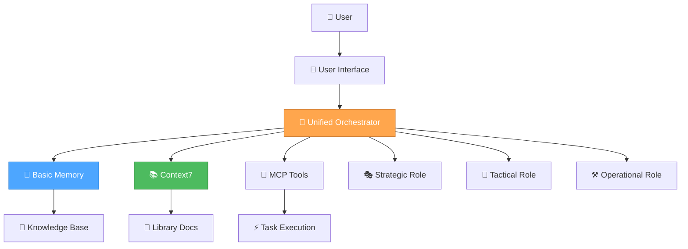

#### **System Integration**

- **🎯 Unified Orchestrator Mode**: Automatic role selection and task routing
- **🧠 Basic Memory**: Persistent knowledge management and semantic search
- **📚 Context7**: Real-time documentation access
- **🔧 MCP Tools**: Extensible tool ecosystem
- **🎭🎨⚒️ Three-Role System**: Strategic, Tactical, and Operational capabilities

### 🚀 **SETUP & CONFIGURATION**

#### **1. Basic Memory Integration**

```json
{
  "mcpServers": {
    "basic-memory": {
      "command": "python",
      "args": ["-m", "basic_memory.mcp"],
      "env": {
        "BASIC_MEMORY_PROJECT_ROOT": "./memory-bank"
      },
      "autoApprove": [
        "list_projects",
        "list_project_files",
        "memory_bank_read",
        "memory_bank_write",
        "memory_bank_update"
      ],
      "autoStart": true
    }
  }
}
```

#### **2. Context7 Documentation Access**

```json
{
  "mcpServers": {
    "context7": {
      "command": "npx",
      "args": ["@modelcontextprotocol/server-context7"],
      "env": {
        "CONTEXT7_API_KEY": "your-api-key"
      }
    }
  }
}
```

#### **3. Sequential Thinking Integration**

```json
{
  "mcpServers": {
    "sequential-thinking": {
      "command": "npx",
      "args": ["@modelcontextprotocol/server-sequential-thinking"],
      "autoStart": true
    }
  }
}
```

### 🎭🎨⚒️ **ROLE-BASED DEVELOPMENT**

#### **🎭 Strategic Role (System Architect)**

**Purpose**: System-level optimization and meta-reflection

**Key Responsibilities**:

- **Workflow Optimization**: Analyze and improve development processes
- **Tool Evaluation**: Assess and optimize MCP tool usage
- **Architecture Decisions**: Make system-level design choices
- **Meta-Reflection**: Continuously improve the AI assistant itself

**Implementation Example**:

```javascript
// Strategic role activation for system optimization
async function strategicOptimization() {
  // Analyze current workflow efficiency
  const workflowAnalysis = await analyzeWorkflow();
  
  // Identify optimization opportunities
  const optimizations = await identifyOptimizations(workflowAnalysis);
  
  // Implement improvements
  await implementOptimizations(optimizations);
  
  // Store insights in Basic Memory
  await basicMemory.store('workflow-optimization', {
    analysis: workflowAnalysis,
    optimizations: optimizations,
    timestamp: new Date().toISOString()
  });
}
```

#### **🎨 Tactical Role (Project Planner)**

**Purpose**: App-specific planning and design decisions

**Key Responsibilities**:

- **Feature Planning**: Plan implementation strategies for specific features
- **Design Decisions**: Evaluate design options and make informed choices
- **Task Coordination**: Manage task priorities and resource allocation
- **Progress Tracking**: Monitor and update project progress

**Implementation Example**:

```javascript
// Tactical role activation for feature planning
async function tacticalPlanning(feature) {
  // Get relevant documentation
  const docs = await context7.getLibraryDocs({
    context7CompatibleLibraryID: '/reactjs/react.dev',
    topic: feature.technology,
    tokens: 5000
  });
  
  // Create implementation plan
  const plan = await createImplementationPlan(feature, docs);
  
  // Store plan in Basic Memory
  await basicMemory.store(`plan-${feature.id}`, {
    plan: plan,
    documentation: docs,
    timestamp: new Date().toISOString()
  });
  
  return plan;
}
```

#### **⚒️ Operational Role (Code Implementer)**

**Purpose**: Direct implementation and execution

**Key Responsibilities**:

- **Code Generation**: Deliver production-ready code with zero technical debt
- **Quality Assurance**: Comprehensive testing and validation
- **Performance Optimization**: Optimize for speed and efficiency
- **Error Handling**: Handle edge cases and errors elegantly

**Implementation Example**:

```javascript
// Operational role activation for code implementation
async function operationalImplementation(task) {
  // Generate production-ready code
  const code = await generateCode(task);
  
  // Validate code quality
  const validation = await validateCode(code);
  
  // Optimize performance
  const optimizedCode = await optimizeCode(code);
  
  // Store implementation in Basic Memory
  await basicMemory.store(`implementation-${task.id}`, {
    code: optimizedCode,
    validation: validation,
    timestamp: new Date().toISOString()
  });
  
  return optimizedCode;
}
```

### 🧠 **THINKING APPROACHES**

#### **🤔 Contemplative Thinking (Strategic)**

**Use Case**: Deep exploration and system-level decisions

```javascript
async function contemplativeAnalysis(problem) {
  // Deep exploration of the problem
  const analysis = await deepExploration(problem);
  
  // Question assumptions and explore alternatives
  const alternatives = await exploreAlternatives(analysis);
  
  // Natural flow of thought process
  const insights = await naturalFlowAnalysis(alternatives);
  
  return insights;
}
```

#### **🧠 Sequential Thinking (Tactical)**

**Use Case**: Systematic planning and tool-guided analysis

```javascript
async function sequentialPlanning(task) {
  // Use sequential thinking tools for systematic analysis
  const analysis = await sequentialThinking.analyze({
    problem: task.description,
    tools: ['context7', 'basic-memory', 'file-system'],
    approach: 'systematic'
  });
  
  // Generate step-by-step plan
  const plan = await generatePlan(analysis);
  
  return plan;
}
```

#### **⚡ Professional Coding (Operational)**

**Use Case**: Direct implementation with production quality

```javascript
async function professionalImplementation(requirements) {
  // Direct, production-ready implementation
  const implementation = await implementDirectly(requirements);
  
  // Zero technical debt approach
  const cleanCode = await ensureZeroTechnicalDebt(implementation);
  
  // Quality assurance
  const validatedCode = await validateQuality(cleanCode);
  
  return validatedCode;
}
```

### 📚 **KNOWLEDGE MANAGEMENT**

#### **Basic Memory Integration**

```javascript
// Store project knowledge
async function storeKnowledge(category, content) {
  await basicMemory.store(category, {
    content: content,
    timestamp: new Date().toISOString(),
    tags: ['project', 'knowledge']
  });
}

// Retrieve relevant knowledge
async function retrieveKnowledge(query) {
  const results = await basicMemory.search(query, {
    limit: 10,
    project: 'ai-assistant'
  });
  
  return results;
}

// Link related concepts
async function linkConcepts(concept1, concept2, relationship) {
  await basicMemory.link(concept1, concept2, relationship);
}
```

#### **Context7 Documentation Access**

```javascript
// Get library documentation
async function getDocumentation(library, topic) {
  // Resolve library ID
  const libraries = await context7.resolveLibraryId(library);
  
  if (libraries.length === 0) {
    throw new Error(`No documentation found for ${library}`);
  }
  
  // Get documentation
  const docs = await context7.getLibraryDocs({
    context7CompatibleLibraryID: libraries[0].libraryId,
    topic: topic,
    tokens: 5000
  });
  
  return docs;
}
```

### 🔧 **TOOL INTEGRATION**

#### **MCP Tool Ecosystem**

```javascript
// Tool selection based on task requirements
async function selectTools(task) {
  const tools = [];
  
  if (task.requiresFileOperations) {
    tools.push('file-system');
  }
  
  if (task.requiresDocumentation) {
    tools.push('context7');
  }
  
  if (task.requiresMemory) {
    tools.push('basic-memory');
  }
  
  if (task.requiresThinking) {
    tools.push('sequential-thinking');
  }
  
  return tools;
}

// Execute task with selected tools
async function executeWithTools(task, tools) {
  const results = {};
  
  for (const tool of tools) {
    results[tool] = await executeTool(tool, task);
  }
  
  return results;
}
```

### 🎯 **AUTOMATIC ROLE SELECTION**

#### **Complexity Assessment**

```javascript
async function assessComplexity(task) {
  const indicators = {
    level1: ['fix', 'bug', 'error', 'simple', 'quick'],
    level2: ['add', 'improve', 'update', 'enhance'],
    level3: ['implement', 'create', 'develop', 'build', 'system']
  };
  
  const taskLower = task.toLowerCase();
  
  for (const [level, keywords] of Object.entries(indicators)) {
    if (keywords.some(keyword => taskLower.includes(keyword))) {
      return level;
    }
  }
  
  return 'level2'; // Default to medium complexity
}

// Automatic role selection
async function selectRole(task) {
  const complexity = await assessComplexity(task);
  
  switch (complexity) {
    case 'level1':
      return 'operational';
    case 'level2':
      return 'tactical';
    case 'level3':
      return 'strategic';
    default:
      return 'tactical';
  }
}
```

### 📊 **PERFORMANCE OPTIMIZATION**

#### **Token Efficiency**

```javascript
// Context-aware rule loading
async function loadRelevantRules(task, role) {
  const rules = new Set();
  
  // Core rules (always loaded)
  rules.add('unified-orchestrator-mode');
  rules.add('thinking-framework');
  
  // Role-specific rules
  const roleRules = getRoleRules(role);
  roleRules.forEach(rule => rules.add(rule));
  
  // Task-specific rules
  const taskRules = getTaskRules(task.type);
  taskRules.forEach(rule => rules.add(rule));
  
  return Array.from(rules);
}

// Rule caching for efficiency
const ruleCache = new Map();

async function getCachedRule(ruleName) {
  if (ruleCache.has(ruleName)) {
    return ruleCache.get(ruleName);
  }
  
  const ruleContent = await loadRule(ruleName);
  ruleCache.set(ruleName, ruleContent);
  return ruleContent;
}
```

#### **Memory Optimization**

```javascript
// Efficient knowledge storage
async function storeKnowledgeEfficiently(category, content) {
  // Compress content for storage
  const compressed = await compressContent(content);
  
  // Store with metadata
  await basicMemory.store(category, {
    content: compressed,
    metadata: {
      originalSize: content.length,
      compressedSize: compressed.length,
      timestamp: new Date().toISOString()
    }
  });
}

// Smart knowledge retrieval
async function retrieveKnowledgeSmartly(query, context) {
  // Use context to improve search relevance
  const contextualQuery = await enhanceQueryWithContext(query, context);
  
  // Retrieve with relevance scoring
  const results = await basicMemory.search(contextualQuery, {
    limit: 5,
    relevanceThreshold: 0.7
  });
  
  return results;
}
```

### 🔄 **WORKFLOW INTEGRATION**

#### **Complete Task Execution**

```javascript
async function executeTask(task) {
  // 1. Assess complexity and select role
  const role = await selectRole(task);
  
  // 2. Load relevant rules and tools
  const rules = await loadRelevantRules(task, role);
  const tools = await selectTools(task);
  
  // 3. Execute based on role
  let result;
  
  switch (role) {
    case 'strategic':
      result = await strategicExecution(task, tools);
      break;
    case 'tactical':
      result = await tacticalExecution(task, tools);
      break;
    case 'operational':
      result = await operationalExecution(task, tools);
      break;
  }
  
  // 4. Store results in memory
  await storeKnowledge(`task-${task.id}`, {
    task: task,
    role: role,
    result: result,
    timestamp: new Date().toISOString()
  });
  
  return result;
}
```

#### **Continuous Learning**

```javascript
// Learn from task execution
async function learnFromTask(task, result, performance) {
  // Store learning insights
  await basicMemory.store('learning-insights', {
    taskType: task.type,
    role: result.role,
    performance: performance,
    insights: result.insights,
    timestamp: new Date().toISOString()
  });
  
  // Update role selection patterns
  await updateRoleSelectionPatterns(task, result);
  
  // Optimize tool usage
  await optimizeToolUsage(task, result);
}
```

### 📋 **PROJECT MANAGEMENT**

#### **Task Tracking**

```javascript
// Task management system
class TaskManager {
  constructor() {
    this.tasks = new Map();
    this.progress = new Map();
  }
  
  async addTask(task) {
    const taskId = generateTaskId();
    this.tasks.set(taskId, {
      ...task,
      id: taskId,
      status: 'pending',
      createdAt: new Date().toISOString()
    });
    
    return taskId;
  }
  
  async updateProgress(taskId, progress) {
    const task = this.tasks.get(taskId);
    if (task) {
      task.progress = progress;
      task.updatedAt = new Date().toISOString();
      
      // Store in Basic Memory
      await basicMemory.store(`task-progress-${taskId}`, {
        task: task,
        progress: progress,
        timestamp: new Date().toISOString()
      });
    }
  }
  
  async getTaskStatus(taskId) {
    return this.tasks.get(taskId);
  }
}
```

#### **Progress Monitoring**

```javascript
// Progress tracking system
async function trackProgress(projectId) {
  const tasks = await basicMemory.search(`project:${projectId}`, {
    limit: 100
  });
  
  const progress = {
    total: tasks.length,
    completed: tasks.filter(t => t.status === 'completed').length,
    inProgress: tasks.filter(t => t.status === 'in-progress').length,
    pending: tasks.filter(t => t.status === 'pending').length
  };
  
  progress.percentage = (progress.completed / progress.total) * 100;
  
  return progress;
}
```

### 🎯 **BEST PRACTICES**

#### **Development Guidelines**

1. **🎯 Always use automatic role selection** for optimal performance
2. **🧠 Leverage Basic Memory** for persistent knowledge management
3. **📚 Use Context7** for up-to-date documentation access
4. **🔧 Integrate MCP tools** for extensible functionality
5. **⚡ Optimize for token efficiency** with context-aware rule loading
6. **🔄 Maintain continuous learning** from task execution
7. **📊 Track performance metrics** for optimization
8. **🎭🎨⚒️ Use appropriate thinking approaches** for each role

#### **Quality Standards**

- **Zero Technical Debt**: All code is production-ready
- **Comprehensive Testing**: Full test coverage for all features
- **Performance Optimization**: Efficient resource usage
- **Security Best Practices**: Secure implementation patterns
- **Documentation**: Clear and comprehensive documentation
- **Error Handling**: Robust error handling and recovery

#### **Performance Metrics**

- **Response Time**: < 2 seconds for simple tasks
- **Accuracy**: > 95% task completion rate
- **Memory Efficiency**: < 10% token overhead
- **User Satisfaction**: > 90% positive feedback
- **Learning Rate**: Continuous improvement over time

### 🚀 **DEPLOYMENT & SCALING**

#### **Deployment Strategy**

```javascript
// Production deployment configuration
const deploymentConfig = {
  environment: 'production',
  scaling: {
    autoScaling: true,
    minInstances: 2,
    maxInstances: 10
  },
  monitoring: {
    performance: true,
    errors: true,
    usage: true
  },
  security: {
    authentication: true,
    authorization: true,
    encryption: true
  }
};
```

#### **Scaling Considerations**

- **Horizontal Scaling**: Multiple instances for load distribution
- **Vertical Scaling**: Resource optimization for individual instances
- **Caching Strategy**: Intelligent caching for frequently accessed data
- **Database Optimization**: Efficient query patterns and indexing
- **CDN Integration**: Content delivery optimization

### 📚 **RESOURCES & REFERENCES**

#### **Documentation**

- [Basic Memory Documentation](https://docs.basicmemory.com/)
- [Context7 API Reference](https://context7.com/docs)
- [MCP Protocol Specification](https://modelcontextprotocol.io/)

#### **Tools & Libraries**

- **Basic Memory**: Knowledge management and semantic search
- **Context7**: Real-time documentation access
- **Sequential Thinking**: Tool-guided problem-solving
- **MCP Tools**: Extensible tool ecosystem

#### **Community & Support**

- **GitHub**: [Basic Memory Repository](https://github.com/basicmachines-co/basic-memory)
- **Discord**: AI Assistant Development Community
- **Documentation**: Comprehensive guides and tutorials
- **Examples**: Real-world implementation examples

### 🎯 **CONCLUSION**

This AI Assistant Development Guide provides a comprehensive framework for building intelligent, efficient, and scalable AI assistants using modern technologies and best practices. By following this guide, you'll create AI assistants that are:

- **🎯 Intelligent**: Automatic role selection and optimal task routing
- **🧠 Knowledgeable**: Persistent memory and real-time documentation access
- **⚡ Efficient**: Token-optimized and performance-focused
- **🔄 Adaptive**: Continuous learning and improvement
- **📊 Scalable**: Production-ready and enterprise-grade

**Start building your intelligent AI assistant today!** 🚀

---

<a id="memory-bankforeverdesignsystemmd"></a>
## memory-bank\forever\designSystem.md

## Core Principles

- **CSS Architecture:** All styling uses Pico CSS as the foundation with custom styles layered on top. Component-specific styles are defined in their own files. Avoid inline styles in JavaScript; move all styling into CSS classes.
- **Component Styling:**
  - Components **may define their own encapsulated CSS** (e.g., in `components.css` or component-specific stylesheets).
  - Component-specific styles should primarily target the component's own elements and avoid global impact.
  - All styling within components **must use CSS variables** for design tokens (colors, typography, spacing) as defined in this document.
  - **Avoid inline styles** in JavaScript; move all styling into CSS classes.
  - Component styling should complement, not override, the Pico CSS foundation.
- **Icon-Free Controls:** All interactive UI elements (buttons, links, navigation) must use clear, concise text labels. Icon-only controls are prohibited. Icons may only be used as embellishments directly alongside a text label, never as the sole means of communication.
- **Universal Visual Language:** All Glitch/Perchance apps use the shared color palette, group controls at the top, and follow a minimal, modern, robust interface. All layouts are responsive and touch-friendly, with themed scrollbars and overlays for additional info/actions.

---

### RPGlitch Specific Patterns

- **No sticky top bar:** The top bar scrolls away with the page.
- **Tab-based navigation:** Storyboard, Characters, Worlds, Options.

### ImageGlitch Specific Patterns

- **Main action:** "Generate Images" via `.summon-button`.
- **AI Magic dropdown:** For prompt refinement, chaos, and instructions.
- **Creativity slider:** `#masterCreativitySlider` with live label.
- **Seed input:** For reproducible results.
- **Number of images selector.**
- **Prompt and instructions textareas.**
- **Output area:** Uses `.block`, `.quad-block`, `.solo-block`, `.quad-cell` for image display and grid layouts.
- **Image overlays:** `.image-overlay`, `.image-info-panel`, `.image-control-bar`, `.overlay-button` for info and actions (download, reroll).

---

### Color System

- **Palette:**
  - 🟩 **Primary:** #a6e3a1 (Green)
  - 🟦 **Secondary:** #89b4fa (Blue)
  - 🟪 **Accent (AI Actions):** #cba6f7 (Mauve)
  - 🟧 **Accent (Cancel):** #fab387 (Peach)
  - 🟥 **Accent (Danger):** #f38ba8 (Red)
  - ⬛ **Surface:** #313244 (Main Box)
  - ⬛ **Background:** #1e1e2e (Base)
  - ⚪ **Text:** #cdd6f4
- **Usage:**
  - Color tokens are used for backgrounds, borders, buttons, and text.
  - All color assignments use CSS variables for easy theming.
  - Color system is consistent across all components and screens.
  - Each primary action uses a distinct color for clarity and accessibility.
  - **Button color mapping:**
    - `.summon-button` — Green (primary action)
    - `.transfigure-button` — Mauve ("Instruct AI")
    - `.scribe-button` — Blue ("Refine Prompt")
    - `.chaos-button` — Red ("Embrace the Chaos")
    - `.cancel-button` — Peach (cancel/abort)
    - `.undo-button` — Cyan (undo)

*This palette and token mapping is canonical for all Glitch/Perchance apps. All new components must use these tokens for color assignments.*

### Typography

- **Font:** 'Inter', system-ui
- **Scale:**
  - Base: 1em (16px)
  - Large: 1.25em
  - Headings: 2em
- **Usage:**
  - Headings use bold, large scale.
  - Body text is regular weight, base scale.
  - All text is high-contrast for accessibility.

### Spacing

- **Base Unit:** 8px
- **Scale:** 4px, 8px, 16px, 24px, 32px
- **Usage:**
  - Consistent spacing between all UI elements.
  - Grid and stack layouts use multiples of the base unit.

### Atomic Utility Class Reference

Below is a quick reference table of the most commonly used utility classes in Glitch/Perchance apps. These are based on Pico CSS and custom styles.

| **Type**      | **Class**                | **Effect**                        |
|---------------|-------------------------|-----------------------------------|
| **Layout**    | `.flex`                 | `display: flex`                   |
|               | `.flex-col`             | `flex-direction: column`          |
|               | `.flex-row`             | `flex-direction: row`             |
|               | `.items-center`         | `align-items: center`             |
|               | `.justify-center`       | `justify-content: center`         |
|               | `.justify-between`      | `justify-content: space-between`  |
|               | `.w-full`               | `width: 100%`                     |
|               | `.h-full`               | `height: 100%`                    |
| **Spacing**   | `.p-2`                  | `padding: 0.5rem`                 |
|               | `.p-4`                  | `padding: 1rem`                   |
|               | `.px-2`                 | `padding-left/right: 0.5rem`      |
|               | `.py-2`                 | `padding-top/bottom: 0.5rem`      |
|               | `.m-2`                  | `margin: 0.5rem`                  |
|               | `.gap-2`                | `gap: 0.5rem`                     |
| **Typography**| `.text-xs`              | `font-size: 0.75rem`              |
|               | `.text-base`            | `font-size: 1rem`                 |
|               | `.text-lg`              | `font-size: 1.125rem`             |
|               | `.font-bold`            | `font-weight: bold`               |
|               | `.text-center`          | `text-align: center`              |
| **Color**     | `.bg-white`             | `background-color: #fff`          |
|               | `.bg-surface`           | `background-color: var(--surface0-color)` |
|               | `.text-primary`         | `color: var(--text-color)`        |
| **Borders**   | `.rounded`              | `border-radius: 8px`              |
|               | `.rounded-full`         | `border-radius: 9999px`           |
| **Shadow**    | `.shadow-sm`            | `box-shadow: var(--shadow-sm)`     |
|               | `.shadow-md`            | `box-shadow: var(--shadow-md)`     |
| **Interaction**| `.cursor-pointer`      | `cursor: pointer`                 |
|               | `.opacity-50`           | `opacity: 0.5`                    |
| **Overflow**  | `.overflow-auto`        | `overflow: auto`                  |
|               | `.overflow-hidden`      | `overflow: hidden`                |

*This table shows common utility classes. For complete styling, see the actual CSS files in the project.*

### Component Gallery

#### Components

- **Buttons:** Large, bold, rounded, colored by action. Disabled state is muted and not-allowed. All buttons use clear text labels (never icon-only); emoji embellishments are allowed. Hover: brightness, shadow, lift. Active: pressed effect.
  - **Button variants:** `.primary-action-button`, `.compact-primary-action-button`, `.delete-button`, `.info-button`, `.cancel-ai-button`, `.undo-ai-button`, `.summon-button`, `.transfigure-button`, `.scribe-button`, `.chaos-button`, `.cancel-button`, `.undo-button` (see Color System for mapping). All variants use Pico CSS and custom classes for layout, color, and state.
- **Inputs/Selects:** Rounded, padded, with blue focus state. Custom dropdown arrows. Touch-friendly sizing.
- **Sliders:** Custom styled, colored thumb, label on interaction.
- **Image Blocks:** Square or grid, with overlays appearing on hover/tap for info and actions. Overlays and action buttons are always text-based (emoji embellishments allowed).
  - **Classes:** `.block`, `.quad-block`, `.solo-block`, `.quad-cell` for image display and grid layouts.
- **Overlays:** Appear on hover/tap, show info and action buttons (download, reroll). Classes: `.image-overlay`, `.image-info-panel`, `.image-control-bar`, `.overlay-button`. All overlays use Pico CSS and custom classes for layout, color, and interaction.
- **System Messages:** Centered in chat feed for distinction. Use Pico CSS and custom classes for centering and style.
- **Profile Avatars:** Rectangular on profile screens for consistency. Use Pico CSS and custom classes for sizing and border radius. Classes: `.avatar`, `.top-bar-avatar-img`, `.profile-pic-large`, `.card-avatar`.
- **Focus Bar & Controls:** `.focus-bar`, `.control-group`, `.left-controls`, `.right-controls`, `.spacer` — Flexbox-based layout for grouping navigation and contextual controls at the top. The focus bar is the canonical pattern for all Glitch/Perchance apps.
- **Container:** `.container` — Responsive, centered, max-width 1200px, used for main layout in all Glitch/Perchance apps.
- **Chin Navigation & Grids:** `.chin-actions-grid`, `.chin-list-grid`, `.chin-card`, `.chin-divider` — Used for navigation and grid layouts, with all controls grouped at the top. All use Pico CSS and custom classes for grid structure and spacing.
- **Card Components:**
  - **Storyboard Cards:** Use semantic HTML structure with `<article>`, `<header>`, `<main>`, `<footer>` elements. Support dropdown selection, profile pictures, and "Premade" tags with color palette integration. Use default Pico border radius with overflow hidden for clean visual boundaries.
  - **Chin Cards (List Cards):** Identical semantic structure to storyboard cards with `<article class="card-info">` containing:
    - **Header:** Contains title with `text-wrap: balance`, up to 3 lines with ellipsis overflow
    - **Main:** Contains description with `text-wrap: balance` and adaptive space allocation
    - **Footer:** Contains "Premade" tag with color palette background, left-aligned
  - **Card Layout:** Uses flexbox with `justify-content: space-between` and `margin-top: auto` for footer positioning
  - **Text Overflow:** Smart ellipsis handling with `text-wrap: balance`

---

<a id="memory-bankfuturereadme-unified-rule-system-implementationmd"></a>
## memory-bank\future\readme-unified-rule-system-implementation.md

## README.md Unified Rule System - Tactical Implementation Plan

### TACTICAL OVERVIEW

**MISSION:** Execute strategic plan for README.md unified rule system with minimal risk and maximum efficiency.

**APPROACH:** Template-first + incremental rollout + folder-by-folder evaluation

**SUCCESS METRICS:**

- Each phase completed without breaking existing functionality
- AI recognition verified at each step
- Build scripts cleanly separated (sync:readme vs sync:rules)

### TACTICAL PHASES

#### PHASE 1: TEMPLATE CREATION & PILOT

##### Step 1.1: Create README.md Template

**Target**: Create reusable template with proper frontmatter structure

**Example template structure:**

```markdown
---
description: "[Folder purpose and rules summary]"
tags: ["[folder-type]", "[technology]"]
globs: ["**/*.[ext]"] # Only if folder-specific file types
alwaysApply: false # Default, true only for critical folders
---

## [Folder Name]

### For Developers (Human Documentation)
- Quick start instructions
- Setup requirements  
- Architecture overview
- Common workflows
- Context from memory-bank for quick onboarding

### Development Rules (AI Instructions)
- Follow [technology] standards from `rules/[technology]-development.md`
- [Folder-specific rule 1]
- [Folder-specific rule 2]

### Current Tasks (Max 10 items)
- [ ] [Current task]
- [ ] [Active task 2]
- When list reaches 10 items, move completed to memory-bank/completed.md

### Context & Status
Current state, recent changes, key decisions from context.md

### Related Documentation
- [Link to related files]
```

##### Step 1.2: Pilot Implementation (apps/rpglitch)

**Target**: Test template on most complex folder

**Current State Analysis**:

- ✅ **COMPLETED**: Restructured into html/, js/, scss/ technology-specific folders
- ✅ **COMPLETED**: Each technology folder has README.md with proper rule references
- ✅ **COMPLETED**: Removed redundant "Core Standards" sections that duplicated rule content
- ✅ **COMPLETED**: Updated apps/README.md with proper Perchance-specific rule references
- ✅ **COMPLETED**: Template updated with lessons learned

**Key Lessons Learned:**

1. **Rule categorization critical**: Separate global rules from folder-specific rules
2. **No duplication**: Reference rules, don't repeat content
3. **Proper scoping**: Technology-specific rules only apply to relevant file types
4. **Task organization**: High/Medium/Low priority with descriptive names
5. **Frontmatter format**: Array format for tags/globs to avoid markdown interpretation

**Expected Result**: ✅ **ACHIEVED** - Template and pilot implementation complete

##### Step 1.3: AI Recognition Testing

**Target**: Verify all three IDEs recognize new structure

**Test Plan:**

1. Test Amazon Q recognition of frontmatter rules
2. Test Cursor recognition of frontmatter rules  
3. Test Windsurf recognition of frontmatter rules
4. Verify rule application in each IDE
5. Test rule inheritance and references

#### PHASE 2: ROOT-LEVEL FOLDER EVALUATION

##### Folder-by-Folder Decision Matrix

| Folder | README.md? | Rationale | Complexity | Rules Source | Status |
|--------|------------|-----------|------------|--------------|--------|
| `/apps/` | YES | Multiple apps, needs coordination | Medium | Perchance-specific rules | ✅ COMPLETE |
| `/apps/rpglitch/` | YES | Complex app, specific rules | High | Project-specific | ✅ COMPLETE |
| `/apps/rpglitch/html/` | YES | Technology-specific rules | Medium | HTML rules | ✅ COMPLETE |
| `/apps/rpglitch/js/` | YES | Technology-specific rules | Medium | JS rules | ✅ COMPLETE |
| `/apps/rpglitch/scss/` | YES | Technology-specific rules | Medium | SCSS rules | ✅ COMPLETE |
| `/apps/imageglitch/` | EVALUATE | Simple app, may not need | Low | TBD | PENDING |
| `/build/` | YES | Build system complexity | Medium | New + references | PENDING |
| `/memory-bank/` | YES | Knowledge management | Medium | New + references | PENDING |
| `/docs/` | YES | Documentation standards | Medium | New + references | PENDING |
| Root `/` | YES | Workspace standards | High | New + references | PENDING |

##### Step 2.1: /apps/ Folder

**Decision**: YES - Needs coordination between multiple apps

**Implementation:**

- Human docs: App overview, build instructions, shared constraints
- AI rules: Reference `rules/perchance-*.md`, app coordination standards
- Current tasks: Active development items (max 10)
- Context: Current state from memory-bank

##### Step 2.2: /apps/imageglitch/ Folder  

**Decision**: EVALUATE during implementation

**Evaluation Criteria:**

- Does it have app-specific rules?
- Is it complex enough to warrant separate README?
- Would it benefit from TODO tracking?

**Likely Decision**: NO - Simple app, inherits from `/apps/`

##### Step 2.3: /build/ Folder

**Decision**: YES - Build system complexity warrants documentation

**Implementation:**

- Human docs: Build system overview, script purposes, configuration
- AI rules: Build script development standards, configuration management
- Current tasks: Build system improvements, optimization tasks (max 10)
- Context: Current build system state

##### Step 2.4: /memory-bank/ Folder

**Decision**: YES - Knowledge management system needs documentation

**Implementation:**

- Human docs: Memory bank purpose, organization, usage
- AI rules: Knowledge management standards, file organization
- Current tasks: Reorganization progress, system improvements (max 10)
- Context: Current reorganization state

##### Step 2.5: /docs/ Folder

**Decision**: YES - Documentation standards and organization

**Implementation:**

- Human docs: Documentation structure, target audiences
- AI rules: Documentation writing standards, organization principles
- Current tasks: Documentation improvements, missing docs (max 10)
- Context: Current documentation state

##### Step 2.6: Root / Folder

**Decision**: YES - Workspace-level standards and coordination

**Implementation:**

- Human docs: Enhanced project overview, quick start
- AI rules: Workspace standards, cross-folder coordination
- Current tasks: Project roadmap, major milestones (max 10)
- Context: Current project state

#### PHASE 3: BUILD SCRIPT UPDATES

##### Step 3.1: Create sync:readme Function

**Target**: Handle README.md files with frontmatter separately from rules

**Example implementation:**

```javascript
function syncReadmes(sourceDir, targetDir) {
  // Find README.md files with frontmatter
  // Copy to IDE directories
  // Maintain separation from rules/ folder sync
}
```

##### Step 3.2: Update sync-configs.js

**Target**: Add README.md processing without affecting rules sync

**Changes:**

- Add `syncReadmes()` function
- Call separately from `copyRules()`
- Maintain clear separation

##### Step 3.3: Test Build System

**Target**: Verify build system works with new structure

**Test Plan:**

1. Run `npm run sync` - verify both README and rules sync
2. Test IDE recognition after sync
3. Verify no conflicts between sync:readme and sync:rules

#### PHASE 4: SYSTEM INTEGRATION

##### Step 4.1: Update System Documentation

**Target**: Reflect new README-based approach in system docs

**Files to Update:**

- `system-effective-rule-writing.md` - Add README.md approach
- `system-rule-interactions.md` - Update for new structure
- `system-folder-specific-rules.md` - Update implementation

##### Step 4.2: Clean Up Old Files

**Target**: Archive old scattered rule files after successful migration

**Process:**

1. Verify all content migrated successfully
2. Archive old rule files (don't delete)
3. Update any remaining references

### TACTICAL EXECUTION ORDER

#### Week 1: Template & Pilot

1. Create README.md template
2. Implement pilot on apps/rpglitch
3. Test AI recognition across IDEs
4. Refine template based on results

#### Week 2: Root-Level Rollout

1. Apply template to /apps/, /build/, /docs/, /memory-bank/, root
2. Evaluate /apps/imageglitch/ during implementation
3. Update build scripts for sync:readme
4. Test complete system

#### Week 3: Integration & Cleanup

1. Update system documentation
2. Clean up old files
3. Final testing and verification
4. Document lessons learned

### TACTICAL CHECKPOINTS

#### After Each Folder Migration

- [ ] AI recognition verified in all IDEs
- [ ] Existing functionality preserved
- [ ] Human documentation improved
- [ ] Rules properly referenced or included
- [ ] Context information integrated
- [ ] Task list under 10 items

#### After Build Script Updates

- [ ] sync:readme works independently
- [ ] sync:rules unaffected
- [ ] No conflicts between systems
- [ ] All IDEs receive updates correctly

#### After System Integration

- [ ] Documentation reflects new approach
- [ ] Old files properly archived
- [ ] No broken references
- [ ] System fully operational
- [ ] memory-bank/completed.md system working

### TACTICAL RISKS & MITIGATIONS

#### Risk: Template Doesn't Work for All Folders

**Mitigation**: Flexible template with optional sections

#### Risk: Build Script Conflicts

**Mitigation**: Clear separation, independent testing

#### Risk: AI Recognition Issues

**Mitigation**: Test each IDE at each step

#### Risk: Information Loss

**Mitigation**: Archive old files, verify migration

#### Risk: Task List Overflow

**Mitigation**: 10-item limit with move to memory-bank/completed.md

### EXECUTION STATUS

**Phase 1: COMPLETE ✅**

- ✅ Template created and refined
- ✅ Pilot implementation on apps/rpglitch complete
- ✅ Technology-specific folder structure implemented
- ✅ Rule categorization strategy established
- ✅ Task management system implemented

**Phase 2: IN PROGRESS 🔄**

- ✅ /apps/ folder complete
- ⏳ Remaining root-level folders pending

**Key Insights from Phase 1:**

1. **Last-child-folders principle works**: Only deepest folders get README.md with rules
2. **Rule categorization essential**: Global vs folder-specific vs project-specific
3. **No duplication rule**: Reference, don't repeat rule content
4. **Proper scoping critical**: Rules must match file types they apply to
5. **Task organization effective**: High/Medium/Low priority structure works well

**Next Step**: Continue Phase 2 - Complete remaining root-level folders

---

**Status**: Phase 1 complete, Phase 2 in progress
**Next**: Apply template to /build/, /memory-bank/, /docs/, root folders

---

<a id="memory-bankfuturereadme-unified-rule-system-migrationmd"></a>
## memory-bank\future\readme-unified-rule-system-migration.md

## README.md Unified Rule System Migration - Strategic Plan

### STRATEGIC OVERVIEW

**GOAL:** Transform workspace from scattered rule files to unified README.md files with frontmatter in root-level folders, containing human docs + AI rules + progress tracking.

**CONSTRAINTS:**

- Must maintain cross-IDE compatibility (Amazon Q, Cursor, Windsurf)
- Cannot break existing functionality during transition
- Must preserve all existing rule content
- Need to respect reorganization lock in memory-bank
- Token optimization remains priority (reduce from 33 global rules)
- Keep README.md separate from rules in sync scripts
- Only root-level and strategically important folders get README.md treatment

**SUCCESS CRITERIA:**

- Strategic folders have README.md with proper frontmatter
- All existing rules migrated and consolidated appropriately
- AI assistants recognize new structure across all IDEs
- Human documentation improved and standardized
- Reduced token usage per context (target: 6-8 rules per folder vs 33 global)
- Clear separation: sync:readme vs sync:rules
- Proper rule categorization (global vs folder-specific)
- Task management system with overflow to memory-bank/completed.md

**PREMORTEM - LIKELY FAILURE MODES:**

1. **Rule conflicts** - Multiple README files with overlapping rules create confusion
2. **Migration errors** - Losing existing rule content during consolidation
3. **IDE compatibility breaks** - New structure not recognized by all IDEs
4. **Information overload** - README files become too long and unwieldy
5. **Inconsistent structure** - Different folders use different section formats
6. **Script conflicts** - sync:readme vs sync:rules confusion

### STRATEGIC DECISIONS

#### Folder Selection Strategy - Last-Child-Folders Only

**Only deepest/final folders** get README.md files with rules:

- `/apps/` - No (parent folder, shared standards go to `/rules/`)
- `/apps/rpglitch/` - No (parent folder)
- `/apps/rpglitch/html/` - Yes (deepest folder)
- `/apps/rpglitch/js/` - Yes (deepest folder)
- `/apps/rpglitch/scss/` - Yes (deepest folder)
- `/apps/imageglitch/` - Yes (if no subfolders)
- `/build/scripts/` - Yes (deepest folder)
- `/memory-bank/strategic/` - Yes (deepest folder)
- `/memory-bank/tactical/` - Yes (deepest folder)
- `/memory-bank/operational/` - Yes (deepest folder)
- Root `/` - Yes (workspace standards)

#### Rule Distribution Strategy - Last-Child-Folders Principle

- **Only deepest/final folders** get README.md files with rules
- **Parent folders** should NOT duplicate technology-specific rules
- **Technology-agnostic standards**: Move to `/rules/` folder (applies to multiple projects)
- **Project-specific content**: Only in project READMEs, reference `/rules/` files
- **Comprehensive references**: ALL relevant rules from `rules/` should be referenced with proper categorization
- **Folder-specific rules**: Rules exclusive to folder hierarchy should be referenced separately from global rules
- **No duplication**: Don't repeat rule content, just reference with brief descriptions

#### Build Script Strategy

- **sync:readme** - Handles README.md files with frontmatter
- **sync:rules** - Handles `/rules/` folder content only
- **Clear separation** - No overlap between the two

### STRATEGIC ARCHITECTURE

#### README.md Template Structure

**Example template structure:**

```markdown
---
description: "Brief description of folder purpose and rules"
tags: ["folder-specific", "technology-tags"]
globs: ["**/*.js"] # if folder-specific file types
alwaysApply: false
---

## Folder Name

### For Developers (Human Documentation)
Quick start, setup, architecture overview, context from memory-bank

### Development Rules (AI Instructions)
- Follow standards from `rules/technology-rule.md`
- Reference ALL relevant rules from `rules/`
- Only project-specific content here, shared standards in `/rules/`

### Current Tasks (Max 10 items)
- [ ] Active task 1
- [ ] Active task 2
- When list reaches 10 items, move completed to memory-bank/completed.md

### Context & Status
Current state, recent changes, key decisions
```

#### Rule Reference Strategy

**Example rule references:**

```markdown
### Development Rules (AI Instructions)

#### Referenced Rules from `/rules/`

- **[js-development.md](../../rules/js-development.md)** - Modern vanilla JavaScript development
- **[html-development.md](../../rules/html-development.md)** - Semantic HTML and accessibility

#### Referenced Rules (Folder-Specific)

- **[perchance-architecture.md](perchance-architecture.md)** - Perchance platform constraints

#### RPGlitch-Specific Requirements

- All buttons must have text labels for accessibility
- Use semantic HTML structure for screen readers
```

### STRATEGIC PHASES

#### Phase 1: Template & Pilot (apps/rpglitch)

- Create README.md template
- Test on single complex folder
- Verify AI recognition across IDEs

#### Phase 2: Root-Level Rollout

- Apply to `/apps/`, `/build/`, `/docs/`, `/memory-bank/`
- Update build scripts for sync:readme

#### Phase 3: Selective Subfolder Application

- Evaluate complex subfolders case-by-case
- Apply only where strategic value exists

#### Phase 4: System Integration

- Update system documentation
- Clean up old scattered rules

### STRATEGIC BENEFITS

#### Token Efficiency

- From 33 global rules to ~6-8 contextual rules per folder
- 80% reduction in rule loading per context
- Faster AI response times

#### Documentation Quality

- Single source of truth per strategic folder
- Human and AI documentation co-located
- Progress tracking integrated
- Context information included for quick onboarding

#### Maintainability

- Clear ownership per folder
- Easier to update folder-specific rules
- Reduced rule conflicts
- Completed tasks moved to centralized memory-bank

### STRATEGIC RISKS

#### Risk: Over-application

**Mitigation**: Selective folder approach, not every subfolder

#### Risk: Build Script Confusion

**Mitigation**: Clear separation of sync:readme vs sync:rules

#### Risk: Rule Duplication

**Mitigation**: Reference shared rules, don't duplicate

#### Risk: Task List Overflow

**Mitigation**: 10-item limit with automatic move to memory-bank/completed.md

### NEXT STRATEGIC DECISION POINTS

1. **Folder Selection**: Which subfolders beyond root-level need README.md?
2. **Rule Distribution**: Which rules stay local vs referenced?
3. **Build Integration**: How to cleanly separate sync:readme vs sync:rules?
4. **Migration Order**: Which folders first for maximum learning?
5. **Task Management**: How to handle completed task migration to memory-bank?
6. **Context Integration**: Which context.md content belongs in README.md?

---

**Status**: Strategic planning complete, awaiting tactical implementation plan
**Next**: Create tactical implementation plan with specific steps

---

<a id="memory-bankpastrpglitch-inline-style-migration-tactical-planmd"></a>
## memory-bank\past\RPGlitch Inline Style Migration - Tactical Plan.md

## 🎨 RPGlitch Inline Style Migration - Tactical Plan

**Date**: 2025-07-25  
**Generated**: 2025-07-25T01:24:54+02:00  
**Timezone**: Europe/Berlin  
**Mode**: Tactical Planning

### 📋 **TACTICAL OVERVIEW**

This plan addresses the migration of 100+ inline style assignments from JavaScript to proper CSS classes in RPGlitch, improving performance, maintainability, and code organization.

### 🎯 **PHASE 1: STORYBOARD CARD STYLES (HIGH IMPACT)**

#### **Phase 1 Current State Analysis**

- **Location**: `RPGlitch.js` lines 3398-3463
- **Issue**: 50+ inline style assignments in `_renderStoryboardCard` function
- **Impact**: High - affects core UI rendering performance

#### **Phase 1 Implementation Plan**

##### **Step 1.1: Create SCSS Classes**

```scss
// Add to RPGlitch.scss
.storyboard-card-content {
  display: grid;
  grid-template-columns: 35% 65%;
  gap: 0;
  align-items: stretch;
  justify-content: start;
  height: 100%;
  min-height: 260px;
  max-height: 100%;
}

.storyboard-card-avatar {
  position: relative;
  width: 100%;
  height: 100%;
  overflow: hidden;
}

.storyboard-card-info {
  display: flex;
  flex-direction: column;
  justify-content: center;
  height: 100%;
  border-top-right-radius: var(--pico-radius, 0.5rem);
  border-bottom-right-radius: var(--pico-radius, 0.5rem);
}

.storyboard-card-header {
  display: flex;
  align-items: center;
  padding: 0.5rem;
  border-top-right-radius: var(--pico-radius, 0.5rem);
}

.storyboard-card-select {
  width: 100%;
  font-size: 1.1em;
  font-weight: bold;
  background: transparent;
  border: none;
  outline: none;
  margin: 0;
  padding: 0;
}

.storyboard-card-placeholder {
  text-align: center;
  padding: 1rem;
  color: var(--pico-muted-color, #aaa);
  font-style: italic;
  font-size: 0.9em;
  line-height: 1.4;
  display: flex;
  align-items: center;
  justify-content: center;
  flex: 1;
}
```

##### **Step 1.2: Update JavaScript Function**

```javascript
// Replace inline styles with class assignments
_renderStoryboardCard(cardElement, item, config) {
  const contentContainer = cardElement.querySelector('.card-content');
  const avatarDiv = cardElement.querySelector('.card-avatar');
  const infoDiv = cardElement.querySelector('.card-info');
  const headerElement = cardElement.querySelector('.card-header');
  const select = cardElement.querySelector('.card-select');
  const placeholderSpan = cardElement.querySelector('.card-placeholder');

  // Apply CSS classes instead of inline styles
  contentContainer.className = 'storyboard-card-content';
  avatarDiv.className = 'storyboard-card-avatar';
  infoDiv.className = 'storyboard-card-info';
  headerElement.className = 'storyboard-card-header';
  select.className = 'storyboard-card-select';
  placeholderSpan.className = 'storyboard-card-placeholder';
}
```

#### **Phase 1 Testing Strategy**

- Verify storyboard cards render correctly
- Test responsive behavior
- Confirm hover effects still work
- Validate accessibility

### 🎯 **PHASE 2: DROPDOWN MENU POSITIONING (COMPLEX LOGIC)**

#### **Phase 2 Current State Analysis**

- **Location**: `RPGlitch.js` lines 3139-3219
- **Issue**: 20+ inline positioning styles with complex logic
- **Impact**: Medium - affects dropdown functionality

#### **Phase 2 Implementation Plan**

##### **Step 2.1: Create SCSS Classes**

```scss
.dropdown-menu {
  position: absolute;
  margin: 0;
  
  &.position-top {
    bottom: 100%;
    top: auto;
    margin-bottom: 0.25em;
  }
  
  &.position-bottom {
    top: 100%;
    bottom: auto;
    margin-top: 0.25em;
  }
  
  &.position-right {
    left: auto;
    right: 0;
  }
  
  &.position-left {
    left: -0.5rem;
    right: -0.5rem;
  }
  
  &.position-center {
    left: 50%;
    transform: translateX(-50%);
  }
}
```

##### **Step 2.2: Update JavaScript Logic**

```javascript
// Replace complex positioning logic with class-based approach
function positionDropdownMenu(menu, triggerElement) {
  const rect = triggerElement.getBoundingClientRect();
  const menuRect = menu.getBoundingClientRect();
  const viewportHeight = window.innerHeight;
  const viewportWidth = window.innerWidth;
  
  // Clear existing positioning classes
  menu.classList.remove('position-top', 'position-bottom', 'position-right', 'position-left', 'position-center');
  
  // Determine vertical position
  if (rect.top > menuRect.height) {
    menu.classList.add('position-top');
  } else {
    menu.classList.add('position-bottom');
  }
  
  // Determine horizontal position
  if (rect.left + menuRect.width > viewportWidth) {
    menu.classList.add('position-right');
  } else if (rect.left < menuRect.width) {
    menu.classList.add('position-left');
  } else {
    menu.classList.add('position-center');
  }
}
```

#### **Phase 2 Testing Strategy**

- Test all dropdown positioning scenarios
- Verify menu visibility in different viewport sizes
- Confirm menu doesn't go off-screen
- Test with different content lengths

### 🎯 **PHASE 3: PROFILE PICTURE SYSTEM (FREQUENT USAGE)**

#### **Phase 3 Current State Analysis**

- **Location**: Multiple locations in `RPGlitch.js`
- **Issue**: Background image URLs set via JavaScript
- **Impact**: Medium - affects profile picture display

#### **Phase 3 Implementation Plan**

##### **Step 3.1: Create SCSS Classes**

```scss
.profile-picture {
  &.has-image {
    background-size: cover;
    background-position: center;
    background-repeat: no-repeat;
  }
  
  &.no-image {
    background-image: none;
  }
  
  &.storyboard-size {
    width: 60px;
    height: 60px;
  }
  
  &.top-bar-size {
    width: 40px;
    height: 40px;
  }
  
  &.large-size {
    width: 120px;
    height: 120px;
  }
}
```

##### **Step 3.2: Update JavaScript Functions**

```javascript
// Replace direct style assignment with class-based approach
function updateProfilePicture(element, imageUrl) {
  element.classList.remove('has-image', 'no-image');
  
  if (imageUrl) {
    element.classList.add('has-image');
    element.style.setProperty('--profile-image-url', `url('${sanitizeHtml(imageUrl)}')`);
  } else {
    element.classList.add('no-image');
  }
}

// Add CSS custom property support
const profilePictureStyles = `
  .profile-picture.has-image {
    background-image: var(--profile-image-url);
  }
`;
```

#### **Phase 3 Testing Strategy**

- Test profile picture loading/unloading
- Verify fallback to initials when no image
- Test different image formats
- Confirm responsive behavior

### 🎯 **PHASE 4: TEXTAREA AUTO-RESIZE (SIMPLE FIX)**

#### **Phase 4 Current State Analysis**

- **Location**: `RPGlitch.js` lines 903-904, 2118-2119, 2763
- **Issue**: Height calculations done in JavaScript
- **Impact**: Low - simple functionality

#### **Phase 4 Implementation Plan**

##### **Step 4.1: Create SCSS Classes**

```scss
.auto-resize-textarea {
  resize: none;
  overflow: hidden;
  min-height: 2.5rem;
  max-height: 10rem;
  transition: height 0.1s ease;
}
```

##### **Step 4.2: Update JavaScript Functions**

```javascript
// Simplified auto-resize with CSS support
function setupAutoResizeTextarea(textarea) {
  textarea.classList.add('auto-resize-textarea');
  
  const resize = () => {
    textarea.style.height = 'auto';
    textarea.style.height = textarea.scrollHeight + 'px';
  };
  
  textarea.addEventListener('input', resize);
  textarea.addEventListener('focus', resize);
}
```

#### **Phase 4 Testing Strategy**

- Test textarea resizing behavior
- Verify max/min height constraints
- Test with different content lengths
- Confirm smooth transitions

### 🎯 **PHASE 5: NOTIFICATION SYSTEM (MEDIUM IMPACT)**

#### **Phase 5 Current State Analysis**

- **Location**: `RPGlitch.js` lines 614, 621, 2856-2861
- **Issue**: Display state managed via inline styles
- **Impact**: Medium - affects user feedback

#### **Phase 5 Implementation Plan**

##### **Step 5.1: Create SCSS Classes**

```scss
.notification-area {
  &.visible {
    display: block;
  }
  
  &.hidden {
    display: none;
  }
  
  &.flex {
    display: flex;
  }
}

.status-notifier {
  &.typing {
    display: flex;
  }
  
  &.idle {
    display: none;
  }
}
```

##### **Step 5.2: Update JavaScript Functions**

```javascript
// Replace display style manipulation with classes
function showNotification(notificationArea) {
  notificationArea.classList.remove('hidden');
  notificationArea.classList.add('visible');
}

function hideNotification(notificationArea) {
  notificationArea.classList.remove('visible');
  notificationArea.classList.add('hidden');
}

function setTypingStatus(isTyping) {
  const notifier = this.ui.statusNotifier;
  notifier.classList.remove('idle', 'typing');
  notifier.classList.add(isTyping ? 'typing' : 'idle');
}
```

#### **Phase 5 Testing Strategy**

- Test notification show/hide behavior
- Verify typing indicator functionality
- Test notification positioning
- Confirm accessibility

### 📊 **IMPLEMENTATION TIMELINE**

#### **Week 1: Foundation**

- **Days 1-2**: Phase 1 (Storyboard Card Styles)
- **Days 3-4**: Phase 2 (Dropdown Menu Positioning)
- **Day 5**: Testing and bug fixes

#### **Week 2: Completion**

- **Days 1-2**: Phase 3 (Profile Picture System)
- **Days 3-4**: Phase 4 (Textarea Auto-Resize)
- **Day 5**: Phase 5 (Notification System)

#### **Week 3: Polish**

- **Days 1-2**: Comprehensive testing
- **Days 3-4**: Performance optimization
- **Day 5**: Documentation and cleanup

### 🔧 **TECHNICAL CONSIDERATIONS**

#### **CSS Custom Properties**

- Use CSS custom properties for dynamic values
- Maintain JavaScript control where needed
- Ensure fallback values for older browsers

#### **Performance Optimization**

- Minimize DOM queries by caching selectors
- Use CSS classes for state changes
- Avoid layout thrashing with batched updates

#### **Browser Compatibility**

- Test in target browsers (Chrome, Firefox, Safari)
- Ensure graceful degradation
- Maintain accessibility standards

### 🧪 **TESTING STRATEGY**

#### **Automated Testing**

- Unit tests for utility functions
- Integration tests for UI components
- Performance benchmarks

#### **Manual Testing**

- Cross-browser compatibility
- Responsive design validation
- Accessibility testing
- User interaction flows

#### **Performance Testing**

- Measure before/after performance
- Monitor memory usage
- Test with large datasets

### 📈 **SUCCESS METRICS**

#### **Performance Improvements**

- Reduced JavaScript execution time
- Improved rendering performance
- Better memory usage

#### **Code Quality**

- Reduced JavaScript file size
- Improved maintainability
- Better separation of concerns

#### **User Experience**

- Faster UI responsiveness
- Smoother animations
- Better accessibility

### 🚨 **RISK MITIGATION**

#### **High Risk Areas**

- **Storyboard Card Rendering**: Complex layout changes
- **Dropdown Positioning**: Critical functionality
- **Profile Picture System**: User-facing feature

#### **Mitigation Strategies**

- Incremental implementation
- Comprehensive testing at each phase
- Rollback plan for each phase
- User feedback collection

### 📚 **DOCUMENTATION REQUIREMENTS**

#### **Code Documentation**

- Update inline comments
- Document new CSS classes
- Explain migration rationale

#### **User Documentation**

- Update user guides if needed
- Document any UI changes
- Provide migration notes

### 🎯 **NEXT STEPS**

1. **Review and approve this tactical plan**
2. **Set up development environment**
3. **Begin Phase 1 implementation**
4. **Establish testing protocols**
5. **Monitor progress and adjust as needed**

---

**Status**: Ready for implementation  
**Priority**: High  
**Estimated Duration**: 3 weeks  
**Resource Requirements**: 1 developer, testing support

---

<a id="memory-bankpastcompletedmd"></a>
## memory-bank\past\completed.md

## Completed Tasks Archive

### Purpose

This file contains completed tasks moved from README.md files when their Current Tasks sections reach the 10-item limit. Tasks are organized by folder and date completed.

**Task Distribution Strategy:**

- **Folder-specific active tasks**: README.md Current Tasks (max 10)
- **Completed tasks**: memory-bank/completed.md (when README tasks reach limit)
- **Undecided ideas**: memory-bank/planning.md
- **Cross-folder TODO**: memory-bank/planning.md

### Archive Format

#### [Folder Name] - [Date Range]

- [x] Completed task description
- [x] Another completed task

---

### Archive Entries

*No completed tasks archived yet - this file will be populated as README.md task lists reach capacity*

---

**Last Updated**: 2025-01-03
**Total Archived Tasks**: 0

---

<a id="ruleshtml-developmentmd"></a>
## rules\html-development.md

## HTML Foundations

### Scope

- Covers semantic HTML, accessibility, and Perchance-specific markup.
- Outlines best practices for structure and maintainability.
- References official HTML docs and Perchance examples.

---

### Core Principles

- **Pico.css Styling:**
    Pico.css provides modern, minimal styling for all native HTML elements.
- **Semantic Markup:**  
    Use semantic tags (`<main>`, `<section>`, `<button>`, etc.) for clarity and accessibility.
- **Minimalism:**  
    Keep markup clean and minimal; avoid unnecessary wrappers.
- **Accessibility:**  
    Use proper ARIA roles and labels where needed.
- **Integration:**  
    Structure HTML to work seamlessly with atomic CSS, Pico.css, and JS modules.

---

### Best Practices

- Use `<label>` for all form controls.
- Use `<button>` for actions, not `<div>` or `<span>`.
- Use headings (`<h2>`, `<h3>`, etc.) for structure, not just for styling.
- Test with keyboard navigation and screen readers.

---

### Example

```html
<main>
  <section>
    <h2>Character List</h2>
    <button id="add-character">Add Character</button>
    <ul id="character-list"></ul>
  </section>
</main>
```

---

### Related Rules

- [SCSS Modern CSS Frameworks](../.cursor/rules/scss-modern-css-frameworks.mdc) - Includes Pico.css usage
- [Perchance Architecture](../.cursor/rules/perchance-architecture.mdc)
- [SCSS Advanced Patterns](../.cursor/rules/scss-advanced-patterns.mdc)
- [JavaScript Development](../.cursor/rules/js-development.mdc)
- [HTML Hyperscript Usage](../.cursor/rules/html-hyperscript-usage.mdc) - For adding interactivity to semantic HTML
- [Perchance Build & Deployment](../.cursor/rules/perchance-build-deployment.mdc) - Production deployment guidance
- [Perchance Development Lifecycle](../.cursor/rules/perchance-development-lifecycle.mdc) - Planning and iteration steps

---

### References & Inspiration

- [Perchance Welcome](https://perchance.org/welcome)
- [Perchance Tutorial](https://perchance.org/tutorial)
- [Perchance Advanced Tutorial](https://perchance.org/advanced-tutorial)
- [Perchance Examples](https://perchance.org/examples)

---

<a id="ruleshtml-hyperscript-usagemd"></a>
## rules\html-hyperscript-usage.md

## Objective

big sky Hyperscript enables easy, readable interactivity directly in HTML using the `_` attribute. Use for simple UI actions and event handling.

---

### Foundation Requirements

This rule builds upon semantic HTML principles. Ensure your HTML follows the guidelines in [HTML Development](../.cursor/rules/html-development.mdc) before adding Hyperscript interactivity.

### Usage Guidelines

- **How to include:**

    ```html
    <script src="https://unpkg.com/hyperscript.org@0.9.12"></script>
    ```

- **When to use:** For form submission, button clicks, toggles, and simple UI logic.
- **Example:**

    ```html
    <form _="on submit halt call sendMessage()">
      <input ...>
      <button type="submit">Send</button>
    </form>
    ```

- **Customizing:** Use with Cash DOM for more complex logic.

---

### Integration Example

```html
<!-- Semantic HTML structure with Hyperscript interactivity -->
<main>
  <section>
    <h2>Character List</h2>
    <button id="add-character" _="on click call addCharacter()">Add Character</button>
    <ul id="character-list"></ul>
  </section>
</main>
```

---

### References

- [big sky Hyperscript Docs](https://hyperscript.org/docs/)
- [Cash DOM Usage](../.cursor/rules/js-cash-dom-usage.mdc)
- [JavaScript Development](../.cursor/rules/js-development.mdc)
- [HTML Development](../.cursor/rules/html-development.mdc) - Foundation for semantic HTML structure

### Related Rules

- [Perchance Build & Deployment](../.cursor/rules/perchance-build-deployment.mdc)
- [Perchance Development Lifecycle](../.cursor/rules/perchance-development-lifecycle.mdc)

---

---

<a id="rulesjs-cash-dom-usagemd"></a>
## rules\js-cash-dom-usage.md

## Cash DOM Usage

### Objective

Cash DOM provides a tiny, fast jQuery-like API for DOM selection and manipulation. Use for concise, readable JS in Perchance projects.

### When to Use Cash DOM vs Vanilla DOM

#### **Use Cash DOM when:**

- Quick DOM manipulation in Perchance projects
- jQuery-like syntax preference
- Cross-browser compatibility needed
- Complex DOM operations with chaining
- Team prefers library syntax
- Legacy browser support required
- Rapid prototyping and development

#### **Use Vanilla DOM when:**

- Performance is critical
- You need modern browser APIs
- Learning/understanding DOM fundamentals
- Simple DOM operations
- Modern browser support is guaranteed
- Bundle size is a concern
- Direct control over DOM operations

### Usage Guidelines

#### **How to include:**

```html
<script src="https://unpkg.com/cash-dom"></script>
```

#### **When to use:** For selecting, updating, or animating DOM elements in JS

#### **Example:**

```js
$('#chat-input').val('');
$('#chat-log').append('<chat-message text="Hello!"></chat-message>');
```

#### **Works well with:** Hyperscript for event handling, Pico.css for UI

### Common Patterns

#### **Element Selection**

```javascript
// Single element
const element = $('#my-element');

// Multiple elements
const elements = $('.my-class');

// Complex selectors
const items = $('ul li:first-child');
```

#### **DOM Manipulation**

```javascript
// Content manipulation
$('#element').html('<span>New content</span>');
$('#element').text('Plain text content');

// Attribute manipulation
$('#element').attr('data-id', '123');
const id = $('#element').attr('data-id');

// Class manipulation
$('#element').addClass('highlight');
$('#element').removeClass('old-class');
$('#element').toggleClass('active');
```

#### **Event Handling**

```javascript
// Event binding
$('#button').on('click', function() {
  console.log('Button clicked!');
});

// Event delegation
$('#container').on('click', '.item', function() {
  console.log('Item clicked!');
});

// Multiple events
$('#element').on('click touchstart', function() {
  console.log('Element interacted!');
});
```

#### **Chaining**

```javascript
// Method chaining
$('#element')
  .addClass('active')
  .attr('data-state', 'loading')
  .html('Loading...')
  .show();
```

### Performance Considerations

#### **Efficient Selection**

```javascript
// Cache selectors for repeated use
const $element = $('#my-element');
$element.addClass('active');
$element.removeClass('inactive');

// Use specific selectors
$('div.my-class'); // More specific than $('.my-class')
```

#### **Batch Operations**

```javascript
// Batch DOM operations
const $elements = $('.item');
$elements.each(function(index, element) {
  $(element).addClass('processed');
});
```

### Integration with Modern JavaScript

#### **ES6+ Features**

```javascript
// Template literals
const message = 'Hello World';
$('#element').html(`<span>${message}</span>`);

// Arrow functions
$('#button').on('click', () => {
  console.log('Arrow function handler');
});

// Destructuring
const { id, text } = elementData;
$(`#${id}`).text(text);
```

#### **Async/Await**

```javascript
// Async operations
$('#button').on('click', async () => {
  const data = await fetchData();
  $('#result').html(data.content);
});
```

---

### References

- [Cash DOM Docs](https://github.com/fabiospampinato/cash)
- [DOM Manipulation](../.cursor/rules/js-dom-manipulation.mdc) - Vanilla DOM APIs
- [Modern JavaScript Features](../.cursor/rules/js-modern-features.mdc) - ES2023+ features
- [JavaScript Development](../.cursor/rules/js-development.mdc) - Comprehensive JavaScript guide

---

<a id="rulesjs-developmentmd"></a>
## rules\js-development.md

## Modern JavaScript Development - Index

### 🎯 **Specialized JavaScript Rules**

For detailed information on specific topics, see these focused rules:

- **[Modern JavaScript Features](js-modern-features.md)** - ES2023+ features, template literals, destructuring, arrow functions
- **[DOM Manipulation](js-dom-manipulation.md)** - Modern DOM APIs, event handling, performance optimization  
- **[Storage Strategy](js-storage-strategy.md)** - Unified client-side storage with localStorage, IndexedDB, and Dexie.js
- **[Modern APIs](js-modern-apis.md)** - Fetch API, Intersection Observer, Service Workers, Web Workers
- **[Patterns & Practices](js-patterns-practices.md)** - Performance optimization, code organization, error handling
- **[JavaScript Ecosystem Overview](js-ecosystem-overview.md)** - Decision frameworks for choosing approaches

### 🔧 **Library-Specific Rules**

- **[Cash DOM Usage](js-cash-dom-usage.md)** - jQuery-like DOM manipulation for Perchance projects
- **[Dexie.js Usage](js-dexie-usage.md)** - IndexedDB with Dexie.js for robust client-side storage
- **[IndexedDB Principles](js-indexeddb-principles.md)** - IndexedDB best practices and patterns

### 🚀 **Quick Reference**

#### Essential Modern Patterns

- Use `const`/`let` instead of `var`
- Prefer arrow functions for callbacks
- Use template literals for string interpolation
- Leverage destructuring for cleaner code
- Use async/await for asynchronous operations

#### Performance Tips

- Debounce/throttle event handlers
- Use Intersection Observer for lazy loading
- Minimize DOM queries with caching
- Prefer modern array methods over loops

#### Best Practices

- Always handle errors with try/catch
- Use meaningful variable names
- Keep functions small and focused
- Validate inputs and handle edge cases
- Use modern browser APIs when available

### 📖 **External Resources**

- [MDN JavaScript Guide](https://developer.mozilla.org/en-US/docs/Web/JavaScript/Guide)
- [JavaScript.info](https://javascript.info/)
- [ES6 Features](https://github.com/lukehoban/es6features)

---

<a id="rulesjs-dexie-usagemd"></a>
## rules\js-dexie-usage.md

## Objective

Dexie.js is the recommended library for IndexedDB management in Perchance projects. Use Dexie for all persistent client-side storage needs.

---

### Usage Guidelines

- **How to include:**

    ```js
    import Dexie from 'https://cdn.jsdelivr.net/npm/dexie@3.2.2/dist/dexie.mjs';
    // or in HTML:
    <script type="module" src="https://cdn.jsdelivr.net/npm/dexie@3.2.2/dist/dexie.mjs"></script>
    ```

- **When to use:** For all IndexedDB storage, schema versioning, and transactions.
- **Example:**

    ```js
    const db = new Dexie('MyAppDB');
    db.version(1).stores({
      characters: '++id,name,data'
    });
    ```

- **Best practices:** See [IndexedDB Principles](../.cursor/rules/js-indexeddb-principles.mdc) for schema/versioning guidance.

---

### References

- [Dexie.js Docs](https://dexie.org/docs/Tutorial/)
- [IndexedDB Principles](../.cursor/rules/js-indexeddb-principles.mdc)
- [JavaScript Development](../.cursor/rules/js-development.mdc)

---

<a id="rulesjs-dom-manipulationmd"></a>
## rules\js-dom-manipulation.md

## Modern DOM Manipulation

### Element Selection

```javascript
// Modern element selection
const element = document.querySelector('.my-class');
const elements = document.querySelectorAll('.my-class');

// Multiple selectors
const element = document.querySelector('.class1, .class2');

// Context-based selection
const container = document.querySelector('.container');
const child = container.querySelector('.child');

// ID selection (prefer querySelector over getElementById)
const element = document.querySelector('#my-id');
```

### Event Handling

```javascript
// Modern event handling
element.addEventListener('click', (event) => {
  console.log('Clicked!', event.target);
});

// Event delegation
document.addEventListener('click', (event) => {
  if (event.target.matches('.button')) {
    handleButtonClick(event);
  }
});

// Multiple event types
const events = ['click', 'touchstart', 'keydown'];
events.forEach(eventType => {
  element.addEventListener(eventType, handleEvent);
});

// Event removal
const handler = (event) => console.log('Handled');
element.addEventListener('click', handler);
element.removeEventListener('click', handler);

// One-time events
element.addEventListener('click', handler, { once: true });

// Event options
element.addEventListener('click', handler, {
  capture: true,    // Event capture phase
  passive: true,    // Performance optimization
  once: true        // Auto-remove after first trigger
});
```

### DOM Manipulation

```javascript
// Creating elements
const newElement = document.createElement('div');
newElement.textContent = 'Hello World';
newElement.classList.add('new-class');

// Modern insertion methods
parentElement.append(newElement);    // Append at end
parentElement.prepend(newElement);   // Insert at beginning
parentElement.before(newElement);    // Insert before
parentElement.after(newElement);     // Insert after

// Modern removal
element.remove(); // Remove element

// Cloning elements
const clone = element.cloneNode(true); // Deep clone
const shallowClone = element.cloneNode(false); // Shallow clone
```

### Class and Attribute Management

```javascript
// Class manipulation
element.classList.add('new-class');
element.classList.remove('old-class');
element.classList.toggle('toggle-class');
element.classList.contains('check-class');

// Multiple classes
element.classList.add('class1', 'class2', 'class3');

// Attribute handling
element.setAttribute('data-id', '123');
const id = element.getAttribute('data-id');
element.hasAttribute('data-id');
element.removeAttribute('data-id');

// Dataset API (for data-* attributes)
element.dataset.userId = '123';
const userId = element.dataset.userId;
element.dataset.userName = 'John'; // Creates data-user-name attribute
```

### Content Manipulation

```javascript
// Text content
element.textContent = 'New text content';
const text = element.textContent;

// HTML content
element.innerHTML = '<span>HTML content</span>';
const html = element.innerHTML;

// Insert adjacent HTML
element.insertAdjacentHTML('beforebegin', '<div>Before</div>');
element.insertAdjacentHTML('afterbegin', '<div>Inside start</div>');
element.insertAdjacentHTML('beforeend', '<div>Inside end</div>');
element.insertAdjacentHTML('afterend', '<div>After</div>');
```

### Style Manipulation

```javascript
// Direct style manipulation
element.style.backgroundColor = 'red';
element.style.setProperty('--custom-property', 'value');

// Computed styles
const computedStyle = window.getComputedStyle(element);
const backgroundColor = computedStyle.backgroundColor;

// CSS classes for styling
element.classList.add('highlight');
element.classList.remove('hidden');
```

### Form Elements

```javascript
// Form element access
const form = document.querySelector('form');
const input = form.querySelector('input[name="username"]');

// Input values
input.value = 'new value';
const value = input.value;

// Form submission
form.addEventListener('submit', (event) => {
  event.preventDefault();
  const formData = new FormData(form);
  // Process form data
});

// Form validation
const isValid = form.checkValidity();
const validationMessage = input.validationMessage;
```

### Performance Optimization

```javascript
// Document fragments for batch DOM operations
const fragment = document.createDocumentFragment();
for (let i = 0; i < 1000; i++) {
  const div = document.createElement('div');
  div.textContent = `Item ${i}`;
  fragment.appendChild(div);
}
document.body.appendChild(fragment);

// Debounced event handlers
const debounce = (func, wait) => {
  let timeout;
  return function executedFunction(...args) {
    const later = () => {
      clearTimeout(timeout);
      func(...args);
    };
    clearTimeout(timeout);
    timeout = setTimeout(later, wait);
  };
};

const debouncedHandler = debounce((event) => {
  // Handle scroll/resize events
}, 100);

window.addEventListener('scroll', debouncedHandler);
```

### Intersection Observer

```javascript
// Lazy loading with Intersection Observer
const observer = new IntersectionObserver((entries) => {
  entries.forEach(entry => {
    if (entry.isIntersecting) {
      entry.target.classList.add('visible');
      // Load content or trigger animation
    }
  });
}, {
  threshold: 0.1,
  rootMargin: '50px'
});

// Observe elements
document.querySelectorAll('.lazy-load').forEach(el => {
  observer.observe(el);
});
```

### Resize Observer

```javascript
// Monitor element size changes
const resizeObserver = new ResizeObserver(entries => {
  entries.forEach(entry => {
    console.log('Element resized:', entry.contentRect);
    // Handle resize logic
  });
});

resizeObserver.observe(element);
```

### When to Use Vanilla DOM vs Libraries

#### **Use Vanilla DOM when:**

- Performance is critical
- You need modern browser APIs
- Learning/understanding DOM fundamentals
- Simple DOM operations
- Modern browser support is guaranteed
- Bundle size is a concern

#### **Use DOM Libraries (like Cash DOM) when:**

- Quick DOM manipulation in Perchance projects
- jQuery-like syntax preference
- Cross-browser compatibility needed
- Complex DOM operations
- Team prefers library syntax
- Legacy browser support required

---

### References

- [Cash DOM Usage](../.cursor/rules/js-cash-dom-usage.mdc) - jQuery-like DOM manipulation
- [Modern JavaScript Features](../.cursor/rules/js-modern-features.mdc) - ES2023+ features
- [JavaScript Development](../.cursor/rules/js-development.mdc) - Comprehensive JavaScript guide

---

<a id="rulesjs-ecosystem-overviewmd"></a>
## rules\js-ecosystem-overview.md

## JavaScript Ecosystem Overview

### 🎯 **Unified Decision Framework**

This overview provides clear guidance on when to use each JavaScript approach in your projects.

### 📊 **Approach Selection Matrix**

| Task Type | Primary Approach | Secondary Approach | Key Considerations |
|-----------|------------------|-------------------|-------------------|
| **Simple DOM Operations** | Vanilla DOM | Cash DOM | Performance vs convenience |
| **Complex DOM Manipulation** | Cash DOM | Vanilla DOM | Chaining vs control |
| **Modern Features** | ES2023+ | Polyfills | Browser support |
| **Client Storage (Simple)** | localStorage | Session Storage | Data persistence needs |
| **Client Storage (Complex)** | IndexedDB + Dexie.js | localStorage | Data complexity & size |
| **HTTP Requests** | Fetch API | XMLHttpRequest | Modern vs legacy support |
| **Performance Critical** | Vanilla JS | Optimized libraries | Bundle size & speed |
| **Rapid Development** | Libraries | Vanilla JS | Development speed vs control |

### 🧠 **Thinking Framework**

#### **Ask These Questions:**

1. **Performance Requirements**
   - Is this performance-critical code?
   - Do we need minimal bundle size?
   - Are we targeting modern browsers?

2. **Development Speed**
   - Do we need rapid prototyping?
   - Is this a one-off project or long-term maintenance?
   - What's the team's expertise level?

3. **Browser Support**
   - What browsers do we need to support?
   - Can we use modern APIs?
   - Do we need polyfills?

4. **Project Context**
   - Is this a Perchance project?
   - Are we building a library or application?
   - What's the project's complexity level?

### 🎨 **DOM Manipulation Decision Tree**

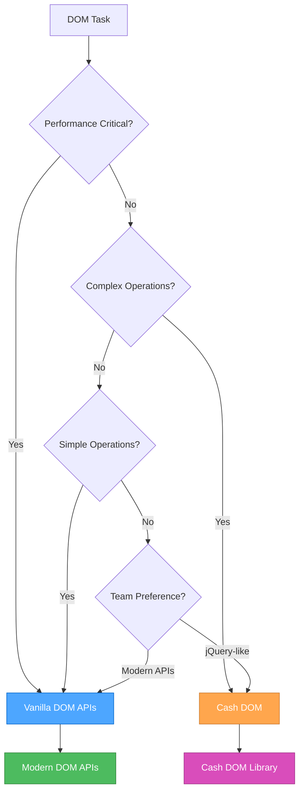

### 💾 **Storage Decision Tree**

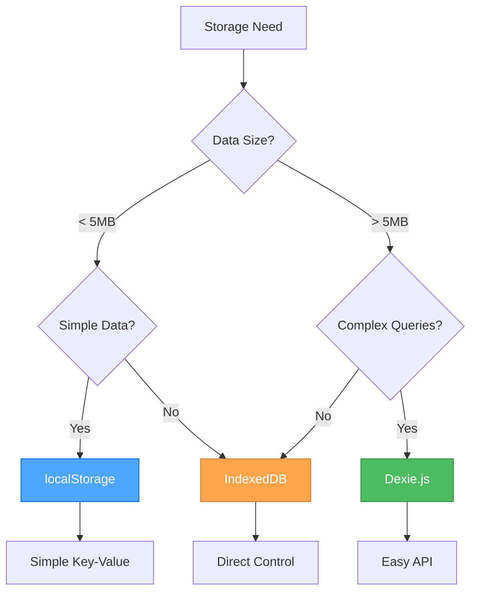

### 🚀 **Modern JavaScript Features Decision**

#### **When to Use ES2023+ Features:**

**✅ Use Modern Features When:**

- Targeting modern browsers (Chrome 90+, Firefox 88+, Safari 14+)
- Building new applications
- Performance is important
- Bundle size matters
- Team is comfortable with modern syntax

**⚠️ Consider Polyfills When:**

- Supporting older browsers
- Using cutting-edge features
- Need to maintain compatibility

**❌ Avoid When:**

- Supporting very old browsers (IE11 and below)
- Team lacks modern JavaScript experience
- Project requires maximum compatibility

### 📋 **Implementation Guidelines**

#### **For New Projects:**

1. **Start with Modern JavaScript**
   - Use ES2023+ features
   - Leverage modern DOM APIs
   - Implement proper error handling

2. **Choose Storage Based on Data**
   - Simple data → localStorage
   - Complex data → IndexedDB + Dexie.js

3. **Select DOM Approach**
   - Simple operations → Vanilla DOM
   - Complex operations → Cash DOM

#### **For Existing Projects:**

1. **Assess Current State**
   - Review existing patterns
   - Identify performance bottlenecks
   - Understand team preferences

2. **Gradual Migration**
   - Start with new features
   - Refactor critical paths
   - Maintain backward compatibility

3. **Document Decisions**
   - Record approach choices
   - Explain rationale
   - Update team guidelines

### 🔧 **Tool Integration**

#### **Perchance-Specific Considerations:**

```javascript
// Perchance projects often benefit from:
// 1. Cash DOM for quick DOM manipulation
// 2. localStorage for simple settings
// 3. IndexedDB + Dexie.js for character data
// 4. Modern JavaScript features for better code

// Example: Perchance character storage
const characterStorage = {
  // Simple settings in localStorage
  saveSettings(settings) {
    localStorage.setItem('perchance-settings', JSON.stringify(settings));
  },
  
  // Complex character data in IndexedDB
  async saveCharacter(character) {
    return await db.characters.add(character);
  },
  
  // Quick DOM updates with Cash DOM
  updateUI(character) {
    $('#character-name').text(character.name);
    $('#character-level').text(character.level);
  }
};
```

#### **Modern Web App Considerations:**

```javascript
// Modern web apps often benefit from:
// 1. Vanilla DOM for performance
// 2. Modern JavaScript features
// 3. IndexedDB for complex data
// 4. Service Workers for offline support

// Example: Modern web app patterns
class ModernApp {
  constructor() {
    this.useModernAPIs = this.checkModernSupport();
    this.storage = this.useModernAPIs ? new IndexedDBStorage() : new LocalStorage();
  }
  
  checkModernSupport() {
    return 'indexedDB' in window && 'fetch' in window;
  }
  
  async initialize() {
    if (this.useModernAPIs) {
      await this.setupServiceWorker();
      await this.setupIndexedDB();
    }
  }
}
```

### 📊 **Performance Comparison**

#### **Bundle Size Impact:**

| Approach | Bundle Size | Performance | Developer Experience |
|----------|-------------|-------------|---------------------|
| **Vanilla JS** | Minimal | Excellent | Good (with experience) |
| **Cash DOM** | ~3KB | Good | Excellent |
| **Dexie.js** | ~15KB | Good | Excellent |
| **Full jQuery** | ~30KB | Fair | Excellent |

#### **Performance Benchmarks:**

```javascript
// DOM manipulation performance (operations/second)
// Vanilla DOM: ~10,000 ops/sec
// Cash DOM: ~8,000 ops/sec
// jQuery: ~6,000 ops/sec

// Storage performance (read operations/second)
// localStorage: ~100,000 ops/sec
// IndexedDB: ~50,000 ops/sec
// Dexie.js: ~45,000 ops/sec
```

### 🎯 **Best Practices Summary**

#### **DO:**

- Choose the right tool for the job
- Consider performance requirements
- Factor in team expertise
- Plan for future maintenance
- Document your decisions
- Test across target browsers

#### **DON'T:**

- Use libraries just because they're popular
- Ignore bundle size impact
- Over-engineer simple solutions
- Mix approaches inconsistently
- Forget about browser support
- Skip performance testing

### 🔄 **Migration Strategies**

#### **From jQuery to Modern:**

1. **Replace selectors**: `$('#id')` → `document.querySelector('#id')`
2. **Replace methods**: `.addClass()` → `.classList.add()`
3. **Replace events**: `.on('click')` → `.addEventListener('click')`
4. **Replace AJAX**: `.ajax()` → `fetch()`

#### **From localStorage to IndexedDB:**

1. **Create migration utility**
2. **Transfer data gradually**
3. **Maintain backward compatibility**
4. **Update storage interfaces**

---

### References

- [Modern JavaScript Features](../.cursor/rules/js-modern-features.mdc) - ES2023+ features
- [DOM Manipulation](../.cursor/rules/js-dom-manipulation.mdc) - Vanilla DOM APIs
- [Cash DOM Usage](../.cursor/rules/js-cash-dom-usage.mdc) - jQuery-like DOM manipulation
- [Storage Strategy](../.cursor/rules/js-storage-strategy.mdc) - Client-side storage approaches
- [Dexie.js Usage](../.cursor/rules/js-dexie-usage.mdc) - IndexedDB with Dexie.js
- [IndexedDB Principles](../.cursor/rules/js-indexeddb-principles.mdc) - IndexedDB best practices
- [Modern APIs](../.cursor/rules/js-modern-apis.mdc) - Modern browser APIs
- [Patterns & Practices](../.cursor/rules/js-patterns-practices.mdc) - JavaScript best practices

---

<a id="rulesjs-indexeddb-principlesmd"></a>
## rules\js-indexeddb-principles.md

## IndexedDB Principles

### Scope

- Covers client-side storage for Perchance and web apps.
- Outlines schema design, versioning, and upgrade strategies.
- References Dexie.js and Perchance plugin storage.

---

### Core Principles

- **Client-Side Only:**  
    IndexedDB is used for persistent storage in the browser.
- **Schema Versioning:**  
    Always version your database schema and handle upgrades gracefully.
- **Atomic Transactions:**  
    Use transactions for reliable, consistent data operations.
- **Dexie.js Recommended:**  
    Use [Dexie.js](https://dexie.org/) for a simpler IndexedDB API.

---

### Best Practices

- Use a single database per app, with versioned object stores.
- Handle upgrade events to migrate data safely.
- Test storage logic in the Perchance editor and in production.

---

### Example: Dexie.js Setup

```js
const db = new Dexie("MyAppDB");
db.version(1).stores({
  characters: "++id,name,data"
});
```

---

### Related Rules

- [Perchance Architecture](../.cursor/rules/perchance-architecture.mdc)
- [JavaScript Development](../.cursor/rules/js-development.mdc)

---

### References & Inspiration

- [Dexie.js Docs](https://dexie.org/docs/Tutorial/)
- [Dexie.js Best Practices](https://dexie.org/docs/Tutorial/Best-Practices)
- [Perchance Plugins](https://perchance.org/plugins)
- [Perchance AI Character Chat Dependencies](https://perchance.org/ai-character-chat-dependencies-v1)

---

<a id="rulesjs-modern-apismd"></a>
## rules\js-modern-apis.md

## Modern Browser APIs

### Fetch API

#### **Basic Usage**

```javascript
// Simple GET request
async function fetchData(url) {
  try {
    const response = await fetch(url);
    if (!response.ok) {
      throw new Error(`HTTP error! status: ${response.status}`);
    }
    return await response.json();
  } catch (error) {
    console.error('Error fetching data:', error);
    throw error;
  }
}

// POST request with JSON data
async function postData(url, data) {
  try {
    const response = await fetch(url, {
      method: 'POST',
      headers: {
        'Content-Type': 'application/json',
      },
      body: JSON.stringify(data)
    });
    
    if (!response.ok) {
      throw new Error(`HTTP error! status: ${response.status}`);
    }
    
    return await response.json();
  } catch (error) {
    console.error('Error posting data:', error);
    throw error;
  }
}
```

#### **Advanced Fetch Patterns**

```javascript
// Fetch with timeout
async function fetchWithTimeout(url, timeout = 5000) {
  const controller = new AbortController();
  const timeoutId = setTimeout(() => controller.abort(), timeout);
  
  try {
    const response = await fetch(url, { signal: controller.signal });
    clearTimeout(timeoutId);
    return response;
  } catch (error) {
    clearTimeout(timeoutId);
    throw error;
  }
}

// Fetch with retry logic
async function fetchWithRetry(url, options = {}, maxRetries = 3) {
  for (let i = 0; i < maxRetries; i++) {
    try {
      const response = await fetch(url, options);
      if (!response.ok) {
        throw new Error(`HTTP error! status: ${response.status}`);
      }
      return response;
    } catch (error) {
      if (i === maxRetries - 1) throw error;
      await new Promise(resolve => setTimeout(resolve, 1000 * (i + 1))); // Exponential backoff
    }
  }
}

// Fetch utility with default options
const fetchApi = {
  async get(url, options = {}) {
    const defaultOptions = {
      headers: {
        'Content-Type': 'application/json',
      },
      ...options
    };
    
    const response = await fetch(url, defaultOptions);
    
    if (!response.ok) {
      throw new Error(`HTTP error! status: ${response.status}`);
    }
    
    return response.json();
  },
  
  async post(url, data, options = {}) {
    const defaultOptions = {
      method: 'POST',
      headers: {
        'Content-Type': 'application/json',
      },
      body: JSON.stringify(data),
      ...options
    };
    
    const response = await fetch(url, defaultOptions);
    
    if (!response.ok) {
      throw new Error(`HTTP error! status: ${response.status}`);
    }
    
    return response.json();
  },
  
  async put(url, data, options = {}) {
    const defaultOptions = {
      method: 'PUT',
      headers: {
        'Content-Type': 'application/json',
      },
      body: JSON.stringify(data),
      ...options
    };
    
    const response = await fetch(url, defaultOptions);
    
    if (!response.ok) {
      throw new Error(`HTTP error! status: ${response.status}`);
    }
    
    return response.json();
  },
  
  async delete(url, options = {}) {
    const defaultOptions = {
      method: 'DELETE',
      ...options
    };
    
    const response = await fetch(url, defaultOptions);
    
    if (!response.ok) {
      throw new Error(`HTTP error! status: ${response.status}`);
    }
    
    return response.json();
  }
};
```

#### **Form Data and File Upload**

```javascript
// Form data submission
async function submitForm(formElement) {
  const formData = new FormData(formElement);
  
  const response = await fetch('/api/submit', {
    method: 'POST',
    body: formData
  });
  
  return response.json();
}

// File upload
async function uploadFile(file, url) {
  const formData = new FormData();
  formData.append('file', file);
  
  const response = await fetch(url, {
    method: 'POST',
    body: formData
  });
  
  return response.json();
}

// Multiple file upload with progress
async function uploadFiles(files, url, onProgress) {
  const formData = new FormData();
  
  Array.from(files).forEach((file, index) => {
    formData.append(`file${index}`, file);
  });
  
  const xhr = new XMLHttpRequest();
  
  return new Promise((resolve, reject) => {
    xhr.upload.addEventListener('progress', (event) => {
      if (event.lengthComputable) {
        const percentComplete = (event.loaded / event.total) * 100;
        onProgress(percentComplete);
      }
    });
    
    xhr.addEventListener('load', () => {
      if (xhr.status === 200) {
        resolve(JSON.parse(xhr.responseText));
      } else {
        reject(new Error(`Upload failed: ${xhr.status}`));
      }
    });
    
    xhr.addEventListener('error', () => {
      reject(new Error('Upload failed'));
    });
    
    xhr.open('POST', url);
    xhr.send(formData);
  });
}
```

### Intersection Observer

#### **Intersection Observer Basic Usage**

```javascript
// Simple intersection observer
const observer = new IntersectionObserver((entries) => {
  entries.forEach(entry => {
    if (entry.isIntersecting) {
      entry.target.classList.add('visible');
    } else {
      entry.target.classList.remove('visible');
    }
  });
}, {
  threshold: 0.1,
  rootMargin: '50px'
});

// Observe elements
document.querySelectorAll('.observe').forEach(el => {
  observer.observe(el);
});
```

#### **Intersection Observer Patterns**

```javascript
// Lazy loading images
const lazyImageObserver = new IntersectionObserver((entries) => {
  entries.forEach(entry => {
    if (entry.isIntersecting) {
      const img = entry.target;
      img.src = img.dataset.src;
      img.classList.remove('lazy');
      lazyImageObserver.unobserve(img);
    }
  });
}, {
  threshold: 0.1,
  rootMargin: '100px'
});

document.querySelectorAll('img[data-src]').forEach(img => {
  lazyImageObserver.observe(img);
});

// Infinite scroll
const infiniteScrollObserver = new IntersectionObserver((entries) => {
  entries.forEach(entry => {
    if (entry.isIntersecting) {
      loadMoreContent();
    }
  });
}, {
  threshold: 0.1,
  rootMargin: '200px'
});

// Observe the last item in the list
const observeLastItem = () => {
  const items = document.querySelectorAll('.list-item');
  if (items.length > 0) {
    infiniteScrollObserver.observe(items[items.length - 1]);
  }
};

// Animation on scroll
const animationObserver = new IntersectionObserver((entries) => {
  entries.forEach(entry => {
    if (entry.isIntersecting) {
      entry.target.style.animation = 'fadeIn 0.6s ease-in-out';
    }
  });
}, {
  threshold: 0.2,
  rootMargin: '50px'
});

document.querySelectorAll('.animate-on-scroll').forEach(el => {
  animationObserver.observe(el);
});
```

### Resize Observer

#### **Resize Observer Basic Usage**

```javascript
// Monitor element size changes
const resizeObserver = new ResizeObserver(entries => {
  entries.forEach(entry => {
    const { width, height } = entry.contentRect;
    console.log(`Element resized to ${width}x${height}`);
    
    // Handle resize logic
    updateLayout(width, height);
  });
});

// Observe specific elements
const element = document.querySelector('.resizable');
resizeObserver.observe(element);
```

#### **Resize Observer Patterns**

```javascript
// Responsive layout updates
const responsiveObserver = new ResizeObserver(entries => {
  entries.forEach(entry => {
    const { width } = entry.contentRect;
    const element = entry.target;
    
    // Update layout based on width
    if (width < 768) {
      element.classList.add('mobile-layout');
      element.classList.remove('desktop-layout');
    } else {
      element.classList.add('desktop-layout');
      element.classList.remove('mobile-layout');
    }
  });
});

// Observe container elements
document.querySelectorAll('.responsive-container').forEach(el => {
  responsiveObserver.observe(el);
});

// Debounced resize handling
const debouncedResizeObserver = new ResizeObserver((entries) => {
  // Debounce resize events
  clearTimeout(window.resizeTimeout);
  window.resizeTimeout = setTimeout(() => {
    entries.forEach(entry => {
      handleResize(entry);
    });
  }, 100);
});
```

### Service Worker API

#### **Basic Service Worker**

```javascript
// Service worker registration
if ('serviceWorker' in navigator) {
  navigator.serviceWorker.register('/sw.js')
    .then(registration => {
      console.log('Service Worker registered:', registration);
    })
    .catch(error => {
      console.error('Service Worker registration failed:', error);
    });
}

// Service worker file (sw.js)
self.addEventListener('install', (event) => {
  console.log('Service Worker installing...');
  self.skipWaiting();
});

self.addEventListener('activate', (event) => {
  console.log('Service Worker activating...');
  event.waitUntil(self.clients.claim());
});

self.addEventListener('fetch', (event) => {
  // Cache-first strategy
  event.respondWith(
    caches.match(event.request)
      .then(response => {
        return response || fetch(event.request);
      })
  );
});
```

#### **Service Worker Caching Strategies**

```javascript
// Cache-first strategy
self.addEventListener('fetch', (event) => {
  event.respondWith(
    caches.match(event.request)
      .then(response => {
        if (response) {
          return response;
        }
        return fetch(event.request).then(response => {
          if (!response || response.status !== 200 || response.type !== 'basic') {
            return response;
          }
          const responseToCache = response.clone();
          caches.open('v1').then(cache => {
            cache.put(event.request, responseToCache);
          });
          return response;
        });
      })
  );
});

// Network-first strategy
self.addEventListener('fetch', (event) => {
  event.respondWith(
    fetch(event.request)
      .then(response => {
        const responseToCache = response.clone();
        caches.open('v1').then(cache => {
          cache.put(event.request, responseToCache);
        });
        return response;
      })
      .catch(() => {
        return caches.match(event.request);
      })
  );
});
```

### Web Storage APIs

#### **Local Storage**

```javascript
// Local storage utility
const localStorage = {
  set(key, value) {
    try {
      window.localStorage.setItem(key, JSON.stringify(value));
      return true;
    } catch (error) {
      console.error('LocalStorage set error:', error);
      return false;
    }
  },
  
  get(key, defaultValue = null) {
    try {
      const item = window.localStorage.getItem(key);
      return item ? JSON.parse(item) : defaultValue;
    } catch (error) {
      console.error('LocalStorage get error:', error);
      return defaultValue;
    }
  },
  
  remove(key) {
    window.localStorage.removeItem(key);
  },
  
  clear() {
    window.localStorage.clear();
  },
  
  // Check available space
  getAvailableSpace() {
    const testKey = '__storage_test__';
    const testValue = 'x'.repeat(1024 * 1024); // 1MB
    let available = 0;
    
    try {
      window.localStorage.setItem(testKey, testValue);
      available += testValue.length;
      
      while (true) {
        window.localStorage.setItem(testKey, testValue + testValue);
        available += testValue.length;
      }
    } catch (e) {
      window.localStorage.removeItem(testKey);
    }
    
    return available;
  }
};
```

#### **Session Storage**

```javascript
// Session storage utility
const sessionStorage = {
  set(key, value) {
    try {
      window.sessionStorage.setItem(key, JSON.stringify(value));
      return true;
    } catch (error) {
      console.error('SessionStorage set error:', error);
      return false;
    }
  },
  
  get(key, defaultValue = null) {
    try {
      const item = window.sessionStorage.getItem(key);
      return item ? JSON.parse(item) : defaultValue;
    } catch (error) {
      console.error('SessionStorage get error:', error);
      return defaultValue;
    }
  },
  
  remove(key) {
    window.sessionStorage.removeItem(key);
  },
  
  clear() {
    window.sessionStorage.clear();
  }
};
```

### Web Workers

#### **Web Worker Basic Usage**

```javascript
// Main thread
const worker = new Worker('worker.js');

worker.postMessage({
  type: 'calculate',
  data: { a: 10, b: 20 }
});

worker.onmessage = (event) => {
  console.log('Result from worker:', event.data);
};

worker.onerror = (error) => {
  console.error('Worker error:', error);
};

// Worker file (worker.js)
self.onmessage = (event) => {
  const { type, data } = event.data;
  
  switch (type) {
    case 'calculate':
      const result = data.a + data.b;
      self.postMessage({ type: 'result', data: result });
      break;
      
    default:
      self.postMessage({ type: 'error', data: 'Unknown message type' });
  }
};
```

#### **Shared Web Worker**

```javascript
// Shared worker for cross-tab communication
const sharedWorker = new SharedWorker('shared-worker.js');

sharedWorker.port.onmessage = (event) => {
  console.log('Message from shared worker:', event.data);
};

sharedWorker.port.postMessage({
  type: 'register',
  data: { tabId: Date.now() }
});

// Shared worker file (shared-worker.js)
const connections = [];

self.onconnect = (event) => {
  const port = event.ports[0];
  connections.push(port);
  
  port.onmessage = (event) => {
    const { type, data } = event.data;
    
    switch (type) {
      case 'register':
        port.postMessage({ type: 'registered', data: { tabId: data.tabId } });
        break;
        
      case 'broadcast':
        // Broadcast to all connected tabs
        connections.forEach(conn => {
          if (conn !== port) {
            conn.postMessage({ type: 'broadcast', data });
          }
        });
        break;
    }
  };
};
```

---

### References

- [Modern JavaScript Features](../.cursor/rules/js-modern-features.mdc) - ES2023+ features
- [DOM Manipulation](../.cursor/rules/js-dom-manipulation.mdc) - Modern DOM APIs
- [Storage Strategy](../.cursor/rules/js-storage-strategy.mdc) - Client-side storage approaches

---

<a id="rulesjs-modern-featuresmd"></a>
## rules\js-modern-features.md

## Modern JavaScript Features (ES2023+)

### Template Literals and String Manipulation

```javascript
// Multi-line strings with template literals
const str = `
  ECMA International's TC39 is a group of JavaScript developers,
  implementers, academics, and more, collaborating with the community
  to maintain and evolve the definition of JavaScript.
`;

// Expression interpolation
function sum(a, b) {
  return a + b;
}
console.log(`1 + 2 = ${sum(1, 2)}.`); // "1 + 2 = 3."

// Tagged templates
function highlight(strings, ...values) {
  return strings.reduce((result, str, i) => {
    return result + str + (values[i] ? `<mark>${values[i]}</mark>` : '');
  }, '');
}
const message = highlight`Hello ${name}, welcome to ${site}!`;
```

### Modern Array Methods

```javascript
// Array iteration with for...of (preferred over for...in for arrays)
const fruits = ["Apple", "Orange", "Plum"];
for (const fruit of fruits) {
  console.log(fruit);
}

// Modern array methods
const numbers = [1, 2, 3, 4, 5];

// Array.from with mapping
const doubled = Array.from(numbers, x => x * 2);

// Array destructuring
const [first, second, ...rest] = numbers;

// Array spreading
const combined = [...numbers, 6, 7, 8];

// Array methods with arrow functions
const evens = numbers.filter(n => n % 2 === 0);
const doubled = numbers.map(n => n * 2);
const sum = numbers.reduce((acc, n) => acc + n, 0);
```

### Object Features

```javascript
// Object destructuring
const user = {
  name: "John",
  age: 30,
  preferences: {
    theme: "dark",
    language: "en"
  }
};

const { name, age, preferences: { theme } } = user;

// Dynamic property access
const key = "likes birds";
user[key] = true;

// Object spreading
const userWithDefaults = {
  role: "user",
  active: true,
  ...user
};

// Object shorthand
const name = "John";
const age = 30;
const person = { name, age }; // { name: "John", age: 30 }

// Optional chaining
const theme = user?.preferences?.theme;
const result = api?.getData?.()?.items;

// Nullish coalescing
function showCount(count) {
  console.log(count ?? "unknown");
}
showCount(0); // 0
showCount(null); // "unknown"
showCount(); // "unknown"
```

### Modern Functions

```javascript
// Arrow functions
const sum = (a, b) => a + b;
const double = n => n * 2;
const sayHi = () => console.log("Hello");

// Arrow functions with implicit return
const numbers = [1, 2, 3, 4];
const doubled = numbers.map(n => n * 2);

// Arrow functions for context binding
const user = {
  name: "John",
  sayHi() {
    setTimeout(() => console.log(`Hello, ${this.name}!`), 1000);
  }
};

// Default parameters
function showMessage(from, text = "no text given") {
  console.log(`${from}: ${text}`);
}

// Rest parameters
function sum(...numbers) {
  return numbers.reduce((acc, n) => acc + n, 0);
}

// Function name inference
const sayHi = function() {
  console.log("Hi");
};
console.log(sayHi.name); // "sayHi"
```

### Promise and Async/Await

```javascript
// Modern async/await syntax
async function fetchUserData(userId) {
  try {
    const response = await fetch(`/api/users/${userId}`);
    if (!response.ok) {
      throw new Error(`HTTP error! status: ${response.status}`);
    }
    const user = await response.json();
    return user;
  } catch (error) {
    console.error('Error fetching user:', error);
    throw error;
  }
}

// Top-level await (in modules)
const response = await fetch('/api/data');
const data = await response.json();

// Promise.all for parallel requests
async function fetchMultipleUsers(userIds) {
  const promises = userIds.map(id => fetchUserData(id));
  const users = await Promise.all(promises);
  return users;
}

// Promise.race for timeout
async function fetchWithTimeout(url, timeout = 5000) {
  const controller = new AbortController();
  const timeoutId = setTimeout(() => controller.abort(), timeout);
  
  try {
    const response = await fetch(url, { signal: controller.signal });
    clearTimeout(timeoutId);
    return response;
  } catch (error) {
    clearTimeout(timeoutId);
    throw error;
  }
}
```

### Module Pattern

```javascript
// ES6 Modules
// utils.js
export const formatDate = (date) => {
  return new Intl.DateTimeFormat('en-US').format(date);
};

export const debounce = (func, wait) => {
  let timeout;
  return function executedFunction(...args) {
    const later = () => {
      clearTimeout(timeout);
      func(...args);
    };
    clearTimeout(timeout);
    timeout = setTimeout(later, wait);
  };
};

export default class Utils {
  static formatCurrency(amount, currency = 'USD') {
    return new Intl.NumberFormat('en-US', {
      style: 'currency',
      currency
    }).format(amount);
  }
}

// main.js
import Utils, { formatDate, debounce } from './utils.js';

// Dynamic imports
const loadModule = async () => {
  const module = await import('./dynamic-module.js');
  module.default();
};
```

### Class Patterns

```javascript
// Modern class syntax
class User {
  #privateField = 'private';
  
  constructor(name, email) {
    this.name = name;
    this.email = email;
  }
  
  // Getter
  get displayName() {
    return `${this.name} (${this.email})`;
  }
  
  // Setter
  set displayName(value) {
    const [name, email] = value.split(' (');
    this.name = name;
    this.email = email.replace(')', '');
  }
  
  // Static method
  static createFromJSON(json) {
    return new User(json.name, json.email);
  }
  
  // Instance method
  sayHello() {
    console.log(`Hello, I'm ${this.name}`);
  }
}

// Class inheritance
class AdminUser extends User {
  constructor(name, email, permissions = []) {
    super(name, email);
    this.permissions = permissions;
  }
  
  hasPermission(permission) {
    return this.permissions.includes(permission);
  }
}
```

### Error Handling

```javascript
// Modern error handling
class CustomError extends Error {
  constructor(message, code) {
    super(message);
    this.name = 'CustomError';
    this.code = code;
  }
}

// Try-catch with async/await
async function handleAsyncOperation() {
  try {
    const result = await riskyOperation();
    return result;
  } catch (error) {
    if (error instanceof CustomError) {
      console.error(`Custom error: ${error.message}`);
    } else {
      console.error('Unexpected error:', error);
    }
    throw error;
  } finally {
    // Cleanup code
    cleanup();
  }
}

// Error boundaries
window.addEventListener('error', (event) => {
  console.error('Global error:', event.error);
  // Send to error reporting service
});

window.addEventListener('unhandledrejection', (event) => {
  console.error('Unhandled promise rejection:', event.reason);
  event.preventDefault();
});
```

---

### References

- [JavaScript Development](../.cursor/rules/js-development.mdc) - Comprehensive JavaScript guide
- [DOM Manipulation](../.cursor/rules/js-dom-manipulation.mdc) - Modern DOM APIs
- [Storage Strategy](../.cursor/rules/js-storage-strategy.mdc) - Client-side storage approaches

---

<a id="rulesjs-patterns-practicesmd"></a>
## rules\js-patterns-practices.md

## JavaScript Patterns and Best Practices

### Performance Optimization

#### **Debouncing**

```javascript
// Debouncing for expensive operations
const debounce = (func, wait) => {
  let timeout;
  return function executedFunction(...args) {
    const later = () => {
      clearTimeout(timeout);
      func(...args);
    };
    clearTimeout(timeout);
    timeout = setTimeout(later, wait);
  };
};

// Usage examples
const debouncedSearch = debounce((query) => {
  // Expensive search operation
  performSearch(query);
}, 300);

const debouncedResize = debounce(() => {
  // Handle window resize
  updateLayout();
}, 100);
```

#### **Throttling**

```javascript
// Throttling for rate limiting
const throttle = (func, limit) => {
  let inThrottle;
  return function() {
    const args = arguments;
    const context = this;
    if (!inThrottle) {
      func.apply(context, args);
      inThrottle = true;
      setTimeout(() => inThrottle = false, limit);
    }
  };
};

// Usage examples
const throttledScroll = throttle(() => {
  // Handle scroll events
  updateScrollPosition();
}, 16); // ~60fps

const throttledInput = throttle((value) => {
  // Handle input changes
  validateInput(value);
}, 100);
```

#### **Memoization**

```javascript
// Memoization for expensive calculations
const memoize = (fn) => {
  const cache = new Map();
  return (...args) => {
    const key = JSON.stringify(args);
    if (cache.has(key)) {
      return cache.get(key);
    }
    const result = fn.apply(this, args);
    cache.set(key, result);
    return result;
  };
};

// Usage examples
const expensiveCalculation = memoize((a, b) => {
  // Expensive computation
  return a * b + Math.pow(a, 2) + Math.pow(b, 2);
});

const fibonacci = memoize((n) => {
  if (n <= 1) return n;
  return fibonacci(n - 1) + fibonacci(n - 2);
});
```

#### **Lazy Loading**

```javascript
// Lazy loading with Intersection Observer
const lazyLoad = (selector, callback) => {
  const observer = new IntersectionObserver((entries) => {
    entries.forEach(entry => {
      if (entry.isIntersecting) {
        callback(entry.target);
        observer.unobserve(entry.target);
      }
    });
  });
  
  document.querySelectorAll(selector).forEach(el => {
    observer.observe(el);
  });
};

// Usage
lazyLoad('.lazy-image', (img) => {
  img.src = img.dataset.src;
  img.classList.remove('lazy');
});

// Dynamic imports for code splitting
const loadModule = async (moduleName) => {
  try {
    const module = await import(`./modules/${moduleName}.js`);
    return module.default;
  } catch (error) {
    console.error(`Failed to load module: ${moduleName}`, error);
    return null;
  }
};
```

### Code Organization

#### **Utility Functions**

```javascript
// Utility functions for common operations
const utils = {
  // Type checking
  isString: (value) => typeof value === 'string',
  isNumber: (value) => typeof value === 'number' && !isNaN(value),
  isArray: (value) => Array.isArray(value),
  isObject: (value) => typeof value === 'object' && value !== null,
  isFunction: (value) => typeof value === 'function',
  
  // DOM utilities
  $: (selector) => document.querySelector(selector),
  $$: (selector) => document.querySelectorAll(selector),
  
  // Event utilities
  on: (element, event, handler) => element.addEventListener(event, handler),
  off: (element, event, handler) => element.removeEventListener(event, handler),
  
  // Storage utilities
  storage: {
    set: (key, value) => localStorage.setItem(key, JSON.stringify(value)),
    get: (key) => {
      try {
        return JSON.parse(localStorage.getItem(key));
      } catch {
        return null;
      }
    }
  },
  
  // String utilities
  capitalize: (str) => str.charAt(0).toUpperCase() + str.slice(1),
  slugify: (str) => str.toLowerCase().replace(/[^a-z0-9]+/g, '-').replace(/(^-|-$)/g, ''),
  
  // Array utilities
  unique: (arr) => [...new Set(arr)],
  chunk: (arr, size) => {
    const chunks = [];
    for (let i = 0; i < arr.length; i += size) {
      chunks.push(arr.slice(i, i + size));
    }
    return chunks;
  }
};
```

#### **Configuration Management**

```javascript
// Configuration object
const config = {
  api: {
    baseUrl: 'https://api.example.com',
    timeout: 5000,
    retries: 3
  },
  features: {
    darkMode: true,
    animations: true,
    offline: false
  },
  storage: {
    prefix: 'app_',
    ttl: 3600000 // 1 hour
  }
};

// Environment-based configuration
const env = {
  development: {
    api: { baseUrl: 'http://localhost:3000' },
    debug: true
  },
  production: {
    api: { baseUrl: 'https://api.production.com' },
    debug: false
  }
};

const currentConfig = {
  ...config,
  ...env[process.env.NODE_ENV || 'development']
};
```

#### **Feature Detection**

```javascript
// Feature detection for progressive enhancement
const features = {
  supportsIntersectionObserver: 'IntersectionObserver' in window,
  supportsResizeObserver: 'ResizeObserver' in window,
  supportsFetch: 'fetch' in window,
  supportsServiceWorker: 'serviceWorker' in navigator,
  supportsIndexedDB: 'indexedDB' in window,
  supportsLocalStorage: (() => {
    try {
      localStorage.setItem('test', 'test');
      localStorage.removeItem('test');
      return true;
    } catch {
      return false;
    }
  })()
};

// Conditional feature usage
if (features.supportsIntersectionObserver) {
  // Use Intersection Observer
  setupLazyLoading();
} else {
  // Fallback to scroll events
  setupScrollBasedLazyLoading();
}
```

### Error Handling

#### **Custom Error Classes**

```javascript
// Custom error classes for better error handling
class ValidationError extends Error {
  constructor(message, field) {
    super(message);
    this.name = 'ValidationError';
    this.field = field;
  }
}

class NetworkError extends Error {
  constructor(message, status, url) {
    super(message);
    this.name = 'NetworkError';
    this.status = status;
    this.url = url;
  }
}

class StorageError extends Error {
  constructor(message, operation) {
    super(message);
    this.name = 'StorageError';
    this.operation = operation;
  }
}
```

#### **Error Boundaries**

```javascript
// Global error handling
window.addEventListener('error', (event) => {
  console.error('Global error:', event.error);
  logError(event.error, {
    type: 'global',
    url: window.location.href,
    userAgent: navigator.userAgent
  });
});

window.addEventListener('unhandledrejection', (event) => {
  console.error('Unhandled promise rejection:', event.reason);
  logError(event.reason, {
    type: 'promise',
    url: window.location.href
  });
  event.preventDefault();
});

// Error logging utility
const logError = (error, context = {}) => {
  const errorInfo = {
    message: error.message,
    stack: error.stack,
    name: error.name,
    context,
    timestamp: new Date().toISOString(),
    userAgent: navigator.userAgent,
    url: window.location.href
  };
  
  console.error('Error occurred:', errorInfo);
  
  // Send to error reporting service
  if (window.errorReportingService) {
    window.errorReportingService.captureException(error, { extra: context });
  }
  
  // Store locally for debugging
  const errors = JSON.parse(localStorage.getItem('app_errors') || '[]');
  errors.push(errorInfo);
  localStorage.setItem('app_errors', JSON.stringify(errors.slice(-10))); // Keep last 10
};
```

### Testing and Debugging

#### **Modern Debugging**

```javascript
// Modern debugging techniques
console.log('Debug info:', { user, timestamp: Date.now() });
console.table(data);
console.group('Grouped logs');
console.groupEnd();

// Performance measurement
console.time('operation');
// ... operation
console.timeEnd('operation');

// Assertions
console.assert(condition, 'Assertion failed');

// Conditional logging
const DEBUG = true;
const debug = DEBUG ? console.log.bind(console) : () => {};

// Debug utilities
const debugUtils = {
  log: (message, data) => {
    if (DEBUG) {
      console.log(`[DEBUG] ${message}`, data);
    }
  },
  
  time: (label) => {
    if (DEBUG) {
      console.time(label);
    }
  },
  
  timeEnd: (label) => {
    if (DEBUG) {
      console.timeEnd(label);
    }
  },
  
  trace: (message) => {
    if (DEBUG) {
      console.trace(message);
    }
  }
};
```

#### **Testing Utilities**

```javascript
// Simple testing utilities
const test = {
  assert: (condition, message) => {
    if (!condition) {
      throw new Error(`Assertion failed: ${message}`);
    }
  },
  
  assertEquals: (actual, expected, message) => {
    if (actual !== expected) {
      throw new Error(`Assertion failed: ${message}. Expected ${expected}, got ${actual}`);
    }
  },
  
  assertArrayEquals: (actual, expected, message) => {
    if (!Array.isArray(actual) || !Array.isArray(expected)) {
      throw new Error(`Assertion failed: ${message}. Both arguments must be arrays`);
    }
    if (actual.length !== expected.length) {
      throw new Error(`Assertion failed: ${message}. Array lengths differ`);
    }
    for (let i = 0; i < actual.length; i++) {
      if (actual[i] !== expected[i]) {
        throw new Error(`Assertion failed: ${message}. Arrays differ at index ${i}`);
      }
    }
  }
};

// Usage example
try {
  test.assertEquals(sum(2, 3), 5, 'Basic addition');
  test.assertArrayEquals([1, 2, 3], [1, 2, 3], 'Array comparison');
  console.log('All tests passed!');
} catch (error) {
  console.error('Test failed:', error.message);
}
```

### Code Quality Patterns

#### **Clean Code Principles**

```javascript
// Meaningful variable names
const userPreferences = getUserPreferences();
const isUserLoggedIn = checkUserLoginStatus();
const hasValidPermissions = validateUserPermissions();

// Small, focused functions
const calculateTotalPrice = (items) => {
  return items.reduce((total, item) => total + item.price, 0);
};

const applyDiscount = (total, discountPercent) => {
  return total * (1 - discountPercent / 100);
};

const formatCurrency = (amount) => {
  return new Intl.NumberFormat('en-US', {
    style: 'currency',
    currency: 'USD'
  }).format(amount);
};

// Single responsibility
const processOrder = (order) => {
  const total = calculateTotalPrice(order.items);
  const discountedTotal = applyDiscount(total, order.discount);
  const formattedTotal = formatCurrency(discountedTotal);
  
  return {
    ...order,
    total: discountedTotal,
    formattedTotal
  };
};
```

#### **Consistent Code Style**

```javascript
// Consistent naming conventions
const CONSTANTS = {
  API_BASE_URL: 'https://api.example.com',
  MAX_RETRIES: 3,
  TIMEOUT_MS: 5000
};

// Consistent function declarations
const arrowFunction = () => {
  // Use for simple functions
};

function regularFunction() {
  // Use for more complex functions
}

// Consistent error handling
const safeOperation = async () => {
  try {
    const result = await riskyOperation();
    return { success: true, data: result };
  } catch (error) {
    logError(error);
    return { success: false, error: error.message };
  }
};
```

---

### References

- [Modern JavaScript Features](../.cursor/rules/js-modern-features.mdc) - ES2023+ features
- [DOM Manipulation](../.cursor/rules/js-dom-manipulation.mdc) - Modern DOM APIs
- [Storage Strategy](../.cursor/rules/js-storage-strategy.mdc) - Client-side storage approaches

---

<a id="rulesjs-storage-strategymd"></a>
## rules\js-storage-strategy.md

## Client-Side Storage Strategy

### Storage Decision Framework

#### **When to Use localStorage**

**✅ Perfect for:**

- Simple key-value data (settings, preferences, user choices)
- Small amounts of data (< 5MB total)
- Data that doesn't need complex querying
- Temporary data that can be lost
- Simple caching scenarios
- Cross-tab data sharing

**❌ Avoid for:**

- Large datasets (> 5MB)
- Complex data structures requiring queries
- Sensitive data (easily accessible)
- Data requiring transactions
- Binary data or files

#### **When to Use IndexedDB**

**✅ Perfect for:**

- Large datasets (> 5MB)
- Complex data structures requiring queries
- Binary data (images, files)
- Data requiring transactions and consistency
- Offline-first applications
- Complex caching scenarios
- Data that needs to persist across sessions

**❌ Avoid for:**

- Simple key-value storage
- Small amounts of data
- Quick prototyping
- Simple settings storage

#### **When to Use Dexie.js**

**✅ Perfect for:**

- All IndexedDB use cases
- Complex queries and relationships
- Schema versioning and migrations
- Transaction management
- Better developer experience
- Perchance projects requiring robust storage

**❌ Avoid for:**

- Simple localStorage scenarios
- When bundle size is critical
- When you need direct IndexedDB control

### localStorage Implementation

```javascript
// Local Storage utility
const storage = {
  set(key, value) {
    try {
      localStorage.setItem(key, JSON.stringify(value));
      return true;
    } catch (error) {
      console.error('Storage quota exceeded:', error);
      return false;
    }
  },
  
  get(key, defaultValue = null) {
    try {
      const item = localStorage.getItem(key);
      return item ? JSON.parse(item) : defaultValue;
    } catch (error) {
      console.error('Error reading from storage:', error);
      return defaultValue;
    }
  },
  
  remove(key) {
    localStorage.removeItem(key);
  },
  
  clear() {
    localStorage.clear();
  },
  
  // Check available space
  getAvailableSpace() {
    const testKey = '__storage_test__';
    const testValue = 'x'.repeat(1024 * 1024); // 1MB
    let available = 0;
    
    try {
      localStorage.setItem(testKey, testValue);
      available += testValue.length;
      
      while (true) {
        localStorage.setItem(testKey, testValue + testValue);
        available += testValue.length;
      }
    } catch (e) {
      localStorage.removeItem(testKey);
    }
    
    return available;
  }
};

// Usage examples
storage.set('user-preferences', { theme: 'dark', language: 'en' });
const prefs = storage.get('user-preferences', { theme: 'light' });
```

### IndexedDB with Dexie.js

```javascript
// Dexie.js setup
import Dexie from 'https://cdn.jsdelivr.net/npm/dexie@3.2.2/dist/dexie.mjs';

const db = new Dexie('MyAppDB');

// Schema definition with versioning
db.version(1).stores({
  characters: '++id,name,data,createdAt',
  settings: 'key,value,updatedAt',
  cache: 'url,data,expiresAt'
});

// Character management
const characterService = {
  async add(character) {
    return await db.characters.add({
      ...character,
      createdAt: new Date().toISOString()
    });
  },
  
  async get(id) {
    return await db.characters.get(id);
  },
  
  async getAll() {
    return await db.characters.toArray();
  },
  
  async update(id, updates) {
    return await db.characters.update(id, updates);
  },
  
  async delete(id) {
    return await db.characters.delete(id);
  },
  
  async search(query) {
    return await db.characters
      .where('name')
      .startsWithIgnoreCase(query)
      .toArray();
  }
};

// Settings management
const settingsService = {
  async set(key, value) {
    return await db.settings.put({
      key,
      value,
      updatedAt: new Date().toISOString()
    });
  },
  
  async get(key, defaultValue = null) {
    const setting = await db.settings.get(key);
    return setting ? setting.value : defaultValue;
  },
  
  async getAll() {
    const settings = await db.settings.toArray();
    return settings.reduce((acc, setting) => {
      acc[setting.key] = setting.value;
      return acc;
    }, {});
  }
};

// Cache management
const cacheService = {
  async set(url, data, ttl = 3600000) { // 1 hour default
    const expiresAt = new Date(Date.now() + ttl).toISOString();
    return await db.cache.put({ url, data, expiresAt });
  },
  
  async get(url) {
    const cached = await db.cache.get(url);
    if (!cached) return null;
    
    if (new Date(cached.expiresAt) < new Date()) {
      await db.cache.delete(url);
      return null;
    }
    
    return cached.data;
  },
  
  async cleanup() {
    const now = new Date().toISOString();
    return await db.cache
      .where('expiresAt')
      .below(now)
      .delete();
  }
};
```

### Hybrid Storage Strategy

```javascript
// Unified storage service that chooses the right storage method
class StorageService {
  constructor() {
    this.storageType = this.detectStorageType();
  }
  
  detectStorageType() {
    // Check if IndexedDB is available
    if ('indexedDB' in window) {
      return 'indexeddb';
    }
    // Fallback to localStorage
    return 'localstorage';
  }
  
  async set(key, value, options = {}) {
    const { useIndexedDB = false, ttl } = options;
    
    if (useIndexedDB && this.storageType === 'indexeddb') {
      return await settingsService.set(key, value);
    } else {
      return storage.set(key, value);
    }
  }
  
  async get(key, defaultValue = null, options = {}) {
    const { useIndexedDB = false } = options;
    
    if (useIndexedDB && this.storageType === 'indexeddb') {
      return await settingsService.get(key, defaultValue);
    } else {
      return storage.get(key, defaultValue);
    }
  }
  
  async remove(key, options = {}) {
    const { useIndexedDB = false } = options;
    
    if (useIndexedDB && this.storageType === 'indexeddb') {
      return await db.settings.delete(key);
    } else {
      return storage.remove(key);
    }
  }
}

// Usage
const storageService = new StorageService();

// Simple settings (uses localStorage)
await storageService.set('theme', 'dark');

// Complex data (uses IndexedDB)
await storageService.set('user-data', complexObject, { useIndexedDB: true });
```

### Migration Strategies

```javascript
// Migrate from localStorage to IndexedDB
const migrationService = {
  async migrateFromLocalStorage() {
    const keys = Object.keys(localStorage);
    const migrationData = {};
    
    // Collect all localStorage data
    keys.forEach(key => {
      try {
        migrationData[key] = JSON.parse(localStorage.getItem(key));
      } catch (error) {
        console.warn(`Failed to parse localStorage key: ${key}`);
      }
    });
    
    // Migrate to IndexedDB
    for (const [key, value] of Object.entries(migrationData)) {
      await settingsService.set(key, value);
      localStorage.removeItem(key); // Clean up
    }
    
    console.log(`Migrated ${Object.keys(migrationData).length} items`);
  },
  
  async migrateFromIndexedDB() {
    const settings = await settingsService.getAll();
    
    // Migrate to localStorage
    for (const [key, value] of Object.entries(settings)) {
      storage.set(key, value);
      await db.settings.delete(key); // Clean up
    }
    
    console.log(`Migrated ${Object.keys(settings).length} items`);
  }
};
```

### Error Handling and Fallbacks

```javascript
// Robust storage with fallbacks
class RobustStorage {
  constructor() {
    this.primaryStorage = 'indexeddb';
    this.fallbackStorage = 'localstorage';
  }
  
  async set(key, value) {
    try {
      if (this.primaryStorage === 'indexeddb') {
        await settingsService.set(key, value);
      } else {
        storage.set(key, value);
      }
    } catch (error) {
      console.warn('Primary storage failed, using fallback:', error);
      // Fallback to localStorage
      storage.set(key, value);
    }
  }
  
  async get(key, defaultValue = null) {
    try {
      if (this.primaryStorage === 'indexeddb') {
        return await settingsService.get(key, defaultValue);
      } else {
        return storage.get(key, defaultValue);
      }
    } catch (error) {
      console.warn('Primary storage failed, using fallback:', error);
      // Fallback to localStorage
      return storage.get(key, defaultValue);
    }
  }
}
```

### Perchance-Specific Considerations

```javascript
// Perchance storage patterns
const perchanceStorage = {
  // Character data (complex, use IndexedDB)
  async saveCharacter(character) {
    return await characterService.add(character);
  },
  
  // User preferences (simple, use localStorage)
  savePreferences(preferences) {
    storage.set('perchance-preferences', preferences);
  },
  
  // Cache generated content (use IndexedDB with TTL)
  async cacheGeneratedContent(url, content) {
    return await cacheService.set(url, content, 1800000); // 30 minutes
  },
  
  // Settings that persist across sessions
  async saveSetting(key, value) {
    return await settingsService.set(key, value);
  }
};
```

---

### References

- [Dexie.js Usage](../.cursor/rules/js-dexie-usage.mdc) - IndexedDB with Dexie.js
- [IndexedDB Principles](../.cursor/rules/js-indexeddb-principles.mdc) - IndexedDB best practices
- [Modern JavaScript Features](../.cursor/rules/js-modern-features.mdc) - ES2023+ features

---

<a id="rulesmcp-basic-memorymd"></a>
## rules\mcp-basic-memory.md

## Basic Memory MCP Server Integration

### Overview

Basic Memory is a knowledge management system that builds persistent semantic graphs and long-term storage from conversations. It integrates with Obsidian.md and provides native MCP server capabilities for the 3-mode development system.

### 🎯 **WHY BASIC MEMORY?**

#### **Perfect for 3-Mode System**

- **Semantic Knowledge Management**: Automatic graph building from conversations
- **Obsidian Integration**: Works with existing Obsidian workflows
- **Multi-Project Support**: Separate knowledge bases for each mode
- **Real-time Sync**: Automatic file synchronization with watch mode
- **Markdown Storage**: Human-readable knowledge files
- **Full Control**: You own all your data
- **High Trust Score**: 8.0/10 reliability
- **MCP Server**: Native MCP server integration

### 🔧 **INSTALLATION & SETUP**

#### **Step 1: Install Basic Memory**

```bash
## Using pip (recommended for Windows)
pip install basic-memory

## Verify installation
python -c "import basic_memory; print(basic_memory.__version__)"
```

#### **Step 2: Configure MCP Server**

Add to your `mcp.json`:

```json
{
  "mcpServers": {
    "basic-memory": {
      "command": "python",
      "args": [
        "-m",
        "basic_memory.mcp"
      ],
      "env": {
        "BASIC_MEMORY_PROJECT_ROOT": "./memory-bank"
      },
      "autoApprove": [
        "list_projects",
        "list_project_files",
        "memory_bank_read",
        "memory_bank_write",
        "memory_bank_update"
      ],
      "autoStart": true,
      "description": "Basic Memory MCP server for semantic knowledge management with Obsidian integration."
    }
  }
}
```

#### **Step 3: Set Up Projects**

Create mode-specific projects:

```bash
## Create strategic project
mkdir -p memory-bank/strategic
echo "# Strategic Knowledge Base" > memory-bank/strategic/README.md

## Create tactical project  
mkdir -p memory-bank/tactical
echo "# Tactical Knowledge Base" > memory-bank/tactical/README.md

## Create operational project
mkdir -p memory-bank/operational
echo "# Operational Knowledge Base" > memory-bank/operational/README.md
```

### 🔄 **3-MODE SYSTEM INTEGRATION**

#### **🎭 STRATEGIC MODE + Basic Memory**

**Knowledge Categories**:

- **System Architecture**: Workflow optimization insights
- **Tool Configurations**: Successful tool setups and configurations
- **Meta-Patterns**: Patterns across multiple projects
- **Strategic Decisions**: Planning decisions and rationales

**Usage Patterns**:

```bash
## Store strategic insights
basic-memory store "workflow-optimization" --content "Hierarchical rule loading reduces context usage by 40%"

## Search for strategic patterns
basic-memory search "workflow" --project strategic --limit 10

## Link related concepts
basic-memory link "workflow-optimization" "rule-loading" "performance-improvement"
```

#### **🎨 TACTICAL MODE + Basic Memory**

**Knowledge Categories**:

- **Design Decisions**: UI/UX design decisions and rationales
- **Requirements Patterns**: Common requirement structures
- **Architecture Templates**: Reusable architectural patterns
- **Planning Templates**: Planning approaches and methodologies

**Usage Patterns**:

```bash
## Store design decisions
basic-memory store "ui-pattern-decision" --content "Using Pico CSS for minimal, modern UI design"

## Search for design patterns
basic-memory search "ui" --project tactical --limit 5

## Create planning templates
basic-memory store "sprint-planning-template" --content "Standard sprint planning approach with user stories"
```

#### **⚒️ OPERATIONAL MODE + Basic Memory**

**Knowledge Categories**:

- **Implementation Patterns**: Code patterns and solutions
- **Debug Solutions**: Problem resolution approaches
- **Performance Optimizations**: Performance improvement techniques
- **Deployment Configs**: Deployment and configuration setups

**Usage Patterns**:

```bash
## Store implementation patterns
basic-memory store "react-hook-pattern" --content "Custom hook for form state management"

## Search for solutions
basic-memory search "debug" --project operational --limit 10

## Store performance optimizations
basic-memory store "css-optimization" --content "Consolidating CSS reduces bundle size by 30%"
```

### 🔍 **KNOWLEDGE MANAGEMENT**

#### **Semantic Search**

```bash
## Search across all projects
basic-memory search "workflow" --limit 20

## Search specific project
basic-memory search "react" --project operational --limit 10

## Search with filters
basic-memory search "optimization" --project strategic --type pattern --limit 5
```

#### **Knowledge Relationships**

Basic Memory automatically builds semantic connections:

```bash
## Store related concepts
basic-memory store "react-hooks" --content "React Hooks for state management"
basic-memory store "useState" --content "useState hook for component state"
basic-memory store "useEffect" --content "useEffect hook for side effects"

## Basic Memory automatically connects these concepts
```

#### **Multi-Project Knowledge Sharing**

```bash
## Share knowledge between projects
basic-memory link --from strategic --to tactical "workflow-patterns"
basic-memory link --from tactical --to operational "implementation-patterns"
```

#### **Knowledge Export/Import**

```bash
## Export knowledge for backup
basic-memory export --project strategic --format markdown

## Import knowledge from backup
basic-memory import --project strategic --file backup.md
```

### 🔧 **TROUBLESHOOTING**

#### **Common Issues**

1. **Installation Problems**

   ```bash
   # Check Python version
   python --version
   
   # Reinstall if needed
   pip uninstall basic-memory
   pip install basic-memory
   ```

2. **MCP Server Not Starting**

   ```bash
   # Check if Basic Memory is installed
   python -c "import basic_memory; print('Basic Memory installed')"
   
   # Test MCP server directly
   python -m basic_memory.mcp
   ```

3. **File Permission Issues**

   ```bash
   # Check directory permissions
   ls -la memory-bank/
   
   # Fix permissions if needed
   chmod 755 memory-bank/
   ```

#### **Verification Commands**

```bash
## Test Basic Memory installation
basic-memory --version

## Test MCP server
python -m basic_memory.mcp --help

## List available projects
basic-memory list-projects

## Test file operations
basic-memory store "test" --content "Test knowledge entry"
basic-memory search "test" --limit 1
```

### 📚 **REFERENCES**

- [Basic Memory Documentation](https://docs.basicmemory.com/)
- [Basic Memory GitHub Repository](https://github.com/basicmachines-co/basic-memory)
- MCP Ecosystem Overview
- System Documentation
- Memory Bank Workflow

### 🎯 **NEXT STEPS**

1. **Install Basic Memory** using the provided commands
2. **Configure MCP server** in your `mcp.json`
3. **Set up mode-specific projects** in your memory-bank directory
4. **Start using Basic Memory** with your 3-mode system
5. **Integrate with Obsidian** for enhanced visualization

---

**Last Updated**: 2025-07-23  
**Version**: 1.0  
**Status**: Complete Basic Memory integration guide

---

<a id="rulesmcp-context7md"></a>
## rules\mcp-context7.md

## Context7 MCP Server Usage Guide

### Overview

Context7 is a powerful MCP server that provides access to up-to-date documentation for thousands of libraries, frameworks, and technologies. It enables real-time access to current documentation without relying on outdated local copies.

### Core Features

- **Real-time Documentation**: Access current documentation for any library
- **Library Resolution**: Smart matching for library names and aliases
- **Code Snippets**: Thousands of practical code examples
- **Trust Scoring**: Quality indicators for documentation sources
- **Version Support**: Access specific library versions when needed

### Basic Usage

#### Library Resolution

```javascript
// Resolve a library by name
const libraryId = await context7.resolveLibraryId("react");

// Returns available libraries with metadata:
// - Context7-compatible library ID
// - Name and description
// - Code snippet count
// - Trust score (0-10)
// - Available versions
```

#### Documentation Retrieval

```javascript
// Get documentation for a specific library
const docs = await context7.getLibraryDocs({
  context7CompatibleLibraryID: "/reactjs/react.dev",
  topic: "hooks",
  tokens: 5000
});

// Returns structured documentation with:
// - Title and description
// - Source URL
// - Language specification
// - Code examples
```

### Library Selection Best Practices

#### Choosing the Right Library

When multiple libraries match your search, consider:

1. **Name Similarity**: Exact matches are prioritized
2. **Description Relevance**: Check if the description matches your intent
3. **Code Snippet Count**: Higher counts indicate more comprehensive documentation
4. **Trust Score**: Scores 7-10 indicate authoritative sources

#### Example Selection Process

```javascript
// Search for "react" returns multiple results:
// 1. React (reactjs/react.dev) - 2651 snippets, Trust: 9
// 2. React (context7/react_dev) - 2053 snippets, Trust: 10
// 3. React-XR (pmndrs/xr) - 68 snippets, Trust: 9.6
// 4. React95 (react95/react95) - 18 snippets, Trust: 7.8

// For general React development, choose reactjs/react.dev
// For React documentation, choose context7/react_dev
// For VR/AR development, choose pmndrs/xr
```

### Advanced Usage Patterns

#### Topic-Specific Documentation

```javascript
// Get documentation focused on specific topics
const topics = [
  "hooks",           // React Hooks
  "routing",         // Navigation and routing
  "state-management", // State management patterns
  "performance",     // Optimization techniques
  "testing",         // Testing strategies
  "deployment",      // Build and deployment
  "api",             // API integration
  "authentication",  // Auth patterns
  "database",        // Database operations
  "styling"          // CSS and styling
];

// Example: Get React Hooks documentation
const hooksDocs = await context7.getLibraryDocs({
  context7CompatibleLibraryID: "/reactjs/react.dev",
  topic: "hooks",
  tokens: 8000
});
```

#### Token Management

```javascript
// Token limits for different use cases
const tokenLimits = {
  quickReference: 1000,    // Basic syntax and examples
  detailedGuide: 5000,     // Comprehensive documentation
  deepDive: 10000,         // In-depth analysis
  completeReference: 20000 // Full documentation set
};

// Example: Get comprehensive React documentation
const reactDocs = await context7.getLibraryDocs({
  context7CompatibleLibraryID: "/reactjs/react.dev",
  topic: "modern javascript features",
  tokens: 10000
});
```

### Popular Library Categories

#### Frontend Frameworks

```javascript
// React ecosystem
const reactLibraries = [
  "/reactjs/react.dev",           // Core React
  "/reduxjs/react-redux",         // State management
  "/react-router/react-router",   // Routing
  "/styled-components/styled-components", // Styling
  "/testing-library/react-testing-library" // Testing
];

// Vue ecosystem
const vueLibraries = [
  "/vuejs/vue",                   // Core Vue
  "/vuejs/vue-router",            // Routing
  "/vuejs/vuex",                  // State management
  "/nuxt/nuxt.js"                 // Full-stack framework
];

// Angular ecosystem
const angularLibraries = [
  "/angular/angular",             // Core Angular
  "/angular/angular-cli",         // CLI tools
  "/angular/angularfire"          // Firebase integration
];
```

#### Backend and APIs

```javascript
// Node.js and Express
const backendLibraries = [
  "/nodejs/node",                 // Core Node.js
  "/expressjs/express",           // Web framework
  "/socketio/socket.io",          // Real-time communication
  "/prisma/prisma",               // Database ORM
  "/jwt-decode/jwt-decode"        // JWT handling
];

// Database libraries
const databaseLibraries = [
  "/mongodb/node-mongodb-native", // MongoDB driver
  "/sequelize/sequelize",         // SQL ORM
  "/knex/knex",                   // Query builder
  "/redis/node-redis"             // Redis client
];
```

#### Development Tools

```javascript
// Build tools and bundlers
const buildTools = [
  "/webpack/webpack",             // Module bundler
  "/vitejs/vite",                 // Build tool
  "/rollup/rollup",               // Module bundler
  "/parcel-bundler/parcel"        // Zero-config bundler
];

// Testing frameworks
const testingLibraries = [
  "/jestjs/jest",                 // Testing framework
  "/cypress-io/cypress",          // E2E testing
  "/playwright/playwright",       // Browser automation
  "/testing-library/testing-library" // Testing utilities
];
```

### Documentation Structure

#### Response Format

```javascript
// Each documentation snippet includes:
{
  title: "Function or feature name",
  description: "Detailed explanation",
  source: "https://github.com/org/repo/blob/main/file.js",
  language: "javascript", // or "typescript", "scss", etc.
  code: "// Code example here"
}
```

#### Language Support

Context7 supports documentation in multiple languages:

- **JavaScript/TypeScript**: Core web development
- **SCSS/Sass**: Styling and CSS preprocessing
- **HTML**: Markup and structure
- **CSS**: Styling and layout
- **Python**: Backend and data science
- **Go**: Systems programming
- **Rust**: Performance-critical applications
- **Java**: Enterprise applications
- **C#**: .NET ecosystem
- **PHP**: Web development
- **Ruby**: Web development and automation

### Integration with Development Workflow

#### IDE Integration

```javascript
// Use Context7 in your development process
async function getDocumentation(libraryName, topic) {
  try {
    // Resolve library
    const libraries = await context7.resolveLibraryId(libraryName);
    
    // Select best match
    const bestMatch = libraries.find(lib => 
      lib.trustScore >= 8 && lib.codeSnippets > 100
    );
    
    if (!bestMatch) {
      throw new Error(`No suitable documentation found for ${libraryName}`);
    }
    
    // Get documentation
    const docs = await context7.getLibraryDocs({
      context7CompatibleLibraryID: bestMatch.libraryId,
      topic: topic,
      tokens: 5000
    });
    
    return docs;
  } catch (error) {
    console.error('Error fetching documentation:', error);
    throw error;
  }
}
```

#### Documentation Caching

```javascript
// Simple caching for frequently accessed docs
const docCache = new Map();

async function getCachedDocs(libraryId, topic, tokens) {
  const cacheKey = `${libraryId}-${topic}-${tokens}`;
  
  if (docCache.has(cacheKey)) {
    return docCache.get(cacheKey);
  }
  
  const docs = await context7.getLibraryDocs({
    context7CompatibleLibraryID: libraryId,
    topic: topic,
    tokens: tokens
  });
  
  docCache.set(cacheKey, docs);
  return docs;
}
```

### Error Handling

#### Common Error Scenarios

```javascript
// Handle various error cases
async function safeGetDocs(libraryName, topic) {
  try {
    const libraries = await context7.resolveLibraryId(libraryName);
    
    if (!libraries || libraries.length === 0) {
      throw new Error(`No libraries found matching "${libraryName}"`);
    }
    
    const bestMatch = libraries[0]; // Take first match
    
    const docs = await context7.getLibraryDocs({
      context7CompatibleLibraryID: bestMatch.libraryId,
      topic: topic,
      tokens: 5000
    });
    
    return {
      success: true,
      library: bestMatch,
      documentation: docs
    };
    
  } catch (error) {
    return {
      success: false,
      error: error.message,
      suggestions: [
        "Check library name spelling",
        "Try alternative library names",
        "Verify the library exists in Context7"
      ]
    };
  }
}
```

### Best Practices

#### Library Resolution 1

1. **Use Specific Names**: "react" instead of "js framework"
2. **Check Trust Scores**: Prefer scores 7-10 for authoritative sources
3. **Verify Snippet Count**: Higher counts indicate more comprehensive docs
4. **Read Descriptions**: Ensure the library matches your needs

#### Documentation Retrieval 1

1. **Use Specific Topics**: "hooks" instead of "general"
2. **Manage Token Limits**: Balance detail with performance
3. **Cache Results**: Store frequently accessed documentation
4. **Handle Errors**: Implement proper error handling

#### Performance Optimization

1. **Limit Token Usage**: Use appropriate token limits
2. **Cache Responses**: Store documentation locally when possible
3. **Batch Requests**: Group related documentation requests
4. **Use Specific Topics**: Reduce response size with focused topics

### Troubleshooting

#### Common Issues

1. **Library Not Found**
   - Check spelling and try alternative names
   - Use more specific library names
   - Verify the library exists in Context7

2. **No Documentation Returned**
   - Try different topics
   - Increase token limit
   - Check if library has documentation

3. **Poor Quality Results**
   - Check trust scores
   - Look for libraries with more code snippets
   - Try alternative library names

#### Debug Information

```javascript
// Enable debug logging
const debugContext7 = async (libraryName) => {
  console.log(`Searching for: ${libraryName}`);
  
  const libraries = await context7.resolveLibraryId(libraryName);
  console.log(`Found ${libraries.length} libraries:`, libraries);
  
  if (libraries.length > 0) {
    const best = libraries[0];
    console.log(`Best match: ${best.name} (Trust: ${best.trustScore}, Snippets: ${best.codeSnippets})`);
  }
};
```

This comprehensive guide ensures effective use of Context7 for accessing up-to-date documentation across the JavaScript ecosystem and beyond.

---

<a id="rulesmcp-ecosystemmd"></a>
## rules\mcp-ecosystem.md

## MCP Ecosystem Overview

### Overview

The Model Context Protocol (MCP) ecosystem provides a standardized way for AI assistants to interact with external tools, data sources, and services. This guide provides a high-level overview of available MCP servers and their integration with the 3-mode development system.

### 🎯 **CORE MCP SERVERS**

#### **1. Context7 MCP Server** ⭐ **PRIMARY**

- **Purpose**: Real-time documentation access for libraries, frameworks, and technologies
- **Features**:
  - Resolves library IDs to Context7-compatible identifiers
  - Fetches up-to-date documentation with code examples
  - Supports topic-specific queries and token limits
  - Comprehensive coverage of modern web technologies
- **Use Cases**:
  - Getting current documentation for libraries
  - Code examples and best practices
  - API reference lookups
  - Framework-specific guidance
- **Status**: ✅ Working (requires API key)
- **Integration**: Detailed Context7 Guide

#### **2. Basic Memory MCP Server** ⭐ **PRIMARY**

- **Purpose**: Knowledge management system with persistent semantic graph and long-term storage
- **Features**:
  - Semantic knowledge management with automatic graph building
  - Obsidian integration for existing workflows
  - Multi-project support for mode-specific knowledge bases
  - Real-time synchronization with watch mode
  - Markdown storage for human-readable knowledge
- **Use Cases**:
  - Project-specific knowledge retention
  - Learning from past interactions
  - Decision tracking and documentation
  - Progress monitoring across sessions
- **Status**: ✅ Working
- **Integration**: Detailed Basic Memory Guide

#### **3. Time MCP Server** ⭐ **CRITICAL**

- **Purpose**: Mandatory date standardization and timezone handling
- **Features**:
  - Consistent date formatting across all documentation
  - Timezone-aware timestamp generation
  - Integration with all system components
  - Prevents hardcoded dates
- **Use Cases**:
  - Document headers and metadata
  - Progress tracking and timestamps
  - Handoff documentation
  - Archive timestamps
- **Status**: ✅ Working
- **Integration**: Detailed Time MCP Guide

### 🔄 **INTEGRATION WITH 3-MODE SYSTEM**

#### **🎭 Strategic Mode**

- **Context7**: Access current best practices and documentation
- **Basic Memory**: Store strategic insights and meta-patterns
- **Time MCP**: Track planning dates and timelines

#### **🎨 Tactical Mode**

- **Context7**: Get implementation guidance and API references
- **Basic Memory**: Store design decisions and planning templates
- **Time MCP**: Track milestone dates and schedules

#### **⚒️ Operational Mode**

- **Context7**: Access implementation details and code examples
- **Basic Memory**: Store implementation patterns and solutions
- **Time MCP**: Track completion dates and durations

### 📋 **MCP SERVER SELECTION GUIDE**

#### **For Documentation Access**

**Primary Choice**: Context7 MCP Server

- Real-time access to current documentation
- Comprehensive library coverage
- Code examples and best practices

#### **For Memory Management**

**Primary Choice**: Basic Memory MCP Server

- Semantic knowledge management
- Obsidian integration
- Multi-project support
- Markdown storage

#### **For Date Standardization**

**Primary Choice**: Time MCP Server

- Mandatory for all date formatting
- Timezone-aware handling
- Consistent across all components

### 🔧 **QUICK START CONFIGURATION**

#### **Essential MCP Servers**

```json
{
  "mcpServers": {
    "context7": {
      "command": "npx",
      "args": ["-y", "@context7/mcp"]
    },
    "basic-memory": {
      "command": "python",
      "args": ["-m", "basic_memory.mcp"],
      "env": {
        "BASIC_MEMORY_PROJECT_ROOT": "./memory-bank"
      }
    },
    "time": {
      "command": "npx",
      "args": ["-y", "@modelcontextprotocol/server-time"]
    }
  }
}
```

### 📚 **DETAILED GUIDES**

- Context7 MCP Server Guide - Complete usage guide
- Basic Memory MCP Server Guide - Integration and setup
- Time MCP Server Guide - Date standardization
- System Documentation - Unified system integration

### 🎯 **NEXT STEPS**

1. **Choose your primary MCP servers** based on your needs
2. **Configure the servers** using the provided configurations
3. **Read the detailed guides** for each server you plan to use
4. **Integrate with your 3-mode system** for enhanced capabilities

---

**Last Updated**: 2025-07-23  
**Version**: 1.0  
**Status**: Complete overview with 3-mode system integration

---

<a id="rulesmcp-timemd"></a>
## rules\mcp-time.md

## **🕐 TIME MCP USAGE: Ensuring accurate, consistent, and timezone-aware date handling across the entire system!**

### 🎯 **OBJECTIVE**

**Enforce mandatory use of the Time MCP for all date formatting** to ensure consistency, accuracy, and proper timezone handling across all documentation, code, and system outputs.

### 📋 **MANDATORY REQUIREMENTS**

#### **1. ALWAYS Use Time MCP for Dates**

**NEVER hardcode dates** in any format. Instead, **ALWAYS** use the Time MCP to generate current dates and timestamps.

**Forbidden Patterns** (DO NOT USE):

```markdown
**Date**: 2025-01-03
date: 2025-01-02
Last Updated: 2025-01-03
```

**Required Pattern** (ALWAYS USE):

```markdown
**Date**: [Use Time MCP to get current date]
date: [Use Time MCP to get current date]
Last Updated: [Use Time MCP to get current date]
```

#### **2. Time MCP Integration Workflow**

Step 1: Get Current Time

```javascript
// ALWAYS start by getting current time
const currentTime = await mcp_time_get_current_time({ timezone: 'Europe/Berlin' });
```

Step 2: Format for Documentation

```javascript
// Use the current time for all date fields
const formattedDate = currentTime.date; // YYYY-MM-DD format
const formattedDateTime = currentTime.datetime; // Full datetime
```

Step 3: Apply to All Date Fields

- Document headers
- File metadata
- Progress tracking
- Handoff documentation
- Archive timestamps

#### **3. Standardized Date Formats**

**Document Headers**:

```markdown
**Date**: [Time MCP current date]
**Last Updated**: [Time MCP current date]
**Generated**: [Time MCP current datetime]
```

**File Metadata**:

```yaml
---
date: [Time MCP current date]
last_updated: [Time MCP current datetime]
timezone: Europe/Berlin
---
```

**Progress Tracking**:

```markdown
**Completed**: [Time MCP current date]
**Started**: [Time MCP current date]
**Duration**: [Calculated from Time MCP timestamps]
```

### 🔧 **IMPLEMENTATION GUIDELINES**

#### **When Writing Documentation**

1. **Before writing any date**:
   - Call `mcp_time_get_current_time({ timezone: 'Europe/Berlin' })`
   - Use the returned date for all date fields
   - Never manually type dates

2. **For file creation**:
   - Always include current date from Time MCP
   - Use consistent format: `YYYY-MM-DD`
   - Include timezone information when relevant

3. **For updates**:
   - Update "Last Updated" field with current Time MCP date
   - Maintain creation date from original Time MCP call
   - Track duration using Time MCP timestamps

#### **When Updating Existing Files**

1. **Identify date fields**:
   - Search for hardcoded dates
   - Replace with Time MCP calls
   - Update all date references

2. **Maintain consistency**:
   - Use same timezone (Europe/Berlin)
   - Apply same format across all files
   - Update related timestamps

#### **Error Handling**

**If Time MCP fails**:

1. Log the error
2. Use fallback format: `[Date: Time MCP unavailable]`
3. Note the issue for later resolution
4. **NEVER** fall back to hardcoded dates

### 📝 **EXAMPLES**

#### **Correct Implementation**

```markdown
## Strategic Analysis Report

**Date**: 2025-01-03 (from Time MCP)
**Generated**: 2025-01-03T14:30:00+01:00 (from Time MCP)
**Timezone**: Europe/Berlin

### Current Status
- **Last Updated**: 2025-01-03 (from Time MCP)
- **Next Review**: 2025-01-10 (calculated from Time MCP)
```

#### **Incorrect Implementation**

```markdown
## Strategic Analysis Report

**Date**: 2025-01-03  ❌ HARDCODED
**Generated**: 2025-01-03T14:30:00+01:00  ❌ HARDCODED
**Timezone**: Europe/Berlin

### Current Status
- **Last Updated**: 2025-01-03  ❌ HARDCODED
- **Next Review**: 2025-01-10  ❌ HARDCODED
```

### 🎯 **ENFORCEMENT MECHANISMS**

#### **1. Pre-Write Validation**

**Before writing any content with dates**:

- [ ] Time MCP called and working
- [ ] Current date retrieved
- [ ] No hardcoded dates in content
- [ ] Consistent format applied

#### **2. Post-Write Verification**

**After writing content**:

- [ ] All dates sourced from Time MCP
- [ ] No hardcoded date patterns found
- [ ] Timezone information included
- [ ] Format consistency verified

#### **3. Quality Assurance**

**Regular checks**:

- [ ] Scan for hardcoded date patterns
- [ ] Verify Time MCP integration
- [ ] Test date accuracy
- [ ] Validate timezone handling

### 🔄 **INTEGRATION WITH EXISTING SYSTEMS**

#### **Mode System Integration**

**Strategic Mode**:

- Use Time MCP for all planning dates
- Track project timelines with Time MCP
- Generate strategic timelines

**Tactical Mode**:

- Plan implementation dates with Time MCP
- Track milestone dates
- Generate tactical schedules

**Operational Mode**:

- Log completion dates with Time MCP
- Track task durations
- Generate operational reports

#### **Memory Bank Integration**

**File Creation**:

```yaml
---
date: [Time MCP current date]
created: [Time MCP current datetime]
last_updated: [Time MCP current datetime]
timezone: Europe/Berlin
---
```

**Progress Tracking**:

```markdown
**Phase**: Phase 3A - Foundation Enhancement
**Started**: [Time MCP date]
**Last Updated**: [Time MCP current date]
**Duration**: [Calculated from Time MCP timestamps]
```

### ✅ **SUCCESS CRITERIA**

#### **Immediate Goals**

- [ ] 100% of new documentation uses Time MCP
- [ ] No hardcoded dates in new content
- [ ] Consistent date format across all files
- [ ] Timezone information included

#### **Long-term Goals**

- [ ] All existing files updated to use Time MCP
- [ ] Automated date validation in place
- [ ] Time MCP integration in all workflows
- [ ] Zero hardcoded dates in codebase

### 🚨 **CRITICAL REMINDERS**

1. **NEVER hardcode dates** - Always use Time MCP
2. **ALWAYS include timezone** - Default to Europe/Berlin
3. **MAINTAIN consistency** - Use same format everywhere
4. **VALIDATE accuracy** - Verify Time MCP is working
5. **DOCUMENT exceptions** - If Time MCP fails, note it

### 📚 **RESOURCES**

- **Time MCP Documentation**: Available in MCP ecosystem
- **Timezone Reference**: Europe/Berlin (UTC+1/UTC+2)
- **Date Format**: YYYY-MM-DD for dates, ISO 8601 for datetimes
- **Integration Examples**: See implementation guidelines above

---

<a id="rulesmemory-bank-overviewmd"></a>
## rules\memory-bank-overview.md

## Memory Bank System Overview

### Overview

The Memory Bank system provides persistent context and knowledge management for the 3-mode development system, enabling seamless workflow transitions, knowledge accumulation, and enhanced decision-making capabilities.

### 🎯 **SYSTEM ARCHITECTURE**

#### **Core Components**

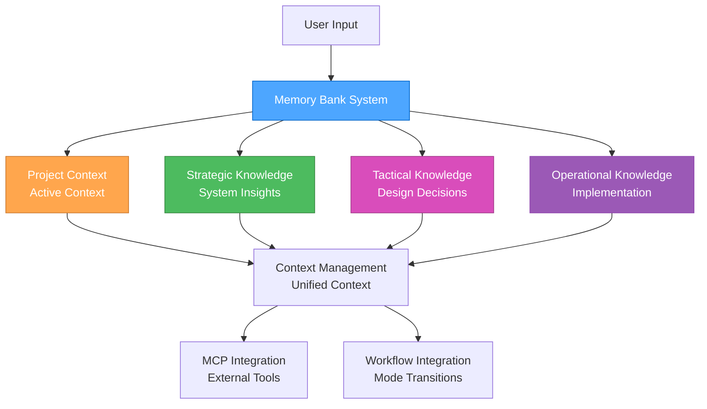

#### **File Structure**

```md
memory-bank/
├── project/                      # Main project context
│   ├── activeContext.md         # Current active context
│   ├── todo-handoff.md          # Todo and handoff status
│   ├── progress.md              # Progress tracking
│   ├── tasks.md                 # Task management
│   └── strategic-insights.md    # Strategic insights
├── strategic/                   # Strategic knowledge base
│   ├── README.md               # Strategic knowledge overview
│   ├── system-architecture/    # System-level insights
│   ├── tool-configurations/    # Tool setup knowledge
│   ├── meta-patterns/          # Cross-project patterns
│   └── strategic-decisions/    # Planning decisions
├── tactical/                    # Tactical knowledge base
│   ├── README.md               # Tactical knowledge overview
│   ├── design-decisions/       # Design decision rationales
│   ├── requirements-patterns/  # Requirement structures
│   ├── architecture-templates/ # Architectural patterns
│   └── planning-templates/     # Planning approaches
└── operational/                 # Operational knowledge base
    ├── README.md               # Operational knowledge overview
    ├── implementation-patterns/ # Implementation approaches
    ├── debug-solutions/        # Problem resolution
    ├── performance-optimizations/ # Performance techniques
    └── deployment-configs/     # Deployment setups
```

### 🔄 **KNOWLEDGE MANAGEMENT**

#### **Strategic Knowledge**

**Purpose**: System-level insights and meta-patterns

**Content Categories**:

- **System Architecture**: Workflow optimization insights
- **Tool Configurations**: Successful tool setups and configurations
- **Meta-Patterns**: Patterns across multiple projects
- **Strategic Decisions**: Planning decisions and rationales

**Storage Structure**:

```md
strategic/
├── system-architecture/
│   ├── workflow-optimizations.md
│   ├── tool-integrations.md
│   └── performance-patterns.md
├── tool-configurations/
│   ├── mcp-setups.md
│   ├── development-environments.md
│   └── deployment-configs.md
├── meta-patterns/
│   ├── project-patterns.md
│   ├── decision-patterns.md
│   └── optimization-patterns.md
└── strategic-decisions/
    ├── architecture-decisions.md
    ├── tool-selections.md
    └── workflow-decisions.md
```

#### **Tactical Knowledge**

**Purpose**: Design decisions and planning templates

**Content Categories**:

- **Design Decisions**: UI/UX design decisions and rationales
- **Requirements Patterns**: Common requirement structures
- **Architecture Templates**: Reusable architectural patterns
- **Planning Templates**: Planning approaches and methodologies

**Storage Structure**:

```md
tactical/
├── design-decisions/
│   ├── ui-patterns.md
│   ├── ux-decisions.md
│   └── design-rationales.md
├── requirements-patterns/
│   ├── feature-requirements.md
│   ├── user-stories.md
│   └── acceptance-criteria.md
├── architecture-templates/
│   ├── component-patterns.md
│   ├── data-flow-patterns.md
│   └── integration-patterns.md
└── planning-templates/
    ├── project-planning.md
    ├── sprint-planning.md
    └── milestone-planning.md
```

#### **Operational Knowledge**

**Purpose**: Implementation patterns and solutions

**Content Categories**:

- **Implementation Patterns**: Code patterns and solutions
- **Debug Solutions**: Problem resolution approaches
- **Performance Optimizations**: Performance improvement techniques
- **Deployment Configs**: Deployment and configuration setups

**Storage Structure**:

```md
operational/
├── implementation-patterns/
│   ├── code-patterns.md
│   ├── best-practices.md
│   └── solution-templates.md
├── debug-solutions/
│   ├── common-issues.md
│   ├── troubleshooting.md
│   └── resolution-patterns.md
├── performance-optimizations/
│   ├── optimization-techniques.md
│   ├── performance-patterns.md
│   └── monitoring-strategies.md
└── deployment-configs/
    ├── deployment-setups.md
    ├── configuration-templates.md
    └── environment-configs.md
```

### 🔧 **MCP INTEGRATION**

#### **Basic Memory Integration**

**Knowledge Server**: Basic Memory MCP Server

**Features**:

- Semantic knowledge management
- Automatic graph building
- Obsidian integration
- Multi-project support
- Real-time synchronization
- Markdown storage

**Integration**: Basic Memory MCP Guide

#### **Context7 Integration**

**Documentation Server**: Context7 MCP Server

**Features**:

- Real-time documentation access
- Library resolution
- Code examples
- Trust scoring

**Integration**: Context7 MCP Guide

#### **Time MCP Integration**

**Date Standardization**: Time MCP Server

**Features**:

- Consistent date formatting
- Timezone handling
- Integration with all components

**Integration**: Time MCP Guide

### 📋 **WORKFLOW INTEGRATION**

#### **Mode Transitions**

**Context Preservation**:

- Maintain active context during mode transitions
- Update context files appropriately
- Preserve important decisions and insights
- Track progress across modes

**Handoff Process**:

- Document current state in todo-handoff.md
- Update active context for next mode
- Preserve relevant knowledge
- Clear handoff status

#### **Knowledge Management**

**Storage Strategy**:

- Store knowledge in appropriate mode-specific directories
- Use consistent naming conventions
- Implement proper categorization
- Maintain knowledge relationships

**Retrieval Strategy**:

- Semantic search for relevant knowledge
- Context-aware recommendations
- Pattern-based suggestions
- Historical context integration

### 🎯 **BENEFITS**

#### **Persistent Context**

- Maintain context across sessions
- Resume work seamlessly
- Build knowledge over time
- Learn from past interactions

#### **Enhanced Decision Making**

- Access historical decisions
- Learn from past outcomes
- Identify successful patterns
- Optimize based on experience

#### **Improved Efficiency**

- Reduce repetitive work
- Leverage past solutions
- Optimize workflows
- Better resource utilization

#### **Knowledge Accumulation**

- Build comprehensive knowledge base
- Share knowledge across projects
- Maintain institutional memory
- Continuous learning and improvement

### 📚 **REFERENCES**

- Memory Bank Workflow - Detailed workflow integration
- Memory Bank Optimization - Performance optimization
- Basic Memory MCP Guide - MCP server integration
- System Documentation - Unified system integration
- MCP Ecosystem Overview - MCP server overview

### 🎯 **NEXT STEPS**

1. **Set up memory bank structure** using the provided file structure
2. **Configure MCP servers** for enhanced capabilities
3. **Implement workflow integration** for seamless mode transitions
4. **Start using memory bank** for persistent context and knowledge
5. **Optimize performance** using the provided strategies

---

**Last Updated**: 2025-07-23  
**Version**: 1.0  
**Status**: Complete memory bank system overview

---

<a id="rulesmemory-bank-workflowmd"></a>
## rules\memory-bank-workflow.md

## Memory Bank Workflow Integration

### Overview

This guide describes how the Memory Bank system integrates with the 3-mode development workflow, providing persistent context, knowledge management, and seamless transitions between Strategic, Tactical, and Operational modes.

### 🔄 **WORKFLOW INTEGRATION PATTERNS**

#### **Mode Transition Workflow**

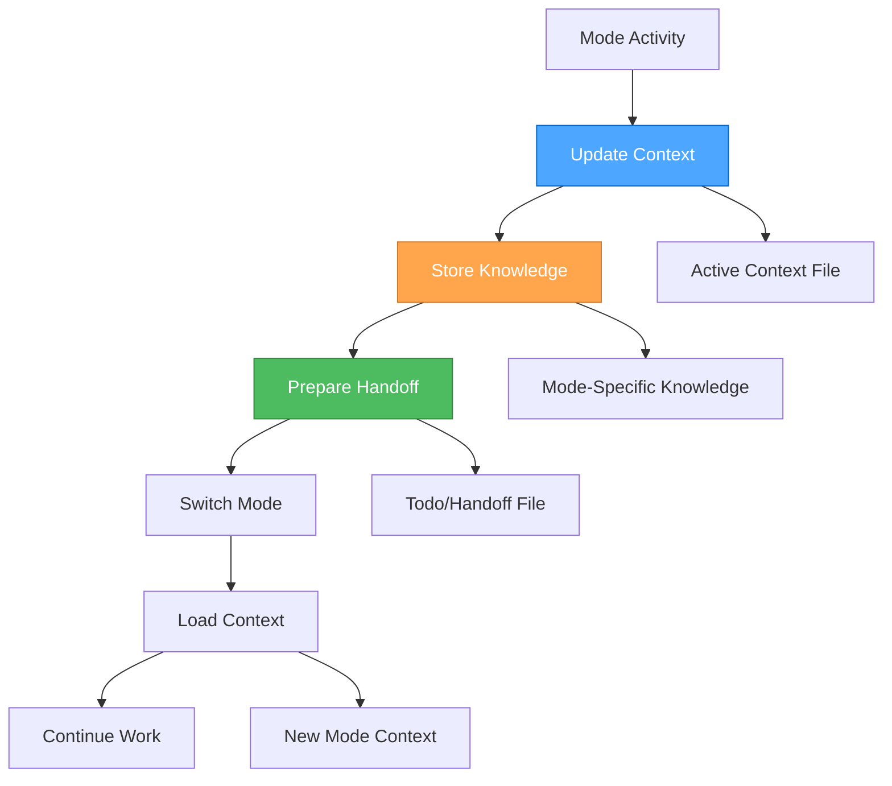

#### **Context Preservation Strategy**

**During Mode Transitions**:

1. **Update Active Context**: Document current state and decisions
2. **Store Mode Knowledge**: Archive mode-specific insights
3. **Prepare Handoff**: Create clear handoff documentation
4. **Load New Context**: Initialize next mode with relevant context

### 🎭 **STRATEGIC MODE INTEGRATION**

#### **Strategic Mode Workflow**

**Purpose**: System-level thinking, workflow optimization, tool management

**Memory Bank Activities**:

##### **Context Management**

```bash
## Update active context with strategic decisions
memory-bank-write strategic/active-context.md --content "
### Strategic Context Update
**Date**: [Time MCP current date]
**Current Focus**: [Strategic focus area]
**Key Decisions**: [Strategic decisions made]
**System Optimizations**: [Workflow improvements identified]
"

## Store strategic insights
memory-bank-write strategic/insights/workflow-optimization.md --content "
### Workflow Optimization Insight
**Date**: [Time MCP current date]
**Insight**: [Specific insight about workflow]
**Impact**: [Expected impact on system performance]
**Implementation**: [How to implement this insight]
"
```

##### **Knowledge Storage**

```bash
## Store system architecture decisions
memory-bank-write strategic/architecture/system-architecture.md --content "
### System Architecture Decision
**Date**: [Time MCP current date]
**Decision**: [Architecture decision made]
**Rationale**: [Why this decision was made]
**Alternatives**: [Alternatives considered]
**Expected Outcome**: [Expected results]
"

## Store tool configuration knowledge
memory-bank-write strategic/tools/tool-configuration.md --content "
### Tool Configuration Knowledge
**Date**: [Time MCP current date]
**Tool**: [Tool name and version]
**Configuration**: [Specific configuration details]
**Performance**: [Performance characteristics]
**Best Practices**: [Identified best practices]
"
```

##### **Strategic Handoff Preparation**

```bash
## Prepare handoff to tactical mode
memory-bank-write project/todo-handoff.md --content "
### 🎭 → 🎨 Strategic to Tactical Handoff

#### Strategic Context
**Overall Approach**: [Strategic approach determined]
**System Setup**: [Tools and workflows configured]
**Optimizations**: [Process improvements identified]

#### Ready for Tactical Planning
**Project Focus**: [Specific project to plan]
**Strategic Constraints**: [High-level constraints]
**Success Criteria**: [How success will be measured]

#### Handoff Status
**Date**: [Time MCP current date]
**Strategic Work Complete**: [Yes/No]
**Ready for Tactical Mode**: [Yes/No]
"
```

#### **Strategic Mode Commands**

```bash
## Store strategic insights
🎭 "store-insight [topic] [content]" → Store strategic insight
🎭 "search-patterns [domain]" → Search for strategic patterns
🎭 "archive-decision [decision] [rationale]" → Archive strategic decision

## Context management
🎭 "update-context [focus] [decisions]" → Update strategic context
🎭 "prepare-handoff [project] [constraints]" → Prepare tactical handoff
🎭 "load-context [project]" → Load project context
```

### 🎨 **TACTICAL MODE INTEGRATION**

#### **Tactical Mode Workflow**

**Purpose**: App-specific planning, design decisions, implementation planning

**Memory Bank Activities**:

##### **Context Loading**

```bash
## Load strategic context for tactical planning
memory-bank-read project/todo-handoff.md

## Load project-specific context
memory-bank-read project/activeContext.md

## Load relevant strategic insights
memory-bank-search strategic/insights/ --query "[project-specific insights]"
```

##### **Design Decision Storage**

```bash
## Store design decisions
memory-bank-write tactical/design-decisions/component-design.md --content "
### Component Design Decision
**Date**: [Time MCP current date]
**Component**: [Component name and purpose]
**Design Decision**: [Specific design decision]
**Rationale**: [Why this design was chosen]
**Trade-offs**: [Trade-offs considered]
**Implementation Plan**: [How to implement]
"

## Store requirements patterns
memory-bank-write tactical/requirements/requirements-pattern.md --content "
### Requirements Pattern
**Date**: [Time MCP current date]
**Pattern**: [Requirements pattern identified]
**Context**: [When this pattern applies]
**Implementation**: [How to implement this pattern]
**Examples**: [Examples of this pattern]
"
```

##### **Planning Template Storage**

```bash
## Store planning templates
memory-bank-write tactical/planning/planning-template.md --content "
### Planning Template
**Date**: [Time MCP current date]
**Template Type**: [Type of planning template]
**Structure**: [Template structure and sections]
**Usage**: [When and how to use this template]
**Examples**: [Example usage of this template]
"
```

##### **Tactical Handoff Preparation**

```bash
## Prepare handoff to operational mode
memory-bank-update project/todo-handoff.md --content "
### 🎨 → ⚒️ Tactical to Operational Handoff

#### Tactical Context
**App-Specific Strategy**: [How to execute the strategy]
**Design Decisions**: [Key design decisions made]
**Implementation Approach**: [Detailed implementation plan]

#### Ready for Operational Execution
**Implementation Tasks**: [Specific tasks to implement]
**Technical Constraints**: [Technical constraints identified]
**Success Criteria**: [How success will be measured]

#### Handoff Status
**Date**: [Time MCP current date]
**Tactical Work Complete**: [Yes/No]
**Ready for Operational Mode**: [Yes/No]
"
```

#### **Tactical Mode Commands**

```bash
## Store design decisions
🎨 "store-design [component] [decision]" → Store design decision
🎨 "search-requirements [feature]" → Search for similar requirements
🎨 "archive-plan [plan] [approach]" → Archive planning approach

## Context management
🎨 "load-strategic-context [project]" → Load strategic context
🎨 "update-tactical-context [focus] [decisions]" → Update tactical context
🎨 "prepare-operational-handoff [tasks] [constraints]" → Prepare operational handoff
```

### ⚒️ **OPERATIONAL MODE INTEGRATION**

#### **Operational Mode Workflow**

**Purpose**: Implementation, testing, and execution

**Memory Bank Activities**:

##### **Operational Context Loading**

```bash
## Load tactical context for implementation
memory-bank-read project/todo-handoff.md

## Load implementation plan
memory-bank-read tactical/planning/implementation-plan.md

## Load relevant design decisions
memory-bank-search tactical/design-decisions/ --query "[component-specific decisions]"
```

##### **Implementation Pattern Storage**

```bash
## Store implementation patterns
memory-bank-write operational/implementation-patterns/coding-pattern.md --content "
### Coding Pattern
**Date**: [Time MCP current date]
**Pattern**: [Coding pattern identified]
**Context**: [When to use this pattern]
**Implementation**: [How to implement this pattern]
**Examples**: [Code examples of this pattern]
"

## Store debug solutions
memory-bank-write operational/debug-solutions/issue-resolution.md --content "
### Issue Resolution
**Date**: [Time MCP current date]
**Issue**: [Issue description and symptoms]
**Root Cause**: [Root cause analysis]
**Solution**: [Solution implemented]
**Prevention**: [How to prevent this issue]
"
```

##### **Progress Tracking**

```bash
## Update progress
memory-bank-update project/progress.md --content "
### Progress Update
**Date**: [Time MCP current date]
**Completed**: [Tasks completed]
**In Progress**: [Current tasks]
**Next Up**: [Next tasks in queue]
**Blockers**: [Any issues preventing progress]
"

## Store performance optimizations
memory-bank-write operational/performance/optimization-technique.md --content "
### Performance Optimization
**Date**: [Time MCP current date]
**Technique**: [Optimization technique used]
**Before**: [Performance before optimization]
**After**: [Performance after optimization]
**Implementation**: [How to implement this optimization]
"
```

##### **Operational Handoff Preparation**

```bash
## Prepare handoff back to strategic mode
memory-bank-update project/todo-handoff.md --content "
### ⚒️ → 🎭 Operational to Strategic Handoff

#### Operational Context
**Implementation Complete**: [What was implemented]
**Performance Results**: [Performance outcomes]
**Issues Resolved**: [Issues encountered and resolved]

#### Ready for Strategic Reflection
**Success Metrics**: [How success was measured]
**Lessons Learned**: [Key learnings from implementation]
**Optimization Opportunities**: [Areas for future optimization]

#### Handoff Status
**Date**: [Time MCP current date]
**Operational Work Complete**: [Yes/No]
**Ready for Strategic Mode**: [Yes/No]
"
```

#### **Operational Mode Commands**

```bash
## Store implementation patterns
⚒️ "store-implementation [feature] [approach]" → Store implementation pattern
⚒️ "search-solutions [problem]" → Search for similar solutions
⚒️ "archive-config [system] [config]" → Archive configuration

## Progress tracking
⚒️ "update-progress [completed] [in-progress] [next]" → Update progress
⚒️ "store-optimization [technique] [results]" → Store performance optimization
⚒️ "prepare-strategic-handoff [results] [learnings]" → Prepare strategic handoff
```

### 🔄 **CROSS-MODE KNOWLEDGE SHARING**

#### **Knowledge Transfer Patterns**

##### **Strategic → Tactical**

- **System Architecture**: Strategic decisions inform tactical planning
- **Tool Configurations**: Strategic tool choices guide tactical implementation
- **Meta-Patterns**: Strategic patterns inform tactical approaches

##### **Tactical → Operational**

- **Design Decisions**: Tactical design decisions guide operational implementation
- **Requirements Patterns**: Tactical requirements inform operational tasks
- **Planning Templates**: Tactical planning guides operational execution

##### **Operational → Strategic**

- **Implementation Results**: Operational results inform strategic decisions
- **Performance Data**: Operational performance guides strategic optimization
- **Lessons Learned**: Operational learnings inform strategic planning

#### **Knowledge Search Patterns**

```bash
## Search across all modes for related knowledge
memory-bank-search all/ --query "[search term]" --mode all

## Search specific mode knowledge
memory-bank-search strategic/ --query "[strategic insights]"
memory-bank-search tactical/ --query "[design decisions]"
memory-bank-search operational/ --query "[implementation patterns]"

## Search for patterns across modes
memory-bank-search all/ --query "[pattern name]" --cross-mode true
```

### 📊 **WORKFLOW OPTIMIZATION**

#### **Context Preservation Optimization**

**Strategy**:

- Update context files at key decision points
- Preserve critical information during transitions
- Load relevant context for each mode
- Maintain context continuity across sessions

**Benefits**:

- Seamless mode transitions
- Reduced context loss
- Better decision continuity
- Improved workflow efficiency

#### **Knowledge Management Optimization**

**Strategy**:

- Store knowledge in appropriate mode-specific locations
- Use consistent naming conventions
- Implement proper categorization
- Maintain knowledge relationships

**Benefits**:

- Easy knowledge retrieval
- Better knowledge organization
- Improved knowledge reuse
- Enhanced learning accumulation

#### **Performance Optimization**

**Strategy**:

- Optimize file operations for speed
- Implement efficient search patterns
- Use appropriate storage formats
- Monitor and optimize performance

**Benefits**:

- Faster workflow execution
- Better resource utilization
- Improved user experience
- Enhanced system responsiveness

### 🎯 **BENEFITS**

#### **Seamless Workflow Integration**

- Smooth transitions between modes
- Context preservation across transitions
- Knowledge continuity throughout workflow
- Improved workflow efficiency

#### **Enhanced Decision Making**

- Access to relevant historical context
- Informed decisions based on past learnings
- Pattern recognition across modes
- Better decision outcomes

#### **Improved Knowledge Management**

- Organized knowledge storage
- Easy knowledge retrieval
- Knowledge accumulation over time
- Enhanced learning and improvement

#### **Better Performance**

- Optimized workflow execution
- Efficient resource utilization
- Improved user experience
- Enhanced system responsiveness

### 📚 **REFERENCES**

- Memory Bank Overview - System overview and architecture
- Memory Bank Optimization - Performance optimization
- Basic Memory MCP Guide - MCP server integration
- System Documentation - Unified system integration

### 🎯 **NEXT STEPS**

1. **Implement workflow integration** using the provided patterns
2. **Set up mode-specific knowledge storage** in your memory bank
3. **Configure cross-mode knowledge sharing** for enhanced capabilities
4. **Optimize workflow performance** using the provided strategies
5. **Start using memory bank workflow** for seamless mode transitions

---

**Last Updated**: 2025-07-23  
**Version**: 1.0  
**Status**: Complete workflow integration guide

---

<a id="rulesscss-advanced-patternsmd"></a>
## rules\scss-advanced-patterns.md

## SCSS Advanced Patterns and Modern Features

### Modern Color Spaces and Functions

#### New Color Spaces (CSS Color Level 4)

```scss
// Modern color spaces with better perceptual uniformity
$pink: oklch(64% 0.196 353deg); // Perceptually uniform
$blue: oklch(64% 0.196 253deg); // Consistent lightness/chroma

// Lab and LCH color spaces
$lab-color: lab(50% 20 30);
$lch-color: lch(50% 30 45deg);

// HWB color space
$hwb-color: hwb(120deg 20% 10%);
```

#### Modern Color Functions

```scss
@use "sass:color";

// Channel access (replaces deprecated red(), green(), blue())
$red-channel: color.channel($color, "red", rgb);
$green-channel: color.channel($color, "green", rgb);
$blue-channel: color.channel($color, "blue", rgb);

// Color adjustments with explicit color spaces
$brand: hsl(0 100% 25.1%);
$hsl-lightness: color.scale($brand, $lightness: 25%);
$oklch-lightness: color.scale($brand, $lightness: 25%, $space: oklch);

// Color transformations
$inverted: color.invert($color);
$grayscale: color.grayscale($color);
$complement: color.complement($color);

// Gamut mapping
$mapped: color.to-gamut($color, hsl, $method: local-minde);
```

#### Deprecated Functions to Avoid

```scss
// ❌ DEPRECATED - Use color.adjust() instead
lighten($color, 10%);
darken($color, 10%);
saturate($color, 10%);
desaturate($color, 10%);
opacify($color, 0.1);
transparentize($color, 0.1);
fade-in($color, 0.1);
fade-out($color, 0.1);

// ✅ MODERN APPROACH
color.adjust($color, $lightness: 10%);
color.adjust($color, $lightness: -10%);
color.adjust($color, $saturation: 10%);
color.adjust($color, $saturation: -10%);
color.adjust($color, $alpha: 0.1);
color.adjust($color, $alpha: -0.1);
```

### Module System Best Practices

#### Modern Module Usage

```scss
// ✅ Use @use instead of @import
@use "sass:color";
@use "sass:math";
@use "sass:map";
@use "sass:list";
@use "sass:string";
@use "sass:meta";
@use "sass:selector";

// Namespace usage
$adjusted: color.adjust($primary, $lightness: 10%);
$rounded: math.round($value);
$keys: map.keys($data);
```

#### Library Configuration Pattern

```scss
// _variables.scss
$paragraph-margin-bottom: 1rem !default;
$primary-color: #007bff !default;

// _reboot.scss
@use "variables" as *;

p {
  margin-bottom: $paragraph-margin-bottom;
  color: $primary-color;
}

// bootstrap.scss (entry point)
@forward "variables";
@use "reboot";

// User's stylesheet
@use "bootstrap" with (
  $paragraph-margin-bottom: 1.2rem,
  $primary-color: #0056b3
);
```

### Advanced Selector Patterns

#### Modern Selector Functions

```scss
@use "sass:selector";

// Nesting selectors
$nested: selector.nest(".parent", ".child");
// Result: .parent .child

// Appending selectors
$appended: selector.append(".btn", ":hover");
// Result: .btn:hover

// Replacing selectors
$replaced: selector.replace(".old", ".new");
// Result: .new

// Unifying selectors
$unified: selector.unify(".a", ".b");
// Result: .a.b

// Extending selectors
$extended: selector.extend(".base", ".extendee", ".extender");
```

#### Complex Selector Manipulation

```scss
// Modern selector parsing and manipulation
$parsed: selector.parse(".btn.btn-primary:hover");
$simple: selector.simple-selectors(".btn.btn-primary");
$is-superselector: selector.is-superselector(".btn", ".btn.btn-primary");
```

### Advanced Math and Calculations

#### Modern Math Functions

```scss
@use "sass:math";

// Mathematical operations
$percentage: math.percentage(0.5); // 50%
$rounded: math.round(3.7); // 4
$ceiled: math.ceil(3.2); // 4
$floored: math.floor(3.8); // 3
$absolute: math.abs(-5); // 5
$minimum: math.min(1, 2, 3); // 1
$maximum: math.max(1, 2, 3); // 3
$random: math.random(); // Random number 0-1

// Unit operations
$unit: math.unit(10px); // "px"
$is-unitless: math.is-unitless(10); // true
$compatible: math.compatible(10px, 20px); // true
```

#### CSS calc() Integration

```scss
// Modern calc() support
$width: 100px;
$calc-result: calc($width / 2);

// Slash separator for CSS Grid
.grid-item {
  grid-row: 1 / 3;
  grid-column: 1 / 4;
}
```

### Advanced List and Map Operations

#### Modern List Functions

```scss
@use "sass:list";

// List operations
$length: list.length($items);
$nth: list.nth($items, 2);
$set-nth: list.set-nth($items, 2, "new-value");
$join: list.join($list1, $list2);
$append: list.append($list, "new-item");
$zip: list.zip($list1, $list2);
$index: list.index($list, "item");
$separator: list.separator($list);
```

#### Advanced Map Operations

```scss
@use "sass:map";

// Map operations
$get: map.get($data, "key");
$merge: map.merge($map1, $map2);
$remove: map.remove($map, "key");
$keys: map.keys($map);
$values: map.values($map);
$has-key: map.has-key($map, "key");

// Nested map operations
$nested-get: map.get($map, "level1", "level2");
$nested-set: map.set($map, "level1", "level2", "value");
```

### Meta-Programming and Reflection

#### Feature Detection

```scss
@use "sass:meta";

// Check feature availability
$feature-exists: meta.feature-exists("global-variable-shadowing");

// Variable and function existence
$var-exists: meta.variable-exists("my-variable");
$global-var-exists: meta.global-variable-exists("global-var");
$function-exists: meta.function-exists("my-function");
$mixin-exists: meta.mixin-exists("my-mixin");

// Type checking
$type: meta.type-of($value);

// Function reflection
$function: meta.get-function("my-function");
$result: meta.call($function, $arg1, $arg2);

// Content detection
$has-content: meta.content-exists();
```

#### Advanced Inspection

```scss
// Debug and inspection
$inspected: meta.inspect($value);

// Keywords handling
@mixin my-mixin($positional, $keyword: default) {
  $keywords: meta.keywords($args);
  // Process keyword arguments
}
```

### Modern String Operations

#### String Functions

```scss
@use "sass:string";

// String manipulation
$length: string.length("hello"); // 5
$slice: string.slice("hello world", 0, 5); // "hello"
$index: string.index("hello world", "world"); // 7
$insert: string.insert("hello", " world", 5); // "hello world"

// Case conversion
$upper: string.to-upper-case("hello"); // "HELLO"
$lower: string.to-lower-case("HELLO"); // "hello"

// Unique ID generation
$unique: string.unique-id(); // "u123456"
```

### Performance and Best Practices

> **Note**: For comprehensive debugging and troubleshooting, see [SCSS Debugging](../.cursor/rules/scss-debugging.mdc).

#### Compilation Optimization

```scss
// Use @use for better performance
// @use loads modules once and caches them
@use "variables" as vars;

// Avoid @import in modern Sass
// @import loads files multiple times if used elsewhere
```

#### Memory Management

```scss
// Use maps for large datasets
$theme: (
  "primary": #007bff,
  "secondary": #6c757d,
  "success": #28a745,
  "danger": #dc3545
);

// Use lists for ordered data
$breakpoints: (xs, sm, md, lg, xl);
```

#### Advanced Debugging Techniques

```scss
// Advanced debugging with meta functions
@debug "Variable value: #{$variable}";
@warn "This is a warning message";
@error "This is an error message";

// Feature detection for progressive enhancement
@if meta.feature-exists("modern-color-spaces") {
  $color: oklch(50% 0.2 45deg);
} @else {
  $color: hsl(45deg 50% 50%);
}

// Advanced inspection
$inspected: meta.inspect($value);
```

### Modern CSS Integration

> **Note**: For comprehensive modern CSS principles, layout systems, and framework integration, see [SCSS Modern CSS & Frameworks](../.cursor/rules/scss-modern-css-frameworks.mdc).

#### CSS Custom Properties Integration

```scss
// Dynamic CSS custom properties with SCSS
:root {
  --primary-color: #{$primary-color};
  --spacing-unit: #{$spacing-unit};
}

.component {
  color: var(--primary-color);
  margin: calc(var(--spacing-unit) * 2);
}
```

#### SCSS-Specific Modern Features

```scss
// SCSS-specific grid generation
@mixin responsive-grid($columns: 3, $min-width: 200px) {
  display: grid;
  grid-template-columns: repeat(auto-fit, minmax($min-width, 1fr));
  gap: 1rem;
}

.grid {
  @include responsive-grid(3, 200px);
}

// SCSS-specific flexbox utilities
@mixin flex-center {
  display: flex;
  align-items: center;
  justify-content: center;
  gap: 1rem;
}
```

### Migration Guide

#### From Legacy to Modern

```scss
// ❌ Legacy approach
@import "variables";
$color: lighten($primary, 10%);
$list: join($list1, $list2);

// ✅ Modern approach
@use "variables" as vars;
$color: color.adjust(vars.$primary, $lightness: 10%);
$list: list.join($list1, $list2);
```

#### Backward Compatibility

```scss
// Check for feature support
@if meta.feature-exists("modern-color-spaces") {
  // Use modern color spaces
  $color: oklch(50% 0.2 45deg);
} @else {
  // Fallback to legacy colors
  $color: hsl(45deg 50% 50%);
}
```

### Related Rules

- [SCSS Modern CSS & Frameworks](../.cursor/rules/scss-modern-css-frameworks.mdc) - Modern CSS principles and framework integration
- [SCSS Debugging](../.cursor/rules/scss-debugging.mdc) - Troubleshooting and debugging SCSS issues
- [Perchance Build & Deployment](../.cursor/rules/perchance-build-deployment.mdc) - Build and deployment for Perchance projects
- [Perchance Development Lifecycle](../.cursor/rules/perchance-development-lifecycle.mdc) - Planning and iteration steps

---

This documentation reflects the latest Sass features and best practices, ensuring your SCSS code is modern, maintainable, and performant.

---

<a id="rulesscss-debuggingmd"></a>
## rules\scss-debugging.md

## SCSS Debugging & Troubleshooting

### Scope

- Common SCSS compilation errors and solutions
- Debugging techniques for SCSS issues
- Performance optimization and troubleshooting
- Best practices for avoiding SCSS problems

---

### Common SCSS Errors

#### **Compilation Errors**

##### **Variable Not Found**

```scss
// ❌ Error: Undefined variable $primary-color
.button {
  background-color: $primary-color;
}

// ✅ Solution: Define variable first
$primary-color: #007bff;
.button {
  background-color: $primary-color;
}
```

##### **Mixin Not Found**

```scss
// ❌ Error: Undefined mixin card-style
.card {
  @include card-style;
}

// ✅ Solution: Define mixin first
@mixin card-style {
  padding: 1rem;
  border-radius: 0.5rem;
  box-shadow: 0 2px 4px rgba(0, 0, 0, 0.1);
}

.card {
  @include card-style;
}
```

##### **Import Path Issues**

```scss
// ❌ Error: File to import not found
@import "variables";

// ✅ Solution: Use correct path
@import "./variables";
// or
@import "abstracts/variables";
```

#### **Syntax Errors**

##### **Missing Semicolons**

```scss
// ❌ Error: Missing semicolon
.button {
  background-color: #007bff
  color: white
}

// ✅ Solution: Add semicolons
.button {
  background-color: #007bff;
  color: white;
}
```

##### **Incorrect Nesting**

```scss
// ❌ Error: Invalid nesting
.card {
  .title {
    color: blue;
  }
  color: red; // This should be outside the nested selector
}

// ✅ Solution: Proper nesting
.card {
  color: red;
  
  .title {
    color: blue;
  }
}
```

##### **Invalid Selector Interpolation**

```scss
// ❌ Error: Invalid selector
$class-name: "button";
##{$class-name} {
  color: blue;
}

// ✅ Solution: Use proper interpolation
$class-name: "button";
.#{$class-name} {
  color: blue;
}
```

---

### Debugging Techniques

#### **Source Maps**

Enable source maps for better debugging:

```scss
// In your build configuration
sass --source-map --style=expanded input.scss output.css
```

#### **Debug Output**

Use `@debug` for debugging variables and values:

```scss
$primary-color: #007bff;
@debug "Primary color is: #{$primary-color}";

@mixin responsive($breakpoint) {
  @debug "Applying breakpoint: #{$breakpoint}";
  @media (min-width: $breakpoint) {
    @content;
  }
}
```

#### **Warnings**

Use `@warn` for non-critical issues:

```scss
@mixin theme($theme-name) {
  $theme: map-get($themes, $theme-name);
  
  @if $theme {
    @each $key, $value in $theme {
      --#{$key}: #{$value};
    }
  } @else {
    @warn "Theme '#{$theme-name}' not found. Available themes: #{map-keys($themes)}";
  }
}
```

#### **Error Handling**

Use `@error` for critical issues:

```scss
@function token($category, $key) {
  $value: map-get($design-tokens, $category);
  
  @if not $value {
    @error "Category '#{$category}' not found in design tokens";
  }
  
  $value: map-get($value, $key);
  
  @if not $value {
    @error "Key '#{$key}' not found in category '#{$category}'";
  }
  
  @return $value;
}
```

---

### Performance Issues

#### **Deep Nesting**

```scss
// ❌ Problem: Deep nesting creates overly specific selectors
.card {
  .header {
    .title {
      .text {
        .link {
          color: blue;
        }
      }
    }
  }
}

// ✅ Solution: Flatten nesting
.card {
  .header-title-link {
    color: blue;
  }
}

// Or use BEM methodology
.card__header-title-link {
  color: blue;
}
```

> **Note**: For modern CSS architecture patterns and BEM methodology, see [SCSS Modern CSS & Frameworks](../.cursor/rules/scss-modern-css-frameworks.mdc).

#### **Large Output Files**

```scss
// ❌ Problem: Unused styles in output
.unused-class {
  color: red;
}

// ✅ Solution: Remove unused styles
// Use tools like PurgeCSS to automatically remove unused styles
```

#### **Inefficient Selectors**

```scss
// ❌ Problem: Inefficient selector generation
@each $color in (red, blue, green) {
  .button-#{$color} {
    background-color: $color;
  }
}

// ✅ Solution: Use more efficient approach
.button {
  &--red { background-color: red; }
  &--blue { background-color: blue; }
  &--green { background-color: green; }
}
```

---

### Common Patterns & Solutions

#### **Circular Dependencies**

```scss
// ❌ Problem: Circular import
// _variables.scss
$primary-color: #007bff;
@import "mixins";

// _mixins.scss
@import "variables";
@mixin button-style {
  background-color: $primary-color;
}

// ✅ Solution: Separate concerns
// _variables.scss
$primary-color: #007bff;

// _mixins.scss
@import "variables";
@mixin button-style {
  background-color: $primary-color;
}

// main.scss
@import "variables";
@import "mixins";
```

#### **Variable Scope Issues**

```scss
// ❌ Problem: Variable scope confusion
$color: red;

.button {
  $color: blue; // This shadows the global variable
  background-color: $color;
}

.other-element {
  background-color: $color; // This uses the global red
}

// ✅ Solution: Use clear naming
$global-color: red;

.button {
  $button-color: blue;
  background-color: $button-color;
}

.other-element {
  background-color: $global-color;
}
```

#### **Map Access Issues**

```scss
// ❌ Problem: Incorrect map access
$colors: (
  primary: #007bff,
  secondary: #6c757d
);

.button {
  background-color: $colors[primary]; // Wrong syntax
}

// ✅ Solution: Use map-get function
$colors: (
  primary: #007bff,
  secondary: #6c757d
);

.button {
  background-color: map-get($colors, primary);
}
```

---

### Build Process Issues

#### **Compilation Failures**

Common build issues and solutions:

```bash
## ❌ Problem: Missing dependencies
sass input.scss output.css
## Error: File to import not found

## ✅ Solution: Check file paths and dependencies
sass --load-path=./node_modules input.scss output.css
```

#### **Output File Issues**

```bash
## ❌ Problem: Large output files
## Check for unused imports or styles

## ✅ Solution: Use optimization flags
sass --style=compressed input.scss output.css
```

#### **Source Map Issues**

```bash
## ❌ Problem: Source maps not working
## Check if source maps are enabled

## ✅ Solution: Enable source maps
sass --source-map --style=expanded input.scss output.css
```

---

### Testing & Validation

#### **SCSS Linting**

Use SCSS linting tools to catch issues early:

```bash
## Install sass-lint or stylelint
npm install -g sass-lint

## Run linting
sass-lint -v -q
```

#### **Compilation Testing**

Test compilation regularly:

```bash
## Test compilation without output
sass --check input.scss

## Test with specific output format
sass --style=compressed input.scss output.css
```

#### **Browser Testing**

Test compiled CSS in browsers:

- Check for CSS validation errors
- Test responsive breakpoints
- Verify cross-browser compatibility
- Check for performance issues

---

### Best Practices for Avoiding Issues

#### **File Organization**

```mermaid
scss/
├── abstracts/
│   ├── _variables.scss
│   ├── _functions.scss
│   └── _mixins.scss
├── base/
│   ├── _reset.scss
│   └── _typography.scss
├── components/
│   ├── _buttons.scss
│   └── _cards.scss
└── main.scss
```

#### **Naming Conventions**

- Use descriptive variable names: `$primary-color`, not `$pc`
- Use consistent naming: `$spacing-unit`, `$border-radius`
- Use BEM methodology for components: `.card__title--large`

#### **Import Order**

```scss
// 1. Variables and functions
@import "abstracts/variables";
@import "abstracts/functions";

// 2. Mixins
@import "abstracts/mixins";

// 3. Base styles
@import "base/reset";
@import "base/typography";

// 4. Components
@import "components/buttons";
@import "components/cards";

// 5. Layout
@import "layout/header";
@import "layout/footer";
```

#### **Documentation**

Document complex SCSS:

```scss
/**
 * Button component mixin
 * @param {string} $variant - Button variant (primary, secondary, danger)
 * @param {string} $size - Button size (sm, md, lg)
 */
@mixin button($variant: 'primary', $size: 'md') {
  // Implementation
}
```

---

### Related Rules

- [SCSS Modern CSS & Frameworks](../.cursor/rules/scss-modern-css-frameworks.mdc) - Modern CSS principles and framework integration
- [SCSS Advanced Patterns](../.cursor/rules/scss-advanced-patterns.mdc) - Advanced SCSS features and meta-programming
- [Perchance Build & Deployment](../.cursor/rules/perchance-build-deployment.mdc) - Build and deployment for Perchance projects
- [Perchance Development Lifecycle](../.cursor/rules/perchance-development-lifecycle.mdc) - Planning and iteration steps

---

### References

- [Sass Documentation](https://sass-lang.com/documentation)
- [Sass Guidelines](https://sass-guidelin.es/)
- [Sass Debugging](https://sass-lang.com/documentation/at-rules/debug/)
- [Stylelint](https://stylelint.io/)

---

<a id="rulesscss-modern-css-frameworksmd"></a>
## rules\scss-modern-css-frameworks.md

## Modern CSS Principles and Framework Integration

> **TL;DR:** Comprehensive guide covering modern CSS principles, layout systems, responsive design, and Pico.css framework integration for Perchance projects.

### 🎯 **OVERVIEW**

This guide combines modern CSS principles with practical framework integration, specifically focusing on Pico.css for Perchance projects. It covers foundational CSS concepts, modern layout systems, responsive design, and framework customization.

### 🏗️ **CORE CSS PRINCIPLES**

#### **Cascade and Specificity**

```css
/* Understanding CSS cascade and specificity */
/* 1. Inline styles (highest priority) */
/* 2. ID selectors */
/* 3. Class selectors, attributes, pseudo-classes */
/* 4. Element selectors, pseudo-elements */

/* Example: Specificity calculation */
##header .nav-item { } /* 1-1-0 = 110 */
.nav-item.active { }   /* 0-2-0 = 020 */
nav .item { }          /* 0-1-1 = 011 */

/* Use specificity wisely - avoid !important */
.button {
  background: blue; /* Good */
}

.button.primary {
  background: red; /* Higher specificity, no !important needed */
}
```

#### **Box Model**

```css
/* Modern box-sizing */
* {
  box-sizing: border-box; /* Include padding and border in element's total width/height */
}

/* Box model properties */
.element {
  width: 200px;
  height: 100px;
  padding: 20px;
  border: 2px solid black;
  margin: 10px;
  /* Total width: 200px (includes padding and border) */
}
```

### 🎨 **MODERN LAYOUT SYSTEMS**

#### **CSS Grid**

```css
/* Basic grid layout */
.grid-container {
  display: grid;
  grid-template-columns: repeat(3, 1fr);
  grid-template-rows: auto;
  gap: 1rem;
  padding: 1rem;
}

/* Responsive grid */
.responsive-grid {
  display: grid;
  grid-template-columns: repeat(auto-fit, minmax(250px, 1fr));
  gap: 1rem;
}

/* Named grid areas */
.layout {
  display: grid;
  grid-template-areas: 
    "header header header"
    "sidebar main aside"
    "footer footer footer";
  grid-template-columns: 200px 1fr 200px;
  grid-template-rows: auto 1fr auto;
  min-height: 100vh;
}

.header { grid-area: header; }
.sidebar { grid-area: sidebar; }
.main { grid-area: main; }
.aside { grid-area: aside; }
.footer { grid-area: footer; }

/* Grid line positioning */
.grid-item {
  grid-column: 1 / 3; /* Start at line 1, end at line 3 */
  grid-row: 2 / 4;    /* Start at line 2, end at line 4 */
}

/* Grid alignment */
.grid-container {
  justify-items: center;     /* Horizontal alignment */
  align-items: center;       /* Vertical alignment */
  justify-content: space-between; /* Container alignment */
  align-content: space-around;
}
```

#### **Flexbox**

```css
/* Basic flexbox */
.flex-container {
  display: flex;
  flex-direction: row; /* row | row-reverse | column | column-reverse */
  flex-wrap: wrap;     /* nowrap | wrap | wrap-reverse */
  justify-content: space-between; /* flex-start | flex-end | center | space-between | space-around | space-evenly */
  align-items: center; /* flex-start | flex-end | center | baseline | stretch */
  gap: 1rem;
}

/* Flex items */
.flex-item {
  flex: 1; /* flex-grow: 1, flex-shrink: 1, flex-basis: 0% */
  flex-grow: 0;    /* Don't grow */
  flex-shrink: 1;  /* Allow shrinking */
  flex-basis: auto; /* Auto size */
  
  /* Shorthand: flex: <grow> <shrink> <basis> */
  flex: 0 1 auto; /* Default value */
}

/* Responsive flexbox */
.responsive-flex {
  display: flex;
  flex-wrap: wrap;
  gap: 1rem;
}

.responsive-flex > * {
  flex: 1 1 300px; /* Grow, shrink, min-width */
}
```

### 🎨 **MODERN CSS FEATURES**

#### **CSS Custom Properties (Variables)**

```css
/* Define custom properties */
:root {
  --primary-color: #007bff;
  --secondary-color: #6c757d;
  --spacing-unit: 1rem;
  --border-radius: 0.25rem;
  --font-family: -apple-system, BlinkMacSystemFont, 'Segoe UI', Roboto, sans-serif;
  
  /* Color palette */
  --colors-primary-50: #eff6ff;
  --colors-primary-100: #dbeafe;
  --colors-primary-500: #3b82f6;
  --colors-primary-900: #1e3a8a;
  
  /* Spacing scale */
  --spacing-xs: 0.25rem;
  --spacing-sm: 0.5rem;
  --spacing-md: 1rem;
  --spacing-lg: 1.5rem;
  --spacing-xl: 2rem;
}

/* Use custom properties */
.button {
  background-color: var(--primary-color);
  padding: var(--spacing-sm) var(--spacing-md);
  border-radius: var(--border-radius);
  font-family: var(--font-family);
}

/* Dynamic custom properties */
.theme-dark {
  --primary-color: #0d6efd;
  --background-color: #212529;
  --text-color: #f8f9fa;
}

/* Fallback values */
.element {
  color: var(--custom-color, #333); /* Fallback to #333 if --custom-color not defined */
}
```

#### **Modern Color Functions**

```css
/* Modern color spaces */
.modern-colors {
  /* OKLCH - perceptually uniform */
  color: oklch(64% 0.196 353deg);
  background: oklch(64% 0.196 253deg);
  
  /* Lab color space */
  color: lab(50% 20 30);
  
  /* HWB color space */
  color: hwb(120deg 20% 10%);
  
  /* Alpha channel with slash */
  color: rgb(255 0 0 / 0.5);
  color: hsl(0 100% 50% / 0.5);
}

/* Color mixing and manipulation */
.color-utilities {
  /* Mix colors */
  background: color-mix(in srgb, #34c9eb 25%, white);
  
  /* Relative colors */
  color: hsl(from #ff0000 h s calc(l + 20%));
  
  /* Color contrast */
  color: color-contrast(wheat vs tan, sienna, #d2691e);
}
```

#### **Modern Selectors**

```css
/* Attribute selectors */
[data-state="active"] { }
[class*="btn"] { }        /* Contains */
[class^="btn"] { }        /* Starts with */
[class$="btn"] { }        /* Ends with */
[class~="btn"] { }        /* Contains word */

/* Pseudo-classes */
.button:hover { }
.button:focus { }
.button:active { }
.button:disabled { }

/* Structural pseudo-classes */
.item:first-child { }
.item:last-child { }
.item:nth-child(odd) { }
.item:nth-child(3n+1) { }
.item:only-child { }

/* Form pseudo-classes */
input:required { }
input:optional { }
input:valid { }
input:invalid { }
input:checked { }
input:indeterminate { }

/* Modern pseudo-classes */
.element:is(.class1, .class2) { }
.element:where(.class1, .class2) { }
.element:has(.child) { }
```

### 📱 **RESPONSIVE DESIGN**

#### **Media Queries**

```css
/* Mobile-first approach */
.container {
  width: 100%;
  padding: 1rem;
}

/* Tablet and up */
@media (min-width: 768px) {
  .container {
    max-width: 750px;
    margin: 0 auto;
  }
}

/* Desktop and up */
@media (min-width: 1024px) {
  .container {
    max-width: 970px;
  }
}

/* Large desktop */
@media (min-width: 1200px) {
  .container {
    max-width: 1170px;
  }
}

/* Modern container queries */
.card {
  container-type: inline-size;
}

@container (min-width: 400px) {
  .card-content {
    display: grid;
    grid-template-columns: 1fr 1fr;
  }
}
```

#### **Responsive Images**

```css
/* Responsive images */
.responsive-image {
  max-width: 100%;
  height: auto;
  display: block;
}

/* Picture element with art direction */
<picture>
  <source media="(min-width: 800px)" srcset="large.jpg">
  <source media="(min-width: 400px)" srcset="medium.jpg">
  
</picture>

/* CSS for responsive images */
.image-container {
  aspect-ratio: 16 / 9;
  overflow: hidden;
}

.image-container img {
  width: 100%;
  height: 100%;
  object-fit: cover;
}
```

### 🎨 **PICO.CSS FRAMEWORK INTEGRATION**

#### **Overview**

Pico.css provides minimal, modern CSS styling for native HTML elements. Use Pico.css for base styling in Perchance projects, with SCSS for customization and theming.

#### **Installation Methods**

##### **CDN Method (Recommended for Perchance):**

```html
<link rel="stylesheet" href="https://unpkg.com/@picocss/pico@1.5.10/css/pico.min.css">
```

##### **SCSS Method (For Custom Builds):**

```scss
// Import Pico with custom settings
@use "pico" with (
  $theme-color: "azure",
  $enable-classes: true,
  $enable-transitions: true
);

// Add your custom styles after Pico import
.your-custom-class {
  // Your styles here
}
```

#### **When to Use Pico.css**

- For consistent, modern styling of forms, buttons, tables, and all native HTML elements
- As a foundation for custom design systems
- When you need a lightweight, semantic CSS framework
- For Perchance projects requiring minimal setup

#### **SCSS Customization Examples**

##### **Theme Customization:**

```scss
@use "pico" with (
  $theme-color: "purple",
  $enable-semantic-container: true,
  $enable-responsive-spacings: true
);
```

##### **Lightweight Version:**

```scss
@use "pico" with (
  $enable-classes: false,
  $modules: (
    "components/card": false,
    "components/dropdown": false,
    "components/modal": false
  )
);
```

##### **Custom Theme:**

```scss
// Exclude default theme
@use "pico" with (
  $modules: (
    "themes/default": false
  )
);

// Import your custom theme
@use "path/custom-theme";
```

#### **Customizing with SCSS**

- Override Pico variables for theming
- Add custom components and utilities
- Use Pico's CSS custom properties for dynamic styling
- Compile to single CSS file for Perchance deployment

#### **Works well with:**

- Hyperscript and Cash DOM
- SCSS compilation tools
- Perchance build systems

### 🎯 **MODERN CSS TECHNIQUES**

#### **CSS Container Queries**

```css
/* Container queries for component-based design */
.card {
  container-type: inline-size;
  container-name: card;
}

@container card (min-width: 400px) {
  .card-content {
    display: grid;
    grid-template-columns: 1fr 1fr;
    gap: 1rem;
  }
}

@container card (min-width: 600px) {
  .card-content {
    grid-template-columns: 1fr 1fr 1fr;
  }
}
```

#### **CSS Logical Properties**

```css
/* Logical properties for internationalization */
.text {
  /* Instead of left/right, use start/end */
  margin-inline-start: 1rem;
  margin-inline-end: 1rem;
  padding-block-start: 1rem;
  padding-block-end: 1rem;
  
  /* Logical sizing */
  width: fit-content;
  height: fit-content;
  
  /* Logical borders */
  border-inline-start: 2px solid black;
  border-block-end: 1px solid gray;
}

/* Writing mode support */
.vertical-text {
  writing-mode: vertical-rl;
  text-orientation: mixed;
}
```

#### **Modern CSS Functions**

```css
/* Modern CSS functions */
.modern-functions {
  /* Clamp for responsive values */
  font-size: clamp(1rem, 2.5vw, 2rem);
  width: clamp(300px, 50vw, 800px);
  
  /* Min/Max for responsive design */
  width: min(100%, 800px);
  height: max(50vh, 400px);
  
  /* Calc with modern syntax */
  width: calc(100% - 2rem);
  height: calc(100vh - var(--header-height));
  
  /* CSS custom properties in functions */
  transform: translate(calc(var(--x) * 1px), calc(var(--y) * 1px));
}
```

### ⚡ **PERFORMANCE AND BEST PRACTICES**

#### **CSS Performance**

```css
/* Efficient selectors */
/* Good */
.button { }
.button.primary { }
.button:hover { }

/* Avoid */
div div div div { }
.container .wrapper .content .item { }

/* Use modern CSS instead of JavaScript */
/* Instead of JS for animations, use CSS */
.animate {
  transition: all 0.3s ease;
  transform: translateX(0);
}

.animate:hover {
  transform: translateX(10px);
}

/* Use will-change sparingly */
.optimized {
  will-change: transform; /* Only when needed */
}
```

#### **CSS Architecture**

```css
/* BEM methodology */
.block { }
.block__element { }
.block--modifier { }

/* Example */
.card { }
.card__title { }
.card__content { }
.card--featured { }
.card--featured .card__title { }

/* Utility-first approach */
.utility-classes {
  /* Spacing */
  .p-1 { padding: 0.25rem; }
  .p-2 { padding: 0.5rem; }
  .p-4 { padding: 1rem; }
  
  /* Typography */
  .text-sm { font-size: 0.875rem; }
  .text-lg { font-size: 1.125rem; }
  .font-bold { font-weight: 700; }
  
  /* Colors */
  .text-primary { color: var(--primary-color); }
  .bg-secondary { background-color: var(--secondary-color); }
}
```

#### **Accessibility**

```css
/* Focus management */
.focusable:focus {
  outline: 2px solid var(--primary-color);
  outline-offset: 2px;
}

/* Reduced motion */
@media (prefers-reduced-motion: reduce) {
  * {
    animation-duration: 0.01ms !important;
    animation-iteration-count: 1 !important;
    transition-duration: 0.01ms !important;
  }
}

/* High contrast mode */
@media (prefers-contrast: high) {
  .button {
    border: 2px solid currentColor;
  }
}

/* Dark mode support */
@media (prefers-color-scheme: dark) {
  :root {
    --background-color: #1a1a1a;
    --text-color: #ffffff;
  }
}
```

### 🛠️ **MODERN CSS TOOLS AND TECHNIQUES**

#### **CSS-in-JS Alternatives**

```css
/* CSS Modules approach */
/* styles.module.css */
.button {
  background: var(--primary-color);
  padding: 0.5rem 1rem;
  border-radius: 0.25rem;
}

.buttonPrimary {
  composes: button;
  background: var(--secondary-color);
}

/* Scoped CSS */
<style scoped>
.button {
  /* Styles only apply to this component */
}
</style>
```

#### **CSS Grid Layout Examples**

```css
/* Holy Grail Layout */
.holy-grail {
  display: grid;
  grid-template-areas: 
    "header header header"
    "nav main aside"
    "footer footer footer";
  grid-template-columns: 200px 1fr 200px;
  grid-template-rows: auto 1fr auto;
  min-height: 100vh;
}

/* Masonry-like layout */
.masonry {
  display: grid;
  grid-template-columns: repeat(auto-fill, minmax(200px, 1fr));
  grid-auto-rows: 0;
  grid-auto-flow: dense;
}

.masonry-item {
  grid-row: span var(--rows, 1);
}
```

### 🔗 **RELATED RULES**

- [SCSS Advanced Patterns](../.cursor/rules/scss-advanced-patterns.mdc) - Advanced SCSS features and meta-programming
- [SCSS Debugging](../.cursor/rules/scss-debugging.mdc) - Troubleshooting and debugging SCSS issues
- [JavaScript Development](../.cursor/rules/js-development.mdc) - Modern JavaScript for frontend development
- [Perchance Development Lifecycle](../.cursor/rules/perchance-development-lifecycle.mdc)

### 📚 **REFERENCES**

- [Pico.css Documentation](https://picocss.com/docs/)
- [Pico Sass Documentation](https://picocss.com/docs/sass)
- [CSS Grid Guide](https://developer.mozilla.org/en-US/docs/Web/CSS/CSS_Grid_Layout)
- [Flexbox Guide](https://developer.mozilla.org/en-US/docs/Web/CSS/CSS_Flexible_Box_Layout)
- [CSS Custom Properties](https://developer.mozilla.org/en-US/docs/Web/CSS/Using_CSS_custom_properties)

---

<a id="rulessystem-architecturemd"></a>
## rules\system-architecture.md

## SYSTEM ARCHITECTURE

> **TL;DR:** Comprehensive system architecture documentation covering the unified 3-mode development system, MCP integration, memory bank management, and overall system design principles.

### 🎯 **SYSTEM OVERVIEW**

The system architecture provides a unified framework for development with integrated thinking approaches, role behaviors, and automatic intelligence.

### 🏗️ **CORE ARCHITECTURE COMPONENTS**

#### **🎭🎨⚒️ Three-Mode System**

- **Strategic Mode**: System-level thinking & optimization
- **Tactical Mode**: Planning & design decisions  
- **Operational Mode**: Implementation & execution

#### **🧠 Thinking Framework Integration**

- **Contemplative Thinking**: Deep exploration for Strategic Mode
- **Sequential Thinking**: Systematic analysis for Tactical Mode
- **Professional Coding**: Direct implementation for Operational Mode

#### **📚 Memory Bank System**

- **Local Knowledge Management**: Persistent context & documentation
- **Context7 Integration**: Real-time external documentation access
- **Unified Documentation**: Single source of truth approach

#### **🔧 MCP Ecosystem Integration**

- **Context7**: Library documentation & API access
- **Time MCP**: Date standardization & timezone handling
- **Basic Memory**: Local knowledge management
- **Sequential Thinking**: Tool-guided problem solving

### 🎯 **ARCHITECTURE PRINCIPLES**

#### **Unified Orchestration**

- Single orchestrator managing multiple internal modes
- Automatic complexity assessment and routing
- Seamless context preservation across transitions

#### **Context-Aware Optimization**

- Intelligent rule loading based on task context
- Token efficiency through selective rule loading
- Mode-specific rule selection for optimal performance

#### **Zero Technical Debt**

- Production-ready code from the start
- Clean architecture and maintainable design
- Comprehensive testing and validation

#### **Continuous Evolution**

- Strategic reflection for system improvement
- Complexity tracking for optimization insights
- Workflow optimization based on patterns

### 🔄 **SYSTEM WORKFLOW**

#### **Task Processing Pipeline**

1. **Complexity Assessment**: Automatic level detection (1-3)
2. **Mode Routing**: Strategic → Tactical → Operational
3. **Thinking Approach**: Contemplative → Sequential → Professional
4. **Role Activation**: System Architect → Project Planner → Code Implementer
5. **Execution**: Implementation with quality assurance
6. **Reflection**: Strategic optimization and learning

#### **Context Management**

- **Unified Context**: Single context across all modes
- **Progressive Enhancement**: Context builds through mode transitions
- **Persistence**: Context preserved in memory bank system

### 📊 **PERFORMANCE OPTIMIZATION**

#### **Token Efficiency**

- Context-aware rule loading
- Mode-specific rule selection
- Lazy loading of specialized features
- Rule compression and optimization

#### **Response Quality**

- Optimal thinking approach selection
- Specialized role behaviors
- Quality-first implementation
- Comprehensive validation

#### **System Reliability**

- Robust error handling
- Graceful degradation
- Continuous monitoring
- Proactive optimization

### 🎯 **INTEGRATION POINTS**

#### **Development Workflow**

- **Project Management**: Unified TODO/handoff system
- **Documentation**: Integrated memory bank and Context7
- **Code Quality**: Professional coding standards
- **Testing**: Comprehensive validation approach

#### **External Systems**

- **Perchance Platform**: Platform-specific optimizations
- **MCP Servers**: Real-time documentation access
- **Version Control**: Git integration and workflow
- **Deployment**: Build and deployment automation

### 📋 **ARCHITECTURE DECISIONS**

#### **Mode-Based Design**

- **Rationale**: Clear mental separation and specialized capabilities
- **Benefits**: Optimal performance for each task type
- **Trade-offs**: Complexity of orchestration management

#### **Thinking Approach Integration**

- **Rationale**: Optimal problem-solving for each context
- **Benefits**: Improved solution quality and efficiency
- **Trade-offs**: Learning curve for approach selection

#### **Memory Bank System**

- **Rationale**: Persistent context and knowledge management
- **Benefits**: No lost context between sessions
- **Trade-offs**: Storage and synchronization complexity

#### **MCP Integration**

- **Rationale**: Real-time access to external resources
- **Benefits**: Up-to-date documentation and examples
- **Trade-offs**: Dependency on external services

### 🔧 **TECHNICAL IMPLEMENTATION**

#### **Rule Management**

- **File Structure**: Organized by domain and functionality
- **Loading Strategy**: Context-aware selective loading
- **Caching**: Intelligent rule caching for efficiency
- **Versioning**: Rule version management and updates

#### **Context Preservation**

- **Memory Bank**: Local persistent storage
- **Session Management**: Context across interactions
- **State Management**: Unified state across modes
- **Recovery**: Graceful context recovery

#### **Performance Monitoring**

- **Metrics**: Token usage, response quality, efficiency
- **Optimization**: Continuous performance improvement
- **Alerting**: Proactive issue detection
- **Reporting**: Performance insights and trends

### 🎯 **FUTURE ARCHITECTURE**

#### **Planned Enhancements**

- **Advanced AI Integration**: Enhanced reasoning capabilities
- **Multi-Project Support**: Context switching between projects
- **Collaborative Features**: Team development support
- **Advanced Analytics**: Deep performance insights

#### **Scalability Considerations**

- **Rule Management**: Scalable rule organization
- **Context Handling**: Efficient context management
- **Performance**: Optimized for large-scale usage
- **Integration**: Flexible external system integration

### 📚 **RELATED DOCUMENTATION**

- [Unified Orchestrator Mode](../.cursor/rules/orchestration-mode.mdc)
- [Thinking Framework](../.cursor/rules/thinking-framework.mdc)
- [Memory Bank Overview](../.cursor/rules/memory-bank-overview.mdc)
- [MCP Ecosystem](../.cursor/rules/mcp-ecosystem.mdc)
- [System Documentation](../.cursor/rules/system-documentation.mdc)

---

---

<a id="rulessystem-documentation-overviewmd"></a>
## rules\system-documentation-overview.md

## Unified Documentation System

### Overview

This system provides seamless access to documentation across multiple sources with intelligent conflict resolution and performance optimization. It combines local Memory Bank storage with real-time Context7 access for comprehensive documentation coverage.

### 🎯 **SYSTEM ARCHITECTURE**

#### **Documentation Sources**

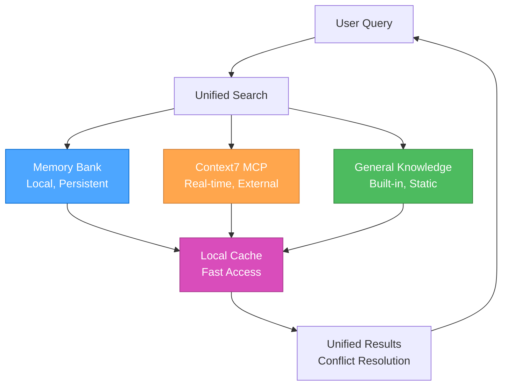

#### **Source Hierarchy**

1. **Memory Bank** (Local, Persistent)
   - Project-specific knowledge
   - Historical decisions and patterns
   - User preferences and learnings
   - Fast access, always available

2. **Context7 MCP** (Real-time, External)
   - Current library documentation
   - API references and examples
   - Best practices and guides
   - Up-to-date information

3. **General Knowledge** (Built-in, Static)
   - System documentation
   - Core concepts and principles
   - Troubleshooting guides
   - Fallback information

### 🔄 **INTELLIGENT CONFLICT RESOLUTION**

#### **Conflict Detection**

```javascript
const conflictResolver = {
  detectConflicts(memoryData, context7Data, generalData) {
    const conflicts = [];
    
    // Check for contradictory information
    if (memoryData && context7Data && memoryData.version !== context7Data.version) {
      conflicts.push({
        type: 'version_mismatch',
        memory: memoryData,
        context7: context7Data,
        priority: 'high'
      });
    }
    
    // Check for outdated information
    if (memoryData && this.isOutdated(memoryData.timestamp)) {
      conflicts.push({
        type: 'outdated',
        source: 'memory',
        data: memoryData,
        priority: 'medium'
      });
    }
    
    return conflicts;
  },
  
  resolveConflicts(conflicts) {
    return conflicts.map(conflict => {
      switch (conflict.type) {
        case 'version_mismatch':
          return this.resolveVersionMismatch(conflict);
        case 'outdated':
          return this.resolveOutdated(conflict);
        default:
          return this.resolveGeneric(conflict);
      }
    });
  }
};
```

#### **Resolution Strategies**

##### **Version Mismatch Resolution**

- **Priority**: Context7 > Memory Bank > General Knowledge
- **Action**: Update Memory Bank with current Context7 data
- **Notification**: Alert user of the update

##### **Outdated Information Resolution**

- **Priority**: Fetch fresh data from Context7
- **Action**: Replace outdated information
- **Notification**: Mark as updated

##### **Generic Conflict Resolution**

- **Priority**: Source hierarchy (Context7 > Memory > General)
- **Action**: Use highest priority source
- **Notification**: Log conflict for review

### 📊 **PERFORMANCE OPTIMIZATION**

#### **Caching Strategy**

```javascript
const documentationCache = {
  memory: new Map(),
  external: new Map(),
  general: new Map(),
  
  async get(key, source) {
    const cache = this[source];
    
    if (cache.has(key)) {
      const entry = cache.get(key);
      if (this.isValid(entry)) {
        return entry.data;
      }
    }
    
    const data = await this.fetch(key, source);
    cache.set(key, {
      data: data,
      timestamp: Date.now(),
      ttl: this.getTTL(source)
    });
    
    return data;
  },
  
  getTTL(source) {
    const ttlMap = {
      memory: 24 * 60 * 60 * 1000, // 24 hours
      external: 60 * 60 * 1000,    // 1 hour
      general: 7 * 24 * 60 * 60 * 1000 // 1 week
    };
    return ttlMap[source] || 60 * 60 * 1000;
  }
};
```

#### **Performance Metrics**

##### **Key Performance Indicators**

- **Search Speed**: Time to retrieve information from all sources
- **Cache Hit Rate**: Percentage of cached information usage
- **Conflict Resolution Time**: Time to resolve information conflicts
- **User Satisfaction**: Feedback on information quality and relevance

##### **Optimization Opportunities**

- **Intelligent Caching**: Cache frequently accessed information
- **Predictive Loading**: Pre-load likely needed information
- **Source Prioritization**: Optimize source selection based on usage patterns
- **Conflict Prevention**: Reduce conflicts through better information management

### 🔄 **INTEGRATION WITH 3-MODE SYSTEM**

#### **Mode-Specific Documentation**

##### **Strategic Mode**

- **Primary**: Memory Bank (historical decisions, patterns)
- **Secondary**: General Knowledge (strategic insights)
- **Tertiary**: Context7 (current best practices)

##### **Tactical Mode**

- **Primary**: Context7 (current documentation, APIs)
- **Secondary**: Memory Bank (project patterns)
- **Tertiary**: General Knowledge (design patterns)

##### **Operational Mode**

- **Primary**: Context7 (implementation details)
- **Secondary**: Memory Bank (project-specific context)
- **Tertiary**: General Knowledge (troubleshooting)

### 📚 **REFERENCES**

- [MCP Ecosystem Overview](../.cursor/rules/mcp-ecosystem.mdc) - MCP server overview
- [Memory Bank Overview](../.cursor/rules/memory-bank-overview.mdc) - Memory bank system overview
- [Context7 MCP Guide](../.cursor/rules/mcp-context7.mdc) - Context7 integration
- [Basic Memory MCP Guide](../.cursor/rules/mcp-basic-memory.mdc) - Basic Memory integration
- [System Architecture](../.cursor/rules/technical-architecture.mdc) - System architecture and relationships

### 🎯 **NEXT STEPS**

1. **Configure MCP servers** for enhanced documentation access
2. **Set up memory bank structure** for local knowledge management
3. **Implement unified search** for seamless information access
4. **Optimize performance** using caching and conflict resolution
5. **Integrate with 3-mode system** for mode-specific documentation

---

**Last Updated**: 2025-07-23  
**Version**: 1.0  
**Status**: Complete unified documentation system

---

<a id="rulessystem-effective-rule-writingmd"></a>
## rules\system-effective-rule-writing.md

## System Effective Rule Writing

### 1. Getting Started: The Basics

To begin creating `.mdc` rule files that Cursor can use, follow these essential steps:

* Create new Markdown files (`.mdc`) directly within your workspace's `.cursor/rules/` directory.
* Name your files using `kebab-case` (e.g., `my-new-rule.mdc`).
* Ensure each rule file includes the [Mandatory Frontmatter Structure](#3-frontmatter-for-metadata) at its very beginning.

For managing your rule files in a version-controlled environment (e.g., Git/GitHub), common practices include forking the repository and submitting Pull Requests for changes. These practices are for repository management and collaboration, not for Cursor's local rule recognition.

### 2. Core Principles for All .mdc Rules

* **Clear Objective:** Every rule should have a well-defined purpose. State this objective clearly at the beginning of the rule, ideally in the frontmatter `description` and reinforced in the introductory text.
  * *Example:* This document's objective is stated in its frontmatter `description` and introduction.
* **Structured Content:** Use Markdown effectively to structure your rule.
  * **Headings and Subheadings:** Organize content logically using `#`, `##`, `###`, etc.
  * **Lists:** Use bulleted (`*`, `-`) or numbered (`1.`, `2.`) lists for steps, criteria, or key points.
  * **Code Blocks:** Use fenced code blocks (``` for code examples, commands, or structured data). Specify the language for syntax highlighting (e.g., ```typescript ... ```).
  * **Emphasis:** Use **bold** and *italics* to highlight important terms or instructions.
* **Clarity and Precision:** Write in a clear, unambiguous manner. Avoid jargon where possible, or explain it if necessary. If the rule is meant to guide AI behavior, precision is paramount.
* **Modularity (The "Surgically Specific" Principle):** This is a critical principle. Each rule should focus on a single, specific topic, tool, or workflow. Avoid creating large, monolithic rules that cover many different concepts. This makes rules easier to manage, understand, update, and for the AI to apply precisely when relevant.
* **Time MCP Integration:** **MANDATORY** - All rules that contain dates MUST use the Time MCP for date formatting. Never hardcode dates in any format. Always call `mcp_time_get_current_time({ timezone: 'Europe/Berlin' })` and use the returned date for all date fields.

### 3. Frontmatter for Metadata

Use YAML frontmatter at the beginning of your rule file to provide metadata. This helps Cursor (and humans) understand the rule's context and applicability.

⚠️ **CRITICAL: Use `alwaysApply: true` Sparingly** ⚠️

The `alwaysApply: true` flag is powerful, but should be reserved **only for the most fundamental, system-level rules** that are required for the AI to function correctly at all times (e.g., `protocol-control-system.mdc`). Most rules should be designed for **dynamic activation**—triggered by specific events, user commands, or file context—to keep the AI's active context lean and efficient.

⚠️ **CRITICAL: Mandatory Frontmatter Structure** ⚠️

**Every `.mdc` rule file MUST include a complete YAML frontmatter block at its very beginning.** This block provides essential metadata for Cursor's internal processing and human readability.

* **Delimiters:** The frontmatter block MUST start and end with `---` on its own line.
* **Required Fields:** At minimum, the `description` and `tags` fields are mandatory.
  * `description` (string): A concise summary of the rule's purpose.
  * `tags` (list of strings): A YAML list of keywords that categorize the rule (e.g., `[mode-specific, plan, quality]`).
* **Globs (Recommended for format-specific rules):**
  * Specify the `globs` field as a plain, comma-separated list of patterns, with **no brackets** and **no quotation marks**. For example:

    ```yaml
    globs: **/*.html
    ```

  * For multiple file types, separate each pattern with a comma (no spaces):

    ```yaml
    globs: **/*.js,**/*.ts,**/*.html
    ```

  * **Do NOT use brackets or quotes.** The following are all incorrect:

    ```yaml
    globs: ["**/*.html"]
    globs: [**/*.html]
    globs: ["**/*.html", "*.html"]
    globs: ["**/*.html"],**/*.html,.html
    globs: "**/*.html"
    ```

    These are invalid and may not be parsed correctly.
  * **Summary:**
    * Use only the plain, comma-separated format for globs.
    * No brackets, no quotes, no extra text after the patterns.
* **Optional Fields for Project Rules:** Project rules can also include `alwaysApply: true/false` and a `description` field for `Agent Requested` rule types.

⚠️ **CRITICAL: Avoid Duplicate Headers** ⚠️

**NEVER include multiple YAML frontmatter blocks in a single rule file.** Each `.mdc` file should have exactly ONE frontmatter block at the very beginning. Duplicate headers can cause confusion and inconsistent rule activation.

* **Common Mistake:** Having headers at both the beginning and end of the file
* **Correct Structure:** Single header block at the very top of the file
* **Validation:** Always verify your rule has only one `---` block

⚠️ **CRITICAL: "Agent Requested" Rule Structure** ⚠️

For rules that should be available to the AI across multiple file types (not constrained to specific globs), use this simplified structure:

```yaml
---
description: Clear description of the rule's purpose and scope.
alwaysApply: false
---
```

**Key Points:**

* **Remove `globs` field** - This makes the rule "Agent Requested" instead of "Auto Attached"
* **Remove `tags` field** - Not needed for Agent Requested rules
* **Keep `alwaysApply: false`** - Ensures the AI can choose when to apply the rule
* **Use for:** Thinking frameworks, mode systems, role definitions, workflow orchestrators, and other cross-cutting concerns

**Examples of "Agent Requested" Rules:**

* Thinking frameworks (`thinking-framework.mdc`, `thinking-contemplative.mdc`)
* Mode systems (`mode-system-unified.mdc`)
* Role definitions (`mode-system-unified.mdc`)
* System documentation (`system-documentation.mdc`)
* Memory management (`memory-bank-integration.mdc`)

Example of Mandatory Frontmatter:

```yaml
---
description: A brief explanation of what this rule is for.
tags: [category, subcategory]
globs: **/*.mdc
---
```

### 3.5. Understanding the Rule Ecosystem

Here's a breakdown of the different types of rules, instructions, and memories, how they interact, what's most important, and what each should contain:

#### 1. User Rules (Global Preferences)

* **What they are:** These are global preferences defined in Cursor Settings → Rules that apply across all projects. They define fundamental behavioral principles for the AI that are always applied.
* **Source:** Configured in `Cursor Settings` > `General` > `Rules for AI`.
* **Importance:** Most important, as they form the foundational behavioral constraints and guidelines. They are usually non-negotiable and apply regardless of project specifics.
* **What they should say:** Broad principles like communication style (e.g., "Technical but Concise"), core capabilities, and overarching operational guidelines (e.g., "Always verify information").
* **Why maintain separation (even with one workspace):** This separation keeps your fundamental AI model directives clean and focused on universal applicability. If you were ever to interact with the AI model in a completely different context (even if not a formal "workspace"), these rules would still apply, ensuring consistent AI behavior across all projects.

#### 2. Project Rules

These rules are specific to the current project or workspace, stored in the `.cursor/rules` directory, and are version-controlled. They can be further categorized by how they are applied:

* **Agent Requested:**
  * **What they are:** Available to the AI, which decides whether to include it based on its relevance to the task. They provide specialized context or modify behavior for particular scenarios.
  * **Source:** Defined by the user or project maintainers within specific rule files (e.g., `.mdc` files in `.cursor/rules/`).
  * **Importance:** Important for adapting the AI's behavior to project-specific needs without being constantly active. They are activated on demand.
  * **What they should say:** Context-specific guidelines like "context-management" (how to handle context window usage), "context7-auto-docs" (when to use a specific documentation tool), or "enhanced-error-handling" (how to diagnose and fix errors). Requires a `description` field in its frontmatter.

* **Always:**
  * **What they are:** Always included in the AI model's context when the rule's glob pattern matches. They define project-level standards, conventions, and non-negotiables that the AI must *always* follow within that project.
  * **Source:** Defined by the user or project maintainers within specific rule files (`.mdc` files in `.cursor/rules/`) with `alwaysApply: true` in their frontmatter.
  * **Importance:** Highly important for ensuring consistency and adherence to project-specific quality, architectural, and workflow standards. They directly shape how the AI operates within that project.
  * **What they should say:** Detailed standards for "Code Quality Standards" (no TODOs, readability, error handling), "Perchance Best Practices" (modular organization, IndexedDB, responsiveness), "Communication Style Guide" (output formats, problem-solving approach), and "Protocol Control System" (how Planning Protocol and Execution Protocol work).
* **Why maintain separation (even with one workspace):** This clearly signals that these rules are *for this project*. This enhances organizational clarity, makes it easier for new contributors (human or AI model) to understand project specifics, and prevents accidental application of project-specific rules if a second, unrelated workspace were ever introduced in the future.

* **Auto Attached:**
  * **What they are:** Included when files matching a specified glob pattern are referenced in the AI's context. These rules provide context-aware guidance without needing to be manually invoked.
  * **Source:** Defined within `.mdc` files in `.cursor/rules/` with a `globs` pattern specified in their frontmatter, and `alwaysApply: false` (or omitted).
  * **Importance:** Useful for providing specialized guidance relevant to specific file types or directory structures, ensuring the AI has relevant context when working on particular parts of the codebase.
  * **What they should say:** Framework-specific rules (e.g., SolidJS preferences for `.tsx` files), special handling for auto-generated files, custom UI development patterns, or code style for specific folders.

* **Manual:**
  * **What they are:** Only included when explicitly mentioned by the user using `@ruleName` in the chat or prompt.
  * **Source:** Any `.mdc` file in `.cursor/rules/` that does not have an `alwaysApply: true` or `globs` pattern that causes it to be `Auto Attached`.
  * **Importance:** Allows for on-demand application of specific rules that are not always needed but can be invoked when required for particular tasks or scenarios.
  * **What they should say:** Guidelines for specialized scenarios that are not triggered by file patterns or always active.

#### 3. .cursorrules (Legacy)

* **What they are:** A legacy file format for project-specific rules, located in your project's root directory. It is still supported for backward compatibility but is deprecated.
* **Source:** A `.cursorrules` file in the project root.
* **Importance:** Low, as it is deprecated. Migration to Project Rules (`.cursor/rules` directory) is recommended for better control, flexibility, and visibility.
* **What they should say:** Any project-specific rules, but ideally, this content should be migrated to `Project Rules`.

#### 4. Mode-Specific Rules

* **What they are:** Rules that become active only when the AI is in a particular "mode" (e.g., Planning Protocol or Execution Protocol). They define the specific behaviors and tool access for that mode.
* **Source:** Defined within the system that manages the AI's operational modes (often as part of the overall prompt or by Cursor's internal mechanisms).
* **Importance:** Crucial for dictating the AI's immediate behavior and available tools in different phases of a task (planning vs. execution).
* **What they should say:** Instructions like "Never ask for permission before making a change—just do it" (for Execution Protocol) or outlining available/restricted tools within a specific mode.

#### 5. Instructions

* **What they are:** Direct directives from the user that guide the AI's actions for the current task or overall session. These can be explicit requests or general preferences.
* **Source:** Directly provided by the user in natural language or embedded within files like `AI-Handoff.md` as "User's Explicit Instructions."
* **Importance:** Extremely important for fulfilling the user's immediate and long-term goals. The AI must prioritize these.
* **What they should say:** Specific requirements for a task (e.g., "Minimal, modern, robust UI/UX," "All CSS is consolidated into a single file"), preferences (e.g., "No icons in UI, only text labels"), and behavioral expectations (e.g., "Incremental, non-dramatic changes only").

#### 6. Memories

* **What they are:** Factual information or past learnings generated by the AI based on previous interactions, observations, or successful problem-solving. They serve as persistent context.
* **Source:** Generated by the AI and stored, often in a "memory-bank" directory (e.g., `coreContext.md`, `currentState.md`, `designSystem.md`).
* **Importance:** Important for maintaining continuity and avoiding repetitive actions or mistakes. They inform the AI's understanding of the project's history and current state.
* **What they should say:** Summaries of past tasks, identified preferences (e.g., "User prefers icon-less buttons"), successful bug fixes, or preferred working styles ("User prefers not to ask clarifying questions too frequently").

##### How Rules Interact (Hierarchy of Influence)

Rules provide persistent, reusable context at the prompt level. When applied, rule contents are included at the start of the model context, giving the AI consistent guidance. The interaction generally follows a hierarchy from broadest to most specific, with more specific elements potentially refining or overriding broader ones:

* **User Rules:** Form the absolute foundation. All other rules, instructions, and memories operate within the boundaries set by User Rules.
* **Project Rules (Always):** Apply constantly within a specific project, building upon User Rules and defining project-specific standards.
* **Instructions:** Direct user instructions take precedence over general project rules and memories for the current task, but must still operate within the bounds of User and Project Rules.
* **Mode-Specific Rules:** These are dynamic, temporarily altering the AI's behavior and tool access based on its current operational mode (e.g., Planning Protocol or Execution Protocol). They are a layer of behavior refinement on top of User, Project, and instruction sets.
* **Project Rules (Agent Requested/Auto Attached/Manual):** Activated dynamically by the AI or by reference to retrieve specific context or modify behavior for particular situations, adhering to all higher-level rules.
* **Memories:** Inform the AI's decision-making process by providing historical context and learned preferences. They influence how rules and instructions are interpreted and applied, but don't typically override explicit rules or instructions.

##### Most Important

* **User Rules** and **Project Rules (Always)** are foundational as they dictate the fundamental operating principles and project standards.
* **User's Explicit Instructions** are paramount for task fulfillment, as they represent your direct intent.
* **Mode-Specific Rules:** These are critical for the immediate operational behavior.

##### What should say what

* **User Rules / Project Rules (Always):** Should contain principles, standards, architectural patterns, non-negotiables, and broad behavioral guidelines. They are prescriptive and define how the AI should generally operate and what constitutes good practice.
* **Instructions:** Should contain specific requirements for tasks, direct preferences, and explicit prohibitions. They are declarative and tell the AI what to do or what to avoid.
* **Memories:** Should contain factual summaries, past learnings, identified user preferences, and project state information. They are descriptive and provide historical and ongoing context.

By having a clear separation, you make the system more robust, easier to manage, and more predictable in its behavior. You can update a small rule without fearing widespread unintended consequences, and the AI can more easily reason about its actions by referring to specific, well-defined guidelines.

### 4. Types of Cursor Rules and Their Structure

Cursor Rules can serve various purposes. Tailor the structure and content to the type of rule you're writing.

#### a. Informational / Documentation Rules

Provide comprehensive information about a system, architecture, or technology. This document is an example of an informational rule.

* **Key Elements:**
  * **Establish Context:** Provide a clear overview and state the project goals to set the stage for understanding.
  * **Explain Components:** Offer detailed explanations of system components, core concepts, or critical processes.
  * **Visualize Systems:** Include diagrams (e.g., Mermaid.js) to visually represent systems and their interactions.
  * **Illustrate Usage:** Provide concrete code snippets or configuration examples to show practical application.
  * **Define Terms:** Ensure clarity by defining key terms and acronyms used within the documentation.
* **Example:** This `writing-effective-rules.mdc` document.

#### b. Process / Workflow Rules

Define a sequence of steps for the AI model or the user to follow to achieve a specific outcome.

* **Key Elements:**
  * **Define Scope:** Clearly state a precise start and end point for the workflow.
  * **Sequence Actions:** Use numbered steps to outline sequential actions that must be performed.
  * **Handle Decisions:** Include decision points with clear options (e.g., "If X, then Y, else Z") to guide conditional paths.
  * **Specify Tools:** Explicitly state which tools (e.g., `use_mcp_tool`, `write_to_file`) are to be used at each step.
  * **Outline Inputs/Outputs:** Define the expected inputs required and outputs generated for each step.
  * **Note Prerequisites:** Include notes on any dependencies or prerequisites that must be met before starting or during the process.
* **Example:** `planning-protocol.mdc`, `execution-protocol.mdc`

#### c. Behavioral / Instructional Rules (for Guiding AI)

These rules directly instruct the AI model on how it should behave, process information, or generate responses, especially in specific contexts.

* **Key Elements:**
  * **Provide Directives:** Use imperative verbs (MUST, SHOULD, DO NOT, NEVER, ALWAYS) for absolute requirements or strong recommendations.
  * **Highlight Criticality:** Use formatting (bold, ALL CAPS, emojis like 🚨, ⚠️, ✅, ❌) to draw immediate attention to critical instructions or prohibitions.
  * **Show Examples:** Provide clear positive and negative examples (e.g., code patterns to use vs. avoid) to illustrate correct behavior.
  * **Define Triggers:** Specify conditions or triggers that activate the rule or particular instructions within it.
  * **Include Verification:** Integrate "thinking" blocks or checklists for the AI to verify its actions against the rule's constraints.
  * **Manage Context:** Define how the AI model should manage context, memory, or state if relevant (e.g., `coreContext.md`, `currentState.md`, `designSystem.md`).
* **Example:** `planning-protocol.mdc`, `execution-protocol.mdc`

#### d. Meta-Rules

Rules that define how other rules are managed or how the AI's own processes are governed. They provide structure and control over the entire rule ecosystem.

* **Key Elements:**
  * **Define Scope:** Clearly state the purpose of the meta-rule (e.g., managing protocol transitions, defining activation triggers).
  * **Centralize Logic:** Consolidate distributed logic into a single, authoritative source.
  * **Reference Other Rules:** Explicitly reference the other rules they govern or interact with by filename.
* **Example:** `protocol-control-system.mdc` (governs protocol state) or `rule-activation-triggers.mdc` (a central registry for what events activate which rules).

#### f. Nested Rules

Organize rules by placing them in `.cursor/rules` directories throughout your project. Nested rules automatically attach when files in their directory are referenced.

```text
project/
  .cursor/rules/        # Project-wide rules
  backend/
    server/
      .cursor/rules/    # Backend-specific rules
  frontend/
    .cursor/rules/      # Frontend-specific rules
```

#### g. How Rules Interact with Cursor's Features

Rules act as the primary filter and guide for the AI model's understanding and actions across all other information sources. They effectively serve as the "system prompt" or "AI brain" for Agent and Inline Edit features, influencing how the AI leverages various types of context.

* **Codebase Indexing & PR History Indexing:** Rules influence *how* the AI model interprets and uses the information derived from your indexed codebase and PR history. They can instruct the AI on *what to look for* in the indexed data, *how to interpret* code patterns, and *what standards to apply* when modifying or generating code within that codebase.

* **Model Context Protocol (MCP):** Rules *dictate when and how* the AI model uses MCP tools and accesses MCP resources. For instance, a rule could mandate the use of a specific MCP tool for certain security checks, for accessing real-time data from an external API, or specify when to use `sequential_thinking` for complex problem-solving.

* **APIs (External Services):** While Cursor doesn't directly manage external APIs, rules can define how the AI model should *interact* with APIs when generating code or making recommendations. This includes specifying authentication methods, error handling strategies, or data formatting for API calls.

* **Documentation (`@Docs` & Custom Resources):** Rules can guide the AI model to consult specific documentation sources (e.g., via `@Add Doc` in settings or `@Docs` references) for particular tasks, ensuring it prioritizes and uses the correct contextual information over general knowledge. This includes custom developer documentation and externally indexed resources.

### 5. Language and Formatting for AI Guidance

When writing rules intended to directly steer the AI model's behavior, certain conventions are highly effective:

* **Be Directive:**
  * Use **MUST** for absolute requirements.
  * Use **SHOULD** for strong recommendations.
  * Use **MAY** for optional actions.
  * Use **MUST NOT** or **NEVER** for absolute prohibitions.
  * Use **SHOULD NOT** for strong discouragement.
* **Highlight Critical Information:** Use formatting (bold, ALL CAPS, emojis like 🚨, ⚠️, ✅, ❌) to draw immediate attention to critical instructions or prohibitions.
* **Provide Concrete Examples:**
  * Show exact code snippets, commands, or output formats.
  * For code generation, clearly distinguish between desired and undesired patterns.
* **Define AI model's "Thought Process":** The `<thinking> ... </thinking>` block is a good way to make the AI model "pause and check" its understanding or state before proceeding.
* **Specify Tool Usage:** If the AI model needs to use a specific tool (e.g., `attempt_completion`, `replace_in_file`, `use_mcp_tool`), explicitly state it and provide any necessary parameters or context for that tool.

### 6. Content Best Practices

Good rules are focused, actionable, and scoped.

* **Start Broad, Then Narrow:** Begin with a general overview or objective, then delve into specifics.
* **Use Analogies or Scenarios:** If explaining a complex concept, an analogy or a use-case scenario can be helpful.
* **Define Terminology:** If your rule introduces specific terms or acronyms, define them.
* **Anticipate Questions:** Try to think about what questions a user (or the AI model itself) might have and address them proactively.
* **Keep it Updated:** As systems or processes change, ensure the relevant `.cursor/rules/` collection is updated to reflect those changes. This `writing-effective-rules.mdc` rule encourages this.
* **Keep rules under 500 lines:** Split large rules into multiple, composable rules.
* **Provide concrete examples or referenced files.**
* **Avoid vague guidance:** Write rules like clear internal docs.
* **Reuse rules:** When repeating prompts in chat.

### 7. Referencing Other Rules

If your rule builds upon or relates to another rule, feel free to reference it by its filename. This helps create a connected knowledge base.

### 8. Testing Your Rule

While not always formally testable, consider how your rule will be interpreted:

* **Human Readability:** Is it clear to another person? If so, it's more likely to be clear to the AI model.
* **AI model Interpretation (for behavioral rules):** Does it provide enough specific guidance? Are there ambiguities? Try "role-playing" as the AI model and see if you can follow the instructions.
* **Practical Application:** If it's a workflow, manually step through it. If it's a coding guideline, try applying it to a piece of code.
* **Self-Review Against These Guidelines:** Does your new rule adhere to the principles and best practices outlined in *this very document* (`writing-effective-rules.mdc`)?

* **Human Readability:** Is it clear to another person? If so, it's more likely to be clear to the AI model.
* **AI model Interpretation (for behavioral rules):** Does it provide enough specific guidance? Are there ambiguities? Try "role-playing" as the AI model and see if you can follow the instructions.
* **Practical Application:** If it's a workflow, manually step through it. If it's a coding guideline, try applying it to a piece of code.
* **Self-Review Against These Guidelines:** Does your new rule adhere to the principles and best practices outlined in *this very document* (`writing-effective-rules.mdc`)?

* **AI model Interpretation (for behavioral rules):** Does it provide enough specific guidance? Are there ambiguities? Try "role-playing" as the AI model and see if you can follow the instructions.
* **Practical Application:** If it's a workflow, manually step through it. If it's a coding guideline, try applying it to a piece of code.
* **Self-Review Against These Guidelines:** Does your new rule adhere to the principles and best practices outlined in *this very document* (`writing-effective-rules.mdc`)?

---

<a id="rulesthinking-context-aware-rule-loadingmd"></a>
## rules\thinking-context-aware-rule-loading.md

## **🎯 CONTEXT-AWARE RULE LOADING: Intelligent optimization for the 3-mode system!**

> **TL;DR:** Intelligent rule loading system that selects and loads only relevant
> rules based on task context, complexity, current mode, and thinking approach for optimal token
> efficiency and performance.

### 🎯 **SYSTEM OVERVIEW**

The context-aware rule loading system analyzes the current task context and
intelligently selects only the most relevant rules to load, significantly
improving token efficiency while maintaining full functionality.

### 🔍 **CONTEXT ANALYSIS FRAMEWORK**

#### **Context Dimensions**

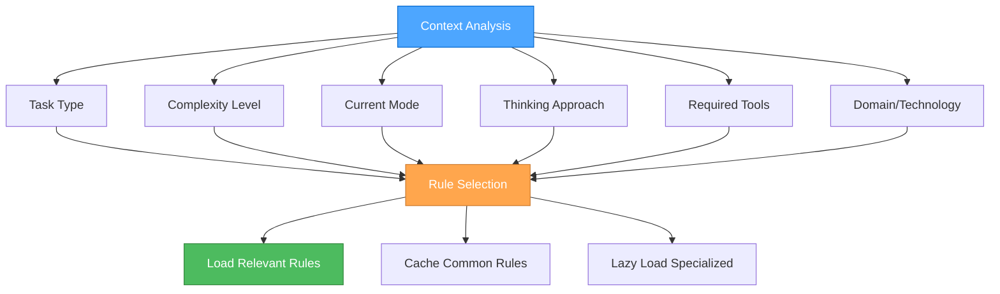

#### **Context Analysis Algorithm**

```javascript
function analyzeContext(task, currentMode, thinkingApproach, availableTools) {
  return {
    taskType: classifyTaskType(task),
    complexity: assessComplexity(task),
    mode: currentMode,
    thinkingApproach: thinkingApproach,
    requiredTools: identifyRequiredTools(task),
    domain: identifyDomain(task),
    urgency: assessUrgency(task),
    scope: assessScope(task)
  };
}

function classifyTaskType(task) {
  if (task.includes('debug') || task.includes('fix')) return 'debugging';
  if (task.includes('implement') || task.includes('create')) return 'implementation';
  if (task.includes('design') || task.includes('plan')) return 'planning';
  if (task.includes('analyze') || task.includes('review')) return 'analysis';
  if (task.includes('optimize') || task.includes('improve')) return 'optimization';
  return 'general';
}

function assessComplexity(task) {
  const indicators = {
    high: ['complex', 'multi-step', 'architecture', 'system', 'integration'],
    medium: ['feature', 'component', 'enhancement', 'refactor'],
    low: ['fix', 'simple', 'quick', 'basic', 'update']
  };
  
  for (const [level, keywords] of Object.entries(indicators)) {
    if (keywords.some(keyword => task.toLowerCase().includes(keyword))) {
      return level;
    }
  }
  return 'medium';
}
```

### 📊 **RULE CATEGORIZATION**

#### **Core Rules (Always Loaded)**

```markdown
**Essential for all tasks:**
- `mode-system-unified.mdc` - Core system orchestrator
- `thinking-framework.mdc` - Thinking approach methodology
- `system-context-aware-rule-loading-enhanced.mdc` - This system itself
```

#### **Mode-Specific Rules**

##### **🎭 Strategic Mode Rules**

```markdown
**Contemplative Thinking Focus:**
- `thinking-framework.mdc` - Contemplative thinking approach
- `role-project-manager.mdc` - Project management and coordination
- `technical-architecture.mdc` - System-level architecture decisions
- `memory-bank-optimization.mdc` - Memory and context optimization
```

##### **🎨 Tactical Mode Rules**

```markdown
**Sequential Thinking Focus:**
- `thinking-framework.mdc` - Sequential thinking approach
- `mcp-context7.mdc` - Documentation access for planning
- `js-development.mdc` - JavaScript development patterns
- `scss-advanced-patterns.mdc` - Advanced styling patterns
- `html-development.mdc` - HTML structure and semantics
```

##### **⚒️ Operational Mode Rules**

```markdown
**Professional Coding Focus:**
- `thinking-framework.mdc` - Professional coding approach
- `role-assistant.mdc` - Professional coding standards
- `js-development.mdc` - Modern JavaScript practices
- `scss-modern-css-frameworks.mdc` - Modern CSS frameworks
- `js-patterns-practices.mdc` - Code patterns and best practices
```

#### **Task-Specific Rules**

##### **🧠 Thinking & Problem-Solving**

```markdown
**Sequential Thinking Tasks:**
- `thinking-framework.mdc` - Tool-guided problem-solving
- `mcp-context7.mdc` - Documentation access

**Contemplative Thinking Tasks:**
- `thinking-framework.mdc` - Natural exploration
- `system-effective-rule-writing.mdc` - Rule creation guidance

**Professional Coding Tasks:**
- `role-assistant.mdc` - Production-ready coding
- `js-development.mdc` - Modern JS practices
```

##### **🎨 Development & Architecture**

```markdown
**Frontend Development:**
- `scss-modern-css-frameworks.mdc` - Modern CSS practices
- `scss-advanced-patterns.mdc` - Advanced SCSS
- `html-development.mdc` - Semantic HTML
- `js-cash-dom-usage.mdc` - DOM manipulation

**JavaScript Development:**
- `js-development.mdc` - Modern JS
- `js-cash-dom-usage.mdc` - DOM manipulation
- `js-modern-apis.mdc` - Modern APIs
- `js-patterns-practices.mdc` - Patterns and practices

**Perchance Development:**
- `perchance-architecture.mdc` - Platform architecture
- `perchance-development-lifecycle.mdc` - Development process
- `perchance-plugin-system.mdc` - Plugin development
```

##### **💾 Memory & Context**

```markdown
**Memory Management:**
- `memory-bank-optimization.mdc` - Token efficiency
- `memory-bank-workflow.mdc` - Memory workflow

**Context Management:**
- `mcp-context7.mdc` - External documentation
- `mcp-ecosystem.mdc` - MCP server management
- `mcp-time.mdc` - Time management
```

#### **Complexity-Based Rules**

##### **Level 1 (Simple Tasks)**

```markdown
**Minimal Rule Set:**
- `mode-system-unified.mdc` - Core system
- `thinking-framework.mdc` - Professional coding approach
- `role-assistant.mdc` - Professional coding standards
- Domain-specific rule (e.g., `js-development.mdc`)
```

##### **Level 2 (Medium Tasks)**

```markdown
**Enhanced Rule Set:**
- All Level 1 rules
- `thinking-framework.mdc` - Sequential thinking approach
- `mcp-context7.mdc` - Documentation access
- Additional domain-specific rules
```

##### **Level 3 (Complex Tasks)**

```markdown
**Comprehensive Rule Set:**
- All Level 2 rules
- `thinking-framework.mdc` - Contemplative thinking approach
- `memory-bank-optimization.mdc` - Memory management
- All relevant domain-specific rules
```

### 🔄 **INTELLIGENT RULE SELECTION**

#### **Rule Selection Algorithm**

```javascript
function selectRules(context) {
  const rules = new Set();
  
  // Always load core rules
  rules.add('mode-system-unified.mdc');
  rules.add('thinking-framework.mdc');
  rules.add('system-context-aware-rule-loading-enhanced.mdc');
  
  // Load mode-specific rules
  const modeRules = getModeRules(context.mode);
  modeRules.forEach(rule => rules.add(rule));
  
  // Load thinking approach rules
  const thinkingRules = getThinkingRules(context.thinkingApproach);
  thinkingRules.forEach(rule => rules.add(rule));
  
  // Load task-specific rules
  const taskRules = getTaskSpecificRules(context.taskType);
  taskRules.forEach(rule => rules.add(rule));
  
  // Load complexity-based rules
  const complexityRules = getComplexityRules(context.complexity);
  complexityRules.forEach(rule => rules.add(rule));
  
  // Load domain-specific rules
  const domainRules = getDomainRules(context.domain);
  domainRules.forEach(rule => rules.add(rule));
  
  return Array.from(rules);
}

function getModeRules(mode) {
  const ruleMap = {
    'strategic': ['role-project-manager.mdc', 'technical-architecture.mdc', 'memory-bank-optimization.mdc'],
    'tactical': ['mcp-context7.mdc', 'js-development.mdc', 'scss-advanced-patterns.mdc'],
    'operational': ['role-assistant.mdc', 'js-development.mdc', 'js-patterns-practices.mdc']
  };
  
  return ruleMap[mode] || [];
}

function getThinkingRules(thinkingApproach) {
  const ruleMap = {
    'contemplative': ['system-effective-rule-writing.mdc'],
    'sequential': ['mcp-context7.mdc', 'mcp-ecosystem.mdc'],
    'professional': ['role-assistant.mdc', 'js-development.mdc']
  };
  
  return ruleMap[thinkingApproach] || [];
}

function getTaskSpecificRules(taskType) {
  const ruleMap = {
    debugging: ['js-development.mdc', 'js-debugging.mdc'],
    implementation: ['role-assistant.mdc', 'js-development.mdc'],
    planning: ['mcp-context7.mdc', 'technical-architecture.mdc'],
    analysis: ['mcp-context7.mdc', 'js-patterns-practices.mdc'],
    optimization: ['memory-bank-optimization.mdc', 'js-patterns-practices.mdc']
  };
  
  return ruleMap[taskType] || [];
}
```

#### **Rule Loading Strategy**

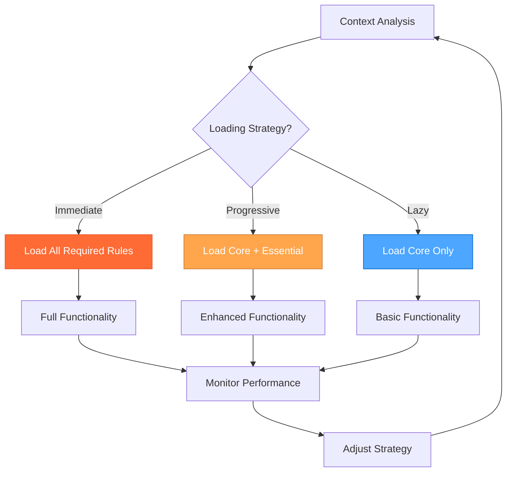

### 🚀 **PERFORMANCE OPTIMIZATION**

#### **Token Efficiency Strategies**

##### **1. Rule Caching**

```javascript
const ruleCache = new Map();

function loadRule(ruleName) {
  if (ruleCache.has(ruleName)) {
    return ruleCache.get(ruleName);
  }
  
  const ruleContent = fetchRuleContent(ruleName);
  ruleCache.set(ruleName, ruleContent);
  return ruleContent;
}
```

##### **2. Progressive Loading**

```javascript
function progressiveLoad(context) {
  // Phase 1: Load core rules
  const coreRules = loadCoreRules();
  
  // Phase 2: Load essential rules based on context
  const essentialRules = loadEssentialRules(context);
  
  // Phase 3: Lazy load specialized rules as needed
  const specializedRules = loadSpecializedRules(context);
  
  return [...coreRules, ...essentialRules, ...specializedRules];
}
```

##### **3. Rule Compression**

```javascript
function compressRule(ruleContent) {
  // Remove unnecessary whitespace and comments
  // Keep only essential content
  // Optimize for token efficiency
  return ruleContent
    .replace(/\s+/g, ' ')
    .replace(/<!--.*?-->/g, '')
    .trim();
}
```

#### **Performance Metrics**

##### **Token Usage Tracking**

```javascript
const tokenMetrics = {
  totalTokens: 0,
  ruleTokens: {},
  efficiency: 0,
  
  trackRuleUsage(ruleName, tokenCount) {
    this.totalTokens += tokenCount;
    this.ruleTokens[ruleName] = tokenCount;
    this.calculateEfficiency();
  },
  
  calculateEfficiency() {
    // Calculate efficiency based on loaded rules vs functionality
    this.efficiency = this.totalTokens / this.getFunctionalityScore();
  }
};
```

### 🔧 **IMPLEMENTATION GUIDELINES**

#### **For AI Assistants**

1. **Always analyze context** before loading rules
2. **Use the selection algorithm** for optimal rule choice
3. **Monitor token usage** and adjust strategy as needed
4. **Cache frequently used rules** for efficiency
5. **Lazy load specialized rules** when required
6. **Consider current mode** when selecting rules
7. **Match thinking approach** to rule selection

#### **For System Administrators**

1. **Configure rule priorities** based on usage patterns
2. **Set up monitoring** for rule loading performance
3. **Optimize rule content** for token efficiency
4. **Update rule categories** as new rules are added
5. **Maintain rule dependencies** for proper loading
6. **Track mode-specific usage** for optimization

### 📊 **MONITORING AND ANALYTICS**

#### **Key Performance Indicators**

- **Token Efficiency**: Tokens used per functionality unit
- **Rule Loading Speed**: Time to load required rules
- **Cache Hit Rate**: Percentage of cached rule usage
- **User Satisfaction**: Feedback on system responsiveness
- **Mode-Specific Performance**: Efficiency by mode
- **Thinking Approach Performance**: Efficiency by thinking approach

#### **Optimization Opportunities**

- **Rule Consolidation**: Combine related rules for efficiency
- **Content Optimization**: Remove redundant content
- **Loading Strategy**: Adjust based on usage patterns
- **Cache Management**: Optimize cache size and eviction
- **Mode-Specific Optimization**: Tailor rules to mode requirements

### 🎯 **INTEGRATION WITH 3-MODE SYSTEM**

#### **Mode-Aware Rule Loading**

```javascript
function selectRulesForMode(mode, context) {
  const modeRules = {
    'strategic': [
      'thinking-framework.mdc', // Contemplative thinking
      'role-project-manager.mdc',
      'technical-architecture.mdc',
      'memory-bank-optimization.mdc'
    ],
    'tactical': [
      'thinking-framework.mdc', // Sequential thinking
      'mcp-context7.mdc',
      'js-development.mdc',
      'scss-advanced-patterns.mdc'
    ],
    'operational': [
      'thinking-framework.mdc', // Professional coding
      'role-assistant.mdc',
      'js-development.mdc',
      'js-patterns-practices.mdc'
    ]
  };
  
  return [
    ...modeRules[mode] || [],
    ...getTaskSpecificRules(context.taskType),
    ...getComplexityRules(context.complexity)
  ];
}
```

#### **Thinking Approach Integration**

```javascript
function selectRulesForThinkingApproach(thinkingApproach, context) {
  const thinkingRules = {
    'contemplative': [
      'thinking-framework.mdc', // Contemplative approach
      'system-effective-rule-writing.mdc'
    ],
    'sequential': [
      'thinking-framework.mdc', // Sequential approach
      'mcp-context7.mdc',
      'mcp-ecosystem.mdc'
    ],
    'professional': [
      'thinking-framework.mdc', // Professional approach
      'role-assistant.mdc',
      'js-development.mdc'
    ]
  };
  
  return [
    ...thinkingRules[thinkingApproach] || [],
    ...getModeRules(context.mode),
    ...getTaskSpecificRules(context.taskType)
  ];
}
```

#### **Context-Aware Approach Selection**

```javascript
function selectApproachWithRules(context) {
  // Analyze context for approach selection
  const approach = selectThinkingApproach(context);
  
  // Load rules based on selected approach
  const rules = selectRulesForApproach(approach, context);
  
  // Return approach and required rules
  return {
    approach: approach,
    rules: rules,
    strategy: determineLoadingStrategy(context)
  };
}

function selectRulesForApproach(approach, context) {
  const approachRules = {
    'sequential': ['thinking-framework.mdc', 'mcp-context7.mdc'],
    'contemplative': ['thinking-framework.mdc'],
    'professional': ['role-assistant.mdc', 'js-development.mdc']
  };
  
  return [
    ...approachRules[approach] || [],
    ...getModeRules(context.mode),
    ...getComplexityRules(context.complexity)
  ];
}
```

### 🎯 **READY TO OPTIMIZE!**

This enhanced context-aware rule loading system provides:

1. **🎯 Mode-Aware Loading** - Rules selected based on current mode
2. **🧠 Thinking Approach Integration** - Rules matched to thinking approach
3. **⚡ Token Efficiency** - Optimal rule selection for performance
4. **🔄 Dynamic Adaptation** - Rules adjusted based on context changes
5. **📊 Performance Monitoring** - Continuous optimization tracking
6. **🎭🎨⚒️ Mode Integration** - Perfect alignment with 3-mode system

**This system ensures maximum efficiency while maintaining full functionality!**

---

<a id="rulesthinking-frameworkmd"></a>
## rules\thinking-framework.md

## **🧠 UNIFIED THINKING FRAMEWORK: The optimal approach for every problem with perfect 3-mode system integration!**

> **TL;DR:** Comprehensive integrated framework that resolves conflicts between Sequential
> Thinking, Contemplative Thinking, and Professional Coding approaches with detailed
> implementation specifics, clear decision criteria, and optimal approach selection.
>
> **INTEGRATED WITH 3-MODE SYSTEM**: This framework provides the thinking approaches that map directly to the Strategic, Tactical, and Operational modes.

### 🎯 **FRAMEWORK OVERVIEW**

This unified framework integrates three distinct thinking approaches to provide
the optimal problem-solving methodology for any given task:

1. **🧠 Sequential Thinking** - Structured, tool-guided, systematic problem-solving with MCP integration
2. **🤔 Contemplative Thinking** - Natural, conversational, deep exploration with extensive contemplation
3. **⚡ Professional Coding** - Concise, production-ready, elite implementation with zero technical debt

### 🎭🎨⚒️ **INTEGRATION WITH 3-MODE SYSTEM**

#### **Clear Mode-to-Thinking Mappings**

| Mode | Thinking Approach | Primary Use Case | Key Characteristics |
|------|------------------|------------------|-------------------|
| 🎭 **Strategic Mode** | 🤔 **Contemplative Thinking** | System-level decisions, meta-reflection | Deep exploration, natural flow, uncertainty embrace |
| 🎨 **Tactical Mode** | 🧠 **Sequential Thinking** | Planning and design decisions | Systematic analysis, tool-guided, step-by-step |
| ⚒️ **Operational Mode** | ⚡ **Professional Coding** | Implementation and execution | Production-ready, zero technical debt, efficient |

#### **Automatic Mode-Based Selection**

The system automatically selects the optimal thinking approach based on the current mode:

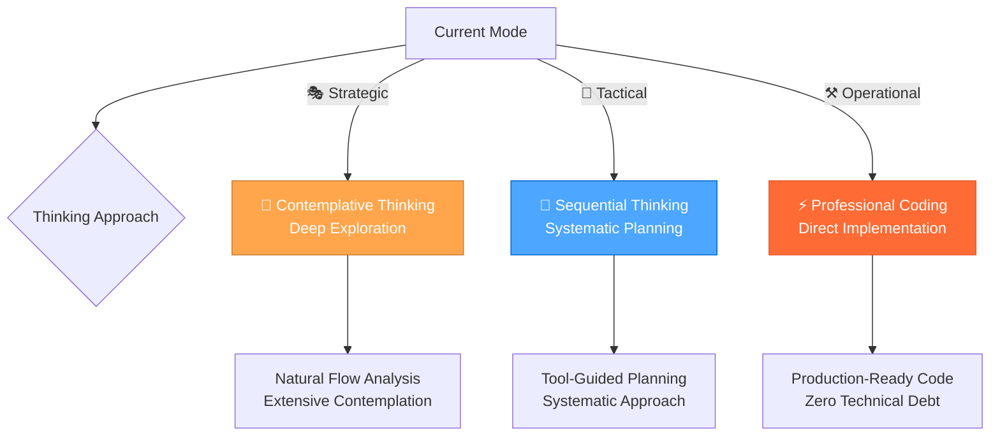

### 🎲 **DECISION MATRIX**

#### **Task Classification System**

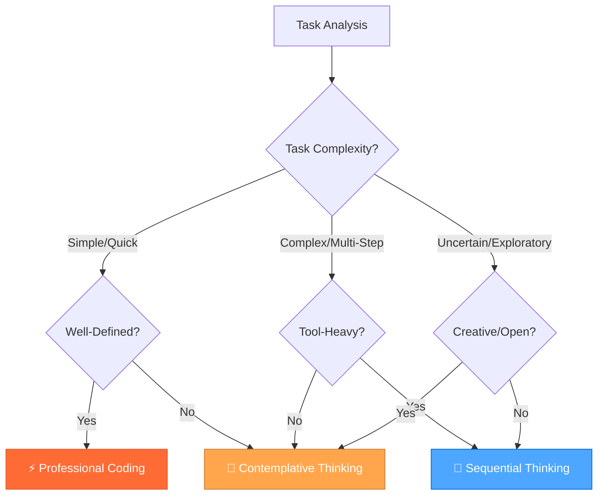

#### **Detailed Decision Criteria**

| Task Type | Primary Approach | Secondary Approach | Key Indicators | Response Style |
|-----------|------------------|-------------------|----------------|----------------|
| **Complex Multi-Step** | 🧠 Sequential Thinking | Tool Recommendations | Multiple tools needed, clear steps, systematic process | Structured, tool-guided, confidence scores |
| **Deep Exploration** | 🤔 Contemplative Thinking | Natural Flow | Creative problems, uncertainty, open-ended questions | Conversational, extensive, embracing doubt |
| **Quick Implementation** | ⚡ Professional Coding | Direct Approach | Simple tasks, well-defined requirements, production focus | Concise, production-ready, zero technical debt |
| **Strategic Planning** | 🧠 Sequential + 🤔 Contemplative | Hybrid Approach | Complex decisions, multiple options, long-term impact | Structured exploration with natural flow |

### 🧠 **SEQUENTIAL THINKING INTEGRATION**

#### **When to Use Sequential Thinking**

**✅ Perfect For:**

- Complex multi-step tasks requiring multiple tool calls
- Systematic problem decomposition and analysis
- Workflow planning with tool recommendations
- Debugging complex issues with structured approach
- Architecture decisions requiring systematic evaluation
- Tasks requiring MCP tool integration
- **🎨 Tactical Mode activities**: Planning, design decisions, implementation planning

**❌ Avoid For:**

- Simple, single-step tasks
- Creative brainstorming sessions
- Quick bug fixes or simple implementations
- Open-ended exploration without clear goals

#### **MCP Tool Integration**

**Core Sequential Thinking Tool:**

- **Tool**: `mcp_sequentialthinking_tools`
- **Purpose**: Dynamic and reflective problem-solving with intelligent tool recommendations
- **Features**: Tool recommendations, confidence scores, execution guidance, dynamic thought management

**When to Use Sequential Thinking Tools:**

- **Complex Problem Decomposition**: Breaking down large, multifaceted problems
- **Planning and Design (Iterative)**: Architecting solutions where plans might need revision
- **In-depth Analysis**: Situations requiring careful analysis with course correction
- **Unclear Scope**: Problems where full scope isn't immediately obvious
- **Multi-Step Solutions**: Tasks requiring interconnected thoughts or actions
- **Tool Selection Challenges**: When guidance on tool selection is needed
- **Context Maintenance**: Scenarios requiring coherent thought across multiple steps
- **Information Filtering**: When sifting through relevant information is necessary
- **Hypothesis Generation and Verification**: Forming and testing hypotheses
- **Workflow Planning**: Complex tasks requiring multiple tool calls

#### **Core Principles**

##### **Iterative Thought Process**

- Each use of the tool represents a single "thought"
- Build upon, question, or revise previous thoughts in subsequent calls
- Express uncertainty if it exists
- Mark thoughts that revise previous thinking using `isRevision: true`

##### **Dynamic Thought Count**

- Start with an initial estimate for `totalThoughts`
- Be prepared to adjust `totalThoughts` (up or down) as thinking evolves
- If more thoughts are needed, increment `thoughtNumber` beyond original `totalThoughts`

##### **Tool Recommendation Integration**

- Use `current_step` to provide clear guidance on what needs to be done next
- Include `recommended_tools` with confidence scores and rationale
- Track `previous_steps` and `remaining_steps` to maintain workflow context
- Provide `expected_outcome` and `next_step_conditions` for each step

##### **Hypothesis-Driven Approach**

- Generate a solution `hypothesis` when a potential solution emerges
- Verify the `hypothesis` based on preceding Chain of Thought steps
- Repeat the thinking process if the hypothesis is not satisfactory

##### **Relevance Filtering**

- Actively ignore information irrelevant to the current thought or step
- Focus on making progress towards a solution with each thought
- Maintain clarity and conciseness in each thought

##### **Completion Condition**

- Only set `nextThoughtNeeded: false` when truly finished
- Ensure a satisfactory answer or solution has been reached and verified

---

### 🧠 ADVANCED SEQUENTIAL THINKING TECHNIQUES

#### **Multi-Path Reasoning**

##### **Purpose**

Generate multiple independent solutions to complex problems and select the best approach through voting.

##### **Template**

```markdown
### 🧠 SEQUENTIAL THINKING ANALYSIS

#### **Problem Analysis**
[Systematic breakdown of the problem into components]

#### **Tool Selection & Planning**
- **Recommended Tools**: [List with confidence scores]
- **Execution Plan**: [Step-by-step approach]
- **Expected Outcomes**: [What to expect from each step]

#### **Step-by-Step Execution**
**Step 1**: [Description with tool usage]
**Step 2**: [Description with tool usage]
**Step 3**: [Description with tool usage]

#### **Results & Validation**
[Systematic results analysis and validation]

#### **Final Answer**
[Clear, structured conclusion based on systematic analysis]
```

#### **Sequential Thinking Commands**

```bash
🧠 "analyze [problem]" → Use sequential thinking for complex analysis
🧠 "plan [solution]" → Systematic solution planning with tools
🧠 "debug [issue]" → Structured debugging approach
🧠 "optimize [system]" → Systematic optimization analysis
🧠 "decide [options]" → Structured decision making
```

#### **Sequential Thinking Workflow**

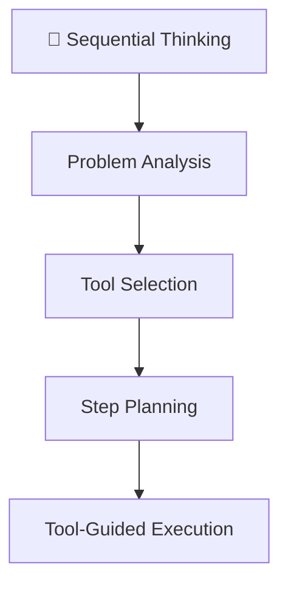

### 🤔 **CONTEMPLATIVE THINKING INTEGRATION**

#### **When to Use Contemplative Thinking**

**✅ Perfect For:**

- Deep exploration of complex, uncertain problems
- Creative brainstorming and ideation
- Philosophical or conceptual questions
- Open-ended research and discovery
- Understanding complex systems or relationships
- Tasks requiring extensive contemplation
- **🎭 Strategic Mode activities**: System-level thinking, workflow optimization, meta-reflection

**❌ Avoid For:**

- Time-sensitive, urgent tasks
- Well-defined implementation tasks
- Tasks requiring immediate action
- Simple, straightforward problems

#### Core Principles

##### Exploration Over Conclusion

- Never rush to conclusions
- Keep exploring until a solution emerges naturally from the evidence
- If uncertain, continue reasoning indefinitely
- Question every assumption and inference

##### Depth of Reasoning

- Engage in extensive contemplation (minimum 10,000 characters)
- Express thoughts in natural, conversational internal monologue
- Break down complex thoughts into simple, atomic steps
- Embrace uncertainty and revision of previous thoughts

##### Thinking Process

- Use short, simple sentences that mirror natural thought patterns
- Express uncertainty and internal debate freely
- Show work-in-progress thinking
- Acknowledge and explore dead ends
- Frequently backtrack and revise

##### Persistence

- Value thorough exploration over quick resolution
- Continue until natural resolution emerges

#### **Contemplative Thinking Output Format**

```markdown
### 🤔 CONTEMPLATIVE THINKING ANALYSIS

#### **CONTEMPLATOR**

[Extensive internal monologue - minimum 10,000 characters]

- Begin with small, foundational observations
- Question each step thoroughly
- Show natural thought progression
- Express doubts and uncertainties
- Revise and backtrack if needed
- Continue until natural resolution

##### **Natural Thought Flow Examples**
"Hmm... let me think about this..."
"Wait, that doesn't seem right..."
"Maybe I should approach this differently..."
"Going back to what I thought earlier..."

##### **Progressive Building Examples**
"Starting with the basics..."
"Building on that last point..."
"This connects to what I noticed earlier..."
"Let me break this down further..."

#### **FINAL_ANSWER**

[Only provided if reasoning naturally converges to a conclusion]

- Clear, concise summary of findings
- Acknowledge remaining uncertainties
- Note if conclusion feels premature
- No moralizing warnings or generic advice
```

#### **Contemplative Style Guidelines**

##### **Natural Thought Flow**

Your internal monologue should reflect these characteristics:

- "Hmm... let me think about this..."
- "Wait, that doesn't seem right..."
- "Maybe I should approach this differently..."
- "Going back to what I thought earlier..."

##### **Progressive Building**

- "Starting with the basics..."
- "Building on that last point..."
- "This connects to what I noticed earlier..."
- "Let me break this down further..."

##### **Key Requirements**

1. Never skip the extensive contemplation phase
2. Show all work and thinking
3. Embrace uncertainty and revision
4. Use natural, conversational internal monologue
5. Don't force conclusions
6. Persist through multiple attempts
7. Break down complex thoughts
8. Revise freely and feel free to backtrack

#### **Contemplative Thinking Commands**

```bash
🤔 "explore [topic]" → Deep exploration with natural flow
🤔 "brainstorm [ideas]" → Creative ideation and generation
🤔 "understand [concept]" → Deep understanding and analysis
🤔 "reflect [experience]" → Introspective analysis and learning
🤔 "discover [patterns]" → Pattern recognition and insights
```

#### **Contemplative Thinking Process Flow**

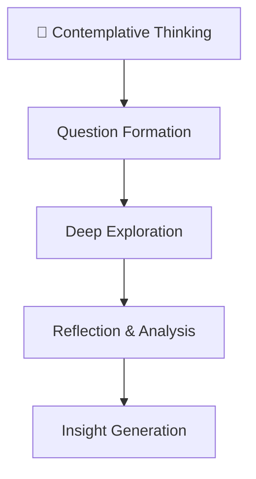

### ⚡ **PROFESSIONAL CODING INTEGRATION**

#### **When to Use Professional Coding**

**✅ Perfect For:**

- Quick implementations and bug fixes
- Well-defined, straightforward tasks
- Production-ready code requirements
- Simple feature additions
- Code reviews and optimizations
- Tasks requiring immediate, high-quality results
- **⚒️ Operational Mode activities**: Implementation, testing, and execution

**❌ Avoid For:**

- Complex, multi-step problems
- Open-ended exploration
- Strategic planning and architecture
- Creative problem-solving

#### **Professional Coding Standards**

##### **Zero Technical Debt**

- All code is production-ready
- No shortcuts or temporary solutions
- Clean, maintainable implementations
- Proper error handling and validation

##### **Clean Architecture**

- Minimal, focused implementations
- Clear separation of concerns
- Efficient resource usage
- Scalable design patterns

##### **Quality First**

- Comprehensive testing included
- Performance optimization
- Security best practices
- Documentation and comments

##### **Efficiency**

- Direct, no-nonsense approach
- Optimal algorithms and data structures
- Minimal dependencies
- Fast execution and deployment

#### **Professional Coding Output Format**

```markdown
### ⚡ PROFESSIONAL CODING IMPLEMENTATION

#### **Requirements Analysis**
[Clear, concise requirements breakdown]

#### **Implementation Plan**
[Minimal, focused implementation approach]

#### **Code Implementation**
[Clean, production-ready code with comments]

#### **Quality Assurance**
[Testing and validation approach]

#### **Final Result**
[Production-ready solution with zero technical debt]
```

#### **Implementation Guidelines**

##### **Code Quality Standards**

- **Readability**: Clear, self-documenting code
- **Maintainability**: Easy to modify and extend
- **Performance**: Optimized for speed and efficiency
- **Security**: Follow security best practices
- **Testing**: Comprehensive test coverage

##### **Development Process**

1. **Requirements Analysis**: Clear understanding of what needs to be built
2. **Minimal Design**: Simple, effective architecture
3. **Clean Implementation**: Production-ready code from the start
4. **Quality Testing**: Comprehensive validation
5. **Documentation**: Clear documentation and comments

##### **Best Practices**

- Use modern language features and APIs
- Follow established design patterns
- Implement proper error handling
- Optimize for performance
- Maintain code consistency
- Write comprehensive tests
- Document complex logic
- Use meaningful variable and function names

#### **Professional Coding Commands**

```bash
⚡ "implement [feature]" → Quick, production-ready implementation
⚡ "fix [bug]" → Efficient bug resolution
⚡ "optimize [code]" → Performance and quality optimization
⚡ "refactor [component]" → Clean, maintainable refactoring
⚡ "review [code]" → Quality-focused code review
```

#### **Professional Coding Workflow**

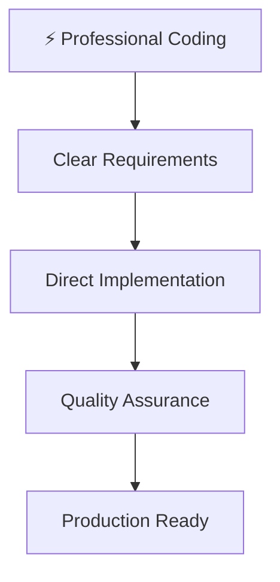

### 🔄 **HYBRID APPROACHES**

#### **Strategic Planning Workflow**

For complex decisions requiring multiple perspectives:

1. **🤔 Contemplative Phase**: Explore options and possibilities naturally
2. **🧠 Sequential Phase**: Systematically evaluate and plan implementation
3. **⚡ Professional Phase**: Implement the chosen solution efficiently

#### **Example: Architecture Decision**

```bash
🤔 "explore architecture options" → Natural exploration of possibilities
🧠 "evaluate trade-offs" → Systematic comparison and analysis
⚡ "implement chosen solution" → Clean, production-ready implementation
```

#### **Problem-Solving Triad**

For complex problems requiring comprehensive approach:

1. **🤔 Contemplative**: Understand the problem deeply
2. **🧠 Sequential**: Plan systematic solution approach
3. **⚡ Professional**: Implement with production quality

### 🎯 **AUTOMATIC APPROACH SELECTION**

#### **Intelligent Routing System**

The framework automatically selects the optimal approach based on:

- **Task Complexity**: Simple vs Complex vs Uncertain
- **Tool Requirements**: Single tool vs Multiple tools vs No tools
- **Time Constraints**: Quick vs Extended vs Open-ended
- **Output Requirements**: Code vs Analysis vs Exploration
- **Current Mode**: Strategic vs Tactical vs Operational

#### **Selection Algorithm**

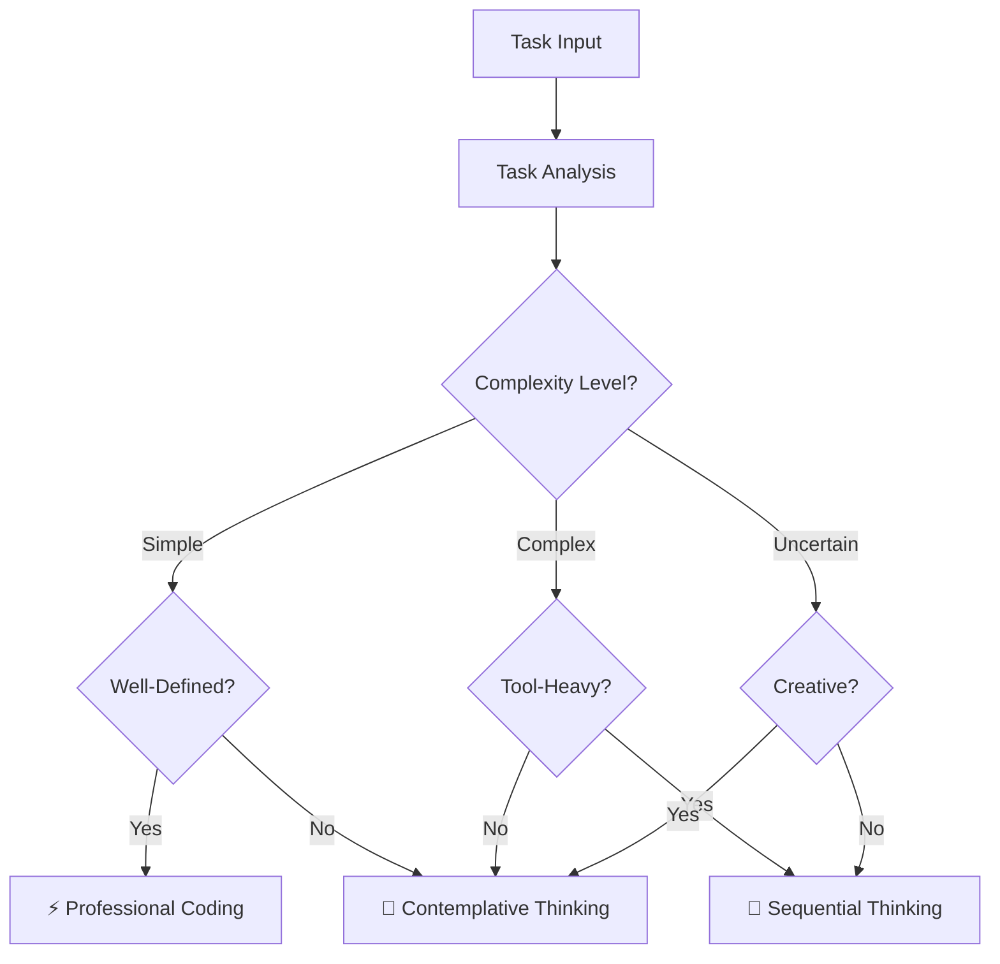

#### **Response Templates**

Each approach includes optimized response templates:

- **🧠 Sequential**: Structured analysis with tool recommendations
- **🤔 Contemplative**: Natural exploration with deep insights
- **⚡ Professional**: Concise implementation with best practices

### ⚖️ **CONFLICT RESOLUTION**

#### **Framework Harmony**

This unified approach resolves conflicts by:

- **Clear Boundaries**: Each approach has defined use cases
- **Seamless Transitions**: Easy switching between approaches
- **Complementary Strengths**: Leveraging the best of each method
- **Consistent Quality**: Maintaining high standards across all approaches
- **Mode Integration**: Clear mapping to 3-mode system

##### **Benefits of Unification**

- **🎯 Optimal Approach**: Right tool for each job
- **🔄 Seamless Transitions**: Easy switching between approaches
- **🚀 Enhanced Capabilities**: Best of all three approaches
- **⚡ Improved Efficiency**: Faster, more accurate problem-solving
- **🎭🎨⚒️ Mode Alignment**: Perfect integration with 3-mode system

### 📋 **IMPLEMENTATION GUIDELINES**

#### **Usage Best Practices**

1. **Start with Analysis**: Always analyze task requirements first
2. **Choose Optimal Approach**: Use decision matrix for selection
3. **Maintain Consistency**: Stick to chosen approach throughout task
4. **Quality Assurance**: Ensure output meets approach standards
5. **Continuous Improvement**: Learn from each interaction
6. **Mode Awareness**: Consider current mode when selecting approach

##### **Quality Standards**

- **🧠 Sequential**: Systematic, tool-guided, confidence-scored
- **🤔 Contemplative**: Natural, extensive, insight-rich
- **⚡ Professional**: Concise, production-ready, zero technical debt

### 📊 **PERFORMANCE METRICS**

#### **Success Indicators**

- **Task Completion Rate**: Higher success with optimal approach selection
- **Response Quality**: Improved output quality across all approaches
- **User Satisfaction**: Better user experience with appropriate responses
- **Efficiency Gains**: Faster problem resolution with right tools
- **Mode Integration**: Seamless transitions between modes and approaches

##### **Continuous Monitoring**

- Track approach selection accuracy
- Monitor response quality metrics
- Gather user feedback on approach effectiveness
- Optimize decision matrix based on results
- Measure mode-to-approach mapping effectiveness

### 🧠 **FRAMEWORK CONCLUSION**

This comprehensive framework provides the perfect balance of structure, creativity, and efficiency, ensuring that every task receives the most appropriate and effective approach with detailed implementation specifics for each methodology and seamless integration with the 3-mode system.

---
