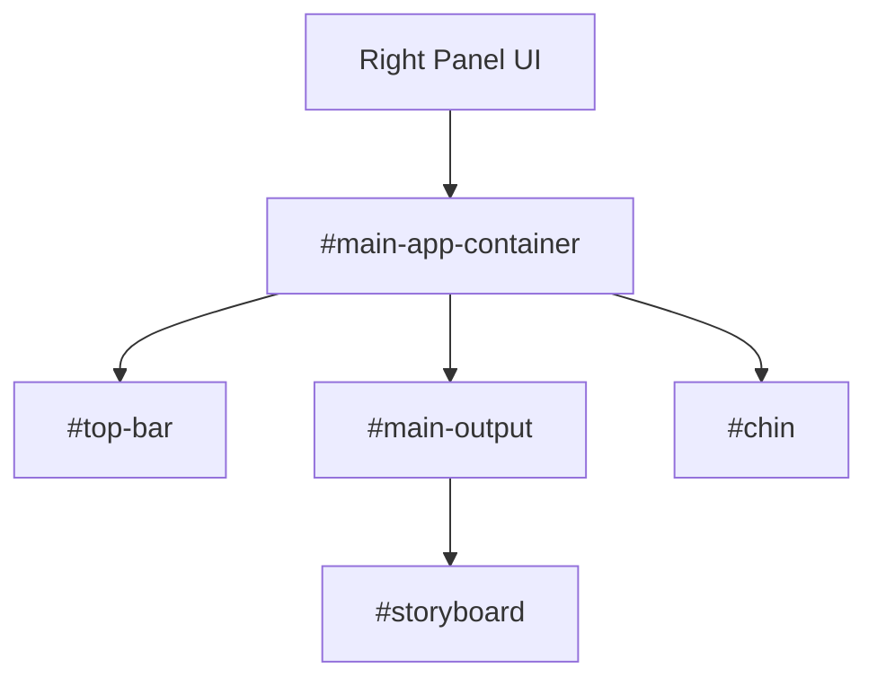

# Applications Overview

This directory contains the primary, user-facing web applications for this repository. All applications herein are built for the **Perchance platform** and must strictly adhere to its core architectural principles.

## Table of Contents

- [Applications Overview](#applications-overview)
  - [Table of Contents](#table-of-contents)
  - [The Perchance Framework: The Golden Rule](#the-perchance-framework-the-golden-rule)
  - [Application Summaries](#application-summaries)
  - [Right-Panel Architecture](#right-panel-architecture)
  - [Build Process](#build-process)
  - [Application Lifecycle](#application-lifecycle)

-----

## The Perchance Framework: The Golden Rule

The applications in this repository are built exclusively for Perchance. The single most important principle is the **Two-Panel Architecture**. This is a non-negotiable separation of concerns that dictates the entire structure and build process.

- **The Left Panel (The "Code" / Logic):**
    This panel contains all the Perchance-specific logic. It's where you define lists, variables, and the core generative behavior of the application. All files named `*-left-panel.txt` are the source of truth for this panel. This is the application's "backend."

- **The Right Panel (The "Interface" / UI):**
    This panel contains everything the user sees and interacts with: the HTML structure, the CSS styling, and the JavaScript functionality. The content for this panel is the output of our build process, which compiles all frontend assets into a single block of HTML. This is the application's "frontend."

**AI Directive:** All development **MUST** respect this separation. Logic modifications belong in the left-panel files. UI and interactivity modifications belong in the source files (HTML, SCSS, JS) that are compiled for the right panel.

-----

## Application Summaries

- **`/imageglitch`**: A minimalist text-to-image generator. It uses a simple left-panel for its core logic and a compiled right-panel for its interface, styled with Pico.css.
- **`/rpglitch`**: A more complex application for managing role-playing game entities, storyboards, and profiles. It serves as the primary reference implementation of the Two-Panel Architecture, with extensive logic in its left panel and a dynamic, feature-rich UI in its right panel.

-----

## Right-Panel Architecture

The "Right Panel" of our Perchance applications has a consistent component-based structure.

- **`#main-app-container`**: The root element for the entire application interface.
- **`#main-output`**: The primary content area.
- **`#top-bar`**: A persistent header for global controls and branding.
- **`#chin`**: A persistent footer or bottom-bar for secondary controls and options panels.
- **`#storyboard`**: The main content panel within `#main-output` where primary user interaction occurs.

<!-- end list -->

-----

## Build Process

The goal of the build process is to take the source files (HTML, SCSS, JS) and compile them into a single, standalone HTML block for the **Right Panel**. This simplifies deployment directly into the Perchance editor.

The primary build scripts for this are `build/scripts/build-rpglitch.js` and `build/scripts/build-imageglitch.js`.

The process is as follows:

1. **Read Source HTML**: The script reads the main HTML file (e.g., `apps/rpglitch/html/index.html`).
2. **Compile SCSS**: It compiles all SCSS files into a single block of CSS.
3. **Combine JavaScript**: It reads and concatenates all JavaScript source files in a predefined order.
4. **Inject and Assemble**:
      - The compiled CSS is injected into a `<style>` tag.
      - The combined JavaScript is injected into a `<script>` tag.
5. **Write Output**: The final, self-contained HTML is written to a file in `build/output/`, ready to be pasted into the **Right Panel** of Perchance.

-----

## Application Lifecycle

The application lifecycle is managed by the JavaScript running in the **Right Panel**.

1. **Initialization (`init`)**:

      - The main `index.js` script waits for `DOMContentLoaded`.
      - It calls an `init()` function to set up the application, initialize the database (`Dexie.js`), attach event listeners, and render the initial UI state.

2. **Event Handling**:

      - User interactions are captured by event listeners attached during `init`.
      - The project uses `cash` for imperative event handling (`.on()`) and `_hyperscript` for declarative event handling in the HTML.

3. **State Management**:

      - Application state (e.g., RPGlitch entities) is stored in IndexedDB.
      - When state changes, the JavaScript updates the database first, then re-renders the DOM to ensure the UI always reflects the stored data.
