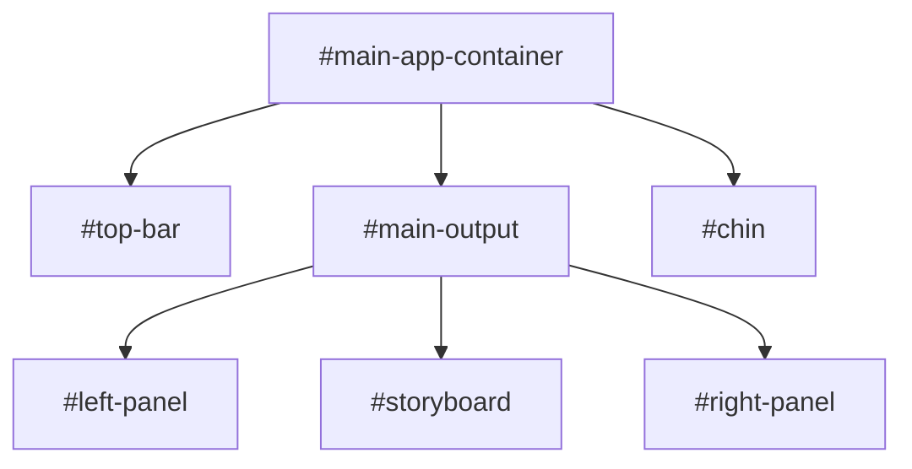

# Applications Overview

This directory contains the primary, user-facing web applications of the JooduG-default repository.

## Table of Contents

- [Application Summaries](#application-summaries)
- [The Perchance Framework](#the-perchance-framework)
  - [1. Core Architecture](#1-core-architecture)
  - [2. Build Process](#2-build-process)
  - [3. Application Lifecycle](#3-application-lifecycle)
  - [4. Plugin System](#4-plugin-system)

---

## Application Summaries

- **`/imageglitch`**: A single-file web application for applying generative glitch art effects to images, built using the Perchance Framework and its plugin system.
- **`/rpglitch`**: A multi-file web application for creating, managing, and viewing entities for role-playing games, serving as the primary reference implementation of the Perchance Framework. RPGLitch has gotten much further in it's development cycle than ImageGlitch.

---

## The Perchance Framework

The applications in this repository are built using a custom, lightweight framework inspired by the principles of the Perchance random text generator. This framework is designed to create simple, single-page applications with a consistent structure and build process.

### 1. Core Architecture

The framework is built on a component-based architecture. Every application is composed of several key structural components that have a defined role.

- **`#main-app-container`**: The root element for the entire application.
- **`#main-output`**: The primary content area.
- **`#top-bar`**: A persistent header component for global controls and branding. It typically contains a title and context-sensitive buttons.
- **`#chin`**: A persistent footer or bottom-bar component. It acts as a container for secondary controls, options, or settings panels that can be toggled.
- **`#storyboard`**: The main content panel within `#main-output`. This is where the primary user interaction or content display occurs. It often contains dynamic content like lists of items or forms.
- **`#left-panel` and `#right-panel`**: Optional side panels within `#main-output` for auxiliary information, navigation, or controls.

### 2. Build Process

The goal of the build process is to take the source files (HTML, SCSS, JS) and compile them into a single, standalone `imageglitch.html`/`rpglitch.html` file. This makes deployment and distribution incredibly simple.

The primary build script´s for this process is `build/scripts/build-rpglitch.js` and `build/scripts/build-imageglitch.js`.

The process is as follows:

### RPGlitch Process

1. **Read Source HTML**: The script starts by reading the main HTML structure from `apps/rpglitch/html/index.html`.
2. **Compile SCSS**: It compiles the SCSS files (starting from `apps/rpglitch/scss/index.scss`) into a single block of CSS.
3. **Combine JavaScript**: It reads and concatenates all JavaScript files from `apps/rpglitch/js/` in a specific, predefined order.
4. **Inject and Assemble**:
    - The compiled CSS is injected into a `<style>` tag in the `<head>` of the HTML.
    - The combined JavaScript is injected into a `<script>` tag at the end of the `<body>`.
5. **Write Output**: The final, assembled HTML content is written to a single output file.

### 3. Application Lifecycle

The application has a defined lifecycle managed by the JavaScript modules.

1. **Initialization (`init`)**:
    - The main `index.js` script waits for the `DOMContentLoaded` event.
    - It calls an `init()` function which is responsible for setting up the application.
    - This involves initializing the database (`Dexie.js`), setting up initial event listeners (e.g., for buttons in the `#chin`), and rendering the initial state of the UI.

2. **Event Handling**:
    - User interactions (clicks, form submissions) are captured by event listeners.
    - These listeners are typically attached during the `init` phase.
    - The project uses `cash` for event handling (`.on()`) and `_hyperscript` for simple, declarative event handling directly in the HTML.

3. **State Management**:
    - The application state (e.g., the list of entities in `RPGlitch`) is stored in the IndexedDB database.
    - When the state changes (e.g., a new entity is added), the JavaScript code updates the database *first*, and then re-renders the relevant part of the DOM to reflect the new state. This ensures the UI is always a reflection of the stored data.

### 4. Plugin System

The framework supports a simple plugin system, primarily used by the `ImageGlitch` application.

- **Plugin Definition**: A plugin is essentially a self-contained block of HTML, CSS, and JavaScript that defines a specific piece of functionality.
- **Loading**: Plugins are loaded and integrated into the main application. In `ImageGlitch`, different glitch effects are implemented as plugins.
- **Structure**:
  - **HTML (`-style-block.html`)**: Contains the CSS for the plugin.
  - **Perchance Code (`-left-panel.txt`)**: Contains the Perchance generator logic, which is used to create dynamic UI or generative content.
  - **Main HTML**: The main application file orchestrates the loading and interaction of these plugin parts.
