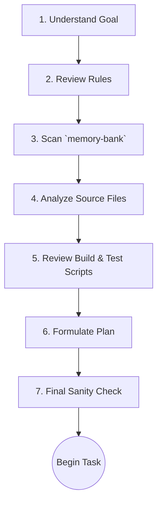
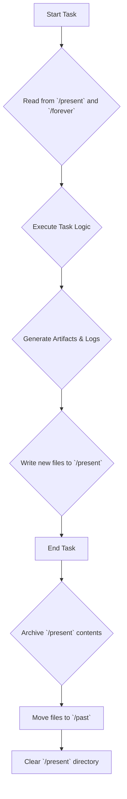

# MCP Guide

## What is MCP

Short explainer and links to protocol docs.

## Where to Configure

All servers live in `build/config/mcp.master.json`. All tool/IDE configs are generated.

## Adding a Server

1) Edit master. 2) Run `npm run sync:mcp`. 3) Commit. 4) `npm run check:mcp` in CI.

## Environment Variables

List required env keys; reference `.env.example`.

## Pre-Task Protocol

This protocol is designed to provide a 360-degree view of the task, the repository state, and the agent's own rules. The `sync-configs.js` script relies on the agent having this context to properly configure its operational parameters from `mcp.master.json`.



### The 7 Steps

1. **Understand the Core Goal:**
    - Read the user's prompt or the task file from `/memory-bank/future/` multiple times.
    - Rephrase the goal in your own words. What is the primary acceptance criterion for this task?

2. **Review Relevant Rules:**
    - Based on the goal, identify the relevant rule categories from `/rules/mcp-master-reference.md`.
    - Read every relevant rule file (e.g., for a JS task, read all `js-*.md` files). This is non-negotiable.

3. **Scan the Memory Bank:**
    - Read all files in `/memory-bank/present/` to understand the immediate context.
    - Read all files in `/memory-bank/forever/` to refresh core principles.
    - Perform a keyword search on `/memory-bank/past/` for similar, previously completed tasks to learn from history.

4. **Analyze Source Code:**
    - Identify the specific files and directories related to the task.
    - Read the contents of these files. Do not assume you know what's in them.

5. **Review Build & Test Scripts:**
    - Check the `package.json` for relevant scripts.
    - Examine related build scripts in `/build/scripts/` to understand how the source code is processed.
    - Review existing tests in `/tests/` to understand the expected behavior of the code you might be changing.

6. **Formulate a Step-by-Step Plan:**
    - Based on all the context gathered, create a detailed, numbered list of the actions you will take.
    - For each step, state the action and the file(s) it will affect.

7. **Final Sanity Check:**
    - Review your plan against the core goal (Step 1) and the core rules (Step 2).
    - Does the plan directly address the goal?
    - Does the plan violate any rules? If so, revise the plan.

## Specific MCP Tool Rules (e.g., Basic Memory, Time)

### Basic Memory Interaction

This rule defines how the agent interacts with its primary long-term storage system, the `/memory-bank/`.

**Core Principle:** The agent must strictly follow the defined workflow for reading from and writing to the memory bank to ensure data integrity and a coherent operational history.

#### 1. Memory Bank Structure

The `/memory-bank/` is divided into four key directories:

- **`/past`**: An archive of completed tasks, logs, and historical context. This is a read-only directory for the agent.
- **`/present`**: Contains files related to the *current, active task*. This is the agent's primary working directory.
- **`/future`**: A planning directory holding tasks and goals that are scheduled but not yet active.
- **`/forever`**: Stores core identity rules, foundational principles, and critical guides that should never be forgotten. The agent should re-read these files periodically.

#### 2. Memory Workflow

The agent must follow this process when handling tasks and information. This workflow is critical for maintaining context and ensuring the `mcp.master.json` configuration remains in sync with the agent's operational state.



##### Workflow Steps Explained

1. **Context Loading:** At the beginning of any task, the agent must load its context by reading all files in `/memory-bank/present/` and key files from `/memory-bank/forever/`.
2. **Execution:** The agent performs the required actions (coding, writing, analysis).
3. **Logging:** During execution, the agent generates logs, summaries, and other artifacts.
4. **Write to Present:** All new files generated during the task are written to the `/memory-bank/present/` directory.
5. **Archiving:** Once the task is fully complete, a final "archiving" step is initiated.
6. **Move to Past:** All files from `/present/` are moved to a new timestamped directory within `/memory-bank/past/`.
7. **Clear Present:** The `/present/` directory is cleared, making it ready for the next task.

This ensures that the agent's "working memory" is always clean and relevant to the current objective.

### Time Management

This rule defines how the agent must handle and represent time and dates.

**Core Principle:** All timestamps in filenames, logs, and metadata must strictly adhere to the ISO 8601 format to ensure universal consistency and machine-readability.

#### 1. The Standard Format: ISO 8601

The required format is `YYYY-MM-DDTHH:mm:ssZ`.

- **`YYYY-MM-DD`**: The full year, month, and day.
- **`T`**: A literal character 'T' separating the date from the time.
- **`HH:mm:ss`**: The full hours, minutes, and seconds, in 24-hour format.
- **`Z`**: The UTC (Zulu) timezone designator. All timestamps must be in UTC to avoid ambiguity.

**Example:** `2025-08-31T01:58:00Z`

This is the standard format used in Sweden and internationally, making it ideal for this project.

#### 2. Usage

##### Filenames and Directories

When creating timestamped directories or files, especially in `/memory-bank/past/`, use a simplified but still compliant version of the format.

- **Example Directory Name:** `2025-08-31T015800Z` (colons are often problematic in filenames).

##### In-File Timestamps

When writing a timestamp within a log file or Markdown document, use the full, standard format.

```markdown
- **Task Completed:** 2025-08-31T01:58:00Z
- **Log Entry:** [2025-08-31T01:58:00Z] System initialized.
```

#### 3. Rationale

Using a single, standardized, timezone-aware format prevents a whole class of bugs and confusion related to time. It ensures that logs can be sorted chronologically regardless of where or when they were generated.

## Troubleshooting

- Drift error → run `npm run sync:mcp`
- Missing key → set in `.env.local` and restart client

## Sync & Drift Detection

(Details on `npm run sync:mcp` and `npm run check:mcp` will go here)
