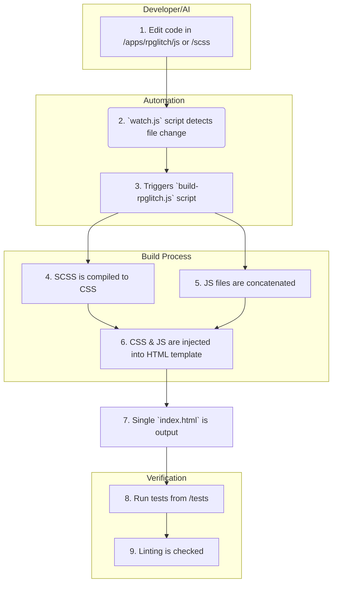

# System Architecture

This document provides the high-level architectural blueprint for the JooduG-default repository. It explains how the major components fit together to form a cohesive development ecosystem.

**Core Principle:** This is a monorepo containing a self-sufficient, AI-assisted development environment. The structure is designed to support not just the applications, but the entire lifecycle of their creation, maintenance, and documentation.

---

## 1. High-Level Directory Structure

The repository is organized into several distinct, high-level directories, each with a specific responsibility.

- **`/apps`**: Contains the user-facing web applications. This is the "product."
- **`/build`**: Contains all scripts, configurations, and libraries required to build, lint, and test the applications. This is the "factory."
- **`/docs`**: Contains all human-readable documentation, such as guides, glossaries, and changelogs. This is the "library."
- **`/memory-bank`**: Provides persistent, long-term storage for the AI agent. This is the "brain."
- **`/rules`**: Contains the machine-readable rule set that governs the AI agent's behavior. This is the "constitution."
- **`/tests`**: Contains all automated tests for the applications. This is the "quality assurance department."
- **`/tools`**: A collection of utility and diagnostic scripts. This is the "toolbox."

---

## 2. Development & Build Workflow

The following diagram illustrates the typical workflow for making a change to the `rpglitch` application.

This workflow demonstrates how the different parts of the repository interact to produce the final, runnable application. The `rules` and `memory-bank` guide the AI agent's actions during step 1.
