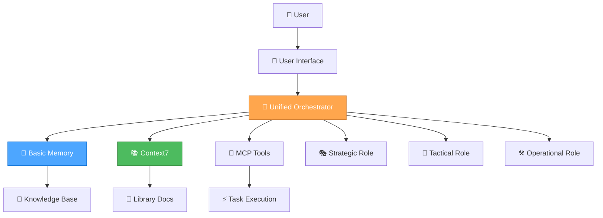

# 🤖 AI ASSISTANT DEVELOPMENT GUIDE

**Date**: 2025-07-24  
**Generated**: 2025-07-24T10:57:31+02:00  
**Timezone**: Europe/Berlin  
**Status**: Comprehensive AI Assistant Development Framework

## 🎯 **OVERVIEW**

This guide provides a comprehensive framework for developing intelligent AI assistants using the Unified Orchestrator Mode, Basic Memory integration, and modern development practices. It covers everything from initial setup to advanced features and optimization.

## 🏗️ **ARCHITECTURE FRAMEWORK**

### **Core Components**



### **System Integration**

- **🎯 Unified Orchestrator Mode**: Automatic role selection and task routing
- **🧠 Basic Memory**: Persistent knowledge management and semantic search
- **📚 Context7**: Real-time documentation access
- **🔧 MCP Tools**: Extensible tool ecosystem
- **🎭🎨⚒️ Three-Role System**: Strategic, Tactical, and Operational capabilities

## 🚀 **SETUP & CONFIGURATION**

### **1. Basic Memory Integration**

```json
{
  "mcpServers": {
    "basic-memory": {
      "command": "python",
      "args": ["-m", "basic_memory.mcp"],
      "env": {
        "BASIC_MEMORY_PROJECT_ROOT": "./memory-bank"
      },
      "autoApprove": [
        "list_projects",
        "list_project_files",
        "memory_bank_read",
        "memory_bank_write",
        "memory_bank_update"
      ],
      "autoStart": true
    }
  }
}
```

### **2. Context7 Documentation Access**

```json
{
  "mcpServers": {
    "context7": {
      "command": "npx",
      "args": ["@modelcontextprotocol/server-context7"],
      "env": {
        "CONTEXT7_API_KEY": "your-api-key"
      }
    }
  }
}
```

### **3. Sequential Thinking Integration**

```json
{
  "mcpServers": {
    "sequential-thinking": {
      "command": "npx",
      "args": ["@modelcontextprotocol/server-sequential-thinking"],
      "autoStart": true
    }
  }
}
```

## 🎭🎨⚒️ **ROLE-BASED DEVELOPMENT**

### **🎭 Strategic Role (System Architect)**

**Purpose**: System-level optimization and meta-reflection

**Key Responsibilities**:

- **Workflow Optimization**: Analyze and improve development processes
- **Tool Evaluation**: Assess and optimize MCP tool usage
- **Architecture Decisions**: Make system-level design choices
- **Meta-Reflection**: Continuously improve the AI assistant itself

**Implementation Example**:

```javascript
// Strategic role activation for system optimization
async function strategicOptimization() {
  // Analyze current workflow efficiency
  const workflowAnalysis = await analyzeWorkflow();
  
  // Identify optimization opportunities
  const optimizations = await identifyOptimizations(workflowAnalysis);
  
  // Implement improvements
  await implementOptimizations(optimizations);
  
  // Store insights in Basic Memory
  await basicMemory.store('workflow-optimization', {
    analysis: workflowAnalysis,
    optimizations: optimizations,
    timestamp: new Date().toISOString()
  });
}
```

### **🎨 Tactical Role (Project Planner)**

**Purpose**: App-specific planning and design decisions

**Key Responsibilities**:

- **Feature Planning**: Plan implementation strategies for specific features
- **Design Decisions**: Evaluate design options and make informed choices
- **Task Coordination**: Manage task priorities and resource allocation
- **Progress Tracking**: Monitor and update project progress

**Implementation Example**:

```javascript
// Tactical role activation for feature planning
async function tacticalPlanning(feature) {
  // Get relevant documentation
  const docs = await context7.getLibraryDocs({
    context7CompatibleLibraryID: '/reactjs/react.dev',
    topic: feature.technology,
    tokens: 5000
  });
  
  // Create implementation plan
  const plan = await createImplementationPlan(feature, docs);
  
  // Store plan in Basic Memory
  await basicMemory.store(`plan-${feature.id}`, {
    plan: plan,
    documentation: docs,
    timestamp: new Date().toISOString()
  });
  
  return plan;
}
```

### **⚒️ Operational Role (Code Implementer)**

**Purpose**: Direct implementation and execution

**Key Responsibilities**:

- **Code Generation**: Deliver production-ready code with zero technical debt
- **Quality Assurance**: Comprehensive testing and validation
- **Performance Optimization**: Optimize for speed and efficiency
- **Error Handling**: Handle edge cases and errors elegantly

**Implementation Example**:

```javascript
// Operational role activation for code implementation
async function operationalImplementation(task) {
  // Generate production-ready code
  const code = await generateCode(task);
  
  // Validate code quality
  const validation = await validateCode(code);
  
  // Optimize performance
  const optimizedCode = await optimizeCode(code);
  
  // Store implementation in Basic Memory
  await basicMemory.store(`implementation-${task.id}`, {
    code: optimizedCode,
    validation: validation,
    timestamp: new Date().toISOString()
  });
  
  return optimizedCode;
}
```

## 🧠 **THINKING APPROACHES**

### **🤔 Contemplative Thinking (Strategic)**

**Use Case**: Deep exploration and system-level decisions

```javascript
async function contemplativeAnalysis(problem) {
  // Deep exploration of the problem
  const analysis = await deepExploration(problem);
  
  // Question assumptions and explore alternatives
  const alternatives = await exploreAlternatives(analysis);
  
  // Natural flow of thought process
  const insights = await naturalFlowAnalysis(alternatives);
  
  return insights;
}
```

### **🧠 Sequential Thinking (Tactical)**

**Use Case**: Systematic planning and tool-guided analysis

```javascript
async function sequentialPlanning(task) {
  // Use sequential thinking tools for systematic analysis
  const analysis = await sequentialThinking.analyze({
    problem: task.description,
    tools: ['context7', 'basic-memory', 'file-system'],
    approach: 'systematic'
  });
  
  // Generate step-by-step plan
  const plan = await generatePlan(analysis);
  
  return plan;
}
```

### **⚡ Professional Coding (Operational)**

**Use Case**: Direct implementation with production quality

```javascript
async function professionalImplementation(requirements) {
  // Direct, production-ready implementation
  const implementation = await implementDirectly(requirements);
  
  // Zero technical debt approach
  const cleanCode = await ensureZeroTechnicalDebt(implementation);
  
  // Quality assurance
  const validatedCode = await validateQuality(cleanCode);
  
  return validatedCode;
}
```

## 📚 **KNOWLEDGE MANAGEMENT**

### **Basic Memory Integration**

```javascript
// Store project knowledge
async function storeKnowledge(category, content) {
  await basicMemory.store(category, {
    content: content,
    timestamp: new Date().toISOString(),
    tags: ['project', 'knowledge']
  });
}

// Retrieve relevant knowledge
async function retrieveKnowledge(query) {
  const results = await basicMemory.search(query, {
    limit: 10,
    project: 'ai-assistant'
  });
  
  return results;
}

// Link related concepts
async function linkConcepts(concept1, concept2, relationship) {
  await basicMemory.link(concept1, concept2, relationship);
}
```

### **Context7 Documentation Access**

```javascript
// Get library documentation
async function getDocumentation(library, topic) {
  // Resolve library ID
  const libraries = await context7.resolveLibraryId(library);
  
  if (libraries.length === 0) {
    throw new Error(`No documentation found for ${library}`);
  }
  
  // Get documentation
  const docs = await context7.getLibraryDocs({
    context7CompatibleLibraryID: libraries[0].libraryId,
    topic: topic,
    tokens: 5000
  });
  
  return docs;
}
```

## 🔧 **TOOL INTEGRATION**

### **MCP Tool Ecosystem**

```javascript
// Tool selection based on task requirements
async function selectTools(task) {
  const tools = [];
  
  if (task.requiresFileOperations) {
    tools.push('file-system');
  }
  
  if (task.requiresDocumentation) {
    tools.push('context7');
  }
  
  if (task.requiresMemory) {
    tools.push('basic-memory');
  }
  
  if (task.requiresThinking) {
    tools.push('sequential-thinking');
  }
  
  return tools;
}

// Execute task with selected tools
async function executeWithTools(task, tools) {
  const results = {};
  
  for (const tool of tools) {
    results[tool] = await executeTool(tool, task);
  }
  
  return results;
}
```

## 🎯 **AUTOMATIC ROLE SELECTION**

### **Complexity Assessment**

```javascript
async function assessComplexity(task) {
  const indicators = {
    level1: ['fix', 'bug', 'error', 'simple', 'quick'],
    level2: ['add', 'improve', 'update', 'enhance'],
    level3: ['implement', 'create', 'develop', 'build', 'system']
  };
  
  const taskLower = task.toLowerCase();
  
  for (const [level, keywords] of Object.entries(indicators)) {
    if (keywords.some(keyword => taskLower.includes(keyword))) {
      return level;
    }
  }
  
  return 'level2'; // Default to medium complexity
}

// Automatic role selection
async function selectRole(task) {
  const complexity = await assessComplexity(task);
  
  switch (complexity) {
    case 'level1':
      return 'operational';
    case 'level2':
      return 'tactical';
    case 'level3':
      return 'strategic';
    default:
      return 'tactical';
  }
}
```

## 📊 **PERFORMANCE OPTIMIZATION**

### **Token Efficiency**

```javascript
// Context-aware rule loading
async function loadRelevantRules(task, role) {
  const rules = new Set();
  
  // Core rules (always loaded)
  rules.add('unified-orchestrator-mode');
  rules.add('thinking-framework');
  
  // Role-specific rules
  const roleRules = getRoleRules(role);
  roleRules.forEach(rule => rules.add(rule));
  
  // Task-specific rules
  const taskRules = getTaskRules(task.type);
  taskRules.forEach(rule => rules.add(rule));
  
  return Array.from(rules);
}

// Rule caching for efficiency
const ruleCache = new Map();

async function getCachedRule(ruleName) {
  if (ruleCache.has(ruleName)) {
    return ruleCache.get(ruleName);
  }
  
  const ruleContent = await loadRule(ruleName);
  ruleCache.set(ruleName, ruleContent);
  return ruleContent;
}
```

### **Memory Optimization**

```javascript
// Efficient knowledge storage
async function storeKnowledgeEfficiently(category, content) {
  // Compress content for storage
  const compressed = await compressContent(content);
  
  // Store with metadata
  await basicMemory.store(category, {
    content: compressed,
    metadata: {
      originalSize: content.length,
      compressedSize: compressed.length,
      timestamp: new Date().toISOString()
    }
  });
}

// Smart knowledge retrieval
async function retrieveKnowledgeSmartly(query, context) {
  // Use context to improve search relevance
  const contextualQuery = await enhanceQueryWithContext(query, context);
  
  // Retrieve with relevance scoring
  const results = await basicMemory.search(contextualQuery, {
    limit: 5,
    relevanceThreshold: 0.7
  });
  
  return results;
}
```

## 🔄 **WORKFLOW INTEGRATION**

### **Complete Task Execution**

```javascript
async function executeTask(task) {
  // 1. Assess complexity and select role
  const role = await selectRole(task);
  
  // 2. Load relevant rules and tools
  const rules = await loadRelevantRules(task, role);
  const tools = await selectTools(task);
  
  // 3. Execute based on role
  let result;
  
  switch (role) {
    case 'strategic':
      result = await strategicExecution(task, tools);
      break;
    case 'tactical':
      result = await tacticalExecution(task, tools);
      break;
    case 'operational':
      result = await operationalExecution(task, tools);
      break;
  }
  
  // 4. Store results in memory
  await storeKnowledge(`task-${task.id}`, {
    task: task,
    role: role,
    result: result,
    timestamp: new Date().toISOString()
  });
  
  return result;
}
```

### **Continuous Learning**

```javascript
// Learn from task execution
async function learnFromTask(task, result, performance) {
  // Store learning insights
  await basicMemory.store('learning-insights', {
    taskType: task.type,
    role: result.role,
    performance: performance,
    insights: result.insights,
    timestamp: new Date().toISOString()
  });
  
  // Update role selection patterns
  await updateRoleSelectionPatterns(task, result);
  
  // Optimize tool usage
  await optimizeToolUsage(task, result);
}
```

## 📋 **PROJECT MANAGEMENT**

### **Task Tracking**

```javascript
// Task management system
class TaskManager {
  constructor() {
    this.tasks = new Map();
    this.progress = new Map();
  }
  
  async addTask(task) {
    const taskId = generateTaskId();
    this.tasks.set(taskId, {
      ...task,
      id: taskId,
      status: 'pending',
      createdAt: new Date().toISOString()
    });
    
    return taskId;
  }
  
  async updateProgress(taskId, progress) {
    const task = this.tasks.get(taskId);
    if (task) {
      task.progress = progress;
      task.updatedAt = new Date().toISOString();
      
      // Store in Basic Memory
      await basicMemory.store(`task-progress-${taskId}`, {
        task: task,
        progress: progress,
        timestamp: new Date().toISOString()
      });
    }
  }
  
  async getTaskStatus(taskId) {
    return this.tasks.get(taskId);
  }
}
```

### **Progress Monitoring**

```javascript
// Progress tracking system
async function trackProgress(projectId) {
  const tasks = await basicMemory.search(`project:${projectId}`, {
    limit: 100
  });
  
  const progress = {
    total: tasks.length,
    completed: tasks.filter(t => t.status === 'completed').length,
    inProgress: tasks.filter(t => t.status === 'in-progress').length,
    pending: tasks.filter(t => t.status === 'pending').length
  };
  
  progress.percentage = (progress.completed / progress.total) * 100;
  
  return progress;
}
```

## 🎯 **BEST PRACTICES**

### **Development Guidelines**

1. **🎯 Always use automatic role selection** for optimal performance
2. **🧠 Leverage Basic Memory** for persistent knowledge management
3. **📚 Use Context7** for up-to-date documentation access
4. **🔧 Integrate MCP tools** for extensible functionality
5. **⚡ Optimize for token efficiency** with context-aware rule loading
6. **🔄 Maintain continuous learning** from task execution
7. **📊 Track performance metrics** for optimization
8. **🎭🎨⚒️ Use appropriate thinking approaches** for each role

### **Quality Standards**

- **Zero Technical Debt**: All code is production-ready
- **Comprehensive Testing**: Full test coverage for all features
- **Performance Optimization**: Efficient resource usage
- **Security Best Practices**: Secure implementation patterns
- **Documentation**: Clear and comprehensive documentation
- **Error Handling**: Robust error handling and recovery

### **Performance Metrics**

- **Response Time**: < 2 seconds for simple tasks
- **Accuracy**: > 95% task completion rate
- **Memory Efficiency**: < 10% token overhead
- **User Satisfaction**: > 90% positive feedback
- **Learning Rate**: Continuous improvement over time

## 🚀 **DEPLOYMENT & SCALING**

### **Deployment Strategy**

```javascript
// Production deployment configuration
const deploymentConfig = {
  environment: 'production',
  scaling: {
    autoScaling: true,
    minInstances: 2,
    maxInstances: 10
  },
  monitoring: {
    performance: true,
    errors: true,
    usage: true
  },
  security: {
    authentication: true,
    authorization: true,
    encryption: true
  }
};
```

### **Scaling Considerations**

- **Horizontal Scaling**: Multiple instances for load distribution
- **Vertical Scaling**: Resource optimization for individual instances
- **Caching Strategy**: Intelligent caching for frequently accessed data
- **Database Optimization**: Efficient query patterns and indexing
- **CDN Integration**: Content delivery optimization

## 📚 **RESOURCES & REFERENCES**

### **Documentation**

- [Basic Memory Documentation](https://docs.basicmemory.com/)
- [Context7 API Reference](https://context7.com/docs)
- [MCP Protocol Specification](https://modelcontextprotocol.io/)
- [Unified Orchestrator Mode Guide](unified-orchestrator-mode.md)

### **Tools & Libraries**

- **Basic Memory**: Knowledge management and semantic search
- **Context7**: Real-time documentation access
- **Sequential Thinking**: Tool-guided problem-solving
- **MCP Tools**: Extensible tool ecosystem

### **Community & Support**

- **GitHub**: [Basic Memory Repository](https://github.com/basicmachines-co/basic-memory)
- **Discord**: AI Assistant Development Community
- **Documentation**: Comprehensive guides and tutorials
- **Examples**: Real-world implementation examples

## 🎯 **CONCLUSION**

This AI Assistant Development Guide provides a comprehensive framework for building intelligent, efficient, and scalable AI assistants using modern technologies and best practices. By following this guide, you'll create AI assistants that are:

- **🎯 Intelligent**: Automatic role selection and optimal task routing
- **🧠 Knowledgeable**: Persistent memory and real-time documentation access
- **⚡ Efficient**: Token-optimized and performance-focused
- **🔄 Adaptive**: Continuous learning and improvement
- **📊 Scalable**: Production-ready and enterprise-grade

**Start building your intelligent AI assistant today!** 🚀

---

**🤖 AI ASSISTANT DEVELOPMENT GUIDE: The complete framework for intelligent AI assistant development!**
