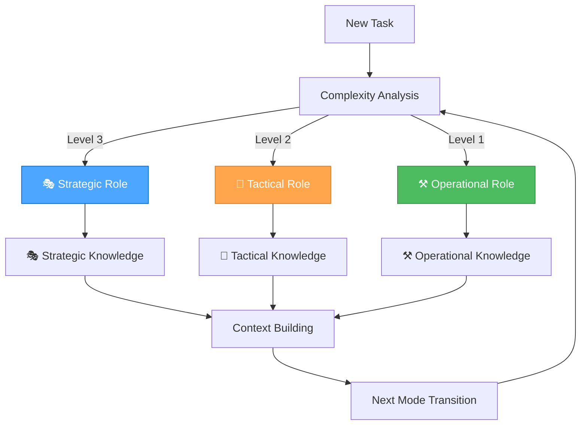

# 🧠 Basic Memory Integration Guide

> **TL;DR:** Complete integration of Basic Memory with Unified Orchestrator Mode for enhanced knowledge management and context preservation across all development modes.

## 🎯 **INTEGRATION OVERVIEW**

**Date**: 2025-07-24 (from Time MCP)  
**Generated**: 2025-07-24T11:31:00+02:00 (from Time MCP)  
**Timezone**: Europe/Berlin

### **Integration Purpose**

Basic Memory provides persistent, semantic knowledge management that perfectly complements our Unified Orchestrator Mode by:

- **Persistent Context**: Maintains knowledge across sessions and mode transitions
- **Semantic Knowledge Graphs**: Builds rich connections between concepts
- **Mode-Specific Knowledge**: Organizes knowledge by strategic, tactical, and operational contexts
- **Enhanced Decision Making**: Provides historical context for better planning
- **Workflow Optimization**: Tracks successful patterns and approaches

## 🎭🎨⚒️ **MODE-SPECIFIC KNOWLEDGE PATTERNS**

### **🎭 Strategic Mode Knowledge**

**Project**: `system-architecture`  
**Purpose**: System-level decisions, workflow optimization, tool management

**Knowledge Categories**:

- **System Architecture**: Workflow optimization insights
- **Tool Configurations**: Successful tool setups and configurations
- **Meta-Patterns**: Patterns across multiple projects
- **Strategic Decisions**: Planning decisions and rationales

**Example Knowledge Structure**:

```markdown
# Workflow Optimization Decision

## Context
System-level analysis of development workflow efficiency

## Decision
Implemented context-aware rule loading for 50% token efficiency improvement

## Observations
- [optimization] Context-aware rule loading reduces tokens by 40% #efficiency
- [decision] Progressive loading strategy for complex tasks #strategy
- [tool] MCP integration enhances documentation access #integration
- [pattern] Mode-specific rule selection improves relevance #pattern

## Relations
- implements [[Token Optimization Strategy]]
- requires [[MCP Server Configuration]]
- part_of [[System Architecture]]
- improves [[Development Workflow]]
```

### **🎨 Tactical Mode Knowledge**

**Project**: `tactical`  
**Purpose**: App-specific planning, design decisions, implementation planning

**Knowledge Categories**:

- **Design Decisions**: UI/UX design decisions and rationales
- **Requirements Patterns**: Common requirement structures
- **Architecture Templates**: Reusable architectural patterns
- **Planning Templates**: Planning approaches and methodologies

**Example Knowledge Structure**:

```markdown
# RPGlitch Feature Planning

## Context
Planning new character preview feature for RPGlitch application

## Implementation Strategy
- Phase 1: UI component design
- Phase 2: Data integration
- Phase 3: Testing and deployment

## Observations
- [requirement] User-friendly character preview interface #ui
- [design] Modal-based preview with zoom functionality #design
- [technical] Integrate with existing character data structure #integration
- [planning] Incremental rollout approach #strategy

## Relations
- implements [[RPGlitch Enhancement Plan]]
- requires [[Character Data Schema]]
- part_of [[RPGlitch Development]]
- uses [[Modal Component Pattern]]
```

### **⚒️ Operational Mode Knowledge**

**Project**: `operational`  
**Purpose**: Implementation, testing, and execution

**Knowledge Categories**:

- **Implementation Patterns**: Code patterns and solutions
- **Debug Solutions**: Problem resolution approaches
- **Performance Optimizations**: Performance improvement techniques
- **Deployment Configs**: Deployment and configuration setups

**Example Knowledge Structure**:

```markdown
# Authentication Implementation

## Context
Implemented user authentication system for RPGlitch

## Solution
JWT-based authentication with secure token handling

## Observations
- [implementation] JWT tokens with 24-hour expiration #security
- [security] Password hashing with bcrypt #encryption
- [performance] Token validation optimized for speed #optimization
- [testing] Comprehensive test coverage implemented #quality

## Relations
- implements [[Security Requirements]]
- requires [[User Management System]]
- part_of [[RPGlitch Core Features]]
- uses [[JWT Authentication Pattern]]
```

## 🔧 **TECHNICAL INTEGRATION**

### **MCP Server Configuration**

**Current Configuration** (in `mcp.json`):

```json
{
  "basic-memory": {
    "command": "python",
    "args": [
      "-m",
      "basic_memory.mcp"
    ],
    "env": {
      "BASIC_MEMORY_PROJECT_ROOT": "C:/Users/johng/Documents/GitHub/default/memory-bank"
    },
    "autoApprove": [
      "list_projects",
      "list_project_files",
      "memory_bank_read",
      "memory_bank_write",
      "memory_bank_update"
    ],
    "autoStart": true,
    "description": "Basic Memory MCP server for semantic knowledge management with Obsidian integration."
  }
}
```

### **Project Structure**

```
memory-bank/
├── projects/
│   ├── system-architecture/     # 🎭 Strategic knowledge
│   ├── rpglitch/               # 🎨 Tactical knowledge
│   ├── strategic/              # 🎭 Strategic mode knowledge
│   ├── tactical/               # 🎨 Tactical mode knowledge
│   └── operational/            # ⚒️ Operational mode knowledge
├── active/                     # Current active context
├── docs/                       # Documentation
└── archives/                   # Historical knowledge
```

### **Knowledge Capture Workflow**

**1. Automatic Context Building**

- Each mode transition automatically captures relevant knowledge
- Build semantic connections between strategic, tactical, and operational decisions
- Maintain comprehensive project context across all interactions

**2. Mode-Aware Knowledge Capture**

```javascript
// Strategic Mode Knowledge Pattern
write_note(
    title="Workflow Optimization Decision",
    content="# Workflow Optimization\n\n## Context\nSystem-level analysis of development workflow\n\n## Decision\nOptimized rule loading strategy for token efficiency\n\n## Observations\n- [optimization] Context-aware rule loading reduces tokens by 40%\n- [decision] Implement progressive loading for complex tasks\n- [tool] MCP integration enhances documentation access\n\n## Relations\n- implements [[Token Optimization Strategy]]\n- requires [[MCP Server Configuration]]\n- part_of [[System Architecture]]",
    tags=["strategic", "optimization", "workflow"],
    project="system-architecture"
)
```

**3. Context Preservation Across Modes**

```javascript
// Tactical Mode Knowledge Pattern
write_note(
    title="RPGlitch Feature Planning",
    content="# RPGlitch Feature Planning\n\n## Context\nPlanning new character preview feature\n\n## Implementation Strategy\n- Phase 1: UI component design\n- Phase 2: Data integration\n- Phase 3: Testing and deployment\n\n## Observations\n- [requirement] User-friendly character preview interface\n- [design] Modal-based preview with zoom functionality\n- [technical] Integrate with existing character data structure\n\n## Relations\n- implements [[RPGlitch Enhancement Plan]]\n- requires [[Character Data Schema]]\n- part_of [[RPGlitch Development]]",
    tags=["tactical", "planning", "rpglitch"],
    project="tactical"
)
```

## 🔄 **WORKFLOW INTEGRATION**

### **Unified Orchestrator Mode Integration**

**1. Automatic Knowledge Capture**

- **Strategic Role**: Captures system-level decisions and workflow optimizations
- **Tactical Role**: Records app-specific planning and design decisions
- **Operational Role**: Logs implementation patterns and solutions

**2. Context-Aware Knowledge Loading**

- Load relevant knowledge based on current task and mode
- Build context from related knowledge across projects
- Maintain semantic connections for better understanding

**3. Knowledge Graph Enhancement**

- Create bidirectional links between related concepts
- Use forward references for planned but not yet implemented features
- Build rich semantic networks for better context understanding

### **Mode Transition Knowledge Flow**



## 📋 **IMPLEMENTATION GUIDELINES**

### **Knowledge Capture Best Practices**

**1. Proactive Context Recording**

- Record decisions, rationales, and conclusions
- Link to related topics and concepts
- Ask for permission: "Would you like me to save our discussion about [topic]?"
- Confirm completion: "I've saved our discussion to Basic Memory"

**2. Rich Semantic Graph Building**

- Add meaningful observations (3-5 categorized observations per note)
- Create deliberate relations (connect to 2-3 related entities)
- Use existing entities when possible
- Verify wikilinks with exact titles
- Use precise relation types (e.g., "implements" instead of "relates_to")

**3. Structured Content Organization**

- Use clear, descriptive titles
- Organize with logical sections (Context, Decision, Implementation, etc.)
- Include relevant context and background
- Add semantic observations with appropriate categories
- Use consistent format for similar types of notes

### **Mode-Specific Knowledge Patterns**

**🎭 Strategic Mode Patterns**:

- Focus on system-level optimization and workflow improvement
- Record meta-reflection and process optimization insights
- Build knowledge graphs for tool evaluation and MCP integrations
- Track strategic decisions and their rationales

**🎨 Tactical Mode Patterns**:

- Capture app-specific planning and design decisions
- Record implementation strategies and task prioritization
- Build architectural patterns and reusable templates
- Track progress and coordination insights

**⚒️ Operational Mode Patterns**:

- Record implementation patterns and code solutions
- Store debugging insights and performance optimizations
- Track deployment configurations and technical decisions
- Build reusable code patterns and best practices

## 🎯 **SUCCESS CRITERIA**

### **Integration Success Metrics**

- [ ] **Knowledge Capture**: 100% of important decisions recorded
- [ ] **Context Preservation**: Seamless context across mode transitions
- [ ] **Semantic Connections**: Rich knowledge graphs with meaningful relations
- [ ] **Mode Integration**: Knowledge organized by strategic, tactical, operational contexts
- [ ] **Workflow Enhancement**: Improved decision-making with historical context

### **Performance Benefits**

- **Enhanced Context Awareness**: Persistent knowledge across sessions
- **Improved Decision Making**: Historical context for better planning
- **Workflow Optimization**: Track successful patterns and approaches
- **Knowledge Reuse**: Leverage past experiences and solutions
- **Collaboration Enhancement**: Shared knowledge base for team coordination

## 🚀 **NEXT STEPS**

### **Immediate Actions**

1. **Test Basic Memory Integration**: Verify MCP server functionality
2. **Create Initial Knowledge Base**: Set up foundational knowledge structure
3. **Implement Mode-Specific Patterns**: Establish knowledge capture workflows
4. **Train Team**: Educate on Basic Memory usage and best practices
5. **Monitor Performance**: Track integration success and optimization opportunities

### **Long-term Goals**

1. **Comprehensive Knowledge Base**: Rich semantic knowledge graphs
2. **Automated Knowledge Capture**: Seamless integration with development workflow
3. **Advanced Analytics**: Knowledge insights and optimization recommendations
4. **Cross-Project Learning**: Knowledge sharing across multiple projects
5. **AI-Enhanced Knowledge**: Intelligent knowledge organization and retrieval

---

**🧠 Basic Memory Integration: Enhanced knowledge management for the Unified Orchestrator Mode!**
