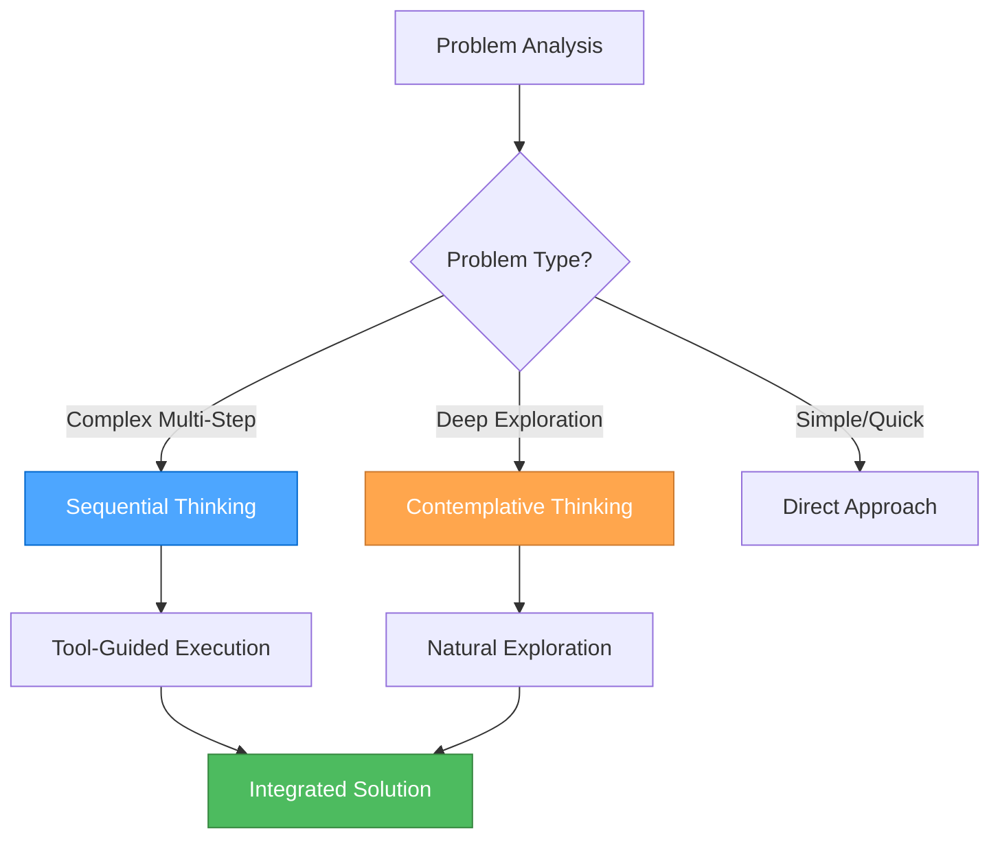
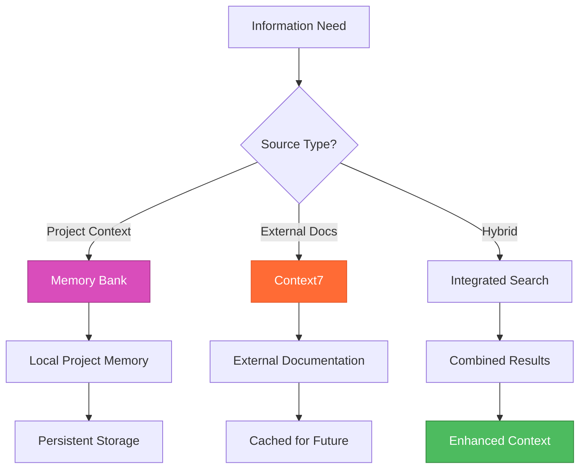
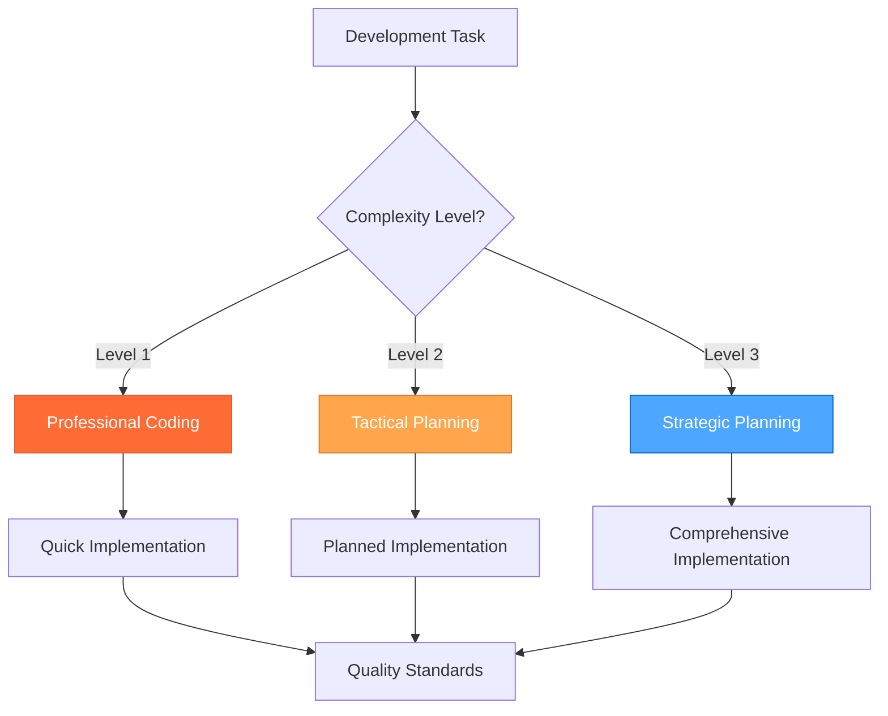
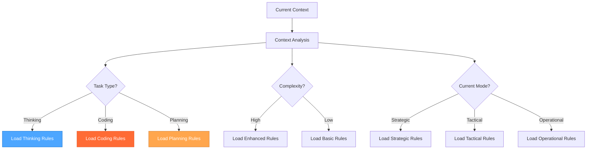

# 🔍 RULE INTERACTIONS ANALYSIS

> **TL;DR:** Comprehensive analysis of interactions, conflicts, and synergy opportunities between different rule systems in the .cursor/rules directory.

## 🎯 **OVERVIEW**

This analysis examines the rule systems in `.cursor/rules/` to identify:

- **Interactions** between different rule approaches
- **Conflicts** that need resolution
- **Synergy opportunities** for enhanced functionality

## 📊 **RULE SYSTEM INVENTORY**

### **🧠 Thinking & Problem-Solving Systems**

1. **Sequential Thinking Guide** (`sequential-thinking-guide.mdc`)
   - **Purpose**: MCP-based structured problem-solving with tool recommendations
   - **Approach**: Systematic, tool-guided thinking with confidence scores
   - **Scope**: Complex multi-step tasks requiring multiple tool calls

2. **Reddit Contemplative Thinking** (`reddit-contemplative-thinking.mdc`)
   - **Purpose**: Natural, conversational internal monologue with extensive contemplation
   - **Approach**: Stream-of-consciousness thinking with self-doubt and revision
   - **Scope**: Deep exploration without rushing to conclusions

3. **Reddit System Octo** (`reddit-system-octo.mdc`)
   - **Purpose**: Professional coding assistant with production-ready code focus
   - **Approach**: Elite software engineering with zero technical debt
   - **Scope**: Web development with specific tech stack focus

### **💾 Memory & Context Systems**

4. **Memory Bank Optimizations** (`MEMORY_BANK_OPTIMIZATIONS.md`)
   - **Purpose**: Token efficiency and context management optimizations
   - **Approach**: Hierarchical rule loading and progressive documentation
   - **Scope**: System-level performance optimization

5. **Context7 Usage** (`context7-usage.mdc`)
   - **Purpose**: Real-time documentation access and research
   - **Approach**: Library resolution and documentation retrieval
   - **Scope**: Development research and documentation

### **🎨 Development & Architecture Systems**

6. **Perchance Architecture** (`perchance-architecture.mdc`)
   - **Purpose**: High-level structure and principles for Perchance apps
   - **Approach**: Platform-specific architectural guidance
   - **Scope**: Perchance platform development

7. **CSS Principles** (`css-principles.mdc`)
   - **Purpose**: Modern CSS best practices and techniques
   - **Approach**: Layout systems, custom properties, responsive design
   - **Scope**: Frontend styling and design

8. **Vanilla JavaScript Development** (`vanilla-javascript-development.mdc`)
   - **Purpose**: Modern JavaScript best practices and features
   - **Approach**: ES2023+ features and modern APIs
   - **Scope**: JavaScript development

## ⚠️ **IDENTIFIED CONFLICTS**

### **1. Thinking Approach Conflicts**

#### **Sequential Thinking vs Contemplative Thinking**

- **Conflict**: Different problem-solving methodologies
  - Sequential: Structured, tool-guided, systematic
  - Contemplative: Natural, conversational, extensive exploration
- **Impact**: Could confuse AI about which thinking approach to use
- **Resolution Needed**: Clear decision criteria for when to use each approach

#### **Professional Coding vs Contemplative Thinking**

- **Conflict**: Different response styles
  - Professional: Concise, production-ready, zero technical debt
  - Contemplative: Extensive, exploratory, embracing uncertainty
- **Impact**: Incompatible response formats and expectations
- **Resolution Needed**: Clear task type classification

### **2. Mode System Conflicts**

#### **3-Mode System vs Reddit System Octo**

- **Conflict**: Different operational paradigms
  - 3-Mode: Strategic/Tactical/Operational with complexity routing
  - Reddit Octo: Professional coding assistant with specific focus
- **Impact**: Conflicting behavioral expectations
- **Resolution Needed**: Integration or clear separation of concerns

### **3. Documentation Approach Conflicts**

#### **Memory Bank vs Context7**

- **Conflict**: Different documentation access patterns
  - Memory Bank: Local, persistent, project-specific
  - Context7: Real-time, external, library-specific
- **Impact**: Could lead to redundant or conflicting information
- **Resolution Needed**: Clear documentation source hierarchy

## 🤝 **SYNERGY OPPORTUNITIES**

### **1. Enhanced Thinking Framework**

#### **Sequential + Contemplative Integration**



**Synergy Benefits**:

- **Sequential Thinking** for complex, tool-heavy tasks
- **Contemplative Thinking** for deep exploration and creative problems
- **Clear decision criteria** for approach selection

### **2. Unified Memory & Context System**

#### **Memory Bank + Context7 Integration**



**Synergy Benefits**:

- **Memory Bank** for project-specific context and learnings
- **Context7** for up-to-date external documentation
- **Integrated search** for comprehensive information access

### **3. Enhanced Development Workflow**

#### **Professional Coding + 3-Mode System Integration**



**Synergy Benefits**:

- **Professional Coding** standards for all implementations
- **3-Mode System** for appropriate planning depth
- **Consistent quality** across all complexity levels

## 🔧 **INTEGRATION RECOMMENDATIONS**

### **1. Create Unified Thinking Framework**

#### **Decision Matrix for Thinking Approaches**

```markdown
| Task Type | Primary Approach | Secondary Approach | Criteria |
|-----------|------------------|-------------------|----------|
| Complex Multi-Step | Sequential Thinking | Tool Recommendations | Multiple tools needed |
| Deep Exploration | Contemplative Thinking | Natural Flow | Creative/uncertain problems |
| Quick Implementation | Professional Coding | Direct Approach | Simple, well-defined tasks |
| Strategic Planning | Sequential + Contemplative | Hybrid Approach | Complex decision making |
```

### **2. Implement Context-Aware Rule Loading**

#### **Smart Rule Selection**



### **3. Create Unified Documentation System**

#### **Documentation Source Hierarchy**

```markdown
1. **Project Memory Bank** (Highest Priority)
   - Project-specific context and learnings
   - Persistent across sessions
   - Local to project

2. **Context7 External Docs** (Medium Priority)
   - Up-to-date library documentation
   - Real-time access
   - Cached for efficiency

3. **General Knowledge** (Lowest Priority)
   - Fallback for missing information
   - General best practices
   - Last resort option
```

## 🚀 **IMPLEMENTATION ROADMAP**

### **Phase 1: Conflict Resolution**

- [ ] Create decision matrix for thinking approaches
- [ ] Define clear boundaries between rule systems
- [ ] Implement context-aware rule loading
- [ ] Test conflict resolution mechanisms

### **Phase 2: Synergy Implementation**

- [ ] Integrate Memory Bank with Context7
- [ ] Create unified thinking framework
- [ ] Implement enhanced development workflow
- [ ] Test synergy benefits

### **Phase 3: Optimization**

- [ ] Optimize rule loading performance
- [ ] Implement intelligent rule selection
- [ ] Create unified documentation system
- [ ] Test overall system efficiency

### **Phase 4: Validation**

- [ ] Test with complex multi-step tasks
- [ ] Validate thinking approach selection
- [ ] Verify documentation integration
- [ ] Measure performance improvements

## 🎯 **EXPECTED BENEFITS**

### **✅ Enhanced Problem-Solving**

- **Right tool for the job**: Appropriate thinking approach for each task
- **Comprehensive context**: Integrated local and external information
- **Consistent quality**: Professional standards across all complexity levels

### **✅ Improved Efficiency**

- **Smart rule loading**: Only load relevant rules
- **Reduced conflicts**: Clear decision criteria
- **Faster responses**: Optimized context management

### **✅ Better User Experience**

- **Consistent behavior**: Unified approach across tasks
- **Clear expectations**: Predictable system responses
- **Enhanced capabilities**: Best of all rule systems

## 🔮 **FUTURE CONSIDERATIONS**

### **Advanced Integration Opportunities**

- **AI-driven rule selection**: Machine learning for optimal rule choice
- **Dynamic rule generation**: Create rules on-the-fly based on context
- **Cross-project learning**: Share insights across different projects
- **Performance analytics**: Track and optimize rule system performance

### **Scalability Considerations**

- **Rule versioning**: Manage rule updates and compatibility
- **Modular architecture**: Easy addition of new rule systems
- **Performance monitoring**: Track token usage and response times
- **User feedback integration**: Learn from user preferences

---

**🔍 RULE INTERACTIONS ANALYSIS: Creating a unified, powerful development system!**
