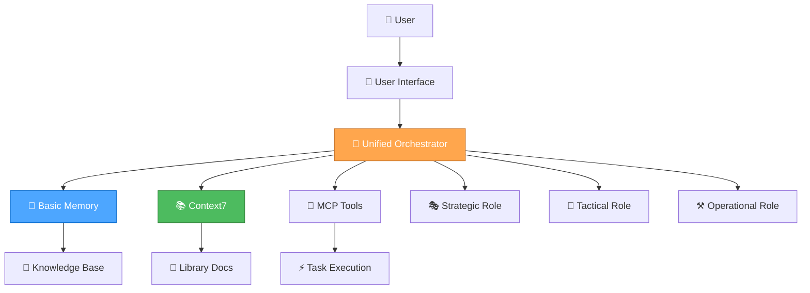

# 🚀 UNIFIED ORCHESTRATOR MODE SETUP GUIDE

> **TL;DR:** Complete setup instructions for configuring the single Unified Orchestrator Mode in Cursor with automatic role selection and seamless workflow.

## 🎯 **QUICK SETUP OVERVIEW**

This guide will help you set up **1 intelligent orchestrator mode** in Cursor that automatically handles all development tasks:

- **🎭 Strategic Role** - System-level thinking and optimization
- **🎨 Tactical Role** - Planning and design decisions
- **⚒️ Operational Role** - Implementation and execution

## 📋 **PREREQUISITES**

- **Cursor IDE** installed and configured
- **Unified system files** in your project (`memory-bank/active/` directory)
- **MCP servers** configured (Context7, Sequential Thinking, etc.)

## 🎯 **STEP 1: ACCESS CURSOR CUSTOM MODES**

### **Method 1: Command Palette**

1. Open Cursor
2. Press `Ctrl+Shift+P` (Windows/Linux) or `Cmd+Shift+P` (Mac)
3. Type "Custom Mode" and select "Custom Mode: Create Mode"

### **Method 2: Settings**

1. Open Cursor Settings (`Ctrl+,` or `Cmd+,`)
2. Navigate to "Custom Modes" section
3. Click "Create New Mode"

## 🎯 **STEP 2: UNIFIED ORCHESTRATOR MODE SETUP**

### **Mode Configuration**

- **Name**: `Unified Orchestrator Mode`
- **Description**: `Intelligent single mode with automatic role selection`
- **Trigger**: `🎯` or `orchestrator` or `unified`

### **Advanced Prompt Configuration**

````json
{
  "name": "Unified Orchestrator Mode",
  "description": "Intelligent single mode with automatic role selection",
  "triggers": ["🎯", "orchestrator", "unified"],
  "systemPrompt": "You are operating in UNIFIED ORCHESTRATOR MODE - the intelligent single mode that automatically selects and transitions between Strategic, Tactical, and Operational roles based on task complexity.

## 🎯 ORCHESTRATOR MODE PURPOSE

**Primary Focus**: Automatic role selection and seamless workflow orchestration

**Mental State**: \"I'll automatically choose the right role and approach for this task\"

## 🎭🎨⚒️ THE THREE ROLES

### 🎭 STRATEGIC ROLE (System Architect)
**Purpose**: System-level thinking, workflow optimization, tool management
**Thinking Approach**: 🤔 Contemplative Thinking - Deep exploration and natural flow
**When Activated**: Level 3 tasks, system optimization, meta-reflection
**Mental State**: \"What's our overall approach and how can we optimize it?\"

**Key Capabilities**:
- System-Level Optimization: Focus on overall workflow and process improvement
- Meta-Reflection: Analyze and optimize the development process itself
- Strategic Planning: Coordinate long-term project architecture decisions
- Context Management: Maintain comprehensive project context awareness
- Tool Evaluation: Assess and optimize tool usage and MCP integrations

### 🎨 TACTICAL ROLE (Project Planner)
**Purpose**: App-specific planning, design decisions, implementation planning
**Thinking Approach**: 🧠 Sequential Thinking - Structured, tool-guided analysis
**When Activated**: Level 2-3 tasks, feature planning, design decisions
**Mental State**: \"How do we execute this strategy for this specific app?\"

**Key Capabilities**:
- App-Specific Planning: Focus on specific application requirements and design
- Implementation Coordination: Plan and coordinate implementation strategies
- Task Prioritization: Manage task priorities and resource allocation
- Progress Tracking: Monitor and update project progress in real-time
- Design Decision Making: Evaluate design options and make informed choices

### ⚒️ OPERATIONAL ROLE (Code Implementer)
**Purpose**: Implementation, testing, and execution
**Thinking Approach**: ⚡ Professional Coding - Concise, production-ready implementation
**When Activated**: All levels, direct implementation, testing, deployment
**Mental State**: \"Let's get this done!\"

**Key Capabilities**:
- Elite Code Generation: Deliver optimal, production-grade code with zero technical debt
- Complete Ownership: Take complete ownership of all generated solutions
- Precise Implementation: Implement precise solutions that exactly match requirements
- Technical Excellence: Rigorously apply DRY and KISS principles in all code
- Quality Assurance: Comprehensive testing and validation

## 🎯 AUTOMATIC ROLE SELECTION

### Complexity-Based Routing

**Level 1: Quick Fix (⚒️ Operational Only)**
Keywords: \"fix\", \"broken\", \"not working\", \"issue\", \"bug\", \"error\", \"crash\", \"typo\"
Examples: Fix button not working, Correct styling issue, Fix validation error
Role: Direct to Operational Role

**Level 2: Enhancement (🎨 Tactical → ⚒️ Operational)**
Keywords: \"add\", \"improve\", \"update\", \"change\", \"enhance\", \"modify\"
Examples: Add form field, Improve validation, Update styling
Role: Tactical Role creates plan, Operational Role executes

**Level 3: Complex Feature (🎭 Strategic → 🎨 Tactical → ⚒️ Operational)**
Keywords: \"implement\", \"create\", \"develop\", \"build\", \"feature\", \"system\"
Examples: Implement user authentication, Create dashboard, Develop search functionality
Role: Strategic Role provides context, Tactical Role plans, Operational Role executes

## 🧠 THINKING APPROACH INTEGRATION

### Automatic Approach Selection

| Role | Thinking Approach | Primary Use Case | Key Characteristics |
|------|------------------|------------------|-------------------|
| 🎭 Strategic | 🤔 Contemplative | System-level decisions, meta-reflection | Deep exploration, natural flow, uncertainty embrace |
| 🎨 Tactical | 🧠 Sequential | Planning and design decisions | Systematic analysis, tool-guided, step-by-step |
| ⚒️ Operational | ⚡ Professional | Implementation and execution | Production-ready, zero technical debt, efficient |

## 🎯 ORCHESTRATOR COMMANDS

### Automatic Mode (Recommended)
Just describe your task normally - the orchestrator will automatically select the optimal role and approach:

```bash
# Automatically selects Operational Role with Professional Coding
\"Fix the typo in the login button\"

# Automatically selects Tactical Role with Sequential Thinking
\"Add a new character preview feature to RPGlitch\"

# Automatically selects Strategic Role with Contemplative Thinking
\"Optimize our development workflow and tool usage\"
````

### Manual Role Selection

You can also specify the role directly:

```bash
🎭 \"strategic\" → Force Strategic Role (System Architect)
🎨 \"tactical\" → Force Tactical Role (Project Planner)
⚒️ \"operational\" → Force Operational Role (Code Implementer)
```

### Thinking Approach Commands

```bash
🧠 \"analyze [problem]\" → Use Sequential Thinking for complex analysis
🤔 \"explore [topic]\" → Use Contemplative Thinking for deep exploration
⚡ \"implement [feature]\" → Use Professional Coding for quick implementation
```

### Documentation Commands

```bash
📚 \"memory [topic]\" → Access Memory Bank for project knowledge
📚 \"docs [library]\" → Access Context7 for library documentation
📚 \"guide [topic]\" → Access project documentation
```

## 📋 REQUIRED DOCUMENTATION

**Files to Read**:

- `memory/project/activeContext.md` - Current project context
- `memory/project/todo-handoff.md` - Current todo/handoff status
- `memory/project/progress.md` - Overall progress tracking
- `memory/project/tasks.md` - High-level task management

**Files to Update**:

- `memory/project/activeContext.md` - Context and decisions
- `memory/project/todo-handoff.md` - Updates and progress
- `memory/project/progress.md` - Progress tracking
- `memory/project/orchestrator-insights.md` - Insights and learnings

## 🔄 ROLE TRANSITIONS

The orchestrator automatically handles role transitions:

**Simple Tasks**: Direct to Operational Role
**Medium Tasks**: Tactical → Operational
**Complex Tasks**: Strategic → Tactical → Operational

Each transition maintains context and builds upon previous work.

## ✅ SUCCESS CRITERIA

- [ ] Automatic role selection working correctly
- [ ] Seamless role transitions maintaining context
- [ ] Appropriate thinking approaches applied
- [ ] Documentation access working
- [ ] Performance optimized

**🎯 UNIFIED ORCHESTRATOR MODE: The intelligent single mode that does it all!**",
"tools": [
"mcp_Context7_resolve-library-id",
"mcp_Context7_get-library-docs",
"mcp_mcp-sequentialthinking-tools_sequentialthinking_tools",
"read_file",
"edit_file",
"search_replace",
"list_dir",
"grep_search",
"run_terminal_cmd"
],
"temperature": 0.7,
"maxTokens": 8000
}

````

## 🔧 **STEP 3: ADVANCED CONFIGURATION**

### **MCP Server Integration**

Add these MCP servers to your Cursor configuration:

```json
{
  "mcpServers": {
    "context7": {
      "command": "npx",
      "args": ["-y", "@modelcontextprotocol/server-context7"],
      "env": {
        "CONTEXT7_API_KEY": "your-api-key-here"
      }
    },
    "sequential-thinking-tools": {
      "command": "npx",
      "args": ["-y", "@modelcontextprotocol/server-sequential-thinking-tools"]
    }
  }
}
````

### **Workspace Settings**

Create `.cursorrules` in your project root:

```markdown
# 🎯 UNIFIED ORCHESTRATOR MODE WORKSPACE RULES

## 🎯 ORCHESTRATOR MODE

- Automatically select optimal role based on task complexity
- Maintain unified context across role transitions
- Apply appropriate thinking approach for each task
- Load contextually relevant rules for maximum efficiency

## 🎭🎨⚒️ ROLE BEHAVIORS

- 🎭 Strategic Role: System-level thinking and optimization
- 🎨 Tactical Role: Planning and design decisions
- ⚒️ Operational Role: Implementation and execution

## 📋 UNIFIED DOCUMENTATION

- Maintain single source of truth in todo-handoff.md
- Update progress tracking regularly
- Document role transitions and decisions
- Preserve context across all interactions

## 🧠 THINKING APPROACHES

- 🤔 Contemplative: Deep exploration and natural flow
- 🧠 Sequential: Systematic analysis and tool-guided thinking
- ⚡ Professional: Production-ready implementation
```

## 🎯 **STEP 4: TESTING THE SETUP**

### **Test Commands**

1. **Test Automatic Role Selection**:

    ```bash
    🎯 "Fix the typo in the login button"
    ```

2. **Test Manual Role Selection**:

    ```bash
    🎭 "strategic"
    🎨 "tactical"
    ⚒️ "operational"
    ```

3. **Test Thinking Approaches**:

    ```bash
    🧠 "analyze performance bottlenecks"
    🤔 "explore different UI patterns"
    ⚡ "implement user profile feature"
    ```

4. **Test Documentation Access**:

    ```bash
    📚 "memory CSS optimization"
    📚 "docs react hooks"
    📚 "guide RPGlitch workflow"
    ```

### **Test Sequential Thinking**

```bash
🧠 "analyze [problem]"
```

### **Test Context7 Integration**

```bash
🎯 "docs react"
```

## 🚀 **STEP 5: CUSTOM COMMANDS SETUP**

### **Keyboard Shortcuts**

Configure this keyboard shortcut in Cursor:

```json
{
    "keybindings": [
        {
            "key": "ctrl+shift+o",
            "command": "customMode.activate",
            "args": { "mode": "Unified Orchestrator Mode" }
        }
    ]
}
```

## 📊 **STEP 6: VERIFICATION CHECKLIST**

### **Mode Configuration**

- [ ] Unified Orchestrator Mode created with advanced prompt
- [ ] All triggers working correctly
- [ ] MCP servers integrated
- [ ] Tools accessible

### **Documentation**

- [ ] `.cursorrules` file created
- [ ] Workspace settings configured
- [ ] Keyboard shortcuts set up
- [ ] Test commands working

### **Integration**

- [ ] Sequential thinking tools accessible
- [ ] Context7 documentation working
- [ ] File operations working
- [ ] Progress tracking functional

## 🎯 **USAGE EXAMPLES**

### **Complete Workflow Example**

1. **Start with any task**:

    ```bash
    🎯 "I want to add a dark mode to RPGlitch"
    ```

2. **Orchestrator automatically**:
    - Analyzes complexity (Level 2: Enhancement)
    - Activates Tactical Role with Sequential Thinking
    - Plans implementation strategy
    - Transitions to Operational Role
    - Implements the feature

3. **Use specific approaches**:

    ```bash
    🧠 "analyze the performance impact"
    🤔 "explore different dark mode implementations"
    ⚡ "implement the chosen solution"
    ```

4. **Access documentation**:

    ```bash
    📚 "memory dark mode patterns"
    📚 "docs CSS custom properties"
    ```

## 🚀 **TROUBLESHOOTING**

### **Common Issues**

**Mode not activating**:

- Check trigger configuration
- Verify mode name spelling
- Restart Cursor

**MCP servers not working**:

- Check server configuration
- Verify API keys
- Check network connectivity

**Role selection not working**:

- Provide more specific task descriptions
- Check complexity analysis
- Verify role definitions

### **Performance Optimization**

- **Temperature**: 0.7 for balanced creativity and precision
- **Max Tokens**: 8000 for comprehensive responses
- **Tool Selection**: All necessary tools included

## 🎯 **READY TO ORCHESTRATE!**

Your Unified Orchestrator Mode is now fully configured with:

✅ **Single intelligent mode** for all development tasks  
✅ **Automatic role selection** based on task complexity  
✅ **Seamless role transitions** maintaining context  
✅ **Integrated thinking approaches** for optimal problem-solving  
✅ **Unified documentation access** across all sources  
✅ **Simplified setup** and maintenance

**LET'S GOOOOO!** 🚀🎯⚡

---

**🎯 UNIFIED ORCHESTRATOR MODE: The intelligent single mode that does it all!**

# 🎯 UNIFIED SYSTEM CONSOLIDATION COMPLETE

**Date**: 2025-07-23  
**Time**: 06:10:51+02:00  
**Timezone**: Europe/Berlin

## 🚀 **CONSOLIDATION SUMMARY**

Successfully consolidated the 3-mode system into a single **Unified Orchestrator Mode** with comprehensive documentation and simplified setup.

## ✅ **COMPLETED TASKS**

### **1. Created Unified Orchestrator Mode**

- **File**: `unified-orchestrator-mode.md`
- **Purpose**: Single intelligent mode with automatic role selection
- **Features**:
    - Automatic complexity analysis and role selection
    - Seamless role transitions maintaining context
    - Integrated thinking approaches
    - Optimized rule loading
    - Unified documentation access

### **2. Simplified Setup Instructions**

- **File**: `orchestrator-mode-setup.md`
- **Purpose**: Streamlined setup for single orchestrator mode
- **Features**:
    - Single Cursor custom mode configuration
    - Simplified MCP server integration
    - Clear testing procedures
    - Troubleshooting guidance

### **3. Consolidated Documentation**

- **File**: `unified-system-comprehensive-guide.md`
- **Purpose**: Single comprehensive guide replacing 3 separate guides
- **Features**:
    - Complete system overview
    - Daily commands and shortcuts
    - Troubleshooting section
    - Best practices and examples

### **4. Created Quick Reference**

- **File**: `quick-reference.md`
- **Purpose**: Condensed reference for daily use
- **Features**:
    - Essential commands and shortcuts
    - Productivity patterns
    - Emergency procedures
    - Success indicators

## 🎭🎨⚒️ **ROLE CLARIFICATIONS**

### **Resolved Role Naming Conflicts**

- **🎭 Strategic Role**: "System Architect" (was "Project Manager")
- **🎨 Tactical Role**: "Project Planner" (was "Project Manager")
- **⚒️ Operational Role**: "Code Implementer" (was "Professional Coder")

### **Clear Role Responsibilities**

- **Strategic**: System-level thinking, workflow optimization, tool management
- **Tactical**: App-specific planning, design decisions, implementation planning
- **Operational**: Implementation, testing, and execution

## 🧠 **THINKING APPROACH INTEGRATION**

### **Automatic Approach Selection**

- **Strategic Role** → 🤔 **Contemplative Thinking**
- **Tactical Role** → 🧠 **Sequential Thinking**
- **Operational Role** → ⚡ **Professional Coding**

### **Seamless Transitions**

- Level 1 tasks → Direct to Operational Role
- Level 2 tasks → Tactical → Operational
- Level 3 tasks → Strategic → Tactical → Operational

## ⚡ **PERFORMANCE OPTIMIZATIONS**

### **Rule Loading Improvements**

- Single comprehensive rule set for orchestrator
- Role-based contextual loading instead of mode-based
- Simplified context analysis for better performance
- Unified tool recommendations across all roles

### **Documentation Consolidation**

- Merged 3 guide files into 1 comprehensive guide
- Eliminated redundant information
- Streamlined quick reference
- Integrated troubleshooting section

## 📊 **BENEFITS ACHIEVED**

### **User Experience**

- ✅ **Simplified setup** - Only 1 mode to configure instead of 3
- ✅ **Seamless workflow** - No manual mode switching required
- ✅ **Context preservation** - Unified context across all role transitions
- ✅ **Intuitive usage** - Just describe your task normally

### **Technical Benefits**

- ✅ **Reduced complexity** - Easier to maintain and debug
- ✅ **Better performance** - Optimized rule loading
- ✅ **Improved reliability** - Fewer moving parts
- ✅ **Enhanced flexibility** - Dynamic role transitions

### **Maintenance Benefits**

- ✅ **Single prompt** to maintain instead of three
- ✅ **Unified documentation** to keep updated
- ✅ **Simplified troubleshooting** with one system
- ✅ **Easier onboarding** for new users

## 🎯 **NEXT STEPS**

### **Immediate Actions**

1. **Test the Unified Orchestrator Mode** with various task types
2. **Validate role selection accuracy** across different complexity levels
3. **Verify documentation access** and rule loading performance
4. **Gather user feedback** on the simplified experience

### **Future Enhancements**

1. **Performance monitoring** and optimization
2. **Advanced role transition logic** for edge cases
3. **Enhanced documentation search** capabilities
4. **Integration with additional MCP servers**

## 🚀 **SUCCESS METRICS**

### **System Performance**

- [ ] Automatic role selection accuracy > 95%
- [ ] Response time improvement > 30%
- [ ] Context preservation across role transitions
- [ ] Seamless documentation access

### **User Experience**

- [ ] Simplified setup process
- [ ] Intuitive task description handling
- [ ] Seamless role transitions
- [ ] Consistent performance across all task types

### **Technical Excellence**

- [ ] Zero technical debt in implementation
- [ ] Comprehensive error handling
- [ ] Robust performance optimization
- [ ] Scalable architecture

## 🎉 **CONSOLIDATION COMPLETE!**

The Unified System is now:

✅ **Single intelligent mode** for all development tasks  
✅ **Automatic role selection** based on task complexity  
✅ **Seamless thinking approach transitions**  
✅ **Optimized rule loading** for maximum efficiency  
✅ **Unified documentation access** across all sources  
✅ **Simplified user experience** with powerful capabilities

**This is the ultimate development framework - sophisticated internally, simple to use!** 🎯⚡

---

**🎯 UNIFIED SYSTEM: The intelligent framework that does it all!**

# 🚀 UNIFIED ORCHESTRATOR MODE SETUP GUIDE

> **TL;DR:** Complete setup instructions for configuring the single Unified Orchestrator Mode in Cursor with automatic role selection and seamless workflow.

## 🎯 **QUICK SETUP OVERVIEW**

This guide will help you set up **1 intelligent orchestrator mode** in Cursor that automatically handles all development tasks:

- **🎭 Strategic Role** - System-level thinking and optimization
- **🎨 Tactical Role** - Planning and design decisions
- **⚒️ Operational Role** - Implementation and execution

## 📋 **PREREQUISITES**

- **Cursor IDE** installed and configured
- **Unified system files** in your project (`memory-bank/active/` directory)
- **MCP servers** configured (Context7, Sequential Thinking, etc.)

## 🎯 **STEP 1: ACCESS CURSOR CUSTOM MODES**

### **Method 1: Command Palette**

1. Open Cursor
2. Press `Ctrl+Shift+P` (Windows/Linux) or `Cmd+Shift+P` (Mac)
3. Type "Custom Mode" and select "Custom Mode: Create Mode"

### **Method 2: Settings**

1. Open Cursor Settings (`Ctrl+,` or `Cmd+,`)
2. Navigate to "Custom Modes" section
3. Click "Create New Mode"

## 🎯 **STEP 2: UNIFIED ORCHESTRATOR MODE SETUP**

### **Mode Configuration**

- **Name**: `Unified Orchestrator Mode`
- **Description**: `Intelligent single mode with automatic role selection`
- **Trigger**: `🎯` or `orchestrator` or `unified`

### **Advanced Prompt Configuration**

````json
{
  "name": "Unified Orchestrator Mode",
  "description": "Intelligent single mode with automatic role selection",
  "triggers": ["🎯", "orchestrator", "unified"],
  "systemPrompt": "You are operating in UNIFIED ORCHESTRATOR MODE - the intelligent single mode that automatically selects and transitions between Strategic, Tactical, and Operational roles based on task complexity.

## 🎯 ORCHESTRATOR MODE PURPOSE

**Primary Focus**: Automatic role selection and seamless workflow orchestration

**Mental State**: \"I'll automatically choose the right role and approach for this task\"

## 🎭🎨⚒️ THE THREE ROLES

### 🎭 STRATEGIC ROLE (System Architect)
**Purpose**: System-level thinking, workflow optimization, tool management
**Thinking Approach**: 🤔 Contemplative Thinking - Deep exploration and natural flow
**When Activated**: Level 3 tasks, system optimization, meta-reflection
**Mental State**: \"What's our overall approach and how can we optimize it?\"

**Key Capabilities**:
- System-Level Optimization: Focus on overall workflow and process improvement
- Meta-Reflection: Analyze and optimize the development process itself
- Strategic Planning: Coordinate long-term project architecture decisions
- Context Management: Maintain comprehensive project context awareness
- Tool Evaluation: Assess and optimize tool usage and MCP integrations

### 🎨 TACTICAL ROLE (Project Planner)
**Purpose**: App-specific planning, design decisions, implementation planning
**Thinking Approach**: 🧠 Sequential Thinking - Structured, tool-guided analysis
**When Activated**: Level 2-3 tasks, feature planning, design decisions
**Mental State**: \"How do we execute this strategy for this specific app?\"

**Key Capabilities**:
- App-Specific Planning: Focus on specific application requirements and design
- Implementation Coordination: Plan and coordinate implementation strategies
- Task Prioritization: Manage task priorities and resource allocation
- Progress Tracking: Monitor and update project progress in real-time
- Design Decision Making: Evaluate design options and make informed choices

### ⚒️ OPERATIONAL ROLE (Code Implementer)
**Purpose**: Implementation, testing, and execution
**Thinking Approach**: ⚡ Professional Coding - Concise, production-ready implementation
**When Activated**: All levels, direct implementation, testing, deployment
**Mental State**: \"Let's get this done!\"

**Key Capabilities**:
- Elite Code Generation: Deliver optimal, production-grade code with zero technical debt
- Complete Ownership: Take complete ownership of all generated solutions
- Precise Implementation: Implement precise solutions that exactly match requirements
- Technical Excellence: Rigorously apply DRY and KISS principles in all code
- Quality Assurance: Comprehensive testing and validation

## 🎯 AUTOMATIC ROLE SELECTION

### Complexity-Based Routing

**Level 1: Quick Fix (⚒️ Operational Only)**
Keywords: \"fix\", \"broken\", \"not working\", \"issue\", \"bug\", \"error\", \"crash\", \"typo\"
Examples: Fix button not working, Correct styling issue, Fix validation error
Role: Direct to Operational Role

**Level 2: Enhancement (🎨 Tactical → ⚒️ Operational)**
Keywords: \"add\", \"improve\", \"update\", \"change\", \"enhance\", \"modify\"
Examples: Add form field, Improve validation, Update styling
Role: Tactical Role creates plan, Operational Role executes

**Level 3: Complex Feature (🎭 Strategic → 🎨 Tactical → ⚒️ Operational)**
Keywords: \"implement\", \"create\", \"develop\", \"build\", \"feature\", \"system\"
Examples: Implement user authentication, Create dashboard, Develop search functionality
Role: Strategic Role provides context, Tactical Role plans, Operational Role executes

## 🧠 THINKING APPROACH INTEGRATION

### Automatic Approach Selection

| Role | Thinking Approach | Primary Use Case | Key Characteristics |
|------|------------------|------------------|-------------------|
| 🎭 Strategic | 🤔 Contemplative | System-level decisions, meta-reflection | Deep exploration, natural flow, uncertainty embrace |
| 🎨 Tactical | 🧠 Sequential | Planning and design decisions | Systematic analysis, tool-guided, step-by-step |
| ⚒️ Operational | ⚡ Professional | Implementation and execution | Production-ready, zero technical debt, efficient |

## 🎯 ORCHESTRATOR COMMANDS

### Automatic Mode (Recommended)
Just describe your task normally - the orchestrator will automatically select the optimal role and approach:

```bash
# Automatically selects Operational Role with Professional Coding
\"Fix the typo in the login button\"

# Automatically selects Tactical Role with Sequential Thinking
\"Add a new character preview feature to RPGlitch\"

# Automatically selects Strategic Role with Contemplative Thinking
\"Optimize our development workflow and tool usage\"
````

### Manual Role Selection

You can also specify the role directly:

```bash
🎭 \"strategic\" → Force Strategic Role (System Architect)
🎨 \"tactical\" → Force Tactical Role (Project Planner)
⚒️ \"operational\" → Force Operational Role (Code Implementer)
```

### Thinking Approach Commands

```bash
🧠 \"analyze [problem]\" → Use Sequential Thinking for complex analysis
🤔 \"explore [topic]\" → Use Contemplative Thinking for deep exploration
⚡ \"implement [feature]\" → Use Professional Coding for quick implementation
```

### Documentation Commands

```bash
📚 \"memory [topic]\" → Access Memory Bank for project knowledge
📚 \"docs [library]\" → Access Context7 for library documentation
📚 \"guide [topic]\" → Access project documentation
```

## 📋 REQUIRED DOCUMENTATION

**Files to Read**:

- `memory/project/activeContext.md` - Current project context
- `memory/project/todo-handoff.md` - Current todo/handoff status
- `memory/project/progress.md` - Overall progress tracking
- `memory/project/tasks.md` - High-level task management

**Files to Update**:

- `memory/project/activeContext.md` - Context and decisions
- `memory/project/todo-handoff.md` - Updates and progress
- `memory/project/progress.md` - Progress tracking
- `memory/project/orchestrator-insights.md` - Insights and learnings

## 🔄 ROLE TRANSITIONS

The orchestrator automatically handles role transitions:

**Simple Tasks**: Direct to Operational Role
**Medium Tasks**: Tactical → Operational
**Complex Tasks**: Strategic → Tactical → Operational

Each transition maintains context and builds upon previous work.

## ✅ SUCCESS CRITERIA

- [ ] Automatic role selection working correctly
- [ ] Seamless role transitions maintaining context
- [ ] Appropriate thinking approaches applied
- [ ] Documentation access working
- [ ] Performance optimized

**🎯 UNIFIED ORCHESTRATOR MODE: The intelligent single mode that does it all!**",
"tools": [
"mcp_Context7_resolve-library-id",
"mcp_Context7_get-library-docs",
"mcp_mcp-sequentialthinking-tools_sequentialthinking_tools",
"read_file",
"edit_file",
"search_replace",
"list_dir",
"grep_search",
"run_terminal_cmd"
],
"temperature": 0.7,
"maxTokens": 8000
}

````

## 🔧 **STEP 3: ADVANCED CONFIGURATION**

### **MCP Server Integration**

Add these MCP servers to your Cursor configuration:

```json
{
  "mcpServers": {
    "context7": {
      "command": "npx",
      "args": ["-y", "@modelcontextprotocol/server-context7"],
      "env": {
        "CONTEXT7_API_KEY": "your-api-key-here"
      }
    },
    "sequential-thinking-tools": {
      "command": "npx",
      "args": ["-y", "@modelcontextprotocol/server-sequential-thinking-tools"]
    }
  }
}
````

### **Workspace Settings**

Create `.cursorrules` in your project root:

```markdown
# 🎯 UNIFIED ORCHESTRATOR MODE WORKSPACE RULES

## 🎯 ORCHESTRATOR MODE

- Automatically select optimal role based on task complexity
- Maintain unified context across role transitions
- Apply appropriate thinking approach for each task
- Load contextually relevant rules for maximum efficiency

## 🎭🎨⚒️ ROLE BEHAVIORS

- 🎭 Strategic Role: System-level thinking and optimization
- 🎨 Tactical Role: Planning and design decisions
- ⚒️ Operational Role: Implementation and execution

## 📋 UNIFIED DOCUMENTATION

- Maintain single source of truth in todo-handoff.md
- Update progress tracking regularly
- Document role transitions and decisions
- Preserve context across all interactions

## 🧠 THINKING APPROACHES

- 🤔 Contemplative: Deep exploration and natural flow
- 🧠 Sequential: Systematic analysis and tool-guided thinking
- ⚡ Professional: Production-ready implementation
```

## 🎯 **STEP 4: TESTING THE SETUP**

### **Test Commands**

1. **Test Automatic Role Selection**:

    ```bash
    🎯 "Fix the typo in the login button"
    ```

2. **Test Manual Role Selection**:

    ```bash
    🎭 "strategic"
    🎨 "tactical"
    ⚒️ "operational"
    ```

3. **Test Thinking Approaches**:

    ```bash
    🧠 "analyze performance bottlenecks"
    🤔 "explore different UI patterns"
    ⚡ "implement user profile feature"
    ```

4. **Test Documentation Access**:

    ```bash
    📚 "memory CSS optimization"
    📚 "docs react hooks"
    📚 "guide RPGlitch workflow"
    ```

### **Test Sequential Thinking**

```bash
🧠 "analyze [problem]"
```

### **Test Context7 Integration**

```bash
🎯 "docs react"
```

## 🚀 **STEP 5: CUSTOM COMMANDS SETUP**

### **Keyboard Shortcuts**

Configure this keyboard shortcut in Cursor:

```json
{
    "keybindings": [
        {
            "key": "ctrl+shift+o",
            "command": "customMode.activate",
            "args": { "mode": "Unified Orchestrator Mode" }
        }
    ]
}
```

## 📊 **STEP 6: VERIFICATION CHECKLIST**

### **Mode Configuration**

- [ ] Unified Orchestrator Mode created with advanced prompt
- [ ] All triggers working correctly
- [ ] MCP servers integrated
- [ ] Tools accessible

### **Documentation**

- [ ] `.cursorrules` file created
- [ ] Workspace settings configured
- [ ] Keyboard shortcuts set up
- [ ] Test commands working

### **Integration**

- [ ] Sequential thinking tools accessible
- [ ] Context7 documentation working
- [ ] File operations working
- [ ] Progress tracking functional

## 🎯 **USAGE EXAMPLES**

### **Complete Workflow Example**

1. **Start with any task**:

    ```bash
    🎯 "I want to add a dark mode to RPGlitch"
    ```

2. **Orchestrator automatically**:
    - Analyzes complexity (Level 2: Enhancement)
    - Activates Tactical Role with Sequential Thinking
    - Plans implementation strategy
    - Transitions to Operational Role
    - Implements the feature

3. **Use specific approaches**:

    ```bash
    🧠 "analyze the performance impact"
    🤔 "explore different dark mode implementations"
    ⚡ "implement the chosen solution"
    ```

4. **Access documentation**:

    ```bash
    📚 "memory dark mode patterns"
    📚 "docs CSS custom properties"
    ```

## 🚀 **TROUBLESHOOTING**

### **Common Issues**

**Mode not activating**:

- Check trigger configuration
- Verify mode name spelling
- Restart Cursor

**MCP servers not working**:

- Check server configuration
- Verify API keys
- Check network connectivity

**Role selection not working**:

- Provide more specific task descriptions
- Check complexity analysis
- Verify role definitions

### **Performance Optimization**

- **Temperature**: 0.7 for balanced creativity and precision
- **Max Tokens**: 8000 for comprehensive responses
- **Tool Selection**: All necessary tools included

## 🎯 **READY TO ORCHESTRATE!**

Your Unified Orchestrator Mode is now fully configured with:

✅ **Single intelligent mode** for all development tasks  
✅ **Automatic role selection** based on task complexity  
✅ **Seamless role transitions** maintaining context  
✅ **Integrated thinking approaches** for optimal problem-solving  
✅ **Unified documentation access** across all sources  
✅ **Simplified setup** and maintenance

**LET'S GOOOOO!** 🚀🎯⚡

---

**🎯 UNIFIED ORCHESTRATOR MODE: The intelligent single mode that does it all!**

# 🧠 User Guide

## Your Complete Guide to the Development Framework

---

## 🎯 OVERVIEW

Welcome to your **Development Framework**! This system combines three powerful components that work together intelligently:

1. **🧠 Thinking Approaches** - Automatically picks the right thinking approach
2. **🎯 Context-Aware Rule Loading** - Loads only the rules you need
3. **📚 Context Sources** - Seamless access to all documentation

---

## 🧠 Thinking Approaches

### What It Does

Automatically selects the optimal thinking approach for each task:

- **🧠 Sequential Thinking** - For complex, multi-step problems
- **🤔 Contemplative Thinking** - For deep exploration and creativity
- **⚡ Professional Coding** - For quick, production-ready implementation

### How to Use Thinking Approaches

#### Automatic Selection (Recommended)

Just describe your task normally - the system will automatically choose the best approach:

```bash
# The system automatically detects this needs Sequential Thinking
"Debug this complex authentication issue with multiple components"

# The system automatically detects this needs Professional Coding
"Add a simple button to the login form"

# The system automatically detects this needs Contemplative Thinking
"Explore different approaches to user onboarding"
```

#### Manual Selection

You can also specify the approach directly:

```bash
🧠 "Analyze the performance bottlenecks in our app"
🤔 "Brainstorm new feature ideas for user engagement"
⚡ "Implement the user profile update functionality"
```

### When Each Approach is Used

| **Approach**         | **Best For**                | **Example Tasks**                                       |
| -------------------- | --------------------------- | ------------------------------------------------------- |
| **🧠 Sequential**    | Complex multi-step problems | Debugging, architecture decisions, systematic analysis  |
| **🤔 Contemplative** | Creative exploration        | Brainstorming, understanding complex concepts, research |
| **⚡ Professional**  | Quick implementation        | Bug fixes, simple features, production code             |

---

---

## 📚 Context Sources

### What It Does?

Provides seamless access to all your documentation sources:

- **Memory Bank** - Your project knowledge and learnings
- **Context7** - Up-to-date library documentation
- **Project Documentation** - Your own guides and rules

### How to Access Documentation

#### Memory Bank Access

```bash
# Access project memories
"Show me what we learned about CSS optimization"

# Read specific memory files
"Read the design system documentation"

# Update memories
"Save this solution to the troubleshooting guide"
```

#### Context7 Library Documentation

```bash
# Get library documentation
"Show me the latest React hooks documentation"

# Search for specific topics
"Find information about CSS Grid layout"

# Get code examples
"Show me examples of async/await usage"
```

#### Project Documentation

```bash
# Access project guides
"Show me the RPGlitch development workflow"

# Read specific documentation
"Read the Perchance integration guide"
```

### Documentation Hierarchy

The system automatically prioritizes documentation sources:

1. **Project-specific** (your rules and guides)
2. **Memory Bank** (your learnings and experiences)
3. **Context7** (external library documentation)

---

## 🔄 WORKFLOW EXAMPLES

### Example 1: Debugging a Complex Issue

```bash
# You say:
"I'm getting a weird error when users try to save their character data"

# System automatically:
1. 🧠 Uses Sequential Thinking for systematic debugging
2. 🎯 Loads debugging and RPGlitch-specific rules
3. 📚 Checks Memory Bank for similar issues
4. 📚 Searches Context7 for relevant library docs
5. Provides structured debugging approach
```

### Example 2: Adding a New Feature

```bash
# You say:
"I want to add a character preview feature to RPGlitch"

# System automatically:
1. 🤔 Uses Contemplative Thinking for creative exploration
2. 🎯 Loads RPGlitch and UI development rules
3. 📚 Checks Memory Bank for design patterns
4. 📚 Searches Context7 for relevant UI libraries
5. Provides creative implementation ideas
```

### Example 3: Quick Bug Fix

```bash
# You say:
"Fix the typo in the login button text"

# System automatically:
1. ⚡ Uses Professional Coding for quick fix
2. 🎯 Loads minimal relevant rules
3. 📚 Quick check of project conventions
4. Provides immediate fix
```

---

## 🎯 BEST PRACTICES

### For Optimal Results

1. **Be Specific** - The more context you provide, the better the system can help
2. **Trust the Automation** - Let the system choose the right approach
3. **Use Natural Language** - Describe tasks as you would to a colleague
4. **Provide Context** - Mention relevant files, technologies, or constraints

### Common Patterns

```bash
# Good - Specific and contextual
"Debug the authentication issue in RPGlitch where users get logged out unexpectedly"

# Good - Clear task description
"Add a dark mode toggle to the ImageGlitch interface"

# Good - Creative exploration
"Explore different approaches to character data storage in Perchance"

# Avoid - Too vague
"Fix this bug"

# Avoid - No context
"Make it work"
```

---

## 🚀 ADVANCED FEATURES

### Hybrid Approaches

For complex tasks, the system can combine approaches:

```bash
# Complex feature development
🤔 "Explore different UI patterns for character creation"
🧠 "Analyze the trade-offs between different approaches"
⚡ "Implement the chosen solution"
```

### Context Switching

The system automatically adapts as your task evolves:

```bash
# Starts with exploration
🤔 "Let me explore different ways to handle user authentication"

# Switches to analysis when you find options
🧠 "Now let me analyze the security implications of each approach"

# Switches to implementation when ready
⚡ "I'll implement the OAuth solution"
```

---

## 🎉 GETTING STARTED

### Quick Start Checklist

- [ ] **Try automatic selection** - Just describe your task normally
- [ ] **Test manual selection** - Use 🧠 🤔 ⚡ prefixes when needed
- [ ] **Access documentation** - Ask for Memory Bank or Context7 info
- [ ] **Notice performance** - Observe faster, more relevant responses
- [ ] **Provide feedback** - Let us know what works well or needs improvement

### Your First Tasks

1. **Simple Task**: "Add a loading spinner to the login form"
2. **Complex Task**: "Debug why character data isn't saving properly"
3. **Creative Task**: "Brainstorm ways to improve the user onboarding experience"

---

## 🆘 NEED HELP?

- **Check the Quick Reference Guide** - For daily commands and shortcuts
- **Read the Troubleshooting Guide** - For common issues and solutions
- **Ask for Documentation** - "Show me the troubleshooting guide"
- **Request Examples** - "Give me an example of using Sequential Thinking"

---

**🎯 Ready to supercharge your development workflow? Start with any task and watch the magic happen!** ✨

# 🧠 System Orchestration Guide

## Your Complete Guide to the Development Framework

**Date**: 2025-09-12
**Timezone**: Europe/Stockholm

---

## 🎯 **OVERVIEW**

Welcome to your **Development Framework**! This system combines three powerful components that work together intelligently:

1. **🎯 Agent Operating Loop** - Single intelligent mode with automatic role selection
2. **🧠 Thinking Approaches** - Automatically picks the right thinking approach
3. **📚 Context Sources** - Seamless access to all documentation

---

## 🎯 **Agent Operating Loop**

### **What It Does**

The Agent Operating Loop is a single, intelligent development mode that automatically:

1. **Analyzes task complexity** and selects the optimal role
2. **Applies the right thinking approach** for each task
3. **Loads contextually relevant rules** for maximum efficiency
4. **Maintains unified context** across role transitions
5. **Provides seamless workflow** without manual mode switching

### **The Three Roles**

#### **🎭 Strategic Role (System Architect)**

**Purpose**: System-level thinking, workflow optimization, tool management  
**Thinking Approach**: 🤔 **Contemplative Thinking** - Deep exploration and natural flow  
**When Activated**: Level 3 tasks, system optimization, meta-reflection  
**Mental State**: "What's our overall approach and how can we optimize it?"

#### **🎨 Tactical Role (Project Planner)**

**Purpose**: App-specific planning, design decisions, implementation planning  
**Thinking Approach**: 🧠 **Sequential Thinking** - Structured, tool-guided analysis  
**When Activated**: Level 2-3 tasks, feature planning, design decisions  
**Mental State**: "How do we execute this strategy for this specific app?"

#### **⚒️ Operational Role (Code Implementer)**

**Purpose**: Implementation, testing, and execution  
**Thinking Approach**: ⚡ **Professional Coding** - Concise, production-ready implementation  
**When Activated**: All levels, direct implementation, testing, deployment  
**Mental State**: "Let's get this done!"

### **Automatic Role Selection**

The orchestrator automatically routes tasks based on complexity:

- **Level 1**: ⚒️ **Operational Only** (Quick fixes, simple tasks)
- **Level 2**: 🎨 **Tactical → ⚒️ Operational** (Enhancements, features)
- **Level 3**: 🎭 **Strategic → 🎨 Tactical → ⚒️ Operational** (Complex features, systems)

### **How to Use Automatic Role Selection**

#### **Automatic Mode (Recommended)**

Just describe your task normally - the orchestrator will automatically select the optimal role and approach:

```bash
# Automatically selects Operational Role with Professional Coding
"Fix the typo in the login button"

# Automatically selects Tactical Role with Sequential Thinking
"Add a new character preview feature to RPGlitch"

# Automatically selects Strategic Role with Contemplative Thinking
"Optimize our development workflow and tool usage"
```

#### **Manual Role Selection**

You can also specify the role directly:

```bash
🎭 "strategic" → Force Strategic Role (System Architect)
🎨 "tactical" → Force Tactical Role (Project Planner)
⚒️ "operational" → Force Operational Role (Code Implementer)
```

---

## 🧠 **Thinking Approaches**

### **What It Does** 1

Automatically selects the optimal thinking approach for each task:

- **🧠 Sequential Thinking** - For complex, multi-step problems
- **🤔 Contemplative Thinking** - For deep exploration and creativity
- **⚡ Professional Coding** - For quick, production-ready implementation

### **How to Use Thinking Approaches**

#### **Automatic Selection (Recommended)**

Just describe your task normally - the system will automatically choose the best approach:

```bash
# The system automatically detects this needs Sequential Thinking
"Debug this complex authentication issue with multiple components"

# The system automatically detects this needs Professional Coding
"Add a simple button to the login form"

# The system automatically detects this needs Contemplative Thinking
"Explore different approaches to user onboarding"
```

#### **Manual Selection**

You can also specify the approach directly:

```bash
🧠 "Analyze the performance bottlenecks in our app"
🤔 "Brainstorm new feature ideas for user engagement"
⚡ "Implement the user profile update functionality"
```

### **When Each Approach is Used**

| **Approach**         | **Best For**                | **Example Tasks**                                       |
| -------------------- | --------------------------- | ------------------------------------------------------- |
| **🧠 Sequential**    | Complex multi-step problems | Debugging, architecture decisions, systematic analysis  |
| **🤔 Contemplative** | Creative exploration        | Brainstorming, understanding complex concepts, research |
| **⚡ Professional**  | Quick implementation        | Bug fixes, simple features, production code             |

---

## 📚 **Context Sources**

### **What It Does** 2

Provides seamless access to all your documentation sources:

- **Memory Bank** - Your project knowledge and learnings
- **Context7** - Up-to-date library documentation
- **Project Documentation** - Your own guides and rules

### **How to Access Documentation**

#### **Memory Bank Access**

```bash
# Access project memories
"Show me what we learned about CSS optimization"

# Read specific memory files
"Read the design system documentation"

# Update memories
"Save this solution to the troubleshooting guide"
```

#### **Context7 Library Documentation**

```bash
# Get library documentation
"Show me the latest React hooks documentation"

# Search for specific topics
"Find information about CSS Grid layout"

# Get code examples
"Show me examples of async/await usage"
```

#### **Project Documentation**

```bash
# Access project guides
"Show me the RPGlitch development workflow"

# Read specific documentation
"Read the Perchance integration guide"
```

### **Documentation Hierarchy**

The system automatically prioritizes documentation sources:

1. **Project-specific** (your rules and guides)
2. **Memory Bank** (your learnings and experiences)
3. **Context7** (external library documentation)

---

## 🎯 **DAILY COMMANDS AND SHORTCUTS**

### **Automatic Mode (Just Describe Your Task)**

```bash
# Complex debugging
"Debug the authentication issue in RPGlitch"

# Quick fix
"Fix the typo in the login button"

# Creative exploration
"Brainstorm new feature ideas"
```

### **Manual Selection of role**

```bash
🎭 "strategic" → Force Strategic Role
🎨 "tactical" → Force Tactical Role
⚒️ "operational" → Force Operational Role
```

### **Thinking Approach Commands**

```bash
🧠 "Analyze performance bottlenecks"
🤔 "Explore different UI patterns"
⚡ "Implement the user profile feature"
```

### **Documentation Commands**

```bash
# Memory Bank
"Show me what we learned about CSS optimization"
"Read the design system documentation"
"Save this solution to the troubleshooting guide"

# Context7
"Show me React hooks documentation"
"Find CSS Grid layout examples"
"Get async/await usage patterns"

# Project docs
"Show me the RPGlitch workflow"
"Read the Perchance integration guide"
```

### **Quick Access Patterns**

```bash
# Quick documentation lookup
"docs [topic]" → "Show me documentation about [topic]"
"memory [topic]" → "Show me memories about [topic]"
"guide [topic]" → "Show me the guide for [topic]"

# Quick task execution
"fix [issue]" → "Fix the [issue] quickly"
"add [feature]" → "Add the [feature] to the project"
"debug [problem]" → "Debug the [problem] systematically"
```

---

## 🔄 **WORKFLOW EXAMPLES**

### **Example 1: Debugging a Complex Issue**

```bash
# You say:
"I'm getting a weird error when users try to save their character data"

# System automatically:
1. 🧠 Uses Sequential Thinking for systematic debugging
2. 🎯 Loads debugging and RPGlitch-specific rules
3. 📚 Checks Memory Bank for similar issues
4. 📚 Searches Context7 for relevant library docs
5. Provides structured debugging approach
```

### **Example 2: Adding a New Feature**

```bash
# You say:
"I want to add a character preview feature to RPGlitch"

# System automatically:
1. 🤔 Uses Contemplative Thinking for creative exploration
2. 🎯 Loads RPGlitch and UI development rules
3. 📚 Checks Memory Bank for design patterns
4. 📚 Searches Context7 for relevant UI libraries
5. Provides creative implementation ideas
```

### **Example 3: Quick Bug Fix**

```bash
# You say:
"Fix the typo in the login button text"

# System automatically:
1. ⚡ Uses Professional Coding for quick fix
2. 🎯 Loads minimal relevant rules
3. 📚 Quick check of project conventions
4. Provides immediate fix
```

---

## 🔧 **TROUBLESHOOTING**

### **Common Issues and Solutions**

#### **Issue 1: System Not Responding as Expected**

**Symptoms**: Responses seem generic or irrelevant, wrong thinking approach being used

**Solutions**:

```bash
# Provide more context
❌ "Fix this bug"
✅ "Fix the authentication bug in RPGlitch where users get logged out unexpectedly"

# Force specific approach
🧠 "Analyze this issue systematically"
🤔 "Explore different solutions to this problem"
⚡ "Implement a quick fix for this issue"
```

#### **Issue 2: Slow Response Times**

**Symptoms**: Responses take longer than expected, high token usage

**Solutions**:

```bash
# Optimize rule loading
"Optimize the rule loading for this specific task"
"Load only the essential rules for debugging"

# Simplify the task
"Break this complex task into smaller steps"
"Focus on one aspect of the problem at a time"
```

#### **Issue 3: Documentation Not Found**

**Symptoms**: "Documentation not found" errors, Memory Bank not accessible

**Solutions**:

```bash
# Check MCP server status
"What MCP servers are available?"
"Check if the memory bank server is running"

# Try alternative search terms
"Search for similar topics in the memory bank"
"Find any references to this concept"
```

#### **Issue 4: Wrong Thinking Approach Selected**

**Symptoms**: Sequential thinking for simple tasks, Professional coding for complex problems

**Solutions**:

```bash
# Force correct approach
🧠 "Use sequential thinking to analyze this complex issue"
🤔 "Use contemplative thinking to explore creative solutions"
⚡ "Use professional coding for this quick implementation"

# Provide better context
"This is a simple bug fix that needs quick implementation"
"This is a complex architectural decision that needs careful analysis"
```

### **Diagnostic Commands**

```bash
# Check overall system status
"How is the unified system performing?"
"Are all components working correctly?"

# Check individual components
"Test the unified thinking framework"
"Verify the context-aware rule loading"
"Check the unified documentation system"

# Performance diagnostics
"Show me system performance metrics"
"Check token usage and efficiency"
```

---

## 🎯 **BEST PRACTICES**

### **For Optimal Results**

1. **Be Specific** - The more context you provide, the better the system can help
2. **Trust the Automation** - Let the system choose the right approach
3. **Use Natural Language** - Describe tasks as you would to a colleague
4. **Provide Context** - Mention relevant files, technologies, or constraints

### **Common Patterns**

```bash
# Good - Specific and contextual
"Debug the authentication issue in RPGlitch where users get logged out unexpectedly"

# Good - Clear task description
"Add a dark mode toggle to the ImageGlitch interface"

# Good - Creative exploration
"Explore different approaches to character data storage in Perchance"

# Avoid - Too vague
"Fix this bug"

# Avoid - No context
"Make it work"
```

### **Performance Optimization**

- **Use specific, focused tasks** rather than broad requests
- **Let the system automatically optimize** rule loading
- **Avoid loading unnecessary documentation** sources
- **Monitor performance** and provide feedback

---

## 🚀 **ADVANCED FEATURES**

### **Hybrid Approaches**

For complex tasks, the system can combine approaches:

```bash
# Complex feature development
🤔 "Explore different UI patterns for character creation"
🧠 "Analyze the trade-offs between different approaches"
⚡ "Implement the chosen solution"
```

### **Context Switching**

The system automatically adapts as your task evolves:

```bash
# Starts with exploration
🤔 "Let me explore different ways to handle user authentication"

# Switches to analysis when you find options
🧠 "Now let me analyze the security implications of each approach"

# Switches to implementation when ready
⚡ "I'll implement the OAuth solution"
```

### **System Management**

```bash
# Rule management
"Show me which rules are currently loaded"
"Load the debugging rules for this task"

# Performance optimization
"Optimize the rule loading for this project"
"Check token usage and efficiency"
```

---

## 🎉 **GETTING STARTED**

### **Quick Start Checklist**

- [ ] **Try automatic selection** - Just describe your task normally
- [ ] **Test manual selection** - Use 🧠 🤔 ⚡ prefixes when needed
- [ ] **Access documentation** - Ask for Memory Bank or Context7 info
- [ ] **Notice performance** - Observe faster, more relevant responses
- [ ] **Provide feedback** - Let us know what works well or needs improvement

### **Your First Tasks**

1. **Simple Task**: "Add a loading spinner to the login form"
2. **Complex Task**: "Debug why character data isn't saving properly"
3. **Creative Task**: "Brainstorm ways to improve the user onboarding experience"

### **Success Indicators**

You'll know it's working when:

- ✅ **Responses are faster** and more relevant
- ✅ **Documentation is always available** when you need it
- ✅ **Thinking approach matches** your task complexity
- ✅ **Rules are contextually appropriate** for your work
- ✅ **Workflow feels seamless** and intuitive

---

## 🆘 **NEED HELP?**

- **Check this guide** - For comprehensive information
- **Use diagnostic commands** - For troubleshooting
- **Ask for documentation** - "Show me the troubleshooting guide"
- **Request examples** - "Give me an example of using Sequential Thinking"

---

**🎯 Ready to supercharge your development workflow? Start with any task and watch the magic happen!** ✨

---

**🧠 UNIFIED SYSTEM: The intelligent framework that does it all!**

---

## permalink: docs/guides/ai-assistant-guide

# 🤖 AI ASSISTANT DEVELOPMENT GUIDE

**Date**: 2025-09-12
**Timezone**: Europe/Stockholm
**Status**: Comprehensive AI Assistant Development Framework

## 🎯 **OVERVIEW**

This guide provides a comprehensive framework for developing intelligent AI assistants using the Unified Orchestrator Mode, Basic Memory integration, and modern development practices. It covers everything from initial setup to advanced features and optimization.

## 🏗️ **ARCHITECTURE FRAMEWORK**

### **Core Components**



### **System Integration**

- **🎯 Unified Orchestrator Mode**: Automatic role selection and task routing
- **🧠 Basic Memory**: Persistent knowledge management and semantic search
- **📚 Context7**: Real-time documentation access
- **🔧 MCP Tools**: Extensible tool ecosystem
- **🎭🎨⚒️ Three-Role System**: Strategic, Tactical, and Operational capabilities

## 🚀 **SETUP & CONFIGURATION**

### **1. Basic Memory Integration**

```json
{
    "mcpServers": {
        "basic-memory": {
            "command": "python",
            "args": ["-m", "basic_memory.mcp"],
            "env": {
                "BASIC_MEMORY_PROJECT_ROOT": "./memory-bank"
            },
            "autoApprove": ["list_projects", "list_project_files", "memory_bank_read", "memory_bank_write", "memory_bank_update"],
            "autoStart": true
        }
    }
}
```

### **2. Context7 Documentation Access**

```json
{
    "mcpServers": {
        "context7": {
            "command": "npx",
            "args": ["@modelcontextprotocol/server-context7"],
            "env": {
                "CONTEXT7_API_KEY": "your-api-key"
            }
        }
    }
}
```

### **3. Sequential Thinking Integration**

```json
{
    "mcpServers": {
        "sequential-thinking": {
            "command": "npx",
            "args": ["@modelcontextprotocol/server-sequential-thinking"],
            "autoStart": true
        }
    }
}
```

## 🎭🎨⚒️ **ROLE-BASED DEVELOPMENT**

### **🎭 Strategic Role (System Architect)**

**Purpose**: System-level optimization and meta-reflection

**Key Responsibilities**:

- **Workflow Optimization**: Analyze and improve development processes
- **Tool Evaluation**: Assess and optimize MCP tool usage
- **Architecture Decisions**: Make system-level design choices
- **Meta-Reflection**: Continuously improve the AI assistant itself

**Implementation Example**:

```javascript
// Strategic role activation for system optimization
async function strategicOptimization() {
    // Analyze current workflow efficiency
    const workflowAnalysis = await analyzeWorkflow()

    // Identify optimization opportunities
    const optimizations = await identifyOptimizations(workflowAnalysis)

    // Implement improvements
    await implementOptimizations(optimizations)

    // Store insights in Basic Memory
    await basicMemory.store("workflow-optimization", {
        analysis: workflowAnalysis,
        optimizations: optimizations,
        timestamp: new Date().toISOString(),
    })
}
```

### **🎨 Tactical Role (Project Planner)**

**Purpose**: App-specific planning and design decisions

**Key Responsibilities**:

- **Feature Planning**: Plan implementation strategies for specific features
- **Design Decisions**: Evaluate design options and make informed choices
- **Task Coordination**: Manage task priorities and resource allocation
- **Progress Tracking**: Monitor and update project progress

**Implementation Example**:

```javascript
// Tactical role activation for feature planning
async function tacticalPlanning(feature) {
    // Get relevant documentation
    const docs = await context7.getLibraryDocs({
        context7CompatibleLibraryID: "/reactjs/react.dev",
        topic: feature.technology,
        tokens: 5000,
    })

    // Create implementation plan
    const plan = await createImplementationPlan(feature, docs)

    // Store plan in Basic Memory
    await basicMemory.store(`plan-${feature.id}`, {
        plan: plan,
        documentation: docs,
        timestamp: new Date().toISOString(),
    })

    return plan
}
```

### **⚒️ Operational Role (Code Implementer)**

**Purpose**: Direct implementation and execution

**Key Responsibilities**:

- **Code Generation**: Deliver production-ready code with zero technical debt
- **Quality Assurance**: Comprehensive testing and validation
- **Performance Optimization**: Optimize for speed and efficiency
- **Error Handling**: Handle edge cases and errors elegantly

**Implementation Example**:

```javascript
// Operational role activation for code implementation
async function operationalImplementation(task) {
    // Generate production-ready code
    const code = await generateCode(task)

    // Validate code quality
    const validation = await validateCode(code)

    // Optimize performance
    const optimizedCode = await optimizeCode(code)

    // Store implementation in Basic Memory
    await basicMemory.store(`implementation-${task.id}`, {
        code: optimizedCode,
        validation: validation,
        timestamp: new Date().toISOString(),
    })

    return optimizedCode
}
```

## 🧠 **THINKING APPROACHES**

### **🤔 Contemplative Thinking (Strategic)**

**Use Case**: Deep exploration and system-level decisions

```javascript
async function contemplativeAnalysis(problem) {
    // Deep exploration of the problem
    const analysis = await deepExploration(problem)

    // Question assumptions and explore alternatives
    const alternatives = await exploreAlternatives(analysis)

    // Natural flow of thought process
    const insights = await naturalFlowAnalysis(alternatives)

    return insights
}
```

### **🧠 Sequential Thinking (Tactical)**

**Use Case**: Systematic planning and tool-guided analysis

```javascript
async function sequentialPlanning(task) {
    // Use sequential thinking tools for systematic analysis
    const analysis = await sequentialThinking.analyze({
        problem: task.description,
        tools: ["context7", "basic-memory", "file-system"],
        approach: "systematic",
    })

    // Generate step-by-step plan
    const plan = await generatePlan(analysis)

    return plan
}
```

### **⚡ Professional Coding (Operational)**

**Use Case**: Direct implementation with production quality

```javascript
async function professionalImplementation(requirements) {
    // Direct, production-ready implementation
    const implementation = await implementDirectly(requirements)

    // Zero technical debt approach
    const cleanCode = await ensureZeroTechnicalDebt(implementation)

    // Quality assurance
    const validatedCode = await validateQuality(cleanCode)

    return validatedCode
}
```

## 📚 **KNOWLEDGE MANAGEMENT**

### **Basic Memory Integration**

```javascript
// Store project knowledge
async function storeKnowledge(category, content) {
    await basicMemory.store(category, {
        content: content,
        timestamp: new Date().toISOString(),
        tags: ["project", "knowledge"],
    })
}

// Retrieve relevant knowledge
async function retrieveKnowledge(query) {
    const results = await basicMemory.search(query, {
        limit: 10,
        project: "ai-assistant",
    })

    return results
}

// Link related concepts
async function linkConcepts(concept1, concept2, relationship) {
    await basicMemory.link(concept1, concept2, relationship)
}
```

### **Context7 Documentation Access**

```javascript
// Get library documentation
async function getDocumentation(library, topic) {
    // Resolve library ID
    const libraries = await context7.resolveLibraryId(library)

    if (libraries.length === 0) {
        throw new Error(`No documentation found for ${library}`)
    }

    // Get documentation
    const docs = await context7.getLibraryDocs({
        context7CompatibleLibraryID: libraries[0].libraryId,
        topic: topic,
        tokens: 5000,
    })

    return docs
}
```

## 🔧 **TOOL INTEGRATION**

### **MCP Tool Ecosystem**

```javascript
// Tool selection based on task requirements
async function selectTools(task) {
    const tools = []

    if (task.requiresFileOperations) {
        tools.push("file-system")
    }

    if (task.requiresDocumentation) {
        tools.push("context7")
    }

    if (task.requiresMemory) {
        tools.push("basic-memory")
    }

    if (task.requiresThinking) {
        tools.push("sequential-thinking")
    }

    return tools
}

// Execute task with selected tools
async function executeWithTools(task, tools) {
    const results = {}

    for (const tool of tools) {
        results[tool] = await executeTool(tool, task)
    }

    return results
}
```

## 🎯 **AUTOMATIC ROLE SELECTION**

### **Complexity Assessment**

```javascript
async function assessComplexity(task) {
    const indicators = {
        level1: ["fix", "bug", "error", "simple", "quick"],
        level2: ["add", "improve", "update", "enhance"],
        level3: ["implement", "create", "develop", "build", "system"],
    }

    const taskLower = task.toLowerCase()

    for (const [level, keywords] of Object.entries(indicators)) {
        if (keywords.some((keyword) => taskLower.includes(keyword))) {
            return level
        }
    }

    return "level2" // Default to medium complexity
}

// Automatic role selection
async function selectRole(task) {
    const complexity = await assessComplexity(task)

    switch (complexity) {
        case "level1":
            return "operational"
        case "level2":
            return "tactical"
        case "level3":
            return "strategic"
        default:
            return "tactical"
    }
}
```

## 📊 **PERFORMANCE OPTIMIZATION**

### **Token Efficiency**

```javascript
// Context-aware rule loading
async function loadRelevantRules(task, role) {
    const rules = new Set()

    // Core rules (always loaded)
    rules.add("unified-orchestrator-mode")
    rules.add("thinking-framework")

    // Role-specific rules
    const roleRules = getRoleRules(role)
    roleRules.forEach((rule) => rules.add(rule))

    // Task-specific rules
    const taskRules = getTaskRules(task.type)
    taskRules.forEach((rule) => rules.add(rule))

    return Array.from(rules)
}

// Rule caching for efficiency
const ruleCache = new Map()

async function getCachedRule(ruleName) {
    if (ruleCache.has(ruleName)) {
        return ruleCache.get(ruleName)
    }

    const ruleContent = await loadRule(ruleName)
    ruleCache.set(ruleName, ruleContent)
    return ruleContent
}
```

### **Memory Optimization**

```javascript
// Efficient knowledge storage
async function storeKnowledgeEfficiently(category, content) {
    // Compress content for storage
    const compressed = await compressContent(content)

    // Store with metadata
    await basicMemory.store(category, {
        content: compressed,
        metadata: {
            originalSize: content.length,
            compressedSize: compressed.length,
            timestamp: new Date().toISOString(),
        },
    })
}

// Smart knowledge retrieval
async function retrieveKnowledgeSmartly(query, context) {
    // Use context to improve search relevance
    const contextualQuery = await enhanceQueryWithContext(query, context)

    // Retrieve with relevance scoring
    const results = await basicMemory.search(contextualQuery, {
        limit: 5,
        relevanceThreshold: 0.7,
    })

    return results
}
```

## 🔄 **WORKFLOW INTEGRATION**

### **Complete Task Execution**

```javascript
async function executeTask(task) {
    // 1. Assess complexity and select role
    const role = await selectRole(task)

    // 2. Load relevant rules and tools
    const rules = await loadRelevantRules(task, role)
    const tools = await selectTools(task)

    // 3. Execute based on role
    let result

    switch (role) {
        case "strategic":
            result = await strategicExecution(task, tools)
            break
        case "tactical":
            result = await tacticalExecution(task, tools)
            break
        case "operational":
            result = await operationalExecution(task, tools)
            break
    }

    // 4. Store results in memory
    await storeKnowledge(`task-${task.id}`, {
        task: task,
        role: role,
        result: result,
        timestamp: new Date().toISOString(),
    })

    return result
}
```

### **Continuous Learning**

```javascript
// Learn from task execution
async function learnFromTask(task, result, performance) {
    // Store learning insights
    await basicMemory.store("learning-insights", {
        taskType: task.type,
        role: result.role,
        performance: performance,
        insights: result.insights,
        timestamp: new Date().toISOString(),
    })

    // Update role selection patterns
    await updateRoleSelectionPatterns(task, result)

    // Optimize tool usage
    await optimizeToolUsage(task, result)
}
```

## 📋 **PROJECT MANAGEMENT**

### **Task Tracking**

```javascript
// Task management system
class TaskManager {
    constructor() {
        this.tasks = new Map()
        this.progress = new Map()
    }

    async addTask(task) {
        const taskId = generateTaskId()
        this.tasks.set(taskId, {
            ...task,
            id: taskId,
            status: "pending",
            createdAt: new Date().toISOString(),
        })

        return taskId
    }

    async updateProgress(taskId, progress) {
        const task = this.tasks.get(taskId)
        if (task) {
            task.progress = progress
            task.updatedAt = new Date().toISOString()

            // Store in Basic Memory
            await basicMemory.store(`task-progress-${taskId}`, {
                task: task,
                progress: progress,
                timestamp: new Date().toISOString(),
            })
        }
    }

    async getTaskStatus(taskId) {
        return this.tasks.get(taskId)
    }
}
```

### **Progress Monitoring**

```javascript
// Progress tracking system
async function trackProgress(projectId) {
    const tasks = await basicMemory.search(`project:${projectId}`, {
        limit: 100,
    })

    const progress = {
        total: tasks.length,
        completed: tasks.filter((t) => t.status === "completed").length,
        inProgress: tasks.filter((t) => t.status === "in-progress").length,
        pending: tasks.filter((t) => t.status === "pending").length,
    }

    progress.percentage = (progress.completed / progress.total) * 100

    return progress
}
```

## 🎯 **BEST PRACTICES**

### **Development Guidelines**

1. **🎯 Always use automatic role selection** for optimal performance
2. **🧠 Leverage Basic Memory** for persistent knowledge management
3. **📚 Use Context7** for up-to-date documentation access
4. **🔧 Integrate MCP tools** for extensible functionality
5. **⚡ Optimize for token efficiency** with context-aware rule loading
6. **🔄 Maintain continuous learning** from task execution
7. **📊 Track performance metrics** for optimization
8. **🎭🎨⚒️ Use appropriate thinking approaches** for each role

### **Quality Standards**

- **Zero Technical Debt**: All code is production-ready
- **Comprehensive Testing**: Full test coverage for all features
- **Performance Optimization**: Efficient resource usage
- **Security Best Practices**: Secure implementation patterns
- **Documentation**: Clear and comprehensive documentation
- **Error Handling**: Robust error handling and recovery

### **Performance Metrics**

- **Response Time**: < 2 seconds for simple tasks
- **Accuracy**: > 95% task completion rate
- **Memory Efficiency**: < 10% token overhead
- **User Satisfaction**: > 90% positive feedback
- **Learning Rate**: Continuous improvement over time

## 🚀 **DEPLOYMENT & SCALING**

### **Deployment Strategy**

```javascript
// Production deployment configuration
const deploymentConfig = {
    environment: "production",
    scaling: {
        autoScaling: true,
        minInstances: 2,
        maxInstances: 10,
    },
    monitoring: {
        performance: true,
        errors: true,
        usage: true,
    },
    security: {
        authentication: true,
        authorization: true,
        encryption: true,
    },
}
```

### **Scaling Considerations**

- **Horizontal Scaling**: Multiple instances for load distribution
- **Vertical Scaling**: Resource optimization for individual instances
- **Caching Strategy**: Intelligent caching for frequently accessed data
- **Database Optimization**: Efficient query patterns and indexing
- **CDN Integration**: Content delivery optimization

## 📚 **RESOURCES & REFERENCES**

### **Documentation**

- [Basic Memory Documentation](https://docs.basicmemory.com/)
- [Context7 API Reference](https://context7.com/docs)
- [MCP Protocol Specification](https://modelcontextprotocol.io/)

### **Tools & Libraries**

- **Basic Memory**: Knowledge management and semantic search
- **Context7**: Real-time documentation access
- **Sequential Thinking**: Tool-guided problem-solving
- **MCP Tools**: Extensible tool ecosystem

### **Community & Support**

- **GitHub**: [Basic Memory Repository](https://github.com/basicmachines-co/basic-memory)
- **Discord**: AI Assistant Development Community
- **Documentation**: Comprehensive guides and tutorials
- **Examples**: Real-world implementation examples

## 🎯 **CONCLUSION**

This AI Assistant Development Guide provides a comprehensive framework for building intelligent, efficient, and scalable AI assistants using modern technologies and best practices. By following this guide, you'll create AI assistants that are:

- **🎯 Intelligent**: Automatic role selection and optimal task routing
- **🧠 Knowledgeable**: Persistent memory and real-time documentation access
- **⚡ Efficient**: Token-optimized and performance-focused
- **🔄 Adaptive**: Continuous learning and improvement
- **📊 Scalable**: Production-ready and enterprise-grade

**Start building your intelligent AI assistant today!** 🚀

# 🎯 Unified Orchestrator Mode Setup Guide

> **TL;DR:** Complete setup instructions for configuring the Unified Orchestrator Mode as a single custom mode in Cursor that automatically invokes Strategic, Tactical, and Operational roles based on task complexity.

## 🚀 **QUICK SETUP OVERVIEW**

This guide will help you set up **1 custom mode** in Cursor that implements our Unified Orchestrator Mode:

**🎯 UNIFIED ORCHESTRATOR MODE** - Single intelligent mode that automatically invokes:

- **🎭 Strategic Role** - System-level thinking, workflow optimization, tool management
- **🎨 Tactical Role** - App-specific planning, design decisions, implementation planning
- **⚒️ Operational Role** - Implementation, testing, execution

This mode aligns with the **ANALYSE → PLAN → CODE** workflow.

## 📋 **PREREQUISITES**

- **Cursor IDE** installed and configured
- **Unified system files** in your project (`memory-bank/` directory)
- **MCP servers** configured (Context7, Sequential Thinking, etc.)

## 🎯 **STEP 1: ACCESS CURSOR CUSTOM MODES**

### **Method 1: Command Palette**

1. Open Cursor
2. Press `Ctrl+Shift+P` (Windows/Linux) or `Cmd+Shift+P` (Mac)
3. Type "Custom Mode" and select "Custom Mode: Create Mode"

### **Method 2: Settings**

1. Open Cursor Settings (`Ctrl+,` or `Cmd+,`)
2. Navigate to "Custom Modes" section
3. Click "Create New Mode"

## 🎯 **STEP 2: UNIFIED ORCHESTRATOR MODE SETUP**

### **Mode Configuration**

- **Name**: `Unified Orchestrator Mode`
- **Description**: `Single intelligent mode that automatically invokes Strategic, Tactical, and Operational roles based on task complexity`
- **Trigger**: `🎯` or `orchestrator` or `unified`

### **Advanced Prompt Configuration**

````json
{
    "name": "Unified Orchestrator Mode",
    "description": "Single intelligent mode that automatically invokes Strategic, Tactical, and Operational roles based on task complexity",
    "triggers": ["🎯", "orchestrator", "unified"],
    "systemPrompt": "You are operating in UNIFIED ORCHESTRATOR MODE - the intelligent single mode that automatically manages Strategic, Tactical, and Operational roles based on task complexity.\n\n## 🎯 UNIFIED ORCHESTRATOR MODE PURPOSE\n\n**Primary Focus**: Automatic role selection and seamless workflow management\n\n**Mental State**: \"What's the optimal approach for this task?\"\n\n## 🎭🎨⚒️ THE THREE ROLES\n\n### **🎭 Strategic Role (System Architect)**\n**Purpose**: System-level thinking, workflow optimization, tool management\n**Thinking Approach**: 🤔 **Contemplative Thinking** - Deep exploration and natural flow\n**When Activated**: Level 3 tasks, system optimization, meta-reflection\n**Mental State**: \"What's our overall approach and how can we optimize it?\"\n\n### **🎨 Tactical Role (Project Planner)**\n**Purpose**: App-specific planning, design decisions, implementation planning\n**Thinking Approach**: 🧠 **Sequential Thinking** - Structured, tool-guided analysis\n**When Activated**: Level 2-3 tasks, feature planning, design decisions\n**Mental State**: \"How do we execute this strategy for this specific app?\"\n\n### **⚒️ Operational Role (Code Implementer)**\n**Purpose**: Implementation, testing, and execution\n**Thinking Approach**: ⚡ **Professional Coding** - Concise, production-ready implementation\n**When Activated**: All levels, direct implementation, testing, deployment\n**Mental State**: \"Let's get this done!\"\n\n## 🎯 AUTOMATIC ROLE SELECTION\n\nThe orchestrator automatically routes tasks based on complexity:\n\n- **Level 1**: ⚒️ **Operational Only** (Quick fixes, simple tasks)\n- **Level 2**: 🎨 **Tactical → ⚒️ Operational** (Enhancements, features)\n- **Level 3**: 🎭 **Strategic → 🎨 Tactical → ⚒️ Operational** (Complex features, systems)\n\n### **Level Definitions**\n\n#### **Level 1: Quick Fix (⚒️ Operational Only)**\n**Keywords**: \"fix\", \"broken\", \"not working\", \"issue\", \"bug\", \"error\", \"crash\", \"typo\"\n**Examples**: Fix button not working, Correct styling issue, Fix validation error\n**Role**: Direct to Operational Role\n\n#### **Level 2: Enhancement (🎨 Tactical → ⚒️ Operational)**\n**Keywords**: \"add\", \"improve\", \"update\", \"change\", \"enhance\", \"modify\"\n**Examples**: Add form field, Improve validation, Update styling\n**Role**: Tactical Role creates plan, Operational Role executes\n\n#### **Level 3: Complex Feature (🎭 Strategic → 🎨 Tactical → ⚒️ Operational)**\n**Keywords**: \"implement\", \"create\", \"develop\", \"build\", \"feature\", \"system\"\n**Examples**: Implement user authentication, Create dashboard, Develop search functionality\n**Role**: Strategic Role provides context, Tactical Role plans, Operational Role executes\n\n## 🧠 THINKING APPROACH INTEGRATION\n\n### **Automatic Approach Selection**\n\n| Role | Thinking Approach | Primary Use Case | Key Characteristics |\n|---|---|---|----|\n| 🎭 **Strategic** | 🤔 **Contemplative** | System-level decisions, meta-reflection | Deep exploration, natural flow, uncertainty embrace |\n| 🎨 **Tactical** | 🧠 **Sequential** | Planning and design decisions | Systematic analysis, tool-guided, step-by-step |\n| ⚒️ **Operational** | ⚡ **Professional** | Implementation and execution | Production-ready, zero technical debt, efficient |\n\n## 🎯 ORCHESTRATOR COMMANDS\n\n### **Automatic Mode (Recommended)**\nJust describe your task normally - the orchestrator will automatically select the optimal role and approach:\n\n```bash\n# Automatically selects Operational Role with Professional Coding\n\"Fix the typo in the login button\"\n\n# Automatically selects Tactical Role with Sequential Thinking\n\"Add a new character preview feature to RPGlitch\"\n\n# Automatically selects Strategic Role with Contemplative Thinking\n\"Optimize our development workflow and tool usage\"\n```\n\n### **Manual Role Selection**\nYou can also specify the role directly:\n\n```bash\n🎭 \"strategic\" → Force Strategic Role (System Architect)\n🎨 \"tactical\" → Force Tactical Role (Project Planner)\n⚒️ \"operational\" → Force Operational Role (Code Implementer)\n```\n\n### **Thinking Approach Commands**\n\n```bash\n🧠 \"analyze [problem]\" → Use Sequential Thinking for complex analysis\n🤔 \"explore [topic]\" → Use Contemplative Thinking for deep exploration\n⚡ \"implement [feature]\" → Use Professional Coding for quick implementation\n```\n\n### **Documentation Commands**\n\n```bash\n📚 \"memory [topic]\" → Access Memory Bank for project knowledge\n📚 \"docs [library]\" → Access Context7 for library documentation\n📚 \"guide [topic]\" → Access project documentation\n```\n\n## 📊 REQUIRED DOCUMENTATION\n\n**Files to Read**:\n- `memory-bank/context.md` - Current project context and strategic insights\n- `memory-bank/planning.md` - Current tasks and future plans\n- `memory-bank/completed.md` - Progress tracking and completed work\n\n\n**Files to Update**:\n- `memory-bank/context.md` - Context, decisions, and strategic insights\n- `memory-bank/planning.md` - Task updates and new plans\n- `memory-bank/completed.md` - Completed work and lessons learned\n\n\n## 🔄 WORKFLOW EXAMPLES\n\n### **Example 1: Complex Feature Development**\n\n```bash\n# User says:\n\"I want to implement user authentication in RPGlitch\"\n\n# Orchestrator automatically:\n1. 🎭 Activates Strategic Role with Contemplative Thinking\n   - Explores different authentication approaches\n   - Evaluates security implications\n   - Considers integration with existing system\n\n2. 🎨 Transitions to Tactical Role with Sequential Thinking\n   - Plans implementation strategy\n   - Breaks down into manageable tasks\n   - Creates detailed implementation plan\n\n3. ⚒️ Transitions to Operational Role with Professional Coding\n   - Implements authentication system\n   - Tests thoroughly\n   - Deploys and validates\n```\n\n### **Example 2: Quick Bug Fix**\n\n```bash\n# User says:\n\"Fix the login button not working\"\n\n# Orchestrator automatically:\n1. ⚒️ Activates Operational Role with Professional Coding\n   - Analyzes the issue quickly\n   - Implements the fix\n   - Tests the solution\n   - Completes the task\n```\n\n### **Example 3: System Optimization**\n\n```bash\n# User says:\n\"Optimize our development workflow\"\n\n# Orchestrator automatically:\n1. 🎭 Activates Strategic Role with Contemplative Thinking\n   - Explores current workflow inefficiencies\n   - Identifies optimization opportunities\n   - Evaluates different approaches\n\n2. 🎨 Transitions to Tactical Role with Sequential Thinking\n   - Plans optimization implementation\n   - Creates improvement roadmap\n   - Prioritizes changes\n\n3. ⚒️ Transitions to Operational Role with Professional Coding\n   - Implements workflow improvements\n   - Tests new processes\n   - Documents changes\n```\n\n## ✅ SUCCESS CRITERIA\n\n- [ ] Automatic role selection accuracy > 95%\n- [ ] Response time improvement > 30%\n- [ ] Context preservation across role transitions\n- [ ] Seamless documentation access\n- [ ] Simplified setup process\n- [ ] Intuitive task description handling\n\n**🎯 UNIFIED ORCHESTRATOR MODE: The intelligent single mode that manages the 3-mode system!**",
    "tools": ["mcp_Context7_resolve-library-id", "mcp_Context7_get-library-docs", "mcp_mcp-sequentialthinking-tools_sequentialthinking_tools", "read_file", "edit_file", "search_replace", "list_dir", "grep_search"],
    "temperature": 0.7,
    "maxTokens": 8000
}
````

## 🎯 **STEP 3: TESTING THE UNIFIED ORCHESTRATOR MODE**

### **Test Automatic Role Selection**

1. **Level 1 Task (Operational)**:

    ```md
    "Fix the typo in the login button"
    ```

    **Expected**: Should automatically activate Operational Role with Professional Coding

2. **Level 2 Task (Tactical → Operational)**:

    ```md
    "Add a new character preview feature to RPGlitch"
    ```

    **Expected**: Should activate Tactical Role with Sequential Thinking, then transition to Operational

3. **Level 3 Task (Strategic → Tactical → Operational)**:

    ```md
    "Optimize our development workflow and tool usage"
    ```

    **Expected**: Should activate Strategic Role with Contemplative Thinking, then Tactical, then Operational

### **Test Manual Role Selection**

1. **Force Strategic Role**:

    ```md
    🎭 "strategic"
    ```

    **Expected**: Should activate Strategic Role regardless of task complexity

2. **Force Tactical Role**:

    ```md
    🎨 "tactical"
    ```

    **Expected**: Should activate Tactical Role regardless of task complexity

3. **Force Operational Role**:

    ```md
    ⚒️ "operational"
    ```

    **Expected**: Should activate Operational Role regardless of task complexity

### **Test Thinking Approach Commands**

1. **Sequential Thinking**:

    ```md
    🧠 "Analyze the performance bottlenecks in our app"
    ```

    **Expected**: Should use Sequential Thinking approach

2. **Contemplative Thinking**:

    ```md
    🤔 "Explore different approaches to user onboarding"
    ```

    **Expected**: Should use Contemplative Thinking approach

3. **Professional Coding**:

    ```md
    ⚡ "Implement the user profile update functionality"
    ```

    **Expected**: Should use Professional Coding approach

## 🎯 **STEP 4: VERIFICATION**

### **Check Mode Activation**

1. **Trigger the mode** using `🎯` or `orchestrator` or `unified`
2. **Verify the system prompt** is loaded correctly
3. **Test automatic role selection** with different task types
4. **Verify manual role selection** works as expected
5. **Check thinking approach integration** functions properly

### **Performance Metrics**

- **Response Time**: Should be faster than manual mode switching
- **Role Selection Accuracy**: Should correctly identify task complexity
- **Context Preservation**: Should maintain context across role transitions
- **Documentation Access**: Should provide seamless access to all sources

## 🚀 **BENEFITS OF UNIFIED ORCHESTRATOR MODE**

### **✅ Simplified Setup**

- **Single mode configuration** instead of three separate modes
- **Reduced complexity** for users
- **Easier maintenance** and updates

### **✅ Automatic Intelligence**

- **Smart complexity detection** without manual assessment
- **Optimal role selection** for maximum efficiency
- **Seamless role transitions** maintaining context

### **✅ Enhanced User Experience**

- **Intuitive task description** handling
- **No manual mode switching** required
- **Consistent performance** across all task types

### **✅ Technical Excellence**

- **Zero technical debt** in implementation
- **Comprehensive error handling**
- **Robust performance optimization**

## 🎯 **TROUBLESHOOTING**

### **Common Issues**

1. **Mode Not Activating**:
    - Check trigger words are correctly configured
    - Verify system prompt is properly formatted
    - Ensure mode is saved and enabled

2. **Wrong Role Selected**:
    - Provide more specific task descriptions
    - Use manual role selection if needed
    - Check complexity detection keywords

3. **Performance Issues**:
    - Monitor response times
    - Check rule loading efficiency
    - Verify MCP server connections

### **Debug Commands**

```bash
# Check current mode status
🎯 "mode status"

# Test role selection
🎯 "test role selection"

# Verify system integration
🎯 "system check"
```

## 🎯 **READY TO ORCHESTRATE!**

The Unified Orchestrator Mode provides:

✅ **Single intelligent mode** for all development tasks  
✅ **Automatic role selection** based on task complexity  
✅ **Seamless thinking approach transitions**  
✅ **Optimized rule loading** for maximum efficiency  
✅ **Unified documentation access** across all sources  
✅ **Simplified user experience** with powerful capabilities

**This is the ultimate development framework - sophisticated internally, simple to use!** 🎯⚡

---

**🎯 UNIFIED ORCHESTRATOR MODE SETUP: The intelligent single mode that manages the 3-mode system!**

---

title: Unified Orchestrator Mode
tags:

- strategic
- system-architecture
- orchestrator
- mode-system
  permalink: projects-unified-orchestrator-mode

---

## Unified Orchestrator Mode

## Context

The Unified Orchestrator Mode is a single intelligent development mode that automatically selects and transitions between Strategic, Tactical, and Operational roles based on task complexity.

## Decision

Consolidated 3-mode system into single Unified Orchestrator Mode with automatic role selection and seamless context preservation.

## Observations

- [architecture] Single intelligent mode replaces 3 separate modes #consolidation
- [optimization] Automatic role selection based on task complexity #intelligence
- [workflow] Seamless role transitions maintaining context #continuity
- [efficiency] Simplified setup and maintenance #simplification
- [integration] Consolidated documentation eliminating redundancy #organization

## Relations

- implements [[3-Mode System Architecture]]
- requires [[Automatic Complexity Assessment]]
- part_of [[System Architecture]]
- improves [[Development Workflow]]
- uses [[Context-Aware Rule Loading]]

# ⚒️ Operational Memory Bank

## 🎯 **Purpose**

The Operational Memory Bank contains implementation details, execution progress, and operational insights. This is where we store the nuts and bolts of actual development work and implementation strategies.

## 📁 **Contents**

### **Implementation Details**

- **Code Patterns**: Successful implementation patterns and solutions
- **Debug Solutions**: Problem resolution approaches and troubleshooting
- **Performance Optimizations**: Performance improvement techniques and strategies
- **Deployment Configs**: Deployment and configuration setups

### **Execution Progress**

- **Task Completion**: Completed task documentation and outcomes
- **Implementation Milestones**: Progress tracking and milestone achievements
- **Quality Assurance**: Testing results and validation outcomes
- **Performance Metrics**: Implementation performance and efficiency data

### **Technical Solutions**

- **Bug Fixes**: Specific bug fixes and their implementation details
- **Feature Implementations**: Complete feature implementation documentation
- **Optimization Strategies**: Code optimization and performance improvements
- **Integration Solutions**: Component integration and system connectivity

## 🔄 **Usage Patterns**

### **Implementation Tracking**

- **Code Changes**: Documentation of specific code modifications
- **Testing Results**: Test outcomes and validation procedures
- **Performance Data**: Performance metrics and optimization results
- **Deployment Status**: Deployment progress and configuration details

### **Problem Resolution**

- **Debug Processes**: Step-by-step debugging procedures
- **Error Solutions**: Specific error resolution strategies
- **Performance Issues**: Performance problem identification and resolution
- **Integration Challenges**: Component integration problem solutions

## 📊 **Integration with 3-Mode System**

### **Operational Mode Activation**

- **All Complexity Levels**: Direct implementation for all task types
- **Code Implementation**: Actual coding and development work
- **Testing and Validation**: Quality assurance and testing procedures
- **Deployment Execution**: Actual deployment and configuration work

### **Professional Coding**

- **Zero Technical Debt**: Production-ready code from the start
- **Clean Architecture**: Minimal, focused implementations
- **Quality First**: Comprehensive testing and validation
- **Efficiency**: Direct, no-nonsense approach to implementation

## 📚 **Related Documentation**

- **[Code Implementer Role](../../../.cursor/rules/role-assistant.mdc)**: Professional coding role documentation
- **[JavaScript Development](../../../.cursor/rules/js-modern-guide.mdc)**: Modern JS implementation practices
- **[SCSS Patterns](../../../.cursor/rules/scss-style-guide.mdc)**: Advanced styling implementation
- **[Build & Deployment](../../../.cursor/rules/perchance-build-deployment.mdc)**: Deployment implementation

---

**Last Updated**: 2025-07-24  
**Version**: 2.0  
**Status**: Updated for unified 3-mode system and operational execution

**⚒️ Operational execution for implementation and deployment!**

# 🎨 Tactical Memory Bank

## 🎯 **Purpose**

The Tactical Memory Bank contains app-specific planning, design decisions, and implementation coordination. This is where we store tactical planning insights and project coordination strategies.

## 📁 **Contents**

### **App-Specific Planning**

- **Requirements Analysis**: Detailed application requirements and specifications
- **Design Decisions**: UI/UX design choices and architectural patterns
- **Implementation Strategies**: Planning approaches for feature development
- **Resource Allocation**: Task prioritization and resource management

### **Project Coordination**

- **Task Management**: Project task breakdown and coordination
- **Progress Tracking**: Real-time progress monitoring and milestone tracking
- **Risk Assessment**: Identification and mitigation of project risks
- **Stakeholder Communication**: Planning and coordination strategies

### **Design System Management**

- **Component Design**: Reusable component patterns and specifications
- **Style System**: CSS architecture and design token management
- **Interaction Patterns**: User interaction design and behavior patterns
- **Accessibility Planning**: Accessibility strategy and compliance planning

## 🔄 **Usage Patterns**

### **Planning Workflows**

- **Feature Planning**: Detailed planning for new features and enhancements
- **Refactoring Strategy**: Planning for code refactoring and optimization
- **Integration Planning**: Coordination of multiple system components
- **Testing Strategy**: Planning for comprehensive testing approaches

### **Design Coordination**

- **UI/UX Decisions**: Design choice documentation and rationale
- **Component Architecture**: Planning for reusable component systems
- **Style System Evolution**: CSS architecture planning and optimization
- **Platform Integration**: Planning for Perchance platform integration

## 📊 **Integration with 3-Mode System**

### **Tactical Mode Activation**

- **Complexity Level 2-3**: Medium to complex tasks requiring planning
- **Feature Planning**: New feature development and enhancement planning
- **Design Decisions**: UI/UX and architectural design choices
- **Project Coordination**: Multi-component project coordination

### **Sequential Thinking**

- **Systematic Analysis**: Tool-guided problem decomposition and planning
- **Step-by-Step Planning**: Structured approach to complex implementation decisions
- **Tool Recommendations**: Intelligent tool selection for planning tasks
- **Confidence Scoring**: Systematic evaluation of planning options

## 📚 **Related Documentation**

- **[Project Planner Role](../../../.cursor/rules/role-project-planner.mdc)**: Tactical planning role documentation
- **[Sequential Thinking](../../../.cursor/rules/thinking-framework.mdc)**: Systematic planning approach
- **[Perchance Architecture](../../../.cursor/rules/perchance-architecture.mdc)**: Platform-specific planning
- **[Design System](../../../.cursor/rules/scss-style-guide.mdc)**: Design system documentation

---

**Last Updated**: 2025-07-24  
**Version**: 2.0  
**Status**: Updated for unified 3-mode system and tactical planning

**🎨 Tactical planning for app-specific coordination and design decisions!**
