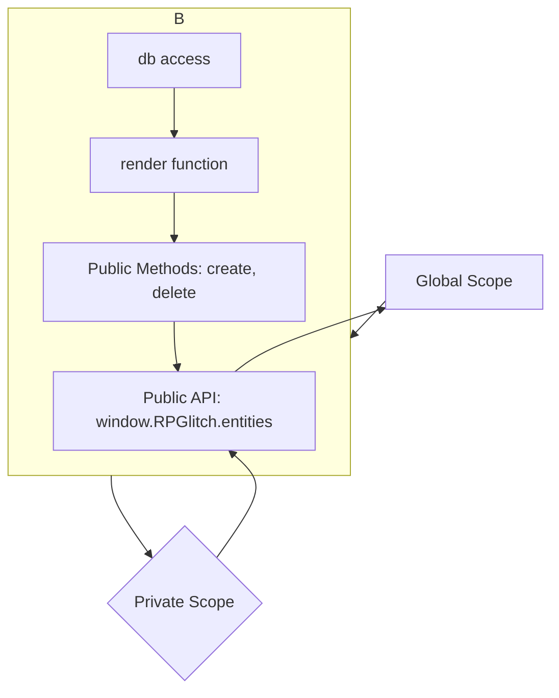

# JavaScript Guide: Patterns & Practices

This guide outlines the architectural patterns and best practices for writing modular, maintainable, and scalable JavaScript code in this project.

---

## 1. The Module Pattern (IIFE)

To avoid polluting the global namespace and to create encapsulated modules, all JavaScript files should be wrapped in an Immediately Invoked Function Expression (IIFE).

This pattern creates a private scope for all the variables and functions inside the file. Anything that needs to be accessed by other files can be exposed by attaching it to a global object (e.g., `window.RPGlitch`).

### IIFE Structure & Data Flow

The diagram below illustrates how an IIFE encapsulates its logic and exposes a public API.



### Example Implementation

```javascript
// In entities.js
(function() {
  'use strict';

  // Private variables and functions
  const db = window.RPGlitch.db;

  function privateRenderFunction() {
    // ... logic to render entities
  }

  // Public API
  const entitiesModule = {
    createEntity: function(data) {
      // ... logic
    },
    init: function() {
      // ... initialization logic
    }
  };

  // Expose the module on the global app object
  window.RPGlitch.entities = entitiesModule;
})();
```

---

## 2. State Management

- **Single Source of Truth:** The IndexedDB database (managed by Dexie) is the single source of truth for all application state. The UI is a *reflection* of this data.
- **Data Flow:**
  1. A user interaction (e.g., form submission) triggers an event.
  2. The event handler calls a function that modifies the data in the database.
  3. Upon successful database modification, a rendering function is called to update the DOM to match the new state in the database.

This one-way data flow makes the application's behavior predictable and easier to debug.

---

## 3. General Best Practices

- **`'use strict';`**: Every IIFE must begin with `'use strict';` to enforce a stricter parsing and error handling mode.
- **Single Responsibility Principle:** Each module (file) should have a single responsibility. For example, `entities.js` handles entity logic, while `entity-form.js` handles the form UI for creating/editing them.
- **Clear Naming:** Use descriptive names for variables (`camelCase`), functions (`camelCase`), and constants (`UPPER_SNAKE_CASE`).
- **JSDoc Comments:** All public functions should have JSDoc comment blocks explaining their purpose, parameters, and return values.
