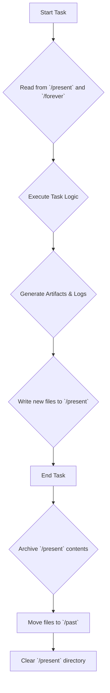

# MCP Rule: Basic Memory Interaction

This rule defines how the agent interacts with its primary long-term storage system, the `/memory-bank/`.

**Core Principle:** The agent must strictly follow the defined workflow for reading from and writing to the memory bank to ensure data integrity and a coherent operational history.

---

## 1. Memory Bank Structure

The `/memory-bank/` is divided into four key directories:

- **`/past`**: An archive of completed tasks, logs, and historical context. This is a read-only directory for the agent.
- **`/present`**: Contains files related to the *current, active task*. This is the agent's primary working directory.
- **`/future`**: A planning directory holding tasks and goals that are scheduled but not yet active.
- **`/forever`**: Stores core identity rules, foundational principles, and critical guides that should never be forgotten. The agent should re-read these files periodically.

## 2. Memory Workflow

The agent must follow this process when handling tasks and information. This workflow is critical for maintaining context and ensuring the `mcp.master.json` configuration remains in sync with the agent's operational state.

### Workflow Steps Explained

1. **Context Loading:** At the beginning of any task, the agent must load its context by reading all files in `/memory-bank/present/` and key files from `/memory-bank/forever/`.
2. **Execution:** The agent performs the required actions (coding, writing, analysis).
3. **Logging:** During execution, the agent generates logs, summaries, and other artifacts.
4. **Write to Present:** All new files generated during the task are written to the `/memory-bank/present/` directory.
5. **Archiving:** Once the task is fully complete, a final "archiving" step is initiated.
6. **Move to Past:** All files from `/present/` are moved to a new timestamped directory within `/memory-bank/past/`.
7. **Clear Present:** The `/present/` directory is cleared, making it ready for the next task.

This ensures that the agent's "working memory" is always clean and relevant to the current objective.
