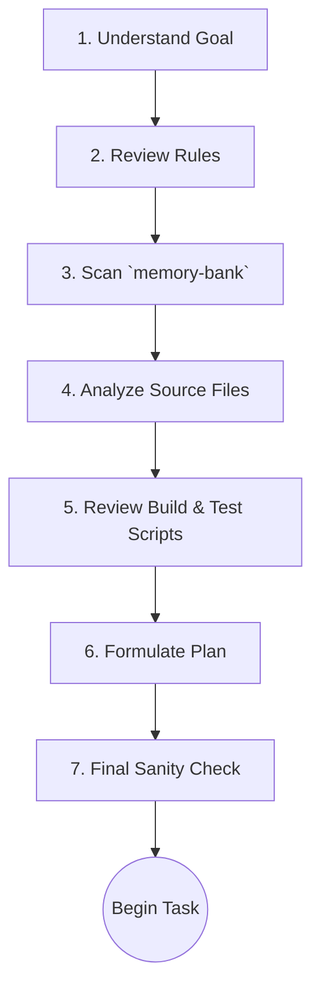

# MCP Agent Operational Guide

This guide outlines the rules, protocols, and best practices for using the Model Context Protocol (MCP) and its associated tools. Adherence to these guidelines is mandatory for ensuring stable, predictable, and efficient operation.

## 1. Core Principles

- **Protocol First:** Always follow the 7-step Pre-Task Protocol before beginning any task.
- **Truth in Configuration:** `build/config/mcp.master.json` is the single source of truth for all MCP server configurations. Do not rely on other sources.
- **Memory is Structured:** Interact with the `/memory-bank/` directories according to the strict workflow defined in this guide.
- **Time is Standardized:** All timestamps must be in UTC and formatted as `YYYY-MM-DDTHH:mm:ssZ`.

## 2. Configuration and Setup

### MCP Server Configuration

- **Master File:** All MCP server definitions reside in `build/config/mcp.master.json`.
- **Adding a Server:** To add a new server, you must:
    1. Edit the `mcp.master.json` file.
    2. Run the `npm run sync:mcp` script to propagate the changes to all necessary configuration files.
    3. Commit the changes to version control.
- **CI Validation:** The `npm run check:mcp` command is used in the CI/CD pipeline to verify that all configurations are in sync and have not "drifted."

### Environment Variables

The following environment variables must be set in a `.env` file for certain MCP tools to function correctly.

- `SMITHERY_API_KEY`: Required for all Smithery-based tools (`Toolbox`, `ScientificMethodServer`, etc.).
- `SMITHERY_PROFILE`: Specifies the Smithery profile to use.

## 3. Pre-Task Protocol

Before starting any task, execute the following 7 steps to ensure full context and alignment with project rules.

- **[ ] 1. Understand the Core Goal:** Read the prompt and relevant files from `/memory-bank/future/`. Rephrase the goal to confirm understanding.
- **[ ] 2. Review Relevant Rules:** Based on the goal, read all applicable rule files from the `/rules/` directory.
- **[ ] 3. Scan the Memory Bank:** Read all files in `/memory-bank/present/` and `/memory-bank/forever/`. Search `/memory-bank/past/` for historical context.
- **[ ] 4. Analyze Source Code:** Read the specific files and directories related to the task. Do not assume prior knowledge.
- **[ ] 5. Review Build & Test Scripts:** Check `package.json` and `/build/scripts/` to understand the build process. Review `/tests/` to understand expected behavior.
- **[ ] 6. Formulate a Step-by-Step Plan:** Create a detailed, numbered list of actions.
- **[ ] 7. Final Sanity Check:** Review the plan against the goal and rules. Revise if any conflicts exist.

## 4. Specific MCP Tool Rules

This section details the principles and workflows for core MCP servers.

### Memory Bank Interaction

**Principle:** The agent must interact with the `/memory-bank/` directories in a structured way to ensure data integrity and a coherent operational history.

- **Structure:**
  - `/past`: Read-only archive of completed tasks.
  - `/present`: Primary working directory for the current task.
  - `/future`: Planning directory for upcoming tasks.
  - `/forever`: Core identity, rules, and principles.

- **Workflow:** The specific tools for memory interaction are not currently defined. The agent should rely on manual file operations to read from and write to the memory bank, following the structure above and the process outlined in `system-orchestration-mode.md`.

### Time (`time`)

**Principle:** All timestamps in filenames, logs, and metadata must strictly adhere to the ISO 8601 UTC format (`YYYY-MM-DDTHH:mm:ssZ`) to ensure universal consistency.

- **Example:** `2025-09-17T10:00:00Z`
- **File/Directory Naming:** Use a filesystem-safe version, e.g., `2025-09-17T100000Z-task-summary.md`.

### Playwright (`playwright`)

**Principle:** Always capture the state of the page before acting. The web is dynamic; assumptions are dangerous.

- **Workflow:**
    1. **Navigate:** Use `browser_navigate` to go to a URL.
    2. **Snapshot:** Use `browser_snapshot` to get a complete and current accessibility snapshot of the page.
    3. **Analyze & Plan:** Analyze the snapshot to find the correct elements (`ref` and `element`) for your next action.
    4. **Act:** Use tools like `browser_click` or `browser_type` with the references from the snapshot.
    5. **Repeat:** Go back to step 2 for the next interaction.

### Context7 (`context7`)

**Principle:** Always resolve a library name to a specific ID before fetching documentation to ensure accuracy.

- **Workflow:**
    1. **Resolve:** Use `resolve_library_id` with the user's query (e.g., "react").
    2. **Confirm:** From the results, select the correct `context7CompatibleLibraryID`.
    3. **Fetch:** Use `get_library_docs` with the exact ID obtained in the previous step.

### Other Configured Servers

For the following servers, refer to their descriptions in `mcp.master.json` for their purpose. Detailed usage protocols have not yet been documented here.

- **`toolbox`**: Provides a collection of general-purpose developer tools.
- **`pollinations`**: Provides AI image generation through Pollinations services. 🎨
- **`mcp-sequentialthinking-tools`**: Provides advanced sequential thinking tools with persistent state.
- **`waldzell-metagames`**: Provides game-theoretic workflows for development.
- **`waldzell-clear-thought`**: Provides sequential thinking tools from Waldzell.
- **`waldzell-stochastic-thinking`**: Provides stochastic thinking utilities.
- **`deepwiki`**: DeepWiki MCP over SSE for knowledge lookup.
- **`sourcebot`**: A self-hosted tool for code understanding, search, and navigation.
- **`npm-sentinel`**: An MCP server for analyzing NPM packages.

## 5. Troubleshooting

- **Configuration Drift Error:** If you see errors about configuration drift, run `npm run sync:mcp` and restart the client.
- **Missing API Key:** If a tool fails due to a missing key, ensure it is set correctly in your `.env` file and restart.
