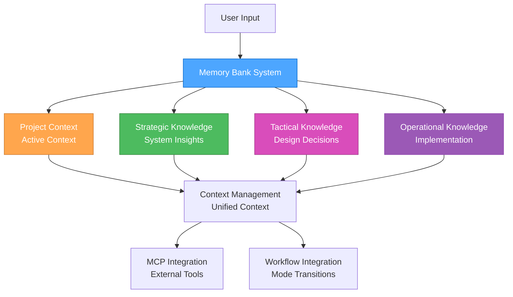

# Memory Bank System Overview

## Overview

The Memory Bank system provides persistent context and knowledge management for the 3-mode development system, enabling seamless workflow transitions, knowledge accumulation, and enhanced decision-making capabilities.

## 🎯 **SYSTEM ARCHITECTURE**

### **Core Components**



### **File Structure**

```md
memory-bank/
├── project/                      # Main project context
│   ├── activeContext.md         # Current active context
│   ├── todo-handoff.md          # Todo and handoff status
│   ├── progress.md              # Progress tracking
│   ├── tasks.md                 # Task management
│   └── strategic-insights.md    # Strategic insights
├── strategic/                   # Strategic knowledge base
│   ├── README.md               # Strategic knowledge overview
│   ├── system-architecture/    # System-level insights
│   ├── tool-configurations/    # Tool setup knowledge
│   ├── meta-patterns/          # Cross-project patterns
│   └── strategic-decisions/    # Planning decisions
├── tactical/                    # Tactical knowledge base
│   ├── README.md               # Tactical knowledge overview
│   ├── design-decisions/       # Design decision rationales
│   ├── requirements-patterns/  # Requirement structures
│   ├── architecture-templates/ # Architectural patterns
│   └── planning-templates/     # Planning approaches
└── operational/                 # Operational knowledge base
    ├── README.md               # Operational knowledge overview
    ├── implementation-patterns/ # Implementation approaches
    ├── debug-solutions/        # Problem resolution
    ├── performance-optimizations/ # Performance techniques
    └── deployment-configs/     # Deployment setups
```

## 🔄 **KNOWLEDGE MANAGEMENT**

### **Strategic Knowledge**

**Purpose**: System-level insights and meta-patterns

**Content Categories**:

- **System Architecture**: Workflow optimization insights
- **Tool Configurations**: Successful tool setups and configurations
- **Meta-Patterns**: Patterns across multiple projects
- **Strategic Decisions**: Planning decisions and rationales

**Storage Structure**:

```md
strategic/
├── system-architecture/
│   ├── workflow-optimizations.md
│   ├── tool-integrations.md
│   └── performance-patterns.md
├── tool-configurations/
│   ├── mcp-setups.md
│   ├── development-environments.md
│   └── deployment-configs.md
├── meta-patterns/
│   ├── project-patterns.md
│   ├── decision-patterns.md
│   └── optimization-patterns.md
└── strategic-decisions/
    ├── architecture-decisions.md
    ├── tool-selections.md
    └── workflow-decisions.md
```

### **Tactical Knowledge**

**Purpose**: Design decisions and planning templates

**Content Categories**:

- **Design Decisions**: UI/UX design decisions and rationales
- **Requirements Patterns**: Common requirement structures
- **Architecture Templates**: Reusable architectural patterns
- **Planning Templates**: Planning approaches and methodologies

**Storage Structure**:

```md
tactical/
├── design-decisions/
│   ├── ui-patterns.md
│   ├── ux-decisions.md
│   └── design-rationales.md
├── requirements-patterns/
│   ├── feature-requirements.md
│   ├── user-stories.md
│   └── acceptance-criteria.md
├── architecture-templates/
│   ├── component-patterns.md
│   ├── data-flow-patterns.md
│   └── integration-patterns.md
└── planning-templates/
    ├── project-planning.md
    ├── sprint-planning.md
    └── milestone-planning.md
```

### **Operational Knowledge**

**Purpose**: Implementation patterns and solutions

**Content Categories**:

- **Implementation Patterns**: Code patterns and solutions
- **Debug Solutions**: Problem resolution approaches
- **Performance Optimizations**: Performance improvement techniques
- **Deployment Configs**: Deployment and configuration setups

**Storage Structure**:

```md
operational/
├── implementation-patterns/
│   ├── code-patterns.md
│   ├── best-practices.md
│   └── solution-templates.md
├── debug-solutions/
│   ├── common-issues.md
│   ├── troubleshooting.md
│   └── resolution-patterns.md
├── performance-optimizations/
│   ├── optimization-techniques.md
│   ├── performance-patterns.md
│   └── monitoring-strategies.md
└── deployment-configs/
    ├── deployment-setups.md
    ├── configuration-templates.md
    └── environment-configs.md
```

## 🔧 **MCP INTEGRATION**

### **Basic Memory Integration**

**Knowledge Server**: Basic Memory MCP Server

**Features**:

- Semantic knowledge management
- Automatic graph building
- Obsidian integration
- Multi-project support
- Real-time synchronization
- Markdown storage

**Integration**: [Basic Memory MCP Guide](../.cursor/rules/mcp-basic-memory.mdc)

### **Context7 Integration**

**Documentation Server**: Context7 MCP Server

**Features**:

- Real-time documentation access
- Library resolution
- Code examples
- Trust scoring

**Integration**: [Context7 MCP Guide](../.cursor/rules/mcp-context7.mdc)

### **Time MCP Integration**

**Date Standardization**: Time MCP Server

**Features**:

- Consistent date formatting
- Timezone handling
- Integration with all components

**Integration**: [Time MCP Guide](../.cursor/rules/mcp-time.mdc)

## 📋 **WORKFLOW INTEGRATION**

### **Mode Transitions**

**Context Preservation**:

- Maintain active context during mode transitions
- Update context files appropriately
- Preserve important decisions and insights
- Track progress across modes

**Handoff Process**:

- Document current state in todo-handoff.md
- Update active context for next mode
- Preserve relevant knowledge
- Clear handoff status

### **Knowledge Management**

**Storage Strategy**:

- Store knowledge in appropriate mode-specific directories
- Use consistent naming conventions
- Implement proper categorization
- Maintain knowledge relationships

**Retrieval Strategy**:

- Semantic search for relevant knowledge
- Context-aware recommendations
- Pattern-based suggestions
- Historical context integration

## 🎯 **BENEFITS**

### **Persistent Context**

- Maintain context across sessions
- Resume work seamlessly
- Build knowledge over time
- Learn from past interactions

### **Enhanced Decision Making**

- Access historical decisions
- Learn from past outcomes
- Identify successful patterns
- Optimize based on experience

### **Improved Efficiency**

- Reduce repetitive work
- Leverage past solutions
- Optimize workflows
- Better resource utilization

### **Knowledge Accumulation**

- Build comprehensive knowledge base
- Share knowledge across projects
- Maintain institutional memory
- Continuous learning and improvement

## 📚 **REFERENCES**

- [Memory Bank Workflow](../.cursor/rules/memory-bank-workflow.mdc) - Detailed workflow integration
- [Memory Bank Optimization](../.cursor/rules/memory-bank-optimization.mdc) - Performance optimization
- [Basic Memory MCP Guide](../.cursor/rules/mcp-basic-memory.mdc) - MCP server integration
- [System Documentation](../.cursor/rules/system-documentation.mdc) - Unified system integration
- [MCP Ecosystem Overview](../.cursor/rules/mcp-ecosystem.mdc) - MCP server overview

## 🎯 **NEXT STEPS**

1. **Set up memory bank structure** using the provided file structure
2. **Configure MCP servers** for enhanced capabilities
3. **Implement workflow integration** for seamless mode transitions
4. **Start using memory bank** for persistent context and knowledge
5. **Optimize performance** using the provided strategies

---

**Last Updated**: 2025-07-23  
**Version**: 1.0  
**Status**: Complete memory bank system overview
