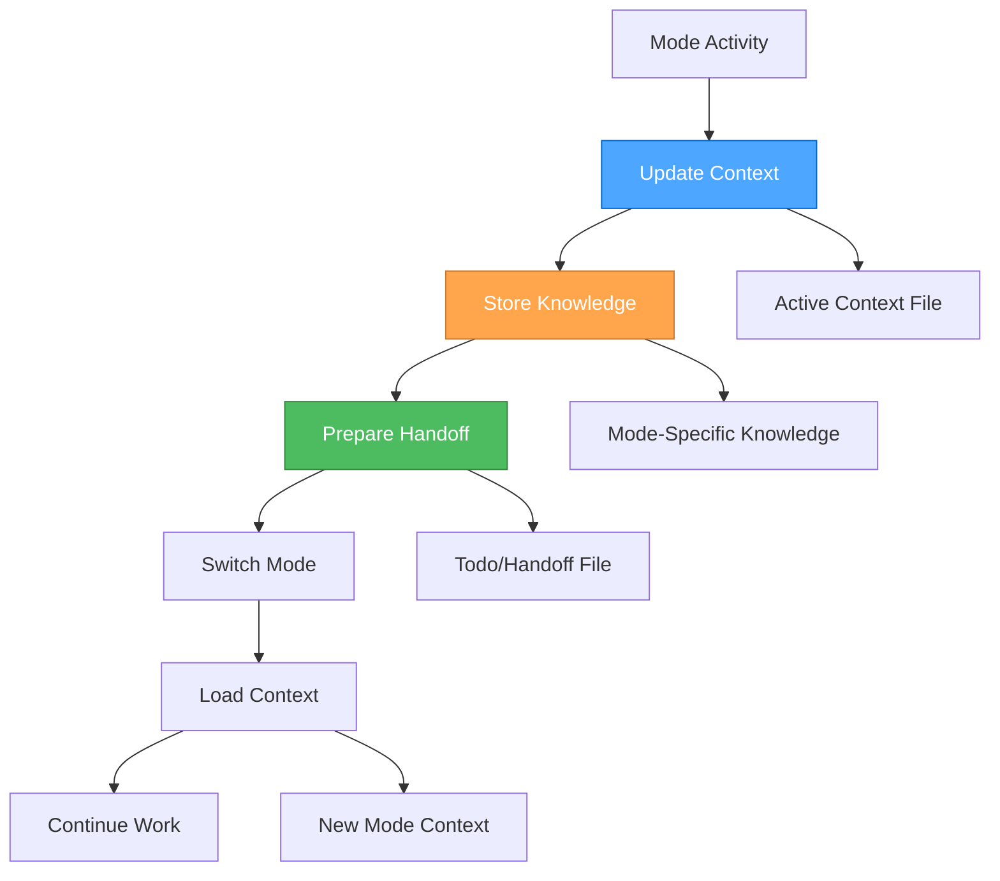

# Memory Bank Workflow Integration

## Overview

This guide describes how the Memory Bank system integrates with the 3-mode development workflow, providing persistent context, knowledge management, and seamless transitions between Strategic, Tactical, and Operational modes.

## 🔄 **WORKFLOW INTEGRATION PATTERNS**

### **Mode Transition Workflow**



### **Context Preservation Strategy**

**During Mode Transitions**:

1. **Update Active Context**: Document current state and decisions
2. **Store Mode Knowledge**: Archive mode-specific insights
3. **Prepare Handoff**: Create clear handoff documentation
4. **Load New Context**: Initialize next mode with relevant context

## 🎭 **STRATEGIC MODE INTEGRATION**

### **Strategic Mode Workflow**

**Purpose**: System-level thinking, workflow optimization, tool management

**Memory Bank Activities**:

#### **Context Management**

```bash
# Update active context with strategic decisions
memory-bank-write strategic/active-context.md --content "
## Strategic Context Update
**Date**: [Time MCP current date]
**Current Focus**: [Strategic focus area]
**Key Decisions**: [Strategic decisions made]
**System Optimizations**: [Workflow improvements identified]
"

# Store strategic insights
memory-bank-write strategic/insights/workflow-optimization.md --content "
## Workflow Optimization Insight
**Date**: [Time MCP current date]
**Insight**: [Specific insight about workflow]
**Impact**: [Expected impact on system performance]
**Implementation**: [How to implement this insight]
"
```

#### **Knowledge Storage**

```bash
# Store system architecture decisions
memory-bank-write strategic/architecture/system-architecture.md --content "
## System Architecture Decision
**Date**: [Time MCP current date]
**Decision**: [Architecture decision made]
**Rationale**: [Why this decision was made]
**Alternatives**: [Alternatives considered]
**Expected Outcome**: [Expected results]
"

# Store tool configuration knowledge
memory-bank-write strategic/tools/tool-configuration.md --content "
## Tool Configuration Knowledge
**Date**: [Time MCP current date]
**Tool**: [Tool name and version]
**Configuration**: [Specific configuration details]
**Performance**: [Performance characteristics]
**Best Practices**: [Identified best practices]
"
```

#### **Strategic Handoff Preparation**

```bash
# Prepare handoff to tactical mode
memory-bank-write project/todo-handoff.md --content "
## 🎭 → 🎨 Strategic to Tactical Handoff

### Strategic Context
**Overall Approach**: [Strategic approach determined]
**System Setup**: [Tools and workflows configured]
**Optimizations**: [Process improvements identified]

### Ready for Tactical Planning
**Project Focus**: [Specific project to plan]
**Strategic Constraints**: [High-level constraints]
**Success Criteria**: [How success will be measured]

### Handoff Status
**Date**: [Time MCP current date]
**Strategic Work Complete**: [Yes/No]
**Ready for Tactical Mode**: [Yes/No]
"
```

### **Strategic Mode Commands**

```bash
# Store strategic insights
🎭 "store-insight [topic] [content]" → Store strategic insight
🎭 "search-patterns [domain]" → Search for strategic patterns
🎭 "archive-decision [decision] [rationale]" → Archive strategic decision

# Context management
🎭 "update-context [focus] [decisions]" → Update strategic context
🎭 "prepare-handoff [project] [constraints]" → Prepare tactical handoff
🎭 "load-context [project]" → Load project context
```

## 🎨 **TACTICAL MODE INTEGRATION**

### **Tactical Mode Workflow**

**Purpose**: App-specific planning, design decisions, implementation planning

**Memory Bank Activities**:

#### **Context Loading**

```bash
# Load strategic context for tactical planning
memory-bank-read project/todo-handoff.md

# Load project-specific context
memory-bank-read project/activeContext.md

# Load relevant strategic insights
memory-bank-search strategic/insights/ --query "[project-specific insights]"
```

#### **Design Decision Storage**

```bash
# Store design decisions
memory-bank-write tactical/design-decisions/component-design.md --content "
## Component Design Decision
**Date**: [Time MCP current date]
**Component**: [Component name and purpose]
**Design Decision**: [Specific design decision]
**Rationale**: [Why this design was chosen]
**Trade-offs**: [Trade-offs considered]
**Implementation Plan**: [How to implement]
"

# Store requirements patterns
memory-bank-write tactical/requirements/requirements-pattern.md --content "
## Requirements Pattern
**Date**: [Time MCP current date]
**Pattern**: [Requirements pattern identified]
**Context**: [When this pattern applies]
**Implementation**: [How to implement this pattern]
**Examples**: [Examples of this pattern]
"
```

#### **Planning Template Storage**

```bash
# Store planning templates
memory-bank-write tactical/planning/planning-template.md --content "
## Planning Template
**Date**: [Time MCP current date]
**Template Type**: [Type of planning template]
**Structure**: [Template structure and sections]
**Usage**: [When and how to use this template]
**Examples**: [Example usage of this template]
"
```

#### **Tactical Handoff Preparation**

```bash
# Prepare handoff to operational mode
memory-bank-update project/todo-handoff.md --content "
## 🎨 → ⚒️ Tactical to Operational Handoff

### Tactical Context
**App-Specific Strategy**: [How to execute the strategy]
**Design Decisions**: [Key design decisions made]
**Implementation Approach**: [Detailed implementation plan]

### Ready for Operational Execution
**Implementation Tasks**: [Specific tasks to implement]
**Technical Constraints**: [Technical constraints identified]
**Success Criteria**: [How success will be measured]

### Handoff Status
**Date**: [Time MCP current date]
**Tactical Work Complete**: [Yes/No]
**Ready for Operational Mode**: [Yes/No]
"
```

### **Tactical Mode Commands**

```bash
# Store design decisions
🎨 "store-design [component] [decision]" → Store design decision
🎨 "search-requirements [feature]" → Search for similar requirements
🎨 "archive-plan [plan] [approach]" → Archive planning approach

# Context management
🎨 "load-strategic-context [project]" → Load strategic context
🎨 "update-tactical-context [focus] [decisions]" → Update tactical context
🎨 "prepare-operational-handoff [tasks] [constraints]" → Prepare operational handoff
```

## ⚒️ **OPERATIONAL MODE INTEGRATION**

### **Operational Mode Workflow**

**Purpose**: Implementation, testing, and execution

**Memory Bank Activities**:

#### **Operational Context Loading**

```bash
# Load tactical context for implementation
memory-bank-read project/todo-handoff.md

# Load implementation plan
memory-bank-read tactical/planning/implementation-plan.md

# Load relevant design decisions
memory-bank-search tactical/design-decisions/ --query "[component-specific decisions]"
```

#### **Implementation Pattern Storage**

```bash
# Store implementation patterns
memory-bank-write operational/implementation-patterns/coding-pattern.md --content "
## Coding Pattern
**Date**: [Time MCP current date]
**Pattern**: [Coding pattern identified]
**Context**: [When to use this pattern]
**Implementation**: [How to implement this pattern]
**Examples**: [Code examples of this pattern]
"

# Store debug solutions
memory-bank-write operational/debug-solutions/issue-resolution.md --content "
## Issue Resolution
**Date**: [Time MCP current date]
**Issue**: [Issue description and symptoms]
**Root Cause**: [Root cause analysis]
**Solution**: [Solution implemented]
**Prevention**: [How to prevent this issue]
"
```

#### **Progress Tracking**

```bash
# Update progress
memory-bank-update project/progress.md --content "
## Progress Update
**Date**: [Time MCP current date]
**Completed**: [Tasks completed]
**In Progress**: [Current tasks]
**Next Up**: [Next tasks in queue]
**Blockers**: [Any issues preventing progress]
"

# Store performance optimizations
memory-bank-write operational/performance/optimization-technique.md --content "
## Performance Optimization
**Date**: [Time MCP current date]
**Technique**: [Optimization technique used]
**Before**: [Performance before optimization]
**After**: [Performance after optimization]
**Implementation**: [How to implement this optimization]
"
```

#### **Operational Handoff Preparation**

```bash
# Prepare handoff back to strategic mode
memory-bank-update project/todo-handoff.md --content "
## ⚒️ → 🎭 Operational to Strategic Handoff

### Operational Context
**Implementation Complete**: [What was implemented]
**Performance Results**: [Performance outcomes]
**Issues Resolved**: [Issues encountered and resolved]

### Ready for Strategic Reflection
**Success Metrics**: [How success was measured]
**Lessons Learned**: [Key learnings from implementation]
**Optimization Opportunities**: [Areas for future optimization]

### Handoff Status
**Date**: [Time MCP current date]
**Operational Work Complete**: [Yes/No]
**Ready for Strategic Mode**: [Yes/No]
"
```

### **Operational Mode Commands**

```bash
# Store implementation patterns
⚒️ "store-implementation [feature] [approach]" → Store implementation pattern
⚒️ "search-solutions [problem]" → Search for similar solutions
⚒️ "archive-config [system] [config]" → Archive configuration

# Progress tracking
⚒️ "update-progress [completed] [in-progress] [next]" → Update progress
⚒️ "store-optimization [technique] [results]" → Store performance optimization
⚒️ "prepare-strategic-handoff [results] [learnings]" → Prepare strategic handoff
```

## 🔄 **CROSS-MODE KNOWLEDGE SHARING**

### **Knowledge Transfer Patterns**

#### **Strategic → Tactical**

- **System Architecture**: Strategic decisions inform tactical planning
- **Tool Configurations**: Strategic tool choices guide tactical implementation
- **Meta-Patterns**: Strategic patterns inform tactical approaches

#### **Tactical → Operational**

- **Design Decisions**: Tactical design decisions guide operational implementation
- **Requirements Patterns**: Tactical requirements inform operational tasks
- **Planning Templates**: Tactical planning guides operational execution

#### **Operational → Strategic**

- **Implementation Results**: Operational results inform strategic decisions
- **Performance Data**: Operational performance guides strategic optimization
- **Lessons Learned**: Operational learnings inform strategic planning

### **Knowledge Search Patterns**

```bash
# Search across all modes for related knowledge
memory-bank-search all/ --query "[search term]" --mode all

# Search specific mode knowledge
memory-bank-search strategic/ --query "[strategic insights]"
memory-bank-search tactical/ --query "[design decisions]"
memory-bank-search operational/ --query "[implementation patterns]"

# Search for patterns across modes
memory-bank-search all/ --query "[pattern name]" --cross-mode true
```

## 📊 **WORKFLOW OPTIMIZATION**

### **Context Preservation Optimization**

**Strategy**:

- Update context files at key decision points
- Preserve critical information during transitions
- Load relevant context for each mode
- Maintain context continuity across sessions

**Benefits**:

- Seamless mode transitions
- Reduced context loss
- Better decision continuity
- Improved workflow efficiency

### **Knowledge Management Optimization**

**Strategy**:

- Store knowledge in appropriate mode-specific locations
- Use consistent naming conventions
- Implement proper categorization
- Maintain knowledge relationships

**Benefits**:

- Easy knowledge retrieval
- Better knowledge organization
- Improved knowledge reuse
- Enhanced learning accumulation

### **Performance Optimization**

**Strategy**:

- Optimize file operations for speed
- Implement efficient search patterns
- Use appropriate storage formats
- Monitor and optimize performance

**Benefits**:

- Faster workflow execution
- Better resource utilization
- Improved user experience
- Enhanced system responsiveness

## 🎯 **BENEFITS**

### **Seamless Workflow Integration**

- Smooth transitions between modes
- Context preservation across transitions
- Knowledge continuity throughout workflow
- Improved workflow efficiency

### **Enhanced Decision Making**

- Access to relevant historical context
- Informed decisions based on past learnings
- Pattern recognition across modes
- Better decision outcomes

### **Improved Knowledge Management**

- Organized knowledge storage
- Easy knowledge retrieval
- Knowledge accumulation over time
- Enhanced learning and improvement

### **Better Performance**

- Optimized workflow execution
- Efficient resource utilization
- Improved user experience
- Enhanced system responsiveness

## 📚 **REFERENCES**

- Memory Bank Overview - System overview and architecture
- Memory Bank Optimization - Performance optimization
- Basic Memory MCP Guide - MCP server integration
- System Documentation - Unified system integration
 - MCP Ecosystem Overview - MCP server overview
 - Where to configure MCP: `build/config/mcp.master.json` (authoritative)

## 🎯 **NEXT STEPS**

1. **Implement workflow integration** using the provided patterns
2. **Set up mode-specific knowledge storage** in your memory bank
3. **Configure cross-mode knowledge sharing** for enhanced capabilities
4. **Optimize workflow performance** using the provided strategies
5. **Start using memory bank workflow** for seamless mode transitions

---

**Last Updated**: 2025-07-23  
**Version**: 1.0  
**Status**: Complete workflow integration guide
