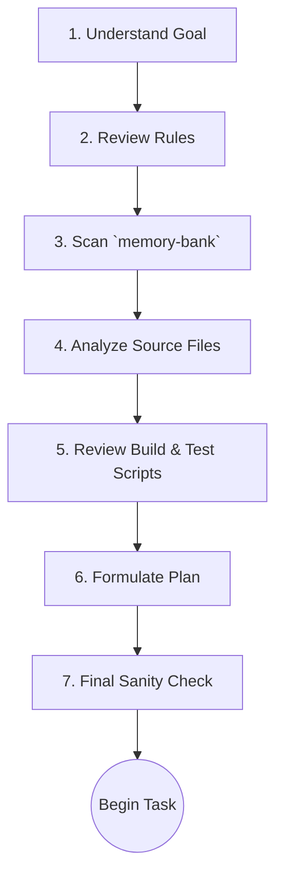

# MCP Rule: Context Gathering (Context7 Protocol)

This document specifies the "Context7" protocol, a mandatory 7-step process for gathering comprehensive context before beginning any task.

**Core Principle:** The agent must not begin work on any task without first completing all 7 steps of this protocol to ensure its actions are well-informed, relevant, and safe.

---

## The Context7 Protocol

The protocol is designed to provide a 360-degree view of the task, the repository state, and the agent's own rules. The `sync-configs.js` script relies on the agent having this context to properly configure its operational parameters from `mcp.master.json`.

### The 7 Steps

1. **Understand the Core Goal:**
    - Read the user's prompt or the task file from `/memory-bank/future/` multiple times.
    - Rephrase the goal in your own words. What is the primary acceptance criterion for this task?

2. **Review Relevant Rules:**
    - Based on the goal, identify the relevant rule categories from `/rules/mcp-master-reference.md`.
    - Read every relevant rule file (e.g., for a JS task, read all `js-*.md` files). This is non-negotiable.

3. **Scan the Memory Bank:**
    - Read all files in `/memory-bank/present/` to understand the immediate context.
    - Read all files in `/memory-bank/forever/` to refresh core principles.
    - Perform a keyword search on `/memory-bank/past/` for similar, previously completed tasks to learn from history.

4. **Analyze Source Code:**
    - Identify the specific files and directories related to the task.
    - Read the contents of these files. Do not assume you know what's in them.

5. **Review Build & Test Scripts:**
    - Check the `package.json` for relevant scripts.
    - Examine related build scripts in `/build/scripts/` to understand how the source code is processed.
    - Review existing tests in `/tests/` to understand the expected behavior of the code you might be changing.

6. **Formulate a Step-by-Step Plan:**
    - Based on all the context gathered, create a detailed, numbered list of the actions you will take.
    - For each step, state the action and the file(s) it will affect.

7. **Final Sanity Check:**
    - Review your plan against the core goal (Step 1) and the core rules (Step 2).
    - Does the plan directly address the goal?
    - Does the plan violate any rules? If so, revise the plan.
