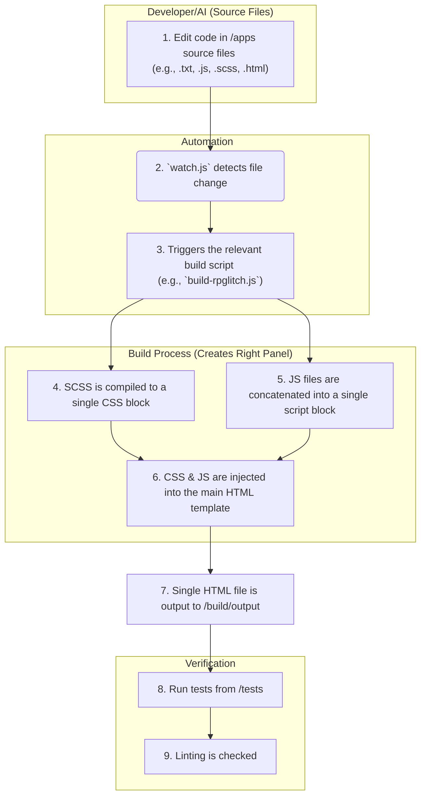

# System Architecture Rules

**RULE:** This document provides the high-level architectural blueprint for the JooduG-default repository. It explains how the major components fit together to form a cohesive development ecosystem.

**CORE PRINCIPLE:** This is a monorepo containing a self-sufficient, AI-assisted development environment. The structure is designed to support not just the applications, but the entire lifecycle of their creation, maintenance, and documentation.

-----

## 1\. High-Level Directory Structure Directives

**RULE:** The repository is organized into several distinct, high-level directories, each with a specific responsibility.

* **DIRECTIVE:** `/apps` MUST contain user-facing web applications. This is the "product."
* **DIRECTIVE:** `/build` MUST contain all scripts, configurations, and libraries required to build, lint, and test applications. This is the "factory."
* **DIRECTIVE:** `/docs` MUST contain all human-readable documentation (guides, glossaries, changelogs). This is the "library."
* **DIRECTIVE:** `/memory-bank` MUST provide persistent, long-term storage for the AI agent. This is the "brain."
* **DIRECTIVE:** `/rules` MUST contain the machine-readable rule set that governs the AI agent's behavior. This is the "constitution."
* **DIRECTIVE:** `/tests` MUST contain all automated tests for applications. This is the "quality assurance department."
* **DIRECTIVE:** `/tools` MUST contain a collection of utility and diagnostic scripts. This is the "toolbox."

-----

## 2\. Perchance Application Architecture

**RULE:** All applications in the `/apps` directory are built for the **Perchance platform** and **MUST** adhere to its **Two-Panel Architecture**. This is the foundational architectural pattern of this repository.

* **The Left Panel (Logic / "Backend"):** This component contains all the Perchance-specific syntax, lists, and generative logic. The source of truth for this is always a `*-left-panel.txt` file. It is the engine of the application.
* **The Right Panel (Interface / "Frontend"):** This component contains the entire user interface—the HTML, CSS, and JavaScript that the user interacts with. The content for this panel is generated by our build process.

**DIRECTIVE:** This separation of concerns is **absolute**. AI agents must not mix UI code into Left Panel files or Perchance logic into Right Panel source files.

-----

## 3\. Development & Build Workflow Directives

**RULE:** The development workflow is designed to build the **Right Panel** of our Perchance applications from source files into a single HTML deliverable.

**DIRECTIVE:** The `/rules` and `/memory-bank` directories **MUST** guide the AI agent's actions during the initial code editing phase (step 1).
