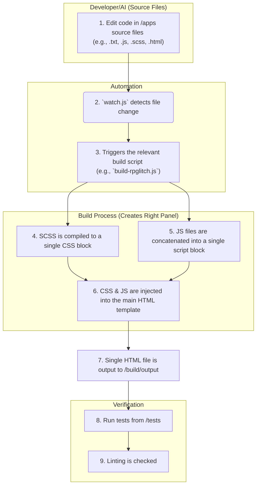

# System Architecture Rules

**RULE:** This document provides the high-level architectural blueprint for the JooduG-default repository. It explains how the major components fit together to form a cohesive development ecosystem.

**CORE PRINCIPLE:** This is a monorepo containing a self-sufficient, AI-assisted development environment. The structure is designed to support not just the applications, but the entire lifecycle of their creation, maintenance, and documentation.

-----

## 1\. High-Level Directory Structure Directives

**RULE:** The repository is organized into several distinct, high-level directories, each with a specific responsibility.

The `/apps` directory is the "product," containing the user-facing web applications. The `/build` directory is the "factory," with all scripts and configurations needed to build and test. All human-readable guides and changelogs live in `/docs`, the "library." The `/memory-bank` serves as the AI's persistent "brain," while `/rules` is its "constitution," containing machine-readable rule sets. Finally, `/tests` is the "quality assurance department," `/tools` is the "toolbox" with utility scripts.

-----

## 2\. Perchance Application Architecture

**RULE:** All applications in the `/apps` directory are built for the **Perchance platform** and **MUST** adhere to its **Two-Panel Architecture**. This is the foundational architectural pattern of this repository.

This architecture consists of two parts. **The Left Panel** is the "backend" or logic layer, containing all Perchance-specific syntax, lists, and generative code; the source of truth for this is always a `*-left-panel.txt` file. **The Right Panel** is the "frontend" or interface, which contains the user-facing HTML, CSS, and JavaScript and is generated by our build process.

**DIRECTIVE:** This separation of concerns is **absolute**. AI agents must not mix UI code into Left Panel files or Perchance logic into Right Panel source files.

-----

## 3\. Development & Build Workflow Directives

**RULE:** The development workflow is designed to build the **Right Panel** of our Perchance applications from source files into a single HTML deliverable.

**DIRECTIVE:** The `/rules` and `/memory-bank` directories **MUST** guide the AI agent's actions during the initial code editing phase (step 1).
