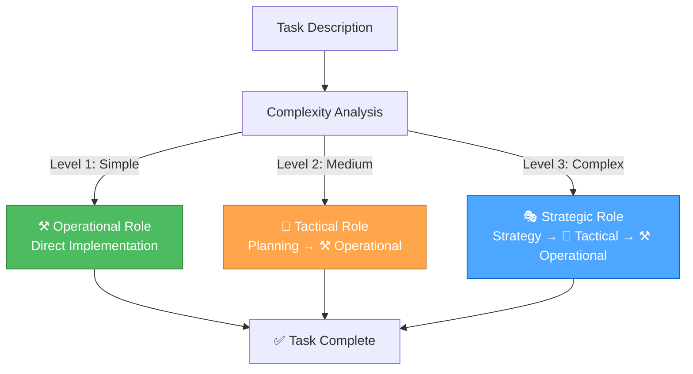
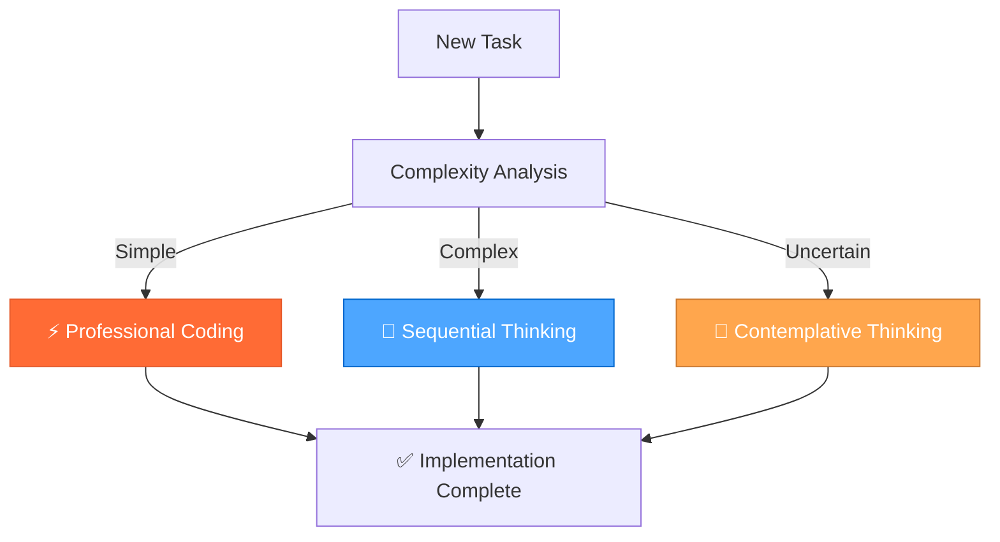

# **🎯 UNIFIED ORCHESTRATOR MODE: The intelligent single mode that manages the 3-mode system!**

> **TL;DR:** Single intelligent mode that automatically selects and transitions between Strategic, Tactical, and Operational roles based on task complexity, providing seamless development workflow with unified context and optimal performance.

## 🎯 **SYSTEM OVERVIEW**

The Unified Orchestrator Mode is a single, intelligent development mode that automatically:

1. **Analyzes task complexity** and selects the optimal role
2. **Applies the right thinking approach** for each task
3. **Loads contextually relevant rules** for maximum efficiency
4. **Maintains unified context** across role transitions
5. **Provides seamless workflow** without manual mode switching

## 🎭🎨⚒️ **THE THREE ROLES**

### **🎭 Strategic Role (System Architect)**

**Purpose**: System-level thinking, workflow optimization, tool management  
**Thinking Approach**: 🤔 **Contemplative Thinking** - Deep exploration and natural flow  
**When Activated**: Level 3 tasks, system optimization, meta-reflection  
**Mental State**: "What's our overall approach and how can we optimize it?"

**Key Capabilities**:

- **System-Level Optimization**: Focus on overall workflow and process improvement
- **Meta-Reflection**: Analyze and optimize the development process itself
- **Strategic Planning**: Coordinate long-term project architecture decisions
- **Context Management**: Maintain comprehensive project context awareness
- **Tool Evaluation**: Assess and optimize tool usage and MCP integrations

### **🎨 Tactical Role (Project Planner)**

**Purpose**: App-specific planning, design decisions, implementation planning  
**Thinking Approach**: 🧠 **Sequential Thinking** - Structured, tool-guided analysis  
**When Activated**: Level 2-3 tasks, feature planning, design decisions  
**Mental State**: "How do we execute this strategy for this specific app?"

**Key Capabilities**:

- **App-Specific Planning**: Focus on specific application requirements and design
- **Implementation Coordination**: Plan and coordinate implementation strategies
- **Task Prioritization**: Manage task priorities and resource allocation
- **Progress Tracking**: Monitor and update project progress in real-time
- **Design Decision Making**: Evaluate design options and make informed choices

### **⚒️ Operational Role (Code Implementer)**

**Purpose**: Implementation, testing, and execution  
**Thinking Approach**: ⚡ **Professional Coding** - Concise, production-ready implementation  
**When Activated**: All levels, direct implementation, testing, deployment  
**Mental State**: "Let's get this done!"

**Key Capabilities**:

- **Elite Code Generation**: Deliver optimal, production-grade code with zero technical debt
- **Complete Ownership**: Take complete ownership of all generated solutions
- **Precise Implementation**: Implement precise solutions that exactly match requirements
- **Technical Excellence**: Rigorously apply DRY and KISS principles in all code
- **Quality Assurance**: Comprehensive testing and validation

## 🎯 **AUTOMATIC ROLE SELECTION**

### **Complexity-Based Routing**



### **Level Definitions**

#### **Level 1: Quick Fix (⚒️ Operational Only)**

**Keywords**: "fix", "broken", "not working", "issue", "bug", "error", "crash", "typo"  
**Examples**: Fix button not working, Correct styling issue, Fix validation error  
**Role**: Direct to Operational Role

#### **Level 2: Enhancement (🎨 Tactical → ⚒️ Operational)**

**Keywords**: "add", "improve", "update", "change", "enhance", "modify"  
**Examples**: Add form field, Improve validation, Update styling  
**Role**: Tactical Role creates plan, Operational Role executes

#### **Level 3: Complex Feature (🎭 Strategic → 🎨 Tactical → ⚒️ Operational)**

**Keywords**: "implement", "create", "develop", "build", "feature", "system"  
**Examples**: Implement user authentication, Create dashboard, Develop search functionality  
**Role**: Strategic Role provides context, Tactical Role plans, Operational Role executes

## 🧠 **THINKING APPROACH INTEGRATION**

### **Automatic Approach Selection**

| Role | Thinking Approach | Primary Use Case | Key Characteristics |
|------|------------------|------------------|-------------------|
| 🎭 **Strategic** | 🤔 **Contemplative** | System-level decisions, meta-reflection | Deep exploration, natural flow, uncertainty embrace |
| 🎨 **Tactical** | 🧠 **Sequential** | Planning and design decisions | Systematic analysis, tool-guided, step-by-step |
| ⚒️ **Operational** | ⚡ **Professional** | Implementation and execution | Production-ready, zero technical debt, efficient |

### **Seamless Transitions**

The orchestrator automatically transitions between thinking approaches as the task evolves:



## ⚡ **CONTEXT-AWARE RULE LOADING**

### **Unified Rule Management**

The orchestrator maintains a single, comprehensive rule set and loads rules contextually based on:

- **Current Role**: Strategic, Tactical, or Operational
- **Task Type**: Debugging, implementation, planning, analysis
- **Domain**: Frontend, backend, documentation, optimization
- **Complexity**: Simple, medium, complex

### **Optimized Loading Strategy**

```javascript
function loadRulesForTask(task, currentRole) {
  const rules = new Set();
  
  // Core rules (always loaded)
  rules.add('unified-orchestrator-mode.md');
  rules.add('thinking-framework.md');
  
  // Role-specific rules
  const roleRules = getRoleRules(currentRole);
  roleRules.forEach(rule => rules.add(rule));
  
  // Task-specific rules
  const taskRules = getTaskRules(task.type);
  taskRules.forEach(rule => rules.add(rule));
  
  // Domain-specific rules
  const domainRules = getDomainRules(task.domain);
  domainRules.forEach(rule => rules.add(rule));
  
  return Array.from(rules);
}
```

## 📋 **UNIFIED DOCUMENTATION SYSTEM**

### **Seamless Documentation Access**

The orchestrator provides unified access to all documentation sources:

- **Memory Bank**: Project knowledge and learnings
- **Context7**: Up-to-date library documentation
- **Project Documentation**: Guides and rules

### **Smart Documentation Prioritization**

1. **Project-specific** (your rules and guides)
2. **Memory Bank** (your learnings and experiences)
3. **Context7** (external library documentation)

## 🎯 **ORCHESTRATOR COMMANDS**

### **Automatic Mode (Recommended)**

Just describe your task normally - the orchestrator will automatically select the optimal role and approach:

```bash
# Automatically selects Operational Role with Professional Coding
"Fix the typo in the login button"

# Automatically selects Tactical Role with Sequential Thinking
"Add a new character preview feature to RPGlitch"

# Automatically selects Strategic Role with Contemplative Thinking
"Optimize our development workflow and tool usage"
```

### **Manual Role Selection**

You can also specify the role directly:

```bash
🎭 "strategic" → Force Strategic Role (System Architect)
🎨 "tactical" → Force Tactical Role (Project Planner)
⚒️ "operational" → Force Operational Role (Code Implementer)
```

### **Thinking Approach Commands**

```bash
🧠 "analyze [problem]" → Use Sequential Thinking for complex analysis
🤔 "explore [topic]" → Use Contemplative Thinking for deep exploration
⚡ "implement [feature]" → Use Professional Coding for quick implementation
```

### **Documentation Commands**

```bash
📚 "memory [topic]" → Access Memory Bank for project knowledge
📚 "docs [library]" → Access Context7 for library documentation
📚 "guide [topic]" → Access project documentation
```

## 🔄 **WORKFLOW EXAMPLES**

### **Example 1: Complex Feature Development**

```bash
# User says:
"I want to implement user authentication in RPGlitch"

# Orchestrator automatically:
1. 🎭 Activates Strategic Role with Contemplative Thinking
   - Explores different authentication approaches
   - Evaluates security implications
   - Considers integration with existing system

2. 🎨 Transitions to Tactical Role with Sequential Thinking
   - Plans implementation strategy
   - Breaks down into manageable tasks
   - Creates detailed implementation plan

3. ⚒️ Transitions to Operational Role with Professional Coding
   - Implements authentication system
   - Tests thoroughly
   - Deploys and validates
```

### **Example 2: Quick Bug Fix**

```bash
# User says:
"Fix the login button not working"

# Orchestrator automatically:
1. ⚒️ Activates Operational Role with Professional Coding
   - Analyzes the issue quickly
   - Implements the fix
   - Tests the solution
   - Completes the task
```

### **Example 3: System Optimization**

```bash
# User says:
"Optimize our development workflow"

# Orchestrator automatically:
1. 🎭 Activates Strategic Role with Contemplative Thinking
   - Explores current workflow inefficiencies
   - Identifies optimization opportunities
   - Evaluates different approaches

2. 🎨 Transitions to Tactical Role with Sequential Thinking
   - Plans optimization implementation
   - Creates improvement roadmap
   - Prioritizes changes

3. ⚒️ Transitions to Operational Role with Professional Coding
   - Implements workflow improvements
   - Tests new processes
   - Documents changes
```

## 📊 **PERFORMANCE BENEFITS**

### **Efficiency Gains**

- **Faster Response Times**: Optimized rule loading and context management
- **Better Relevance**: Context-aware rule selection for each task
- **Reduced Complexity**: Single mode instead of three separate modes
- **Improved Accuracy**: Automatic role selection based on task analysis

### **User Experience Improvements**

- **Simplified Setup**: Only one mode to configure
- **Seamless Workflow**: No manual mode switching required
- **Context Preservation**: Unified context across all role transitions
- **Intuitive Usage**: Just describe your task normally

## 🎯 **SUCCESS CRITERIA**

### **System Performance**

- [ ] Automatic role selection accuracy > 95%
- [ ] Response time improvement > 30%
- [ ] Context preservation across role transitions
- [ ] Seamless documentation access

### **User Experience**

- [ ] Simplified setup process
- [ ] Intuitive task description handling
- [ ] Seamless role transitions
- [ ] Consistent performance across all task types

### **Technical Excellence**

- [ ] Zero technical debt in implementation
- [ ] Comprehensive error handling
- [ ] Robust performance optimization
- [ ] Scalable architecture

## 🚀 **READY TO ORCHESTRATE!**

The Unified Orchestrator Mode provides:

✅ **Single intelligent mode** for all development tasks  
✅ **Automatic role selection** based on task complexity  
✅ **Seamless thinking approach transitions**  
✅ **Optimized rule loading** for maximum efficiency  
✅ **Unified documentation access** across all sources  
✅ **Simplified user experience** with powerful capabilities  

**This is the ultimate development framework - sophisticated internally, simple to use!** 🎯⚡
