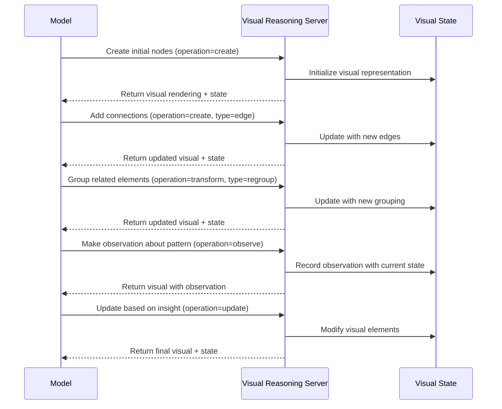

# mcp-sequentialthinking-tools

An adaptation of the
[MCP Sequential Thinking Server](https://github.com/modelcontextprotocol/servers/blob/main/src/sequentialthinking/index.ts)
designed to guide tool usage in problem-solving. This server helps
break down complex problems into manageable steps and provides
recommendations for which MCP tools would be most effective at each
stage.

<a href="https://glama.ai/mcp/servers/zl990kfusy">
  
</a>

A Model Context Protocol (MCP) server that combines sequential
thinking with intelligent tool suggestions. For each step in the
problem-solving process, it provides confidence-scored recommendations
for which tools to use, along with rationale for why each tool would
be appropriate.

## Features

- 🤔 Dynamic and reflective problem-solving through sequential
  thoughts
- 🔄 Flexible thinking process that adapts and evolves
- 🌳 Support for branching and revision of thoughts
- 🛠️ LLM-driven intelligent tool recommendations for each step
- 📊 Confidence scoring for tool suggestions
- 🔍 Detailed rationale for tool recommendations
- 📝 Step tracking with expected outcomes
- 🔄 Progress monitoring with previous and remaining steps
- 🎯 Alternative tool suggestions for each step
- 🧠 Memory management with configurable history limits
- 🗑️ Manual history cleanup capabilities

## How It Works

This server facilitates sequential thinking with MCP tool coordination. The LLM analyzes available tools and their descriptions to make intelligent recommendations, which are then tracked and organized by this server.

The workflow:

1. LLM provides available MCP tools to the sequential thinking server
2. LLM analyzes each thought step and recommends appropriate tools
3. Server tracks recommendations, maintains context, and manages memory
4. LLM executes recommended tools and continues the thinking process

Each recommendation includes:

- A confidence score (0-1) indicating how well the tool matches the need
- A clear rationale explaining why the tool would be helpful
- A priority level to suggest tool execution order
- Suggested input parameters for the tool
- Alternative tools that could also be used

The server works with any MCP tools available in your environment and automatically manages memory to prevent unbounded growth.

## Example Usage

Here's an example of how the server guides tool usage:

```json
{
    "thought": "Initial research step to understand what universal reactivity means in Svelte 5",
    "current_step": {
        "step_description": "Gather initial information about Svelte 5's universal reactivity",
        "expected_outcome": "Clear understanding of universal reactivity concept",
        "recommended_tools": [
            {
                "tool_name": "search_docs",
                "confidence": 0.9,
                "rationale": "Search Svelte documentation for official information",
                "priority": 1
            },
            {
                "tool_name": "tavily_search",
                "confidence": 0.8,
                "rationale": "Get additional context from reliable sources",
                "priority": 2
            }
        ],
        "next_step_conditions": ["Verify information accuracy", "Look for implementation details"]
    },
    "thought_number": 1,
    "total_thoughts": 5,
    "next_thought_needed": true
}
```

The server tracks your progress and supports:

- Creating branches to explore different approaches
- Revising previous thoughts with new information
- Maintaining context across multiple steps
- Suggesting next steps based on current findings

## Configuration

This server requires configuration through your MCP client. Here are
examples for different environments:

### Cline Configuration

Add this to your Cline MCP settings:

```json
{
    "mcpServers": {
        "mcp-sequentialthinking-tools": {
            "command": "npx",
            "args": ["-y", "mcp-sequentialthinking-tools"],
            "env": {
                "MAX_HISTORY_SIZE": "1000"
            }
        }
    }
}
```

### Claude Desktop with WSL Configuration

For WSL environments, add this to your Claude Desktop configuration:

```json
{
    "mcpServers": {
        "mcp-sequentialthinking-tools": {
            "command": "wsl.exe",
            "args": ["bash", "-c", "MAX_HISTORY_SIZE=1000 source ~/.nvm/nvm.sh && /home/username/.nvm/versions/node/v20.12.1/bin/npx mcp-sequentialthinking-tools"]
        }
    }
}
```

## API

The server implements a single MCP tool with configurable parameters:

### sequentialthinking_tools

A tool for dynamic and reflective problem-solving through thoughts,
with intelligent tool recommendations.

Parameters:

- `available_mcp_tools` (array, required): Array of MCP tool names available for use (e.g., ["mcp-omnisearch", "mcp-turso-cloud"])
- `thought` (string, required): Your current thinking step
- `next_thought_needed` (boolean, required): Whether another thought
  step is needed
- `thought_number` (integer, required): Current thought number
- `total_thoughts` (integer, required): Estimated total thoughts
  needed
- `is_revision` (boolean, optional): Whether this revises previous
  thinking
- `revises_thought` (integer, optional): Which thought is being
  reconsidered
- `branch_from_thought` (integer, optional): Branching point thought
  number
- `branch_id` (string, optional): Branch identifier
- `needs_more_thoughts` (boolean, optional): If more thoughts are
  needed
- `current_step` (object, optional): Current step recommendation with:
    - `step_description`: What needs to be done
    - `recommended_tools`: Array of tool recommendations with confidence
      scores
    - `expected_outcome`: What to expect from this step
    - `next_step_conditions`: Conditions for next step
- `previous_steps` (array, optional): Steps already recommended
- `remaining_steps` (array, optional): High-level descriptions of
  upcoming steps

## Memory Management

The server includes built-in memory management to prevent unbounded growth:

- **History Limit**: Configurable maximum number of thoughts to retain (default: 1000)
- **Automatic Trimming**: History automatically trims when limit is exceeded
- **Manual Cleanup**: Server provides methods to clear history when needed

### Configuring History Size

You can configure the history size by setting the `MAX_HISTORY_SIZE` environment variable:

```json
{
    "mcpServers": {
        "mcp-sequentialthinking-tools": {
            "command": "npx",
            "args": ["-y", "mcp-sequentialthinking-tools"],
            "env": {
                "MAX_HISTORY_SIZE": "500"
            }
        }
    }
}
```

Or for local development:

```bash
MAX_HISTORY_SIZE=2000 npx mcp-sequentialthinking-tools
```

## Development

### Setup

1. Clone the repository
2. Install dependencies:

```bash
pnpm install
```

3. Build the project:

```bash
pnpm build
```

4. Run in development mode:

```bash
pnpm dev
```

### Publishing

The project uses changesets for version management. To publish:

1. Create a changeset:

```bash
pnpm changeset
```

2. Version the package:

```bash
pnpm changeset version
```

3. Publish to npm:

```bash
pnpm release
```

## Contributing

Contributions are welcome! Please feel free to submit a Pull Request.

## License

MIT License - see the [LICENSE](LICENSE) file for details.

## Acknowledgments

- Built on the
  [Model Context Protocol](https://github.com/modelcontextprotocol)
- Adapted from the
  [MCP Sequential Thinking Server](https://github.com/modelcontextprotocol/servers/blob/main/src/sequentialthinking/index.ts)

# Clear Thought 1.5 MCP Server

[](https://smithery.ai/server/@waldzellai/clear-thought-onepointfive)

A Model Context Protocol (MCP) server that provides a unified reasoning tool with multiple operations, including systematic thinking, mental models, debugging approaches, and interactive notebook capabilities for enhanced problem-solving. This server exposes a single `clear_thought` tool with a comprehensive suite of operations to facilitate complex reasoning tasks, plus interactive Srcbook notebook resources.

## 🚀 New: Modular Architecture

The codebase has been completely refactored from a monolithic 2867-line file into a clean, modular architecture with 38 separate operations organized by category. Each operation is now self-contained, making the codebase more maintainable, testable, and extensible.

## Operations

The `clear_thought` tool provides the following operations. For detailed information on parameters, please refer to the operations guide resource at `guide://clear-thought-operations`.

### Core Thinking Operations

- **sequential_thinking**: Executes a chain-of-thought process. Can be configured to use different reasoning patterns like 'tree', 'beam', 'mcts', 'graph', or 'auto'.
- **mental_model**: Applies a specified mental model to a problem.
- **debugging_approach**: Guides through a structured debugging process.
- **creative_thinking**: Facilitates idea generation and exploration.
- **visual_reasoning**: Works with diagrams and visual structures.
- **metacognitive_monitoring**: Monitors and assesses the reasoning process itself.
- **scientific_method**: Follows the steps of the scientific method for inquiry.

### Collaborative & Decision Operations

- **collaborative_reasoning**: Simulates a multi-persona discussion to explore a topic from different viewpoints.
- **decision_framework**: Uses a structured framework to analyze options and make decisions.
- **socratic_method**: Employs a question-driven approach to challenge and refine arguments.
- **structured_argumentation**: Constructs and analyzes formal arguments.

### Systems & Analysis Operations

- **systems_thinking**: Models a problem as a system with interconnected components.
- **research**: Generates placeholders for research findings and citations.
- **analogical_reasoning**: Draws parallels and maps insights between different domains.
- **causal_analysis**: Investigates cause-and-effect relationships.
- **statistical_reasoning**: Performs statistical analysis (summary, bayes, hypothesis_test, monte_carlo modes).
- **simulation**: Runs simple simulations.
- **optimization**: Finds the best solution from a set of alternatives.
- **ethical_analysis**: Evaluates a situation using an ethical framework.

### Advanced Operations

- **visual_dashboard**: Creates a skeleton for a visual dashboard.
- **custom_framework**: Allows defining a custom reasoning framework.
- **code_execution**: Executes code in a restricted environment (currently Python only).
- **tree_of_thought, beam_search, mcts, graph_of_thought**: Aliases for `sequential_thinking` with a fixed reasoning pattern.
- **orchestration_suggest**: Suggests a sequence of tools to use for a complex task.

### Session Management

- **session_info**: Get information about the current reasoning session.
- **session_export**: Export session data for persistence.
- **session_import**: Import session data to restore state.

### Metagame Operations

- **ooda_loop**: Implements the OODA (Observe, Orient, Decide, Act) loop methodology.
- **ulysses_protocol**: High-stakes debugging and problem-solving framework.

### Notebook Operations

- **notebook_create**: Create a new interactive Srcbook notebook.
- **notebook_add_cell**: Add cells to an existing notebook.
- **notebook_run_cell**: Execute cells in a notebook.
- **notebook_export**: Export notebook content.

## Choosing an Operation

With a wide range of operations available, it's helpful to have a guide for selecting the best one for your task.

- For **general problem-solving** and step-by-step reasoning, start with `sequential_thinking`.
- To **analyze a problem from a specific viewpoint**, use `mental_model`.
- When **troubleshooting issues**, `debugging_approach` provides a structured workflow.
- To **generate new ideas**, use `creative_thinking`.
- For **complex decisions**, `decision_framework` can help you weigh your options.
- To **simulate a discussion** with multiple perspectives, use `collaborative_reasoning`.
- For **high-stakes debugging**, use `ulysses_protocol` with systematic phases and gates.
- For **rapid decision-making**, use `ooda_loop` for iterative observe-orient-decide-act cycles.
- For **interactive learning**, use notebook operations with Srcbook resources.
- If you're not sure where to start, `orchestration_suggest` can recommend a sequence of operations.

For a complete list of operations and their parameters, refer to the operations guide available as a resource at `guide://clear-thought-operations`.

## Installation

### Installing via Smithery

To install Clear Thought MCP Server for Claude Desktop automatically via [Smithery](https://smithery.ai/server/@waldzellai/clear-thought-onepointfive):

```bash
npx -y @smithery/cli install @waldzellai/clear-thought-onepointfive --client claude
```

### Manual Installation

```bash
npm install @waldzellai/clear-thought-onepointfive
```

Or run with npx:

```bash
npx @waldzellai/clear-thought-onepointfive
```

### Development Setup

```bash
git clone <repository-url>
cd clearthought-onepointfive
npm install
npx @smithery/cli dev
```

## Usage

All operations are accessed through the `clear_thought` tool. You specify the desired operation using the `operation` parameter.

### Example: Sequential Thinking

```typescript
const response = await mcp.callTool("clear_thought", {
    operation: "sequential_thinking",
    prompt: "How to implement a new feature?",
    parameters: {
        pattern: "chain",
    },
})
```

### Example: Mental Model

```typescript
const response = await mcp.callTool("clear_thought", {
    operation: "mental_model",
    prompt: "Analyze the trade-offs of using a microservices architecture.",
    parameters: {
        model: "first_principles",
    },
})
```

### Example: Ulysses Protocol (High-Stakes Debugging)

```typescript
const response = await mcp.callTool("clear_thought", {
    operation: "ulysses_protocol",
    prompt: "Fix critical authentication failure in production system",
    parameters: {
        stakes: "critical",
        budget: "4 hours",
    },
})
```

### Example: Notebook Operations

```typescript
// Create a new notebook
const createResponse = await mcp.callTool("clear_thought", {
    operation: "notebook_create",
    prompt: "Create a notebook for learning TypeScript",
    parameters: {
        name: "typescript-learning",
    },
})

// Add a cell to the notebook
const addCellResponse = await mcp.callTool("clear_thought", {
    operation: "notebook_add_cell",
    prompt: "Add a code cell demonstrating TypeScript interfaces",
    parameters: {
        notebookId: "typescript-learning",
        cellType: "code",
        content: "interface User { name: string; age: number; }",
    },
})
```

### Example: Statistical Reasoning

```typescript
const response = await mcp.callTool("clear_thought", {
    operation: "statistical_reasoning",
    prompt: "Analyze the performance data of our API endpoints",
    parameters: {
        mode: "summary",
        data: [
            /* your data here */
        ],
    },
})
```

## Resources

The server provides several resources for enhanced functionality:

### Operations Guide

- **URI**: `guide://clear-thought-operations`
- **Description**: Complete documentation for all operations and their parameters
- **MIME Type**: `text/markdown`

### Interactive Notebooks

- **URI Template**: `notebook:///{name}`
- **Description**: Access Srcbook notebooks for interactive TypeScript/JavaScript execution
- **MIME Type**: `text/markdown`

### Notebook Interaction Guide

- **URI**: `guide://notebook-interaction`
- **Description**: Instructions for working with Srcbook notebooks in MCP
- **MIME Type**: `text/markdown`

## Docker

Build the Docker image:

```bash
docker build -t waldzellai/clear-thought-onepointfive .
```

Run the container:

```bash
docker run -it waldzellai/clear-thought-onepointfive
```

## Development

1. Clone the repository
2. Install dependencies: `npm install`
3. Dev server (single entry via CLI): `npx @smithery/cli dev`
4. Build for deployment: `npx @smithery/cli build`

### Available Scripts

- `npm run build:stdio` - Build STDIO server
- `npm run build:http` - Build HTTP server
- `npm run build` - Build both servers
- `npm run dev` - Start development server
- `npm run typecheck` - TypeScript type checking
- `npm run check` - Biome linting and formatting
- `npm run test` - Run tests with Vitest

### Architecture

The codebase follows a modular architecture:

```
src/tools/
├── operations/           # All operations organized by category
│   ├── core/            # Core thinking operations (7)
│   ├── session/         # Session management (3)
│   ├── collaborative/   # Collaborative reasoning (5)
│   ├── analysis/        # Analysis operations (7)
│   ├── patterns/        # Reasoning patterns (5)
│   ├── ui/              # UI operations (2)
│   ├── notebook/        # Notebook operations (4)
│   ├── metagame/        # Advanced frameworks (2)
│   └── special/         # Special operations (3)
├── helpers/             # Helper utilities
│   └── ui-generation.ts # UI generation helpers
└── index.ts             # Main orchestrator
```

Each operation:

- Extends `BaseOperation` class
- Implements the `Operation` interface
- Is self-contained (~100-150 lines)
- Auto-registers on import
- Has consistent error handling

## Contributing

Contributions are welcome! Please feel free to submit a Pull Request.

## License

MIT License - see LICENSE for details.

## Key Features

### 🧠 **Unified Reasoning Tool**

Single `clear_thought` tool with 30+ operations covering all aspects of systematic thinking and problem-solving.

### 📓 **Interactive Notebooks**

Srcbook notebook integration for interactive TypeScript/JavaScript execution and learning.

### 🎯 **Metagame Operations**

Advanced frameworks like Ulysses Protocol and OODA Loop for high-stakes problem-solving.

### 📊 **Statistical Analysis**

Multiple statistical reasoning modes including Bayesian analysis, hypothesis testing, and Monte Carlo simulation.

### 🔄 **Session Management**

Persistent session state with export/import capabilities for long-running reasoning tasks.

### 🛡️ **Code Execution**

Secure Python code execution in restricted environments.

## Acknowledgments

- Based on the Model Context Protocol (MCP) by Anthropic, and uses the code for the sequentialthinking server
- Mental Models framework inspired by [James Clear's comprehensive guide to mental models](https://jamesclear.com/mental-models), which provides an excellent overview of how these thinking tools can enhance decision-making and problem-solving capabilities
- Ulysses Protocol inspired by systematic debugging and problem-solving methodologies
- OODA Loop implementation based on John Boyd's military strategy framework

# Stochastic Thinking MCP Server

[](https://smithery.ai/server/@waldzellai/stochasticthinking)

## Why Stochastic Thinking Matters

When AI assistants make decisions - whether writing code, solving problems, or suggesting improvements - they often fall into patterns of "local thinking", similar to how we might get stuck trying the same approach repeatedly despite poor results. This is like being trapped in a valley when there's a better solution on the next mountain over, but you can't see it from where you are.

This server introduces advanced decision-making strategies that help break out of these local patterns:

- Instead of just looking at the immediate next step (like basic Markov chains do), these algorithms can look multiple steps ahead and consider many possible futures
- Rather than always picking the most obvious solution, they can strategically explore alternative approaches that might initially seem suboptimal
- When faced with uncertainty, they can balance the need to exploit known good solutions with the potential benefit of exploring new ones

Think of it as giving your AI assistant a broader perspective - instead of just choosing the next best immediate action, it can now consider "What if I tried something completely different?" or "What might happen several steps down this path?"

A Model Context Protocol (MCP) server that provides stochastic algorithms and probabilistic decision-making capabilities, extending the sequential thinking server with advanced mathematical models.

## Features

### Stochastic Algorithms

#### Markov Decision Processes (MDPs)

- Optimize policies over long sequences of decisions
- Incorporate rewards and actions
- Support for Q-learning and policy gradients
- Configurable discount factors and state spaces

#### Monte Carlo Tree Search (MCTS)

- Simulate future action sequences
- Balance exploration and exploitation
- Configurable simulation depth and exploration constants
- Ideal for large decision spaces

#### Multi-Armed Bandit Models

- Balance exploration vs exploitation
- Support multiple strategies:
    - Epsilon-greedy
    - UCB (Upper Confidence Bound)
    - Thompson Sampling
- Dynamic reward tracking

#### Bayesian Optimization

- Optimize decisions with uncertainty
- Probabilistic inference models
- Configurable acquisition functions
- Continuous parameter optimization

#### Hidden Markov Models (HMMs)

- Infer latent states
- Forward-backward algorithm
- State sequence prediction
- Emission probability modeling

## Usage

### Installation

#### Installing via Smithery

To install Stochastic Thinking MCP Server for Claude Desktop automatically via [Smithery](https://smithery.ai/server/@waldzellai/stochasticthinking):

```bash
npx -y @smithery/cli install @waldzellai/stochasticthinking --client claude
```

#### Manual Installation

```bash
npm install @waldzellai/stochasticthinking
```

Or run with npx:

```bash
npx @waldzellai/stochasticthinking
```

### API Examples

#### Markov Decision Process

```typescript
const response = await mcp.callTool("stochasticalgorithm", {
    algorithm: "mdp",
    problem: "Optimize robot navigation policy",
    parameters: {
        states: 100,
        actions: ["up", "down", "left", "right"],
        gamma: 0.9,
        learningRate: 0.1,
    },
})
```

#### Monte Carlo Tree Search

```typescript
const response = await mcp.callTool("stochasticalgorithm", {
    algorithm: "mcts",
    problem: "Find optimal game moves",
    parameters: {
        simulations: 1000,
        explorationConstant: 1.4,
        maxDepth: 10,
    },
})
```

#### Multi-Armed Bandit

```typescript
const response = await mcp.callTool("stochasticalgorithm", {
    algorithm: "bandit",
    problem: "Optimize ad placement",
    parameters: {
        arms: 5,
        strategy: "epsilon-greedy",
        epsilon: 0.1,
    },
})
```

#### Bayesian Optimization

```typescript
const response = await mcp.callTool("stochasticalgorithm", {
    algorithm: "bayesian",
    problem: "Hyperparameter optimization",
    parameters: {
        acquisitionFunction: "expected_improvement",
        kernel: "rbf",
        iterations: 50,
    },
})
```

#### Hidden Markov Model

```typescript
const response = await mcp.callTool("stochasticalgorithm", {
    algorithm: "hmm",
    problem: "Infer weather patterns",
    parameters: {
        states: 3,
        algorithm: "forward-backward",
        observations: 100,
    },
})
```

## Algorithm Selection Guide

Choose the appropriate algorithm based on your problem characteristics:

### Markov Decision Processes (MDPs)

Best for:

- Sequential decision-making problems
- Problems with clear state transitions
- Scenarios with defined rewards
- Long-term optimization needs

### Monte Carlo Tree Search (MCTS)

Best for:

- Game playing and strategic planning
- Large decision spaces
- When simulation is possible
- Real-time decision making

### Multi-Armed Bandit

Best for:

- A/B testing
- Resource allocation
- Online advertising
- Quick adaptation needs

### Bayesian Optimization

Best for:

- Hyperparameter tuning
- Expensive function optimization
- Continuous parameter spaces
- When uncertainty matters

### Hidden Markov Models (HMMs)

Best for:

- Time series analysis
- Pattern recognition
- State inference
- Sequential data modeling

## Development

1. Clone the repository
2. Install dependencies: `npm install`
3. Build the project: `npm run build`
4. Start the server: `npm start`

## Contributing

Contributions are welcome! Please feel free to submit a Pull Request.

## License

MIT License - see LICENSE for details.

## Acknowledgments

- Based on the Model Context Protocol (MCP) by Anthropic
- Extends the sequential thinking server with stochastic capabilities
- Inspired by classic works in reinforcement learning and decision theory

# Visual Reasoning MCP Server

## Motivation

Language models fundamentally operate on text, which limits their ability to reason through problems that humans typically solve using spatial, diagrammatic, or visual thinking. Current models struggle with:

1. Maintaining and manipulating complex spatial relationships
2. Visualizing multi-step transformations or processes
3. Creating and updating visual representations of abstract concepts
4. Reasoning about systems with many interconnected components
5. Identifying patterns that are obvious in visual form but obscure in text

The Visual Reasoning Server provides models with the ability to create, manipulate, and reason with explicit visual representations. By externalizing visual thinking, models can solve complex problems that benefit from diagrammatic reasoning, much like how mathematical notation extends human calculation abilities beyond plain text.

## Technical Specification

### Tool Interface

```typescript
interface VisualElement {
    id: string
    type: "node" | "edge" | "container" | "annotation"
    label?: string
    properties: {
        [key: string]: any // Position, size, color, etc.
    }
    // For edges
    source?: string // ID of source element
    target?: string // ID of target element
    // For containers
    contains?: string[] // IDs of contained elements
}

interface VisualOperationData {
    // Operation details
    operation: "create" | "update" | "delete" | "transform" | "observe"
    elements?: VisualElement[]
    transformationType?: "rotate" | "move" | "resize" | "recolor" | "regroup"

    // Visual diagram metadata
    diagramId: string
    diagramType: "graph" | "flowchart" | "stateDiagram" | "conceptMap" | "treeDiagram" | "custom"
    iteration: number

    // Reasoning about the diagram
    observation?: string
    insight?: string
    hypothesis?: string

    // Next steps
    nextOperationNeeded: boolean
}
```

### Process Flow



## Key Features

### 1. Multi-Modal Representation System

The server supports different visual representation types:

- **Graphs**: For relationship networks and connection patterns
- **Flowcharts**: For processes and sequential operations
- **State Diagrams**: For system states and transitions
- **Concept Maps**: For knowledge organization and relationships
- **Tree Diagrams**: For hierarchical structures

### 2. Abstract Visual Element Manipulation

Models can manipulate visual elements through operations:

- **Create**: Add new elements to the visual space
- **Update**: Modify existing elements
- **Delete**: Remove elements
- **Transform**: Apply operations to multiple elements (regrouping, restructuring)
- **Observe**: Make and record observations about visual patterns

### 3. Iterative Refinement

The server tracks iteration history, allowing models to:

- See how their visual representation evolved
- Revert to previous states if needed
- Compare different visualization approaches

### 4. Visual-Verbal Integration

The server enables bidirectional translation between:

- Verbal descriptions and visual representations
- Visual patterns and verbal insights
- Diagrammatic reasoning and textual conclusions

### 5. Visual Output

The server provides multiple representations:

- ASCII art for terminal-based visualization
- SVG or DOT format for more complex diagrams
- Textual descriptions of the visual state for accessibility

## Usage Examples

### System Architecture Design

Models can create and manipulate component diagrams showing data flow, dependencies, and interactions between system components.

### Algorithm Visualization

When designing or explaining algorithms, models can create flowcharts, state diagrams, or visual traces of execution.

### Concept Mapping

For organizing complex domains of knowledge, models can create and refine concept maps showing relationships between ideas.

### Pattern Recognition

When analyzing data, models can create visual representations to identify patterns that might be difficult to detect in text.

## Implementation

The server is implemented using TypeScript with:

- A core VisualReasoningServer class
- A flexible visual element representation system
- Multiple rendering backends (ASCII, SVG, DOT)
- State history tracking for iterative refinement
- Standard MCP server connection via stdin/stdout

The implementation leverages existing graph visualization libraries (like Graphviz for DOT output or custom ASCII art generation) to provide rich visual feedback within the constraints of text-based interfaces.

This server significantly enhances model capabilities for domains where visual or spatial thinking provides a natural advantage over purely textual reasoning.

## Tool

### visualReasoning

Facilitates visual thinking through creating and manipulating diagram elements.

## Configuration

### Usage with Claude Desktop

Add this to your `claude_desktop_config.json`:

#### npx

```json
{
    "mcpServers": {
        "visual-reasoning": {
            "command": "npx",
            "args": ["-y", "@cognitive-enhancement-mcp/visual-reasoning"]
        }
    }
}
```

#### docker

```json
{
    "mcpServers": {
        "visual-reasoning": {
            "command": "docker",
            "args": ["run", "--rm", "-i", "cognitive-enhancement-mcp/visual-reasoning"]
        }
    }
}
```

## Building

Docker:

```bash
docker build -t cognitive-enhancement-mcp/visual-reasoning -f packages/visual-reasoning/Dockerfile .
```

## License

This MCP server is licensed under the MIT License.
