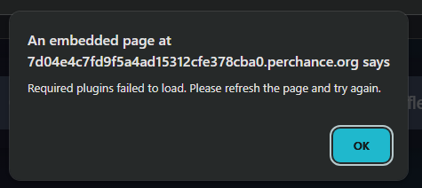

An error has occurred near line number 8: It appears that you've got a mismatch in your opening and closing curly brackets. For each opening curly bracket, there should be a closing one. If you'd like to use a literal curly bracket (i.e. you want to actually display one, rather than using them to do {import:noun} and stuff like that, then you need to put a "backslash" before it like "\{ ... \}". Here's the text that seems to be causing the error:
{
An error has occurred near line number 12: It appears that you've got a mismatch in your opening and closing curly brackets. For each opening curly bracket, there should be a closing one. If you'd like to use a literal curly bracket (i.e. you want to actually display one, rather than using them to do {import:noun} and stuff like that, then you need to put a "backslash" before it like "\{ ... \}". Here's the text that seems to be causing the error:
{
An error has occurred near line number 8: There's a problem with the 'rpglitch' generator. You've created a top-level list called "(async ()", which is not allowed. Unfortunately top-level list names are subject to some strict rules:
They must not contain any spaces
They must only contain letters (lower or upper case), numbers and underscores ("_")
They must not begin with a number
They must not be any of the following special "reserved" names: update, do, if, in, for, let, new, try, var, case, else, enum, eval, null, this, true, void, with, await, break, catch, class, const, false, super, throw, while, yield, delete, export, import, public, return, static, switch, typeof, default, extends, finally, package, private, continue, debugger, function, arguments, interface, protected, implements, instanceof
Sorry for the inconvenience! These rules may seem strange, but they're needed to make the more advanced features of the perchance engine work.
An error has occurred near line number 23: There's a problem with the 'rpglitch' generator. You've created a top-level list called "})();", which is not allowed. Unfortunately top-level list names are subject to some strict rules:
They must not contain any spaces
They must only contain letters (lower or upper case), numbers and underscores ("_")
They must not begin with a number
They must not be any of the following special "reserved" names: update, do, if, in, for, let, new, try, var, case, else, enum, eval, null, this, true, void, with, await, break, catch, class, const, false, super, throw, while, yield, delete, export, import, public, return, static, switch, typeof, default, extends, finally, package, private, continue, debugger, function, arguments, interface, protected, implements, instanceof
Sorry for the inconvenience! These rules may seem strange, but they're needed to make the more advanced features of the perchance engine work.

---

VM2215:3 let a of arr supported
rpglitch#storyboard:2984 Unrecognized feature: 'ambient-light-sensor'.
rpglitch#storyboard:2984 Unrecognized feature: 'speaker-selection'.
rpglitch#storyboard:2984 Allow attribute will take precedence over 'allowfullscreen'.
rpglitch:1336 transferSize (likely partial): 300
rpglitch:7970  GET https://static.cloudflareinsights.com/beacon.min.js/vcd15cbe7772f49c399c6a5babf22c1241717689176015 net::ERR_BLOCKED_BY_CLIENT
[DOM] Password field is not contained in a form: (More info: <URL>) 
[DOM] Password field is not contained in a form: (More info: <URL>) 
[DOM] Password field is not contained in a form: (More info: <URL>) 
[DOM] Password field is not contained in a form: (More info: <URL>) 
[DOM] Password field is not contained in a form: (More info: <URL>) 
[DOM] Password field is not contained in a form: (More info: <URL>) 
[DOM] Password field is not contained in a form: (More info: <URL>) 
VM2215:2 async/await is supported
chext_driver.js:539 Initialized driver at: Sat Nov 01 2025 19:32:02 GMT+0100 (Central European Standard Time)
rpglitch?__generatorLastEditTime=1762021919384:524 {toString: ƒ}
content_script.js:1 [Violation] 'setTimeout' handler took 56ms
rpglitch?__generatorLastEditTime=1762021919384:6221 Embed transfer size: /rpglitch 300
rpglitch?__generatorLastEditTime=1762021919384:6413  GET https://static.cloudflareinsights.com/beacon.min.js/vcd15cbe7772f49c399c6a5babf22c1241717689176015 net::ERR_BLOCKED_BY_CLIENT
rpglitch?__generatorLastEditTime=1762021919384:2845 upload-plugin init: 4ms
rpglitch?__generatorLastEditTime=1762021919384:2845 text-to-image-plugin init: 7ms
rpglitch?__generatorLastEditTime=1762021919384:2845 super-fetch-plugin init: 1ms
rpglitch?__generatorLastEditTime=1762021919384:2845 remember-plugin init: 2ms
rpglitch?__generatorLastEditTime=1762021919384:2845 ai-text-plugin init: 7ms
rpglitch?__generatorLastEditTime=1762021919384:2845 rpglitch init: 4ms
VM2234:3 [RPGlitch] Waiting for plugins (attempt 1/4): (5) ['ai', 'textToImage', 'superFetch', 'rememberPlugin', 'upload']
rpglitch?__generatorLastEditTime=1762021919384:4519 dummyOnloadRan
chext_loader.js:73 Initialized chextloader at: 1762021923102
chext_loader.js:73 Initialized chextloader at: 1762021923285
rpglitch:1241 [Violation] Added non-passive event listener to a scroll-blocking 'touchstart' event. Consider marking event handler as 'passive' to make the page more responsive. See https://www.chromestatus.com/feature/5745543795965952
(anonymous) @ rpglitch:1241
(anonymous) @ rpglitch:1241
init @ rpglitch:4080
goToEditMode @ rpglitch:6180
onclick @ VM2307 rpglitch:1
rpglitch:1241 [Violation] Added non-passive event listener to a scroll-blocking 'touchstart' event. Consider marking event handler as 'passive' to make the page more responsive. See https://www.chromestatus.com/feature/5745543795965952
(anonymous) @ rpglitch:1241
(anonymous) @ rpglitch:1241
init @ rpglitch:4102
goToEditMode @ rpglitch:6180
onclick @ VM2307 rpglitch:1
rpglitch:1241 [Violation] Added non-passive event listener to a scroll-blocking 'touchstart' event. Consider marking event handler as 'passive' to make the page more responsive. See https://www.chromestatus.com/feature/5745543795965952
(anonymous) @ rpglitch:1241
(anonymous) @ rpglitch:1241
init @ rpglitch:4124
goToEditMode @ rpglitch:6180
onclick @ VM2307 rpglitch:1
editors.bundle.min.js?v=75:1 htmlLanguageExtension: LanguageSupport {language: LRLanguage, support: Array(4), extension: Array(2)}
[Violation] 'requestIdleCallback' handler took 67ms
[Violation] 'requestIdleCallback' handler took 53ms
VM2234:3 [RPGlitch] Plugins not available, retrying (1/3)...
Xe @ VM2234:3
await in Xe
Ze @ VM2234:3
e @ VM2234:3
setTimeout
(anonymous) @ VM2234:3
(anonymous) @ VM2234:3
(anonymous) @ VM2232:9
PERCH.executeScriptTag @ rpglitch?__generatorLastEditTime=1762021919384:4787
PERCH.executeScriptTags @ rpglitch?__generatorLastEditTime=1762021919384:4619
PERCH.updateOutput @ rpglitch?__generatorLastEditTime=1762021919384:4522
PERCH.updateOutputMessageHandler @ rpglitch?__generatorLastEditTime=1762021919384:5281
(anonymous) @ rpglitch?__generatorLastEditTime=1762021919384:5497
VM2234:3 [RPGlitch] Waiting for plugins (attempt 2/4): (5) ['ai', 'textToImage', 'superFetch', 'rememberPlugin', 'upload']
editors.bundle.min.js?v=75:1 Getting next model text node for bug finding...
editors.bundle.min.js?v=75:1 Getting next output template node for bug finding...
editors.bundle.min.js?v=75:1 Bug Finding (modelText): {node: {…}, timeTaken: 134.80000001192093}
editors.bundle.min.js?v=75:1 Added 0 bugs for node (from cache): {node: {…}, bugs: Array(0)}
editors.bundle.min.js?v=75:1 Getting next model text node for bug finding...
  console.log('ai:', typeof globalThis.ai);
  console.log('textToImage:', typeof globalThis.textToImage);
  console.log('superFetch:', typeof globalThis.superFetch);
VM2321:1 ai: undefined
VM2321:2 textToImage: undefined
VM2321:3 superFetch: undefined
undefined
VM2234:3 [RPGlitch] Plugins not available, retrying (2/3)...
Xe @ VM2234:3
await in Xe
Xe @ VM2234:3
await in Xe
Ze @ VM2234:3
e @ VM2234:3
setTimeout
(anonymous) @ VM2234:3
(anonymous) @ VM2234:3
(anonymous) @ VM2232:9
PERCH.executeScriptTag @ rpglitch?__generatorLastEditTime=1762021919384:4787
PERCH.executeScriptTags @ rpglitch?__generatorLastEditTime=1762021919384:4619
PERCH.updateOutput @ rpglitch?__generatorLastEditTime=1762021919384:4522
PERCH.updateOutputMessageHandler @ rpglitch?__generatorLastEditTime=1762021919384:5281
(anonymous) @ rpglitch?__generatorLastEditTime=1762021919384:5497
VM2234:3 [RPGlitch] Waiting for plugins (attempt 3/4): (5) ['ai', 'textToImage', 'superFetch', 'rememberPlugin', 'upload']
VM2234:3 [RPGlitch] Plugins not available, retrying (3/3)...
Xe @ VM2234:3
await in Xe
Xe @ VM2234:3
await in Xe
Xe @ VM2234:3
await in Xe
Ze @ VM2234:3
e @ VM2234:3
setTimeout
(anonymous) @ VM2234:3
(anonymous) @ VM2234:3
(anonymous) @ VM2232:9
PERCH.executeScriptTag @ rpglitch?__generatorLastEditTime=1762021919384:4787
PERCH.executeScriptTags @ rpglitch?__generatorLastEditTime=1762021919384:4619
PERCH.updateOutput @ rpglitch?__generatorLastEditTime=1762021919384:4522
PERCH.updateOutputMessageHandler @ rpglitch?__generatorLastEditTime=1762021919384:5281
(anonymous) @ rpglitch?__generatorLastEditTime=1762021919384:5497
VM2234:3 [RPGlitch] Waiting for plugins (attempt 4/4): (5) ['ai', 'textToImage', 'superFetch', 'rememberPlugin', 'upload']
VM2234:3 [RPGlitch] Plugin timeout after 10180ms. Available: none | Missing: ai, textToImage, superFetch, rememberPlugin, upload
Xe @ VM2234:3
await in Xe
Xe @ VM2234:3
await in Xe
Xe @ VM2234:3
await in Xe
Xe @ VM2234:3
await in Xe
Ze @ VM2234:3
e @ VM2234:3
setTimeout
(anonymous) @ VM2234:3
(anonymous) @ VM2234:3
(anonymous) @ VM2232:9
PERCH.executeScriptTag @ rpglitch?__generatorLastEditTime=1762021919384:4787
PERCH.executeScriptTags @ rpglitch?__generatorLastEditTime=1762021919384:4619
PERCH.updateOutput @ rpglitch?__generatorLastEditTime=1762021919384:4522
PERCH.updateOutputMessageHandler @ rpglitch?__generatorLastEditTime=1762021919384:5281
(anonymous) @ rpglitch?__generatorLastEditTime=1762021919384:5497
VM2234:3 [RPGlitch] Required plugins failed to load. Application may not function correctly.
Ze @ VM2234:3
await in Ze
e @ VM2234:3
setTimeout
(anonymous) @ VM2234:3
(anonymous) @ VM2234:3
(anonymous) @ VM2232:9
PERCH.executeScriptTag @ rpglitch?__generatorLastEditTime=1762021919384:4787
PERCH.executeScriptTags @ rpglitch?__generatorLastEditTime=1762021919384:4619
PERCH.updateOutput @ rpglitch?__generatorLastEditTime=1762021919384:4522
PERCH.updateOutputMessageHandler @ rpglitch?__generatorLastEditTime=1762021919384:5281
(anonymous) @ rpglitch?__generatorLastEditTime=1762021919384:5497
VM2234:3 [RPGlitch] Database initialized.
VM2234:1 [RPGlitch] ui.watchdog: blocked {reason: 'pointer-events-none', node: 'div#chin-container.container'}
VM2234:1 [RPGlitch] ui.watchdog: armed
VM2234:3 [RPGlitch] initializeWhenReady success
VM2234:1 [RPGlitch] ui.watchdog: still blocked {reason: 'pointer-events-none', node: 'div#chin-container.container'}
VM2234:1 [RPGlitch] ui.watchdog: still blocked {reason: 'pointer-events-none', node: 'div#chin-container.container'}
VM2234:1 [RPGlitch] ui.watchdog: still blocked {reason: 'pointer-events-none', node: 'div#chin-container.container'}
VM2234:1 [RPGlitch] ui.watchdog: still blocked {reason: 'pointer-events-none', node: 'div#chin-container.container'}
VM2234:1 [RPGlitch] ui.watchdog: still blocked {reason: 'pointer-events-none', node: 'div#chin-container.container'}
VM2234:1 [RPGlitch] ui.watchdog: still blocked {reason: 'pointer-events-none', node: 'div#chin-container.container'}
VM2234:1 [RPGlitch] ui.watchdog: still blocked {reason: 'pointer-events-none', node: 'div#chin-container.container'}
VM2234:1 [RPGlitch] ui.watchdog: still blocked {reason: 'pointer-events-none', node: 'div#chin-container.container'}
VM2234:1 [RPGlitch] ui.watchdog: still blocked {reason: 'pointer-events-none', node: 'div#chin-container.container'}
VM2234:1 [RPGlitch] ui.watchdog: still blocked {reason: 'pointer-events-none', node: 'div#chin-container.container'}
VM2234:1 [RPGlitch] ui.watchdog: still blocked {reason: 'pointer-events-none', node: 'div#chin-container.container'}
VM2234:1 [RPGlitch] ui.watchdog: still blocked {reason: 'pointer-events-none', node: 'div#chin-container.container'}
VM2234:1 [RPGlitch] ui.watchdog: still blocked {reason: 'pointer-events-none', node: 'div#chin-container.container'}
VM2234:1 [RPGlitch] ui.watchdog: still blocked {reason: 'pointer-events-none', node: 'div#chin-container.container'}
  console.log('ai:', typeof globalThis.ai);
  console.log('textToImage:', typeof globalThis.textToImage);
  console.log('superFetch:', typeof globalThis.superFetch);
VM2325:1 ai: undefined
VM2325:2 textToImage: undefined
VM2325:3 superFetch: undefined
undefined
VM2234:1 [RPGlitch] ui.watchdog: still blocked {reason: 'pointer-events-none', node: 'div#chin-container.container'}

---

